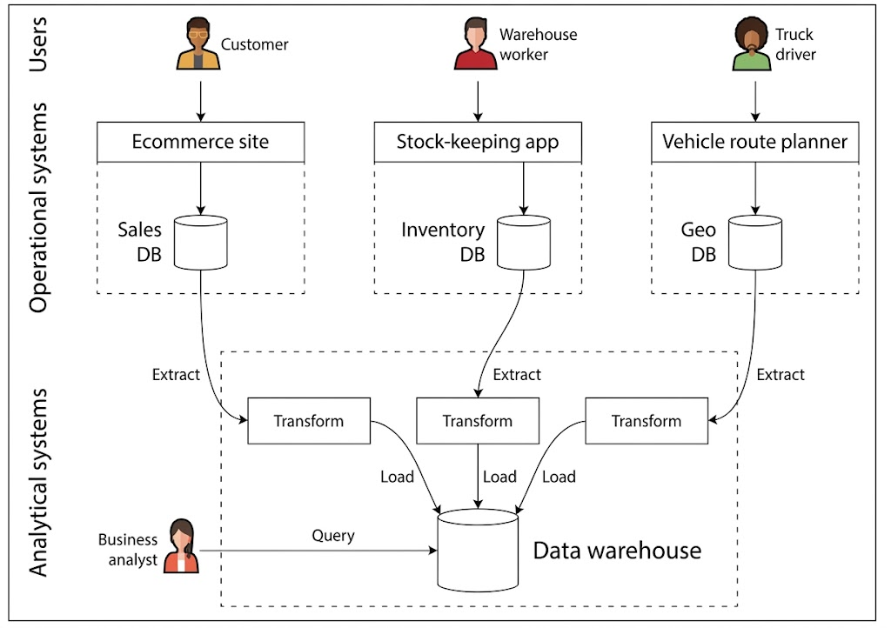
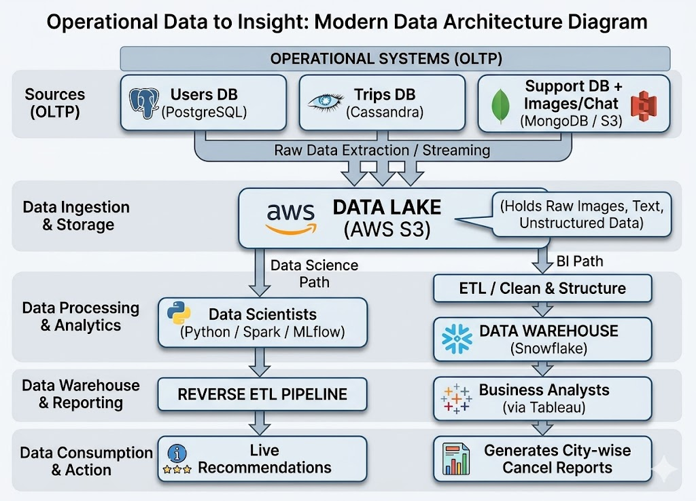
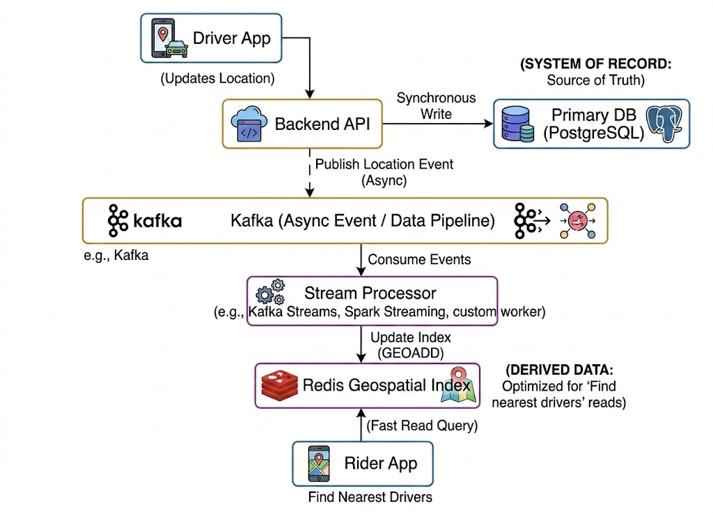
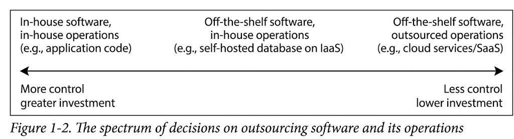
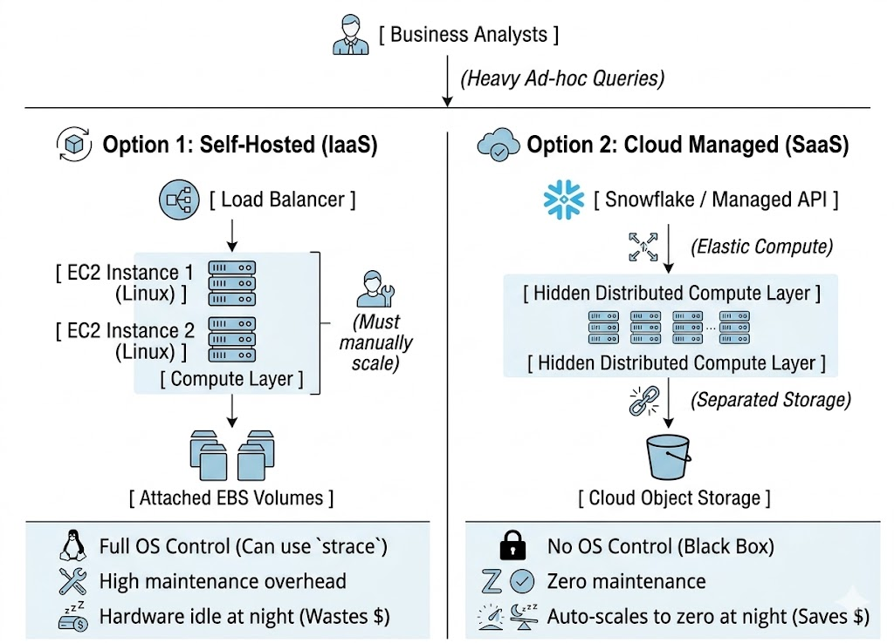
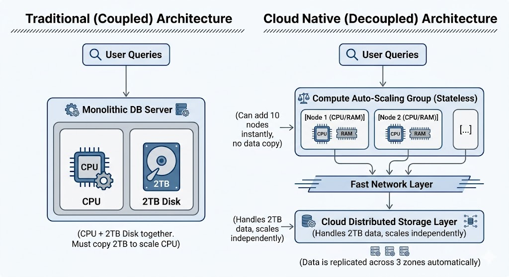

# Trade-offs in Data Systems Architecture

## **System Architecture Mein Trade-Offs Ki Haqeeqat**

System design ki duniya mein ek universal sach hai: **"Koi perfect solution nahi hota, sirf trade-offs hote hain."** Iska seedha matlab yeh hai ke aap kabhi aisa system nahi bana sakte jo har cheez mein 100% perfect ho. Agar aap read speed fast karenge, toh shayad write speed slow ho jaye. Agar aap data consistency (accuracy) barhayenge, toh system ki availability (uptime) par asar parh sakta hai. Ek architect ka kaam best possible compromise (trade-off) talash karna hai jo us specific application ki zaroorat ko poora kar sake.

Aaj ke daur mein web apps, SaaS (Software as a Service), aur cloud computing ki wajah se almost har system ek shared infrastructure par chalta hai, jahan hazaron users, devices aur sensors continuously data read aur write kar rahe hote hain. Is scale par architecture ko design karna ek bohot bara challenge ban jata hai.

---

### **Single-Node Se Distributed Systems Ka Safar**

Jab ek application shuru hoti hai, toh aam taur par data volume kam hota hai. Aise mein ek single machine (single-node) par database aur application rakhna bohot asaan hota hai. Lekin system architecture mein asal complexity tab aati hai jab:

1. **Data Volume Barh Jaye:** Ek hard drive ya server ki capacity full ho jaye.
2. **Query Rate (QPS - Queries Per Second) Barh Jaye:** Ek server hazaron requests ek waqt mein handle na kar sake.

Aise point par aakar ek single system fail ho jata hai. Ab humein data ko multiple machines par distribute karna parta hai. Lekin masla yeh hai ke ek distributed system lagate hi naye challenges janam lete hain, jaise ke network delays, node failures, aur data synchronization. Isi point par humein multiple specialized systems (databases, caches, vaghera) ko combine karna parta hai kyun ke koi ek tool har kaam nahi kar sakta.

---

### **Compute-Intensive vs. Data-Intensive Applications**

Writer ne yahan do bare architectural paradigms ko differentiate kiya hai:

* **Compute-Intensive Systems:** Yahan asal masla data nahi, balkay mathematical calculations ya processing power hota hai. (Jaise video rendering, AI model training, ya complex scientific simulations). Inka main focus CPU ko parallelize karna hota hai.
* **Data-Intensive Systems:** Aaj ki mostly web applications data-intensive hoti hain. Yahan CPU ka masla nahi hota, balkay I/O (Input/Output) bound ka masla hota hai. Ek data-intensive system ko inn challenges ko counter karna hota hai:
* Bohot bare data volumes ko safely store aur process karna.
* Data ke changes (mutations) ko theek se manage karna.
* **Concurrency:** Jab bohot se users ek hi waqt mein same data ko modify kar rahe hon, toh data corrupt na ho (Consistency ensure karna).
* **High Availability:** Agar koi server crash ho jaye, tab bhi system down na ho.


---

### **Data Infrastructure Ke Standard Building Blocks**

Ek complex data-intensive application ko scratch se nahi banaya jata, balkay industry-standard "blocks" (services) ko jor kar banaya jata hai. Har block ek specific maqsad ke liye optimize kiya gaya hota hai:

1. **Databases (Permanent Storage):** Data ko safe rakhna taake baad mein doosri application ya user usay retrieve kar sake. (E.g., PostgreSQL, MongoDB).
2. **Caches (Speed Layer):** Kuch operations (jaise complex DB queries) bohot mehangi aur slow hoti hain. Inka result temporary memory mein save kar liya jata hai taake agli baar milliseconds mein response mil sake. (E.g., Redis, Memcached).
3. **Search Indexes (Discovery Layer):** Users ko keyword ke zariye data filter aur search karne ki sahoolat dena. Standard databases text search mein slow hote hain, isliye alag se index engine lagaya jata hai. (E.g., Elasticsearch).
4. **Stream Processing (Real-time Event Handling):** Data changes ya events ko usi waqt (asynchronously) handle karna jaise hi wo occur hon. (E.g., Apache Kafka, RabbitMQ).
5. **Batch Processing (Heavy Data Crunching):** Jama shuda data ko periodically (jaise raat ke waqt) process karna taake reports ya analytics generate ki ja sakein. (E.g., Hadoop, Apache Spark).

#### **Application Code: System Ka "Glue"**

Aapka application code asal mein in tamaam components ko apas mein jorne wala (glue) element hai. Writer yahan ek point raise karta hai ke jab tak aap in tools ko unke basic maqsad ke liye use karte hain, life asaan hoti hai. Lekin jab application ambitious ho jati hai, toh ek developer ko yahi samajhna sab se mushkil lagta hai ke kaunsa tool use karun? Aur agar do tools ko combine karna pare toh unke trade-offs (pros & cons) ko kaise balance karun?

---

### **Organizational Challenges: Ek Dataset, Mukhtalif Maqasid**

Bari organizations mein ek dataset ko use karne wale mukhtalif teams hoti hain.

* **Engineering/DevOps Team** ka focus hota hai ke system down na ho aur highly available rahe.
* **Data Analytics Team** ka focus hota hai ke wo saal bhar ka data nikal kar reports banayein.
Agar in teams ke darmian goals explicitly defined na hon, toh system design mein conflicts aate hain kyun ke ek team ki heavy analytical query poore operational system ko slow kar sakti hai.

---

### **Terminology: Frontends aur Backends Ka Architectural View**

Is book mein saara focus **Backend Data Infrastructure** par hoga. In terms ko architecturally samajhna zaroori hai:

* **Frontend (Client-Side):** Yeh user ke browser, mobile app, ya IoT device par chalta hai. Iska kaam user interface dikhana hai. Iski data infrastructure challenges kam hoti hain kyun ke yeh sirf **ek single user** ke data aur state ko handle karta hai.
* **Backend (Server-Side):** Yeh backend API (HTTP ya WebSockets ke zariye) requests receive karta hai. Iska challenge sab se bara hota hai kyun ke yeh **sare users** ke data ko ek sath manage kar raha hota hai.

**The Concept of "Stateless" Application Code:**
Writer ne ek bohot deep architectural point diya hai: Backend application code (jaise aapki Python, Node.js, ya Java ki API) **stateless** hona chahiye. Iska matlab hai ke jab API ek HTTP request process kar leti hai, toh wo us request ke baare mein sab kuch bhool jati hai. App server khud memory mein data hold nahi karta.
Agar system ko aglay request ke liye data yaad rakhna hai (state persist karni hai), toh wo application server mein nahi, balkay peche data infrastructure (Database ya Cache) mein store hoga. Is stateless behavior ki wajah se hum backend servers ko cloud (jaise Kubernetes) mein easily scale up ya scale down kar sakte hain.

---

### 💻 Mockup System Design & Interview Scenario

**Scenario:** Aap ek High-Traffic E-commerce platform (jaise Amazon/Daraz) ke liye Product Catalog Backend design kar rahe hain.
**Challenge:** Lakhon users products search kar rahe hain, prices dekh rahe hain, aur orders place kar rahe hain. Ek single database yeh load nahi utha sakta. In building blocks ko kaise combine karenge?

**Architectural Flow:**

1. **Read Heavy Traffic (Search & View):** Jab user product search karta hai, toh request database par nahi balkay **Search Index (Elasticsearch)** par jati hai taake full-text search fast ho.
2. **Product Details (Cache):** User jab product page kholta hai, toh app code pehle **Cache (Redis)** check karta hai. Agar product cache mein hai (Cache Hit), toh DB ko touch kiye bina response chala jata hai.
3. **Order Placement (Stream & DB):** Jab user order place karta hai, toh app code data ko **Main Database (PostgreSQL)** mein write karta hai. Sath hi ek event **Stream (Kafka)** mein bhej deta hai.
4. **Asynchronous Actions:** Kafka us event ko pakar kar background services (jaise email notification system aur inventory management) ko trigger kar deta hai bina user ko wait karwaye.

```plaintext
[ Mobile App / Frontend ]
           | (HTTP / REST API)
           v
[ Stateless Backend API Server ] ---> (State Bhool Jata Hai)
           |
           +---> [ Cache (Redis) ] --------- (Fast Read: Product Data)
           |
           +---> [ Search Index (Elasticsearch) ] -- (Keyword Search)
           |
           +---> [ Primary DB (PostgreSQL) ] -- (Source of Truth / Orders)
           |
           +---> [ Message Stream (Kafka) ] ---> [ Analytics / Notifications ]

```

**Interview Trade-Off Questions:**

* *Question:* Agar Redis (Cache) crash ho jaye toh kya hoga?
* *Answer:* System down nahi hoga (Availability remain), lekin sara load Primary DB par chala jayega jiski wajah se latency barh jayegi (Performance degradation).


* *Question:* Backend App server ko Stateless kyun rakha?
* *Answer:* Taake agar traffic barhe, toh hum easily cloud/Kubernetes par App Servers ki tadad barha sakein (horizontal scaling). Agar data (state) App server ki memory mein hota, toh naye server ko purane server ka data pata nahi hota aur scaling mushkil ho jati.


---

### 📌 Quick Revision Hints

* **No Perfect Solution:** Har design trade-off hai. Requirements ke lehaz se DB, Cache, aur Queues choose karein.
* **Data-Intensive vs Compute:** Data-intensive mein processing se zyada volume, concurrency aur availability masla hoti hai.
* **Stateless Backend:** Application code data hold nahi karta; persistence sirf DB/Cache mein hoti hai taake server stateless aur scalable rahe.
* **Building Blocks:** Database (Storage), Cache (Speed), Index (Search), Stream (Real-time), Batch (Analytics) mil kar data infrastructure banate hain.

---

**Data Systems Mein Kaam Karne Wale Log Aur Unke Maqasid**

Kisi bhi bari organization ya enterprise mein data ke sath deal karne wale asan lafzon mein teen tarah ke log hote hain, aur inhi ki zarooraton ke hisaab se architectures design kiye jate hain:

1. **Backend Engineers:** Yeh wo log hain jo directly users ke liye APIs aur services banate hain (chahe wo microservices hon ya serverless). Inka kaam data ko fast read aur update karna hai taake user experience smooth rahay.
2. **Business Analysts (BI):** Yeh log organization ke historical data ko dekh kar reports generate karte hain taake management behtar business decisions le sake.
3. **Data Scientists:** Inka maqsad data ke andar se naye patterns (insights) nikalna hota hai. Writer ne yahan ek bohot khoobsurat real-world example di hai: **"People who bought X also bought Y"**. Yani jab aap e-commerce website (jaise Amazon) par jate hain, toh jo product recommendations, risk scoring (fraud detection), ya search results ki ranking aapko nazar aati hai, wo inhi ki banayi hui ML/AI models ka nateeja hoti hai.

## **Operational Versus Analytical Systems**

Analysts aur Data Scientists dono ka kaam **Analytics** kahlata hai. Yeh log data create ya modify nahi karte, sirf bane banaye data ko scan karte hain (haalaan ke yeh apne analysis ke liye naye derived datasets zaroor bana sakte hain).

Is basic farq (data banane vs data analyze karne) ne data architecture ki duniya ko do bare hisson mein taqseem kar diya hai:

* **Operational Systems (The Creators):** Yeh apke backend services hain jo user interactions handle karte hain. Yahan data har second create aur modify ho raha hota hai.
* **Analytical Systems (The Observers):** Yeh read-only databases hote hain. Inme operational data ki ek copy rakhi jati hai jo sirf analysis aur heavy data crunching ke liye optimize ki jati hai.

In do mukhtalif environments ko jorne ke liye industry mein do nayi roles paida hui hain:

* **Data Engineers:** Jo in dono systems ke darmiyan data ki pipes (pipelines) banate hain aur overall infrastructure sambhalte hain.
* **Analytics Engineers:** Jo raw data ko aisi shakal mein dhalte (transform) hain jise Analysts easily samajh aur use kar sakein.

---

### **Characterizing Transaction Processing and Analytics**

Shuruati daur mein database mein "Transaction" ka matlab sirf paiso ka len-den (jaise salary dena, ya order place karna) hota tha. Lekin waqt ke sath jab databases social media posts, game moves, aur contacts save karne ke liye use hone lage, toh "Transaction" ka concept badal gaya. Ab architectural zaban mein transaction ka matlab hai: **Reads aur writes ka ek logical unit jo bohot tezi (low-latency) se execute ho.**

**OLTP (Online Transaction Processing) Ka Flow:**
Operational systems hamesha "Point Queries" par kaam karte hain. Iska matlab hai wo poore database ko nahi dekhte, balkay ek choti si key (jaise `user_id`) ke zariye sirf ek ya chand records nikalte hain. Inka main pattern data insert, update ya delete karna hota hai. Kyun ke yeh systems live users ke sath interact karte hain, isliye inhe OLTP kehte hain.

```plaintext
[ Mobile App User ] ---> [ Backend API ] ---> [ Point Query: SELECT * FROM users WHERE id = 123 ]
                                                    |
                                                    v
                                            [ OLTP Database (PostgreSQL/MySQL) ]
                                            (Optimized for fast, small writes/reads)

```

---

**Characterizing Analytical Processing (OLAP)**

Dusri taraf, Analytics ka access pattern bilkul mukhtalif hai. Analytical queries ko "Point Queries" se koi saroakar nahi hota. Yeh queries ek sath **lakhon/karoron records ko scan** karti hain aur un par aggregations (Sum, Count, Average) lagati hain.

**Writer ki Real-World Supermarket Example ka Conceptual Breakdown:**
Agar ek Business Analyst yeh check karna chahta hai ke:

1. *January mein har store ka total revenue kya tha?*
2. *Promotion ke dauran kitne extra kelay (bananas) bikey?*
3. *Baby food ke sath sab se zyada kon sa diaper bikta hai?*

Yahan system ko kisi ek customer (point query) se garz nahi. System ko poore mahine ki sales ka data read karna hai, group banana hai (Store A, Store B), aur sum nikalna hai. Yeh queries database ki hard drive (I/O) aur CPU par itna heavy load dalti hain ke agar aap inhe OLTP (live database) par chala dein, toh wahan baithe live users ki app hang ho jayegi. Isi liye in heavy aggregate queries ke liye alag se **OLAP (Online Analytical Processing)** systems banaye jate hain. Yahan "Online" ka matlab yeh hai ke analysts interactive tareeqe se data explore kar rahe hote hain, sirf bani banayi reports ka wait nahi karte.

---

**Table 1-1. Comparing characteristics of operational and analytical systems**

| Property | Operational systems (OLTP) | Analytical systems (OLAP) |
| --- | --- | --- |
| **Main read pattern** | Point queries (fetch individual records by key) | Aggregate over large number of records |
| **Main write pattern** | Create, update, and delete individual records | Bulk import (ETL) or event stream |
| **Human user example** | End user of web/mobile application | Internal analyst, for decision support |
| **Machine use example** | Checking if an action is authorized | Detecting fraud/abuse patterns |
| **Type of queries** | Fixed, predefined by application | Arbitrary, ad-hoc exploration by analysts |
| **Query volume** | Lots of small queries | Few queries, each is complex |
| **Data represents** | Latest state of data (current point in time) | History of events that happened over time |
| **Dataset size** | Gigabytes to terabytes | Terabytes to petabytes |

*(Note: Yeh table as-it-is add kiya gaya hai jaisa writer ne book mein diya hai).*

---

**Security aur Query Behavior: Fixed vs. Arbitrary SQL**

* **OLTP Mein Fixed Queries:** Live operational systems mein end-users ko kabhi apni marzi ki custom SQL likhne ki ijazat nahi hoti. Backend application ke andar pehle se queries "baked-in" (hardcoded) hoti hain. Iski do wajah hain:
1. **Security:** Koi user kisi aur ka data na dekh le.
2. **Performance:** Koi user aisi heavy query na chala de jo pure DB ka CPU 100% kar de.


* **OLAP Mein Arbitrary Queries:** Analytics DB mein analysts ko full azadi hoti hai ke wo Tableau, Looker ya Power BI jaise tools ke zariye apni marzi ki (ad-hoc) complex queries bana kar run karein.

---

**Nayi Nasal: Real-Time / Product Analytics (The Hybrid Approach)**

Aaj kal ek teesri kism ka system bhi aam ho gaya hai jise **Product Analytics** kehte hain. Yeh OLAP ki tarah aggregations toh karta hai, lekin yeh internal analysts ke bajaye **direct external users** ko product ke andar real-time stats dikhata hai.

* **Traditional OLAP:** (Jaise Snowflake/Redshift) Inme data aam taur par batch ki shakal mein (bulk) laya jata hai aur yeh high-throughput ke liye optimized hote hain.
* **Real-Time Analytics:** (Jaise Apache Pinot, Apache Druid, ClickHouse) Yeh data ko real-time event streams ke zariye ingest karte hain aur inka maqsad queries ka jawab milliseconds (low-latency) mein dena hota hai.

---

### 💻 Interview & Mockup System Design Scenario

**Scenario:** Aap ek Fintech (Digital Wallet) company ke architect hain. Aapke pas 5 million daily active users hain jo paise bhej rahe hain (OLTP). Sath hi apki Fraud Detection aur Business Intelligence (BI) team ko rozana millions of transactions scan kar ke patterns nikalne hain (OLAP). Agar BI team live DB par query chalaye toh users ki transactions fail hone lagti hain. Aap isay kaise architect karenge?

**Design Trade-offs & Strategy:**

* Hum OLTP aur OLAP ko physically separate karenge.
* Live DB (PostgreSQL) sirf point queries aur fast writes karega.
* Hum ek ETL (Extract, Transform, Load) ya CDC (Change Data Capture) pipeline lagayenge jo real-time mein data ki copy Analytics Data Warehouse mein bhejegi.
* Data Data Warehouse (OLAP) purane mahinon ki transactions (Petabytes of data) hold karega jise Analysts bina live system disturb kiye query karenge.

**Architectural Flow (Plaintext Diagram):**

```plaintext
[ Live Users (Mobile App) ] 
            | (Fast Point Queries / Fixed SQL)
            v
[ Backend Microservices ] 
            | (Reads / Writes)
            v
[ OLTP Database (PostgreSQL) ] ---> (Data grows in Gigabytes, Holds Latest State)
            |
            | (Change Data Capture / ETL Pipeline - e.g., Debezium + Kafka)
            v
[ Data Lake / Data Warehouse (OLAP - e.g., Snowflake/BigQuery) ] ---> (Holds Petabytes of History)
            |
            | (Heavy Aggregations / Arbitrary Ad-hoc SQL)
            v
[ Business Analysts (Tableau / Looker) & Data Scientists ]

```

**Interview Questions & Explanations:**

* **Q: Aapne Fraud Detection ke liye traditional OLAP kyun nahi use kiya?**
* *Ans:* Kyun ke fraud ko milliseconds mein detect karna hota hai us waqt jab transaction ho rahi ho. Traditional OLAP batch ingest par chalta hai jiski wajah se data aane mein delay (lag) hota hai. Fraud ke liye main ya toh stream processing (Kafka) use karunga ya phir real-time analytical systems jaise **ClickHouse / Apache Pinot** jo low-latency query results dete hain.


* **Q: OLTP aur OLAP mein storage level par sab se bada farq kya hota hai?**
* *Ans:* OLTP systems aam taur par data ko "Row-oriented" format mein save karte hain taake poora record (ek user ki saari details) ek sath jaldi read ho sake. Jabke OLAP systems data ko "Column-oriented" format mein save karte hain taake jab lakhon records ka sirf ek column (jaise "amount") sum karna ho toh disk I/O bohot kam use ho. *(Writer book mein is bareeki ko aagay mazeed detail mein kholay ga, lekin architecture isi bunyad par khara hai).*


---

### 📌 Quick Revision Hints

* **OLTP (Operational):** Point queries, fast writes/reads, gigabytes size, current state, end-users, strict/fixed SQL.
* **OLAP (Analytical):** Heavy aggregations, bulk imports, petabytes size, historical data, internal analysts, arbitrary SQL.
* **Core Rule:** Kabhi bhi OLAP queries ko OLTP database par run mat karein, warna live production system down ya freeze ho sakta hai.
* **Real-time Analytics:** ClickHouse aur Pinot jaise systems OLAP aur OLTP ke darmiyan ka gap bridge karte hain jahan user-facing fast analytics chahiye hoti hain.


---

## **Data Warehousing**

Shuruati daur mein ek hi database ko OLTP (transactions) aur OLAP (analytics) dono ke liye istemal kiya jata tha. SQL ki flexibility ki wajah se yeh dono tarah ki queries ko achi tarah handle kar leta tha. Lekin 1980s aur 1990s ke aakhir mein, bari companies ne mehsoos kiya ke analytics ke liye live OLTP system ko use karna khatarnak aur slow hai. Is maslay ke hal ke taur par **Data Warehouse** ka concept wajood mein aaya.

Ek bari enterprise mein darjanon ya sekron OLTP systems ho sakte hain (jaise website ka apna DB, physical stores ke checkout ka DB, inventory ka DB, HR ka DB). Har system apne aap mein complex hota hai aur ek alag team usay manage karti hai. Is wajah se yeh systems ek dusre se bilkul isolated (alag thalag) chalte hain.

Business Analysts ya Data Scientists ko in live OLTP systems par direct query karne se kyu roka jata hai? Writer ne iski 4 thos wajohaat bayan ki hain:

1. **Data Silos:** Data mukhtalif systems mein bikhra hota hai, isliye ek single SQL query mein website ki sales aur HR ke data ko combine karna namumkin ho jata hai.
2. **Schema Mismatch:** OLTP ka schema (data save karne ka structure) fast updates ke liye design hota hai, jabke analytics ke liye aggregations (sum, count) wala structure chahiye hota hai.
3. **Performance Impact:** Analytical queries bohot heavy hoti hain (lakhon rows scan karti hain). Agar inhe live DB par chalaya jaye, toh live users (customers) ki app slow ya crash ho jayegi.
4. **Security & Compliance:** Live systems highly secure networks mein hote hain jahan aam internal users ya analysts ko direct access dena security risk hai.

In sab maslon ka wahid hal **Data Warehouse** hai. Yeh ek bilkul alag (separate) aur read-only database hota hai jahan poori company ke tamam OLTP systems ka data ek jagah jama kiya jata hai. Yahan analysts jitni chahay heavy queries run karein, live customers par koi asar nahi parta.

<div align="center">
  
</div>

**Image Explanation: Figure 1-1 (A simplified outline of ETL into a data warehouse)**
Aapne jo architecture diagram share kiya hai, wo darasal is poore data flow ka blueprint hai. Isay conceptually is tarah samjhein:

* **Operational Systems (Top Layer):** Teen mukhtalif users hain. Customer ecommerce site use kar raha hai (Sales DB), Warehouse worker stock app use kar raha hai (Inventory DB), aur Truck driver route planner use kar raha hai (Geo DB). Yeh sab alag alag databases hain.
* **ETL Pipeline (Middle Layer):** Ab in teeno databases se data ko **Extract** kiya jata hai. Phir usay **Transform** (clean aur format) kiya jata hai taake sab ka structure ek jaisa ho jaye. Aakhir mein isay Data Warehouse mein **Load** kar diya jata hai.
* **Analytical Systems (Bottom Layer):** Ab Business Analyst ke pas ek centralized Data Warehouse hai jahan wo single query ke zariye Sales, Inventory, aur Geography teeno ka data mila kar insights nikal sakti hai.

Writer yahan **ETL (Extract-Transform-Load)** ka zikr karta hai, jo ke data ko warehouse mein laane ka standard tariqa hai. Kabhi kabhar data seedha load kar ke baad mein transform kiya jata hai jise **ELT** kehte hain. Iske ilawa, external SaaS products (jaise Salesforce CRM ya Stripe) ka data unke APIs ke zariye Fivetran ya Airbyte jaise tools use kar ke data warehouse mein laya jata hai.

**HTAP (Hybrid Transactional/Analytical Processing):**
Kuch naye databases dawa karte hain ke wo OLTP aur OLAP dono ek hi system mein handle kar sakte hain. Lekin haqeeqat mein, andar se wo bhi in dono ko alag alag engines par run kar rahe hote hain. HTAP Data Warehouse ko replace nahi kar sakta, kyun ke HTAP sirf ek single application ka data handle karega, jabke Data Warehouse poori company ke 100+ systems ka data ek jagah combine karta hai. HTAP wahan zaroori hai jahan Fraud Detection jaisi cheez karni ho jahan live transaction ke waqt hi purana heavy data scan karna lazmi ho.

---

### **From data warehouse to data lake**

Data Warehouse SQL par chalta hai aur Business Analysts ke liye behtareen hai. Lekin Data Scientists ki zarooriyat bilkul alag hoti hain. Writer samjhata hai ke Data Scientists ko tabular data se zyada in cheezon mein interest hota hai:

1. **Feature Engineering:** SQL ki rows/columns ko machine learning models train karne ke liye complex matrices aur vectors (features) mein convert karna. Yeh kaam SQL mein karna bohot mushkil hai.
2. **Unstructured Data:** Natural Language Processing (NLP) ke zariye text (reviews, emails) ya Computer Vision ke zariye tasweeron (images) ko process karna. Data Warehouse mein tasweerein ya raw text efficiently store aur query nahi ho sakte.

Data Scientists SQL ke bajaye Python (Pandas, scikit-learn), R, ya Spark (distributed frameworks) use karna pasand karte hain. Is zaroorat ne **Data Lake** ko janam diya.

**Data Lake** ek centralized kachra-kundi (raw repository) ki tarah hai jahan jaisa bhi data aaye (text, image, video, JSON, CSV), usay bina kisi fixed schema ke uski asli (raw) halat mein dump kar diya jata hai. Yeh sasta hota hai kyun ke yeh cloud ke object storage (jaise AWS S3) par store hota hai.
Isay **"Sushi Principle"** kehte hain: "Raw data is better". Yani data ko shuru mein hi transform mat karo, usay kacha (raw) rakh do. Jis data scientist ya analyst ko jis shakal mein data chahiye hoga, wo wahan se utha kar khud transform kar lega.

---

### **Beyond the data lake**

Data architecture mazeed mature ho raha hai. Ab organizations sirf data jama nahi kar rahi, balkay DataOps, GDPR aur CCPA jaise privacy qawaneen ki compliance par zor de rahi hain.

Is evolution mein do bare concepts ubhar kar aaye hain:

1. **Stream Processing (Real-time):** Pehle data lakes aur warehouses mein data din mein ek baar (batch) aata tha. Ab data real-time event streams (jaise Kafka) ke zariye milliseconds mein aata hai taake fraud detection ya recommendations fauran kaam kar sakein.
2. **Reverse ETL:** Pehle data sirf Operational DB se Analytical DB mein jata tha. Ab "Reverse ETL" ke zariye Data Scientists apne banaye gaye ML Models (jaise "People who bought X also bought Y") ka output wapas Operational/Live DB mein bhejte hain taake end-user ko live app mein recommendations nazar aayein. Iske liye TFX, Kubeflow, ya MLflow jaise tools use hote hain.

---

### 💻 Mockup System Design & Interview Scenario

**Scenario:** Aap Uber/Careem jaisi ride-hailing company ke data architect hain. Aapke pas 3 mukhtalif databases hain: (1) Users DB (Rider/Driver details), (2) Trips DB (Rides ki location aur fare), (3) Support DB (Customer complaints). Aapki Management ko ek report chahiye ke "Kin cities mein sab se zyada rides cancel hoti hain aur unki wajah kya hoti hai?" Sath hi Data Science team ko rides ki photos (vehicle condition) aur chat text par Machine Learning lagani hai. In systems ko combine karein.

**Architectural Flow (Plaintext Diagram):**

<div align="center">
  
</div>

**Interview Trade-Off Questions:**

* *Question:* Agar hum Data Lake ko skip kar ke sab kuch direct Data Warehouse mein daal dein toh kya nuqsan hoga?
* *Answer:* Data Warehouse SQL-based structured data mangta hai. Agar hum direct load karenge toh humein unstructured data (Support ki tasweerein aur chat history) discard karni paregi. Is se Data Science team NLP aur Computer Vision apply nahi kar payegi. Data Lake humein "Schema-on-Read" (baad mein structure banane) ki azadi deta hai.


* *Question:* Reverse ETL ka asal maqsad kya hai is architecture mein?
* *Answer:* Analytics aam taur par internal management ke liye hoti hai. Lekin ML models (jo Data Lake/Warehouse ke data par train hotay hain) ko live app mein end-user tak pohchane ke liye un insights ko wapas OLTP (live systems) mein feed karna zaroori hai. Yahi Reverse ETL ka kaam hai.

---

# Systems of Record and Derived Data

Pichle section mein humne Operational aur Analytical systems ka farq samjha tha. Ab writer ek aur bohot ahem architectural distinction introduce kar raha hai: **Systems of Record** aur **Derived Data Systems**. Yeh concept kisi bhi system ke andar **"Data Flow"** (data kahan se aata hai aur kahan jata hai) ko samajhne ke liye bunyadi haisiyat rakhta hai.

## Systems of record

Kisi bhi distributed architecture mein ek aisa central database zaroor hota hai jise **"Source of Truth"** (Haqeeqat ka manba) kaha jata hai. Yahi **System of Record** hota hai.

* **Authoritative Data:** Jab bhi application mein koi naya data aata hai (maslan, user naya account banata hai ya order place karta hai), toh wo sab se pehle isi system mein write (save) hota hai.
* **Normalization (No Duplication):** Yahan data aam taur par normalized form mein rakha jata hai. Iska matlab hai ke ek "fact" (jaise user ka email address) poore database mein sirf ek hi jagah store hoga, taake data mein tazad (inconsistency) paida na ho.
* **Conflict Resolution:** Distributed systems mein data bikhra hota hai. Agar kabhi kisi doosre system (jaise cache ya search index) aur System of Record ke data mein farq aa jaye (mismatch ho), toh architectural rule yeh kehta hai ke **System of Record wala data hi hamesha 100% correct mana jayega**.

## Derived data systems

Agar aap System of Record ka data utha kar us par koi processing, transformation, ya formatting apply karein, aur usay kisi doosre system mein save kar dein, toh us naye system ko **Derived Data System** kehte hain.

* **Re-creatable (Redundancy):** Derived data asal mein redundant (duplicate) hota hai. Iski sab se bari khasiyat yeh hai ke **agar yeh system puri tarah crash ho jaye ya data delete ho jaye, toh aap System of Record se data dubara padh kar isay scratch se re-create kar sakte hain.**
* **Performance Optimization:** Ab sawal yeh hai ke duplicate data kyu banaya jaye? Kyun ke System of Record hamesha fast "reads" (data fetch karne) ke liye optimize nahi hota. Derived systems banaye hi isliye jate hain taake read queries ko bijli ki tezi se serve kiya ja sake.
* **Real-World Architectural Examples:**
* **Cache (Redis/Memcached):** Yeh sab se classic derived system hai. Agar data cache mein hai toh wahan se serve hoga, warna fallback kar ke original DB (System of Record) se laya jayega.
* **Search Indexes (Elasticsearch):** Text search ko fast banane ke liye.
* **Materialized Views / Denormalized Tables:** Jab complex joins ko avoid karne ke liye pre-calculated tables banaye jate hain.
* **Machine Learning Models:** Jo historical data (source) par train kiye jate hain.


### Architectural Flow: Operational vs Analytical Mapping

Writer in concepts ko pichle topic se jorta hai:

* **Analytical Systems** (Data Warehouses / Data Lakes) hamesha **Derived Data Systems** hote hain, kyun ke wo apna data khud generate nahi karte, balkay operational systems se extract karte hain.
* **Operational Systems** (Backend APIs) mein in dono ka mixture hota hai. Aapka main primary database (jaise PostgreSQL) System of Record hota hai, jabke uske aagay laga hua Redis cache aur Elasticsearch index uske Derived systems hote hain.

### The "Tool vs Usage" Principle

Ek bohot deep theoretical point jo writer yahan clear karta hai: **Koi bhi database paidaishi taur par "System of Record" ya "Derived System" nahi hota.**
Yeh depends karta hai ke aapka software architecture usay **use kaise kar raha hai**.

* Agar aap **Redis** (jo normally ek cache/derived system hai) mein data directly write kar rahe hain aur usay kahin aur save nahi kar rahe, toh us specific use-case ke liye Redis hi aapka System of Record ban jayega.
* Agar aap **PostgreSQL** (jo normally System of Record hota hai) mein Elasticsearch se processed data rakh rahe hain, toh wo PostgreSQL instance ek Derived System kehlaya jayega.

### The Synchronization Challenge (Data Pipelines)

Distributed architecture ka sab se bara dard-e-sar (headache) yeh hai ke: **Jab System of Record mein data update ho, toh Derived Systems ko fauran kaise pata chalega ke data change ho gaya hai?**
Aksar databases is assumption par banaye gaye thay ke wo akele kaam karenge, isliye wo doosre systems ko update bhejne mein ache nahi hain. Is maslay ko hal karne ke liye industry mein **Data Pipelines** (jaise Apache Kafka ya Debezium Change Data Capture) ka istemal kiya jata hai jo real-time mein System of Record ke changes ko Derived systems tak propagate karte hain.

---

### 💻 Mockup System Design & Interview Scenario

**Scenario:** Aap ek ride-sharing app (jaise InDrive ya Uber) ka backend design kar rahe hain. Har second hazaron drivers apni GPS location update kar rahe hain, aur riders unhe map par search kar rahe hain.

**Architectural Design:**

* **System of Record:** Hum `Cassandra` ya `PostgreSQL` ko primary database banayenge jahan driver ki exact state, profile aur billing information as a single source of truth save hogi.
* **Derived Data System (Spatial Index):** Riders ko unke 5km radius mein drivers dikhane ke liye DB queries slow hongi. Isliye hum data ko `Redis Geospatial` ya `Elasticsearch` mein derive karenge. Jab rider app kholda hai, usay drivers System of Record se nahi, balkay Redis (Derived System) se nazar aayenge.

**Architectural Flow (Plaintext Diagram):**

<div align="center">
  
</div>

**Interview Trade-Off Questions:**

* **Question:** *Agar Redis (Derived System) crash ho jaye, toh system recover kaise hoga?*
* **Answer:** Kyun ke Redis ek derived system hai, iska data loss permanent nahi hota. Hum fauran PostgreSQL (System of Record) par ek batch job chalayenge jo sab active drivers ki current locations ko read karegi aur naye Redis instance mein dubara write (re-hydrate) kar degi. Hmara original data safe rahay ga.


* **Question:** *Data pipelines ka hona kyun zaroori hai? Agar backend API khud dono jagah (DB aur Cache) sath write kare toh kya masla hai?*
* **Answer:** Agar backend DB mein write successful ho jaye aur Cache mein write ke waqt network fail ho jaye, toh System of Record aur Derived Data mein "Inconsistency" aa jayegi. Data pipeline (jaise CDC/Kafka) guarantee karti hai ke agar DB mein data gaya hai, toh wo event eventually Cache tak lazmi pohnchega (Eventual Consistency).

---


# Cloud Versus Self-Hosting

Kisi bhi organization mein jab data system design karne ki baat aati hai, toh sab se pehla aur bunyadi sawal yeh hota hai ke: **"Kya humein yeh khud banana chahiye (Build) ya kisi se bana banaya khareed lena chahiye (Buy)?"**

Yeh faisla technical hone se zyada ek **Business Priority** ka faisla hai. Writer yahan ek bohot zabardast "Rule of Thumb" (aam usool) batata hai: Jo cheez aapki company ki "Core Competency" (asal maharat aur competitive advantage) hai, sirf wohi in-house banayein. Jo cheez routine aur aam hai, wo kisi vendor (cloud provider) par chor dein.
Misal ke taur par, chahe ek software company kitni hi bari kyun na ho, wo apne servers ke liye CPUs khud nahi banati, balkay Intel ya AMD se khareedti hai kyun ke CPU banana unka core business nahi hai.

### The Spectrum of Outsourcing (Figure 1-2 Breakdown)

Aapne jo diagram share kiya hai, writer usay software aur operations ke lehaz se ek spectrum (range) mein divide karta hai. Isay conceptually is tarah samjhein:

<div align="center">
  
</div>

<div align="center">
  
</div>

Yeh spectrum batata hai ke aap left side par apna waqt aur paisa zyada lagate hain lekin control 100% hota hai, jabke right side par waqt/paisa kam lagta hai lekin control khatam ho jata hai. Writer kehta hai ke Cloud (IaaS) par Virtual Machine le kar us par Kubernetes chalana ya MySQL configure karna asal mein "middle ground" (self-hosting) hi hai, kyun ke OS aur system ka architecture aap khud manage kar rahe hote hain.

---

## Pros and Cons of Cloud Services

Cloud providers (jaise AWS, GCP, Azure) ka dawa hota hai ke unki services use karne se aapka waqt aur paisa dono bachenge aur aap tezi se market mein apna product launch kar sakenge. Lekin architecture ki duniya mein yeh hamesha sach nahi hota. Iske pros aur cons ko deep technical level par samajhna zaroori hai.

### The Cost and Skill Trade-Off

Kya cloud waqai sasta hai? Yeh totally aapki team ki skills aur aapke system ke workload par depend karta hai.
Agar ek system ka load **predictable** (mustaqil) hai, aur aapke paas **Linux internals, system architecture, aur scripting** ki deep understanding hai, toh bare-metal servers ya IaaS par us system ko self-host karna cloud ki managed services ke muqable mein kaafi sasta parta hai.
Lekin, agar aapko koi naya complex system (jaise Kafka ya Kubernetes) chalana hai jiski administration aapko nahi aati, toh usay seekhne, configure karne aur uske liye specialized operations team hire karne ka kharcha, cloud service ki fees se kahin zyada mehanga parh sakta hai.

### Elasticity and Variable Workloads (Cloud Ka Asal Faaida)

Cloud services sab se zyada wahan fayedamand hoti hain jahan traffic unpredictable ho.
Misal ke taur par, Analytical Queries (OLAP). Jab ek heavy query aati hai toh usay parallel process karne ke liye fauran bohot sare CPU cores chahiye hote hain. Query poori hone ke baad wo resources farigh (idle) ho jate hain.
Agar aapne yeh system in-house lagaya hai, toh aapko peak load ke hisaab se hardware khareedna parega jo poora din farigh para rahega (cost-ineffective). Cloud mein aap "Auto-scaling" use kar ke zaroorat ke waqt resources provision karte hain aur kaam khatam hone par wapas kar dete hain, jis se paisay ki bachat hoti hai.

### The Disadvantages of Cloud (Control Ka Kho Jana)

Cloud ka sab se bara nuqsan yeh hai ke system ek "Black Box" ban jata hai:

* **Debugging Nightmares:** Jab aap self-host karte hain, toh performance issue aane par aap direct server mein ja kar OS logs check kar sakte hain, ya **strace** jaisi utilities laga kar system calls aur process execution ko deep level par debug kar sakte hain. Managed cloud services mein aapko OS level ki access nahi milti, isliye andar kya chal raha hai wo pata lagana bohot mushkil ho jata hai.
* **Feature Limitations:** Agar aapko kisi database mein koi specific custom tuning karni hai jo cloud vendor support nahi karta, toh aap kuch nahi kar sakte siwaye unhe request bhejne ke.
* **Vendor Lock-in:** Agar provider achanak apni prices barha de ya product band kar de, toh aap buri tarah phans jate hain. Standard APIs na hone ki wajah se kisi doosre vendor par migrate karna bohot mehanga aur mushkil amal ban jata hai.
* **Geopolitical & Compliance Risks:** Doosre mulk ke cloud provider ko use karne mein sanctions ka khatra hota hai. Sath hi, data privacy regulations (GDPR waghera) ko cloud par comply karna strict hota hai.

Aakhir mein writer batata hai ke aaj kal "Hybrid" approach famous hai. Lekin kuch extreme latency-sensitive applications (jaise High-Frequency Trading, jahan microseconds mein stock market trades hoti hain) wahan cloud ka network overhead bardasht nahi kiya ja sakta, isliye unhe aaj bhi apne custom hardware par in-house hi chalaya jata hai.

---

### 💻 Mockup System Design & Interview Scenario

**Scenario:** Aap Dubai mein ek tezi se grow karti hui Fintech company ke DevOps/Cloud Architect hain. Aapko company ka naya Data Warehouse setup karna hai taake analysts complex financial reports nikal sakein. Traffic din mein bohot high hoti hai lekin raat mein zero. Aapke pas do options hain:

1. **Self-Hosted:** AWS EC2 instances (IaaS) par khud ClickHouse (OLAP DB) install aur manage karna.
2. **Cloud Managed (SaaS):** AWS Redshift ya Snowflake (Fully managed) use karna.

**Architectural Flow (Plaintext Diagram):**

<div align="center">
  
</div>

**Interview Trade-Off Questions:**

* **Question:** *Is scenario mein aapka final architectural decision kya hoga aur kyun?*
* **Answer:** Kyun ke Data Warehouse analytical system hai aur iska load variable (unpredictable) hai (din mein high, raat mein zero), main Option 2 (Cloud Managed - Snowflake/Redshift) choose karunga. Yeh compute aur storage ko decouple kar dega aur raat ke waqt compute scale-down ho kar hamari cost bacha lega.


* **Question:** *Lekin agar hamara transaction system (OLTP) ho jiska load 24/7 ek jaisa (predictable) ho, tab aap kya karte?*
* **Answer:** Predictable load ke liye IaaS par self-hosting (maslan Kubernetes par PostgreSQL deploy karna) sasti aur behtar approach hoti. Hum apne Linux scripting aur internals ke experience ko use karte hue OS level par disks aur memory ko apne hisaab se tune kar sakte thay, jo fully managed cloud DB mein possible nahi hota.


---

### 📌 Quick Revision Hints

* **Core Competency Rule:** Jo aapka main business nahi, wo cloud vendor par chor dein.
* **Spectrum:** In-house (Full Control) -> Self-Hosted IaaS (Middle Ground) -> Managed SaaS (No Control).
* **Cloud is Best For:** Variable/Unpredictable loads (Analytics) jahan auto-scaling se cost bach sakay.
* **Self-Hosting is Best For:** Predictable loads jahan aapko deep OS-level debugging (strace, logs) aur custom hardware tuning ki zaroorat ho.
* **Major Cloud Risks:** Vendor lock-in, loss of control, aur lack of operational transparency.

---

## Cloud Native System Architecture

Cloud computing ne sirf software khareedne ya bechne ka (economic) model hi nahi badla, balkay usne technical level par software banane ka tareeqa bhi puri tarah tabdeel kar diya hai. Yahan writer **"Cloud Native"** ka concept pesh karta hai.

Cloud Native ka matlab yeh nahi hai ke aapne bas apna purana MySQL uthaya aur AWS ke server (IaaS) par install kar diya. Isay Cloud Native nahi kehte, yeh sirf "lift-and-shift" hai.
Cloud Native architecture aisi software engineering hai jismein system shuru din se is niyyat ke sath banaya jata hai ke wo cloud ke underlying faidon (jaise auto-scaling, distributed object storage, aur infinite compute) ka faida utha sakay.
Aise systems same hardware par behtar perform karte hain, node fail hone par milliseconds mein recover karte hain, aur traditional databases ke muqable mein kahin zyada bada data handle kar sakte hain.

**Table 1-2. Examples of self-hosted and cloud native database systems**

| Category | Self-hosted systems | Cloud native systems |
| --- | --- | --- |
| **Operational/OLTP** | MySQL, PostgreSQL, MongoDB | AWS Aurora, Azure SQL DB Hyperscale, Google Cloud Spanner |
| **Analytical/OLAP** | Teradata, ClickHouse, Spark | Snowflake, Google BigQuery, Azure Synapse Analytics |

*(Note: MySQL ya PostgreSQL jese systems originally single server ke liye design thay. AWS Aurora jese systems bahar se PostgreSQL jese lagte hain, lekin unka andar ka cloud native architecture bilkul mukhtalif hai.)*

### Layering of cloud services

Traditional in-house ya bare-metal systems (jaise MySQL) bohat seedhi demands rakhte hain: Unhe ek OS (Linux), apni hard drive (filesystem) par direct read/write access, aur basic TCP/IP network chahiye hota hai. Cloud mein IaaS (Virtual Machines/EC2) yahi environment faraham karta hai.

Lekin asli Cloud Native systems aisi "layering" par banaye jate hain jahan wo lower-level cloud services ko combine kar ke high-level product banate hain.
Misal ke taur par:

* **S3 (Object Storage) The Foundation:** AWS S3 ya Cloudflare R2 aam file systems ki tarah nahi hote jahan aap C: drive mein ja kar file modify kar lein. Inki API sirf basic operations deti hai (file upload karo, download karo). Lekin iska sub se bara faida yeh hai ke yeh underlying machines ko bilkul chupa deta hai. Agar backend par 10 hard drives jal bhi jayein, toh apka S3 par para data kabhi loose nahi hoga.
* **The Upper Layers:** Ab **Snowflake** (Cloud OLAP) jese systems isi S3 storage layer ke upar apni compute aur query engine layer banate hain taake data securely store bhi ho aur us par analytics bhi chalti rahe.

Architecture rule of thumb: Hamesha higher-level abstractions (bane banaye managed tools) use karein agar aapka use-case unse match karta hai. Agar na kare, toh phir aapko lower-level cloud services (S3, EC2) mila kar apna custom tool banana hoga.

### Separation of storage and compute

Yeh poore section ka sab se ahem architectural concept hai jo Cloud Native databases (jaise Aurora ya Snowflake) aur traditional databases (jaise MySQL) mein line draw karta hai.

**Traditional Approach (Coupled Architecture):**
Purane tareeqe mein CPU, RAM, aur Hard Disk (Storage) teeno ek hi machine ke andar band (coupled) hotay hain. Agar hard disk kharab hone ka dar ho toh OS level par RAID (Redundant Array of Independent Disks) laga kar data ki copies rakhi jati hain.
Cloud ke VM (EC2) instances par bhi local disks lagi hoti hain, lekin cloud native systems inhe data hamesha ke liye save karne ke maqsad se use nahi karte. Wo in local disks ko sirf **Temporary Cache** maante hain. Kyun ke agar kal ko traffic badhi aur humein chotay server ko band kar ke bada server (upgrade) lagana pada, toh us chotay server ki local disk ka sara data chala jayega (ephemeral disk).

**The Virtual Disk Problem (EBS):**
Iska ek hal AWS EBS (Elastic Block Store) jaisi Virtual Disks hain. Yeh real time mein chote server se nikal kar naye bare server mein network ke zariye attach ki ja sakti hain. Lekin yahan catch hai: Yeh virtual disks andar se actually network calls karti hain (Har disk I/O operation ek network call hai). Is network latency (delay) ki wajah se database ki speed slow ho jati hai aur network glitches isay buri tarah mutasir karte hain.

**The Cloud Native Solution (Disaggregation):**
Isliye modern cloud native databases (jaise AWS Aurora) ne "Compute" aur "Storage" ko bilkul alag (disaggregate) kar diya hai.

1. **Compute Nodes (App / Query Engine):** Yeh servers sirf CPU aur RAM hain. Yeh query ko process karte hain. Inke pas apni koi permanent hard drive nahi hoti. Yeh scale up ya down hote hain bina data transfer kiye.
2. **Storage Nodes / Object Storage:** Database apne chhote data chunks (jaise rows/columns) ko S3 jese massive object stores ya specialized distributed storage layer mein save karta hai.

Jab Storage aur Compute alag hote hain toh aap CPU nodes jitne marzi badha lein (Compute Scaling), aapka Storage independently alag se scale hota rahega bina kisi maslay ke.

**Multitenancy:**
Cloud native architecture ka aakhri pehlu Multitenancy hai. Iska matlab hai ek hi hardware aur ek hi database engine ke upar bohot si alag alag companies (tenants) ka data process ho raha hota hai. Architecture itna tight banaya jata hai ke Tenant A ka load Tenant B ki performance ya security ko mutasir nahi karta (Noisy Neighbor problem solve ki jati hai). Is se hardware ka best utilization hota hai.

---

### 💻 Mockup System Design & Interview Scenario

**Scenario:** Aap ek SaaS company ke architect hain jo 10,000 mukhtalif clinics ko unka record maintain karne ki service deti hai. Database architecture purana hai jahan "Compute" aur "Storage" ek hi server mein coupled hain. Traffic peak times mein server overload hota hai, aur scaling karne mein 1 ghanta lagta hai kyun ke data (2 TB) naye server mein copy karna parta hai. Aap is architecture ko "Cloud Native" principles use kar ke kaise modern banayenge?

**Architectural Redesign Strategy:**

1. Hum monolithic database ko aisi architecture mein migrate karenge jahan Compute (Query execution) aur Storage (Data persistence) bilkul alag hon (e.g., AWS Aurora).
2. Hum Cloud Storage layer (S3) ka istemal backups aur data redundancy ke liye karenge taake local RAID par depend na karna pare.

**Architectural Flow (Plaintext Diagram):**

<div align="center">
  
</div>

**Interview Trade-Off Questions:**

* **Question:** *Separation of Storage and Compute (Disaggregation) ka sab se bada nuqsan (cons) kya hai?*
* **Answer:** Network Overhead. Kyun ke ab CPU aur Disk ek server mein nahi hain, isliye har baar data fetch karne ke liye network par aana parta hai. Agar network layer slow hui toh pure database ki latency (delay) barh jayegi.


* **Question:** *Multitenancy architecture mein "Noisy Neighbor" problem kya hoti hai aur Cloud Native systems isay kaise deal karte hain?*
* **Answer:** Jab bohot saare customers ek hi shared cloud server par hon, toh agar ek customer achanak bohot heavy query chala de aur sara CPU kha jaye, toh baki customers ki app slow ho jati hai (Noisy Neighbor). Cloud Native architectures strict "Resource Quotas" aur "Rate Limiting" enforce karte hain taake kisi bhi ek tenant ko CPU ya memory ka ek makhsoos hissa se zyada use karne ki ijazat na milay.


---