# Defining Nonfunctional Requirements

## Defining Nonfunctional Requirements

Jab bhi koi application banayi jati hai, toh list mein sab se upar **Functional Requirements** hoti hain (yani app kya kaam karegi, buttons kaise kaam karenge, screens kaisi hongi).
Lekin iske sath sath kuch **Nonfunctional Requirements** bhi hoti hain jo utni hi ahem hoti hain. Agar aapki app kaam toh theek karti hai lekin bohot slow hai ya baar baar crash hoti hai, toh aisi app ka hona na hona barabar hai.

Is chapter mein hum in chaar main nonfunctional requirements ko measure karna seekhenge:

1. **Performance:** System kitni tezi se response deta hai?
2. **Reliability:** Jab system mein kuch galat (error) ho, tab bhi wo theek se kaam karna jaari rakhe.
3. **Scalability:** Jab load (traffic) barhe, toh system naya hardware efficiently add kar ke load kaise manage karega?
4. **Maintainability:** System ko lumbay arsay tak theek aur update rakhna kitna asaan hai?

In concepts ko clear karne ke liye writer ne ek real-world case study (X / Twitter) ki example di hai.

---

## Case Study: Social Network Home Timelines

Farz karein hum Twitter jaisa ek social network bana rahe hain jahan log posts (tweets) karte hain aur ek dusre ko follow karte hain.
System ka aam (average) load:

* **Posts:** 5,800 posts per second (PPS). Peak time par yeh 150,000 PPS tak ja sakta hai.
* **Followers:** Average user 200 logon ko follow karta hai aur uske 200 followers hain. Lekin kuch celebrities ke 100 million se zyada followers bhi hote hain.

### Representing Users, Posts, and Follows

<div align="center">
  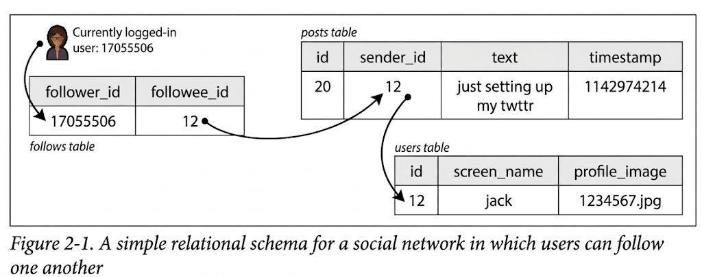
</div>

Agar hum is system ka data ek aam Relational Database (jaise MySQL) mein rakhein toh schema kuch is tarah hoga jaisa **Figure 2-1** mein dikhaya gaya hai:

* **Users Table:** User ki details (ID, name, profile image).
* **Posts Table:** Kisne post ki, kya text hai, aur kab ki.
* **Follows Table:** Kaun kisko follow kar raha hai.

Sab se zaroori read operation hai **Home Timeline** (woh screen jahan aapko un sab logon ki posts nazar aati hain jinhe aap follow karte hain). Ise laane ke liye aam taur par yeh SQL query chalayi jayegi:

```sql
SELECT posts.*, users.* FROM posts
 JOIN follows ON posts.sender_id = follows.followee_id
 JOIN users ON posts.sender_id = users.id
 WHERE follows.follower_id = current_user
 ORDER BY posts.timestamp DESC
 LIMIT 1000

```

**The Polling Problem (Bohot Bura Idea):**
Agar hum chahte hain ke users ko naye posts fauran (5 seconds ke andar) nazar aayein, toh unki app har 5 seconds baad yeh query DB par bhejegi (isay polling kehte hain). Agar 10 million users online hain, toh yeh DB par **2 million queries per second** banega!
Is se bhi buri baat yeh hai ke ek query mein DB ko us user ke follow kiye gaye 200 logon ki posts alag alag dhoond kar merge karni parti hain (2 million * 200 = **400 million lookups per second**). Yeh kisi bhi relational database ke liye handle karna namumkin hai.

---

### Materializing and Updating Timelines

Is maslay ko hal karne ke liye humein "Pull" (polling) se nikal kar **"Push"** architecture par aana hoga aur system ko pre-compute karna hoga.

**The Solution: Materialization (Precomputing)**
Hum har user ke liye ek data structure (cache / materialized view) pehle se bana kar rakhenge jismein uski timeline ready hogi. Jab user log in karega, usay heavy query ke bajaye seedha yeh ready-made cache (mailbox) pakra diya jayega.

Is architecture ka data flow **Figure 2-2** mein dikhaya gaya hai:

<div align="center">
  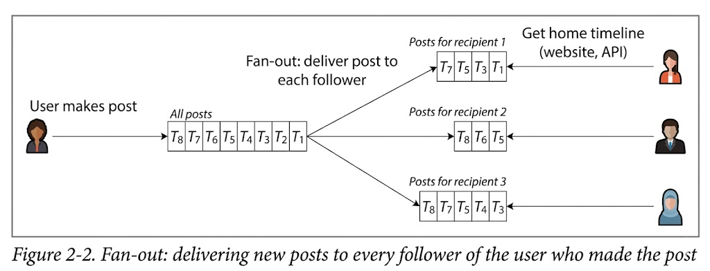
</div>


* **Fan-out:** Jab bhi koi user post karta hai, backend API us user ke sab followers ki list nikalegi aur us ek post ko un tamam followers ke "Mailbox" (Timeline Cache) mein dal (push kar) degi. Ek input request ka multiple downstream requests mein taqseem ho jana **Fan-out** kehlata hai.

**Performance Calculation:**
Agar 5,800 posts/sec hain aur har post ko 200 followers tak push (fan-out) karna hai, toh humein DB par **1.1 million writes per second** karni hongi. Yeh bohot bara number hai, lekin pichli approach ke 400 million reads/sec se kahin behtar aur sasta hai. Hum reads slow hone ke bajaye writes par thora extra kaam kar lenge.

**The Extreme Cases (Celebrity Problem):**
Yeh materialized view 99% users par perfect chalega, lekin edge cases mein architecture fail ho jayega:

* **High-Follower Accounts (The Justin Bieber Problem):** Agar kisi celebrity ke 100 million followers hain, aur wo post kare, toh hamara system ek second mein 100 million logon ke mailbox (cache) update karne ki koshish karega. Is fan-out se system crash ho sakta hai.

**The Hybrid Architectural Solution:**
Isay hal karne ke liye Twitter jaisi companies **Hybrid Approach** (mixed approach) use karti hain:

* Aam users ke posts unke followers ke mailbox (cache) mein push (fan-out) hote hain.
* Celebrities ke posts alag (separate) store hote hain. Jab user apni app kholta hai, toh system uske personal cache mein maujood posts aur celebrity ke alag para data, dono ko run-time par (pull) merge kar ke dikhata hai. Is se 100 million writes karne ki zaroorat nahi parti.

---

### 💻 Mockup System Design & Interview Scenario

**Scenario:** Aap WhatsApp jaisi ek chat app ka backend design kar rahe hain. Group chats mein jab koi user message bhejta hai, toh wo message sab members ko forward hota hai. Ek user ne 50,000 members wala ek bara broadcast group banaya hai. Jab wo message bhejta hai, toh server ke CPU spikes aate hain aur message deliver hone mein minutes lag jate hain. Isko architecturally kaise theek karenge?

**Architectural Flow (Plaintext Diagram):**

<div align="center">
  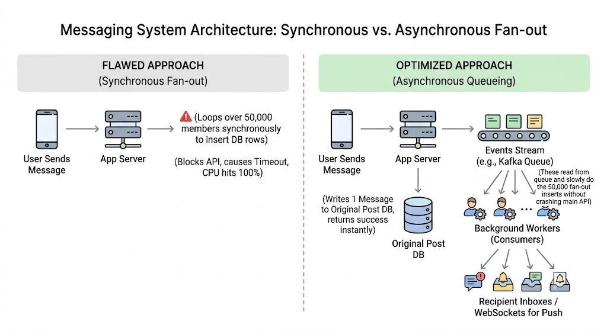
</div>

**Interview Trade-Off Questions:**

* **Question:** *Timeline banate waqt aapne "Read-Heavy" query se jaan churanay ke liye Fan-out ("Write-Heavy") approach kyu choose ki?*
* **Answer:** Kyun ke social networks hamesha Read-Heavy hote hain. Ek post likhi ek dafa jati hai lekin parhi hazaron dafa jati hai. Agar hum har read par complex JOIN lagayenge toh DB crash ho jayega. "Materialization" ka concept yahi hai ke reads ko bijli ki tezi par rakhne ke liye, hum writes ke dauran thora extra kaam aur storage (cache) qurban (trade-off) karne ko tayar hain.


* **Question:** *"Fan-out" architecture mein agar peak load (jaise football world cup final) aaye toh kya hoga?*
* **Answer:** Agar spikes aate hain toh hum timeline updates ko strictly synchronous nahi rakhte. Hum background queues (jaise RabbitMQ ya Kafka) ka istemal karte hain. Agar load barh jaye, toh posts aam dinon ke 5 seconds ke bajaye 30 seconds baad deliver hongi (Eventual Consistency), lekin hamara frontend fast load hota rahega kyun ke wo hamesha ready cache read kar raha hoga.


---

## Describing Performance

Software performance ko samajhne aur measure karne ke liye do main metrics ka istemal kiya jata hai, jinhe aapas mein integrate kar ke system ki capacity ka andaza lagaya jata hai:

* **Response Time:** Yeh wo total waqt hai jo user ke request bhejne se lekar usay screen par output (response) milne tak lagta hai. Isay milliseconds (ms) ya seconds mein napa jata hai. Yaad rahe ke response time aur service time mein farq hota hai; response time mein network delay aur queue mein khray rehne ka waqt bhi shamil hota hai.
* **Throughput:** Aik second mein aapka system kitni requests process kar raha hai, ya kitna data volume handle kar raha hai (Requests Per Second - RPS / Queries Per Second - QPS). Iski unit hamesha "somethings per second" hoti hai.

Writer ne pichli Twitter case study se inko is tarah map kiya hai:

* **Throughput Metrics:** "Posts per second" (5,800 PPS) aur "Timeline writes per second" (1.1 million).
* **Response Time Metrics:** "User ki home timeline load hone mein kitna time laga" aur "Celebrity ki post followers tak kitni der mein pohnchi".

### Figure 2-3 Ka Detailed Architectural Breakdown

<div align="center">
  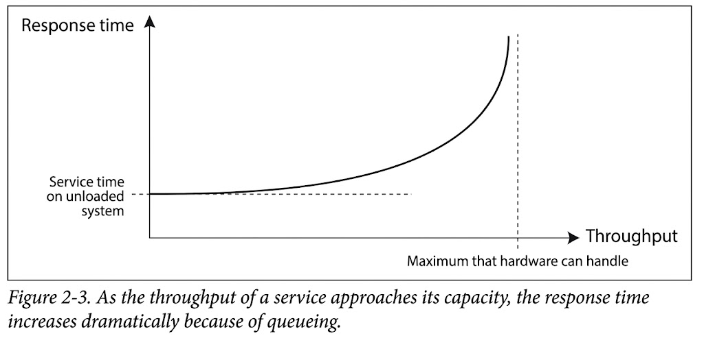
</div>

Aapne jo image share ki hai, wo darasal Throughput aur Response Time ka aik bohot hi critical relational graph hai. Is graph ke curve ko technical andaz mein samajhna zaroori hai:

* **Flat Line (Service time on unloaded system):** Graph ke shuru mein jab throughput (load) kam hota hai, toh response time bilkul flat aur stable rehta hai. Iska matlab hai hardware farigh hai, request aati hai aur CPU usay fauran process kar ke wapas bhej deta hai.
* **The Curve Upwards (Queueing Delay):** Jaise jaise throughput barhta hai aur hardware ki maximum capacity ke kareeb pohnchta hai, response time achanak seedha upar (dramatically high) bhagta hai.
* **Wajah (The Core Reason):** Is exponential barhauti ki wajah **Queueing** hai. Jab system par load bohot zyada hota hai, toh jab nayi request aati hai, CPU pehle se purani requests process kar raha hota hai. Nayi request ko memory queue (waiting line) mein khara hona parta hai. Hardware limit ke paas pohnchkar yeh queue itni lambi ho jati hai ke waiting time (queueing delay) asli processing time se kahin zyada barh jata hai.

---

## When an Overloaded System Won't Recover

Jab system apni maximum hardware capacity ko touch karne lagta hai, toh wo aik aisi khatarnak halat mein dakhil ho sakta hai jahan se uska khud se theek hona namumkin ho jata hai. Isay distributed systems mein **Metastable Failure** kehte hain.

* **The Vicious Cycle (Retry Storm):** Jab queueing delay ki wajah se response time had se zyada barh jata hai, toh frontend clients (mobile apps/browsers) samajhte hain ke request gum ho gayi hai. Wo timeout ho jate hain aur **wahi request dobara (retry) bhej dete hain**.
* **The Explosion:** Is se server par traffic ka load achanak double ya triple ho jata hai. Pehle se duba hua server mazeed dab jata hai. Is tabahi ko **Retry Storm** kehte hain. Is halat mein agar asli users traffic kam bhi kar dein, tab bhi system tab tak theek nahi hota jab tak usay reboot ya reset na kiya jaye, kyun ke memory queues pehle hi crash ho chuki hoti hain.

### Architectural Remedies (Halat ko control karne ke tareeqe)

Is metastable failure se bachne ke liye distributed software architectures mein yeh patterns lagaye jate hain:

1. **Client-Side Solved Layers:**
* **Exponential Backoff:** Agar client ki request fail ho jaye, toh wo fauran retry na kare. Pehli retry 1 second baad, dusri 2 second, teesri 4 second baad kare (waqt barhata jaye). Sath mein **Jitter** (randomness) shamil kare taake saare clients aik hi sath attack na karein.
* **Circuit Breaker:** Agar koi backend service lagatar errors ya timeouts de rahi hai, toh Gateway level par circuit "open" ho jata hai. Ab mazeed requests us service tak bhej kar usay mazeed dubaane ke bajaye client ko fauran "Service Unavailable" ka fallback response de diya jata hai.


2. **Server-Side Solved Layers:**
* **Load Shedding:** Server jab dekhta hai ke uska CPU 95% touch ho raha hai aur queue full hai, toh wo nayi aane wali requests ko chup-chap proactively drop (reject) karna shuru kar deta hai (HTTP 503 Service Unavailable) taake jo purani requests andar hain unhe kam az kam safely poora kiya ja sake.
* **Backpressure:** Server downstream services ya clients ko signal bhejta hai ke "meri capacity full hai, data bhejna slow karo" (Token Bucket algorithms ke zariye rate limiting lagayi jati hai).


---

### 💻 Mockup System Design & Interview Scenario

**Scenario:** Aap aik Ticket Booking platform (jaise PSL Finals ya Concert tickets) ke Architect hain. Flash sale shuru hote ہی 100,000 users aik sath "Buy Ticket" par click karte hain. Server ka database bottleneck ban jata hai, response time 20 seconds par chala jata hai. Clients timeout ho kar lagatar "Retry" button daba rahe hain, jis se system freeze ho gaya hai. Aap is "Retry Storm" ko rokne ke liye system kaise redesign karenge?

**Architectural Strategy:**

* Hum Gateway level par **Token Bucket Rate Limiter** lagayenge taake throughput hardware limit se aagay na jaye.
* Backend par **Load Shedding** active karenge aur clients mein **Exponential Backoff** implement karwayenge.

**Architectural Flow (Plaintext Diagram):**

<div align="center">
  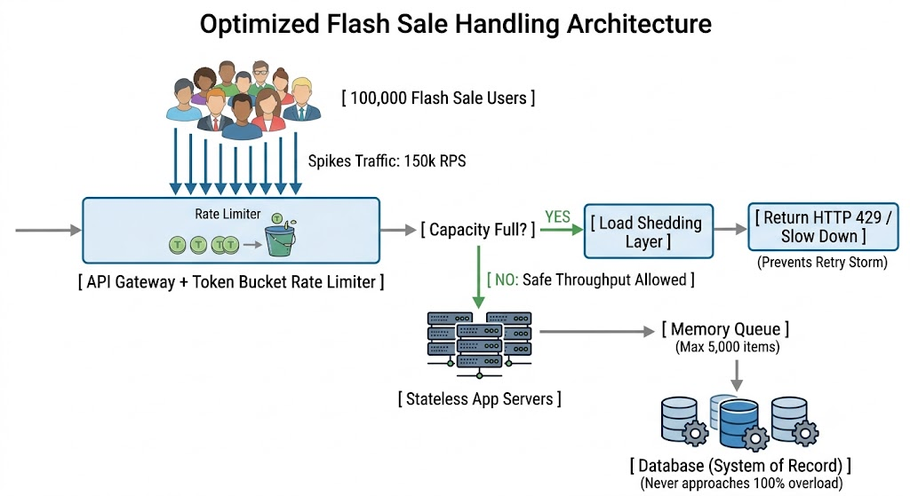
</div>

**Interview Trade-Off Questions:**

* **Question:** *Load Shedding lagane se toh users ko error (HTTP 429/503) milega, kya yeh bura user experience nahi hai?*
* **Answer:** Yeh aik zaroori trade-off hai. Do options hain: (1) Ya toh system ko open chora jaye jahan Retry Storm se poora system crash ho jaye aur 100% users down ho jayein. (2) Ya phir Load Shedding use ki jaye jahan 20% users ko safely ticket mil jaye aur baqi 80% ko clean "Server Busy" ka message dikhe. Distributed systems mein full crash se partial degradation hamesha behtar hoti hai.


* **Question:** *Throughput barhane ke liye kya hum sirf hardware barhate jayein (Vertical Scaling)? Is graph ka hardware se kya talluq hai?*
* **Answer:** Vertical scaling (bada server lagana) ki aik absolute physical limit hoti hai. Graph batata hai ke hardware chahe jitna bada ho, aik point par aakar throughput queueing wall ko touch karega hi. Asal scalability yeh hai ke hum system ko horizontally scale karein taake jab throughput limit ke paas pohnche, toh naye stateless nodes add ho kar graph ki line ko dubara flat (stable) kar dein.


---

### 📌 Quick Revision Hints

* **Response Time vs Throughput:** Response time user ka wait time hai; throughput server ka processed work per second hai.
* **Queueing Effect (Figure 2-3):** Max capacity ke paas response time isliye dामatially barhta hai kyun ke requests ko CPU farigh hone tak queue mein sarna parta hai.
* **Metastable Failure / Retry Storm:** Slow system par clients ke bar bar retry karne se peda hone wali tabahi jo reboot ke baghair theek nahi hoti.
* **Defenses:** Client side par *Exponential Backoff + Jitter*, server side par *Load Shedding, Circuit Breakers, aur Backpressure*.

---

## Latency and Response Time

Aam taur par log **Latency** aur **Response Time** ko ek hi samajhte hain aur in terms ko aapas mein badal kar use karte hain. Lekin is book mein writer ne inke darmiyan aik bohot hi bareek aur clear technical line draw ki hai, jise **Figure 2-4** mein wazeh dikhaya gaya hai.

Is style ke diagrams mein waqt (time) hamesha left se right flow karta hai. Horizontal lines nodes (Client aur Server) ko represent karti hain, jabke diagonal (tirchay) arrows network par travel karne wali request aur response ko dikhate hain.

---

### Architectural Breakdown of Figure 2-4

Agar hum aik single web request ke poore safar ko micro-level par breakdown karein, toh uske total waqt (Response Time) mein yeh chaar bade components shamil hote hain:

<div align="center">
  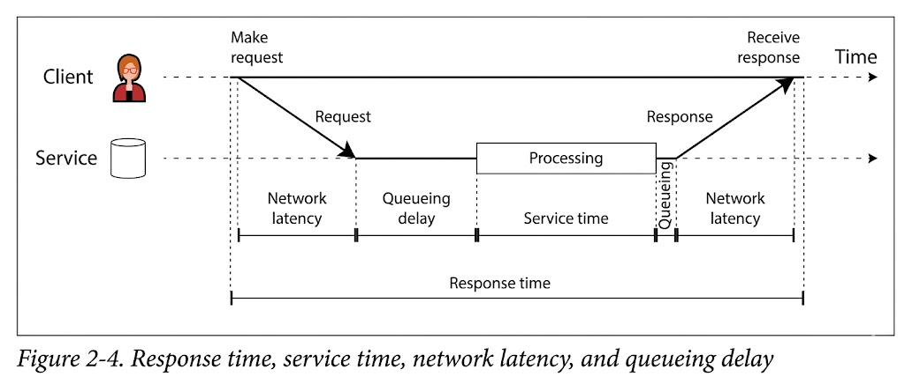
</div>

* **Response Time (Client's View):** Yeh wo mukammal waqt hai jo client apni aankhon se dekhta hai. Jab user button dabata hai tab se lekar jab tak screen par response poora load nahi ho jata, yeh total duration response time hai. Isme system ke har hissay ka delay shamil hota hai.
* **Service Time (Active Processing):** Yeh wo waqt hai jab server ka CPU, RAM, ya database actually mein us request ko compute ya process kar raha hota hai.
* **Queueing Delay (Waiting Lines):** Yeh system mein line mein lagne ka waqt hai jab aapka data inactive hota hai. Yeh do major points par ho sakta hai:
* **Inbound Queueing:** Request server tak pohnch gayi, lekin CPU pehle se kisi aur kaam mein busy hai, toh request ko CPU available hone tak wait karna parta hai.
* **Outbound Queueing:** Server ne processing poori kar li (Service time khatam), lekin server ka network card (NIC) pehle se doosri heavy files send kar raha hai. Ab response packet ko outbound buffer mein tab tak rukhna parega jab tak network interface free na ho jaye.


* **Latency (The Invisible Flight):** Yeh aik catchall term hai us waqt ke liye jab data par koi active processing nahi ho rahi hoti, balkay data "latent" (soya hua) hota hai. Iska sab se bada hissa **Network Latency** hai—yani request aur response ka wires, fibers, ya routers ke zariye hawa/samandar ke raaste travel karne ka waqt.

---

### Real-World Noise: Response Time Kyun Badal Jata Hai?

Agar aap ek hi server par, ek hi network se, aik hi request baar baar bhejein, tab bhi har dafa response time different aayega. Writer ne iski wajohaat batane ke liye bohot se deep physical aur software level ke real-world examples diye hain:

* **Context Switches:** Server ka Operating System achanak aapki API process ko rok kar kisi background OS process ko priority de deta hai.
* **TCP Retransmission:** Network par koi chota sa glitch aaya, packet drop ho gaya, aur TCP protocol ne usay pehchana aur dubara re-transmit kiya, jis se milliseconds ka delay aaya.
* **Garbage Collection (GC) Pauses:** Agar aapki API Java, Go, ya Node.js mein hai, toh runtime engine memory saaf karne ke liye poori application ko kuch milliseconds ke liye freeze kar deta hai (Stop-the-World pause).
* **Page Faults:** Server ko data RAM mein nahi mila, OS ko majbooran slow hard drive ya SSD (virtual memory storage) se block read karna para.
* **Mechanical Vibrations:** Server room ke rack mein physical hard drives ya cooling fans ki thartharahat (vibrations) ki wajah se drive ka mechanical head apni jagah se hil jata hai aur data read karne mein thora extra waqt leta hai.

---

### Head-of-Line Blocking (HOL)

Queueing delays hi asal wajah hote hain jo response times mein achanak itna bada utaar-chadaao (variability) paida karte hain. Server aik waqt mein parallel mein bohot kam kaam kar sakta hai (limited by CPU cores).

Agar aage khari hui kuch requests bohot slow hain (maslan heavy database read kar rahi hain), toh unke peche khari hui tamam fast requests (jin ka service time sirf 2ms tha) line mein phans jati hain. Is effect ko **Head-of-Line Blocking** kehte hain. Peche kharay client ko bohot slow response time dikhega, halankay server ne uski request par sirf 2ms lagaye thay.

Isi liye system architecture ka sunehra usool yeh hai ke **hamesha performance metrics aur response times ko client-side se measure karein**, na ke sirf server ke service time par khush hote rahein.

---

### System Behavior & Data Flow Diagram

Yeh diagram Figure 2-4 ke conceptual flow aur timeline ko plaintext format mein represent karta hai ke data kis waqt kis state mein hota hai:

<div align="center">
  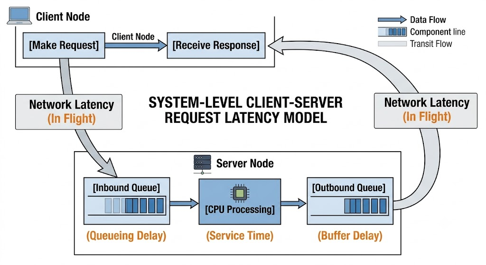
</div>

---

### 💻 Mockup System Design & Interview Scenario

**Scenario:** Aap aik Multi-tenant B2B platform design kar rahe hain jahan ek hi API backend ko light users (jo sirf dashboard dekhte hain - 5ms request) aur heavy corporate users (jo poore mahine ki CSV report download karte hain - 10 seconds request) dono use karte hain. Production mein light users complain kar rahe hain ke achanak unki app 10 seconds ke liye hang ho jati hai. API ka metrics dashboard check karne par server ka *average service time* bilkul normal (20ms) dikhata hai. Masla kahan hai aur isay kaise theek karenge?

**Architectural Diagnosis (The Interview Answer):**
Masla "Head-of-Line Blocking" ka hai. Heavy CSV reports server ke processing threads aur memory buffers ko block kar deti hain, jiski wajah se light queries queue mein phans jati hain (Queueing Delay). Server ka internal metrics register software level par service time toh 5ms hi dikhata hai jab wo process hoti hain, lekin client-side par total response time barh chuka hota hai.

**Architectural Redesign Strategy:**
Hum "Thread/Queue Isolation" technique use karenge. Heavy operations ko light synchronous API calls se bilkul alag algorithms aur workers par shift kiya jayega.

<div align="center">
  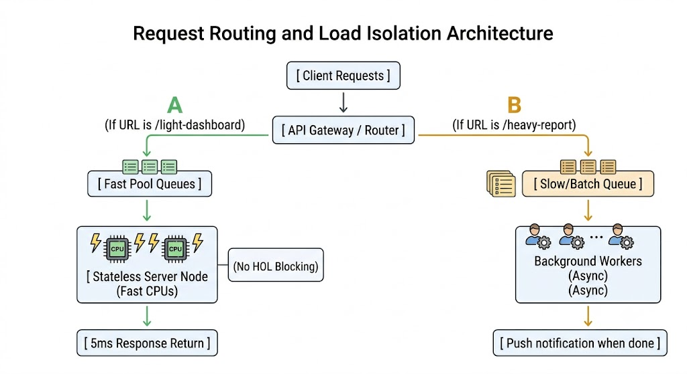
</div>


**Interview Trade-Off Questions:**

* **Question:** *Agar hum do alag pools (fast aur slow) bana dein, toh kya hardware resources waste nahi honge jab heavy reports koi download na kar raha ho?*
* **Answer:** Yeh aik necessary trade-off hai jahan hum compute density ki qurbani de kar response time ki stabilization khareed rahe hain (Predictable Latency). Is resource wastage ko kam karne ke liye hum slow pool ke workers ko Cloud Native patterns (jaise Kubernetes KEDA ya Serverless FaaS) par rakh sakte hain jo srf tab scale-up hon jab batch queue mein load aaye, warna zero par scale-down rahain.


---

### 📌 Quick Revision Hints

* **Response Time:** Client-side visible time. Total delays ka sum.
* **Service Time:** Server ka actual active processing time.
* **Queueing Delay:** CPU ya network cards free hone ka waiting time. HOL blocking ka zimmedar.
* **Network Latency:** Data ka wire/air mein guzarne wala waqt.
* **Head-of-Line Blocking (HOL):** Kuch slow requests ki wajah se poori queue ka jam ho jana aur peche khari fast requests ka slow ho jana.
* **Metric Location:** Response time hamesha client-side par napa jana chahiye taake queueing aur network latency sahi se capture ho sakay.

---

## Average, Median, and Percentiles

System architecture mein response time ko kabhi bhi ek single number ke taur par nahi dekha jata, balkay yeh values ki aik poori **Distribution** (bikhrao) hoti hai. Jab network delays mein random badlaao aata hai, toh usay hum **Jitter** kehte hain.

### Figure 2-5 Ka Detailed Structural Breakdown

Aapne jo image share ki hai, wo system performance ko samajhne ke liye sab se ahem statistical concept hai. Isme 100 requests (gray bars) ka response time dikhaya gaya hai:

<div align="center">
  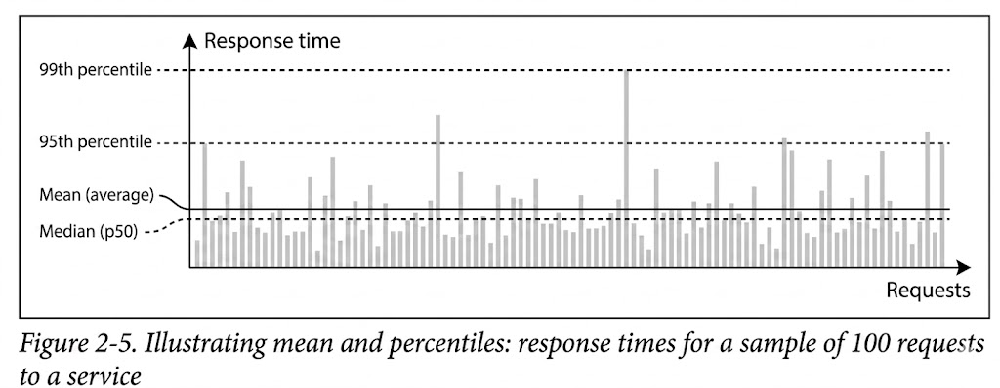
</div>

* **Mean (Average) Ki Kamzori:** Mean nikalne ke liye hum tamam response times ko jama karte hain aur requests ki tadad se divide kar dete hain. Graph mein waazeh nazar aa raha hai ke **Mean ki line Median se upar hai**. Aisa isliye hai kyun ke system mein kuch thori si requests (outliers) bohot slow hoti hain (jaise GC pause ya disk page fault ki wajah se), aur yeh ginti ki slow requests pooray average ko upar khinch leti hain. Isliye Mean aapko kabhi yeh nahi bata sakta ke ek "typical" user ko kitna delay mila.
* **Median (p50 - Typical User Experience):** Agar aap saari requests ko sab se tez se sab se slow ke order mein sort karlein, toh jo bilkul darmiyan (50th percentile) wali value hogi, wo Median hai. Agar p50 200ms hai, toh iska matlab hai 50% users ko 200ms se kam time mila aur 50% ko us se zyada. Yeh metric aam user ke experience ko sahi tarah bayaan karta hai.
* **Tail Latencies (p95, p99, p99.9):** Apne system ke sab se bure outliers ko dhoondne ke liye hum unche percentiles ko dekhte hain. Graph mein **95th percentile** ka matlab hai ke 100 mein se 95 requests fast thin, aur sirf 5 requests us line se upar thin. Isi tarah **p99** batata hai ke sab se slow 1% requests kitni buri thin.

### Writer Ki Real-World Amazon Example Ka Conceptual Flow

Amazon apne internal microservices ke liye **99.9th percentile (p99.9)** ke strict target rakhta hai, halankay yeh 1,000 mein se sirf 1 user ko affect karta hai. Is decision ke peche aik bohot gahra data flow aur business model hai:

* Jo customers p99.9 wali slow requests hit karte hain, wo aam taur par Amazon ke sab se **Valuable Customers** (heavy buyers) hote hain.
* Unka account purana hota hai, unhone hazaron purchases ki hoti hain, aur unka profile data massive hota hai.
* Jab wo homepage kholte hain, toh backend service ko unke liye database se bohot zyada data fetch karna parta hai, jiski wajah se unka response time tail latency (slowest pool) mein chala jata hai.
* Agar un sab se ameer customers ko website slow dikhegi, toh wo shopping chor denge, jis se direct revenue ka bhari nuksan hoga. Isliye tail latency ko optimize karna business ke liye critical hai.
* *Trade-off Decision:* Amazon ne p99.99 (10,000 mein se 1 request) ko optimize karna chor diya kyun ke us par hardware ka kharcha bohot zyada aa raha hai aur utna financial faida nahi ho raha tha (Diminishing returns).

---

## The User Impact of Response Times

Yeh baat toh taye hai ke fast website users ko pasand hoti hai, lekin latency ka user behavior par asar napna kafi mushkil kaam hai. Writer ne yahan industry ke mukhtalif studies ke tazadaat (paradoxes) ko breakdown kiya hai:

* **Google & Bing Data:** Google ne 2006 mein kaha ke 400ms se 900ms ka delay aane se 20% traffic drop ho gayi. Lekin 2009 ki study mein 400ms delay se sirf 0.6% searches kam huin. Bing ke mutabiq 2 seconds ka delay ad revenue ko 4.3% kam karta hai.
* **The Akamai Paradox (Data Ki Bareeki):** Akamai ki aik study ne dawa kiya ke 100ms latency barhne se conversion rate 7% gir jata hai. Lekin unke data mein aik ajeeb cheez mili: **Jo pages sab se zyada tez load ho rahe thay, unka conversion rate sab se bura tha!**
* *The System Behavior Explanation:* Asal mein jo pages microseconds mein load ho rahe thay, wo koi kaam ke pages nahi thay, balkay wo **404 Error Pages** thay. Kyun ke error page par koi image ya content nahi hota, isliye wo sab se tez load hote hain, aur zahir hai error page par koi user khareedari (conversion) nahi karta. Isliye bina context ke metrics dekhna architect ko gumrah kar sakta hai.
* **Yahoo Study:** Yahoo ne search results ki quality ko control kar ke test kiya aur sabit kiya ke jab responses mein 1.25 seconds ka farq aata hai, toh fast searches par 20% se 30% zyada clicks aate hain.

---

## System Behavior & Data Flow Diagram

Yeh diagram represent karta hai ke percentile monitoring system kaise kaam karta hai aur requests kaise different buckets mein sort hoti hain:

<div align="center">
  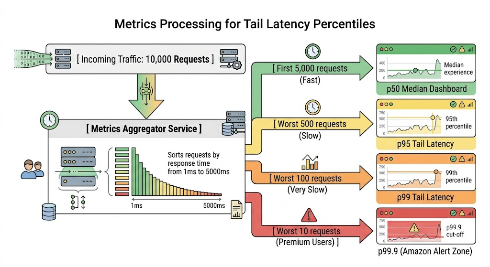
</div>

---

## 💻 Mockup System Design & Interview Scenario

**Scenario:** Aap aik B2B Fintech application (jaise Stripe) ke Architect hain. Company ke VPs kehte hain ke hamara Datadog monitoring dashboard "Average Response Time" hamesha 100ms dikhata hai, jo ke behtareen hai. Lekin hamare sab se bade enterprise clients (jo har mahine millions of dollars process karte hain) complain kar rahe hain ke unki payment processing API aksar 3 se 4 seconds leti hai. Masla kahan hai aur aap metrics pipeline ko kaise redesign karenge?

**Architectural Diagnosis:**
Masla yeh hai ke aapka monitoring system **Mean/Average** use kar raha hai. Enterprise clients ka data size bada hota hai, unke API payloads bade hote hain, aur unka data relational tables mein complex structures par hit karta hai. Unki requests p99 ya p99.9 (tail latency) mein phansi hui hain, jo ke total traffic ka sirf 1% hain. Average metric unke is bure experience ko baki 99% aam users ke fast data ke peche chupa (hide kar) raha hai.

**Architectural Redesign Strategy:**
Hum Average metric ko monitor karna chor denge aur **Rolling Percentiles Histogram** algorithm implement karenge taake tail latencies ko pakda ja sake.

<div align="center">
  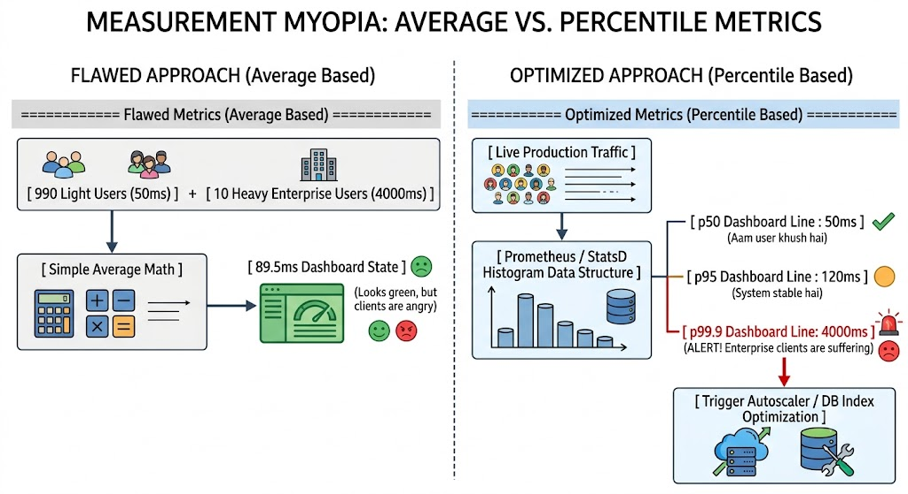
</div>

**Interview Trade-Off Questions:**

* **Question:** *Percentiles (p99) ko compute karna Average nikalne se zyada mehanga (resource-intensive) kyun hota hai?*
* **Answer:** Average nikalne ke liye hamen sirf do cheezein save karni parti hain: total sum aur total count. Memory overhead zero hota hai. Lekin exact percentiles nikalne ke liye aapko aik specific time window (maslan 1 minute) ke tamam response times ko memory mein rakh kar sort karna parta hai. High throughput par yeh bohot memory consume karega. Is trade-off ko hal karne ke liye distributed systems mein **T-Digest** ya **HdrHistogram** jaise mathematical approximations use kiye jate hain jo kam memory mein 99% accurate percentile batate hain.


* **Question:** *Agar p99.9 par latency barh rahi hai, toh kya hamen load balancer par round-robin algorithm change karna chahiye?*
* **Answer:** Haan, kyun ke round-robin blindly request bhejta hai. Agar aik node par pehle se p99.9 wali do heavy requests chal rahi hain, toh round-robin teesri request bhi usi par bhej dega jise humne abhi parha ke **Head-of-Line Blocking** paida karegi. Iska behtar trade-off yeh hai ke hum **Least Connections** ya **Peak Ema** algorithm use karein taake requests un nodes par jayein jo free hain.


---

## 📌 Quick Revision Hints

* **Mean (Average):** Outliers se buri tarah skew (mutasir) hota hai; throughput capacity ki calculation ke liye acha hai, user experience ke liye nahi.
* **Median (p50):** Asli "typical" waiting time batata hai.
* **Tail Latency (p99, p99.9):** Sab se slow requests. Inhe optimize karna zaroori hai kyun ke heavy/premium users aksar isi zone mein aate hain.
* **Akamai Paradox:** Sub se fast pages aksar khali ya error (404) pages hote hain, isliye metrics ko context ke sath dekhna lazmi hai.
* **The Cost of Tail Latency:** p99.99 tak jana diminishing returns deta hai, isliye p99.9 par line draw karna aik standard industry practice hai.

---


## Use of Response Time Metrics

Distributed system architectures mein high percentiles ko monitor karna us waqt sab se zaroori ban jata hai jab aapka system microservices ya component layers mein divide ho.

### Figure 2-6 Ka Detailed Architectural Breakdown

Aapne jo image share ki hai, wo distributed systems ke aik bohot bade dard-e-sar ko bayan karti hai jise **Tail Latency Amplification** kehte hain. Is poore data flow aur system behavior ko micro-level par samjhein:

<div align="center">
  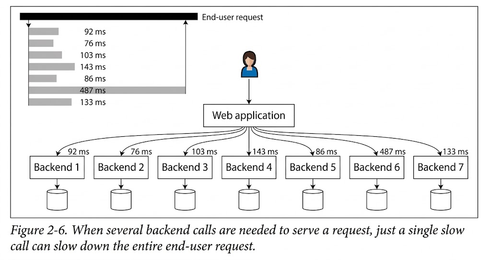
</div>

* **The Fan-out Architecture:** Jab aik end-user web application par request bhejta hai, toh wo single request peche parallel mein 7 mukhtalif backend services (Backend 1 se Backend 7) ko call karti hai.
* **The Weakest Link Principle:** Hum dekh sakte hain ke Backend 1, 2, 3, 4, 5, aur 7 bohot tez hain (unka response time 76ms se 143ms ke darmiyan hai). Lekin **Backend 6 achanak slow ho jata hai aur 487ms leta hai**.
* **The Overall Impact:** Kyun ke web app ko apna final response banane ke liye saare backends ka data chahiye, isliye poori end-user request ko majbooran **487ms** tak rukna parta hai.

Yahi tail latency amplification ka mazaq hai: agar aapke system mein microservices ki tadad barhti jaye, toh mathematically is baat ka chance barh jata hai ke koi na koi aik backend slow ho jayega, aur us aik slow service ki wajah se aapka poora customer-facing web page slow load hoga.

### SLOs aur SLAs Mein Percentiles Ka Istemal

Industrial production systems mein performance ki guarantees dene ke liye percentiles ka use kiya jata hai:

* **SLO (Service Level Objective):** Yeh internal engineering team ka target hota hai. Maslan, "Hamari service ka median (p50) 200ms se kam aur p99 1 second se kam hona chahiye."
* **SLA (Service Level Agreement):** Yeh customer ke sath aik qanooni aur financial contract hota hai. Agar system defined SLOs ko poora nahi karta, toh company customer ko refund ya financial compensation dene ki paband hoti hai.

---

## Computing Percentiles

Dashboards (jaise Grafana ya Datadog) par rolling time window (maslan pichle 10 minutes) ke percentiles continuous calculate karna aik heavy processing task hai.

* **The Naive Approach (CPU Crasher):** Sab se aasan tareeqa yeh hai ke pichle 10 minutes ki saari requests ka response time memory mein save kiya jaye aur har minute us list ko sort kar ke p50 ya p99 nikala jaye. High throughput (maslan 50,000 requests per second) par yeh approach server ki memory aur CPU ko lock kar degi.
* **The Approximation Solution:** Is performance overhead se bachne ke liye computer scientists ne mathematical approximations algorithms banaye hain. Yeh algorithms memory ka aik chota sa fractions use kar ke 99% accurate percentiles estimate karte hain. Inme mashhoor open-source libraries yeh hain:
* **HdrHistogram:** (High Dynamic Range Histogram) Yeh high latency range ko optimize karne ke liye best hai.
* **t-digest / DDSketch:** Yeh advanced data structures hain jo streaming data par bohot kam overhead ke sath exact tail percentiles batate hain.


### The Ultimate Metric Mistake (Averaging Percentiles)

Writer aik bohot ahem mathematical rule samjhata hai jise aksar developers ghalti se bypass kar dete hain: **Aap kabhi bhi percentiles ka average (mean) nahi nikal sakte.**
Agar aapke paas do servers hain:

* Server A ka p99 = 100ms
* Server B ka p99 = 300ms
Aap yeh nahi keh sakte ke pure cluster ka p99 average ho kar 200ms `(100+300)/2` ho gaya hai. Yeh mathematically bilkul galat aur meaningless hai. Ho sakta hai saari heavy queries Server B par hi gayi hon. Cluster ka overall percentile nikalne ka wahid sahi tareeqa yeh hai ke dono servers ke raw **Histograms ko aapas mein combine (add) kiya jaye**.

---

## 💻 Mockup System Design & Interview Scenario

**Scenario:** Aap aik Online Hotel Booking Aggregator website (jaise Booking.com ya Agoda) ke Architect hain. Jab user "Search Hotel" par click karta hai, aapka backend parallel mein 20 alag alag local hotel vendors ke systems ko network call (fan-out) karta hai taake sab se sasti price mil sakay. Production mein tail latency amplification ki wajah se search page hamesha slow load hota hai kyun ke koi na koi 1 ya 2 vendors ka database hamesha slow response deta hai. Isay microservices structure mein kaise optimize karenge?

**Architectural Strategy (Hedged Requests / Speculative Retries):**
Hum pure response ke liye sab se slow vendor ka wait nahi karenge. Hum aik deadline mechanism lagayenge jise **Hedged Requests** kehte hain. Agar koi vendor hamare p95 response time (maslan 150ms) tak jawab nahi deta, toh hamara gateway parallel mein usay aik duplicate request bhej dega ya phir us specific vendor ko skip kar ke baki 19 vendors ka data user ko dikha dega (Graceful Degradation).

<div align="center">
  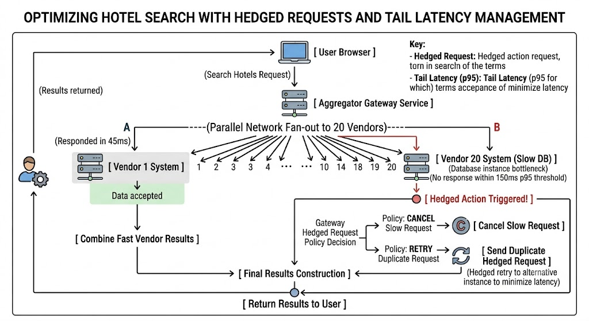
</div>

**Interview Trade-Off Questions:**

* **Question:** *Hedged Requests pattern use karne se kya hamare servers par extra load nahi aayega?*
* **Answer:** Haan, yeh aik cost vs latency ka trade-off hai. Hum network traffic ka thora overhead (around 1% to 2% extra duplicate requests) bardasht karne ko tayar hain taake hamare premium users ko tail latency amplification ka jhatka na lagay aur p99.9 latency drastically reduce ho jaye.


* **Question:** *Dashboard par multiple server nodes ka overall cluster percentile dikhane ke liye aap Prometheus mein metrics kaise configure karenge?*
* **Answer:** Hum Prometheus mein `summary` metric type use nahi karenge kyun ke summary client-side par hi percentile compute kar deti hai jise baad mein aggregate (average) nahi kiya ja sakta. Hum `histogram` metric type use karenge, jo har node par response times ko mukhtalif buckets mein save karega. Phir hum query level par `histogram_quantile(0.99, sum(rate(...)))` lagayenge taake saari machines ke histograms pehle mathematical rules ke mutabiq sum hon, aur phir perfect p99 calculate ho.


---

## 📌 Quick Revision Hints

* **Tail Latency Amplification (Figure 2-6):** Parallel calls mein poori request ki speed sab se slow call ke barabar ho jati hai.
* **SLO vs SLA:** SLO internal engineering ka target hai; SLA customer ke sath legal/financial agreement hai.
* **Percentile Math Rule:** Percentiles ka simple average nikalna mana hai; aggregation ke liye hamesha histograms ko add karein.
* **Approximation Libraries:** HdrHistogram, t-digest, aur DDSketch high throughput par low memory mein percentiles calculate karne ke liye best tools hain.

---

## Reliability and Fault Tolerance

Software engineering mein reliability (qabiliyat-e-etmad) ka aam matlab yeh hota hai ke application user ki umeedon ke mutabiq kaam kare, user ki mistakes ya unexpected inputs ko bardasht kare, load barhne par bhi behtar performance de, aur badmashi ya unauthorized access ko rokay.

In sab cheezon ko agar aik jumlay mein jama kiya jaye, toh **Reliability ka matlab hai: "System ka theek tareeqe se kaam jaari rakhna, jabke cheezin kharab ho rahi hon."**

Writer ne yahan kharabiyon ko deep architectural level par samajhne ke liye do bohot ahem terms mein farq wazeh kiya hai:

* **Fault (Nuqs / Khata):** Yeh tab hota hai aur jab system ka koi aik specific component ya purza kaam chor deta hai. Maslan, aik hard drive ka corrupt ho jana, aik server machine ka crash ho jana, ya kisi third-party API ka down ho jana.
* **Failure (Nakami):** Yeh tab hota hai jab pura system as a whole (majmooi taur par) user ko service dena band kar de—yaani jab system apna SLO (Service Level Objective) poora na kar sakay.

**Fault aur Failure ka Bareek Talluq:**
Yeh dono darasal aik hi cheez hain, bas inka level mukhtalif hai. Agar aapka system sirf aik hi server par chal raha hai, toh us server ka crash hona aik "Fault" hai, lekin kyun ke koi aur server nahi hai, isliye yeh poore system ka "Failure" ban jayega.
Lekin agar aapka system distributed hai (multiple nodes hain), toh aik node ka crash hona poore system ke liye sirf aik chota sa "Fault" hai. System is fault ko chupayega aur doosri node par traffic shift kar ke user-facing "Failure" hone se bacha lega.

---

## Fault Tolerance

Aik system ko **Fault-Tolerant** tab kaha jata hai jab wo distributed nodes mein faults aane ke bawajood users ko bina rukawat ke service deta rahay.

* **SPOF (Single Point of Failure):** Agar system ka koi aisa component hai jiske kharab hone se poora system directly baith jata hai (yaani fault directly failure mein badal jata hai), toh usay architecture ki zaban mein SPOF kehte hain. Behtar distributed system design ka maqsad hi SPOFs ko khatam karna hota hai.
* **Real-World Timeline Example:** Case study ke mutabiq, jab fan-out process chal raha ho (yaani aik post ko lakhon followers ke mailbox cache mein push kiya ja raha ho) aur us dauran worker machine crash ho jaye, toh fault-tolerant system doosri machine ko wohi task assign karega. Yahan challenge yeh hota hai ke naya worker na toh koi post miss kare aur na hi duplicate kare (Is gair-mamooli reliability ko **Exactly-once semantics** kehte hain, jo chapter 12 mein khulegi).
* **The Boundaries of Fault Tolerance:** Fault tolerance ki hamesha aik hadd (limit) hoti hai. Aap yeh design kar sakte hain ke system aik waqt mein 2 disks ka fail hona bardasht kare, lekin agar saari hard drives aik sath jal jayein, toh dunya ka koi architecture data loss nahi bacha sakta.
* **Chaos Engineering & Fault Injection:** Distributed systems ko mazeed mazboot banane ka aik ajeeb lekin behtareen tareeqa yeh hai ke aap khud jaan booch kar production environment mein servers ko kill karna shuru kar dein (Fault Injection). Kiun ke aksar bade production crashes poor error-handling code ki wajah se hote hain, isliye Netflix jaise bade platforms production mein randomly live processes ko marnay ke liye automated tools use karte hain. Is software discipline ko **Chaos Engineering** kehte hain.

**Prevention vs Cure (Security vs Infrastructure):**
Writer wazeh karta hai ke software faults ka toh ilaaj (cure) mumkin hai ke backup node chala di jaye. Lekin **Security** ke mamlaat mein "Prevention" (perhaiz) hi wahid hal hai. Agar hacker ne sensitive data chura kar leak kar diya, toh us nuksan ko rollback ya fault-tolerate nahi kiya ja sakta.

### System Behavior & Data Flow Diagram

Yeh diagram dikhata hai ke kaise aik fault-tolerant cluster node ke crash (fault) ko handle karta hai bina pure system ko down (failure) kiye:

<div align="center">
  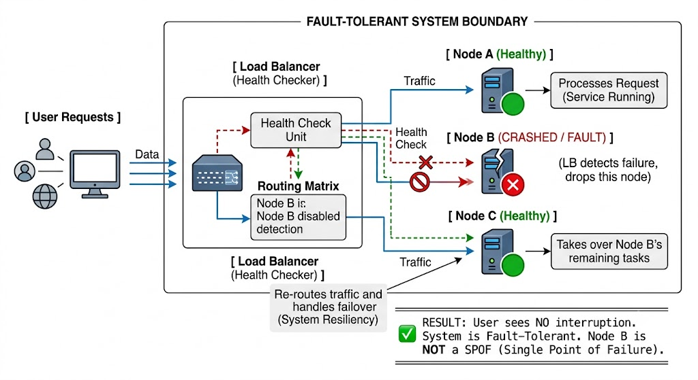
</div>

---

## Mockup System Design & Interview Scenario

**Scenario:** Aap aik Multi-node Distributed Ride-Booking Platform (jaise Uber) ke Architect hain. Aapka system aik asynchronous queue worker network use karta hai jo rides match karta hai. Agar ride-matching worker node chalte chalte crash ho jaye, toh rider ki request hamesha ke liye phans jati hai (SPOF behavior). Isay fault-tolerant banayein.

**Architectural Strategy:**
Hum single worker queue ko **Distributed Message Broker (Kafka/RabbitMQ) with Acknowledgments** par shift karenge. Jab tak naya worker task mukammal kar ke "ACK" signal nahi bhejega, data queue se delete nahi hoga. Agar node crash hui, toh task auto-rollback ho kar doosri node ko chala jayega.

**Architectural Flow (Plaintext Diagram):**

<div align="center">
  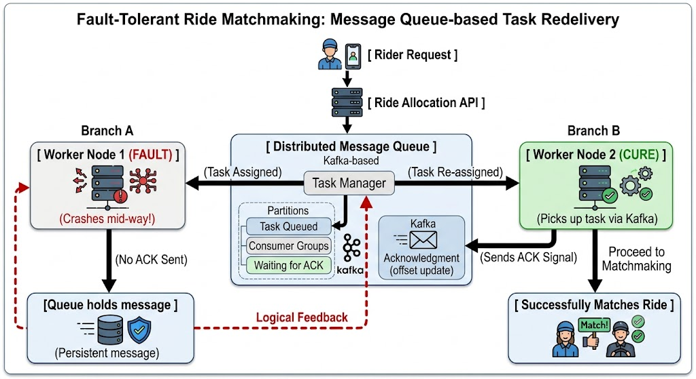
</div>

**Interview Trade-Off Questions:**

* **Question:** *Agar Worker 1 ne ride match kar li thi lekin ACK bhejne se pehle crash hua, toh Worker 2 wahi ride dobara process karega. Is duplication (At-least-once) ke trade-off ko kaise handle karenge?*
* **Answer:** Yeh distributed networks ka bohot bada challenge hai. Isay hal karne ke liye hum worker processing ko **Idempotent** banayenge. Har ride request ki aik unique `id` hogi. Worker 2 database mein save karne se pehle check karega ke "Kya is `id` ki ride pehle hi match ho chuki hai?". Agar haan, toh wo request ko duplicate process karne ke bajaye chup-chap drop kar ke ACK bhej dega (Achieving Exactly-once behavior conceptually).


* **Question:** *Chaos engineering ka tool (jaise Chaos Monkey) chalane ka kya nuksan ho sakta hai?*
* **Answer:** Trade-off yeh hai ke agar aapka fault-tolerance mechanism pehle se theek se tested nahi hai, toh Chaos Engineering production mein chote fault ko barha kar real **Failure** paida kar sakti hai jis se real users mutasir honge. Isliye isay hamesha off-peak hours mein aur pehle staging environments mein chalaya jata hai jab tak system architecture par full confidence na aa jaye.


---

## Quick Revision Hints

* **Reliability:** Cheezon ke kharab hone ke bawajood application ka sahi chalte rehna.
* **Fault vs Failure:** Fault purzay ki kharabi hai (micro level); Failure pooray system ka service chor dena hai (macro level/SLO breach).
* **SPOF:** Aik aisa component jiske baithne se poora system fail ho jaye. Distributed design mein SPOFs ko design se nikalna lazmi hai.
* **Chaos Engineering:** Janb-oogh kar faults paida karna taake error-handling mechanism constantly live test hota rahay.
* **Security Rule:** Faults ko tolerate (cure) kiya ja sakta hai, lekin security breaches ko sirf prevent kiya ja sakta hai.

---

## Hardware and Software Faults

System failures (nakamiyon) ke piche jab bhi hum sochein, toh sab se pehle zehan mein hardware ke maslay aate hain. Bohot se log samajhte hain ke hardware permanent hota hai, lekin bade scale par hardware ka tootna phootna aik aam aur rozmarra ka mamla ban jata hai. Writer ne iski gehri statistical aur physical bareekiyan bayan ki hain:

**Magnetic Drives Aur SSDs Ka Faraq:**

* **Magnetic Hard Drives:** Har saal takriban 2% se 5% magnetic hard drives kharab hoti hain. Agar aapke paas 10,000 disks ka aik massive storage cluster hai, toh iska mathematical matlab yeh hai ke **rozana average aik disk lazmi crash hogi**.
* **Solid State Drives (SSDs):** Inka failure rate 0.5% se 1% per year hai, jo magnetic se kam hai. Lekin inme aik bada architectural khatra hota hai: *Uncorrectable Bit Errors*. Chote bit errors toh SSD khud theek kar leti hai, lekin bade uncorrectable errors naye drives mein bhi saal mein aik baar lazmi aate hain. Yeh error rate magnetic drives se zyada dangerous hai.

**CPU Aur RAM Ki Khamosh Tabahi:**

* **Manufacturing Defects in CPU:** Takriban 1,000 mein se 1 machine ka CPU core aisa hota hai jo kabhi kabhar manufacturing defects ki wajah se **galat mathematical result** calculate kar deta hai. Yeh bohot bura fault hai kyun ke baaz dafa system crash nahi hota, balkay software chup-chap galat data database mein write kar deta hai (Silent Data Corruption).
* **Cosmic Rays Aur RAM Corruption:** RAM ke andar ka data random azeeb waqiaat jaise **Cosmic Rays** (faza se aane wali shuaen) ya physical defects ki wajah se badal jata hai (bits flip ho jate hain). Agar aap ECC (Error-Correcting Code) RAM bhi use karein, tab bhi 1% se zyada machines har saal uncorrectable memory error hit karti hain jis se server crash ho jata hai. Kuch makhsoos memory access patterns jaan-booch kar bits ko flip kar sakte hain.

**Datacenter Level Disasters:**

* Pura datacenter network misconfiguration, aag, zanzalay, ya fail power supplies ki wajah se down ho sakta hai.
* Writer aik bohot dilchasp real-world example deta hai: **Solar Storms (Suraj ke tufan)**. Jab suraj se charged particles nikalte hain, toh wo zameen par lambi wires aur undersea network cables mein heavy electrical currents peda kar dete hain, jis se poora power grid aur internet infrastructure tabah ho sakta hai. Chote systems mein inki fikr nahi hoti, lekin large-scale distributed architecture mein in sab ko handle karna normal system operations ka hissa hai.

---

## Tolerating hardware faults through redundancy

Hardware ki is na-qabiliyat-e-etmad (unreliability) ka hamara pehla jor (response) hamesha hardware level par redundancy add karna hota hai taake single server ka uptime barhaya ja sake:

**Hardware Level Redundancy:**

* Disks ko **RAID** configuration mein lagaya jata hai (data ko multiple disks par spread karna taake aik disk jale toh data loss na ho).
* Servers mein dual power supplies aur hot-swappable CPUs (chalte server mein CPU badalna) lagaye jate hain.
* Datacenters mein backup ke liye massive batteries aur diesel generators hote hain.

**Independent vs Correlated Faults:**
Redundancy sirf tab tak hi sab se behtareen kaam karti hai jab tak faults **Independent** (aik dusre se alag) hon—yaani aik drive jalne se doosri drive ke jalne ka chance na barhe. Lekin real-world experience batata hai ke components ke darmiyan correlation hoti hai. Pura rack ya pura datacenter aik sath baith jata hai.

**Software Level Fault Tolerance (The Cloud Approach):**
Modern cloud native architectures ab individual machines ki reliability par focus nahi karte. Wo software level par fault tolerance design karte hain using **Availability Zones (AZs)**.

* Availability zones physically aik dusre se alag datacenters hote hain. Software ko is tarah design kiya jata hai ke agar region ka aik pura datacenter (AZ-1) solar storm ya catastrophic event ki wajah se tabah bhi jaye, toh doosre datacenter (AZ-2) mein baithi hui software node fauran uska kaam sambhal le (Cross-datacenter failover).

**Operational Advantage (Rolling Upgrades):**
Is software level fault tolerance ka aik bohot bada operational faida hai. Agar aapke paas single node system hai aur aapne OS security patch lagane ke liye server reboot karna hai, toh aapko **Planned Downtime** (app band karni) paregi.
Lekin multi-node fault-tolerant system mein aap aik waqt mein aik node ko band kar ke patch lagate hain aur restart karte hain (is dauran baki nodes traffic sambhalti hain). Is amal ko **Rolling Upgrade** kehte hain, jis se users ko zero downtime milta hai.

---

## Software faults

Hardware faults aksar weakly correlated hote hain (aik disk jali toh doosri shayad theek rahay). Iske bar-aks, **Software Faults highly correlated hote hain**. Kyun ke distributed system ki saari nodes par aik hi software ka code chal raha hota hai, isliye agar code mein koi bug hai, toh wo saari nodes ko aik sath crash karega. Yeh faults anticipate karna bohot mushkil hai aur yeh hardware se zyada tabahi machate hain.

Writer ne iski shandar real-world examples di hain:

* **The Leap Second Bug (June 30, 2012):** Linux kernel ke andar aik bug tha jo "Leap Second" (waqt ko adjust karne ke liye aik extra second) aane par trigger ho gaya. Is aik bug ki wajah se dunya bhar mein chalne wali hazaron Java applications aik hi waqt mein hang ho gaeen aur kahin bade internet services crash ho gaye.
* **The 32,768 Hours SSD Bug:** Aik firmware bug ki wajah se aik makhsoos model ki saari SSDs theek **32,768 hours** (takriban 3 saal 8 mahine) chalne ke baad achanak aik sath fail ho gaeen, aur unka data unrecoverable ho gaya.
* **Runaway Processes (Resource Exhaustion):** Code mein loop ya memory leak ka aisa bug jo server ke shared resources (CPU time, RAM, disk space, network bandwidth, ya threads) ko achanak chat (consume) kar jaye. Jab process had se zyada memory leti hai, toh Linux ka OS use khud kill kar deta hai (OOM Killer).
* **Cascading Failures (Dino-Effect):** Yeh distributed systems ka sab se khatarnak software fault hai. Aik component mein masla aata hai, wo slow hota hai, uski wajah se load doosre component par shift hota hai. Doosra component over-load ho kar baith jata hai, aur aiste aiste poora distributed system dominoes ki tarah collapse kar jata hai.
*  dormant Bugs & Assumptions: Software bugs aksar lambay arsay tak soye (dormant) rehte hain jab tak koi azeeb circumstances unhe jagayein na. Yeh tab hota hai jab developer code likhte waqt environment ke baare mein koi **Assumption** (farziya) bana leta hai—jo aam dino mein toh sach hoti hai, lekin aik din achanak jhoot sabit ho jati hai.

**Architectural Solutions for Software Faults:**
Software faults ka koi quick button solution nahi hai, lekin in cheezon se madad milti hai:

1. System ke assumptions aur interactions ko dhyan se sochna.
2. Thorough testing aur staging simulation.
3. **Process Isolation:** Aik process doosre ka nuksan na kare.
4. Processes ko crash aur auto-restart hone dena (Erlang philosophy).
5. Feedback loops (retry storms) ko rokna via Load shedding aur Circuit Breakers.

---

## 💻 Mockup System Design & Interview Scenario

**Scenario:** Aap aik Multi-zone Payment Gateway System (jaise Stripe/PayPal) ke Lead Architect hain. Aapka software multi-node cluster par chal raha hai. Ek naye code deployment ke baad, jab koi user aik makhsoos currency (e.g., PKR) mein payment karta hai, toh code mein Memory Leak trigger ho jata hai. Aik node ka memory full hota hai, OS usay kill karta hai, load balancer baki nodes par traffic bhejta hai, aur 5 minutes ke andar saari nodes bari bari crash ho jati hain (Cascading Failure). Isay software aur architecture level par kaise handle karenge?

**Architectural Strategy:**

1. **Process and Fault Isolation:** Hum currency processing ko main application thread se alag isolated process sandbox/container mein dalenge.
2. **Circuit Breaker & Rate Limiting:** Jaise hi system kisi node par abnormal memory surge ya timeout dekhega, circuit breaker open ho jayega aur us traffic pattern ko baki healthy nodes par cascade hone se rok dega.

**Architectural Flow (Plaintext Diagram):**

<div align="center">
  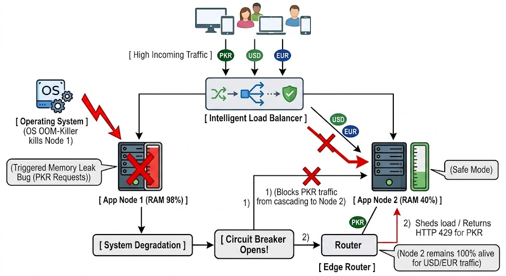
</div>

**Interview Trade-Off Questions:**

* **Question:** *Agar firmware ya software bug (jaise leap second bug) saari machines par aik sath chal raha hai, toh hardware multi-zone deployment (AZs) hamen kaise bachayegi?*
* **Answer:** Yeh aik bohot critical trade-off aur distributed system ki haqeeqat hai. Agar bug software level par pure system mein shared hai, toh hardware redundancy (AZs) hamen **nahi bacha sakti**, kyun ke naye datacenter mein bhi wohi bug trigger ho jayega. Is se bachne ke liye hamen **Canary Deployments** ya **Blue-Green Deployments** karni parti hain—yaani naya code ya patch pehle sirf zone-1 ki 5% nodes par chalaya jata hai, jab wahan software fault trigger na ho, tab baki zones mein rolling upgrades kiye jate hain.


* **Question:** *Memory limit reach hone par process ko direct crash karne dena (Crash-First design) kya production mein dangerous nahi hai?*
* **Answer:** Bilkul nahi, balkay yeh behtar design choice hai. Agar aik process memory leak ki wajah se zombie ban chuki hai aur response time seconds mein le rahi hai, toh wo peche khari requests ke liye **Head-of-Line Blocking** paida karegi aur pure system ko slow kar degi. Iska behtar trade-off yeh hai ke process ko fauran crash (Fail-Fast) hone diya jaye taake supervisor (jaise Kubernetes) usay clean state mein restart kar sake, aur gateway traffic ko doosri healthy isolated nodes par route kar de.


---

## 📌 Quick Revision Hints

* **Hardware Faults:** Roz ka mamla hai (Disks fail, CPU computes wrong results due to defects, Cosmic rays flip RAM bits).
* **Hardware Redundancy:** RAID, Dual Power, Diesel Generators. Yeh independent faults handle karte hain.
* **Software level High Availability:** Multi-AZ deployment aur Rolling Upgrades bina downtime system ko patch karne ke liye use hote hain.
* **Software Faults (Correlated):** Saari nodes par same code hone ki wajah se aik sath crash late hain (e.g., Leap second bug, SSD firmware bug at 32,768 hours).
* **Cascading Failure:** Aik component ka masla poore cluster ko chain-reaction mein duba deta hai.
* **Defense:** Process isolation, canary deploys, circuit breakers, aur automated process restarts.

---

## Humans and Reliability

Software systems ko insaan design karte hain aur inhein chalane wale operators bhi insaan hi hote hain. Machines ke bar-aks, insaanon ki sab se bari takat unki creativity aur naye halaat ke mutabiq dhalna (adaptability) hai. Lekin yahi lachak (flexibility) unpredictability paida karti hai, jis se ghaltiyan hoti hain.

Writer ne aik hairat-angez study ka zikr kiya hai: Bade internet systems mein tabahi (outages) ki sab se bari wajah hardware ka kharab hona nahi, balkay **operators ke zariye kiye gaye Configuration Changes (ghalat settings deploy karna)** hote hain. Hardware faults sirf 10% se 25% cases mein zimmedar hote hain, jabke baqi saara nuskha insani ghaltiyoon ka hota hai.

**Sociotechnical Systems Ka Concept:**
Jab production mein koi bara crash hota hai, toh aksar management use "Human Error" (insani ghalti) ka naam de kar baat khatam kar deti hai. Writer is soch ko bilkul galat aur counterproductive (nuksan-deh) kehta hai.

Insaani ghalti asal mein root cause (asal wajah) nahi hoti, balkay woh aik **Sociotechnical System** (Insaan + Technology ka aapas mein mix network) ki kharabi ki aik alamat (symptom) hoti hai. Complex distributed systems mein mukhtalif components ke darmiyan unexpected interactions hoti hain jo achanak aik naya bura behavior (emergent behavior) peda kar deti hain, jise aik operator aam halat mein anticipate nahi kar sakta.

**Technical Guardrails (Insani Ghaltiyoon Ko Roknay Ke Tareeqe):**
Architecture level par hum insaanon ko ghalti karne se rokne ke liye yeh technical measures lete hain:

* **Thorough Testing:** Sirf haath se likhay test nahi, balkay property testing use karna jo random inputs generate kar ke code ko phaarne (break karne) ki koshish kare.
* **Automated Rollback Mechanisms:** Agar koi configuration change system ko dubane lagay, toh single button se fauran purani state par wapas (rollback) jaya ja sakay.
* **Gradual Rollouts (Canary/Blue-Green):** Naya code aik sath 100% servers par deploy karne ke bajaye pehle 1% traffic par chalanay ka makhsoos system design karna.
* **Guardrailed Interfaces:** Aise admin panels aur UIs design karna jo sahi kaam karna asaan banayein aur tabahi machane wale buttons par strict warnings ya multi-factor confirmations lagayein.

**The Business Trade-off (Features vs Resilience):**
Yeh tamaam guardrails lagane ke liye company ka waqt aur paisa lagta hai. Pragmatic business reality yeh hai ke companies hamesha revenue-generating features ko priority deti hain aur testing ya infrastructure resilience ko neglect (nazar-andaz) karti hain. Jab management features ko choose karti hai aur testing ko ignore karti hai, toh baad mein kisi engineer par ghalti ka malba daalna be-waqufi hai. Masla engineer ka nahi, company ki priorities ka hota hai.

**Blameless Postmortems Ki Culture:**
Modern tech companies ab **Blameless Postmortems** ka tareeqa apnati hain. Jab koi incident (outage) hota hai, toh poori team bina kisi khauf ke saari details share karti hai ke unse kya ghalti hui. Maqsad kisi ko saza dena nahi, balkay system ke us loop-hole ko dhoondna hota hai jisne ghalti hone di.

Writer kehta hai ke investigate karte waqt hamesha simplistic (sath-hi) jawabon se bachein. Yeh kehna ke *"Bob ko deploy karte waqt ziada carefull hona chahiye tha"* bilkul be-kar baat hai. Aur achanak jazbati ho kar yeh kehna ke *"Hamen pura backend ab Haskell mein dobara likhna chahiye"* bhi aik bura architectural decision hai. Behtar tareeqa yeh hai ke sociotechnical system ke gaps ko identify kiya jaye.

---

## How Important Is Reliability?

Reliability sirf nuclear power plants ya hawai jahaz ke control systems (air traffic control) ke liye zaroori nahi hai. Aik aam e-commerce website ya business app ke liye bhi yeh utni hi critical hai. Aik chota sa outage company ka lakhon dollars ka revenue tabah kar sakta hai aur market mein uski reputation mitti mein mila sakta hai.

**Data Loss Ka Catastrophe (Tabahi):**
Kuch applications mein agar system kuch ghantay down rahay toh log bardasht kar lete hain, lekin **Permanent Data Loss ya Data Corruption** aik catastrophic event hai. Writer aik emotional real-world scenario deta hai: Ek parent (waaliden) ne apne bacho ke bachpan ki saari photos aur videos aapki cloud photo storage app mein rakhi hain. Agar aapka database corrupt ho jaye aur backup fail ho jaye, toh unki zindagi bhar ki yaadein khatam ho jayengi. Woh users kabhi aapko maaf nahi karenge aur na hi unhe backup restore karna aata hai.

**The Horizon Scandal (Unreliable Software Ki Real-World Horrific Example):**
Software unreliability kis tarah logon ki zindagiyan barbad kar sakti hai, iski misal UK ka **Post Office Horizon Scandal (1999-2019)** hai. Ek software bug ki wajah se accounting system mein fake shortfalls (paison ki kami) show hone lagi.

English Law (qanoon) ne blindly yeh assume kar liya ke *"Computer hamesha correct operate karta hai"*. Is andhay aitmad ki wajah se saikron begunah branch managers ko chori aur fraud ke jurm mein jail bhej diya gaya, log bankrupted ho gaye, aur kai logon ne suicide (khudkushi) kar li. Baad mein pata chala ke yeh sab software ke andar mojood bugs ka nateeja tha.

Software engineers ke liye bugs aik aam baat ho sakti hai, lekin jab aapka software real-world human lives ko impact karta hai, toh har aik chota bug aik jurm ban sakta hai. Prototype ya MVP banate waqt aap reliability par compromise zaroor kar sakte hain taake cost bachay, lekin aapko bakhubi pata hona chahiye ke aap kahan corners cut kar rahe hain aur uske consequences kya ho sakte hain.

---

### System Behavior & Data Flow Diagram

Yeh diagram dikhata hai ke kaise aik flawed deployment process (jahan direct human access ho) failure paida karta hai, aur uske bar-aks aik safe automated architecture (sociotechnical guardrails) ghalti ko production tak pohnchne se pehle hi block kar deti hai:

<div align="center">
  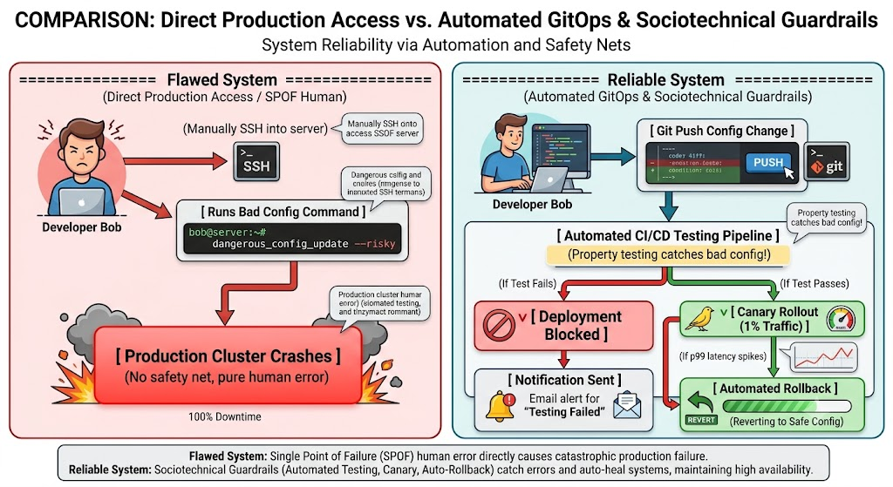
</div>

---

### 💻 Mockup System Design & Interview Scenario

**Scenario:** Aap aik Digital Banking aur Ledger app ke Software Architect hain. Ek senior database engineer ne jaldi mein live production database par manually data-cleanup script chalayi, jismein `WHERE` clause lagana bhool gaya. Is ghalti se 50,000 active users ka account balance zero ho gaya. Company ka pure market mein image kharab ho raha hai. Aap is incident ke baad system ko software aur process level par kaise redesign karenge taake yeh dubara kabhi na ho?

**Architectural Redesign Strategy (Blameless & Guardrailed Systems):**

1. **Eliminate Manual Write Access:** Hum kisi bhi human operator ka live production DB par direct `WRITE` ya `DELETE` access permanently khatam kar denge (Least Privilege RBAC).
2. **Infrastructure as Code (IaC) & Migration Guardrails:** Tamam database modifications sirf git commits ke zariye (GitOps) hongi. Peer review ke baghair koi script execute nahi ho sakegi.
3. **Database Point-in-Time Recovery (PITR):** Data loss se bachne ke liye continuous WAL (Write-Ahead Log) archiving enable karenge taake milliseconds ke gap par bhi state ko restore kiya ja sakay.

<div align="center">
  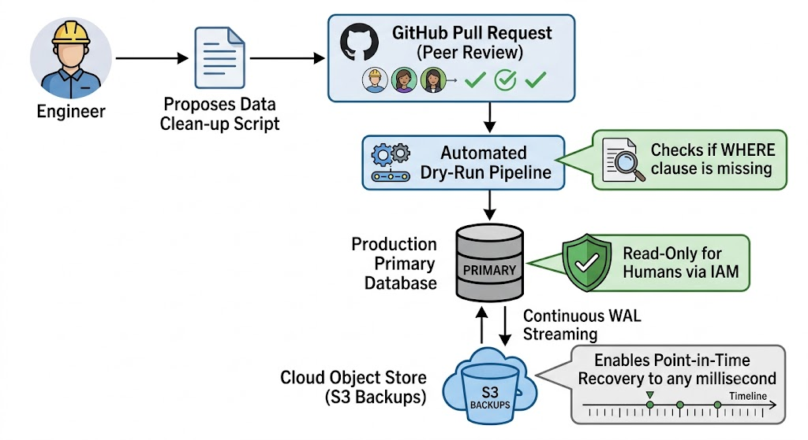
</div>

**Interview Trade-Off Questions:**

* **Question:** *Production database par direct manual write access block karne se kya operational speed slow nahi ho jayegi jab hme koi emergency bug live production par fix karna ho?*
* **Answer:** Yeh aik direct operational flexibility vs reliability ka trade-off hai. Manual access se speed milti hai lekin Horizon scandal ya data deletion jaise catastrophic risks paida hote hain. Hamara architectural decision reliability ko top priority dena hai. Emergency ke liye hum aik strict **"Break-Glass" Access Protocol** design karenge, jahan aik engineer temporary write access le sakega lekin uski har command digital audit log mein track hogi aur automatic notify karegi pure security team ko.


* **Question:** *Agar automated cleanup script khud buggy ho aur hamare tests use na pakad sakein, toh "Right to be Forgotten" (GDPR) ke append-only logs par deletion wale challenge ko is ledger system mein kaise tackle karenge?*
* **Answer:** Append-only ledgers mein hum data physically delete nahi kar sakte kyun ke cryptography/audit trail toot jati hai. Iska architectural trade-off yeh hai ke hum **Cryptographic Erasure** use karte hain. User ka personal ledger data encrypt kiya jata hai aik unique key se. Jab user delete request bhejta hai, hum database se data delete nahi karte, balkay uski cryptographic key ko shred (permanently destroy) kar dete hain. Key ke bager data immutable log mein para reh kar bhi unreadable rubish ban jata hai, jo GDPR compliance poora karta hai.


---

### 📌 Quick Revision Hints

* **Human Error is a Symptom:** Ghalti insaan se hi hoti hai; asal masla unke kaam karne ke tools aur sociotechnical design ka hota hai. Blaming is counterproductive.
* **Configuration Over Hardware:** Systems ke down hone ki sab se badi wajah ghalat network/software configurations hoti hain, hardware failures nahi.
* **Blameless Postmortems:** Outage ke baad darr ke bager ghaltiyan share karne ki culture taake pooray system ko secure banaya ja sakay.
* **Horizon Scandal Lesson:** Software engineering mein bugs aik mazaq ho sakte hain, lekin real world mein yeh logon ko jail pohncha sakte hain. Software guarantees matter.
* **Data Minimization vs Loss:** Sasta storage ka matlab yeh nahi ke sab kachra save rakhein; liability aur leak ka risk storage cost se kahin zyada bada hota hai.

---