# Data Models and Query Languages

Ludwig Wittgenstein ke mashhoor maqoolay ka matlab software engineering ki duniya mein bohot gehra hai. Agar hamare paas kisi cheez ko bayan karne ke liye sahi alfaaz ya model nahi hain, toh hum us problem ka aik behtareen solution soch hi nahi sakte. Data models sirf code likhne ka tareeqa tay nahi karte, balkay yeh hamare zehn mein problem ko solve karne ka poora framework set karte hain.

Most applications ko aik doosray ke upar mukhtalif layers ki surat mein build kiya jata hai. Har layer ki sab se barhi kamyabi yeh hoti hai ke woh apne se neeche wali layer ki complex details ko chhipa deti hai (abstract kar deti hai) aur upar wali layer ko aik saaf aur asan interface deti hai.

> <mark>Sochiye ke aap aik library system design kar rahe hain jahan har cheez ka structure aur behavior aapke model par depend karta hai.</mark>
>
> * **Scenario A (Weak Model):** <mark>Agar aap har kitaab ko sirf aik “text file” samajh lein, tou system sirf basic reading tak mehdood ho jata hai.</mark>
> * **Limit:** <mark>Aisi soorat me na aap author ke hisaab se search kar sakte hain, na topic ke hisaab se. Model ki simplicity hi uski sab se bari pabandi ban jati hai.</mark>
>
> * **Scenario B (Strong Model):** <mark>Agar aap kitaab ko aik “object” samajh kar uske attributes—Author, Genre, ISBN—define kar dein, tou system ka sochne ka andaaz badal jata hai.</mark>
> * **Power:** <mark>Is structured model ki wajah se complex queries chalana mumkin ho jata hai, aur system ka behavior zyada intelligent lagta hai.</mark>
>
> **Matalab:** <mark>Data model asal me aapke “dimaghi constraints” set karta hai. Sahi model chunne se mushkil problems bhi manageable ban jati hain.</mark>
>
> <mark>Abstraction ka concept yahan aik black box ki tarah kaam karta hai jahan aapko andar ki complexity ki parwah nahi hoti.</mark>
>
> Abstraction ka seedha matlab yeh hai ke  
> <mark>“Aapko sirf ye pata hona chahiye ke cheez istemal kaise hoti hai, na ke wo andar se kaise chal rahi hai.”</mark>
>
> <mark>Isi abstraction ko hum Interface kehte hain—wo boundary jahan se user ka interaction shuru hota hai aur internal mechanics chhup jati hain.</mark>
>
> Car ki misaal is concept ko aur wazeh banati hai:
>
> * **Aap (User/Application Layer):** <mark>Aap sirf steering wheel ghumate hain aur race dabate hain; engine ki internal physics aap se bilkul door hoti hai.</mark>
> * **Engine (Storage/Hardware Layer):** <mark>Yeh woh layer hai jahan asli complexity hoti hai, lekin user se poori tarah chhupi hoti hai.</mark>
>
> <mark>Agar driving ke liye engine ki physics samajhna zaroori hota, tou koi bhi gaari chalana na seekh pata. Software me bhi agar developer ko har choti hardware detail ka ilm hona zaroori ho, tou application banana namumkin ho jaye.</mark>
>
> <mark>Layers ka sab se bara faida yeh hota hai ke system ka har hissa doosre se decoupled hota hai—yaani aik layer badalne se poora system toot'ta nahi.</mark>
>
> In layers ki wajah se system maintainable, scalable aur predictable ban jata hai.  
> <mark>Yehi “decoupling” ka asal raaz hai: flexibility bina system ko damage kiye.</mark>


### Data Models ki Abstraction Layers

Real-world applications mein data ko higher level se lower hardware level tak le jaane ke liye darja-zail layers kaam karti hain:

1. **Application Developer Layer (The Real World to Objects):**
Aap bator application developer haqiqi duniya ki cheezon (jaise log, products, transactions, ya sensors) ko dekhte hain aur unhein apni programming language ke objects, data structures, aur APIs mein convert karte hain. Yeh layer bilkul aapki application ke business logic ke mutabaq design hoti hai.
2. **General-Purpose Data Model Layer (Objects to Databases):**
Jab aapko un programming objects ko hamesha ke liye store (persist) karna hota hai, toh aap unhein aik general-purpose data model mein express karte hain. Yeh models JSON/XML documents, relational tables, ya phir graph ke vertices aur edges ki shakal mein ho sakte hain. Is layer ka maqsad data ko structured aur queryable banana hota hai.
3. **Storage Engine Layer (Databases to Bytes):**
Database software banane wale engineers yeh faisla karte hain ke un relational tables, documents, ya graphs ko memory, disk, ya network par **bytes** ki shakal mein kaise represent karna hai. Yeh layer tay karti hai ke data ko disk par kis tarah optimize kiya jaye taake search, manipulation, aur processing tez tareen ho sakay.
4. **Hardware Layer (Bytes to Electrical/Physical Signals):**
Sab se lowest level par hardware engineers yeh system design karte hain ke un bytes ko electrical currents, light pulses (fiber optics), ya magnetic fields (hard drives) mein kaise badla aur mahfooz kiya jaye.


> `Application Developer` Layer aik aisa marhala hai jahan developer apne software ka conceptual blueprint tayar karta hai. Yahan tawajjo sirf is baat par hoti hai ke `kya` banana hai. Developer haqiqi duniya ki entities—jese customer ka order—ko logical objects me tabdeel karta hai. 
>
> * <mark>Asaan lafzon me:</mark> Aap sochte hain ke “Order” object me kya hona chahiye—ID, items, total price. 
> * <mark>Writer ki zaban me:</mark> Yeh woh stage hai jahan abstract soch ko structure diya jata hai. Hardware ki complexities se bilkul door, poora focus sirf business logic ko samajhne aur define karne par hota hai.
>
> `General‑Purpose Data Model` Layer me developer yeh tay karta hai ke in objects ko kis structured format me store kiya jaye. Yahan focus `kaise` par hota hai—yaani data ko kis tareeqay me rakhna hai taake machine aur software dono use samajh saken.
>
> * <mark>Asaan lafzon me:</mark> Objects ko JSON, Table, ya Graph jese formats me convert kiya jata hai—bilkul usi tarah jese khayalon ko grammar ke rules me dhal kar readable banaya jata hai.  
> * <mark>Writer ki zaban me:</mark> Yeh persistence ka marhala hai. Agar yahan galat model chun liya jaye—jaise Graph ki jagah rigid Table—tou poora system baad me data fetching me tangi mehsoos karega.
>
> `Storage Engine Layer` wo jagah hai jahan performance ka asli jaadu hota hai. Yeh layer developer se chhupi hoti hai, lekin system ki scalability ka asli raaz yahi hota hai. Yahan focus hota hai ke data `kitni tezi se` retrieve ho sakta hai.
>
> * <mark>Asaan lafzon me:</mark> PostgreSQL, MongoDB jese databases yeh decide karte hain ke data disk par kahan rakha jaye taake query karne par nano‑seconds me wapas mil jaye. Indexing, caching aur compression jese tools yahin istemal hote hain.  
> * <mark>Writer ki zaban me:</mark> Yeh optimization ka فن hai—bilkul us librarian ki tarah jo kitaabon ko is tarah rakhta hai ke unhein dhoondhna mushkil na ho.
>
> `Hardware Layer system` ki bunyaad hai—yahan sab kuch `physics` par aa kar ruk jata hai. Virtual duniya ka har hissa akhir me physical reality me hi exist karta hai.
>
> * <mark>Asaan lafzon me:</mark> Data akhir me disk ki magnetic plates ya SSD cells me electrical signals (0s aur 1s) ki shakal me qaid hota hai.  
> * <mark>Writer ki zaban me:</mark> Yeh woh foundation hai jahan software aur physics milte hain. Agar disk ki read/write speed kam ho, tou code kitna bhi behtareen ho, system slow hi chalega.


<div align="center">
  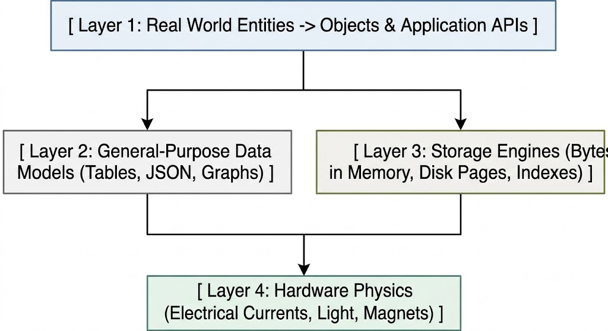
</div>

* **Complexity Hiding:** Har layer apne se neeche wali layer ki pechidegiyon ko hidden rakhti hai. Aik application developer ko is baat se koi sarakkar nahi hota ke hardware par magnetic field kaise change ho rahi hai; unhein sirf apni API aur database model se matlab hota hai.
* **Effective Collaboration:** Is behtareen abstraction ki wajah se database vendor ke engineers (jo C/C++ mein storage engines likhte hain) aur application developers (jo Python ya Java mein business apps banate hain) aik doosray ke kaam mein rukawat bane bina, azadana aur behtareen tareeqay se kaam kar sakte hain.
* **Model Trade-offs:** Har data model ki apni taqat aur kamzori hoti hai. Jo data relational tables mein asani se fit ho jata hai, ho sakta hai usay graph model mein likhna mushkil ho, aur iska ulta bhi mumkin hai. Isliye sahi model ka intekhab poore system ki performance ka faisla karta hai.

---

## Terminology: Declarative Query Languages

SQL, Cypher, SPARQL, aur Datalog jaise query languages **declarative** hoti hain. Iska matlab yeh hai ke aap database ko sirf yeh batate hain ke aapko **kya (WHAT)** data chahiye, uske upar kya conditions honi chahiye, aur output kis tarah transform (sort, group, ya aggregate) hona chahiye. Aap database ko yeh hargiz nahi batate ke yeh goal **kaise (HOW)** hasil karna hai.

### Declarative vs Imperative ka Farq aur Trade-offs

* **The Role of Query Optimizer:** Declarative languages mein database ka aik ahem component jise **Query Optimizer** kehte hain, woh khud yeh faisla karta hai ke kaunsa index scan karna hai, kaunsa join algorithm (jaise Hash Join ya Merge Join) chalana hai, aur query ke mukhtalif hisson ko kis tarah sequence mein execute karna hai.
* **Imperative Approach (Python/Java):** Iske baraks, jab aap traditional programming languages mein code likhte hain, toh aap computer ko aik explicit algorithm dete hain ke pehle step A karo, phir array par loop chalao, phir condition check karo. Yeh *Imperative* approach hai jahan aap "HOW" par focus karte hain.


> <mark>Declarative style me kaam karte waqt developer aik director ki tarah sirf outcome batata hai—yaani system se kya hasil karna hai.</mark> Aap bas yeh specify karte hain ke “June ki wo sales do jo 1000$ se zyada hain,” aur database khud decide karta hai ke is request ko sab se behtar tareeqe se kaise execute karna hai.
>
> * <mark>Aap sirf natija batate hain, tareeqa nahi.</mark> Aap yeh nahi batate ke disk par kahan jana hai, kaunsa index use karna hai, ya kis sequence me data uthana hai.
> * Yeh bilkul us waiter ki misaal jaisa hai jise aap sirf itna kehte hain: “Mujhe pizza chahiye.” Pizza kaise banega, oven ka temperature kya hoga—yeh sab kitchen ka kaam hai, aapka nahi.
>
> Imperative style me developer aik chef ki tarah har step khud likhta hai. Yahan focus “kaise” par hota hai—yaani process ko manually define karna.
>
> * <mark>Aap har qadam specify karte hain:</mark> pehle flour lo, phir pani dalo, dough gundo, oven me rakho, timer lagao.  
> * Agar ek bhi step ghalat ho jaye, poora result bigad jata hai.  
> * Programming me `for loop` lagana bhi isi soch ka hissa hai—computer ko batana padta hai ke pehle index 0 par jao, phir 1 par, phir condition check karo.
>
> Declarative systems ki asli taqat unke query optimizer me hoti hai—wo “invisible genius” jo aapki request ko parh kar sab se efficient execution plan banata hai.
>
> * <mark>Optimizer decide karta hai:</mark> kya poora table scan karna behtar hai ya index use karna?  
> * Kaunsa join pehle hona chahiye?  
> * Kaunsa raasta sab se kam disk I/O use karega?
>
> <mark>Optimizer ka role is liye critical hai kyunke woh aapki imperfect query ko bhi behtar bana kar chalata hai.</mark> Agar SQL me aapne query thodi tedhi likh di ho, toh optimizer usay sudhar kar sab se efficient plan choose karta hai.
>


<div align="center">
  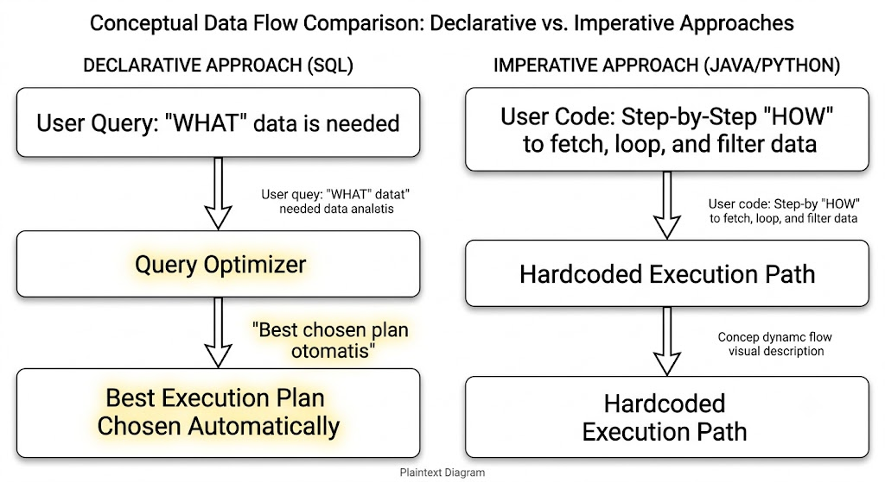
</div>

* **Performance and Maintenance Benefits:** Declarative query language ka sab se barha faida yeh hai ke yeh nihayat mukhtasar (concise) hoti hai aur isay likhna asan hota hai. Is se bhi barh kar, yeh query engine ke andarooni implementation details ko chupati hai. Agar database company apne execution engine ko mazeed behtar ya tez bana deti hai, toh aapko apna SQL query code badalne ki bilkul zaroorat nahi padti. Aapki queries khud-ba-khud tez ho jati hain.
* **Automatic Parallelism:** Aik complex database declarative query ko backend par multiple CPU cores aur alag-alag machines par parallel mein distribute karke execute kar sakta hai, aur developer ko is parallel processing ki ratti barabar bhi fikar nahi karni padti. Agar aap yahi kaam khud manually coding (imperative) ke zariye karte, toh aapko multi-threading, race conditions, aur data sharding ka poora manual control sambhalna padta, jo ke nihayat mushkil aur error-prone kaam hai.

---

## Interview aur Mockup System Design Scenario

### Scenario (The Problem)

Aap aik bade Scale ka **E-commerce Analytics Dashboard** design kar rahe hain jahan business users har ghante ki sales, category-wise trends, aur high-value customers ka data real-time mein filter aur analyze karte hain. Pehle yeh system aik custom imperative data script (Python loop-based filtering) par chal raha tha, jo ke scale nahi ho pa raha aur jab bhi data ka volume badhta hai ya storage format change hota hai, poora pipeline break ho jata hai. Aapko is system ko high availability aur performance ke liye redesign karna hai using Proper Abstraction and Query Models.

### System Design Core Decisions & Trade-offs

1. **Abstraction Layer Separation:** Hum Analytics API aur Raw Storage ke darmiyan aik clear separation layer rakhenge taake agar hum backend storage par Row-oriented format se Column-oriented format (e.g., Parquet/ClickHouse) par switch karein, toh dashboard ka dashboard code break na ho.
2. **Declarative Querying over Imperative Loops:** Data filtering aur aggregation ke liye custom loops likhne ke bajaye hum declarative querying use karenge. Is se query optimizer ko mouqa milega ke woh data sharding aur parallel execution ko handle kare bina application layer ko disturb kiye.

### Architectural Flow Diagram

<div align="center">
  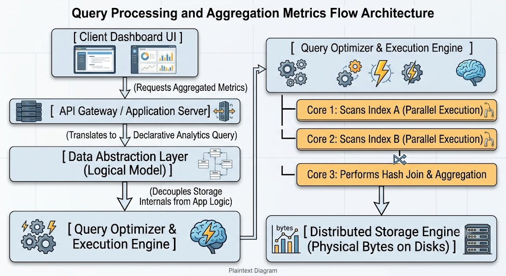
</div>

### Interview Talk (Key Takeaways)

* **Interviewer Question:** Agar hum data processing ka logic application layer mein Python worker threads ke zariye likhein, toh kya nuksan hai?
* **Your Answer:** Agar hum imperative tareeqay se application layer mein data filter karenge, toh pehle hazaaron rows ko network ke zariye database se app server par pull karna padega (High Network I/O overhead). Mazeed yeh ke agar database ke indexes ya partition schemes change hoteri hain, toh hamara application code break ho jayega. Declarative model use karne se database engine query ko data ke bilkul qareeb (compute pushdown) parallelize kar sakta hai aur sirf final computed result network par bhejta hai, jo system ko scale karne ke liye behtareen design pattern hai.


---

## Relational Versus Document Models

Aaj ki software engineering ki duniya mein SQL sab se zyada jana-pehchana aur istemal hone wala data model hai, jis ki buniyaad Edgar Codd ne 1970 mein **Relational Model** ke roop mein rakhi thi. Is model ke mutabaq, data ko **Relations** (jise hum tables kehte hain) mein organize kiya jata hai, aur har relation un-ordered **Tuples** (yaani database rows) ka aik majmua hota hai.

### Relational Model Ka Irtiqa Aur Dominance

* **Theoretical Origins to Market Dominance:** Jab Edgar Codd ne yeh model pesh kiya, toh yeh sirf aik math-based theoretical proposal tha. Us daur ke engineers ko shaq tha ke kya is tarah ke model ko computer disk par efficiently implement kiya bhi ja sakta hai ya nahi, kyun ke is mein explicit pointers ke bajaye logical joins par rely kiya jata tha. Magar 1980s ke darmiyan tak, Relational Database Management Systems (RDBMS) aur SQL itne behtar ho chuke thay ke yeh regular ya structured data ko store aur query karne ke liye industry ka standard ban gaye.
* **Long-Term Success in Analytics:** Decades guzarne ke baad bhi, business analytics aur data warehousing jaiseuse cases mein relational model ka hi raj hai, jahan data ko *Star* aur *Snowflake* schemas mein organize karke complex reporting ki jati hai.

### Muqabla Aur Tareekhi Data Models

Relational model ne market par qabza karne ke liye lambi ladaas ladi hai. Iske raaste mein kayi competitors aaye:

* **Hierarchical and Network Models (1970s - 1980s):** Yeh relational model ke sab se pehle aur bade competitors thay. Hierarchical model (jaise IBM ka IMS) data ko aik tree structure mein dekhta tha, jabke Network model (CODASYL) explicit memory pointers ke zariye records ko aapas mein jorhta tha. Relational model ne in dono ko isliye shikast di kyun ke is ne developer ko physical pointer paths ke jhanjhat se azad kar diya.
* **Object Databases (Late 1980s - Early 1990s):** Jab Object-Oriented Programming (OOP) ka raaj shuru hua, toh laga ke object databases relational ka khatma kar dein gi taake programming objects ko direct save kiya ja sakay. Magar yeh commercial level par nakaam rahin aur bohot jaldi gayab ho gaein.
* **XML Databases (Early 2000s):** Internet ke anay par XML format ka shor macha, aur khususat XML databases bani hain, magar inka adoption sirf kuch makhsoos (niche) industries tak mahdood raha.

<div align="center">
  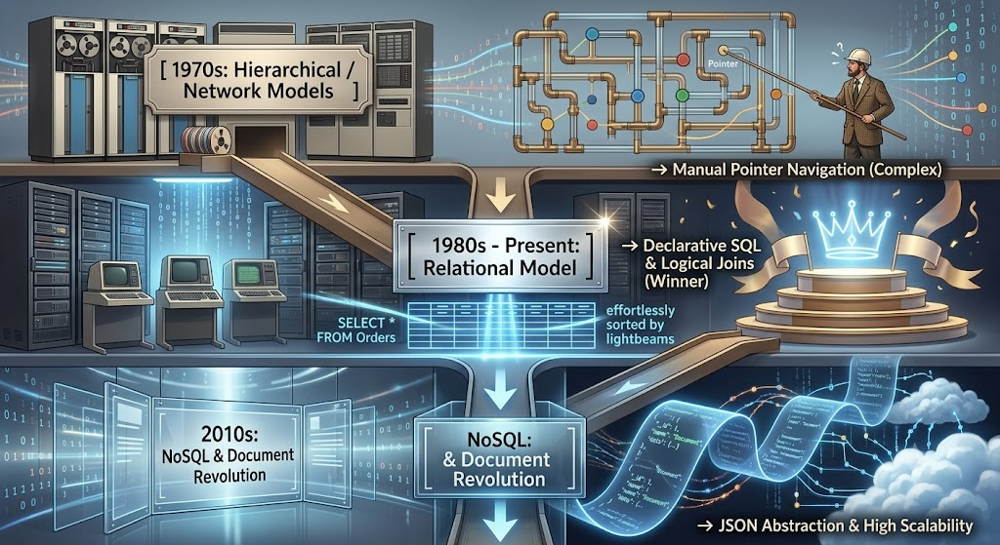
</div>

* **SQL's Adaptation Strategy:** Relational model ki kamyabi ka aik bada sabab yeh bhi hai ke is ne waqt ke saath khud ko badla. Jab XML aur JSON ka trend aaya, toh SQL databases (jaise PostgreSQL aur MySQL) ne in formats ko apne andar hi support karna shuru kar diya, jis se competitors ki zaroorat khatm ho gayi.

---

### NoSQL Aur NewSQL Ka Daur

2010s mein **NoSQL** ka lafz aik naye inqilab ke roop mein ubhra. Iska maqsad relational databases ki badshahat ko radd karna tha.

* **NoSQL Ke Core Pillars:** NoSQL koi aik single technology nahi hai, balkay yeh chand ahem makhsoos goals ka naam hai:
1. **Schema Flexibility:** Data store karne ke liye pehle se rigid tables aur columns design karne ki zaroorat nahi.
2. **Horizontal Scalability:** Data ko aik hi bade super-computer par rakhne ke bajaye commodity servers ke pure cluster par divide (shard) karna.
3. **Open Source Adoption:** Proprietary software ke bajaye open-source community-driven tools ka istemal.


* **The Rise of NewSQL:** Jab logo ne dekha ke NoSQL scale toh accha karta hai magar relational databases jaisi transactional guarantees (ACID properties) nahi deta, toh **NewSQL** databases wajood mein aaein. Unka maqsad NoSQL ki scalability aur Relational ka transactional trust aik sath dena tha. Waqt ke saath jab yeh saare principles aam databases mein merge ho gaye, toh NoSQL aur NewSQL jase words ka trend ab dheema ho chuka hai.

---

### Document Model Ki Kamyabi

NoSQL movement ka jo sab se mazboot aur mustaqil asar baqi raha, woh hai **Document Model** ki popularity, jo aam taur par data ko **JSON** format mein represent karta hai.

* **MongoDB aur Couchbase ka Kirdar:** Is model ko specialized document databases ne aam banaya. JSON documents ko unke flexible nature ki wajah se pasand kiya jata hai. Relational tables mein agar aapko aik naya column add karna ho, toh poore table par *ALTER TABLE* chalana padta hai jo bade production systems mein risk hota hai. Iske mukable mein, JSON documents mein har record (document) ka apna alag structure ho sakta hai bina kisi global schema ki pabandi ke.

```plaintext
Relational Storage (Rigid Normalized Structure):
[ Table: Users ] ───(Needs Join)───> [ Table: Contact Info ]

Document Storage (Self-Contained JSON Document):
{
  "user_id": 101,
  "name": "Hashim",
  "contact": { "email": "hashim@email.com", "phone": "12345" }
}
```

---

## Interview aur Mockup System Design Scenario

### Scenario (The Problem)

Aap aik modern **Content Management System (CMS)** aur User Profile service design kar rahe hain jahan alag-alag qism ke users (e.g., Authors, Clients, Guest Users) apna data save karte hain. Har user type ke attributes bilkul mukhtalif hain (Authors ke paas unki publications aur bio hai, jabke Clients ke paas company details aur billing history hai). Mazeed yeh ke marketing team har hafte naye custom fields profile mein add karti rehti hai. Agar aap aik traditional relational database use karte hain, toh har schema change par heavy migration karni padti hai jo zero-downtime deployement mein rukawat banti hai.

### System Design Core Decisions & Trade-offs

* **Relational Core Data vs Document Profile Data:** Hum core application features (jaise billing, accounting, subscriptions) ke liye relational storage engine use karenge kyun ke wahan multi-table transactional consistency zaroori hai. Magar User Profile aur Custom Fields ke liye hum **Document Model (JSON)** ka intekhab karenge.
* **Trade-off (Schema-on-Write vs Schema-on-Read):** Relational database *Schema-on-write* hota hai (database check karta hai ke data format sahi hai ya nahi save karte waqt). Document database *Schema-on-read* hota hai (data jaisa bhi ho save ho jata hai, application read karte waqt uski validation handle karti hai). Hum flexibility ke liye schema-on-read ka trade-off select kar rahe hain taake product agility barhi rahe.

### Architectural Flow Diagram

<div align="center">
  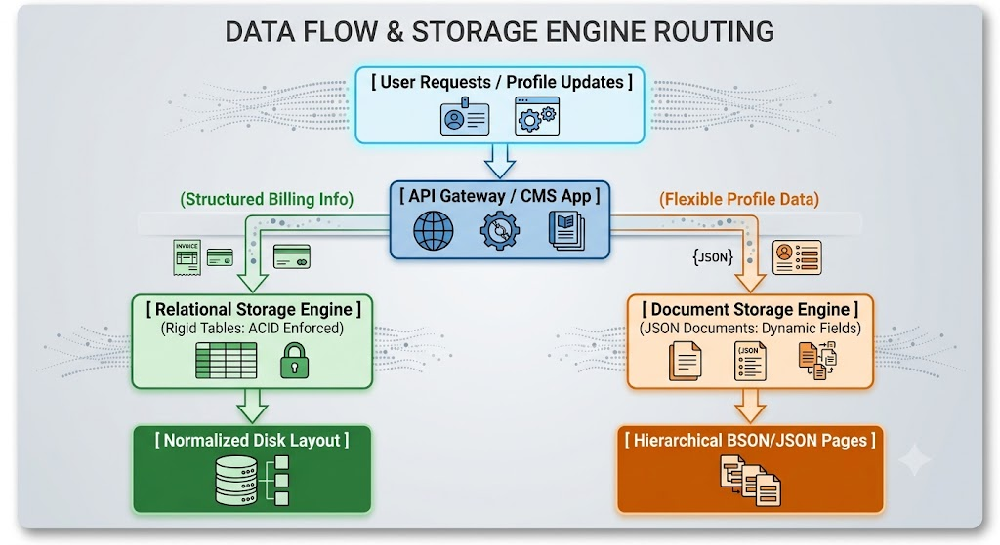
</div>

### Interview Talk (Key Takeaways)

* **Interviewer Question:** Kya hum document model ka maza kisi relational database mein nahi le sakte? Aaj kal toh PostgreSQL bhi JSONB support karta hai.
* **Your Answer:** Bilkul le sakte hain, aur yeh aik behtareen hybrid approach hai. Agar hum PostgreSQL ka `JSONB` data type use karte hain, toh humein relational integrity (Foreign Keys for main user ID) bhi milti hai aur sath hi aik column ke andar dynamic JSON data store karne ki flexibility bhi mil jati hai. Magar agar hamara poora application workflow hi completely document-centric hai aur humein bohot bade scale par data ko cluster par write-heavy partitions mein distribute karna hai, toh MongoDB jaisa dedicated document database native horizontal sharding aur behtar scaling automation provide karega jo RDBMS ke upar JSON chalane se zyada efficient hoti hai.

---

## The Object-Relational Mismatch

Software engineering ki dunya mein aik bohot bada structural gap hai: jis tarah data ko application code (Object-Oriented Programming like Java, Python) mein represent kiya jata hai, aur jis tarah data ko Relational Databases (SQL tables, rows, columns) mein mahfooz kiya jata hai, un dono mein aik wazeh tazaad (disconnect) hai. Is disconnect ko distributed systems ki zabaan mein **Impedance Mismatch** kaha jata hai.

### Impedance Mismatch Ka Concept Aur Analogy

Yeh term asal mein electronics se udhaar li gayi hai. Kisi bhi electric circuit ke inputs aur outputs ki aik makhsoos impedance (alternating current ke khilaf resistance) hoti hai. Agar aap do circuits ko aapas mein jorhte hain, toh maximum power transfer tabhi hota hai jab dono ki impedance aapas mein match karein. Agar mismatch ho, toh signal reflect hota hai aur energy ka zaya hota hai.

Bilkul isi tarah, software mein jab aap application ke rich object graphs (jo memory mein pointers ke zariye connected hote hain) ko database ke flat 2D relational tables mein save karne ki koshish karte hain, toh aapko aik complex translation layer likhni padti hai. Is translation layer ki wajah se development velocity dheemi ho jati hai aur system ki performance par asar padta hai.

---

## Object-relational mapping

Is translation layer ke bohot bade boilerplate code (repetitive SQL statements) ko kam karne ke liye **Object-Relational Mapping (ORM)** frameworks (jaise Java mein Hibernate aur Ruby/Rails mein ActiveRecord) banaye gaye. ORM ka kaam programming objects ko database tables ke sath automatically map karna hai, magar is approach par bohot architectural criticisms hain.

### ORMs Ke Core Problems Aur Architectural Trade-offs

* **Abstraction Leakage aur Complexity:** ORMs bohot complex hote hain aur yeh relational model aur object model ke darmiyan ke farq ko poori tarah chhipa nahi sakte. Aik developer ko barh-e-raast dono models ke baare mein sochna padta hai, kyun ke agar database level par data normalized hai, toh ORM ko batana padta hai ke objects ko kis tarah map kiya jaye.
* **OLTP vs Analytics (OLAP) ka Pechida Masala:** ORMs ko aam taur par sirf OLTP (Online Transaction Processing) applications yaani daily operations ke liye design kiya jata hai. Data engineers jo analytics aur business intelligence par kaam karte hain, unhein direct raw relational structures aur tables par queries chalani hoti hain. Isliye, agar ORM ne backend par ajeeb o ghareeb schema generate kiya hai, toh data warehousing aur analytics ke liye bohot mushkil paida ho jati hai.
* **Polyglot Persistence Ki Kami:** Zyada tar ORMs sirf relational SQL databases ke sath hi chalte hain. Agar kisi complex organization mein diverse data systems use ho rahe hain—jaise Search Engines (Elasticsearch), Graph Databases (Neo4j), ya NoSQL document stores—toh wahan traditional ORMs fail ho jate hain aur unka support khatam ho jata hai.
* **Inefficient Schema Generation:** Kuch ORMs database schema ko khud-ba-khud generate karte hain. Yeh auto-generated schemas aksar inefficient hote hain aur queries ko database par slow kar dete hain. Jab aap unhein customize karne baithte hain, toh customization itni complex ho jati hai ke ORM use karne ka a असल faida hi khatam ho jata hai.

### The N+1 Query Problem (Performance Bottleneck)

Yeh ORM frameworks ka sab se mashhoor aur khatarnak performance trap hai.

Misaal ke taur par, aapko aik page par $N$ comments display karne hain, aur har comment ke sath uske author ka naam dikhana hai.

1. **ORM Approach:** ORM pehle aik query chalaye ga jo $N$ comments le kar aayegi. Ab har comment ke andar author ki `user_id` maujood hogi. Author ka naam nikalne ke liye ORM loop ke andar har single comment ke liye alag se database query chalaye ga. Is tarah pehle comment ke liye 1 query, aur phir $N$ comments ke authors ke liye $N$ mazeed queries chalengi. Total **$N+1$ queries** database par hit karengi, jo network I/O overhead ko be-tahasha badha dengi.
2. **Handwritten SQL Approach:** Agar aap khud SQL likhein, toh aap aik single query ke andar hi `JOIN` operations perform kar ke comments aur users ka data aik hi dafa mein database se nikal sakte hain.

```plaintext
[ Handcoded SQL Solution (1 Query) ]
User Request -> SELECT * FROM comments JOIN users ON comments.user_id = users.id -> Returns complete data in 1 Roundtrip

[ ORM Inefficient Solution (N+1 Queries) ]
User Request -> 1. SELECT * FROM comments (Returns N rows)
             -> 2. SELECT * FROM users WHERE id = 1
             -> 3. SELECT * FROM users WHERE id = 2  ... up to N times (N Roundtrips!)

```

* **ORMs Ke Advantages:** In sab nuksanat ke bawajood, ORMs ka faida yeh hai ke yeh simple CRUD operations ke liye boilerplate code ko khatam karte hain. Yeh database query results ko cache karne mein madad dete hain aur database schema migrations (tables ke structure ko upgrade/downgrade karna) ko manage karna asan banate hain.

---

## The document data model for one-to-many relationships

Har qism ka data relational tables mein fit nahi baithta. Is ko samajhne ke liye hum LinkedIn Profile (Resume) ki real-world example ko dono models ke lehaz se dissect karte hain.

<div align="center">
  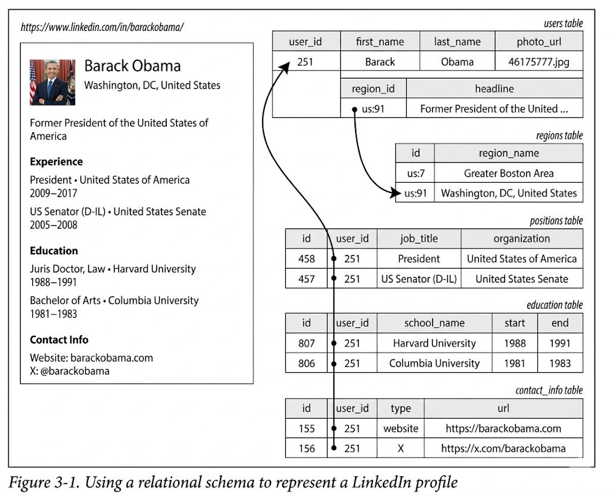
</div>

### Relational Model Ka Approach (Figure 3-1)

Agar hum LinkedIn profile ko relational database mein design karein (jise Figure 3-1 mein dikhaya gaya hai), toh humein pooray data ko normalize karna padega:

* **users table:** Is mein user ki unique identity `user_id (251)`, `first_name`, `last_name`, aur profile picture ka URL save hoga, kyun ke yeh pure profile mein sirf aik hi dafa aate hain.
* **regions table:** Location (`region_id`) ko alag table mein rakha jata hai taake data duplicate na ho (jaise `us:91` ka matlab "Washington, DC, United States" hai).
* **positions, education, aur contact_info tables:** Chunke aik user ke paas multiple jobs (positions) aur multiple degrees (education) ho sakti hain, isliye yeh **One-to-Many relationship** banata hai. In sab ko alag-alag tables mein rakha jata hai aur har record mein aik Foreign Key (`user_id = 251`) lagayi jati hai jo `users table` ke primary record ko point karti hai.

**Problem:** Jab bhi aapko Barack Obama ki profile ka page load karna hoga, system ko ya toh 4 se 5 alag-alag SQL queries chalani padengi ya phir aik bohot hi messy aur heavy multi-way `JOIN` query execute karni padegi, jo disk par se alag-alag jagah se data dhoond kar layegi.

### Document Model Ka Approach (Example 3-1 aur Figure 3-2)

<div align="center">
</div>

Document model isi information ko aik self-contained **JSON document** ki shakal mein store karta hai (jise Example 3-1 mein dikhaya gaya hai).

```plaintext
[ Document Store Logical Disk Layout ]
{
 "user_id": 251,
 "first_name": "Barack",
 "last_name": "Obama",
 "headline": "Former President of the United States of America",
 "region_id": "us:91",
 "photo_url": "/p/7/000/253/05b/308dd6e.jpg",
 "positions": [
 {"job_title": "President", "organization": "United States of America"},
 {"job_title": "US Senator (D-IL)", "organization": "United States Senate"}
 ],
 "education": [
 {"school_name": "Harvard University", "start": 1988, "end": 1991},
 {"school_name": "Columbia University", "start": 1981, "end": 1983}
 ],
 "contact_info": {
 "website": "https://barackobama.com",
 "x": "https://x.com/barackobama"
 }
}
===> Stored together as a single contiguous block/string on disk.

```

* **Data Locality (Read Optimization):** JSON document ka sab se bada faida yeh hai ke is mein **Data Locality** behtareen hoti hai. Profile ka poora data disk par aik hi jagah, aik hi contiguous block mein save hota hai. Jab application profile request karti hai, toh database bina kisi `JOIN` ke, sirf aik single disk read operation se poora tree-structure data utha kar le aata hai, jo read latency ko bohot kam kar deta hai.


  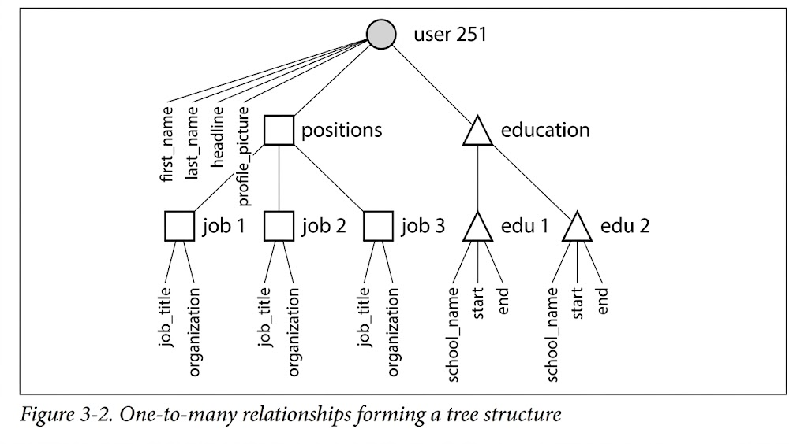

* **Tree Structure Explicit (Figure 3-2):** One-to-many relationships asal mein data ka aik tree structure banati hain. Figure 3-2 ke mutabaq, Root node `user 251` hai. Is root node se branches nikal rahi hain: aik branch `positions` ki taraf jati hai jo aage sub-branches `job 1`, `job 2` mein divide hoti hai. Doosri branch `education` ki taraf jati hai. JSON model is tree structure ko naturally aur explicitly apnata hai, jis se programming codes ke objects ke sath impedance mismatch khatam ho jata hai.

### The Bounded vs Unbounded Trap (One-to-Many vs One-to-Few)

Yahan aik bohot critical architectural nuance hai: LinkedIn resume mein positions aur education hamesha limited hoti hain (aam taur par aik insan 5 ya 10 jobs badalta hai). Isko hum **One-to-Few** kehte hain. Aise data ke liye document model mein data ko embed karna perfect hai.

Magar, agar relationship sach mein **One-to-Many** ke bajaye **One-to-Unbounded** ho—misaal ke taur par, kisi celebrity ki social media post par aane wale lakhon comments—toh aap un saare comments ko single post document ke andar embed **nahi** kar sakte. Is se document ka size hadd se zyada badh jayega (jaise MongoDB ki 16MB per document limit hai), read/write magnification ka masla hoga, aur system crash ho jayega. Aise unbounded scenarios ke liye hamesha relational table approach (jahan har comment alag row hoti hai) behtar hoti hai.

---

## Interview aur Mockup System Design Scenario

### Scenario (The Problem)

Aap aik bade scale ka **Professional Networking Platform (LinkedIn Clone)** design kar rahe hain. Is platform par har mahine millions of active users profiles dekhte hain (Read Heavy). Purana architecture aik traditional RDBMS par chal raha tha jahan profile load karne ke liye 6 tables par custom joins lagte thay. Peak hours mein heavy joins aur ORM ke generate kiye huay inefficient queries ki wajah se Database CPU 95% touch kar jata hai, aur profile loading mein latency 3 seconds tak chali jati hai. Aapko is profile rendering pipeline ko sub-100ms latency par lekar aana hai.

### System Design Core Decisions & Trade-offs

1. **Migration to Document Model for Profiles:** Hum user profiles ke read-heavy section ko relational DB se hata kar aik Document Store (ya PostgreSQL JSONB column with indexing) par shift karenge taake multi-table joins ka jhanjhat hi khatam ho jaye aur Data Locality ka bharpoor faida uthaya ja sakay.
2. **Trade-off (Write Cost vs Read Speed):** Document model select karne se profile update (write operation) thoda costly ho sakta hai kyun ke poora document dobara write karna padta hai, magar hamara system 95% Read-Heavy hai, isliye hum ne reads ko optimize karne ke liye writes par thoda compromise (trade-off) kiya hai.

### Architectural Flow Diagram

<div align="center">
  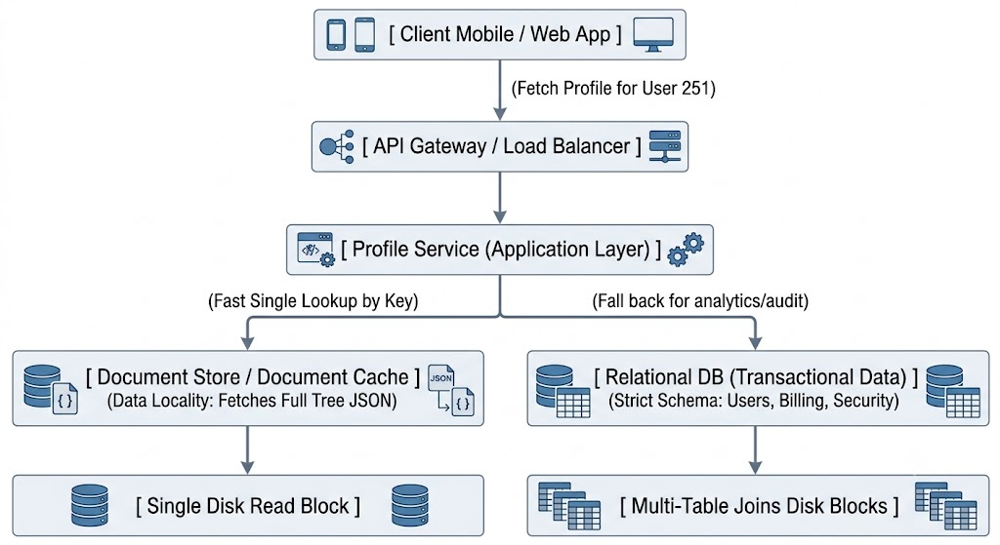
</div>

### Interview Talk (Key Takeaways)

* **Interviewer Question:** Agar hum document model use karte hain aur kal ko kisi school ya company ka naam change hota hai, toh humein har user ke profile document ke andar ja kar usay update karna padega. Is data duplication aur consistency ke maslay ko kaise handle karenge?
* **Your Answer:** Yeh document model ka aik ahem trade-off hai jise *Denormalization* kehte hain. Agar school ya company ka naam badalta hai, toh updates asynchronous background workers ke zariye batch processing mein chalaye ja sakte hain, kyun ke profiles par thodi si eventual consistency (kuch der baad naam update dikhna) acceptable hai. Magar iske badlay mein jo humein read speed mein data locality ka faida mil raha hai, woh production system ko scale karne ke liye zyada zaroori hai. Agar transaction consistency 100% zaroori ho (jaise user payments), toh hum strictly relational path hi use karenge.

---

## Normalization, Denormalization, and Joins

Kitab ke pichle section mein di gayi example mein `region_id` ko aik makhsoos ID (`us:91`) ke roop mein store kiya gaya tha, na ke seedha plain text "Washington, DC, United States" likha gaya. Writer iski ahem architectural wajahat bayan karta hai.

Agar aapke application UI mein user ke paas khuli choot ho ke woh free-text field mein kuch bhi type kar sake, toh plain text save karna samajh aata hai. Magar bade systems mein hamesha geographic regions ki aik standardized list banayi jati hai jahan se user drop-down ya autocompleter ke zariye option select karta hai. Is standardized list aur ID base system ke 5 bade architectural faide hain:

* **Consistent Style and Spelling:** Poore platform par har user ki profile par state aur city ka naam bilkul aik hi tareeqay se spell aur display hoga, koi typo ya spelling ki galti nahi hogi.
* **Avoiding Ambiguity:** Aik hi naam ke kayi shahar ho sakte hain (jaise "Washington" aik state bhi hai aur DC aik city bhi). Agar sirf text store kiya jaye toh database confuse ho sakta hai, magar aik unique ID is pechidgi ko hamesha ke liye khatam kar deti hai.
* **Ease of Updating (Single Source of Truth):** Agar kal ko kisi siyasi ya jughrafiyai tabdeeli ki wajah se kisi shahar ka naam badal jata hai, toh aapko millions of users ke records ko badalne ki zaroorat nahi padegi. Aap sirf `regions` table mein us ID ke agay naam badal dein ge, aur poore system mein har jagah automatic naya naam reflect ho jayega.
* **Localization Support:** Agar aapki website multiple languages (English, Spanish, Urdu) support karti hai, toh aapko har profile par text badalna nahi padega. Standardized IDs ki madad se database viewer ki language ke mutabaq sahi tarjuma (translation) fetch kar ke dikha sakta hai.
* **Advanced Search Functionality:** Agar koi user search karta hai ke "US East Coast" ke log kaun hain, toh database asani se is profile ko dhoond lega kyun ke standardized regions ke database mein yeh pehle se encoded hota hai ke Washington East Coast par waqe hai. Yeh intelligent linkage sirf plain text string se nikalna namumkin hai.

### Normalization aur Denormalization Ki Core Definition

ID store karne ya direct text store karne ka faisla asal mein **Normalization** aur **Denormalization** ka buniyadi farq hai:

1. **Normalized Data:** Jab aap ID use karte hain, toh data normalized hota hai. Iska matlab hai ke insano ke samajhne ke liye jo meaningful data hai (jaise text "Washington, DC"), woh poore database mein sirf **aik hi jagah** save hoga. Baki jitne bhi tables ya records hain, woh sirf us ID ka reference use karenge. ID ka maqsad sirf database ke andarooni links banana hota hai.
2. **Denormalized Data:** Jab aap text ko barh-e-raast har user ke record mein bina kisi ID ke save kar dete hain, toh aap redundant data (duplication) paida kar rahe hote hain. Har record mein wahi text bar bar copy ho raha hota hai.

### Joins Ka Architectural Role Aur Unka Cost

Normalized data ka sab se bada faida yeh hai ke kyun ke ID ka insano se koi lena dena nahi hota, isliye yeh kabhi tabdeel nahi hoti. Agar real-world information badal bhi jaye, ID same rehti hai. Is se extra write operations, zayed disk space, aur data inconsistency (jahan kuch jagah data update ho jaye aur kuch jagah purana reh jaye) ka khatra khatam ho jata hai.

Magar normalized data ka aik bohot bada downside hai: **The Cost of Joins**. Jab bhi aapko screen par user ka data dikhana hoga, aapko ID ko badal kar human-readable text banana padega. Relational model mein yeh kaam `JOIN` query ke zariye kiya jata hai, jahan database running time par users table aur regions table ko aapas mein map karta hai.

Document databases dono normalized aur denormalized data store kar sakte hain, magar unka झुकाव (inclination) zyada tar **Denormalization** ki taraf hota hai. Iski do barhi wajahat hain:

* JSON data model ka structure aisa hai ke is mein nested fields aur arrays ke zariye denormalized data rakhna nihayat asan hai.
* Zyadatar document databases mein `JOIN` ka support bohot kamzor ya bilkul nahi hota. Agar join support na ho, toh aapko **Application-Level Join** karna padta hai—yaani application pehle aik query chala kar document fetch karegi, phir us se ID nikal kar doosri query ke zariye doosray document se naam resolve karegi. MongoDB mein is maslay ko hal karne ke liye `$lookup` operator use kiya jata hai jo aggregation pipeline ke zariye backend par tables ko join karta hai, magar yeh relational database ke native joins jitna efficient nahi hota.

---

## Trade-offs of normalization

LinkedIn profile ki example mein, jabke `region_id` aik normalized field thi, wahan par user ki company (organization) aur school ka naam sirf saadha text (strings) ke roop mein save kiya gaya tha. Yeh representation mukammal taur par denormalized hai, kyun ke agar hazaaron log aik hi school mein padhte hain, toh un sab ke profiles mein us school ka naam bar bar duplicate ho raha hai aur koi central ID unhein aapas mein nahi jorhti.

### Logo URL Ki Architectural Misaal

Agar hum faisla karein ke school aur company ko bhi aik alag normalized entity bana diya jaye aur unka ID use kiya jaye, toh trade-offs ka wazeh farq samne aata hai. फर्ज़ karein hum har school ya company ka **Logo Image URL** bhi profile par dikhana chahte hain:

* **Denormalized Schema Ke Tehat:** Hum har user ke JSON document ke andar school ke naam ke sath uske logo ka URL bhi embed kar dein ge. Is se JSON document self-contained ho jayega (read karte waqt kisi aur table par nahi jana padega). Magar kal ko agar school apna logo change karta hai, toh engineering team ke liye aik bohot bada azab khada ho jayega. Unhein poore database mein millions of documents ko scan kar ke har jagah purana URL naye URL se update karna padega.
* **Normalized Schema Ke Tehat:** Hum aik alag `organizations` ya `schools` ka table/collection banayenge jahan school ka naam, logo URL, aur baki details sirf aik dafa save hongi. Har user profile mein sirf us school ki ID hogi. Ab agar logo badalta hai, toh sirf aik single row/document update hoga aur poore system mein real-time mein naya logo chala jayega.

### Read vs Write Cost Aur Derived Data Matrix

Distributed systems ka aik sunehra usool is matrix se samajh aata hai:

```plaintext
[ Normalized Representation ]   -> Faster Writes (1 Copy)       -> Slower Queries (Needs Joins)
[ Denormalized Representation ] -> Faster Reads (Zero Joins)    -> Expensive Writes (Multiple Updates)

```

Denormalization ko aap aik tarah se **Derived Data** (akhaz kiya hua data) ka roop samajh sakte hain. Chunke aap aik hi data ki kayi redundant copies rakh rahe hain, isliye aapko aik aisa architectural background process ya pipeline design karna padta hai jo in sabhi copies ko aapas mein sync (consistent) rakhe.

Aapko is sync process ke sath sath database ki consistency aur crashes ko bhi zehan mein rakhna hoga. Agar multiple documents ko update karte waqt system beech mein hi crash ho jaye, toh data corrupt ho sakta hai. Jo databases **Atomic Transactions** (ACID) provide karti hain, wahan toh yeh handle ho jata hai, magar har NoSQL ya document database multi-document atomicity offer nahi karti. Aise halat mein consistency barkarar rakhne ke liye event-driven **Stream Processing** ka sahara liya jata hai.

* **OLTP vs Analytics System Design:** Normalization aam taur par OLTP systems (jahan har waqt choti-choti writes aur updates chal rahi hoti hain) ke liye behtareen hai taake writes fast aur conflict-free hon. Analytics systems (OLAP) mein denormalized data zyada kamyab hai kyun ke wahan data ko bulk (heavy batches) mein update kiya jata hai aur sab se ahem zaroorat complex read-only queries ko tez banana hoti hai.
* **Scale Ka Asar:** Chote se darmiyani scale ke systems mein normalized model behtareen kaam karta hai kyun ke joins ka cost kam hota hai aur consistency barqarar rakhne ka dukh nahi jhelna padta. Magar jab system bohot bade hyper-scale par chala jaye, toh distributed nodes par joins lagana itna expensive ho jata hai ke system collapse kar sakta hai.

---

## Denormalization in the social networking case study

Social network ke home timelines ke case study mein hum ne dekha ke agar hum user ke follows aur posts ke darmiyan pure normalized join lagayein, toh hyper-scale par read operations thap ho jate hain kyun ke har user ke liye hazaaron follows ke posts ko real-time mein join karna computational suicide hai. Isliye X (formerly Twitter) ne **Precomputed Materialized Timelines** (Denormalized cache approach) ka intekhab kiya, jahan naya post aate hi followers ke inboxes/timelines mein pehle se push (fan-out) kar diya jata hai.

### X (Twitter) Ka Hybrid Timeline Architecture

Magar scale ko mazeed handle karne ke liye, X apni materialized timelines mein post ka **actual text ya content save nahi karta**. Timeline ke cache record mein sirf teen chizen hoti hain:

1. `post_id` (Post ki unique identity)
2. `sender_id` (Post karne wale ki user ID)
3. Choti si extra metadata bit (jo reply ya retweet ko identify karti hai).

Yeh poora process asal mein backend par is complex SQL query ka precomputed result hota hai jo background fan-out worker chala kar cache mein save kar deta hai:

<div align="center">
  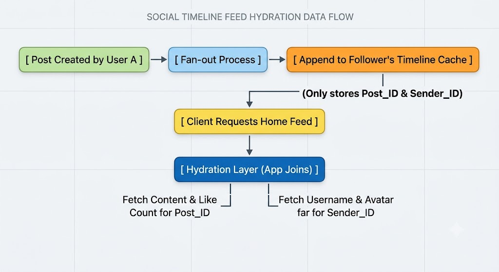
</div>

### Hydrating the IDs (Application-Level Joins)

Jab koi user apna home feed kholta hai, toh system timeline cache se un IDs ki list uthata hai. Magar sirf IDs toh UI par nahi dikhayi ja saktin. Isliye cache se IDs nikalne ke baad application layer aik process chalati hai jise **Hydrating the IDs** kehte hain.

Hydration ka matlab hai ke un primary keys (Post ID aur User ID) ke agay jo asal human-readable text hai (jaise tweet ka content, likes ka count, replies ka number, user ka avatar image URL, aur username), usay real-time mein core database ya key-value cache se fetch kar ke combine kiya jaye. Yeh poora hydration process asal mein programming code ke andar chalne wala aik network join hi hai.

### IDs Storing Ke Pichay Core Architectural Reason

X ne poora text denormalize karne ke bajaye sirf IDs kyun rakhein? Iski wajah yeh hai ke tweet ke sath linked data **bohot tezi se badalta hai (Fast-changing data)**.

* Ek mashhoor tweet par likes aur replies ka count har single second mein hazaron dafa badal sakta hai.
* Users apna profile picture ya username kisi bhi waqt badal sakte hain.

Agar X tweet ka text aur user ka naam har follower ki timeline cache mein denormalize (copy) kar دیتا, toh jab bhi us tweet par koi aik like aata, system ko un millions of followers ki caches ke andar ja kar like count update karna padta, jo pure system ko lock kar deta (Write Storm). Caches ka size bhi be-tahasha barh jata.

IDs rakhne se faida yeh hua ke jab bhi timeline read hoti hai, hydration layer hamesha database se latest fresh like count aur current profile picture utha kar dikhati hai.

Yeh example is baat ko kharij karti hai ke joins scalable nahi hain. Application layer par IDs ko hydrate karna nihayat scalable aur asan hai kyun ke yeh **Embarrassingly Parallelizable** hai (aap parallel mein 1000 posts ka data alag-alag nodes se fetch kar sakte hain). Is hydration cost ka is baat se koi talluq nahi hai ke aap kitne accounts ko follow kar rahe hain ya aapke kitne followers hain.

Aakhri sabaq yeh milta hai ke system design mein normalization aur denormalization koi "achhi" ya "buri" cheez nahi hain. Yeh sirf trade-offs hain. Behtareen scalable systems aksar aik hybrid approach use karte hain: kuch data ko completely normalize rakha jata hai aur makhsoos read paths ko tez karne ke liye kuch data ko dhyan se denormalize kiya jata hai.

---

## Interview aur Mockup System Design Scenario

### Scenario (The Problem)

Aap aik high-scale **Distributed News Feed Service (like LinkedIn/Twitter Home Feed)** design kar rahe hain jahan platform par bade influencers bhi maujood hain aur aam users bhi. Users jab feed scroll karein toh unhein posts ka content, author ka live username, aur post ke live metrics (View Counts, Like Counts) bina kisi lag ke (<100ms) nazar aane chahiye. Agar hum feed ko read karte waqt relational tables par live joins lagate hain toh system collapse kar jata hai, aur agar hum sab kuch precompute kar ke denormalize kar dete hain toh dynamic metrics (likes) ki wajah se database par write amplification ka heavy storm aa jata hai.

### System Design Core Decisions & Trade-offs

1. **Hybrid Timeline Storage with Id-Only Fan-out:** Hum user ki feed ke liye aik cache cluster (Redis/Memcached) design karenge jo sirf ordered `Post_IDs` aur `Author_IDs` ki list (Metadata) save karega. Yeh write amplification ko rokay ga kyun ke hum pure content ko duplicate nahi kar rahe.
2. **Stateless Hydration Layer for Read Scale:** Feed read karte waqt hum aik highly parallelized stateless **Hydration Service** deploy karenge jo cache se IDs ki list legi aur background mein concurrent internal RPC calls ke zariye core Post Store aur User Metadata Store se live dynamic metrics (likes count) aur content fetch kar ke graph assemble karegi.

### Architectural Flow Diagram

<div align="center">
  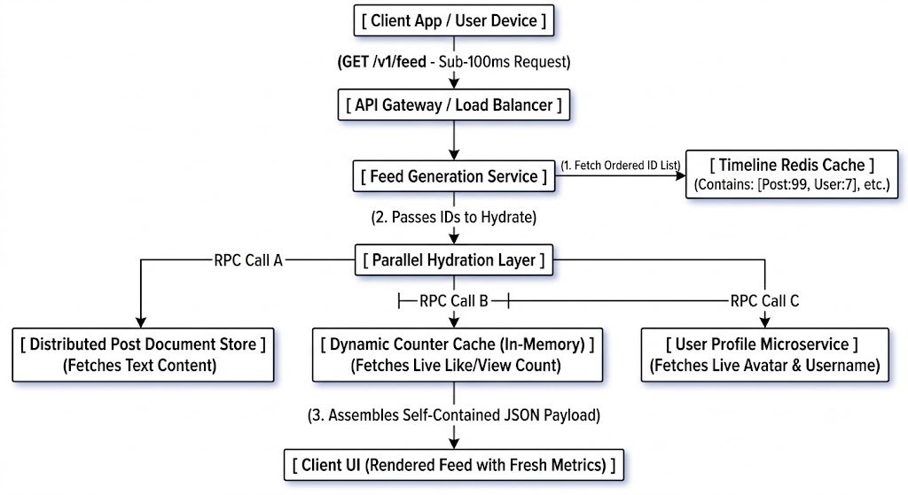
</div>

### Interview Talk (Key Takeaways)

* **Interviewer Question:** Agar aap post data ko key-value store se hydrate kar rahe hain, toh kya is se application layer par network overhead nahi badhega? Hum directly post documents ke andar hi user ka profile data aur like counters kyun embed nahi kar dete?
* **Your Answer:** Agar hum profile image ya like counters ko post document ke andar hi embed (denormalize) kar dein ge, toh jab bhi koi user apna profile picture badlega ya post par koi like click karega, humein us core post document par write command chalani padegi. Distributed system mein high-frequency writes document locks aur cache invalidation ka sabab banti hain. Hydration layer application level par join zaroor karti hai, magar chunke yeh read operations key-by-key lookups hote hain, isliye inhein Redis cluster ya distributed hash rings par distribute kar ke microsecond latencies par parallel chalaya ja sakta hai. Yeh approach scale aur data freshment dono ka behtareen balance (trade-off) faraham karti hai.

---

## Many-to-One and Many-to-Many Relationships

Distributed systems aur database architecture mein jab hum data ke darmiyan relationships ko scale karte hain, toh data ki nature ke mutabaq modeling badal jati hai. Pichle sections mein jo `positions` aur `education` tables thay, woh **One-to-Many** ya **One-to-Few** ki misalein thin (yaani aik bande ke paas kayi naukriyan ho sakti hain, magar har naukri ka record strictly usi aik bande ke profile se juda hota hai).

Iske baraks, `region_id` aik **Many-to-One** relationship ki behtareen misaal hai. Iska matlab yeh hai ke aik hi shahar ya region (jaise Washington, DC) mein hazaaron log reh sakte hain, magar hum yeh farz karte hain ke aik insan aik waqt mein sirf aik hi jagah reh raha hai.

Jab hum system mein `organizations` (companies) aur `schools` ko aam text strings ke bajaye baqaida alag entities (records) bana dete hain aur unhein unique IDs ke zariye jorhte hain, toh hamare paas **Many-to-Many** relationship wajood mein aati hai. Misaal ke taur par, aik insan apni zindagi mein multiple companies mein kaam kar sakta hai, aur aik company ke andar hazaaron purane ya maujooda employees ho sakte hain.

---

### Relational Model Ka Approach (Figure 3-3)

Relational model ke andar Many-to-Many relationship ko handle karne ka aik bohot hi pakka aur standard tareeqa hai jise **Associative Table** ya **Join Table** kaha jata hai.

<div align="center">
  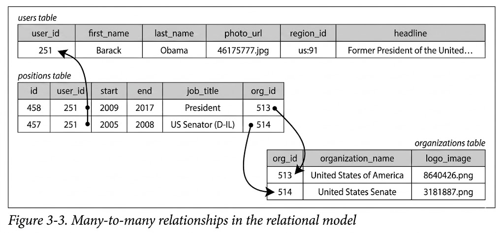
</div>

Figure 3-3 ke mutabaq data ka structural flow is tarah chalta hai:

* **Core Entities Tables:** Hamare paas do alag-alag main tables hain—`users table` (jahan user 251 yaani Barack Obama ka record hai) aur `organizations table` (jahan companies ke unique records hain, jaise ID 513 par "United States of America" aur ID 514 par "United States Senate" unke logo images ke sath save hain).
* **The Associative Table (positions table):** Yeh table asal mein relational bridge ka kaam karta hai. Is table ki apni koi azaad identity nahi hoti balkay yeh doosray tables ki primary keys ko foreign keys ke roop mein apne andar jorhta hai.
* **Data Flow Mechanics:** `positions table` ka har row aik makhsoos linkage ko zahir karta hai. Row 458 mein `user_id` 251 ko `org_id` 513 ke sath jodha gaya hai, aur sath hi us makhsoos relationship ka metadata (jaise `job_title`: President, `start`: 2009, `end`: 2017) bhi isi table mein save kiya gaya hai. Row 457 isi user 251 ko `org_id` 514 se connect karti hai.

<div align="center">
  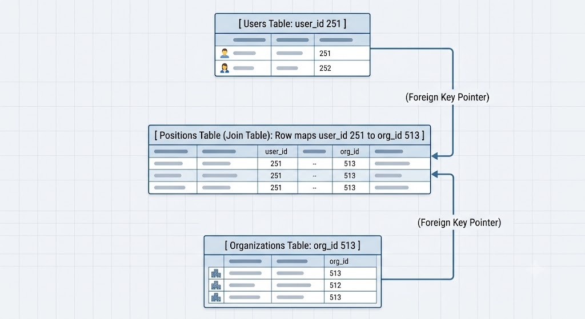
</div>

---

### Document Model Ka Approach (Figure 3-4 Aur Example 3-2)

Many-to-One aur Many-to-Many relationships kabhi bhi aik single, self-contained JSON document ke andar natural tarike se fit nahi baithteen. Agar aap aik hi company ka poora data har us employee ke JSON document mein nested (embed) kar dein ge jo wahan kaam karta hai, toh be-tahasha data duplication hogi aur data write/update karna impossible ho jayega. Isliye document model mein bhi is kaam ke liye **Normalized References** ka sahara liya jata hai.

<div align="center">
  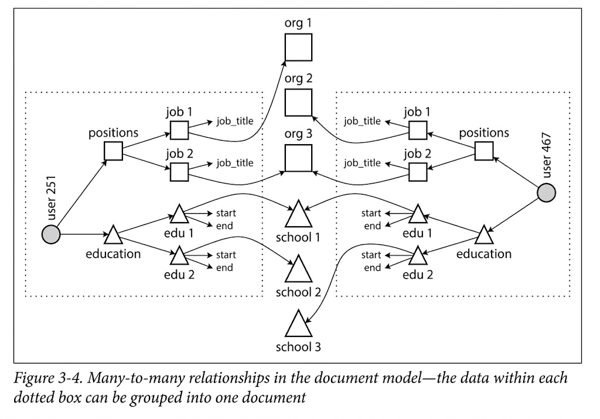
</div>

Figure 3-4 aur Example 3-2 ke mutabaq iska architectural flow darja-zail hai:

* **Document Boundaries (Dotted Boxes):** Figure 3-4 mein jo dotted boxes (lakeron wale dibbe) dikhaye gaye hain, woh har user ka aik azaad, self-contained JSON document hain. Misaal ke taur par, left side par `user 251` ka document hai aur right side par `user 467` ka document hai.
* **Logical References (References to Outer Documents):** In documents ke andar user ka personal data (`positions`, `education` arrays) toh embedding ke roop mein maujood hai, magar jahan company ya school ka talluq aata hai, wahan data embed karne ke bajaye outer entities ke pointers (`org_id` ya `school_id`) rakh diye jate hain.
* **The Interconnected Mesh:** Jaise hi aap in IDs ko use karte hain, aapka saf-suthra simple tree structure (jo hum ne pichle section mein dekha tha) khatam ho jata hai aur data aik complex network ya mesh ki shakal ikhtiyar kar leta hai, jahan alag-alag document boundaries se nikalne wale pointers bahar baithi common entities (`org 1`, `org 2`, `school 1`, etc.) ko point kar rahe hote hain.

<div align="center">
  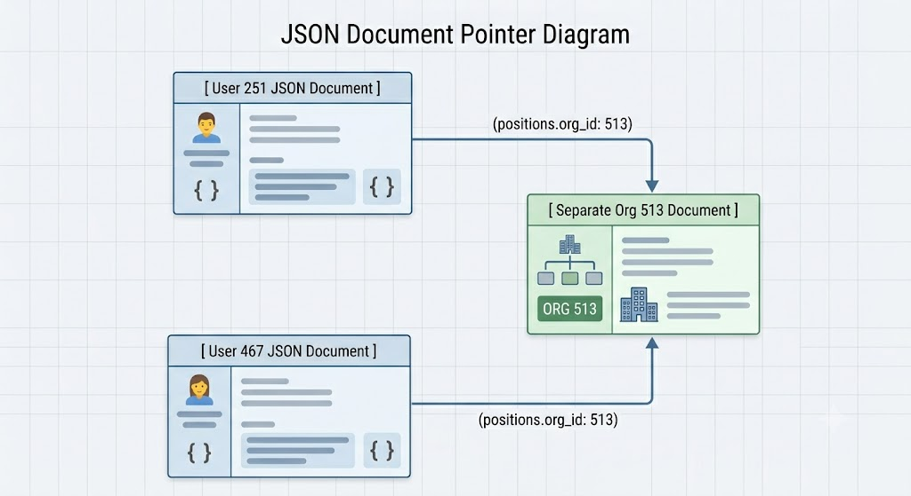
</div>

---

### Bidirectional Queries Aur Indexing Ke Trade-offs

Many-to-Many relationships mein sab se bada masla yeh hota hai ke inhein hamesha **Bidirectional** (dono taraf se) query karna padta hai:

1. **Forward Query:** Mujhe `User 251` ki profile dikhao aur batao unho ne kis kis company mein kaam kiya?
2. **Reverse Query:** Mujhe `Organization 513` (e.g., Google) ka page dikhao aur batao kaun kaun se users yahan kaam kar chuke hain?

Is bidirectional querying ko handle karne ke do mukhtalif architectural raste hain:

#### 1. Denormalized Bidirectional Approach (Two-Way References)

Is approach mein hum ID references ko dono sides par save kar dete hain. Yaani user ke document mein unki saari companies ki IDs hongi, aur har company ke document mein un saare users ki IDs ki aik array hogi jo wahan kaam karte hain.

* **Trade-off:** Iska faida yeh hai ke dono taraf se reads bohot tez ho jate hain. Magar sab se bada nuksan **Inconsistency Risk** hai. Agar aik naya banda company join karta hai aur system user document ko update kar deta hai magar kisi crash ya network failure ki wajah se company document mein uski ID entry miss ho jati hai, toh data corrupt ho jayega.

#### 2. Normalized Approach via Secondary Indexes

Is behtareen approach mein relationship ko poore database mein sirf **aik hi jagah** save kiya jata hai, aur dono taraf se fast querying ke liye database ke **Secondary Indexes** par rely kiya jata hai.

* **Relational Implementation:** Figure 3-3 ke associative schema mein, hum database engine ko command dete hain ke woh `positions table` ke dono columns (`user_id` aur `org_id`) par alag-alag secondary indexes create kare.
* Jab user profile chahiye hogi, toh `user_id` index chalega.
* Jab company page ke employees chahiye honge, toh `org_id` index chalega. Data sirf aik jagah save rehta hai, koi duplication nahi hoti.


* **Document Implementation:** Document databases mein chunke data JSON document ke andar arrays mein hota hai, isliye database engine ke paas yeh salahiyat honi chahiye ke woh JSON array ke andar baithe objects ke fields (jaise `positions.[].org_id`) par index bana sakay. Modern document stores (jaise MongoDB) aur relational systems (jaise PostgreSQL with JSONB indexing) is deep array indexing ko natively support karte hain, jis se single-source relationship par hi dono sides se high-performance lookups hasil kiye ja sakte hain.

---

## Interview aur Mockup System Design Scenario

### Scenario (The Problem)

Aap aik bade scale ka **Enterprise Professional Directory (like LinkedIn for Business)** design kar rahe hain. Is platform par har Company ka aik verified page hai aur har Employee ka apna profile hai. Requirement yeh hai ke jab koi user Company page kholay, toh wahan unke saari employees ki directory real-time mein render ho (<120ms), aur jab koi Employee ka profile kholay toh unki saari past companies ke logos aur names instant nazar aane chahiye. Data volume bohot heavy hai: platform par 50 Million users hain aur 5 Million companies hain. Aapko aik aisi data modeling aur indexing strategy design karni hai jo bidirectional queries ko scale kar sakay bina data corrupt kiye.

### System Design Core Decisions & Trade-offs

1. **Single-Source Normalized Relationships with JSONB Arrays:** Hum user profiles ko store karne ke liye PostgreSQL document model (JSONB) use karenge. Many-to-Many updates mein hone wale consistency data corruption se bachne ke liye hum data ko dono sides par duplicate nahi karenge (No Two-Way References). Relationship sirf User Document ke andar `experience_array.company_id` ke roop mein save hogi.
2. **Multi-Key Inverted Gin Indexing for Reverse Queries:** Company page se employees ko instant fetch karne ke liye hum user document ke nested JSONB array field `company_id` par aik **GIN (Generalized Inverted Index)** ya Multi-key index lagayenge. Is se database backend par programming level ke manual joins ke bajaye direct index scan se target users nikal sakega.

### Architectural Flow Diagram

<div align="center">
  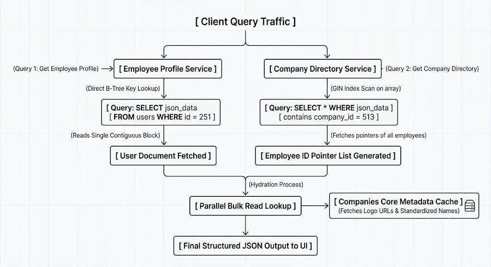
</div>

### Interview Talk (Key Takeaways)

* **Interviewer Question:** Agar hum NoSQL document store mein array indexing use karte hain, toh jab koi user apni company profile mein update karega ya naye experiences add karega, toh index maintenance par kya cost aayegi?
* **Your Answer:** Yeh aik critical trade-off hai. Jab bhi JSON array ke andar koi naya element push hota hai ya update hota hai, toh database ko us pure array ka inverted index block dobara compute (re-index) karna padta hai. Is se Write Latency thodi badh jati hai. Magar hamare is enterprise directory system mein, users apni naukriyan roz-roz ya har ghante badal nahi rahe hote (Writes are very rare, maybe once in a few months). Isliye write cost high hona system par negative impact nahi dalega, jabke reads har second lakhon ki tadad mein ho rahe hain, jahan index hamare read path ko ultra-fast bana deta hai. data storage strictly normalized hone ki wajah se hamesha consistent rahega.

---

## Stars and Snowflakes: Schemas for Analytics

Data warehouses (jahan business intelligence aur analytical reports chalayi jati hain) aam taur par relational model par bazi le jate hain. In systems mein data analytics ko asan aur tez banane ke liye kuch makhsoos architecture patterns istemal kiye jate hain, jin mein **Star Schema**, **Snowflake Schema**, **Dimensional Modeling**, aur **One Big Table (OBT)** sab se zyada ahem hain.

Operational systems (OLTP) se data ko utha kar analytical engines ke mutabaq dhalne ke liye **ETL (Extract, Transform, Load)** pipelines ka sahara liya jata hai.

### Central Fact Table Ka Architectural Role

<div align="center">
  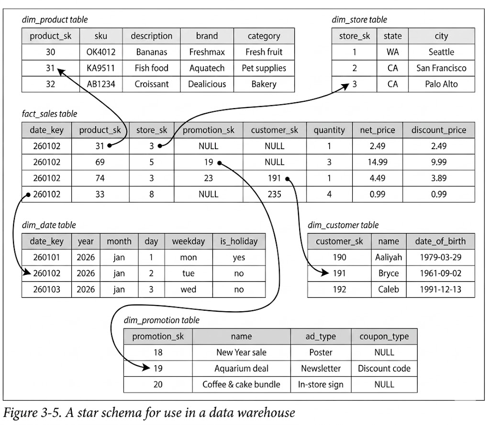
</div>

Agar hum aik grocery retailer (karyana store chain) ke data warehouse ko dekhain (jaise Figure 3-5 mein dikhaya gaya hai), toh is pure design ke markaz (center) mein aik main table hota hai jise **Fact Table** (`fact_sales`) kehte hain.

* **Event-Based Records:** Fact table ki har aik row darasl aik real-world event (vafaa) ko store karti hai jo kisi makhsoos waqt par pesh aya ho. Is retail example mein har row aik customer ki product purchase (khareedari) ko represent karti hai. Agar hum kisi web analytics platform ka system design kar rahe hote, toh fact table ka har row aik page view ya user click ko save karta.
* **Maximum Analysis Flexibility:** Facts ko individual events ki shakal mein save karne ka maqsad yeh hota hai ke baad mein business analysts kisi bhi angle se data ko filter ya aggregate kar sakein. Is granularity (bareeki) ka nuksan yeh hai ke fact tables ka size be-tahasha barh jata hai. Aik bade enterprise ka data warehouse petabytes ($10^{15}$ bytes) ke transaction history par mushtamil hota hai, jo zyada tar inhi fact tables se banta hai.
* **Attributes vs References:** Fact table ke columns ko do hisson mein divide kiya jata hai:
1. **Attributes / Metrics:** Yeh numeric values hoti hain jin par calculations ki ja sakti hain, jaise `quantity` (kitni cheezen khareedin), `net_price` (asal keemat), aur `discount_price` (discount ke baad keemat). Inki madad se profit margin calculate kiya jata hai.
2. **Foreign-Key References:** Yeh baqi columns hote hain jo outer tables ko point karte hain (jaise `product_sk`, `store_sk`, `date_key`, `promotion_sk`, `customer_sk`).


---

### Dimension Tables (The Who, What, Where, and Why)

Chunke fact table sirf aik event ko register karta hai, us event ki poori tafseel (context) **Dimension Tables** ke andar mahfooz hoti hai. Dimensions darasl kisi bhi event ke darja-zail sawalon ka jawab dete hain:

* **Who** (Kis customer ne khareeda? -> `dim_customer`)
* **What** (Kaunsi product khareedi? -> `dim_product`)
* **Where** (Kis store se khareeda? -> `dim_store`)
* **When** (Kis tareekh aur din ko khareeda? -> `dim_date`)
* **How/Why** (Kya koi offer chal rahi thi? -> `dim_promotion`)

```plaintext
                    [ dim_product ] (What)
                          │
                          ▼
[ dim_date ] (When) ──> [ fact_sales ] <── [ dim_store ] (Where)
                          ▲      ▲
                          │      │
       [ dim_promotion ] (Why)   └── [ dim_customer ] (Who)

```

#### Dim_Product Table Ki Example

Figure 3-5 ke mutabaq, `dim_product` ka har row aik makhsoos product ko define karta hai. Is mein `product_sk` (Surrogate Key) ke sath sath product ka SKU code, description ("Bananas" ya "Fish food"), brand ("Freshmax"), aur category ("Fresh fruit") save hoti hai. Jab `fact_sales` mein row 1 par `product_sk = 31` ata hai, toh database automatically samajh jata hai ke yahan "Bananas" ki sale hui hai.

#### Date Dimension (`dim_date`) Ka Makhsoos Design

Aik bohot dilchasp design decision yeh hai ke tareekh (date) aur waqt (time) ko bhi aam timestamp string ke roop mein save karne ke bajaye aik alag dimension table (`dim_date`) mein rakha jata hai.

* **Wajah:** Is se hum date ke sath extra analytics metadata jorh sakte hain, jaise ke woh din weekday hai ya weekend, ya phir kya us din koi **Public Holiday** (`is_holiday = yes`) thi ya nahi. Is tarah business users easily yeh report nikal sakte hain ke "Holidays par sales ka pattern normal dino se kitna mukhtalif hai."

---

### Star Versus Snowflake Schema Trade-offs

Jab hum is poore architecture ko map par draw karte hain, toh markaz mein baitha `fact_sales` table aik sitaray (star) ke nucleus ki tarah lagta hai aur charon taraf se dimension tables uski kirno (rays) ki shakal ikhtiyar kar leti hain. Isliye isay **Star Schema** kaha jata hai.

Is template ki aik advanced variation **Snowflake Schema** hai. In dono mein structural farq darja-zail hai:

* **Star Schema Structure (Denormalized Dimensions):** Is mein dimension tables normalized nahi hoteen. Misaal ke taur par, `dim_product` table ke andar hi brand name ("Freshmax") aur category ("Fresh fruit") ko direct text strings ke roop mein save kiya jata hai. Is se data repeat (duplicate) hota hai, magar queries likhna nihayat asan hota hai kyun ke business analyst ko kam joins lagane padte hain.
* **Snowflake Schema Structure (Normalized Dimensions):** Is variation mein dimensions ko mazeed break down kar ke sub-dimensions bana diye jate hain. `dim_product` table ke andar direct brand ka naam likhne ke bajaye aik `brand_id` rakhi jayegi jo aik alag `dim_brand` table ko point karegi. Yeh design bilkul aik barf ke tukray (snowflake) ki tarah aage se aage branches nikalta jata hai.
* **The Winning Decision:** Snowflake schema database storage ke lehaz se zyada clean aur normalized hai, magar industry mein **Star Schema ko prefer kiya jata hai**. Wajah yeh hai ke business analysts aur BI tools (jaise Tableau/PowerBI) ke liye kam joins wale simple schemas par queries chalana aur unhein samajhna zyada asan aur fast hota hai.

---

### One Big Table (OBT) Aur OLAP Data Locality

Analytical systems (OLAP) mein tables bohot zyada wide (chore) hote hain. Fact tables mein aksar 100 se le kar kai sau columns hote hain. Dimension tables bhi metadata se bhari hoti hain (jaise `dim_store` mein store ka square footage, renovation ki tareekh, aur highway se distance tak save hota hai).

Bade scale par query processing ko super-fast banane ke liye kuch data warehouses denormalization ko aakhri hadd tak le jate hain jise **One Big Table (OBT)** approach kehte hain.

* **No Joins Strategy:** OBT mein dimensions ke alag tables bilkul khatam kar diye jate hain. Fact table aur saari dimension tables ka join pehle se hi compute (precompute) kar ke aik hi deosai (massive) table mein poora data dump kar diya jata hai.
* **Storage vs Speed Trade-off:** OBT bohot zyada disk space consume karta hai kyun ke har single transaction row mein store ka poora metadata aur product ki poori detail repeat ho rahi hoti hai. Magar chunke query engine ko data read karte waqt **Zero Joins** karne padte hain, isliye scan speed un-imaginably fast ho jati hai.
* **Why Denormalization is Safe Here?** OLTP (transactional) systems mein denormalization isliye khatarnak thi kyun ke data har waqt update hota tha, jis se consistency break hone ka khatra tha. Magar Analytics (Data Warehouse) mein data hamesha **Append-Only Historical Log** hota hai. Jo sales pichle saal ho gayin, unho ne ab kabhi tabdeel nahi hona (except for rare error corrections). Jab data immutable (un-changeable) ho, toh data consistency ka dukh khatam ho jata hai, aur hum performant reads ke liye blind denormalization kar sakte hain.

---

## Interview aur Mockup System Design Scenario

### Scenario (The Problem)

Aap aik international hypermarket chain (jaise Carrefour ya Metro) ke liye **Global Sales Analytics Platform** design kar rahe hain. Is chain ke dunyabhari mein 1,000+ outlets hain aur har outlet par rozana lakhon transactions hoti hain. Business management chahti hai ke har quarter ke end par aik complex performance dashboard render ho jo Category-wise, Store-region wise, aur Holiday-season wise sales patterns ko compare kare. Purana system live production OLTP database par queries chalata tha jo heavy joins ki wajah se timeout ho jata hai. Aapko aik aisa analytical data model design karna hai jo billions of rows par complex aggregations seconds mein run kar sakay.

### System Design Core Decisions & Trade-offs

1. **Star Schema vs OBT Selection:** Hum storage engines ke liye aik unified **Star Schema** design karenge jahan central fact table analytics metrics hold karegi aur outer dimensions descriptive fields handle karengi. Agar hamare query patterns fix hain aur humein mazeed execution latency kam karni hui, toh hum critical path ke liye **OBT (One Big Table)** ka materialized view tayyar karenge.
2. **Surrogate Keys (`sk`) over Business Keys:** Hamari saari dimension tables mein hum business keys (jaise product ka raw serial number ya store ID) ke bajaye automatic incremented internal **Surrogate Keys** (e.g., `product_sk`) use karenge. Iska faida yeh hai ke agar operational system mein kisi product ka internal code badal bhi jaye, data warehouse ka analytical history record kabhi break nahi hoga.

### Architectural Flow Diagram

```plaintext
[ Operational Databases (OLTP Production Nodes) ] 
                       │
                       ▼ (Nightly Batch / Streaming ETL Pipeline)
        [ Data Transformation & Cleansing Layer ] 
                       │
                       ▼ (Populates Analytical Model)
┌────────────────────────────────────────────────────────────────────────┐
│ [ Data Warehouse Database Engine ]                                     │
│                                                                        │
│   ┌──────────────────────────────────────────────────────────────┐     │
│   │ dim_product_table                                            │     │
│   │ [product_sk (PK) | sku | description | brand | category]     │     │
│   └──────────────────────────────┬───────────────────────────────┘     │
│                                  │ (Many-to-One Link)                  │
│                                  ▼                                     │
│   ┌──────────────────────────────────────────────────────────────┐     │
│   │ fact_sales_table (Central Event Store)                       │     │
│   │ [date_key | product_sk | store_sk | quantity | net_price]    │     │
│   └──────────────────────────────▲───────────────────────────────┘     │
│                                  ▲                                     │
│                                  │ (Many-to-One Link)                  │
│   ┌──────────────────────────────┴───────────────────────────────┐     │
│   │ dim_store_table                                              │     │
│   │ [store_sk (PK) | store_name | city | state | region_size]    │     │
│   └──────────────────────────────────────────────────────────────┘     │
└────────────────────────────────────────────────────────────────────────┘
                       │
                       ▼ (Executes Broad Columnar Aggregations)
         [ Business Intelligence Dashboard / BI Tool ]

```

### Interview Talk (Key Takeaways)

* **Interviewer Question:** Agar aap OBT model use karte hain jahan billions of rows mein product categories aur shop details text strings ki surat mein hardcoded hain, toh storage overhead bohot zyada barh jayega. Aap is cost ko infrastructure level par kaise optimize karenge?
* **Your Answer:** Data warehouses mein storage cost ko minimize karne ke liye traditional row-oriented storage engines ke bajaye **Column-oriented Storage Engines** (jaise ClickHouse, Amazon Redshift, ya Apache Parquet format) use kiye jate hain. Columnar databases mein data disk par row-by-row save nahi hota, balkay poore table ka aik column aik sath contiguous disk block par save hota hai. Chunke denormalized columns mein data bohot zyada repeat ho raha hota hai (misaal ke taur par millions of rows mein category ka naam "Fresh fruit" repeat hoga), isliye data compression algorithms (jaise LZW ya Run-Length Encoding) is repeatative data ko 90% tak compress kar dete hain. Is tarah hum OBT ki super-fast join-free queries ka faida bhi utha sakte hain aur hamara disk space cost bhi limit mein rehta hai.

---

## When to Use Which Model

Document data model aur Relational data model ke darmiyan intekhab sirf pasand ya napasand ka nahi hai, balkay yeh aapki application ke data access patterns aur domain structure par depend karta hai. Document model ke haq mein sab se bade arguments **Schema Flexibility**, **Data Locality** ki wajah se behtareen read performance, aur application ke object model se qareebi talluq hain. Iske muqable mein, relational model **Joins**, **Many-to-One**, aur **Many-to-Many** relationships ko zyada behtar aur efficient tareeqay se handle karta hai.

* **Document-like Data Structure:** Agar aapki application ka data aik hierarchical tree structure rakhta hai (yaani aik one-to-many relationships ka tree jahan aam taur par poora tree aik sath load kiya jata hai), toh document model aik behtareen choice hai.
* **The Shredding Problem:** Relational technique mein aik document-like structure ko torh kar multiple tables mein taqseem karna padta hai (jaise user positions, education, aur contact info ko alag tables mein rakhna). Is process ko **Shredding** kehte hain, jis se database schemas nihayat mushkil aur application layer ka code zaroorat se zyada complex ho jata hai.
* **Nested Items Ki Limitation:** Document model ka aik bada downside yeh hai ke aap document ke andar baithe kisi nested item ko barh-e-raast (directly) refer nahi kar sakte. Aapko hamesha parent ID ke zariye poora document uthana padta hai aur phir kehna padta hai ke "User 251 ki positions ki list ka doosra item." Agar aapko har nested item ko independent identity deni ho, toh relational approach behtar hai kyun ke wahan har item ki apni unique Primary Key (ID) hoti hai.
* **User-Ordered Lists (Reordering Operations):** Kuch applications mein users ko items ki tartib (order) khud badalni hoti hai, jaise aik To-Do list ya task tracker jahan items ko drag-and-drop kar ke upar neeche kiya jata hai. Document model is cheez ko naturally support karta hai kyun ke items ya unki IDs ko aik JSON array mein rakh kar unki position se order tay kiya ja sakta hai. Relational databases mein is tarah ki reorderable lists ko represent karne ka koi standard tareeqa nahi hai. Wahan darja-zail tricks use karni padti hain:
1. **Integer Column Sorting:** Ek integer column rakhna jis ke mutabaq data sort ho. Agar user kisi item ko beech mein insert karega, toh uske neeche wale saare records ko dobara re-number (update) karna padta hai, jo heavy write operations paida karta hai.
2. **Linked List of IDs:** Har row mein agli row ki ID ka pointer rakhna, jo read karte waqt query speed ko slow kar deta hai.
3. **Fractional Indexing:** Do numbers ke darmiyan float values (e.g., 1.5) assign karna, jo scale par complex ho jata hai.


---

## Schema flexibility in the document model

Zyadatar document databases aur relational databases ke JSON formats data par koi strict schema enforce nahi karte. Relational databases mein XML support ke sath optional validation hoti hai, magar JSON aam taur par khula chhota hota hai. Iska matlab yeh hai ke aik document mein koi bhi arbitrary keys aur values add ki ja sakti hain, aur read karte waqt client application ke paas koi physical guarantee nahi hoti ke document mein kaunsa field milega aur kaunsa nahi.

### Schema-on-Read Versus Schema-on-Write

* **The Myth of Schemaless:** Document databases ko aksar **Schemaless** kaha jata hai, magar yeh term technical lehaz se ghalat hai. Code jo database se data read karta hai, woh hamesha zehan mein aik makhsoos structure farz (assume) kar ke chalta hai. Isliye database level par schema na hone ka matlab yeh nahi ke schema hai hi nahi; schema hota hai magar woh database ke bajaye pure application code mein run ho raha hota hai.
* **Schema-on-Read (Dynamic Checking):** Is approach mein data ka structure implicit hota hai aur database save karte waqt data ko check nahi karta. Jab data disk se read kiya jata hai, sirf us waqt application layer uski validity aur types ko interpret karti hai. Yeh programming languages ki **Dynamic (Runtime) Type Checking** (jaise Python) ki tarah hai.
* **Schema-on-Write (Static Checking):** Yeh traditional relational databases ka tareeqa hai jahan schema bilkul explicit hota hai. Database engine yeh guarantee deta hai ke jab tak data table ke pre-defined columns aur datatypes ke mutabaq nahi hoga, woh usay disk par write nahi karne dega. Yeh programming ke **Static (Compile-time) Type Checking** (jaise Java ya C++) ki tarah hai.

### Schema Evolution (Data Format Change) Aur Uska Operational Cost

Jab application grow karti hai aur data ka format badalna padta hai (misaal ke taur par, pehle aap user ka poora naam aik single field `name` mein save kar rahe thay, magar ab aap `first_name` aur `last_name` alag store karna chahte hain), toh dono models ka behave bilkul mukhtalif hota hai:

* **Document Database Flow:** Aap database mein koi structural tabdeeli nahi karte. Aap bas naya data naye fields (`first_name`, `last_name`) ke sath write karna shuru kar dete hain. Magar jab application purana data read karegi, toh application layer ke andar aik conditional check (if-else logic) lagana padega. Agar purana document read ho jahan `first_name` missing hai, toh application running time par full name string ko split kar ke handle karegi.
* *Downside:* Iska nuksan yeh hai ke application code ke andar yeh compatibility code hamesha ke liye chorhna padta hai kyun ke database mein saalon purane documents abhi bhi purane format mein parhay ho sakte hain.


* **Relational Database Flow:** Aapko database par aik formal migration chalani padti hai. Pehle aap *ALTER TABLE* chala kar naya column add karte hain, aur phir aik heavy *UPDATE* statement execute kar ke purane data ko split kar ke naye columns mein fill karte hain.
* *Downside:* Chote tables par yeh fast hota hai, magar billions of rows wale bade tables par *UPDATE* command chalanay se disk par har single row dobara rewrite hoti hai, jo table ko lock kar sakti hai aur severe downtime ka sabab banti hai. Agar column ka data type badalna ho, toh poore table ki copy banani padti hai. Background migration tools (jaise pt-online-schema-change) is mushkil ko kam karte hain, magar hyper-scale par schema migrations abhi bhi aik bohot bada operational challenge hain.


```plaintext
[ Schema-on-Read Evolution ]
New Write -> Saves directly with new fields -> [ DB Storage ] -> Read Old Format -> [ App Logic Handles Split ]

[ Schema-on-Write Evolution ]
Database Migration -> ALTER TABLE & UPDATE ALL ROWS -> [ DB Storage Rewrites Everything ] -> Read -> [ Instant Clean Data ]

```

* **Heterogeneous Data (Shet-o-Safa Data):** Schema-on-read us waqt sab se zyada faidemand hota hai jab aapke paas aane wale records ka structure aapas mein bilkul na milta ho (Heterogeneous data). Misaal ke taur par, agar aapke paas saikdon qism ke mukhtalif objects hain aur har aik ke liye alag table banana impractical hai, ya phir data ka structure kisi bahar wali teesri-party (external API) se aa raha hai jis par aapka koi control nahi hai aur woh kisi bhi waqt badal sakta hai. Aise halat mein strict schemas faide ke bajaye nuksan pohnchate hain.

---

## Data locality for reads and writes

Storage engine ke level par, aik JSON, XML ya BSON (Binary JSON) document disk par aik single continuous string ya continuous byte block ke roop mein mahfooz hota hai.

### Locality Ke Faide Aur Storage Engine Behavior

* **Read Optimization via Single Seek:** Agar aapki application ko aksar aik profile ka saara data aik sath chahiye hota hai (jaise web page par render karne ke liye), toh is storage mechanism ka bohot bada performance advantage milta hai jise **Data Locality** kehte hain. Database engine disk par jata hai aur aik single sequential read operation se poora data utha leta hai. Iske mukable mein, relational database mein data 4 se 5 tables mein bikhra hota hai, jis ki wajah se storage engine ko pehle multiple indexes scan karne padte hain aur phir disk par alag-alag locations par ja kar random disk seeks karne padte hain, jo zyada waqt lete hain.

```plaintext
[ Document Locality (Continuous Block) ]
Disk Page: [ User_ID | Name | Positions Array | Education Array ] ──> Read in 1 Disk Seek

[ Relational Fragmentation (Scattered Blocks) ]
Disk Page 1: [ Users Table Row ] ──┐
Disk Page 4: [ Positions Rows ]  ──┼──> Requires Multiple Random Disk Seeks & Index Lookups
Disk Page 9: [ Education Rows ]  ──┘

```

* **The Wasteful Read and Update Trap:** Data locality ka faida sirf tabhi hota hai jab aapko sach mein pooray document ke baday hissay ki aik sath zaroorat ho. Iska aik bohot bada downside hai: database ko hamesha poora document hi memory mein load karna padta hai. Agar aapko aik bade JSON document mein se sirf aik chota sa flag ya field read karna hai, toh poora heavy document load karna system resources ka zaya (waste) hai.
* **Write Magnification on Updates:** Jab bhi aap document ke kisi aik chote se nested field ko update karte hain, toh zyadatar storage engines ko poora ka poora document disk par naye sirey se dobara rewrite karna padta hai. Isliye architectural guideline yeh hai ke document databases mein documents ka size hamesha limited aur chota rakha jaye, aur aisi design se bacha jaye jahan bohot frequent choti updates karni padti hon.
* **Relational Locality Alternatives:** Storing data together for locality sirf document stores tak mahdood nahi hai. Modern distributed relational databases ne bhi is feature ko apna liya hai:
* **Google Spanner (Interleaved Tables):** Yeh aik relational model hai magar aap schema mein declare kar sakte hain ke aik table ki rows (e.g., `Child Table`) physical disk par parent table ki rows ke andar hi nest (interleave) ho kar save hon.
* **Oracle Multi-Table Index Clusters:** Yeh bhi bikhre huay relational tables ke related records ko physical disk cluster par aik sath jorh kar rakhta hai.
* **Wide-Column Model (Bigtable/HBase):** Yeh systems **Column Families** ka use karte hain taake related columns ko disk par aik sath continuous blocks mein manage kiya ja sakay.


---

## Query languages for documents

Relational databases ki duniya par SQL ka aik-tarfa raaj hai, jo aik declarative English sentence-style syntax use karti hai. Iske baraks, document databases ke query tareeqay nihayat mukhtalif aur diverse hain. Kuch databases sirf primary key ke zariye Key-Value access ki ijazat dete hain, jabke kuch specialized engines documents ke andar baithe fields par secondary indexes banakar rich queries faraham karte hain.

* **XML and JSON Path Pointers:** XML databases mein complex deep queries aur joins lagane ke liye *XQuery* aur *XPath* design kiye gaye thay. JSON ki duniya mein iska bilkul mutabadil *JSON Pointer* aur *JSONPath* faraham karte hain.
* **MongoDB Aggregation Pipeline Mechanics:** MongoDB data ko filter aur aggregate karne ke liye aik pipeline pattern use karti hai. Yeh syntax declarative hota hai magar iska format SQL ke bajaye poora JSON-based hota hai.

### Conceptual Comparison: SQL Versus MongoDB Aggregation

Agar hum aik Marine Biologist (samundari mahir-e-hayatiat) ki example lein jo samundar mein har dafa janwaron ko dekh kar unka record database mein register karta hai, aur humein aik report nikalni ho ke **"Sharks ki family ke kitne janwar har mahine sighting (dekhay) gaye?"**, toh system ka behavior dono languages mein is tarah chalega:

1. **PostgreSQL (SQL) Flow:** Query engine pehle `WHERE` clause chalakar raw rows ko filter karega taake sirf `family = 'Sharks'` ka data bache. Phir `date_trunc` function ke zariye har timestamp ko round down kar ke us mahine ki pehli tareekh ka logical bucket banaye ga (`GROUP BY`). Aakhri step par `sum(num_animals)` chala kar har mahine ka total calculate karega.
2. **MongoDB Pipeline Flow:** Yeh bilkul aik factory assembly line ki tarah stages mein kaam karega. Pehli stage `$match` chalegi jo database collection se sirf Sharks ke documents ko filter out kar ke agli stage par bhejegi. Doosri stage `$group` chalegi jo un filtered documents se year aur month nikal kar unhein aik unique `_id` bucket mein dalegi aur parallel mein `$sum` operator ke zariye total animals ka counter aggregate karti jayegi.

Dono query languages ki expressive power (salahiyat) bilkul barabar hai, farq sirf likhne ke dhang (syntax preference) ka hai.

---

## Convergence of document and relational databases

Database ki tareekh mein relational aur document models do mukhtalif simulation poles ki tarah shuru huay thay, magar modern architecture mein yeh dono aapas mein aakar mil gaye hain (**Convergence**).

* **Relational Evolution:** Traditional relational databases (PostgreSQL, MySQL, Oracle) ne JSON support ko natively integrate kar liya hai. Yeh databases ab JSON document ke andar mojood sub-properties ko na sirf query kar sakti hain balkay un arrays par functional ya inverted indexes bana kar reads ko optimize bhi kar sakti hain.
* **Document Evolution:** NoSQL document databases (MongoDB, Couchbase) ne waqt ke sath sath transactional features, secondary indexes, aur multi-document `JOIN` operators (like `$lookup`) aur declarative querying ko apne andar shamil kar liya hai.
* **The Hybrid Conclusion:** Aik behtareen system design engineer ke liye yeh convergence sab se khush-aind baat hai. Koi bhi system na toh 100% relational hota hai aur na hi 100% document-based. Aik modern hybrid cloud architecture mein hum database ke usi aik engine ke andar strict billing records ke liye relational columns chalate hain aur dynamic user settings ya complex profiles ke liye flexible JSON columns ka use karte hain.

Interestingly, Edgar Codd ne jab 1970 mein relational model ka pehla research paper likha tha, toh unho ne **Nonsimple Domains** ka concept pesh kiya تھا. Unka kehna tha ke database ki aik row ka column sirf primitive scalar value (integer/string) tak mahdood nahi hona chahiye, balkay aik column ke andar aik poora nested relation (table) bhi fit ho sakta hai. Yeh design bilkul wahi cheez hai jise aaj hum JSON support ke roop mein dekhte hain.

---

## Interview aur Mockup System Design Scenario

### Scenario (The Problem)

Aap aik hyper-scale **Collaborative Drag-and-Drop Task Management Platform (like Trello or Jira Cloud)** design kar rahe hain. Har user ke paas kai *Boards* hain, har board ke andar multiple *Lists* (e.g., ToDo, InProgress, Done) hain, aur har list ke andar saikdon *Tasks* ho sakte hain. Users real-time mein tasks ko drag kar ke unka order change karte hain aur naye custom metadata fields (e.g., custom checkboxes, multi-select dropdowns) har task par apni marzi se dynamic create karte hain. System par read activity write se 50x zyada hai. Aapko aik aisi data modeling aur scaling strategy design karni hai jo dynamic ordering aur zero-downtime custom fields tracking dono ko extreme reliability ke sath handle kare.

### System Design Core Decisions & Trade-offs

1. **Hybrid Document Representation with Schema-on-Read:** Hum Task Board ke Core workflow ke liye Document model (ya Relational database ka modern JSONB engine) select karenge. Har Board aur uski lists ko aik hierarchical document tree mein rakha jayega taake Data Locality ka faida utha kar poora board aik single disk seek mein load ho sakay (<50ms). Custom fields ke liye schema-on-read model behtareen hai kyun ke har enterprise user ke fields heterogeneous hain.
2. **JSON Array for UI Ordering Over Integer Renumbering:** Tasks ki dynamic dragging aur ordering ko handle karne ke liye hum relational sorting column use nahi karenge (No Write Amplification/Renumbering). Hum list ke andar tasks ki ordered sequence ko aik pure **JSON Array of Task_IDs** ki surat mein store karenge. Jab user task move karega, application layer sirf array ke elements ko re-shuffle kar ke document save kar degi, jo aik simple fast atomic update operation hoga.

### Architectural Flow Diagram

```plaintext
                               [ Client Workspace UI ]
                                          │
                  ┌───────────────────────┴───────────────────────┐
                  ▼ (Request 1: Drag-and-Drop Order Change)       ▼ (Request 2: Render Board Views)
       [ Board Mutator Service ]                             [ Board Delivery Service ]
                  │                                               │
                  ▼ (Atomically updates internal ID array)        ▼ (Fetches Single Block from Storage)
       [ Command: JSONB_SET array ]                          [ Query: SELECT board_json ]
                  │                                               │
                  ▼                                               ▼
┌────────────────────────────────────────────────────────────────────────────────────────┐
│ [ Hybrid Document / Relational Storage Cluster ]                                       │
│                                                                                        │
│   {                                                                                    │
│     "board_id": "b_9910",                                                              │
│     "lists": [                                                                         │
│       {                                                                                │
│         "list_id": "l_todo",                                                           │
│         "task_order": ["t_3", "t_1", "t_2"],  <── [ Natural Order Maintenance Array ]  │
│         "tasks": [                                                                     │
│           {"task_id": "t_1", "title": "Fix API", "custom_fields": {"priority": 1}},    │
│           {"task_id": "t_2", "title": "Gym Rope", "custom_fields": {"time": "8am"}},   │
│           {"task_id": "t_3", "title": "Read DDIA", "custom_fields": {"pages": 500}}    │
│         ]                                                                              │
│       }                                                                                │
│     ]                                                                                  │
│   }                                                                                    │
└────────────────────────────────────────────────────────────────────────────────────────┘
                  │                                               │
                  ▼ (Low Write Overhead)                          ▼ (Sub-30ms High Locality Read)
         [ Disk Acknowledged ]                           [ Instant View Assembled & Pushed ]

```

### Interview Talk (Key Takeaways)

* **Interviewer Question:** Agar aap aik hi document ke andar list aur tasks ko embed kar dete hain taake data locality achhi ho, toh agar board bohot bada ho jaye aur hazaron tasks add ho jayein, toh document size limit expand ho jayegi aur pure document ko write karne ka cost barh jayega. Aap is bottleneck ko distributed scale par kaise mitigate karenge?
* **Your Answer:** Yeh embedded data locality ka aik classic boundary edge-case hai jise *Document Bloat* kehte hain. Isko solve karne ke liye hum data modeling par aik strict separation boundary lagayenge. Hum poore tasks ka detail payload main board document ke andar embed nahi karenge. Main board document sirf lists aur unke andar ordered `Task_IDs` ki simple arrays hold karega (One-to-Few relationship). Tasks ka actual rich metadata aur dynamic custom fields ka data alag discrete documents (ya rows) mein store hoga jinhein task_id se identify kiya jayega. Jab board load hoga, hum main layout array single seek se uthayenge aur UI viewport mein nazar aane wale top 20 tasks ka detailed text chunk asynchronous batch retrieval ya lightweight parallel hydration engine ke zariye scale-out caches se fetch kar lenge. Is tarah document boundaries bhi limit mein rahengi aur data locality aur reordering arrays ka faida bhi milta rahega.

---

## Graph-Like Data Models

Applications ke andar data models ko aik dusre se alag karne wali sab se ahem cheez unke darmiyan mojood relationships (taaluqat) ki nature hai. Agar aapke application data mein zyada tar **One-to-Many** relationships hain (yaani aik tree-like structure jahan aik record ke niche multiple sub-records hote hain aur poora tree aik sath load hota hai), toh document model sab se behtareen rehta hai.

Magar, jab aapke data mein **Many-to-Many** relationships aam ho jayein aur data ke darmiyan connections nihayat pechida (highly interconnected) ho jayein, toh data ko aik **Graph** ke roop mein model karna sab se zyada natural aur architecturally efficient ho jata hai.

### Graph Architecture Ke do Buniyadi Pillars

Aik graph buniyadi taur par do qism ke objects se mil kar banta hai:

1. **Vertices:** Inhein Nodes ya Entities bhi kaha jata hai. Yeh haqiqi duniya ke objects ya data points ko represent karte hain (jaise log, jaghein, ya events).
2. **Edges:** Inhein Relationships ya Arcs bhi kehte hain. Yeh do vertices ke darmiyan maujood connection aur uski direction/nature ko zahir karte hain.

### Homogeneous Graphs Aur Unke Core Algorithms

Jab graph ke saare vertices aik hi tarah ki cheez ko represent karein, toh usay *Homogeneous Graph* kaha jata hai. Writer ne iski teen behtareen real-world use cases bayan ki hain:

* **Social Graphs:** Yahan saare vertices "Log (People)" hote hain, aur edges yeh batate hain ke kaunsa banda kis ko janta hai ya kis ka dost hai.
* **The Web Graph:** Yahan har node aik "Web Page" hoti hai, aur edges un HTML hyperlinks ko represent karte hain jo aik page se dusre page par le kar jate hain.
* **Road or Rail Networks:** Is infrastructure model mein vertices "Junctions (Choraye/Stations)" hote hain, aur edges unke darmiyan mojood sarak (roads) ya railway lines ko zahir karte hain.

In graphs par kaam karne ke liye specialized, well-known distributed algorithms chalaye jate hain:

* **Shortest Path Algorithm:** Navigation maps (jaise Google Maps) road networks par do points ke darmiyan sab se chota aur tez tareen rasta dhoondne ke liye nodes aur edges ko scan karte hain.
* **PageRank Algorithm:** Web graph par chalaya jata hai taake hyperlinks ke network flow ko analyze kar ke kisi web page ki popularity aur search ranking tay ki ja sakay.

---

### Internal Storage Representations: Adjacency List Versus Adjacency Matrix

Graph data ko memory aur disk par store karne ke do mukhtalif math-oriented patterns hain, jin ke darmiyan gehre architectural trade-offs hote hain:

1. **Adjacency List Model:** Is model mein har vertex apne andar un saare neighbor vertices ki IDs ki aik list mahfooz rakhta hai jo us se aik edge ki doori par hote hain.
* *Architectural Benefit:* Yeh model **Graph Traversals** (pointer-chasing/network path scanning) ke liye behtareen hai. Jab aapko aik node se nikal kar uske raston par aage barhna ho, toh adjacency list memory lookups ko sequential aur tez banati hai.


2. **Adjacency Matrix Model:** Yeh aik 2-Dimensional Array (matrix) hota hai jahan rows aur columns dono graph ke vertices ko represent karte hain. Agar node A aur node B ke darmiyan edge na ho toh value `0` hoti hai, aur agar edge maujood ho toh value `1` save hoti hai.
* *Architectural Benefit:* Matrices un use cases ke liye behtareen hain jahan heavy mathematical computations aur **Machine Learning (ML)** models chalane hon (jaise dense tensors par embeddings calculate karna), kyun ke modern CPUs/GPUs matrix multiplication ko hardware level par bohot tezi se execute karte hain.


---

### Heterogeneous Graphs Ki Power (Flexible Unified Entities)

Graphs ki asal taqat sirf homogeneous data tak mahdood nahi hai, balkay iska sab se bada faida yeh hai ke yeh bilkul mukhtalif (completely different) qism ke objects aur schemas ko aik hi database cluster ke andar aik consistent tareeqay se jorh kar rakh sakta hai.

* **Facebook's Unified Graph:** Facebook aik single distributed graph maintain karta hai jahan vertices mukhtalif entities ko represent karte hain: log (people), locations, events, user check-ins, aur comments. Unke darmiyan edges relationships ka network flow bante hain: kaun kiska dost hai, kis location par check-in hua, kis post par kis ne comment kiya, aur kis event ko kis ne attend kiya.
* **Search Engine Knowledge Graphs:** Google jaise search engines public websites ko crawl aur text-analyze kar ke aik massive knowledge graph build karte hain. Is graph mein organizations, log, aur places ke facts ko aapas mein link kiya jata hai. Wikidata jaise structured platforms bhi isi tarah ka graph data publish karte hain.

Graph data systems ko structure aur query karne ke do ahem models hain:

* **Property Graph Model:** Jise Neo4j, Memgraph, aur KùzuDB implement karte hain.
* **Triple Store Model:** Jise Datomic aur AllegroGraph implement karte hain.

Inhein query karne ke liye specialized languages jaise *Cypher*, *SPARQL*, *Datalog*, *GraphQL*, aur modern SQL graph extensions use hoti hain.

---

### Detailed Decomposition of Figure 3-6 (The Running Schema)

Hum Figure 3-6 mein diye gaye graph structure ko direct and step-by-step dissect karte hain taake samajh aaye ke graph kaise dynamic granularity aur fluid hierarchies ko handle karta hai.

<div align="center">
  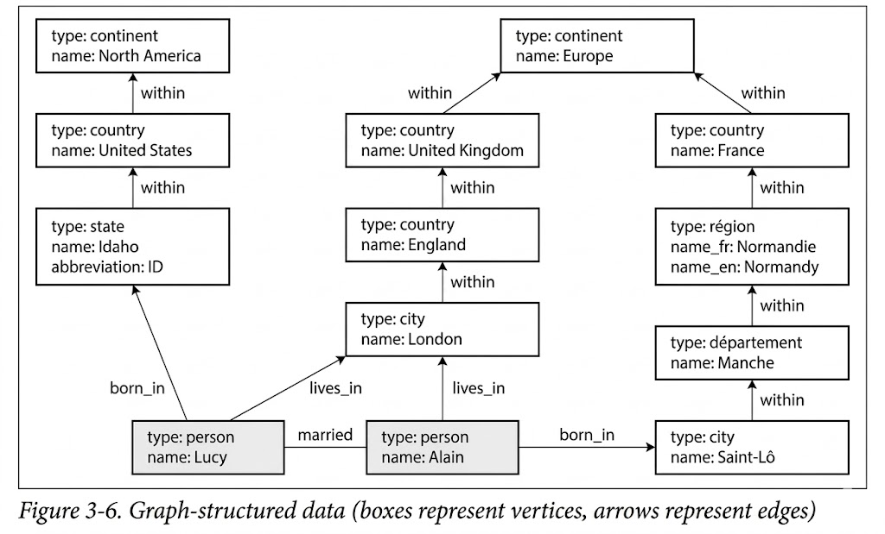
</div>

Figure 3-6 aik heterogeneous graph ko zahir karta hai jahan data ke bikhre huay levels (social aur geographical structures) aapas mein linked hain. Chaliye iska step-by-step data flow dekhte hain:

* **Social Connection (The Core Cluster):** Markaz mein do grey boxes (vertices) hain: `type: person, name: Lucy` aur `type: person, name: Alain`. In dono ke darmiyan aik edge hai jis par label hai **married**. Yeh aik direct horizontal social edge hai.
* **Geographical Heterogeneity (Irregular Hierarchies):** Is graph ki sab se barhi khubsurti yeh hai ke yeh dono logo ke background ko alag-alag structural depth ke sath store kar raha hai, jo relational schema mein tables ko break kar deta:
1. **Lucy Ka Path (US Hierarchy - 3 Steps):** Lucy se aik arrow nikalta hai (`born_in`) jo `state: Idaho` ko point karta hai. Idaho se arrow nikalta hai (`within`) jo `country: United States` par jata hai, aur woh aage `within` ke zariye `continent: North America` se connect hota hai.
2. **Alain Ka Path (France Hierarchy - 5 Steps):** Alain se arrow nikalta hai (`born_in`) jo `city: Saint-Lô` ko point karta hai. France ka administrative structure deep hai, isliye Saint-Lô aage `within` hai `département: Manche` ke, Manche `within` hai `région: Normandie` ke, Normandie `within` hai `country: France` ke, aur France `within` hai `continent: Europe` ke.
3. **The Convergence Link:** Lucy aur Alain dono se do independent edges nikalte hain jin par **lives_in** likha hai, aur yeh dono arrows aik hi single node `city: London` ko point karte hain. London aage `within` England -> `within` United Kingdom -> `within` Europe ke zariye usi common Europe continent node se jorh jata hai jahan Alain ka France wala path end hua tha.


**Architectural Insight:** Agar aapko relational DB mein yeh query chalani ho ke "Un married couples ko dhoondain jin mein se aik ka taluq North America se ho aur dusre ka Europe se, magar dono is waqt aik hi shahar mein reh rahe hon," toh aapko users, regions, cities, states, aur countries ke tables par 8 se 10 `JOIN` operations lagane padenge, jo database compiler ko paghal kar denge. Graph database mein yeh sirf pointer chasing (edge traversal) ka aik clean operation hota hai.

---

## Interview aur Mockup System Design Scenario

### Scenario (The Problem)

Aap aik international bank ke liye **Real-Time Financial Fraud Detection & Anti-Money Laundering (AML) System** design kar rahe hain. Platform par har second lakhon transactions hoti hain. Fraudsters direct money transfer nahi karte; woh paisa chupane ke liye aik complex chain banate hain (User A -> Transfers to User B -> Who owns Company C -> Which wires money to Account D in High-Risk Location).

Aapko aik aisa data model aur execution engine design karna hai jo 5 se 6 hops (levels) deep connections ko real-time mein (<50ms) scan kar ke alerts generate kare ke kya yeh transaction kisi fraud ring ka hissa hai ya nahi. Purana relational system 3 hops se aage joins lagane par choke ho jata hai.

### System Design Core Decisions & Trade-offs

1. **Property Graph Store over RDBMS:** Hum is transaction linkage path ke liye aik native Property Graph database (jaise Neo4j cluster ya AWS Neptune) select karenge. Wahan hum **Index-free Adjacency** ka faida uthayenge, jahan har node disk/memory par apne edges ke physical pointers hold karti hai, jis se multi-hop traversals bina kisi global index scan ke constant time mein execute hote hain.
2. **Trade-off (Write Latency vs Deep Read Traversal):** Graph store mein naya edge add karte waqt pointers update karne padte hain, jis se write throughput relational databases se thodi kam ho sakti hai. Magar hamara fraud analytics path read-heavy network analysis par chalta hai, isliye deep read traversal ko optimize karne ke liye hum ne writes par thoda compromise (trade-off) kiya hai.

### Architectural Flow Diagram

<div align="center">
  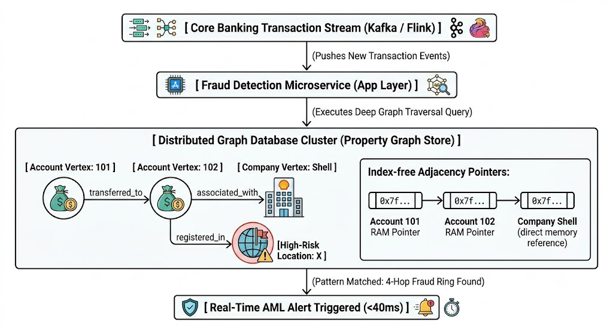
</div>

### Interview Talk (Key Takeaways)

* **Interviewer Question:** Relational databases mein bhi hum associative tables par indexes bana kar many-to-many links dhoond sakte hain. SQL database 4 ya 5 levels deep queries par choke kyun ho jata hai jabke graph database scale kar jata hai?
* **Your Answer:** Relational database mein jab aap $N$-level deep join lagate hain, toh database engine ko har step par aik alag index scan karna padta hai. Agar `Table A` ko `Table B` se join karna hai, toh B-Tree index scan par $\mathcal{O}(\log M)$ ka cost aata hai. Jab data billions of rows par chala jaye, toh har hop par yeh index lookup cost multiply hota jata hai, jise *Join Explosion* ya *Join Bomb* kehte hain. Iske baraks, native graph databases **Index-free Adjacency** use karte hain. Iska matlab hai ke jab aap Node A par khade hain, toh Node B ka physical memory address (pointer) direct Node A ke records mein save hota hai. Database ko koi global index scan nahi karna padta; woh direct memory pointer chase karta hai. Isliye graph database mein 5-hop traversal ka cost total database ke size par depend nahi karta, balkay sirf un nodes ke subgraph size par depend karta hai jo aap visit kar rahe hain.

---

### Property Graphs

Property Graph model (jise Labeled Property Graph bhi kaha jata hai) graph databases ka aik bohot hi ahem aur flexible design pattern hai. Is architecture ke mutabaq, pure database ko do buniyadi structures—Vertices (Nodes) aur Edges (Relationships)—mein divide kiya jata hai, magar in dono ke andar kuch makhsoos components lazmi hotay hain:

#### Vertex (Node) Ki Architectural Anatomy

Graph ke andar har aik single vertex darja-zail panch cheezon se mil kar banta hai:

* **Unique Identifier:** Har vertex ki aik unique ID hoti hai (jaise integer ya UUID) jo pooray database cluster mein uski pehchan hoti hai.
* **Label:** Aik string value jo yeh batati hai ke yeh vertex kis qism (type) ka object hai (misaal ke taur par: `Person`, `Location`, `Product`).
* **Outgoing Edges Set:** Un saare arrows/connections ka majmua jo is makhsoos node se nikal kar bahar doosri nodes ki taraf ja rahe hain.
* **Incoming Edges Set:** Un saare connections ka majmua jo bahar ki doosri nodes se aa kar is node par khatam ho rahe hain.
* **Collection of Properties:** Yeh sab se ahem hissa hai. Har node ke andar uski details ko store karne ke liye **Key-Value Pairs** (properties) ka aik poora bag hota hai (jaise `name: "Lucy"`, `age: 30`).

#### Edge (Relationship) Ki Architectural Anatomy

Do vertices ko jorhne wala har aik edge bhi apne andar panch lazmi attributes rakhta hai:

* **Unique Identifier:** Edges ki bhi apni alag unique ID hoti hai, jis se har relationship ko independent treat kiya ja sakta hai.
* **Tail Vertex (Start Node):** Woh makhsoos node jahan se edge (arrow) shuru ho raha hai.
* **Head Vertex (End Node):** Woh makhsoos node jahan par edge (arrow) ja kar khatam ho raha hai.
* **Label:** Aik string string jo yeh bayan karti hai ke in do nodes ke darmiyan kis tarah ka talluq hai (misaal ke taur par: `married`, `born_in`, `lives_in`).
* **Collection of Properties:** Edges ke andar bhi key-value pairs save kiye ja sakte hain (jaise agar label `married` hai, toh property ho sakti hai `date: "2023-12-08"` ya `location: "London"`).

---

### Graph Store Ka Relational Simulation (PostgreSQL JSONB Layout)

Writer aik bohot hi khubsoorat theoretical breakdown pesh karta hai ke aap aik complex graph store ko backend par sirf **do relational tables** (one for vertices, one for edges) ke zariye bhi design kar sakte hain. Is logic ko samajhne ke liye hum iske structural layout aur indexing strategy ko analyze karte hain:

```plaintext
[ Table: vertices ]
├─ vertex_id (PK) ──┐
├─ label            │
└─ properties ◄─────┼── (Stored as PostgreSQL JSONB Document)
                    │
                    │ (Foreign Key Constraints)
[ Table: edges ]    │
├─ edge_id (PK)     │
├─ tail_vertex ─────┤ (Points to starting vertex_id)
├─ head_vertex ─────┘ (Points to ending vertex_id)
├─ label
└─ properties ─────── (Stored as PostgreSQL JSONB Document)

```
## Example
```plaintext
CREATE TABLE vertices (
 vertex_id integer PRIMARY KEY,
 label text,
 properties jsonb
);
CREATE TABLE edges (
 edge_id integer PRIMARY KEY,
 tail_vertex integer REFERENCES vertices (vertex_id),
 head_vertex integer REFERENCES vertices (vertex_id),
 label text,
 properties jsonb
);
CREATE INDEX edges_tails ON edges (tail_vertex);
CREATE INDEX edges_heads ON edges (head_vertex);
```

* **The JSONB Advantage:** Is relational model mein properties wale columns ko traditional flat columns ke bajaye PostgreSQL ke **`jsonb`** data type ke roop mein rakha jata hai. Is design decision ka faida yeh hai ke har node aur edge ke andar alag-alag aur dynamic key-value pairs bina kisi schema modification ke save ho sakte hain.
* **The Role of Tail and Head Pointers:** `edges` table ke andar har row aik directional connection hoti hai. `tail_vertex` foreign key hoti hai jo starting node ko point karti hai, aur `head_vertex` ending node ko point karti hai.
* **CRITICAL INDEXING DECISION (Why Lookups are Fast):** Writer ne is schema mein do alag indexes create kiye hain: `CREATE INDEX edges_tails ON edges (tail_vertex)` aur `CREATE INDEX edges_heads ON edges (head_vertex)`.
* **Wajah:** Agar aapko kisi user ki saari outgoing links (forward traversal) chahiye, toh database engine instant `edges_tails` index scan karega. Agar uski saari incoming links (backward traversal) chahiye, toh engine `edges_heads` index scan karega. In do indexes ke bina graph traversal poore table ka sequential scan ban jata, jo poore system ko choke kar deta.


---

### Property Graph Model Ke Core Architectural Strengths

* **Schema-Free Associations (No Inter-Entity Restrictions):** Is model mein koi aisa global schema ya rulebook nahi hoti jo yeh tay kare ke kaunsi cheez kis se jodh sakti hai. Kisi bhi vertex ko duniya ke kisi bhi doosray vertex ke sath edge ke zariye connect kiya ja sakta hai, chahe unke datatypes aur labels bilkul mukhtalif hon.
* **High-Performance Bidirectional Traversal:** Chonke database engine ke paas tail aur head dono columns par indexes maujood hote hain, isliye application layer bina kisi structural friction ke graph ke raston (paths) par aage (forward) aur peeche (backward) dono taraf travel kar sakti hai. Aap chain of vertices ko follow karte huay poora network scan kar sakte hain.
* **Polymorphic Polymorphism (Clean Heterogeneous Storage):** Alag-alag labels ka use kar ke, aap bilkul unique data structures ko aik hi single graph database mein baghair kisi messy table segmentation ke cleanly store kar sakte hain.
* **The Generalized Join Table Concept:** Traditonal relational system mein jab do entities ke darmiyan many-to-many link banana ho, toh har relationship ke liye aik alag unique associative/join table banana padta hai (jaise users_roles, users_courses). Property graph ka `edges` table darasl aik **Universal Generalized Join Table** hai, jahan duniya ki saari many-to-many relationships aik hi table ke andar unke dynamic labels aur properties ke sath fit ho jati hain.

---

### Graph Model Ki Aik Barhi Limitation: The Binary Edge Constraint

Property graphs mein aik bohot critical structural limit hoti hai: **Aik edge hamesha sirf do vertices (aik tail aur aik head) ko hi aaps mein jodh sakta hai.** Isay binary relationship kehte hain.

realtional model mein aik single associative table ki row ke andar teen ya char foreign keys rakh kar aik hi dafa mein 3-way (Ternary) ya higher-degree relationship ko represent kiya ja sakta hai (misaal ke taur par: Kis Supplier ne, kis Part ko, kis Project ke liye supply kiya? Supplier_ID + Part_ID + Project_ID in a single row).

Graph database mein is ternary ya higher-degree relationship ko handle karne ke do tareeqay hain:

1. **Intermediate Node Insertion (Hyperedge Simulation):** Hum join table ki row ko khud aik naya intermediate vertex bana dete hain, aur phir us naye vertex se teeno main vertices ki taraf teen alag-alag edges nikal dete hain.
2. **Hypergraph Model:** Ek alag graph variant use karna jahan aik edge par yeh pabandi nahi hoti ke woh sirf do nodes ko jorhay, balkay aik edge multiple nodes ka cluster jorh sakta hai.

```plaintext
[ Relational Ternary Join (1 Row) ]
[ Supplier_ID: 1 | Part_ID: 99 | Project_ID: 400 ]

[ Graph Representation (Intermediate Node Solution) ]
[ Vertex: Supplier 1 ] ◄─── (supplied_by) ───┐
                                              ▼
                                   [ Vertex: Supply_Event_Node ] ───(used_in)───► [ Vertex: Project 400 ]
                                              ▲
[ Vertex: Part 99 ] ◄─────── (part_used) ─────┘

```

---

### Real-World Evolvability Case Study: Data Granularity and Food Allergies

Property graphs ki sab se barhi taqat unki **Evolvability** (waqt ke sath tabdeel hone ki salahiyat) hai. Figure 3-6 is baat ka saboot hai ke graph kaise complex aur irregular real-world scenarios ko asani se dhal leta hai:

* **Varying Regional Granularity:** France ke administrative structure mein `départements` aur `régions` hote hain, jabke US mein `states` aur `counties` chalte hain. Relational database mein in dono mulkon ke liye alag tables aur columns design karne padte, magar graph mein har level sirf aik node hai jo `within` edge se upper layer se connect ho jati hai.
* **Varying Data Granularity:** Lucy ka data uneven hai: uski current residence aik city (`London`) hai, magar uska place of birth sirf state (`Idaho`) ke level tak maloom hai. Graph model is asymmetry ko bina kisi error ya empty columns (NULL values) ke perfectly store kar leta hai.

#### Extension Example: Food Allergies Routing System

Farz karein marketing team kehti hai ke hum ne application mein health feature add karna hai jahan check kiya jaye ke Lucy aur Alain ke liye kaunsa khana safe hai.

1. **System Growth Path:** Hum bina kisi existing database table ko alter kiye, naye vertices add karenge jin ka label hoga `Allergen` (jaise Peanuts, Gluten).
2. **Linkage Execution:** Lucy ke vertex aur Peanuts ke vertex ke darmiyan aik edge bana denge jis ka label hoga `allergic_to`.
3. **Food Integration:** Restaurants ke khano ke liye vertices banayenge (`type: food, name: Chicken Satay`), aur un khano se allergen nodes ki taraf edges nikal denge (`contains`).
4. **The Safe Query Flow:** Jab Lucy kisi hotel ka menu dekhegi, toh application layer graph traversal query chalaye gi: *"Lucy se nikalne wale allergic_to edges ko scan karo -> Allergen nodes par pohncho -> Un allergen nodes ke incoming contains edges se linked saare food items ko dhoondho -> Aur un items ka menu se minus (exclude) kar do."* Yeh system engineering ko nihayat simple aur clean bana deta hai.

---

## Interview aur Mockup System Design Scenario

### Scenario (The Problem)

Aap aik international health and food delivery network (like a specialized Deliveroo/UberEats with Medical Compliance) ke liye **Dynamic Diet & Allergen Safety Routing Engine** design kar rahe hain. Requirement yeh hai ke jab bhi koi patient/user kisi restaurant ka dynamic menu kholay, toh platform real-time mein (<30ms) pure menu ko scan kare aur user ke complex medical profile, data constraints, current diseases, aur drug interactions (allergy histories) ke mutabaq har food item ko "Safe" ya "Dangerous" mark kare. Data highly interconnected aur unstable hai, aur marketing team har hafte naye medical parameters add karti rehti hai.

### System Design Core Decisions & Trade-offs

1. **Property Graph Database over Fragmented RDBMS:** Hum user medical records aur restaurant items ke linkage ke liye Neo4j ya AWS Neptune ka Property Graph model select karenge. Chonke user ki health history aur ingredients ka talluq deeply interconnected structural chains (User -> Condition -> Allergen -> Ingredient -> Dish) par chalta hai, isliye RDBMS joins ke bajaye graph pointers lookup speed ko ensure karenge.
2. **JSONB Properties for Dynamic Schema-on-Read Evaluation:** Har medical vertex aur food edge ke andar hum key-value pairs ka array (jsonb layout) maintain karenge taake agar kisi allergen ki intensity scale change ho, toh hum poore database cluster par structural migration kiye bina runtime read operation par check lga sakein.

### Architectural Flow Diagram

```plaintext
[ Client Mobile App: Request Menu for User 251 ]
                       │
                       ▼ (GET /v1/menu/safe-routing)
[ API Gateway / Load Balancer ]
                       │
                       ▼
[ Medical Safety Microservice ]
                       │
                       ▼ (Traces Pointer Connections Directly in RAM)
┌─────────────────────────────────────────────────────────────────────────────────┐
│ [ Property Graph Store Cluster ]                                                │
│                                                                                         │
│   [ User Node: 251 (Lucy) ] ───(has_medical_condition)───► [ Condition: Celiac ]        │
│                                                                 │                       │
│                                                                 ▼ (triggered_by)        │
│   [ Dish Node: Pasta ] ◄───────(contains)───────── [ Allergen Node: Gluten ]            │
│                                                                                         │
│   Graph Engine Traversal Path:                                                          │
│   User 251 ──► Condition Node ──► Allergen Node ──► Finds Incompatible Ingredient       │
└─────────────────────────────────────────────────────────────────────────────────┘
                       │
                       ▼ (Intersection Result Generated)
[ Edge Evaluation: Filter out "Pasta" from Safe List ]
                       │
                       ▼ (Sub-20ms Matrix Response)
[ Client UI (Renders Clean Menu with Custom Safety Badges) ]

```

### Interview Talk (Key Takeaways)

* **Interviewer Question:** Agar hum ingredients aur user allergies ko cache layers (like Redis Hashes) mein store kar ke application level par intersect karein, toh kya faida hoga versus Graph traversal?
* **Your Answer:** Redis hash sets mein data lookups single-level fields ke liye bohot fast hotay hain, magar jab aapke paas indirect relationships (transitive dependencies) aa jayein, toh memory cache fail ho jata hai. Misaal ke taur par, Lucy ko direct Gluten se allergy nahi hai; use aik makhsoos medical condition (Celiac Disease) hai, aur medical research ke mutabaq Celiac disease automatically Gluten node se linked hai, aur Gluten aage Wheat Flour node se linked hai jo ke Pasta ki property hai. Agar hum application code mein loops chala kar pehle user ki diseases nikalenge, phir unke allergens dhoondenge, aur phir ingredients join karenge, toh hum application layer mein aik inefficient, un-optimized in-memory graph traversal engine code kar rahe honge. Graph database ka execution engine engine is pure pointer chain tracking (Index-free adjacency) ko database layer ke andar hi microseconds mein parallelize kar deta hai, jo system memory bandwidth aur code maintenance dono ke liye behtareen design implementation hai.

---

## The Cypher Query Language

Cypher property graphs ke liye aik nihayat taqatwar aur mashhoor declarative query language hai. Isay buniyaadi taur par Neo4j graph database ke liye banaya gaya tha, magar baad mein isay aik open standard ke roop mein tabdeel kar diya gaya jise **openCypher** kehte hain. Aaj ke daur mein Neo4j ke ilawa Memgraph, KùzuDB, Amazon Neptune, aur Apache AGE (jo PostgreSQL ke andar graph storage chalata hai) jaise systems bhi Cypher ko natively support karte hain. Aik dilchasp haqeeqat yeh hai ke is language ka naam mashhoor Hollywood film *The Matrix* ke aik character par rakha gaya hai, aur iska cryptography (ciphers) se koi talluq nahi hai.

### Data Insertion Mechanics Aur Symbolic Names (Example 3-4)

Graph database ke andar nodes aur edges ko insert karne ke liye Cypher aik bohot hi intuitive aur visual syntax use karti hai jise "ASCII-art" notation bhi kaha jata hai. Chaliye pichle section ke Figure 3-6 ke left hissay (Lucy, Idaho, USA, North America) ko database mein insert karne ka tareeqa dekhte hain.

Writer ka table code agay say as it is likhna:

```sql
CREATE
 (namerica :Location {name:'North America', type:'continent'}),
 (usa :Location {name:'United States', type:'country' }),
 (idaho :Location {name:'Idaho', type:'state' }),
 (lucy :Person {name:'Lucy' }),
 (idaho) -[:WITHIN ]-> (usa) -[:WITHIN]-> (namerica),
 (lucy) -[:BORN_IN]-> (idaho)

```

#### Architectural Insights of Example 3-4:

* **Symbolic Names (Internal Aliases):** Is query mein jo naam use kiye gaye hain jaise `namerica`, `usa`, `idaho`, aur `lucy`, yeh **Symbolic Names** hain. Yeh database ke andar save nahi hote. Inka maqsad sirf is single query ke andar nodes ko temporarily hold karna hota hai taake unke darmiyan links (edges) banaye ja sakein.
* **Node Blueprint Syntax `()`:** Nodes ko hamesha parenthesis `()` ke andar likha jata hai jo graph ke circular node visual ko represent karta hai. `lucy :Person` ka matlab hai ke aik node bnao jis ka internal name `lucy` ho aur us par database ka label `:Person` laga do. Curly braces `{}` ke andar us node ki properties (key-value pairs) define hoti hain.
* **Edge Routing Syntax `-[]->`:** Edges ko dash aur arrow notation `-[:LABEL]->` se dikhaya jata hai. Misaal ke taur par, `(idaho) -[:WITHIN]-> (usa)` ka matlab hai ke `idaho` node se aik directional arrow nikal kar `usa` node par point karega, aur us relationship ka label `:WITHIN` hoga. Cypher aapko aik hi line mein poori structural chain declare karne ki ijazat deti hai, jaise `(idaho) -[:WITHIN]-> (usa) -[:WITHIN]-> (namerica)`.

---

### Pattern Matching Aur Variable-Length Paths (Example 3-5)

Jab graph database populated ho jata hai, toh hum is par intehai complex relationship patterns query kar sakte hain jo relational database mein likhna azab hota hai. फर्ज़ karein humein aik aisi report nikalni hai: **"Un saare logon ke naam dhoondho jo United States se hifrat (emigrate) kar ke Europe chale gaye hain."**

Technical terms mein, humein un nodes ko dhoondna hai jin ka `BORN_IN` ka link kisi aisi sub-location se ho jo aage chal kar United States ke andar aati ho, aur unka `LIVES_IN` ka link kisi aisi location se ho jo aage chal kar Europe ke andar aati ho.

Writer ka table code agay say as it is likhna:

```sql
MATCH
 (person) -[:BORN_IN]-> () -[:WITHIN*0..]-> (:Location {name:'United States'}),
 (person) -[:LIVES_IN]-> () -[:WITHIN*0..]-> (:Location {name:'Europe'})
RETURN person.name

```

#### Deep Structural Breakdown of Example 3-5:

* **The MATCH Pattern Flow:** Cypher mein query karne ke liye `MATCH` clause ka istemal hota hai. Yeh clause database ko aik graph template/pattern deta hai aur engine poore database mesh mein se us makhsoos pattern ke subgraphs dhoond kar nikalta hai.
* **Anonymous/Unnamed Nodes `()`:** Query mein `-[:BORN_IN]-> ()` likha gaya hai. Is empty parenthesis `()` ka matlab hai ke hme beech wali node ke naam ya label se koi sarakkar nahi hai (chahe woh city ho ya state). Hum bas us link ko cross kar ke agay barhna chahte hain. Isay *Anonymous Node* kehte hain.
* **The Magic of Variable-Length Paths `*0..` (Transitive Closure):** Yeh is pooray data model ka sab se critical design decision hai. Syntax `-[:WITHIN*0..]->` ka matlab hai **Variable-length path or Transitive Closure**. Iska matlab hai ke `:WITHIN` ke arrow ko follow karo jo **0 ya us se zyada dafa (arbitrary number of hops)** aage ja raha ho jab tak ke tum `:Location {name:'United States'}` par na pohnch jao.
* **Wajah:** Lucy `Idaho` mein peda hui thi. Idaho directly US nahi hai, Idaho `WITHIN` US hai. Agar koi aur banda `Paris` mein peda hua, toh Paris `WITHIN` France -> France `WITHIN` Europe hai (2 hops). `*0..` lagane se database automatic poori hierarchical tree ko recursive tareeqay se tab tak navigate karta rehta hai jab tak target node nahi mil jati. SQL mein is kaam ke liye complex recursive CTE (`WITH RECURSIVE`) likhna padta hai jo kafi inefficient hota hai.


#### Query Ka Logical Step-by-Step Flow:

1. Ek node dhoondho aur usay `person` variable ka naam do.
2. Check karo kya us `person` se aik outgoing `BORN_IN` edge nikal raha hai? Agar haan, toh agli node par jao. Us node se aage jitne bhi `:WITHIN` edges nikal rahe hain, unhein chain ki tarah follow karo jab tak ke tum aik aisi `:Location` node par na pohnch jao jis ka naam exactly "United States" ho.
3. Usi same `person` node se check karo kya aik outgoing `LIVES_IN` edge bhi nikal raha hai? Us edge se agay chalne wale saare `:WITHIN` links ko recursive trace karo jab tak tum "Europe" node par na pohnch jao.
4. Jo nodes in dono conditions par poora utreinghi, unka `person.name` property return kar do.

```plaintext
[ Target Pattern Discovery Graph Flow ]

                      ┌─── [:BORN_IN] ───► [ City/State ] ─── [:WITHIN *0..] ───► [ Location: United States ]
                      │
 [ Person (Variable) ]┤
                      │
                      └─── [:LIVES_IN] ───► [ City/Region ] ─── [:WITHIN *0..] ───► [ Location: Europe ]

```

---

### Query Optimizer Execution Plans & Trade-offs

Cypher aik declarative language hai, isliye developer sirf pattern batata hai. Database ka **Query Optimizer** backend par computational efficiency ke mutabaq darja-zail do mukhtalif strategies (Execution Plans) mein se behtareen plan khud select karta hai:

#### Strategy 1: Forward Scan (Top-Down Filtering)

* **Mechanics:** Engine database ke andar maujood saare logon (`:Person` nodes) ka full scan shuru karta hai. Har single person par khade ho kar uske outgoing `BORN_IN` aur `LIVES_IN` paths ko trace karta hai aur end par filter kar ke unhein return karta hai jo US aur Europe se linked hain.
* **Trade-off:** Yeh plan tab behtar hota hai agar database mein total log bohot kam hon aur locations ka network bohot complex ho. Agar database mein millions of users hon, toh poonra database scan karna disaster ban jayega.

#### Strategy 2: Index-Driven Backward Scan (Bottom-Up Traversal)

* **Mechanics:** Agar `name` property par index bana hua hai, toh optimizer sab se pehle direct jumps maar ke do main nodes dhoondega: "United States" aur "Europe". Phir engine wahan se **Ulta (Backward)** chalna shuru karega. Woh un dono nodes ke saare incoming `WITHIN` edges ko trace kar ke saari sub-locations (cities, states, regions) ki aik ID list memory mein generate karega. Aakhri step par, un sub-locations ke incoming `BORN_IN` aur `LIVES_IN` links ko scan kar ke intersect karega aur target person nikal lega.
* **Trade-off:** Yeh approach hyper-scale systems ke liye behtareen hai kyun ke index lookup se lookups instantly bounded subgraphs tak mahdood ho jate hain, aur millions of unrelated users ko scan hi nahi karna padta.

---

## Interview aur Mockup System Design Scenario

### Scenario (The Problem)

Aap aik enterprise level ka **Global Talent Relocation & Geopolitical Compliance Engine** design kar rahe hain. Platform par dunyabhari ke 100 Million professionals ka career data maujood hai. Requirement yeh hai ke global companies ke HRs aur compliance officers real-time analytics dashboards par complex migration queries run kar sakein (<60ms latency), jaise: *"Mujhe un software engineers ki list dikhao jo kisi Sanctioned Country (e.g., Country X) mein paida huay ya wahan ke kisi city/provincial university se parhay, magar unho ne apni middle career kisi European subsidiary company mein guzari aur is waqt woh US/UK base offices mein offshore projects handle kar rahe hain."* Operational scalability ko maintain karte huay aur daily dynamic geographic restructuring (e.g., borders/compliance levels rules changing) ko accommodate karne ke liye aik optimized data mesh architecture design karein.

### System Design Core Decisions & Trade-offs

1. **Property Graph Engine via Cypher Patterns:** Hum traditional RDBMS use nahi karenge kyun ke multi-hop compliance routing queries (User -> Birthplace -> Province -> Country -> Sanction Tier) mein relational joins query latency ko seconds tak le jayenge. Hum Neo4j ya AWS Neptune ka openCypher engine use karenge taake dynamic paths ko query language level par abstract kiya ja sakay.
2. **Variable-Length Path Caching and Graph Partitioning:** Chonke geopolitical structures nested trees bante hain, hum compliance lookup tables par indexes maintain karenge taake query optimizer backward tracking plan select kar sakay. Transitive relations (`*0..`) ke computation blast se bachne ke liye hum geographic metadata nodes ko memory-replicated clusters par partition karenge.

### Architectural Flow Diagram

```plaintext
                                   [ Corporate Dashboard User Request ]
                                                    │
                                                    ▼ (GET /v1/compliance/audit)
                                      [ API Gateway / Load Balancer ]
                                                    │
                                                    ▼
                                    [ Compliance Evaluation Engine ]
                                                    │
                        ┌───────────────────────────┴───────────────────────────┐
                        ▼ (Fetches Graph Structure via openCypher)               ▼ (Direct Key Value Metrics Lookup)
         [ Distributed Graph Database Cluster ]                       [ Real-Time Audit Metadata Cache ]
         │ (Index-Free Adjacency RAM Pointers)                       (Stores current active country constraints)
         │                                                                      │
         ├──► [ Node: User Hashim ] ───[:STUDIED_AT]───► [ Node: University ]   │
         │                                                     │                │
         │                                                     ▼ [:WITHIN]      │
         └───◄─── [:EMPLOYED_AT] ─── [ Node: Region ] ───► [ Node: Country X ]◄─┘
         │                                                     (Flagged as Sanctioned Tier)
         ▼
[ Parallel Path Intersection Layer (Assembles Nodes) ]
         │
         ▼ (Sub-40ms Query Execution Plan Complete)
[ Secure Compliance JSON Payload Sent to Client UI ]

```

### Interview Talk (Key Takeaways)

* **Interviewer Question:** Agar compliance rules raat o raat badal jayein (jaise kisi naye country par trade restrictions lag jayein), toh hamare data structure aur Cypher queries par kya asar padega? Kya humein records migrate karne padenge?
* **Your Answer:** Yeh graph models ka sab se bada architectural benefit hai. Geopolitical compliance change hone par humein application layer ka code ya users ka data touch karne ki ratti barabar bhi zaroorat nahi hai. Hum sirf target Country ya Region node ki property ke andar aik flag update karenge (e.g., `set country.sanctioned = true`), ya phir aik naya rule node bana kar use us country node se edge ke zariye jorh dein ge (`(Country) -[:HAS_RESTRICTION]-> (RuleNode)`). Agli hi milli-second mein jab Cypher ki declarative query `MATCH` pattern run karegi, toh variable-length tracking automatic naye node connections aur properties ko runtime read parameters par evaluate kar legi. Zero schema migration aur zero downtime ke sath hamara poora analytics pipeline up-to-date ho jayega.

---

## Graph Queries in SQL

Pichle section mein hum ne dekha ke property graph data ko do relational tables (`vertices` aur `edges`) ke zariye aik SQL database mein represent kiya ja sakta hai. Magar yahan sab se ahem architectural sawal yeh paida hota hai: **Agar hum graph data ko relational structure mein rakh dein, toh kya hum SQL ke zariye us par graph queries chala sakte hain?**

Iska jawab hai **haan**, lekin bohot zyada pechidgi (difficulty) aur mushkilat ke sath.

### Variable-Length Paths Aur Fixed Joins Ka Tazaad

Relational database ki buniyaad is baat par hoti hai ke jab aap aik query likhte hain, toh query compiler ko pehle se maloom hota hai ke usay kaun-kaun se tables ke darmiyan kitne `JOIN` operations execute karne hain. Relational model mein joins ki tadad hamesha fixed hoti hai.

Iske baraks, graph queries ki nature bilkul alag hoti hai. Graph mein query chalate waqt aapko pehle se maloom nahi hota ke target node tak pohnchne ke liye aapko beech mein kitne edges ko traverse (cross) karna padega. Yaani database level par **joins ki tadad pehle se tay nahi hoti (not fixed in advance)**.

Misaal ke taur par, Cypher query ke `() -[:WITHIN*0..]-> ()` pattern ko dekhein. Kisi user ka `LIVES_IN` edge kisi bhi tarah ki geographic node ko point kar sakta hai—chahe woh aik choti sarak (street) ho, city ho, district ho, region ho, ya poora state ho. Aage chal kar city `WITHIN` ho sakti hai region ke, region `WITHIN` ho sakta hai state ke, aur state `WITHIN` ho sakta hai country ke.

Aapka target country node ho sakta hai direct mil jaye, ya phir location hierarchy mein 4 se 5 levels deep ja kar mile. Cypher language mein `:WITHIN*0..` is pure traversal logic ko nihayat mukhtasar tarike se bayan kar deta hai, jiska matlab hai "within arrow ko follow karte jao, zero ya us se zyada dafa."

### SQL Ka Jawab: Recursive Common Table Expressions (CTEs)

Standard SQL mein is tarah ke variable-length traversal paths (arbitrary depth transitions) ko handle karne ke liye **Recursive Common Table Expressions** (jise `WITH RECURSIVE` syntax kehte hain) ka sahara liya jata hai.

Chaliye hum usi query ko—yaani un logon ke naam dhoondna jo US se emigrate kar ke Europe gaye—SQL mein recursive CTEs ke zariye implement karte hain.

Writer ka table code agay say as it is likhna:

```sql
WITH RECURSIVE
 -- in_usa is the set of vertex IDs of all locations within the United States
 in_usa(vertex_id) AS (
 SELECT vertex_id FROM vertices
 WHERE label = 'Location' AND properties->>'name' = 'United States'
 UNION
 SELECT edges.tail_vertex FROM edges
 JOIN in_usa ON edges.head_vertex = in_usa.vertex_id
WHERE edges.label = 'within'
 ),
 -- in_europe is the set of vertex IDs of all locations within Europe
 in_europe(vertex_id) AS (
 SELECT vertex_id FROM vertices
 WHERE label = 'location' AND properties->>'name' = 'Europe'
 UNION
 SELECT edges.tail_vertex FROM edges
 JOIN in_europe ON edges.head_vertex = in_europe.vertex_id
 WHERE edges.label = 'within'
 ),
 -- born_in_usa is the set of vertex IDs of all people born in the US
 born_in_usa(vertex_id) AS (
 SELECT edges.tail_vertex FROM edges
 JOIN in_usa ON edges.head_vertex = in_usa.vertex_id
 WHERE edges.label = 'born_in'
 ),
 -- lives_in_europe is the set of vertex IDs of all people living in Europe
 lives_in_europe(vertex_id) AS (
 SELECT edges.tail_vertex FROM edges
 JOIN in_europe ON edges.head_vertex = in_europe.vertex_id
 WHERE edges.label = 'lives_in'
 )
SELECT vertices.properties->>'name'
FROM vertices
-- join to find those people who were both born in the US *and* live in Europe
JOIN born_in_usa ON vertices.vertex_id = born_in_usa.vertex_id
JOIN lives_in_europe ON vertices.vertex_id = lives_in_europe.vertex_id;

```

---

### SQL Recursive Code Ki Deep Execution Mechanics

Example 3-6 ka syntax Cypher ke muqable mein intehai clumsly (pechida) aur bhari hai. Chaliye is poore relational query execution ke internal data flow ko step-by-step samajhte hain ke database engine backend par sets kaise build karta hai:

* **Step 1: Base Case for US (`in_usa` Seed):** Query engine sab se pehle `vertices` table ko scan karta hai aur us node ki unique ID nikalta hai jahan `label = 'Location'` aur name property `United States` ho. Yeh single ID `in_usa` naam ke temporary recursive set ka buniyaadi seed (pehla element) banti hai.
* **Step 2: Recursive Loop for US Hierarchy:** Ab recursive engine loop chalata hai. `UNION` ke neeche wali query `edges` table ko `in_usa` set se join karti hai. Yeh har us edge ki `tail_vertex` (starting node) ko dhoondti hai jis ka `head_vertex` (ending node) pehle se `in_usa` set mein maujood ho aur edge ka label strictly `'within'` ho. Yeh looping tab tak recursive chalti rehti hai jab tak saari sub-locations (Idaho, counties, cities) dhoond kar `in_usa` ke bag mein jama nahi ho jatein.
* **Step 3: Europe Set Generation (`in_europe`):** Bilkul upar wale step ki tarah, engine naye sirey se query execute karta hai. Pehle base case mein "Europe" node ki ID nikalta hai, aur phir recursive join chala kar Europe ke andar aane wale saare mumalik, regions, aur shehron ki IDs ka aik mukammal temporary set build karta hai.
* **Step 4: Born-In Traversal Link (`born_in_usa`):** Jab dono locations ke sets mukammal ho jate hain, toh engine `edges` table par jata hai aur check karta hai ke kaun-kaun se tail vertices (people codes) aise hain jin ke outgoing edges ka label `born_in` hai aur unka head vertex `in_usa` set ke kisi ID se match karta hai. Is se US mein paida hone wale logon ki ID list mil jati hai.
* **Step 5: Lives-In Traversal Link (`lives_in_europe`):** Isi tarah, engine doosri taraf check karta hai ke kaun se tail vertices (people codes) aise hain jin ke outgoing edges ka label `lives_in` hai aur head vertex `in_europe` set ke andar aata hai. Is se Europe mein rehne wale logon ki list alag ho jati hai.
* **Step 6: Final Set Intersection (The Main Join):** Sab se aakhri step par main `SELECT` statement execute hoti hai. Yeh main `vertices` table uthati hai aur usay `born_in_usa` aur `lives_in_europe` dono temporary sets ke sath inner join karti hai. Yeh join darasl do alag-alag lists ka math-level intersection nikalta hai taake sirf wahi log bachein jo US mein paida huay thay **AUR** is waqt Europe mein reh rahe hain. End par unka human-readable name return ho jata hai.

```plaintext
[ WITH RECURSIVE Execution Block Flow ]

   [ Step 1: Base Anchor ] ──► Find "United States" Vertex ID
                                       │
                                       ▼
 ┌►[ Step 2: Recursive Join ] ──► Loop: Join Edges Table where label='within'
 │                                     │  (Builds complete in_usa ID set)
 └───────────────── Loop Until Done ───┘
                                       │
                                       ▼
   [ Step 4: Edge Cross ]  ──► Join edges where label='born_in' with in_usa set
                                       │  (Generates born_in_usa list)
                                       ▼
   [ Step 6: Intersection ]──► Final JOIN: born_in_usa INTERSECT lives_in_europe
                                       │
                                       ▼
   [ Output Result ]       ──► Returns vertices.properties->>'name'

```

### Core Architectural Trade-offs Aur Standards Ka Irtiqa

* **Syntax and Maintenance Cost:** Aik simple 4 lines ki Cypher query ko relational SQL mein likhne ke liye **31 lines ka heavy code** likhna pada. Is se wazeh pata chalta hai ke sahi data model aur sahi query language ka intekhab development velocity aur code maintainability par kitna gehra asar dalta hai.
* **The Complexity of Graph Operations on RDBMS:** Yeh toh sirf aik seedha hierarchy path tracking tha. Agar graph ke andar **Cycles** (ghoom kar rasta wapas usi node par aana) maujood hon, toh recursive SQL infinite loop mein phans sakti hai, jis se bachne ke liye mazeed custom logic likhni padti hai. Mazeed yeh ke relational databases mein graph ke traversal patterns (Breadth-First Search vs Depth-First Search) ko apni marzi se optimize karna developer ke control mein nahi hota.
* **Vendor-Specific Fragmentation:** Relational databases mein recursive queries ka koi aik standard pattern nahi raha. Oracle database is kaam ke liye aik alag custom SQL extension use karta hai jise **Hierarchical Queries** (`CONNECT BY` syntax) kehte hain. Baki graph engines ne apni alag languages banayin, jaise TigerGraph ki *GSQL* aur Oracle ki *PGQL (Property Graph Query Language)*.
* **The GQL ISO Standard (2024 Landmark):** Is fragmentation aur dukh ko khatam karne ke liye, **ISO organization ne April 2024 mein GQL (Graph Query Language) ka aik official universal standard publish kar diya hai**. Yeh standard poori tarah Cypher language par buniyaad rakhta hai. Agarchay abhi industry mein iska adoption shuruati urdu daur mein hai, magar mustaqbil qareeb mein yeh standard saare graph databases ko aik hi chhat ke talle le aayega, bilkul waise hi jaise SQL ne relational databases ko aik standard diya tha.

---

## Interview aur Mockup System Design Scenario

### Scenario (The Problem)

Aap aik international financial hub (jaise Dubai International Financial Centre) ke liye **Ultimate Beneficial Ownership (UBO) Transparency Engine** design kar rahe hain. Corporate companies tax se bachne ke liye ya money laundering ke liye shell companies ka aik pechida network banati hain (Company A is owned by Company B -> which is owned by Trust C -> which is owned by Holding D -> up to variable un-known levels). Law enforcement agencies ko aik dashboard chahiye jahan kisi bhi fraud company ka ID daala jaye aur system instant real-time mein (<80ms) pure ownership path ko recursive trace kar ke aakhri azaad insan (The Real Beneficiary Owner) ka naam nikal kar laye. Volume bohot heavy hai aur database pehle se aik core Relational Enterprise Cluster (SQL Base) par chal raha hai. Aapko is core infrastructure par is variable-depth recursive search tracking pipeline ko scale karna hai.

### System Design Core Decisions & Trade-offs

1. **Relational Stopgap with Recursive CTE vs Native Graph Migration:** Chonke infrastructure pehle se RDBMS par locked hai, hum naye database migration ke bhari risk se bachne ke liye pehle application tier par highly indexed **Recursive SQL CTE** deploy karenge. Magar sath hi scale bottleneck se bachne ke liye hum long-term strategy mein read-heavy compliance auditing paths ko CQRS pattern ke tehat aik dedicated **GQL-compliant Graph Store** (jaise Neo4j cluster) par stream karenge.
2. **Deterministic Cycle Prevention (The Loop Trap):** Hidden networks mein aksar companies aapas mein circular ownership bana deti hain (A owns B, B owns A) taake trace engine crash ho jaye. Hum recursive SQL memory layers ke andar aik `Path_Array` column maintain karenge jo har visited `vertex_id` ko track karega, aur jaise hai koi duplicate ID scan hogi, recursion cyclic loop ko break kar degi bina query timeout kiye.

### Architectural Flow Diagram

```plaintext
                                   [ Government Regulator Audit Request ]
                                                     │
                                                     ▼ (GET /v1/ubo/trace-root)
                                       [ API Gateway / Load Balancer ]
                                                     │
                                                     ▼
                                      [ Ownership Tracking Service ]
                                                     │
                         ┌───────────────────────────┴───────────────────────────┐
                         ▼ (Immediate Relational Path Execution)                 ▼ (Long-term Async Sync Stream)
        [ Core Relational SQL Database ]                                  [ Change Data Capture (CDC / Debezium) ]
        │ (Executes WITH RECURSIVE Engine)                                       │
        │                                                                        ▼
        ├──► Base: Match target company_id                                [ Kafka Event Pipeline Stream ]
        ├──► Loop: Recursive JOIN edges WHERE label='owned_by'                   │
        └──► Cycle Protection: WHERE NOT vertex_id = ANY(path_visited)            ▼
        │                                                                 [ Neo4j Graph DB Cluster ]
        ▼ (Sub-60ms Memory Set Array Fetched)                             (Native Index-Free Adjacency)
[ Compliance Data Formatter Layer ]
        │
        ▼
[ Ultimate Beneficial Owner JSON Schema Payload Pushed to UI ]

```

### Interview Talk (Key Takeaways)

* **Interviewer Question:** Agar hum relational model ke andar recursive SQL CTE use kar rahe hain, toh database caching aur performance optimization ke liye hum kya khass architectural design steps uthayenge?
* **Your Answer:** Recursive SQL query ka sab se bada adu (enemy) disk I/O hota hai, kyun ke har recursive loop database pages ko bar bar hit karta hai. Isko optimize karne ke liye hum teen zaroori steps uthayenge. Pehle, `edges` table ke search coordinates (`tail_vertex`, `head_vertex`, `label`) par aik composite **B-Tree Composite Index** lagayenge taake index-driven join scan execute ho. Doosra, hum query ke andar filter parameters ko jitna ho sakay data compute ke qareeb pushdown karenge (Early Filtering), taake unwanted records pehle step par hi drop ho jayein aur recursive working memory set ka size chota rahe. Teesri aur sab se ahem baat, agar certain corporate paths bohot zyada queried hote hain, toh hum unke paths ko database memory cache layer mein *Materialized Views* ya Redis lookup hashes ki surat mein precompute kar ke rakh dein ge taake runtime execution cost zero ho jaye.

---

## Triple Stores and SPARQL

Triple Store model kafi hadd tak Property Graph model ke barabar hi hai, bas farq sirf itna hai ke yeh dono models aik hi tarah ke architectural ideas ko bayan karne ke liye mukhtalif alfaaz (terminology) ka istemal karte hain. Is model ko samajhna isliye zaroori hai kyun ke iske tools aur query languages aapke system design toolkit mein aik valuable izafa sabit ho sakte hain.

### Atomic Data Structure: Subject, Predicate, and Object

Triple store ke andar saari information nihayat hi sada, teen hisson wale statements ki shakal mein store hoti hai, jise hum **(Subject, Predicate, Object)** kehte hain. Misaal ke taur par, aik triple statement hai: `(Jim, likes, bananas)`. Is mein:

* **Subject:** Woh entity hai jis ke baare mein baat ho rahi hai (`Jim`).
* **Predicate:** Woh verb (action ya relationship) hai jo subject aur object ko jorhta hai (`likes`).
* **Object:** Woh target ya value hai jis par action ho raha hai (`bananas`).

### Metadata Extensions: Quads Aur 5-Tuples Ka Internal Design

Bohot si modern databases jo is model par chalti hain, unhein har statement par extra metadata store karne ki zaroorat hoti hai, jis ki wajah se woh traditional triple (3-tuple) ko extend karti hain:

* **Quads (4-Tuples):** Amazon Neptune database har triple ke sath aik **Graph ID** add karti hai. Is se data quads ban jata hai. Graph ID ka faida yeh hota hai ke aap aik hi database ke andar mukhtalif isolated sub-graphs ya collections ko alag-alag manage kar sakte hain.
* **5-Tuples:** Datomic database triple ko mazeed barha kar 5-tuples bana deti hai. Yeh har record ke sath aik **Transaction ID** (jo temporal tracking yaani waqt ke sath data badalne ka record rakhti hai) aur aik **Boolean Flag** (jo soft deletion yaani record delete hua ya nahi, yeh track karti hai) jorh deti hai. Agarchay yeh data structures 4 ya 5 elements ke hote hain, magar inka core buniyaadi dhang Subject-Predicate-Object hi rehta hai, isliye inhein Triple Stores hi kaha jata hai.

### Triples Ko Graphs Par Map Karne Ka Architectural Formula

Triple store ka har statement graph ke upar darja-zail do tareeqon se dhalta hai:

1. **Subject as a Vertex & Object as a Primitive Value:** Subject hamesha graph ka aik Vertex (Node) hota hai. Agar statement ka **Object aik primitive datatype** hai (jaise string ya number), toh us surat mein Predicate aur Object mil kar us Subject Node ki aik **Property (Key-Value pair)** ban jate hain.
* *Misaal:* `(lucy, birthYear, 1989)` ka matlab hai ke `lucy` naam ka aik vertex hai jis ke andar property map `{"birthYear": 1989}` save hai.


2. **Subject as a Vertex & Object as Another Vertex:** Agar statement ka **Object khud aik doosra vertex** hai, toh us surat mein Predicate do nodes ke darmiyan ka **Edge (Relationship)** ban jata hai. Is flow mein Subject us edge ka tail vertex (starting point) hota hai aur Object us edge ka head vertex (ending point) ban jata hai.
* *Misaal:* `(lucy, marriedTo, alain)` mein `lucy` aur `alain` dono independent vertices hain, aur `marriedTo` us directional edge ka label hai jo inhein jorhta hai.


### Turtle Format Aur Storage Efficiency (Example 3-7 aur Example 3-8)

Writer ka table code agay say as it is likhna:

```turtle
@prefix : .
_:lucy a :Person.
_:lucy :name "Lucy".
_:lucy :bornIn _:idaho.
_:idaho a :Location.
_:idaho :name "Idaho".
_:idaho :type "state".
_:idaho :within _:usa.
_:usa a :Location.
_:usa :name "United States".
_:usa :type "country".
_:usa :within _:namerica.
_:namerica a :Location.
_:namerica :name "North America".
_:namerica :type "continent".

```

#### Example 3-7 Ki Bareekiyan:

* **Blank Nodes Notation `_:someName`:** Is Turtle file mein vertices ko `_:someName` ki shakal mein likha gaya hai. Yeh naam file ke bahar database ke liye koi maani nahi rakhte; inhein sirf isliye likha jata hai taake parser ko pata chal sakay ke kaun-kaun se alag statements (triples) aik hi common node ko point kar rahe hain.
* **The Special `a` Predicate:** Syntax `_:lucy a :Person.` mein jo `a` lafz use hua hai, woh RDF ka aik makhsoos keyword hai jo **`rdf:type`** (Label definition) ko zahir karta hai. Iska matlab hai ke `lucy` node ka label ya type `:Person` hai.
* **Edge vs Property Split:** Jab object aik vertex ho (`_:idaho :within _:usa`), toh yeh edge routing hai. Jab object aik text literal ho (`_:usa :name "United States"`), toh yeh internal document properties ki injection hai.

Bohot saare statements mein bar bar subject likhne se file ka size barh jata hai. Is storage aur readability bottleneck ko hal karne ke liye Turtle format mein semicolons `;` ka use kiya jata hai.

Writer ka table code agay say as it is likhna:

```turtle
@prefix : .
_:lucy a :Person; :name "Lucy"; :bornIn _:idaho.
_:idaho a :Location; :name "Idaho"; :type "state"; :within _:usa.
_:usa a :Location; :name "United States"; :type "country"; :within _:namerica.
_:namerica a :Location; :name "North America"; :type "continent". 

```

Semicolon `;` lagane ka matlab yeh hota hai ke "Upar wala Subject hi is aglay statement ka bhi subject hai." Is se data compress ho jata hai aur poora node graph insano ke parhne ke liye intehai saaf ho jata hai.

---

## The Semantic Web

Triple stores ke pichay jo asal tareekhi research aur development thi, uska ahem sabab **Semantic Web** movement thi jo early 2000s mein shuru hui تھی۔ Iska maqsad yeh tha ke internet par maujood data ko sirf insano ke parhne wale HTML web pages tak mahdood na rakha jaye, balkay pure internet ke data ko aik aise standardized, machine-readable format mein publish kiya jaye jahan duniya ke saare computers internet-wide data exchange bina kisi custom API integration ke aapas mein kar sakein.

Agarchay Semantic Web ka woh original khwaab (vision) commercial level par poori tarah kamyab nahi ho saka, magar us project ke jo architectural standards thay, woh aaj ki modern software engineering ke dil mein zinda hain:

* **JSON-LD (Linked Data):** Aaj kal web apps ke data payloads ko internet scale par link karne ke liye use hota hai.
* **Biomedical Ontologies:** Medical science aur genes ki complex mapping ke liye standard data models faraham karta hai.
* **Facebook Open Graph Protocol:** Jab aap WhatsApp ya Slack par kisi website ka link paste karte hain aur wahan jo automatic image aur rich description ka preview khulta hai (Link Unfurling), woh Facebook ka Open Graph protocol hi handle karta hai.
* **Wikidata & Schema.org:** Google search engine aapki website ke structured data (SEO reviews, FAQs Rich Snippets) ko samajhne ke liye Schema.org ke vocabularies aur knowledge graphs ka hi istemal karta hai. Isliye, agar aapko semantic web mein koi interest na bhi ho, triple stores aapke internal application architecture ko scalable aur clean banane ke liye aik behtareen internal data model sabit hote hain.

---

## The RDF data model

Turtle language darasl **RDF (Resource Description Framework)** ke data model ko encode yaani likhne ka aik mukhtasar tareeqa hai. RDF data ko store aur express karne ke aur bhi kayi verbose (bhari) tareeqay hain, jin mein se aik standard format **XML** bhi hai. Apache Jena jaise enterprise software tools in mukhtalif formats ke darmiyan bina data loss ke automatic format conversion handle karte hain.

Writer ka table code agay say as it is likhna:

```xml
<rdf:RDF xmlns="urn:example:"
    xmlns:rdf="http://www.w3.org/1999/02/22-rdf-syntax-ns#">

<Location rdf:nodeID="idaho">
    <name>Idaho</name>
    <type>state</type>
    <within>
        <Location rdf:nodeID="usa">
            <name>United States</name>
            <type>country</type>
            <within>
                <Location rdf:nodeID="namerica">
                    <name>North America</name>
                    <type>continent</type>
                </Location>
            </within>
        </Location>
    </within>
</Location>

<Person rdf:nodeID="lucy">
<name>Lucy</name>
<bornIn rdf:nodeID="idaho" />
</Person>
</rdf:RDF>

```

### Global Namespace Collision Protection Using URIs

Chonke RDF ko internet-wide data exchange ke liye design kiya gaya tha, isliye is mein data integrity ka aik khass khayal rakha gaya hai: **Triple statement ka Subject, Predicate, aur Object aksar URIs (Uniform Resource Identifiers) hote hain.**

Misaal ke taur par, aik aam edge label `WITHIN` ya `LIVES_IN` likhne ke bajaye, database backend par unki asal key aik poori unique link hoti hai, jaise `http://my-company.com/ontology/within`.

* **Architectural Reason:** Farz karein aap apna company data kisi doosri international company ke data ke sath merge (union) kar rahe hain. Agar dono companies ne apne schemas mein saadha word `within` use kiya hua hai, magar dono ka matlab alag hai (aik company geography ke liye use kar rahi hai, doosri organization hierarchy ke liye), toh simple text keys aapas mein takra (collision) jayengi aur data corrupt ho jayega. Magar URIs ki madad se dono ke predicates alag honge (`http://companyA.com/within` versus `http://companyB.com/within`), jis se poore internet ka data bina kisi conflict ke aik hi single storage base mein merge kiya ja sakta hai.
* **Non-Resolvable URIs Strategy:** Yeh zaroori nahi ke yeh HTTP links browser par khulein; database ke liye yeh sirf aik unique identity namespace string hoti hain. Confusions se bachne ke liye systems aksar non-resolvable links jaise `urn:example:within` ka prefix file ke top par declare kar dete hain taake baar baar lamba text na likhna paday.

---

## The SPARQL query language

**SPARQL** RDF data model par chalne wale triple stores ke liye aik nihayat hi behtareen declarative query language hai. Yeh aik recursive acronym hai jiska matlab hai **SPARQL Protocol and RDF Query Language** (isay "sparkle" pronounced kiya jata hai). Yeh language Cypher se pehle bani thi, aur Neo4j ki Cypher language ne pattern matching ka poora dhang aur visual style darasl SPARQL se hi udhaar (borrow) liya hai, isliye in dono ka syntax kafi hadd tak milta julta lagta hai.

Chaliye hum wahi purani migration analytics query—yaani un logon ke naam dhoondna jo US se Europe move kar gaye hain—SPARQL mein chalate hain.

Writer ka table code agay say as it is likhna:

```sparql
PREFIX : <urn:example:>
SELECT ?personName WHERE {
 ?person :name ?personName.
 ?person :bornIn / :within* / :name "United States".
 ?person :livesIn / :within* / :name "Europe".
}

```

### Cypher vs SPARQL Structural Equivalence And Trade-offs

SPARQL aur Cypher ki functional expressive power bilkul aik jaisi hai. In dono ke darmiyan syntax mapping aur data evaluation rules darja-zail hain:

* **Variable Declaration Syntax:** SPARQL mein variables ke agay aik question mark **`?`** lagaya jata hai (jaise `?person` ya `?personName`), jabke Cypher mein saadha text variable banta hai.
* **Property Path Operator `/` vs Cypher Arrow:** Cypher mein hum path ko barh-e-raast visual arrows se dikhate hain, jabke SPARQL mein property pathing ke liye forward slash **`/`** ka use hota hai. Darja-zail do lines backend storage engine par bilkul aik jaisa plan chala rahi hain:

```plaintext
Cypher:  (person) -[:BORN_IN]-> () -[:WITHIN*0..]-> (location)
SPARQL:  ?person :bornIn / :within* ?location.

```

* **No Boundary Distinction Between Fields and Edges:** Property graph model mein node properties (JSON keys) aur edges (relationship lines) do alag concepts thay. Magar RDF triple store mein database level par in dono ke darmiyan koi farq nahi hota; **everything is a predicate statement.** Isliye SPARQL mein kisi node ki property ko match karne ka syntax bhi bilkul edge traversal jaisa hi hota hai.
* *Misaal:* Cypher mein jab hum kehte hain `(usa {name:'United States'})`, toh engine node ke andar ka attribute block read karta hai. SPARQL mein jab hum likhte hain `?usa :name "United States".`, toh engine use bhi aik normal predicate match operation ki tarah hi execute karta hai.


SPARQL query language ko Amazon Neptune, AllegroGraph, Blazegraph, OpenLink Virtuoso, aur Apache Jena jaise bade multi-model data engines natively support karte hain, jo isay enterprise analytics ke liye aik solid architectural baseline banata hai.

---

## Interview aur Mockup System Design Scenario

### Scenario (The Problem)

Aap aik international biomedical research organization ke liye **Global Vaccine Logistics & Component Lineage Graph** design kar rahe hain. Platform ka maqsad yeh hai ke jab bhi koi vaccine batch baway (manufacture) ho, toh dunyabhari ke mukhtalif independent vendors, hospitals, aur raw-material suppliers ka data aik jagah ikatha kiya jaye. Har organization ka apna alag internal database schema hai.

Requirement yeh hai ke jab health compliance officers system mein kisi batch ki security audit karein, toh query real-time mein (<40ms) pure supply chain mapping ko variable hops deep (`*`) scan kare: *"Misaal ke taur par, dhoondho ke is vaccine batch mein jo raw chemical formula use hua, kya uski koi ingredient sub-component kisi aisi supply chain node se aayi hai jo banned vendors list mein registered ho?"* Chonke saari organizations ke data models aapas mein takra sakte hain (Namespace Collisions), aapko aik aisa highly unified distributed query data model design karna hai jo global schema collision protection faraham kare.

### System Design Core Decisions & Trade-offs

1. **RDF Triple Store over Property Graphs (For Universal Schema Federation):** Hum standard property graphs use nahi karenge kyun ke jab different enterprises ka data cloud par merge hoga, toh duplicate relationship names (e.g., `supplied_by`) data corrupt kar dein ge. Hum Amazon Neptune ya Apache Jena cluster par aik **RDF Triple Store with URI Namespaces** design karenge. Har company apne predicates ke sath apni web link lagaye gi (`http://pfizer.com/vocab/supplied_by` vs `http://biontech.com/vocab/supplied_by`), jis se zero-collision integration hasil hogi.
2. **SPARQL Property Paths for Multi-Enterprise Arbitrary Traversal:** Distributed nodes par bikhre huay provenance logs ko deep-trace karne ke liye hum SPARQL ka declarative query engine deploy karenge, taake property path expressions (`:componentOf / :ingredientOf*`) ke zariye database compiler background recursive networks ko automatic execution blocks mein optimize kar sakay bina coding layer par complex microservice routing kiye.

### Architectural Flow Diagram

```plaintext
                     [ Enterprise Hospital / Vendor Audit Request ]
                                           │
                                           ▼ (GET /v1/lineage/trace-ingredient)
                             [ API Gateway / Load Balancer ]
                                           │
                                           ▼
                            [ Lineage Trace Microservice ]
                                           │
                                           ▼ (Executes Declarative SPARQL Query)
┌───────────────────────────────────────────────────────────────────────────────────────┐
│ [ Distributed RDF Triple Store Cluster (AWS Neptune Quads Engine) ]                    │
│                                                                                       │
│   Triples Internal Bytes Matrix:                                                      │
│   Subject URI                      │ Predicate URI                    │ Object URI    │
│   ─────────────────────────────────┼──────────────────────────────────┼───────────────│
│   urn:pharma:batch_400             │ http://vendorA.com/hasComponent  │ urn:chem:C1   │
│   urn:chem:C1                      │ http://vendorB.com/ingredientOf* │ urn:raw:R9    │
│                                                                                       │
│   Neptune Storage Layout:                                                             │
│   Index-driven B-Tree scanning on Subject-Predicate-Object-Graph (SPOG Index Pages)   │
└───────────────────────────────────────────────────────────────────────────────────────┘
                                           │
                                           ▼ (Pattern Matched: Banned Node Found at Hop 4)
                        [ Real-Time Compliance Red Flag Raised ]
                                           │
                                           ▼ (Sub-30ms Execution Response)
               [ UI Renders Global Provenance Graph with Full URI Details ]

```

### Interview Talk (Key Takeaways)

* **Interviewer Question:** RDF triple store model memory aur disk storage ke lehaz se Property Graph (jaise Neo4j) se kaise mukhtalif perform karta hai, aur iska data storage trade-off kya hai?
* **Your Answer:** Architecture ke level par, triple stores har cheez ko intehai granular (bareek) level par torh dete hain. Property graphs mein aik person node ke andar 10 fields (properties) aik hi block mein save hoti hain, magar triple store mein un 10 fields ke liye database mein 10 alag-alag rows (triples) banti hain. Iska matlab hai ke triple store mein **Total Rows/Statements ka volume be-tahasha barh jata hai**. Is storage overhead ko optimize karne ke liye, AWS Neptune jaise modern triple store engines backend par custom **SPOG (Subject-Predicate-Object-Graph)** layout use karte hain. Yeh structures data ko disk blocks par uniquely compress karte hain aur advanced indexing architecture maintain karte hain jo har position se (jaise POS, SPO, OSP combinations) lookup scan ko ultra-fast bana deti hai. Agar hamara goal multiple heterogeneous enterprises ke data ko cloud scale par aapas mein bina conflict ke link aur federate karna hai, toh triple store ka global URI management model property graphs ke localized design se kahin zyada scalable aur secure architectural pattern faraham karta hai.

---

## Datalog: Recursive Relational Queries

Datalog aik nihayat purani aur tareekhi language hai jo 1980s ke academic research se ubhar kar saamne aayi. Agarchay yeh aam software engineers mein SQL ya NoSQL jitni mashhoor nahi hai aur mainstream relational databases isay natively support nahi karte, magar complex recursive querying aur graph traversals ke liye yeh dunya ki sab se zyada **expressive aur powerful** languages mein se aik hai. Aaj ke daur mein kuch makhsoos databases jaise Datomic, LogicBlox, CozoDB, aur LinkedIn ka apna build kiya hua **LIquid** graph engine Datalog ko apni core query language ke roop mein istemal karte hain.

Datalog ka buniyaadi data model graph nahi hai, balkay yeh aik pure **Relational Data Model** par buniyaad rakhti hai. Magar isko hum graph-like models ke sath isliye parhte hain kyun ke graphs par chalne wali recursive queries (multi-hop traversal) Datalog ka sab se bada architectural asset hain.

---

### Facts Ka Architectural Framework

Datalog ke andar database ke poore content ko **Facts** (haqaiq) ki shakal mein bayan kiya jata hai. Datalog ka har aik single fact darasl aik traditional relational table ke andar maujood aik row ke barabar hota hai.

Misaal ke taur par, agar hamare paas aik `location` ka table ho jis mein teen columns hon: `ID`, `Name`, aur `Type`, toh yeh bayan karne ke liye ke "United States aik country hai", Datalog mein text is tarah likha jayega: `location(2, "United States", "country")`. Yahan `2` us location ki unique primary identity column value hai.

General engineering rule ke mutabaq, syntax `table(val1, val2, ...)` ka matlab hota hai ke database ke falana table ke andar aik row maujood hai jahan pehle column mein `val1`, doosray column mein `val2` save hain. Chaliye Figure 3-6 ke left data structure ko Datalog facts ke roop mein dekhte hain:

Writer ka table code agay say as it is likhna:

```prolog
location(1, "North America", "continent").
location(2, "United States", "country").
location(3, "Idaho", "state").
within(2, 1). /* US is in North America */
within(3, 2). /* Idaho is in the US */
person(100, "Lucy").
born_in(100, 3). /* Lucy was born in Idaho */

```

#### Code Ke Internal Mechanics Aur Predicates Core Binding:

* **The Arity Schema:** In facts mein `location` ke paas teen arguments hain (Arity of 3), jabke `within`, `person`, aur `born_in` ke paas do arguments hain (Arity of 2).
* **Graph Edges as Join Tables:** Graph ke saare directional edges ko Datalog do columns wale normalized join tables ke roop mein map karta hai. `within(2, 1)` ka matlab hai ke ID 2 (United States) ka parent pointer layer ID 1 (North America) ke sath connected hai.
* **Foreign Key References Simulation:** `born_in(100, 3)` ka fact direct programming object structure ko simulate karta hai jahan Person ID `100` (Lucy) ka physical association Birth Place ID `3` (Idaho) ke sath logical map par lock kar diya gaya hai.

---

### Derived Virtual Views Ka Syntax Aur Execution Pipeline

Datalog ka query likhne ka dhang Cypher ya SPARQL se bilkul alag hai. Cypher direct `SELECT` ya `MATCH` se poora graph pattern aik sath scan karne ki koshish karta hai, magar Datalog poore operation ko chote-chote building blocks mein torhta hai. Hum pehle kuch **Rules** (asool) likhte hain jo buniyaadi facts par processing kar ke naye **Virtual Tables** (Derived Views) banate hain. Yeh virtual tables physical disk par save nahi hote, magar aap in par bilkul real tables ki tarah queries chala sakte hain.

Datalog darasl **Prolog** programming language ka aik makhsoos subset hai. Chaliye emigrants ka data nikalne wali query ko Datalog syntax mein dissect karte hain:

Writer ka table code agay say as it is likhna:

```prolog
within_recursive(LocID, PlaceName) :- location(LocID, PlaceName, _). /* Rule 1 */
within_recursive(LocID, PlaceName) :- within(LocID, ViaID), /* Rule 2 */
 within_recursive(ViaID, PlaceName).
migrated(PName, BornIn, LivingIn) :- person(PersonID, PName), /* Rule 3 */
 born_in(PersonID, BornID),
 within_recursive(BornID, BornIn),
 lives_in(PersonID, LivingID),
 within_recursive(LivingID, LivingIn).
us_to_europe(Person) :- migrated(Person, "United States", "Europe"). /* Rule 4 */
/* us_to_europe contains the row "Lucy". */

```

#### Rules Ki Bareekiyan Aur Internal Compilation Logic:

* **The Turnstile Operator `:-`:** Datalog ke har rule mein aik symbol use hota hai **`:-`** (jise turnstile operator kehte hain). Iska matlab hota hai **"IF (agar)"** ya **"is defined by"**. Is symbol ke left side par jo hota hai usay rule ka **Head** (Output table) kehte hain, aur right side par jo patterns hote hain unhein rule ka **Body** (Input conditions) kaha jata hai.
* **Variables vs Constants Rule:** Jo lafz **Capital Letters** (bade hifrat) se shuru hote hain, woh **Variables** hote hain (jaise `LocID`, `PlaceName`, `ViaID`). Jo lowercase ya quotes mein hote hain, woh fixed string constants hote hain (jaise `"United States"`).
* **The Anonymous Wildcard `_`:** Rule 1 ke end par `location(LocID, PlaceName, _)` mein jo underscore **`_`** laga hai, usay anonymous variable ya wildcard kehte hain. Iska matlab hai ke database compiler ko is teesray column (`Type`) ki value se koi sarakkar nahi hai, chahe wahan continent likha ho ya state, bas pehle do columns ka data match hona chahiye.

#### Rules Ka Step-by-Step Functional Flow:

* **Rule 1 (The Base Case View):** Yeh rule kehta hai ke agar database ke raw `location` table mein koi row maujood hai, toh uske `ID` aur `Name` ko uthao aur aik naye virtual table `within_recursive` ke andar insert kar do. Yeh recursion ka entry point (anchor path) hai.
* **Rule 2 (The Inductive Recursive Step):** Yeh rule Datalog ki asli taqat hai jahan **Rule apne aap ko khud call kar raha hai (Self-Invocation)**. Yeh kehta hai ke aik row `within_recursive(LocID, PlaceName)` tab wajood mein aayegi agar:
1. Pehle raw table `within(LocID, ViaID)` mein match mile (jaise Idaho is within US).
2. Aur phir usi `ViaID` ka link pehle se bani hui virtual row `within_recursive(ViaID, PlaceName)` ke sath connect ho jaye (jaise US is within North America).
Database engine is rule ko baar baar recursive call karta hai jab tak saare geographic level links transparently map nahi ho jate.


* **Rule 3 (The Multi-Table Join Mesh):** Yeh rule aik teesra wide virtual table `migrated` generate karta hai jis ke teen columns hain. Yeh right side par maujood panch mukhtalif tables par **Simultaneous Inner Join** lagata hai. Yeh check karta hai ke `PersonID` ka naam `PName` ho, uska `born_in` link `BornID` par jaye, aur woh `BornID` aage `within_recursive` ke zariye `BornIn` text se match kare. Yahi same operational check woh `lives_in` path par chalata hai.
* **Rule 4 (The Final Selection Filter):** Yeh sab se top layer hai jo `migrated` view par final select query maarti hai jahan `BornIn` strictly `"United States"` ho aur `LivingIn` strictly `"Europe"` ho, aur matching targets ka naam `Person` column mein project kar deti hai.

---

### Figure 3-7 Ki Step-by-Step Mathematical Evaluation

<div align="center">
  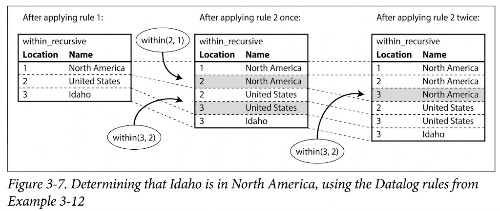
</div>

Datalog engine backend par patterns ko execute karne ke liye **Fixed-Point Iteration (Bottom-Up Evaluation)** ka use karta hai. Chaliye Figure 3-7 ke mutabaq dekhte hain ke database kaise step-by-step raw data se virtual rows derive karta hai:

```plaintext
[ Phase 1: Applying Rule 1 (Base Anchor) ]
Raw Location Facts ──► Evaluate Base Case ──► Populate within_recursive Table Phase 1
                                              ├── Row 1: [1 | North America]
                                              ├── Row 2: [2 | United States]
                                              └── Row 3: [3 | Idaho]

[ Phase 2: Applying Rule 2 Once (1st Recursive Hop) ]
Match: within(2,1) JOIN within_recursive(1, "North America") ──► New Row: [2 | North America]
Match: within(3,2) JOIN within_recursive(2, "United States") ──► New Row: [3 | United States]

[ Phase 3: Applying Rule 2 Twice (2nd Recursive Hop) ]
Match: within(3,2) JOIN new within_recursive(2, "North America") ──► New Row: [3 | North America]

[ Final State: Fixed-Point Reached (No More Rows Can Be Generated) ]

```

1. **Iteration 1 (Base Population):** Sab se pehle engine sirf Rule 1 apply karta hai. `location` table ki teeno rows direct `within_recursive` virtual view ke andar fit ho jati hain. Is state par Idaho ke agay sirf state, aur US ke agay sirf country mapped hai.
2. **Iteration 2 (First Jump Execution):** Ab engine Rule 2 ko pehli dafa run karta hai. Database check karta hai ke raw fact `within(2, 1)` (US within North America) maujood hai aur previous set mein `within_recursive(1, "North America")` bhi baitha hai. In dono ko join kar ke aik naye data row banti hai: `within_recursive(2, "North America")` (yaani US North America mein hai). Isi tarah `within(3, 2)` ko join kar ke `within_recursive(3, "United States")` derived ho jata hai.
3. **Iteration 3 (Deep Transitive Closure):** Engine loop ko doosri dafa chalata hai. Ab hamare paas naya fact aa chuka hai ke ID 2 North America mein hai. Engine raw record `within(3, 2)` (Idaho within US) ko uthata hai aur usay naye derived fact `within_recursive(2, "North America")` se join kar deta hai. Is operation ke natijay mein aakhri structural block banta hai: `within_recursive(3, "North America")`.

Ab jab engine agli iteration chalayega, toh koi bhi naya pattern match nahi hoga. Jab naya data generate hona band ho jaye, toh distributed compilation ki zabaan mein kehte hain ke **Fixed-Point Reached**. Datalog runtime execution yahin ruk jati hai aur safe evaluation complete ho jati hai.

---

## Interview aur Mockup System Design Scenario

### Scenario (The Problem)

Aap aik high-end **Cloud Infrastructure Analytics and Security Impact Platform (like AWS IAM Access Analyzer or Cloud Infrastructure Dependency Mapper)** design kar rahe hain. Data heavy and deeply nested networks par mushtamil hai: aik Multi-cloud infrastructure mein hazaron *Security Groups* hain, jo aage sau tarah ke *IAM Roles* se linked hain, jo aage saikdon *VPC Subnets* aur virtual machines (`EC2 Nodes`) par compute roles chala rahe hain.

Requirement yeh hai ke jab bhi security operations team kisi single security group par rule change kare, toh engine real-time mein (<70ms) recursive dependencies analyze kar ke alerts generate kare ke: *"Kya is security group ka explicit access indirect path traversal (`*`) ke zariye kisi aise isolated cluster node par tu nahi ja raha jahan sensitive patient health data store hai?"* RDBMS recursive loops standard SQL handles par bohot scale-heavy hain aur deep pointers chasing code application layer par likhna performance hazard hai.

### System Design Core Decisions & Trade-offs

1. **Datalog Engine Integration for Rule-Base Security Auditing:** Hum application memory routing ke bajaye aik dedicated Datalog engine database layer (jaise CozoDB cluster ya Datomic distributed shards) deploy karenge. Datalog ka rule-base paradigm software engineers ko allows karta hai ke security access criteria ko clean abstract functions (rules) mein todhain jahan mathematical transitive closures database ke andar optimized fixed-point induction se calculate hon.
2. **Trade-off (Write Serialization vs Complex Subgraph Traversal):** Datalog store use karne se system par network infrastructure configuration changes (writes) thodi serialized aur heavy ho sakti hain kyun ke rules matrix precomputation scans chala sakta hai. Magar chunke cloud setup updates rare hotay hain aur incident analytics/security access lookups (reads) highly critical aur multi-hop deep hotay hain, isliye hum reads ko speed-up karne ke liye writes par clear trade-off select kar rahe hain.

### Architectural Flow Diagram

```plaintext
                                   [ DevSecOps / Security Policy Trigger ]
                                                     │
                                                     ▼ (POST /v1/security/impact-analysis)
                                       [ API Gateway / Load Balancer ]
                                                     │
                                                     ▼
                                      [ Security Analyzer Microservice ]
                                                     │
                                                     ▼ (Pushes Declarative Datalog Rules)
┌───────────────────────────────────────────────────────────────────────────────────────┐
│ [ Distributed Datalog Engine Storage Cluster (CozoDB / Datomic Ring) ]                │
│                                                                                       │
│   Core Datalog Logic Execution:                                                       │
│   iam_path_recursive(Group, Target) :- direct_link(Group, Via),                       │
│                                           iam_path_recursive(Via, Target).            │
│                                                                                       │
│   Execution Path:                                                                     │
│   [Security_Group_A] ──► [IAM_Role_X] ──► [VPC_Subnet_2] ──► [Target_Database_Node]   │
│   (Bottom-up execution logic resolves deep paths directly via index-driven iterations)│
└───────────────────────────────────────────────────────────────────────────────────────┘
                                                     │
                                                     ▼ (Blast Radius Pattern Match Found)
                          [ Critical Security Breach Vulnerability Alert Triggered ]
                                                     │
                                                     ▼ (Sub-35ms Engine Evaluation)
                               [ UI Renders Full Visual Topology Network Map ]

```

### Interview Talk (Key Takeaways)

* **Interviewer Question:** Hum Datalog database use karne ke bajaye Neo4j ki Cypher query ya standard SQL use kar ke bhi toh security group paths trace kar sakte thay. Datalog mein kya khass software engineering engineering benefit milta hai?
* **Your Answer:** Cypher aur recursive SQL complex scenarios mein tab complex ho jati hain jab aapko aik query ke upar doosri queries build karni hon. Cypher mein lamba pattern matching block single statements tak limited hota hai. Datalog ka sab se bada architectural benefit yeh hai ke is mein hum code ki tarah **Modular Functions (Rules)** likhte hain. Hum aik rule likhenge `network_reachability`, phir aik alag rule likhenge `iam_clearance`, aur teesra main rule pehle do rules ko aapas mein call kar ke aik abstract third layer view bana sakta hai. Is reusable modularity ki wajah se complex cloud compliance rules maintain karna intehai easy ho jata hai. Mazeed yeh ke, Datalog ka bottom-up execution engine loops aur redundant connections wale graph patterns ko naturally safe tareeqay se process karta hai bina memory crash ya infinite recursive stack execution warnings ke, jo production system ko scale karne ke liye behtareen implementation design pattern hai.

---

## GraphQL

GraphQL aik makhsoos query language hai jise jaan-boojh kar (by design) is chapter mein parhi gayi baqi sari languages (Cypher, SPARQL, SQL, Datalog) ke muqable mein bohot zyada **restrictive (mahdood)** banaya gaya hai. Iska poora design architecture **OLTP (Online Transaction Processing)** queries ke liye optimize kiya gaya hai. Iska asal maqsad yeh hai ke user ke device par chalne wala client software (jaise mobile app ya browser ka JavaScript web frontend) server se aik aisa makhsoos JSON document request kar sakay jis ka structure bilkul client ki apni zaroorat ke mutabaq ho, taake UI ko render karne ke liye sirf zaroorat ke fields hi network par travel karein.

### API Agility Versus Tooling Cost Aur Security Trade-offs

* **Frontend Flexibility:** GraphQL interfaces ka sab se bada faida yeh hai ke frontend developers server-side APIs ko bina touch kiye ya bina kisi badlao ke, client-side code ke andar apni queries ko bohot tezi se change kar sakte hain.
* **The Infrastructure Cost:** Magar yeh flexibility muft nahi aati, iski aik bhari architectural keemat chukani padti hai. Jo organizations GraphQL ko apnaati hain, unhein backend par aik poora heavy tooling system aur middleware design karna padta hai jo client se aane wali GraphQL queries ko parse kare aur unhein internal microservices ke requests (jo aam taur par REST ya gRPC protocols use karti hain) mein convert kare.
* **The Security Challenge:** GraphQL systems mein **Authorization (field-level permissions check karna)**, **Rate Limiting (untrusted traffic ko block karna)**, aur **Performance bottlenecks (N+1 query traps)** ko handle karna aik bohot bada challenge ban jata hai.
* **The Untrusted Source Constraint (DoS Protection):** GraphQL queries hamesha untrusted sources (yaani open public internet aur client devices) se aati hain. Isliye is language ko intentionally limited rakha gaya hai taake koi bhi user (chahe galti se ya jaan-boojh kar) aisi heavy query na execute kar sakay jo database server par computational resource explosion paida kar de aur poore system par Denial-of-Service (DoS) ki condition khadi kar de.
* **No Arbitrary Filters or Recursion:** Yahi wajah hai ke GraphQL ke andar **Recursive Queries** chalanay ki bilkul ijazat nahi hoti (jo ke Cypher, SQL, aur Datalog ki core taqat thi). Iske sath sath, aap GraphQL mein apni marzi ki arbitrary complex search conditions (jaise hamari pichli query: "un logon ko dhoondho jo US mein paida huay aur Europe mein reh rahe hain") tab tak nahi chala sakte jab tak backend engineers aur service owners ne makhsoos endpoints par aisi search functionality khud khud se likh kar expose na ki ho.

---

### Real-World Example: Group Chat Application (Discord / Slack Clone)

GraphQL ki utility aur data payload management ko samajhne ke liye hum Discord ya Slack jaisi aik group chat application ki example ko dissect karte hain.

Writer ka table code agay say as it is likhna:

```graphql
query ChatApp {
 channels {
 name
 recentMessages(latest: 50) {
 timestamp
 content
 sender {
 fullName
 imageUrl
 }
 replyTo {
 content
 sender {
 fullName
 }
 }
 }
 }
} 

```

#### Example 3-13 Code Structure Ki Step-by-Step Explanation:

* **`query ChatApp`:** Yeh query ka entry root aur operation name hai jise execution engine identify karta hai.
* **`channels { name ... }`:** Client database se un saare chat channels ki list maang raha hai jin ka us user ke paas access hai, aur har channel ka sirf `name` property request kar raha hai.
* **`recentMessages(latest: 50)`:** Yeh GraphQL ka aik powerful feature hai jise *Field Arguments* kehte hain. Client query ke andar hi parameter pass kar raha hai ke mujhe har channel ke andar bikhre huay lakhon messages nahi chahiye, balkay sirf top **50 most recent messages** ka slice (pagination filter) chahiye.
* **`timestamp` aur `content`:** Har single message object ke andar se sirf uski tareekh/waqt (timestamp) aur actual text message (content) ko nikalne ki command hai.
* **`sender { fullName imageUrl }`:** Yeh aik nested object layer hai. Message likhne wale user ka profile object join ho raha hai taake UI par uski poori identity (`fullName`) aur avatar image ka raw web link (`imageUrl`) render kiya ja sakay.
* **`replyTo { content sender { fullName } }`:** Yeh aik aur deep structural nested linkage hai. Agar koi message kisi purane message ka reply (thread reply) hai, toh yeh query us targeted parent message ka text content aur uske original sender ka naam utha kar layegi taake UI par chote font mein context dikhaya ja sakay.

Chaliye ab dekhte hain ke is query ke jawab mein server se aane wala data payload kaisa dikhta hai.

Writer ka table code agay say as it is likhna:

```json
{
 "data": {
 "channels": [
 {
 "name": "#general",
 "recentMessages": [
 {
 "timestamp": 1693143014,
 "content": "Hey! How are y'all doing?",
 "sender": {"fullName": "Aaliyah", "imageUrl": "https://..."},
 "replyTo": null
 },
 {
 "timestamp": 1693143024,
 "content": "Great! And you?",
 "sender": {"fullName": "Caleb", "imageUrl": "https://..."},
 "replyTo": {
 "content": "Hey! How are y'all doing?",
 "sender": {"fullName": "Aaliyah"}
 }
 }
 ]
 }
 ]
 }
}

```

#### Example 3-14 Output Response Ki Detailed Decomposition:

* **JSON Mirroring Property:** Jaisa query ka design template tha, output JSON document bilkul uska aik **wazeh ayna (mirror)** hai. Is mein na toh aik field zayed hai aur na aik field kam. Is se network par *Over-fetching* (fuzool data aana) mukammal khatam ho jati hai.
* **Zero Server-Side UI Dependencies:** Server ko is baat se koi sarakkar nahi hai ke frontend app is waqt mobile screen par kya render kar rahi hai. Frontend app bina server code badle kisi bhi waqt naya field add ya remove kar sakti hai. Misaal ke taur par, is query mein `replyTo` ke sender ka `imageUrl` request nahi kiya gaya tha. Agar kal ko designer kehta hai ke reply feed par bhi choti si golo photo dikhao, toh frontend engineer bina backend team ko disturb kiye query mein sirf `imageUrl` ka lafz barha dega aur kaam chal jayega.

---

### Network Payload Size Versus Client Round-Trips Matrix

GraphQL ke is design logic mein aik bohot bada structural trade-off chhupa hua hai jise data optimization ke lehaz se samajhna zaroori hai:

* **The Data Duplication Cost (Denormalization on Wire):** Example 3-14 ke response payload ko ghaur se dekhein. Pehla message Aaliyah ne bheja, aur doosra message Caleb ne bheja jo ke Aaliyah ke message ka reply hai. Iska natija yeh hua ke Aaliyah ka naam (`fullName: "Aaliyah"`) aur uski information pure JSON payload ke andar **do dafa repeat (duplicate)** ho rahi hai—aik dafa main sender mein aur aik dafa `replyTo` ki nested tree mein. Agar aik hi user line se 10 messages bhejega, toh har single message ke andar us user ka poora profile string network wire par baar baar repeat hoga.
* **The Core Design Choice:** GraphQL ne jaan-boojh kar yeh strict architectural decision liya ke hum **Network Payload ka size badhna (larger response size) bardaasht kar lein ge**, magar client application ke liye UI rendering logic ko intehai simple rakhenge.
* **Avoiding The Round-Trip Hell:** Iska mutabadil rasta yeh tha ke server nested object ke bajaye sirf parent message ki ID (`replyTo: "msg_101"`) return karta. Magar us surat mein agar woh parent message un top 50 recent messages ki list mein na hota, toh mobile app ko us purane message ka content nikalne ke liye server par aik alag se **Second Network HTTP Round-Trip Request** marna padta. Mobile networks par high latency aur round-trips pure user experience ko tabaah kar dete hain, isliye data duplication select karna network performance ke liye behtareen engineering trade-off hai.

---

### Database Normalization Layer Aur Schema Boundaries

GraphQL execution layer aur core database engine ke darmiyan separation line ko samajhna system design ke liye nihayat critical hai:

* **Backend Normalization:** Server ka apna buniyaadi database is data ko poori tarah normalize rakh sakta hai. Misaal ke taur par, database disk blocks par aik clean `messages table` chal raha hoga jahan har row mein sirf `sender_id` aur `reply_to_id` ke foreign key integers save honge.
* **The Resolvers Execution Engine:** Jab server ko Example 3-13 jaisi GraphQL query milti hai, toh GraphQL runtime engine backend programming ke andar har field ke liye alag alag asynchronous functions chalata hai jinhein **Resolvers** kehte hain. Yeh resolvers un relational IDs ko runtime par resolve (join) kar ke nested graph structure assemble karte hain.
* **Explicit Schema Boundaries:** Sab se ahem pabandi yeh hai ke client sirf aur sirf unhi joins aur fields ko request kar sakta hai jinhein backend engineers ne database schema ke andar **Explicitly Declare aur Expose** kiya ho. Aap relational database ki tarah apni marzi se kisi bhi random table par runtime join nahi thonk sakte.
* **Database Agnostic Nature:** GraphQL ke naam mein agarchay "Graph" aata hai aur iska output response aik document store jaisa lagta hai, magar iska database ki physical storage technology se koi direct taaluq nahi hota. GraphQL ko aap duniya ke kisi bhi database infrastructure—chahe woh traditional Relational SQL (PostgreSQL/MySQL) ho, Document Store (MongoDB) ho, ya native Graph store (Neo4j) ho—ke upar aik abstract API parsing layer ke roop mein perfectly deploy kar sakte hain.

```plaintext
[ Client Request UI Tree ]
            │
            ▼ (GraphQL Query over HTTP)
[ GraphQL Parsing & Validation Layer ] ─── (Checks query against Strict Predefined Schema Types)
            │
            ▼ (Triggers Field Resolvers Concurrent Tasks)
[ Service Application Code / Resolvers Engine ]
            ├─── Resolve channels() ───► Query SQL DB (SELECT * FROM channels)
            ├─── Resolve recentMessages() ───► Query Redis Cache (LRU Message Array)
            └─── Resolve sender() ───► RPC Call to User-Profile Microservice (gRPC)
            │
            ▼ (Assembles and Flattens into Nested Format)
[ Pure Aggregated JSON Mirror Payload ] ───► Sent back to Client App Node

```

---

## Interview aur Mockup System Design Scenario

### Scenario (The Problem)

Aap Discord aur Slack ke bade scale ka **Real-Time Group Collaboration Hub** design kar rahe hain jahan platform par daily 50 Million active cell-phone users text chatting, threading, aur emoji reactions send karte hain. Network constraints bohot severe hain (bade shehron mein 3G/4G bandwidth fluctuations aam hain). Purana mobile client har action par multiple REST API endpoints (GET /channels, GET /messages, GET /users/id) ko alag alag hit karta tha, jis se heavy network overhead aur HTTP connection timeouts ka samna karna padta tha. Aapko is rendering path ko sub-150ms network round-trip par le kar aana hai using GraphQL API gateway middleware.

### System Design Core Decisions & Trade-offs

1. **GraphQL BFF (Backend-for-Frontend) Architecture:** Hum core clients aur services ke darmiyan aik dedicated GraphQL network gateway deploy karenge. Hum over-fetching aur under-fetching dono bottlenecks ko network level par block karenge taake client strictly UI variables ke mutabaq customized single payload fetch kar sakay.
2. **Batching & Caching Layer via DataLoaders (N+1 Resolution):** GraphQL resolvers chalate waqt sab se bada khatra N+1 query problem ka hota hai (misaal ke taur par, 50 messages ke authors ka profile database se nikalne ke liye engine 50 independent SQL commands hit kar sakta hai). Isko optimize karne ke liye hum application memory tier par **Facebook's DataLoader Utility** implement karenge, jo 50 individual primary key lookups ko aik single microsecond window mein batch (coalesce) kar ke direct SQL query `SELECT * FROM users WHERE id IN (1, 2, ... 50)` mein convert kar degi, aur sath hi request-scoped caching se redundant users lookup cost zero kar degi.

### Architectural Flow Diagram

```plaintext
                                   [ Mobile Clients / Web Frontends ]
                                                   │
                                                   ▼ (Single GraphQL Query Post Payload)
                                   [ API Gateway Layer / NGINX Proxy ]
                                                   │
                                                   ▼
┌────────────────────────────────────────────────────────────────────────────────────────┐
│ [ GraphQL BFF Microservice Engine (Node.js / Go Runtime) ]                             │
│                                                                                        │
│   Schema Type Definitions Enforced:                                                    │
│   type Message { id: ID!, content: String!, sender: User!, replyTo: Message }          │
│                                                                                        │
│   ┌────────────────────────────────────────────────────────────────────────────────┐   │
│   │ DataLoader Internal Queue Buffer (10ms Wait Window)                            │   │
│   │ [Collects: User_ID 1, User_ID 2, User_ID 1 (De-duplicates instantly)]          │   │
│   └───────────────────────────────────────┬────────────────────────────────────────┘   │
└───────────────────────────────────────────┼────────────────────────────────────────────┘
                                            │
                        ┌───────────────────┴───────────────────┐
                        ▼ (Executes Single Batch SQL Query)     ▼ (Asynchronous WebSocket Sync)
         [ Core Relational SQL Cluster ]                  [ Live Pub-Sub Notification Cluster ]
         (Highly Normalized Messages Tables)              (Handles instant text push alerts)

```

### Interview Talk (Key Takeaways)

* **Interviewer Question:** Agar hum ne GraphQL layer lagayi aur koi malicious crawler user client application ke bypass kar ke gateway par aik be-tahasha nested deep query hit kar de (e.g., messages -> sender -> channels -> messages -> sender -> channels up to 100 levels), toh hamara database resolvers compute stack collapse ho jayega. No recursion policy ke bawajood is deep query nesting attack (DoS) se backend ko kaise protect karenge?
* **Your Answer:** Yeh GraphQL security ka aik classic vulnerability footprint hai jise *Nested Query Abuse Attack* kehte hain. Is structural threat se bachne ke liye hum production code mein teen ahem lines of defense set karte hain. Pehle, hum gateway par **Static Query Depth Analysis** lagayenge. Yeh middleware incoming query tree ko bina execute kiye scan karta hai aur agar query ka nesting depth level hamari limit (e.g., max 5 levels depth) se zyada ho, toh gateway resolver layer tak pohnchne se pehle hi request ko instant drop (abort) kar deta hai. Doosra, hum production environment mein **Persisted Queries (Query Whitelisting)** implement karte hain. Frontend app development ke waqt hi saari legitimate queries ka SHA-256 hash hash backend database par register kar diya jata hai. Mobile client network par puri query string bhejne ke bajaye sirf hash ID bhejta hai. Agar koi attacker apni custom modified deep nested text block hit karega, toh gateway use unrecognized signature keh kar database connection layer se pehle hi register hone se makhsoos reject kar dega, jo system availability ko secure rakhne ka behtareen scalable structural standard hai.

---

## Event Sourcing and CQRS

Complex distributed applications mein aksar yeh problem samne aati hai ke jis format mein data ko database mein write (save) kiya jata hai, usi format mein use behtareen performance ke sath read ya query nahi kiya ja sakta. Agar aap poore system ke liye aik hi single data representation (jaise standard tables ya documents) select karte hain, toh aapko reads ya writes mein se kisi aik par severe compromise karna padta hai. Is design bottleneck ko hal karne ke liye hum aik naya architectural pattern use karte hain: data ko aik aise format mein write kiya jata hai jo purely writes ke liye optimized ho, aur us se automatic aisi derived representations (projections) generate ki jati hain jo purely specialized reads ke liye optimized hon.

Agar hum kisi system ko strictly high-throughput writes ke liye design karein aur read queries ki latency ki fikar bilkul chhipa dein, toh data save karne ka sab se fast, safe aur flexible tareeqa aik **Immutable Append-Only Event Log** hai. Jab bhi system mein koi tabdeeli aati hai, hum existing data ko badalne (update) ya delete karne ke bajaye, us event ka poora context aik self-contained string ya JSON object ke roop mein timestamp ke sath log ke aakhri hissay mein append (jorh) dete hain.

---

### Detailed Dissection of Figure 3-8 (The Core Architecture)

<div align="center">
  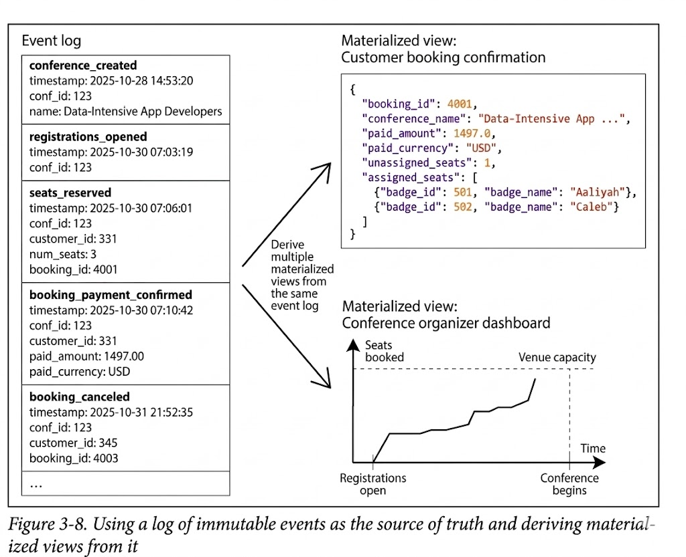
</div>

Aap ke share kiye gaye Figure 3-8 mein Event Sourcing aur CQRS ka mukammal data lifecycle aur execution blueprint dikhaya gaya hai. Yeh example aik complex Conference Management System ki hai jahan bikhra hua business logic (seats reservation, bulk corporate ordering, allocations, cancellations) run ho raha hai.

Chaliye is diagram ke left side par maujood raw event log matrix aur right side par derived views ko completely text layout mein decode karte hain aur iski mechanical processing ko samajhte hain.

#### 1. Write-Optimized Stream (The Left Box Fact Log)

Writer ka text code ya data structure agay say as it is likhna:

```json
// Event 1: Conference Created
{
  "event_type": "conference_created",
  "timestamp": "2025-10-28 14:53:20",
  "conf_id": 123,
  "name": "Data-Intensive App Developers"
}

// Event 2: Registrations Opened
{
  "event_type": "registrations_opened",
  "timestamp": "2025-10-30 07:03:19",
  "conf_id": 123
}

// Event 3: Seats Reserved
{
  "event_type": "seats_reserved",
  "timestamp": "2025-10-30 07:06:01",
  "conf_id": 123,
  "customer_id": 331,
  "num_seats": 3,
  "booking_id": 4001
}

// Event 4: Booking Payment Confirmed
{
  "event_type": "booking_payment_confirmed",
  "timestamp": "2025-10-30 07:10:42",
  "conf_id": 123,
  "customer_id": 331,
  "paid_amount": 1497.00,
  "paid_currency": "USD"
}

// Event 5: Booking Canceled
{
  "event_type": "booking_canceled",
  "timestamp": "2025-10-31 21:52:35",
  "conf_id": 123,
  "customer_id": 345,
  "booking_id": 4003
}

```

**Code aur Logic Key Analysis:**

* **Past Tense Semantics:** Figure 3-8 mein saare events ke naam hamesha past tense (`conference_created`, `seats_reserved`) mein hain. Yeh distributed system ka aik buniyadi asool hai: event is baat ka pakka saboot hai ke yeh event mazi mein **baway (happen)** ho chuka hai, yeh aik immutable fact ban chuka hai jise radd nahi kiya ja sakta.
* **Polymorphic Schemas:** Har event ka internal data structure bilkul mukhtalif hai. `conference_created` mein conference ka naam hai, jabke `seats_reserved` mein `booking_id` aur `num_seats` ka dynamic metadata shamil hai. Event store bina kisi table schema restrictions ke in bikhre huay JSON payload strings ko sequential sequence mein save karta jata hai.

#### 2. The Derivation & Projection Layer (The Middle Arrows)

Diagram ke darmiyan mein jo arrows dikhaye gaye hain, woh projection processors (consumers) ko zahir karte hain. Jab bhi upar wala log append-only format mein aage barhta hai, yeh workers asynchronous stream ke zariye in events ko read karte hain aur target databases par push karte hain.

#### 3. Read-Optimized Representations (The Right Projections)

Dono arrows do bilkul alag-alag specialized read models (Materialized Views) ko generate kar rahe hain:

* **Top View (Customer Booking Confirmation):** Yeh aik structural Document model hai jo client endpoint UI ke liye optimize kiya gaya hai:
Writer ka text/JSON payload code agay say as it is likhna:

```json
{
  "booking_id": 4001,
  "conference_name": "Data-Intensive App ...",
  "paid_amount": 1497.0,
  "paid_currency": "USD",
  "unassigned_seats": 1,
  "assigned_seats": [
    {"badge_id": 501, "badge_name": "Aaliyah"},
    {"badge_id": 502, "badge_name": "Caleb"}
  ]
}

```

*Explanation:* Jab projection service ne event log se `seats_reserved` aur `booking_payment_confirmed` ko sequential order mein process kiya, toh unho ne combines kar ke yeh self-contained nested profile view build kiya taake jab user dashboard kholay, toh zero database join cost ke sath instant confirm screen render ho sakay.

* **Bottom View (Conference Organizer Dashboard Chart):** Yeh doosra arrow data ko aik tabular Time-Series matrix mein dhalta hai. Diagram ke mutabaq, line chart Y-axis par `Seats booked` aur X-axis par `Time` ko track kar raha hai. Jaise hi `registrations_opened` ke baad user reservations ke events log mein append hotay hain, chart ki graph line step-by-step jump maar kar upper limit (`Venue capacity`) ki taraf barhti hai.

---

### Core Definition: Event Sourcing Versus CQRS

Software engineering mein in do terms ke darmiyan aik clear separation boundary hoti hai jise mix nahi karna chahiye:

1. **Event Sourcing (The Source of Truth Pattern):** Iska matlab hai ke aapki application ki state ko track karne ke liye koi current snapshot database (jaise dynamic user row) primary resource nahi hai. System ki asal state aur **Source of Truth** darasl woh sequential event log hai jo mazi ke saare state changes ko register karta aya hai. Aap ki application ki current state is event log ko starting point se replay kar ke nikali jati hai.
2. **CQRS (Command Query Responsibility Segregation):** Yeh architecture level par write path aur read path ko do alag domains mein taqseem (segregate) karne ka naam hai. Jab client koi action perform karta hai, toh usay **Command** kehte hain (jo write operation chalata hai). Jab client data viewing karta hai, toh usay **Query** kehte hain (jo specialized read views hit karta hai). Event Sourcing ke bina bhi CQRS lagaya ja sakta hai (e.g., dual-writing to SQL and Elasticsearch), magar Event Sourcing natural tareeqay se CQRS ke read models ko drive karne ka fuel banti hai.

#### Execution Lifecycle Sequence: From Command to Fact Fact

Jab user ticket book karne lagta hai, toh workflow is tarah execute hota hai:

```plaintext
[ User Request / Action ] ──► [ Validates Command against Current State ]
                                          │
                                          ▼ (If Valid: Succeeds and Hardens)
                              [ Immutable Fact Created (Past Tense) ]
                                          │
                                          ▼ (Append to Storage Disk)
                              [ Global Event Log Stream Engine ]
                                          │
                   ┌──────────────────────┴──────────────────────┐
                   ▼ (Async Processor A)                         ▼ (Async Processor B)
     [ Denormalized Read Store ]                   [ Time-Series Analytics DB ]

```

---

### Comparison Matrix: Event Sourcing Versus Star Schema

Agarchay Event Sourcing aur analytics ka Star Schema table dono mazi ke events (historical logs) ka record rakhte hain, magar unke internals mein gehre data modeling differences hote hain:

* **Column Uniformity:** Star schema ke fact table ke andar har single row ka column structure strictly uniform (aik jaisa fixed layout) hota hai. Event Sourcing mein har event type ka data payload dynamic aur polymorphic hota hai.
* **Order Significance:** Analytics fact tables unordered collections bante hain (agar do transactions aage peeche save hon, toh analytics sum par koi farq nahi padta). Event Sourcing mein **Events ka sequence order intehai critical hota hai**. If a user first makes a booking and then cancels it, processing those events in the wrong order (pehle cancellation process karna aur phir booking) poore read model state machine ko crash ya corrupt kar dega.

---

### Deep Architectural Advantages of Event Sourcing/CQRS

* **High Semantic Intent Communication:** Traditional CRUD database mein jab koi user booking cancel karta hai, toh background execution direct row target karti hai: `UPDATE bookings SET active = false`. Software level par yeh samajhna mushkil hota hai ke yeh row false kyun hui? Kya user ne cancel kiya, kya payment timeout hui, ya admin ne remove kiya? Event Sourcing mein intent bilkul crystal clear direct store hota hai: `"booking_canceled"`.
* **Deterministic Time Travel & View Reproducibility:** Agar aapki view maintenance programming logic mein koi severe bug aa jata hai jis se dashboard data ghalat show ho raha ho, toh aapko complex manual patches chalane ki zaroorat nahi hai. Aap simply purane read-store tables ko **Delete (Drop)** kar dete hain, code ka bug fix karte hain, aur background pointer reset kar ke starting points se saare events dobara replay kar dete hain. Poora state machine naye clean code se automatic recompute ho jata hai.
* **Polyglot Reading Optimizations:** Chonke read models derived processors hain, aap aik hi event log se teen alag databases feed kar sakte hain. Custom billing queries ke liye PostgreSQL table projection chala dein, autocomplete search ke liye Elasticsearch index project kar dein, aur network visualization ke liye Graph database feed kar dein.
* **Asynchronous Write Buffering & Smooth Throughput:** Append-only log storage continuous sequential writes use karta hai jo dynamic random disk access ya heavy table locks se azad hota hai. Peak business events or write storms ke dauran log absorbing shield ka kaam karta hai, aur backend consumers updates ko apni automatic pace par scale kar ke process karte hain bina applications layer ko throttling hit kiye.

---

### Critical Downsides and Mitigation Standards

* **The Non-Deterministic External Dependency Trap:** Agar event process karte waqt humein kisi external variable par rely karna paday (jaise currency exchange conversion rate calculation), toh system recomputations par crash ho sakta hai. Agar hum saal baad event replay karenge aur us waqt ka live dollar rate fetch karenge, toh hamara billing view corrupt ho jayega.
* *Mitigation Engineering:* Processing logic ko strictly deterministic hona chahiye. Ya toh exchange rate snapshot ko event payload ke andar hi append-only compile kar ke save karein, ya phir database mein aik historical time-stamped rate tracker maintain karein jo same historical timestamp parameter par hamesha identical fixed answer hi return kare.


* **The GDPR Immutability Conflict (Right to be Forgotten):** European data compliance compliance (GDPR) ke mutabaq user apna personal account mapping data remove karwa sakta hai. Magar event store immutable hai, wahan se delete operation chalanay se poori distributed chain break ho jati hai.
* *Mitigation Engineering:* Is bottleneck ko hal karne ke liye **Crypto-Shredding** architecture design kiya jata hai. User ka actual private sensitive data (name, email) event log mein save karne ke bajaye aik alag secure external table mein save kiya jata hai, aur event log mein sirf uski encrypted token string di jati hai. Jab user right-to-erase request karega, system sirf us external key block ko destroy (shred) kar dega, jis se event payload ka structural log baqi rahega magar encryption key delete hone ki wajah se data completely un-readable garbage block ban jayega.


---

## Interview aur Mockup System Design Scenario

### Scenario (The Problem)

Aap aik international ride-hailing application (like Uber or Careem Clone) ke liye **Core Ride Lifecycle & Dynamic Fare Estimation Engine** design kar rahe hain. System par high scale traffic hai: har second lakhon customers rides request karte hain, drivers states accept ya reject karte hain, GPS location pings emit hoti hain, aur ride paths complete hotay hain.

Business operations team ko do zaroori requirements chahiye: pehle, customer support team ko har ride ka aik complete audit trace timeline chahiye ke ride kab request hui, kis driver ko pehle match mila, us ne kab reject kiya, aur kis location par passenger pickup hua (<100ms UI loading latency). Doosra, machine learning pricing data teams ko past historical tracking ka data bulk columns analytics formats mein chahiye taake price surge models evaluate ho sakein. Purana monolithic dynamic table updates state lock contention ki wajah se database deadlocks paida kar raha hai.

### System Design Core Decisions & Trade-offs

1. **Event Sourced Architecture using Apache Kafka & EventStoreDB:** Hum direct operational state dynamic overwrite queries (`UPDATE rides SET status = 'completed'`) bilkul ban kar dein ge. Ride lifecycle ki har state change ko aik immutable command validation loop se guzar kar past-tense events (e.g., `ride_requested`, `driver_matched`, `driver_rejected`, `trip_started`, `trip_completed`) ki surat mein sequential log store mein serialize kiya jayega.
2. **CQRS Projection Isolation for Multi-Model Storage:** Read performance ko optimize karne ke liye write stream se do separate projections run ki jayengi. Customer support audit screen ke liye hum data ko aik document store (MongoDB) view mein materialise karenge jahan har ride ki single continuous self-contained text stream update hogi. Machine learning aggregation analytics ke liye data parallel mein columnar layout (ClickHouse DB) table columns mein bulk dump hota jayega.

### Architectural Flow Diagram

```plaintext
                                   [ Driver & Passenger App Telemetry ]
                                                    │
                                                    ▼ (Emits Operations Actions Commands)
                                   [ Ride Lifecycle Command Service ]
                                                    │ (Validates against core memory locks)
                                                    ▼
┌────────────────────────────────────────────────────────────────────────────────────────┐
│ [ High-Throughput Distributed Event Store (Kafka Ledger / EventStoreDB Cluster) ]      │
│                                                                                        │
│   Immutable Sequential Storage Stream:                                                 │
│   [Ride:91, Type:ride_requested] ──► [Type:driver_matched] ──► [Type:trip_started]    │
│   (Append-Only structural disk layout ensures high burst absorption & zero locks)      │
└────────────────────────────────────────────────────────────────────────────────────────┘
                                                    │
                        ┌───────────────────────────┴───────────────────────────┐
                        ▼ (Asynchronous Projection Worker 1)                     ▼ (Asynchronous Projection Worker 2)
       [ MongoDB Cluster Read Projections ]                     [ Columnar ClickHouse Analytics Engine ]
       │ (Optimized for Customer Support UI)                    │ (Optimized for Surge Price Data Science)
       │                                                        │
       ▼ (Single Key Document Fetch <40ms)                      ▼ (High-Volume Column Aggregations)
[ Support Agent Interface Dashboard Views ]             [ Dynamic Surge Machine Learning Models ]

```

### Interview Talk (Key Takeaways)

* **Interviewer Question:** Event Sourcing aur CQRS architecture mein saba se bada runtime barrier Eventual Consistency ka hota hai. Agar driver ride accept karta hai (`driver_accepted` event write log mein chala gaya) magar background consumer workers ke lag ki wajah se passenger ka read-model query view instantly update nahi hota, toh user ko screen par lag dikhega. Aap is network sync gap latency ko production system mein kaise solve karenge?
* **Your Answer:** Yeh CQRS systems ka aik buniyaadi business infrastructure trade-off hai jise *Eventual Consistency Handling* kehte hain. Is read-sync gap lag ko users software interface par design level par mitigate karne ke do technical solutions hain. Pehla engineering standard yeh hai ke jab application request call gateway par hit karti hai, toh command validation logic acknowledge hotay hi user client local application memory layer par ek dynamic **Optimistic UI Update** reflect kar deti hai (yaani user ko lagne lagta hai ke status badal gaya hai), jabke backend engine asynchronous message queue buffers ko reconcile kar raha hota hai. Doosra solid technical architecture path yeh hai ke hum simple REST request long-polling queries use karne ke bajaye frontend integration par **WebSockets/Server-Sent Events (SSE)** ka notification layer configure karte hain. Gateway command processing complete hote hi direct event processing loop se aik parallel trigger alert notification node WebSocket engine ke zariye driver state change ka dynamic payload client screen par instant bypass kar deta hai, jis se backend execution system completely decoupled rehta hai aur read throughput par compromise kiye bina sub-100ms application agility faraham ki ja sakti hai.

---

## DataFrames, Matrices, and Arrays

Ab tak hum ne jitne bhi data models parhay hain (Relational, Document, aur Graphs), unhein aam taur par operational transaction processing (OLTP) aur core data analytics (OLAP) dono maqasid ke liye use kiya jata hai. Magar distributed data architecture mein kuch aise data models bhi hote hain jo makhsoos analytical, numerical, aur scientific contexts ke andar hi paaye jate hain aur operational systems (OLTP) mein unka support na hone ke barabar hota hai. In specialized models mein **DataFrames** aur numbers ke multidimensional arrays (jaise **Matrices**) sab se ahem hain.

### DataFrame Model Aur Imperative Data Wrangling

DataFrame data model ko R language, Python ki Pandas library, Apache Spark, ArcticDB, aur Dask jaise modern heavy analytics frameworks natively support karte hain. Yeh model data scientists ka sab se pasandida tool hai jo Machine Learning (ML) models ko train karne ke liye raw data ko clean aur prepare karte hain. Iske sath sath data exploration, statistical analysis, aur data visualization ke liye bhi DataFrames ka use sab se zyada hota hai.

* **Relational Operators Similarity:** Pehli nazar mein DataFrame bilkul aik relational database table ya aik excel spreadsheet ki tarah lagta hai. Is mein rows aur named columns hote hain. DataFrame ke APIs relational-style ke bulk processing operators support karte hain, jaise ke poore data rows par koi functional formula apply karna, conditions par data ko filter out karna, columns par data ko group-by kar ke aggregate metrics nikalna, aur do alag DataFrames ko primary key ke buniyaad par aphas mein join karna (DataFrames ki zabaan mein relational join operation ko aam taur par **`merge`** kaha jata hai).
* **The Imperative Paradigm Twist:** Agarchay operators relational jaise hote hain, magar DataFrames ko query karne ke liye SQL jaisi declarative query language use nahi ki jati. Iske bajaye, DataFrame ko programmatically **Step-by-Step Commands** (Imperative workflow) ke zariye manipulate kiya jata hai jo data ke internal structure ko badalti hain.
* **Data Wrangling Workflow:** Aik data scientist data ke sath khelte waqt step-by-step commands likhta hai jise **Data Wrangling** ya data munging kehte hain (misaal ke taur par: Pehle file load karo -> Null values drop karo -> String column ko split karo -> Phir grouping lagao). Yeh poora process aam taur par scientist ki apni local machine par data ke private copy block par chalta hai, aur processing complete hone ke baad final clean dataset ko cluster par share kiya jata hai.

---

### Writer Ka Table Code As-It-Is Layout

<div align="center">
  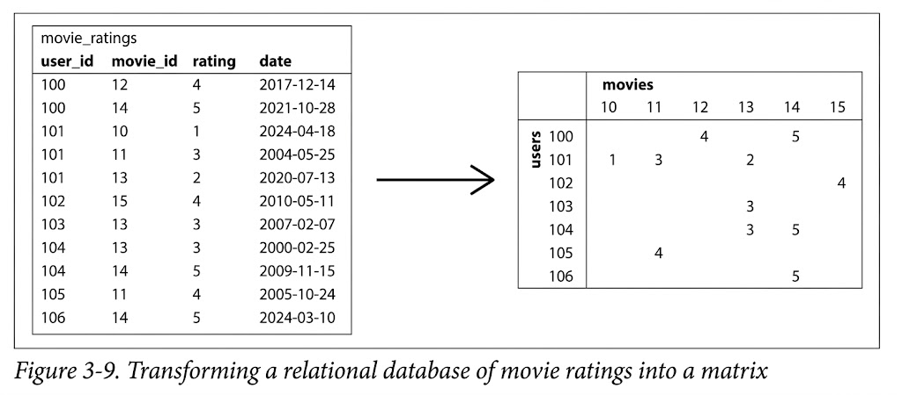
</div>

Kitab ke Figure 3-9 ke mutabaq, data ko relational stream se nikal kar matrix representation mein dhalne (Pivot transformation) ka poora structural layout darja-zail hai:

**Left Side: `movie_ratings` Table Representation**

| user_id | movie_id | rating | date |
| --- | --- | --- | --- |
| **100** | 12 | 4 | 2017-12-14 |
| **100** | 14 | 5 | 2021-10-28 |
| **101** | 10 | 1 | 2024-04-18 |
| **101** | 11 | 3 | 2004-05-25 |
| **101** | 13 | 2 | 2020-07-13 |
| **102** | 15 | 4 | 2010-05-11 |
| **103** | 13 | 3 | 2007-02-07 |
| **104** | 13 | 3 | 2000-02-25 |
| **104** | 14 | 5 | 2009-11-15 |
| **105** | 11 | 4 | 2005-10-24 |
| **106** | 14 | 5 | 2024-03-10 |

**Right Side: Transformed Multidimensional Matrix Representation**

| users / movies | 10 | 11 | 12 | 13 | 14 | 15 |
| --- | --- | --- | --- | --- | --- | --- |
| **100** |  |  | 4 |  | 5 |  |
| **101** | 1 | 3 |  | 2 |  |  |
| **102** |  |  |  |  |  | 4 |
| **103** |  |  |  | 3 |  |  |
| **104** |  |  |  | 3 | 5 |  |
| **105** |  | 4 |  |  |  |  |
| **106** |  |  |  |  | 5 |  |

---

### Data Matrix Ki Line-by-Line Mechanics Aur Sparse Array Allocation

Upar diye gaye data structures ke internal storage semantics aur linear mapping algorithms ko hum step-by-step dissect karte hain ke database backend par bytes kaise behave karte hain:

* **Relational Row-Stream Structure (Left Table):** Is traditional table mein data normalized sequential rows mein save hai. Jab user 100 do alag movies ko rate karta hai, toh disk par do independent entries banti hain. Har row ke andar `user_id`, `movie_id`, `rating`, aur aik metadata `date` maujood hai. Agar hum is structure par query chalayein ke "Kaunse do users ke pasand ka taste bilkul aik jaisa hai?", toh relational store ko millions of records par massive self-joins lagane padenge jo memory bandwidth ko freeze kar dete hain.
* **The Matrix Transmutation (Right Table):** DataFrame API is flat structural log ko uthata hai aur usay aik 2-Dimensional numerical array (Matrix layout) mein transform kar deta hai. Is matrix conversion mein:
* Table ke unique `user_id` values matrix ke **Rows Axis (Y-axis indices)** ban jate hain (100 se 106).
* Table ke unique `movie_id` values matrix ke **Columns Axis (X-axis indices)** ban jate hain (10 to 15).
* In dono coordinates ke intersection blocks par direct actual `rating` value (scalar float/int) map ho jati hai. Misaal ke taur par row index `101` aur column index `13` ke intersection point par value `2` hardcode ho gayi hai, jo raw table ki row number 5 ko point karti hai.


* **The Sparse Matrix Phenomenon:** Is matrix block ko ghaur se dekhein, is ke bohot se cells bilkul khaali (empty) hain. Wajah yeh hai ke real-world mein har user har movie ko rate nahi karta. Jab matrix ke zyadatar cells khaali hon, toh usay computer science ki zabaan mein **Sparse Matrix** kaha jata hai.
* **Relational Column Limits vs Sparse Memory Layouts:** Agar aap standard Relational Database Management System (RDBMS) ke table mein 10,000 wide columns (one column per movie) banane ki koshish karenge, toh system block-level disk configuration constraints ki wajah se fail ho jayega kyun ke relational tables wide horizontal fragmentation handle nahi kar sakte. Iske baraks, DataFrames aur Python ki specialized computational libraries (jaise **NumPy** aur SciPy) memory allocation ke waqt in empty blocks ka memory address allocate hi nahi karti. Yeh sirf un coordinates ka record compression algorithm (jaise Compressed Sparse Row - CSR format) ke tehat RAM mein store karti hain jahan non-zero data maujood ho, jis se gigabytes ka data space megabytes mein squeeze ho jata hai.

---

### Feature Engineering: Non-Numerical Dimensions Ko Tensors Mein Badalta Formula

Machine Learning ke mathematical engines (jaise Linear Algebra algorithms) sirf aur sirf **shudh numbers (numerical values)** samajhte hain; wahan text strings ya random timestamps direct execution fail kar dete hain. Non-numerical attributes ko matrix format ke mutabaq dhalne ke liye do ahem features deployment standards use kiye jate hain:

* **Temporal Floating-Point Scaling:** Raw table mein jo `date` column diya gaya tha, usay matrix representation se drop kar diya jata hai ya phir aik continuous scale format mein convert kiya jata hai. Dates ko floating-point numbers (decimals) mein normalise kiya jata hai (jaise Unix Epoch seconds chunk coordinate ranges) taake algorithm unke darmiyan numerical distance calculate kar sakay.
* **One-Hot Encoding Architecture:** Agar database table mein kisi entity ka categorical data text string mein ho (misaal ke taur par movie ka genre column: `Comedy`, `Drama`, `Horror`), toh system data matrix ko horizontally expand karne ke liye **One-Hot Encoding** schema implement karta hai:

```plaintext
[ Raw Categorical Table Row ] -> Movie: Interstellar | Genre: Sci-Fi

[ One-Hot Encoded Numerical Tensor Matrix ]
Movie ID │ Genre_Comedy │ Genre_Drama │ Genre_Sci-Fi │ Genre_Horror
─────────┼──────────────┼─────────────┼──────────────┼─────────────
   99    │      0       │      0      │      1       │      0

```

Har unique string value ke liye matrix mein aik naya independent virtual column allocate kiya jata hai. Agar target row us genre se taaluq rakhti hai, toh binary parameter level par exact coordinate par value **`1`** inject ho jati hai aur baqi saare horizontal positions par value **`0`** automatically append ho jati hai. Agar koi movie hybrid ho (e.g., Sci-Fi + Drama), toh dono columns mein `1` chala jata hai, jo machine learning training pipeline (jaise Recommendation Engines via Matrix Factorization) ko optimize karne ka industry standard tareeqa hai.

---

### Specialized Infrastructure: Array Databases Aur Financial Time-Series

Multidimensional array structures ko scale karne ke liye ab specialized databases wajood mein aa chuki hain jinhein **Array Databases** kaha jata hai:

* **TileDB Architecture:** TileDB jaise systems broad dimensions wale dense aur sparse multi-dimensional arrays ko disk par block blocks mein store karne ke liye optimize kiye gaye hain. Inka ahem use-case high-scale scientific data management hai, jaise Geospatial measurements (Raster data maps on a regular grid), medical brain imagings (3D pixel tensors), aur astronomical telescope observations.
* **Financial Time-Series Streams:** Financial trade platforms par DataFrames ka use asset values, stock prices tracking, aur options trading ticks ki dynamic scaling ke liye hota hai. Chunke financial graphs continuous time logs bante hain, isliye Spark aur Flink jaise heavy batch-processing engines ne native DataFrame integration implement ki hai taake stream runtime compute ko continuous tensors flows par speed-up kiya ja sakay.

---

## Interview aur Mockup System Design Scenario

### Scenario (The Problem)

Aap aik high-traffic streaming application (like a global Netflix or Spotify Clone) ke liye **Real-Time AI-Driven Collaborative Filtering Recommendation Engine Pipeline** design kar rahe hain. Platform par 100 Million active users hain aur 1 Million movies catalogued hain. User jab app kholay, toh platform real-time input vector matrix ko check kar ke instant custom recommendation recommendation recommendations generate kare (<50ms latency).

Problem yeh hai ke raw customer feedback log operational relational shards par save hota hai. Agar read analytical worker har martaba millions of database rows par matrix computations run karega, toh high matrix density updates lock constraints ki wajah se internal memory crash ho jayegi. Aapko aik aisa architecture set karna hai jo user feedback rows ko high-scale numerical vectors mein stream transform kare bina online transactional engine (OLTP) par compute disruption hit kiye.

### System Design Core Decisions & Trade-offs

1. **CQRS with Columnar Data Interleaving for ML Tensors:** Hum direct production relational DB par ML calculations bilkul block kar dein ge. Hum operational shards se state transitions log uthane ke liye Change Data Capture (CDC) configure karenge jo feed ko stream karega aik optimized **Distributed DataFrame Cluster (Apache Spark with ArcticDB storage storage layer)** par. ArcticDB vector matrices ko disk compression algorithms se manage karegi jo read paths ko computational linear calculations ke liye instantly expose karegi.
2. **Trade-off (Write Serialization Gap vs Multi-Dimensional Vector Execution Speed):** User ratings stream matrix update memory alignment change karti hai, isliye vector matrices calculation real-time synchronous model par nahi chal sakti (Eventually Consistent execution window of 5 minutes). Hum ne reads tensor iterations speeds ko fast karne ke liye writes matrix propagation par 5-minute sync latency delay ka trade-off choose kiya hai.

### Architectural Flow Diagram

```plaintext
                                   [ Global App Users Interaction Stream ]
                                                      │
                                                      ▼ (Pushes Click/Rating Events)
                                   [ Operational Sharded DB (OLTP PostgreSQL) ]
                                                      │
                                                      ▼ (Real-Time Change Data Capture - CDC)
                                   [ Message Streaming Ring (Apache Kafka) ]
                                                      │
                                                      ▼ (Micro-Batch Streaming Consumers)
┌────────────────────────────────────────────────────────────────────────────────────────┐
│ [ Analytical Tensor Layer: Distributed DataFrame Engine (Apache Spark / Pandas Rings) ]│
│                                                                                        │
│   Wrangling Processing Execution Array:                                                │
│   df = load_stream() -> df.pivot(index='user_id', columns='movie_id') -> spr_matrix()  │
│                                                                                        │
│   In-Memory CSR Allocation Layout:                                                     │
│   User Row Vectors -> [101: Index Coordinate Vectors Map (Movie:12=Value:4)]           │
│   (Zero storage overhead for non-rated grid blocks guarantees microsecond RAM scales)  │
└────────────────────────────────────────────────────────────────────────────────────────┘
                                                      │
                                                      ▼ (Feeds Dense Vectors into Machine Learning Models)
                                     [ Matrix Factorization / ALS Worker ]
                                                      │
                                                      ▼ (Precomputes Dot-Product Recommendations)
                                    [ In-Memory Fast Lookup Vector Cache ]
                                                      │
                                                      ▼ (Sub-20ms User Profile Request Fetch)
                               [ User Device App Home UI (Renders Carousel) ]

```

### Interview Talk (Key Takeaways)

* **Interviewer Question:** Agar aap vector calculations ke liye Spark ya Pandas DataFrames use kar rahe hain aur dynamic model execution ke waqt data user machines ya local analytical master memory memory limits se bahar (Out of Memory - OOM error) chala jaye due to high matrix size expansion, toh aap core storage compression block kaise map karenge?
* **Your Answer:** Yeh DataFrame pipelines ka aik classic engineering limitation edge-case hai jise *Matrix Density Blowout* kehte hain. Is structural bottleneck ko optimize karne ke liye hum teen structural solutions design karte hain. Pehle step par, hum data chunk structures ko multi-node computer cluster par memory partitioning pattern ke tehat horizontal balance karenge using **Apache Spark Distributed RDDs**. Doosra engineering step yeh hai ke memory chunks par traditional Python pointer lists store karne ke bajaye hum memory level par byte structures ko row-serialization blocks se squeeze karne ke liye underlying **Apache Arrow Columnar In-Memory Format** apply karenge, jo vectors structures ko straight native C++ memory blocks access data faraham karta hai bina overhead overhead formatting instructions kiye. Teesra solid checkpoint yeh hai ke numerical calculations execute karne se pehle hum matrix indexing system ko strictly *Coordinate (COO)* ya *Compressed Sparse Row (CSR)* representation layers par cast karenge jo database runtime arrays ko instruct karegi ke 0 values ke blocks memory hardware blocks se physically wipe out (omit) rakhe jayein, jis se algorithm ka runtime computing scope strictly non-zero dimensions intersection blocks tak limit ho jayega, aur OOM error hit kiye bina platform billions of data tracks scale out kar sakega.

---