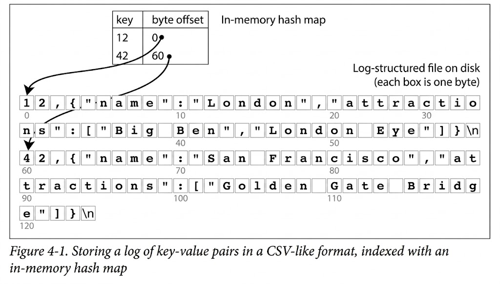
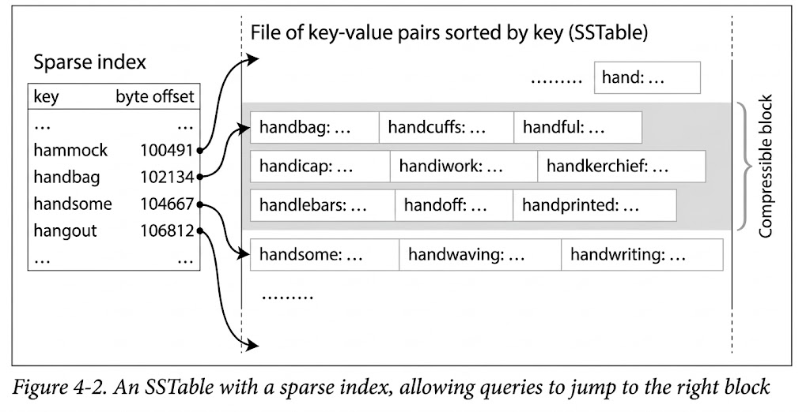
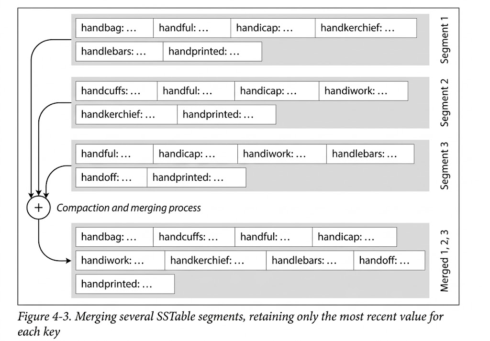
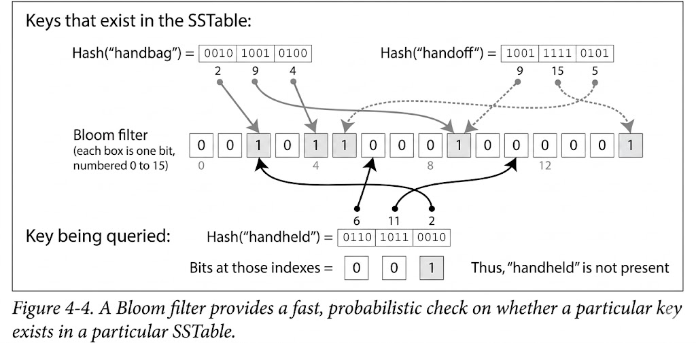
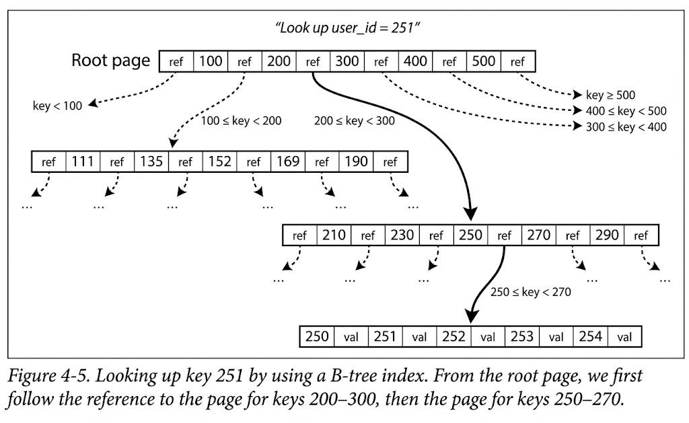
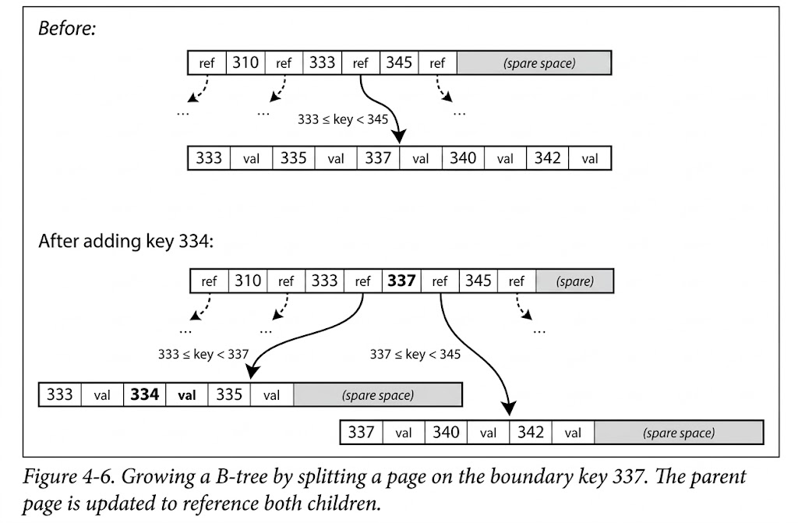
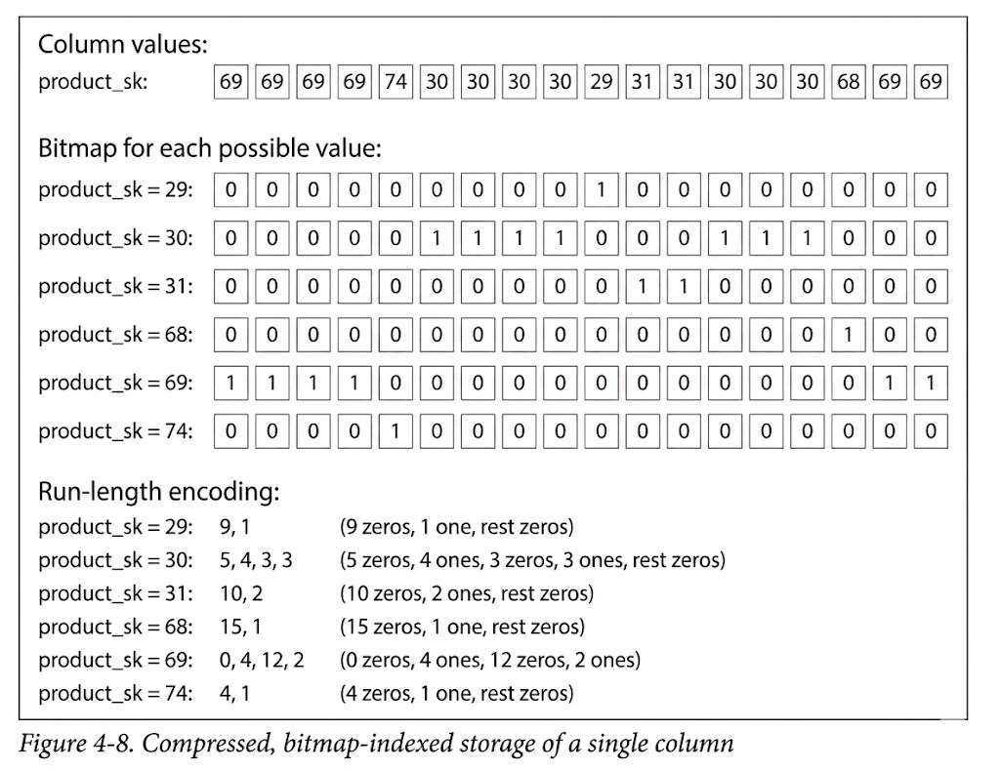
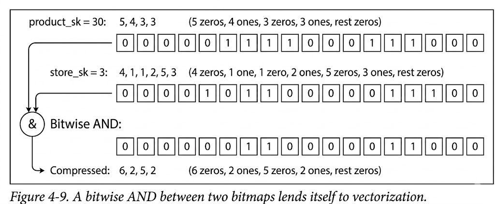
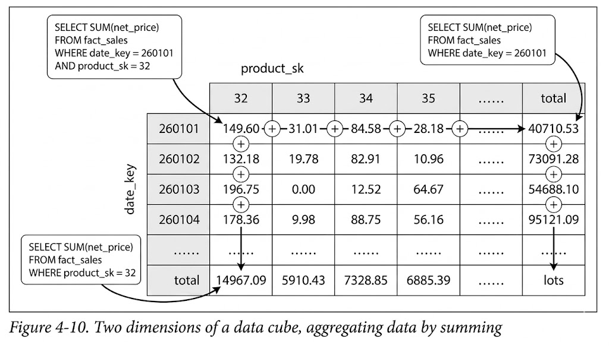
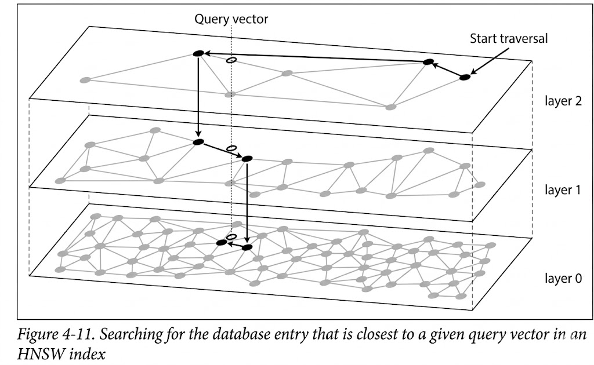

# Storage and Retrieval

Richard Feynman ka 1985 ka yeh khayal bohot gehri sachai bayan karta hai: computer asal mein sirf hisab-kitab (arithmetic) nahi karte, balkay yeh bunyadi tor par **filing systems** hain jo data ko manage aur store karte hain. Ek database ka sabse basic aur core maqsad sirf do cheezon par khara hai: jab aap usay data dein toh wo usay mehfooz (store) kar le, aur jab aap baad mein mangein toh wo bina kisi galti ke wo data aapko wapas de de.

Ek application developer ke tor par aapko yeh samajhna kyun zaroori hai ke database andarooni tor par (under the hood) data kaise store aur retrieve karta hai? Halankeh aap apna khud ka storage engine zero se code nahi karenge, lekin jab aapko apni application ke liye koi database select karna hoga, toh uski performance ka inhasar isi baat par hoga ke aapne apni application ke **workload** ke mutabaq sahi storage engine chuna hai ya nahi. Sahi configuration aur tuning ke liye database ke internal mechanism ka rough idea hona laazmi hai.

Storage engines ke darmiyan sabse bada farq unke workloads ke mutabaq hota hai:

* **OLTP (Online Transactional Processing):** Yeh engines transactional workloads ke liye optimize hote hain jahan bohot zyada read/write queries hoti hain aur har query chote data segment ko target karti hai. Is mein do baray khandaan (families) aate hain: *Log-structured* engines (jo immutable data files likhte hain) aur *In-place update* engines (jaise B-trees, jo purane data ke upar hi naya data overwrite karte hain).
* **Analytics (OLAP - Online Analytical Processing):** Yeh engines baray analytical queries ke liye optimized hote hain jahan millions of rows ka data ek sath scan kar ke reports generate ki jati hain.

---

## Storage and Indexing for OLTP

OLTP ke storage mechanism ko bilkul basic level par samajhne ke liye hum dunya ka sabse sadah database design dekh sakte hain jo sirf do simple Bash functions par mushtamil hai.

```bash
#!/bin/bash

db_set () {
  echo "$1,$2" >> database
}

db_get () {
  grep "^$1," database | sed -e "s/^$1,//" | tail -n 1
}

```

### Architectural & System Behavior Breakdown

Agar hum is basic code ke data flow aur system behavior ko conceptual level par dekhein, toh iska system architecture is tarah kaam karta hai:

```plaintext
[ Client Request ] ---> db_set("42", "JSON_Data") ---> Append Operations (>>) ---> [ Disk File: database ]
                                                                                           |
[ Client Request ] ---> db_get("42") ---> Full File Scan (grep) ---> Tail -n 1 -----------> [ Latest Value Only ]

```

#### 1. Data Write Flow (`db_set`)

* **Mechanism:** Jab aap `db_set 12 '{"name":"London"}'` call karte hain, toh yeh function data ko `database` naam ki ek plain text file ke aakhir mein **append** (jor) deta hai.
* **Immutability Fact:** Agar aap key `42` ko teen dafa update karenge, toh purana data delete ya overwrite nahi hoga. Wo file mein upar maujood rahega aur naya updated data file ki aakhri line ban jayega.
* **Hardware Efficiency:** Disk par kisi file ke end mein data append karna (Sequential Write) bohot fast hota hai kyunki disk head ko baar baar move nahi karna parta. Yahi wajah hai ke real-world databases bhi internally ek **Log** use karti hain, jo ke ek append-only sequence of records hota hai.

#### 2. Data Read Flow (`db_get`)

* **Mechanism:** Jab aap `db_get 42` call karte hain, toh yeh engine `grep` command ke zariye file ki pehli line se lekar aakhri line tak poori file ko scan karta hai taake jahan jahan key `42` hai, un rows ko nikal sake.
* **Handling Duplicates:** Kyunki humne data overwrite nahi kiya tha, isliye file mein key `42` ke multiple records ho sakte hain. `tail -n 1` ka kaam yeh hai ke wo un saare matches mein se sabse aakhri (sabse late) match ko filter kar ke return karta hai, jo ke user ka current aur updated state hota hai.

#### 3. Real Log vs Application Log

Distrubuted systems aur databases mein **Log** ka matlab wo nahi hota jo hum application debugging (jaise log.info()) ke liye text files banate hain. Database context mein log ka matlab ek **append-only binary ya text file** hai jahan har naya event ya data state sequentially save hota jata hai. Real databases ko is ke sath sath concurrency (ek sath kai writes), disk compaction (purane data ko clean karna taake disk bhaar na jaye), aur crash recovery (agar darmiyan mein system band ho jaye toh data rescue karna) bhi handle karni parti hai.

### Performance Analysis & The Indexing Trade-off

Is simple database ka data storage format bohot badhiya perform karta hai jab baat sirf data write karne ki ho, kyunki write operations sequential hain. Magar jab read operations ki baat aaye, toh iski performance intehai buri ho jati hai.

* **Time Complexity Analysis:** Kyunki har read request par pure file ka scan shuru se aakhir tak laazmi hai, is lookup ki algorithmic cost **$O(n)$** hai. Agar database ka size $n$ records se double ho jaye, toh aapka search time bhi double ho jayega.
* **The Concept of an Index:** Is performace bottleneck ko door karne ke liye hum ek alag data structure introduce karte hain jise **Index** kehte hain. Index asal mein aapke original data se derive kiya gaya ek extra structure hota hai jo data ka rasta (address/pointer) apne paas kisi organized shakal mein save rakhta hai (jaise key ke mutabaq sorted form mein).

#### The Ultimate Storage Trade-off:

1. **Reads Speed-up:** Ek acha index aapke read queries ki time complexity ko $O(n)$ se ghata kar $O(1)$ ya $O(\log n)$ tak le aata hai.
2. **Writes Slow-down:** Har index database ke write operations ko slow kar deta hai. Jab bhi naya data write hoga, database ko na sirf primary log file mein append karna hoga, balkay index structure ke andar ja kar bhi us naye pointer ko update karna hoga.
3. **Space Overhead:** Index extra memory aur disk space consume karta hai.

Isi crucial trade-off ki wajah se koi bhi production-grade database har field par automatic index nahi banata. Ek application developer ko apni query patterns ka pta hona chahiye taake wo sirf unhi fields par index lagaye jinki sabse zyada reads required hain, taake writes par faltu overhead na aaye.

Chalo pehle hum ek **proper main.sh** script banate hain jo:
- `db_set key value` call kare  
- `db_get key` call kare  
- Aur runtime par arguments accept kare  

**main.sh (NO INDEX VERSION)**

```bash
#!/usr/bin/env bash

db_set () {
  echo "$1,$2" >> database
}

db_get () {
  grep "^$1," database | sed -e "s/^$1,//" | tail -n 1
}

# CLI interface
if [ "$1" = "set" ]; then
  db_set "$2" "$3"
elif [ "$1" = "get" ]; then
  db_get "$2"
else
  echo "Usage:"
  echo "./main.sh set <key> <value>"
  echo "./main.sh get <key>"
fi
```
**Stage 2 — Ubuntu terminal par run karna (REAL example)**

### 1) Script ko executable banao
```bash
chmod +x main.sh
```

### 2) Value set karo
```bash
./main.sh set 42 '{"city":"Lahore"}'
```

File `database` ban jayegi:

```
42,{"city":"Lahore"}
```

### 3) Dobara update karo
```bash
./main.sh set 42 '{"city":"Karachi"}'
```

File:

```
42,{"city":"Lahore"}
42,{"city":"Karachi"}
```

### 4) Value get karo
```bash
./main.sh get 42
```

Output:
```
{"city":"Karachi"}
```

**Kyunkay tail -n 1 ne latest value return ki.**

**Stage 3 — Ab INDEX version banate hain (fast reads)**  
Writer ne kaha:

- Without index → read = **O(n)**  
- With index → read = **O(1)**  

Hum ek **index file per key** banayenge:

```
index_42  →  line number of latest value
```

**main_index.sh (WITH INDEX VERSION)**

```bash
#!/usr/bin/env bash

db_set () {
  echo "$1,$2" >> database

  # find total lines (latest line number)
  line_num=$(wc -l < database)

  # update index file for this key
  echo "$line_num" > "index_$1"
}

db_get () {
  if [ ! -f "index_$1" ]; then
    echo "Key not found"
    exit 1
  fi

  line=$(cat "index_$1")

  # read that exact line
  sed -n "${line}p" database | sed -e "s/^$1,//"
}

# CLI interface
if [ "$1" = "set" ]; then
  db_set "$2" "$3"
elif [ "$1" = "get" ]; then
  db_get "$2"
else
  echo "Usage:"
  echo "./main_index.sh set <key> <value>"
  echo "./main_index.sh get <key>"
fi
```
**Stage 4 — Index version ko Ubuntu par run karna**

### 1) Script executable banao
```bash
chmod +x main_index.sh
```

### 2) Value set karo
```bash
./main_index.sh set 42 '{"city":"Lahore"}'
```

File `database`:
```
42,{"city":"Lahore"}
```

File `index_42`:
```
1
```

### 3) Dobara update
```bash
./main_index.sh set 42 '{"city":"Karachi"}'
```

File `database`:
```
42,{"city":"Lahore"}
42,{"city":"Karachi"}
```

File `index_42`:
```
2
```

### 4) Value get karo
```bash
./main_index.sh get 42
```

Output:
```
{"city":"Karachi"}
```

**Is dafa poora file scan nahi hua — direct line 2 par jump hua.**

---

## Mockup System Design Scenario (Interview Style)

### Interview Context & Problem Statement

> **Interviewer:** "Hamein ek aisa High-Throughput Activity Logging system design karna hai jahan dunya bhar se millions of IoT devices har second temperature data send kar rahi hain. Writes ka rate intehai zyada hai, aur reads bohot kam hoti hain (sirf debugging ya check-up ke liye). Aap iska storage engine kaise design karenge?"

### Solution Strategy & Conceptual Flow

Hum yahan DDIA ke is core concept ko use karenge: **Append-only log for fast writes + In-Memory Index for quick lookups.**

1. **Write Path:** Har IoT device jab temperature data bhejegi, hum use bina kisi rukawat ke disk file ke end mein append karte jayenge ($O(1)$ write time complexity).
2. **Index Path:** Memory cache (RAM) ke andar hum ek simple Hash Map (Key-Value Key store) maintain karenge. Is Hash Map mein `Key` IoT Device ID hogi, aur `Value` disk file ka wo exact byte-offset (address) hoga jahan us device ka sabse aakhri record maujood hai.
3. **Read Path:** Jab koi engineer kisi specific device ka latest data mangega, system pehle RAM ke andar Hash Map se us device ka exact byte-offset uthayega, aur directly disk se sirf wahi line read kar lega. File ko shuru se end tak scan karne ki zaroorat nahi paregi.

### Architectural Flow Diagram

```plaintext
[ IoT Device 101 ] ---> (Sends Temp: 32°C) ---> [ Load Balancer / Ingestion Service ]
                                                       |
                                        +--------------+--------------+
                                        |                             |
                       (Append Write to End of File)       (Update Address in RAM)
                                        |                             |
                                        v                             v
                       [ Disk File: iot_events.log ]      [ In-Memory Hash Map Index ]
                       | ...                       |      | Key: 101                 |
                       | 101,31°C (Old Byte: 1024) |      | Value: Byte Offset 2048  | --+
                       | 101,32°C (New Byte: 2048) | <----+                          |   |
                                                                                     |   |
[ Engineer Dashboard ] ---> (Request Device 101) ---> [ Lookup Offset: 2048 ] <------+   |
                                                                                         v
                                                  [ Direct Disk Seek at Offset 2048 ] ---+

```

### Trade-off Evaluation in this Design

* **Pros:** Writes ultra-fast hain kyunki disk seek operations zero hain. Reads bhi instant ($O(1)$) hain kyunki RAM se direct file pointer mil jata hai.
* **Cons:** Agar RAM crash ho jaye toh index urr jayega (halankeh log file safe rahegi, aur index ko log scan kar ke dobara build kiya ja sakta hai). Doosra masla yeh hai ke saari keys ko RAM mein fit hona lazmi hai, jo bohot baray data ke liye expensive ho sakta hai.

---

## Log-Structured Storage

Agar hum data ko sirf ek append-only file mein save karte rahein aur reads ko fast karna chahein, toh iska sabse sadah hal yeh hai ke hum memory (RAM) ke andar ek **Hash Map** maintain karein. Is hash map ka kaam har ek `key` ko uske exact **byte offset** ke sath map karna hota hai. Byte offset se muraad disk file mein wo exact location ya point hai jahan us key ka sabse latest value data block shuru hota hai.

### Figure 4-1 Ka Gehrayi Se Mutaala (In-Memory Hash Map aur Log File)

Aap jo Figure 4-1 dekh rahe hain, wo is pure design ke internal data flow ko baray buraheen ke sath dikhati hai:

<div align="center">
  
</div>

```plaintext
[ RAM: In-Memory Hash Map ]
| Key  | Byte Offset |
| 12   | 0           | ----> Point karta hai Disk par Offset 0 par
| 42   | 60          | ----> Point karta hai Disk par Offset 60 par
        |
        v
[ DISK: Log-Structured File ]
Byte: 0                      10                   20                   30
      |                      |                    |                    |
      1,2,,,{,",n,a,m,e,",:,",L,o,n,d,o,n,",,,",a,t,t,r,a,c,t,i,o,n,s,",:,[,",B,i,g,...
      ^
      Byte 0: Key 12 yahan se shuru ho rahi hai

Byte: 60                     70                   80                   90
      |                      |                    |                    |
      4,2,,,{,",n,a,m,e,",:,",S,a,n, ,F,r,a,n,c,i,s,c,o,",...
      ^
      Byte 60: Key 42 ki nayi entry yahan se shuru hoti hai

```

* **Data Insertion Flow:** Jab bhi aap koi naya key-value pair file mein write karte hain, wo file ke aakhir mein append ho jata hai. Sath hi sath, aap RAM mein maujood Hash Map ko update karte hain ke is key ka naya data ab is naye byte offset par maujood hai.
* **Data Retrieval Flow:** Jab read request aati hai, toh database disk ko blind scan nahi karta. Wo pehle RAM mein hash map se us key ka offset dekhta hai (jaise key `42` ka offset `60` hai). Phir CPU disk ko direct **seek** command bhejta hai ke direct offset `60` par jao aur data read kar lo.
* **Filesystem Cache Advantage:** Agar file ka wo hissa pehle se operating system ke filesystem cache (RAM) mein para hua hai, toh disk par jana hi nahi parta; read operation zero disk I/O ke sath perform ho jata hai.

#### Is Approach Ke Sakht Masail (Limitations)

Halankeh yeh reads ko bohot tez bana deta hai, magar real-world distributed systems mein iske chaar baray nuksaan hain:

* **Disk Space Exhaustion (Data Leak):** Kyunki hum purane records ko kabhi overwrite nahi karte, isliye ek hi key ki bar-bar updates file ka size barhati chali jayengi aur disk space khatam ho jayegi.
* **Slow Crash Recovery:** Hash map sirf RAM mein hota hai. Agar database crash ya restart ho jaye, toh pura index urr jata hai. Isko dobara build karne ke liye poori log file ko shuru se aakhir tak scan karna parega, jo ke baray data sets par ghanto le sakta hai.
* **RAM Constraints (Memory Bottleneck):** Saari keys ka RAM mein fit hona zaroori hai. Agar aapke paas billions of keys hain, toh RAM kam par jayegi. Isko disk par rakhna bohot bura idea hai kyunki disk par hash table rakhne se random access I/O bohot barh jata hai, hash collisions ko handle karna mushkil hota hai, aur jab hash table full ho jaye toh usay grow karna intehai expensive hota hai.
* **No Range Queries Support:** Aap is design mein range queries nahi kar sakte (jaise key `10000` se `19999` tak ka data nikalna). Aapko har ek key ko alag se hash map mein individually search karna parega, kyunki data randomly phelá hua hai.

---

## The SSTable file format

Inhi masail ko hal karne ke liye hum hash tables ke bajaye ek behtar structure use karte hain jise **SSTable (Sorted Strings Table)** kehte hain. SSTable ki do bunyadi shartein hoti hain:

1. File ke andar jitne bhi key-value pairs hain, wo **sorted by key** (keys ke mutabaq tarteeb diye gaye) hone chahiye.
2. Poori segment file mein har ek key sirf **ek hi dafa** aa sakti hai (duplications ko pehle hi khatam kar diya jata hai).

### Figure 4-2 Ka Gehrayi Se Mutaala (Sparse Index aur Compressed Blocks)

Figure 4-2 is format ke internal architecture ko samjhati hai ke kaise hum saari keys ko RAM mein rakhe bina behtareen reads hasil karte hain:

<div align="center">
  
</div>

```plaintext
[ RAM: Sparse Index ]
| Key      | Byte Offset |
| hammock  | 100491      | ----+
| handbag  | 102134      | ----|----+
| handsome | 104667      | ----|----|----+
                               |    |    |
                               v    v    v
[ DISK: Sorted SSTable File ]
Offset 102134: [ handbag:... | handcuffs:... | handful:... ]  <--- (Compressible Block)
Offset 104667: [ handsome:... | handwaving:... | handwriting:... ]

```

* **The Concept of Sparse Index:** Hamein RAM mein har ek key ka offset rakhne ki zaroorat nahi hai. Hum data ko kuch kilobytes (e.g., 4 KB) ke chunks ya blocks mein divide karte hain aur un blocks ko compress kar dete hain. RAM ke andar hum sirf har block ki **pehli key** (boundary key) ka record rakhte hain. Isay **Sparse Index** kehte hain.
* **Search Execution Flow:** Farz karein aapko key `handiwork` dhoondni hai. Aap Sparse Index mein dekhenge ke `handiwork` alphabetically `handbag` aur `handsome` ke darmiyan aati hai. System direct disk par offset `102134` (handbag) par jump karega aur wahan se agla block sequentially scan karna shuru karega jab tak usay `handiwork` mil na jaye ya block khatam na ho jaye.
* **Compression and I/O Efficiency:** Kyunki data sorted hota hai, isliye sath wali keys milti julti hoti hain (jaise handbag, handcuffs). Aise data ko compress karna bohot efficient hota hai. Yeh hardware level par disk space bhi bachata hai aur disk se data read karte waqt I/O bandwidth ka load bhi kam karta hai, halankeh is mein thoda CPU utilization barh jata hai block ko decompress karne ke liye.

---

## Constructing and merging SSTables

SSTable read karne ke liye toh perfect hai, lekin write karte waqt masla yeh hota hai ke hum file ke darmiyan mein naya data insert nahi kar sakte, kyunki sorting kharab ho jayegi. Agar har write par poori file dobara likhi jaye, toh system baith jayega. Iska hal ek hybrid approach hai jise **LSM-Tree (Log-Structured Merge-tree)** algorithm kehte hain.

### System Architecture aur Step-by-Step Data Flow

```plaintext
[ Client Write ]
       |
       +-------> [ 1. Append to Disk WAL (Crash Recovery Log) ]
       |
       +-------> [ 2. Insert into RAM Memtable (Balanced Sorted Tree) ]
                      |
              (When Memtable fills up, e.g., 4MB)
                      |
                      v
         [ 3. Flush to Disk as Sorted SSTable Segment ] (Immutable)
                      |
                      v
         [ 4. Background Compaction / Mergesort Process ]

```

#### 1. Write Path (Memtable aur WAL)

* Jab bhi koi naye data ki write request aati hai, system usay direct disk par sorted file mein nahi likhta. Wo sabse pehle usay RAM mein ek sorted data structure mein dalta hai jise **Memtable** kehte hain (yeh internally Red-Black tree, AVL tree, ya Skip List hoti hai jo insert hote hi data ko automatic sort rakhti hai).
* **Durability (WAL):** Agar memory crash ho jaye toh data zaya ho sakta hai. Isliye parallel mein ek immediate write disk par ek append-only **Write-Ahead Log (WAL)** file mein bhi save ki jati hai. Is WAL ka maqsad sirf crash recovery hai, yeh sorted nahi hoti aur reads ke liye use nahi hoti.

#### 2. Flushing Memtable to SSTable

* Jab RAM mein Memtable ka size ek certain threshold (jaise ke 4 MB) se barh jata hai, toh database is memtable ko disk par ek **SSTable Segment file** ke shakal mein sequentially write (flush) kar deta hai.
* Kyunki memtable pehle se sorted thi, disk par file likhte waqt koi extra sorting cost nahi aati. Yeh segment ek dafa disk par likh diya jaye toh yeh **Immutable** (un-changeable) ban jata hai. Iske baad purani WAL file ko delete kar diya jata hai kyunki data disk par safe ho chuka hai.

#### 3. Read Path Flow

* Jab koi client kisi key ko read karna chahta hai:
1. System sabse pehle current **Memtable (RAM)** mein dhoondta hai.
2. Agar wahan nahi milti, toh sabse naye on-disk **SSTable Segment** mein dhoondta hai.
3. Agar wahan bhi nahi milti, toh sequential order mein usse purane segments (Segment 2, Segment 3) check karta jata hai jab tak key mil na jaye ya saare segments khatam na ho jayein.


#### 4. Background Compaction (Merging)

Kyunki disk par bohot saari segment files ban jati hain, reads ko fast rakhne aur space reclaim karne ke liye background mein ek thread chalta hai jo **Compaction and Merging** perform karta hai.

### Figure 4-3 Ka Gehrayi Se Mutaala (SSTable Segments Merging Process)

Figure 4-3 dikhati hai ke kaise **Mergesort** algorithm ke zariye background mein multiple segments ko ek single segment mein transform kiya jata hai:

<div align="center">
  
</div>

```plaintext
[ Segment 1 ] ---> [ handbag:... | handful:... | handicap:... ]
[ Segment 2 ] ---> [ handcuffs:... | handful:... | handiwork:... ]   ---+
[ Segment 3 ] ---> [ handful:... | handicap:... | handlebars:... ]      |
                                                                        v
                                                         ( + Compaction / Mergesort )
                                                                        |
                                                                        v
[ Merged Segment 1,2,3 ] ---> [ handbag:... | handcuffs:... | handful (Latest Version):... ]

```

* **The Core Logic:** Merging process saare files ke pointers ko side-by-side read karta hai. Yeh sabse choti key ko compare karta hai aur naye file mein copy karta jata hai.
* **Handling Duplicates & Tombstones:** Agar ek hi key multiple segments mein maujood hai (jaise `handful`), toh compaction process sirf **sabse naye segment** wali value ko rakhta hai aur baaki purani entries ko drop kar deta hai.
* **Deletions & Tombstones:** Jab user kisi data ko delete karta hai, toh system usay foran disk se erase nahi kar sakta (kyunki files immutable hain). Iske bajaye ek special deletion record append kiya jata hai jise **Tombstone** kehte hain. Compaction ke dauran jab yeh tombstone purane segments se guzarta hai, toh wo us key ke saare purane records ko hamesha ke liye delete kar deta hai.

---

## Bloom filters

LSM-Tree storage engines mein ek bara masla yeh aata hai ke agar koi key database mein maujood hi na ho, ya bohot purani ho, toh system ko saare disk segments aur unke indexes ko check karna parta hai, jo ke bohot zyada disk I/O operations consume karta hai aur reads ko slow kar deta hai. Is bottleneck ko khatam karne ke liye hum **Bloom Filter** use karte hain. Bloom Filter ek probabilistic (imkani) data structure hai jo bohot kam memory mein yeh bata deta hai ke **"Kya yeh key is segment mein maujood hai ya nahi?"**

### Figure 4-4 Ka Gehrayi Se Mutaala (Probabilistic Key Checking)

Aap Figure 4-4 ke bit array aur hashing flow ko is tarah samajh sakte hain:

<div align="center">
  
</div>

```plaintext
[ Bits Array in Bloom Filter (Size: 0 to 15) ]
Index: 0   1   2   3   4   5   6   7   8   9  10  11  12  13  14  15
Bits: [0] [0] [1] [0] [1] [1] [0] [0] [0] [1] [0] [0] [0] [0] [0] [1]
               ^       ^   ^               ^                       ^
               |       |   |               |                       |
               +-------+---|---------------+-----------------------+
                           |               |
             Keys Existing |               | Querying Key: "handheld"
             in SSTable:   |               | Hash("handheld") -> (6, 11, 2)
                           |               |
    - Hash("handbag") ----> (2, 9, 4)      | - Bit 6  is 0 (No Match!)
    - Hash("handoff") ----> (9, 15, 5)     | - Bit 11 is 0 (No Match!)
                                           | - Bit 2  is 1
                                           v
                             [ RESULT: "handheld" DEFINITELY NOT PRESENT ]

```

* **How It Is Built:** SSTable segment likhte waqt, us segment ki har key ko multiple cryptographic/non-cryptographic hash functions se guzara jata hai. Jo numbers generate hote hain, bit-array ke un indexes par `0` ko `1` kar diya jata hai. Jaise image mein `handbag` ne bit 2, 9, aur 4 ko `1` kiya, aur `handoff` ne bit 9, 15, aur 5 ko `1` kiya.
* **The Mathematical Evaluation (The Query):** Jab hum `handheld` ko search karte hain, toh iske hash values (6, 11, 2) aati hain. Hum dekhte hain ke bit array mein index 6 aur 11 par `0` para hua hai.
* **The Absolute Rule:** * **If any bit is 0:** Agar ek bhi bit `0` mil jaye, toh iska matlab hai ke yeh key zindagi mein kabhi database mein aayi hi nahi. System bina disk read kiye foran client ke liye `404 Not Found` ya null return kar deta hai. Is tarah faltu disk seek bach jata hai.
* **If all bits are 1:** Agar saari bits `1` milein, toh iska matlab hai ke key shayad segment mein maujood hai. Lekin yahan **False Positive** ka chance hota hai (ho sakta hai mukhtalif keys ke hashes ne mil kar un bits ko coincidentally `1` kiya ho). Aise case mein system disk check karega. Agar data na mila toh koi baat nahi, bas thoda CPU cycle zaya hua, data par koi asar nahi parta.


* **Space Allocation Rule:** Rule of thumb ke mutabaq, agar aap har ek key ke liye Bloom filter mein **10 bits** allocate karein, toh false positive ka rate sirf **1%** reh jata hai. Har extra 5 bits barhane se false-positive ka imkan 10 guna mazeed kam ho jata hai.

---

## Compaction strategies

LSM Engines mein background compaction kis tarah aur kab chalni chahiye, iski do baray maqbool strategies hain jo mukhtalif workloads ke trade-offs ko handle karti hain:

### 1. Size-tiered compaction

* **Mechanism:** Is strategy mein database chote aur naye SSTables ke group hone ka intezar karta hai. Jab aik hi size ke multiple (e.g., 4 segments of 256 MB) files jama ho jati hain, toh unko aapas mein merge kar ke ek bari file (e.g., ~898 MB) bana di jati hai.
* **Workload Optimization:** Yeh **Write-Heavy** workloads ke liye behtareen hai. Kyunki is mein data ko baar baar rewrite nahi karna parta, sequential merges kam hote hain, jis se write throughput bohot high milti hai. Magar iska nuksaan yeh hai ke merging ke dauran bohot zyada temporary disk space chahiye hoti hai aur reads thode slow ho sakte hain kyunki purani files bohot bari ho jati hain.

### 2. Leveled compaction

* **Mechanism:** Is mein database SSTables ke sizes ko fixed (e.g., 16 MB) rakhta hai aur unhein mukhtalif levels (L0, L1, L2...) mein divide karta hai. Level 0 ke ilawa baaki saare levels key-range partitioned hote hain (jaise L1 ki pehli file mein sirf `a-m` keys hain aur doosri mein `n-z`). Jab kisi level ka size limit cross hota hai, toh wahan se kuch files utha kar unke key-range ke mutabaq agle level (i + 1) ke sath merge kar diya jata hai.
* **Workload Optimization:** Yeh **Read-Heavy** workloads ke liye sabse best hai. Kyunki data clean tarah se partitioned hota hai, system ko pata hota hai ke kis file mein jana hai, jis se kam se kam SSTables scan karni parti hain. Yeh disk space bhi kam consume karti hai magar is mein writes thode slow ho sakte hain kyunki system ko levels maintain karne ke liye zyada background writes karne parte hain (**Write Amplification**).

---

## Embedded Storage Engines

Haqeeqi dunya mein har database network service (jaise MySQL, PostgreSQL) ke tor par kaam nahi karti. Kuch databases **Embedded Databases** hoti hain.

* **Architectural Flow:** Yeh koi network socket expose nahi kartiin aur na hi inka alag server processing unit hota hai. Yeh direct aapke application code ke sath ek **library (.dll ya .so file)** ke tor par link ho jati hain aur aapke main application process ke andar hi memory aur threads share karti hain.

```plaintext
[ Client App Process (Your Code) ]
       |
       +---> (Direct Function Call) ---> [ Embedded Storage Engine Library (RocksDB/SQLite) ]
                                                               |
                                                   (Direct Local OS File I/O)
                                                               |
                                                               v
                                                    [ Local Disk Storage ]

```

* **Real-World Examples:** **RocksDB** (LSM-tree based), **SQLite** (B-Tree based transactional), **LMDB**, **DuckDB** (Analytical), aur **KùzuDB** (Graph-based).
* **Use Cases:** Yeh mobile applications mein local user data save karne ke liye use hoti hain. Backend par yeh tab behtareen kaam karti hain jab data ek single machine par fit ho sake ya multitenant architectures mein jahan har ek customer (tenant) ka data completely independent ho aur aap har tenant ke liye alag process memory mein alag isolated embedded instance chala sakein.

---

## Mockup System Design Scenario (Interview Style)

### Interview Context & Problem Statement

> **Interviewer:** "Aap ek Global Financial Transaction Fraud Analytics platform design kar rahe hain. Har second dunya bhar se 500,000 credit card transaction status check aur fraud evaluations ho rahi hain. system ko transactions ko foran store karna hai ($500k\text{ writes/sec}$) aur sath hi sath real-time checks karne hain un accounts par jo system mein exist hi nahi karte taake fake accounts ko block kiya ja sake. Read requests un account IDs par aati hain jo aksar system mein hoti hi nahi hain. Aap reads par disk latency zero kaise karenge aur storage kaise structure karenge?"

### Solution Strategy & Conceptual Flow

Hum yahan DDIA ke concepts (LSM-Tree + Memtable + Bloom Filters + Leveled Compaction) ka solid combination use karenge:

1. **Write Optimisation:** Hum incoming transactions ko direct **Memtable** aur disk **WAL** par sequentially append karenge. Is se $500\text{k writes/sec}$ asani se handle ho jayenge kyunki random disk I/O zero ho chuka hai.
2. **Eliminating Non-Existent Account Reads:** Kyunki bohot si requests un account IDs ki aati hain jo system mein hain hi nahi, agar hum disk scan karenge toh database down ho jayega. Isliye hum har SSTable segment ke sath memory mein ek high-fidelity **Bloom Filter** attach karenge.
3. **The Read Filter Gate:** Jab koi read request aayegi, pehle RAM mein Bloom filter check hoga. Agar filter ne kaha `0`, iska matlab account non-existent hai, hum foran bina disk par jaye client ko fraud/invalid ka trigger bhej denge. Agar filter `1` kahega, tabhi hum **Leveled Compaction** waale sorted blocks mein binary search/sparse lookup chalayenge.

### Architectural Flow Diagram

```plaintext
[ 500k writes/sec Requests ] ----------------------------+
                                                         |
                                                         v
                                           [ In-Memory Memtable (RAM) ]
                                                         |
                                               (Size Threshold Hit)
                                                         |
                                                         v
                                       [ Flush to Disk: Leveled SSTables ]
                                       +---------------------------------+
                                       | L0: [Recent Data]               |
                                       | L1: [a-k.sst]  [l-z.sst]        | <---+
                                       +---------------------------------+     |
                                                                               |
                                                                               |
[ High Rate Fraud Read Queries ]                                               |
  (e.g., Query Account: "acc_999")                                             |
                 |                                                             |
                 v                                                             |
   [ In-Memory Bloom Filter Check ]                                            |
                 |                                                             |
                 +---> (If Bit is 0) ---> [ FORAN RETURN: "Account Not Found" ]|
                 |                         (Zero Disk I/O Overhead!)           |
                 |                                                             |
                 +---> (If Bit is 1) ---> [ Seek Sparse Index ] ---------------+
                                          [ Read Target Compressed Disk Block ]

```

### Trade-off Evaluation in this Design

* **Pros:** Peak write traffic par database crash nahi hoga kyunki flush sequential hai. Non-existent account lookups par disk utilization bilkul zero ho jayegi kyunki Bloom filter unhein RAM level par hi block kar dega.
* **Cons:** Hamein Bloom filters aur Sparse index ke liye achi khasi RAM capital allocate karni paregi. Agar false positive rate ko mazeed kam karna hai, toh memory consumption thodi aur barhegi.

---

## B-Trees

LSM-tree (Log-structured storage) ke ilawa, databases mein data store aur read karne ka sabse maqbool aur purana tareeqan **B-Tree** hai. 1970 mein introduce hone wale B-trees aaj bhi dunya ke taqreeban tamaam Relational Databases (jaise MySQL, PostgreSQL) aur kai Non-relational databases ke default indexing engines hain.

### Design Philosophy: B-Trees vs LSM-Trees

Agache B-trees bhi SSTables ki tarah data ko **sorted by key** rakhte hain taake range queries aur fast lookups ho sakein, lekin dono ki andarooni design philosophy bilkul mukhtalif hai:

* **LSM-Trees:** Yeh database ko mukhtalif size ke segments (kuch megabytes) mein torta hai. Yeh segments hamesha **Immutable** hote hain (sirf naya data append hota hai, purana change nahi hota).
* **B-Trees:** Yeh database ko **fixed-size blocks ya pages** mein torta hai. Har page ka size fixed hota hai (traditionally 4 KiB, jabki PostgreSQL mein 8 KiB aur MySQL mein 16 KiB default hota hai). Yeh disk par ja kar purane data ke upar hi naya data overwrite karte hain, jise **In-place update** kehte hain.

Har page ka ek unique **Page Number** hota hai. Ek page doosre page ka reference (pointer) is page number ke zariye rakhta hai. Agar saare pages ek hi file mein hain, toh system `Page Number $\times$ Page Size` kar ke disk par us page ka exact byte offset nikal leta hai.

---

### Figure 4-5 Ka Gehrayi Se Mutaala (B-Tree Index Lookup)

Aap jo Figure 4-5 dekh rahe hain, wo yeh samjhati hai ke jab humein koi key dhoondni ho (jaise `user_id = 251`), toh B-tree ka pointer-based look up architecture kaise kaam karta hai:

<div align="center">
  
</div>

```plaintext
[ Root Page ] -> Contains Keys: [ 100 | 200 | 300 | 400 | 500 ]
                       |
             (251 lies between 200 and 300)
                       |
                       v
[ Child Page ] -> Contains Keys: [ 210 | 230 | 250 | 270 | 290 ]
                                         |
                               (251 lies between 250 and 270)
                                         |
                                         v
[ Leaf Page ]  -> Contains Actual Data: [ 250:val | 251:val | 252:val ]

```

1. **The Root Page:** Tree ke sabse upar ek **Root Page** hota hai. Har lookup yahin se shuru hota hai. Is page mein keys aur unke sath child pages ke references (`ref`) hote hain. Har child page ek khas continuous key range ke liye zimmedar hota hai.
2. **The Traversal Path:** Hamein `251` search karna hai. Root page par hum dekhte hain ke 251 kis range mein aata hai. Yeh $200 \le \text{key} < 300$ ke darmiyan hai, toh hum us range ke niche wale specific `ref` pointer ko follow karte hain.
3. **The Leaf Page:** Hum agle child page par pohanchte hain jahan range mazeed choti sub-ranges mein divide hoti hai. Wahan hum dekhte hain ke 251 ab $250 \le \text{key} < 270$ ke darmiyan hai. Is pointer ko follow karne par hum aakhri page par pohanchte hain jise **Leaf Page** kehte hain. Leaf page par actual keys aur unki values (ya wo address jahan value pari hai) inline maujood hoti hain.
4. **Branching Factor:** Ek single page ke andar kitne child references aa sakte hain, usay **Branching Factor** kehte hain (Figure 4-5 mein yeh factor 6 hai). Real-world mein yeh factor keys aur pointers ke size par depend karta hai, magar aam tor par yeh kai sainkro (hundreds) mein hota hai.

---

### Figure 4-6 Ka Gehrayi Se Mutaala (Page Splitting aur Tree Growth)

B-tree mein jab data update karna ho, toh system leaf page dhoond kar naye data ko purane data ke upar overwrite kar deta hai. Magar jab naya data **Insert** karna ho, toh system ko page splitting ka sahara lena parta hai, jise Figure 4-6 mein buraheen ke sath dikhaya gaya hai:

<div align="center">
  
</div>

```plaintext
[ BEFORE INSERTION ]
Parent Page Pointer -> [ 310 | 333 | 345 ]
                         |
                         v
Leaf Page (Full)    -> [ 333:val | 335:val | 337:val | 340:val | 342:val ] (No Space!)

-----------------------------------------------------------------------------------------

[ AFTER ADDING KEY 334 (Page Split) ]
Parent Page Updated -> [ 310 | 333 | 337 | 345 ]  <-- Boundary key 337 pushed up!
                               |     |
            +------------------+     +------------------+
            v                                           v
New Leaf Page 1 -> [ 333:val | 334:val | 335:val ]   New Leaf Page 2 -> [ 337:val | 340:val | 342:val ]

```

* **The Problem:** Hum ne key `334` insert karni hai, magar range `333–345` wala leaf page pehle hi full ho chuka hai (us mein mazeed space nahi hai).
* **The Action (Page Split):** System is full page ko do aadhe-aadhe (half-full) pages mein tor deta hai. Pehla page `333–337` range ka banta hai (jis mein naya key 334 fit ho jata hai) aur doosra page `337–345` range ka ban jata hai.
* **Cascading Effect to Parent:** Kyunki ab ek ke bajaye do pages ban chuke hain, isliye inka jo **Boundary Key** hai (jo ke `337` hai), usay upar wale **Parent Page** mein push kar diya jata hai taake parent page ab dono naye child pages ko target kar sake. Agar parent page bhi pehle se full hota, toh wo bhi split ho jata. Yeh split ka silsila upar root tak ja sakta hai. Agar root page split ho jaye, toh tree ki depth (levels) ek darja barh jati hai.
* **Balanced Tree Guarantee:** Is split algorithm ki wajah se B-tree hamesha **Balanced** rehta hai. $n$ keys wale B-tree ki depth hamesha **$O(\log n)$** hoti hai. Zyadatar production databases ka data sirf 3 se 4 levels deep B-tree mein fit ho jata hai (4 KiB page size aur 500 branching factor ke sath ek 4-level tree taqreeban **250 TB** data store kar sakta hai), yani sirf 4 disk reads mein aapko aapka record mil jata hai.

---

## Making B-trees reliable

B-tree ka bunyadi rule yeh hai ke yeh disk par maujood pages ko direct overwrite karta hai. Yeh approach LSM-trees se bilkul ulti hai (jo sirf naye files append karte hain aur purani files ko touch nahi karte). Direct disk overwrite karne mein bohot baray hardware risks hote hain.

### Hardware Risks & Solutions

* **The Danger of Corruption:** Agar page split ke dauran (jab database multiple pages disk par write kar raha ho) suddenly light chali jaye ya system crash ho jaye, toh kuch pages write ho jayenge aur kuch reh jayenge. Is se tree ka structure kharab ho jayega aur kuch pages **Orphan Pages** ban jayenge (yani unka koi parent pointer nahi rahega).
* **Torn Pages:** Agar hardware level par disk ek pure 4 KB ya 16 KB ke page ko ek hi jhatke mein atomicity ke sath write na kar paye, toh page ka aadha hissa naya aur aadha purana reh jata hai, jise **Torn Page** kehte hain.

#### 1. The Write-Ahead Log (WAL) / Journaling

In sab khatraat se bachne ke liye har B-tree implementation disk par ek extra data structure maintain karti hai jise **Write-Ahead Log (WAL)** ya *Journal* kehte hain.

* **The Protocol:** Jab bhi B-tree mein koi modification (insert/update/delete) karni ho, database tree ke pages ko hath lagane se pehle us event ko is append-only WAL file mein write karta hai.
* **Crash Recovery:** Agar system mid-page write par crash ho jaye, toh restart hone par database is WAL file ko dubara parhta (replay karta) hai aur B-tree ko ek consistent aur sahi state mein wapas le aata hai.

#### 2. Memory Buffering aur Durability

Performance ko tez karne ke liye databases har write ko foran disk page par overwrite nahi karte, balkay B-tree pages ko RAM mein buffer (cache) kar lete hain. WAL file is baat ki guarantee hoti hai ke data safe hai. Jab tak naya transaction WAL mein write ho kar OS ki `fsync` system call ke zariye disk par physically flush ho jata hai, tab tak data durable mana jata hai, bhale hi main B-tree pages abhi RAM mein hi kyun na pare hon.

---

## Using B-tree variants

B-trees ke itne saal purane safar mein developer community ne iske kai advanced variants banaye hain taake mukhtalif use-cases ko handle kiya ja sake:

* **Copy-on-Write (COW) Scheme:** Kuch databases (jaise **LMDB**) in-place overwrite aur WAL ka jhanjhat hi khatam kar deti hain. Jab kisi page ko modify karna ho, toh use purane address par overwrite karne ke bajaye disk par ek **bilkul naye location** par likha jata hai. Phir uske parent pages ka ek naya version generate kiya jata hai jo is naye location ko point karta hai. Yeh scheme concurrency control aur Snapshot Isolation ke liye intehai mufeed hai.
* **Key Abbreviation (Prefix Compression):** Tree ke andarooni (interior) pages mein poori poori text keys store karne ke bajaye unke sirf shuruati lafz (prefixes) store kiye jate hain jo ranges ki boundary batane ke liye kafi hon. Is se page mein space bachti hai, branching factor barhta hai, aur tree ki depth kam hoti hai.
* **Sequential Leaf Layout:** Koshish ki jati hai ke disk par leaf pages ek sequential tarteeb mein hon taake range scans karte waqt disk heads ko zyada move na karna pare. Magar tree ke barhne sath sath is order ko maintain rakhna bohot mushkil ho jata hai.
* **Sibling Pointers (B+Tree Links):** Har leaf page apne barabar wale left aur right leaf pages ka direct reference (pointer) apne paas rakhta hai. Iska faida yeh hota hai ke agar aapko sorted order mein scan chalana ho, toh aapko baar baar parent nodes par wapas ja kar niche aane ki zaroorat nahi parti; aap direct leaves ke darmiyan traverse kar sakte hain.

---

## Mockup System Design Scenario (Interview Style)

### Interview Context & Problem Statement

> **Interviewer:** "Hamein ek Core Banking Ledger System design karna hai jahan users ke account balances store honge. Requirements yeh hain ke point lookups (jaise kisi user ka exact balance check karna) hamesha instant ho, memory overhead kam se kam ho, aur critical requirement yeh hai ke agar server ka power failure (crash) ho jaye, toh balance corrupt nahi hona chahiye aur system hamesha consistent state mein rahay. Aap LSM-tree use karenge ya B-Tree?"

### Solution Strategy & Conceptual Flow

Is scenario ke liye hum **B-Tree with WAL** select karenge. Reasons aur tradeoffs yeh hain:

1. **Why Not LSM-Tree?** LSM-trees mein ek key ke multiple versions alag alag segments mein hotae hain, jis ki wajah se point lookups par read amplification hoti hai (multiple segments scan karne par sakte hain). Ledger system mein point lookups fast aur predictable ($O(\log n)$) hone chahiye.
2. **In-Place Update Advantage:** Ledger mein rows fixed hoti hain (Account ID $\rightarrow$ Balance). B-tree unhi fixed pages par data overwrite karega, jis se space predictability bani rehti hai aur background compaction ka wait nahi karna parta.
3. **Crash Resilience Path:** Jab koi transaction (e.g., Transfer $100) aayegi, hum pehle usay **WAL (Write-Ahead Log)** mein append karenge aur `fsync` chalayenge. Uske baad RAM Buffer mein B-tree page update hoga. Agar disk par actual page update ke dauran light chali bhi jaye, toh restart par WAL se balance recover ho jayega.

### Architectural Flow Diagram

```plaintext
[ User Transaction Request ] ---> (Deduct $100 from Acc: 501)
                                         |
                                         v
                     [ 1. Append to Append-Only Disk WAL ] 
                                         |  (Guarantees Durability via fsync)
                                         v
                     [ 2. Update Page in RAM Buffer Cache ]
                                         |
                       (Periodic Background Page Flush)
                                         |
                                         v
                     [ 3. In-Place Overwrite on Disk File ]
                     +---------------------------------------+
                     | Root Page -> Child Page -> Leaf Page  |
                     | [Acc 501: Old Bal] -> [Acc 501: $900] | (Overwritten!)
                     +---------------------------------------+
                                         |
                (If Crash Happens Mid-Flush: Replay WAL to Recover)

```

### Trade-off Evaluation in this Design

* **Pros:** Point lookups intehai tez hain kyunki tree balanced hai aur max 3-4 steps mein target node mil jata hai. Multi-versioning na ہونے ki wajah se disk space optimal rehti hai. Strong consistency aur data integrity zero corruption ke sath milti hai.
* **Cons:** Writes thodi slow ho sakti hain LSM-tree ke muqable mein, kyunki page split ke dauran multiple disk pages par random overwrites karne parte hain aur WAL par double-writing ka overhead hota hai.

---

### Comparing B-Trees and LSM-Trees

Ek aam asool (rule of thumb) ke mutabaq, **LSM-trees** un applications ke liye behtareen hain jahan **writes** bohot zyada hoti hain (write-heavy workloads), jabki **B-trees** un workloads ke liye tez hain jahan **reads** ka kaam zyada hota hai (read-heavy workloads). Lekin real-world benchmarks hamesha workload ki barikiyaon par depend karte hain, isliye sahi muqabla karne ke liye aapko apni application ke specific traffic pattern par test karna parta hai.

Yeh koi strict strict either/or choice nahi hai; aam tor par modern storage engines dono approaches ki khubiyon ko aapas mein blend (mix) karte hain—jaise multiple B-trees rakhna aur unhein LSM-style mein background mein merge karna.

---

### Read performance

B-tree aur LSM-tree dono ka read mechanism hardware aur computational level par bilkul alag behave karta hai.

* **B-Tree Read Mechanics:** B-tree mein kisi bhi single key (point lookup) ko dhoondna bohot predictable hota hai. System tree ke har level par sirf **ek page** read karta hai. Kyunki B-tree ki depth (levels) hamesha bohot choti hoti hai (aam tor par 3 se 4 levels), isliye reads intehai tez aur mushtaqil (predictable performance) hote hain.
* **LSM-Tree Read Mechanics:** LSM storage engine mein ek single read request ko dhoondne ke liye background mein chalne wale mukhtalif compaction stages ke **multiple SSTables** ko check karna par sakta hai. Halankeh **Bloom filters** is disk I/O operations ko bohot had tak kam kar dete hain, phir bhi iska path B-tree ke muqable mein thoda complex hota hai.

#### Range Queries Ka Bara Trade-off:

* **B-Trees:** Range queries (jaise key `1000` se `2000` tak ka data nikalna) B-trees par intehai asaan aur fast hoti hain kyunki iska pura structure disk pages par ordered aur sorted shakal mein linked hota hai.
* **LSM-Trees:** LSM par range queries bohot expensive ho jati hain. Kyunki data alag alag segment files mein phelá hua hota hai, system ko **saare disk segments ko parallel mein scan** karna parta hai aur unke results ko merge kar ke output dena hota hai. Sabse aham baat yeh hai ke **Bloom filters range queries mein koi madad nahi kar sakte**, kyunki range ke andar aane wali har possible key ka hash nikalna practically namumkin hai.

```plaintext
[ LSM Range Query Request ] 
            |
            v
   +--------+--------+
   |                 |
   v                 v
[ Scan Segment 1 ]  [ Scan Segment 2 ]  --> Parallel Disk Scans Required
   |                 |
   +--------+--------+
            |
            v
[ Merge & Filter Results ] ---> [ Return to Client ]

```

#### High Write Traffic aur Memtable Backpressure:

Agar application se aane wali writes ka rate itna zyada ho ke RAM mein maujood **Memtable** foran full ho jaye, aur background mein disk par chalne wala compaction process us speed se segments ko merge na kar paa raha ho, toh log-structured engines mein latency spikes aate hain.

Is situation ko handle karne ke liye RocksDB jaise engines **Backpressure** apply karte hain: wo temporary tor par saari read aur write requests ko **suspend (freeze)** kar dete hain jab tak RAM ki memtable completely disk par flush na ho jaye.

---

### Sequential versus random writes

Database writes ki do bunyadi patterns hoti hain jinka disk performance par bara asar parta hai:

1. **Random Writes (B-Trees):** Agar aapka application aisi keys write kar raha hai jo pure key-space mein bikhri hui hain, toh B-tree engine ko disk par maujood un pages ko dhoond kar overwrite karna parega jo disk par kahin bhi ho sakte hain. Yeh small aur scattered writes ka pattern **Random Writes** kehlata hai.
2. **Sequential Writes (LSM-Trees):** Iske baraks, LSM-trees memory (memtable) se poora ka poora segment file ek hi dafa mein sequential tarah se disk par write karta hai. Yeh big aur continuous chunks ka write pattern **Sequential Writes** kehlata hai.

Hardware ke lehaas se disk storage hamesha sequential writes par zyada throughput deti hai ba-nisbat random writes ke. Purane spinning hard drives (HDDs) par mechanical head ki movement ki wajah se random write miliseconds leta hai jo computing dunya mein ek sadi ke barabar hai. Aaj ke dauran use hone wale modern SSDs par yeh farq mechanical head na hone ki wajah se kam zaroor hai, magar phir bhi bohot noticeable hai.

---

### Sequential Versus Random Writes on SSDs

SSDs (Solid State Drives) aur NVMe flash memory ka internal architecture mechanical limitations se pak hota hai, magar inke andar flash cells ke lehaas se ek alag physical constraint hota hai:

* **The Page vs Block Constraint:** SSD ke andar flash memory ko read ya write ek **Page (typically 4 KiB)** ki shakal mein kiya jata hai, lekin agar data ko erase (delete) karna ho, toh wo sirf ek bare **Block (typically 512 KiB)** ki shakal mein hi ho sakta hai.

#### Garbage Collection (GC) Mechanism:

Jab database kisi page ko overwrite ya delete karta hai, toh SSD controller purane page ko direct wipe nahi kar sakta. Jab ek pure 512 KiB block ko khali karna hota hai, toh SSD controller pehle us block mein maujood valid pages ko utha kar doosre naye block mein shift karta hai, aur phir purane pure block ko erase karta hai. Is mechanical step ko **Garbage Collection (GC)** kehte hain.

* **LSM Sequential Advantage on SSD:** LSM-tree sequential writes ke zariye bade chunks write karta hai, jis se poora 512 KiB ka block aksar ek hi file ke data se bhar jata hai. Jab wo file baad mein compaction ke zariye delete hoti hai, toh SSD controller poore block ko bina kisi Garbage Collection ke aik jhatke mein erase kar deta hai.
* **B-Tree Random Disadvantage on SSD:** B-tree jab randomly 4 KiB ke pages overwrite karta hai, toh SSD blocks ke andar valid aur invalid pages ka ek mix khichdi ban jata hai. Garbage collector ko valid data ko baar baar copy-paste karna parta hai, jis se disk ki write bandwidth application ke bajaye GC internal tasks mein zaya ho jati hai. Yeh cheez SSD ko jaldi ghisa deti hai aur uski life line (**SSD Wear Out**) ko fast karti hai.

---

### Write amplification

Application se aane wali ek single write request jab underlying physical disk par multiple physical I/O operations mein convert ho jaye, toh is phenomenan ko **Write Amplification** kehte hain.

$$\text{Write Amplification} = \frac{\text{Total bytes written to disk}}{\text{Logical bytes requested by application}}$$

#### Write Amplification In Both Engines:

* **LSM-Trees Path:** Data pehle durability ke liye WAL (Write-Ahead Log) mein likha jata hai $\rightarrow$ Phir memtable se disk par immutable segment banta hai $\rightarrow$ Phir jitni dafa background compaction chalegi, wo data baar baar naye segments mein rewrite hota rahega. (Agar values barri hon, toh keys aur values ko alag rakh kar is overhead ko kam kiya jata hai).
* **B-Trees Path:** Data kam se kam do dafa laazmi likha jata hai: ek dafa WAL log file mein, aur doosri dafa actual tree page par. Iske ilawa, agar page ke andar sirf 2 bytes ka data bhi change hua ho, tab bhi crash recovery ko asani se handle karne ke liye database ko poora ka poora fixed page (4KB to 16KB) disk par dobara overwrite karna parta hai.

Aam workloads ke liye **LSM-trees ka write amplification factor kam hota hai** kyunki unhein har choti write par poore bare pages overwrite nahi karne parte aur wo data ko efficiently compress kar dete hain.

> **Important Testing Fact:** Jab aap kisi khali LSM database par test chalaayenge, toh shuru mein koi compaction nahi ho rahi hogi aur write throughput asman par dikhegi. Hamesha benchmark ko lambe waqt tak chalayein taake jab database grow ho, toh compaction aur live writes ke darmiyan hone wali disk bandwidth ki sharing ka asli high-amplification rate samne aa sakay.

---

### Disk space usage

Data storage footprint aur disk space efficiency ke lehaas se dono engines ke darmiyan fragmentation aur snapshot compression ka bara farq hota hai:

* **B-Tree Fragmentation:** B-trees mein waqt ke sath sath fragmentation barh jati hai. Jab bohot saari keys delete hoti hain, toh file ke andar maujood pages khali (holes) ho jate hain. Naye additions un pages ko use toh kar sakte hain, magar un khali spaces ko operating system ko wapas return karna namumkin hota hai kyunki wo file ke darmiyan mein phase hote hain. Isliye PostgreSQL jaise databases mein **Vacuum** jaisa heavy background process chalana parta hai jo pages ko reshuffle kar ke space reclaim karta hai.
* **LSM-Tree Space Efficiency:** LSM mein fragmentation ka masla nahi hota kyunki compaction process har thodi der baad files ko zero se sequentially rewrite karta hai. Iske ilawa sorted blocks hone ki wajah se compression ratios bohot high milti hain aur disk file sizes choti rehti hain.

#### Regulations (GDPR Deletions) aur Snapshots:

* **Data Deletion Challenge:** Agar regulatory compliance (jaise data protection laws) ke mutabaq data ko disk se hamesha ke liye mitana ho, toh LSM mein masla aata hai. Deleted record ka **Tombstone** jab tak saare compaction levels par cross ho kar sabse purane level tak nahi pohanchta, data physically disk par exist karta rehta hai.
* **Instant Snapshots Advantage:** LSM ka immutable segment design live production backups aur **Database Snapshots** lene ke liye behtareen hai. Kyunki disk files kabhi change nahi hotiin, system bina data copy kiye sirf un current segment files ko freeze (pin) kar deta hai aur snapshot ready ho jata hai. B-tree mein jahan live pages par in-place overwrites ho rahe hon, wahan bina read/write block kiye consistent snapshot lena intehai mushkil aur resource-heavy task hota hai.

---

## Mockup System Design Scenario (Interview Style)

### Interview Context & Problem Statement

> **Interviewer:** "Aap ek High-Throughput Audit Logging aur Compliance Verification platform design kar rahe hain. System par 24/7 continuous append-only transaction logs aa rahe hain ($150\text{k writes/sec}$). Business requirement yeh hai ke har raat bina system ko stop kiye production ka ek exact **Point-in-Time Snapshot (Backup)** liya jaye taake compliance testing ho sake. Plus, hamein hardware cost kam rakhni hai aur cloud storage par chalne wale **SSDs ki life span (wear-out)** ko maximize karna hai. Aap niche konsa storage architecture engine use karenge?"

### Solution Strategy & Conceptual Flow

Is distributed compliance logging system ke liye hum **LSM-Tree Storage Engine** select karenge. Reasons ko hum core hardware aur software parameters ke sath is tarah evaluate karenge:

1. **Minimizing SSD Wear-Out & GC:** B-tree use karne se $150\text{k writes/sec}$ par random page writes honge jo SSD blocks ke andar valid/invalid split barha denge, jis se SSD background Garbage Collection tight ho jayegi aur drive jaldi wear out ho jayegi. LSM engine continuous memtable flush ke zariye sequential 512 KiB blocks likhega, jis se physical write amplification kam hogi aur SSD ki life barh jayegi.
2. **Zero-Copy Instant Snapshots:** Kyunki LSM ke segment files (SSTables) **Immutable** hain, jab raat ko backup snapshot trigger hoga, hamein terabytes of data physically copy karne ki zaroorat nahi hai. System sirf un files ke references ko save kar lega jo us point par exist karti thin. Live traffic nayi memtables aur naye segment files par chalti rahegi bina kisi performance drop ke.
3. **High Storage Compression:** Audit logs text heavy hote hain, sorted LSM data blocks par high compression apply hogi jo local/cloud disk space overhead ko B-tree ke muqable 40% tak ghata degi.

### Architectural Flow Diagram

```plaintext
[ 150k/sec Audit Writes ] ---> [ In-Memory Memtable ] 
                                      |
                           (Sequential Page Flushes)
                                      |
                                      v
                       [ Disk: Immutable SSTables ]
                       | - file_01.sst (Locked by Snapshot) <---+
                       | - file_02.sst (Locked by Snapshot) <---|---+
                       | - file_03.sst (New Active Segment)     |   |
                                                                |   |
[ Daily Snapshot Trigger ] -------------------------------------+   |
         |                                                          |
         v                                                          |
[ Metadata Pointer Manifest ] --------------------------------------+
(Saves state: "Snapshot_01 includes file_01 and file_02")
(Zero-copy backup completed instantly without performance degradation!)

```

### Trade-off Evaluation in this Design

* **Pros:** Writes par predictable flat lines miltiin hain, SSD lifespan high rehti hai, aur snapshots background backup pipelines ko choke kiye bina zero-copy mechanism par seconds mein ban jate hain.
* **Cons:** Agar kabhi compliance auditor aakar bohot purani dates ki range-query maang le (e.g., scan all records from March to April), toh system par read latency barh jayegi kyunki usay background ke saare cascading segments ko parallel scan karna parega.

---


### Multicolumn and Secondary Indexes

Ab tak humne jitni bhi guftagu ki hai wo primary key-value indexes ke mutaliq thi, jo relational model mein primary-key indexes ki tarah kaam karte hain. Primary key ka maqsad relational table mein kisi ek row, ya document database mein kisi ek document, ya graph database mein kisi ek vertex ko uniquely (sabse alag) identify karna hota hai. Database ke baaki records is primary key (ya ID) ke zariye us row/document/vertex ko refer karte hain, aur index ka kaam un references ko jaldi resolve (talaash) karna hota hai.

Lekin real-world applications mein **Secondary Indexes** ka istemaal bhi bohot zyada aam hai. Relational databases mein aap `CREATE INDEX` command ka istemaal kar ke ek hi table par kayi secondary indexes khare kar sakte hain. Yeh aapko primary key ke ilawa doosre columns par data search karne ki sahulat dete hain.

* **The Core Structural Difference (Non-Uniqueness):** Primary index aur secondary index mein sabse bada farq yeh hai ke secondary index mein values **unique nahi hotiin**. Yani ek hi index entry ke andar multiple rows, documents, ya vertices aa sakte hain. For example, agar aapne `user_id` par secondary index banaya hai, toh ek hi user ke multiple transaction rows ya activity records us single index entry ke niche jama ho sakte hain.

Database engines is non-uniqueness ke maslay ko do tarah se hal karte hain:

1. **Postings List Approach:** Index ki har entry ke agay matching row identifiers (IDs) ki ek poori list bana di jaye (bilkul waise hi jaise full-text search index mein *postings list* hoti hai).
2. **Key Appending Approach:** Index ki har entry ke sath uski unique primary row identifier/ID ko append (jor) diya jaye taake har entry technical level par automatic unique ban sake.

Storage engines jo in-place updates use karte hain (jaise B-trees) aur jo log-structured approach use karte hain (jaise LSM-trees), dono hi secondary indexes ko ba-asani implement karne ki salahiyat rakhte hain.

```plaintext
[ Search Request: user_id = 42 ] ---> [ Secondary Index (B-Tree/LSM) ]
                                                   |
                                       (Finds Non-Unique Matches)
                                                   |
                                      +------------+------------+
                                      |                         |
                                      v                         v
                           [ Row ID: 101 (Match 1) ]  [ Row ID: 504 (Match 2) ]
                                      |                         |
                                      +------------+------------+
                                                   |
                                                   v
                                [ Fetch Actual Rows from Primary Storage ]

```

---

### Storing Values Within the Index

Index ke andar jo `key` hoti hai, queries uske mutabaq search perform kartiin hain. Lekin us key ke agay `value` ki shakal mein kya data store hoga, yeh index ke design aur architecture par depend karta hai. Iski teen barri iqsaam (types) hain:

#### 1. Clustered Index

* **System Behavior:** Agar database actual data row, document, ya vertex ko direct index structure ke andar hi inline store kar le, toh usay **Clustered Index** kehte hain.
* **Real-World Implementation:** MySQL ke **InnoDB** storage engine mein table ki primary key hamesha ek clustered index hoti hai. SQL Server mein bhi aap har table par ek clustered index specify kar sakte hain.
* **Data Flow:** Iska faida yeh hota hai ke jab search query key dhoond leti hai, toh data wahan pehle se maujood hota hai. Alag se kisi doosri file ya storage block mein lookup nahi karna parta.

#### 2. Heap File Approach (Non-Clustered Reference)

* **System Behavior:** Is approach mein index ke andar actual data nahi hota, balkay actual data ka ek **Reference (Pointer)** hota hai. Yeh reference ya toh us row ki primary key hoti hai (jaise InnoDB apne secondary indexes ke liye karta hai) ya phir disk par us data ki exact physical location ka direct pointer hota hai.
* **The Heap File:** Jis jagah table ki saari rows bina kisi khaas order ke random ya append-only shakal mein store ki jati hain, usay **Heap File** kehte hain.
* **Real-World Implementation:** **PostgreSQL** actual data store karne ke liye isi heap file approach ko use karta hai.
* **Handling Updates in Heap Files:** Agar aap kisi record ki value update karte hain aur uski key change nahi hoti, toh heap file approach mein us row ko uski purani jagah par hi **in-place overwrite** kiya ja sakta hai—magar shart yeh hai ke naye data ka byte-size purane data se bada na ho. Agar naya data bada hai, toh system usay heap file mein kisi naye location par move karega jahan space ho. Aise case mein database ko do kaam karne par sakte hain:
* Ya toh dunya ke saare secondary indexes ko update kar ke naye heap address par point karwaya jaye.
* Ya phir purani heap location par ek **Forwarding Pointer** chor diya jaye jo aane wali requests ku naye address par redirect kar de.


#### 3. Covering Index (Index with Included Columns)

* **System Behavior:** Yeh clustered index aur heap file ka ek darmiyani rasta (middle ground) hai. Is mein index structure ke andar key ke sath table ke kuch extra selective columns ko bhi **Include** kar diya jata hai, bhale hi poori full row heap file mein hi kyun na pari ho.
* **Query Covering Fact:** Agar aapki query sirf unhi columns ka data maang rahi hai jo index ke andar pehle se maujood hain, toh database heap file ko touch kiye bina direct index node se hi result return kar deta hai. Is condition mein hum kehte hain ke **Index ne query ko cover kar liya**. Yeh reads ko extreme fast banata hai, magar data duplication ki wajah se disk space zyada leta hai aur writes par overhead barhata hai.

```plaintext
Approach 1: Clustered Index
[ Index Node: Key=12 ] ---> [ Full Row Data Inline: (Name: London, Attractions: [...]) ]

Approach 2: Heap File Reference
[ Index Node: Key=12 ] ---> [ Direct Reference/Pointer ] ---> [ Disk Heap File (Unordered Data) ]

Approach 3: Covering Index
[ Index Node: Key=12 | Included: Name="London" ] ---> (If query only asks for Name, return from Index!)

```

---

### Keeping Everything in Memory

Ab tak is chapter mein humne jitne bhi structures aur indexes parhay hain, wo sab disk (HDDs/SSDs) ki physical limitations aur unki slow speed ko counter karne ke liye design kiye gaye the. Hum disk ki is complex management ko sirf do baray faidon ki wajah se bardasht karte hain: pehla yeh ke wo **Durable** hain (power off hone par data delete nahi hota), aur doosra yeh ke RAM ke muqable unka cost-per-gigabyte bohot kam hota hai.

Lekin ab jaise jaise RAM sasti hoti ja rahi hai, yeh cost ka argument kamzor par raha hai. Bohot se datasets ka size itna bada nahi hota ke unhein disk par patka jaye; unhein poora ka poora memory (RAM) mein rakha ja sakta hai, yahan tak ke multiple machines par distribute bhi kiya ja sakta hai. Is maqsad ke liye **In-Memory Databases** banaye gaye hain.

#### Durability vs Caching Mechanics in Memory

* **Cache-Only Stores:** **Memcached** jaise stores sirf caching ke liye hote hain, jahan agar machine restart ho jaye aur data urr jaye, toh system par koi aanch nahi aati.
* **Durable In-Memory Databases:** Yeh databases poora data RAM mein rakhne ke bawajood full durability provide kartiin hain. Yeh maqsad special hardware (jaise battery-powered RAM) se hasil hota hai, ya phir aam tor par disk par **changes ka ek append-only log (WAL)** write kar ke, periodic snapshots save kar ke, ya data ko doosri machines par replicate kar ke hasil kiya jata hai.

> Jab yeh databases disk par log likhti hain, tab bhi inhein *In-Memory Database* hi mana jata hai. Kyunki disk ka istemaal sirf aur sirf crash recovery ke liye ek append-only backup ke tor par ho raha hota hai, jabki **saari read queries 100% direct RAM memory se serve hoti hain**.

#### Real-World Products & Technology Models

* **Relational In-Memory:** **VoltDB**, **SingleStore**, aur **Oracle TimesTen** relational model par chalne wale in-memory databases hain. Unka dawa hai ke wo disk-based data structures ke software management overheads ko khatam kar ke bohot barri performance gains dete hain.
* **Key-Value Store:** **RAMCloud** ek open-source durable in-memory store hai jo RAM aur disk dono par log-structured approach use karta hai. **Redis** aur **Couchbase** asynchronous disk writing ke zariye *weak durability* provide karte hain.

#### The Counterintuitive Performance Truth (Asli Sachai)

Aam tor par log yeh samajhte hain ke in-memory databases ki tezi ki wajah sirf yeh hai ke unhein disk se read nahi karna parta. **Yeh ek bohot bara mukhalta (misconception) hai.** Agar aapke paas ek standard disk-based database hai aur aapke paas itni RAM hai ke pura data us mein fit ho jaye, toh Operating System automatic saare disk blocks ko memory mein cache kar leta hai. Phir wo disk-based database bhi disk se zero reads karta hai.

In-memory databases ke zyada tez hone ki asli wajah yeh hai ke wo memory ke internal data structures ko disk-serialized byte formats mein encode/decode karne ke **software overheads, memory-packing, aur concurrency locks ke code complexity se bach jaate hain**.

Sath hi, RAM ka poora control hone ki wajah se yeh databases aise complex data models asani se implement kar leti hain jo disk-based indexes par namumkin hain. For example, **Redis** memory ke andar priority queues (ZSETs) aur sets ka behtareen database interface bohot hi simple code implementation ke sath chalata hai.

```plaintext
[ Client Read Request ] ---------------------> [ Served 100% from RAM Data Structures ]
                                                              ^
[ Client Write Request ] ---> [ RAM Data Structure Update ] --+ (Fast Acknowledgment)
                                      |
                                      v (Asynchronous Background Thread)
                        [ Disk Append-Only Log / Snapshot ] (Only for Durability)

```

---

## Mockup System Design Scenario (Interview Style)

### Interview Context & Problem Statement

> **Interviewer:** "Hamein ek Real-Time Ride-Hailing Platform (jaise Uber/Careem) ka **Driver Matching & Surge Pricing engine** design کرنا ہے۔ Dunya bhar se drivers har 2 seconds baad apni exact GPS Coordinates (Latitude, Longitude) aur Availability Status send kar rahe hain ($200\text{k pings/sec}$). System ko instant multidimensional geospatial search chalani hai taake customer ke paas wale top 5 closest available drivers dhoonde ja sakein aur real-time analytics ke mutabaq surge calculate ho sake. Reads aur writes dono ultra-low latency ($<5\text{ms}$) demand karte hain. Aap kaisa storage indexing structure use karenge?"

### Solution Strategy & Conceptual Flow

Is ultra-low latency geospatial matching system ke liye hum **Durable In-Memory Database Architecture (Redis with Spatial Indexing)** choose karenge. Relational disk databases ya standard B-trees/LSM-trees yahan fail ho jayenge kyunki continuous random spatial updates coordinates ko disk encoding block formats mein convert karne par disk I/O bottleneck paida kar denge.

1. **Why In-Memory Engine:** Data ka size (Active Drivers Location) itna bara nahi hota ke ek machine ki RAM mein fit na ho sake. In-memory engine use karne se hum disk block encoding ka serialization overhead zero kar denge.
2. **Advanced Data Structure (Geohash / Quadtrees):** Redis memory ke andar direct primitive arrays aur sorted sets use karta hai. Hum driver ki location ko Geohash (ek unique string/number string) mein convert karenge aur use memory ke sorted set structure mein insert karenge. Memory indexing $O(\log n)$ par instant update aur point queries response karegi.
3. **Data Protection & Durability Flow:** Kyunki live drivers ka location data transient (kuch dair ka) hota hai, agar system crash ho bhi jaye toh drivers 2 seconds baad dubara apni location bhej denge. Isliye hum strict disk synchronization ke bajaye **Asynchronous Append-Only File (AOF) logging** setting use karenge taake write path block na ho aur low-latency maintain rahe.

### Architectural Flow Diagram

```plaintext
[ 200k/sec Driver GPS Pings ] ---> [ Ingestion Gateway ]
                                           |
                                           v
                        [ In-Memory Redis Cluster (RAM) ]
                        +---------------------------------------+
                        | Spatial Sorted Set (ZSET) Index       |
                        | Key: "driver_locations"               |
                        | Value: [Driver_A : Geohash_9v1b]      | <---+
                        +---------------------------------------+     |
                                           |                          |
                     (Instant 100% Memory Lookup & Matching)          |
                                           |                          |
                                           v                          |
[ Customer Request: Find Nearest ] ---> [ Geospatial Radius Query ] --+
                                           |
                                           v (Async Flush for Durability)
                             [ Disk: Background AOF Log File ]

```

### Trade-off Evaluation in this Design

* **Pros:** Processing speed bemisaal ($<2\text{ms}$) hogi kyunki database software layers mein koi disk-format formatting logic nahi chal raha. Spatial range queries RAM algorithms ke zariye instant response karengi.
* **Cons:** Agar poora cluster ek sath crash ho jaye, toh un 2 seconds ke darmiyan hone wale data updates temporary loss ho sakte hain jab tak drivers dubara ping na bhej dein (Weak Durability Trade-off for Performance). Sath hi, system ko RAM cost optimization ka khayal rakhna parega.


---

## Data Storage for Analytics

Analytical queries (OLAP) ke liye **Relational Data Model** aur **SQL** dunya bhar mein sabse zyada maqbool hain. Business analysts graphical tools ke zariye aisi SQL queries generate karte hain jo data ko deeply analyze karne, slicing-dicing karne, aur drill-down operations chalane mein madad deti hain.

Sathahi tor par dekhne mein ek Data Warehouse aur ek relational OLTP database bilkul aik jaise lagte hain kyunki dono ka client interface SQL par chalta hai. Magar inke internal storage architectures aur software mechanics dunya ke do mukhtalif kinare hain, kyunki dono alag query patterns ke liye optimize kiye jate hain. Yahi wajah hai ke database vendors ab ya toh sirf transaction processing (OLTP) support karte hain ya phir sirf analytics (OLAP), dono ek sath handle karna aik hi engine ke liye efficient nahi hota.

Halankeh Microsoft SQL Server, SAP HANA, aur SingleStore jaise databases ek hi product ke andar transactional aur analytical dono workloads ko chalane ka dawa karte hain. In **HTAP (Hybrid Transactional and Analytical Processing)** databases ke andarooni dhanchay (internals) ko agar dekha jaye, toh yeh dunya ek common SQL interface ke peeche do bilkul alag storage aur query engines ko chala rahi hoti hai taake analytical queries transactional flow ko choke na karein.

```plaintext
[ Client Application SQL Query ]
               |
               v
     [ Unified SQL Interface ]
               |
       +-------+-------+
       | (OLTP Query)  | (Analytical/OLAP Query)
       v               v
[ Transaction Engine ] [ Columnar Analytics Engine ]
(Row-based / WAL)      (Vectorized execution / Decoupled)
       |               |
       v               v
[ Local NVMe Disks ]   [ Optimized Storage Layers ]

```

---

### Cloud Data Warehouses

Traditional data warehouses (jaise Teradata, Vertica, SAP HANA) pehle on-premises physical data centers mein chalte the, magar ab unhon ne bhi cloud infrastructure ko apna liya hai. Unke sath sath market mein cloud-only platforms (jaise Google Cloud’s BigQuery, Amazon Redshift, aur Snowflake) ne analytics dunya ka rukh badal diya hai. Yeh naye cloud data warehouses physical hardware ki limitations se azaad hote hain aur cloud scalable frameworks jaise object storage aur serverless computing ka bharpoor faida uthate hain.

#### 1. Decoupling of Compute and Storage

Purane architectures mein storage disks aur computing CPUs aik hi physical server ke andar lock hote تھے۔ Agar aapka data barh jaye, toh aapko naya server kharidna parta tha jiske computing cores faltu pare rehte the. Cloud data warehouses is coupling ko khatam kar dete hain (**Decoupling compute from storage**).

Data ko local disks par rakhne ke bajaye intehai sasti cloud object storage (jaise AWS S3 ya Google Cloud Storage) par immutable files ki shakal mein hamesha ke liye persist kar diya jata hai. Jab koi analyst koi heavy query chalata hai, toh database cloud se on-demand serverless compute resources (CPUs/RAM) spin-up karta hai, computational tasks distributed tarike se execute hote hain, aur query khatam hote hi compute nodes delete ho jate hain. Is elasticity ki wajah se storage aur compute ka kharcha alag alag handle hota hai.

#### 2. Open Source Disaggregation (The Lakehouse Breakdown)

Cloud ki is elasticity ki wajah se traditional open-source systems (jaise Apache Hive) jo pehle ek single monolithic setup ke tor par chalte the, ab mukhtalif azaad (decoupled) components mein toot chuke hain. Ab data lakes ke andar poora ecosystem modular ban chuka hai:

```plaintext
              [ SQL Query Client Interface ]
                            |
                            v
       [ Query Engine: Trino / Presto / DataFusion ]
       (Parses, Optimizes Plan & Distributed Compute)
                            |
            +---------------+---------------+
            | (Fetches Table Layout)         | (Reads/Writes Metadata)
            v                               v
[ Table Format: Iceberg / Delta ] <---> [ Data Catalog: Unity / Polaris ]
(ACID, Time Travel Management)          (REST-based Governance Directory)
            |
            v
[ Storage Format: Parquet / ORC / Lance / Nimble ]
(Tightly Compressed Columnar Bytes on Object Storage)

```

* **Query Engine (Trino, Presto, Apache DataFusion):** Inka kaam data ko store karna nahi hai. Yeh sirf user ki SQL query ko parse karte hain, use ek optimized execution plan mein convert karte hain, aur parallel distributed computing nodes ke zariye data data lake se nikal kar compute karte hain.
* **Storage Format (Parquet, ORC, Lance, Nimble):** Yeh batate hain ke rows ko files ke andar bytes ki shakal mein kaise tightly encode kiya jaye. Yeh ziada tar columnar formats hote hain jo object storage par compress shakal mein pare hote hain taake analytics queries kam se kam bytes read karein.
* **Table Format (Apache Iceberg, Databricks Delta format):** Parquet files immutable (un-changeable) hoti hain, yani unhein direct edit nahi kiya ja sakta. Table format in files ke upar ek abstraction layer lagata hai jo database ko yeh batati hai ke kaun kaun si files mil kar ek table banti hain. Is layer ki wajah se data lake par row insertion, deletion, ACID transactions, aur **Time Travel** (kisi purani date/time par table ka kya state tha wo query karna) jaisay behtareen features mumkin hote hain.
* **Data Catalog (Snowflake Polaris, Databricks Unity Catalog):** Table format agar yeh batata hai ke files se table kaise banti hai, toh Data Catalog yeh batata hai ke database ke andar kaun kaun si tables exist karti hain. Yeh aam tor par aik standalone REST-based service hoti hai jahan se query engines metadata ki direct access lete hain. Is decoupling ki wajah se enterprise level par data discovery aur data governance (security/privacy) lagana intehai asaan ho jata hai.

---

## Mockup System Design Scenario (Interview Style)

### Interview Context & Problem Statement

> **Interviewer:** "Hamein ek E-Commerce platform ka real-time aur historical analytical platform design karna hai. Har minute lakhon customers transactions kar rahe hain jiska data core OLTP database mein ja raha hai. Business intelligence (BI) analysts ko pichle 5 saal ka trend analyze karna hota hai jahan trillions of rows scan hoti hain. Jab bhi wo query chalate hain, live user app slow ho jati hai. Plus, continuous server scale rakhna company ko financial crisis mein dal raha hai. Aap is analytical compute system ko zero production impact aur dynamic costing ke sath kaise design karenge?"

### Solution Strategy & Conceptual Flow

Hum yahan DDIA ke **Decoupled Cloud-Native Lakehouse Architecture** ko implement karenge. Production database par impact zero karne ke liye aur computing cost optimize karne ke liye design path yeh hoga:

1. **Asynchronous Ingestion (Zero Production Impact):** Live transactional DB se hum Change Data Capture (CDC) ya event streams ke zariye transaction logs ko asynchronous tarike se cloud object storage (AWS S3) par dump karte jayenge. Is se main database par analytics ka load zero ho jayega.
2. **Storage Layout Setup:** S3 par data ko hum highly compressed **Apache Parquet (Storage Format)** mein convert karenge aur metadata tracking ke liye **Apache Iceberg (Table Format)** implement karenge.
3. **On-Demand Serverless Compute Engine:** Analytics queries chalane ke liye hum **Trino (Query Engine)** use karenge. Jab tak koi analyst query nahi chalayega, compute servers zero rahenge (zero cost). Jaise hi query trigger hogi, Trino automatic auto-scale ho kar hundred of nodes deploy karega, Iceberg catalog se metadata parh kar sirf unhi specific Parquet blocks ko network se khichega jo query ke liye required hain, aur computation complete hote hi servers down ho jayenge.

### Architectural Flow Diagram

```plaintext
[ Production Transactions (OLTP) ] ---> [ Real-time Event Stream (Kafka/Kinesis) ]
                                                       |
                                                       v
                                      [ Object Storage Bucket (AWS S3) ]
                                    (Stored as Compressed Parquet Files)
                                                       ^
                                                       |
                                     [ Managed by Apache Iceberg Table Format ]
                                                       ^
                                                       | (Fetches on-demand chunks)
[ BI Dashboard / Analyst ] --------> [ Distributed Query Engine (Trino Cluster) ]
                                     (Compute Nodes Scale UP on Query execution)
                                     (Compute Nodes Scale DOWN to Zero on Idle)

```

### Trade-off Evaluation in this Design

* **Pros:** Analytics ki wajah se production checkout system par 0% load aayega. Hardware compute cost sirf query chalne ke waqt lagegi (Dynamic Pay-per-query). Storage cost object storage ki wajah se 90% kam ho jayegi.
* **Cons:** Network latency thodi barh sakti hai kyunki compute nodes data ko local disk ke bajaye network storage (S3) se pull karte hain. Isko counter karne ke liye compute nodes par local SSD caching lagani paregi.

---

## Quick Revision Sheet

### Core Takeaway

Analytics (OLAP) systems massive scale operations par chalte hain jahan single rows ke bajaye millions of rows ka scan data optimization demand karta hai. Modern data engineering systems monoliths se nikal kar completely decoupled architectures (Query Engine + Table Format + Storage Format) par shift ho chuke hain taake storage aur compute ko azadana scale kiya ja sake.

### Key Mechanisms

* **Compute & Storage Decoupling:** Data sasti network storage par rehta hai, compute cluster temporary trigger hota hai.
* **Storage Formats (Parquet/ORC):** Binary encoding data layers jo text ko space-efficient columns mein store karti hain.
* **Table Formats (Iceberg/Delta):** Immutable object storage files ke upar ACID transactions aur time travel features manage karne ka metadata structure.
* **Query Engines (Trino/Presto):** Pure compute blocks jo distributed systems par parallel analytical tasks chalate hain.

### Trade-offs At A Glance

| Operational Parameter | Coupled Architecture (Traditional Monolith) | Decoupled Architecture (Modern Cloud-Native) |
| --- | --- | --- |
| **Scaling Flexibility** | Bad (Compute aur Storage ko aik sath scale karna parta hai) | Excellent (S3 par infinite storage aur compute par infinite auto-scaling) |
| **Cost Efficiency** | Expensive (Servers ko peak load ke mutabaq 24/7 chalana parta hai) | Ultra-Cheap (Storage cost flat minimum hai, compute cost strictly variable hai) |
| **Query Latency** | Low Latency (Data local physical disk par attached hota hai) | Variable (Pehli dafa network se data pull karne mein millisecond overhead hota hai) |
| **Data Ecosystem Shared Access** | Poor (Sirf database software hi data read kar sakta hai) | High (Multiple separate analytical tools direct Parquet files read kar sakte hain) |

---

## Column-Oriented Storage

Data warehouses mein aam tor par **Stars and Snowflakes** schemas ka istemaal kiya jata hai, jahan ek bohot barri **Fact Table** hoti hai jo dunya bhar ke transactions ya events ka record rakhti hai aur uske sath choti **Dimension Tables** linked hoti hain. Jab aapke paas fact tables mein trillions of rows aur petabytes of data jama ho jaye, toh unhein traditional row-oriented tarike se manage karna impossible ho jata hai.

Agache ek fact table 100 se zyada columns jitni chori (wide) ho sakti hai, magar ek typical analytical query ek waqt mein sirf 4 ya 5 columns ko hi access karti hai. Analytics mein `SELECT *` queries ki zaroorat taqreeban kabhi nahi parti.

Example 4-1 ki query ko dekhein: Yeh query 2024 ke poore saal ka massive data scan kar rahi hai taake log pichle saal fruit aur candy kharidne ki taraf kitna jhukao rakhte the yeh analyze kiya ja sake. Is query ko poore table mein se sirf teen columns chahiye: `date_key`, `product_sk`, aur `quantity`. Baaki ke 95+ columns se is query ka koi lena dena nahi hai.

### Architectural & System Behavior Breakdown (Row vs Column Layout)

Traditional OLTP databases mein data **Row-Oriented** shakal mein save hota hai, yaani ek poori row ka sara data disk par ek sath sequence mein para hota hai (jaise CSV file ki lines). Agar aap row-oriented engine par upar di gayi query chalayenge, toh engine ko disk se trillions of rows uthani parengi. Har row ke andar maujood 100 se zyada attributes RAM mein load honge, parse honge, aur phir filter out honge. Is tarah memory aur I/O bandwidth ka bohot bara hissa zaya ho jata hai.

**Column-Oriented Storage** ka simple asool yeh hai ke poori row ko ek sath rakhne ke bajaye, **har column ka data disk par alag se ek sath store kiya jata hai**.

Aap jo Figure 4-7 dekh rahe hain, wo is core architectural shift ko bilkul saaf bayan karti hai:

<div align="center">
  
</div>

```plaintext
[ Row-Oriented Layout (OLTP) ]
| Row 1: Date, Prod, Store, Price... | Row 2: Date, Prod, Store, Price... |

-------------------------------------------------------------------------

[ Column-Oriented Layout (OLAP) ]
| File 1 (date_key):      260102, 260102, 260102, 260103, 260103... |
| File 2 (product_sk):   69, 69, 69, 74, 30, 30, 30...              |
| File 3 (quantity):     1, 3, 1, 5, 1, 3, 1...                     |

```

* **Row Reconstruction Principle:** Columnar storage is bunyad par khari hoti hai ke har individual column file mein data ki rows ka **order (tarteeb) bilkul same hota hai**. Agar database ko kisi specific point par poori row dubara jor kar dekhni ho, toh wo har column file se exact $k$-th entry uthayega aur unhein combine kar ke table ki $k$-th row reconstruct kar lega (e.g., har file se 23rd entry uthane par 23rd row ban jayegi).
* **Logical Blocks Division:** Haqeeqi distributed systems mein trillion-row ka poora single column ek sath nahi likha jata. System table ko pehle bade chunks ya blocks (millions of rows each) mein torta hai (aam tor par timestamp range ke mutabaq). Phir un blocks ke andar har column ka data alag alag file segments mein save kiya jata hai. Is se query engine ko sirf wahi date-range wale blocks aur unke required columns read karne parte hain.

> **Crucial Tech Distinction (Wide-Column Confusion):** Column-oriented databases ko **Wide-Column** (ya Column-Family) models jaise Cassandra, Bigtable, ya HBase ke sath confuse mat karein. Wide-column databases naam ki had tak milti julti hain, magar internals ke lehaas se wo **Row-Oriented** hoti hain kyunki wo ek row ke saare mukhtalif columns ko disk par ek sath hi store karti hain.

---

## Column compression

Kyunki columnar storage mein ek hi column ka data continuous sequence mein store hota hai, isliye is mein repetition (duplication) ka imkan bohot high hota hai (jaise ek retail store mein dunya bhar ke transactions chal rahe hon magar unique products sirf 100,000 hi hon). Yeh repetition data compression ke liye ek behtareen golden chance paida karti hai jo disk storage footprint aur network bandwidth demands ko na hone ke barabar kar deti hai.

### Figure 4-8 Ka Gehrayi Se Mutaala (Bitmap Encoding & Run-Length Encoding)

Figure 4-8 dikhati hai ke data warehouses mein sabse effective compression technique **Bitmap Encoding** kaise kaam karti hai:

<div align="center">
  
</div>

```plaintext
[ Column Values (product_sk) ]
Rows:      1    2    3    4    5    6    7    8    9   10
Values: [ 69 | 69 | 69 | 69 | 74 | 30 | 30 | 30 | 30 | 29 ]

-------------------------------------------------------------------------

[ Step 1: Generate Bitmaps for Each Distinct Value ]
product_sk = 30:  0    0    0    0    0    1    1    1    1    0  (Sparse Bitmap)
product_sk = 69:  1    1    1    1    0    0    0    0    0    0  (Sparse Bitmap)

-------------------------------------------------------------------------

[ Step 2: Apply Run-Length Encoding (RLE) to Save Space ]
product_sk = 30 -> Encoded as: "5, 4"  (Matlab: Pehle 5 zeros hain, phir 4 ones hain, baaki zeros)
product_sk = 69 -> Encoded as: "0, 4"  (Matlab: 0 zeros ke baad direct 4 ones hain, baaki zeros)

```

* **Bitmap Vector Generation:** Agar ek column mein $n$ distinct (unique) values hain, toh database unhein $n$ alag alag bitmaps mein badal deta hai. Har row ke liye sirf ek single bit allocate hoti hai. Agar row mein wo value maujood hai toh bit `1` ho jayegi, warna `0`.
* **Run-Length Encoding (RLE):** Kyunki har bitmap mein aksar `0` ki taudad bohot zyada hoti hai (jise *Sparse Bitmap* kehte hain), isliye database in zeros ko individual save karne ke bajaye unka count save karta hai (e.g., Roaring Bitmaps mechanism). Is se encoding itni tight hoti hai ke billions of rows ka data memory mein chote se bytes chunk mein compact ho jata hai.

#### Bitwise Operations Processing Power:

Bitmap compression ka asli jadoo hardware processors par queries run karte waqt dikhta hai. Modern CPUs bitwise operations ko single clock cycle mein extreme high speed par execute karte hain:

* **Analytical `WHERE ... IN` Pattern:** Agar query ho `WHERE product_sk IN (31, 68, 69)`, toh engine product 31, 68, aur 69 ke RLE compressed bitmaps ko load karega aur unke darmiyan **Bitwise OR** operation chala dega.
* **Analytical Multi-Column `AND` Pattern:** Agar query ho `WHERE product_sk = 30 AND store_sk = 3`, toh database dono columns ke respective bitmaps uthayega aur un par **Bitwise AND** chala dega. Kyunki dono files mein rows ka physical order bilkul seene-ba-seene match karta hai, isliye $k$-th bit automatic sahi output generate karegi bina kisi heavy table join overhead ke.

---

## Sort order in column storage

Column stores mein rows ko kis order mein store kiya jaye, iska faisla database administrator queries ke pattern ko dekh kar karta hai. Lekin yahan ek sakht theoretical boundary hai jise samajhna laazmi hai.

* **The Hard Constraint:** Aap har column ko alag se independently sort nahi kar sakte. Agar aapne `date_key` column ko alag sort kar diya aur `product_sk` ko alag sort kar diya, toh unka row-link toot jayega. Phir aap kabhi nahi jaan payenge ke kis date par kaun sa product bika tha. Sorting hamesha **poori row ke context mein ek sath** hoti hai, bhale hi data column-by-column store ho raha ho.

### Cascading Sort Priority aur Compression Effect

```plaintext
Primary Sort Key:   [ date_key ]      ---> Continuous runs of same date (RLE compression maximum!)
                             |
Secondary Sort Key: [ product_sk ]    ---> Groups same products inside each date segment
                             |
Tertiary Sort Key:  [ store_sk ]      ---> Random lookalike order (Compression efficiency drops)

```

1. **Primary Sort Key (`date_key`):** Agar zyadatar analytical queries date range ko target karti hain, toh date ko primary sort key banaya jata hai. Is se fada yeh hota hai ke pure ek mahine ka data disk par lagatar sequence mein save hota hai aur query engine baki ke saare chronological blocks ko scan karne se bach jata hai.
2. **Compression Domino Effect:** Jo aapka primary sort key hoga, us par compression ka asar sabse makhsoos aur khatarnak hota hai. Kyunki data usi key ke mutabiq sorted hai, isliye ek hi date lagatar millions of rows tak repeat hogi. RLE compressed format mein yeh poora sequence sirf kuch kilobytes space lega.
3. **Subsequent Sort Keys:** Pehli sort key ke duplicate groups ke andar data ko mazeed tarteeb dene ke liye secondary sort key (e.g., `product_sk`) lagayi jati hai. Lekin priority list mein aap jitna niche chalte jayenge, data utna hi jumbled (bikhra hua) hota jayega, aur wahan compression ka effect kamzor hota chala jayega kyunki lagatar unique values repeat nahi hongiin.

---

## Writing to column-oriented storage

Column-oriented storage read optimization ke lehaas se behtareen hai, magar **Writes** ke mamle mein yeh bohot heavy padta hai. Agar aap chalte hue system ke darmiyan mein ek single data row insert karne ki koshish karenge, toh database ko us point se aage ke saare compressed column blocks ko decompress kar ke, naya data ghusa kar, dobara pore layout ko disk par rewrite karna parega, jo ke systems ko down kar sakta hai.

### LSM-Style Batch Ingestion Architecture

Is write challenge ko hal karne ke liye modern columnar systems direct disk update ke bajaye ek **Log-Structured Batch Update** mechanism use karte hain, jo data warehouses ke ETL pipelines ke liye fit baithta hai:

```plaintext
[ Stream / Bulk ETL Incoming Writes ] 
                  |
                  v
    [ In-Memory Row-Oriented Store ] ---> (Sorted, easy to write row-by-row)
                  |
         (Batch Size Threshold Hit)
                  |
                  v
[ Background Bulk Merge & Conversion Thread ]
                  |
                  +---> Read Immutable Columnar Files from Disk/S3
                  |
                  +---> Convert Memory Rows to Compressed Columns Layout
                  |
                  v
    [ New Compressed Columnar Files written to Disk in one single pass ]

```

1. **The In-Memory Buffer:** Jo bhi naye inserts, updates, ya deletes aate hain, wo direct columnar structure mein nahi jaate. Wo pehle memory (RAM) ke andar ek row-oriented, sorted data structure mein save hote hain (jaise LSM memtable format).
2. **Bulk Vectorized Flush:** Jab memory buffer ka size ek huge threshold cross kar leta hai, toh ek background merge process chalta hai jo memory ke row data ko columnar vectors mein stream encode karta hai aur purane immutable files ke sath cascade merge kar ke ek hi jhatke mein **naya compressed columnar block** disk/cloud object storage par write kar deta hai.
3. **The Unified Query Engine Interface:** Jab koi analyst is dauran query chalata hai, toh query engine user se is internal division ko chupa leta hai. Engine parallel mein disk par maujood primary column data aur RAM mein maujood real-time updates dono ko scan kar ke instant combined fresh output return karta hai.

---

## Mockup System Design Scenario (Interview Style)

### Interview Context & Problem Statement

> **Interviewer:** "Aap ek global Ad-Tech Analytics Engine design kar rahe hain jo billions of user ad clicks aur impressions track karta hai ($10\text{B events/day}$). Ad networks ko dashboard par real-time query chalani hoti hai ke pichle 30 dinon mein kis country (`country_code`) ke users ne kis specific brand device category (`device_type`) par sabse zyada clicks kiye hain. Storage costs cloud object storage par control rakhni hain aur multi-column group filters par response time sub-second hona chahiye. Aap storage layer kaise structure karenge?"

### Solution Strategy & Conceptual Flow

Hum yahan Martin Kleppmann ke **Sorted Columnar Layout with Bitmap Indexing + Run-Length Encoding** ka framework choose karenge.

1. **Storage Format:** Trillions of events ke liye row storage crash kar jayegi, isliye hum data ko columnar layout (Parquet format blocks) mein store karenge. Primary sort key hum `click_timestamp` (date) ko banayenge aur secondary sort key `country_code` ko rakhenge.
2. **Indexing & Bitmaps Acceleration:** `country_code` (approx. 200 values) aur `device_type` (approx. 5-10 values) ki cardinality bohot low hai. Hum in dono fields par disk blocks ke sath high-fidelity **Bitmap Indexes with Run-Length Encoding** append karenge.
3. **Execution Path:** Jab query aayegi: `WHERE country_code = 'US' AND device_type = 'Mobile'`. Query engine network se poora data download nahi karega. Wo direct in do specific values ke compressed bitmaps ko RAM mein load karega, un par CPU level par instant **Bitwise AND** chalayega, aur sirf unhi filtered rows ke matching offset arrays utha kar summary aggregations (`SUM`/`COUNT`) return kar dega.

### Architectural Flow Diagram

```plaintext
[ 10 Billion Daily Ad-Clicks Stream ] ---> [ In-Memory Row Buffer ] 
                                                    |
                                       (Hourly Columnar Vector Flush)
                                                    |
                                                    v
                                [ Cloud Object Storage: Compressed Parquet Chunks ]
                                +-------------------------------------------------+
                                | Column: click_timestamp (Primary Sort)          |
                                | Column: country_code    (Secondary Sort)        |
                                | Column: device_type                             |
                                +-------------------------------------------------+
                                                       |
[ Dashboard BI Analyst Query ]                         | (Loads compressed bitmaps only)
`WHERE country_code='US' AND device_type='Mobile'`     v
                |                      [ Vectorized Execution Engine ]
                +--------------------> [ Bitwise AND Array Operation ]
                                                       |
                                                       v  (Zero full row scans!)
                                        [ Sub-Second Response Generated ]

```

### Trade-off Evaluation in this Design

* **Pros:** Data compression ratios up to 90% tak mil sakti hain, cloud storage bills extreme down rahenge. Multi-column criteria filter queries poori data rows decompress kiye bina bitwise matchings ke zariye instant return hongiin.
* **Cons:** Agar user kisi individual ad-click event ki unique primary ID search karne lag jaye (`WHERE ad_click_id = 'xyz-789'`), toh columnar database extreme bura perform karega kyunki itni high-cardinality string par bitmap fail ho jata hai aur pure columnar rows traverse karne parte hain.

---

## Quick Revision Sheet

### Core Takeaway

Analytical systems (OLAP) ka core objective millions of rows ke wide dimensions se select selective data elements ko summarize karna hota hai. Column-oriented storage data rows ke bajaye columns ko disk par alag sequence mein save karta hai, jo bitwise compression algorithms aur sequential sorting pipelines ke sath mil kar scale par analytical lookups ko sub-seconds bana deta hai.

### Key Mechanisms

* **Columnar Layout:** Ek column ka poora sequence disk blocks par same parallel row indexes ke sath save hota hai.
* **Bitmap Encoding:** Low cardinality values ko discrete bits matrices mein convert karna taake loops ke bajaye logical expressions chal sakein.
* **Cascading Sort Priority:** Rows ko logical priorities (e.g., Date $\rightarrow$ ID) par sort karna taake primary keys par RLE compression exponential leverage de sake.
* **LSM Batched Writes:** Real-time stream data ko row memory buffer mein lock rakhna aur background workers ke zariye bulk layout chunks flush karna.

### Trade-offs At A Glance

| Operational Dimension | Row-Oriented Engine (OLTP / B-Trees) | Column-Oriented Engine (OLAP / Parquet-Iceberg) |
| --- | --- | --- |
| **Optimal Workload Type** | High-frequency points read/writes ($O(1)$ updates). | Huge aggregation batch queries over trillions of facts. |
| **Storage Compression Rate** | Moderate to Low (Bikhre hue different types ke row data compress nahi hote). | Extreme High (Identical columns data sequence high-level RLE extract karta hai). |
| **Write Cost Operations** | Very cheap (Direct write-ahead log append aur local page update). | Horribly expensive for single rows (Requires bulk log-structured merging). |
| **Range Queries Efficiency** | Fast if target fields are indexed within single tree nodes. | Fast for sorted dimensions, but multi-segments parallel merge demands high network bandwidth. |

---

## Query Execution: Compilation and Vectorization

Trillions of rows aur petabytes of data par chalne wali complex analytical (SQL) queries ko execute karne ke liye sirf disk I/O ko fast karna kafi nahi hota. Jab data memory (RAM) mein load ho jata hai, toh sabse bada bottleneck **CPU processing time** ban jata hai.

Query execution engine pehle SQL query ko mukhtalif stages mein torta hai jinhein **Operators** kehte hain. Traditional databases mein yeh operators programming language ke interpreter ki tarah kaam karte hain—yaani wo har ek row par loop chalate hain, query ka structure check karte hain, aur phir comparisons ya calculations perform karte hain. Trillions of rows par yeh row-by-row interpretation intehai slow ho jati hai kyunki CPU ka bohot saara waqt function calls aur abstraction handle karne mein zaya ho jata hai.

Is CPU bottleneck ko khatam karne ke liye modern columnar analytics systems do mukhtalif approaches ka istemaal karte hain: **Query Compilation** aur **Vectorized Processing**.

---

### Figure 4-9 Ka Gehrayi Se Mutaala (Bitwise AND and Vectorization)

Aap jo Figure 4-9 dekh rahe hain, wo yeh samjhati hai ke kaise data ko decompress kiye bina direct bitwise vectors par hardware level par operations chalaye jaate hain:

<div align="center">
  
</div>

```plaintext
product_sk = 30:  [ 0 0 0 0 0 1 1 1 1 0 0 0 1 1 1 0 0 0 ]  --> RLE: 5, 4, 3, 3
                               &  (Bitwise AND Operator)
store_sk = 3:     [ 0 0 0 0 1 0 1 1 0 0 0 0 0 1 1 1 0 0 ]  --> RLE: 4, 1, 1, 2, 5, 3
                               =
Bitwise AND:      [ 0 0 0 0 0 0 1 1 0 0 0 0 0 1 1 0 0 0 ]  --> RLE: 6, 2, 5, 2

```

* **Vectorized Execution Mechanics:** Figure 4-9 mein `product_sk = 30` aur `store_sk = 3` ke do Run-Length Encoded (RLE) bitmaps hain. Jab query mein multi-column filter (`WHERE product_sk = 30 AND store_sk = 3`) lagaya jata hai, toh database in dono bitmaps ke hardware vectors par ek direct **Bitwise AND (`&`)** operator apply karta hai.
* **Operating Directly on Compressed Data:** Sabse makhsoos baat yeh hai ke system in bit-arrays ko pehle memory mein decompress (expand) nahi karta. CPU registers direct RLE counts (jaise 5 zeros, 4 ones) ke logic par hi bitwise calculations run karte hain, jis se output array bhi direct compressed shakal (`6, 2, 5, 2`) mein generate ho jati hai. Yeh cheez memory copying aur allocation ke software costs ko zero kar deti hai.

---

### Query compilation

* **System Behavior:** Is approach mein query engine SQL query ko milte hi usay direct interpreted loops mein chalane ke bajaye, us query ko execute karne ka ek **custom code** generate karta hai.
* **Code Generation Flow:** Yeh generated code specialized hota hai jo sirf unhi specific columns ko point karta hai jinki zaroorat hoti hai. Yeh code rows par sequentially iterate karta hai, calculations perform karta hai, aur results ko output buffer mein copy karta jata hai.
* **The LLVM Integration:** Engine is generated high-level code ko **LLVM Compiler** ke zariye direct hardware-level **Machine Code** mein compile kar deta hai. Yeh bilkul waise hi kaam karta hai jaise Java Virtual Machine (JVM) ke andar **Just-In-Time (JIT) Compilation** kaam karti hai. Iska faida yeh hota hai ke query execution ke dauran interpreter ka saara overhead khatam ho jata hai aur CPU direct raw machine instructions run karta hai.

---

### Vectorized processing

* **System Behavior:** Yeh compilation ke muqable mein bilkul mukhtalif approach hai. Is mein code compile nahi hota (interpret hi hota hai), magar iski speed ka raaz yeh hai ke yeh row-by-row iterate karne ke bajaye **data ke ek pure batch/vector (e.g., 1000 values from a column) ko ek sath process karta hai**.
* **Predefined Operators Execution:** Database ke andar pehle se high-performance predefined primitive operators built-in hote hain. Query engine in operators ko data ka poora array chunk as an argument pass karta hai.
* **Hardware Register Pipeline:** For example, engine poore `product_sk` column ka block utha kar equality operator ko dega, aur operator direct memory cache ke andar loops chala kar ek hi dafa mein result bitmap return kar dega. Is se processing functions ki tadad lakhon guna kam ho jati hai.

---

### Hardware-Level CPU Optimizations

Compilation aur Vectorization dono approaches dunya ke mukhtalif design paths par chalti hain, magar dono ka ultimate goal modern CPU hardware architectures ka 100% juice nikalna hota hai:

* **Reducing Cache Misses (Sequential Access):** Dono engines memory mein random access (bikhre hue pointers) ke bajaye **Sequential Memory Access** ko prefer karte hain. Kyunki data memory mein ek seedhi line mein para hota hai, CPU ka L1/L2/L3 cache automatic agla data block pehle se pull kar ke rakhta hai, jis se CPU idle nahi baithta (cache misses drastically kam ho jate hain).
* **Avoiding Branch Mispredictions:** Tight inner loops (chote loops jinki instructions kam hon aur darmiyan mein koi extra function call ya conditional standard `if/else` checks na hon) CPU ke instruction processing pipeline ko hamesha busy rakhte hain. Is se hardware level par CPU ki branch prediction fail nahi hoti aur pipeline stall hone se bach jata hai.
* **SIMD Hardware Parallelism:** Modern processors ke andar **SIMD (Single Instruction, Multiple Data)** capability hoti hai. Iska matlab hai ke hardware level par CPU ka ek single instruction single clock cycle mein pure array vector (multiple data bytes) par operation chala sakta hai (jaise ek sath 8 ya 16 pairs ko add ya match karna). Vectorized processing is SIMD architecture ka sabse ziada faida uthati hai.

```plaintext
[ Row-by-Row Interpretation (Slow) ]
Loop -> Check Query Structure -> Call Function -> Fetch Row 1 -> Process -> Loop Repeat

--------------------------------------------------------------------------------------

[ Vectorized / SIMD Processing (Fast) ]
Load Column Vector (1000 items) ---> [ CPU SIMD Register ] ---> Process 64-bits at once in 1 Clock Cycle

```

---

## Mockup System Design Scenario (Interview Style)

### Interview Context & Problem Statement

> **Interviewer:** "Aap ek Financial Trading Exchange Analytics platform design kar rahe hain. Har ghante billions of trading options data streams save ho rahi hain. Risk analysis teams ko complex aggregate queries chalani hoti hain (e.g., find variance of stock prices where volume > 50,000 across millions of data points). Unka criteria yeh hai ke query execution ke dauran cloud compute instance ka **CPU Core Utilization efficiency maximize** honi chahiye aur memory bandwidth allocation limits ke andar rahe. Aap execution pipeline kaise design karenge?"

### Solution Strategy & Conceptual Flow

Is machine-level computing problem ke liye hum ek **Vectorized Storage & Processing Engine (Apache Arrow memory format with SIMD vectorization)** implement karenge:

1. **Memory Representation Setup:** Hum memory ke andar data structures ko **Apache Arrow columnar layout** mein align karenge. Is layout mein rows phelí hui nahi hotiin, balkay stock prices aur volumes ke continuous arrays L1/L2 caches mein fit ho jate hain.
2. **Vectorized Batching Pipeline:** Jab query chalegi (`WHERE volume > 50000`), execution planner pure block ko row-by-row check nahi karega. Wo volume array se 1024 chunks ka vector uthayega aur direct CPU ke SIMD register (AVX-512) par push kar dega.
3. **Eliminating Branch Overhead:** Custom primitive loop direct vector positions par calculations karega bina kisi intermediate conditional branches ya runtime code objects manipulation ke. Is se instruction pipeline hamesha peak speed par data clear karega.

### Architectural Flow Diagram

```plaintext
[ Analytical Trade Query Trigger ] 
                |
                v
[ Query Plan Generated: Vectorized Operators ]
                |
                +---> Fetch 1024 Elements Float Block from Stock Price Column (RAM)
                |
                v
[ Loading into CPU Registers (L1 Cache Alignment) ]
                |
                v
[ SIMD Vector Instruction (AVX-512 Pipeline) ]
+-------------------------------------------------------------------+
| Execute: Compare [V1, V2, V3... V1024] > 50000 in Parallel Steps |
+-------------------------------------------------------------------+
                |
                v (Generates Tight Output Bitmap)
[ Compact Result Vector Vectorized Buffer ] ---> [ Return to Analytical Tool ]

```

### Trade-off Evaluation in this Design

* **Pros:** Processing speeds extreme high milti hain kyunki CPU clock cycles virtual machine abstraction mein zaya nahi hote. SIMD hardware vectors memory usage aur cache misses ko minimum footprint par block kar dete hain.
* **Cons:** Predefined primitives par depend karne ki wajah se, agar analytics team koi intehai ajeeb ya custom programming logic query mein add kar de jiska primitive operator database mein built-in na ho, toh vectorization fall-back kar jayegi aur speed drastically drop ho sakti hai. (Aise complex custom cases mein *Query Compilation/JIT* zyada dominate karti hai).

---

## Quick Revision Sheet

### Core Takeaway

Analytical database execution mein asli jung sirf disk reads ki nahi, balkay **CPU cycles efficiency** ki hoti hai. Row-by-row iteration/interpretation modern scale par fail ho jati hai. Hardware processors (CPUs) ki efficiency ko utilize karne ke liye data lake engines ya toh pure query path ko machine code mein compile karte hain (JIT/LLVM) ya phir array processing data blocks ko parallel vector pipelines (SIMD) par execution streams mein convert karte hain.

### Key Mechanisms

* **Query Compilation (JIT):** SQL query runtime par code banati hai jo hardware specific machine instructions (`.bin`) mein translate ho kar zero abstraction loops chalata hai.
* **Vectorized Processing:** Columns ke data ko 1000+ items ke vectors/batches mein split kar ke fixed system codes ko hand-over karna.
* **SIMD Parallelism:** Single instruction hardware level registers jo ek hi clock tick par multiple array index properties math short-circuit karte hain.
* **Tight Inner Loops:** Aise programmatic flows jahan function calls aur memory jumps zero hon taake CPU pointer misprediction se bach sake.

### Trade-offs At A Glance

| Technical Parameter | Query Compilation Approach (JIT / LLVM) | Vectorized Processing Approach (SIMD / Chunks) |
| --- | --- | --- |
| **Execution Strategy** | Generates dynamic custom machine code on the fly per query. | Interprets query using optimized predefined batch primitive filters. |
| **Hardware Alignment** | Maximizes raw CPU registry loops and variable packing. | Heavily dependent on processor's **SIMD / AVX hardware vector registers**. |
| **Compilation Overhead** | High (Query shuru hone se pehle machine compile time mein milliseconds consume karti hai). | Zero (Direct batch evaluation arrays register pipeline par stream ho jate hain). |
| **Best Use Case Fit** | Highly complex multi-conditional queries with complex mathematical operations. | Standard analytical filtering, matching, scans, and bitmap evaluations. |

---

## Materialized Views and Data Cubes

Data warehousing aur analytics ke andar jab humein queries ko extreme performance level par le kar jana ho, toh hum precomputation ka sahara lete hain. Is silsile mein do baray concepts samne aate hain: **Virtual Views** aur **Materialized Views**.

* **Virtual Views (Farzi Khake):** Yeh sirf SQL queries likhne ka ek shortcut hote hain. Jab aap kisi virtual view se data read karte hain, toh database engine back-end par uski asli SQL query ko on-the-fly expand karta hai aur raw tables par naye sire se query execute karta hai. Is mein disk par koi data save nahi hota.
* **Materialized Views (Haqeeqi Khake):** Yeh virtual views ke bilkul ultay hote hain. Is mein query ka jo result hota hai, database uski ek **actual copy disk par physically write** kar ke save kar leta hai.

```plaintext
[ Virtual View Query ] -------> On-the-fly Expansion -------> [ Scans Raw Tables Every Time ]

[ Materialized View Query ] --> Direct Disk/Memory Read ----> [ Precomputed Result Table (Instant) ]

```

### Architectural & System Behavior Breakdown

#### 1. Write Overhead vs Read Speed

Jab database ka underlying raw data change hota hai (yaani base tables mein naye records insert ya delete hote hain), toh materialized view ko bhi update karna parta hai. Kuch advanced databases (jaise ke *Materialize*) is maintenance ke kaam mein specialize karti hain aur automatic views ko refresh karti hain.

Iska direct architectural trade-off yeh hai ke **writes par overhead barh jata hai** kyunki har badle hue record ke sath view ko recompute karna parta hai, magar un workloads ke liye **reads super-fast** ho jati hain jahan bar-bar identical reporting queries chalani parti hain.

#### 2. Materialized Aggregates

Data warehouses mein zyadatar queries aggregation functions par mushtamil hoti hain (jaise SQL ke `COUNT`, `SUM`, `AVG`, `MIN`, `MAX`). Agar trillions of rows par har dafa naye sire se yeh calculations chalayi jayein toh hardware resources horribly choke ho jayenge. Iska hal yeh hai ke hum in counts aur sums ko pehle se calculate kar ke memory/disk cache mein rakh lein, jise **Data Cube** ya **OLAP Cube** kaha jata hai.

---

### Figure 4-10 Ka Gehrayi Se Mutaala (Two Dimensions of a Data Cube)

<div align="center">
  
</div>

Aap jo Figure 4-10 dekh rahe hain, wo ek 2-Dimensional Data Cube ke grid layout ko dikhati hai jahan data ko `SUM` function ke zariye precompute kiya gaya hai. Is layout ke mutabiq core analytical query flow is tarah execute hota hai:

#### Code Examples from Figure 4-10 Layout

Writers ne diagram ke mukhtalif nodes par jo query criteria lagaye hain, unko agar hum modern clean SQL format mein dekhein toh data cells is tarah map hote hain:

```sql
-- Query 1: Specific cell intersection lookup
SELECT SUM(net_price) FROM fact_sales 
WHERE date_key = 260101 AND product_sk = 32;

```

* **Explanation:** Yeh query direct specific coordinate intersection ko target kar rahi hai. Pura table scan karne ke bajaye engine direct Row `260101` aur Column `32` ke intersection cell par jayera aur wahan se precomputed value **149.60** utha kar direct return kar dega. Is look up ka response time strictly **$O(1)$** hai.

```sql
-- Query 2: Column margin rollup (Sales across all dates for a product)
SELECT SUM(net_price) FROM fact_sales 
WHERE product_sk = 32;

```

* **Explanation:** Is query mein date filter hata diya gaya hai. Engine ko sirf product 32 ki total sales chahiye. Cube ke architectural layout mein is column ke bilkul niche ek dedicated `total` row bani hui hai. Engine pure vertical column ko jama karne ke bajaye direct margin index se precomputed cell value **14967.09** read kar lega.

```sql
-- Query 3: Row margin rollup (Sales across all products for a specific date)
SELECT SUM(net_price) FROM fact_sales 
WHERE date_key = 260101;

```

* **Explanation:** Is query mein product ka filter missing hai aur sirf date targeted hai. Cube ke right side par har row ke end mein ek horizontal `total` column maujood hai. Engine direct us corner point se precomputed total **40710.53** utha lega.

---

### Hypercubes & The Flexibility Trade-off

Real-world fact tables mein sirf do dimensions (date aur product) nahi hotein, balkay aksar 5 ya us se zyada dimensions hoti hain (jaise date, product, store, promotion, aur customer).

Ek 5-Dimensional **Hypercube** ko dimaag mein tasawwur karna mushkil hai, magar distributed systems level par iska mathematical principle bilkul same rehta hai: **Har cell ek unique multidimensional combination ka precomputed aggregate value hold karta hai.**

#### The Ultimate OLAP Cube Trade-off

1. **The Core Advantage:** Mukhtalif dimensions ke edge-totals pehle se computed hote hain. Agar manager poochay ke "Kal pure mulk mein kis store par kitni sales hui?", toh database ko trillions of logs scan nahi karne parte, wo direct store-date axis ke margin cells read karta hai aur response fractions of milliseconds mein dashboard par display ho jata hai.
2. **The Severe Disadvantage (Flexibility Loss):** Data cube raw data ke muqable mein apni flexibility kho deta hai. Farz karein ad-hoc analysis ke dauran business team yeh query bhej de: *"Hamein check karna hai ke jo items $100 se mehngay hain, unka sales proportion kitna hai?"* **Ab yeh query Data Cube par fail ho jayegi.** Kyunki `price > 100` is cube ki dimensions ka hissa nahi tha, isliye precomputed cells ke andar se yeh raw detail nikalna namumkin hai.

Isi liye modern data systems ka rule yeh hai ke **saari raw files ko data lake (Parquet/Iceberg format) mein safe rakha jata hai** taake dynamic queries chal sakein, aur data cubes ko sirf fixed dashboard reports ki performance boost karne ke liye as a supplementary layer use kiya jata hai.

---

## Mockup System Design Scenario (Interview Style)

### Interview Context & Problem Statement

> **Interviewer:** "Aap ek Global Retail Chain (jaise Walmart) ka executive real-time sales reporting dashboard design kar rahe hain. CEO aur regional managers har subah dashboard open karte hain jahan unhein pichle haftay ki total revenue country, city, store, aur product category ke mutabiq aggregated shakal mein dekhni hoti hai. Agar hum live raw transactional lake par yeh queries chalayein toh dashboards load hone mein 2 minutes lagte hain, jo CEO ko pasand nahi. Hamein response time $<100\text{ms}$ chahiye, magar hum cost ki wajah se poora 5-year data RAM cache mein nahi rakh sakte. Aap optimization structure kaise design karenge?"

### Solution Strategy & Conceptual Flow

Hum yahan Martin Kleppmann ke **Materialized Aggregates via OLAP Data Cubes** ka system structure implement karenge:

1. **Precomputation Batch Pipeline:** Har raat jab transactional traffic minimum hoti hai, hum ek background distributed job (Apache Spark/Trino) chalayenge jo pichle din ka naya raw data data lake se uthayegi.
2. **Cube Generation Layer:** Yeh pipeline un specific reporting dimensions (`date`, `country`, `city`, `store`, `category`) par granular SQL functions execute kar ke ek tight **Materialized Data Cube** generate karegi aur usay disk par write kar degi.
3. **Instant Query Execution:** Jab subah CEO dashboard open karega, dashboard ka query broker direct us disk-based precomputed data cube par point lookups marega. Pura transaction table traverse nahi hoga, direct pre-calculated values cells se utha kar $<50\text{ms}$ mein dashboard render ho jayega.

### Architectural Flow Diagram

```plaintext
[ Raw Transactions Data Lake (S3/Parquet) ] 
                     |
         (Nightly Batch ETL Pipeline)
                     |
                     v
   [ Distributed Aggregator Engine (Spark) ] 
                     | (Computes multidimensional grids)
                     v
   [ Materialized Data Cube Storage File ]
   +-------------------------------------------------------------+
   | Axes: [Date] x [Country] x [City] x [Store] x [Category]   |
   | Cells: Precomputed SUM(revenue), COUNT(orders)             |
   +-------------------------------------------------------------+
                     |
                     v (Direct Cell Lookup Lookup via Index)
[ Executive Dashboard UI ] <---> [ Sub-100ms Result Served ]

```

### Trade-off Evaluation in this Design

* **Pros:** Dashboard load performance dunya ki fast-edge line par pohanch jayegi. Sasti disk storage use hogi kyunki compiled cube ka size raw rows se 95% chota hota hai.
* **Cons:** System rigid ho jayega. Agar CEO suddenly yeh dekhna chahe ke *"Kis specific hourly time slot (e.g., 2 PM to 3 PM) mein sales high thin?"*, toh dashboard blank ho jayega kyunki `hour_of_day` dimension cube generation ke waqt shamil nahi ki gayi thi. Iske liye poori nightly batch job ka schema alter karna parega.

---

## Quick Revision Sheet

### Core Takeaway

Materialized views aur data cubes raw query freedom ko precomputed storage cells ke sath exchange karte hain. Trillions of facts par repetitive aggregate functions (`SUM`, `COUNT`) chalane ke bajaye database dimensions ka ek coordinated grid cache kar leta hai, jis se reads instant $O(1)$ ho jati hain magar schema updates aur writes par maintenance cost barh jati hai.

### Key Mechanisms

* **Materialized vs Virtual:** Virtual har dafa compute hota hai; materialized result ko database table ki shakal mein permanent storage par store kar leta hai.
* **OLAP Grid Matrix:** Dimensions (e.g., Date, Product) ko axes par set kar ke har intersection square mein raw calculations pehle se lock rakhna.
* **Dimensional Roll-up:** Grid ke borders/margins par total summary cells cells create karna jo kisi ek dimension ke missing hone par bhi automatic fast answer return karein.
* **Hypercube Overheads:** Dimensions barhne se combinations exponentially barhte hain, isliye limited dynamic parameters par hi aggregation lagayi jati hai.

### Trade-offs At A Glance

| Operational Parameter | Raw Data Lake Architecture (Parquet / SQL Scan) | Materialized Data Cube Architecture |
| --- | --- | --- |
| **Query Latency** | High (Har dafa raw columns scan aur process karne parte hain). | Ultra-Low (Precomputed cell numbers direct buffer se read hote hain). |
| **Query Flexibility** | Maximum (Aap kisi bhi field par dynamic filter ya transformation laga sakte hain). | Extremely Strict (Sirf unhi parameters par search ho sakti hai jo cube dimensions ka hissa hain). |
| **Write/Ingestion Overhead** | Zero to Low (Data direct write/append hota rehta hai background layers mein). | High Overhead (Raw data badalne par pooray cube registers ko recompute/merge karna parta hai). |
| **Storage Usage** | Consumes higher raw space bytes for historical analysis tracking. | Small compact footprint, temporary space takes peak only during batch merge operations. |

---


## Multidimensional and Full-Text Indexes

Ab tak humne jitni bhi guftagu ki hai, chahe wo B-trees hon ya LSM-trees, wo sab single attribute (ek single key) par range queries chalane ke liye optimize the. For example, agar aapke paas username ka index hai, toh aap asani se dhoond sakte hain ke dunya mein kaun se users hain jinka naam 'L' se shuru hota hai. Magar real-world applications mein aksar ek single attribute par search karna kaafi nahi hota.

### Concatenated Indexes Aur Unka Bottleneck

Multi-column indexes ki sabse aam kism **Concatenated Index** hoti hai. Is mein database multiple fields ko aapas mein append (jor) kar ke ek single composite key bana deta hai (index definition specify karti hai ke columns kis order mein joray jayenge).

* **The Phone Book Analogy:** Yeh bilkul purane zamane ki kaghazi phone book ki tarah kaam karta hai, jahan data `(lastname, firstname)` ke mutabaq sorted hota hai. Is sorting order ki wajah se aap asani se kisi ka `lastname` dhoond sakte hain, ya phir `lastname + firstname` dono ko combine kar ke search kar sakte hain. Magar agar aap se kaha jaye ke sirf `firstname` ke mutabaq poori directory mein se data dhoond nikalen, toh yeh index bilkul bekaar (useless) ho jata hai, kyunki records first name par sorted nahi hain.

### Geospatial Space Mein Multidimensional Queries ka Challenge

Jab baat aati hai **Geospatial Data** (map coordinates) ki, toh hamein ek hi waqt mein kai columns (dimensions) par range queries chalani parti hain. Farz karein ek restaurant search website hai jahan har restaurant ka Latitude aur Longitude database mein save hai. Jab koi user map ko zoom ya pan karta hai, toh frontend rectangular map area ke mutabaq database se restaurants mangta hai. Iske liye do-dimensional range query is tarah likhi jati hai:

```sql
SELECT * FROM restaurants 
WHERE latitude > 51.4946 AND latitude < 51.5079
  AND longitude > -0.1162 AND longitude < -0.1004;

```

* **Why Concatenated Indexes Fail Here:** Agar aap `(latitude, longitude)` par ek concatenated index banayenge, toh wo is query ko efficient tarike se answer nahi kar payega. Wo index ya toh aapko latitude ki ek specific range ke saare restaurants nikal kar de dega (chahe unka longitude dunya ke doosre kone mein ho), ya phir longitude ki range de dega, magar dono dimensions ko ek sath filter nahi kar payega.

### Real-World Geospatial Solutions

1. **Space-Filling Curves:** Ek tareeqa yeh hai ke hum two-dimensional spatial location coordinates ko ek single number mein translate kar dein (jaise **Geohash** algorithm ke zariye) aur phir us single string/number par normal standard B-tree index chala dein.
2. **Specialized Spatial Indexes (R-Trees / Bkd-Trees):** Zyada aam approach yeh hai ke specialized multidimensional indexes use kiye jayein, jaise **R-trees**. R-tree space ko bounding boxes ke multidimensional subtrees mein divide karta hai taake jo geolocations aapas mein qareeb hain, wo disk file ke ek hi subtree node mein jama hon. For example, PostgreSQL ka geospatial extension **PostGIS** internally PostgreSQL ke **GiST (Generalized Search Tree)** facility ko use kar ke R-trees implement karta hai.
3. **Regular Grids:** Iske ilawa space ko barabar dimensions ke triangles, squares, ya hexagons (jaise Uber ka mashhoor H3 grid framework) mein divide kar ke bhi indexing ki jati hai.

#### Non-Geospatial Use Cases:

Multidimensional indexes sirf maps ke liye nahi hote. E-commerce website par agar aapko range of colors ke mutabaq kapde search karne hon, toh aap (Red, Green, Blue) ka 3D index bana sakte hain. Weather database mein agar aapko kisi saal ke un dinon ka data chahiye jahan temperature $25^\circ\text{C}$ se $30^\circ\text{C}$ ho, toh aap `(date, temperature)` ka 2D index use karenge. Agar 1D index hota, toh system pehle saal ka saara data filter karta, phir memory mein load kar ke temperature filter karta, jo ke expensive operational step hai. 2D index dono filters ko simultaneously narrow-down kar leta hai.

---

## Full-Text Search

**Full-text search** ka maqsad text documents (web pages, product catalogs) ke andar kisi bhi keyword ko dhoond nikalna hota hai, chahe wo keyword text mein kisi bhi position par para ho. Information retrieval technical level par ek bohot bara aur linguistic specialized topic hai jahan language tokenization (jaise Asian languages mein words ke darmiyan spaces nahi hotay toh unhein split karna), grammatical forms stemming (e.g., matching "apple" with "apples"), typos, aur synonyms ko handle kiya jata hai.

### Inverted Index Architecture & Data Flow

Agar hum iske core engine structure ko dekhein, toh full-text search asal mein ek high-dimensional query hi hai, jahan text mein aane wala **har unique word (term) ek alag dimension hota hai**. Agar ek document mein word $x$ maujood hai, toh us dimension ki value `1` hogi, warna `0`.

Search engines is complex task ko hal karne ke liye **Inverted Index** use karte hain. Yeh ek key-value structure hota hai jahan `Key = Word (Term)` hota hai aur `Value = List of Document IDs (Postings List)` hoti hai jo un documents ko point karti hai jahan wo lafz maujood hai.

```plaintext
[ Raw Documents Ingestion ]
Doc 1: "fresh red apples"
Doc 2: "candy and apples"
           |
           v (Tokenization & Indexing)
[ Inverted Index Structure on Disk ]
Key (Term)  | Postings List (Doc IDs / Bitmaps)
apples      | [ 1, 2 ]  -> Bitmap: [ 1, 1 ]
candy       | [ 2 ]     -> Bitmap: [ 0, 1 ]
fresh       | [ 1 ]     -> Bitmap: [ 1, 0 ]
red         | [ 1 ]     -> Bitmap: [ 1, 0 ]

```

* **Vectorized Processing Flow:** Agar koi user search kare "red apples", toh query engine `red` aur `apples` dono ke matching postings lists ko bitmaps ki shakal mein RAM mein load karega:
* Bitmaps for `red`: `[ 1, 0 ]`
* Bitmaps for `apples`: `[ 1, 1 ]`


* Engine in par instant **Bitwise AND (`&`)** execute karega. Result aayega `[ 1, 0 ]`, yani sirf Document 1 match karta hai. Yeh bilkul data warehouse ki vectorized query execution pattern par kaam karta hai jo ke intehai fast hai.

### Industry Implementations (Lucene & PostgreSQL GIN)

* **Lucene Engine (Elasticsearch / Solr):** Lucene isi inverted index mechanics par chalta hai. Yeh term-to-postings mapping ko disk par **SSTable-like sorted files** ke andar store karta hai, aur unhein background thread mein log-structured merge approach (LSM compaction style) ke zariye cascade merge karta rehta hai.
* **PostgreSQL GIN (Generalized Inverted Index):** Postgres ke andar agar aapko JSON documents ke internal fields ya full-text arrays par indexing karni ho, toh GIN index postings lists ka framework use karta hai.

#### Substring aur Typo Matching Algorithms:

* **n-grams / Trigrams:** Text ko full words mein torne ke bajaye hum unke $n$ length ke sub-strings nikal lete hain. "hello" ke trigrams ($n=3$) honge: `hel`, `ell`, `llo`. Inverted index in trigrams par build hota hai, jis se user regular expressions ya partial strings (at least 3 chars) bhej kar arbitrary substring check chala sakta hai, halankeh is se index ka size kafi barh jata hai.
* **Levenshtein Automaton:** Typos aur spelling mistakes ko tolerate karne ke liye Lucene words ko character steps par as a **Finite State Automaton (FSA)** store karta hai (bilkul trie structure ki tarah). Phir use automatic ek Levenshtein automaton mein convert kar diya jata hai jo query word se specific edit distance (e.g., 1 character mismatch) ke andar aane wale saare valid terms ko disk seek kiye bina instant traverse kar leta hai.

---

## Vector Embeddings

Modern AI applications aur semantic search (jaise Retrieval-Augmented Generation - RAG) mein hum sirf exact keywords ya typos tak mehdood nahi rehte, balkay humein user ke **Concept aur Intention (Semantics)** ko samajhna hota hai. Agar aapke document ka title "canceling your subscription" hai, aur user search kare "how to close my account", toh exact word match na hone ke bawajood system ko pata hona chahiye ke dono ka matlab aik hi hai.

### The Mechanism of Vector Embeddings

Semantic search engines text documents ko ek deep neural network model (LLMs like GPT, BERT, Word2Vec) se guzaarte hain. Yeh model us text ke pure contextual meaning ko parh kar use floating-point numbers ke ek array mein convert kar deta hai, jise **Vector Embedding** kehte hain.

* **Multidimensional Abstraction Space:** Yeh vector asal mein ek high-dimensional abstract space (often over 1,000 dimensions) ke andar ek point ki spatial location (coordinates) hoti hai.
* **Proximity Rule:** Agar do documents ka contextual matlab aapas mein milti julta hai, toh model unke jo vectors generate karega wo is multidimensional space mein aapas mein bilkul paas (close) honge.

```plaintext
Text Document ----> [ Embedding Model (LLM) ] ----> Vector Array [0.38, 0.83, 0.41... 1536 dims]
                                                                   |
                                                                   v
                                              [ Stored inside Vector Index Graph ]

```

* **Distance Functions Matrix:** Do vectors ke darmiyan proximity (yaani fasla) naapne ke liye mathematical distance metrics use kiye jaate hain:
* **Cosine Similarity:** Yeh do vectors ke darmiyan banne wale angle ka cosine nikalta hai taake unki directional alignment check ki ja sake.
* **Euclidean Distance:** Yeh multidimensional space mein do points ke darmiyan straight-line geometric distance naapta hai.


### Vector Indexes Structures

Kyunki high dimensions (e.g., 1536 floating points) par traditional B-trees ya R-trees completely fail ho jaate hain (Curse of Dimensionality), isliye specialized vector indexes use kiye jaate hain:

1. **Flat Indexes:** Yeh vectors ko bina kisi modification ke as-it-is save rakhte hain. Reads ke waqt query vector ko database ke *har single vector* ke sath compute kar ke exact nearest neighbors dhoonde jaate hain. Yeh 100% accurate hain magar trillions of comparisons ki wajah se highly slow ($O(n)$ brute-force lookup cost) hote hain.
2. **Inverted File (IVF) Indexes:** Yeh pooray vector space ko clusters (partitions called centroids) mein tor deta hai. Jab query aati hai, toh system pehle closest centroid dhoondta hai aur sirf us partition ke andar maujood vectors se distance naapta hai. Yeh fast hai magar approximate hai, kyunki boundary lines par data miss hone ka chance hota hai. User "probes" parameters set kar ke accuracy aur speed ka balance set karta hai.
3. **Hierarchical Navigable Small World (HNSW) Indexes:** Yeh dunya ka sabse maqbool approximate vector index structure hai.

---

### Figure 4-11 Ka Gehrayi Se Mutaala (HNSW Graph Layers Traversal)

Aap jo Figure 4-11 dekh rahe hain, wo HNSW index ke multi-layered skip-list graph architecture ko visual level par breakdown karti hai ke kaise multi-dimensional space mein instant routing ki jati hai:

<div align="center">
  
</div>

```plaintext
[ Layer 2: Sparse Top Graph ]
Start Traversal (Node A) ----------> Long Distance Jump -----------> (Node B: Closest to Query in L2)
                                                                             |
                                                                     (Drops Vertically)
                                                                             v
[ Layer 1: Medium Density ]                                         (Node B in L1)
                                                                             |
                                                                     Local Greedy Steps
                                                                             |
                                                                             v
                                                                    (Node C: Closest in L1)
                                                                             |
                                                                     (Drops Vertically)
                                                                             v
[ Layer 0: Ultra-Dense Full Graph ]                                 (Node C in L0)
                                                                             |
                                                                     Tighter Final Search
                                                                             |
                                                                             v
                                                                 [ MATCH FOUND: Vector X ]

```

* **Layered Graph Hierarchy Architecture:** HNSW data structures ko multiple structural layers mein divide karta hai. Har layer ek graph hai jahan nodes vectors hain aur edges unki proximity dikhati hain.
* **Layer 2 (Top Layer Execution):** Sabse upar wali layer mein nodes bohot kam (sparse) hotay hain aur edges bohot lambay (long-distance routing shortcuts) hotay hain. Jab user query vector submit karta hai, toh search **Layer 2** ke entry node se shuru hoti hai. System greedy search ke zariye tezi se lambe jumps marta hai taake dhoond sake ke query vector ke sabse qareeb kaun sa node hai.
* **Vertical Downward Cascade:** Jaise hi system ko Layer 2 mein mazeed qareeb ka koi neighbor milna band ho jata hai, wo usi node se **Layer 1** par vertically drop down (niche) ho jata hai.
* **Layer 1 & Layer 0 Refinement:** Layer 1 top layer se zyada ghani (dense) hoti hai. System wahan local connections par traverse kar ke mazeed local coordinate alignment match karta hai. Aakhir mein system **Layer 0** par pohanchta hai, jahan dunya ke saare vectors aapas mein tightly connected hotay hain. Yahan localized short-distance walks chalakar sabse closest semantic matching document nikal liya jata hai. Yeh algorithm approximate hota hai magar indexing latency ko **$O(\log n)$** par lock kar deta hai.

---

## Mockup System Design Scenario (Interview Style)

### Interview Context & Problem Statement

> **Interviewer:** "Aap ek advanced **AI-Powered Customer Support Platform** design kar rahe hain. System par daily millions of service tickets aati hain. Hamein ek aisi semantic duplicate-detection pipeline chahiye ke jab koi customer naya raw text description type kare (e.g., 'my application screen frozen during payment checkout processing'), toh system text ke meaning ko evaluate kar ke direct memory cache se top 3 relevant internal debugging articles aur previously solved identical incident tickets utha kar de sake, taake duplicates zero hon. Read throughput bohot high hai aur compliance ke mutabiq search response $<30\text{ms}$ hona chahiye. Aap vector pipeline aur storage engine kaise build karenge?"

### Solution Strategy & Conceptual Flow

Is enterprise semantic support problem ke liye hum ek **Decoupled Vector Database Setup (PostgreSQL with pgvector running HNSW Indexes)** select karenge:

1. **Embedding Generation Pipeline:** Jab user ticket bhejega, text direct database storage path par nahi jayega. Hum use API gateway par ek embedding model execution model (e.g., text-embedding-3) se guzaar kar **1536-dimensional floating point vector** generate karwayenge.
2. **Vector Index Setup (HNSW Configuration):** Agar hum flat index use karenge toh throughput khatam ho jayegi. Hum Postgres database mein pgvector extension lagakar ticket records ke embedding vector array column par **HNSW index** khara karenge. parameters mein distance metric **Cosine Similarity** rakhenge kyunki text context direction comparison mein yeh perfect perform karta hai.
3. **Execution Routing Path:** Query execution engine Figure 4-11 ke skip-graph mechanics ko use karega. Top layers par multi-dimensional shortcuts lekar milliseconds ke andar bottom dense clusters tak pohanch jayega aur pure raw entries table ko scan kiye bina top 3 duplicate tickets fetch kar ke display kar dega.

### Architectural Flow Diagram

```plaintext
[ User Support Ticket Text Input ] ---> [ API Ingestion Service ]
                                                   |
                                                   v
                                     [ LLM Embedding Transformer ]
                                   (Converts text to 1536-dim Vector)
                                                   |
                                                   v
                             [ PostgreSQL Cluster Node with pgvector ]
                             +---------------------------------------+
                             | Core Tables: ticket_id, raw_text      |
                             | Vector Table: [ embedding_vector ]    |
                             | Index: HNSW (Graph-Layers Cache Memory)| <---+
                             +---------------------------------------+     |
                                                   |                       |
                                    (Fast $O(\log n)$ Layer Cascade Search)  |
                                                   |                       |
                                                   v                       |
[ Return Top 3 Closest Tickets ] <---- [ Matches Euclidean Proximity Lines ] --+

```

### Trade-off Evaluation in this Design

* **Pros:** Multi-dimensional semantic queries standard keywords match na hone par bhi accurate responses fractions of seconds ($<15\text{ms}$) mein de deti hain. Multi-layered graphs indexing execution costs ko CPU execution limits ke andar control rakhte hain.
* **Cons:** HNSW graph build aur generation process **extremely memory-heavy (RAM intensive)** hota hai. Har naye node insertion par memory ke andar edges links recalculate karne parte hain, jis se database write performance drop hoti hai aur RAM hardware ka bill barh jata hai.

---

## Quick Revision Sheet

### Core Takeaway

Single-attribute indexes scale par multiple fields range queries handle nahi kar sakte. Geospatial analysis ke liye bounding space tree structures (R-trees) chahiye hotay hain, jabki text retrieval systems inverted tokens indexes use karte hain. Modern semantic AI workloads data elements ke contextual meaning ko numeric vector coordinates (embeddings) mein translate karte hain, aur graph skip-layer structures (HNSW) ke zariye high-dimensional space analytics ko scalable banate hain.

### Key Mechanisms

* **Concatenated Index:** Multiple columns ko aapas mein string append karna, text boundary combinations ke order sequence par strict constraint lagata hai.
* **Inverted Index Postings List:** Keywords maps jo unique document identifiers arrays bit-vectors ko point karte hain taake CPU registers direct bitwise logic run kar sakein.
* **Vector Embeddings Space:** Raw text chunks ko arrays tensors floating values coordinates mein transform karna jo contextual semantic values represent karte hain.
* **HNSW Skip Graphs:** Top-layer high-level sparse navigation networks se shuru kar ke localized lower dense graph layers tak step-by-step nearest search routing execute karna.

### Trade-offs At A Glance

| Vector Indexing Type | Accuracy Level | Query Latency Cost ($O$) | RAM Memory Overhead | Optimal Workload Fit |
| --- | --- | --- | --- | --- |
| **Flat Index Layout** | **100% Exact** (Zero False Negatives) | Horribly Slow ($O(n)$ full table brute-force scans) | Minimum (Direct vector storage array structure) | Small datasets or initial debugging prototype setups. |
| **Inverted File (IVF)** | Approximate (Can miss cluster edge items) | Fast (Depends on partition counts / chosen probes) | Low to Medium (Centroids partitioning metadata table) | Medium-scale applications with constrained system RAM limits. |
| **HNSW Index Graph** | High Accuracy Approximation | Blazing Fast ($O(\log n)$ skip graph multi-layer traversals) | **Extremely High** (Needs massive RAM to store hierarchical graph edges trees) | Production-grade high-throughput semantic/RAG search clusters. |

---
