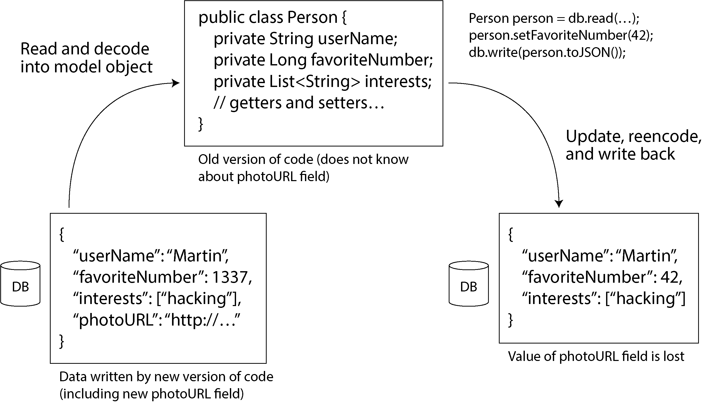
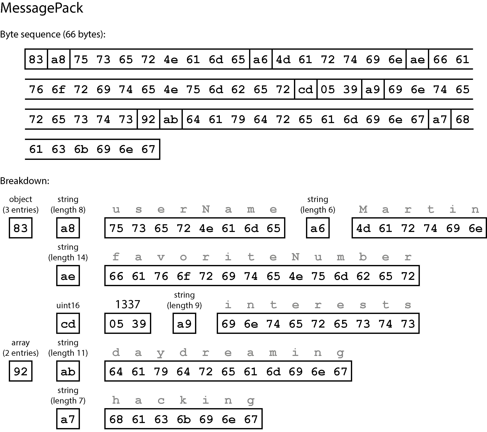
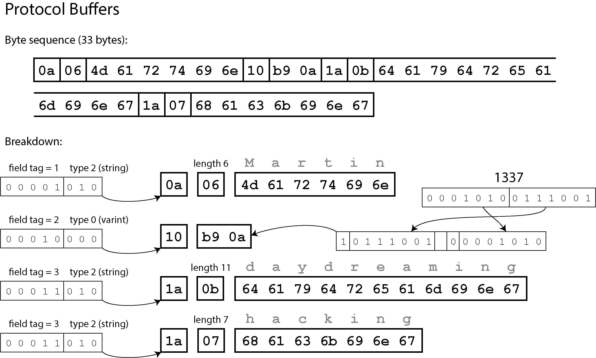
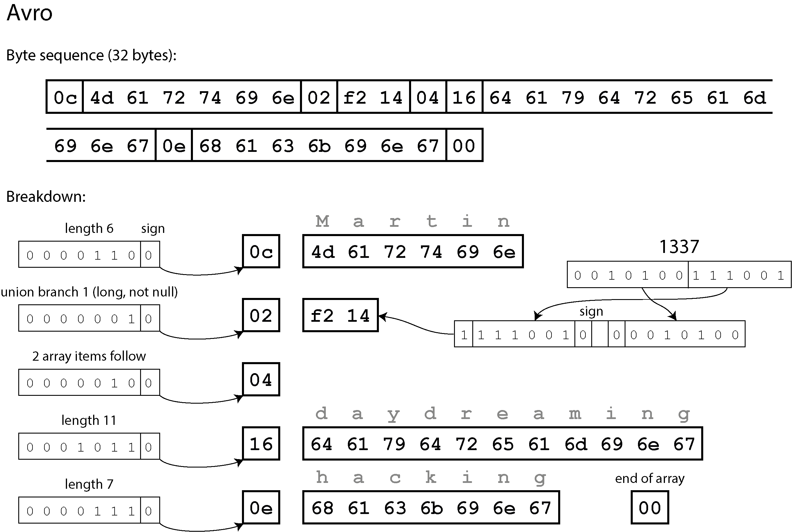
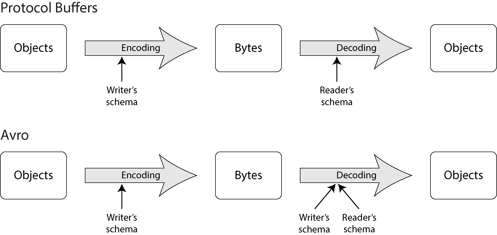
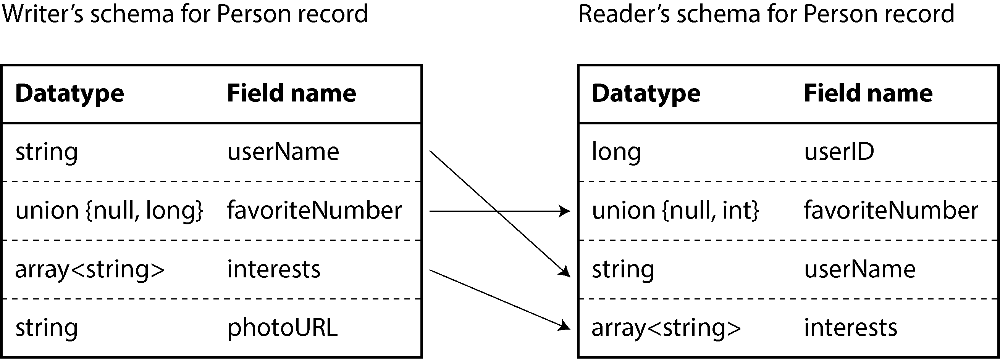
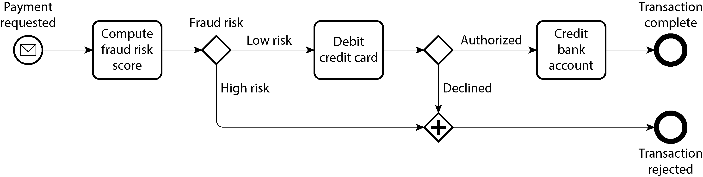

# Encoding and Evolution

## Evolvability aur Data Schema Changes

Duniya ka nizam badalta rehta hai, aur yahi usool software applications par bhi lagu hota hai. Waqt ke sath-sath applications mein naye features add hote hain, purane modify hote hain, aur business ki zarooriyat badal jati hain. Jab application ke features badalte hain, toh unke sath-sath **data format aur schemas** ko bhi badalna padta hai. Maslan, kisi user profile mein naya field (jaise profile picture ka URL) add karna ho, ya purane data ko kisi naye andaz mein dikhana ho.

Alag-alag data models is badlao (schema evolution) ko handle karne ke liye mukhtalif tareeqay istemal karte hain:

* **Relational Databases:** Yeh databases is baat par yaqeen rakhte hain ke poore database mein sirf **ek hi strict schema** nafiz (enforce) hona chahiye. Agar schema badalna ho, toh migration (yaani `ALTER TABLE` statements) ke zariye poore table ka structure badla jata hai, aur har waqt sirf ek hi schema active hota hai.
* **Schema-on-read ("Schemaless") Databases:** Document databases (jaise MongoDB) koi strict schema enforce nahi karte. Iska matlab yeh hai ke database ke andar ek hi waqt mein purane format ka data aur naye format ka data sath-sath reh sakta hai.

---

## Code Deployments aur Coexistence ki Realities

Jab database ka schema badalta hai, toh application code ko bhi badalna parta hai taake wo naye fields ko read aur write kar sake. Lekin bade distributed systems mein yeh badlao ek jhatkay mein (instantaneously) har jagah apply nahi kiya ja sakta. Iski do bari wajoohat hain:

### Server-Side Applications aur Rolling Upgrades

Servers par naya code deploy karne ke liye **Rolling Upgrade (ya Staged Rollout)** ka tareeqa apnaya jata hai. Ismein saare server nodes ko ek sath band karke naya code nahi dala jata (jis se downtime aaye), balkay kuch nodes par naya version deploy kiya jata hai, unhe monitor kiya jata hai, aur phir aahista-aahista baqi nodes ko upgrade kiya jata hai. Iska faida yeh hai ke bina kisi service downtime ke releases aasan ho jati hain, lekin iska nateeja yeh nikalta hai ke system mein **ek hi waqt mein purana code aur naya code dono sath-sath chal rahe hote hain**.

### Client-Side Applications

Mobile apps ya desktop applications ke mamle mein developer ka user par koi control nahi hota. User apni marzi se dino, hafton ya mahino baad app update karta hai. Iska matlab hai ke purana client code lambe arse tak naye backend services ke sath communicate karta rahega.

Inhi wajoohat ki bina par, system ko smooth chalane ke liye do tarah ki compatibility ki zaroorat hoti hai:

* **Backward Compatibility:** Jab **naya code** purane code ke likhe huay data ko aasani se read kar sake. Yeh achieve karna aasan hota hai kyunke naye code ke developer ko purane data format ka pehle se pata hota hai.
* **Forward Compatibility:** Jab **purana code** naye code ke likhe huay data ko read kar sake aur crash na ho, balkay naye fields ko chup-chaap ignore kar de. Yeh thoda mushkil hota hai kyunke purane code ko nahi pata hota ke future mein kya naye badlao aane wale hain.

> ## <mark>Writer kya samjhana chahta hai?</mark>
>
> Writer tumhein ek bohot important software engineering principle samjha raha hai:
>
> **Jab system evolve hota hai (naye features, naye columns, naye versions),  
> toh purani cheezein tootni nahi chahiye.**
>
> Isliye do rules follow karne zaroori hote hain:
>
> ### 1) <mark>Backward Compatibility (Naya code + Porana Data)</mark>
> Naya code purane data ko handle kar sake.
>
> Yani agar database me naya column add ho gaya ho,  
> lekin purane records me wo column missing ho,  
> toh naya code crash nahi kare — gracefully default value dikha de.
>
> ### 2) <mark>Forward Compatibility (Porana code + Naya Data)</mark>
> Purana code naye data ko ignore karke chal jaye.
>
> Yani agar purani app ko naye column ka pata hi nahi,  
> toh wo bas wohi fields padhe jo usay pata hain —  
> aur baqi ko ignore kar de, bina crash hue.
>
> **Writer ka core message:**  
> <mark>“Real-world systems me backward + forward compatibility na ho,  
> toh updates production ko tod deti hain.”</mark>
>
> Yehi wajah hai ke databases, APIs, mobile apps, microservices —  
> sab me compatibility rules follow kiye jate hain.
>
> ---
>
> ### 1. Simple Definitions (Bachon ki tarah)
>
> * **Backward Compatibility (Naya Code + Purana Data):**
> Socho aapne apni app update ki aur naya feature daala ke "Phone Number dikhao". Lekin aapke database mein kuch purane users hain jinka phone number hai hi nahi. Aapka naya code itna samajhdar hai ke woh kehta hai: *"Agar phone number nahi mil raha, toh koi baat nahi, bas 'N/A' (Not Available) likh do."* Isay kehte hain Backward Compatibility.
> * **Forward Compatibility (Purana Code + Naya Data):**
> Socho aapne database mein naya column `phone_number` add kar diya. Lekin aapka user abhi bhi purani app chala raha hai jise `phone_number` ke baare mein kuch nahi pata. Jab purani app data parhti hai, toh woh sirf `name` uthati hai aur `phone_number` ko "ignore" ( نظر انداز) kar deti hai. Wo crash nahi hoti. Isay kehte hain Forward Compatibility.
>
> ---
>
> ### 2. Proper Example (Relational Database - SQL)
>
> **Scenario:** Hamare paas ek table hai `users`.
>
> #### Step A: Shuruat (Initial State)
>
> Database mein sirf `name` hai.
>
> **DB Code:**
>
> ```sql
> CREATE TABLE users (
>     id INT PRIMARY KEY,
>     name VARCHAR(50)
> );
> ```
>
> **Application Code (Purana):**
>
> ```python
> # Purani app ka logic
> user = db.execute("SELECT id, name FROM users WHERE id = 1")
> print(f"User ka naam hai: {user['name']}")
> ```
>
> ---
>
> #### Step B: Migration (Humne Database badal diya)
>
> Ab humne `phone_number` add kar diya.
>
> **DB Code:**
>
> ```sql
> ALTER TABLE users ADD COLUMN phone_number VARCHAR(15);
> ```
>
> ---
>
> #### Step C: Compatibility ka Amal
>
> ##### 1. Backward Compatibility (Naya Code + Purana Data)
>
> Nayi app ka code purane users (jin ka phone number NULL hai) ko handle kar raha hai.
>
> **Application Code (Naya):**
>
> ```python
> # Nayi app ka logic
> user = db.execute("SELECT id, name, phone_number FROM users WHERE id = 1")
>
> # Naya code check kar raha hai ke data hai ya nahi
> if user['phone_number'] is None:
>     print(f"User ka naam: {user['name']}, Phone: N/A")
> else:
>     print(f"User ka naam: {user['name']}, Phone: {user['phone_number']}")
> ```
>
> *Yahan **Backward Compatibility** ye hai ke naye code ne purane data (jahan phone_number NULL tha) ko crash hone se bacha liya.*
>
> ##### 2. Forward Compatibility (Purana Code + Naya Data)
>
> Ab socho user ne app update nahi ki, lekin database mein naya data aagya hai. Purani app ka code `phone_number` ko parh hi nahi raha, isliye woh usay ignore kar deta hai.
>
> **Application Code (Purana):**
>
> ```python
> # Purani app ka logic (Isay nahi pata ke phone_number naam ka koi column bhi hai)
> user = db.execute("SELECT id, name FROM users WHERE id = 1")
>
> # Code sirf name print karega, phone_number column database mein hone ke bawajood
> # app crash nahi hogi kyunke hum ne woh column manga hi nahi.
> print(f"User ka naam: {user['name']}")
> ```
>
> *Yahan **Forward Compatibility** ye hai ke purani app ne database ke naye changes (phone_number) ko ignore kar diya aur apna kaam sahi se kiya.*
>
> ---
>
> ### Summary Checklist
>
> | Concept | Kaun kisse baat kar raha hai? | Key Rule |
> | --- | --- | --- |
> | **Backward Compatibility** | Naya Code -> Purana Data | Agar data missing hai, toh "N/A" ya default value dikhao. |
> | **Forward Compatibility** | Purana Code -> Naya Data | Jo nayi cheez samjh na aaye, usay "Ignore" kar do. |


---

## APIs ke Context mein Compatibility Dynamics

Web services, REST APIs, aur RPCs mein compatibility ka rule dono directions mein apply hota hai. Isko samajhne ke liye data flow ko request aur response ke lehaz se dekhna zaroori hai:

* **Old Client calling a New Service:** Agar ek purana app version kisi naye upgraded backend service ko call karta hai, toh naye service ko request samajhne ke liye **backward compatibility** chahiye, aur purane client ko naye service ka reply handle karne ke liye **forward compatibility** chahiye (taake wo response mein aane wale naye fields ko dekh kar crash na ho).
* **New Client calling an Old Service:** Agar naya app version kisi purane backend ko call kare, toh purane backend ko naye request fields ignore karne ke liye **forward compatibility** chahiye, aur naye client ko purane response ko parhne ke liye **backward compatibility** chahiye.

> Client aur Service ke darmiyan <mark>compatibility</mark> ka concept samajhna software engineering ka ek bahut bada pillar hai. Chalo, pehle inke basic farq ko clear karte hain aur phir compatibility dynamics ko dekhte hain.
>
> ### 1. Client vs. Service: Asal Farq Kya Hai?
>
> In dono ko ek restaurant ki example se samjhein:
>
> * **Client (App/Front-end):** Yeh woh cheez hai jo customer ke haath mein hai (User ka mobile ya browser). Yeh <mark>"Front-end"</mark> hai. Iska kaam sirf user se input lena aur server se data mangwa kar dikhana hai.
> * **Languages:** Mobile apps ke liye <mark>Kotlin (Android)</mark>, <mark>Swift (iOS)</mark>, ya <mark>React Native</mark> use hoti hain. Web ke liye <mark>JavaScript</mark>, <mark>TypeScript</mark>, ya <mark>React/Vue</mark> use hoti hain.
> * **Control:** Is par hamara control <mark>kam</mark> hota hai. Agar user ne app update nahi ki, toh wahi purana code chalta rahega.
>
>
> * **Service (Backend/Server):** Yeh woh "Chef" hai jo kitchen mein baitha hai. Yeh <mark>"Back-end"</mark> hai. Yeh database se baat karta hai, logic perform karta hai aur client ko response bhejta hai.
> * **Languages:** Server side par <mark>Java</mark>, <mark>Go</mark>, <mark>Python</mark>, <mark>Node.js</mark>, ya <mark>C#</mark> use hoti hain.
> * **Control:** Is par hamara control <mark>poora</mark> hota hai. Hum jab chahein server update kar sakte hain.
>
>
>
> ---
>
> ### 2. Compatibility Dynamics (The "Golden Rules")
>
> Jab Client aur Service baat karte hain, toh <mark>compatibility</mark> ka matlab yeh hai ke system crash na ho. Isay ek matrix ki tarah samjhein:
>
> | Scenario | Service ki Zaroorat | Client ki Zaroorat |
> | --- | --- | --- |
> | **Old Client -> New Service** | <mark>Backward Compatible</mark> (Purane request ko samajhna hai) | <mark>Forward Compatible</mark> (Naye response ko ignore/handle karna hai) |
> | **New Client -> Old Service** | <mark>Forward Compatible</mark> (Nayi fields ko ignore/skip karna hai) | <mark>Backward Compatible</mark> (Purane response format ko handle karna hai) |
>
> ---
>
> ### 3. Detail Explanation (Mistake-free logic)
>
> #### Scenario A: <mark>Old Client</mark> calling <mark>New Service</mark>
>
> * **Situation:** User ne app update nahi ki (Purana Client), lekin backend update ho gaya (Naya Service).
> * **Service ki Zaroorat (Backward Compatibility):** Backend naya ho gaya hai, lekin usay abhi bhi purane Client ki request (jo shayad thodi mukhtalif hai) ko handle karna hai. Backend code mein likha hota hai: *"Agar Client ne 'field_x' nahi bheji, toh default value use karo."*
> * **Client ki Zaroorat (Forward Compatibility):** Service naya hai, ho sakta hai woh response mein kuch <mark>extra data</mark> bhej de jo purane app ne kabhi dekha hi nahi. Purana App crash nahi hona chahiye. Code aisa likha hota hai: *"Jo extra fields aayein jo mujhe samajh nahi aa rahin, unhein chhor do (ignore) aur sirf kaam ki fields uthao."*
>
> #### Scenario B: <mark>New Client</mark> calling <mark>Old Service</mark>
>
> * **Situation:** User ne app update kar li (Naya Client), lekin backend abhi purana hai (Old Service).
> * **Service ki Zaroorat (Forward Compatibility):** Naya Client naye features ke sath data bhej raha hai (nayi fields). Purane Backend ko yeh nahi pata ke yeh nayi fields kya hain. Backend code aisa hona chahiye: *"Main in nayi fields ko read nahi kar sakta, lekin main inhein ignore karke apna kaam poora karunga (error nahi dunga)."*
> * **Client ki Zaroorat (Backward Compatibility):** Naya Client naye format mein baat karna chahta hai, lekin Service purani hai aur purane format mein jawab degi. Client code aisa hona chahiye: *"Agar Service ne mera naya data format nahi diya, toh koi baat nahi, main purane format (default) par switch kar jaunga."*
>

---

## Data Loss Dilemma (Figure 5-1)

Forward compatibility ka ek bohot bada aur khamosh khatra Figure 5-1 mein dikhaya gaya hai. Jab system mein rolling upgrade chal raha ho aur purana code aur naya data aapas mein takraen, toh data silently delete ho sakta hai. Chaliye is poore flow ko step-by-step samajhte hain:

<div align="center">
  
</div>

### Architectural Step-by-Step Flow:

1. **Naye Code ka Write Operation:** Ek upgraded node database mein ek record write karta hai jisme ek naya field `photoURL` mojood hai:
`{"userName": "Martin", "favoriteNumber": 1337, "interests": ["hacking"], "photoURL": "http://..."}`
2. **Purane Code ka Read aur Decode Operation:** Rolling upgrade ke dauran, ek purana node (jo `photoURL` ke baare mein nahi jaanta) is record ko database se read karta hai. Jab wo is JSON ko memory mein decode karta hai (jaise Figure 5-1 mein Java class `Person` dikhai gayi hai), toh us class mein `photoURL` ka koi variable nahi hota. Nateeja yeh hota hai ke parser us anjaan field (`photoURL`) ko **ignore karke drop** kar deta hai. Memory mein object sirf `userName`, `favoriteNumber`, aur `interests` ko hold karta hai.
3. **Data Update:** Purana code application logic ke mutabaq sirf ek field ko update karta hai, jaise `person.setFavoriteNumber(42)`.
4. **Re-encode aur Write Back (Data Loss):** Ab purana code is object ko dubara JSON mein badalta hai (`person.toJSON()`) aur database mein overwrite kar deta hai. Chunke memory mein `photoURL` pehle hi drop ho chuka tha, is liye naya JSON jo database mein jata hai wo yeh hota hai:
`{"userName": "Martin", "favoriteNumber": 42, "interests": ["hacking"]}`

> **Khatra (The Gotcha):** Database mein bina kisi error ke data overwrite ho gaya, lekin naye code ka likha hua `photoURL` hamesha ke liye **mizh (lost)** ho gaya. Agar aapka serialization framework unknown fields ko as-it-is preserve nahi karta, toh aisi khamosh tabahi distributed systems mein aam baat hai. Is chapter mein hum yahi seekhenge ke JSON, XML, Protocol Buffers, aur Avro is mushkil ko kaise hal karte hain.


```plaintext
[ New Version Code ] ---> Writes Record with new field ("photoURL") ---> [ Database ]
                                                                               |
                                                                               | (Read & Decode)
                                                                               v
[ Old Version Code ] <--- In-Memory Model Object (Drops "photoURL") <----------+
       |
       | (Modifies "favoriteNumber" & Encodes back to JSON)
       v
[ Database ] <----------- Overwrites original record WITHOUT "photoURL" (DATA LOSS!)

```

> Isay ek dam simple karke samajhte hain.
>
> ### 1. "Naya Code" aur "Purana Code" kya hain?
>
> Socho aapke paas **10 Servers** hain jo aapki website chala rahe hain. Aap un par **"Rolling Upgrade"** kar rahe ho.
>
> * **Purana Code (Old Version):** Yeh woh software hai jo aapke purane servers par chal raha hai. Iska <mark>`Person` class</mark> ka definition aisa hai:
> ```java
> public class Person {
>     String userName;
>     Long favoriteNumber;
>     List<String> interests;
>     // Isme 'photoURL' ka koi zikr nahi hai
> }
> ```
>
>
> * **Naya Code (New Version):** Yeh woh software hai jo aapne naye servers par deploy kiya hai. Isme <mark>`Person` class update</mark> ho chuki hai:
> ```java
> public class Person {
>     String userName;
>     Long favoriteNumber;
>     List<String> interests;
>     String photoURL; // Nayi field add ho gayi
> }
> ```
>
>
>
> **Masla:** Rolling upgrade ke dauran, aapke cluster mein kuch servers <mark>purane (bin `photoURL`)</mark> hain aur kuch <mark>naye (with `photoURL`)</mark>. Aur yeh **sab ke sab ek hi Database (DB)** se juday hain.
>
> ---
>
> ### 2. Yeh Khamosh Tabahi (<mark>Silent Data Loss</mark>) kaise hoti hai? (Example)
>
> Writer ki di gayi example ko step-by-step dekhein:
>
> **Step 1: <mark>Naya Code</mark> (Advanced Worker) kaam karta hai**  
> Ek Naya Server (Naya Code) data read karta hai aur usme `photoURL` add karke DB mein save kar deta hai.
>
> * **DB mein data:** <mark>`{"userName": "Martin", ..., "photoURL": "http://..."}`</mark>
>
> **Step 2: <mark>Purana Code</mark> (Old-School Worker) dushman ban jata hai**  
> Ab ek Purana Server (Purana Code) isi record ko DB se read karta hai. Jab woh JSON ko decode karke `Person` class mein dalne lagta hai, toh woh dekhta hai:
>
> *"Oh, JSON mein 'photoURL' bhi hai! Lekin meri `Person` class mein toh iske liye koi jagah hi nahi hai."*
>
> * **Ghalti:** Programming languages ka <mark>Parser / Decoder</mark> default mein unknown fields ko **ignore (drop)** kar deta hai.  
>   Uske liye `photoURL` ek "faltu" cheez hai. Woh usay <mark>delete</mark> kar deta hai.
>
> **Step 3: Update aur Write-back (<mark>Tabahi</mark>)**  
> Ab Purana Code `favoriteNumber` ko update karta hai (`42` kar deta hai).  
> Uske paas memory mein sirf woh data hai jo uski class (`Person`) samajh sakti thi.  
> <mark>`photoURL` toh Step 2 mein hi kho gaya tha!</mark>
>
> Jab woh `db.write()` karta hai, toh woh DB ko wahi data bhejta hai jo uski memory mein hai:
>
> * **DB mein naya data:**  
>   <mark>`{"userName": "Martin", "favoriteNumber": 42, "interests": ["hacking"]}`</mark>
>
> **Nateeja:**  
> <mark>`photoURL` hamesha ke liye delete ho gaya.</mark>  
> Purane code ne yeh samjh kar update kiya ke:
>
> *"Maine toh sirf `favoriteNumber` update kiya hai,"*
>
> lekin asliyat mein usne <mark>pichhla saara naya data mita diya.</mark>
>
> ---
>
> ### Key Takeaways (Jo aapko samajhni chahiye):
>
> 1. **Code vs DB:** Yeh `Person` class aapke **Backend Server** ki memory mein hai. Database sirf ek <mark>storage box</mark> hai.
>
> 2. **Serialization/Deserialization:**  
>    Jab aap DB se data nikal kar code mein late ho (Decode), aur wapis DB mein save karte ho (Encode), toh agar aapka `Person` class <mark>"Nayi fields"</mark> ko support nahi karta, toh woh data <mark>raaste mein hi gir jata hai (Data Loss)</mark>.
>
> 3. **Khatra:**  
>    Isay "Silent" isliye kehte hain kyunke:
>    - na server crash hota hai  
>    - na DB koi error deta hai  
>    - na logs mein kuch aata hai  
>
>    System <mark>chup‑chap</mark> kaam karta rehta hai  
>    aur pichhle saare naye features ka data <mark>delete</mark> karta rehta hai.


---

## Mockup System Design Scenario (Interview Prep)

### Scenario Context

Aap ek High-Traffic User Profile Service ke System Architect hain. Service par rolling upgrades chalte rehte hain. Interviewer aap se poochta hai:
*"Hum users ke table mein ek naya field `verificationBadge` add kar rahe hain. Rolling upgrade ke dauran purane nodes bhi chal rahe hain aur naye bhi. Hum kaise ensure karein ke purane nodes jab kisi profile ko update karein, toh naya `verificationBadge` field delete na ho, jaisa ke Figure 5-1 ke case mein hota hai?"*

### Architectural Design Implementation

Hum system ko is tarah design karenge ke hamara data access layer unknown fields ko preserve kare, ya hum ek schema-driven binary format use karenge. Niche iska conceptual architectural flow diya gaya hai:

```plaintext
                               +-----------------------------------+
                               |        Load Balancer              |
                               +-----------------------------------+
                                         /               \
                                        /                 \
                                       v                   v
                        +--------------------+       +--------------------+
                        |  Old App Node (v1) |       |  New App Node (v2) |
                        +--------------------+       +--------------------+
                                       \                   /
                         (Read/Write)   \                 / (Read/Write)
                                         v               v
                               +-----------------------------------+
                               |       Distributed Database        |
                               +-----------------------------------+
                               | Record: [Known Fields]            |
                               |         [Unknown_Fields_Map] <----+--- Stores "verificationBadge"
                               +-----------------------------------+

```

### Comprehensive Architectural Explanation

1. **Unknown Fields Preservation Strategy:**
Agar hum JSON use kar rahe hain, toh hum purane code (v1) ke parser ko configure karenge ke wo kisi bhi unmapped field (jaise `verificationBadge`) ko drop karne ke bajaye ek fallback generic map (`private Map<String, Object> unknownFields`) mein store kar le.
2. **Data Flow Control:**
* **Step A:** New Node (v2) database mein user record write karta hai jisme `verificationBadge: "gold"` shamil hai.
* **Step B:** Old Node (v1) us record ko read karta hai. JSON parser `userName` aur dusre purane fields ko unke variables mein dalta hai, lekin `verificationBadge` ko dekh kar use `unknownFields` ke map mein save kar leta hai.
* **Step C:** Old Node jab `favoriteNumber` update karke data dubara serialize karega, toh serialization logic `unknownFields` map ke data ko bhi wapas JSON string mein merge karega.


3. **Alternative Solution (Binary Formats):**
Interviewer ko batayein ke real-world production mein hum Protocol Buffers ya Avro jaise formats use karte hain, jahan har field ka ek unique tag/id hota hai. Purana code naye tag numbers ko decode karte waqt automatically binary buffer mein preserve rakhta hai aur bina chhede wapas database mein write kar deta hai, jis se data loss ka khatra zero ho jata hai.

---

## Formats for Encoding Data

Applications ke andar data aam taur par kam az kam do tarah ki representations mein mojood hota hai:

* **In-Memory Representation:** Jab data aapke RAM ke andar hota hai, toh CPU ke liye ise fast aur efficient access dene ke liye objects, structs, lists, arrays, hash tables, ya trees ki shakl mein rakha jata hai. Yahan sab kuch **pointers** ke zariye aapas mein connected hota hai.
* **Network/Disk Representation:** Jab aapko yahi data kisi file mein save karna ho ya network ke zariye kisi dusri service ko bhejna ho, toh aap pointers nahi bhej sakte (kyunke pointers sirf aapki app ke memory address space mein valid hote hain). Is liye data ko ek self-contained, flat **byte sequence** (jaise JSON string ya binary byte stream) mein convert karna padta hai.

In dono representations ke darmiyan translation zaroori hoti hai:

```plaintext
[ In-Memory Objects ] ---- (Encoding / Serialization) ----> [ Flat Byte Sequence ]
[ In-Memory Objects ] <---- (Decoding / Deserialization) --- [ Flat Byte Sequence ]

```

### Comprehensive Diagram Explanation

Is architectural flow mein dikhaya gaya hai ke jab application memory mein chal rahi hoti hai, toh data complex graph structures aur pointers ki shakl mein hota hai jise CPU direct process karta hai. Network par bhejne ya disk par store karne ke liye hum **Encoding (Serialization/Marshaling)** ka process chalate hain, jo is complex structure ko ek sidhi, continuous byte sequence mein badal deta hai. Jab koi dusra process ya server ise receive karta hai, toh wo **Decoding (Deserialization/Unmarshaling)** ke zariye wapas in-memory object graph khara kar leta hai.

*Kuch modern zero-copy formats (jaise Cap'n Proto aur FlatBuffers) aise bhi hote hain jo in-memory aur disk dono par ek hi format use karte hain, jis se yeh conversion step bypass ho jata hai.*

---

## Language-Specific Formats (Language-Specific Encodings)

Bohot si programming languages ke paas data encode karne ke built-in frameworks hote hain. Jaise Java mein `java.io.Serializable`, Python mein `pickle`, aur Ruby mein `Marshal`. Yeh shuru mein bohot convenient lagte hain kyunke sirf ek line ka code likh kar object save ho jata hai, lekin production systems mein inke andar **char bade architectural flaws** hain:

* **Language Lock-in:** Yeh encodings us khass language ke sath tightly bound hoti hain. Agar aapne Python ke `pickle` mein data save kiya, toh Java ya Node.js backend se use read karna intahai mushkil ya na-mumkin ho jata hai. Yeh aapko ek single tech stack mein qaid kar deta hai.
* **Security Vulnerabilities:** Data ko wapas object mein badalne (decoding) ke liye, in libraries ko memory mein arbitrary classes ko instantiate (create) karna padta hai. Agar koi attacker network par chalne wale byte sequence ko badal de, toh wo aapke server par aisi classes execute karwa sakta hai jo **Remote Code Execution (RCE)** ka baas banti hain.
* **Data Versioning aur Compatibility:** In built-in libraries mein forward aur backward compatibility ka khayal aksar baad mein aata hai (afterthought). Agar aap class mein ek naya field add karein, toh purana code deploy kiye gaye data ko read karte waqt crash ho jata hai.
* **Efficiency aur Performance:** Java ki built-in serialization iski bad-tareen performance aur bohot zyada bloated (bade size ke) byte sequences banane ki wajah se badnaam hai, jo CPU cycles aur network bandwidth dono ko zaya karti hai.

> Writer yahan un <mark>khatraat (risks)</mark> ki baat kar raha hai jo tab paida hote hain jab hum programming languages ke apne <mark>"Automatic Packers"</mark> (Built-in Serialization libraries) use karte hain. Yeh libraries "easy" toh lagti hain, lekin bade systems mein yeh <mark>"Technical Debt"</mark> aur <mark>security</mark> ka bohot bada bojh ban jati hain.
>
>
> ### 1. <mark>Language Lock-in</mark> (Qaid ho jana)
>
> Writer keh raha hai ke yeh libraries <mark>"language-specific"</mark> hain. Matlab, agar aapne data ko Python ke `pickle` se pack (encode) kiya, toh sirf Python hi usay unpack (decode) kar sakta hai.
>
> * **Example:** Socho aapne ek Microservices system banaya. Ek service Python mein hai aur dusri Java mein. Agar Python service ne `pickle` use karke data bhej diya, toh Java service usay parh hi nahi payegi. Java ko `pickle` ka format samajh hi nahi aata.
> * **Nateeja:** Aap majboor ho jate hain ke ya toh saari services ek hi language mein likhein, ya phir "Glue code" likh kar data convert karein, jo bohot mehnga aur slow process hai. Aap ek tarah se apni <mark>tech stack ke sath qaid (lock-in)</mark> ho gaye.
>
> ---
>
> ### 2. <mark>Security Vulnerabilities</mark> (Sab se bada khatra)
>
> Yeh point sab se critical hai. In libraries mein <mark>Insecure Deserialization</mark> ka khatra hota hai.
>
> * **Mechanism:** Jab aap `pickle.load()` ya Java ka `readObject()` call karte hain, toh library kya karti hai?  
>   Woh data ko parhti hai aur kehti hai,  
>   *"Oho, is byte stream mein likha hai ke mujhe `User` class ka object banana hai, chalo bana do!"*
>
> * **Attack Scenario:** Ek attacker network par aapke server ko ek <mark>"Poisoned Byte Stream"</mark> bhejta hai.  
>   Us stream mein woh `User` class ki jagah ek aisi <mark>system class</mark> ka naam likh deta hai jo server par command chala sakti hai (jaise file delete karna ya shell access lena).  
>   Aapki library bina soche samjhe us class ko memory mein <mark>instantiate</mark> kar deti hai, aur hacker ka code execute ho jata hai.
>
> * **RCE (Remote Code Execution):**  
>   Isay <mark>RCE</mark> kehte hain — yani hacker door baith kar aapke server ka control le leta hai.
>
> ---
>
> ### 3. <mark>Data Versioning</mark> aur <mark>Compatibility</mark> (Afterthought)
>
> In built-in libraries ka design <mark>"static"</mark> hota hai. Inhein banate waqt yeh nahi socha gaya tha ke software update hota rahega aur fields badalti rahengi.
>
> * **Example:** Aapne `Person` class mein sirf `name` rakha tha. Program chala, data save hua.  
>   Agle mahine aapne `name` ke sath `email` bhi add kar diya (`Person` class update ho gayi).
>
> * **Masla:** Jab purana `Person` object (jis mein sirf `name` tha) wapis load hoga, toh library ka class loader confuse ho jayega.  
>   Woh kahega:  
>   *"Data mein toh sirf 1 field hai, lekin class mein 2 fields hain! Error!"*
>
> * **Afterthought:**  
>   Kyunki in libraries mein <mark>"Forward Compatibility"</mark> ka logic built-in nahi hota, isliye aapka poora system <mark>crash</mark> ho jata hai.  
>   Aapko manual <mark>migration scripts</mark> likhni parti hain, jo ek dard-e-sar hai.
>
> ---
>
> ### 4. <mark>Efficiency</mark> aur <mark>Performance</mark> (Bloated Data)
>
> Java ki `Serializable` iski misaal hai. Yeh serialization sirf aapka data (values) save nahi karti, balkay poora <mark>"Class Metadata"</mark> bhi save karti hai.
>
> * **Metadata kya hai?**  
>   Class ka naam, uske methods ke naam, fields ke naam, hierarchy, etc.
>
> * **Example:**  
>   Agar aapne `1` save karna hai, toh JSON mein sirf `1` store hoga (1 byte).  
>   Lekin built-in Java serialization mein shayad <mark>50–100 bytes</mark> store honge, kyunke usme class ki puri <mark>"Resume" (metadata)</mark> attach hoti hai.
>
> * **Nateeja:**  
>   * **Network Bandwidth:** Data ka size <mark>10 guna</mark> badh jata hai, jo network par traffic jam karta hai.  
>   * **CPU:** Metadata ko parse karne aur object instantiate karne mein CPU zyada power kharch karta hai.


---

## JSON, XML, and Binary Variants (Text-Based Encodings)

Jab baat aati hai aisi encodings ki jo har programming language samajh sake, toh JSON aur XML sab se top par aate hain. Inke sath CSV bhi tabular data ke liye aam use hota hai. Yeh sab **textual formats** hain (yaani insaan inhein parh sakta hai), lekin inke apne bade technical masail hain:

* **XML Verbosity:** XML apni bohot zyada tags ki wajah se zaroorat se zyada barhi aur complex ho jati hai.
* **Number Encoding Ambiguity:** XML aur CSV mein numbers aur un strings mein farq karna jo sirf digits par mushtamil hon (jaise `"123"` aur `123`), external schema ke bina namumkin hota hai. JSON strings aur numbers mein farq toh karta hai, lekin yeh integers aur floating-point numbers mein farq nahi karta, aur na hi precision specify karta hai.
* *Real-World Example:* JavaScript mein agay chal kar yeh masla aata hai ke agar koi integer $2^{53}$ se bada ho, toh IEEE 754 double-precision floating-point format ki wajah se uski precision khatam ho jati hai aur number kharab ho jata hai. Iska hal nikalne ke liye, Twitter/X apni API se jab tweets ki 64-bit ID bhejta hai, toh wo JSON mein do dafa bheji jati hai: ek dafa naye number ki tarah aur ek dafa string ki tarah, taake JavaScript apps crash na hon aur sahi ID read kar sakein.


* **Binary Strings ki Limitation:** JSON aur XML text (Unicode strings) ko toh achhi tarah handle karte hain, lekin raw bytes (binary data) support nahi karte. Log iska hal nikalne ke liye binary data ko **Base64 text** mein encode karte hain. Yeh chalta toh hai lekin text mein convert hone ki wajah se data ka size **33% barh jata hai**, jo ke kafi inefficient hai.

> Writer yahan <mark>JSON</mark>, <mark>XML</mark>, aur <mark>CSV</mark> ke un hidden masail ko highlight kar raha hai jo aksar nazar-andaz ho jate hain. Yeh formats "Human-readable" toh hain, lekin jab baat <mark>large-scale systems</mark> aur <mark>massive data transmission</mark> ki aati hai, toh inke designs mein kuch fundamental <mark>khamiyan (flaws)</mark> saamne aati hain.
>
> Chalo, in chaar points ko code examples ke sath detail mein samajhte hain:
>
> ---
>
> ### 1. <mark>XML Verbosity</mark> (Tags ka Bojh)
>
> XML mein har piece of data ke liye <mark>opening aur closing tags</mark> zaroori hain. Yeh tag-based structure readable toh hai lekin storage aur network bandwidth ke liye bohot <mark>"Verbose"</mark> (zaroorat se zyada lamba) hai.
>
> **JSON Example:**
> ```json
> {
>   "userName": "Martin",
>   "favoriteNumber": 1337
> }
> ```
> *Size: ~40 characters*
>
> **XML Example:**
> ```xml
> <person>
>   <userName>Martin</userName>
>   <favoriteNumber>1337</favoriteNumber>
> </person>
> ```
> *Size: ~80 characters*
>
> **Writer ka Point:** XML mein wohi data represent karne ke liye <mark>double space</mark> lag rahi hai. Jab aap <mark>million records</mark> bhejte hain, toh yeh "fuzool" tags ka bojh bandwidth par bura asar daalta hai.
>
> ---
>
> ### 2. <mark>Number Encoding Ambiguity</mark> (Data type ka confusion)
>
> XML aur CSV mein koi <mark>"Schema"</mark> ya <mark>"Definition"</mark> nahi hoti. Agar aap likhte hain `123`, toh parser ko kaise pata chalega ke yeh ek <mark>number</mark> hai ya <mark>string</mark>?
>
> **CSV Example:**
> ```csv
> id, value
> 101, 123
> ```
> *Yahan `123` string hai ya number?*  
> Baghair kisi <mark>external schema</mark> ke, koi nahi bata sakta.
>
> **JSON Example:**  
> JSON mein distinction toh hai (`123` vs `"123"`), lekin <mark>floating‑point</mark> aur <mark>integers</mark> ka masla abhi bhi hai. JSON specification yeh nahi kehti ke `123.0` aur `123` mein kya farq hai ya <mark>precision</mark> kitni honi chahiye.
>
> ---
>
> ### 3. <mark>Twitter/X ID Example</mark> (Floating Point Precision)
>
> Yeh sab se important point hai. JavaScript (aur bohot si languages) numbers ko <mark>IEEE 754 double‑precision floating‑point</mark> format mein store karti hain. Iski ek limit hoti hai:  
> **2⁵³ − 1**  
> Agar number is se bara ho, toh <mark>precision kho jati hai</mark>.
>
> Twitter ki Tweets ki IDs <mark>64‑bit</mark> hoti hain (bohot bari). Agar Twitter sirf number bhej de, toh JS usay <mark>round‑off</mark> kar dega aur galat number dikhaye ga.
>
> **Twitter ka Workaround:**
> ```json
> {
>   "id": 123456789012345678,      // Number form (JS round-off kar sakta hai)
>   "id_str": "123456789012345678" // String form (Safe!)
> }
> ```
>
> **Writer ka Point:** Twitter ko majboor ho kar <mark>same data do dafa</mark> bhejna par raha hai kyunke JSON/JS ka <mark>number handling mechanism</mark> perfect nahi hai. Yeh <mark>inefficient</mark> hai lekin compatibility ke liye zaroori hai.
>
> ---
>
> ### 4. <mark>Binary Strings</mark> aur <mark>Base64 Inefficiency</mark>
>
> JSON aur XML sirf <mark>text</mark> ke liye bane hain. Agar aapne <mark>image</mark>, <mark>video</mark>, ya <mark>raw binary file</mark> bhejni ho, toh aap `010101` raw format mein nahi bhej sakte.
>
> **Hal:** <mark>Base64 Encoding</mark>.  
> Base64 har 3 bytes (24 bits) ke data ko 4 text characters mein convert kar deta hai.
>
> **Example:**
> *Original Binary Data (3 bytes):* `0x4D 0x61 0x72` (ASCII: "Mar")  
> *Base64 Encoded Text:* `"TWFy"`
>
> **Kyu inefficient hai?**
>
> * Original data: <mark>3 bytes</mark> (24 bits).  
> * Base64 data: <mark>4 bytes</mark> (32 bits).  
> * **Nateeja:** Data size <mark>33% barh gaya</mark>.
>
> **Writer ka Point:** JSON/XML mein binary data bhejna bohot mehnga par raha hai kyunke aap <mark>33% extra data</mark> network par bhej rahe hain, jo sirf format ki majboori hai.
>
> ---
>
> ### Summary Table
>
> | Masla | Waja | Impact |
> | --- | --- | --- |
> | **Verbosity** | <mark>XML Tags</mark> | <mark>Bandwidth waste</mark> hoti hai. |
> | **Ambiguity** | <mark>No built-in types</mark> (CSV/XML) | Data reading mein <mark>ghalti ka khatra</mark>. |
> | **Precision** | <mark>JS/JSON Number limits</mark> | Bari IDs (Twitter) <mark>corrupt</mark> ho jati hain. |
> | **Inefficiency** | <mark>Base64 for binary</mark> | Data size <mark>33% barh jata</mark> hai. |


---

## JSON Schema

JSON data ko validate karne aur model karne ke liye modern APIs aur databases (jaise PostgreSQL, MongoDB) mein **JSON Schema** ka use kiya jata hai. Ismein open aur closed content models hote hain. Default taur par `additionalProperties` true hoti hai (Open Content Model), jiska matlab hai ke jo fields defined nahi hain, wo bhi accept ho sakti hain.

Agar aapko JSON mein integer keys aur string values ka map banana ho (jo ke JSON directly support nahi karta kyunke JSON keys hamesha string hoti hain), toh aap niche diye gaye schema ke mutabaq pattern validation use karte hain:

```json
{
  "$schema": "http://json-schema.org/draft-07/schema#",
  "type": "object",
  "patternProperties": {
    "^[0-9]+$": {
      "type": "string"
    }
  },
  "additionalProperties": false
}

```

### Code Explanation:

* `$schema`: Yeh specify karta hai ke yeh draft-07 standard ka schema hai.
* `type`: "object" batata hai ke root element ek JSON object hoga.
* `patternProperties`: Iske andar Regex `^[0-9]+$` lagayi gayi hai. Iska matlab hai ke is object ki har key sirf digits (integers) par mushtamil ho sakti hai, aur unki values ka type strictly `"string"` hona chahiye.
* `additionalProperties`: `false` karne se yeh ek **closed content model** ban jata hai, yaani jo regex pattern match nahi karega, us field ko sakhti se reject kar diya jayega.


---

## Binary encodings

JSON text-based hone ki wajah se kafi space leta hai. Isko optimize karne ke liye binary variants banaye gaye, jaise **MessagePack, CBOR, BSON** waghaira. Yeh formats integers aur floats ko alag karte hain aur binary strings ko bina Base64 ke direct store karte hain.

> Writer yahan yeh samjha raha hai ke <mark>JSON</mark> insaanon ke liye hai, lekin <mark>Computers</mark> ke liye yeh bohot "bhari" (heavy) hai. <mark>Binary variants</mark> (MessagePack, CBOR, BSON) ka maqsad isi "bharepan" ko khatam kar ke machine ke liye data ko <mark>fast</mark> aur <mark>chhota</mark> banana hai.
>
>
> ### 1. JSON kyun "Heavy" hai? (<mark>Textual Inefficiency</mark>)
>
> JSON mein har cheez ek <mark>"String"</mark> hai.  
> Agar aap number `12345` save karte hain, toh computer usey `1`, `2`, `3`, `4`, aur `5` characters ki tarah store karta hai.
>
> * **JSON mein:** `12345` (5 bytes/characters)  
> * **Binary mein:** `12345` (sirf <mark>2 bytes</mark> mein store ho sakta hai).
>
>
> ### 2. <mark>Binary Variants</mark> (MessagePack, CBOR, BSON) kaise optimize karte hain?
>
> In formats ka basic rule yeh hai:  
> **"Data ko machine ki language (bytes) mein likho, na ke insaan ki language (text) mein."**
>
> #### A. <mark>Integers aur Floats</mark> ka optimization:
>
> * **JSON:** Har digit ko ek <mark>character</mark> ki tarah treat karta hai. Bohat zyada space leta hai.  
> * **Binary:** Yeh integers ko unki <mark>2's complement</mark> binary form mein store karta hai.
>
> * Agar number chhota hai (e.g., 5), toh yeh sirf <mark>1 byte</mark> use karega.  
> * Agar number bara hai, toh yeh <mark>2 ya 4 bytes</mark> use karega.  
>
> *Yeh bilkul waise hi hai jaise computer apni RAM mein numbers store karta hai.*
>
>
> #### B. <mark>Binary Strings</mark> ka masla (The <mark>Base64 Tax</mark>):
>
> JSON mein binary data bhejne ka koi direct tareeqa nahi hai.
>
> * **JSON ki majboori:** Log <mark>Base64</mark> use karte hain.  
>   Base64 har 3 bytes ke binary data ko <mark>4 bytes</mark> ke text mein convert kar deta hai.
>
> * **Nateeja:** Data size <mark>33% barh jata</mark> hai.  
>   Agar 1MB ki file hai, toh JSON mein bhejte waqt wo <mark>1.33MB</mark> ki ho jayegi!
>
>
> * **Binary Formats:** MessagePack ya CBOR mein <mark>"Raw Byte Array"</mark> ka feature hota hai.  
>   Wo kehte hain: "Mujhe Base64 ki zaroorat nahi. Main bata deta hoon ke agle 100 bytes image ka data hain."
>
> * **Nateeja:**  
>   * Size barhta nahi  
>   * <mark>CPU cycles</mark> bhi bach jate hain  
>
>
> ---
>
> ### 3. Ek <mark>Comparison Example</mark>
>
> Socho hamare paas yeh object hai: `{"id": 1337}`
>
> | Feature | JSON (Text) | MessagePack (Binary) |
> | --- | --- | --- |
> | **`"id"`** | Store as <mark>2 characters</mark> (ASCII) | Store as <mark>Type Marker</mark> + Length + Bytes |
> | **`1337`** | Store as <mark>4 characters</mark> (`'1','3','3','7'`) | Store as <mark>raw 2‑byte integer</mark> |
> | **Size** | ~11 bytes | ~4–5 bytes |
>
> *Binary formats mein `1337` ko <mark>2 bytes</mark> mein pack kar diya jata hai (hex: `05 39`), jabke JSON mein usay <mark>4 bytes ki string</mark> banana parti hai.*
>
> ---
>
> ### <mark>Writer kya conclude karna chahta hai?</mark>
>
> Writer yeh bata raha hai ke <mark>binary formats</mark> ne data model toh JSON wala hi rakha hai (keys waghaira same),  
> lekin **representation** badal di hai.
>
> **Iske 2 bade faiday hain:**
>
> 1. **Space:** Network par data <mark>chhota</mark> jata hai.  
> 2. **Speed:** Computer ko <mark>string parsing</mark> nahi karni parti — wo seedha <mark>bytes → integer</mark> map kar deta hai.
>
>
> **Lekin ek tradeoff hai:**  
> Binary formats <mark>Human‑readable</mark> nahi hote.  
> JSON ko Notepad mein khol kar parh sakte ho,  
> MessagePack ko khol kar sirf <mark>gibberish</mark> dikhega.
>
>
> Isliye:
>
> * <mark>MessagePack / BSON</mark> — Server‑to‑Server, internal systems  
> * <mark>JSON</mark> — Humans, browsers, APIs


Lekin inka **sab se bada trade-off** yeh hai ke chunke yeh *schemaless* hote hain, inhein binary payload ke andar har object ke **field names** (jaise `userName`, `favoriteNumber`) ko baar-baar string ki shakl mein encode karna padta hai.

Chaliye hum is JSON record ko dekhte hain:

```json
{
  "userName": "Martin",
  "favoriteNumber": 1337,
  "interests": ["daydreaming", "hacking"]
}

```

---

### Figure 5-2  ka Deep Breakdown (MessagePack Byte Sequence)

Jab upar diye gaye JSON ko MessagePack binary format mein encode kiya jata hai, toh yeh kul **66 bytes** leta hai (jabke plain text JSON bina spaces ke 81 bytes leta hai). Niche iske byte-by-byte structure ka step-by-step architectural flow aur breakdown diya gaya hai:

<div align="center">
  
</div>

```plaintext
Byte Layout Mapping:
+------+------+--------------------------+------+--------------------+------+---------------------------+
| 0x83 | 0xa8 | "userName" (8 bytes text)| 0xa6 | "Martin" (6 bytes) | 0xae | "favoriteNumber" (14B txt)|
+------+------+--------------------------+------+--------------------+------+---------------------------+
| 0xcd | 0x0539 (1337 as uint16)         | 0xa9 | "interests" (9B)   | 0x92 | Array (2 entries)         |
+------+------+--------------------------+------+--------------------+------+---------------------------+

```

#### Detailed Breakdown of Bytes:

1. **`0x83` (Object Header):** Pehla byte batata hai ke agay ek object aa raha hai. Iske sab se bare bits (`0x80`) object ko darshate hain, aur aakhri bits (`0x03`) yeh batate hain ke is object mein **3 fields/entries** hain. Agar fields 15 se zyada hon, toh MessagePack alag indicator use karke field count ko 2 ya 4 bytes mein encode karta hai.
2. **`0xa8` (First Key Header):** Yeh batata hai ke agay ek string aa rahi hai. `0xa0` string ka indicator hai aur `0x08` ka matlab hai ke string ki **lambaee (length) 8 bytes** hai.
3. **`75 73 65 72 4e 61 6d 65` ("userName"):** Yeh agle 8 bytes hain jo ASCII code mein direct `"userName"` likhte hain. Chunke length pehle hi batayi ja chuki thi, is liye kisi ending marker ya comma ki zaroorat nahi parti.
4. **`0xa6` aur `4d 61 72 74 69 6e` ("Martin"):** `0xa6` batata hai 6-byte lambi string, aur agle bytes `"Martin"` ka ASCII character data hain.
5. **`0xae` aur "favoriteNumber":** `0xae` ka matlab hai 14-byte lambi string, aur uske baad pure 14 bytes `"favoriteNumber"` ke field name ko binary mein store karte hain.
6. **`0xcd` aur `0x05 39` (1337):** `0xcd` MessagePack ka ek khass type indicator hai jo batata hai ke agay aane wala number ek **16-bit unsigned integer (`uint16`)** hai. Agle do bytes `0x05 39` hex mein hain, jo decimal mein $5 \times 256 + 57 = 1337$ bante hain.
7. **`0xa9` aur "interests":** `0xa9` ka matlab 9-byte lambi string, jo ke `"interests"` ka naam hold karti hai.
8. **`0x92` (Array Header):** Yeh byte batata hai ke ek array shuru ho raha hai. `0x90` array ka tag hai aur `0x02` batata hai ke is array mein **2 elements** hain.
9. **`0xab` / `0xa7` Strings:** Aakhir mein `0xab` (11-byte string for `"daydreaming"`) aur `0xa7` (7-byte string for `"hacking"`) unke binary values ke sath aate hain.

> **Architectural Insight:** MessagePack ne sirf 15 bytes bachaye (81 bytes se kam karke 66 bytes kiya). Iski sab se bari wajah yeh hai ke isne data structures ko toh tight kiya, lekin field names (`userName`, `favoriteNumber`) ko har record ke sath wapas bheja. Agar hamare paas millions of rows hon, toh yeh field names network par bohot bada overhead ban jate hain.


> Yeh diagram dekh kar darna bilkul natural hai, lekin agar aap ise ek <mark>"Courier Parcel"</mark> ki tarah samjhein, toh yeh bohot asaan ho jayega.
>
> Chalo, isay ek "Courier Company" (Computer) ki tarah dekhte hain jo data bhejna chahti hai.
>
> ### Asal Masla: <mark>JSON vs. MessagePack</mark>
>
> JSON mein hum likhte hain: `{"userName": "Martin"}`.  
> Isme computer ko baar-baar <mark>quotes</mark> (`""`), <mark>colons</mark> (`:`), aur <mark>braces</mark> (`{}`) parhne parte hain taake wo samajh sake ke "ye kya cheez hai."  
> Yeh bohot <mark>"noisy"</mark> hai.
>
> **MessagePack ka tareeqa:** Yeh insaanon ke liye nahi, balkay <mark>computer ki speed</mark> ke liye design hua hai.  
> Yeh <mark>"Labels" (Headers)</mark> use karta hai taake computer ko pata chal sake ke agla data kitna bara hai aur kya hai.
>
> ---
>
> ### Step-by-Step <mark>"Roadmap"</mark> (Jise hum Byte Sequence kehte hain)
>
> Is diagram mein har byte (e.g., <mark>`83`</mark>, <mark>`a8`</mark>) ek <mark>"Instruction"</mark> ya <mark>"Label"</mark> hai.
>
> #### 1. Object Shuru (Label: <mark>`83`</mark>)
>
> Computer jab `83` parhta hai, toh wo samajh jata hai:
>
> * **"Main ek Object hoon aur mere andar <mark>3 cheezein</mark> (fields) hain."**
> * (Isliye `83` mein `8` ka matlab Object aur `3` ka matlab 3 fields).
>
> #### 2. Field Name (Label: <mark>`a8`</mark> + `userName`)
>
> Computer ab agli field dhund raha hai. Wo `a8` parhta hai:
>
> * **Label `a8`:** "Main ek <mark>string</mark> hoon jiski <mark>lambai 8</mark> hai."
> * Ab computer ko pata chal gaya ke agle 8 bytes `u-s-e-r-N-a-m-e` hain.  
>   Computer ko kisi comma ya quote ki zaroorat nahi pari — usne <mark>length</mark> se hi pehchan liya.
>
> #### 3. Field Value (Label: <mark>`a6`</mark> + `Martin`)
>
> Ab value ki bari hai. Label `a6` milta hai:
>
> * **Label `a6`:** "Main ek <mark>string</mark> hoon jiski <mark>lambai 6</mark> hai."
> * Computer foran agle 6 bytes par jata hai: `M-a-r-t-i-n`.
>
> #### 4. Number (Label: <mark>`cd`</mark> + `1337`)
>
> Yahan logic badal jati hai. Label `cd` milta hai:
>
> * **Label `cd`:** "Main koi string nahi hoon, main ek <mark>16-bit ka Number</mark> (Integer) hoon."
> * Computer agle do bytes (`05 39`) uthata hai aur unhein jod kar <mark>`1337`</mark> bana deta hai.
> * (JSON mein ise `'1','3','3','7'` char bytes mein likhna parta, yahan <mark>2 bytes</mark> mein kaam ho gaya).
>
> #### 5. Array (Label: <mark>`92`</mark>)
>
> Jab `92` aata hai, computer samajh jata hai:
>
> * **Label `92`:** "Ek <mark>list (Array)</mark> shuru ho rahi hai jisme <mark>2 items</mark> hain."
> * Ab wo bina kisi bracket `[]` ke agle do items `daydreaming` aur `hacking` ko parh leta hai.
>
> ---
>
> ### Writer ka <mark>"Architectural Insight"</mark> (Sab se ahem baat)
>
> Writer ne end mein ek bohot barri baat kahi hai:
>
> **"MessagePack ne sirf <mark>15 bytes</mark> bachaye."**  
> (JSON mein ~81 bytes, MessagePack mein 66 bytes).
>
> **Kyun?**  
> Kyunke MessagePack ne format toh binary kar diya, lekin usne <mark>field names</mark> (`userName`, `favoriteNumber`) ko har record ke sath <mark>repeat</mark> kiya.
>
> * Har user ke record mein `userName` bar-bar bhejna par raha hai.  
> * Agar aapke paas <mark>1 million users</mark> hain, toh aap 1 million baar `userName` (8 bytes) bheje ja rahe hain.
>
> **Conclusion:**  
> Writer keh raha hai ke MessagePack "JSON ka chhota bhai" zaroor hai,  
> lekin agar aapko <mark>"Sahi Efficiency"</mark> chahiye (jaise Google ya Facebook ke systems mein),  
> toh aapko <mark>Schema-based formats</mark> (jaise <mark>Protobuf</mark>) use karne chahiye jahan:
>
> * `userName` ko sirf ek baar "Define" kiya jata hai  
> * aur har record mein sirf uska <mark>ID</mark> (e.g., `1`) bheja jata hai.
>
> ---
>
> ### Summary:
>
> * **JSON:** Insaan parh sakta hai, lekin bohot <mark>"bhaari"</mark> hai.  
> * **MessagePack:** Computer fast parh sakta hai, thora chhota hai, lekin <mark>field names repeat</mark> karke jagah zaya karta hai.  
> * **Schema-based (Protobuf):** Sab se <mark>fast</mark> aur sab se <mark>chhota</mark>, kyunke field names ko record ke andar bhejte hi nahi!

---

## Mockup System Design Scenario (Interview Prep)

### Scenario Context

Aap ek Real-time IoT Telemetry System design kar rahe hain jahan har second lakhon devices (smart meters) server par data bhejti hain. Bandwidth intahai limited hai.
*Interviewer aap se poochta hai:* "Aap devices se data backend par bhejne ke liye JSON text use karenge ya MessagePack binary encoding? Aur kya hum is se bhi behtar space efficiency achieve kar sakte hain?"

### Architectural Design Implementation

Hum high-throughput aur tight bandwidth ke liye ek binary-schema protocol design karenge, kyunke schemaless binary formats (jaise MessagePack) telemetry data ke repetition mein fail ho jate hain.

```plaintext
[ Smart IoT Device ] ---- Sends raw schema-less payload ----> [ Field Names Overhead: Wastes Bandwidth ]
                                     |
                                     v
[ Correct Architecture ] 
[ Smart IoT Device ] ---- (Binary Encoder with ID Tags) ----> [ Compressed Payload (No Field Names) ]
                                                                       |
                                                                       v
                                                           [ Service Decoder via Schema ]

```

### Comprehensive Architectural Explanation

1. **MessagePack ka Trade-off Analysis:**
Interviewer ko batayein ke agar hum MessagePack use karte hain, toh JSON ke mukable data size thoda kam hoga (jaise humne dekha 81 bytes se 66 bytes). Lekin har telemetry message mein field names (`"meter_id"`, `"voltage"`, `"timestamp"`) repeat honge. Agar ek message 100 bytes ka hai aur usmein 60 bytes sirf field ke naam hain, toh hum 60% bandwidth zaya kar rahe hain.
2. **The Ultimate Optimization (Schema-Driven Binary Formats):**
Production scale par hum MessagePack ke bajaye **Protocol Buffers (Protobuf) ya Avro** use karenge. In formats mein schema pehle se dono sides (client aur server) par save hota hai. Data ke sath field names bhejne ke bajaye sirf **Field Tags (Numbers)** bheje jate hain (jaise field 1 = meter_id, field 2 = voltage). Is tarah 66 bytes ka data mazeed kam ho kar sirf 20-30 bytes ka reh jata hai, jo network bandwidth ko drastically optimize karta hai.

---

## Quick Revision & Key Takeaways

* **Core Summary:** Data ke do roop hote hain: in-memory (optimized for CPU/pointers) aur serialized bytes (optimized for network/disk). Language-specific built-in formats (jaise Python `pickle`) security flaws aur lock-in ka baas banti hain, is liye production mein language-agnostic formats zaroori hain.
* **The Architectural Rule:** Schemaless formats (JSON, XML, MessagePack) ko har record ke sath field names store karne parte hain. Agar data size aur network bandwidth aapka primary concern hai, toh hamesha **Schema-driven** formats ka intekhab karein jahan field names metadata ka hissa hote hain, message payload ka nahi.
* **Flash-Card Points:**
* **Encoding:** In-memory objects ko flat byte stream mein badalna.
* **Base64 Overhead:** JSON/XML mein binary strings handle karne ka hack, jo size ko 33% barha deta hai.
* **MessagePack Limitation:** Binary hone ke bawajood field names repeat karne ki wajah se bohot zyada data compression nahi de pata.

---


## Protocol Buffers

Google ka banaya hua **Protocol Buffers (Protobuf)** ek intahai efficient binary encoding format hai. Yeh Apache Thrift se bohot milta julta hai. Protobuf ki sab se bari shart yeh hai ke ismein data ko encode ya decode karne ke liye ek **Schema** ka hona lazmi hai.

JSON ya XML ki tarah ismein direct data nahi likha jata, balkay pehle **IDL (Interface Definition Language)** ka istemal karte huay ek `.proto` file ke andar data ka structure define kiya jata hai, jo ke dekhne mein aisa lagta hai:

```protobuf
syntax = "proto3";

message Person {
  string user_name = 1;
  int64 favorite_number = 2;
  repeated string interests = 3;
}

```

### Schema aur Code Generation ka Mechanics

Jab aap yeh schema design kar lete hain, toh Protobuf ka compiler (`protoc`) is schema file ko parh kar aapki pasandida programming language (Java, Python, C++, Go) mein automatically classes generate kar deta hai.

Aapka application code unhi generated classes ko call karke data ko encode aur decode karta hai. Yeh schema language JSON Schema ke mukable mein bohot sadah aur saaf suthri hai—yeh sirf fields aur unki datatypes ko define karti hai, ismein complex validation rules nahi hote.

---

### Size Reduction (33 Bytes ka Jadu)

Humne pichle topic mein dekha tha ke jab isi data ko plain JSON mein encode kiya gaya toh usne **81 bytes** liye, aur MessagePack binary format ne **66 bytes** liye. Lekin **Protocol Buffers ne isi pure record ko sirf 33 bytes mein samet diya!** Yani MessagePack se bhi bilkul aadha size.

Protobuf ne yeh karishma kaise kiya? Iske piche do sab se bade architectural decisions hain:

1. **Field Names ka Khatma:** Binary payload ke andar kahin bhi `"userName"`, `"favoriteNumber"`, ya `"interests"` jaise Lambe text strings nahi likhe jatay. Unki jagah sirf chote numbers istemal hote hain jinhein **Field Tags** kehte hain (jaise upar schema mein `1`, `2`, `3` likha gaya hai). Yeh tags database ya network par alias ka kaam karte hain.
2. **Tag aur Type ka Integration:** Protobuf data ke field ka number (Tag) aur uski data type (Wire Type) ko alag-alag likhne ke bajaye **ek hi byte** ke andar pack kar deta hai.

---

## (Figure 5-3) ka Deep Breakdown

Chaliye Figure 5-3 mein diye gaye 33-byte ke sequence ko bilkul aasan zabaan mein toot-phoot (breakdown) ke sath samajhte hain ke ek-ek bit level par kya chal raha hai.

<div align="center">
  
</div>

```plaintext
+------+------+--------------------------+------+-------------+------+----------------------------+
| 0x0a | 0x06 | "Martin" (6 bytes ASCII) | 0x10 | 0xb9  0x0a  | 0x1a | 0x0b | "daydreaming" (11B) |
+------+------+--------------------------+------+-------------+------+----------------------------+
| 0x1a | 0x07 | "hacking" (7 bytes ASCII)|
+------+------+--------------------------+

```

#### 1. Pehli Entry: `user_name` ("Martin")

* **`0x0a` (Tag & Wire Type):** Agar hum is byte ko binary mein kholein toh yeh `00001 010` banta hai. Protobuf iske aakhri 3 bits (`010`) ko **Wire Type** ke liye alag karta hai. `2` ka matlab hota hai *Length-delimited* (jo strings ya arrays ke liye use hota hai). Baqi bache huay bits (`00001`) binary mein `1` bante hain, jo batata hai ke yeh **Field Tag = 1** hai (yaani `user_name`).
* **`0x06` (Length):** Yeh byte batata hai ke agay aane wali string ki lambaee **6 bytes** hai.
* **`4d 61 72 74 69 6e`:** Yeh agle 6 bytes hain jo UTF-8/ASCII format mein `"Martin"` likhte hain.

#### 2. Dusri Entry: `favorite_number` (1337)

* **`0x10` (Tag & Wire Type):** Binary mein yeh `00010 000` hai. Aakhri 3 bits (`000`) ka matlab hai **Wire Type = 0**, jo ke *Varint* (Variable-length integer) ko darshata hai. Baqi bache bits (`00010`) ka matlab hai **Field Tag = 2** (yaani `favorite_number`).
* **`b9 0a` (Varint Encodings):** Yeh do bytes mil kar `1337` ka number bante hain. Protobuf integers ko optimize karne ke liye Varints ka istemal karta hai.

> **Varint Kaise Kaam Karta Hai? (Bachon ki tarah samjhein):**
> Aam taur par ek `int64` number memory mein poore 8 bytes leta hai, chahe usmein sirf `5` ya `10` hi kyun na save ho. Protobuf space bachane ke liye har byte ke pehle bit (MSB - Most Significant Bit) ko ek **Continuation Bit** (ishara) bana deta hai.
> * Agar pehla bit `1` hai, toh iska matlab hai: *"Ruko mat! Agla byte bhi isi number ka hissa hai."*
> * Agar pehla bit `0` hai, toh iska matlab hai: *"Number yahan khatam ho gaya."*
> 
> 
> `b9` binary mein `10111001` hota hai. Iska pehla bit `1` hai, yani data agay bhi hai. `0a` binary mein `00001010` hota hai, iska pehla bit `0` hai yani number khatam. In dono bytes ke bache huay 7-7 bits को jab reverse order (Little Endian) mein jora jata hai, toh humein binary mein `1010111001` milta hai, jo decimal mein **1337** banta hai. Is tarah chote numbers 8 bytes ke bajaye sirf 1 ya 2 bytes mein save ho jate hain!

#### 3. Tisri Entry: `interests` (Array/List)

* **`0x1a` (Tag & Wire Type):** Binary mein `00011 010`. Last 3 bits `010` (Wire Type 2 = Length-delimited). Baki bits `00011` yani **Field Tag = 3** (`interests`).
* Protobuf mein array ke liye koi alag data type nahi hota. Schema mein likha hua `repeated` keyword engine ko batata hai ke agar payload mein **ek hi tag (Tag 3) baar-baat repeat ho raha hai**, toh un sab ko aapas mein jor kar ek list bana do.
* Pehle `0x1a` ke baad `0x0b` (length 11) aata hai aur `"daydreaming"` store hota hai. Phir dubara `0x1a` aata hai, uske baad `0x07` (length 7) aata hai aur `"hacking"` store hota hai.

---

## Field tags and schema evolution

Waqt ke sath jab application badalti hai, toh schema ka badalna (Schema Evolution) lazmi ho jata hai. Protobuf is badlao ko bina kisi rukawat ke aur bina data loss ke bohot khoobsurat tarike se handle karta hai.

### Forward Compatibility (Purana Code + Naya Data)

Farz karein aapne naye schema mein ek naya field `photo_url = 4;` add kar diya. Jab naya code iska data write karke database mein dalega, aur koi purana application node (jo tag 4 ke baare mein nahi jaanta) use read karega, toh kya hoga?
Purana code payload ko parhte huay jab tag 4 par pahuchega, toh wo crash nahi hoga. Wo dekhega ke tag 4 ka Wire Type `2` (string) hai. Wo chup-chaap uske agay likhi hui length parhega aur **utne bytes ko skip karke aage nikal jayega**. Sab se bari baat, wo un unknown fields ko memory mein preserve rakhta hai taake jab data wapas write ho, toh data loss na ho (jo JSON ke case mein Figure 5-1 mein ho raha تھا).

### Backward Compatibility (Naya Code + Purana Data)

Agar naya code kisi bohot purane data ko read karta hai jisme tag 4 (`photo_url`) mojood hi nahi hai, toh Protobuf ka parser bina kisi error ke us variable ko ek **Default Value** se bhar deta hai (strings ke liye empty string `""`, integers ke liye `0`, booleans ke liye `false`).

### Schema Evolution ke Sakht Rules:

1. **Tags ko Kabhi Mat Badlein:** Aap kisi field ka naam (`user_name` se badal kar `login_name`) toh badal sakte hain kyunke binary data mein naam kahin save nahi hota, lekin aap uska **Tag Number (1) kabhi nahi badal sakte**. Tag badalna purane saare data ko tabah kar dega.
2. **Fields Delete Karte Waqt Ehtiyat:** Agar aap koi field khatam kar rahe hain, toh uske tag number ko hamesha ke liye **`reserved`** declare kar dein, taake future mein koi developer galti se bhi wo tag number dobara kisi naye field ko na de de.
3. **Datatype Changes ka Khatra (Truncation):** Agar aap kisi field ki type `int32` se badal kar `int64` karte hain, toh naya code purane data ko aasani se parh lega (missing bits ko 0 se fill karke). Lekin agar purana code naye code ka bada numbers wala data parhega, toh 64-bit ka data 32-bit ke variable mein fit nahi aayega aur **Data Truncate (kat)** jayega.

---

## Technical Architecture & Data Serialization Lifecycle

Protobuf ke core serialization aur network layer communication ke data flow ko samajhne ke liye niche diye gaye architectural structure ko dekhye:

```plaintext
[ App Object Graph ] 
         |
         |  1. Invoke generated serialization method (e.g., person.toByteArray())
         v
[ Protobuf Encoder Engine ] <--- Reads ---> [ Compiled IDL Schema (Tag & Wire Type Maps) ]
         |
         |  2. Strips field names, applies Varint compression on numbers
         v
[ Compact Binary Stream (33 Bytes) ] 
         |
         |  3. Transmit via Network (gRPC) / Write to Storage
         v
[ Remote Server / Database ]

```

### Comprehensive Diagram Explanation

1. **Object Invocation:** Application memory mein active Java/Go object par serialization method call karti hai.
2. **Encoding Phase:** Protobuf engine compiled schema rules ka sahara lete huay in-memory values ko process karta hai. Yeh engine saare fields ke text names ko drop karke unhein internal tags se map karta hai aur integers par Varint logic chala kar bytes ki sankhya (count) kam karta hai.
3. **Stream Output:** Nateeje mein ek nihayat chota binary stream generate hota hai jo high-throughput distributed systems (jaise gRPC nodes) mein travel karne ke liye fit hota hai.

---

## Mockup System Design Scenario (Interview Prep)

### Scenario Context

Aap ek global microservices architecture par kaam kar rahe hain jahan ek `Order-Service` chal rahi hai aur saari historical orders ka data ek distributed Cold Storage Database mein dump ho raha hai. Interviewer poochta hai:
*"Hum orders ke schema mein continuously naye fields add karte rehte hain. Hum system ko kaise design karein ke jab purani Analytics App database se data uthaye, toh naye fields dekh kar crash na ho, aur jab data ko modify kare toh naye fields database se delete bhi na hon?"*

### Architectural Design Implementation

Hum is challenge ko hal karne ke liye Protobuf aur ek centralized Schema Registry ka design pattern istemal karenge:

```plaintext
                     +---------------------------+
                     | Central Schema Registry   |
                     +---------------------------+
                       /                       \
        Download      /                         \      Download
        Schema v1    /                           \     Schema v2
                    v                             v
       +-----------------------+               +-----------------------+
       | Analytics App (v1)    |               |  Order-Service (v2)   |
       +-----------------------+               +-----------------------+
                    \                                     /
                     \  (Read Old/New Data)              / (Write New Data)
                      v                                 v
                     +-----------------------------------+
                     |      Distributed Cold Storage     |
                     +-----------------------------------+
                     | Payload: [Tag 1][Tag 2][Tag 3]   |
                     +-----------------------------------+

```

### Comprehensive Architectural Explanation

1. **Centralized Schema Registry:**
Hum ek Schema Registry (jaise Confluent Schema Registry) lagayenge jahan har schema ka version track hoga. `Order-Service` (v2) jab bhi data write karegi, wo Protobuf binary stream generate karegi.
2. **Forward Compatibility via Wire Types:**
Analytics App (v1) jab database se naya encoded data parhegi, toh uski generated Protobuf class unknown tags (jaise naya added field `discount_code = 3;`) ko dekh kar bypass kar degi. Parser binary format ke Wire Type metadata ko dekh kar yeh andaza lagayega ke is unknown field ke kitne bytes hain aur unhein skip karke agle jaanay-pehchanay tags par chala jayega.
3. **Preventing Data Loss during Read-Modify-Write:**
Protobuf parsers automatically unknown fields ko ek alag raw buffer ya opaque variable mein memory ke andar hold rakhte hain. Jab Analytics App order ka status badal kar data dobara write-back karegi, toh wo unknown fields bina kisi chher-chaar ke wapas binary stream mein merge ho kar storage mein chale jayenge, jis se zero data loss ensure hoga.

---

## Quick Revision & Key Takeaways

* **Core Summary:** Protocol Buffers ek tight, schema-driven binary format hai jo fields ke text names ko drop karke unhein numerical tags se replace karta hai, jis se bandwidth aur storage ki bhari bachat hoti hai.
* **The Architectural Rule:** Distributed environments mein data serialization ke liye kabhi bhi tag numbers ko re-assign ya change mat karein. Tags hi binary stream mein aapke data ka akela address aur pehchan hote hain.
* **Flash-Card Points:**
* **Varint (Variable-length Integer):** Ek aisi technique jo chote numbers ko unke datatype bit-size (e.g., 64-bit) ke bajaye sirf 1 ya 2 bytes mein compress karti hai.
* **Wire Type:** Protobuf stream mein har tag ke sath attach 3-bit ka indicator jo bataata hai ke data ka core binary structure kya hai (Varint, Fixed-size, ya Length-delimited).
* **Repeated Fields:** Protobuf mein bina kisi explicit array wrapper ke, ek hi tag ko baar-baar binary format mein repeat karke list banayi jati hai.

---

## Avro

Apache Avro ek aur intehai power-pack binary encoding format hai, jise 2009 mein Apache Hadoop ke ek sub-project ke taur par shuru kiya gaya tha. Isko banane ki wajah yeh thi ke Google ka Protocol Buffers Hadoop ke analytics aur massive data processing ke use cases mein poori tarah fit nahi baith raha tha.

Protobuf ki tarah, Avro ko bhi data encode aur decode karne ke liye **Schema** ki zaroorat hoti hai. Avro ke paas do tarah ki schema languages hain:

1. **Avro IDL (Interface Definition Language):** Yeh insaano ke parhne aur manually edit karne ke liye aasan aur clear hoti hai.
2. **JSON-Based Schema:** Yeh machines aur automated scripts ke liye parhna aur generate karna bohot aasan hoti hai.

Agar hum apne pichle user record wale example ko Avro IDL mein likhein, toh schema aisa dikhega:

```protobuf
record Person {
 string userName;
 union { null, long } favoriteNumber = null;
 array<string> interests;
}

```

Aur agar isi schema ko mashino ke liye JSON format mein likha jaye, toh yeh is tarah dikhega:

```json
{
 "type": "record",
 "name": "Person",
 "fields": [
 {"name": "userName", "type": "string"},
 {"name": "favoriteNumber", "type": ["null", "long"], "default": null},
 {"name": "interests", "type": {"type": "array", "items": "string"}}
 ]
}

```

### Sab se Chota Data Size (32 Bytes ka Record)

Aapko yaad hoga ke isi record ne JSON text mein **81 bytes** liye, MessagePack mein **66 bytes** liye, aur Protobuf mein **33 bytes** liye. Lekin **Avro ne is pure record ko sirf 32 bytes mein compress kar diya!** Yeh ab tak ka sab se compact size hai.

Is extreme bachat ki wajah yeh hai ke Avro ke binary payload ke andar **na toh field names hote hain aur na hi koi field tags (numbers) hote hain**.

---

### Figure 5-4 ka Deep Byte Breakdown

Chaliye  mein dikhaye gaye 32 bytes ke sequence ko bilkul bacho ki tarah step-by-step samajhte hain ke Avro ne bina kisi tag ya naam ke data ko kaise pack kiya:

<div align="center">
  
</div>

```plaintext
+------+--------------------------+------+--------+------+----------------------------+
| 0x0c | "Martin" (6 bytes ASCII) | 0x02 | f2  14 | 0x04 | 0x16 | "daydreaming" (11B) |
+------+--------------------------+------+--------+------+----------------------------+
| 0x0e | "hacking" (7 bytes ASCII)| 0x00 |
+------+--------------------------+------+

```

#### 1. Pehla Field: `userName` ("Martin")

* **`0x0c` (Length Prefix):** Avro integers aur lengths ko encode karne ke liye *Variable-length ZigZag encoding* use karta hai. Iska asan formula yeh hai ke jo bhi actual length hoti hai, use $2$ se multiply kiya jata hai. Chunke "Martin" ki length 6 characters hai, toh $6 \times 2 = 12$, aur 12 ko hex mein **`0x0c`** kehte hain.
* **`4d 61 72 74 69 6e`:** Yeh pure 6 bytes hain jo ASCII/UTF-8 mein `"Martin"` likhte hain. Pura payload parhte waqt kahin nahi likha ke yeh ek string hai ya iska naam `userName` hai, parser sirf schema dekh kar samajhta hai ke pehla field string hi hoga.

#### 2. Dusra Field: `favoriteNumber` (1337)

* **`0x02` (Union Branch Index):** Schema mein `favoriteNumber` ek union type hai: `["null", "long"]`. Iska matlab hai ke isme ya toh null aa sakta hai ya long number. Avro binary payload mein batata hai ke kaun sa branch select hua hai. `null` pehla branch hai (Index 0) aur `long` dusra branch hai (Index 1). Formula ke mutabaq Index $1 \times 2 = 2$, jise hex mein **`0x02`** likha gaya hai. Yeh batata hai ke *"Agay null nahi, balkay long value aa rahi hai!"*
* **`f2 14` (The Value 1337):** Yeh do bytes variable-length integer encoding ke zariye `1337` ke number ko store karte hain.

#### 3. Tisra Field: `interests` (Array)

* **`0x04` (Array Item Count):** Array shuru hote hi Avro batata hai ke is block mein kitne items hain. Hamare paas 2 items hain ("daydreaming" aur "hacking"). Formula ke mutabaq $2 \times 2 = 4$, yaani hex mein **`0x04`**.
* **`0x16` aur "daydreaming":** `0x16` decimal mein 22 banta hai. Formula reverse karein toh $22 / 2 = 11$, yaani 11 characters lambi string. Agle bytes `"daydreaming"` ka data hain.
* **`0x0e` aur "hacking":** `0x0e` decimal mein 14 banta hai. Reverse formula: $14 / 2 = 7$, yani 7 characters lambi string. Agle bytes `"hacking"` ka data hain.
* **`0x00` (End of Array):** Array ke aakhir mein `0x00` lagaya jata hai, jo batata hai ke array ke items ab khatam ho chuke hain (0 items follow).

> **Crucial Insight:** Agar aap is 32-byte ke raw data ko bina schema ke kisi decode karne wale ko de dein, toh wo kabhi nahi jaan payega ke iska kya matlab hai. Wo ise sirf random bytes samjhega. Avro ko decode karne ka akela tareeqa yeh hai ke aap exact usi tartib (order) se bytes ko parhein jo schema mein likhi hui hai.

---

## The writer’s schema and the reader’s schema

Chunke binary data mein koi tag ya field name nahi hota, toh phir Avro mein Schema Evolution (badlao) kaise mumkin hai? Iska jawab Figure 5-5 aur Figure 5-6 mein chipa hai. Avro do alag-alag schemas ka concept use karta hai:

* **Writer’s Schema:** Jab koi application data ko encode karke write karti hai, toh wo us waqt ke apne mojooda schema version ko use karti hai. Is ko Writer's Schema kehte hain.
* **Reader’s Schema:** Jab koi application data ko read aur decode karti hai, toh wo apne paas mojood schema version ke mutabaq data expect karti hai. Is ko Reader's Schema kehte hain.

### Schema Resolution (Figure 5-5 aur Figure 5-6 ka Breakdown)

<div align="center">
  
</div>

Figure 5-5 dikhata hai ke Protobuf mein encoding aur decoding ke dauran sirf unke apne-apne schema versions use hote hain kyunke unke paas numeric tags hote hain. Lekin Avro mein decoding ke waqt **Reader's Schema aur Writer's Schema dono ka hona lazmi hai**.

<div align="center">
  
</div>

Figure 5-6 ke mutabaq, jab data read hota hai, toh Avro ka library engine dono schemas ko aamne-saamne rakhta hai aur unke darmiyan farq ko **resolve (translate)** karta hai:

* **Field Order Mismatch:** Agar Writer's schema mein `userName` pehle hai aur `favoriteNumber` baad mein, lekin Reader's schema mein unka order ulta hai, toh Avro ka reader field ke **Names** ko aapas mein match karke data ko automatisch sahi variable mein map kar deta hai.
* **Ignoring Extra Fields:** Agar Writer's schema mein koi aisa field (`photoURL`) hai jo Reader's schema mein mojood nahi hai, toh reader schema resolution ke dauran us field ke bytes ko chup-chaap ignore karke skip kar deta hai.
* **Filling Missing Fields:** Agar Reader kisi aise field (`userID`) ki umeed kar raha hai jo purane Writer's data mein tha hi nahi, toh Reader's schema mein di gayi **Default Value** se us field ko fill kar diya jata hai.

---

## Schema evolution rules

Avro mein forward aur backward compatibility barkarar rakhne ke liye kuch intehai sakht rules hain:

* **Default Values ka Lazmi Hona:** Aap Avro schema mein sirf wahi field add ya remove kar sakte hain jiske sath ek **default value** define ki gayi ho (jaise hamare schema mein `favoriteNumber` ki default value `null` rakhi gayi thi).
* **Backward Compatibility Break:** Agar aap aisa field add karenge jiski default value nahi hai, toh naya reader jab purana data parhega (jisme wo field missing hoga), toh uske paas koi fallback value nahi hogi aur decoding fail ho jayegi.
* **Forward Compatibility Break:** Agar aap aisa field remove karenge jiski default value nahi thi, toh purana reader jab naye writer ka data parhega, toh use wo field nahi milega aur wo crash ho jayega.


* **The Union Null Constraint:** Bohot si programming languages mein har variable by-default `null` ho sakta hai, lekin Avro mein aisa nahi hai. Agar aap kisi field ko null allow karna chahte hain, toh aapko **Union Type** use karna padega (jaise `["null", "string"]`). Aur rule yeh hai ke **`null` ko hamesha union ka pehla branch hona chahiye**, tabhi aap use default value ke taur par set kar sakte hain.
* **Type Conversion & Aliases:** Avro fields ke datatypes ko convert kar sakta hai (jaise `int` se `long` mein promote karna). Agar aap field ka naam badalna chahte hain, toh aap Reader's schema mein **Aliases** ka use karte hain. Is se data backward compatible toh rehta hai lekin forward compatible nahi rehta.

---

## But what is the writer’s schema?

Ab ek bada architectural sawaal paida hota hai: *Agar reader ko decode karne ke liye exact wahi Writer's Schema chahiye jo encoding ke waqt use hua tha, toh reader ko wo schema milega kaise?* Hum har record ke sath poora schema text (JSON) toh nahi bhej sakte, warna binary format ka size bachat ka poora maqsad hi khatam ho jayega.

Distributed systems mein is challenge ko handle karne ke **3 main contexts** hain:

### 1. Large file with lots of records (Hadoop/Big Data Context)

Jab aap millions of rows ka data ek bari file mein save karte hain (jaise HDFS par data warehousing ke liye), toh Avro ek khass file format use karta hai jise **Object Container File** kehte hain. Is file ke **shuru (header) mein poora Schema sirf ek dafa** likh diya jata hai, aur uske baad niche lakhon records bina kisi metadata ke pure binary bytes mein dump hote rehte hain.

### 2. Database with individually written records (Kafka/Stream Context)

Agar ek distributed message queue (jaise Apache Kafka) ya database mein har ek record alag waqt par alag schema version se write ho raha hai, toh hum har record ke shuru mein sirf ek **choti 1-byte ya 4-byte ki Schema Version ID** attach kar dete hain.
System mein ek alag **Central Schema Registry** database hota hai. Reader jab message uthata hai, wo shuru ki ID parhta hai, Schema Registry se us ID ka exact Writer's Schema download karta hai, aur data ko decode kar leta hai.

### 3. Sending records over a network connection (RPC Context)

Jab do microservices aapas mein bidirectional network connection (RPC) ke zariye baat karti hain, toh wo connection bante waqt (handshake ke dauran) aapas mein schema version negotiate kar leti hain. Jab tak wo connection zinda rehta hai, unhein baar-baar schema bhejne ki zaroorat nahi parti.

---

## Dynamically generated schemas

Protobuf ke mukable mein Avro ka sab se bada aur unfair advantage yeh hai ke yeh **Dynamically Generated Schemas** ke liye nihayat friendly hai.

### Real-World Example (Relational DB Data Dump):

Farz karein aapko ek Relational Database (jaise PostgreSQL ya MySQL) ka poora data har raat dump karke binary files mein store karna hai.

* **Avro approach:** Aap ek automatic script likh sakte hain jo database ka structure parhegi (Table Columns) aur column ke names ko direct Avro fields bana kar ek JSON schema generate kar degi. Agar agle din database administrator table mein ek naya column add karta hai ya purana delete karta hai, toh aapki script bina kisi insani madad ke naya Avro schema auto-generate karke naya data dump kar degi. Chunke Avro names par mapping karta hai, purane aur naye files ka data bina kisi maslay ke aapas mein match ho jayega.
* **Protobuf approach:** Protobuf mein har field ke sath ek unique hand-assigned numeric tag (1, 2, 3) hona zaroori hai. Agar aap ise automate karne ki koshish karenge, toh automated script ke liye yeh track rakhna bohot mushkil ho jayega ke purane tables ke kis column ko kya tag diya tha, aur galti se kisi deleted column ka tag naye column ko assign hone par data corrupt ho sakta hai. Protobuf is dynamic use-case ke liye design hi nahi kiya gaya tha.

---

## Technical Architecture & Schema Resolution Pipeline

Avro ke dono schemas ke milne aur serialization lifecycle ke core data flow ko samajhne ke liye is architectural structure ko dekhein:

```plaintext
[ Writer Side ]
[ In-Memory Object ] + [ Writer's Schema (v1) ] ---- (Encode) ----> [ Raw Bytes Stream (No Tags) ]
                                                                             |
                                                                             | (Network / File)
                                                                             v
[ Reader Side ]                                                     [ Raw Bytes Stream ]
                                                                             |
[ Reader's Schema (v2) ] <---+                                               |
                             |                                               v
                             +--- (Schema Resolution Engine) <------- [ Decoder Parser ]
                                             |
                                             v
                                  [ Target In-Memory Object ]

```

### Comprehensive Diagram Explanation

1. **Encoding Phase:** Writer node data object ko memory se uthata hai aur apne paas mojood Schema v1 ke sath map karke pure binary stream mein convert kar deta hai. Is stream mein koi names ya tags nahi hote.
2. **Decoding Phase:** Reader node jab un bytes ko receive karta hai, toh decoder parser direct bytes ko read nahi kar sakta.
3. **Resolution Processing:** Schema Resolution Engine simultaneous taur par Reader's Schema v2 aur data ke sath aaye huay Writer's Schema v1 dono ko read karta hai. Yeh engine dono ke field names ko match karta hai, missing fields par default values apply karta hai, aur nateeje mein reader ki application ke liye ek perfect target in-memory object khara kar deta hai.

---

## Mockup System Design Scenario (Interview Prep)

### Scenario Context

Aap ek Data Platform Architect hain. Company ke paas 500 se zyada microservices hain jo alag-alag relational databases use karti hain. Aapko ek Central Data Lake (Big Data Warehouse) design karna hai jahan in saare databases ka badalta hua data har waqt bina downtime ke replicate ho sake.
*Interviewer aap se poochta hai:* "Aap is automated replication pipeline ke liye serialization format ke taur par Protobuf chunenge ya Avro? Aur schemas ke continuously badalne (evolution) ko cloud scale par kaise handle karenge?"

### Architectural Design Pattern

Hum is problem ko hal karne ke liye Apache Avro aur ek Distributed Schema Registry Registry ka multi-tier design apply karenge:

```plaintext
  [ Core App Databases ] 
     (PostgreSQL/MySQL)
             |
             v  (CDC - Change Data Capture)
  [ Replication Kafka Connect ] <---> Downloads/Registers Schema <---> [ Confluent Schema Registry ]
             |
             |  (Encodes data into Avro with a 4-byte Schema ID)
             v
  [ Kafka Distributed Topics ] 
             |
             v  (Stream Consumer)
  [ Cloud Storage / S3 Data Lake ] ---> Stores as [ Avro Object Container Files ] 
                                         (Schema stored ONCE in file header)

```

### Comprehensive Architectural Explanation

1. **Avro Channe ki Wajah (The Dynamic Factor):**
Interviewer ko batayein ke microservices ke databases ka schema humare control mein nahi hota, developers columns add/remove karte rehte hain. Chunke Avro ko numeric tags ki zaroorat nahi hoti, hum database metadata se directly JSON schema auto-generate kar sakte hain. Is liye Avro hamara perfect choice hai.
2. **Handling Runtime Schema Evolution via Schema Registry:**
* **Writes:** Kafka Connect pipeline jab database se naya transaction uthayegi, toh wo check karegi ke kya schema badla hai. Agar badla hai, toh naya schema **Schema Registry** mein register hoga aur ek unique ID (e.g., `ID: 105`) milegi. Data payload ko `[ID: 105] + [Raw Binary Bytes]` ki shakl mein Kafka par bhej diya jayega.
* **Data Lake Dumping:** Jab data Kafka se uth kar S3 Storage par jayega, toh hum lakhon records ko ek sath **Avro Object Container File** mein daal denge. Us file ke header mein registry se laya hua schema ek hi dafa write ho jayega.


3. **Trade-offs aur Safety Management:**
Is design ka trade-off yeh hai ke Schema Registry hamara single point of failure (SPOF) ban sakti hai. Isko resolve karne ke liye Registry nodes ko high-availability (HA) mode mein chalaya jata hai aur consumer side par schemas ko local memory mein cache kiya jata hai taake har message par registry ko network hit na karna pade.

---

## Quick Revision & Key Takeaways

* **Core Summary:** Apache Avro dunya ka sab se tight binary format hai jo bina kisi tags ya field names ke data store karta hai. Yeh decoding ke waqt data parhne ke liye simultaneous taur par *Writer's Schema* aur *Reader's Schema* ke comparison (resolution) par depend karta hai.
* **The Architectural Rule:** Avro mein forward aur backward compatibility ko zinda rakhne ka wahid usool yeh hai ke **har naye ya delete honay wale field ki ek default value hona lazmi hai**, aur null fields ke liye union type ka pehla branch strictly `null` hona chahiye.
* **Flash-Card Points:**
* **Writer's Schema:** Wo schema version jisse data originally encode aur write kiya gaya tha.
* **Reader's Schema:** Wo schema version jisse reading application data expect aur decode kar rahi hai.
* **Object Container File:** Avro ka ek khass big data file format jo header mein sirf ek dafa poora schema likhta hai aur niche millions of records bina metadata overhead ke dump karta hai.
* **ZigZag Encoding:** Avro ka internal math compression mechanism jo integers ki length ko double ($2 \times \text{value}$) karke dynamic lengths optimize karta hai.

---

## The Merits of Schemas

Humne ab tak dekha ke Protocol Buffers aur Apache Avro dono hi binary encoding ke liye ek makhsoos **Schema** ka istemal karte hain. Inki schema languages JSON Schema ya XML Schema ke mukable mein bohot hi sadah (simple) hoti hain.

JSON ya XML schemas mein bohot complex validation rules hote hain—jaise yeh check karna ke *"kisi string ko ek specific regular expression (Regex) se match hona chahiye"* ya *"integer value strictly 0 se 100 ke darmiyan honi chahiye"*. Chunke Protobuf aur Avro ke schemas bohot simple hote hain, is liye inhein implementing karna aur mukhtalif programming languages mein inke libraries banana bohot aasan ho jata hai. Yahi wajah hai ke inhein aaj ke ecosystem mein bohot widespread support mili hui hai.

---

### Ek Tareekhi Haqeeqat: ASN.1 (The Grandfather of Schemas)

Yeh binary encodings aur schemas ka idea koi naya nahi hai. Aaj se kehte hain na ke *"purani sharab nayi botal mein"*, bilkul wahi hissa hai. In formats ka core concept **ASN.1 (Abstract Syntax Notation One)** se milta julta hai, jo sab se pehle **1984** mein standardize kiya gaya tha.

* **Real-World Example:** ASN.1 ko shuru mein bade network protocols design karne ke liye banaya gaya تھا۔ Iska jo binary encoding format hai, jise **DER (Distinguished Encoding Rules)** kehte hain, wo aaj bhi aapke web browsers mein **SSL/TLS Certificates (X.509)** ko encode karne ke liye khamoshi se kaam kar raha hai.
* **Mechanics:** Protobuf ki tarah ASN.1 bhi schema evolution ko handle karne ke liye **Tag Numbers** ka istemal karta hai.
* **The Flaw:** Lekin ASN.1 intahai complex aur bad-tareen documented format hai. Iska code samajhna aur likhna itna mushkil hai ke naye modern applications ke liye koi bhi engineer ise use karne ka khwab mein bhi nahi sochta.

---

### Databases ke Apne Khufia Protocols (Proprietary Encodings)

Bohot se data systems aur relational databases (jaise PostgreSQL, MySQL, ya Oracle) network par communicate karne ke liye apna ek makhsoos aur khufia (proprietary) binary encoding format use karte hain.

Jab aap Java ya Python code se kisi database ko query bhejte hain, toh network ke tar (wire) par koi JSON ya plain text travel nahi karta. Database ka vendor aapko ek translator provide karta hai jise hum **Database Driver (JDBC for Java / ODBC for C++)** kehte hain.

```plaintext
[ App Memory Structures ] <--- (Decodes via Driver) <--- [ Custom Database Bytes over Network ]
                                                                      ^
                                                                      | (Sends Query Result)
                                                            [ Relational Database (Postgres/MySQL) ]

```

#### Detailed Diagram Explanation:

Is internal flow mein jab database query process karta hai, toh wo response ko apne internal, proprietary binary stream mein badal kar network par fenk deta hai. Aapki app direct un bytes ko nahi samajh sakti. Yahan **JDBC/ODBC Driver** ek bridge ka kaam karta hai. Wo un proprietary bytes ko pakadta hai, unhein decode karta hai, aur aapki programming language ke in-memory data structures (objects, lists, maps) mein convert karke aapke code ke hawale kar deta hai.

---

## Schema-Based Binary Encodings ke 4 Bade Fawaid (The Core Merits)

Beshak JSON, XML, aur CSV jise text formats poori duniya mein raaj kar rahe hain, lekin production layers par schema-driven binary encodings ke paas aisi takatein (advantages) hain jin ka koi muqabla nahi:

### 1. Intahai Chota Size (Extreme Compactness)

Yeh formats MessagePack ya BSON (Binary JSON) ke mukable mein bhi bohot zyada space bachate hain. Iski wajah bilkul bacho jaisi sadah hai: schemaless formats ko har record ke sath field ka naam (`userName`) baar-baar bhejna parta hai. Jabke schema-based formats data se field names ko bilkul **omit (gayab)** kar dete hain, jis se payload ka size drastically chota ho jata hai.

### 2. Har Waqt Up-to-Date Documentation

Aam taur par companies mein documentation (jaise Confluence pages ya README files) purani ho jati hain kyunke developers code badal dete hain par documentation update karna bhool jate hain.

> **The Analogy:** Isko aise samjhein ke agar aap koi khilona khareedein aur uski manual purani ho, toh khilona jor nahi payenge. Lekin Protobuf/Avro mein schema ke bina data decode ho hi nahi sakta! Chunke data parhne ke liye schema **lazmi shart** hai, aap 100% sure hote hain ke aapki data documentation har waqt bilkul up-to-date aur active hai.

### 3. Deployment se Pehle Safety Net (Compatibility Checks)

Agar aap saare schemas ko ek jagah (Schema Registry) par store karke rakhein, toh aap CI/CD pipeline mein naye code ke deploy hone se pehle hi programmatically check kar sakte hain ke jo badlao (change) aap kar rahe hain, wo backward aur forward compatibility ke rules ko tod toh nahi raha. Agar koi breaking change hoga, toh pipeline wahi ruk jayegi aur production crash hone se bach jayega.

### 4. Compile-Time par Type Safety (Statically Typed Languages)

Agar aap Java, Go, ya C++ jaise languages use kar rahe hain, toh schema se direct native code class generate ho jati hai. Iska faida yeh hai ke agar aapne galti se code mein kisi field ka naam galat likh diya (`user_name` ki jagah `usr_name`), ya integer field mein string dalne ki koshish ki, toh **compiler aapko wahi rok dega**. Aapka code build hi nahi hoga, yani runtime par client ke samne app crash hone ka khatra khatam.

---

## Summary & Operational Practice

Schema evolution aapko bilkul wahi azadi aur flexibility deti hai jo aapko NoSQL/Document databases (Schema-on-read) mein milti hai, lekin sath hi sath yeh aapko data ki **strict guarantees** aur behtareen tooling bhi faraham karti hai.

Lekin distributed architecture ka ek sunehra usool yaad rakhein: operational simplicity ko barkarar rakhne ke liye, koshish karein ke ek waqt mein system mein kam se kam concurrent schema formats active hon. Agar bohot zyada purane schemas sath-sath chalte rahenge, toh operations aur data analytics ka nizam complex aur bhari ho jayega.

---

## Mockup System Design Scenario (Interview Prep)

### Scenario Context

Aap ek FinTech payment pipeline ka architecture design kar rahe hain jahan har minute millions of financial transactions process hoti hain. Compliance team chahti hai ke har transaction ka data 100% correct ho (strict type checking), aur DevOps team chahti hai ke network bandwidth par load kam se kam ho.
*Interviewer aap se poochta hai:* "Aap microservices ke darmiyan communication ke liye plain JSON over HTTP use karenge ya Protobuf over gRPC? Apne decision ko system safety aur performance ke lehaz se justify karein."

### Architectural Design Implementation

Hum is critical pipeline ke liye Protobuf aur gRPC ka schema-driven model select karenge taake compile-time safety aur tight payload size dono achieve ho sakein.

```plaintext
[ Payment Service ] ---> (gRPC Request / Strict Protobuf Types) ---> [ Ledger Service ]
        |                                                                    |
        v (Compile-Time Guard)                                               v (Enforces Logic)
   Catches Schema                                                      Guarantees Valid
   Mismatches Early                                                    Data into Database

```

### Comprehensive Architectural Explanation

1. **JSON over HTTP ki Na-kamiyan:**
Interviewer ko batayein ke agar hum JSON use karte hain, toh ek toh network par `"transaction_id"`, `"amount"` jaise fields text format mein jayenge jo bandwidth consume karenge. Dusra, JSON schemaless hai; agar `Payment Service` galti se amount ko double integer ke bajaye string `"100.50"` mein bhej de, toh runtime par `Ledger Service` use parse karte waqt crash ho sakti hai ya financial calculations kharab ho sakti hain.
2. **Protobuf/gRPC ka Robust Solution:**
Protobuf schema ke zariye hum `transaction_id` ko `string` aur `amount` ko `int64` (in cents) strictly lock kar dete hain. Code generation ki wajah se dono services ke paas typed models hote hain. Agar koi developer galat type ka data insert karne lagayega, toh code compile hi nahi hoga. Sath hi, payload bina field names ke sirf chote binary bytes (Varints) mein travel karega, jo network throughput ko $5\times$ tak boost kar dega aur transactions bina kisi glitch ke secure execute hongi.

---

## Quick Revision & Key Takeaways

* **Core Summary:** Schema-driven binary formats (Protobuf, Avro) modern data systems ki backbone hain. Yeh complex validation ke bajaye structural definitions par focus karte hain, jis se inka adoption har language mein bohot aasan ho jata hai.
* **The Architectural Rule:** Documentation ko code se alag mat rakhein. Schema-driven architectures mein aapka schema hi aapki living documentation aur data contract hota hai jo kabhi jhoot nahi bolta.
* **Flash-Card Points:**
* **ASN.1 (1984):** Binary serialization ka sabsay purana baap-dada format, jo aaj bhi SSL certificates (X.509) mein use hota hai.
* **Database Drivers (JDBC/ODBC):** Proprietary database network bytes ko aapki memory ke objects mein decode karne wale specialized parsers.
* **Compile-Time Safety:** Code chalne se pehle hi compilation stage par types aur field names ki correctness check kar lena.

---


## Modes of Dataflow

Jab do ya do se zyada aisi applications ya processes aaps mein data exchange karna chahte hain jo **RAM (Memory) share nahi karte**, toh unhein data ko network ke tar (wire) par bhejne ya disk par likhne ke liye **Byte Sequence (Encoded format)** mein badalna padta hai.

Compatibility (Backward aur Forward) koi aisi hawaee cheez nahi hai, balkay yeh do mukhtalif processes (aik data ko encode karne wala aur doosra decode karne wala) ke darmiyan ka aik **balkal pakka rishta (contract)** hai. Yeh compatibility hamare system ko **Evolvability** deti hai—yaani hum poore system ko aik sath band kiye bina, uske chote chote hisson ko aazadana (independently) upgrade kar sakte hain.

Data distributed systems mein aam taur par 4 mukhtalif rastaon se flow karta hai:

1. Databases ke zariye.
2. Service Calls (REST APIs aur RPC) ke zariye.
3. Workflow Engines ke zariye.
4. Asynchronous Message Passing (Message Queues) ke zariye.

---

## Dataflow Through Databases

Database ke andar data ka flow bohot dilchasp hota hai: **Data likhne (write) wala process use encode karta hai, aur parhne (read) wala process use decode karta hai.**

Is dataflow ko samajhne ke liye hum do scenarios ko dekhte hain:

### Single-Process Scenario ("Message to your Future Self")

Farz karein aapke database ko sirf aik hi application access kar rahi hai. Aaj aapne data write kiya, aur 2 ghante baad aapne app ka naya version deploy kar diya jo ab us data ko read kar raha hai. Iska matlab hai ke database mein data store karna aisa hi hai jaise **"aap apne mustaqbil (future) ke aap ko aik paigham (message) bhej rahe hon"**. Is scenario mein **Backward Compatibility** bohot zaroori hai, taake aapki app ka naya version us data ko parh sake jo usne khud purane waqt mein likha tha.

### Multi-Process Scenario (Rolling Upgrades)

Asal production environments mein aik hi waqt mein bohot saare processes database ko hit kar rahe hote hain. Yeh ya toh alag aplikations hoti hain ya aik hi service ke mukhtalif instances (copies) hote hain jo scalability aur fault tolerance ke liye chalaye jate hain.

Jab rolling upgrade chal raha hota hai, toh kuch instances naye code par chal rahe hote hain aur kuch purane par. Agar koi naya node database mein naya data write kare, aur agle hi lamhe koi purana node use read kar le, toh purane node ko crash nahi hona chahiye. Is wajah se databases mein **Forward Compatibility** ki zaroorat parta hai.

```plaintext
+-------------------------+                 +-------------------------+
|   New Code App Node     |                 |   Old Code App Node     |
+-------------------------+                 +-------------------------+
             |                                           ^
             | (Encodes & Writes)                        | (Reads & Decodes)
             v                                           |
+---------------------------------------------------------------------+
|                             DATABASE                                |
|  [Record with New Schema] <-----------------------------------------+  
+---------------------------------------------------------------------+

```

### Comprehensive Diagram Explanation

Is architectural layout mein rolling upgrade ki live snapshot dikhai gayi hai. `New Code App Node` naye schema ke sath data encode karke database mein insert kar deta hai. Thodi hi der baad, load balancer ki wajah se request `Old Code App Node` ke paas jati hai jo use read karne ki koshish karta hai. Agar system mein forward compatibility configured hai, toh purana node naye fields ko ignore karke safely decode kar lega aur poora system bina crash huay chalta rahega.

---

## Different values written at different times

Database mein aik bohot ahem haqeeqat hoti hai: aap kisi bhi waqt kisi bhi value ka data badal sakte hain. Iska matlab hai ke aik hi database table ke andar aapko aisa data bhi milega jo abhi **5 milliseconds** pehle likha gaya hai, aur aisa data bhi milega jo **5 saal** pehle likha gaya tha.

Jab aap app ka naya code deploy karte hain, toh purana code minutes mein gayab ho jata hai. Lekin database ka data wahi rehta hai. Is bade farq ko architecture ki duniya mein aik mashhoor jumle se yaad kiya jata hai: **"Data outlives code"** (Data ki umar code se lambi hoti hai).

### Lazy Schema Evolution & Compaction

Bade datasets par saare purane data ko naye schema mein convert (rewrite) karna bohot mehnga (expensive) saabit hota hai. Is liye databases is kaam ko foran karne ke bajaye aahista-aahista (asynchronously) aur lazy tarike se karte hain:

* **LSM-Tree Storage Engines:** Yeh engines (jaise Cassandra ya RocksDB) jab background mein **Compaction** (purane files ko merge karna) chalate hain, toh wo purane data ko automatically naye format mein rewrite kar dete hain.
* **Relational Databases (Lazy Nulls):** Jab aap SQL database mein `ALTER TABLE` kar ke naya column add karte hain jiski default value `null` hoti hai, toh database disk par mojud purani rows ko touch nahi karta. Jab aap kisi 5 saal purani row ko read karte hain, toh database on-the-fly (parhte waqt) un missing columns ki jagah khud `null` fill kar ke application ko de deta hai. Is tarah application ko lagta hai ke poora database aik hi schema par chal raha hai.

*Note: Agar koi complex change ho—jaise aik single value column ko array banana, toh uske liye aapko application level par poora script chala kar data dubara write karna parta hai, jo ke distributed systems mein abhi bhi aik mushkil problem hai.*

---

## Archival storage

Waqt-ba-waqt aap apne database ka snapshot (backup) lete hain taake use safe rakha ja sake ya **Data Warehouse** mein analytics ke liye load kiya ja sake.

Chunke aap poore data ko aik jagah se doosri jagah copy kar hi rahe hote hain, is liye yeh behtareen mauqa hota hai ke aap saare purane aur naye mix data formats ko **aik consistent aur latest schema** mein encode kar dein.

Chunke yeh archival data dump aik hi dafa likha jata hai aur uske baad yeh **Immutable** (na-tabdeel hone wala) ban jata hai, is liye is kaam ke liye niche diye gaye formats behtareen hain:

* **Apache Avro Object Container Files:** Yeh format is liye behtar hai kyunke iske header mein schema aik dafa likh diya jata hai aur baqi file compact binary hoti hai.
* **Apache Parquet:** Yeh aik analytics-friendly **Column-Oriented Format** hai jo data lake aur data warehousing ke liye intahai efficient compression faraham karta hai.

---

## Mockup System Design Scenario (Interview Prep)

### Scenario Context

Aap aik e-commerce platform ke Lead Data Engineer hain. Database mein **10 Terabytes** ka data mojud hai jo guashta **5 saal** se jama ho raha hai. Business team ne kaha hai ke hum user address structure ko flat string se badal kar JSON object (`{city, country, zip}`) mein convert kar rahe hain.
*Interviewer aap se poochta hai:* "Aap production database par baghair downtime ke aur baghair queries slow kiye is massive data migration ko kaise handle karenge taake purana aur naya code dono chaltay rahein?"

### Architectural Design Implementation

Hum is migration ke liye **Dual-Write + Dual-Read** aur **Lazy Migration Pattern** ka istemal karenge taake production database par koi heavy migration script direct na chalani paray.

```plaintext
                                +---------------------------+
                                |     Application Code      |
                                +---------------------------+
                                   /                     \
                   1. Dual-Read   /                       \  2. Dual-Write
                  (Checks Format)v                         v(Writes New Format)
                                +---------------------------+
                                |   Production Database     |
                                +---------------------------+
                                | Row A (Old Plain String)  | ---> Migrated on next write
                                | Row B (New JSON Structure)|
                                +---------------------------+

```

### Comprehensive Architectural Explanation

1. **Phase 1: Dual-Read Capability (Forward & Backward Safety):**
Hum application layer ke data access layer (DAO) ko modify karenge. Jab app database se address read karegi, toh code check karega: agar data string hai, toh use on-the-fly naye object format mein convert kar ke app logic ko dega. Agar data pehle se JSON object hai, toh direct return karega. Is se **Backward Compatibility** maintain ho gayi.
2. **Phase 2: Lazy Migration on Write:**
Jab bhi koi user apna profile update karega, toh application naye format (`{city, country, zip}`) mein data save karegi. Is tarah active users ka data automatically migrate hota jayega baghair kisi background script ke.
3. **Phase 3: Asynchronous Background Batch Migration:**
Baqi bache huay inactive 5 saal purane data ke liye hum background mein aik chota batch worker chalayenge jo low-traffic hours (raat ke waqt) database se thoda thoda data (rate-limited chunks) uthayega, use naye format mein translate karega, aur wapas save karega. Is tarah database locks aur performance degradation se bacha ja sakta hai.

---

## Quick Revision & Key Takeaways

* **Core Summary:** Dataflow through databases mein data ki umar hamesha code se lambi hoti hai (**Data outlives code**). Database mein aik hi waqt mein rolling upgrades ki wajah se purana aur naya code sath chal rahe hote hain, jis ke liye forward aur backward compatibility dono lazmi hain.
* **The Architectural Rule:** Bade datasets ko kabhi bhi aik jhatkay mein migrating (rewrite) karne ki koshish mat karein. Haimaisha database engines ke built-in lazy mechanisms (jaise nullable columns ya compaction cycles) ya application-level phase migrations ka sahara lein.
* **Flash-Card Points:**
* **Data Outlives Code:** Code minutes mein replace ho jata hai lekin disk par para data barson tak purane encoding mein mojud rehta hai.
* **Rolling Upgrade Database Requirement:** Naye instances naya data likhte hain aur purane instances use parhte hain, is liye **Forward Compatibility** critical hai.
* **Archival Dumps:** Immutable backups ke liye hamesha saare historical schemas ko convert kar ke aik single consistent format (jaise Avro ya Parquet) mein dump kiya jata hai.

---

## Dataflow Through Services: REST and RPC

Jab do ya do se zyada aisi applications aaps mein communicate karti hain jo memory share nahi kartin, toh unke darmiyan data transfer ka sabsay aam tariqa **Client-Server Model** hota hai. Servers network par aik API expose karte hain jise hum **Service** kehte hain, aur clients us API par requests bhej kar data mangwate ya submit karte hain.

Hamari rozmarrah ki web isi tarah kaam karti hai: browsers (clients) web servers ko HTML, CSS, aur JavaScript download karne ke liye `GET` requests bhejte hain, aur data submit karne ke liye `POST` requests chalate hain. Yeh poora nizam standard protocols (HTTP, URLs, SSL/TLS) par chalta hai, jiski wajah se koi bhi browser kisi bhi website ko open kar sakta hai.

Lekin browsers ke ilawa native mobile apps, desktop applications, aur browser ke andar chalne wali JavaScript apps bhi HTTP requests bhejti hain. In cases mein server ka response insano ke parhne ke liye HTML nahi hota, balkay frontend code ke process karne ke liye **JSON** jaisa flat encoded data hota hai.

### Services vs Databases (The Core Difference)

Services ka kaam databases se kafi milta julta hai kyunke dono hi data submit aur query karne ki izazat dete hain. Lekin inke darmiyan aik bohot bada **architectural difference** hota hai:

* **Databases:** Yeh user ko arbitrary queries (yaani apni marzi se koi bhi complex SQL select/join query) chalane ki poori azadi dete hain.
* **Services:** Yeh aik application-specific API expose karti hain jo strictly service ki **business logic** ke mutabaq sirf pehle se taye shuda (predetermined) inputs aur outputs ko allow karti hai. Is restriction ko software engineering mein **Encapsulation** kehte hain, jahan service yeh faisla karti hai ke client kya kar sakta hai aur kya nahi, jis se data security aur integrity barkarar rehti hai.

Microservices aur Service-Oriented Architecture (SOA) ka sabsay bada design goal yeh hota hai ke har service **Independently Deployable aur Evolvable** ho. Yani aik team apni service ka naya version baqi teams ke sath coordinate kiye bina jab chahe release kar sake. Iska nateeja yeh nikalta hai ke production mein naye aur purane clients/servers aik sath chal rahe hote hain, is liye network par behne wale data ka compatible hona lazmi hai taake developers internal migrations aasani se kar sakein.

---

## Web services

Jab kisi service se baat karne ke liye buniyadi protocol **HTTP** use ho, toh use hum **Web Service** kehte hain. Yeh term sirf public websites tak makhsoos nahi hai, balkay distributed architectures mein yeh teen baray contexts mein use hoti hai:

* **Client to Backend:** User ke device par chalne wali native app ya browser-based JavaScript app jo public internet ke zariye backend service ko hit karti hai.
* **Service to Service (Internal):** Aik hi organization ke andar chalne wali microservices jo aaps mein baat karti hain. Yeh aam taur par company ke internal private network (LAN/VPC) ke andar hota hai.
* **Organization to Organization (B2B):** Do mukhtalif companies ke backend systems ka internet ke zariye aaps mein data exchange karna. Isme public APIs (jaise Stripe credit card processing ke liye) ya OAuth (user data access share karne ke liye) shamil hain.

Web services design karne ka sabsay mashhoor falsafa **REST (Representational State Transfer)** hai. REST poori tarah HTTP ke principles par banta hai. Yeh simple data formats ka use karta hai, resources ko identify karne ke liye **URLs** ka sahara leta hai, aur cache control, authentication, aur content-type negotiation ke liye HTTP ke built-in features ko utilize karta hai.

Clients ko service use karne ke liye endpoints aur data formats ka pata hona zaroori hai. Iske liye developers **IDL (Interface Definition Language)** ka use karte hain jo API contracts ko document aur evolve karti hai. JSON-based REST APIs ke liye **OpenAPI (Swagger)** sabsay mashhoor IDL hai, jabke gRPC services ke liye **Protocol Buffers** ka IDL use hota hai.

Chaliye hum OpenAPI ke aik standard format (YAML) aur uski implementation ke modern code ko dekhte hain:

### Example 5-3. An OpenAPI service definition in YAML

```yaml
openapi: 3.0.0
info:
  title: Ping, Pong
  version: 1.0.0
servers:
  - url: http://localhost:8080
paths:
  /ping:
    get:
      summary: Given a ping, returns a pong message
      responses:
        '200':
          description: A pong
          content:
            application/json:
              schema:
                type: object
                properties:
                  message:
                    type: string
                    example: Pong!

```

### Example 5-4. A FastAPI service implementing the definition

```python
from fastapi import FastAPI
from pydantic import BaseModel

app = FastAPI(title="Ping, Pong", version="1.0.0")

class PongResponse(BaseModel):
    message: str = "Pong!"

@app.get("/ping", response_model=PongResponse,
         summary="Given a ping, returns a pong message")
async def ping():
    return PongResponse()

```

### Code Logic Breakdown:

* **The API Contract (YAML):** OpenAPI specification batati hai ke `/ping` naam ka aik endpoint hai jo sirf HTTP `GET` request accept karta hai. Agar request kamyab (`200 OK`) ho, toh response mein aik JSON object aayega jisme `message` naam ki aik string key hogi, jiski misal `Pong!` hai.
* **The Modern Implementation (FastAPI):** Python ka modern FastAPI framework automatic validation aur serialization faraham karta hai. `BaseModel` ke zariye hum `PongResponse` ka structure define karte hain. Jab `/ping` endpoint hit hota hai, toh framework automatic is model ko JSON format mein serialize karke client ko bhej deta hai.
* **Framework Coupling:** FastAPI jaise frameworks code se IDL khud generate kar dete hain (Code-First), jabke gRPC mein pehle schema likha jata hai aur code baad mein generate hota hai (Schema-First). In dono approaches ka faida yeh hai ke aap in service definitions se kisi bhi programming language (Java, Go, TypeScript) ke liye client libraries/SDKs aur interactive documentation dashboards automatically kharay kar sakte hain.

---

## The problems with remote procedure calls

Web services se pehle network par baaten karne ke liye bohot si purani technologies aayein jin par bohot hype bani, lekin unmein bade architectural flaws the. Jaise Java ka **EJB** aur **RMI** sirf Java tak makhsoos the. Microsoft ka **DCOM** sirf Windows par chalta tha. **CORBA** zaroorat se zyada complex tha aur backward/forward compatibility handle nahi kar pata tha. **SOAP** ne koshish zaroor ki lekin wo bhi apni bhari XML complexity aur compatibility masail ki wajah se dab gaya.

Yeh saari technologies aik core concept par chalti hain jise **RPC (Remote Procedure Call)** kehte hain, jo 1970s mein introduce hua tha. RPC ka khwab yeh tha ke *"network par mojud kisi doosre server ke function ko call karna bilkul waisa hi dikhe jaise aap apni app ke andar kisi local function ko call kar rahe hon"*. Is dhoke ya abstraction ko systems architecture mein **Location Transparency** kehte hain.

Lekin yeh idea buniyadi taur par **fundamentally flawed (nakam)** hai, kyunke network request aur local function call do bilkul alag dunya hain. Iski **6 barhi wajoohat** niche di gayi hain:

1. **Unpredictability (Na-qabil-e-yakeen nizam):** Local function call predictable hoti hai—wo ya toh succeed hogi ya fail, aur sab kuch aapke local control mein hota hai. Network request unpredictable hoti hai; network kharab hone se request ya response raste mein gum ho sakta hai, ya samne wala server slow/offline ho sakta hai.
2. **The Timeout Blackhole (Unknowable State):** Local function ya toh result dega, ya exception throw karega, ya crash hoga. Lekin network request mein aik teesra khatarnak nateeja nikalta hai: **Timeout**. Agar response na aaye, toh client ko yeh pata lagane ka koi rasta nahi hai ke request samne wale server tak pahuchee hi nahi, ya request pahunch gayi thi aur transaction execute ho chuki thi par wapas aate waqt response ka packet drop ho gaya.
3. **Idempotence & Duplication Overhead:** Agar timeout hone par client galti se request dobara send (retry) kar de, aur pehli request pehle hi execute ho chuki thi, toh wo action server par **do dafa perform** ho jayega (jaise user ke credit card se do dafa paise kat jana). Is se bachne ke liye aapko protocol ke andar khud se deduplication mechanism yaani **Idempotence** code karni parti hai. Local calls mein yeh dard-e-sar nahi hota.
4. **Wild Latency Variance:** Local function call hamesha micro-seconds mein execute hoti hai aur uska execution time constant hota hai. Network call bohot slow hoti hai aur uski latency wildly badalti rehti hai; network saaf ho toh 1ms, aur agar congestion ya server par load ho toh wahi call 10 seconds le sakti hai.
5. **Memory Pointers vs Serialization Overhead:** Local function mein aap memory ke bade se bade object ka sirf **Reference (Pointer)** pass kar dete hain jo ke intahai fast hota hai. Network call mein aap pointer nahi bhej sakte; aapko saare parameters ko binary ya text byte stream mein serialize karna parta hai, jisme heavy CPU cycles zaya hoti hain.
6. **Cross-Language Datatype Mismatch:** Local execution aik hi language mein hoti hai. RPC mein ho sakta hai client Python mein ho aur server Java mein. Donay languages ke datatypes alag hote hain (jaise JavaScript ka $2^{53}$ se bade integers par laraee karna). Frameworks ko in types ko aaps mein translate karna parta hai jo aksar bugs ka baas banta hai.

REST isi wajah se behtar hai kyunke wo network ko local function ki tarah chupane ki koshish nahi karta, balkay network par state transfer ko aik alag aur aazad process ke taur par treat karta hai.

---

## Load balancers, service discovery, and service meshes

Distributed systems mein jab aik service doosri service se baat karti hai, toh use samne wale ka network address (IP aur Port) pata hona chahiye. Is challenge ko **Service Discovery** kehte hain. Agar aap IP address hardcode kar dein, toh server ke offline hone ya machine badalne par client baith jayega. High availability aur horizontal scalability ke liye aik hi service ke bohot saare instances chal rahe hote hain, aur requests ko un sab par barabar bantne ko **Load Balancing** kehte hain.

Is nizam ko manage karne ke **4 bade architectural patterns** hain:

### 1. Hardware & Software Load Balancers

* **Hardware Load Balancers:** Datacenters mein lagaye gaye makhsoos physical devices hote hain. Clients sirf aik host aur port par request bhejte hain, aur yeh hardware devices aage downstream servers ko traffic route karte hain. Agar koi server down ho, toh yeh automatic traffic shift kar dete hain.
* **Software Load Balancers (NGINX / HAProxy):** Yeh hardware ki tarah hi behave karte hain lekin inhein chalane ke liye kisi makhsoos physical appliance ki zaroorat nahi hoti; yeh standard OS (Linux) par chalne wali software applications hoti hain jo sasti aur highly configurable hain.

### 2. The Domain Name Service (DNS)

Isme aik domain name (e.g., `payment.internal`) ke sath multiple backend IP addresses attach kar diye jate hain. Client ka network layer DNS query chala kar unmein se aik IP pick kar ke connect ho jata hai. Lekin iska **sab se bada drawback caching** hai. DNS entries lambe arse tak cache rehti hain. Agar microservices ke instances seconds ke andar start ya stop ho rahe hon, toh DNS clients ko purane (stale) IPs deta rahega jahan koi server mojud hi nahi hoga, jis se requests fail hongi.

### 3. Service Discovery Systems (Registry Pattern)

Yeh systems DNS ke muqable mein bohot dynamic hote hain aur centralized registries (jaise **etcd** ya **Apache ZooKeeper**) ka istemal karte hain:

```plaintext
[ New Service Instance ] ---- 1. Registers (Host:Port + Metadata) ----> [ Central Registry (etcd) ]
                                                                               ^
                                                                               | 2. Heartbeat (TTL)
                                                                               v
[ Client Application ]  <---- 3. Queries List of Active Endpoints <------------+
         |
         +------------------- 4. Connects Directly ---------------------> [ Active Service Node ]

```

#### Detailed Diagram Explanation:

1. **Registration:** Jab bhi koi naya service instance up hota hai, wo central registry ke paas ja kar apna IP, Port aur shard metadata register karwata hai.
2. **Heartbeat:** Wo instance registry ko har kuch seconds baad continuous heartbeat signal bhejta hai. Agar instance crash ho jaye, toh heartbeat ruk jayegi aur registry use apni active list se delete kar degi.
3. **Discovery & Call:** Client jab request bhejna chahta hai, toh wo pehle registry se active nodes ki list query karta hai, aur phir direct kisi live node par request fire kar deta hai.

### 4. Service Meshes (The Sidecar Pattern)

Yeh sabsay advanced form hai jo software load balancers aur service discovery ko aaps mein mila deti hai. Isme load balancing ka code aapki main application ke andar ya kisi alag machine par nahi hota, balkay application ke sath hi aik chota container process laga diya jata hai jise **Sidecar Proxy** (jaise Envoy in Istio/Linkerd) kehte hain.

Main app client sirf apne local proxy se baat karta hai, aur client ka proxy server ke proxy se baat karta hai, jo traffic ko main server process tak pohanchata hai. Is topology ke do baray fawaid hain:

* **mTLS (Encryption):** Network encryption aur SSL/TLS certificates ka saara jhanjhat proxies sambhalti hain. Main application code ko is security overhead ki fikar nahi karni parti.
* **Observability:** Mesh networks real-time mein track karte hain ke kaun si service kis ko call kar rahi hai, failure rates kya hain, aur traffic load kitna hai, jo microservices ke debugging ko intahai aasan bana deta hai.

---

## Data encoding and evolution for RPC

RPC architectures mein evolvability maintain karne ke liye clients aur servers ka independently deploy hona zaroori hai. Databases ke muqable mein (jahan data barson purana ho sakta hai), RPC services mein hum aik asaan **architectural assumption** le sakte hain: **"Hamesha backend servers pehle upgraded naye code par deploy honge, aur client applications (frontend/mobile apps) uske baad aahista-aahista upgrade hongi."**

Is assumption ka matlab hai ke RPC systems mein humein strictly do cheezein chahiye:

* **Requests par Backward Compatibility:** Taake naya upgraded server un requests ko samajh sake jo purane clients bhej rahe hain.
* **Responses par Forward Compatibility:** Taake purana client server ke bheje huay naye responses (naye fields) ko dekh kar crash na ho, balkay unhein ignore kar de.

RPC schemes ki compatibility properties poori tarah unke underlying encoding formats par depend karti hain:

* **gRPC (Protobuf) & Avro RPC:** Yeh dono apne binary schema rules ke mutabaq tags aur defaults ka use karke forward/backward compatibility ko automatic handle karte hain.
* **RESTful APIs:** Yeh aam taur par request/response ke liye JSON use karti hain. REST mein naye fields response object mein add karna ya request mein optional parameters add karna compatible changes mana jata hai.

> **The Organizational Challenge:** Service compatibility tab bohot mushkil ho jati hai jab aapki API kisi doosri company (external clients) ke use mein ho. Aap unhein zabardasti app update nahi karwa sakte. Is liye badlao aane par server provider ko aik hi waqt mein **Multiple API Versions** side-by-side chalane parte hain.

REST APIs mein versioning karne ke teen baray tareeqay hain: URL path mein version dalna (e.g., `/v1/users`), HTTP `Accept` header ka use karna, ya client ke API Key ke sath backend database mein uska version map kar dena taake routing mesh automatically request ko sahi code version par pahuche direction de sake.

---

## Mockup System Design Scenario (Interview Prep)

### Scenario Context

Aap aik ride-hailing app (jaise Uber) ka Billing System design kar rahe hain. `Driver-Service` jab trip complete karti hai, toh wo `Wallet-Service` ko RPC call bhejti hai taake driver ke paise credit ho sakein. Network congestions aur peak hours ki wajah se timeout rates bohot high hain.
*Interviewer aap se poochta hai:* "Agar `Driver-Service` ko timeout milta hai aur wo request retry karti hai, toh aap database mein duplicate transactions (double payments) ko rokne ke liye end-to-end architecture kaise design karenge?"

### Architectural Design Implementation

Hum is network timeout aur duplication ke masle ko hal karne ke liye **Idempotent RPC Consumer Pattern** aur **Distributed Idempotency Key** ka design deploy karenge. Niche iska flow structure diya gaya hai:

```plaintext
[ Driver-Service ] ---- 1. POST /credit (Idempotency-Key: trip_999) ----> [ API Gateway ]
        ^                                                                         |
        | 4. Network Timeout (Response Lost)                                      | 2. Routes Request
        |                                                                         v
[ Driver-Service ] ---- 5. RETRY (Same Key: trip_999) ------------------> [ Wallet-Service ]
                                                                                  |
                                                                                  | 3. Checks Cache/DB
                                                                                  v
                                                                        [ Idempotency Storage ]
                                                                        (Key 'trip_999' exists ->
                                                                         Returns Cached Result safely)

```

### Comprehensive Architectural Explanation

1. **Idempotency Key Generation:**
Jab `Driver-Service` paise credit karne ki request taye karti hai, toh wo business logic ke unique ID (jaise `trip_id: trip_999`) ko as an `Idempotency-Key` HTTP Header mein dal kar bhejti hai.
2. **First Attempt & The State Storage:**
`Wallet-Service` request receive karte hi aik distributed cache (Redis) mein check karti hai ke kya `trip_999` naam ki key pehle process hui hai? Pehli dafa key nahi milti. Service transaction complete karti hai, driver ka balance barhati hai, aur Redis mein status `SUCCESS` ke sath transaction ka response cache kar deti hai.
3. **The Timeout Failure:**
Paise credit ho chuke hain, lekin network glitch ki wajah se response backend tak wapas nahi pahunch pata aur `Driver-Service` ko **Timeout** mil jata hai.
4. **The Safe Retry:**
Chunke location transparency par andha bharosa nahi kiya ja sakta, `Driver-Service` retry policy ke tehat **bilkul wahi same request aur wahi purani Idempotency-Key (`trip_999`)** dobara bhejti hai.
5. **Deduplication Safeguard:**
Is dafa `Wallet-Service` jab Redis cache check karti hai, toh use `trip_999` pehle se mojud milti hai. Service dubara transaction chalane ke bajaye cache se purana success response uthati hai aur client ko wapas bhej deti hai. Driver ko double payment hone ka khatra hamesha ke liye khatam!

---

## Quick Revision & Key Takeaways

* **Core Summary:** Web services (REST/gRPC) aur RPC network par dataflow ke main raste hain. RPC ka Location Transparency ka khwab (network call ko local samajhna) timeouts, latency, aur network faults ki wajah se toot jata hai, is liye REST ya idempotent design patterns zaroori hain.
* **The Architectural Rule:** RPC/Service environments mein hamesha assume karein ke servers pehle upgrade honge aur clients baad mein. Is liye hamesha requests par **Backward Compatibility** aur responses par **Forward Compatibility** ko ensure karein.
* **Flash-Card Points:**
* **Location Transparency:** Remote network calls ko local functions ki tarah dikhane ki flawed abstraction.
* **Service Discovery:** Microservices ke dynamic environments mein nodes ke badalte IPs aur Ports ko track karne ka nizam (etcd/ZooKeeper).
* **Sidecar Proxy:** Main application ke parallel chalne wala process jo mTLS encryption aur observability ko handle karta hai (Service Mesh).
* **Idempotence:** Aik hi network request ko baar-baar chalane par bhi server ki state par koi duplicate asar na parna.

---

## Durable Execution and Workflows

Microservices ya service-based architectures mein aik single application ka kaam mukhtalif chote chote components (services) mein banta hua hota hai. Farz karein hamare paas aik payment processing application hai jiska kaam user ke credit card se paise katna aur unhein bank account mein jama karna hai. Is pure process ko chalanay ke liye backend par fraud detection service, credit card integration service, aur banking service jaisay components aaps mein coordinate karte hain.

Jab aik payment request aati hai, toh use poora karne ke liye in sabhi services ko aik makhsoos tartoob (sequence) mein call karna parta hai. Is sequence ko hum **Workflow** kehte hain, aur is workflow ke har aik individual step ko **Task** kaha jata hai. Workflows buniyadi taur par tasks ka aik graph bante hain. Inki definitions ko likhne ke liye developers general-purpose programming languages (jaise Python, Go), Domain-Specific Languages (DSL), ya phir XML/JSON markup languages ka istemal karte hain.

---

### Tasks, activities, and functions

Mukhtalif workflow engines tasks ko alag-alag naamon se pukarte hain. Maslan, **Temporal** engine mein task ko **Activity** kaha jata hai. Kuch doosre frameworks mein ise **Durable Function** bhi kehte hain. Naam chahe jo bhi ho, in sab ka core concept bilkul aik hi hai: *"Aik chota, aazad kaam jo workflow ka hissa ho."*

Workflows ko chalanay ki zimmedari aik **Workflow Engine** ki hoti hai. Engine yeh faisla karta hai ke kaun sa task kab aur kis machine par chalega. Agar koi machine chalte-chalte crash ho jaye, toh task ko dobara kaise handle karna hai, aur kitne tasks aik sath parallel mein chal sakte hain—yeh sab engine control karta hai.

Buniyadi taur par workflow engine ke do baray hisse hote hain:

* **Orchestrator:** Yeh dimag hai jo tasks ko schedule karta hai aur flow ko control karta hai.
* **Executor:** Yeh wo worker node hai jo actual mein us task ke code ko execute karta hai.

---

### Figure 5-7 ka Deep Breakdown (BPMN Workflow)

mein aik payment workflow ko **BPMN (Business Process Model and Notation)** ke zariye dikhaya gaya hai. Chaliye iske graphical flow aur data behavior ko step-by-step bilkul bacho ki tarah samajhte hain:

<div align="center">
  
</div>

```plaintext
[ Payment Requested ] 
         |
         v
+---------------------------+
| Compute fraud risk score  |
+---------------------------+
         |
         v
   / Fraud Risk? \
  <               > --- (High Risk) ---> [ Transaction Rejected ]
   \   Low Risk  /
         |
         v
+---------------------------+
|     Debit credit card     |
+---------------------------+
         |
         v
   / Authorized? \
  <               > --- (Declined) ----> [ Transaction Rejected ]
   \  Authorized /
         |
         v
+---------------------------+
|    Credit bank account    |
+---------------------------+
         |
         v
[ Transaction Complete ]

```

#### Architectural Flow Explanation:

1. **Payment Requested:** Aik event trigger hota hai (jaise user ne 'Pay' button dabaya).
2. **Compute fraud risk score:** Sab se pehle fraud check service ko call jati hai jo aik score nikalti hai.
3. **Fraud Risk Decision Gateway:** * **High Risk:** Agar fraud ka khatra zyada hai, toh flow direct neechay cross (`+`) gateway par jata hai aur transaction hamesha ke liye **Reject** ho jati hai.
* **Low Risk:** Agar khatra nahi hai, toh flow aage barhta hai.


4. **Debit credit card:** Agla task credit card gateway (jaise Stripe/Visa) ko call karke user ke card se paise deduct karta hai.
5. **Authorization Decision Gateway:**
* **Declined:** Agar bank ne card decline kar diya (paise nahi the ya card block tha), toh flow neechay jata hai aur transaction **Reject** ho jati hai.
* **Authorized:** Agar paise safely kat gaye, toh agla step trigger hota hai.


6. **Credit bank account:** Aakhri task paise company ke main bank account mein deposit (credit) karta hai.
7. **Transaction Complete:** Dono side par data balance ho gaya aur transaction successfully complete ho gayi.

> **Distributed Architecture ka Asal Masla:** Farz karein aapne Step 4 par user ka credit card charge kar diya (paise kat gaye), lekin Step 5 ke baad banking service ko call lagte hi **server crash ho gaya ya network down ho gaya**. Ab user ke paise kat chuke hain lekin bank mein jama nahi huay! Distributed systems mein hum poore flow par aik standard database transaction SQL `BEGIN...COMMIT` nahi laga sakte kyunke isme teesri party ke APIs shamil hote hain. Is mushkil ka hal **Durable Execution** hai.

---

## Centralized Workflow Orchestration Engine

Mukhtalif use cases ke liye market mein bohot se workflow engines hain:

* **Data ETL Engines (Airflow, Dagster, Prefect):** Yeh data science aur data engineering pipelines ko manage karte hain jahan baray baray data chunks ko transfer aur transform karna hota hai.
* **Graphical Engines (Camunda, Orkes):** Yeh non-engineers aur business managers ko BPMN diagrams ke zariye direct drag-and-drop workflow banane ki izazat dete hain.
* **Durable Execution Engines (Temporal, Restate):** Yeh microservices ke darmiyan transactionality aur state consistency faraham karte hain.

Durable execution frameworks ka maqsad system ko **Exactly-once semantics** (yani har kaam poori dunya mein sirf aik hi dafa complete ho) dena hai.

> **Replay Mechanics (Bachon ki tarah samjhein):** Durable execution framework ko aik video game ke **Checkpoints / Save State** ki tarah samjhein. Agar aap level 3 par ja kar marr jatay hain, toh aap game bilkul shuru se (credit card dobara charge karne se) start nahi karte. Framework background mein chalne wali har RPC call aur state change ko aik surakshit log (Write-Ahead Log) mein likhta rehta hai.
> Jab system crash hone ke baad dobara zinda (recover) hota hai, toh orchestrator code ko dobara chalta hai. Lekin jab wo purane successfully executed steps par pahunchta hai, toh wo actual network call **dobara nahi karta**. Wo chup-chaap database se purana saved response uthata hai aur code ko aage barha deta hai. Is tarah duplicate charges se bacha jata hai.

Chaliye Temporal framework ka aik modern Python code snippet dekhte hain jo is architecture ko implement karta hai:

### Example 5-5. A Temporal workflow definition fragment

```python
from datetime import timedelta
from temporalio import workflow

# Assuming activities are defined elsewhere
@workflow.defn
class PaymentWorkflow:
    @workflow.run
    async def run(self, payment: 'PaymentRequest') -> str:
        # Step 1: Fraud Risk Score Validation
        is_fraud = await workflow.execute_activity(
            "check_fraud",
            payment,
            start_to_close_timeout=timedelta(seconds=15),
        )
        if is_fraud:
            return "PaymentResultFraudulent"
            
        # Step 2: Debit Credit Card via Third Party Gateway
        credit_card_response = await workflow.execute_activity(
            "debit_credit_card",
            payment,
            start_to_close_timeout=timedelta(seconds=15),
        )
        
        # Step 3: Credit Bank Account (Logic continues...)
        return "PaymentResultSuccess"

```

### Code Logic Breakdown:

* `@workflow.defn`: Yeh decorator Python class ko batata hai ke yeh aik formal Temporal Workflow contract hai.
* `workflow.execute_activity(...)`: Yeh direct function call nahi hai. Yeh orchestrator ko kehta hai ke `"check_fraud"` naam ki activity ko schedule kare. Agar yeh kamyab ho gayi, toh iska nateeja Temporal ke state log mein hamesha ke liye save ho jayega.
* `start_to_close_timeout`: Agar worker node 15 seconds ke andar task ka jawab nahi deta, toh engine use dead samajh kar kisi doosre worker machine par task automatically retry kar dega.

---

## Durable Execution ke 2 Baday Gotchas (The Challenges)

Durable execution jitni taqatwar technique hai, iske andar code likhte waqt do intahai baray architectural khatray hote hain:

### 1. Code Brittleness (Code badalne par tabahi)

Chunke durable execution frameworks event logs ko aamne-saamne rakh kar poore code ko bilkul usi tartoob mein **Replay** karte hain, is liye agar aapne code mein functions ki tartoob badal di (maslan step 2 ko step 1 se pehle kar diya), toh replay engine confuse ho jayega. Wo log mein pehla event string dhoond raha hoga aur code mein use integer milega, jis se system mein undefined behavior paida ho jayega.

* **The Solution:** Kabhi bhi purane chalte huay workflow ka code modify mat karein. Hamesha code ka **Naya Version (`v2`)** alag se deploy karein taake jo transactions pehle se chal rahi hain wo purane code par replay hon, aur nayi requests naye code par chalein.

### 2. The Determinism Absolute Rule (Ghair-yakeeni code par pabandi)

Workflow code ka **Deterministic** hona lazmi hai—yani agar aap use aik hi input 100 dafa dein, toh 100 ki 100 dafa output bilkul same aana chahiye. Is wajah se workflow block ke andar niche di gayi cheezein chalana sakht mana hai:

* `datetime.now()` (System Clock): Replay karte waqt time badal jayega, jis se execution diverge ho jayegi.
* `random.uuid()` (Random Numbers): Har replay par naya ID banega jo purane log se match nahi karega.
* Direct Network Calls: Kisi bhi external API ko direct class mein call na karein, hamesha use `activity` ke andar wrap karein taake uska response log ho sake.

---

## Mockup System Design Scenario (Interview Prep)

### Scenario Context

Aap aik Food Delivery Platform (jaise Foodpanda) ka Order Management Workflow design kar rahe hain. Workflow ke steps hain:

1. Customer ke wallet se paise deduct karna.
2. Restaurant ko order notify karna.
3. Rider allocate karna.
*Interviewer aap se poochta hai:* "Farz karein rider allocation ke waqt system crash ho jata hai. Aap bina user ko dobara charge kiye aur restaurant ka order duplicate kiye baghair pure workflow ki state ko kaise resume karenge?"

### Architectural Design Implementation

Hum is stateful problem ko hal karne ke liye **Temporal Orchestration Engine** aur **Idempotency Tagging Architecture** design karenge:

```plaintext
                                +---------------------------+
                                |    Temporal Orchestrator  |
                                +---------------------------+
                                  /           |           \
           Replays Log (Skips)   /            |            \  Executes Fresh
                                v             v             v
                     [ 1. Wallet Service ]  [ 2. Restaurant ]  [ 3. Rider Service ]
                     Status: SUCCESS         Status: SUCCESS     Status: FAILED (Retrying)
                     (Returns Cached)        (Returns Cached)    (Finds fresh Rider)

```

### Comprehensive Architectural Explanation

1. **State Event Logging via Orchestrator:**
Jab customer order place karta hai, toh main workflow start hota hai. Orchestrator har step ko chalanay se pehle state store mein entry daalta hai. Wallet service paise katti hai -> Event logged. Restaurant order accept karta hai -> Event logged.
2. **Crash Recovery (The Replay Engine):**
Rider search ke dauran agar workflow worker crash ho jata hai, toh Temporal ka naya worker active hotay hi state logs ko read karega. Wo shuru se code chalana shuru karega.
* **Step 1 Replay:** Code dekhega `Wallet Service` call karni hai. Temporal engine actual network call block karega aur dekhega ke log mein pehle se response mojud hai. Wo wahi response bina call kiye return kar dega.
* **Step 2 Replay:** `Restaurant Service` ke liye bhi call bypass hogi aur purana success status inject ho jayega. Restaurant ko duplicate notification nahi jayegi.
* **Step 3 execution:** Ab code us point par pohanchega jahan event missing tha (Rider Allocation). Yahan engine actual fresh network call trigger karega aur rider dhoond kar transaction ko bina data loss ke `Exactly-Once` complete kar dega.


---

## Quick Revision & Key Takeaways

* **Core Summary:** Microservices mein distributed transactions lagana namumkin hota hai. Durable Execution frameworks (jaise Temporal) har network call aur state change ko secure write-ahead log mein save karte hain taake crash ke baad system unhein replay karke safely resume kar sake.
* **The Architectural Rule:** Workflow orchestrator ke andar likha hua code strictly **Deterministic** hona chahiye. Kabhi bhi workflow block ke andar direct system clocks, random number generators, ya un-logged third party network calls ka istemal mat karein.
* **Flash-Card Points:**
* **Workflow:** Tasks/activities ka aik directed graph jo kisi business process ko poora karta hai.
* **Durable Execution:** Crash ke bawajood application state aur functions ke child executions ko safely yaad rakhne ka nizam.
* **Exactly-Once Semantics:** Yeh guarantee dena ke koi bhi critical billing ya system activity duplicate execute nahi hogi.
* **Determinism:** Aik aisa code jo har dafa chalne par identical inputs ke sath bilkul identical output aur function call sequence generate kare.

---

## Event-Driven Architectures

Distributed systems mein data flow karne ka aik aur intahai behtareen tareeqa **Event-Driven Architecture (EDA)** hai. RPC (Remote Procedure Call) ke mukable mein yahan data ke flow ka nizam bilkul badal jata hai.

EDA ke context mein jab aik process kisi doosre process ko koi request bhejti hai, toh use hum request nahi balkay **Event ya Message** kehte hain. Is architecture ki sabsay bari khubsurti yeh hai ke data bhejne wala (Sender) kabhi bhi samne wale (Recipient) ke jawab ka intezar nahi karta. Wo message bhej kar apna baqi kaam shuru kar deta hai, jise hum **Asynchronous Communication** kehte hain.

Sath hi, sender aur recipient ke darmiyan koi direct network connection nahi hota. Unke darmiyan aik teesra component baithta hai jise **Message Broker** (ya Event Broker, Message Queue, Message-Oriented Middleware) kaha jata hai. Sender apna message broker ke hawale karta hai, aur broker use temporarily apne paas store kar leta hai jab tak recipient use utha na le.

### RPC ke mukable mein Message Broker istemal karne ke 5 Bade Fawaid (Advantages)

* **System Reliability (As a Buffer):** Agar kisi wajah se message receive karne wali service down hai ya us par traffic ka bohot zyada load (overload) hai, toh system crash nahi hota. Message Broker aik **Buffer** ka kaam karta hai aur saare messages ko apne paas safe rakhta hai. Jab receive karne wali service zinda ya normal hoti hai, wo aahista-aahista messages process kar leti hai.
* **Automatic Redelivery (Crash Protection):** Agar koi worker process kisi message ko parhte waqt achanak crash ho jaye, toh message broker ko pata chal jata hai. Broker us message ko automatically kisi doosre zinda worker node par **redeliver (dobara send)** kar deta hai, jis se koi bhi data loss nahi hota.
* **No Service Discovery Needed:** RPC mein client ko server ka IP aur Port dhoondna parta hai. Lekin Message Broker ke lagne se services ko aik doosre ka IP address janne ki koi zaroorat nahi hoti. Senders ko sirf Message Broker ka IP pata hona chahiye, wo wahan message drop kar dete hain.
* **Fan-out Capability (Multiple Recipients):** Aik hi message ko aik hi waqt mein **multiple alag-alag services** ko bheja ja sakta hai. Maslan, jaise hi "Order Placed" ka event aaye, use Inventory, Billing, aur Notification teeno services aik sath receive kar sakti hain.
* **Logical Decoupling (Aazad Nizam):** Sender aur Recipient aik doosre se bilkul aazad (decoupled) ho jate hain. Sender bas message publish karta hai aur use is baat se koi farq nahi parta ke us message ko kaun si service consume kar rahi hai ya backend par kya logic chal rahi hai.

```plaintext
[ Sender Process ] ---> (Publishes Event) ---> [ Message Broker (Buffer Storage) ]
                                                            |
                                                            +---> [ Consumer Node A (Processes) ]
                                                            |
                                                            +---> [ Consumer Node B (Crashed -> Redeliver) ]

```

### Comprehensive Diagram Explanation

Is architectural flow mein dikhaya gaya hai ke `Sender Process` direct consumers se baat nahi kar raha. Wo sirf event generate karke `Message Broker` ko bhej deta hai. Broker us message ko disk ya memory mein buffer karta hai. Aage se `Consumer Node A` apna message safely utha leta hai. Agar `Consumer Node B` message process karte waqt crash ho jaye, toh Message Broker automatic detection ke zariye us message ko dubara queue mein daal kar kisi aur healthy node ko bhej deta hai.

---

## Message brokers

Guzashta barson mein Message Brokers ki dunya par barhi barhi commercial companies ka raaj tha (jaise TIBCO, IBM WebSphere, aur webMethods). Lekin aaj ke modern open-source aur cloud ecosystem mein **RabbitMQ, Apache Kafka, Redpanda, NATS, aur ActiveMQ** bohot widespread hain. Iske sath cloud providers ki apni managed services bhi hain jaise **Amazon Kinesis, Azure Service Bus, aur Google Cloud Pub/Sub**.

Har broker ke andar data deliver karne ke rules (semantics) thode mukhtalif hote hain, lekin motay taur par **do main message distribution patterns** istemal kiye jate hain:

### 1. Named Queue Pattern (Point-to-Point)

Is pattern mein aik process message ko aik makhsoos naam wali queue (Queue) mein dalta hai. Agar is queue ke aage aik se zyada consumers (Workers) lage huay hain, toh message un sab ko nahi milta, balkay **unmein se sirf kisi aik single consumer** ko deliver hota hai. Yeh pattern tab use hota hai jab aapko workload ko multiple machines par barabar baantna (Load Balance) ho.

### 2. Named Topic Pattern (Publish/Subscribe - Pub/Sub)

Is pattern mein sender message ko aik makhsoos **Topic** par publish karta hai. Is topic ke jitne bhi **Subscribers** (recipients) honge, Message Broker wo message **un sab ko deliver karega**. Har subscriber ke paas us message ki apni aik alag copy pahuchegi.

### Data Models, Schemas aur Durability ka Nizam

Message Brokers aam taur par data ke structure par koi pabandi nahi lagate (they don't enforce a data model). Unke liye aapka message sirf aik **raw byte sequence** hai jisme kuch metadata attach hota hai. Is liye aap kisi bhi format (JSON, Protocol Buffers, ya Avro) mein data encode kar ke bhej sakte hain. Production mein log yahan bhi **Schema Registry** lagate hain taake data compatible rahe, aur messaging ke contracts ko define karne ke liye **AsyncAPI** (jo OpenAPI ka messaging equivalent hai) ka use kiya jata hai.

* **Durability vs Databases:** Databases ka maqsad data ko hamesha ke liye store rakhna hota hai. Lekin zyadatar Message Brokers ka usool yeh hota hai ke **jaise hi consumer message ko parh leta hai (consume kar leta hai), broker use automatic delete kar deta hai**. Haam, crash safety ke liye ye messages ko disk par write zaroor karte hain. Kuch modern brokers (jaise Apache Kafka) ko hum configure kar sakte hain ke wo messages ko hamesha (independently) store rakhein, jo ke **Event Sourcing** architectures ke liye lazmi shart hai.

> **Khatra (The Forwarding Data-Loss Gotcha):** Distributed workflows mein aksar aisa hota hai ke aik Consumer broker se message uthata hai, usme thoda badalao karta hai, aur use kisi doosre Topic par wapas republish (forward) kar deta hai. Agar is dauran rolling upgrade chal raha ho aur aapka consumer purane code par ho, toh wo naye fields ko drop kar dega. Jab wo message dobara forward karega, toh **data silently delete ho jayega** (bilkul waisay hi jaise database ke Figure 5-1 wale case mein hua tha). Is liye unknown fields ko memory mein preserve rakhna yahan bhi critical hai.

```plaintext
Queue Pattern (Point-to-Point):
[ Message ] ---> [ Named Queue ] ---> [ Consumer 1 (Gets Message) ]
                                 ---> [ Consumer 2 (Idle / Misses it) ]

Topic Pattern (Pub/Sub):
[ Message ] ---> [ Named Topic ] ---> [ Subscriber 1 (Gets Copy) ]
                                 ---> [ Subscriber 2 (Gets Copy) ]

```

### Comprehensive Diagram Explanation

* **Queue Model:** Is structural layout mein jab data `Named Queue` mein jata hai, toh load balancing algorithm ke tehat message sirf `Consumer 1` ke paas jata hai, jabke `Consumer 2` khali rehta hai. Aik message do jagah nahi ja sakta.
* **Topic Model:** Jab wahi message `Named Topic` par bheja jata hai, toh broker fan-out mechanism chalata hai. `Subscriber 1` aur `Subscriber 2` dono ko identical data packets deliver hote hain, kyunke dono ne us topic ko subscribe kiya hua hai.

---

## Distributed actor frameworks

**Actor Model** aik programming model hai jo aik single process ke andar multi-threading (concurrency) ko aasan banane ke liye design kiya gaya hai. Aam taur par threads ke sath kaam karte waqt engineers ko race conditions, deadlocks, aur locking ke dangerous masail ka samna karna parta hai. Actor model in sab ko khatam kar deta hai.

Actor model mein saari business logic **Actors** ke andar band (encapsulate) hoti hai. Aik actor dunya mein aik single client ya entity ko darshata hai. Iska apna aik **Local State** hota hai jo dunya ka koi doosra actor direct touch ya dekh nahi sakta. Actors aaps mein baat karne ke liye sirf aur sirf **Asynchronous Messages** ka sahara lete hain.

Distributed Actor Frameworks (jaise **Akka, Orleans, ya Erlang/OTP**) isi local actor model ko uthakar poore data center ke **multiple server nodes** par scale kar dete hain.

### Location Transparency in Actor Model

Actor frameworks mein **Location Transparency** ka concept RPC ke mukable mein bohot behtareen aur robust tarike se kaam karta hai. Iski wajah bohot dilchasp hai:

RPC ka khwab tha ke remote network call local jaisi dikhe, jo ke fail ho gaya kyunke local calls kabhi fail/lost nahi hotin par network calls hoti hain. Lekin Actor Model mein shuru se hi (aik hi process ke andar bhi) yeh maan kar chala jata hai ke **messages raste mein gum (lost) ho sakte hain** aur communication hamesha asynchronous hi hogi.

Chunke actor model ka core design hi network ke behavior se match karta hai, is liye jab do actors mukhtalif nodes par baith kar baat karte hain, toh framework background mein unke messages ko transparently bytes mein encode karta hai, network par bhejta hai, aur doosri taraf decode kar deta hai. Client code ko farq nahi parta ke samne wala actor usi RAM mein hai ya dunya ke doosre kone mein mojud server par.

* **Rolling Upgrade Challenge:** Distributed actor frameworks aik tarah se message broker aur application logic ko aik hi jaan bana dete hain. Lekin agar aapko apni actor app ka rolling upgrade karna hai, toh forward aur backward compatibility ka khayal rakhna hi padega. Kyunke jab naya node deploy hoga, toh wo purane node wale actor ko message bhejega. Agar unka serialization format (Protobuf/Avro) tight na hua, toh communication toot jayegi.

```plaintext
Node A (New Version)                             Node B (Old Version)
+-----------------------+                        +-----------------------+
|  [ Actor X ]          |                        |  [ Actor Y ]          |
|       |               |                        |       ^               |
|       v               |                        |       |               |
| (Sends Message)       |                        | (Decodes Message)     |
|  Enchodes via Avro    |                        |  Handles Old Fields   |
+-----------------------+                        +-----------------------+
            \                                               ^
             \_______ (Network Byte Stream Stream) ________/

```

### Comprehensive Diagram Explanation

Is architecture mein `Node A` par naya code (`v2`) chal raha hai aur `Node B` par purana code (`v1`) chal raha hai. Jab `Actor X` network par `Actor Y` ko message bhejta hai, toh framework use background mein binary streams mein encode kar deta hai. Chunke humne compatibility rules apply kiye hain, `Node B` par baitha `Actor Y` naye binary format ko bina crash huay decode kar leta hai aur unknown fields ko safely handle ya ignore kar deta hai.

---

## Mockup System Design Scenario (Interview Prep)

### Scenario Context

Aap aik global E-Commerce Platform (jaise Amazon) ka Order Processing System design kar rahe hain. Jab user order place karta hai, toh teen mukhtalif kaam hone hote hain: Warehouse se inventory reserve karna, credit card charge karna, aur email send karna. System high-scale par chalna chahiye aur koi component down ho toh data stream break nahi honi chahiye.
*Interviewer aap se poochta hai:* "Aap is pure flow ke liye gRPC (RPC model) use karenge ya Apache Kafka (Event-Driven Model)? Apne architectural choice ke trade-offs ko detail mein samjhein."

### Architectural Design Implementation

Hum high availability, fault tolerance, aur scaling guarantees ke liye **Apache Kafka (Event-Driven Architecture)** ka intekhab karenge. Niche iska complete dataflow aur design layout diya gaya hai:

```plaintext
[ Order Service (Producer) ] ---> Publishes "Order_Placed" Event ---> [ Apache Kafka Cluster ]
                                                                             |
                     +-----------------------+-----------------------+-------+
                     |                       |                       |
                     v                       v                       v
         [ Inventory Service ]       [ Payment Service ]     [ Notification Service ]
         (Topic Subscriber)          (Topic Subscriber)      (Topic Subscriber)

```

### Comprehensive Architectural Explanation

1. **RPC (gRPC) Model ka Failure Analysis:**
Interviewer ko batayein ke agar hum gRPC use karein, toh `Order Service` ko aik sath teeno services ko call lagani paregi. Agar us waqt `Notification Service` overload ya down hui, toh poori gRPC request fail ho jayegi aur user ko screen par error dikhega, jo ke bad customer experience hai.
2. **Event-Driven (Kafka) Solutions & Trade-offs:**
* **Data Decoupling:** Kafka Pub/Sub model lagane se `Order Service` sirf `Order_Placed` ka event Kafka topic par phenk deti hai aur user ko "Order Received" ka screen dikha deti hai.
* **Fault Tolerance:** Agar `Notification Service` 10 minute ke liye down bhi ho jaye, toh Kafka uske messages ko disk par buffer rakhega. Jaise hi service up hogi, wo purane offset se messages read karke emails send kar degi—zero message loss!
* **Independent Scaling:** Agar sale ke dino mein inventory par load zyada ho, toh hum Kafka ke partition mechanism ke tehat sirf `Inventory Service` ke consumers ko scale (horizontal scaling) kar sakte hain, baqi billing service normal chalti rahegi.


---

## Quick Revision & Key Takeaways

* **Core Summary:** Event-Driven architectures mein data direct network calls ke bajaye **Message Brokers** ke zariye asynchronously flow karta hai. Distributed Actor frameworks (Akka/Orleans) is messaging pattern ko in-memory actors ke sath integrate karke poore cluster par system design ko location-transparently scale karte hain.
* **The Architectural Rule:** Message pipeline ke andar jab koi consumer data read karke aage forward (republish) kar raha ho, toh parser ko hamesha unknown fields memory mein preserve karne ke liye configure karein, warna rolling upgrades ke dauran data khamoshi se delete ho jayega.
* **Flash-Card Points:**
* **Asynchronous Communication:** Message send karke bina kisi blocking response ke intezar ke aage nikal jana.
* **Named Queue:** Point-to-point pattern jahan ek message sirf aik hi unique worker process ko milta hai.
* **Named Topic:** Pub/Sub pattern jahan ek message saare active subscribers ko delivered hota hai (Fan-out).
* **Location Transparency (Actors):** Aik aisa design jahan local actor call aur remote network actor call ka programming format bilkul identical hota hai.

---