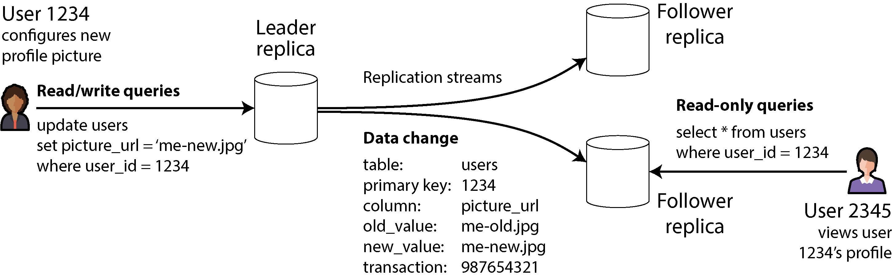
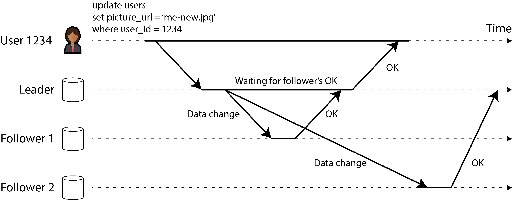

# Replication

Distributed systems mein **Replication** ka matlab hota hai aik hi data ki bilkul huba-hu (identical) copies ko mukhtalif machines par rakhna, jo network ke zariye aaps mein connected hon.

Douglas Adams ka aik bohot mashhoor jumla hai ke *"Aik aisi cheez jo kharab ho sakti hai aur aik aisi cheez jo kabhi kharab nahi ho sakti, un mein sabsay bada farq yeh hai ke jab kabhi na kharab hone wali cheez galti se kharab ho jaye, toh use repair karna ya us tak pohanchana namumkin ho jata hai."* Distributed systems par bhi yahi baat lagu hoti hai; hum jitna bhi resilient system bana lein, network aur hardware faults aane hi aane hain. Isliye hum replication ka sahara lete hain.

Data ko replicate karne ke **3 bade architectural fawaid (reasons)** hote hain:

* **Latency Kam Karna (Geographical Proximity):** Data ko geographic taur par aapke users ke jitna mumkin ho qareeb rakha jata hai. Agar user Pakistan mein hai, toh request US bhejne ke bajaye qareeb ke server (e.g., Singapore) se serve ki jati hai, jis se app bohot fast chalti hai.
* **High Availability aur Durability (Fault Tolerance):** Agar system ka aik hissa (node) kisi hardware crash ya datacenter ki bijli janay se down ho jaye, toh baqi bache huay nodes bina kisi downtime ke kaam ko sambhal lete hain.
* **Read Throughput ko Scale Out Karna:** Agar system par sudden parhne wali queries (read traffic) ka bohot zyada bojh aa jaye, toh hum replication ke zariye multiple machines khari kar dete hain, jo us traffic ko aaps mein baant (distribute) leti hain.

> **The Core Assumption:** Is poore context mein hum yeh maan kar chal rahe hain ke aapka dataset itna chota hai ke har single machine poore ke poore data ki copy ko apni disk par hold kar sakti hai. Agar data aik machine se bada ho jaye, toh uske liye hum **Sharding (Partitioning)** karte hain, jo hum agay seekhenge.

Agar aapka data kabhi badalta nahi (Static Data), toh replication dunya ka sabsay aasan kaam hai—aik dafa copy karo aur bhool jao. **Replication ki asli mushkil tab shuru hoti hai jab data continuously badal raha ho (Writes aur Updates ho rahe hon).**

Distributed databases mein is badlao ko saare nodes par synch karne ke liye 3 main algorithms ki families use hoti hain, aur poori dunya ke databases inhi teen tareeqon par chalte hain:

1. **Single-Leader Replication**
2. **Multi-Leader Replication**
3. **Leaderless Replication**

In teeno approaches ke apne fayde aur nuksan (trade-offs) hain, jaise yeh chunna ke replication **Synchronous** (foran confirm hone wali) ho ya **Asynchronous** (background mein aahista chalne wali), aur un replicas ko kaise handle kiya jaye jo temporary offline ho chuke hain.

Inhi trade-offs ki wajah se distributed databases mein **Eventual Consistency** (aik na aik waqt data har jagah barabar ho jana) ka concept paida hota hai, jo aksar developers ko confuse karta hai. Is lag/delay ko manage karne ke liye hum agay chal kar *Read-Your-Writes* aur *Monotonic Reads* jaisi strict guarantees ko deeply breakdown karenge.

---

```plaintext
[ Master/Leader Node (Write) ] ---> Synchronous Sync ---> [ Follower Node 1 (Read) ]
              |
              +------------------> Asynchronous Sync ----> [ Follower Node 2 (Read) ]

```

### Comprehensive Diagram Explanation

Is basic dataflow diagram mein single-leader replication ka core model dikhaya gaya hai. Jab client koi naya data write karta hai, toh wo hamesha `Master/Leader Node` par jata hai. Leader node us naye write ko baqi nodes tak pohanchane ke liye do tareeqay chun sakta hai: `Follower Node 1` ko wo strictly real-time (**Synchronous**) data bhejta hai, yaani jab tak node 1 haan nahi kahega, write complete nahi mana jayega. Jabke `Follower Node 2` ko background mein (**Asynchronous**) data copy kiya jata hai, jis se leader par load kam hota hai par node 2 par thoda replication lag/delay aa sakta hai.

---

## Backups and Replication

Aksar developers ke dimaag mein aik sawaal aata hai: *"Agar hamare paas data ki multiple copies (Replicas) maujud hain jo har waqt live chal rahi hain, toh kya humein alag se Backups rakhne ki zaroorat hai?"* Writer iska bohot saaf jawab deta hai: **Haan! Backup aur Replication do bilkul alag maqsad ke liye banaye gaye hain, aur dono aik doosre ka badal nahi hain.**

Chaliye inke farq aur rishte ko bilkul bacho ki tarah breakdown karke samajhte hain:

* **Replication ka Kaam (Real-time Mirror):** Replication ka maqsad yeh hai ke jaise hi aik node par koi write operation ho, wo miliseconds ke andar baqi saare live nodes par copy ho jaye. Yeh live system ki availability barkarar rakhne ke liye hota hai.
* **Backup ka Kaam (Time Machine):** Backup ka maqsad data ke purane snapshots (historical history) ko kisi safe jagah save karna hota hai, taake aap waqt mein piche (go back in time) ja sakein.

### The Fatal Threat: Accidental Deletion (Galti se data delete hona)

Farz karein aapki application ke production database par aik junior developer se galti se aik destructive command chal jati hai: `DROP TABLE Users;` ya saare users ka data update ho kar kachra ban jata hai.

* **Replication ka Behavior:** Chunke replication ka kaam hi updates ko har jagah foran phejna hai, wo is destructive command ko aik jhatkay mein saare live replicas par chala degi. Dekhte hi dekhte data har server se saaf ho jayega! Replication aapko is inshani galti (human error) se nahi bacha sakti.
* **Backup ka Behavior:** Is tabahi ke waqt aapka backup aapki jaan bachayega. Aap raat ke 12 baje liye gaye purane backup snapshot ko uthayenge aur database ko dobara us purani sahi state par restore kar lenge.

### Ek Doosre ke madat (How they complement each other)

Production architectures mein backups aur replication aaps mein mil kar kaam karte hain:

1. **Bootstraping New Followers:** Jab aapko system mein aik bilkul naya khali replica node add karna hota hai, toh aap live database par load dalne ke bajaye aik purane consistent backup snapshot se data utha kar us naye node par load karte hain, aur phir bacha hua fresh data replication log se sync karwa lete hain.
2. **Archiving Logs for Backup:** Databases ke andar behne wale replication change logs ko archive karke dur-daraz ke storage mein save karna hi backup process ka hissa hota hai.

### Storage aur Cost Optimization Rule

Kuch modern databases memory ke andar hi purani states ka snapshot sambhal kar rakhte hain (Immutable Snapshots), jo aik tarah ka internal backup hota hai. Lekin iska bada trade-off yeh hai ke aap barson purana data usi mehnge aur fast primary storage hardware (SSD/NVMe) par rakh rahe hain jahan aapka live database chal raha hai.

Bade systems mein cost optimize karne ka sunehra usool yeh hai ke live production database mein sirf **Current Active State** ko rakha jaye, aur barson purane backup snapshots ko saste Cloud Object Stores (jaise Amazon S3 ya Google Cloud Storage) mein dump kar diya jaye, jo kam accessed data (cold storage) ke liye bohot saste parte hain.

---

## Mockup System Design Scenario (Interview Prep)

### Scenario Context

Aap aik multi-million dollar Fintech Wallet application ke Infrastructure Architect hain. System highly available hona chahiye (zero downtime). Ek din, high traffic ke dauran, aik bug ki wajah se users ka ledger balance database mein randomly overwrite ho jata hai, aur replication ki wajah se wo galat balance Singapore, US aur Europe ke saare nodes par live copy ho jata hai.
*Interviewer aap se poochta hai:* "Aap is catastrophic data corruption se system ko kaise recover karenge? Aur aisa disaster recovery system design karein jo data loss aur downtime dono ko minimum kare."

### Architectural Design Implementation

Hum is disaster recovery challenge ko hal karne ke liye **Point-In-Time Recovery (PITR)** aur **Cross-Region Object Storage Backup** ka decoupled design model apply karenge. Niche iska flow structure diya gaya hai:

```plaintext
[ Corrupted Live DB (All Regions) ] <--- 3. Replays Clean Write-Ahead Logs (Up to 10:59 AM)
                 ^
                 | 2. Restores Base State
+-----------------------------------+
| S3 Cold Storage (Backup System)   |
+-----------------------------------+
| Snapshot: 10:00 AM (Base Data)    | <--- 1. Fetch 10:00 AM Backup Snapshot
| Write-Ahead Logs (Continuous)     |
+-----------------------------------+

```

### Comprehensive Architectural Explanation

1. **The Fallacy of Multi-Region Replication:**
Interviewer ko batayein ke chunke data corrupt ho chuka hai aur replication ne use global level par phela diya hai, live failover nodes par shift karne ka koi faida nahi hoga kyunke har jagah kachra data copy ho chuka hai. Live systems ko foran read-only mode par dalna padega.
2. **Point-In-Time Recovery (PITR) Execution:**
Hum production database ko bilkul shuru se khara karne ke liye do cheezein utilize karenge jo Object Storage (S3) mein hourly back up ho rahi thin:
* **Base Snapshot:** Hum disaster se theek pehle ka sasta base snapshot (e.g., 10:00 AM ka snapshot) primary database par restore karenge. Ab database 10:00 AM ki state par aa gaya.
* **Write-Ahead Log (WAL) Replay:** Database engine ke paas aik sequence log hota hai jisme har transaction ka record hota hai. Hum 10:00 AM se lekar exact 10:59 AM (corrupted bug chalne se exact aik second pehle) tak ke saare transaction logs ko database par dobara **Replay** karenge.


3. **The Clean State Recovery:**
Is execution ke nateeje mein database bina kisi data corruption ke exact 10:59 AM par zinda ho jayega. Live replication engine dobara chalte hi is saaf aur correct data ko baqi saare regions (US, Europe) mein push kar dega, aur system bina bade data loss ke safely recover ho jayega.

---

## Quick Revision & Key Takeaways

* **Core Summary:** Replication ka maqsad live system ko latency, availability aur read scaling faraham karna hai jabke data change ko dynamic sync karna iska sabsay bada challenge hai. Backup ka maqsad history mein piche ja kar galti se delete ya corrupt huay data ko dubara zinda karna hota hai.
* **The Architectural Rule:** Kabhi bhi replication ko backup ka badal mat samjhein. Replication aapko hardware failure se bacha sakti hai lekin human validation errors, application bugs, ya accidental data drops se sirf continuous backup snapshots hi bacha sakte hain.
* **Flash-Card Points:**
* **Replication Latency:** Data ko user ke physical location ke qareeb rakh kar network delay ko kam karna.
* **Data Outlives Code Assumption:** Is chapter mein dataset itna chota mana gaya hai ke har single machine poore database ki copy ko hold kar sake.
* **Accidental Propagation:** Replication system live updates ko copy karta hai, isliye agar production par data drop ho jaye toh wo replicas se bhi foran delete ho jata hai.
* **Cold Object Store Optimization:** Mehnge primary database storage par load kam karne ke liye purane historical backups ko saste, kam accessed storage (jaise Amazon S3) mein archive karna.

---

## Single-Leader Replication

Distributed systems mein jab hum data ki miltiple copies alag-alag machines par rakhte hain, toh un machines ko **Replica** kaha jata hai. Lekin yahan aik sab se bada sawal yeh paida hota hai ke hum yeh kaise pakka (ensure) karein ke jo data aik machine par write hua hai, wo baqi saare replicas par bhi sahi salamti se pohanch jaye?

Agar har replica ka data bilkul aik jaisa rakhna hai, toh har write query ko har single replica par chalna padega. Is masle ko hal karne ka sabsay aam aur mashhoor tareeqa **Leader-Based Replication** (jise Primary-Backup ya Active/Passive Replication bhi kehte hain) hai. Yeh nizam teen bacho jaise aasan steps par chalta hai:

1. **The Leader (Sardar Node):** System mein maujud saare replicas mein se aik node ko **Leader** (Primary ya Source) ghoshit (designate) kar diya jata hai. Jab bhi kisi client ko database mein koi naya data likhna (Write) ya badalna (Update/Delete) ho, toh wo apni request strictly sirf aur sirf leader node ko bhej sakta hai. Leader us data ko pehle apne local storage (disk) par write karta hai.
2. **The Followers (Cheelay Nodes):** Baqi saare nodes ko **Followers** (Read Replicas, Secondaries, ya Hot Standbys) kaha jata hai. Jab bhi leader apne paas koi naya data write karta hai, wo us badlao ko aik **Replication Log ya Change Stream** (tabdeeli ka rasta) ki shakl mein apne saare followers ko network par bhej deta hai. Har follower us log ko parhta hai aur bilkul usi exact order (tartoob) mein un writes ko apne local database par apply karta jata hai jis order mein leader ne execute kiya tha.
3. **Read/Write Rules:** Clients jab bhi database se data parhna (Read) chahein, wo leader ya kisi bhi follower se parh sakte hain. Lekin naya data likhne (Write) ki izazat sirf aur sirf leader ke paas hoti hai. Followers clients ke liye strictly **Read-Only** hote hain.

Agar aapka database **Sharded (Partitioned)** hai, yaani data ke baray baray hissay kiye huay hain, toh har single shard ka apna aik makhsoos leader hota hai. Ho sakta hai Shard A ka leader Machine 1 par ho aur Shard B ka leader Machine 2 par, lekin har shard ke paas aik waqt mein sirf aik hi active leader node ho sakta hai.

### Real-World Technology Usage

Yeh single-leader model distributed systems ki dunya mein har jagah raaj kar raha hai. Yeh relational databases (PostgreSQL, MySQL, Oracle Data Guard, SQL Server Always On) ka built-in feature hai. NoSQL document databases (MongoDB, DynamoDB) aur message brokers (Apache Kafka) bhi isi par chalte hain. Hatta ke modern automatic leader election consensus protocols (jaise Raft jo CockroachDB, TiDB, aur etcd mein use hota hai) bhi isi single-leader paradigm par base karte hain.

---

### Figure 6-1 ka Deep Breakdown

<div align="center">
  
</div>

Chaliye ke architectural graph ko step-by-step aur component level par poori bareeki se samajhte hain:

```plaintext
[ User 1234 ] ---> (Writes: picture_url='me-new.jpg') ---> [ Leader Replica ]
                                                                   |
                                          +------------------------+ (Fires Stream)
                                          |
                                          v
                                  [ Data Change Log ]
                                  table:       users
                                  primary key: 1234
                                  column:      picture_url
                                  old_value:   me-old.jpg
                                  new_value:   me-new.jpg
                                  transaction: 987654321
                                          |
                     +--------------------+--------------------+
                     |                                         |
                     v                                         v
            [ Follower Replica 1 ]                    [ Follower Replica 2 ]
                                                               ^
                                                               | (Read-Only Query)
                                                      [ User 2345 ]

```

#### Comprehensive Components Explanation:

* **The Write Transaction:** Bai'n (left) taraf **User 1234** apni profile picture badal raha hai. App SQL query chalati hai: `UPDATE users SET picture_url = 'me-new.jpg' WHERE user_id = 1234;`. Yeh write query seedha **Leader Replica** par land karti hai.
* **The Data Change Log Struct:** Leader is query ko chala kar local disk par save karta hai aur aik structured binary packet generate karta hai jise diagram mein **Data Change** dikhaaya gaya hai. Is packet mein metadata hota hai:
* `table`: `users` (kis table mein tabdeeli hui).
* `primary key`: `1234` (kis record ko chheda gaya).
* `column`: `picture_url` (kaun sa field badla).
* `old_value`: `me-old.jpg` (purana data kya tha).
* `new_value`: `me-new.jpg` (naya data kya save hua).
* `transaction`: `987654321` (unique log ID).


* **The Replication Streams:** Leader is data change packet ko network pipes ke zariye upar aur neechay mojud dono **Follower Replicas** ki taraf push kar deta hai. Followers is log ko dekh kar apne paas data update kar lete hain.
* **The Read Path:** Da'in (right) taraf **User 2345** jab User 1234 ki profile open karta hai, toh uski `SELECT *` read query leader par load dalne ke bajaye neechay wale **Follower Replica** par chali jati hai. Is tarah leader par se read ka bojh hat jata hai.

---

## Synchronous Versus Asynchronous Replication

Distributed database design ka aik bohot hi critical theoretical aspect yeh taye karna hai ke data leader se followers tak **Synchronously** (foran pakka ho kar) jaye ya **Asynchronously** (background mein aaram se) jaye.

### Figure 6-2  ka Timing Breakdown

<div align="center">
  
</div>
mein timing charts ke zariye dono replication types ka aaps mein muqabla dikhaya gaya hai. Chaliye is timing flow ko step-by-step dekhte hain:

1. **Client to Leader Call:** User 1234 profile picture update ki request bhejta hai. Leader ko request milti hai aur wo data change process karta hai.
2. **The Synchronous Flow (Follower 1):** Leader data change ka packet **Follower 1** ko bhejta hai. Followers 1 use apni disk par write karta hai aur leader ko wapas **`OK`** (confirmation) signal bhejta hai. Diagram mein aap dekh sakte hain ke leader ne tab tak user ko **`OK`** ka response nahi bheja jab tak Follower 1 ka confirmation nahi aa gaya. Is duration ko diagram mein **"Waiting for follower's OK"** dikhaya gaya hai.
3. **The Asynchronous Flow (Follower 2):** Parallel mein, leader wahi data change packet **Follower 2** ko bhi bhejta hai, lekin is dafa leader uske reply ka **wait nahi karta** (non-blocking). Leader Follower 1 se `OK` milte hi user ko kamyabi ka signal bhej deta hai. Diagram ke aakhir mein mojud lambi tirchi line (substantial delay) yeh dikhati hai ke Follower 2 ne network congestion ya kisi aur wajah se kafi der baad ja kar us message ko process kiya aur apna `OK` leader tak pohanchaya.

---

### Synchronous Replication ke Theoretical Trade-offs

* **Fawaid (Pros):** Iska sabsay bada faida data consistency aur safety hai. Follower 1 ke paas har lamhe bilkul up-to-date data hota hai jo leader se 100% match karta hai. Agar leader achanak crash ho jaye ya uski hardware tabah ho jaye, toh hum aankhein band karke Follower 1 ko naya leader bana sakte hain kyunke aik bit ka data bhi loss nahi hua.
* **Nuksanat (Cons):** Iska nuksan system ki availability par parta hai. Agar Follower 1 crash ho jaye, ya network wire toot jaye, toh leader naye writes process **nahi kar sakega**. Leader block ho jayega aur waiting state mein baith jayega jab tak synchronous replica wapas zinda nahi hota. Poora system grind ho kar ruk jayega.

### Asynchronous Replication ke Theoretical Trade-offs

* **Fawaid (Pros):** Leader bilkul aazad hota hai. Chahe saare followers network problem ki wajah se ghanton piche (replication lag) kyun na chale जाएं, leader bina ruke high throughput ke sath naye writes confirm karta rehta hai.
* **Nuksanat (Cons):** Durability kamzoor ho jati hai. Agar user ko `OK` milne ke baad aur Follower 2 tak data pohanchne se pehle leader ka hardware fail ho jaye, toh wo un-replicated writes **hamesha ke liye gum (lost)** ho jayenge. Client ko laga data save ho gaya, par asal dunya mein wo gayab ho chuka hota hai.

---

### In-Practice Configurations: Semi-Synchronous & Quorums

Production environments mein operational simplicity aur data safety ko balance karne ke liye do darmiyanay raste (hybrid models) nikale jate hain:

```plaintext
[ Client Write ] ---> [ Leader ] === (Strict Sync Waiting) ===> [ Follower 1 (Sync Node) ]
                          |
                          +.......... (Background Async) .......> [ Follower 2 (Async Node) ]
                          |
                          +.......... (Background Async) .......> [ Follower 3 (Async Node) ]

```

#### 1. Semi-Synchronous Architecture

Saare followers ko synchronous rakhna bewaqufi hai kyunke aik node down hone se poora system baith jayega. Isliye real-world databases mein **Semisynchronous** pattern use hota hai:

* Poore cluster mein sirf **aik follower ko synchronous** rakha jata hai aur baqi sab ko asynchronous.
* Agar wo synchronous follower down ya slow ho jaye, toh topology management engine automatically kisi aik asynchronous follower ko pakad kar use synchronous mein **promote** kar deta hai.
* Yeh guarantee deta hai ke data kam az kam do active nodes (Leader + One Follower) par har waqt surakshit mojud hai.

#### 2. Quorum-Based Majority Pattern

Consensus protocols (jaise Raft/Paxos) mein majority quorum ka rule chalta hai. Agar aapke paas 5 replicas hain, toh leader naye write ko tabhi successful declare karega jab kam az kam **3 out of 5 nodes** (including the leader) us write ko synchronously confirm kar dein. Baqi bache huay 2 nodes background mein asynchronously sync hote rehte hain.

---

## Mockup System Design Scenario (Interview Prep)

### Scenario Context

Aap aik high-scale Photo Sharing Application (jaise Instagram) ka data tier design kar rahe hain jahan har second hazaron users photos upload (Write) karte hain aur millions of users unhein timeline par dekhte (Read) hain.
*Interviewer aap se poochta hai:* "Agar hum 10 distributed read replicas lagate hain aur un sab ko fully synchronous configure kar dete hain taake data strict consistent rahe, toh high availability aur performance par kya asar parega? Aur as an architect aap is system ko gRPC endpoints ke sath kaise optimize karenge?"

### Architectural Design Implementation

Hum is architecture ko completely synchronous rakhne ke bajaye **Semi-Synchronous Leader-Based Edge Topology** par design karenge taake scaling aur safety dono achieve hon.

```plaintext
[ Client Mobile App ] ---> POST /upload_photo ---> [ API Gateway (gRPC Router) ]
                                                            |
                                                   (Directs Write Only)
                                                            v
                                                   [ Shard 1 Leader Node ]
                                                   (Writes Local Log)
                                                            |
                             +------------------------------+------------------------------+
                             | (Strict Sync Block)                                         | (Async Change Stream)
                             v                                                             v
                  [ Follower 1 (Sync Replica) ]                                 [ 9 Asynchronous Followers ]
                  (Confirms Write to Leader)                                    (Serve Global Read Traffic)

```

### Comprehensive Architectural Explanation

1. **Why 10 Synchronous Followers is a Disaster:**
Interviewer ko batayein ke agar 10 ke 10 replicas synchronous kar diye gaye, toh system ka write throughput aur availability zero ke qareeb pohanch jayegi. Probability ke mutabaq, 10 distributed nodes mein se network jitter ya garbage collection pause ki wajah se har dusre second koi na koi node slow hoga. Leader har write par us slowest node ke liye block hoga, jis se saare clients ke uploads timeout ho jayenge.
2. **The Optimized Production Architecture:**
* **The Dynamic Routing:** Hum API gateway par gRPC client stubs use karenge jo user ke upload traffic ko strictly direct karenge `Shard 1 Leader Node` ki taraf.
* **The Deployment Model:** Hum database configuration mein **Semisynchronous** mode active karenge. Leader sirf `Follower 1` ke `OK` ka wait karega. Jaise hi Follower 1 acknowledge karega, user ko image uploaded ka response mil jayega (Latency drops drastically).
* **The Scale-Out Strategy:** Baqi bache huay **9 Asynchronous Followers** par global timelines ka bhari read traffic divert kar diya jayega. Agar replication lag ki wajah se kisi user ko photo 500 miliseconds baad bhi dikhe, toh wo business logic ke mutabaq acceptable trade-off hai, lekin system completely crash-proof aur highly available ho jayega.


---

## Quick Revision & Key Takeaways

* **Core Summary:** Single-leader replication mein saare writes aik sardar node (Leader) par jate hain jo data change log stream ke zariye followers ko sync karta hai. Synchronous replication strict consistency deti hai par availability tabah karti hai, jabke asynchronous replication high speed deti hai par leader fail hone par data loss ka khatra lati hai.
* **The Architectural Rule:** Distributed systems mein scalability aur resilience ke liye kabhi bhi saare nodes ko synchronous lock mat karein. Hamesha **Semisynchronous (1 Sync + N Async)** ya **Majority Quorum (3 out of 5)** ka architectural pattern deploy karein.
* **Flash-Card Points:**
* **Replica:** Database ki identical copy hold karne wali individual network machine.
* **Replication Log (Change Stream):** Leader par badalne wale data ke metadata aur values ka sequence packet (table, PK, old/new values).
* **Semisynchronous Configuration:** Data loss se bachne ka hybrid model jahan kam az kam do nodes par data har waqt real-time synced rehta hai.
* **Replication Lag:** Asynchronous followers ka leader ke naye data se seconds ya minutes piche reh jane ka network duration time delay.

---

## Setting Up New Followers

Distributed systems mein waqt ke sath-sath naye follower nodes ko setup karna parta hai. Iski do barhi wajoohat hoti hain: ya toh humein read traffic ko scale karne ke liye replicas ki sankhya (number) barhani hoti hai, ya phir kisi fail huay (crash) node ko replace karna hota hai. Lekin sawal yeh hai ke hum naye follower ko leader ke data ka bilkul accurate aur naya copy kaise dein?

Kuch log sochte hain ke leader ki database files ko copy karke naye node par paste kar dena kaafi hoga. Lekin real-world production mein yeh tarika bilkul **nakam** ho jata hai. Iski wajah bilkul bacho jaisi sadah hai: jab aap files copy kar rahe hote hain, clients ussi waqt leader par continuously naya data write kar rahe hote hain. Data har millisecond badal raha hota hai (always in flux). Agar aap standard file copy karenge, toh database ka aik hissa kisi aur waqt ka copy hoga aur doosra hissa kisi aur waqt ka, jis se poora data corrupt aur be-ma'ni (nonsense) ho jayega.

Is masle ka aik hal yeh ho sakta hai ke hum database ko **Lock** kar dein (yaani kuch der ke liye naye writes band kar dein) aur phir files copy karein. Lekin agar humne writes hi band kar diye, toh hamara **High Availability** ka maqsad hi khatam ho jayega. Khush-qismati se, modern databases bina kisi downtime ke naye follower ko setup karne ka feature dete hain. Conceptually, yeh poora architectural flow 4 steps mein kaam karta hai:

1. **Consistent Snapshot:** Pehle step mein leader database ka aik **Consistent Snapshot** (aik makhsoos lamhe ki poori copy) liya jata hai, bina poore database ko lock kiye. Zyadatar databases mein yeh backup feature built-in hota hai, aur kuch mein teesri-party tools (jaise MySQL ke liye *Percona XtraBackup*) ka sahara liya jata hai.
2. **Copying the Snapshot:** Is snapshot file ko network ke zariye naye follower node par copy kar ke restore kiya jata hai.
3. **Log Position Sync (The Catch-up Marker):** Yeh sabsay critical step hai. Jab snapshot liya jata hai, toh uske sath leader ke **Replication Log** ki aik exact position (address) ko note kar liya jata hai.
* **PostgreSQL** mein is address ko **LSN (Log Sequence Number)** kehte hain.
* **MySQL** mein ise **Binlog Coordinates** ya **GTID (Global Transaction Identifier)** kaha jata hai.
Naya follower leader se connect hota hai aur kehta hai: *"Mere paas falay LSN/GTID tak ka data snapshot mein aa chuka hai, mujhe iske baad ke saare badlao (changes) do."*


4. **Caught Up Phase:** Follower snapshot ke baad se lekar ab tak ka saara backlog data process karta hai. Jab wo saare changes apply kar leta hai, toh hum kehte hain ke follower **Catch up** kar chuka hai. Ab wo leader ke sath live sync mein aa jata hai aur naye incoming writes ko real-time process karne lagta hai.

Bohot se modern systems mein yeh process fully automated hota hai, jabke kuch purane systems mein database administrator (DBA) ko haath se mukhtalif commands chalani parti hain. Log is kaam ke liye backup tools (jaise PostgreSQL ke liye `WAL-G` ya SQLite ke liye `Litestream`) ka use karte hain jo snapshots aur replication logs ko Amazon S3 jaisay cloud object stores par save karte rehte hain, jahan se naya follower direct data download kar sakta hai.

---

### Follower Setup & Catch-up Lifecycle Diagram

Naye follower node ko bina downtime ke khara karne aur leader ke sath sync karne ke data flow ko is plaintext diagram se samjhein:

```plaintext
[ Leader Node ] -- 1. Triggers Snapshot (At LSN: 5000) --+
       |                                                 |
       | (Continuous Writes: LSN 5001 -> 5500)           v
       |                                       [ Consistent Snapshot File ]
       |                                                 |
       |                                                 | 2. Network Transfer
       |                                                 v
       | <--- 3. Connects & Requests Logs from LSN 5000 -- [ New Follower Node ]
       |                                                 |
       +----- 4. Sends Backlog Logs (5001 to 5500) ----> | (Applies Backlog)
                                                         |
                                                         v
                                              [ Status: CAUGHT UP (Live) ]

```

#### Comprehensive Diagram Explanation:

1. **Snapshot Generation:** Jab leader par naye writes chal rahe hote hain, system background mein point-in-time snapshot leta hai. Farz karein us lamhe log ka sequence number **LSN: 5000** tha. Snapshot mein sirf 5000 tak ka data save hoga.
2. **Follower Initialization:** Yeh snapshot file network ke zariye transfer ho kar `New Follower Node` par load hoti hai. Jab tak yeh transfer chal raha hota hai, leader par mazeed writes aate hain aur LSN 5500 tak pohanch jata hai.
3. **The Sync Request:** Follower active hotay hi leader ko request bhejta hai aur apna checkpoint marker (LSN: 5000) batata hai.
4. **Log Replay & Live Status:** Leader LSN 5001 se 5500 tak ka saara backlog stream karta hai. Follower unhein execute karke leader ke bilkul barabar (`Caught Up`) ho jata hai.

---

## Databases Backed by Object Storage

Cloud computing ke is daur mein **Object Storage** (jaise Amazon S3, Google Cloud Storage, ya Azure Blob Storage) ka istemal sirf purane data ko archive ya backup karne tak makhsoos nahi raha. Aaj ke modern distributed databases live user queries ko serve karne ke liye direct object stores ka use kar rahe hain. Live database tier mein object storage lagane ke **4 bade fawaid (benefits)** hote hain:

* **Intahai Sasta (Inexpensive):** Cloud block storage (EBS) ya local NVMe/SSD ke mukable mein object storage bohot sasta parta hai. Cloud databases active working data ko RAM aur SSDs mein rakhte hain aur kam query hone wale historical data ko saste object store par shift kar dete hain.
* **Global High Durability:** Object stores cloud providers ke zariye automatically multi-zone ya multi-region replicate hote hain, jis se unki durability guarantees zaroorat se zyada high hoti hain aur databases ka apna replication overhead aur inter-zone network fees khatam ho jati hain.
* **Conditional Writes for Leadership:** Object stores aik feature dete hain jise **Conditional Write / Compare-And-Set (CAS)** kehte hain. Iska matlab hai ke data tabhi write hoga agar wo pehle se tabdeel na hua ho. Databases is feature ka use karke distributed system ke andar split-brain ko rokte hain aur Leader Election karwate hain.
* **Easy Data Integration:** Agar aapka data S3 par open formats (jaise Apache Parquet ya Apache Iceberg) mein para hai, toh doosri analytics ya Data Warehouse systems (jaise Snowflake, BigQuery) bina kisi heavy data pipeline ke us data ko direct query kar sakte hain.

### The Trade-offs & Challenges (Is nizam ke nuksanat aur muqabla)

Lekin object storage jadu nahi hai, iske sath 4 baray architectural challenges aate hain:

1. **High Latency:** Local disk (SSD) ke mukable mein S3 par read/write latency bohot high hoti hai.
2. **API Call Fees:** Cloud providers har read/write API call par paise charge karte hain. Is cost se bachne ke liye database ko chote chote writes ke bajaye **Batching** (bohot saare writes ko aik sath jod kar bhejni) karni parti hai, jo latency ko mazeed barha deti hai.
3. **Immutability (Na-tabdeel hone wali files):** Object store mein save hone wali files immutable hoti hain. Agar aapko aik barhi file ke darmiyan mein aik chota sa random write/update karna hai, toh aap file badal nahi sakte. Aapko poori barhi file dubara rewrite karni paregi jo bohot resource-intensive kaam hai.
4. **Non-POSIX Interface:** Object stores standard filesystem interfaces support nahi karte (yaani aap standard file paths use nahi kar sakte). Log iske liye `FUSE` (Filesystem in Userspace) drivers use karke S3 bucket ko mount toh kar lete hain, lekin un mein POSIX standards (jaise nonsequential random writes ya symlinks) missing hote hain jo database systems ke liye lazmi hote hain.

### Modern Solutions: Tiered Storage vs Zero-Disk Architecture (ZDA)

In trade-offs se nipatne ke liye modern cloud-native systems do tarah ke designs apnate hain:

* **Tiered Storage Architecture:** Naya aur high-frequency hot data fast local NVMe/SSD ya RAM mein rakha jata hai, aur jaise hi data thoda purana (cold) hota hai, use automatic background mein object store par dhakel diya jata hai.
* **Zero-Disk Architecture (ZDA - Sunehra Nizam):** Yeh bilkul modern paradigm hai jahan database nodes ke paas **apna koi persistent state/disk hota ہی nahi**. Nodes local disk aur RAM ko sirf aur sirf **Caching** ke liye use karte hain. Saara ka saara core data strictly direct Object Storage par persist hota hai. Iska faida yeh hai ke agar koi node crash ho jaye, toh naya node bina kisi data setup ke milliseconds mein khara ho jata hai kyunke data toh pehle hi S3 par safe para hai. Kafka-compatible modern systems (jaise *WarpStream, Confluent Freight, Bufstream, Redpanda Serverless*) aur modern storage engines (jaise *SlateDB, Turbopuffer*) isi Zero-Disk Architecture par bante hain.

---

### Zero-Disk Architecture (ZDA) vs Traditional Database Tier

ZDA aur purane database architecture ke darmiyan memory aur disk state ke farq ko is plaintext diagram se samajhna asaan ho jata hai:

```plaintext
Traditional Replicated Model:
[ Client ] ---> [ DB Node 1 (Leader) ] ---> Strict Local Disk Write (EBS/NVMe Persistent State)
                        |
                        +---> (Network Sync) ---> [ DB Node 2 (Follower) ] ---> Local Disk Write

Zero-Disk Architecture (ZDA):
[ Client ] ---> [ Stateless Compute Node ] ---> (Ephemeral Cache Only in RAM/SSD)
                             |
                             | (Batched Immutable Writes via CAS)
                             v
               =======================================
               [   Shared Cloud Object Store (S3)    ]  <--- Continuous Source of Truth
               =======================================

```

#### Comprehensive Diagram Explanation:

* **Traditional Model:** Isme har node ka apna aik localized persistent state hota hai. Agar Node 1 fail ho jaye, toh Node 2 ko promote karne aur naya node setup karne mein poora data copy lagta hai.
* **ZDA Model:** Yahan computational node ke paas koi pakka data disk nahi hota. Wo data ko local memory mein temporary cache karta hai aur aik hi jhatkay mein batch bana kar direct `Shared Cloud Object Store (S3)` mein write kar deta hai. Saari transactions aur scaling cloud storage ki layer par decouple ho jati hain, jis se operations intahai simple ho jate hain.

---

## Mockup System Design Scenario (Interview Prep)

### Scenario Context

Aap aik Cloud-Native FinTech Data Platform ke Chief Architect hain. Platform par daily **50 Terabytes** ka data generate hota hai. DevOps team shikayat kar rahi hai ke Amazon EBS (Block Storage) ka monthly bill badhta hi ja raha hai, aur jab bhi traffic spike par database nodes scale out karne hote hain, toh naye nodes ko purana data copy karne mein ghanton lag jate hain (High Bootstrap Latency).
*Interviewer aap se poochta hai:* "Aap database tier ko Zero-Disk Architecture (ZDA) par kaise migrate karenge? Aur object storage ki high latency aur API fees ke trade-offs ko kaise handle karenge?"

### Architectural Design Implementation

Hum is platform ko SlateDB aur WarpStream jaisay design patterns ke mutabaq **Stateless Compute Layer + Immutable Object Storage** par migrate karenge.

```plaintext
[ High-Throughput Ingestion ] ---> [ Stateless Write Worker ] ---> Local NVMe Log Buffer (WAL)
                                              |
                                              | (Flushes 10MB Batches / 50ms)
                                              v
                               +------------------------------+
                               |     Amazon S3 Bucket         |
                               | (Data in Apache Iceberg/Parquet)
                               +------------------------------+
                                              ^
                                              | (Direct Read via Local Cache)
[ Read-Only Analytic Query ] ------> [ Stateless Read Worker ] 

```

### Comprehensive Architectural Explanation

1. **Eliminating Bootstrap Latency via Stateless Nodes:**
Interviewer ko batayein ke ZDA lagane se hamare compute nodes tamamen **Stateless** ho jayenge. Jab bhi traffic badhega, hum naya `Stateless Read/Write Worker` khara karenge. Chunke naye node ko koi purana data local disk par bootstrap/copy nahi karna (kyunke saara data S3 par hai), naya node milliseconds mein live traffic handle karne ke liye tayar ho jayega.
2. **Mitigating High Latency & API Costs via Aggressive Batching:**
Object storage ki API fees aur latency se bachne ke liye hum direct single write nahi karenge. Hum write nodes ke memory mein aik chota local NVMe buffer lagayenge. Code har 50 milliseconds ya 10 Megabytes ka data jama hone par aik **Multipart Upload Batch** chalayega. Is se API calls ki sankhya 99% kam ho jayegi aur cloud cost na ke barabar reh jayegi.
3. **Immutability Resolution using LSM-Trees:**
Random updates ke resource overhead ko hal karne ke liye hum **LSM-Tree (Log-Structured Merge-Tree)** approach use karenge. Naya incoming data hamesha naye immutable object parts mein append hoga. Background mein aik alag asynchronous compression engine chalega jo purane parts ko merge karke kachra clean karta rahega (Compaction). Is tarah user ko local NVMe jaisi fast performance milegi aur billing object storage jaisi sasti ho jayegi.

---

## Quick Revision & Key Takeaways

* **Core Summary:** Naye follower ko setup karne ke liye leader ka live database copy karna corrupt data banata hai, isliye bina downtime ke built-in **Consistent Snapshot** liya jata hai aur **LSN/GTID** coordinates ke zariye bacha hua backlog catch up kiya jata hai. Modern databases block storage ke kharche se bachne ke liye **Zero-Disk Architecture (ZDA)** apna rahe hain jahan direct cloud object storage (S3) ko primary source of truth banaya jata hai.
* **The Architectural Rule:** Jab bhi databases ko network ya S3 layer par decouple karein, hamesha latency aur API calls ke cost trade-off ko counter karne ke liye **In-Memory Batching** aur **LSM-Tree Immutable File Compaction** ka pattern lazmi apply karein.
* **Flash-Card Points:**
* **LSN (Log Sequence Number):** Replication log mein data ke badlao ka exact sequential address pointer marker.
* **Binlog Coordinates / GTID:** MySQL mein naye follower ko sync karne ka catch-up pointer mechanism.
* **Zero-Disk Architecture (ZDA):** Aik aisa infrastructure jahan nodes ke paas koi local persistent disk state nahi hoti, saara data direct S3 par save hota hai.
* **Compare-And-Set (CAS):** Object stores ka conditional write feature jo cluster leader election aur data concurrency control karne mein madad deta hai.

---

## Handling Node Outages

Distributed system mein koi bhi node kisi bhi waqt down ho sakta hai. Yeh achanak kisi fault (hardware failure, power loss) ki wajah se bhi ho sakta hai, aur **Planned Maintenance** (jaise operating system ka security patch daalne ke liye machine ko reboot karna) ki wajah se bhi. System ke operational nizam ko smooth rakhne ke liye yeh bohot bada advantage hai ke hum baqi system ko down kiye bina individual nodes ko reboot kar sakein. Isliye hamara asli goal yeh hota hai ke agar koi node outage (failure) ho bhi jaye, toh pure system par uska asar na ke barabar ho aur **High Availability (HA)** barkarar rahe.

---

## Follower failure: Catch-up recovery

Har follower node apni local disk par ek sakht change log barkarar rakhta hai, jisme leader se aane wali har data tabdeeli (replication stream) save hoti hai. Agar koi follower achanak crash ho jaye aur dobara restart ho, ya phir leader aur follower ke darmiyan network ki taar temporary toot jaye, toh iska recovery process kafi simple aur auto-managed hota hai:

* **The Recovery Logic:** Restart hote hi follower apni local disk ke log ko parhta hai. Use furan pata chal jata hai ke crash hone se pehle usne aakhri transaction kaun si process ki thi. Phir wo leader se network par dubara raabta (connect) karta hai aur kehta hai: *"Main itne duration ke liye offline tha, mujhe is specific transaction ID ke baad ke saare data changes de do."*
* **Backlog Replay:** Leader us gap ka saara data stream naye follower ko bhejta hai. Follower un saare writes ko sequentially apply karta hai, aur jab wo backlog khatam kar leta hai, toh wo leader ke sath live sync mein aa jata hai (it has caught up).

### Performance aur Log Retention ka Bada Dilemma

Bhale hi follower recovery sunne mein simple lagti hai, real-world production mein iske sath do bade **architectural performance bottlenecks** aate hain:

1. **Catch-up Performance Catch:** If the system has high write throughput (yaani database par lagatar bohot tezi se data write ho raha hai) ya follower kafi dino tak offline raha ho, toh catch-up ke dauran aik massive backlog jama ho jata hai. Jab follower recover ho raha hota hai, toh leader par data send karne ka aur follower par data execute karne ka **CPU aur Network load** drastically barh jata hai, jo live user queries ko slow kar sakta hai.
2. **The Leader's Storage Dilemma:** Leader apne change logs ko tabhi safely delete kar sakta hai jab saare followers confirm kar dein ke unhone data read kar liya hai. Lekin agar aik follower lambe arse tak gayab rahe, toh leader ke paas do mushkil raste hote hain:
* **Option A:** Wo logs ko delete na kare aur follower ka wait kare. Iska khatra yeh hai ke leader ki apni **disk full** ho jayegi aur poora database crash ho jayega.
* **Option B:** Leader logs ko delete kar de. Iska nuksan yeh hoga ke jab purana follower wapas aayega, toh wo log se catch up nahi kar payega. Use dubara zinda karne ke liye humein poora data snapshot (backup) shuru se load karna padega, jo bohot expensive operation hai.


---

## Leader failure: Failover

Follower node ka girna aasan tha, lekin **Leader Node ka crash hona intahai mushkil aur pechida (tricky) challenge hai**. Agar leader fail ho jaye, toh system mein naye writes aana band ho jayenge. Is tabahi se bachne ke liye humein aik upgraded process chalana parta hai jise **Failover** kehte hain. Failover mein:

* Kisi aik follower node ko promote karke naya leader banaya jata hai.
* Saare clients ko reconfigure kiya jata hai taake wo naye writes naye leader ko bhejein.
* Baqi bache huay followers ko bataya jata hai ke ab se wo purane leader ke bajaye naye leader ke change stream ko consume karein.

Failover ka kaam haath se (manually) bhi kiya jata hai (jahan admin ko alert jata hai aur wo manually commands chalata hai) ya phir tools ke zariye **Automatically** hota hai. Ek automatic failover nizam standard taur par in 3 steps par chalta hai:

1. **Failure Detection (Heartbeat Timeout):** Nodes aapas mein continuously chote messages (ping/pong) bhejte rehte hain. Agar leader node kisi makhsoos duration (jaise 30 seconds) tak koi jawab na de, toh system use murda (dead) tasawwur kar leta hai. *(Agar planned maintenance ho toh yeh rule apply nahi hota kyunke leader shutdown hone se pehle safely apni leadership doosre node ko handoff kar deta hai).*
2. **Choosing a New Leader (The Consensus Problem):** Baqi bache huay healthy replicas aapas mein aik election algorithm chalate hain (ya phir aik centralized controller node naya leader appoint karta hai). Sabsay behtareen candidate wo follower hota hai jiska data leader se sabsay zyada synced ho (highest Log Sequence Number - LSN), taake data loss minimum ho. Saare nodes ka aik naye leader par razi hona aik **Consensus Problem** hai.
3. **System Reconfiguration:** Saare clients ke write routers ko naye leader ka IP address pakda diya jata hai. Agar purana leader galti se dubara network par zinda ho jaye, toh system use forced step-down karwata hai aur use naye leader ka follower bana deta hai.

---

### Failover ke 4 Bade Nightmares (Things that go wrong)

Automatic failover software engineering mein sabsay khatarnak operations mein se aik hai. Ismein niche di gayi 4 bari tabahiyan aa sakti hain:

* **The Durability Breach (Unreplicated Writes Loss):** Agar system mein *asynchronous replication* chal rahi thi, toh leader fail hone se exact pehle jo naye writes followers tak nahi pohanchaye ja sakay the, wo purane leader ke paas hi reh gaye. Jab naya leader banta hai, toh wo un missing writes ke bina hi naya data accept karna shuru kar deta hai. Agar purana leader dubara network par aata hai, toh uske un-replicated writes ko **discard (delete)** kar diya jata hai. Iska matlab hai ke client ko jo write `SUCCESS` mila tha, wo asal mein durable nahi tha aur gayab ho gaya.
* **The Cross-System Inconsistency (GitHub Case Study):** Data discard karna tab tabah-kun sabit hota hai jab database ke bahar koi aur caching tier (jaise Redis) chal raha ho.
> **Real-World Incident (GitHub):** GitHub par ek aisa hi incident hua jahan ek out-of-date MySQL follower ko galti se leader bana diya gaya. MySQL naye rows ko primary key dene ke liye aik autoincrementing counter use karta tha. Chunke naya leader data mein piche tha, uska counter purane leader se piche reh gaya tha. Usne naye rows ko dubara wahi primary keys assign karna shuru kar dein jo purana leader pehle hi kisi aur data ko de chuka tha. Yeh primary keys external Redis store mein bhi mapping ke liye use ho rahi thin. Nateeja yeh nikala ke primary keys ke reuse hone ki wajah se database aur Redis out-of-sync ho gaye, aur **kuch users ka private data galti se bilkul galat users ko screen par show ho gaya!**


* **The Split-Brain Catastrophe:** Yeh distributed systems ki sabsay khofnak bimari hai. Network partition ki wajah se ho sakta hai ke purana leader aur baqi followers aapas mein baat na kar sakein. Followers samjhenge leader marr gaya aur wo naya leader chun lenge. Lekin purana leader zinda hoga aur wo sochega main hi king hoon. Ab system mein **do active leaders** ban jayenge aur dono clients se writes accept kar rahe honge. Agar inke conflicts ko resolve na kiya jaye, toh poora database data corruption ka shikar ho jata hai. Is se bachne ke liye **Fencing (Fencing/STONITH)** mechanisms se purane leader ko goli maari jati hai (shut down kiya jata hai).
* **The Timeout Calibration Dilemma:** Heartbeat timeout taye karna aik makhsoos talmel (balance) chahta hai. Agar timeout bohot lamba rakhenge, toh failover der se hoga aur system itni der tak down rahega. Agar timeout zaroorat se zyada chota (short) rakh diya, toh network mein achanak traffic spike ya temporary delay aane par system galti se chalte huay leader ko dead samajh kar **unnecessary failovers** trigger kar dega, jo chalte huay load ko mazeed tabah kar dega.

---

### Core Core Failover aur Reconfiguration Flow

Leader failure ke baad naye leader ke election aur client redirection ke data flow ko is plaintext diagram se samjhein:

```plaintext
[ Healthy Client ] ---> (Tries Write) ---> [ Crashed Leader (No Response) ]
                                                       |
                                            (Timeout Triggered: 30s)
                                                       v
                                          [ Consensus Election Tier ]
                                  (Selects Follower with Highest LSN / Sync)
                                                       |
                                                       v
[ Healthy Client ] <--- 2. Updates Routing 계약 --- [ New Leader Elected ]
       |                                                |
       +--------------- 3. Sends New Writes ----------->| ---> 4. Replicates Data
                                                        |
                                                        v
                                             [ Follower 2 (Redirected) ]

```

#### Comprehensive Diagram Explanation:

1. **The Timeout Trigger:** Client jab `Crashed Leader` par write bhejta hai, toh use response nahi milta. System ka internal monitoring engine 30 seconds ka timeout detect karke `Consensus Election Tier` ko trigger karta hai.
2. **The Democratic Election:** Replicas aapas mein votes calculate karte hain aur sabsay highest data sequence wale node ko `New Leader` elect kar lete hain.
3. **The Routing Flip:** Client ka network proxy router naye leader ke IP par flip ho jata hai aur naye incoming writes safely execute hone lagte hain. Baqi bache huay nodes ko naye leader ke change stream se attach kar diya jata hai.

---

## Mockup System Design Scenario (Interview Prep)

### Scenario Context

Aap aik high-frequency multi-region Crypto Exchange Platform ke Lead Database Engineer hain. System automatic failover par set hai. Ek din network split ki wajah se Asia region aur US region ka aapas mein connection toot jata hai. Asia waala node sochega US wala dead hai aur leadership claim kar lega, jabke US wala pehle se active leader tha. Beide nodes active writes accept karna shuru kar dete hain.
*Interviewer aap se poochta hai:* "Aap is split-brain anomaly ko production tier par aane se kaise rokenge? Aur data integrity bachane ke liye kaun sa fencing pattern implement karenge?"

### Architectural Design Implementation

Hum is stateful catastrophe se bachne ke liye **Lease-Based Fencing Engine (Distributed Locks)** aur **Quorum Majority Validation Pattern** deploy karenge.

```plaintext
                                +---------------------------+
                                | Central Coordinator (etcd)|
                                +---------------------------+
                                  /                       \
                 1. Holds Active /                         \ 2. Denies Lease
                    Lease       v                           v   (No Majority)
         +--------------------------+           +--------------------------+
         |  US Node (Valid Leader)  |           | Asia Node (Blocked Node) |
         +--------------------------+           +--------------------------+
         | Status: Safe to Write    |           | Status: Fenced / Fails   |
         +--------------------------+           +--------------------------+

```

### Comprehensive Architectural Explanation

1. **Implementing Lease-Based Fencing (Distributed Locks):**
Interviewer ko batayein ke split-brain se bachne ke liye leader node ko absolute permanent power nahi di ja sakti. Leader ko aik centralized storage engine (jaise *etcd* ya *ZooKeeper*) se aik temporary **Lease / Lock** lena padega (e.g., for 5 seconds). Leader tabhi tak writes accept karega jab tak uski lease valid hai aur wo use har 2 seconds baad refresh kar raha hai.
2. **Handling the Network Split Execution:**
* **The US Node Flow:** US node ke paas lease mojud hai. Agar network partition aata hai aur Asia node alag ho jata hai, toh US node checking karega: kya uske paas baqi nodes ki majority (Quorum) mojud hai? Agar US node ke sath cluster ke 5 mein se 3 nodes connected hain, toh wo apni lease refresh kar lega aur safely chalta rahega.
* **The Asia Node Isolation:** Asia node jab alag hoga, toh wo dekhega ke uske paas majority quorum (only 2 out of 5 nodes) nahi hai. Wo chah kar bhi naya leader nahi ban sakega kyunke consensus algorithm use naye node validation ki izazat nahi dega.


3. **The Final Safety Catch (Token Fencing):**
Agar purana node galti se disconnected state mein database disk par write karne lagega, toh hum storage layer par aik monotonically increasing token number checking system chalayenge. Storage tier check karega ke naye token number `Token: 42` aa chuka hai, isliye purane leader ke `Token: 41` wale saare requests ko network gateway par hi **Fenced (Reject)** kar diya jayega. Data corruption ka khatra zero ho jayega!

---

## Quick Revision & Key Takeaways

* **Core Summary:** Follower crash hone par local change log aur **LSN** ke zariye leader se backlog maang kar aasan recovery (**Catch-up**) kar leta hai. Leader crash hone par **Failover** process chalta hai jahan naya leader elect hota hai, lekin isme data loss, database counters lag (GitHub incident), aur do leaders ka aik sath zinda ho jana (**Split-Brain**) jaisay bade risk shamil hote hain.
* **The Architectural Rule:** Automatic failover design karte waqt timeout ko zaroorat se zyada chota mat rakhein warna network jitters unnecessary failovers ki tabahi layenge, aur hamesha distributed split-brain se bachne ke liye **Lease Fencing** aur **Quorum Majority** contracts lagayein.
* **Flash-Card Points:**
* **Failover:** Old leader ke crash hone par kisi follower ko master tier par promote karne aur routing badalane ka operation.
* **Split-Brain Anomaly:** Network split ki wajah se aik hi cluster mein do nodes ka khud ko leader samajh baithna aur writes accept karna.
* **Fencing (Fencing Token):** Purane leader ke network requests aur disk writes ko lock coordinate check karke system se block/reject karne ka mechanism.
* **LSN Preference in Election:** Failover ke dauran hamesha us follower ko vote dena jiska log sequence number sabsay high ho taake zero data loss ho.

---