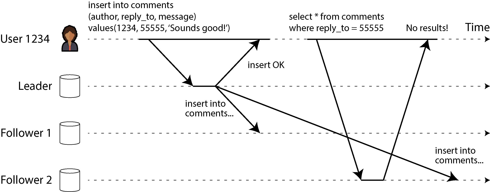
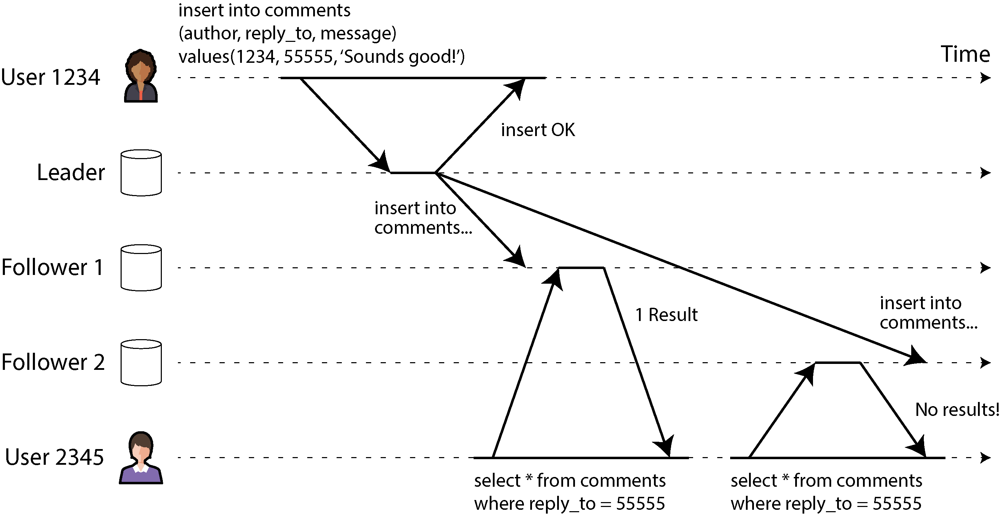
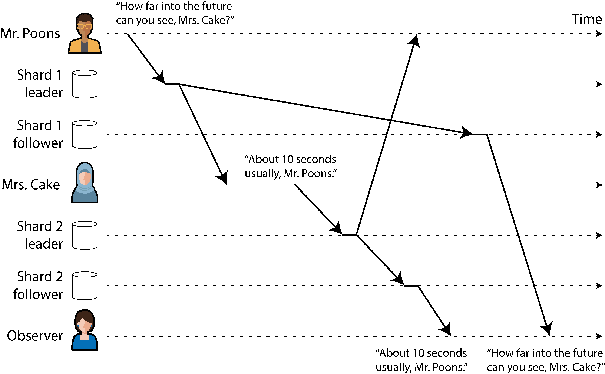
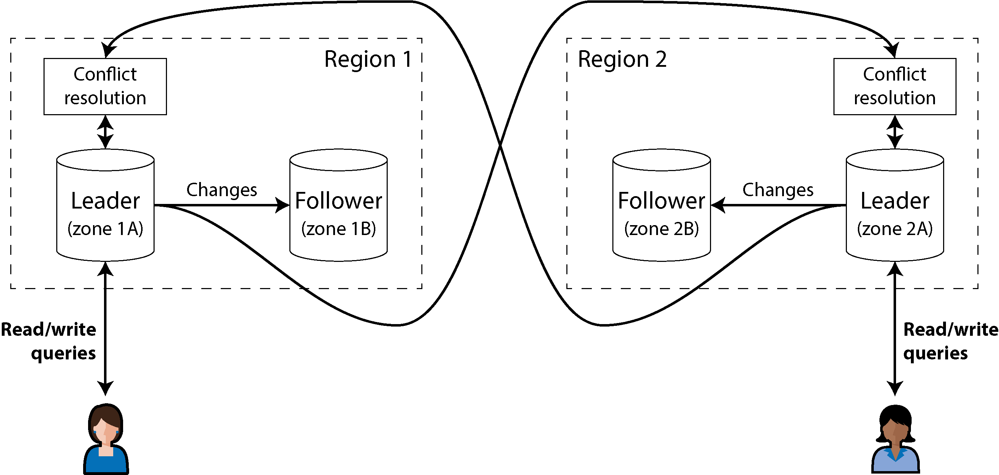
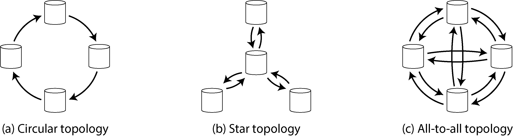
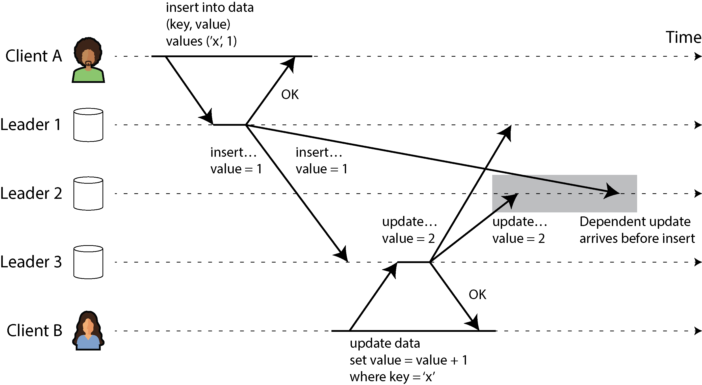

# Replication

Distributed systems mein **Replication** ka matlab hota hai aik hi data ki bilkul huba-hu (identical) copies ko mukhtalif machines par rakhna, jo network ke zariye aaps mein connected hon.

Douglas Adams ka aik bohot mashhoor jumla hai ke *"Aik aisi cheez jo kharab ho sakti hai aur aik aisi cheez jo kabhi kharab nahi ho sakti, un mein sabsay bada farq yeh hai ke jab kabhi na kharab hone wali cheez galti se kharab ho jaye, toh use repair karna ya us tak pohanchana namumkin ho jata hai."* Distributed systems par bhi yahi baat lagu hoti hai; hum jitna bhi resilient system bana lein, network aur hardware faults aane hi aane hain. Isliye hum replication ka sahara lete hain.

Data ko replicate karne ke **3 bade architectural fawaid (reasons)** hote hain:

* **Latency Kam Karna (Geographical Proximity):** Data ko geographic taur par aapke users ke jitna mumkin ho qareeb rakha jata hai. Agar user Pakistan mein hai, toh request US bhejne ke bajaye qareeb ke server (e.g., Singapore) se serve ki jati hai, jis se app bohot fast chalti hai.
* **High Availability aur Durability (Fault Tolerance):** Agar system ka aik hissa (node) kisi hardware crash ya datacenter ki bijli janay se down ho jaye, toh baqi bache huay nodes bina kisi downtime ke kaam ko sambhal lete hain.
* **Read Throughput ko Scale Out Karna:** Agar system par sudden parhne wali queries (read traffic) ka bohot zyada bojh aa jaye, toh hum replication ke zariye multiple machines khari kar dete hain, jo us traffic ko aaps mein baant (distribute) leti hain.

> **The Core Assumption:** Is poore context mein hum yeh maan kar chal rahe hain ke aapka dataset itna chota hai ke har single machine poore ke poore data ki copy ko apni disk par hold kar sakti hai. Agar data aik machine se bada ho jaye, toh uske liye hum **Sharding (Partitioning)** karte hain, jo hum agay seekhenge.

Agar aapka data kabhi badalta nahi (Static Data), toh replication dunya ka sabsay aasan kaam hai—aik dafa copy karo aur bhool jao. **Replication ki asli mushkil tab shuru hoti hai jab data continuously badal raha ho (Writes aur Updates ho rahe hon).**

Distributed databases mein is badlao ko saare nodes par synch karne ke liye 3 main algorithms ki families use hoti hain, aur poori dunya ke databases inhi teen tareeqon par chalte hain:

1. **Single-Leader Replication**
2. **Multi-Leader Replication**
3. **Leaderless Replication**

In teeno approaches ke apne fayde aur nuksan (trade-offs) hain, jaise yeh chunna ke replication **Synchronous** (foran confirm hone wali) ho ya **Asynchronous** (background mein aahista chalne wali), aur un replicas ko kaise handle kiya jaye jo temporary offline ho chuke hain.

Inhi trade-offs ki wajah se distributed databases mein **Eventual Consistency** (aik na aik waqt data har jagah barabar ho jana) ka concept paida hota hai, jo aksar developers ko confuse karta hai. Is lag/delay ko manage karne ke liye hum agay chal kar *Read-Your-Writes* aur *Monotonic Reads* jaisi strict guarantees ko deeply breakdown karenge.

---

```plaintext
[ Master/Leader Node (Write) ] ---> Synchronous Sync ---> [ Follower Node 1 (Read) ]
              |
              +------------------> Asynchronous Sync ----> [ Follower Node 2 (Read) ]

```

### Comprehensive Diagram Explanation

Is basic dataflow diagram mein single-leader replication ka core model dikhaya gaya hai. Jab client koi naya data write karta hai, toh wo hamesha `Master/Leader Node` par jata hai. Leader node us naye write ko baqi nodes tak pohanchane ke liye do tareeqay chun sakta hai: `Follower Node 1` ko wo strictly real-time (**Synchronous**) data bhejta hai, yaani jab tak node 1 haan nahi kahega, write complete nahi mana jayega. Jabke `Follower Node 2` ko background mein (**Asynchronous**) data copy kiya jata hai, jis se leader par load kam hota hai par node 2 par thoda replication lag/delay aa sakta hai.

---

## Backups and Replication

Aksar developers ke dimaag mein aik sawaal aata hai: *"Agar hamare paas data ki multiple copies (Replicas) maujud hain jo har waqt live chal rahi hain, toh kya humein alag se Backups rakhne ki zaroorat hai?"* Writer iska bohot saaf jawab deta hai: **Haan! Backup aur Replication do bilkul alag maqsad ke liye banaye gaye hain, aur dono aik doosre ka badal nahi hain.**

Chaliye inke farq aur rishte ko bilkul bacho ki tarah breakdown karke samajhte hain:

* **Replication ka Kaam (Real-time Mirror):** Replication ka maqsad yeh hai ke jaise hi aik node par koi write operation ho, wo miliseconds ke andar baqi saare live nodes par copy ho jaye. Yeh live system ki availability barkarar rakhne ke liye hota hai.
* **Backup ka Kaam (Time Machine):** Backup ka maqsad data ke purane snapshots (historical history) ko kisi safe jagah save karna hota hai, taake aap waqt mein piche (go back in time) ja sakein.

### The Fatal Threat: Accidental Deletion (Galti se data delete hona)

Farz karein aapki application ke production database par aik junior developer se galti se aik destructive command chal jati hai: `DROP TABLE Users;` ya saare users ka data update ho kar kachra ban jata hai.

* **Replication ka Behavior:** Chunke replication ka kaam hi updates ko har jagah foran phejna hai, wo is destructive command ko aik jhatkay mein saare live replicas par chala degi. Dekhte hi dekhte data har server se saaf ho jayega! Replication aapko is inshani galti (human error) se nahi bacha sakti.
* **Backup ka Behavior:** Is tabahi ke waqt aapka backup aapki jaan bachayega. Aap raat ke 12 baje liye gaye purane backup snapshot ko uthayenge aur database ko dobara us purani sahi state par restore kar lenge.

### Ek Doosre ke madat (How they complement each other)

Production architectures mein backups aur replication aaps mein mil kar kaam karte hain:

1. **Bootstraping New Followers:** Jab aapko system mein aik bilkul naya khali replica node add karna hota hai, toh aap live database par load dalne ke bajaye aik purane consistent backup snapshot se data utha kar us naye node par load karte hain, aur phir bacha hua fresh data replication log se sync karwa lete hain.
2. **Archiving Logs for Backup:** Databases ke andar behne wale replication change logs ko archive karke dur-daraz ke storage mein save karna hi backup process ka hissa hota hai.

### Storage aur Cost Optimization Rule

Kuch modern databases memory ke andar hi purani states ka snapshot sambhal kar rakhte hain (Immutable Snapshots), jo aik tarah ka internal backup hota hai. Lekin iska bada trade-off yeh hai ke aap barson purana data usi mehnge aur fast primary storage hardware (SSD/NVMe) par rakh rahe hain jahan aapka live database chal raha hai.

Bade systems mein cost optimize karne ka sunehra usool yeh hai ke live production database mein sirf **Current Active State** ko rakha jaye, aur barson purane backup snapshots ko saste Cloud Object Stores (jaise Amazon S3 ya Google Cloud Storage) mein dump kar diya jaye, jo kam accessed data (cold storage) ke liye bohot saste parte hain.

---

## Mockup System Design Scenario (Interview Prep)

### Scenario Context

Aap aik multi-million dollar Fintech Wallet application ke Infrastructure Architect hain. System highly available hona chahiye (zero downtime). Ek din, high traffic ke dauran, aik bug ki wajah se users ka ledger balance database mein randomly overwrite ho jata hai, aur replication ki wajah se wo galat balance Singapore, US aur Europe ke saare nodes par live copy ho jata hai.
*Interviewer aap se poochta hai:* "Aap is catastrophic data corruption se system ko kaise recover karenge? Aur aisa disaster recovery system design karein jo data loss aur downtime dono ko minimum kare."

### Architectural Design Implementation

Hum is disaster recovery challenge ko hal karne ke liye **Point-In-Time Recovery (PITR)** aur **Cross-Region Object Storage Backup** ka decoupled design model apply karenge. Niche iska flow structure diya gaya hai:

```plaintext
[ Corrupted Live DB (All Regions) ] <--- 3. Replays Clean Write-Ahead Logs (Up to 10:59 AM)
                 ^
                 | 2. Restores Base State
+-----------------------------------+
| S3 Cold Storage (Backup System)   |
+-----------------------------------+
| Snapshot: 10:00 AM (Base Data)    | <--- 1. Fetch 10:00 AM Backup Snapshot
| Write-Ahead Logs (Continuous)     |
+-----------------------------------+

```

### Comprehensive Architectural Explanation

1. **The Fallacy of Multi-Region Replication:**
Interviewer ko batayein ke chunke data corrupt ho chuka hai aur replication ne use global level par phela diya hai, live failover nodes par shift karne ka koi faida nahi hoga kyunke har jagah kachra data copy ho chuka hai. Live systems ko foran read-only mode par dalna padega.
2. **Point-In-Time Recovery (PITR) Execution:**
Hum production database ko bilkul shuru se khara karne ke liye do cheezein utilize karenge jo Object Storage (S3) mein hourly back up ho rahi thin:
* **Base Snapshot:** Hum disaster se theek pehle ka sasta base snapshot (e.g., 10:00 AM ka snapshot) primary database par restore karenge. Ab database 10:00 AM ki state par aa gaya.
* **Write-Ahead Log (WAL) Replay:** Database engine ke paas aik sequence log hota hai jisme har transaction ka record hota hai. Hum 10:00 AM se lekar exact 10:59 AM (corrupted bug chalne se exact aik second pehle) tak ke saare transaction logs ko database par dobara **Replay** karenge.


3. **The Clean State Recovery:**
Is execution ke nateeje mein database bina kisi data corruption ke exact 10:59 AM par zinda ho jayega. Live replication engine dobara chalte hi is saaf aur correct data ko baqi saare regions (US, Europe) mein push kar dega, aur system bina bade data loss ke safely recover ho jayega.

---

## Quick Revision & Key Takeaways

* **Core Summary:** Replication ka maqsad live system ko latency, availability aur read scaling faraham karna hai jabke data change ko dynamic sync karna iska sabsay bada challenge hai. Backup ka maqsad history mein piche ja kar galti se delete ya corrupt huay data ko dubara zinda karna hota hai.
* **The Architectural Rule:** Kabhi bhi replication ko backup ka badal mat samjhein. Replication aapko hardware failure se bacha sakti hai lekin human validation errors, application bugs, ya accidental data drops se sirf continuous backup snapshots hi bacha sakte hain.
* **Flash-Card Points:**
* **Replication Latency:** Data ko user ke physical location ke qareeb rakh kar network delay ko kam karna.
* **Data Outlives Code Assumption:** Is chapter mein dataset itna chota mana gaya hai ke har single machine poore database ki copy ko hold kar sake.
* **Accidental Propagation:** Replication system live updates ko copy karta hai, isliye agar production par data drop ho jaye toh wo replicas se bhi foran delete ho jata hai.
* **Cold Object Store Optimization:** Mehnge primary database storage par load kam karne ke liye purane historical backups ko saste, kam accessed storage (jaise Amazon S3) mein archive karna.

---

## Single-Leader Replication

Distributed systems mein jab hum data ki miltiple copies alag-alag machines par rakhte hain, toh un machines ko **Replica** kaha jata hai. Lekin yahan aik sab se bada sawal yeh paida hota hai ke hum yeh kaise pakka (ensure) karein ke jo data aik machine par write hua hai, wo baqi saare replicas par bhi sahi salamti se pohanch jaye?

Agar har replica ka data bilkul aik jaisa rakhna hai, toh har write query ko har single replica par chalna padega. Is masle ko hal karne ka sabsay aam aur mashhoor tareeqa **Leader-Based Replication** (jise Primary-Backup ya Active/Passive Replication bhi kehte hain) hai. Yeh nizam teen bacho jaise aasan steps par chalta hai:

1. **The Leader (Sardar Node):** System mein maujud saare replicas mein se aik node ko **Leader** (Primary ya Source) ghoshit (designate) kar diya jata hai. Jab bhi kisi client ko database mein koi naya data likhna (Write) ya badalna (Update/Delete) ho, toh wo apni request strictly sirf aur sirf leader node ko bhej sakta hai. Leader us data ko pehle apne local storage (disk) par write karta hai.
2. **The Followers (Cheelay Nodes):** Baqi saare nodes ko **Followers** (Read Replicas, Secondaries, ya Hot Standbys) kaha jata hai. Jab bhi leader apne paas koi naya data write karta hai, wo us badlao ko aik **Replication Log ya Change Stream** (tabdeeli ka rasta) ki shakl mein apne saare followers ko network par bhej deta hai. Har follower us log ko parhta hai aur bilkul usi exact order (tartoob) mein un writes ko apne local database par apply karta jata hai jis order mein leader ne execute kiya tha.
3. **Read/Write Rules:** Clients jab bhi database se data parhna (Read) chahein, wo leader ya kisi bhi follower se parh sakte hain. Lekin naya data likhne (Write) ki izazat sirf aur sirf leader ke paas hoti hai. Followers clients ke liye strictly **Read-Only** hote hain.

Agar aapka database **Sharded (Partitioned)** hai, yaani data ke baray baray hissay kiye huay hain, toh har single shard ka apna aik makhsoos leader hota hai. Ho sakta hai Shard A ka leader Machine 1 par ho aur Shard B ka leader Machine 2 par, lekin har shard ke paas aik waqt mein sirf aik hi active leader node ho sakta hai.

### Real-World Technology Usage

Yeh single-leader model distributed systems ki dunya mein har jagah raaj kar raha hai. Yeh relational databases (PostgreSQL, MySQL, Oracle Data Guard, SQL Server Always On) ka built-in feature hai. NoSQL document databases (MongoDB, DynamoDB) aur message brokers (Apache Kafka) bhi isi par chalte hain. Hatta ke modern automatic leader election consensus protocols (jaise Raft jo CockroachDB, TiDB, aur etcd mein use hota hai) bhi isi single-leader paradigm par base karte hain.

---

### Figure 6-1 ka Deep Breakdown

<div align="center">
  
</div>

Chaliye ke architectural graph ko step-by-step aur component level par poori bareeki se samajhte hain:

```plaintext
[ User 1234 ] ---> (Writes: picture_url='me-new.jpg') ---> [ Leader Replica ]
                                                                   |
                                          +------------------------+ (Fires Stream)
                                          |
                                          v
                                  [ Data Change Log ]
                                  table:       users
                                  primary key: 1234
                                  column:      picture_url
                                  old_value:   me-old.jpg
                                  new_value:   me-new.jpg
                                  transaction: 987654321
                                          |
                     +--------------------+--------------------+
                     |                                         |
                     v                                         v
            [ Follower Replica 1 ]                    [ Follower Replica 2 ]
                                                               ^
                                                               | (Read-Only Query)
                                                      [ User 2345 ]

```

#### Comprehensive Components Explanation:

* **The Write Transaction:** Bai'n (left) taraf **User 1234** apni profile picture badal raha hai. App SQL query chalati hai: `UPDATE users SET picture_url = 'me-new.jpg' WHERE user_id = 1234;`. Yeh write query seedha **Leader Replica** par land karti hai.
* **The Data Change Log Struct:** Leader is query ko chala kar local disk par save karta hai aur aik structured binary packet generate karta hai jise diagram mein **Data Change** dikhaaya gaya hai. Is packet mein metadata hota hai:
* `table`: `users` (kis table mein tabdeeli hui).
* `primary key`: `1234` (kis record ko chheda gaya).
* `column`: `picture_url` (kaun sa field badla).
* `old_value`: `me-old.jpg` (purana data kya tha).
* `new_value`: `me-new.jpg` (naya data kya save hua).
* `transaction`: `987654321` (unique log ID).


* **The Replication Streams:** Leader is data change packet ko network pipes ke zariye upar aur neechay mojud dono **Follower Replicas** ki taraf push kar deta hai. Followers is log ko dekh kar apne paas data update kar lete hain.
* **The Read Path:** Da'in (right) taraf **User 2345** jab User 1234 ki profile open karta hai, toh uski `SELECT *` read query leader par load dalne ke bajaye neechay wale **Follower Replica** par chali jati hai. Is tarah leader par se read ka bojh hat jata hai.

---

## Synchronous Versus Asynchronous Replication

Distributed database design ka aik bohot hi critical theoretical aspect yeh taye karna hai ke data leader se followers tak **Synchronously** (foran pakka ho kar) jaye ya **Asynchronously** (background mein aaram se) jaye.

### Figure 6-2  ka Timing Breakdown

<div align="center">
  
</div>
mein timing charts ke zariye dono replication types ka aaps mein muqabla dikhaya gaya hai. Chaliye is timing flow ko step-by-step dekhte hain:

1. **Client to Leader Call:** User 1234 profile picture update ki request bhejta hai. Leader ko request milti hai aur wo data change process karta hai.
2. **The Synchronous Flow (Follower 1):** Leader data change ka packet **Follower 1** ko bhejta hai. Followers 1 use apni disk par write karta hai aur leader ko wapas **`OK`** (confirmation) signal bhejta hai. Diagram mein aap dekh sakte hain ke leader ne tab tak user ko **`OK`** ka response nahi bheja jab tak Follower 1 ka confirmation nahi aa gaya. Is duration ko diagram mein **"Waiting for follower's OK"** dikhaya gaya hai.
3. **The Asynchronous Flow (Follower 2):** Parallel mein, leader wahi data change packet **Follower 2** ko bhi bhejta hai, lekin is dafa leader uske reply ka **wait nahi karta** (non-blocking). Leader Follower 1 se `OK` milte hi user ko kamyabi ka signal bhej deta hai. Diagram ke aakhir mein mojud lambi tirchi line (substantial delay) yeh dikhati hai ke Follower 2 ne network congestion ya kisi aur wajah se kafi der baad ja kar us message ko process kiya aur apna `OK` leader tak pohanchaya.

---

### Synchronous Replication ke Theoretical Trade-offs

* **Fawaid (Pros):** Iska sabsay bada faida data consistency aur safety hai. Follower 1 ke paas har lamhe bilkul up-to-date data hota hai jo leader se 100% match karta hai. Agar leader achanak crash ho jaye ya uski hardware tabah ho jaye, toh hum aankhein band karke Follower 1 ko naya leader bana sakte hain kyunke aik bit ka data bhi loss nahi hua.
* **Nuksanat (Cons):** Iska nuksan system ki availability par parta hai. Agar Follower 1 crash ho jaye, ya network wire toot jaye, toh leader naye writes process **nahi kar sakega**. Leader block ho jayega aur waiting state mein baith jayega jab tak synchronous replica wapas zinda nahi hota. Poora system grind ho kar ruk jayega.

### Asynchronous Replication ke Theoretical Trade-offs

* **Fawaid (Pros):** Leader bilkul aazad hota hai. Chahe saare followers network problem ki wajah se ghanton piche (replication lag) kyun na chale जाएं, leader bina ruke high throughput ke sath naye writes confirm karta rehta hai.
* **Nuksanat (Cons):** Durability kamzoor ho jati hai. Agar user ko `OK` milne ke baad aur Follower 2 tak data pohanchne se pehle leader ka hardware fail ho jaye, toh wo un-replicated writes **hamesha ke liye gum (lost)** ho jayenge. Client ko laga data save ho gaya, par asal dunya mein wo gayab ho chuka hota hai.

---

### In-Practice Configurations: Semi-Synchronous & Quorums

Production environments mein operational simplicity aur data safety ko balance karne ke liye do darmiyanay raste (hybrid models) nikale jate hain:

```plaintext
[ Client Write ] ---> [ Leader ] === (Strict Sync Waiting) ===> [ Follower 1 (Sync Node) ]
                          |
                          +.......... (Background Async) .......> [ Follower 2 (Async Node) ]
                          |
                          +.......... (Background Async) .......> [ Follower 3 (Async Node) ]

```

#### 1. Semi-Synchronous Architecture

Saare followers ko synchronous rakhna bewaqufi hai kyunke aik node down hone se poora system baith jayega. Isliye real-world databases mein **Semisynchronous** pattern use hota hai:

* Poore cluster mein sirf **aik follower ko synchronous** rakha jata hai aur baqi sab ko asynchronous.
* Agar wo synchronous follower down ya slow ho jaye, toh topology management engine automatically kisi aik asynchronous follower ko pakad kar use synchronous mein **promote** kar deta hai.
* Yeh guarantee deta hai ke data kam az kam do active nodes (Leader + One Follower) par har waqt surakshit mojud hai.

#### 2. Quorum-Based Majority Pattern

Consensus protocols (jaise Raft/Paxos) mein majority quorum ka rule chalta hai. Agar aapke paas 5 replicas hain, toh leader naye write ko tabhi successful declare karega jab kam az kam **3 out of 5 nodes** (including the leader) us write ko synchronously confirm kar dein. Baqi bache huay 2 nodes background mein asynchronously sync hote rehte hain.

---

## Mockup System Design Scenario (Interview Prep)

### Scenario Context

Aap aik high-scale Photo Sharing Application (jaise Instagram) ka data tier design kar rahe hain jahan har second hazaron users photos upload (Write) karte hain aur millions of users unhein timeline par dekhte (Read) hain.
*Interviewer aap se poochta hai:* "Agar hum 10 distributed read replicas lagate hain aur un sab ko fully synchronous configure kar dete hain taake data strict consistent rahe, toh high availability aur performance par kya asar parega? Aur as an architect aap is system ko gRPC endpoints ke sath kaise optimize karenge?"

### Architectural Design Implementation

Hum is architecture ko completely synchronous rakhne ke bajaye **Semi-Synchronous Leader-Based Edge Topology** par design karenge taake scaling aur safety dono achieve hon.

```plaintext
[ Client Mobile App ] ---> POST /upload_photo ---> [ API Gateway (gRPC Router) ]
                                                            |
                                                   (Directs Write Only)
                                                            v
                                                   [ Shard 1 Leader Node ]
                                                   (Writes Local Log)
                                                            |
                             +------------------------------+------------------------------+
                             | (Strict Sync Block)                                         | (Async Change Stream)
                             v                                                             v
                  [ Follower 1 (Sync Replica) ]                                 [ 9 Asynchronous Followers ]
                  (Confirms Write to Leader)                                    (Serve Global Read Traffic)

```

### Comprehensive Architectural Explanation

1. **Why 10 Synchronous Followers is a Disaster:**
Interviewer ko batayein ke agar 10 ke 10 replicas synchronous kar diye gaye, toh system ka write throughput aur availability zero ke qareeb pohanch jayegi. Probability ke mutabaq, 10 distributed nodes mein se network jitter ya garbage collection pause ki wajah se har dusre second koi na koi node slow hoga. Leader har write par us slowest node ke liye block hoga, jis se saare clients ke uploads timeout ho jayenge.
2. **The Optimized Production Architecture:**
* **The Dynamic Routing:** Hum API gateway par gRPC client stubs use karenge jo user ke upload traffic ko strictly direct karenge `Shard 1 Leader Node` ki taraf.
* **The Deployment Model:** Hum database configuration mein **Semisynchronous** mode active karenge. Leader sirf `Follower 1` ke `OK` ka wait karega. Jaise hi Follower 1 acknowledge karega, user ko image uploaded ka response mil jayega (Latency drops drastically).
* **The Scale-Out Strategy:** Baqi bache huay **9 Asynchronous Followers** par global timelines ka bhari read traffic divert kar diya jayega. Agar replication lag ki wajah se kisi user ko photo 500 miliseconds baad bhi dikhe, toh wo business logic ke mutabaq acceptable trade-off hai, lekin system completely crash-proof aur highly available ho jayega.


---

## Quick Revision & Key Takeaways

* **Core Summary:** Single-leader replication mein saare writes aik sardar node (Leader) par jate hain jo data change log stream ke zariye followers ko sync karta hai. Synchronous replication strict consistency deti hai par availability tabah karti hai, jabke asynchronous replication high speed deti hai par leader fail hone par data loss ka khatra lati hai.
* **The Architectural Rule:** Distributed systems mein scalability aur resilience ke liye kabhi bhi saare nodes ko synchronous lock mat karein. Hamesha **Semisynchronous (1 Sync + N Async)** ya **Majority Quorum (3 out of 5)** ka architectural pattern deploy karein.
* **Flash-Card Points:**
* **Replica:** Database ki identical copy hold karne wali individual network machine.
* **Replication Log (Change Stream):** Leader par badalne wale data ke metadata aur values ka sequence packet (table, PK, old/new values).
* **Semisynchronous Configuration:** Data loss se bachne ka hybrid model jahan kam az kam do nodes par data har waqt real-time synced rehta hai.
* **Replication Lag:** Asynchronous followers ka leader ke naye data se seconds ya minutes piche reh jane ka network duration time delay.

---

## Setting Up New Followers

Distributed systems mein waqt ke sath-sath naye follower nodes ko setup karna parta hai. Iski do barhi wajoohat hoti hain: ya toh humein read traffic ko scale karne ke liye replicas ki sankhya (number) barhani hoti hai, ya phir kisi fail huay (crash) node ko replace karna hota hai. Lekin sawal yeh hai ke hum naye follower ko leader ke data ka bilkul accurate aur naya copy kaise dein?

Kuch log sochte hain ke leader ki database files ko copy karke naye node par paste kar dena kaafi hoga. Lekin real-world production mein yeh tarika bilkul **nakam** ho jata hai. Iski wajah bilkul bacho jaisi sadah hai: jab aap files copy kar rahe hote hain, clients ussi waqt leader par continuously naya data write kar rahe hote hain. Data har millisecond badal raha hota hai (always in flux). Agar aap standard file copy karenge, toh database ka aik hissa kisi aur waqt ka copy hoga aur doosra hissa kisi aur waqt ka, jis se poora data corrupt aur be-ma'ni (nonsense) ho jayega.

Is masle ka aik hal yeh ho sakta hai ke hum database ko **Lock** kar dein (yaani kuch der ke liye naye writes band kar dein) aur phir files copy karein. Lekin agar humne writes hi band kar diye, toh hamara **High Availability** ka maqsad hi khatam ho jayega. Khush-qismati se, modern databases bina kisi downtime ke naye follower ko setup karne ka feature dete hain. Conceptually, yeh poora architectural flow 4 steps mein kaam karta hai:

1. **Consistent Snapshot:** Pehle step mein leader database ka aik **Consistent Snapshot** (aik makhsoos lamhe ki poori copy) liya jata hai, bina poore database ko lock kiye. Zyadatar databases mein yeh backup feature built-in hota hai, aur kuch mein teesri-party tools (jaise MySQL ke liye *Percona XtraBackup*) ka sahara liya jata hai.
2. **Copying the Snapshot:** Is snapshot file ko network ke zariye naye follower node par copy kar ke restore kiya jata hai.
3. **Log Position Sync (The Catch-up Marker):** Yeh sabsay critical step hai. Jab snapshot liya jata hai, toh uske sath leader ke **Replication Log** ki aik exact position (address) ko note kar liya jata hai.
* **PostgreSQL** mein is address ko **LSN (Log Sequence Number)** kehte hain.
* **MySQL** mein ise **Binlog Coordinates** ya **GTID (Global Transaction Identifier)** kaha jata hai.
Naya follower leader se connect hota hai aur kehta hai: *"Mere paas falay LSN/GTID tak ka data snapshot mein aa chuka hai, mujhe iske baad ke saare badlao (changes) do."*


4. **Caught Up Phase:** Follower snapshot ke baad se lekar ab tak ka saara backlog data process karta hai. Jab wo saare changes apply kar leta hai, toh hum kehte hain ke follower **Catch up** kar chuka hai. Ab wo leader ke sath live sync mein aa jata hai aur naye incoming writes ko real-time process karne lagta hai.

Bohot se modern systems mein yeh process fully automated hota hai, jabke kuch purane systems mein database administrator (DBA) ko haath se mukhtalif commands chalani parti hain. Log is kaam ke liye backup tools (jaise PostgreSQL ke liye `WAL-G` ya SQLite ke liye `Litestream`) ka use karte hain jo snapshots aur replication logs ko Amazon S3 jaisay cloud object stores par save karte rehte hain, jahan se naya follower direct data download kar sakta hai.

---

### Follower Setup & Catch-up Lifecycle Diagram

Naye follower node ko bina downtime ke khara karne aur leader ke sath sync karne ke data flow ko is plaintext diagram se samjhein:

```plaintext
[ Leader Node ] -- 1. Triggers Snapshot (At LSN: 5000) --+
       |                                                 |
       | (Continuous Writes: LSN 5001 -> 5500)           v
       |                                       [ Consistent Snapshot File ]
       |                                                 |
       |                                                 | 2. Network Transfer
       |                                                 v
       | <--- 3. Connects & Requests Logs from LSN 5000 -- [ New Follower Node ]
       |                                                 |
       +----- 4. Sends Backlog Logs (5001 to 5500) ----> | (Applies Backlog)
                                                         |
                                                         v
                                              [ Status: CAUGHT UP (Live) ]

```

#### Comprehensive Diagram Explanation:

1. **Snapshot Generation:** Jab leader par naye writes chal rahe hote hain, system background mein point-in-time snapshot leta hai. Farz karein us lamhe log ka sequence number **LSN: 5000** tha. Snapshot mein sirf 5000 tak ka data save hoga.
2. **Follower Initialization:** Yeh snapshot file network ke zariye transfer ho kar `New Follower Node` par load hoti hai. Jab tak yeh transfer chal raha hota hai, leader par mazeed writes aate hain aur LSN 5500 tak pohanch jata hai.
3. **The Sync Request:** Follower active hotay hi leader ko request bhejta hai aur apna checkpoint marker (LSN: 5000) batata hai.
4. **Log Replay & Live Status:** Leader LSN 5001 se 5500 tak ka saara backlog stream karta hai. Follower unhein execute karke leader ke bilkul barabar (`Caught Up`) ho jata hai.

---

## Databases Backed by Object Storage

Cloud computing ke is daur mein **Object Storage** (jaise Amazon S3, Google Cloud Storage, ya Azure Blob Storage) ka istemal sirf purane data ko archive ya backup karne tak makhsoos nahi raha. Aaj ke modern distributed databases live user queries ko serve karne ke liye direct object stores ka use kar rahe hain. Live database tier mein object storage lagane ke **4 bade fawaid (benefits)** hote hain:

* **Intahai Sasta (Inexpensive):** Cloud block storage (EBS) ya local NVMe/SSD ke mukable mein object storage bohot sasta parta hai. Cloud databases active working data ko RAM aur SSDs mein rakhte hain aur kam query hone wale historical data ko saste object store par shift kar dete hain.
* **Global High Durability:** Object stores cloud providers ke zariye automatically multi-zone ya multi-region replicate hote hain, jis se unki durability guarantees zaroorat se zyada high hoti hain aur databases ka apna replication overhead aur inter-zone network fees khatam ho jati hain.
* **Conditional Writes for Leadership:** Object stores aik feature dete hain jise **Conditional Write / Compare-And-Set (CAS)** kehte hain. Iska matlab hai ke data tabhi write hoga agar wo pehle se tabdeel na hua ho. Databases is feature ka use karke distributed system ke andar split-brain ko rokte hain aur Leader Election karwate hain.
* **Easy Data Integration:** Agar aapka data S3 par open formats (jaise Apache Parquet ya Apache Iceberg) mein para hai, toh doosri analytics ya Data Warehouse systems (jaise Snowflake, BigQuery) bina kisi heavy data pipeline ke us data ko direct query kar sakte hain.

### The Trade-offs & Challenges (Is nizam ke nuksanat aur muqabla)

Lekin object storage jadu nahi hai, iske sath 4 baray architectural challenges aate hain:

1. **High Latency:** Local disk (SSD) ke mukable mein S3 par read/write latency bohot high hoti hai.
2. **API Call Fees:** Cloud providers har read/write API call par paise charge karte hain. Is cost se bachne ke liye database ko chote chote writes ke bajaye **Batching** (bohot saare writes ko aik sath jod kar bhejni) karni parti hai, jo latency ko mazeed barha deti hai.
3. **Immutability (Na-tabdeel hone wali files):** Object store mein save hone wali files immutable hoti hain. Agar aapko aik barhi file ke darmiyan mein aik chota sa random write/update karna hai, toh aap file badal nahi sakte. Aapko poori barhi file dubara rewrite karni paregi jo bohot resource-intensive kaam hai.
4. **Non-POSIX Interface:** Object stores standard filesystem interfaces support nahi karte (yaani aap standard file paths use nahi kar sakte). Log iske liye `FUSE` (Filesystem in Userspace) drivers use karke S3 bucket ko mount toh kar lete hain, lekin un mein POSIX standards (jaise nonsequential random writes ya symlinks) missing hote hain jo database systems ke liye lazmi hote hain.

### Modern Solutions: Tiered Storage vs Zero-Disk Architecture (ZDA)

In trade-offs se nipatne ke liye modern cloud-native systems do tarah ke designs apnate hain:

* **Tiered Storage Architecture:** Naya aur high-frequency hot data fast local NVMe/SSD ya RAM mein rakha jata hai, aur jaise hi data thoda purana (cold) hota hai, use automatic background mein object store par dhakel diya jata hai.
* **Zero-Disk Architecture (ZDA - Sunehra Nizam):** Yeh bilkul modern paradigm hai jahan database nodes ke paas **apna koi persistent state/disk hota ہی nahi**. Nodes local disk aur RAM ko sirf aur sirf **Caching** ke liye use karte hain. Saara ka saara core data strictly direct Object Storage par persist hota hai. Iska faida yeh hai ke agar koi node crash ho jaye, toh naya node bina kisi data setup ke milliseconds mein khara ho jata hai kyunke data toh pehle hi S3 par safe para hai. Kafka-compatible modern systems (jaise *WarpStream, Confluent Freight, Bufstream, Redpanda Serverless*) aur modern storage engines (jaise *SlateDB, Turbopuffer*) isi Zero-Disk Architecture par bante hain.

---

### Zero-Disk Architecture (ZDA) vs Traditional Database Tier

ZDA aur purane database architecture ke darmiyan memory aur disk state ke farq ko is plaintext diagram se samajhna asaan ho jata hai:

```plaintext
Traditional Replicated Model:
[ Client ] ---> [ DB Node 1 (Leader) ] ---> Strict Local Disk Write (EBS/NVMe Persistent State)
                        |
                        +---> (Network Sync) ---> [ DB Node 2 (Follower) ] ---> Local Disk Write

Zero-Disk Architecture (ZDA):
[ Client ] ---> [ Stateless Compute Node ] ---> (Ephemeral Cache Only in RAM/SSD)
                             |
                             | (Batched Immutable Writes via CAS)
                             v
               =======================================
               [   Shared Cloud Object Store (S3)    ]  <--- Continuous Source of Truth
               =======================================

```

#### Comprehensive Diagram Explanation:

* **Traditional Model:** Isme har node ka apna aik localized persistent state hota hai. Agar Node 1 fail ho jaye, toh Node 2 ko promote karne aur naya node setup karne mein poora data copy lagta hai.
* **ZDA Model:** Yahan computational node ke paas koi pakka data disk nahi hota. Wo data ko local memory mein temporary cache karta hai aur aik hi jhatkay mein batch bana kar direct `Shared Cloud Object Store (S3)` mein write kar deta hai. Saari transactions aur scaling cloud storage ki layer par decouple ho jati hain, jis se operations intahai simple ho jate hain.

---

## Mockup System Design Scenario (Interview Prep)

### Scenario Context

Aap aik Cloud-Native FinTech Data Platform ke Chief Architect hain. Platform par daily **50 Terabytes** ka data generate hota hai. DevOps team shikayat kar rahi hai ke Amazon EBS (Block Storage) ka monthly bill badhta hi ja raha hai, aur jab bhi traffic spike par database nodes scale out karne hote hain, toh naye nodes ko purana data copy karne mein ghanton lag jate hain (High Bootstrap Latency).
*Interviewer aap se poochta hai:* "Aap database tier ko Zero-Disk Architecture (ZDA) par kaise migrate karenge? Aur object storage ki high latency aur API fees ke trade-offs ko kaise handle karenge?"

### Architectural Design Implementation

Hum is platform ko SlateDB aur WarpStream jaisay design patterns ke mutabaq **Stateless Compute Layer + Immutable Object Storage** par migrate karenge.

```plaintext
[ High-Throughput Ingestion ] ---> [ Stateless Write Worker ] ---> Local NVMe Log Buffer (WAL)
                                              |
                                              | (Flushes 10MB Batches / 50ms)
                                              v
                               +------------------------------+
                               |     Amazon S3 Bucket         |
                               | (Data in Apache Iceberg/Parquet)
                               +------------------------------+
                                              ^
                                              | (Direct Read via Local Cache)
[ Read-Only Analytic Query ] ------> [ Stateless Read Worker ] 

```

### Comprehensive Architectural Explanation

1. **Eliminating Bootstrap Latency via Stateless Nodes:**
Interviewer ko batayein ke ZDA lagane se hamare compute nodes tamamen **Stateless** ho jayenge. Jab bhi traffic badhega, hum naya `Stateless Read/Write Worker` khara karenge. Chunke naye node ko koi purana data local disk par bootstrap/copy nahi karna (kyunke saara data S3 par hai), naya node milliseconds mein live traffic handle karne ke liye tayar ho jayega.
2. **Mitigating High Latency & API Costs via Aggressive Batching:**
Object storage ki API fees aur latency se bachne ke liye hum direct single write nahi karenge. Hum write nodes ke memory mein aik chota local NVMe buffer lagayenge. Code har 50 milliseconds ya 10 Megabytes ka data jama hone par aik **Multipart Upload Batch** chalayega. Is se API calls ki sankhya 99% kam ho jayegi aur cloud cost na ke barabar reh jayegi.
3. **Immutability Resolution using LSM-Trees:**
Random updates ke resource overhead ko hal karne ke liye hum **LSM-Tree (Log-Structured Merge-Tree)** approach use karenge. Naya incoming data hamesha naye immutable object parts mein append hoga. Background mein aik alag asynchronous compression engine chalega jo purane parts ko merge karke kachra clean karta rahega (Compaction). Is tarah user ko local NVMe jaisi fast performance milegi aur billing object storage jaisi sasti ho jayegi.

---

## Quick Revision & Key Takeaways

* **Core Summary:** Naye follower ko setup karne ke liye leader ka live database copy karna corrupt data banata hai, isliye bina downtime ke built-in **Consistent Snapshot** liya jata hai aur **LSN/GTID** coordinates ke zariye bacha hua backlog catch up kiya jata hai. Modern databases block storage ke kharche se bachne ke liye **Zero-Disk Architecture (ZDA)** apna rahe hain jahan direct cloud object storage (S3) ko primary source of truth banaya jata hai.
* **The Architectural Rule:** Jab bhi databases ko network ya S3 layer par decouple karein, hamesha latency aur API calls ke cost trade-off ko counter karne ke liye **In-Memory Batching** aur **LSM-Tree Immutable File Compaction** ka pattern lazmi apply karein.
* **Flash-Card Points:**
* **LSN (Log Sequence Number):** Replication log mein data ke badlao ka exact sequential address pointer marker.
* **Binlog Coordinates / GTID:** MySQL mein naye follower ko sync karne ka catch-up pointer mechanism.
* **Zero-Disk Architecture (ZDA):** Aik aisa infrastructure jahan nodes ke paas koi local persistent disk state nahi hoti, saara data direct S3 par save hota hai.
* **Compare-And-Set (CAS):** Object stores ka conditional write feature jo cluster leader election aur data concurrency control karne mein madad deta hai.

---

## Handling Node Outages

Distributed system mein koi bhi node kisi bhi waqt down ho sakta hai. Yeh achanak kisi fault (hardware failure, power loss) ki wajah se bhi ho sakta hai, aur **Planned Maintenance** (jaise operating system ka security patch daalne ke liye machine ko reboot karna) ki wajah se bhi. System ke operational nizam ko smooth rakhne ke liye yeh bohot bada advantage hai ke hum baqi system ko down kiye bina individual nodes ko reboot kar sakein. Isliye hamara asli goal yeh hota hai ke agar koi node outage (failure) ho bhi jaye, toh pure system par uska asar na ke barabar ho aur **High Availability (HA)** barkarar rahe.

---

## Follower failure: Catch-up recovery

Har follower node apni local disk par ek sakht change log barkarar rakhta hai, jisme leader se aane wali har data tabdeeli (replication stream) save hoti hai. Agar koi follower achanak crash ho jaye aur dobara restart ho, ya phir leader aur follower ke darmiyan network ki taar temporary toot jaye, toh iska recovery process kafi simple aur auto-managed hota hai:

* **The Recovery Logic:** Restart hote hi follower apni local disk ke log ko parhta hai. Use furan pata chal jata hai ke crash hone se pehle usne aakhri transaction kaun si process ki thi. Phir wo leader se network par dubara raabta (connect) karta hai aur kehta hai: *"Main itne duration ke liye offline tha, mujhe is specific transaction ID ke baad ke saare data changes de do."*
* **Backlog Replay:** Leader us gap ka saara data stream naye follower ko bhejta hai. Follower un saare writes ko sequentially apply karta hai, aur jab wo backlog khatam kar leta hai, toh wo leader ke sath live sync mein aa jata hai (it has caught up).

### Performance aur Log Retention ka Bada Dilemma

Bhale hi follower recovery sunne mein simple lagti hai, real-world production mein iske sath do bade **architectural performance bottlenecks** aate hain:

1. **Catch-up Performance Catch:** If the system has high write throughput (yaani database par lagatar bohot tezi se data write ho raha hai) ya follower kafi dino tak offline raha ho, toh catch-up ke dauran aik massive backlog jama ho jata hai. Jab follower recover ho raha hota hai, toh leader par data send karne ka aur follower par data execute karne ka **CPU aur Network load** drastically barh jata hai, jo live user queries ko slow kar sakta hai.
2. **The Leader's Storage Dilemma:** Leader apne change logs ko tabhi safely delete kar sakta hai jab saare followers confirm kar dein ke unhone data read kar liya hai. Lekin agar aik follower lambe arse tak gayab rahe, toh leader ke paas do mushkil raste hote hain:
* **Option A:** Wo logs ko delete na kare aur follower ka wait kare. Iska khatra yeh hai ke leader ki apni **disk full** ho jayegi aur poora database crash ho jayega.
* **Option B:** Leader logs ko delete kar de. Iska nuksan yeh hoga ke jab purana follower wapas aayega, toh wo log se catch up nahi kar payega. Use dubara zinda karne ke liye humein poora data snapshot (backup) shuru se load karna padega, jo bohot expensive operation hai.


---

## Leader failure: Failover

Follower node ka girna aasan tha, lekin **Leader Node ka crash hona intahai mushkil aur pechida (tricky) challenge hai**. Agar leader fail ho jaye, toh system mein naye writes aana band ho jayenge. Is tabahi se bachne ke liye humein aik upgraded process chalana parta hai jise **Failover** kehte hain. Failover mein:

* Kisi aik follower node ko promote karke naya leader banaya jata hai.
* Saare clients ko reconfigure kiya jata hai taake wo naye writes naye leader ko bhejein.
* Baqi bache huay followers ko bataya jata hai ke ab se wo purane leader ke bajaye naye leader ke change stream ko consume karein.

Failover ka kaam haath se (manually) bhi kiya jata hai (jahan admin ko alert jata hai aur wo manually commands chalata hai) ya phir tools ke zariye **Automatically** hota hai. Ek automatic failover nizam standard taur par in 3 steps par chalta hai:

1. **Failure Detection (Heartbeat Timeout):** Nodes aapas mein continuously chote messages (ping/pong) bhejte rehte hain. Agar leader node kisi makhsoos duration (jaise 30 seconds) tak koi jawab na de, toh system use murda (dead) tasawwur kar leta hai. *(Agar planned maintenance ho toh yeh rule apply nahi hota kyunke leader shutdown hone se pehle safely apni leadership doosre node ko handoff kar deta hai).*
2. **Choosing a New Leader (The Consensus Problem):** Baqi bache huay healthy replicas aapas mein aik election algorithm chalate hain (ya phir aik centralized controller node naya leader appoint karta hai). Sabsay behtareen candidate wo follower hota hai jiska data leader se sabsay zyada synced ho (highest Log Sequence Number - LSN), taake data loss minimum ho. Saare nodes ka aik naye leader par razi hona aik **Consensus Problem** hai.
3. **System Reconfiguration:** Saare clients ke write routers ko naye leader ka IP address pakda diya jata hai. Agar purana leader galti se dubara network par zinda ho jaye, toh system use forced step-down karwata hai aur use naye leader ka follower bana deta hai.

---

### Failover ke 4 Bade Nightmares (Things that go wrong)

Automatic failover software engineering mein sabsay khatarnak operations mein se aik hai. Ismein niche di gayi 4 bari tabahiyan aa sakti hain:

* **The Durability Breach (Unreplicated Writes Loss):** Agar system mein *asynchronous replication* chal rahi thi, toh leader fail hone se exact pehle jo naye writes followers tak nahi pohanchaye ja sakay the, wo purane leader ke paas hi reh gaye. Jab naya leader banta hai, toh wo un missing writes ke bina hi naya data accept karna shuru kar deta hai. Agar purana leader dubara network par aata hai, toh uske un-replicated writes ko **discard (delete)** kar diya jata hai. Iska matlab hai ke client ko jo write `SUCCESS` mila tha, wo asal mein durable nahi tha aur gayab ho gaya.
* **The Cross-System Inconsistency (GitHub Case Study):** Data discard karna tab tabah-kun sabit hota hai jab database ke bahar koi aur caching tier (jaise Redis) chal raha ho.
> **Real-World Incident (GitHub):** GitHub par ek aisa hi incident hua jahan ek out-of-date MySQL follower ko galti se leader bana diya gaya. MySQL naye rows ko primary key dene ke liye aik autoincrementing counter use karta tha. Chunke naya leader data mein piche tha, uska counter purane leader se piche reh gaya tha. Usne naye rows ko dubara wahi primary keys assign karna shuru kar dein jo purana leader pehle hi kisi aur data ko de chuka tha. Yeh primary keys external Redis store mein bhi mapping ke liye use ho rahi thin. Nateeja yeh nikala ke primary keys ke reuse hone ki wajah se database aur Redis out-of-sync ho gaye, aur **kuch users ka private data galti se bilkul galat users ko screen par show ho gaya!**


* **The Split-Brain Catastrophe:** Yeh distributed systems ki sabsay khofnak bimari hai. Network partition ki wajah se ho sakta hai ke purana leader aur baqi followers aapas mein baat na kar sakein. Followers samjhenge leader marr gaya aur wo naya leader chun lenge. Lekin purana leader zinda hoga aur wo sochega main hi king hoon. Ab system mein **do active leaders** ban jayenge aur dono clients se writes accept kar rahe honge. Agar inke conflicts ko resolve na kiya jaye, toh poora database data corruption ka shikar ho jata hai. Is se bachne ke liye **Fencing (Fencing/STONITH)** mechanisms se purane leader ko goli maari jati hai (shut down kiya jata hai).
* **The Timeout Calibration Dilemma:** Heartbeat timeout taye karna aik makhsoos talmel (balance) chahta hai. Agar timeout bohot lamba rakhenge, toh failover der se hoga aur system itni der tak down rahega. Agar timeout zaroorat se zyada chota (short) rakh diya, toh network mein achanak traffic spike ya temporary delay aane par system galti se chalte huay leader ko dead samajh kar **unnecessary failovers** trigger kar dega, jo chalte huay load ko mazeed tabah kar dega.

---

### Core Core Failover aur Reconfiguration Flow

Leader failure ke baad naye leader ke election aur client redirection ke data flow ko is plaintext diagram se samjhein:

```plaintext
[ Healthy Client ] ---> (Tries Write) ---> [ Crashed Leader (No Response) ]
                                                       |
                                            (Timeout Triggered: 30s)
                                                       v
                                          [ Consensus Election Tier ]
                                  (Selects Follower with Highest LSN / Sync)
                                                       |
                                                       v
[ Healthy Client ] <--- 2. Updates Routing 계약 --- [ New Leader Elected ]
       |                                                |
       +--------------- 3. Sends New Writes ----------->| ---> 4. Replicates Data
                                                        |
                                                        v
                                             [ Follower 2 (Redirected) ]

```

#### Comprehensive Diagram Explanation:

1. **The Timeout Trigger:** Client jab `Crashed Leader` par write bhejta hai, toh use response nahi milta. System ka internal monitoring engine 30 seconds ka timeout detect karke `Consensus Election Tier` ko trigger karta hai.
2. **The Democratic Election:** Replicas aapas mein votes calculate karte hain aur sabsay highest data sequence wale node ko `New Leader` elect kar lete hain.
3. **The Routing Flip:** Client ka network proxy router naye leader ke IP par flip ho jata hai aur naye incoming writes safely execute hone lagte hain. Baqi bache huay nodes ko naye leader ke change stream se attach kar diya jata hai.

---

## Mockup System Design Scenario (Interview Prep)

### Scenario Context

Aap aik high-frequency multi-region Crypto Exchange Platform ke Lead Database Engineer hain. System automatic failover par set hai. Ek din network split ki wajah se Asia region aur US region ka aapas mein connection toot jata hai. Asia waala node sochega US wala dead hai aur leadership claim kar lega, jabke US wala pehle se active leader tha. Beide nodes active writes accept karna shuru kar dete hain.
*Interviewer aap se poochta hai:* "Aap is split-brain anomaly ko production tier par aane se kaise rokenge? Aur data integrity bachane ke liye kaun sa fencing pattern implement karenge?"

### Architectural Design Implementation

Hum is stateful catastrophe se bachne ke liye **Lease-Based Fencing Engine (Distributed Locks)** aur **Quorum Majority Validation Pattern** deploy karenge.

```plaintext
                                +---------------------------+
                                | Central Coordinator (etcd)|
                                +---------------------------+
                                  /                       \
                 1. Holds Active /                         \ 2. Denies Lease
                    Lease       v                           v   (No Majority)
         +--------------------------+           +--------------------------+
         |  US Node (Valid Leader)  |           | Asia Node (Blocked Node) |
         +--------------------------+           +--------------------------+
         | Status: Safe to Write    |           | Status: Fenced / Fails   |
         +--------------------------+           +--------------------------+

```

### Comprehensive Architectural Explanation

1. **Implementing Lease-Based Fencing (Distributed Locks):**
Interviewer ko batayein ke split-brain se bachne ke liye leader node ko absolute permanent power nahi di ja sakti. Leader ko aik centralized storage engine (jaise *etcd* ya *ZooKeeper*) se aik temporary **Lease / Lock** lena padega (e.g., for 5 seconds). Leader tabhi tak writes accept karega jab tak uski lease valid hai aur wo use har 2 seconds baad refresh kar raha hai.
2. **Handling the Network Split Execution:**
* **The US Node Flow:** US node ke paas lease mojud hai. Agar network partition aata hai aur Asia node alag ho jata hai, toh US node checking karega: kya uske paas baqi nodes ki majority (Quorum) mojud hai? Agar US node ke sath cluster ke 5 mein se 3 nodes connected hain, toh wo apni lease refresh kar lega aur safely chalta rahega.
* **The Asia Node Isolation:** Asia node jab alag hoga, toh wo dekhega ke uske paas majority quorum (only 2 out of 5 nodes) nahi hai. Wo chah kar bhi naya leader nahi ban sakega kyunke consensus algorithm use naye node validation ki izazat nahi dega.


3. **The Final Safety Catch (Token Fencing):**
Agar purana node galti se disconnected state mein database disk par write karne lagega, toh hum storage layer par aik monotonically increasing token number checking system chalayenge. Storage tier check karega ke naye token number `Token: 42` aa chuka hai, isliye purane leader ke `Token: 41` wale saare requests ko network gateway par hi **Fenced (Reject)** kar diya jayega. Data corruption ka khatra zero ho jayega!

---

## Quick Revision & Key Takeaways

* **Core Summary:** Follower crash hone par local change log aur **LSN** ke zariye leader se backlog maang kar aasan recovery (**Catch-up**) kar leta hai. Leader crash hone par **Failover** process chalta hai jahan naya leader elect hota hai, lekin isme data loss, database counters lag (GitHub incident), aur do leaders ka aik sath zinda ho jana (**Split-Brain**) jaisay bade risk shamil hote hain.
* **The Architectural Rule:** Automatic failover design karte waqt timeout ko zaroorat se zyada chota mat rakhein warna network jitters unnecessary failovers ki tabahi layenge, aur hamesha distributed split-brain se bachne ke liye **Lease Fencing** aur **Quorum Majority** contracts lagayein.
* **Flash-Card Points:**
* **Failover:** Old leader ke crash hone par kisi follower ko master tier par promote karne aur routing badalane ka operation.
* **Split-Brain Anomaly:** Network split ki wajah se aik hi cluster mein do nodes ka khud ko leader samajh baithna aur writes accept karna.
* **Fencing (Fencing Token):** Purane leader ke network requests aur disk writes ko lock coordinate check karke system se block/reject karne ka mechanism.
* **LSN Preference in Election:** Failover ke dauran hamesha us follower ko vote dena jiska log sequence number sabsay high ho taake zero data loss ho.

---

## Problems with Replication Lag

Distributed systems mein replication lagane ki wajah sirf hardware failure se bachna nahi hota. Iske do aur bade maqsad hain: **Scalability** (itni queries handle karna jo ek single machine ke bas ki baat na ho) aur **Latency** (data ko physically users ke qareeb rakhna taake loading speed fast ho).

Online applications mein aam taur par **Read-Heavy Workload** hota hai—yaani log data parhte (Read) lakhon dafa hain jabke naya data likhte (Write) bohot kam hain (jaise social media par feeds parhna vs post upload karna). Is cheez ka faida uthane ke liye ek behtareen design pattern apnaya jata hai jise **Read-Scaling Architecture** kehte hain. Ismein hum saare writes ko ek single leader node par bhejte hain, lekin parhne wali saari requests (Read-only queries) ko bohot saare **Asynchronous Followers** par baant (distribute) dete hain. Is se leader node par se bohot bada bojh hat jata hai.

Lekin is read-scaling design mein ek bohot bada **architectural trade-off** hai: yeh nizam sirf aur sirf **Asynchronous Replication** par hi chal sakta hai. Agar aapne 10 ya 15 followers ko synchronous lock kar diya, toh ek bhi follower ke down hone ya network line kharab ہونے se poora system naye writes accept karna band kar dega. Nodes jitne zyada honge, unke fail hone ka chance utna hi barh jayega, isliye full synchronous configuration intahai unreliable ho jati hai.

Asynchronous replication use karne ka nateeja yeh nikalta hai ke agar koi follower leader se piche reh gaya hai (lagging), toh user ko purana data dikhai dega. Agar aap ek hi waqt mein leader aur follower dono par same query chalayenge, toh dono alag-alag results bhej sakte hain. Is out-of-sync halat ko distributed architecture ki duniya mein **Eventual Consistency** kaha jata hai.

> **Bacho ki tarah samjhein:** "Eventual" ka matlab hai ke agar aap database par naye writes karna band kar dein aur kuch der sukoon se intezar karein, toh saare followers aahista-aahista leader se saara data copy karke uske barabar (consistent) ho jayenge. Aam halat mein yeh delay (Replication Lag) ek second se bhi kam hota hai aur aam user ko pata bhi nahi chalta. Lekin peak traffic hours mein ya network line slow hone par yeh delay seconds se lekar **kai minutes tak** lamba ho sakta hai, jo application ke andar bade ajeeb o ghareeb bugs paida karta hai.

Chaliye is read-scaling aur replication lag ke data flow ko is plaintext diagram se samajhte hain:

```plaintext
                                +-----------------------------+
                                |  Client Write (High Load)   |
                                +-----------------------------+
                                               |
                                               v
                                   [ Shard Leader Node ]
                                               |
                     +-------------------------+-------------------------+
                     | (Async Change Stream)                             | (Delayed Stream due to Network Jitter)
                     v                                                   v
        [ Follower 1 (0.1s Lag) ]                           [ Follower 2 (10m Lag) ]
                     |                                                   |
                     v (Returns Fresh Feed)                              v (Returns STALE Feed!)
        [ Read Query: User A ]                              [ Read Query: User B ]

```

### Comprehensive Diagram Explanation

Is architectural flow mein dikhaya gaya hai ke jab leader par heavy writes aate hain, toh wo change stream ko aage push karta hai. `Follower 1` ka network network bilkul saaf hai, isliye wo sirf 0.1 second piche hai aur `User A` ko bilkul fresh data read karwa raha hai. Lekin `Follower 2` par network jitter ya heavy loading ki wajah se **10 minutes ka replication lag** aa chuka hai. Jab `User B` is node ko hit karega, toh use 10 minute purana kachra data dikhai dega, jo system mein inconsistency paida karta hai.

---

## Reading your own writes

Read-scaling architecture mein sabsay pehli aur aam tabahi tab aati hai jab koi user database mein naya data submit karta hai aur page reload karke furan use dekhna chahta hai (jaise koi comment likhna ya profile update karna).

### Figure 6-3 / image_a2d942.png ka Deep Breakdown (The Ghost Deletion Bug)

image_a2d942.png mein isi data anomalies ko timeline chart ke zariye samjhaya gaya hai. Chaliye is pure flow ko step-by-step break karte hain:

```plaintext
User 1234                                Leader Node                           Follower 2 (Stale)
    |                                         |                                         |
    |--- 1. UPDATE picture_url='new.jpg' ---->|                                         |
    |                                         |--- 2. Send Async Log (Slow Network) --->|
    |<-- 3. Return 'INSERT OK' (Success) -----|                                         |
    |                                         |                                         |
    |--- 4. SELECT * FROM users (Read) ------------------------------------------------>|
    |<-- 5. Returns 'me-old.jpg' (No Results!) ----------------------------------------|
    v                                                                                   v
[ User Thinks Photo is LOST! ]

```

1. **The Update Operation:** **User 1234** apni nayi profile picture upload karta hai. Request leader node par jati hai aur database mein `picture_url = 'me-new.jpg'` update ho jata hai.
2. **The Slow Async Leak:** Leader node us change ka binary packet asynchronously `Follower 2` ki taraf rawangi karta hai, lekin network slow hone ki wajah se wo packet raste mein hi hota hai.
3. **The Success Illusion:** Leader user ko furan HTTP 200 OK bhej deta hai ke *"Aapki photo safely update ho gayi hai"*.
4. **The Stale Read Request:** User ka browser screen refresh karta hai aur profile photo read karne ke liye load balancer ke zariye `Follower 2` ko query bhejta hai.
5. **The Disaster:** Chunke `Follower 2` abhi tak purane data par baitha hai, wo user ko purani photo URL (`me-old.jpg`) return kar deta hai. User ko lagta hai ke jo photo usne abhi upload ki thi, wo database ne kahin gum ya delete kar di hai, jis se user bad-mushkil naraz ho jata hai.

Is khofnak anomaly se bachne ke liye humein **Read-after-write consistency (yaani Read-your-writes consistency)** ki guarantee deni parti hai. Yeh guarantee yeh dawa karti hai ke agar kisi user ne khud koi data badla hai, toh page refresh karne par use apna badla hua data **hamesha 100% fresh dikhega**. Yeh doosre users ke liye daway nahi karti, par us makhsoos user ka apna dil behla rehta hai ke uska data save ho chuka hai.

### Implementation Techniques (Is anomaly ko khatam karne ke 3 tareeqay)

* **The Ownership Routing Rule (Editable Fields):** Jo data sirf wo makhsoos user hi edit kar sakta hai (jaise uski apni user profile, settings, ya private dashboard), usko read karne ke liye rule bana dein ke wo request **hamesha leader node par ya synchronous follower par hi jayegi**. Baqi saare doosre users jab us profile ko dekhna chahenge (Public view), toh unki requests asynchronous followers par divert ki jayengi.
* **The Time-Based Guard Pattern:** Agar application mein aisi cheezain hain jo koi bhi badal sakta hai, toh ownership rule kaam nahi karega (kyunke har request leader par chali jayegi aur read scaling tabah ho jayegi). Iska hal yeh hai ke application layer par user ke last update ka timestamp track kiya jaye. **Update button dabane ke exact 1 minute baad tak** us user ki saari read queries compulsory leader node par bheji jayen. Sath hi, hum un followers ko query karne se block kar sakte hain jinka replication lag 1 minute se zyada high ho.
* **Logical LSN Tracking (The Client Timestamp):** Client app (mobile or browser) apne paas sab se aakhri write transaction ka sequence number (LSN ya GTID) yaad rakhti hai. Jab client parhne ke liye request bhejta hai, toh wo database cluster ko apna LSN marker batata hai. Cluster us request ko sirf usi follower node ke hawale karta hai jo kam az kam us LSN number tak sync ya catch-up ho chuka ho. Agar follower piche hoga, toh query wait karega jab tak follower wahan tak pohanch nahi jata.

### Cross-Device Consistency ka Challenge (Desktop + Mobile)

Agar user ek hi waqt mein laptop browser aur mobile app dono se login hai, toh challenge mazeed complex ho jata hai jise **Cross-device read-after-write consistency** kehte hain (yaani mobile par photo update ki, toh laptop par reload karne par naye photo dikhni chahiye). Ismein do bade architectural masail aate hain:

1. Laptop ke browser ko nahi pata ke mobile app ne kya naye updates kiye hain, isliye metadata timestamp ko client par rakhne ke bajaye **centralized layer (Redis/Session Store)** par sync rakhna padega.
2. Cloud computing mein alag-alag networks (Home Wi-Fi vs Mobile 4G/5G) ki wajah se requests alag regions mein ja sakti hain. **Cloud Region** buniyadi taur par ek geographic location mein mojud mukhtalif datacenters (Availability Zones) ka collection hota hai. Agar mobile US-East region ko hit kar raha hai aur laptop US-West ko, toh jab tak aap requests ko central leader region ki taraf **sticky route** nahi karenge, cross-device consistency toot jayegi.

---

## Monotonic reads

Asynchronous replication lag ki doosri barhi anomaly yeh hai ke user ko lagta hai ke **waqt dunya mein piche ki taraf chal raha hai (Time moving backward)**.

### Figure 6-4 / image_a2d5c0.png ka Deep Breakdown (The Time Machine Anomaly)

Chaliye image_a2d5c0.png ke timing structure ko bacho ki tarah aasan karke break karte hain ke jab load balancer request ko randomly rotate karta hai toh kya ajeeb tamasha banta hai:

```plaintext
User 1234 (Leader Writes) ---> Comment Inserted OK!
                                       |
                     +-----------------+-----------------+
                     | (Fast Replicated)                 | (Extremely Delayed Sync)
                     v                                   v
          [ Follower Node 1 ]                 [ Follower Node 2 ]
                     |                                   |
                     | 1. First Query                    | 2. Second Query (After Refresh)
                     v                                   v
          [ User 2345 (Reads) ]               [ User 2345 (Reads) ]
          Result: "Sounds good!"              Result: "No results!" (Data Disappeared!)

```

#### Detailed Anomalous Sequence:

1. **User 1234** leader par ek comment insert karta hai: `"Sounds good!"`.
2. `Follower 1` furan catch-up kar leta hai, par `Follower 2` lambe replication lag ki wajah se purani state par para rehta hai.
3. Now, **User 2345** (aik third person) us post ko open karta hai. Load balancer uski pehli request `Follower 1` ko bhejta hai. `Follower 1` fresh tha, isliye use screen par comment dikh jata hai: *"User 1234: Sounds good!"*.
4. User 2345 page ko furan **Refresh** karta hai. Is dafa load balancer round-robin algorithm ke tehat request ko ghalti se `Follower 2` ki taraf route kar deta hai.
5. Chunke `Follower 2` lag kar raha hai, wo kehta hai yahan toh koi comment hai hi nahi (`No results!`). User 2345 hairan ho jata hai ke jo comment abhi uski aankhon ke samne tha, refresh karte hi wo gayab ho gaya! Waqt uske liye piche chala gaya.

Is confusion se bachane ke liye hum **Monotonic Reads** ki guarantee dete hain. Yeh guarantee strong consistency se thodi kamzoor hoti hai par eventual consistency se strong hoti hai. Yeh kehti hai ke agar ek user ne ek dafa naya data dekh liya, toh uske baad wo jab bhi dubara parhega, use **us se purana data kabhi nahi dikhaya jayega**.

### Architectural Solution: Sticky Routing

Monotonic reads achieve karne ka sabsay aasan aur best engineering tareeqa **Sticky User-to-Replica Routing** hai. Hum load balancer ko random routing karne ke bajaye user ke unique ID ka **Hash Value** nikal kar use ek specific follower replica ke sath strict lock (map) kar dete hain.

* **The Rule:** `User 2345` ki saari read queries hamesha strictly `Follower 1` par hi jayengi. Is tarah use data hamesha monotonic milega.
* **The Failover Edge Case:** Agar wo makhsoos follower node fail/crash ho jata hai, toh topology manager user ki requests ko automatically doosre replica par reroute kar deta hai, jahan agar thoda lag hua toh user ko time shift se bachane ke liye pichle caught up timestamp tak log replay check lazmi chalana parta hai.

---

## Consistent prefix reads

Hamari teesri replication lag anomaly **Causality (kausaaliti - yaani sabab aur nateeja)** ke kanoon ko tod deti hai.

### Figure 6-5 / image_a2d581.png ka Deep Breakdown (The Psychic Anomaly)

Writer ne is anomaly ko samjhane ke liye **Mr. Poons** aur **Mrs. Cake** ke darmiyan aik makhsoos guftagu (dialogue) ki real-world analogy di hai, jise image_a2d581.png mein timeline ke sath map kiya gaya hai:

```plaintext
Causal Sequence in Real Life:
Step 1 (Question): Mr. Poons ---> "How far into the future can you see, Mrs. Cake?"
Step 2 (Answer)  : Mrs. Cake   ---> "About 10 seconds usually, Mr. Poons."

Anomalous Replication Delay Timeline:
[ Shard 1 Leader (Poons) ] -------- (Massive 30s Lag Stream) -------> [ Shard 1 Follower ] --+
                                                                                              |
[ Shard 2 Leader (Cake)  ] -------- (Ultra Fast 0.1s Stream) --------> [ Shard 2 Follower ] --+
                                                                                              |
                                                                                              v
                                                                                 [ The Observer Reads ]
                                                                                 1. "About 10 seconds usually, Mr. Poons."
                                                                                 2. "How far into the future can you see, Mrs. Cake?"

```

#### Detailed Timeline Mechanics:

1. **Mr. Poons** ek sawaal puchte hain. Chunke database distributed hai, unka sawaal **Shard 1 Leader** par ja kar write hota hai.
2. **Mrs. Cake** us sawaal ko sunti hain aur jawab deti hain. Unka jawab ek doosre table/record yaani **Shard 2 Leader** par ja kar save hota hai. In dono baaton mein gehra rishta (Causal Dependency) hai, kyunke jawab sawaal ke baad hi aa sakta hai.
3. Now, ek teesra banda (**Observer**) in donon ki guftagu ko read replicas ke zariye parh raha hai.
4. **The Glitch:** Shard 1 ka replication network network slow hai (30 seconds lag), jabke Shard 2 ka network super fast hai (0.1 second lag). Nateeja yeh nikalta hai ke Mrs. Cake ka jawab follower par pehle pahunch jata hai aur Mr. Poons ka sawaal raste mein phans jata hai.
5. Observer ko screen par guftagu ulti dikhai deti hai: Pehle jawab aata hai, aur phir neechay sawaal likha hua aata hai! Aisa lagta hai jaise Mrs. Cake ke paas sach mein jaduee psychic powers thin aur unhone sawaal poochne se pehle hi jawab de diya, jo system ke data model ko bilkul non-sensical bana deta hai.

Is kachray se bachne ke liye humein **Consistent Prefix Reads** ki guarantee deni parti hai. Yeh guarantee yeh kehti hai ke agar data writes ek makhsoos sequence/tartoob mein database mein enter huay hain, toh parhne wale ko bhi wo data **bilkul usi exact sequence** mein hi dikhai dena chahiye.

### Architectural Reason & Solutions

Yeh anomaly un databases mein sabsay zyada aati hai jo **Sharded (Partitioned)** hote hain. Single relational database mein saare writes ek hi continuous log mein jate hain isliye order barkarar rehta hai. Lekin distributed sharded databases mein har shard bilkul independent (aazad) kaam karta hai, aur pure cluster mein writes ki koi **Global Ordering** nahi hoti. Jab user parhta hai, toh use ek shard naye state mein milta hai aur doosra purane state mein.

* **Solution A (Colocation):** Iska hal yeh hai ke jo data aaps mein causally related ho (jaise ek hi chat thread ki saari baaten), un saare writes ko hamesha strictly **aik hi single shard** par bheja jaye (colocation pattern). Lekin bade high-scale systems mein yeh har dafa efficient nahi hota.
* **Solution B (Causal Dependency Tracking):** Advanced algorithms har event ke sath ek counter ya vector clock attach karte hain (The happens-before relation) jo explicit track rakhta hai ke kaun sa event kiske baad paida hua tha, taake client app use parhte waqt automatically sahi sequence mein sort karke screen par dikhaye.

---

## Mockup System Design Scenario (Interview Prep)

### Scenario Context

Aap aik WhatsApp jaisay High-Scale Chat Messenger Application ka Chat Engine design kar rahe hain jahan billions of messages sharded distributed databases par flow karte hain. Users aksar shikayat karte hain ke jab wo low-network network (jaise mobile data) par hote hain aur group chat refresh karte hain, toh group members ke replies pehle aa jate hain aur unka apna poocha gaya sawaal gayab ho jata hai ya kaafi der baad neechay dikhta hai (Consistent Prefix & Read-Your-Writes violation).
*Interviewer aap se poochta hai:* "Aap as a Principal Architect is chat tier ka replication system kaise design karenge jo in teeno replication lag anomalies (Read-your-writes, Monotonic reads, Consistent prefix) ko strictly product-scale par resolve kare?"

### Architectural Design Implementation

Hum is stateful problem ko hal karne ke liye **Monotonically Increasing Logical Timestamps (Hybrid Logical Clocks)** aur **Shard Co-location via Conversation ID** ka model apply karenge.

```plaintext
[ User Client Mobile ] ---> Sends Message (Chat_ID: 555) ---> [ API Gateway / gRPC Router ]
                                                                      |
                                                       (Hashes Chat_ID to Shard 5)
                                                                      v
                                                            [ Shard 5 Leader Node ]
                                                       (Assigns Logical Sequence: LSN 101)
                                                                      |
                                         +----------------------------+----------------------------+
                                         | (Async change log)                                      |
                                         v                                                         v
                             [ Follower A (Caught up) ]                                [ Follower B (Lagging) ]
                                         |                                                         |
                                         v (Client passes current LSN: 101)                         v (LSN is 99 < 101 ->
                        [ Handles Read Query Normally ]                                         BLOCKS Query & Waits!)

```

### Comprehensive Architectural Explanation

1. **Solving Consistent Prefix via Chat Room Colocation:**
Guftagu ko ulta-pulta hone se bachane ke liye hum messages ko random shards par nahi phenkenge. Hum routing key mein `Conversation_ID / Chat_ID` ka hash nikalenge. Is se aik makhsoos chat room ke saare messages compulsory hamesha **ek hi single database shard** par land karenge. Shard ka leader un saare messages par ek strictly ordered logical LSN number laga dega, jis se causality hamesha lock rahegi.
2. **Solving Monotonic Reads & Read-Your-Writes via Client LSN Watermarking:**
* Jab bhi koi client chat room mein naya message write karega, leader use success response ke sath uska generated LSN position marker (e.g., `LSN: 101`) return karega. Client app is number ko local storage mein watermark save kar legi.
* Jab user timeline refresh karega, toh client read request ke sath header mein `X-Minimum-LSN: 101` bhejega.
* Load balancer agar request ko `Follower B` (jo lag kar raha hai aur abhi LSN 99 par hai) ko bhej bhi de, toh Follower B ka database engine check karega: *"Mera apna LSN 99 client ke maangay huay 101 se piche hai"*. Database request ko fail karne ke bajaye query ko **Hold / Block** kar dega. Jaise hi kuch milliseconds mein replication stream follower ko 101 tak catch up karegi, follower query ka lock kholega aur user ko bilkul fresh data return karega. User ka apna comment bhi dikhega aur waqt kabhi piche nahi jayega!


---

## Quick Revision & Key Takeaways

* **Core Summary:** Read-scaling architecture mein scale barhane ke liye read queries ko asynchronous followers par bheja jata hai, jis se **Replication Lag** aur **Eventual Consistency** paida hoti hai. Is delay ki wajah se teen barhi tabahiyan aati hain: *Reading your own writes* (apna data gayab dikhna), *Monotonic reads* (waqt ka piche chalna), aur *Consistent prefix reads* (causality ka toot kar sawaal-jawab ulte dikhna).
* **The Architectural Rule:** Distributed sharded environments mein transaction consistency maintain karne ke liye kabhi bhi system clocks par andha bharosa mat karein. Hamesha **Logical Sequence Numbers (LSN)** ya **Causal Client Watermarks** ka use karke read routing ko constraint karein.
* **Flash-Card Points:**
* **Read-Scaling Architecture:** Writes ko leader par lock karna aur reads ko multiple asynchronous followers par scale karne ka model.
* **Eventual Consistency:** Ek aisi state jahan naye writes rukne par saare nodes aahista-aahista automatically sync ho kar barabar ho jate hain.
* **Read-Your-Writes Consistency:** Yeh guarantee dena ke user ne jo data khud update kiya hai, page refresh par use wo hamesha updated hi milega.
* **Monotonic Reads:** Yeh pakka karna ke koi bhi user sequential queries chalte waqt fresh node se stale node par jump karke time backward anomaly na dekhe.
* **Consistent Prefix Reads:** Causally related writes ko hamesha unke chronological sequence order mein hi read karne ka data contract.


---

## Implementation of Replication Logs

Leader-based replication ke buniyaadi concept ko samajhne ke baad ab yeh dekhna zaroori hai ke yeh poora nizam under the hood (disk aur network layer par) kaam kaise karta hai. Real-world databases mein data changes ko leader se followers tak pahuche directional streaming ke liye mukhtalif algorithms aur methods ka istemal kiya jata hai. Chaliye in tamam methods ko deeply breakdown karte hain.

---

### Statement-based replication

Yeh sabsay bacha-jaana aur sadah tareeqa hai. Is nizam mein, leader node clients se aane wali har write query (statement) ko as-it-is aik log file mein likhta jata hai aur us pure SQL statement ko network ke zariye apne followers ko forward kar deta hai. Relational databases ke context mein iska matlab hai ke har `INSERT`, `UPDATE`, ya `DELETE` query followers tak pahunchti hai, aur followers us SQL statement ko dubara zero se parse aur execute karte hain, bilkul aise jaise wo direct kisi client se baat kar rahe hon.

Bhale hi yeh sunne mein bohot logical aur aasan lagta hai, production environments mein iske andar **teen bade architectural cracks (flaws)** hain jiski wajah se yeh system breakdown ho jata hai:

* **Nondeterministic Functions (Ghair-yakeeni functions):** Agar kisi SQL query mein koi aisa function call kiya gaya ho jo har execution par badal jata hai—jaise `NOW()` (current date aur time nikalne ke liye) ya `RAND()` (random number generate karne ke liye)—toh yeh statement followers par chalte hi tabahi machayega. Leader par `NOW()` ka time kuch aur hoga, aur network delay ke baad jab follower use execute karega toh wahan time badal chuka hoga. Nateeja? Dono replicas ka data out-of-sync ho jayega.
* **Concurrency aur Order Dependency:** Agar statements mein autoincrementing columns (`AUTO_INCREMENT`) use ho rahe hon, ya data pehle se mojud rows par depend karta ho (e.g., `UPDATE users SET points = points + 10 WHERE status = 'active'`), toh unhein saare followers par **bilkul usi exact atomic order** mein chalna padega jis order mein wo leader par chale the. Agar multiple transactions parallel mein chal rahi hon, toh followers par unki sequence badalne se data corrupt ho sakta hai.
* **Side Effects (Triggers aur Stored Procedures):** Agar database mein triggers, stored procedures, ya user-defined functions (UDFs) lagaye gaye hain, toh statement execute hote hi followers par unke side effects double active ho sakte hain, jab tak ke wo procedures 100% deterministic na hon.

#### Resolution aur Usage:

Is masle se bachne ke liye leader logging karte waqt nondeterministic functions ko replace karke unki jagah **fixed raw values** log mein insert kar deta hai (yaani `NOW()` ki jagah actual timestamp string bhejta hai). Deterministic statements ko aik fixed sequential order mein run karne ke is theoretical model ko **State Machine Replication** bhi kehte hain.

*Real-World Tech:* MySQL version 5.1 se pehle fully statement-based replication use karta tha. Aaj bhi iska faida yeh hai ke yeh format bohot **compact (chota)** hota hai (sirf aik line ki SQL string network par jati hai), lekin aaj kal MySQL default taur par dynamic safety ke liye Row-based replication par switch kar jata hai agar query mein koi nondeterminism dikhe. *VoltDB* aaj bhi statement-based replication use karta hai aur ise safe banane ke liye unki strict condition hai ke saari transactions compulsory deterministic honi chahiye.

---

### Write-ahead log shipping

Humne storage engines ke breakdown mein seekha tha ke B-Tree aur doosre storage engines ko crash-proof (robust) banane ke liye database sab se pehle har tabdeeli ko aik **Write-Ahead Log (WAL)** mein write karta hai. Agar machine achanak crash ho jaye, toh isi WAL ke zariye indexes aur heap structures ko dubara sahi state par khara kiya jata hai.

Chunke is WAL ke andar database ko bilkul sahi salamti se restore karne ki saari memory granular details pehle se mojud hoti hain, toh hum isi exact log ko replication ke liye bhi use kar sakte hain! Leader disk par log write karne ke sath-sath use network ke zariye direct followers ko **ship (forward)** kar deta hai. Follower is physical byte log ko process karta hai aur leader ki hard drive par mojud files ki **exact carbon copy carbon data structure** apne paas khari kar leta hai.

#### The Big Coupling Trade-off (Sabsay bada nuksan):

Is physical WAL shipping ka sabsay bada architectural disadvantage yeh hai ke yeh log data ko **intahai low-level (physical bytes and disk blocks)** par describe karta hai. Ismein likha hota hai ke *"Disk block number 405 ke byte number 12 ko badal kar 0xAF kar do"*.

Is extreme low-level layout ki wajah se replication direct database ke **Storage Engine ke internals se tightly couple** ho jati hai.

> **Operational Impact Nightmare:** Agar database company software ka naya version nikaalti hai aur us version mein disk par data save karne ka layout thoda sa bhi badal jata hai, toh aap leader aur follower par alag-alag versions nahi chala sakte.

Agar aapka replication protocol version mismatch allow nahi karta (jo ke WAL shipping mein aam hai), toh aap software upgrade karne ke liye **Zero-Downtime Rolling Upgrade nahi kar sakte**. Aapko poora system band (downtime) karna parega, saare nodes ka software badalna parega, aur phir cluster up karna padega, jo bade scale par operational failure mana jata hai. *PostgreSQL* aur *Oracle* ka core replication model isi physical WAL shipping par chalta hai.

---

### Logical (row-based) log replication

Version dependency aur low-level coupling ke masle ko hal karne ke liye **Logical Log Replication** ka design pattern banaya gaya. Ismein hum storage engine ke internal physical format ko replication log ke format se bilkul aazad (decouple) kar dete hain. Ise *Logical Log* isliye kehte hain kyunke yeh disk blocks ke bytes ke bajaye database tables ke **Rows ke granularity** par data badlao ko describe karta hai:

* **For an Inserted Row:** Log packet mein naye insert hone wale saare columns ki exact values hoti hain.
* **For a Deleted Row:** Log mein sirf itna data hota hai jisse us row ko uniquely identify kiya ja sake (agar primary key hai toh sirf PK bhejte hain, warna saare columns ki purani values bhejni parti hain).
* **For an Updated Row:** Log mein primary key hoti hai aur sath un saare columns ki nayi values hoti hain jinhein badla gaya hai.

Agar aik single transaction database mein 100 rows ko modify karti hai, toh logical log mein un 100 rows ke alag-alag records generate honge, aur aakhir mein aik **`COMMIT`** ka flag record aayega jo batayega ke transaction ab pakki ho chuki hai.

```plaintext
Physical WAL Shipping Model (Tightly Coupled):
[ Leader Storage Engine ] ---> Physical Bytes (Block 12, Byte 4) ---> [ Follower Storage Engine (Same Version Required) ]

Logical Row-Based Model (Decoupled):
[ Leader Storage Engine ] ---> Logical Binlog (Table: Users, Row ID: 5, Set Points: 50) ---> [ Follower Parsing Tier (Different Version Allowed) ]

```

### Comprehensive Diagram Explanation

* **Physical WAL Shipping:** Is logical structural layout mein leader ka storage engine direct raw block-level bytes network par bhej raha hai. Follower ko bilkul same internal structure chahiye, warna data corrupt ho jayega. Isliye version upgrades par system block ho jata hai.
* **Logical Row-Based:** Yahan leader database row-level granular events generate karta hai. Follower ka parsing tier un events ko parhta hai aur apne internal database structure ke mutabaq execute karta hai. Is abstraction ki wajah se leader aur follower mukhtalif software versions par safely chal sakte hain.

#### Real-World Tech & Fawaid:

MySQL jab row-based configuration par chalta hai, toh wo storage engine ke internal log se alag aik naya logical log maintain karta hai jise hum **Binlog (Binary Log)** kehte hain. PostgreSQL bhi physical WAL ko decode karke use row insertion/update/delete events mein badal kar logical replication support karta hai.

Logical log ke **do baray fawaid** hote hain:

1. **Zero-Downtime Rolling Upgrades:** Chunke log decoupled hota hai, yeh hamesha backward compatible rehta hai. Naya follower node purane leader ke logical log ko aasani se samajh sakta hai, jis se hum bina kisi server downtime ke production software upgrades perform kar sakte hain.
2. **External Data Integration (Change Data Capture - CDC):** Logical log formats ko external programming tools aur applications bohot aasani se parse (read) kar sakti hain. Agar aapko database ka data live kisi external analytical Data Warehouse (jaise Snowflake) mein dump karna ho, ya search index (Elasticsearch) aur Redis caches ko auto-update karna ho, toh aap logical log events ko stream karke **CDC (Change Data Capture)** pipeline khari kar sakte hain.

---

## Mockup System Design Scenario (Interview Prep)

### Scenario Context

Aap aik high-throughput Social Media Analytics Platform ke Tech Lead hain. Production database par har second lakhon analytical queries execute hoti hain. Operations team database software ko major upgraded version par migrate karna chahti hai, lekin management ne sakhti se hidayat di hai ke **Zero-Downtime** hona chahiye aur live analytics pipelines (jo data warehouse ko hit karti hain) break nahi honi chahiye.
*Interviewer aap se poochta hai:* "Aap database ka replication log mechanism kaise design karenge jo rolling upgrades ko bhi bina downtime safe banaye aur down-stream CDC systems ko bhi support kare?"

### Architectural Design Implementation

Hum is end-to-end mission-critical pipeline ke liye PostgreSQL physical storage engine ke upar **Logical Decoupled Decoded Replication Engine** aur **Schema Registry CDC Pipeline** design karenge.

```plaintext
[ Master DB Node (v14) ] ---> Physical WAL Subsystem 
                                      |
                                      v (Logical Decoding Plugin)
                             [ Row-Event Stream Engine ] 
                                      |
                 +--------------------+--------------------+
                 | (Logical Decoupled Stream)              | (CDC Event Capture)
                 v                                         v
    [ Follower DB Node (v15) ]                 [ Kafka Distributed Broker ]
    (Zero-Downtime Upgrade Target)                         |
                                                           v
                                              [ Snowflake Data Warehouse ]

```

### Comprehensive Architectural Explanation

1. **Why Physical WAL Shipping Fails the Mission:**
Interviewer ko batayein ke agar humne traditional WAL shipping select ki, toh version 14 ka leader version 15 ke follower ko physical bytes nahi bhej sakega kyunke internal disk representation badal chuki hogi. System ko lock karna padega aur business downtime ka shikar ho jayega.
2. **The Logical Row-Based Resolution:**
Hum execution model mein database ke upar aik logical decoding plugin set karenge. Leader ka replication log disk layout ke bajaye logical rows (`Table: Analytics, Row_ID: 99, Type: INSERT`) ke format mein events generate karega.
3. **The Zero-Downtime Upgrade Sequence:**
* **Step A:** Hum pehle `Follower DB Node` ko shutdown karenge, use version 15 par upgrade karenge, aur dobara up karenge.
* **Step B:** Upgraded follower version 15 par hotay huay bhi leader (v14) ke logical change stream events ko happily consume karke catch up kar lega kyunke data contract row-level granularity par hai.
* **Step C:** Jaise hi follower sync hoga, hum load balancer par active failover chala kar follower ko **Naya Leader** bana denge aur purane master ko upgrade par dal denge. Zero downtime achieved!


4. **The CDC Pipeline Integration:**
Isi logical stream pipeline ke sath hum aik connector laga kar events ko `Kafka Distributed Broker` par bhejenge, jahan se realtime pipelines `Snowflake Data Warehouse` ko bin-log streams ke zariye real-time populate karti rahengi, baghair live transaction cluster par extra read queries ka load dale.

---

## Quick Revision & Key Takeaways

* **Core Summary:** Leader-based replication logs physical block-level bytes se lekar high-level SQL strings tak mukhtalif formats mein implement ho sakte hain. Statement-based formats compact hote hain par nondeterministic queries (jaise `NOW()`) par fail ho jate hain; physical WAL shipping crash-proof hoti hai par systems ko versions ke sath tightly couple kar deti hai; jabke logical row-based replication systems ko zero-downtime upgrades aur external systems parsing (CDC) ke liye maximum decoupling faraham karti hai.
* **The Architectural Rule:** Agar aapke production system ka scale bada hai aur zero-downtime micro-upgrades aapki priority hain, toh hamesha physical logs ke upar ek abstracted **Logical Row-Based Log (Binlog/Logical Stream)** ki architecture deploy karein.
* **Flash-Card Points:**
* **Statement-Based Replication:** Pure SQL text code query strings ko followers par repeat run karne ka tareeqa.
* **State Machine Replication:** Deterministic statements ko ek fixed chronological pattern mein chalanay ki theoretical theory.
* **Write-Ahead Log (WAL) Shipping:** Disk block memory ke hard drive byte-level modifications ko followers ko transport karne ka low-level model.
* **Logical Log:** Storage engine se decoupled row-level modifications packet format (Insert/Update/Delete metadata values).
* **Change Data Capture (CDC):** Logical row logs ko parse karke database ke live changes ko external search indexes ya lakes mein stream karne ka pattern.


---

## Problems with Replication Lag

Distributed systems mein replication lagane ki wajah sirf hardware failure se bachna nahi hota. Iske do aur bade maqsad hain: **Scalability** (itni queries handle karna jo ek single machine ke bas ki baat na ho) aur **Latency** (data ko physically users ke qareeb rakhna taake loading speed fast ho).

Online applications mein aam taur par **Read-Heavy Workload** hota hai—yaani log data parhte (Read) lakhon dafa hain jabke naya data likhte (Write) bohot kam hain (jaise social media par feeds parhna vs post upload karna). Is cheez ka faida uthane ke liye ek behtareen design pattern apnaya jata hai jise **Read-Scaling Architecture** kehte hain. Ismein hum saare writes ko ek single leader node par bhejte hain, lekin parhne wali saari requests (Read-only queries) ko bohot saare **Asynchronous Followers** par baant (distribute) dete hain. Is se leader node par se bohot bada bojh hat jata hai.

Lekin is read-scaling design mein ek bohot bada **architectural trade-off** hai: yeh nizam sirf aur sirf **Asynchronous Replication** par hi chal sakta hai. Agar aapne 10 ya 15 followers ko synchronous lock kar diya, toh ek bhi follower ke down hone ya network line kharab ہونے se poora system naye writes accept karna band kar dega. Nodes jitne zyada honge, unke fail hone ka chance utna hi barh jayega, isliye full synchronous configuration intahai unreliable ho jati hai.

Asynchronous replication use karne ka nateeja yeh nikalta hai ke agar koi follower leader se piche reh gaya hai (lagging), toh user ko purana data dikhai dega. Agar aap ek hi waqt mein leader aur follower dono par same query chalayenge, toh dono alag-alag results bhej sakte hain. Is out-of-sync halat ko distributed architecture ki duniya mein **Eventual Consistency** kaha jata hai.

> **Bacho ki tarah samjhein:** "Eventual" ka matlab hai ke agar aap database par naye writes karna band kar dein aur kuch der sukoon se intezar karein, toh saare followers aahista-aahista leader se saara data copy karke uske barabar (consistent) ho jayenge. Aam halat mein yeh delay (Replication Lag) ek second se bhi kam hota hai aur aam user ko pata bhi nahi chalta. Lekin peak traffic hours mein ya network line slow hone par yeh delay seconds se lekar **kai minutes tak** lamba ho sakta hai, jo application ke andar bade ajeeb o ghareeb bugs paida karta hai.

Chaliye is read-scaling aur replication lag ke data flow ko is plaintext diagram se samajhte hain:

```plaintext
                                +-----------------------------+
                                |  Client Write (High Load)   |
                                +-----------------------------+
                                               |
                                               v
                                   [ Shard Leader Node ]
                                               |
                     +-------------------------+-------------------------+
                     | (Async Change Stream)                             | (Delayed Stream due to Network Jitter)
                     v                                                   v
        [ Follower 1 (0.1s Lag) ]                           [ Follower 2 (10m Lag) ]
                     |                                                   |
                     v (Returns Fresh Feed)                              v (Returns STALE Feed!)
        [ Read Query: User A ]                              [ Read Query: User B ]

```

### Comprehensive Diagram Explanation

Is architectural flow mein dikhaya gaya hai ke jab leader par heavy writes aate hain, toh wo change stream ko aage push karta hai. `Follower 1` ka network network bilkul saaf hai, isliye wo sirf 0.1 second piche hai aur `User A` ko bilkul fresh data read karwa raha hai. Lekin `Follower 2` par network jitter ya heavy loading ki wajah se **10 minutes ka replication lag** aa chuka hai. Jab `User B` is node ko hit karega, toh use 10 minute purana kachra data dikhai dega, jo system mein inconsistency paida karta hai.

---

## Reading your own writes

Read-scaling architecture mein sabsay pehli aur aam tabahi tab aati hai jab koi user database mein naya data submit karta hai aur page reload karke furan use dekhna chahta hai (jaise koi comment likhna ya profile update karna).

### Figure 6-3 ka Deep Breakdown (The Ghost Deletion Bug)

<div align="center">
  
</div>

mein isi data anomalies ko timeline chart ke zariye samjhaya gaya hai. Chaliye is pure flow ko step-by-step break karte hain:

```plaintext
User 1234                                Leader Node                           Follower 2 (Stale)
    |                                         |                                         |
    |--- 1. UPDATE picture_url='new.jpg' ---->|                                         |
    |                                         |--- 2. Send Async Log (Slow Network) --->|
    |<-- 3. Return 'INSERT OK' (Success) -----|                                         |
    |                                         |                                         |
    |--- 4. SELECT * FROM users (Read) ------------------------------------------------>|
    |<-- 5. Returns 'me-old.jpg' (No Results!) ----------------------------------------|
    v                                                                                   v
[ User Thinks Photo is LOST! ]

```

1. **The Update Operation:** **User 1234** apni nayi profile picture upload karta hai. Request leader node par jati hai aur database mein `picture_url = 'me-new.jpg'` update ho jata hai.
2. **The Slow Async Leak:** Leader node us change ka binary packet asynchronously `Follower 2` ki taraf rawangi karta hai, lekin network slow hone ki wajah se wo packet raste mein hi hota hai.
3. **The Success Illusion:** Leader user ko furan HTTP 200 OK bhej deta hai ke *"Aapki photo safely update ho gayi hai"*.
4. **The Stale Read Request:** User ka browser screen refresh karta hai aur profile photo read karne ke liye load balancer ke zariye `Follower 2` ko query bhejta hai.
5. **The Disaster:** Chunke `Follower 2` abhi tak purane data par baitha hai, wo user ko purani photo URL (`me-old.jpg`) return kar deta hai. User ko lagta hai ke jo photo usne abhi upload ki thi, wo database ne kahin gum ya delete kar di hai, jis se user bad-mushkil naraz ho jata hai.

Is khofnak anomaly se bachne ke liye humein **Read-after-write consistency (yaani Read-your-writes consistency)** ki guarantee deni parti hai. Yeh guarantee yeh dawa karti hai ke agar kisi user ne khud koi data badla hai, toh page refresh karne par use apna badla hua data **hamesha 100% fresh dikhega**. Yeh doosre users ke liye daway nahi karti, par us makhsoos user ka apna dil behla rehta hai ke uska data save ho chuka hai.

### Implementation Techniques (Is anomaly ko khatam karne ke 3 tareeqay)

* **The Ownership Routing Rule (Editable Fields):** Jo data sirf wo makhsoos user hi edit kar sakta hai (jaise uski apni user profile, settings, ya private dashboard), usko read karne ke liye rule bana dein ke wo request **hamesha leader node par ya synchronous follower par hi jayegi**. Baqi saare doosre users jab us profile ko dekhna chahenge (Public view), toh unki requests asynchronous followers par divert ki jayengi.
* **The Time-Based Guard Pattern:** Agar application mein aisi cheezain hain jo koi bhi badal sakta hai, toh ownership rule kaam nahi karega (kyunke har request leader par chali jayegi aur read scaling tabah ho jayegi). Iska hal yeh hai ke application layer par user ke last update ka timestamp track kiya jaye. **Update button dabane ke exact 1 minute baad tak** us user ki saari read queries compulsory leader node par bheji jayen. Sath hi, hum un followers ko query karne se block kar sakte hain jinka replication lag 1 minute se zyada high ho.
* **Logical LSN Tracking (The Client Timestamp):** Client app (mobile or browser) apne paas sab se aakhri write transaction ka sequence number (LSN ya GTID) yaad rakhti hai. Jab client parhne ke liye request bhejta hai, toh wo database cluster ko apna LSN marker batata hai. Cluster us request ko sirf usi follower node ke hawale karta hai jo kam az kam us LSN number tak sync ya catch-up ho chuka ho. Agar follower piche hoga, toh query wait karega jab tak follower wahan tak pohanch nahi jata.

### Cross-Device Consistency ka Challenge (Desktop + Mobile)

Agar user ek hi waqt mein laptop browser aur mobile app dono se login hai, toh challenge mazeed complex ho jata hai jise **Cross-device read-after-write consistency** kehte hain (yaani mobile par photo update ki, toh laptop par reload karne par naye photo dikhni chahiye). Ismein do bade architectural masail aate hain:

1. Laptop ke browser ko nahi pata ke mobile app ne kya naye updates kiye hain, isliye metadata timestamp ko client par rakhne ke bajaye **centralized layer (Redis/Session Store)** par sync rakhna padega.
2. Cloud computing mein alag-alag networks (Home Wi-Fi vs Mobile 4G/5G) ki wajah se requests alag regions mein ja sakti hain. **Cloud Region** buniyadi taur par ek geographic location mein mojud mukhtalif datacenters (Availability Zones) ka collection hota hai. Agar mobile US-East region ko hit kar raha hai aur laptop US-West ko, toh jab tak aap requests ko central leader region ki taraf **sticky route** nahi karenge, cross-device consistency toot jayegi.

---

## Monotonic reads

Asynchronous replication lag ki doosri barhi anomaly yeh hai ke user ko lagta hai ke **waqt dunya mein piche ki taraf chal raha hai (Time moving backward)**.

### Figure 6-4 ka Deep Breakdown (The Time Machine Anomaly)

<div align="center">
  
</div>

Chaliye  ke timing structure ko bacho ki tarah aasan karke break karte hain ke jab load balancer request ko randomly rotate karta hai toh kya ajeeb tamasha banta hai:

```plaintext
User 1234 (Leader Writes) ---> Comment Inserted OK!
                                       |
                     +-----------------+-----------------+
                     | (Fast Replicated)                 | (Extremely Delayed Sync)
                     v                                   v
          [ Follower Node 1 ]                 [ Follower Node 2 ]
                     |                                   |
                     | 1. First Query                    | 2. Second Query (After Refresh)
                     v                                   v
          [ User 2345 (Reads) ]               [ User 2345 (Reads) ]
          Result: "Sounds good!"              Result: "No results!" (Data Disappeared!)

```

#### Detailed Anomalous Sequence:

1. **User 1234** leader par ek comment insert karta hai: `"Sounds good!"`.
2. `Follower 1` furan catch-up kar leta hai, par `Follower 2` lambe replication lag ki wajah se purani state par para rehta hai.
3. Now, **User 2345** (aik third person) us post ko open karta hai. Load balancer uski pehli request `Follower 1` ko bhejta hai. `Follower 1` fresh tha, isliye use screen par comment dikh jata hai: *"User 1234: Sounds good!"*.
4. User 2345 page ko furan **Refresh** karta hai. Is dafa load balancer round-robin algorithm ke tehat request ko ghalti se `Follower 2` ki taraf route kar deta hai.
5. Chunke `Follower 2` lag kar raha hai, wo kehta hai yahan toh koi comment hai hi nahi (`No results!`). User 2345 hairan ho jata hai ke jo comment abhi uski aankhon ke samne tha, refresh karte hi wo gayab ho gaya! Waqt uske liye piche chala gaya.

Is confusion se bachane ke liye hum **Monotonic Reads** ki guarantee dete hain. Yeh guarantee strong consistency se thodi kamzoor hoti hai par eventual consistency se strong hoti hai. Yeh kehti hai ke agar ek user ne ek dafa naya data dekh liya, toh uske baad wo jab bhi dubara parhega, use **us se purana data kabhi nahi dikhaya jayega**.

### Architectural Solution: Sticky Routing

Monotonic reads achieve karne ka sabsay aasan aur best engineering tareeqa **Sticky User-to-Replica Routing** hai. Hum load balancer ko random routing karne ke bajaye user ke unique ID ka **Hash Value** nikal kar use ek specific follower replica ke sath strict lock (map) kar dete hain.

* **The Rule:** `User 2345` ki saari read queries hamesha strictly `Follower 1` par hi jayengi. Is tarah use data hamesha monotonic milega.
* **The Failover Edge Case:** Agar wo makhsoos follower node fail/crash ho jata hai, toh topology manager user ki requests ko automatically doosre replica par reroute kar deta hai, jahan agar thoda lag hua toh user ko time shift se bachane ke liye pichle caught up timestamp tak log replay check lazmi chalana parta hai.

---

## Consistent prefix reads

Hamari teesri replication lag anomaly **Causality (kausaaliti - yaani sabab aur nateeja)** ke kanoon ko tod deti hai.

### Figure 6-5  ka Deep Breakdown (The Psychic Anomaly)

<div align="center">
  
</div>

Writer ne is anomaly ko samjhane ke liye **Mr. Poons** aur **Mrs. Cake** ke darmiyan aik makhsoos guftagu (dialogue) ki real-world analogy di hai, jise image_a2d581.png mein timeline ke sath map kiya gaya hai:

```plaintext
Causal Sequence in Real Life:
Step 1 (Question): Mr. Poons ---> "How far into the future can you see, Mrs. Cake?"
Step 2 (Answer)  : Mrs. Cake   ---> "About 10 seconds usually, Mr. Poons."

Anomalous Replication Delay Timeline:
[ Shard 1 Leader (Poons) ] -------- (Massive 30s Lag Stream) -------> [ Shard 1 Follower ] --+
                                                                                              |
[ Shard 2 Leader (Cake)  ] -------- (Ultra Fast 0.1s Stream) --------> [ Shard 2 Follower ] --+
                                                                                              |
                                                                                              v
                                                                                 [ The Observer Reads ]
                                                                                 1. "About 10 seconds usually, Mr. Poons."
                                                                                 2. "How far into the future can you see, Mrs. Cake?"

```

#### Detailed Timeline Mechanics:

1. **Mr. Poons** ek sawaal puchte hain. Chunke database distributed hai, unka sawaal **Shard 1 Leader** par ja kar write hota hai.
2. **Mrs. Cake** us sawaal ko sunti hain aur jawab deti hain. Unka jawab ek doosre table/record yaani **Shard 2 Leader** par ja kar save hota hai. In dono baaton mein gehra rishta (Causal Dependency) hai, kyunke jawab sawaal ke baad hi aa sakta hai.
3. Now, ek teesra banda (**Observer**) in donon ki guftagu ko read replicas ke zariye parh raha hai.
4. **The Glitch:** Shard 1 ka replication network network slow hai (30 seconds lag), jabke Shard 2 ka network super fast hai (0.1 second lag). Nateeja yeh nikalta hai ke Mrs. Cake ka jawab follower par pehle pahunch jata hai aur Mr. Poons ka sawaal raste mein phans jata hai.
5. Observer ko screen par guftagu ulti dikhai deti hai: Pehle jawab aata hai, aur phir neechay sawaal likha hua aata hai! Aisa lagta hai jaise Mrs. Cake ke paas sach mein jaduee psychic powers thin aur unhone sawaal poochne se pehle hi jawab de diya, jo system ke data model ko bilkul non-sensical bana deta hai.

Is kachray se bachne ke liye humein **Consistent Prefix Reads** ki guarantee deni parti hai. Yeh guarantee yeh kehti hai ke agar data writes ek makhsoos sequence/tartoob mein database mein enter huay hain, toh parhne wale ko bhi wo data **bilkul usi exact sequence** mein hi dikhai dena chahiye.

### Architectural Reason & Solutions

Yeh anomaly un databases mein sabsay zyada aati hai jo **Sharded (Partitioned)** hote hain. Single relational database mein saare writes ek hi continuous log mein jate hain isliye order barkarar rehta hai. Lekin distributed sharded databases mein har shard bilkul independent (aazad) kaam karta hai, aur pure cluster mein writes ki koi **Global Ordering** nahi hoti. Jab user parhta hai, toh use ek shard naye state mein milta hai aur doosra purane state mein.

* **Solution A (Colocation):** Iska hal yeh hai ke jo data aaps mein causally related ho (jaise ek hi chat thread ki saari baaten), un saare writes ko hamesha strictly **aik hi single shard** par bheja jaye (colocation pattern). Lekin bade high-scale systems mein yeh har dafa efficient nahi hota.
* **Solution B (Causal Dependency Tracking):** Advanced algorithms har event ke sath ek counter ya vector clock attach karte hain (The happens-before relation) jo explicit track rakhta hai ke kaun sa event kiske baad paida hua tha, taake client app use parhte waqt automatically sahi sequence mein sort karke screen par dikhaye.

---

## Mockup System Design Scenario (Interview Prep)

### Scenario Context

Aap aik WhatsApp jaisay High-Scale Chat Messenger Application ka Chat Engine design kar rahe hain jahan billions of messages sharded distributed databases par flow karte hain. Users aksar shikayat karte hain ke jab wo low-network network (jaise mobile data) par hote hain aur group chat refresh karte hain, toh group members ke replies pehle aa jate hain aur unka apna poocha gaya sawaal gayab ho jata hai ya kaafi der baad neechay dikhta hai (Consistent Prefix & Read-Your-Writes violation).
*Interviewer aap se poochta hai:* "Aap as a Principal Architect is chat tier ka replication system kaise design karenge jo in teeno replication lag anomalies (Read-your-writes, Monotonic reads, Consistent prefix) ko strictly product-scale par resolve kare?"

### Architectural Design Implementation

Hum is stateful problem ko hal karne ke liye **Monotonically Increasing Logical Timestamps (Hybrid Logical Clocks)** aur **Shard Co-location via Conversation ID** ka model apply karenge.

```plaintext
[ User Client Mobile ] ---> Sends Message (Chat_ID: 555) ---> [ API Gateway / gRPC Router ]
                                                                      |
                                                       (Hashes Chat_ID to Shard 5)
                                                                      v
                                                            [ Shard 5 Leader Node ]
                                                       (Assigns Logical Sequence: LSN 101)
                                                                      |
                                         +----------------------------+----------------------------+
                                         | (Async change log)                                      |
                                         v                                                         v
                             [ Follower A (Caught up) ]                                [ Follower B (Lagging) ]
                                         |                                                         |
                                         v (Client passes current LSN: 101)                         v (LSN is 99 < 101 ->
                        [ Handles Read Query Normally ]                                         BLOCKS Query & Waits!)

```

### Comprehensive Architectural Explanation

1. **Solving Consistent Prefix via Chat Room Colocation:**
Guftagu ko ulta-pulta hone se bachane ke liye hum messages ko random shards par nahi phenkenge. Hum routing key mein `Conversation_ID / Chat_ID` ka hash nikalenge. Is se aik makhsoos chat room ke saare messages compulsory hamesha **ek hi single database shard** par land karenge. Shard ka leader un saare messages par ek strictly ordered logical LSN number laga dega, jis se causality hamesha lock rahegi.
2. **Solving Monotonic Reads & Read-Your-Writes via Client LSN Watermarking:**
* Jab bhi koi client chat room mein naya message write karega, leader use success response ke sath uska generated LSN position marker (e.g., `LSN: 101`) return karega. Client app is number ko local storage mein watermark save kar legi.
* Jab user timeline refresh karega, toh client read request ke sath header mein `X-Minimum-LSN: 101` bhejega.
* Load balancer agar request ko `Follower B` (jo lag kar raha hai aur abhi LSN 99 par hai) ko bhej bhi de, toh Follower B ka database engine check karega: *"Mera apna LSN 99 client ke maangay huay 101 se piche hai"*. Database request ko fail karne ke bajaye query ko **Hold / Block** kar dega. Jaise hi kuch milliseconds mein replication stream follower ko 101 tak catch up karegi, follower query ka lock kholega aur user ko bilkul fresh data return karega. User ka apna comment bhi dikhega aur waqt kabhi piche nahi jayega!


---

## Quick Revision & Key Takeaways

* **Core Summary:** Read-scaling architecture mein scale barhane ke liye read queries ko asynchronous followers par bheja jata hai, jis se **Replication Lag** aur **Eventual Consistency** paida hoti hai. Is delay ki wajah se teen barhi tabahiyan aati hain: *Reading your own writes* (apna data gayab dikhna), *Monotonic reads* (waqt ka piche chalna), aur *Consistent prefix reads* (causality ka toot kar sawaal-jawab ulte dikhna).
* **The Architectural Rule:** Distributed sharded environments mein transaction consistency maintain karne ke liye kabhi bhi system clocks par andha bharosa mat karein. Hamesha **Logical Sequence Numbers (LSN)** ya **Causal Client Watermarks** ka use karke read routing ko constraint karein.
* **Flash-Card Points:**
* **Read-Scaling Architecture:** Writes ko leader par lock karna aur reads ko multiple asynchronous followers par scale karne ka model.
* **Eventual Consistency:** Ek aisi state jahan naye writes rukne par saare nodes aahista-aahista automatically sync ho kar barabar ho jate hain.
* **Read-Your-Writes Consistency:** Yeh guarantee dena ke user ne jo data khud update kiya hai, page refresh par use wo hamesha updated hi milega.
* **Monotonic Reads:** Yeh pakka karna ke koi bhi user sequential queries chalte waqt fresh node se stale node par jump karke time backward anomaly na dekhe.
* **Consistent Prefix Reads:** Causally related writes ko hamesha unke chronological sequence order mein hi read karne ka data contract.

---

## Solutions for Replication Lag

Distributed architecture mein jab hum ek eventually consistent system ke sath kaam kar rahe hote hain, toh hamare liye yeh sochna intahai zaroori hai ke agar replication lag badh kar kuch seconds ke bajaye kai minutes ya ghanton tak chala jaye, toh hamari application ka behavior kya hoga. Agar aapki business logic aisi hai ke ghanton ka delay bhi "no problem" hai (jaise koi non-critical analytical report), toh yeh bohot achhi baat hai. Lekin agar is lag ki wajah se users ko kharab experience mil raha hai (jaise unka balance galat dikhna), toh aapko system ko majboortan **Strong Consistency Guarantees** (jaise read-after-write) par design karna padega.

Yahan sabsay badi galti yeh hoti hai ke developers database ke background behavior ko andha-dhund accept kar lete hain. Asynchronous replication ko zabardasti dimaag mein ya code mein synchronous maan lena production layer par bade masail ki sab se badi wajah banta hai.

Bhale hi application layer par code likh kar strong consistency achieve ki ja sakti hai (jaise reads ko ghalti se safe rakhne ke liye leader par force karna), lekin yeh raasta intahai pechida (complex) hai. Application code mein distributed systems ke edge cases ko handle karna har dafa bugs aur race conditions ko dawat deta hai.

---

### The Single-Node Illusion aur NoSQL ka Daur

Application developers ke liye dunya ka sabsay aasan aur sukoon-deh programming model yeh hota hai ke wo ek aisa database select karein jo background mein **Strong Consistency Guarantees** (jaise Linearizability) aur **ACID Transactions** faraham karta ho.

* **Linearizability ka Matlab:** Iska asaan matlab yeh hai ke system poori dunya mein bikhra hua hone ke bawajood aisa behave karta hai jaise pure cluster mein data ki sirf **ek hi single copy** maujud ho, aur har operation real-time atomic execute ho raha ho.
* **The Single-Node Illusion:** Is guarantee ki wajah se developer ko replication lag, nodes ka failover, aur network splits jaisay distributed jhanjhaton ki fikar nahi karni parti. Wo database ko bilkul ek single isolated node ki tarah treat karta hai.

2010 ke shuruat mein jab **NoSQL movement** chal rahi thi, toh unka sab se bada battle cry (narah) yeh tha ke ACID transactions aur strong consistency databases ki horizontal scalability ko bilkul khatam (kill) kar deti hain. Unka dawa tha ke agar aapko dunya ke sabsay bade scale par chalna hai, toh aapko har haal mein strong transactions ko chhor kar eventual consistency ko gale lagana padega.

---

### NewSQL ka Janam aur Modern Trade-offs

Lekin software engineering ki dunya stagnant nahi rehti. NoSQL ke scalability daway ke baad databases ki dunya mein ek naya inqilab aaya jise **NewSQL** kaha jata hai.

NewSQL distributed systems ka ek aisa naya khandaan (family) hai jo distributed relational architecture ka use karta hai. Yeh aapko NoSQL jaisi horizontal scalability, fault tolerance, aur high availability bhi deta hai, aur sath hi sath relational databases jaisa strict **ACID transaction support aur strong consistency** bhi faraham karta hai. Yeh SQL language se zyada distributed transaction management ke naye algorithms par base karta hai (jaise Google Spanner, CockroachDB waghaira).

Lekin NewSQL ke maujud hone ke bawajood aaj bhi bohot si high-scale applications jaan-bujh kar weaker consistency (eventual consistency) wale replication formats ko chunti hain. Iske piche **do bade architectural valid reasons** hain:

1. **Network Partition Resilience (Behtareen availability):** Agar dunya ke do datacenters ka aapas mein network connection toot jaye (network interruption), toh strongly consistent databases data integrity bachane ke liye naye writes accept karna band (block) kar dete hain. Jabke eventually consistent systems har region mein aazadana writes accept karte rehte hain, yaani unka system kabhi down nahi hota (High Availability).
2. **Lower Overhead and Latency:** Strong consistency maintain karne ke liye nodes ko aapas mein consensus locks aur round-trip network pings chalane parte hain, jisme extra CPU aur network time zaya hota hai. Weaker consistency bina kisi blocking coordination ke chalti hai, isliye iska performance overhead na ke barabar hota hai aur latency intahai low hoti hai.

---

### Application-Level Control vs Database-Abstraction Flow

Distributed environment mein data accuracy ko handle karne ke dono approaches ke architectural layout ko is plaintext diagram se samjhein:

```plaintext
Approach 1: Application-Level Patching (Complex & Fragile)
[ Client Request ] ---> [ App Server Logic ] ---> (Manual Check: Time since last write?)
                                 |
                                 +---> (If < 1min) ---> [ Read from Leader Node ]
                                 +---> (If > 1min) ---> [ Read from Asynchronous Follower ]

Approach 2: The NewSQL / Strong Consistency Abstraction (Clean & Automated)
[ Client Request ] ---> [ App Server Logic ] ---> (Simple SELECT/Agnostic to Nodes)
                                                          |
                                                          v
                                             ===========================
                                             [   NewSQL Cluster Tier   ]
                                             [ Linearizability Guard   ] <--- Abstraks Multi-Node Complexities
                                             ===========================

```

### Comprehensive Diagram Explanation

* **Approach 1 (Application-Level):** Is logic mein developer ko khud code ke andar dimag lagana parta hai. Use user ke last write ka state yaad rakhna parta hai aur routing switch karni parti hai. Agar network split ho jaye ya timer fail ho jaye, toh client ko stale data dikh jata hai.
* **Approach 2 (NewSQL Tier):** Yahan application layer bilkul clean aur state-free hoti hai. App direct query database ko sopti hai. Database ki apni internal layer layout consensus algorithm (jaise Raft/Paxos) ke zariye background mein linearizability aur logical timestamps ensure karti hai, jis se developer ka kaam intahai simple ho jata hai.

---

## Mockup System Design Scenario (Interview Prep)

### Scenario Context

Aap ek global Ridesharing and Driver Wallet Platform ke Principal Engineer hain. Driver jab ride complete karta hai, toh uske wallet mein bonus points credit hote hain. Finance team strict accounting logic chahti hai (Zero data lag toleration), jabke DevOps team chahti hai ke agar cross-region network lines down bhi ho jayen, toh drivers ride complete kar sakein aur app down na ho.
*Interviewer aap se poochta hai:* "Aap is critical data tier ke liye ek strongly consistent NewSQL database use karenge ya ek eventually consistent NoSQL cluster? Apne system ke engineering trade-offs ko PACELC theorem ke lehaz se justify karein."

### Architectural Design Implementation

Hum system ki requirements ke mutabaq data models ko divide karenge aur **Polyglot Persistence Model** apply karenge, bajaye iske ke pure system par ek hi database thonpa jaye.

```plaintext
                                +----------------------------+
                                | API Gateway / Route Split  |
                                +----------------------------+
                                  /                        \
           1. Financial Ledger   /                          \ 2. Ride Metadata
              (Strict Consistency)                           (High Availability)
                                v                            v
                  +--------------------------+  +--------------------------+
                  |    NewSQL Database       |  | Eventually Consistent DB |
                  |  (CockroachDB/Spanner)   |  |   (DynamoDB / Cassandra) |
                  +--------------------------+  +--------------------------+
                  | Guarantees Transactional |  | Logs Route Co-ordinates  |
                  | Safety & Linearizability |  | Never Drops Live Rides   |
                  +--------------------------+  +--------------------------+

```

### Comprehensive Architectural Explanation

1. **The Flaw of a Single Database Choice:**
Interviewer ko batayein ke agar hum poore system ko highly available NoSQL par dalenge, toh driver wallet calculation mein replication lag ki wajah se race conditions aayengi aur drivers ko duplicate cash-outs mil sakte hain (Financial Loss). Agar hum pure system ko NewSQL par dalenge, toh network glitch aane par rides book hona hi band ho jayengi.
2. **The Polyglot Architecture Solution:**
Hum transaction layers ko unke critical behavior ke mutabaq break karenge:
* **The Financial Ledger Service (NewSQL Target):** Driver ke points aur money transaction ledger ke liye hum **NewSQL database** (jaise CockroachDB) select karenge. Jab driver ride cash-out karega, toh database linearizability ensure karega. Agar region alag thalag ho jaye, toh safety ke liye transactions block ho jayengi par ek cent ka bhi data loss nahi hoga.
* **The Ride Tracking & Coordinates Service (NoSQL Target):** Driver ki real-time location tracking aur history metadata ke liye hum **Eventually Consistent NoSQL** (jaise Cassandra/DynamoDB) use karenge. Agar network split ho bhi jaye, toh Asia aur US ke nodes independently locations dump karte rahenge. Jab network wapas aayega, toh events background stream log ke zariye automatic eventually catch up ho jayenge. Is tarah hamara system fault-tolerant bhi rahega aur financially secure bhi.


---

## Quick Revision & Key Takeaways

* **Core Summary:** Application layer par replication lag ke masail ko code ke zariye handle karna intahai pechida aur error-prone hai. NewSQL databases distributed scaling ke sath strong linearizability aur ACID guarantees dete hain, lekin NewSQL ke hote huay bhi low latency aur high network resilience (availability) ke liye weaker consistency formats aaj bhi active use hote hain.
* **The Architectural Rule:** Kabhi bhi poore application infrastructure ke liye andha-dhund ek single consistency model mat chunein. Critical state data (Ledgers, Identity) ke liye hamesha **Strong Consistency (NewSQL)** ka use karein, aur high-throughput volumetric telemetry logs ke liye hamesha **Eventual Consistency (NoSQL)** deploy karein.
* **Flash-Card Points:**
* **Linearizability:** Pure distributed cluster ko is tarah behave karwana jaise data ka sirf ek hi single real-time updated copy pure nizam mein maujud ho.
* **NewSQL:** Modern distributed databases jo horizontal scaling ke sath-sath transaction relational ACID contracts ko fully support karte hain.
* **NoSQL Limit:** Early 2010s ka architecture paradigm jo scalability barhane ke liye strict consistency ko drop kar deta hai.
* **Network Partition Resilience:** Eventual consistency ka sabsay bada advantage jahan network lines tootne par bhi write operations bina ruke chalte rehte hain.


---


## Multi-Leader Replication

Single-leader replication ka sabsay bada bottleneck (kamzori) yeh hai ke system mein mojud saare writes strictly aik hi unique node (leader) ke paas bhejni parti hain. Agar kisi wajah se aapka us leader se network connection toot jaye—chahe wajah network routing failure ho ya local datacenter outage—toh aapka database naye writes accept karna band kar deta hai. Iska matlab hai ke poori application ka write path down ho jata hai.

Is limitation ko hal karne ke liye single-leader model ko extend kiya jata hai jise **Multi-Leader Configuration** (yaani *Active/Active* ya *Bidirectional Replication*) kehte hain. Is architecture mein system ke andar **ek se zyada nodes ko writes accept karne ki permission** hoti hai. Jab bhi koi leader kisi naye write ko process karta hai, toh wo us data change ko stream ke zariye baqi saare leaders tak forward kar deta hai. Yahan har leader aik hi waqt mein doosre leaders ke liye as a follower bhi kaam kar raha hota hai.

Multi-leader system mein bhi replication ko *Synchronous* ya *Asynchronous* set karne ka option hota hai. Lekin farz karein hamare paas do leaders (A aur B) hain aur humne unke darmiyan replication ko synchronous lock kar diya hai. Agar unke beech ka network network partition ka shikar ho jaye, toh Leader A tab tak koi write confirm nahi kar sakega jab tak Leader B se acknowledgement na mil jaye. Yeh model bilkul single-leader jaisa hi rigid ban jata hai, isliye production distributed systems mein hamesha **Asynchronous Multi-Leader Replication** hi deploy ki jati hai taake har leader network interruption mein bhi aazadana writes process karta rahe.

---

### Geographically Distributed Operation

Aik hi single datacenter (region) ke andar multi-leader architecture lagana koi aqmandana faisla nahi hai, kyunke iska complexity overhead iske fawaid se bohot zyada hota hai. Lekin jab aapka database dunya ke mukhtalif kaddon (Mukhtalif Regions/Datacenters) mein bikhra hua ho—jise hum **Geographically Distributed ya Geo-Replicated Setup** kehte hain—toh multi-leader configuration aik behtareen choice ban jati hai.

Chaliye dekhte hain ke multi-region deployment mein single-leader aur multi-leader architectures aaps mein kaise muqabla karti hain:

#### Performance (Speed ka Farq)

* **Single-Leader:** Dunya ke kisi bhi kone se jab koi user data write karega, toh uski request ko public internet ke zariye physical travel karke us specific region mein jana padega jahan main leader baitha hai. Is lambe fasle ki wajah se **Network Latency** (delay) bohot high ho jati hai.
* **Multi-Leader:** Har region (US, Europe, Asia) ke andar apna aik local leader hota hai. User jab bhi koi post ya data submit karta hai, uski request uske qareeb tareen local region ka leader furan process karke use instant `OK` return kar deta hai. Inter-region ka jo lamba network delay hota hai, wo background mein asynchronously chup jata hai, jis se user ko application intahai fast lagti hai.

#### Tolerance of Regional Outages (Region tabah hone se bachat)

* **Single-Leader:** Agar wo main region down ho jaye jahan leader mojud hai, toh poora system write-less ho jata hai. Jab tak automatic failover doosre region ke follower ko naya master nahi banata, tab tak system block rehta hai.
* **Multi-Leader:** Agar aik poora cloud region offline ho jaye (jaise US region mein power failure), toh baqi bache huay regions (Europe, Asia) par **aik millisecond ka bhi asar nahi parta**. Wo aazadana chalte rehte hain. Jab offline region dobara zinda hota hai, toh wo bacha hua replication backlog background stream se catch up kar leta hai.

#### Tolerance of Network Problems (Network lines ke masail)

* **Single-Leader:** Regions ke darmiyan chalne wali internet routing lines local data center ki wires ke mukable mein bohot un-reliable hoti hain. Single-leader system is inter-region network link par tightly depend karta hai. Agar link down hua, toh doosre region ke users ka write path block ho jata hai.
* **Multi-Leader:** Asynchronous data processing ki wajah se agar do regions ka aaps mein rabta toot bhi jaye, toh local traffic chalti rehti hai. Data mesh block nahi hota.

#### Consistency (Data ki barabari ka loss)

* Multi-leader ka sabsay bada aur khatarnak nuksan yeh hai ke ismein **Consistency bohot weak** ho jati hai.
* Aap is nizam mein yeh guarantee kabhi nahi de sakte ke kisi user ka bank balance negative mein na jaye, ya dunya mein har user ka `username` strictly unique rahe.
* Iska reason bilkul bacho jaisa sadah hai: Ho sakta hai Asia ke leader par aik user ne `username: hashim` register kiya aur exact ussi millisecond par US ke leader par kisi aur ne `username: hashim` likh diya. Dono leaders ko lagega ke unka local record bilkul saaf hai aur wo dono ko `SUCCESS` bhej denge. Jab data background mein sync hone lagega, toh aik bhari **Write Conflict** paida ho jayega jise distributed logic ke bina hal karna namumkin hai. Agar aapko strict transactional integrity chahiye, toh single-leader hi akela rasta hai.

---

### Figure 6-6 / image_a2c201.png ka Deep Breakdown

Chaliye image_a2c201.png ke cross-region active/active flow ko architecture level par poori detail se samajhte hain:

<div align="center">
  
</div>

```plaintext
[ Region 1 (e.g., US Datacenter) ]               [ Region 2 (e.g., Asia Datacenter) ]
+--------------------------------+               +--------------------------------+
| [ User 1 ]                     |               | [ User 2 ]                     |
|      |                         |               |      |                         |
|      v (Local Read/Write)      |               |      v (Local Read/Write)      |
| [ Leader Node (Zone 1A) ]      |               | [ Leader Node (Zone 2A) ]      |
|   |         |                  |               |   |         |                  |
|   | Changes |                  |               |   | Changes |                  |
|   v         v                  |               |   v         v                  |
| [Conflict] [Follower (Zone 1B)]|               | [Conflict] [Follower (Zone 2B)]|
+--------------------------------+               +--------------------------------+
    ^                                                ^
    |                                                |
    +=============( Asynchronous WAN Cross-Sync )====+

```

#### Detailed Component Interaction Lifecycle:

1. **Local Grid Processing:** `Region 1` ke andar `User 1` jab data write karta hai, toh uski request zone 1A ke `Leader Node` par chali jati hai. Same waqt mein `Region 2` ke andar `User 2` apna naya write local zone 2A ke leader ko de deta hai. Dono regions ke andar internal fast data replication chalti hai (Leader to Follower in Zone 1B/2B).
2. **The WAN Cross-Over:** Dono local leaders data write karne ke baad cross-region pipe (Wide Area Network - WAN) ke zariye asynchronous format mein data packets exchange karte hain.
3. **The Conflict Resolution Box:** Dono regions ke leaders ke upar aik makhsoos component baithta hai jise **Conflict Resolution Subsystem** dikhaaya gaya hai. Jab Region 1 ka data Region 2 par pohanchta hai, toh yeh engine check karta hai ke kya kisi local user ne ussi primary key ka data toh nahi badla? Agar koi takraao (conflict) paida ho, toh yeh use resolved karta hai.

---

### Multi-leader replication topologies

Replication topology us exact network communication raste (path) ko kehte hain jiske zariye data writes aik node se safar karte huay doosre node tak pohanchte hain. Agar cluster mein sirf do leaders hon, toh sirf aik hi rasta banta hai (Leader 1 to Leader 2). Lekin agar leaders ki sankhya do se barh jaye, toh mukhtalif structural patterns paida hote hain jinhein image_a26fe1.png mein dikhaya gaya hai.

```plaintext
(a) Circular Topology          (b) Star Topology             (c) All-to-All Topology
      [ Node 1 ]                   [ Root Node ]                 [ Node 1 ] <---> [ Node 2 ]
       /      \                     /    |    \                    ^   \       /   ^
      v        v                   v     v     v                   |    \     /    |
  [Node 4]  [Node 2]           [Node1] [Node2] [Node3]             |     v   v     |
       \      /                                                    v    /     \    v
        v    v                                                   [ Node 4 ] <---> [ Node 3 ]
      [ Node 3 ]

```

<div align="center">
  
</div>

#### Detailed Topologies Analysis (Figure 6-7 / image_a26fe1.png):

* **(a) Circular Topology:** Is model mein data aik band ring (daire) ki shakl mein chalta hai. Har node aik specific node se data changes receive karta hai aur apna data plus wo purana data milakar agle node ko pass kar deta hai.
* **(b) Star Topology:** Isme aik central makhsoos **Root Node** baithta hai. Saare doosre nodes jab bhi koi data change karte hain, wo use root node ko bhejte hain, aur root node us data ko baqi saare nodes tak aage forward (broadcast) karta hai. Is star network ko mazeed extend karke Tree structure bhi banaya ja sakta hai.
* **(c) All-to-All Topology (Sabsay Dense Network):** Yeh sabsay aam aur behtareen pattern hai jahan **har single leader direct baqi saare leaders se connected hota hai** aur apna data direct unhein dispatch karta hai bina kisi middle node par depend kiye.

#### Infinite Replication Loop se Bachne ka Tareeqa

Circular aur Star topologies mein data ko poore cluster mein phelne ke liye mukhtalif nodes se guzar kar (hop-by-hop) jana parta hai. Is nizam mein sabsay bada dar yeh hota hai ke data raste mein phans kar **Infinite Loop** na bana le—yaani Node 1 ka data ghum kar wapas Node 1 par aaye aur wo use naya data samajh kar dubara chalata rahe.

* **The Unique ID Tagging Solution:** Is tabahi se bachne ke liye har single node ko poori dunya mein aik unique string/number identifier (ID) diya jata hai.
* Jab bhi koi node koi data write log generate karta hai, wo uske sath apna ID tag kar deta hai. Jab data raste se hota hua kisi doosre node se guzarata hai, toh wo node bhi apna signature us packet par laga deta hai.
* Jab koi node koi replication change packet receive karta hai, toh wo sab se pehle uske signature list ko check karta hai. **Agar us list mein us node ka apna ID pehle se mojud ho, toh wo use chup-chaap ignore kar deta hai**, kyunke wo samajh jata hai ke yeh data mere paas se hi paida ho kar ghum kar wapas aaya hai.

---

### Problems with different topologies

In alag-alag topologies ke apne bade structural aur consistency masail hain:

#### Star aur Circular ki Single Point of Failure Kamzori

Circular aur Star topologies ka sabsay bada masla yeh hai ke agar **sirf aik single node bhi crash ho jaye**, toh replication ka poora silsila (chain) beech mein se toot jata hai. Maslan circular topology mein agar Node 2 marr jaye, toh Node 1 ka data kabhi bhi Node 3 aur 4 tak nahi pohanch sakega. System ko dobara chalanay ke liye network routing topology ko manually badalna parta hai jo operations ko complex bana deta hai. Iske mukable mein All-to-all topology bohot resilient hai kyunke agar aik rasta band ho jaye, toh data doosre sidhe raston se baqi nodes tak safely pohanch jata hai.

#### All-to-All ka Overtaking Packet Nightmare (Figure 6-8 / image_a26f67.png)

<div align="center">
  
</div>

Bhale hi all-to-all model failover ke lehaz se behtar hai, lekin iske andar network lines ki speeds mukhtalif hone ki wajah se messages aik doosre se aage nikal jate hain (**Overtaking Anomaly**), jo data ki core causality (sabab aur nateeja) ko tabah kar deta hai.

Chaliye image_a26f67.png ke chronological flow ko detail se parhte hain ke data kaise out-of-order crash hota hai:

```plaintext
Client A                                       Leader 1                                        Leader 2 (Stale Target)
   |                                              |                                                      |
   |--- 1. INSERT Row 'x' (value=1) ------------>|                                                      |
   |                                              |--- 2. Sends Replication Stream (Delayed WAN) ------->| [Delayed in Traffic]
   |                                              |                                                      |
Client B                                       Leader 3                                                  |
   |                                              |                                                      |
   |--- 3. UPDATE Row 'x' (set value=2) -------->|                                                      |
   |                                              |--- 4. Sends Replication Stream (Fast Line) --------->|
   |                                              |                                                      v
   |                                              |                                            [ Receives UPDATE First! ]
   |                                              |                                            Error: Row 'x' doesn't exist!
   |                                              |                                                      |
   |                                              |                                                      v
   |                                              |<-------------------------------------------- [ Receives INSERT Later! ]
   v                                              v                                            Overwrites value=2 with old value=1

```

1. **The Core Generation:** **Client A** `Leader 1` par naya record insert karta hai: `Key='x', value=1`.
2. **The First Send:** `Leader 1` is insert transaction ko baqi nodes ko forward karta hai. Lekin `Leader 2` ki taraf janay wali internet line mein severe congestion (traffic) aa jata hai aur packet slow ho jata hai.
3. **The Dependent Action:** Parallel mein, `Leader 3` ko data furan mil jata hai. **Client B** `Leader 3` par mojud us naye data ko dekhta hai aur us par depend karte huay aik update operation chalata hai: `SET value=2 WHERE key='x'`.
4. **The Critical Overtake:** `Leader 3` is update log ko `Leader 2` ki taraf bhejta hai. Yeh line bilkul saaf thi, isliye update ka packet insert ke packet se **aage nikal jata hai (Overtakes)**.
5. **The Structural Breakdown:** `Leader 2` ke paas jab update ka packet pehle pohanchta hai, toh wo hairan ho jata hai kyunke uski apni disk par `Key='x'` naam ki koi row abhi tak paida hi nahi hui! Wo use aik missing ghost update treat karega. Kuch dair baad jab `Leader 1` ka insert packet wahan pohanchega, toh wo purane `value=1` ko naye `value=2` ke upar overwrite kar dega. Nateeja? Naya valid data delete ho gaya aur database hamesha ke liye corrupt ho gaya.

> **The Architectural Solution:** Is system mein sirf simple system timestamps lagana be-faida hai kyunke distributed machines ke internal clocks par andha bharosa nahi kiya ja sakta (clock drift). Is out-of-order causality breaking ko absolute track karne ke liye hum **Version Vectors** ka logic use karte hain, jo data ke har micro-change par multidimensional counter tracking lagata hai, jisse database ko pata chal jata hai ke kis update se pehle kis insert ka hona lazmi shart tha.

---

## Mockup System Design Scenario (Interview Prep)

### Scenario Context

Aap aik global document collaboration application (jaise Google Docs ya Notion) ka data tier design kar rahe hain. System multi-region active/active deployment par chal raha hai taake US aur Pakistan dono jagah ke users ko zero latency mil sake.
*Interviewer aap se poochta hai:* "Agar US ka user aik document create karta hai aur Pakistan ka user furan us doc ko update kar deta hai, toh all-to-all topology mein network delay ki wajah se updates ke out-of-order hone ke masle (Figure 6-8) ko aap bina application down kiye aur bina physical clocks use kiye kaise resolve karenge?"

### Architectural Design Implementation

Hum is cross-region dependency challenge ko hal karne ke liye **Version Vectors Map Subsystem** aur **Stateful CRDT (Conflict-free Replicated Data Type)** flow design karenge.

```plaintext
                                +-----------------------------+
                                |      API Gateway Layer      |
                                +-----------------------------+
                                  /                         \
           Directs to US Region  /                           \ Directs to PK Region
                                v                             v
                  +---------------------------+  +---------------------------+
                  |  Leader 1 (US Datacenter) |  |  Leader 2 (PK Datacenter) |
                  +---------------------------+  +---------------------------+
                  | Op: Insert Docs           |  | Op: Update Docs           |
                  | Vector Clock: [L1:1, L2:0]|  | Vector Clock: [L1:1, L2:1]|
                  +---------------------------+  +---------------------------+
                                \                             /
                                 \                           /
                                  v                         v
                               =================================
                               [   The Convergence Log Buffer  ]
                               [ (Detects dependency L1:1 first] <--- Locks execution order safely!
                               =================================

```

### Comprehensive Architectural Explanation

1. **Why Plain Timestamps Fail the Interview:**
Interviewer ko batayein ke agar humne system clock use ki, toh ho sakta hai PK region ka clock US se 20ms piche ho, jisse sahi sequence lagne par bhi database ulti sorting kar dega aur data loss ho jayega.
2. **Deploying Version Vectors (Logical Counters):**
Hum har region ke leader ke liye aik key-value array logical map define karenge: `[Leader_1_Counter, Leader_2_Counter]`.
* **Step A:** US User jab document insert karega (`Leader 1`), toh counter barh kar ho jayega: `[1, 0]`. Yeh binary stream multi-leader network par fire ho jayegi.
* **Step B:** Jab yeh data `Leader 2` (PK) par pohanchta hai aur user wahan update karta hai, toh counter ho jata hai: `[1, 1]`. Iska matlab hai ke PK ka update strictly US ke insert par **causally dependent** hai.


3. **The Buffer Ordering Resolution:**
Agar network latency ki wajah se `Leader 2` (PK) ka update packet `[1, 1]` doosre nodes par insert packet `[1, 0]` se pehle land kar jaye, toh target node ka processing engine furan check karega: *"Mera local state abhi `[0, 0]` hai, aur jo packet aaya hai wo maang raha hai ke `Leader 1` ka counter kam az kam `1` hona lazmi hai"*. Engine us update packet ko direct execute karne ke bajaye aik local **Convergence Log Buffer** mein hold kar dega. Jaise ही kuch miliseconds baad insert packet `[1, 0]` pohanchega, engine pehle use execute karega, state `[1, 0]` karega, aur phir temporary locked update ko release karke sequence absolute correct stable kar dega.

---

## Quick Revision & Key Takeaways

* **Core Summary:** Multi-leader (Active/Active) replication mein ek se zyada nodes writes accept karte hain, jo geo-distributed environments mein write latency ko khatam karne aur region failures se bachne ke liye behtareen hai. Lekin iska trade-off bohot weak consistency aur deep data anomalies (jaise writes ka out-of-order ho jana) ki shakl mein samne aata hai.
* **The Architectural Rule:** All-to-all topologies mein kaam karte waqt kabhi bhi network layer par sequential network delivery ka andha bharosa mat karein. Causality aur operation ordering ko lock rakhne ke liye hamesha structural **Version Vectors** ya **Conflict-free Replicated Data Types (CRDTs)** ka model deploy karein.
* **Flash-Card Points:**
* **Active/Active Replication:** Aik aisa infrastructure jahan distributed cluster ke multiple master nodes aik hi waqt mein live write queries process kar sakte hain.
* **Circular Topology:** Data changes ko aik unique single directional closed loop ring mein rotate karne ka replication pattern.
* **Unique Node Identifiers:** Infinite replication loop se bachne ke liye change logs par lagaya jane wala unique verification signature tag.
* **Overtaking Anomaly:** Network variables ki wajah se dependent updates ka core original inserts se pehle kisi replica par pohanch kar system corrupt kar dena.
* **Version Vectors:** Logical counters ka makhsoos array stream jo bina hardware system clocks ke concurrent aur dependent writes ki chronological sequence track karta hai.

---

## Sync Engines and Local-First Software

Multi-leader replication sirf baday cloud regions aur global datacenters tak makhsoos nahi hai, balkay yeh aapke hath mein maujud mobile phones aur laptops mein bhi istemal hoti hai. Iska sabsay behtareen use case aisi applications hain jo internet se disconnected (offline) hone ke bawajood bina ruke kaam karti hain.

Maslan, aapke mobile aur laptop mein maujud **Calendar App** ko dekhein. Aapko kisi bhi waqt apni meetings dekhni parti hain (Read requests) aur nayi meetings enter karni parti hain (Write requests), chahe aapka device internet se connected ho ya na ho. Agar aap offline state mein koi meeting add ya modify karte hain, toh wo data device par hi save rehta hai, aur jaise ہی aapka device dobara internet se connect hota hai, wo saari changes server aur aapke doosre devices ke sath automatic sync ho jati hain.

### Device As an Extreme Region (Extreme Multi-Leader Paradigm)

Architectural point of view se agar dekha jaye, toh yeh nizam distributed multi-region multi-leader replication ka hi ek extreme (aakhri hadd tak le jaya hua) roop hai:

* Is setup mein **aapka har ek single device (phone, laptop, tablet) ek aalaag "Cloud Region"** ki tarah behave karta hai.
* Har device ke andar database ki ek local replica copy maujud hoti hai jo as a **Leader** kaam karti hai, kyunke wo offline state mein bhi direct writes accept kar rahi hoti hai.
* In devices ke darmiyan chalne wala network connection dunya ka sabsay zyada **unreliable (na-qabil-e-yakeen)** network hota hai. Replicas ke darmiyan **Replication Lag** kuch miliseconds nahi, balkay kai ghante ya kai dino lamba ho sakta hai—yeh poori tarah is baat par depend karta hai ke user ko internet ka access kab milta hai.

---

### Real-time collaboration, offline-first, and local-first apps

Modern web dunya mein bohot si collaborative applications use hoti hain, jaise text documents aur spreadsheets ke liye *Google Docs* aur *Sheets*, graphics design ke liye *Figma*, aur project management ke liye *Linear*. In apps ki lightning-fast speed aur responsiveness ki wajah yeh hai ke user jo bhi input enter karta hai, wo bina kisi network round-trip delay ke **foran UI (User Interface) par reflect** ho jata hai. Server par request jaane aur wahan se response aane ka wait nahi kiya jata, aur doosre collaborators ke edits bohot hi low latency ke sath screen par dikhai dete hain.

Yeh pure model ek **Multi-Leader Architecture** khara kar deta hai:

* Kisi shared file ko open karne wala **har ek single browser tab dunya mein ek independent data replica** ban jata hai.
* Jab aap browser tab mein koi tabdeeli karte hain, toh wo local replica par write hoti hai aur background mein asynchronously doosre users ke devices aur tabs tak replicate ki jati hai.
* Agar koi application aapko offline editing allow na bhi kare, tab bhi agar ek se zyada users server ke response ka wait kiye bina parallel mein edits kar rahe hain, toh wo system by-default multi-leader paradigm par hi chal raha hai.

#### Sync Engine, Offline-First, aur Local-First mein Farq:

* **Sync Engine:** Yeh application ke backend/frontend par chalne wali ek aisi software library hoti hai jo user ke local edits ko track karti hai, unhein network par bhejti hai, doosre users ke incoming changes ko receive karti hai, aur un saare concurrent edits ko aaps mein merge karke conflicts ko bina data loss ke hal karti hai.
* **Offline-First:** Aisi applications jo sync engine ka use karke user ko internet na hone par bhi data read aur write karne ki poori azaadi deti hain. Offline rehna koi error nahi hota, balkay ek normal state hoti hai.
* **Local-First Software:** Yeh offline-first se bhi ek qadam aage ka concept hai. Yeh aisi collaborative apps hoti hain jo is tarah design ki jati hain ke **agar softare banane wali company apne saare online servers band (shutdown) bhi kar de, tab bhi aapka software aur aapka data hamesha chalta rahega**.
* *The Git Analogy:* Git iski sabsay behtareen local-first misal hai (bhale hi yeh real-time collaboration support nahi karta). Aapka poora code repository aapke local laptop par hota hai. Aap chahein toh use GitHub par push karein, GitLab par bhej bhejien, ya upar se server hatakar apna alag private server chala lein—aapka kaam kabhi block nahi hota kyunke data ka primary ownership server ke paas nahi, aapke local device ke paas hota hai.


---

### Pros and cons of sync engines

Aaj kal ke zyadatar standard web apps is tarah banti hain ke client (browser) ke paas apna koi permanent data state nahi hota. Jab bhi koi nayi cheez dikhani ho, client server ko HTTP request marta hai aur data fetch karta hai. Iske mukable mein, **Sync Engine** client ke andar hi ek **Persistent State (Local Database)** khara kar deta hai, aur server ke sath hone wali saari guftagu ko main application execution se hatakar ek **Background Process** mein shift kar deta hai.

Is sync engine approach ke **4 bade architectural fawaid (pros)** hote hain:

1. **Sub-16ms UI Responsiveness:** Chunke saara data local disk/memory mein hota hai, UI bina network delay ke instant respond karta hai. 60 Hz refresh rate wale displays par ek frame render hone mein **16 milliseconds** lagte hain. Sync engines application ko is qabil banate hain ke wo agle hi frame mein user ko badla hua state render karke dikha sake.
2. **Intermittent Connectivity Resilience:** Mobile devices dunya mein har jagah travel karte hain jahan network bar-bar aata aur jata hai. Sync engine ke sath app ko kisi alag "Offline Mode" ke code ki zaroorat nahi parti. System ke liye offline hona bilkul waisa hi hai jaise network ka replication lag bohot zyada barh gaya ho. Logic dono states mein identical rehti hai.
3. **Declarative Programming Model (No RPC Error Handling):** Standard apps mein har single network network call ke sath error handling (`try-catch`, timeouts, retry logic) likhni parti hai. Agar server fail ho jaye, toh UI mein error handle karna parta hai. Sync engine frontend developer ki zindagi aasan kar deta hai: app local data par read/write karti hai jo kabhi fail nahi hota. Network par data pohanchana sync engine ki responsibility ban jati hai, jisse code clean aur declarative ho jata hai.
4. **Reactive Real-time UI Updates:** Jab doosre users data badal te hain, toh sync engine un changes ko socket par receive karta hai aur **Reactive Programming Model** ke sath jor kar UI ko live auto-update kar deta hai bina user ke refresh kiye.

#### The Big Technical Limitation (Con):

Sync engines sabsay behtareen tab kaam karte hain jab user ka zaroorat ka **saara data pehle se download (pre-fetched)** hoke client ke device par save ho chuka ho. Yahi wajah hai ke sync engines har tarah ke data tier par kaam nahi kar sakte.

> **The Boundary Line (Bacho ki tarah samjhein):** Agar ek user ke apne banaye huay personal documents ya calendar entries hain, toh un saari files ko phone par download karna bilkul sahi hai (kyunke ek insaan limited data generate karta hai). Lekin agar aap ek *E-Commerce E-commerce Website* design kar rahe hain, toh aap poori website ka lakhon products ka catalog user ke mobile par pre-download nahi kar sakte. Aise scenarios mein sync engine fail ho jata hai aur traditional request-response model hi use karna parta hai.

*Real-World Tech:* Is technology ki shuruat 1980s mein *Lotus Notes* ne ki thi. Aaj hamare paas proprietary enterprise systems bhi hain (jaise Google Firestore, Realm, Ditto) aur local-first ke liye decentralized open-source tools bhi mojud hain jo **CRDTs** par chalte hain (jaise *Automerge, Yjs, PouchDB*).

*(Note: Multiplayer video games mein action ko realtime reconcile karne ke liye jo engine use hota hai use netcode kehte hain, lekin uski techniques game mechanics tak makhsoos hoti hain isliye wo general software architectures mein apply nahi hotin).*

---

## Technical Architecture & Data Synchronization Lifecycle

Ek local-first client architecture ke andar data memory se nikal kar local storage aur network par kaise flow karta hai, iska complete under-the-hood structural layout is diagram mein dekhein:

```plaintext
[ User Input / Interaction ] 
             |
             v (Instant Frame Update < 16ms)
[ Reactive UI Layer ] <---- Updates View ----+
             |                               |
             | (Dispatches Local Write)      |
             v                               |
[ Frontend Client Core Object ]              |
             |                               |
             v (Intercepts & Persists)       |
[ Sync Engine Component ] -------------------+ (Triggers Reactive Bindings)
      |              \
      |               \ (Asynchronous Offline Write)
      |                v
      |         [ Local IndexedDB / SQLite ] (Persistent State on Client)
      |
      +---- (Device comes Online -> Flushes State over WebSockets) ----> [ Remote Sync Server ]
                                                                                  |
                                                                                  | (Runs Conflict Merge)
                                                                                  v
                                                                       [ Global Database Store ]

```

### Comprehensive Diagram Explanation

1. **The UI Optimistic Loop:** User jab screen par kuch type karta hai, toh request server par nahi jati. Frontend core object direct state change `Sync Engine Component` ko banta hai, jo furan local client database (SQLite/IndexedDB) mein write push karta hai aur sath hi reactive ui ko signal bhej kar framework ko agle 16ms mein render karwa deta hai.
2. **The Asynchronous Sync Protocol:** Sync engine background thread par check karta rehta hai ke kya device online hai? Jab network active hota hai, toh wo delta changes (mutations) ko binary stream mein compress karke `Remote Sync Server` ki taraf dispatch karta hai jahan global state convergence chalti hai.

---

## Mockup System Design Scenario (Interview Prep)

### Scenario Context

Aap ek global collaborative whiteboard platform (jaise Miro ya Figma) ka architecture design kar rahe hain jahan team members ek sath baith kar diagrams aur vector shapes banate hain. Interviewer aap se ek critical scale challenge poochta hai:
*"Humne notice kiya hai ke jab Pakistan aur US ke do engineers ek sath offline ho kar ek hi vector shape ka color aur position concurrent badalte hain, toh jab wo online aate hain toh unka local-first engine crash ho jata hai aur pooray canvas ka state out-of-sync ho jata hai. Aap is conflict management aur client-side persistent state ko secure karne ke liye end-to-end sync engine tier kaise design karenge?"*

### Architectural Design Implementation

Hum is problem ko scale par handle karne ke liye **Yjs (State-Vector Hash Protocol)** aur **Operation-Based CRDTs (Conflict-free Replicated Data Types)** ka decentralized grid architecture deploy karenge.

```plaintext
+-----------------------------------------------------------------------+
|                       System Architecture Grid                        |
+-----------------------------------------------------------------------+

   [ Engineer 1 (PK Client) ]               [ Engineer 2 (US Client) ]
   Local State: [Yjs Doc Vector]            Local State: [Yjs Doc Vector]
               |                                        |
               v (Generates Update Delta)               v (Generates Update Delta)
   +-----------------------+                +-----------------------+
   | Sync Engine (Client)  |                | Sync Engine (Client)  |
   +-----------------------+                +-----------------------+
               |                                        |
      (Offline Storage:                        (Offline Storage:
       IndexedDB Binary)                        IndexedDB Binary)
               |                                        |
               +-------------------+--------------------+
                                   |
                                   v (Online Event-Bus Connection)
                       +------------------------+
                       | Centrifugo WebSocket   |
                       | Gateway Engine         |
                       +------------------------+
                                   |
                                   v (Decouples Conflict Resolution)
                       +------------------------+
                       | Global Stateless       |
                       | Sync Server (Node.js)  |
                       +------------------------+
                                   |
                                   v (Persists Merged Array Documents)
                       +------------------------+
                       | PostgreSQL (JSONB)     |
                       +------------------------+

```

### Comprehensive Architectural Explanation

1. **Eliminating Centralized Server Coordination via CRDTs:**
Interviewer ko batayein ke real-time offline collaboration mein hum traditional "Last-Write-Wins" ya server-locks nahi laga sakte kyunke data offline generate ho raha hai. Hum pure canvas data ko **CRDT structure** mein badal denge. Har object ki ek unique multidimensional ID hogi (e.g., `shape_45@client_99`). CRDT algorithms (jaise Yjs) ka usool hai ke data changes ko mathematical operations (commutative and associative) ki shakl mein convert kar dete hain, jisse operations kisi bhi order mein chalaye जाएं, end result har machine par **automatic mathematically identical** aata hai.
2. **The Offline Delta Capturing Subsystem:**
Jab dono engineers offline honge, unka `Sync Engine (Client)` har mutation ko local IndexedDB mein save karta rahega. Har transformation ke sath ek structural clock format lagaya jayega.
3. **The Online Reconnection & Convergence Sequence:**
* **Step 1 (The Handshake):** Jab dono devices online aate hain, toh wo server ko poora data nahi bhejte (Bandwidth saving). Wo server ko ek chota **State Vector (Hash map of processed changes)** bhejte hain.
* **Step 2 (Delta Generation):** Server state vector check karke dono clients ko sirf wo specific diff/missing parts (Deltas) return karta hai jo unhone miss kiye the.
* **Step 3 (Mathematical Merge):** Clients ka local Yjs engine in incoming binary pieces ko mathematical rules ke tehat apni local memory mein automatically merge karta hai. Chunke operations commutative hote hain, bina kisi server core conflict resolution file locks ke, dono engineers ki screens par vector shape ka position layout exact same centimeter par freeze ho jata hai bina cluster ko down kiye.


---

## Quick Revision & Key Takeaways

* **Core Summary:** Sync engines modern distributed web apps ki backbone hain jo application state ko client-side (local database) par move kar deti hain. Yeh devices ko extreme multi-leader nodes bana deti hain jo low connectivity aur 16ms graphics rendering latency ko safely bypass karte hain.
* **The Architectural Rule:** Local-first architecture ka use sirf tab karein jab user ka complete working domain dataset size ke lehaz se itna bounded ho ke use client ki storage/memory mein pre-load kiya ja sake. Global massive transactional catalogs par sync engines thopna operational failure banta hai.
* **Flash-Card Points:**
* **Sync Engine:** Client database aur remote backend data updates ke darmiyan coordination handle karne wali software abstraction library.
* **Offline-First:** Ek aisi application software logic jahan user internet connectivity jane par bhi bina kisi functional app crashes ke operations chala sakta hai.
* **Local-First:** System design ka wo contract jahan data primary taur par client device ka asset hota hai, software vendor ke server shutdown hone par bhi app hamesha chalti rehti hai.
* **16ms Limit:** 60 Hz display system ka frame budget jiske andar sync engine app ko reactively status change render karwana parta hai.


---

