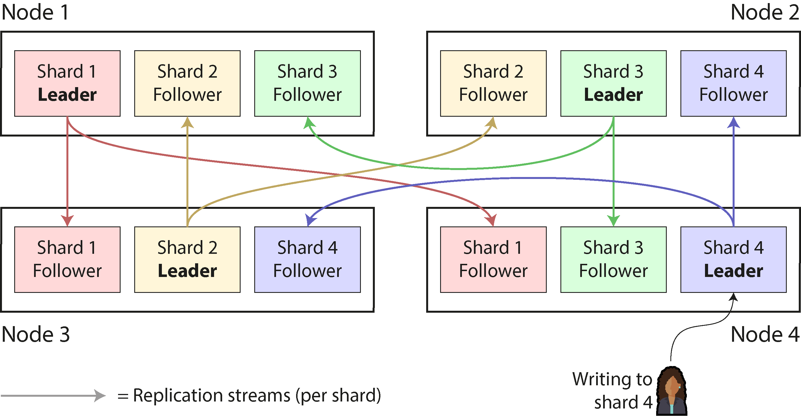
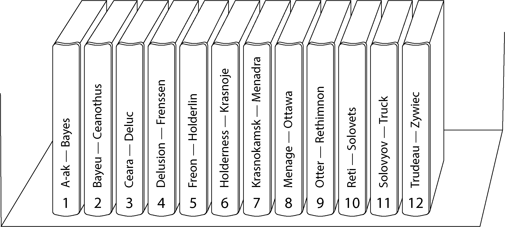
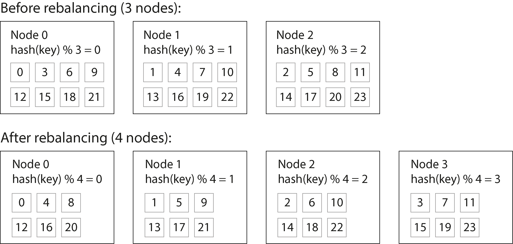
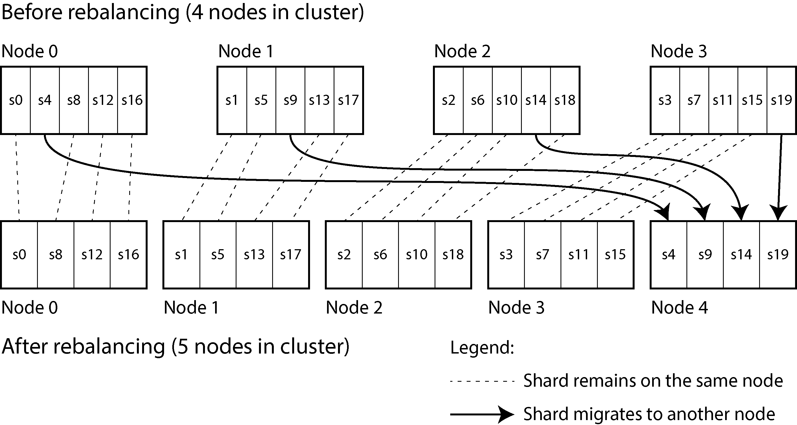
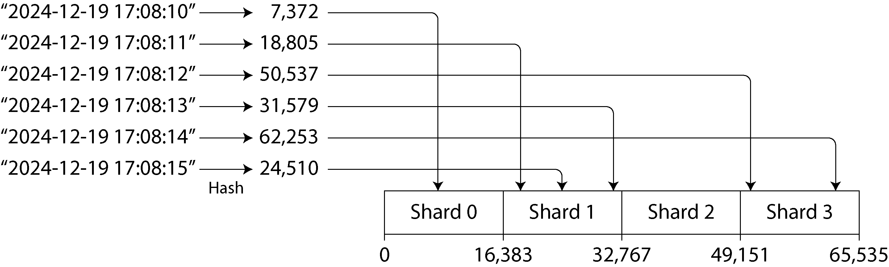
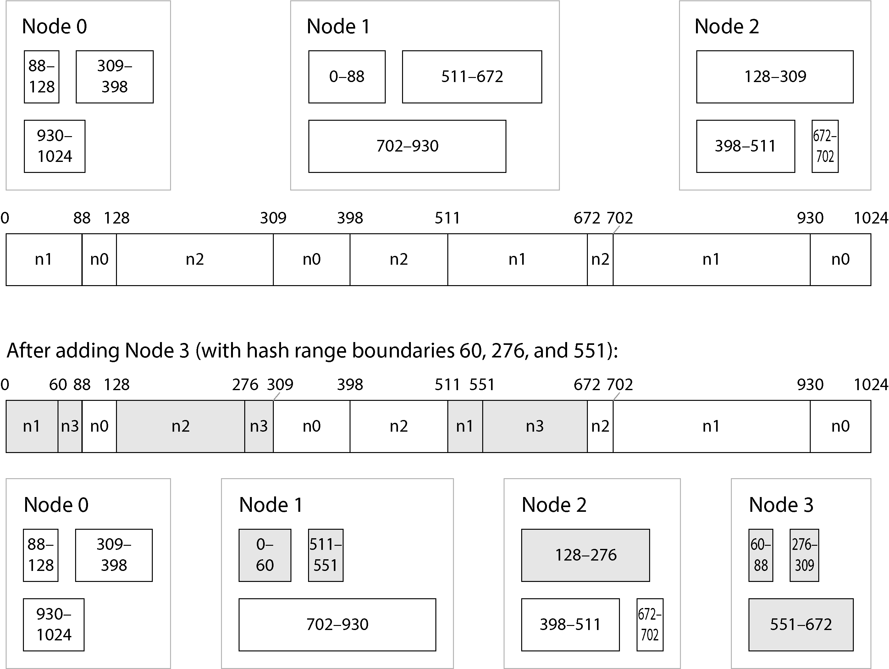
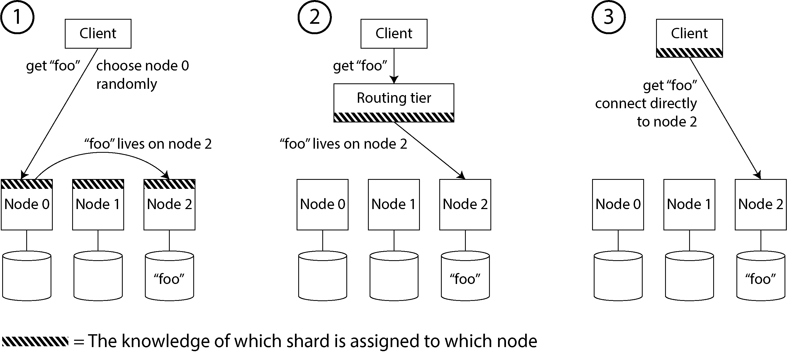
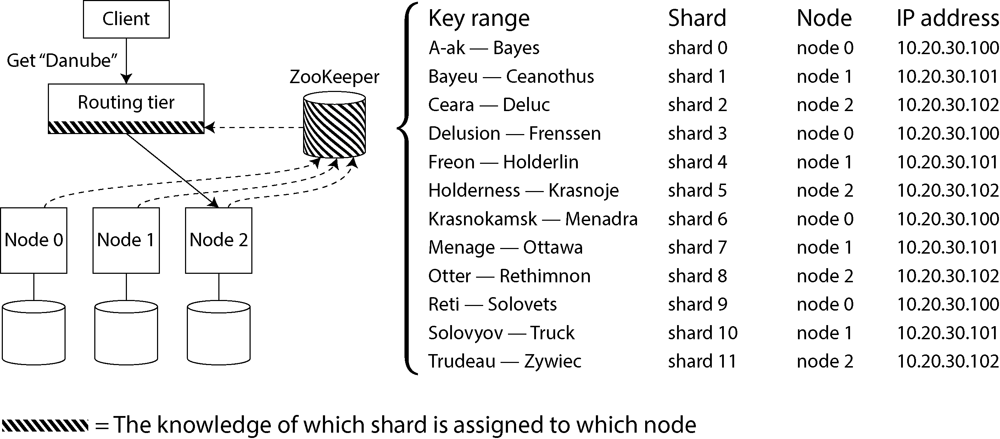

# Sharding

Grace Murray Hopper ne 1962 mein ek bohot gehri baat kahi thi ke humein computers ko sequential (ek ke baad ek kaam karne) ki limit mein nahi bandhna chahiye. Humein data ke aapas ke relationships aur uski priorities ko define karna chahiye, na ke sirf purane ruttay-rattaye tareeqon (procedures) par chalna chahiye.

Jab data bohot bada ho jata hai, toh ek akela computer usay sambhal nahi pata. Ek distributed database data ko alag-alag nodes (machines) par do bade tareeqon se phelata (distribute) hai:

* **Replication:** Iska matlab hai ke **ek hi data ki exact copies** ko alag-alag machines par save karna. Iska faida yeh hota hai ke agar ek machine kharab bhi ho jaye, toh data doosri machine par safe rehta hai.
* **Sharding (ya Partitioning):** Agar data itna zyada ho jaye ya us par likhne ka kaam (write throughput) itna barh jaye ke ek akeli machine use bardasht na kar sakay, toh hum data ke **chote-chote tukde (shards)** kar dete hain. Phir har ek tukde (shard) ko alag machine par bhej diya jata hai.

> **Asaan Alfaaz Mein (ELI5):** > Farz karein aap ke paas ek bohot bari library hai.
> * **Replication** yeh hai ke aap ek hi kitaab ki 3 copies banakar 3 alag alag kamron mein rakh dein taake agar ek kamre mein aag lag jaye toh kitaab gum na ho.
> * **Sharding** yeh hai ke kitaab itni moti aur bhari hai ke koi usay utha nahi sakta, toh aapne us kitaab ke chapters ko alag-alag kar diya (Chapter 1 ek bande ko diya, Chapter 2 doosre ko) taake sab mil kar asani se parh sakein.
> 
> 

### Sharding Ka Basic Rule

Normally, shards ko is tarah design kiya jata hai ke data ka **har ek piece (yaani har ek row, record, ya document) sirf aur sirf ek hi shard ka hissa hota hai**. Har shard apne aap mein ek complete, chota independent database hota hai, halankay kuch databases aise advanced operations bhi support karte hain jo aik sath bohot se shards ko touch kar sakte hain.

### Sharding Aur Replication Ka Milap (Combination)

Sharding ko aam tor par replication ke sath milakar chalaya jata hai taake data gum na ho. Iska matlab yeh hai ke bhale hi ek record sirf **ek hi shard** ka hissa ho, lekin fault tolerance (system kharab na hone) ke liye us shard ki **multiple copies** alag-alag nodes par majood hoti hain.

Ek akela node (computer) aik se zyada shards ko apne andar store kar sakta hai. Agar hum **Single-Leader Replication Model** (jahan ek leader hota hai aur baqi followers) use kar rahe hain, toh sharding aur replication ka milap bilkul waisa dikhega jaisa niche diye gaye diagram mein hai.

---

### Figure 7-1: Combining replication and sharding ka Deep Breakdown

Chalein is diagram ke ek-ek hisse aur workflow ko bohot hi asaan tarah se samajhte hain:

  

* **System ka Structure:** Is architecture mein total **4 Nodes (Machines)** hain: `Node 1`, `Node 2`, `Node 3`, aur `Node 4`. Aur pure data ko **4 Shards** mein divide kiya gaya hai: `Shard 1`, `Shard 2`, `Shard 3`, aur `Shard 4`.
* **Leader aur Follower ka Setup:** Har shard ka sirf **ek hi Leader** hota hai (jahan naya data write hota hai) aur baqi **Followers** hote hain (jo leader se data copy karte hain). Ek hi node par kuch shards ke leaders ho sakte hain aur kuch ke followers:
* **Node 1:** Yeh `Shard 1` ka **Leader** hai, lekin `Shard 2` aur `Shard 3` ka **Follower** hai.
* **Node 2:** Yeh `Shard 3` ka **Leader** hai, lekin `Shard 2` aur `Shard 4` ka **Follower** hai.
* **Node 3:** Yeh `Shard 2` ka **Leader** hai, lekin `Shard 1` ka **Follower** hai aur `Shard 4` ka bhi **Follower** hai.
* **Node 4:** Yeh `Shard 4` ka **Leader** hai, lekin `Shard 1` aur `Shard 3` ka **Follower** hai.

#### Replication Streams (Data flow kaise ho raha hai?):

Diagram mein jo rang-birangi arrows (teer) hain, woh **Replication Streams** ko dikha rahi hain (yaani data leader se nikal kar followers tak kaise ja raha hai):

1. **Red Arrow (Shard 1 Stream):** `Node 1` par majood `Shard 1 Leader` naya data receive karta hai aur usay `Node 3` aur `Node 4` par majood `Shard 1 Followers` ki taraf bhejta hai.
2. **Gold Arrow (Shard 2 Stream):** `Node 3` par majood `Shard 2 Leader` data ko `Node 1` aur `Node 2` ke `Shard 2 Followers` ko copy karta hai.
3. **Green Arrow (Shard 3 Stream):** `Node 2` par majood `Shard 3 Leader` apna data `Node 1` aur `Node 4` ke `Shard 3 Followers` ko bhejta hai.
4. **Blue Arrow (Shard 4 Stream):** `Node 4` par majood `Shard 4 Leader` apna data `Node 2` aur `Node 3` ke `Shard 4 Followers` ko bhejta hai.

#### Real-World Workflow Example (Writing to Shard 4):

Diagram ke bottom-right corner mein ek user (`Writing to shard 4`) ko dikhaya gaya hai.

* Jab is user ne koi aisa data write karna chaha jo **Shard 4** se belong karta hai, toh system ne us request ko seedha **Node 4** par bheja, kyunke **Shard 4 ka Leader Node 4 par baitha hai**.
* Node 4 is write request ko pakray ga, apne paas save karega, aur phir blue arrows ke zariye usay Node 2 aur Node 3 ke followers tak pohncha dega.

---

## Sharding and Partitioning

Aap jo software use kar rahe hain, uske mutabaq is "Shard" ke alag-alag naam hote hain. Writer ne yahan poori industry ke tools ki terminologies ko clear kiya hai:

| Software / Tool | Shard Ka Industry Name |
| --- | --- |
| **Apache Kafka** | Partition |
| **CockroachDB** | Range |
| **HBase / TiDB** | Region |
| **Couchbase** | vBucket |
| **Riak** | vnode |
| **Apache Cassandra** | token-range |
| **Bigtable / YugabyteDB / ScyllaDB** | tablet |

### PostgreSQL Ka Special Case (Partitioning vs Sharding)

Kuch databases mein "Partitioning" aur "Sharding" ko do bilkul alag concepts mana jata hai.

* **PostgreSQL Partitioning:** Is mein ek bohot bari table ko split karke **ek hi machine** ke andar alag-alag files mein store kiya jata hai. Iska sab se bada faida yeh hota hai ke agar aapko koi poora partition delete karna ho, toh files ko delete karna bohot fast ho jata hai.
* **PostgreSQL Sharding:** Iska matlab hota hai pooray dataset ko split karke **alag-alag physical machines (multiple machines)** par distribute karna.

Lekin baqi zyadatar database systems mein *Partitioning* aur *Sharding* ko ek hi cheez ke do naam samjha jata hai.

### Word "Shard" Ki Dilchasp Tareekh (History)

Yeh "Shard" ka lafay kahan se aaya? Iske peeche do theories hain:

1. **Ultima Online Game Theory:** Ek mashhoor online role-playing game thi jiska naam tha *Ultima Online*. Is game ki kahani mein ek magic crystal (shisha/kanch) toot kar tukde-tukde ho jata hai, aur har ek tukda (shard) us game ki duniya ki ek copy ko refract (dikha) raha hota hai. Wahan se yeh lafaz databases mein aya jiska matlab bana "Parallel servers ka ek set".
2. **Acronym Theory:** Ek aur theory yeh hai ke yeh 1980s ke ek database ka short form (acronym) tha jiska matlab tha **S**ystem for **H**ighly **A**vailable **R**eplicated **D**ata, lekin is database ki baki details tareekh mein kahin kho chuki hain.

> **Zaroori Warning (Crucial Concept):** > Database ke context mein jo hum **Partitioning** (data ke tukde karna) parh rahe hain, iska **Network Partitions (Netsplits)** se door door tak koi taluq nahi hai. Network Partition ek fault (masla) hota hai jahan machines ke darmiyan ka network network tar toot jata hai ya slow ho jata hai.

Database replication ke jitne bhi rules aur concepts hote hain, woh sab shards ki replication par bhi bilkul waise hi apply hote hain. Chunke sharding scheme ka choice aur replication scheme ka choice aapas mein independent hain (ek doosre par depend nahi karte), is liye concept ko mazeed simple rakhne ke liye hum aage replication ko discuss nahi karenge aur sirf sharding par focus karenge.

---

## Pros and Cons of Sharding

Database ko shard (tukde) karne ki sab se **badi aur primary wajah scalability hai**. Agar aapke data ka volume (size) ya us par data likhne ki raftaar (write throughput) itni zyada barh jaye ke ek akeli machine usay handle na kar sakay, toh sharding aapko yeh sahulat deti hai ke aap us data aur un writes ko bohot saari alag-alag machines par pheladein.

> **Ek Zaroori Point (Read vs Write):** > Agar masla sirf data ko parhne ki raftaar (**read throughput**) ka hai, toh aapko sharding ki zaroorat nahi hai. Uske liye aap **read scaling** use kar sakte hain (yaani replication ke zariye bohot saari copies banana, jaisa hum ne Chapter 6 mein dekha tha). Sharding ki asli zaroorat tab parti hai jab **writes** ka load bohat zyada ho jaye.

Sharding actually **Horizontal Scaling** (jisay *Scale-out Architecture* bhi kehte hain) ka sab se main tool hai. Iska matlab yeh hai ke agar aapke system ki capacity kam par rahi hai, toh aap koi bohot bari ya mehangi machine kharidne (**Vertical Scaling**) ke bajaye, bohot saari choti aur sasti machines (**Horizontal Scaling**) apne system mein add karte jate hain.

Agar aap apne kaam (workload) ko is tarah divide kar sakein ke har ek shard ke hissay mein barabar ka load aaye, toh aap un shards ko alag-alag machines par chala kar unka data aur queries **parallel** (aik sath) process kar sakte hain.

### Sharding Aik Heavyweight Solution Hai

* **Replication** chote aur bade, dono levels par useful hoti hai kyunke yeh system ko tootne se bachati hai (fault tolerance) aur offline kaam karne mein madad deti hai.
* Lekin **Sharding** aik bohot bhari aur mushkil solution (**heavyweight solution**) hai, jo sirf aur sirf bohot bade scale (massive scale) par hi suit karta hai.

Agar aapke data ka size aur writes ka load aisa hai jise ek akeli machine asani se sambhal sakti hai (aur aaj kal ki modern single machines bohot powerful hoti hain!), toh writer ki advice yeh hai ke **sharding se bachein** aur single-shard database par hi tike rahein.

### Sharding Ki Complexities aur Cons (Nuksaanat)

Writer ne bataya hai ke sharding ko avoid karne ki sab se badi wajah yeh hai ke yeh system mein bohot zyada **complexity (mushkilat)** barha deta hai:

* **Partition Key Ka Intikhab (Choice of Partition Key):** Aapko yeh faisla karna hota hai ke kaun sa record kis shard mein jayega, aur iske liye aap aik **Partition Key** chunte hain. Woh tamam records jinki partition key same hogi, woh ek hi shard mein jayenge.
* **In-efficient Searches:** Agar aapko pata hai ke aapka required record kis shard mein hai, toh data nikalna bohot fast hoga. Lekin agar aapko shard ka nahi pata, toh database ko **tamam shards par ja kar dhoondna (search) parega**, jo ke bohot hi slow aur gair-efficient tareeqa hai.
* **Hard to Change:** Ek baar jo sharding scheme aap ne set kar di, baad mein usay tabdeel karna bohot hi zyada mushkil hota hai.
* **Data Models Ka Masla (Key-Value vs Relational):** Sharding **Key-Value data** ke liye bohot behtareen kaam karti hai kyunke wahan key ke mutabaq shard chunna asaan hota hai. Lekin **Relational Data** (jaise SQL tables) mein yeh bohot mushkil ho jata hai, kyunke wahan aapko secondary indexes par search karna hota hai ya alag-alag shards par bikhre hue records ko aapas mein **Join** karna parta hai.
* **Distributed Transactions Ka Bojh:** Ek akeli machine par transactions chalana (yaani data ka sahi tarah update hona) bohot aam aur tez hota hai. Lekin sharding mein agar ek single write request ko alag-alag shards ke records ko update karna par jaye, toh wahan **Distributed Transaction** ki zaroorat parti hai taake saare shards par data consistent (aik jaisa) rahe. Yeh distributed transactions single-node transactions ke muqable mein **bohot slow** hoti hain aur poore system ke liye ek bottleneck (rukawat) ban sakti hain.

---

### Single Machine Par Sharding (An Interesting Use Case)

Kuch advanced systems aise bhi hain jo alag-alag machines par jane ke bajaye **ek hi single machine ke andar** sharding ka use karte hain!

Yeh aisa kyun karte hain? Iske peeche do bade technical reasons hain:

1. **CPU Parallelism:** CPU ke har ek core par ek single-threaded process chalaya jata hai taake CPU ki poori takat (parallelism) ka sahi istemal kiya ja sakay.
2. **NUMA (Non-Uniform Memory Access) Architecture:** Is hardware design mein RAM (memory blocks) ke kuch hissay CPU ke kuch khas cores ke zyada kareeb hote hain baqi cores ke muqable mein. Ek single machine par sharding karne se data us core ke kareeb wali memory mein hi rehta hai jisse speed bohot barh jati hai.

#### Real-World Examples:

* **Redis**
* **VoltDB**
* **FoundationDB**

Yeh tamam databases ek single machine ke andar **har CPU core par ek process** chalate hain aur load ko cores ke darmiyan phelane ke liye sharding ka hi sahara lete hain.

---

## Sharding for Multitenancy

Software as a Service (SaaS) products aur cloud services aksar **multitenant** hoti hain. Multitenant ka aasan matlab yeh hai ke **ek hi software/application ko bohot saare alag-alag customers (tenants) istemal kar rahe ہوتے hain**. Ek single tenant ke andar multiple users login kar sakte hain (jaise ek company ke bohot se employees), lekin har tenant ka apna data bilkul self-contained (apne andar mukammal) hota hai aur doosre tenants se bilkul alag aur alahda rakha jata hai.

> **Real-World Example:** Writer ne yahan ek email marketing service ki misaal di hai. Jab bhi koi business is service par apna account banata hai (sign up karta hai), toh woh ek alag tenant ban jata hai. Us business ke subscribers ki list, newsletters aur delivery data ka doosre businesses ke data se koi taluq nahi hota—dono bilkul alag rehte hain.

Kabhi kabhi is multitenant system ko chalane ke liye sharding ka istemal kiya jata hai. Iske do tareeqay hote hain: ya toh har tenant ko aik **separate shard** de diya jata hai, ya phir bohot saare chote-chote tenants ko mila kar ek **bade shard** mein group kar diya jata hai.

Yeh shards physically alag databases bhi ho sakte hain ya ek bade logical database ke alag-alag hissay bhi ho sakte hain jinhein alag se manage kiya ja sakay.

Multitenancy ke liye sharding use karne ke bohot se behtareen faide hain, jinhein writer ne niche tafseel se bayan kiya hai:

### Resource isolation

Agar ek single tenant database par koi bohot heavy ya computational tor par mehangi (computationally expensive) operation ya query chalata hai, toh doosre tenants ki performance par asar nahi parta. Kyunke woh doosre shards (yaani alag machines) par chal rahe hote hain, is liye unka system slow nahi hota.

### Permission isolation

Yeh security ke hawale se ek bohot bada faida hai. Agar aapke application ke access control logic (permission system) mein koi bug ya galti aa bhi jaye, toh bhi galti se ek tenant ka data doosre tenant ke haath lagne ka khatra bohot kam hota hai, kyunke dono ka data physically hi ek doosre se alag aur separate jagah store hota hai.

### Cell-based architecture

Aap sharding ka concept sirf data storage level par hi nahi, balkay apni application code chalane wali services par bhi apply kar sakte hain. Ek **Cell-based architecture** mein, tenants ke ek makhsoos group ke liye unki application services aur unka storage dono ko mila kar ek mukammal independent block (**self-contained cell**) bana diya jata hai.

Alag-alag cells is tarah set up kiye jate hain ke woh ek doosre se bilkul azad (independently) chal sakein. Iska sab se bada faida **Fault Isolation (Blast Radius Control)** hota hai: agar ek cell mein koi kharabi ya bug aa jaye, toh nuksaan sirf us cell ke tenants tak mahdood rehta hai. Doosre cells mein majood tenants par iska ratti barabar bhi asar nahi hota.

### Per-tenant backup and restore

Chunke har tenant ka shard alag hota hai, is liye aap har tenant ka backup alag se le sakte hain. Agar kisi tenant se galti se apna koi zaroori data delete ya overwrite ho jaye, toh aap baqi kisi bhi tenant ko chhere bina ya disturb kiye bina, sirf us specific tenant ka data backup se restore kar sakte hain.

### Regulatory compliance

Aaj kal data privacy ke sakht qawaneen hain jaise **GDPR** (Europe mein) aur **CCPA** (California mein). Yeh qawaneen aam logon ko yeh haq dete hain ke woh jab chahein businesses se apna data maang sakein (access) ya usay hamesha ke liye mita dene (deletion) ki request kar sakein. Agar har tenant/insan ka data ek separate shard mein organized hoga, toh unka data export karna ya mukammal tor par delete karna database ke liye bohot hi simple operation ban jata hai.

### Data residence

Kuch mumalik ke qanoon ke mutabaq unke citizens ka data physical tor par unhi ki country ki boundary ke andar store hona zaroori hai (Data Residency Laws). Ek region-aware database ka istemal karte hue aap asani se us makhsoos tenant ke shard ko uski country ke geographic region (location) wali machine par assign kar sakte hain.

### Gradual schema rollout

Database ka structure badalna (schema migration) ek bohot hi risky kaam hota hai. Sharding ka faida yeh hai ke aap naya schema ek hi waqt mein poore database par thopne ke bajaye **aik aik tenant kar ke gradually** (ahista ahista) roll out kar sakte hain. Is se risk bohot kam ho jata hai; agar naye structure mein koi masla hua toh pehle hi tenant par pakra jayega aur baqi saare tenants nuqsan se bach jayenge (halankay is cheez ko transactionally manage karna thoda mushkil hota hai).

---

### Challenges of Multitenancy Sharding

Faidon ke sath sath, writer ne is approach ke teen bade **challenges (mushkilat)** bhi bataye hain:

* **Tenant Single Node Se Bada Hona:** Is poore model ka basic assumption yeh hai ke har ek tenant itna chota hoga ke woh ek akeli machine (node) par fit aa sakay. Lekin agar koi ek tenant (customer) itna giant (bada) ho jaye ke woh ek machine par poora hi na aaye, toh aapko us akele tenant ke andar bhi mazeed sharding karni paregi. Yeh aapko dobara scalability wali sharding ke mushkil raste par le jata hai.
* **Chote Tenants Ka Overhead:** Agar aapke paas bohot saare chote-chote tenants hain aur aap har ek ke liye alag shard banayenge, toh system par bohot zyada faltu bojh (**overhead**) barh jayega. Agar aap is se bachne ke liye kayi chote tenants ko ek bade shard mein group kar dete hain, toh naya masla yeh khara hota hai ke jab un mein se koi tenant bada hoga, toh usay us shard se nikal kar doosre shard mein move (migrate) kaise kiya jaye.
* **Cross-Tenant Features:** Agar aapko kabhi future mein koi aisa feature banana par jaye jo alag-alag tenants ke data ko aapas mein connect ya combine kare, toh unka data aapas mein **Join** karna bohot hi mushkil aur slow ho jata hai kyunke data alag-alag shards par bikhra hua hota hai.

---

## Sharding of Key-Value Data

Farz karein aapke paas bohot zyada data (huge amount of data) majood hai aur aap uske chote-chote tukde (sharding) karna chahte hain. Lekin sab se bada sawaal yeh khara hota hai ke aap yeh kaise faisla karenge ke kaun sa record kis machine (node) par bhejkar store karna hai?

Sharding ka asli aur sab se bada maqsad yeh hota hai ke **data aur queries ka bojh (load) tamam nodes par bilkul barabar (evenly) phelaya jaye**.

> **Asaan Alfaaz Mein (ELI5):** > Farz karne ke aapke paas 100 kilo aam (mangoes) hain aur unhein uthane ke liye 10 mazdoor (nodes) hain. Insaaf ka taqaza toh yeh hai ke har mazdoor ke hissay mein 10, 10 kilo aam aaein taake koi ek banda thak kar gir na jaye.
> In theory, agar har node apna barabar ka bojh uthaye, toh **10 nodes mil kar 10 guna (10x) zyada data** aur 10 guna zyada parhne/likhne ki raftaar (read and write throughput) ko handle kar sakte hain ek akeli machine ke muqable mein (agar hum replication ko abhi side par rakh dein).

### Rebalancing Ka Concept

Jab aap database system mein koi naya node add karte hain (kyunke data barh gaya hai) ya koi purana node remove karte hain (kyunke woh kharab ho gaya hai), toh aapke system mein yeh salahiyat honi chahiye ke woh data ke load ko dobara se **rebalance** kar sakay. Rebalance ka matlab hai data ko is tarah naye siray se banta jaye ke woh naye number of nodes par bhi barabar divide ho jaye.

---

### Skewed Distribution aur Hot Spots Kya Hain?

Agar data ka batwara na-insaafi par mabni ho—yaani kuch shards ke paas had se zyada data ya queries chali jayen aur baqi shards khali baithe hon—toh is bad-intezami ko technical zuban mein **Skewed** (tedha ya gair-wazni) kaha jata hai.

**Skew** ki majoodgi sharding ke poore faide ko tabaah aur nakam kar deti hai. Ek extreme case (akhri had) mein aisa bhi ho sakta hai ke poore system ka saara load galti se sirf **ek hi shard** par aa jaye! Iska nateeja yeh niklega ke 10 mein se 9 nodes bilkul vailay (idle) baithe honge aur aapka poora system us ek busy node ki wajah se slow (bottleneck) ho jayega.

* **Hot Shard / Hot Spot:** Ek aisa shard jis par baki shards ke muqable mein had se zyada aur gair-munasib bojh (disproportionately high load) aa jaye, usay **Hot Shard** ya **Hot Spot** kehte hain.
* **Hot Key:** Kabhi kabhi poore shard ka masla nahi hota balkay kisi ek makhsoos single key ka masla hota hai. Agar kisi ek key par bohot zyada load aa jaye, toh usay **Hot Key** kehte hain.
* *Real-World Example:* Social networks (jaise Twitter/X ya Instagram) par jab koi **Celebrity** (mashhoor shakhsiyat) koi post karti hai, toh us ek celebrity ki account ID (jo ke ek key hai) par aik hi second mein lakhon log reacts aur comments karte hain. Woh single key achanak se "Hot Key" ban jati hai.

---

### Sharding Algorithm Aur Partition Key

Dataset ko kamyabi se shards mein torne ke liye humein ek makhsoos **Algorithm** (formula) ki zaroorat hoti hai. Is algorithm ka kaam yeh hota hai ke yeh kisi bhi record ki **Partition Key** ko input ke tor par leta hai aur calculation kar ke batata hai ke yeh record kis shard ke andar store hona chahiye.

* **Key-Value Store Mein:** Partition key aam tor par poori ki poori `Key` hoti hai ya us key ka sab se pehla hissa (first part) hoti hai.
* **Relational Model (SQL Databases) Mein:** Partition key table ka koi bhi ek makhsoos column ho sakta hai (aur yeh zaroori nahi hai ke woh column table ki primary key hi ho).

Database designer ke liye sab se bada challenge yeh hota hai ke is sharding algorithm ko is tarah design kiya jaye ke yeh **Rebalancing** ko asani se support kar sakay, taake jab bhi system mein koi Hot Spot ya Hot Shard banay, toh data ko dobara shift kar ke load ko halka kiya ja sakay.

---

## Sharding by Key Range

Sharding karne ka ek bohot hi seedha aur asaan tareeqa yeh hai ke aap partition keys ki ek mukammal aur lagataar range (yaani ek minimum value se le kar ek maximum value tak) har ek shard ko assign kar dein. Iski misaal bilkul paper par print hui **Encyclopedia (lugaat ya maloomati kitabon ke set)** jaisi hai.

---

### Figure 7-2: A print encyclopedia is sharded by key range ka Deep Breakdown

Chalein is diagram ke zariye key-range sharding ke pooray concept ko bareeki se samajhte hain:

  

* **Diagram ka Structure:** Is image mein ek shelf par **12 Kitabein (Volumes)** rakhi hui hain, jo ke asal mein **12 Shards** ko darsha rahi hain. Har ek kitaab ke upar uski range likhi hui hai ke us mein kis lafaz se le kar kis lafaz ke records majood hain:
* **Volume 1:** `A-ak — Bayes` (Is mein A se shuru hone wale aur Bayes tak ke words hain).
* **Volume 2:** `Bayeu — Ceanothus`
* **Volume 3:** `Ceara — Deluc`
* **Volume 4:** `Delusion — Frenssen`
* **Volume 5:** `Freon — Holderlin`
* **Volume 6:** `Holderness — Krasnoje`
* **Volume 7:** `Krasnokamsk — Menadra`
* **Volume 8:** `Menage — Ottawa`
* **Volume 9:** `Otter — Rethimnon`
* **Volume 10:** `Reti — Solovets`
* **Volume 11:** `Solovyov — Truck`
* **Volume 12:** `Trudeau — Zywiec` (Is mein T se le kar Z tak ke saare words hain).

* **Gair-Barabar Ranges (Uneven Spacing):** Agar aap ghaur karein toh Volume 1 mein sirf A aur B ke kuch words hain, jabke Volume 12 mein T, U, V, W, X, Y, aur Z ke saare words thos diye gaye hain. Aisa kyun hai? Kyunke hamara data har alphabet ke liye barabar nahi hota. Agar hum har do alphabets ke liye ek kitaab (shard) fix kar dete, toh kuch kitabein bohot moti ho jatin aur kuch bilkul patli. Data ko barabar bantanay ke liye shard ki boundaries ko data ke mutabaq **adapt (tabdeel)** hona parta hai.
* **Lookup Kaise Hota Hai?** Agar aapko kisi makhsoos title (jaise 'Delusion') ka record dhoondna hai, toh aapko saari kitabein kholne ki zaroorat nahi. Aap shelf par dekhoge ke 'Delusion' kis kitaab ki range mein aata hai (jo ke Volume 4 hai), aur aap seedha wahi kitaab utha loge. Database bhi bilkul isi tarah asani se sahi shard tak pohnch jata hai.

---

### Manual aur Automatic Key-Range Sharding (Real-World Tools)

Shard ki boundaries kaun tay karta hai? Yeh do tareeqon se ho sakta hai:

* **Manual Sharding:** Is mein system administrator khud hath se boundaries set karta hai. Iski misaal **Vitess** hai (jo MySQL ke upar ek sharding layer ke tor par kaam karta hai).
* **Automatic Sharding:** Is mein database khud ba khud data dekh kar boundaries decide karta hai. Yeh tareeqa **Bigtable**, **HBase** (Bigtable ka open-source version), **MongoDB** (ka range-based sharding option), **CockroachDB**, **RethinkDB**, aur **FoundationDB** use karte hain.
* **YugabyteDB** aik aisa system hai jo manual aur automatic dono tarah se tablets (shards) ko split karne ki sahulat deta hai.

### Sorted Storage Aur Range Scans Ka Faida

Har shard ke andar jo keys store hoti hain, unhein **Sorted Order** (yaani ek tarteeb) mein rakha jata hai (jaise **B-tree** ya **SSTables** ke zariye, jo hum ne Chapter 4 mein parha tha).

Is sorted arrangement ka sab se bada faida yeh hota hai ke **Range Scans** bohot asaan ho jate hain. Aap key ko ek mila hua index (concatenated index) samajh kar ek hi query mein bohot saare aapas mein jure hue records nikal sakte hain.

> **Real-World Example:** Farz karein aapki application sensors ke ek network se data store karti hai, jahan record ki `Key` us measurement ka **Timestamp** (waqt) hai. Is case mein range scan bohot useful hain, kyunke agar aapko kisi ek makhsoos mahine (month) ki saari readings chahiye, toh aap ek hi query se us poore mahine ka data asani se nikal sakte hain.

### Key-Range Sharding Ka Bada Nuksaan (The Hot Shard Problem)

Iska sab se bada downside yeh hai ke agar aapas mein juri hui keys par bohot zyada writes aane lagein, toh bohot jaldi ek **Hot Shard** ban jata hai.

Sensors wali misaal ko dobara dekhein: Agar key sirf ek timestamp hai, toh shards waqt ke mutabaq bane honge (maslan ek shard har mahine ke liye). Jab sensors bilkul real-time mein data database mein likh rahe honge, toh **saare ke saare writes bilkul ek hi shard par jayenge (jo ke is mojooda mahine ka shard hai)**. Nateeja yeh niklega ke is mahine wala shard writes ke bojh se dab jayega (overloaded ho jayega) aur baqi purane mahino ke shards bilkul farigh (idle) baithe honge.

#### Is Maslay Ka Hal (The Fix) aur Trade-off:

Is sensor database ke maslay se bachne ke liye aapko timestamp ko key ka pehla hissa nahi banana chahiye. Aapko timestamp se pehle **Sensor ID** ka prefix (shuruaati hissa) lagana chahiye.

* Ab aapki key is tarah dikhegi: `SensorID_Timestamp`.
* Is se faida yeh hoga ke chunke bohot saare sensors aik sath active hain, toh data alag-alag shards par barabar phel (distribute) jayega.
* **Lekin iska Trade-off (Nuksaan) kya hai?** Agar ab aapko ek makhsoos time range ke andar saare sensors ka data nikalna ho, toh aap ek single range query nahi chala sakte. Ab aapko **har ek sensor ke liye alag se range query** chalani paregi.

---

## Rebalancing key-range sharded data

### Pehla Setup Aur Pre-Splitting

Shoroo mein jab aap database bilkul naya set up karte hain, toh data na hone ki wajah se koi key ranges ya shards pehle se majood nahi hote. Kuch databases jaise **HBase** aur **MongoDB** aapko khali database par hi shoroo mein shards ka ek initial set configure karne ki ijazat dete hain, jisay **Pre-splitting** kaha jata hai. Iske liye aapko pehle se thoda andaza hona chahiye ke aapka data (keys distribution) kis tarah ka dikhega taake aap sahi boundaries chun sakein.

### Shard Splitting Aur Merging (System Ka Barhna)

Jaise jaise waqt ke sath data ka size aur writes ka load barhta hai, key-range sharding wala system khud ko barhane (grow karne) ke liye ek majooda shard ko **do ya us se zyada chote shards mein tod (split kar) deta hai**.

* **Splitting:** Todne ke baad jo naye chote shards bante hain, unke paas original range ka hi ek lagataar hissa (contiguous subrange) hota hai. Phir in naye shards ko alag-alag nodes (machines) par banta ja sakta hai taake load kam ho sake.
* **Merging:** Agar aap database se bohot bada data delete kar dete hain, toh aapko iska ulta karna parta hai. Jo adjacent (saath saath wale) shards bohot chote ho chuke hain, unhein mila kar ek bada shard bana diya jata hai (**Merge** kiya jata hai).
* Yeh poora process bilkul waisa hi hai jaisa **B-Tree** ke top level par nodes ke split aur merge hone ke waqt hota hai.

### Splitting Ke Triggers Kya Hain?

Jo databases shard boundaries ko automatically manage karte hain, un mein split ka amal tab trigger hota hai jab:

1. Shard ek makhsoos size tak pohnch jaye (Maslan, **HBase** mein default size **10 GB** hai).
2. Ya kuch systems mein jab writes ki raftaar (write throughput) ek tay shuda had se lagataar upar raye. Iska matlab hai ke agar koi shard size mein chota bhi ho lekin us par writes ka load had se zyada ho (Hot Shard), toh system usay phir bhi split kar dega taake write load uniform ho sakay.

### Splitting Ka Trade-off Aur Risk

Automatic adaptation ka faida yeh hai ke agar data kam hai toh shards kam honge aur faltu bojh (overhead) nahi hoga. Agar data bohot zyada hai toh har ek shard ka size ek maximum had tak mahdood rahega.

Lekin, **shard ko split karna ek bohot hi mehanga aur bhari operation (expensive operation) hai**. Is mein shard ka saara data naye siray se nayi files mein likhna parta hai (bilkul waise hi jaise log-structured storage engines mein **Compaction** ka process hota hai).

**Sab se bada risk yeh hai:** Jo shard split hone ja raha hota hai, woh pehle hi had se zyada load (high load) ke andar hota hai. Ab us high load ke upar jab split karne ka apna bhari bojh bhi aa jata hai, toh system mazeed dab jata hai aur us node ke mukammal tor par crash ya overload hone ka khatra bohot barh jata hai.

---

## Sharding by Hash of Key

Key-range sharding (jo hum ne pehle parha) wahan bohot faida mand hoti hai jahan hum chahte hain ke aapas mein milti julti keys ek hi shard mein ikatthi store hon (jaise timestamps). Lekin agar aapko is baat se koi farq nahi parta ke keys ek doosre ke kareeb hain ya nahi (maslan, kisi multitenant application mein tenants ki IDs), toh sab se behtareen aur aam tareeqa yeh hota hai ke pehle partition key ko ek **Hash Function** mein dala jaye, aur phir us se milne wale number ke mutabaq shard decide kiya jaye.

> **Asaan Alfaaz Mein (ELI5):** > Farz karein aapke paas alag-alag lambai aur tarteeb ke hazaron khilonay (keys) hain. Agar aap unhein seedha rkhne ki koshish karenge toh ho sakta hai ek dabba bhar jaye aur doosra khali rahe.
> Hash function ek aisi **"Jadui Machine"** hai jo har khilonay ko pakar kar usay ek unique random-looking token (number) mein badal deti hai. Is se faida yeh hota hai ke bikhra hua aur tedha-medha data bhi bilkul barabar tarah se boxes (shards) mein takseem ho jata hai.

Ek achha hash function gair-wazni aur skewed data ko pakar kar usay poore system mein **Uniformly Distribute** (barabar phelana) kar deta hai.

* **Working Mechanism:** Farz karein hamare paas ek 32-bit hash function hai jo kisi bhi string text ko input leta hai. Jab bhi aap isay koi naya string denge, yeh 0 se le kar $2^{32} - 1$ ke darmiyan ek random sa दिखने wala number return karega.
* **Determinism:** Agarchay yeh number random dikhta hai, lekin yeh deterministically kaam karta hai—yaani agar aap **exact same input** baar baar denge, toh output mein hamesha **exact same number** hi nikal kar aayega. Haaan, agar inputs aapas mein bohot milti julti bhi hon (jaise "abc" aur "abd"), toh unke hash values ek doosre se bilkul alag aur poori range mein door-door bikhre hue honge.

#### Real-World Examples (Hash Tools):

Sharding ke maqsad ke liye hash function ka cryptographically strong (secure) hona zaroori nahi hai (jaise baki security tools mein hota hai):

* **MongoDB:** Sharding ke liye **MD5** hash function use karta hai.
* **Cassandra aur ScyllaDB:** Is kaam ke liye **Murmur3** use karte hain.

> **Zaroori Technical Warning:** > Boht si programming languages ke andar apna built-in hash function hota hai (jo unki internal hash tables ke liye hota hai), lekin **woh sharding ke liye bilkul bekaar aur unsuitable hote hain**.
> Maslan, Java ka `Object.hashCode()` aur Ruby ka `Object#hash` aik hi key ka hash value alag-alag processes ya alag machines par alag nikal sakte hain. Agar hash badal gaya, toh data dhoondna na-mumkin ho jayega.

---

### Hash modulo number of nodes

Jab aap key ka hash nikal lete hain, toh agla faisla yeh karna hota hai ke isay kis shard/node par rakhna hai. Sab se pehla khayal jo zehan mein aata hai, woh hai **Modulo Arithmetic** (yaani `%` operator) ka istemal karna.

* **Formula:** $hash(key) \pmod N$ (Jahan $N$ system mein majood nodes ki tadad hai).
* **Example:** Agar hamare paas 10 nodes hain (0 se 9 tak numbered), toh $hash(key) \pmod{10}$ hamesha 0 se 9 ke darmiyan ek number dega, jo seedha seedha us makhsoos node ka number hoga.

Lekin is **Mod N** tareeqay mein ek bohot bada aur bura masla hai: **Agar system mein nodes ki tadad ($N$) badal jaye, toh taqreeban saara data apni jagah chor kar naye nodes par shift karna parta hai.**

#### Figure 7-3: Modulo N Rebalancing ka Deep Breakdown

Misaal ke tor par, is diagram ke dono hisson ko dhyan se dekhein:

  

* **Before Rebalancing (3 Nodes):**
* Jab system mein sirf 3 nodes (`Node 0`, `Node 1`, `Node 2`) thay, toh formula tha: $hash(key) \pmod 3$.
* **Node 0** ke paas woh keys ja rahi thin jinka modulo 0 tha: `0, 3, 6, 9, 12, 15, 18, 21`.
* **Node 1** ke paas: `1, 4, 7, 10, 13, 16, 19, 22`.
* **Node 2** ke paas: `2, 5, 8, 11, 14, 17, 20, 23`.

* **After Rebalancing (4 Nodes - Ek naya Node 3 add kiya gaya):**
* Ab nodes ki tadad 4 ho gayi, toh formula achanak badal kar ho gaya: $hash(key) \pmod 4$.
* Is naye formule ki wajah se purana poora setup tabaah ho gaya:
* Key `3` jo pehle `Node 0` par thi, ab $3 \pmod 4 = 3$ ki wajah se **Node 3** par chali gayi.
* Key `6` jo pehle `Node 0` par thi, ab $6 \pmod 4 = 2$ ki wajah se **Node 2** par chali gayi.
* Key `9` jo pehle `Node 0` par thi, ab $9 \pmod 4 = 1$ ki wajah se **Node 1** par chali gayi.

**Trade-off Decision:** Mod N function compute karne mein toh bohot asaan aur tez hai, lekin rebalancing ke mamle mein yeh **bad-tareen aur gair-efficient** hai. Yeh bina kisi zaroorat ke records ko ek node se doosre node par phelata (unnecessary movement) hai, jis se network par bohot heavy bojh parta hai. Humein ek aisa tareeqa chahiye jo kam se kam data move kare.

---

### Fixed number of shards

Mod N ke maslay ka ek bohot hi simple aur sab se zyada istemal hone wala hal yeh hai ke **shoroo se hi nodes ki tadad se kahin zyada shards bana diye jayein**, aur ek node ko multiple shards assign kar diye jayein.

* **Example SETUP:** Farz karein 10 nodes ka ek cluster hai. Hum shoroo mein hi poore database ko **1,000 shards** mein divide kar dete hain. Iska matlab hai ke har ek node ke paas **100 shards** ka control hoga.
* **Data Mapping:** Naya data aane par key ka shard is tarah nikalenge: $hash(key) \pmod{1000}$. Yeh shard number fix rahega. System alag se ek mapping table mein track rakhta hai ke kaun sa shard number is waqt kis physical node par betha hai.

#### Figure 7-4: Adding a new node with multiple shards ka Deep Breakdown

Is image mein dekhein ke kaise fixed shards bina keys ka formula badle naye node par shift hote hain:

  

* **Before Rebalancing (4 Nodes in Cluster):**
* System mein 4 nodes hain (`Node 0` se `Node 3` tak) aur total 20 shards hain (`s0` se `s19` tak).
* Har node ke paas 5 shards hain. Maslan, `Node 0` ke paas `s0, s4, s8, s12, s16` hain.

* **After Rebalancing (5 Nodes in Cluster - `Node 4` Add Hua):**
* Jab ek naya `Node 4` system mein aaya, toh system ne majooda nodes se **poore ke poore shards** utha kar naye node ko de diye taake sab par load barabar ho jaye.
* Diagram mein **Solid Black Arrows (Shard migrates to another node)** ko dekhein:
* `Node 0` se shard `s4` nikal kar `Node 4` par chala gaya.
* `Node 1` se shard `s9` nikal kar `Node 4` par chala gaya.
* `Node 2` se shard `s14` nikal kar `Node 4` par chala gaya.
* `Node 3` se shard `s19` nikal kar `Node 4` par chala gaya.

* **Dotted Lines (Shard remains on the same node):** Baqi jitne bhi shards thay (jaise s0, s8, s12 etc.), woh apni purani machines par hi kharray rahay, unhein ratti barabar bhi hilaya nahi gaya!

#### Is Approach Ke Faide (Pros):

1. **Minimum Data Movement:** Keys ka shard ke sath assignment kabhi nahi badalta. Sirf shard ka node ke sath taluq badalta hai, jis se faltu data migration se jaan chhut jati hai.
2. **Network Tolerance:** Shards ka transfer فورا nahi hota, network par data transfer hone mein waqt lagta hai. Jab tak transfer chal raha hota hai, purani shard mapping hi reads aur writes ke liye use hoti rehti hai (No Downtime).
3. **Hardware Flexibility:** Agar cluster mein kuch machines bohot powerful hain aur kuch kamzor, toh aap powerful machines ko zyada shards assign kar sakte hain taake woh zyada load utha sakein.
4. **Real-World Tools:** Yeh behtareen approach **Citus** (PostgreSQL ka sharding layer), **Riak**, **Elasticsearch**, aur **Couchbase** mein use hoti hai.

#### Is Model Ke Challenges aur Nuksaanat (Cons):

* **Initial Guess Ki Limitation:** Yeh model tabhi tak achha hai jab tak aapko shoroo mein sahi andaza ho ke aapko maximum kitne shards chahiye honge. Aap cluster mein shards ki kul tadad se zyada nodes add nahi kar sakte (maslan agar 1000 shards hain toh max 1000 machines hi ho sakti hain).
* **Resharding Ka Bhari Bojh:** Agar aapka andaza galat nikla aur aap shards ki tadad badhana chahte hain, toh yeh ek bohot hi **expensive resharding operation** hoga. Is mein har shard ko split kar ke nayi files mein dubara likhna parega, jo bohot disk space aur CPU lega. Kuch systems is dauran database par naya data likhne (concurrent writes) ki ijazat bhi nahi dete, jis se downtime aata hai.
* **Size Management Ka Masla (The Goldilocks Problem):** Agar data ka size bohot upar niche hota hai toh masla hai. Chunke shards fixed hain, agar data bohot barh gaya toh har shard ka size bhi bohot bada ho jayega, jis se node failure ke waqt recovery aur rebalancing bohot slow ho jayegi. Agar shards bohot chote rakh diye, toh unka apna management bohot overhead (bojh) ban jayega. Shard ka size hamesha **"Just Right"** (na bohot bada, na bohot chota) hona chahiye, jo is fixed model mein mushkil hota hai.

---

### Sharding by hash range

Agar aap future mein data ke size ka andaza pehle se nahi laga sakte, toh fixed shards ke bajaye ek aisa tareeqa behtar hai jahan shards ki tadad workload ke mutabaq khud ko dhal (adapt kar) sakay. Hum ne pehle parha ke key-range sharding mein yeh property hoti hai lekin wahan hot spots ka khatra hota hai.

Iska hal yeh hai ke **Key-Range Sharding aur Hash Function ko aapas mein mila diya jaye (Combine kiya jaye)**. Is se har shard ke paas keys ki ranges ke bajaye **Hash Values ki contiguous ranges** hoti hain.

#### Figure 7-5: Hash Ranges Ki Assignment Ka Deep Breakdown

Is diagram ke flow ko step-by-step samajhte hain ke data kaise store ho raha hai:

  

* **Step 1 (Input Keys):** Hamare paas lagataar timestamps aa rahe hain (jaise `"2024-12-19 17:08:10"`, `"17:08:11"` etc.). Agar hum direct range sharding karte toh yeh sab ek hi hot shard par jate.
* **Step 2 (The Hash Function):** In saari keys ko ek 16-bit hash machine se guzara gaya jo 0 se 65,535 ($2^{16} - 1$) tak values deti hai. Agarchay timestamps bilkul sath-sath wale hain, lekin unke hashes bilkul alag aur bikhre hue aaye (jaise pehle ka hash 7,372 aaya aur doosre ka 18,805).
* **Step 3 (Hash Value Ranges per Shard):** Hum ne hash space ko barabar ranges mein shards ko de diya:
* **Shard 0:** Hash range 0 se `16,383`. (Hamari pehli key ka hash 7,372 tha, toh arrow seedha Shard 0 mein gaya).
* **Shard 1:** Hash range `16,384` se `32,767`. (Doosri key ka hash 18,805 aur aakhri key ka 24,510 tha, toh yeh dono Shard 1 mein gayen).
* **Shard 2:** Hash range `32,768` se `49,151`. (Chauthi key ka hash 31,579 tha, lekin diagram ke mutabaq boundaries check karein, 31,579 actually Shard 1 ki range mein hi aayega, third key ka hash 50,537 tha toh woh Shard 3 mein gaya).
* **Shard 3:** Hash range `49,152` se `65,535`.

#### Faida aur Dynamic Splitting:

Bilkul key-range sharding ki tarah, jab koi hash-range shard bohot bada ya heavy ho jata hai, toh system usay **dynamically split (do hisson mein takseem)** kar sakta hai. Yeh operation mehanga zaroori hai, lekin faida yeh hai ke shards ki tadad pehle se fixed nahi hoti, balkay data ke volume ke sath khud ba khud adapt hoti rehti hai.

#### Sab Se Bada Nuksaan (The Downside):

Iska sabsay bada nuksaan yeh hai ke **Partition Key ke upar Range Queries bohot hi gair-efficient aur slow ho jati hain**. Jo keys pehle tarteeb se ek jagah thin, ab woh pooray cluster ke tamam shards par bikhri hui hain. Agar aap range query chalayenge, toh database ko har ek shard par ja kar data dhoondna parega.

* **The Composite Key Solution:** Agar aapki keys ek se zyada columns se mil kar bani hain (Composite Columns) aur partition key sirf pehla column hai, toh aap baqi ke columns par efficient range queries chala sakte hain. Jab tak partition key same rahegi, saara data ek hi shard mein milega!

---

### Partitioning and Range Queries in Data Warehouses

Bade Data Warehouses (jaise **BigQuery**, **Snowflake**, aur **Delta Lake**) bhi bilkul isi tarah ka indexing aur partitioning approach use karte hain, halankay unki terminologies thodi mukhtalif hoti hain:

* **Google BigQuery:** Is mein `Partition Key` yeh tai karti hai ke record kis partition mein jayega, jabke `Cluster Columns` yeh tay karte hain ke us partition ke andar data kis tarteeb (sort order) se save hoga.
* **Snowflake:** Yeh records ko khud ba khud chote-chote blocks mein takseem karta hai jinhein **Micro-partitions** kehte hain, aur users ko table par `Cluster Keys` define karne ki ijazat deta hai.
* **Delta Lake:** Yeh manual aur automatic, dono tarah se partition assignment ko support karta hai aur sath mein cluster keys ka feature bhi deta hai.

> **Data Clustering Ka Faida:** Data ko is tarah cluster karne se na sirf range scan ki performance behtar hoti hai, balkay data ko compress (chota) karna aur gair-zaroori data ko filter out karna bohot fast ho jata hai.

#### Real-World Tools:

* **YugabyteDB** aur **AWS DynamoDB** mukammal tor par hash-range sharding use karte hain, aur **MongoDB** mein bhi yeh ek option ke tor par majood hai.
* **Cassandra** aur **ScyllaDB** is hash-range sharding ka ek thoda badla hua advanced version use karte hain, jise neeche diagram mein samjhaya gaya hai.

---

#### Figure 7-6: Cassandra and ScyllaDB Random Range Boundaries ka Deep Breakdown

Is diagram mein hashing range (0 se 1024) ko nodes ke darmiyan aik makhsoos tarah se takseem kiya gaya hai:

  

* **Structure & Multi-Ranges:** Cassandra aur ScyllaDB poori hash space ko nodes ki tadad ke mutabaq contiguous ranges mein torte hain, lekin unki boundaries **random** hoti hain. Har node ko ek range ke bajaye **multiple choti ranges** di jati hain (Diagram mein har node ke paas 3 alag ranges hain; real life mein Cassandra default tor par **16 ranges per node** aur ScyllaDB **256 ranges per node** deta hai jinhein *Vnodes* kehte hain). Is se ranges ka size barabar na bhi ho, toh multiple ranges hone ki wajah se overall load barabar (even out) ho jata hai.
* **Node 3 Adding Workflow (The Rebalancing):**
* Diagram ke bottom half mein jab ek naya **Node 3** add kiya gaya (jinki hash range boundaries 60, 276, aur 551 set ki gayin), toh poora data move nahi hua:

1. `Node 1` ne apni (0-88) wali range ka ek hissa `0-60` utha kar **Node 3** ko de diya.
2. `Node 2` ne apni (128-309) wali range ka ek hissa `128-276` utha kar **Node 3** ko de diya.
3. `Node 1` ne apni (511-672) wali range ka ek hissa `511-551` utha kar **Node 3** ko de diya.

* **Result:** Naye node ko bina kisi faltu network load ke apna barabar ka data mil gaya, aur baqi kisi node ka extra data disturb nahi hua.

---

### Consistent hashing

**Consistent Hashing** aik aisa algorithm ya hash function ka tareeqa hai jo keys ko shards/nodes par is tarah map karta hai ke do makhsoos shraait (properties) poori hon:

1. Har ek shard ya node ke hissay mein aane wali keys ki tadad taqreeban **barabar (roughly equal)** ho.
2. Jab system mein shards ya nodes ki tadad badle (koi naya aaye ya purana jaye), toh **kam se kam (as few as possible) keys ko ek node se doosre node par move karna paray**.

> **Aik Nihayat Zaroori Wazahat:** > Yahan jo lafaz **"Consistent"** use hua hai, iska Chapter 6 wali *Replica Consistency* (data ka har jagah aik jaisa hona) ya Chapter 8 wali *ACID Transactions* se **door door tak koi taluq nahi hai**. Here, consistent ka matlab sirf yeh hai ke system mein tabdeeli aane ke bawajood key ki apni purani jagah par tike rehne ki tendancy (tendency to stay in the same shard) bohot high hoti hai.

* **Cassandra aur ScyllaDB** ka algorithm consistent hashing ki original definition se bohot milta julta hai.
* Iske ilawa industry mein aur bhi bohot se consistent hashing algorithms propose kiye gaye hain, jaise:
* **Highest Random Weight (Rendezvous Hashing)**
* **Jump Consistent Hashing**

**Technical Core Difference:** In advanced approaches mein, jab cluster mein koi naya node add kiya jata hai, toh majooda shards ko break ya split nahi kiya jata. Balkay, us naye node ko woh individual keys assign kar di jati hain jo pehle poore cluster ke tamam nodes par bikhri hui thin. Kaun sa tareeqa behtar hai? Yeh poori tarah is baat par depend karta hai ke aapki application kis tarah ka workload handle kar rahi hai.

---

## Skewed Workloads and Relieving Hot Spots

Hum ne pehle parha ke **Consistent Hashing** is baat ko yakeeni banati hai ke keys ko tamam nodes (machines) par barabar (uniformly) phelaya jaye. Lekin yahan ek bohot bada twist hai: **Keys ka barabar batwara hone ka yeh matlab hargiz nahi hai ke un par aane wala asli load (throughput) bhi barabar takseem hoga.**

Agar aapka workload bohot zyada **Skewed** (aik taraf jhuka hua ya na-insafi par mabni) ho, toh masla khara ho jata hai. Skewed workload ka matlab yeh hai ke:

1. Kuch partition keys ke neeche baqi keys ke muqable mein had se zyada data majood ho.
2. Ya phir kuch makhsoos keys par aane wali requests (reads/writes) ki raftaar baqi keys se hazaron guna zyada ho.

Aise cases mein consistent hashing ke bawajood kuch servers pooray overloaded ho kar phatne wale ho jate hain, jabke baqi servers bilkul farigh (idle) baithe hote hain.

> **Asaan Alfaaz Mein (ELI5):** > Farz karein aapke paas 10 khali dabbe (nodes) hain aur aapke paas 10 parchiyan (keys) hain. Aap ne har dabbe mein ek ek parchi daal di (Barabar distribution).
> Lekin ek parchi par likha hai **"Salman Khan"** aur baqi 9 parchiyon par aam logon ke naam hain. Ab jab log dabba kholenge, toh 99% log sirf "Salman Khan" wala dabba kholne ke liye toot parenge. Woh ek dabba bojh se toot jayega, jabke baqi 9 dabbon ko koi poochay ga bhi nahi.

### Real-World Example: The Celebrity Storm

Writer ne yahan ek social media site (jaise Twitter/X ya Instagram) ki misaal di hai. Jab koi **Celebrity User** (jis ke millions of followers hon) koi post share karta hai, toh achanak se activity ka ek bohot bada toofan (**storm of activity**) aa jata hai.

Is ek akele event ki wajah se bilkul **aik hi single key** par lakhon reads aur writes ka pressure aa jata hai. Yahan partition key ya toh us celebrity ki `User ID` hoti hai, ya phir us makhsoos post/action ki `ID` jis par log comments aur likes kar rahe hote hain.

---

### Hal Level 1: Database Ke Level Par Flexible Policy

Is tarah ki situation se nipatne ke liye humein ek zyada lachakdar (**flexible sharding policy**) ki zaroorat hoti hai.

Jo systems data ko ranges ke mutabaq divide karte hain (chahe woh key-range sharding ho ya hash-range sharding), un mein yeh capability hoti hai ke woh us **aik akele hot key ko pakar kar uske liye ek alag, dedicated shard bana dein**. Hatta ke us shard ko chalane ke liye ek poori dedicated aur powerful machine assign kar di jaye taake baqi system disturb na ho.

---

### Hal Level 2: Application Ke Level Par Key Ko Salt Karna

Agar database khud yeh manage na kar sakay, toh hum application code ke level par bhi is skewness ko control kar sakte hain. Iski ek bohot hi mashhoor aur simple technique hai: **Hot Key ke shuru ya aakhir mein ek random number add kar dena (jisay Salting kehte hain).**

* **Yeh Kaise Kaam Karta Hai?** Farz karein hamari hot key hai `celebrity_post_99`. Agar hum application code mein yeh rule bana dein ke is key ke aakhir mein **2 random digits (00 se 99 tak)** laga diye jayein, toh yeh single key ab **100 alag-alag keys** mein takseem ho jayegi:
* `celebrity_post_99_00`
* `celebrity_post_99_01`
* `celebrity_post_99_02`
* ...
* `celebrity_post_99_99`

Chunke ab keys alag ho chuki hain, toh database ka sharding algorithm inhein alag-alag hashes dekar **100 alag shards (machines)** par pheladega. Is tarah writes ka bojh aik machine par aane ke bajaye 100 machines par barabar bat jayega.

---

### Salting Technique Ke Bades Trade-offs Aur Complexities (Nuksaanat)

Agarchay salting se writes ka bojh halka ho jata hai, lekin yeh apne sath do bohot bade maslay aur architectural complexities lekar aata hai:

#### 1. Parhne Ka Faltu Bojh (The Read Overhead / Scatter-Gather)

Writes ko toh hum ne 100 keys par pheladia, lekin ab jab kisi ne woh data **Read (parhna)** hoga, toh application ko bohot zyada extra kaam karna parega.

* **Scatter-Gather Read:** Ab reader ko data dhoondne ke liye un tamam **100 ki 100 keys par ja kar data read karna parega** aur phir un saare data to tukdon ko aapas mein combine (merge) kar ke user ko dikhana hoga.
* Is se har shard par aane wala reads ka volume kam nahi hota; sirf writes ka load split hota hai.

#### 2. Hisaab-Kitaab Aur Tracking Ka Bojh (Bookkeeping Overhead)

Aap har aam key ke sath yeh random number lagane ki galti nahi kar sakte. Agar aap cluster ki saari makhlooq (low write throughput wali normal keys) ke sath bhi random numbers lagana shuru kar dein, toh system par bina wajah ka bohot heavy management overhead aa jayega.

* Is liye application ko alag se ek **hisaab-kitaab (bookkeeping)** rakhna parta hai ke is waqt pure system mein kaun kaun si keys "Hot" hain.
* Sirf unhi makhsoos hot keys ke sath random numbers attach kiye jate hain. Aapko ek makhsoos process chahiye jo ek regular key ko auto-detect kar ke specially managed hot key mein convert kar sakay.

---

### Waqt Ke Sath Badalta Load (Time-Varying Load Challenge)

Yeh masla is liye mazeed pechida (compound) ho jata hai kyunke load hamesha aik jaisa nahi rehta:

* **Viral Dynamic:** Social media par agar koi post **viral** hoti hai, toh us par had se zyada load sirf ek ya do din ke liye hota hai. Uske baad mamla thanda ho jata hai aur woh key dobara normal ho jati hai.
* **Read-Hot vs Write-Hot:** Kuch keys aisi hoti hain jin par sirf likhne ka load zyada hota hai (Write-Hot), jabke kuch par sirf dekhne/parhne ka load zyada hota hai (Read-Hot). Dono tarah ke hot spots se nipatne ke liye alag strategies lagani parti hain.

### Automated Cloud Solutions

Kuch modern database systems (khass tor par baray scale ki cloud services) is hot shard ke maslay se nipatne ke liye bilkul automated tareeqay use karti hain.

* **Amazon** ke systems (jaise DynamoDB) is pure management ko **Heat Management** ya **Adaptive Capacity** kehte hain. Yeh systems khud ba khud detect karte hain ke kis shard par garmi (load) barh rahi hai aur dynamic tor par uski capacity ko dhal (adapt kar) dete hain, taake developers ko khud se application level par salting na karni paray.

---

## Operations: Automatic Versus Manual Rebalancing

Hum ne rebalancing (data ko naye siray se bantanay) ke baare mein kaafi baatein toh kar leen, lekin ab ek bohot hi important aur bunyadi sawaal khara hota hai: **Kya shards ka split hona aur unka ek node se doosre node par jana khud ba khud (automatically) hota hai ya isay hath se (manually) karna parta hai?**

Industry mein alag-alag databases ne is maslay ko hal karne ke liye mukhtalif tareeqay apnaye hain, jinhein hum teen baray hisson (spectrum) mein takseem kar sakte hain:

* **Fully Automatic (Mukammal Automated):** Is mein database system khud hi saare faislay karta hai ke kab shard ko todna (split karna) hai aur kab usay doosri machine par bhej k rebalance karna hai. Is mein kisi insan ya administrator ki ratti barabar bhi intervention ( दखलअंदाज़ी) nahi hoti.
* **Fully Manual (Mukammal Manual):** Is tareeqay mein sharding aur rebalancing ka poora control administrator ke hath mein hota hai. Woh khud command chala kar har cheez explicit tor par configure karta hai.
* **The Middle Ground / Hybrid (Darmiyani Rasta):** Yeh tareeqa beech ka rasta nikalta hai. Maslan, **Couchbase** aur **Riak** jaise databases data ka load dekh kar ek naya suggested shard assignment (mashwara) khud ba khud generate kar dete hain, lekin jab tak administrator khud usay check kar ke **Commit (approve)** nahi karta, tab tak woh badlao lagu (apply) nahi hota.

---

### Fully Automated Rebalancing Ke Faide (Pros)

Agarchay automated rebalancing sunne mein bohot aasan lagti hai, iske apne kuch vazeh faide hain:

* **Kam Operational Bojh:** Normal maintenance aur maintenance tasks ke liye system engineers ko baar baar database ko monitor nahi karna पड़ता, jisse operational work bohot kam ho jata hai.
* **Autoscaling:** Aise systems workload (load ke upar niche hone) ke mutabaq khud ko dhal lete hain.
* **Real-World Example:** Cloud databases jaise **Amazon DynamoDB** ke baare mein yeh claim kiya jata hai ke agar aapke system par achanak load bohot barh jaye ya kam ho jaye, toh yeh **kuch hi minutes ke andar** automatically naye shards add ya remove kar deta hai taake customer ki application smooth chalti rahe.

---

### Fully Automated Rebalancing Ke Dark Side aur Khatraat (Cons)

Sunne mein toh lagta hai ke sab kuch auto par chor dena hi sab se behtareen hai, lekin writer kehta hai ke **automatic shard management bohot unpredictable aur khatarnak ho sakti hai**. Iski wajah yeh hai ke rebalancing koi aam ya halki operation nahi hai, balkay yeh ek **bohot hi expensive aur bhari operation** hai.

Iske peechay do bade architectural maslay hain:

#### 1. Network aur Performance Ka Bojh

Rebalancing ke dauran database ko hazaron requests ka rasta badalna (reroute karna) parta hai aur bohot bhari tadad mein data (gigabytes/terabytes of data) network ke zariye ek machine se doosri machine par bhejni parti hai.

Agar is process ko bohot dhyan se control na kiya jaye, toh yeh **network aur nodes ko poori tarah jam (overload) kar sakta hai**, jiska seedha asar un aam users par parega jo us waqt database par queries chala rahe honge.

#### 2. Incoming Writes Ka Toofan (The Write Saturation Problem)

Sabsay bari baat yeh hai ke jab rebalancing chal rahi hoti hai, database tab bhi naye writes receive kar raha hota hai (No Downtime rule ki wajah se).

Agar aapka system pehle hi apni maximum write throughput (likhne ki aakhri had) ke paas chal raha hai, aur upar se aap ne shard-splitting ka bhari kaam bhi shuru kar diya, toh **shard-splitting ka process incoming writes ki raftaar ka muqabla hi nahi kar payega** aur system choke ho jayega.

---

### The Most Dangerous Scenario: Cascading Failure (Tabaahi Ka Silsila)

Fully automated rebalancing ka sab se bada aur tabaah-kun khadsha tab samnay aata hai jab isay **Automatic Failure Detection** (khudkar tarah se kharab nodes ko pehchanna) ke sath mila diya jaye.

Chalein is tabaahi ke silsile (Cascading Failure) ko ek kahani ki tarah step-by-step samajhte hain ke ek chhoti si galti kaise pure cluster ko le doobti hai:

1. **Step 1 (The Trigger):** Cluster mein majood ek single node (`Node A`) par achanak bohot zyada load aata hai, jiski wajah se woh thoda slow ho jata hai aur requests ka jawab dair se deta hai.
2. **Step 2 (The False Alarm):** Cluster ke baqi nodes dekhte hain ke `Node A` jawab nahi de raha. Woh automatics systems ke tehat yeh galat faisla (false conclusion) nikalte hain ke **"Node A mar chuka (dead) hai"**.
3. **Step 3 (The Automatic Panic):** System furan auto-rebalance trigger kar deta hai taake `Node A` ka saara data aur load utha kar baqi bache hue nodes par banta (shift kiya) ja sakay.
4. **Step 4 (The Chain Reaction):** Data ko move karne ke liye network aur baqi nodes par achanak bohot heavy bojh aa jata hai. Nateeja yeh nikalta hai ke agla node (`Node B`) is naye bojh ko bardasht nahi kar pata aur woh bhi slow ho jata hai.
5. **Step 5 (The Final Collapse):** Baqi nodes samajhte hain ke `Node B` bhi mar gaya! Woh uska load bhi aage shift kar dete hain. Aik aik kar ke saare nodes overload ho kar crash hote jate hain. Is pure process ko **Cascading Failure** kehte hain, jahan ek chote se jhatke se poora cluster dominoes ki tarah gir jata hai.

---

### Human in the Loop (Manual Rebalancing) Ke Faide

Isi tabaahi se bachne ke liye, writer advise karta hai ke rebalancing jaise baray operations mein **Human in the loop (insan ka shamil hona)** bohot behtar hota hai.

Agarchay yeh tareeqa fully automatic ke muqable mein slow hota hai, lekin yeh aapko **Operational Surprises** (achanak aane wali tabaahiyon) se bachata hai. Ek insani administrator ko pata hota hai ke system is waqt kis haal mein hai aur kya woh is bojh ko sambhal payega ya nahi.

#### Preemptive Rebalancing (Pehle Se Tayyari):

Hath se rebalancing karne ka ek aur bada faida yeh hota hai ke aap kisi aane wale mashhoor event ke liye **pehle se hi cluster ko tayyar (preemptively rebalance)** kar sakte hain. Developers aur admins ko pata hota hai ke kab traffic ka toofan aane wala hai, maslan:

* **Cyber Monday / Black Friday:** Jab online shopping sales shuru hoti hain aur achanak se millions of log cheezein kharidne aate hain.
* **FIFA World Cup / Mega Events:** Jab kisi bohot mashhoor sports event ki tickets ki sale shuru hone wali ho.

Aise known events se pehle, ek administrator khud sukoon se cluster mein naye nodes add karta hai aur data ko pehle se hi pheladeta hai, taake jab traffic aaye toh system bilkul cool aur stable rahay, na ke achanak auto-pilot par ja kar crash ho jaye.

---

## Request Routing

Hum ne yeh toh achhi tarah samajh liya ke data ko alag-alag nodes (machines) par split (shard) kaise kiya jata hai, aur machines ke aane ya jaane par un shards ko dobara se rebalance kaise karte hain. Lekin ab ek bohot hi important aur practical sawaal samnay aata hai: **Agar aapko database mein koi makhsoos key parhni (read) ya likhni (write) ho, toh aapko kaise pata chalega ke is waqt kis physical machine (IP address aur port number) ke sath connect karna hai?**

Is bade maslay ko distributed systems mein **Request Routing** kaha jata hai. Yeh masla bilkul **Service Discovery** jaisa hi hai (jo application servers mein use hota hai). Lekin application servers aur sharded databases mein ek bohot bada architectural farq hai:

* **Application Code (Stateless):** Application chalane wale servers aam tor par stateless hote hain. Agar aapke paas 5 instances chal rahe hain, toh load balancer aankhein band kar ke request kisi bhi instance par bhej sakta hai, kyunke har instance ke paas request handle karne ki barabar salahiyat hoti hai.
* **Sharded Database (Stateful):** Databases mein aisa nahi chal sakta! Kisi makhsoos key ki read ya write request sirf aur sirf **vahi node handle kar sakta hai jis ke paas us key ka shard (ya uski replica) majood ho**. Agar request galat machine par chali gayi, toh us machine ke paas woh data hoga hi nahi.

Is liye, Request Routing system ko hamesha is baat ka mukammal ilm (awareness) hona chahiye ke:

1. Kaun si `Key` kis `Shard` ke andar aati hai?
2. Aur woh `Shard` is waqt kis physical `Node` (machine) par betha hai?

---

### Figure 7-7: Three ways of routing a request to the right node ka Deep Breakdown

Writer ne is diagram mein request routing ke teen sab se bade aur makhsoos architectures (tarteebon) ko samjhaya hai.

  

> **Diagram ka Special Symbol:** Notice karein ke diagram mein jahan bhi **Zebra Lines / Stripes (`\\\\\\\\`)** bani hui hain, uska matlab hai **"The knowledge of which shard is assigned to which node"** (yaani routing ki authoritative maloomat ya dimaag kis ke paas hai).

Chalein in teenon tareeqon ko step-by-step aur bohot hi asaan tarah se decode karte hain:

#### Tareeqa 1: Contact Any Node (Internal Forwarding)

* **Architecture:** Is model mein client ko routing ka koi andaza nahi hota. Woh cluster ke kisi bhi node par request bhej deta hai (maslan ek simple Round-Robin Load Balancer ke zariye).
* **Workflow Example (Diagram 1):** * Client ne key `"foo"` parhne ke liye request bheji aur randomly **Node 0** ko chun liya.
* Lekin **Node 0** ke paas data nahi hai, kyunke `"foo"` actually **Node 2** ke database (disk) par betha hai.
* Ab chunke Zebra lines Node 0, Node 1 aur Node 2 ke upar bani hain, iska matlab hai ke har node ke paas poori routing ka dimaag majood hai.
* Node 0 khud b khud is request ko pakray ga aur usay internally **Node 2** ki taraf forward (bhej) dega. Node 2 se jawab receive kar ke, Node 0 usay wapas client tak pohncha dega.

#### Tareeqa 2: Using a Dedicated Routing Tier

* **Architecture:** Is model mein client database nodes ko direct touch nahi karta. Beech mein ek alag se layer bitha di jati hai jise **Routing Tier** kehte hain.
* **Workflow Example (Diagram 2):**
* Client kehta hai ke mujhe `"foo"` laa kar do, aur woh request seedha **Routing Tier** ke paas jati hai.
* Zebra lines sirf Routing Tier ke upar bani hui hain, yaani database nodes bilkul bhole-bhaale (dumb) hain aur saara dimaag is routing layer ke paas hai.
* Routing Tier ek shard-aware load balancer ke tor par kaam karti hai. Yeh furan dekhti hai ke `"foo"` toh **Node 2** par rehta hai, toh yeh request ko seedha Node 2 par bhej deti hai. Yeh layer khud koi data store nahi karti, sirf rasta dikhati hai.

#### Tareeqa 3: Shard-Aware Client (Direct Connection)

* **Architecture:** Is tareeqay mein na toh beech mein koi routing layer hoti hai aur na hi nodes ko aapas mein baat karni parti hai. Saara dimaag seedha **Client Application** ke andar daal diya jata hai.
* **Workflow Example (Diagram 3):**
* Zebra lines seedha **Client** ke upar bani hui hain. Iska matlab hai ke client ki library ko pehle se pata hai ke kaun sa shard kis machine par hai.
* Jab client ko `"foo"` chahiye hota hai, toh woh bina kisi se pooche ya time zaye kiye, **seedha direct Node 2 ke sath connect karta hai** aur apna data nikal leta hai.

---

### Architectural Challenges (Request Routing Ki Teen Badi Mushkilat)

Agarchay yeh teeno tareeqay sunne mein asaan lagte hain, lekin distributed database design karte waqt designer ko teen bohot bade sawalon aur trade-offs ka samna karna parta hai:

1. **Sardar Kaun Banega? (The Coordinator Problem):** Yeh faisla kaun karega ke kaun sa shard kis node par rahega? Sab se asaan hal yeh hai ke ek single machine ko coordinator (sardar) bana diya jaye. Lekin agar woh machine mar gayi (crash ho gayi), toh poora system baith jayega (Single Point of Failure). Agar hum uski jagah backup coordinator layen, toh masla yeh aata hai ke kahin **Split-Brain** na ho jaye (yaani do alag machines khud ko sardar samajh bathein aur aapas mein contradicting/gair-muntabiq faislay kar dein).
2. **Tabdeeli Ka Pata Kaise Chalega? (The Notification Problem):** Jab rebalancing hoti hai aur shards ek node se doosre node par chale jate hain, toh routing karne wale component (chahe woh client ho, routing tier ho ya koi node) ko is tabdeeli ka pata furan kaise chalega?
3. **Beech Wali Halat Ka Masla (In-flight Requests during Cutover):** Jab ek shard `Node A` se nikal kar `Node B` par ja raha hota hai, toh ek makhsoos transition period (cutover time) aata hai. Us dauran jo requests purane node ki taraf raste mein thin (in-flight thin), unhein kaise handle kiya jaye taake data crash na ho?

---

### Figure 7-8: Using ZooKeeper to keep track of the assignment of shards to nodes ka Deep Breakdown

Inhi mushkilat se nipatne ke liye, zyadatar modern distributed databases ek alag se **External Coordination Service** ka istemal karte hain, jaise **Apache ZooKeeper** ya **etcd**.

Chalein Figure 7-8 ke pure structure aur table data ko deeply decode karte hain:

  

* **ZooKeeper Ka Role (Authoritative Source of Truth):** Diagram mein **ZooKeeper** ke upar poori Zebra lines (`\\\\\\\\`) bani hui hain. Iska matlab hai ke cluster ka asli dimaag aur data ka authoritative map ZooKeeper ke andar mahfooz hai. Yeh aik bohot hi pakkay **Consensus Algorithm** (jo hum Chapter 10 mein parhenge) par chalta hai jo split-brain aur data gum hone se complete hifazat deta hai.
* **Nodes Ki Registration:** Cluster ke tamam database nodes (`Node 0`, `Node 1`, `Node 2`) khud ko ZooKeeper ke paas register karwate hain. ZooKeeper un par lagataar nazar rakhta hai (heartbeats ke zariye) ke kaun zinda hai aur kaun mar gaya.

#### ZooKeeper Ka Internal Metadata Table (As-It-Is from Image):

ZooKeeper apne andar ek complete routing directory maintain karta hai. Agar hum diagram mein di gayi directory ko table format mein dekhein, toh woh bilkul aisi dikhti hai:

| Key Range | Shard Number | Assigned Node | Node IP Address |
| --- | --- | --- | --- |
| `A-ak — Bayes` | shard 0 | node 0 | 10.20.30.100 |
| `Bayeu — Ceanothus` | shard 1 | node 1 | 10.20.30.101 |
| `Ceara — Deluc` | shard 2 | node 2 | 10.20.30.102 |
| `Delusion — Frenssen` | shard 3 | node 0 | 10.20.30.100 |
| `Freon — Holderlin` | shard 4 | node 1 | 10.20.30.101 |
| `Holderness — Krasnoje` | shard 5 | node 2 | 10.20.30.102 |
| `Krasnokamsk — Menadra` | shard 6 | node 0 | 10.20.30.100 |
| `Menage — Ottawa` | shard 7 | node 1 | 10.20.30.101 |
| `Otter — Rethimnon` | shard 8 | node 2 | 10.20.30.102 |
| `Reti — Solovets` | shard 9 | node 0 | 10.20.30.100 |
| `Solovyov — Truck` | shard 10 | node 1 | 10.20.30.101 |
| `Trudeau — Zywiec` | shard 11 | node 2 | 10.20.30.102 |

#### Diagram Ka Real-World Live Workflow:

1. **Step 1 (The Subscription):** Jo hamari **Routing Tier** hai, usne ZooKeeper ke is table ko subscribe (watch) kiya hota hai. Jab bhi table mein koi change aata hai, ZooKeeper furan Routing Tier ko signal bhej kar uski cache update karwa deta hai.
2. **Step 2 (The Request):** Client ne request bheji: **Get "Danube"**.
3. **Step 3 (The Lookup):** Request Routing Tier ke paas pohnchi. Usne furan ZooKeeper se mile hue directory table mein check kiya. Alphabetically `"Danube"`, `Ceara — Deluc` ki range mein aata hai, jo ke **shard 2** hai aur shard 2 kis machine par betha hai? **Node 2** par (IP: `10.20.30.102`).
4. **Step 4 (The Execution):** Routing Tier ne request ko seedha direct line ke zariye **Node 2** par bhej diya, aur client ko uska data bina kisi galti ke mil gaya.

---

### Industry Tools Ka Comparison Matrix

Alag-alag distributed systems request routing aur coordination ko handle karne ke liye mukhtalif mechanisms use karte hain. Unka mukammal breakdown is table mein dekhein:

| Coordination Mechanism | System / Tool Name | Working Methodology & Properties |
| --- | --- | --- |
| **ZooKeeper Dependent** | **Apache HBase**, **SolrCloud** | Yeh systems shard mapping aur cluster coordination ke liye poori tarah ZooKeeper ke authoritative consensus par rely karte hain. |
| **etcd Dependent** | **Kubernetes (K8s)** | Kubernetes apna poora state aur yeh track rakhne ke liye ke kaun sa service instance kis node par chal raha hai, **etcd** (jo consensus par chalta hai) use karta hai. |
| **Custom Config Architecture** | **MongoDB** | MongoDB kisi teesre tool par depend nahi karta. Iska apna ek **Config Server** distributed setup hota hai, aur **`mongos` daemons** is mein Routing Tier ka kaam karte hain. |
| **Built-in Raft Protocol** | **Apache Kafka**, **YugabyteDB**, **TiDB**, **ScyllaDB** | In systems ke andar **Raft Consensus Protocol** built-in (pehle se andar) hota hai. Yeh bahar se koi ZooKeeper lagaye bina khud hi aapas mein voting kar ke authoritative mapping sambhal lete hain. |
| **Gossip Protocol (Leaderless)** | **Riak** | Riak alag rasta chunta hai. Yeh nodes ke darmiyan **Gossip Protocol** (aik doosre ke kaan mein baat pohnchana) use karta hai. Is mein consistency kamzor (**weak consistency**) hoti hai aur split-brain ka khatra hota hai, lekin leaderless databases ke liye yeh acceptable hota hai. |

---

### Ek Zaroori Infrastructure Lowdown (DNS Ka Istemal)

Jab aap Routing Tier use kar rahe hon ya requests ko random nodes par bhej rahe hon, toh clients ko shoroo mein un routing machines ka IP address dhoondne ke liye ab bhi **DNS (Domain Name System)** ka sahara lena hota hai. Chunke routing tier ya load balancers ke physical IPs itni jaldi badalney wale nahi hote (jitni jaldi database ke internal shards badalte hain), is liye DNS is kaam ke liye bilkul perfect aur kafi hota hai.

### OLTP Versus OLAP Request Routing (The Core Difference)

Yeh poori request routing ki discussion jo hum ne abhi ki, iska poora focus ek single key dhoondne par tha. Yeh approach **OLTP (Online Transaction Processing)** databases ke liye sab se critical hoti hai jahan humein bohot tez raftaar mein choti choti entries parhi ya likhni hoti hain.

Iske bar-aks, jo bade **Analytical Databases (OLAP - Data Warehouses)** hote hain, unka query execution bilkul alag hota hai. Wahan query kisi ek shard se poori nahi hoti. Ek single analytical query ko aik sath **parallel mein saare shards par chalna hota hai**, taake woh pooray cluster se data ko ikattha (aggregate) aur aikasth **Join** kar sakay. In parallel execution techniques ko detail mein Chapter 11 mein cover kiya jayega.

---

## Sharding and Secondary Indexes

Hum ne abhi tak jitni bhi sharding schemes discuss ki hain, woh sab is cheez par depend karti hain ke client ko har record ki **Partition Key** ka pata ho. Yeh kaam **Key-Value Data Model** mein bohot hi asani se poora ho jata hai, kyunke wahan partition key ya toh poori ki poori `Primary Key` hoti hai ya us primary key ka sab se pehla hissa (first part) hoti hai.

Is tarah hum partition key ka istemal kar ke furan shard ka sahi number pata laga lete hain, aur seedha us physical node (machine) tak reads aur writes ki routing kar dete hain jo us key ko sambhalne ka zimadar (responsible) hota hai.

### Secondary Indexes Ki Wajah Se Pechidegi (The Complication)

Lekin mamla tab bohot zyada mushkil aur pechida (complicated) ho jata hai jab **Secondary Indexes** beech mein aate hain.

> **Asaan Alfaaz Mein (ELI5):** > Primary Key aapki university ka **Roll Number** ya aapka **CNIC** number hai, jo poori duniya mein sirf aapka hi ho sakta hai. Agar koi is key se dhoondega, toh woh seedha aap tak (sahi machine par) pohnch jayega.
> Lekin **Secondary Index** aapke attributes (khususiyaat) hain, jaise aapke **baalon ka rang Black hona** ya aapki **height 6 feet hona**. Ab ek hi university mein black baalon wale ya 6 feet lambay senkron larke ho sakte hain.

Secondary index aam tor par kisi record ko uniquely (akele) identify nahi karta, balkay yeh database mein kisi makhsoos value ke occurrences (yaani woh value kahan kahan aayi hai) ko dhoondne ka ek tez tareeqa hota hai.

#### Writer Ki Di Gayi Real-World Examples:

Writer ne secondary index ko samjhane ke liye teen behtareen real-world queries ki misalein di hain:

1. **Misaal 1:** Ek user (maslan `User 123`) ne pure system mein jitne bhi actions (kaam ya posts) kiye hain, un sab ko aik sath dhoondna.
2. **Misaal 2:** Woh tamam articles ya blogs dhoondna jin ke andar ek makhsoos lafaz—maslan `"hogwash"` (bakwas)—istemal hua ho.
3. **Misaal 3:** Un tamam gariyon (cars) ki list nikalna jinka rang **Red** (laal) ho.

### Sharding Aur Secondary Index Ka Takraar (The Core Conflict)

Key-value stores ke andar aam tor par secondary indexes ka feature nahi hota, lekin **Relational Databases** (SQL) ka yeh ek bunyadi aur standard feature hai, aur aaj kal **Document Databases** (NoSQL) mein bhi yeh bohot aam ho chuka hai.

Hatta ke jo bade full-text search engines hain jaise **Apache Solr** aur **Elasticsearch**, unke wajood ki asli wajah (raison d’être) hi yeh secondary indexing aur searching hai.

**Sabsay Bada Architectural Masla:** Secondary indexes ke sath sabsay badi aafat yeh hai ke **yeh shards ke sath neatly map nahi hote (yaani inka shards ke sath koi seedha aur asaan jor nahi banta)**.

* **Kyun map nahi hote?** Farz karein aap ne apni gariyon ka data unki `Car_ID` (Primary Key) ke mutabaq alag-alag shards par pheladia. Car 1 Shard A par chali gayi, Car 2 Shard B par.
* Ab agar koi query aaye ke *"Mujhe saari Red cars dikhao"*, toh database pehle se andaza nahi laga sakta ke laal rang ki gariyan kis shard par bethi hain. Woh laal gariyan poore cluster ke kisi bhi shard mein bikhri hui ho sakti hain!

Is zabardast architectural challenge aur pechidegi se nipatne ke liye databases ke paas do sab se bade aur main approaches hote hain, jinhein hum aage tafseel se decode karenge:

1. **Local Index (Document-Partitioned Index)**
2. **Global Index (Term-Partitioned Index)**

---