# Transactions

## James Corbett et al., “Spanner: Google’s Globally-Distributed Database” (2012)

Writer ne chapter ka aghaaz Google ki aik mashhoor research paper ke quote se kiya hai. Is quote mein aik bohot bara design decision aur trade-off samjhaya gaya hai:

* **Mushkil Baat:** Kuch authors (developers/researchers) ka manna hai ke **Two-Phase Commit (2PC)**—jo ke aik aisa tarika hai jis se bohot saari alag alag machines par chalne wale database ko aik sath update kiya jata hai—wo bohot mehanga (expensive) parta hai. Mehanga paison ke lihaz se nahi, balke **performance** (speed slow ho jati hai) aur **availability** (agar aik machine ruk jaye to poora system ruk sakta hai) ke maslon ki wajah se.
* **Google ka Point of View:** Google ke engineers kehte hain ke humein is baat par yakeen hai ke database mein transactions ka hona zaroori hai. Agar transactions nahi hogi, to application banane wale programmers ko har waqt darr rahega ke kahin data kharab na ho jaye, aur unhein khud bohot complex code likhna parega. Is se behtar hai ke database transactions ka feature de, aur jab performance ka masla (bottleneck) aaye, to programmers usay baad mein hal kar lein.

> **Bacchon ki Tarah Asaan Samjhein:** Socho aap aik complex lego house bana rahe ho. Agar aap ko har aik block lagane ke baad darr ho ke poora ghar gir sakta hai aur aap ko khud hi safety ropes lagani parein, to aap thak jaoge. Lekin agar aap ko aik jadoo ka glue (glue gun) de diya jaye jo poore ghar ko sambhal le, bhale hi glue lagane mein thoda waqt (performance cost) lage, aap sukoon se ghar bana sakoge. Google bhi yahi keh raha hai ke jadoo ka glue (transactions) hona chahiye!

---

### In the harsh reality of data systems, many things can go wrong

Asli duniya mein computer systems bilkul perfect nahi hote. Writer kehta hai ke jab hum data ke sath kaam karte hain, to bohot saari cheezein aik sath kharab ho sakti hain. Unhon ne in faults (ghaltiyon) ki aik list di hai:

* **Database Software ya Hardware Failures:** Database chalte chalte achanak band ho sakta hai, ya jis computer (hard drive) par data save ho raha hai wo kharab ho sakti hai. Yeh achanak tab bhi ho sakta hai jab database abhi data **write (save)** kar raha ho.
* **Application Crashes:** Jo software (App) database ko use kar raha hai, wo achanak crash ho sakta hai. Farz karein app ne 5 kaam karne thay, aur wo 2 kaam karne ke baad beech mein hi band ho gaya.
* **Network Interruptions:** Internet ya network achanak kat sakta hai. Is se app ka database se raabta toot sakta hai, ya agar database ki do alag alag machines (nodes) hain, to un ka aapsi raabta toot sakta hai.
* **Concurrent Writes:** Aik hi waqt mein aik se zyada users (clients) database mein aik hi jagah par tabdeeli (write) karne ki koshish kar sakte hain. Is se aik user ka data doosre ke data ke upar overwrite (mita) ho sakta hai.
* **Partial Updates (Adhoori Reads):** Aik client aisa data read (parh) sakta hai jo abhi poora badla hi nahi tha (aadha badla tha aur aadha purana tha), jis se data ka koi matlab hi nahi banta.
* **Race Conditions:** Jab do ya do se zyada kaam aik sath aage peeche hote hain, to ajeeb o gareeb kism ke bugs (bimarayan) peda ho jati hain jinhein pakadna mushkil hota hai.

> **Bacchon ki Tarah Asaan Samjhein:** Socho aap aur aap ka dost aik hi drawing paper par aik sath rang bhar rahe ho. Aap chahte ho ke wahan 'Lal' rang ho aur dost chahte hai ke 'Neela' rang ho. Agar aap dono aik dosre ka hath rokay bagair rang bharne lagoge, to paper phat jayega ya rang kharab ho jayega (Concurrent Writes). Ya phir socho aap aik kahani parh rahe ho aur koi beech mein se adhay pahnay phad de (Partial Updates/Crashes). Systems mein bhi yahi sab hota hai.

---

### Transactions as the mechanism of choice

In saari mushkilaat aur kharabiyon se bachne ke liye, pichle kayi saalon se **Transactions** ko sab se behtareen hathiyar (mechanism) mana gaya hai.

* **Transaction Kya Hai?** Yeh aik tarika hai jahan application apne bohot saare reads (data parhna) aur writes (data likhna) ko aik sath jama kar ke **aik logical unit (ek dabba)** bana deti hai.
* **All-or-Nothing Concept:** Concept yeh hai ke is dabbe ke andar jitne bhi kaam hain, wo ya to saare ke saare kamyab honge (**Commit**), ya phir un mein se aik bhi nahi hoga (**Abort** ya **Rollback**). Agar beech mein koi bhi masla aya, to poora operation fail ho jayega aur system aisa ban jayega jaise kuch hua hi nahi tha.
* **Error Handling Bani Asaan:** Is feature ki wajah se application banane wale ko **partial failures** (aadha kaam hua, aadha nahi hua) ki fikar nahi karni parti. Agar transaction fail ho jaye, to app sukoon se usay dubara shuru (**retry**) kar sakti hai.

> **Bacchon ki Tarah Asaan Samjhein:** Socho aap dukan dar ko 100 rupay dete ho aik chocolate aur aik biscuit lene ke liye. Agar dukan dar chocolate de de aur biscuit khatam ho jaye, to aap adha samaan nahi lete. Aap kehte ho "Mera poora soda do ya mere 100 rupay wapas karo". Transactions bhi yahi hain: "Ya to saara kaam karo (Commit), ya kuch bhi mat karo aur pehle jaisa kar do (Abort)".

---

### The purpose of transactions

Writer yahan aik bohot gahri theoretical baat samjhate hain ke transactions koi qudrati qanoon (law of nature) nahi hain ke in ka hona zaroori hi ho.

* **Insani Ijaad:** Inhein insano ne aik khas maqsad ke liye banaya tha: **Programming model ko asaan banana**.
* **Safety Guarantees:** Jab aap transactions use karte ho, to database aap ko kuch kasmein (guarantees) deta hai. Database kehta hai ke "Tum fikar mat karo, network katay ya aag lage, data ko sambhalna meri zimmedari hai". Is wajah se application developer bohot saare ajeeb o gareeb errors aur concurrency (aik sath kaam hone wale) maslon ko ignore kar sakta hai.

---

### Trade-offs and the Post Office Horizon Scandal

Yahan writer aik design decision aur real-world misal dete hain:

* **Weakening Transactional Guarantees:** Har application ko transactions ki sakht zaroorat nahi hoti. Kabhi kabhi hum jaan boojh kar transactions ko kamzoor kar dete hain ya chor dete hain taake humein zyada speed (**performance**) mile ya hamara system har waqt chalta rahe (**higher availability**).
* **Real-world Disaster (Post Office Horizon Scandal):** Writer ne aik haqeeqi misal di hai ke transactions na use karne ka anjaam kitna bura ho sakta hai. UK ke Post Office mein aik accounting system (Horizon) use hota tha. Us software ke peeche jo database tha, us mein **ACID transactions** (safety guarantees) missing thin. Natija kya nikla? System mein mathematical ghaltiyan (bugs) aane lagin, paise gayab dikhne lage, aur un be-kasoor postmasters (mulaazmeen) par chori ka ilzam lag gaya.

---

### How do you figure out whether you need transactions?

Aap ko kaise pata chalega ke aap ko transaction chahiye ya nahi? Is ka jawab janne ke liye pehle humein un safety guarantees aur un ke sath aane wali keemat (**costs/performance trade-offs**) ko samajhna hoga.

Writer batate hain ke **Concurrency Control** (aik sath hone wale kaamon ko sambhalna) dono jagah zaroori hai:

1. **Single-node Databases:** Jo aik hi computer par chalte hain.
2. **Distributed Databases:** Jo bohot saari machines par phailay hote hain.

Is chapter mein agay hum inhi cheezon ko gehrai mein parhenge:

* **Race Conditions:** Jo ajeeb bugs peda karti hain.
* **Isolation Levels:** Database mein alag alag levels ki security/safety hoti hai jaise **read-committed**, **snapshot isolation**, aur **serializability**. (Inhein hum agay bacchon ki tarah asaan kar ke samjhenge).
* **Two-Phase Commit (2PC):** Distributed databases mein har machine par aik sath sab sahi se save (atomicity) karne ka protocol.

---

## What Exactly Is a Transaction?

Duniya ke taqreeban tamaam relational databases (jaise MySQL, PostgreSQL) aur kuch non-relational databases aaj transactions ko support karte hain. Yeh koi naya concept nahi hai. Is style ki shuruat **1975 mein IBM System R** ne ki thi, jo ke duniya ka sab se pehla SQL database tha. Pichle 50 saalon mein is ke andar ke chote-mote badlao zaroor aaye hain, lekin buniyadi idea bilkul wahi hai jo System R ka tha.

* **NoSQL Ka Daur (Late 2000s):** Jab NoSQL databases bohot mashhoor hone lage, to unhon ne shuruat mein transactions ko bilkul khatam kar diya ya phir un ki guarantees ko bohot kamzoor kar diya. Un ka maqsad naye data models lana aur **replication** (data ki copies banana) aur **sharding** (data ko alag alag hisson mein baantna) ko aam banana tha.
* **Aik Purani Ghalat Fehmi (The Hype):** Log samajhne lage ke transactions aur scalability (bohot bade scale par chalna) aik sath nahi chal sakte. Logon ka khayal tha ke agar system ko bohot tez (high performance) aur har waqt chalta hua (high availability) rakhna hai, to transactions ko chorna parega.
* **NewSQL Ka Aana (The Comeback):** Lekin waqt ke sath yeh khayal ghalat sabit hua. Naye databases jaise **CockroachDB, TiDB, Spanner, FoundationDB,** aur **YugabyteDB** ne yeh sabit kiya ke transactions ko bohot bade scale par chalaya ja sakta hai. Yeh databases **sharding** aur **consensus protocols** (aik aisi taknik jahan bohot saari machines mil kar aik faisle par raazi hoti hain) ka istemal kar ke bohot bade scale par bhi sakht ACID guarantees dete hain.

> **Bacchon ki Tarah Asaan Samjhein:** Socho aik school mein aik bohot bara register hai jahan sab bachon ke naam likhe jate hain. Pehle aik hi teacher register sambhalti thi (Single Node). Phir bache bohot zyada ho gaye, to register ke pahnay phad kar 5 teachers mein baant diye gaye (Sharding). Shuru mein teachers aapas mein larnay lagin ke kis ke paas kaunsa bacha hai (NoSQL era). Lekin phir unhon ne aik monitor banaya jo sab ko aik sath discipline mein rakhta hai (NewSQL Consensus). Ab register bhi banta hua hai aur kaam bhi poore tareeqay se sahi ho raha hai!

---

### The Meaning of ACID

Transactions ki di gayi safety guarantees ko hum aik mashhoor short-name **ACID** se jante hain. Yeh naam **1983 mein Theo Härder aur Andreas Reuter** ne diya tha taake database mein ghaltiyon ko rokne wale tareeqon ko aik proper naam diya ja sake.

Lekin sachai yeh hai ke har database ka "ACID" ka matlab alag hota hai. Aaj kal "ACID" aik marketing ka lafz ban chuka hai. Agar koi company kehti hai ke un ka database ACID-compliant hai, to bhi aap aankhein band kar ke bharosa nahi kar sakte, kyunke is ki gehrai mein bohot saari aisi bareekiyan hain jo har database alag tarah handle karta hai.

* **BASE Systems:** Jo databases ACID ke asoolon par nahi chalte, unhein **BASE** kaha jata hai:
* **B**asically **A**vailable (System chalte rehna chahiye bhale hi thoda kharab ho).
* **S**oft state (Data khud-b-khud thoda badal sakta hai).
* **E**ventual consistency (Kuch waqt baad data sab jagah aik jaisa ho jayega).


BASE ki definition itni ajeeb aur khuli hai ke is ka aasan matlab sirf yeh banta hai: "Jo database ACID nahi hai, wo BASE hai."

---

### Atomicity (adəˈmisədē)

Aam tor par "Atomic" ka matlab hota hai aik aisi cheez jis ke mazeed tukde na kiye ja sakein. Lekin computer science ki alag alag branches mein is ka matlab thoda badal jata hai:

* **Multithreaded Programming Mein:** Agar aik thread koi atomic kaam kar rahi hai, to doosri thread usay aadha naya aur aadha purana nahi dekh sakti. System ya to kaam se pehle wali haalat mein hoga ya kaam ke baad wali haalat mein, beech mein kuch nahi hoga.
* **ACID Transactions Mein:** Yahan atomicity ka concurrency (aik sath kaam hone) se koi taluq nahi hai! (Concurrency ko 'I' yaani Isolation handle karta hai). ACID mein Atomicity ka matlab hai: **Agar client bohot saare writes (data save) kar raha hai aur beech mein koi ghalti (fault) aa jaye, to kya hoga?**  **The Abortability Feature:** Farz karein computer crash ho jaye, network kat jaye, ya hard drive full ho jaye. Agar wo saare kaam aik "Atomic Transaction" ke andar hain, to database us transaction ko **Abort (cancel)** kar dega. Aur ab tak jitna bhi aadha-adhura kaam hua tha, database usay **discard (khatam)** ya **undo (wapas pehle jaisa)** kar dega.

> **Bacchon ki Tarah Asaan Samjhein:** Socho aap computer par aik bada folder copy kar rahe ho jis mein 100 photos hain. 50 photos copy huin aur achanak light chali gayi. Agar system atomic nahi hai, to agli baar light aane par wahan sirf 50 photos parhi hongi aur aap ko samajh nahi aayega ke kaunsi bachi hain (Duplicate hone ka khatra). Lekin agar system Atomic hai, to light aane par wo un 50 photos ko bhi mita dega, taake aap sukoon se dobara zero se shuru kar sakein. Isay kehte hain "Ya to poora kaam, ya kuch bhi nahi!"

---

### Consistency

"Consistency" ka lafz poori database duniya mein sab se zyada confuse karne wala lafz hai kyunke is ke kam az kam 5 alag alag matlab hain:

1. **Replica Consistency:** Jo hum ne asynchronous replication lag mein parha (Data ka copies mein der se pahuchna).
2. **Consistent Snapshot:** Backup lete waqt poore database ki aik lamhe ki aisi photo jo purane aur naye kaamon ko sahi timeline (happens-before relation) ke mutabaq dikhaye.
3. **Consistent Hashing:** Sharding mein data ko machines par barabar baantne ka aik tarika.
4. **CAP Theorem Mein Consistency:** Is ka matlab hota hai Linearizability (Sab ko har lamhe bilkul taza data dikhna).
5. **ACID Mein Consistency:** Is ka matlab hai ke aap ka database hamesha aap ke banaye gaye rules ke mutabaq **"Good State" (sahi haalat)** mein rahe.

* **Invariants (Rules):** Farz karein aik bank ka rule (invariant) hai ke poori bank ke saare accounts ke paise jama kar ke jo total banta hai, wo hamesha barabar rehna chahiye (Credits must equal Debits). Agar transaction shuru hone se pehle yeh rule sahi tha, to transaction khatam hone par bhi yeh sahi rehna chahiye.
* **Zimmedari Kis Ki Hai?** Database aap ko kuch tools deta hai jaise **foreign-key constraints, uniqueness constraints, aur check constraints** (jaise age hamesha 18 se badi ho). Lekin complex rules ko database khud check nahi kar sakta. Agar aap ne khud ghalat data transaction mein likh kar bhej diya, to database usay nahi rok sakega. Is liye ACID ka **C (Consistency) asal mein application programmer ki zimmedari hoti hai**, database ki akele ki nahi.

---

### Figure 8-1. A race condition between two clients concurrently incrementing a counter

Chalein ab is di gayi image (Figure 8-1) ka aik aik step bohot detail mein break down karte hain ke kaise bina safety ke data kharab hota hai.

<div align="center">
  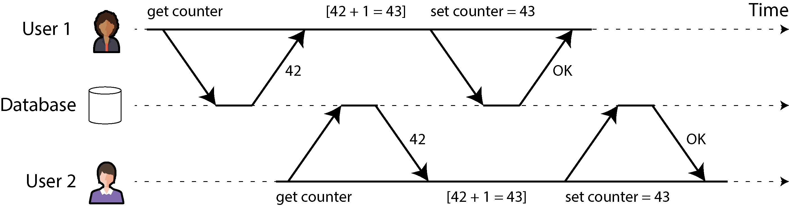
</div>

* **The Setup:** Database mein aik counter save hai jis ki shuruati value **42** hai. Do alag alag users (User 1 aur User 2) aik hi waqt mein is counter ko 1 number se barhana (increment karna) chahte hain. Agar dono ka kaam sahi ho, to final value **44** honi chahiye (42 + 1 + 1).
* **Step 1 (User 1 Reads):** User 1 database ko kehta hai `get counter`. Database check karta hai aur User 1 ko batata hai ke value **42** hai.
* **Step 2 (User 2 Reads Concurrently):** Abhi User 1 ne apni taraf se value update nahi ki thi ke isi doran User 2 ne bhi database ko kaha `get counter`. Database ne User 2 ko bhi bataya ke value **42** hai.
* **Step 3 (User 1 Local Calculation & Write):** User 1 apne computer par dimag lagata hai: `[42 + 1 = 43]`. Wo database ko kehta hai `set counter = 43`. Database isay save karta hai aur kehta hai **"OK"**. Database mein value ab 43 ho chuki hai.
* **Step 4 (User 2 Local Calculation & Write):** User 2 ko jo purani value 42 mili thi, wo bhi apne computer par wahi math karta hai: `[42 + 1 = 43]`. Wo database ko kehta hai `set counter = 43`. Database isay bhi save kar leta hai aur kehta hai **"OK"**.
* **The Bug (Lost Update):** Do logon ne counter barhaya, lekin final value **43** reh gayi! User 1 ka kiya hua kaam User 2 ne upar se mita (overwrite) kar diya. Isay computer ki zubaan mein **Race Condition** ya **Lost Update** kehte hain.

---

### Isolation

Upar jo counter ka masla hum ne dekha, usay hal karne ke liye **Isolation** ka concept aata hai. Jab bohot saare users aik hi waqt mein database use kar rahe hon, to wo aik doosre ke kaamon mein tang nahi ada sakte (they cannot step on each other's toes).

* **Serializability (The Ideal Level):** Purani kitabon ke mutabaq, isolation ka sab se top level **Serializability** hai. Is ka matlab yeh hai ke har transaction yeh tasawwur karti hai ke poore database par sirf wahi akeli chal rahi hai. Bhale hi background mein hazaron transactions chal rahi hon, database un ka result aisa nikalega jaise wo aik ke baad aik (serially) chali thin.
* **Performance Trade-off:** Lekin har cheez ko line mein khara karne se system slow ho jata hai (performance cost). Is liye aam zindagi mein databases itna sakht level use nahi karte, balke thode kamzoor levels use karte hain jaise **read-committed** ya **snapshot isolation**.
* **The Oracle Example:** Writer ne aik real-world fact bataya hai ke mashhoor database **Oracle** mein agar aap isolation level ka naam "serializable" set bhi kar dein, to bhi wo background mein asli serializability nahi deta, balke **snapshot isolation** deta hai, jo ke aik kamzoor guarantee hai aur us mein bhi kuch race conditions ho sakti hain.

---

### Durability

Durability ka matlab hai "Hamesha ke liye mahfooz". Yeh database ka aik aisa wada hai ke jab aap ki transaction aik baar **Commit (Kamyab)** ho gayi, to phir bhale hi computer achanak band ho jaye ya us ka hardware crash ho jaye, aap ka data kabhi gayab nahi hoga.

* **Single-node Database Mein:** Data ko memory (RAM) se nikaal kar non-volatile storage (Hard drive ya SSD) par likhna zaroori hota hai. RAM temporary hoti hai, light jate hi saaf ho jati hai.
* **fsync System Call:** Jab hum computer mein koi file write karte hain, to operating system pehle usay memory mein dabake rakhta hai. Databases is se bachne ke liye **fsync** naam ki aik command use karte hain jo operating system ko majboor karti hai ke data ko foran asli disk par pheko.
* **Write-Ahead Log (WAL):** Disk par asli data badlane se pehle database aik diary mein likhta hai ke "Mein yeh kaam karne laga hoon". Agar asli data likhte waqt computer crash ho jaye, to dobara chalne par database us diary (WAL) ko parh kar sab sahi kar deta hai. Is ke sath **checksums** use hote hain jo yeh check karte hain ke disk par likha hua data kahin toot-phoot (corrupt) to nahi gaya.
* **Replicated Database Mein:** Yahan durability ka matlab badal jata hai. Yahan data ko sirf aik disk par nahi likha jata, balke bohot saari alag alag machines (nodes) par copy kiya jata hai. Jab tak tay shuda machines par data nahi pahunch jata, database transaction ko commit nahi manta.

---

### Replication and Durability

Writer yahan aik bohot gahra design trade-off samjhate hain ke asli duniya mein **Perfect Durability (100% guarantee)** jaisi koi cheez nahi hoti. Har taknik ke apne faide aur nuksanat hain:

* **Flaw 1 (Machine Death):** Agar aap ne data disk par likh diya aur wo machine jal gayi, data ghumay ga nahi lekin jab tak machine theek nahi hoti, aap us data ko use nahi kar sakte. Replication is se bachati hai kyunke doosri machine chal rahi hoti hai.
* **Flaw 2 (Correlated Faults):** Agar achanak poore data-center ki banti chali jaye, ya software mein koi aisa bug ho jo har machine ko crash kar de, to agar data sirf memory mein tha to saari replicas se aik sath urh jayega. Is liye replicated systems mein bhi disk par likhna zaroori hai.
* **Flaw 3 (Asynchronous Replication Lag):** Agar data baqi machines par abhi ja hi raha tha aur main machine (leader) mar gayi, to jo naya data abhi raste mein tha wo hamesha ke liye gayab ho jata hai.
* **Flaw 4 (Hardware & SSD Realities):** Research se pata chala hai ke jab achanak light jati hai, to naye SSDs un guarantees ko tor dete hain jo unhon ne di hoti hain. Yahan tak ke `fsync` bhi sahi kaam nahi karta. Disk ke andar chalne wala software (firmware) bhi ghaltiyon se bhara ho sakta hai. Ek research mein dekha gaya ke aik khas firmware bug ki wajah se drives thik **32,768 hours** (taqreeban 3 saal aur 9 mahine) chalne ke baad achanak marna shuru ho gayin.
* **Flaw 5 (The fsync Difficulty):** `fsync` ko code mein sahi tarah use karna itna mushkil hai ke mashhoor database **PostgreSQL** bhi isay 20 saal tak thoda sa ghalat use karta raha aur unhein baad mein pata chala.
* **Flaw 6 (Bit Rot & Corruption):** Hard drive par para para data achanak khud hi kharab (corrupt) ho sakta hai bina kisi ko pata chale. Agar aisa ho jaye, to wo kharab data dheere dheere baqi copies (replicas) aur naye backups mein bhi phail jata hai. Is liye purane tarikhi backups (historical backups) rakhna zaroori hain.
* **Flaw 7 (SSD Bad Blocks):** Ek study ke mutabaq, **30% se 80% SSDs** apne pehle 4 saal ke andar kam az kam aik "bad block" (kharab hissa) peda kar leti hain, jisay un ka apna software bhi theek nahi kar pata. Magnetic hard drives poori tarah marnay mein aage hain, jabke SSDs mein chote chote hissay jaldi kharab hote hain.
* **Flaw 8 (Data Retention in Worn-out SSDs):** Agar aik SSD bohot zyada use ho chuki ho (worn-out) aur aap us ki power kaat dein, to garam mausam mein wo **kuch hafton se mahino ke andar** apna andar ka data bhoolna shuru kar deti hai!

**Natija (The Ultimate Trade-off):** Asli duniya mein koi bhi aik tarika perfect nahi hai. Behtareen software architecture wahi hai jo in saare tarikon—disk par likhna, remote replication karna, aur purane backups rakhna—ko aik sath mila kar use kare taake nuksan ka khatra kam se kam ho sake.

---


## Single-Object and Multi-Object Operations

Hum ne abhi tak dekha ke ACID mein **Atomicity** aur **Isolation** ka asal maqsad yeh hota hai ke agar aik user (client) aik hi transaction ke andar bohot saare writes (data save) kar raha hai, to database ko us haalat mein kaise behave karna chahiye:

* **Atomicity:** Agar bohot saare kaamon ki sequence ke beech mein koi error aa jaye, to transaction ko **Abort (cancel)** ho jana chahiye, aur ab tak jitna bhi kaam hua tha usay kachray mein phenk (discard) diya jana chahiye. Database aap ko "All-or-Nothing" (ya to poora ya kuch bhi nahi) ka wada de kar adhoori nakami (**partial failure**) ki fikar se bacha leta hai.
* **Isolation:** Aik sath chalne wali transactions aik doosre ke kaamon mein dakhal-andazi (interfere) nahi kar saktin. Agar aik transaction bohot saare writes kar rahi hai, to doosri transaction ko ya to wo saare writes aik sath mukammal dikhne chahiye, ya un mein se kuch bhi nahi dikhna chahiye. Aisa kabhi nahi hona chahiye ke usay sirf aadha-adhura badla hua data dikhe.

Yeh definitions yeh tasawwur karti hain ke aap aik sath bohot saare **objects (rows, records, ya documents)** ko badalna chahte hain. Isay **Multi-object transactions** kehte hain aur in ki zaroorat tab parti hai jab data ke mukhtalif hisson ko hamesha aik sath jura (in sync) rakhna ho.

---

#### Figure 8-2. Violating isolation: one transaction reads another transaction’s uncommitted writes (a “dirty read”)

Chalein is image (Figure 8-2) ke poore flow ko step-by-step bohot detail mein samajhte hain ke jab database Isolation ke rule ko torta hai, to kya ajeeb masla peda hota hai:

<div align="center">
  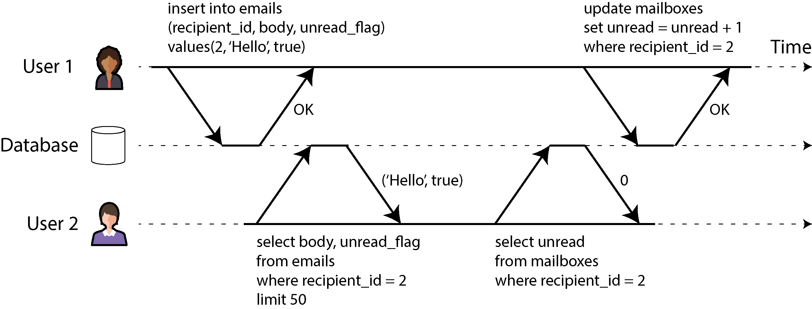
</div>

* **The Scenario:** Writer ne email application ki misal di hai. Agar humein kisi user ke unread emails count karne hon, to aam query yeh hoti hai: `SELECT COUNT(*) FROM emails WHERE recipient_id = 2 AND unread_flag = true`. Lekin agar emails hazaron mein hon, to yeh count lagana slow ho sakta hai. Is se bachne ke liye developers **Denormalization** karte hain—yaani aik alag table/field mein unread emails ka counter save kar dete hain (jaise `mailboxes` table mein `unread` ka column).
* **Step 1 (User 1 Inserts Email):** User 1 aik naya email insert karta hai: `insert into emails (recipient_id, body, unread_flag) values (2, 'Hello', true)`. Database isay save karta hai aur kehta hai **"OK"**. Lekin yaad rahe, abhi transaction commit (final save) nahi hui!
* **Step 2 (User 2 Reads the Email):** Isi dauran User 2 apni screen refresh karta hai aur database se query karta hai: `select body, unread_flag from emails where recipient_id = 2 limit 50`. Database User 2 ko wo email dikha deta hai: `('Hello', true)`. User 2 ko screen par naya email nazar aa jata hai.
* **Step 3 (User 2 Reads the Counter):** Ab User 2 ka software counter display karne ke liye doosri query chalata hai: `select unread from mailboxes where recipient_id = 2`. Database jawab deta hai: **0**.
* **Step 4 (User 1 Updates Counter):** User 2 ke parhne ke *baad*, User 1 ka software counter barhane ki query chalata hai: `update mailboxes set unread = unread + 1 where recipient_id = 2`. Database kehta hai **"OK"**.
* **The Anomaly (Ghalti):** User 2 ko apni screen par aik naya unread email dikh raha hai, lekin upar counter **0** dikha raha hai! Yeh aik adhoori aur galat state hai. Isay **Dirty Read** kehte hain (yaani kisi doosre ka uncommitted data parh lena). Agar yahan database **Isolation** lagata, to User 2 ko ya to email aur counter dono updated dikhte, ya dono purane dikhte, beech ki yeh ajeeb haalat kabhi nazar na aati.

> **Bacchon ki Tarah Asaan Samjhein:** Socho aap ke papa ne aap ke khilone wale dabbe mein aik nayi car daal di (Insert Email). Lekin abhi unhon ne bahar lage paper par car ki ginti (Counter) ko 0 se 1 nahi kiya tha. Aap ne dabba khola, aap ko andar car dikh gayi, lekin jab aap ne bahar paper par ginti parhi to wahan 0 likha tha. Aap confuse ho gaye ke yeh kya jadoo hai! Isolation ka matlab hai ke jab tak papa ginti bhi theek na kar lein, tab tak aap ko dabba kholne ki ijaazat hi na ho.

---

#### Figure 8-3. Atomicity ensures that if an error occurs, any prior writes from that transaction are undone, to avoid an inconsistent state.

Chalein ab is doosri image (Figure 8-3) ke step-by-step flow ko samajhte hain jo Atomicity ki zaroorat ko dikhati hai:

<div align="center">
  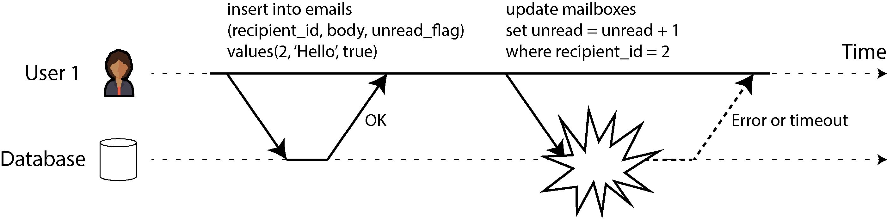
</div>

* **Step 1:** User 1 ne successfully email insert kar diya: `insert into emails...`. Database ne kaha **"OK"**.
* **Step 2:** User 1 ab counter barhane laga tha: `update mailboxes set unread = unread + 1...`. Lekin isi lamhe system mein **Error ya Timeout** aa gaya (jaise database ki jor se hard disk full ho gayi, ya network tar toot gaya).
* **The Danger (Bina Atomicity Ke):** Agar system mein atomicity na ho, to email to andar save reh jayega lekin counter hamesha ke liye purana (0) hi reh jayega. Data aapas mein out-of-sync ho jayega.
* **The Solution (Atomicity Ke Sath):** Atomicity database ko majboor karti hai ke chunke doosra kaam (counter update) fail ho gaya hai, is liye pehla kaam (email insert) bhi **Undo (Rollback)** kar diya jaye. Database us email ko mita dega taake system bilkul pehle jaisa saaf ho jaye, aur application bina kisi dar ke dobara poora kaam shuru (**retry**) kar sake.

---

#### Multi-Object Transactions Ki Pehchan

Multi-object transactions mein database ko kaise pata chalta hai ke kaun kaun si queries aik hi dabbe (transaction) ka hissa hain?

* **Relational Databases Mein:** Yeh kaam client ke **TCP Connection** ke zariye hota hai. Aik connection par jab client `BEGIN TRANSACTION` bhejta hai, us ke baad se lekar `COMMIT` bheyjne tak jitni bhi queries aati hain, database un sab ko aik hi transaction maanta hai. Agar beech mein TCP connection toot jaye, to database samajh jata hai ke kuch garbar hai aur wo sab abort kar deta hai.
* **Non-Relational (NoSQL) Databases Mein:** In mein aam tor par kaamon ko aik sath jurnay (group karne) ka aisa koi tarika nahi hota. Agar un ke paas koi `multi-put` API ho bhi (jis se aik sath bohot saari keys update hoti hain), to us ka yeh matlab nahi hota ke wo transaction hai. Ho sakta hai 5 keys update ho jayein aur baqi 5 fail ho jayein, jis se database adhoori haalat mein phans jata hai.

---

### Single-object writes

Atomicity aur Isolation sirf bohot saare records par hi nahi, balke **aik akele record/object** ko badalte waqt bhi utni hey zrori hain. Farz karein aap database mein aik bada **20 kB ka JSON document** save kar rahe hain:

1. Agar 10 kB data transfer hone ke baad internet connection kat jaye, to kya database us aadhe-adhure kharab JSON ko save kar ke baith jayega?
2. Agar database disk par purane data ke upar naya data likh raha ho aur achanak light chali jaye, to kya purana aur naya data aapas mein khichdi (spliced/corrupt) ban jayega?
3. Agar aik user us document ko abhi write (save) kar raha ho aur theek usi mili-second mein doosra user usay read kare, to kya usay adha naya aur adha purana data dikhega?

In intehai confuse karne wale maslon se bachne ke liye, taqreeban tamaam storage engines aik akele object (key-value pair ya single row) ke level par Atomicity aur Isolation lazmi dete hain.

* **Implementation Kaise Hoti Hai?** Single-object par Atomicity banane ke liye database recovery log (Crash recovery log) use karta hai, aur Isolation ke liye har object par aik **Lock** laga deta hai (yaani jab tak aik thread kaam kar rahi hai, doosri thread us object ko hath nahi laga sakti).
* **Complex Atomic Operations:** Kuch databases mazeed behtareen features dete hain jaise ke **Atomic Increment** (jo seedha database mein hi counter barha deta hai, jaise Redis mein hota hai, jis se Figure 8-1 wala read-modify-write ka lambay process se jaan choot jati hai). Isi tarah **Conditional Write** (yaani Compare-and-Set / CAS) hota hai, jo kehta hai ke data sirf tabhi save karo agar pichli baar se lekar ab tak kisi aur ne usay badla na ho.

> **Theoretical Nuance:** Writer batate hain ke lafz "Atomic Increment" mein jo "Atomic" hai, wo asal mein multithreaded programming wala hai (yaani concurrency se bachane wala). ACID ke mutabaq isay **Isolated ya Serializable Increment** kehna chahiye, lekin aam zubaan mein log isay atomic increment hi kehte hain.

* **NoSQL Limit:** databases jaise **Aerospike** aur **Cassandra/ScyllaDB** (lightweight transactions ke zariye) single-object level par bohot strong guarantees (linearizable reads aur conditional writes) dete hain, lekin un mein ek se zyada objects (multi-object) par koi guarantee nahi hoti.

---

### The need for multi-object transactions

Kya humein waqai multi-object transactions ki zaroorat hai? Kya hum sirf single-object operations use kar ke poori application nahi bana sakte?

Kuch simple kaamon mein single-object se guzara ho jata hai, lekin bohot saare real-world use cases mein humein multi-object transactions ki sakht zaroorat hoti hai:

1. **Foreign-Key / Graph References:** Relational databases mein aik table ki row doosre table ki row se linked hoti hai (Foreign Key). Graph databases mein aik point (vertex) doosre points se edges ke zariye jura hota hai. Agar aap do records insert kar rahe hain jo aalmi tor par aapas mein linked hain, to dono ka aik sath sahi save hona zaroori hai, warna reference toot jayega aur data ka koi matlab nahi rahega.
2. **Denormalization in Documents:** Document databases (jaise MongoDB) mein data aksar aik hi bade document ke andar hota hai, is liye single-document update se kaam chal jata hai. Lekin chunke un mein `JOIN` karne ki taqat nahi hoti, is liye developers ko data ki copies alag alag documents mein rakhni parti hain (**Denormalization**). Ab jab bhi wo data badlega, aap ko aik sath bohot saare documents ko update karna parega (jaise Figure 8-2 mein email aur counter alag alag documents thay). Agar transactions nahi hongi, to yeh data aapas mein out-of-sync ho jayega.
3. **Secondary Indexes:** Taqreeban har database mein secondary indexes hote hain (taake search tez ho sake). Jab bhi aap kisi record ko badalte hain, database ko background mein us ke saare indexes ko bhi update karna parta hai. Agar yahan transaction isolation na ho, to ho sakta hai aik record aik index mein to dikhe lekin doosre index mein gayab ho, kyunke doosra index abhi update hi nahi hua tha!

---

### Handling errors and aborts

Transactions ki sab se badi taqat hi yeh hai ke agar koi error aaye, to usay **Abort (cancel)** kar ke safely dobara chalaya (**retry**) ja sakta hai. ACID databases ka poora falsafa isi par khara hai: **"Database guarantees torney se behtar samajhta hai ke poore kaam ko hi cancel kar de, bajaye is ke ke aadha kaam chor de."**

Lekin har system is falsafay par nahi chalta:

* **Leaderless Replication Stores (e.g., Cassandra):** Yeh databases "Best Effort" par chalte hain. Un ka asool hota hai ke "Humein jitna ho saka hum ne kiya, agar beech mein error aa gaya to hum pehle se kiya hua kaam wapas undo nahi karenge". Is haalat mein error se nipatnay (recover karne) ki poori zimmedari application programmer par aa jati hai.

#### The Reality of Application Software & ORMs

Afsos ki baat yeh hai ke bohot saare developers sirf "Happy Path" (jab sab theek chal raha ho) ke baare mein sochte hain aur error handling ko ignore kar dete hain.

* **ORMs Ki Ghalti:** Mashhoor frameworks jaise **Rails ActiveRecord** aur **Django** ke ORMs aborted transactions ko khud-b-khud retry **nahi** karte. Jab database error bhejta hai, to yeh frameworks seedha exception (error) throw kar dete hain, jis se user ka enter kiya hua data zaya ho jata hai aur screen par error message aa jata hai. Yeh bohot buri baat hai kyunke rollback ka asal maqsad hi yeh tha ke software chupke se usay dobara chalaye (safe retry kare) aur user ko pata bhi na chale.

#### Retry Karne Ke Masle aur Limitations

Bhale hi retry karna aik behtareen tarika hai, lekin yeh bilkul perfect nahi hai. Is ke 5 bade masle hain:

1. **The Network Timeout Dilemma:** Farz karein database ne transaction ko successfully commit (save) kar diya, lekin confirmation ka signal client ko bhejte waqt network kat gaya. Client ko laga ke kaam fail ho gaya (Timeout). Agar client ab dobara retry karega, to wo kaam **do baar (duplicate)** ho jayega, jab tak ke aap ne application level par deduplication mechanism (jaise unique request IDs) na lagaya ho.
2. **System Overload / Feedback Cycles:** Agar database par pehle hi bohot zyada bojh (high contention/overload) hai aur transactions fail ho rahi hain, to har transaction ka baar baar retry karna bojh ko kam nahi karega, balke system ko mazeed jam kar dega. Is se bachne ke liye **Exponential Backoff** (yaani har fail ke baad rukne ka waqt barhana) aur retry ki aik limit lagana zaroori hai.
3. **Transient vs Permanent Errors:** Retry sirf temporary errors (jaise Deadlock, network ka lamhati jhatka, ya node failover) par hi faida mand hota hai. Agar error pakka (Permanent) hai—jaise koi rule toot raha ho (uniqueness constraint violation)—to 100 baar bhi retry karne se koi faida nahi hoga.
4. **Outside Side Effects:** Agar aap ki transaction ke andar database se baahir ke kaam bhi ho rahe hain—jaise user ko email bhejna—to har retry par user ko aik naya email chala jayega! Agar aap chahte hain ke database aur baahir ke baki systems (jaise email service) aik sath ya to commit hon ya abort hon, to aap ko **Two-Phase Commit (2PC)** use karna parega.
5. **Client Process Crash:** Agar retry karne ke dauran client ka apna computer (application server) hi crash ho jaye, to jo data wo save karne ki koshish kar raha tha, wo hamesha ke liye hawa mein gayab ho jata hai.

---

## Weak Isolation Levels

Agar do transactions alag alag data par kaam kar rahi hain, ya dono sirf data ko parh rahi hain (**read-only**), to unhein bilkul sukoon se aik sath parallel chalaya ja sakta hai. Masla tab shuru hota hai jab aik transaction data ko badal rahi ho (**modify**) aur theek usi waqt doosri transaction usay parhne ki koshish kare, ya phir dono transactions aik hi data ko aik sath badalna chahein. Tab peda hoti hain **Concurrency Issues** yaani **Race Conditions**.

---

### Concurrency Bugs Itnay Mushkil Kyun Hain?

Concurrency ke bugs ko dhoondna aur unhein theek karna software engineering mein sab se mushkil kaamon mein se aik mana jata hai. Is ki wajah yeh hai:

* **Kismat aur Timing ka Khel:** Yeh bugs testing ke dauran aam tor par nazar nahi aate. Yeh sirf tab samnay aate hain jab aap ki kismat kharab ho aur do requests ka timing bilkul micro-second ke farq se aapas mein takra jaye.
* **Reproduce Karna Na-mumkin:** Chunke yeh timing par depend karte hain, is liye agar aik baar koi bug aa bhi jaye, to dobara usay test kar ke check karna bohot mushkil hota hai.
* **Baray Codebase ki Complexity:** Ek bade software mein jahan hazaron lines ka code chal raha ho, aap ko andaza hi nahi hota ke kab kaunsa code background mein database ko touch kar raha hai.

> **Bacchon ki Tarah Asaan Samjhein:** Socho aik ghar mein do bache hain. Agar dono alag alag khilone se khel rahe hain, to koi larki nahi hogi (Safe Parallel Execution). Lekin agar dono ko aik hi khilona chahiye aur dono aik hi milli-second mein us par jhapattein, to un ka sir aapas mein takra jayega (Race Condition). Yeh takraav tabhi hoga jab timing bilkul perfect ho, warna aik pehle le lega aur doosra baad mein, aur aap ko kabhi pata hi nahi chalega ke yahan koi masla ho sakta tha.

---

### Isolation aur Serializability: Khwab vs Haqeeqat

Isi liye databases hamesha se developers se yeh saari mushkilaat chupane ki koshish karte aaye hain. Database kehta hai ke "Tum fikar mat karo, mein isolation apply karunga."

* **The Theory (Khwab):** Idealy, database aap ko **Serializable Isolation** deta hai. Is ka matlab hai ke aap ka code aise chalega jaise system mein koi doosra user hai hi nahi. Saari transactions line mein aik ke baad aik chalengi.
* **The Practice (Haqeeqat):** Lekin serializability ki aik keemat hoti hai—**Performance Cost**. Agar sab ko line mein khara kar diya jaye to database bohot slow ho jata hai. Is liye taqreeban tamaam databases jaan boojh kar **Weak Isolation Levels** (kamzoor isolation) use karte hain. Yeh levels kuch maslon ko to rok lete hain, lekin saare maslon ko nahi rok paate.

---

### Real-World Disasters (Haqeeqi Nuksaanat)

Writer samjhate hain ke weak isolation ki wajah se aane wale bugs koi kitabi baatein nahi hain, balke inhon ne asli duniya mein bohot tabahi machayi hai:

* **Bitcoin Exchange ka Diwala:** Ek mashhoor Bitcoin exchange is concurrency bug ki wajah se bilkul **bankrupt (kangal)** ho gayi, kyunke attackers ne un ke system se aik hi waqt mein bohot saari requests bhej kar naye coins nikalwa liye (Double Spending).
* **Auditors aur Data Corruption:** Is tarah ke bugs ki wajah se bade bade financial institutions ki auditing mein ghaltiyan niklin aur customers ka zaroori data hamesha ke liye corrupt ho gaya.
* **The Myth (Ek Purani Ghalat Fehmi):** Log aksar internet par kehte hain ke *"Agar tum financial (paise ka) data handle kar rahe ho, to ACID database use karo!"* Lekin writer is fehmi ko door karte hain ke **yeh kehna bilkul ghalat hai**. Kyunke jo mashhoor relational databases (MySQL, Postgres wagera) ACID kehlate hain, wo bhi default tor par **Weak Isolation** use karte hain! Is liye sirf ACID database rakhne se aap in bugs se nahi bach sakte jab tak aap ko un ke levels ka sahi ilm na ho.

---

### Banking System ki Ek Dilchasp Haqeeqat

Writer aik mazeed mazedaar real-world fact batate hain ke hamara jo aam banking system hai, wo mukammal tor par ACID properties par bharosa nahi karta.

* **The Secure FTP Reality:** Aaj bhi bohot saare banks aapas mein transaction ka data share karne ke liye raat ko aik text file banate hain aur usay **Secure FTP** ke zariye aik doosre ko bhejte hain.
* **Insaani Check aur Audit Trails:** Banks ke liye database ki technical sakhti se zyada yeh zaroori hota hai ke un ke paas **Audit Trail** (aik poori history ke paise kahan se aaye aur kahan gaye) ho aur insaani tor par fraud ko rokne ke tareeqay majood hon. Agar database mein koi concurrency bug aa bhi jaye, to wo raat ko file checking ke dauran ya audit mein pakda jata hai.

---

### Security aur Attacker ka Mindset

Agari point mein writer aik intehai zaroori security aspect samjhate hain.

Aap yeh soch sakte hain ke *"Chalo, aam zindagi mein to timing ka aisa takraav lakhon mein aik baar hota hai, to humein fikar karne ki kya zaroorat hai?"*

Lekin aap ko yeh nahi bhoolna chahiye ke **Attackers (hackers)** jaan boojh kar aap ke system par aik hi waqt mein hazaron **highly concurrent requests** (burst commands) bhejte hain. Un ka maqsad hi yeh hota hai ke system ke dimag ko ghumaya jaye aur concurrency bug ko trigger kar ke paise ya data churaya jaye. Is liye aik secure application banane ke liye aap ko in bugs ko jad se khatam karna parega.

---

### Agla Kadam (What's Next?)

Is section mein hum aage chal kar un saare weak isolation levels ko informal tareeqay se, bohot saari dilchasp real-world examples ke sath parhenge. Hum dekhenge ke kaunse level mein kaunsi race condition aati hai aur kis se bacha ja sakta hai, taake aap apne project ke liye behtareen faisla kar sakein. Jab yeh mukammal ho jayega, to hum aakhir mein detail mein **Serializability** ko bhi parhenge.

---

## Read Committed

Yeh transaction isolation ka sab se buniyadi aur pehla level hai. Jab koi database yeh daawa karta hai ke wo **Read Committed** level par chal raha hai, to wo aap ko do baaton ki pakki kasam (guarantees) deta hai:

1. **No Dirty Reads:** Jab aap database se koi data parhenge (**read** karenge), to aap ko sirf wohi data dikhega jo poori tarah commit (final save) ho chuka hai.
2. **No Dirty Writes:** Jab aap database mein koi data likhenge (**write** karenge), to aap sirf pehle se committed data ke upar hi overwrite kar sakte hain. Aap kisi ke adhoore (uncommitted) data ko mita nahi sakte.

Chalein in dono guarantees ko aik aik kar ke poori gehri detail mein samajhte hain.

---

### No dirty reads

Farz karein aik transaction ne database mein kuch naya data likha (write kiya), lekin abhi tak us transaction ne apna kaam khatam nahi kiya—yaani wo abhi tak na to **Commit** hui hai aur na hi **Abort** hui hai. Agar is doran koi doosri transaction aa kar us adhoore data ko parh sakti hai, to is ghalti ko **Dirty Read** kehte hain.

Read-Committed isolation level ka sab se bada kaam hi yeh hai ke wo dirty reads ko rokay. Is ka matlab yeh hua ke agar Transaction A koi data badal rahi hai, to us ka badla hua data baqi logon ko sirf aur sirf tabhi nazar aayega jab Transaction A kamyab (commit) ho jayegi.

---

#### Figure 8-4. No dirty reads: user 2 sees the new value for x only after user 1’s transaction has committed

Chalein is image (Figure 8-4) ke aik aik step ko timeline ke mutabaq break down karte hain ke Read-Committed level dirty reads ko kaise rokta hai:

<div align="center">
  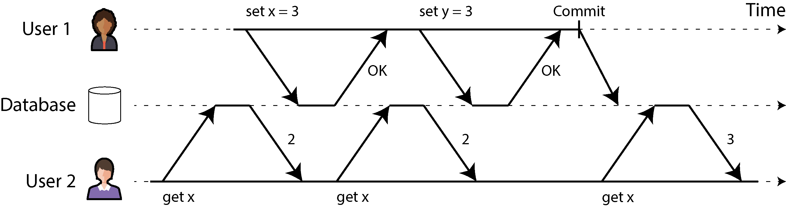
</div>

* **Initial State:** Database mein aik variable `x` hai jis ki shuruati value **2** hai.
* **Step 1 (User 2 Reads):** User 2 pehli baar query karta hai `get x`. Database check karta hai ke kya `x` par koi chal rahi transaction hai? Abhi tak kuch nahi tha, to database User 2 ko value **2** bhej deta hai.
* **Step 2 (User 1 Writes x):** User 1 apni transaction shuru karta hai aur kehta hai `set x = 3`. Database apni memory mein isay 3 to kar deta hai aur User 1 ko **"OK"** bhej deta hai, lekin abhi yeh commit nahi hua!
* **Step 3 (User 2 Reads Concurrently):** Isi dauran User 2 dobara query chalata hai `get x`. Bhale hi User 1 ne `x` ko 3 kar diya hai, lekin chunke User 1 abhi tak commit nahi hua, is liye database User 2 ko purani committed value yaani **2** hi dikhata hai. **Yeh hai "No Dirty Read" ka saboot.**
* **Step 4 (User 1 Writes y):** User 1 apna doosra kaam karta hai: `set y = 3`. Database isay bhi **"OK"** keh deta hai.
* **Step 5 (User 1 Commits):** User 1 apna saara kaam mukammal kar ke **Commit** bhejta hai. Ab database dono values (`x=3` aur `y=3`) ko pakka save kar ke sab ke liye khol deta hai.
* **Step 6 (User 2 Reads Finally):** Ab User 1 ke commit karne ke *baad* jab User 2 teesri baar `get x` chalaayega, to database usay nayi value yaani **3** de dega.

---

#### Dirty Reads Ko Rokna Kyun Zaroori Hai? (Theoretical Reasons)

Writer ne is ke do bohot bade architectural reasons bataye hain:

1. **Partial Updates Se Bachna:** Agar aik transaction ko 5 alag alag rows ko update karna hai, aur database dirty reads allow kar de, to doosri transaction ko system adha badla hua aur adha purana dikhega. Jaisa hum ne pichli email wali misal (Figure 8-2) mein dekha tha ke naya email to dikh raha tha lekin counter 0 tha. Aisi adhoori haalat users ko confuse kar deti hai aur software ke doosre hissay is ghalat data ki wajah se ghalat faislay kar sakte hain.
2. **Cascading Aborts Se Bachna:** Farz karein Transaction A ne data badla aur abhi commit nahi kiya tha. Transaction B ne us adhoore data ko parh kar (Dirty Read kar ke) aage apna koi bada calculation shuru kar diya. Lekin achanak Transaction A mein koi error aaya aur wo **Abort (Rollback)** ho gayi (yaani us ka data mita diya gaya). Ab chunke Transaction B ne aik aise data par kaam shuru kiya tha jo kabhi asliyat mein save hi nahi hua, is liye majbooran database ko Transaction B ko bhi abort karna parega. Agar Transaction B se aage kisi aur ne data parha tha, to usay bhi abort karna parega. Is lambay nuksan aur dominos effect ko **Cascading Aborts** kehte hain. No Dirty Reads is musibat ko jadd se khatam kar deta hai.

> **Bacchon ki Tarah Asaan Samjhein:** Socho aik painter aik board par painting bana raha hai. Abhi us ne sirf aadhi sketch banayi hai aur painting poori nahi hui (Uncommitted state). Agar koi bacha achanak aa kar us aadhi painting ko dekh kar kahani banana shuru kar de, aur baad mein painter ko painting pasand na aaye aur wo poora board saaf kar ke naye siray se kuch aur banana shuru kar de (Abort), to bache ki banayi hui kahani bilkul be-maani aur ghalat ho jayegi. Is liye rule yeh hai ke jab tak painter "Done" (Commit) na keh de, tab tak kisi ko dekhne ki ijaazat nahi hai!

---

### No dirty writes

Agar do transactions aik hi waqt mein database ki **aik hi row** ko update karne ki koshish karein, to kya hoga? Humesha yeh mana jata hai ke jo write aakhir mein aayega, wo pehle wale write ke upar overwrite ho jayega.

Lekin socho agar pehla write chalane wali transaction abhi tak commit nahi hui thi, aur doosri transaction ne aa kar us uncommitted value ke upar apna naya data likh diya, to isay **Dirty Write** kehte hain. Read-Committed level dirty writes ko sakhti se rokta hai. Is ka tarika yeh hota hai ke agar Transaction B us row par write karna chahe jahan Transaction A pehle se kaam kar rahi hai, to database Transaction B ko tab tak ke liye **delay (rok)** deta hai jab tak Transaction A commit ya abort na ho jaye.

---

#### Figure 8-5. With dirty writes, conflicting writes from different transactions can be mixed up

Chalein is used-car sales website wali dilchasp misal (Figure 8-5) ko step-by-step break down karte hain ke jab dirty writes hote hain, to data ka kachra kaise banta hai:

<div align="center">
  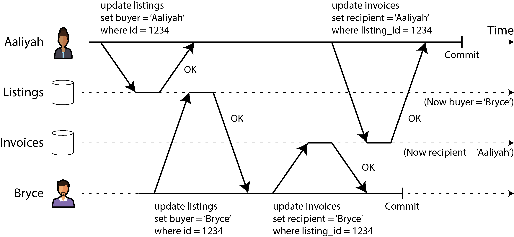
</div>

* **The Goal:** Aik purani gari bik rahi hai (id = 1234). Is ko khareedne ke liye database mein do kaam karne hain: pehla `listings` table mein khareedne wale ka naam likhna hai, aur doosra `invoices` table mein usay bill (invoice) bhejna hai.
* **Step 1 (Aaliyah Writes Listings):** Aaliyah gari khareedne ke liye button dabati hai. Us ki transaction `listings` table ko update karti hai: `set buyer = 'Aaliyah'`. Database kehta hai **"OK"**. Lekin Aaliyah ne abhi commit nahi kiya.
* **Step 2 (Bryce Dirty Writes Listings):** Theek isi lamhe Bryce bhi wahi gari khareedne ka button dabata hai. Agar dirty write allow ho, to Bryce ki transaction Aaliyah ke uncommitted data ke upar apna naam likh degi: `set buyer = 'Bryce'`. Database kehta hai **"OK"**. Ab `listings` mein buyer Bryce ban chuka hai.
* **Step 3 (Bryce Writes Invoices):** Bryce ki transaction aage barhti hai aur bill apne naam karti hai: `set recipient = 'Bryce'` in `invoices` table. Database kehta hai **"OK"**. Phir Bryce **Commit** kar deta hai.
* **Step 4 (Aaliyah Writes Invoices):** Ab Aaliyah ki transaction jo pehle step ke baad ruki hui thi, wo apna doosra kaam karti hai aur bill apne naam karne ki query chalati: `set recipient = 'Aaliyah'` in `invoices` table. Wo Bryce ke committed data ke upar apna naam overwrite kar deti hai kyunke us ke dimag mein tha ke pehla kaam to mera hi chal raha hai. Phir Aaliyah bhi **Commit** kar deti hai.
* **The Disaster (Mishap):** Ab final data check karein! `listings` table keh raha hai ke gari **Bryce** ne khareedi hai, lekin `invoices` table keh raha hai ke bill **Aaliyah** ko jana chahiye! Gari kisi aur ki ho gayi aur paise koi aur bhar raha hai. Yeh tabahi is liye hui kyunke Bryce ko Aaliyah ke uncommitted listings data par dirty write karne ki ijaazat mili thi. Read-Committed level isay har giz hone nahi deta.

> **Important Limitation:** Yaad rahe ke Read-Committed level pichli counter increment wali race condition (Figure 8-1) ko **nahi rok sakta**. Kyunke counter wale maslay mein doosra write pehli transaction ke *commit hone ke baad* aata hai, is liye wo dirty write nahi kehlata. Wo aik alag kism ka bug hai jisay "Lost Update" kehte hain, aur usay rokne ke tarike hum agay parhenge.

---

### Implementing read-committed

Chunke yeh isolation level bohot zyada kaamad hai, is liye yeh **Oracle Database, PostgreSQL, Microsoft SQL Server** aur kayi doosre mashhoor databases ka **Default Setting** hota hai.

Databases is ko background mein kaise chalaate hain? Is ki engineering ke do bade hissay hain:

#### 1. Row-Level Locks (Dirty Writes Ko Rokne Ke Liye)

Dirty writes se bachne ke liye databases taqreeban hamesha **Row-level locks** (taalay) use karte hain.

* Jab bhi koi transaction kisi row ya document ko badalna (modify) chahti hai, to database automatically us row par aik **Write Lock** laga deta hai.
* Jab tak wo transaction poori tarah commit ya abort nahi ho jati, wo tala us row par laga rehta hai.
* Aik waqt mein sirf aik hi transaction us talay ki chabi rakh sakti hai. Agar koi doosri transaction us row par kuch likhna chahegi, to database usay line mein khara kar dega (delay karega) jab tak pehli transaction tala khol nahi deti.

#### 2. Dirty Reads Ko Rokna: Locks vs MVCC

Dirty reads ko rokne ke do tarike ho sakte hain:

* **Tarika A (Read Locks):** Aik tarika yeh ho sakta hai ke jab kisi ko data parhna ho, to wo bhi thodi der ke liye us row par lock lagaye aur parhte hey tala khol de. Is se koi bhi adhoori value parh nahi sakega kyunke write transaction ne pehle hi tala lagaya hoga.
* *Nuksan:* Yeh tarika asli zindagi mein bohot bura sabit hota hai. Agar koi aik lambi write transaction chal rahi hai, to wo saare parhne wale (read-only) users ko block kar ke bitha degi, bhale hi unhon ne database mein kuch badalna na ho. Is se pooray software ki speed slow ho jati hai.
* *Kahan use hota hai?* Phir bhi kuch databases isay use karte hain jaise **IBM Db2** aur **MS SQL Server** (agar us mein `read_committed_snapshot=off` set kiya gaya ho).


* **Tarika B (Old/New Version Keeping - MVCC):** Yeh sab se mashhoor aur kamal ka tarika hai (jo Figure 8-4 mein dikhaya gaya hai). Database har badli jaane wali row ke **do versions** apne dimag mein yaad rakhta hai:
1. **Old Value:** Jo pehle se committed aur safe thi.
2. **New Value:** Jo abhi chal rahi uncommitted transaction likh rahi hai.


Jab tak naya kaam chal raha hai, dukan mein aane wale baqi saare parhne wale users ko database chupke se **Old Value** utha kar deta rehta hai. Unhein line mein khara hoke intezar nahi karna parta. Aur jaise hi nayi transaction commit hoti hai, database purani value ko mita kar sab ko nayi value dena shuru kar deta hai. Isay **Multi-Version Concurrency Control (MVCC)** ka aghaaz bhi kehte hain.

#### Read Uncommitted (Bonus Weakest Level)

Kuch databases is se bhi aik darja neechay ka level support karte hain jisay **Read Uncommitted** kehte hain.

* Yeh dirty writes ko to rokta hai (locks ke zariye), lekin dirty reads ko **nahi rokta**.
* Yaani agar koi transaction aadha kaam kar ke baithi hai, to yeh level foran sab ko wo adhoora data dikhana shuru kar deta hai.
* Is ka faida sirf yeh hota hai ke database ko aik row ke do versions yaad nahi rakhne parte, jis se thodi performance tez ho jati hai, lekin yeh data mein bohot saari ghaltiyan la sakta hai.

---

## Snapshot Isolation and Repeatable Read

Agar aap upar upar se **Read Committed** isolation level ko dekhein, to aap ko lagega ke yeh aik transaction ke saare zaroori kaam poore kar deta hai: yeh aborts allow karta hai (Atomicity ke liye), adhoore data ko parhne se rokta hai, aur do user ke writes ko aapas mein mix hone se bachata hai. Yeh bilkul sahi hai, aur yeh guarantees un systems se kahin zyada behtareen hain jo transactions ko support hi nahi karte.

Lekin, Read-Committed isolation use karte hue bhi **Concurrency Bugs** (aik sath kaam hone wale maslay) aane ke bohot se tareeqay hain. Is ki aik bohot bari misal humein **Figure 8-6** mein dikhayi gayi hai, jisay samajhna bohot zaroori hai.

---

#### Figure 8-6. Read skew: Aaliyah observes the database in an inconsistent state

Chalein is image (Figure 8-6) ki timeline ko step-by-step bohot gehri detail mein break down karte hain ke kaise paise hawa mein gayab hote hue dikhte hain:

<div align="center">
  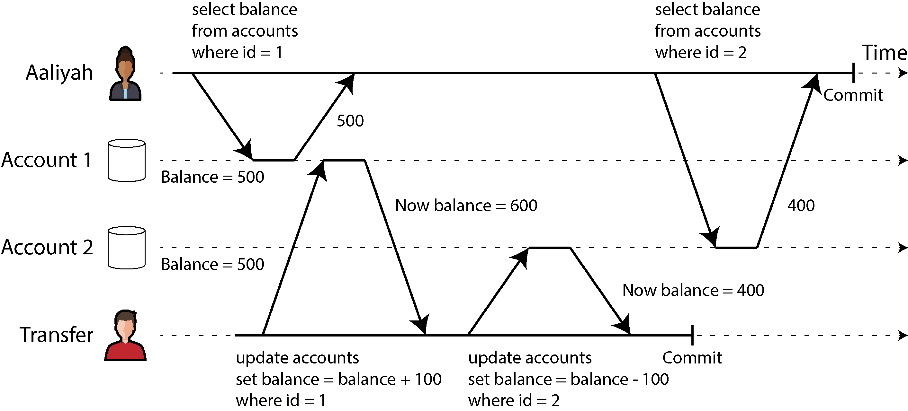
</div>

* **The Setup:** Aaliyah ke bank mein total **$1,000** save hain, jo do alag alag accounts (Account 1 aur Account 2) mein **$500** aur **$500** kar ke rakhe hue hain. Background mein aik doosri transaction chal rahi hai (Transfer Transaction) jo Account 2 se $100 nikaal kar Account 1 mein transfer kar rahi hai.
* **Step 1 (Aaliyah Reads Account 1):** Aaliyah apna bank account check karti hai. Us ki pehli query `select balance from accounts where id = 1` chalti hai. Database kehta hai ke Account 1 mein **$500** hain.
* **Step 2 (Transfer Tx Updates Account 1):** Theek isi lamhe transfer karne wali transaction pehla write karti hai: `set balance = balance + 100 where id = 1`. Account 1 ka balance ab **$600** ho jata hai.
* **Step 3 (Transfer Tx Updates Account 2 & Commits):** Transfer transaction apna doosra kaam karti hai: `set balance = balance - 100 where id = 2`. Account 2 ka balance ab **$400** ho jata hai. Is ke baad yeh transaction **Commit** (final save) ho jati hai.
* **Step 4 (Aaliyah Reads Account 2):** Ab thodi der baad Aaliyah ki transaction apni doosri query chalati hai: `select balance from accounts where id = 2`. Chunke transfer transaction ab commit ho chuki hai, is liye database Aaliyah ko naya committed balance dikhata hai yaani **$400**.
* **The Anomaly (Read Skew / Nonrepeatable Read):** Aaliyah jab apni screen par total dekhti hai, to usay Account 1 mein $500 aur Account 2 mein $400 nazar aate hain. Total banta hai **$900**! Aaliyah pareshan ho jati hai ke mere **$100 hawa mein gayab ho gaye!**

Is maslay ko computer ki zubaan mein **Read Skew** ya **Nonrepeatable Read** kehte hain. Is ka matlab hai ke agar Aaliyah Account 1 ko dubara parhay gi, to usay pehli query se alag value ($600) nazar aayegi.

> **Aooloen ke Mutabaq Yeh Sahi Hai?** Read-Committed isolation ke mutabaq yeh ghalti bilkul acceptable (jaiz) hai! Kyunke Aaliyah ne jo bhi balances dekhe ($500 aur $400), wo us lamhe database mein poori tarah committed thay. Database ne koi adhoora data usay nahi dikhaya.

---

#### Temporary Inconsistency Kahan Kahan Tabahi Machati Hai?

Aaliyah ke case mein yeh koi permanent masla nahi hai, kyunke agar wo do second baad apni bank app ko refresh karegi, to usay dono accounts updated dikhenge ($600 aur $400 = $1,000). Lekin kuch aise scenarios hain jahan yeh lamhati ghalti bhi bilkul bardasht nahi ki ja sakti:

1. **Backups (Database Ka Backup Lena):** Agar aap ka database bohot bada hai, to backup lene mein ghanto lag sakte hain. Is dauran database mein naye writes chalte rahenge. Agar backup lete waqt Read Skew aa gaya, to backup ke aik hissay mein purana data hoga aur doosre hissay mein naya. Agar kabhi aap ko is backup se database restore karna para, to wo gayab hone wale paise hamesha ke liye permanent gayab ho jayenge!
2. **Analytical Queries and Integrity Checks:** Baray businesses aksar aisi lambi queries chalate hain jo poore database ko scan kar ke report banati hain (Analytics) ya data corruption check karti hain. Agar data check karte waqt hi background mein badal raha ho, to report ka result bilkul be-maani (nonsensical) niklega.

#### Hal: Snapshot Isolation

Is maslay ka sab se behtareen hal **Snapshot Isolation** hai. Idea yeh hai ke har transaction database ke aik **Consistent Snapshot (aik frozen photo)** se data parhti hai. Transaction jab shuru hoti hai, us lamhe tak ka jitna committed data hota hai, wo freeze ho jata hai. Us ke baad bhale hi background mein doosri transactions lakhon tabdeelian kar lein, is chalne wali transaction ko hamesha wahi purana frozen data hi dikhega.

Snapshot isolation bohot mashhoor feature hai aur isay **PostgreSQL, MySQL (InnoDB engine ke sath), Oracle, aur SQL Server** support karte hain. Google BigQuery jaise cloud data warehouses bhi isay analytics ke liye use karte hain.

---

### Multiversion concurrency control

Snapshot isolation ko implement karne ke liye databases aik kamal ki taknik use karte hain jisay **Multiversion Concurrency Control (MVCC)** kehte hain.

* **The Core Principle:** Performance ke lihaz se is ka sab se bada asool yeh hai ke **Readers kabhi Writers ko nahi roktay, aur Writers kabhi Readers ko nahi roktay (Readers never block writers, and writers never block readers).** Is wajah se lambi analytical queries sukoon se apna kaam karti rehti hain aur data save karne wale users ko line mein khara nahi hona parta.
* **Multi-Version Keeping:** Read Committed mein database row ke sirf do versions rakhta tha (purana aur naya). Lekin MVCC mein database ko aik row ke **bohot saari committed versions** yaad rakhni parti hain, kyunke background mein chalne wali mukhtalif transactions ko alag alag waqt ka snapshot chahiye hota hai.

---

#### Figure 8-7. Implementing snapshot isolation using multiversion concurrency control

Chalein ab **Figure 8-7** ko poori bareeki se dekhte hain ke PostgreSQL is MVCC ko background mein kaise chalata hai. Har row ke sath do khufia fields hoti hain:

1. `inserted_by`: Kis transaction ne is row ko banaya.
2. `deleted_by`: Kis transaction ne is row ko delete karne ki request ki (shuru mein yeh empty hoti hai).

<div align="center">
  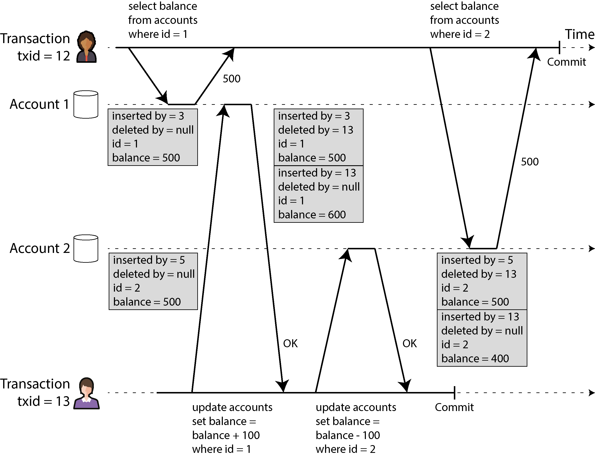
</div>

* **Step 1 (Transaction IDs):** Jab bhi koi transaction shuru hoti hai, usay aik unique aur hamesha barhne wala number milta hai jisay **Transaction ID (txid)** kehte hain. Yahan Aaliyah ki transaction ka `txid = 12` hai aur Transfer transaction ka `txid = 13` hai.
* **Step 2 (Aaliyah Reads Account 1):** Tx 12 (Aaliyah) pehli query chalaati hai. Wo Account 1 par parhi row ko dekhti hai jis par likha hai `inserted_by = 3` (jo purani committed transaction thi) aur `deleted_by = null`. Tx 12 ko balance **$500** mil jata hai.
* **Step 3 (Transfer Tx Updates Data):** Tx 13 (Transfer) ab Account 1 aur Account 2 ko update karti hai. MVCC mein update ka matlab hota hai **aik Delete aur aik Insert**.
* **Account 1 par:** Purani row ($500 wali) ko database se delete nahi kiya jata, balke us ke `deleted_by` column mein **13** likh diya jata hai. Aur theek us ke neeche aik nayi row insert ki jati hai jis par `inserted_by = 13` aur balance **$600** likha hota hai.
* **Account 2 par:** Purani row ($500 wali) ke `deleted_by` mein **13** likha jata hai aur aik nayi row insert hoti hai jis par `inserted_by = 13` aur balance **$400** likha hota hai. Phir Tx 13 commit ho jati hai.


* **Step 4 (Aaliyah Reads Account 2):** Ab Tx 12 (Aaliyah) Account 2 ko parhne aati hai. Us ke samnay do rows hain ($500 wali aur $400 wali).
* Wo $400 wali row ko dekhti hai, us par likha hai `inserted_by = 13`. Chunke **13** number Tx 12 ke apne number se bara hai (yaani yeh transaction mere baad shuru hui thi), is liye Aaliyah is row ko **ignore (invisible)** kar deti hai.
* Wo $500 wali row ko dekhti hai, us par likha hai `deleted_by = 13`. Chunke delete karne wale ka number bhi 13 hai (jo ke baad ka hai), is liye Aaliyah is deletion ko bhi ignore karti hai aur usay lagta hai ke yeh row abhi zinda hai. Natija? Aaliyah ko yahan bhi balance **$500** hi dikhta hai!


* **Result:** Aaliyah ko dono accounts mein $500 aur $500 dikha. Total **$1,000** bilkul accurate aur consistent raha!

> **Garbage Collection (GC) / Vacuum:** Aap soch rahe honge ke is tarah to database rows se bhar jayega. Bilkul! Is liye background mein aik **Garbage Collector (PostgreSQL mein isay Vacuum kehte hain)** chalta reha hai. Jab use pakka pata chal jata hai ke ab duniya mein koi bhi aisi transaction zinda nahi hai jisay purani rows dekhni hon, to wo un marked-for-deletion rows ko saaf kar ke jagah khali kar deta hai.

---

### Visibility rules for observing a consistent snapshot

Database kaise faisla karta hai ke kaunsi row kis transaction ko dikhani hai aur kaunsi chupani hai? Is ke liye **Visibility Rules** (dekhne ke asool) banaye gaye hain:

Jab koi transaction shuru hoti hai, to database us lamhe zinda chalne wali (in-progress/uncommitted) saari transactions ki aik list bana leta hai. Database in 4 rules par chalta hai:

1. **Ignore In-Progress Writes:** Agar koi transaction chal rahi thi aur us ne abhi tak commit nahi kiya tha jab hamari transaction shuru hui, to us ke kiye gaye saare writes ko **ignore** kar diya jayega (chahe wo baad mein commit hi kyun na ho jaye).
2. **Ignore Future Transactions:** Har woh write jis ka `txid` hamari transaction ke `txid` se bara hai (yaani jo hamare baad shuru hui), usay mukammal tor par **ignore** kar diya jayega, chahe wo commit ho chuki ho ya nahi.
3. **Ignore Aborted Transactions:** Agar koi transaction fail (abort) ho gayi, to us ke likhe huay saare data ko **ignore** kiya jayega. Is ka faida yeh hai ke abort hone par database ko foran data mitaane ki mehnat nahi karni parti, rules khud hi usay filter kar dete hain.
4. **Visible Data:** Baqi bacha hua saara data application ko nazar aayega.

Aasan alfaaz mein, aik row sirf tabhi **Visible** hoti hai jab:

* Row ko insert karne wali transaction hamari transaction ke shuru hone se **pehle commit** ho chuki ho.
* Row par delete ka nishan na ho, ya agar ho, to delete karne wali transaction hamari transaction ke shuru hone tak **commit na hui** ho.

---

### Indexes and snapshot isolation

Multiversion (MVCC) database mein **Indexes** kaise kaam karte hain?

* **Linked List Approach:** Sab se aam tarika yeh hai ke index ka har entry row ke kisi aik version (ya to sab se purane ya sab se naye) ki taraf ishara (point) karta hai. Row ke saare versions aapas mein aik **Linked List** ke zariye jure hote hain. Jab koi query index ke zariye data dhoondti hai, to wo is list ke upar iterate karti hai aur visibility rules ke mutabaq sahi row utha leti hai.
* **PostgreSQL Optimization:** Postgres mein aik optimization hoti hai ke agar aik row ke naye versions aik hi page (disk block) ke andar fit aa jayein, to index ko bar bar update nahi karna parta. Baqi kuch databases poori row ki copy save karne ke bajaye sirf versions ka farq (**differences**) save karte hain taake space bache.

#### Append-only / Immutable B-Trees (CouchDB, Datomic, LMDB)

Kuch databases (jaise CouchDB wagera) MVCC chalane ke liye bilkul alag rasta ikhtiyar karte hain. Wo **Immutable B-trees (Copy-on-write)** use karte hain.

* **No Overwriting:** Jab data badalta hai, to yeh tree ke purane pahnay (pages) ke upar overwrite nahi karte, balke badle hue page ki aik **nayi copy** bana dete hain.
* **Root Update:** Us page ke upar jitne bhi parent pages hote hain, un ki bhi nayi copies banti jati hain jab tak hum tree ki jadd (**Root**) tak na pahunch jayein. Jo pages update se mutasir nahi hote, unhein naye tree ke sath share kar liya jata hai.
* **Instant Snapshot:** Is tarah har naya write transaction tree ka aik naya Root bana deta hai. Wo root khud hi apnay aap mein aik mukammal consistent snapshot hota hai. Yahan `txid` ke rules laga kar rows filter karne ki zaroorat hi nahi parti, kyunke naya write purane tree ko chhu hi nahi sakta!

---

### Snapshot isolation, repeatable read, and naming confusion

MVCC aur Snapshot Isolation databases mein bohot zyada use hote hain, lekin in ke **Naamon Ka Aik Bohot Bara Confusion** hai jis se har developer ka pala parta hai:

| Database | Snapshot Isolation Ka Un Ka Naam | Actual Meaning In Database |
| --- | --- | --- |
| **PostgreSQL** | Repeatable Read | True Snapshot Isolation |
| **Oracle** | Serializable | True Snapshot Isolation (Weaker than actual Serializability!) |
| **MySQL (InnoDB)** | Repeatable Read | MVCC variant (Weaker than true Snapshot Isolation) |
| **IBM Db2** | Repeatable Read | Strict Serializability (Top Level Locking) |

#### Yeh Confusion Kyun Hai? (The SQL Standard Flaw)

Is confusion ki wajah **SQL Standard (1992)** hai. Jab SQL standard ne isolation levels ko define kiya tha, us waqt tak **Snapshot Isolation ijaad hi nahi hui thi!** Standard ne 1975 ke IBM System R ke asoolon par "Repeatable Read" ko define kiya tha jo is se thoda alag tha.

Jab baad mein snapshot isolation aayi, to **PostgreSQL** ne dekha ke hamari snapshot isolation standard ke "Repeatable Read" ki saari sharait poori karti hai, to unhon ne standard ka rules follow karne ke liye is ka naam "Repeatable Read" rakh diya.

Asal baat yeh hai ke **SQL standard ki definition kharab, adhuri aur ambiguous hai**. Har database company standard ka naam use karti hai lekin peeche apni marzi ki engineering chalaati hai. Is liye asli zindagi mein kisi ko sahi se nahi pata ke "Repeatable Read" ka asli matlab kya hai jab tak aap us khas database ki gehrai ko na parhein.

---

## Preventing Lost Updates

Ab tak hum ne **Read Committed** aur **Snapshot Isolation** mein jo bhi baatein ki hain, un ka poora focus is cheez par tha ke jab background mein naye writes ho rahe hon, to aik **Read-only transaction** (sirf parhne wali transaction) ko data kaise dikhta hai. Hum ne is baat ko bilkul ignore kiya tha ke agar **do transactions aik sath data likh rahi hon (concurrent writes)** to kya masla hoga. Hum ne sirf **Dirty Writes** par baat ki thi, jo ke do writes ke aapas mein takraav (write-write conflict) ki aik choti si kism hai.

Asli duniya mein concurrent writes ke darmiyan aur bhi bohot dilchasp kism ke takraav ho sakte hain. In mein sab se zyada mashhoor aur dangerous masla **Lost Update Problem** (gumnaam update ka masla) hai, jis ki aik misal hum ne counter increment (Figure 8-1) mein dekhi thi.

### Lost Update Problem Kya Hai Aur Yeh Kab Hota Hai?

Yeh masla tab peda hota hai jab aap ki application database se koi value parhti hai, us ko badalti hai, aur phir badli hui value ko wapas database mein save karti hai. Is poore ghum ghumaye chakar ko **Read-Modify-Write Cycle** (Parhna-Badalna-Likhna ka chakar) kehte hain.

Agar do transactions bilkul aik hi waqt mein yeh chakar chala rahi hon, to un mein se aik transaction ka badla hua data **lost (hawa mein gayab)** ho jata hai, kyunke doosra user pehle wale ki tabdeeli ko dekhe bagair us ke upar apna naya data likh deta hai. Hum kehte hain ke baad wale write ne pehle wale write ko **clobber (kuchal/mita)** diya.

Writer ne is ki teen bari real-world misalein di hain:

1. **Counter ya Account Balance Barhana:** Pehle maujooda balance parho (Read), us mein naye paise jama karo (Modify), aur phir naya total save karo (Write).
2. **Complex Data (JSON) mein Local Tabdeeli:** Ek bade JSON document ke andar kisi list mein aik naya element shamil karna. Is ke liye pehle poore JSON ko khol kar parhna parta hai (Parse), phir list mein naam add karna hota hai, aur poora JSON wapas save karna parta hai.
3. **Wiki Page Editing:** Do users aik hi waqt mein aik hi wiki page ko khol kar edit kar rahe hain. Jab dono save ka button dabayenge, to jo bhi poora text pehle bhejega, doosra user poora text bhej kar pehle wale ke saare kaam par paani pher dega.

Chunke yeh bohot hi aam aur har jagah aane wala masla hai, is liye is ko hal karne ke liye bohot se behtareen tareeqay banaye gaye hain. Chalein in sab ko aik aik kar ke gehrai mein samajhte hain.

---

### Atomic write operations

Bohot saari databases built-in **Atomic Update Operations** deti hain. In ka faida yeh hota hai ke aap ko application ke code mein "Read-Modify-Write" ka lamba chakar chalane ki zaroorat hi nahi parti. Agar aap ka kaam in operations ke zariye ho sakta hai, to yeh sab se behtareen aur mahfooz hal mana jata hai.

Relational databases mein aap yeh modern aur safe query chala sakte hain:

```sql
UPDATE counters 
SET value = value + 1 
WHERE key = 'foo';

```

#### Code Ki Detail Explanation:

* **Pehle Kya Hota Tha:** Pehle application chalane ke liye pehle `SELECT value FROM counters...` chala kar variable mein data laya jata tha, phir code mein `value = value + 1` kar ke dobara `UPDATE` query chalayi jati thi. Is doran doosra user beech mein aa jata tha.
* **Ab Kya Hota Hai:** Is single atomic query mein aap database ko seedha keh rahe ho ke `value = value + 1` kar do. Database yeh kaam aik hi jhatke mein khud background mein karta hai. Kisi doosre user ko beech mein taang adane ka mauqa hi nahi milta.

Isi tarah Document databases (jaise **MongoDB**) JSON document ke kisi aik hissay ko atomic tareeqay se badalney ki taqat dete hain, aur **Redis** complex data structures (jaise priority queues) ko atomic tareeqay se update karne ke tools deta hai.

> **Bareek Nuance (Limitations):** Har kaam atomic operations se asani se nahi kiya ja sakta. Jaise wiki page par poora paragraph badalna aik mushkil editing hai (is ke liye advanced algorithms jaise CRDTs use hote hain). Lekin jahan simple maths ya counter ho, wahan yeh behtareen hain.

#### Implementation Kaise Hoti Hai?

Databases in atomic operations ko chalane ke liye us object/row par aik **Exclusive Lock** laga dete hain jab usay parha ja raha hota hai, taake jab tak naya write apply na ho jaye, koi aur usay hath na laga sake. Doosra asaan tarika yeh hota hai ke database un saare atomic operations ko aik akele thread (**Single Thread**) par line mein khara kar ke chalata hai.

#### ORM Frameworks Ka Khufia Khatra

Writer aik bohot zaroori warning dete hain ke jo naye frameworks hain jaise **Rails ActiveRecord** ya **Django ORM**, wo developers ka kaam asaan karne ke chakar mein background mein unsafe Read-Modify-Write cycles chala dete hain. Developer ko lagta hai ke code safe hai, lekin background mein lost update ka bug chup kar baith jata hai jisay pakadna bohot mushkil hota hai.

---

### Explicit locking

Agar database ke paas koi aisa built-in atomic operation majood na ho jo aap ka kaam kar sake, to doosra hal yeh hai ke aap ka software khud database ki rows ko pakad kar **Explicitly Lock (jaan boojh kar taala)** laga de.

Jab application khud tala laga degi, to wo sukoon se apna Read-Modify-Write ka chakar chala sakti hai. Agar koi doosri transaction us row ko badalney ya us par naya tala lagane ki koshish karegi, to database usay tab tak ke liye **Wait (intezar)** karwayega jab tak pehli transaction apna kaam khatam kar ke tala khol nahi deti.

#### Real-World Example: Multiplayer Game

Farz karein aik aisi multiplayer game chal rahi hai jahan bohot saare players aik hi waqt mein aik hi robot (figure) ko aage peeche move kar sakte hain. Yahan simple atomic update kaam nahi karega, kyunke robot ko move karne se pehle application ko game ke complex rules check karne hain (jaise: kya robot is khane mein ja bhi sakta hai ya nahi?). Yeh logic aap aik simple SQL query ke andar nahi likh sakte. Is ke liye humein **Explicit Locking** karni paregi.

Chalein is ka behtareen aur modern code dekhte hain:

```sql
-- Transaction ka aghaaz
BEGIN TRANSACTION;

-- Robot ki row ko parho aur sath hi lock kar do
SELECT * FROM figures
 WHERE name = 'robot' AND game_id = 222
 FOR UPDATE;

-- Application ab code mein game ke rules check karegi (Validation logic).
-- Rules check karne ke baad, position ko update kiya jayega.
UPDATE figures 
   SET position = 'c4' 
 WHERE id = 1234;

-- Saara kaam pakka save karo aur tala kholo
COMMIT;

```

#### Code Ki Detail Explanation:

* `BEGIN TRANSACTION;`: Yahan se hum ne apni transaction ka dabba shuru kiya.
* `FOR UPDATE;`: Yeh is code ka sab se main lafz hai. Yeh database ko saaf hukam de raha hai ke is query se jo bhi rows nikal kar aayengi, un par foran **Write Lock** laga do. Jab tak hum commit nahi karte, koi aur player is robot ki row ko touch bhi nahi kar sakta.
* `UPDATE figures...`: Jab game rules confirm ho gaye, hum ne robot ki nayi position `c4` save kar di.
* `COMMIT;`: Kaam khatam hua, data save ho gaya aur tala khul gaya taake ab doosra player khel sake.

#### Is Ke Do Baray Nuqsanat (Risks):

1. **Bhoolne Ka Khatra:** Developer agar code mein kisi aik jagah bhi `FOR UPDATE` lagana bhool gaya, to poore system mein dobara race condition aa jayegi aur data kharab ho jayega.
2. **Deadlocks (Aapsi Phansaav):** Agar Transaction A ne Row 1 ko lock kiya aur Row 2 ka intezar kar rahi hai, aur theek usi waqt Transaction B ne Row 2 ko lock kiya hua hai aur Row 1 ka intezar kar rahi hai, to dono hamesha ke liye phans jayengi. Isay **Deadlock** kehte hain. Databases automatic tor par deadlock pakad kar kisi aik transaction ko abort (kill) kar dete hain, aur application ko usay dobara retry karna parta hai.

---

### Automatically detecting lost updates

Atomic operations aur explicit locks ka asool yeh tha ke wo doosre users ko line mein khara kar ke kaamon ko serial (aik ke baad aik) chalate hain. Aik aur naya aur advanced tarika yeh hai ke **sab ko parallel chalne do!** Transactions aapas mein parallel chalti rehti hain. Lekin database ka jo **Transaction Manager** hota hai, wo chupke se sab par nazar rakhta hai. Agar usay andaza ho jaye ke kisi transaction ki wajah se **Lost Update** ka bug aa raha hai, to wo foran ghalti karne wali transaction ko **Abort (cancel)** kar deta hai aur application ko kehta hai ke "Tumhara naya data purane ko mita raha tha, is liye chupke se apna chakar dobara chalao (Retry karo)."

#### Mukhtalif Databases Ka Behavior:

* **PostgreSQL (Repeatable Read Level), Oracle (Serializable Level), aur SQL Server (Snapshot Isolation Level):** Yeh teeno databases itni samajhdar hain ke jab bhi lost update hone lagta hai, yeh automatically usay detect kar ke us transaction ko fail kar deti hain taake data bach jaye.
* **MySQL / InnoDB (Repeatable Read Level):** **Yeh database lost update ko detect NAHI kar sakti!** Kuch bade authors ka manna hai ke jo database lost update ko na rok sakay, wo asli snapshot isolation kehlaane ke kabil hi nahi hai. Is liye is definition ke mutabaq MySQL asli snapshot isolation nahi deti.

#### Is Ka Sab Se Bada Faida:

Developer ko code mein koi special lock ya query likhne ki mehnat nahi karni parti. Sab kuch database background mein khud b khud (automatically) sambhal leta hai, jis se ghalti ka chance bohot kam ho jata hai. Bas aap ko application level par abort hone wali transactions ko **retry** karne ka code likhna parta hai.

---

### Conditional writes (compare-and-set)

Jo databases (jaise kuch NoSQL stores) proper transactions support nahi kartay, un mein aksar aik feature hota hai jisay **Conditional Write** ya **Compare-and-Set (CAS)** kehte hain. Is ka asool yeh hai ke aap ka update sirf aur sirf tabhi kaamyab hoga agar aap ke last read karne se lekar ab tak kisi aur ne us data ko badla na ho. Agar data badal chuka hai, to query ka koi asar nahi hoga aur aap ko dobara try karna parega. Yeh bilkul computer ke CPU ke andar chalne wale CAS instruction ki tarah hai.

Farz karein do users aik hi wiki page ko edit kar rahe hain. Hum chahte hain ke update sirf tab ho agar page ka content abhi tak purana hi ho:

```sql
-- Yeh query chalegi lekin is ki safety database ki andaruni implementation par depend karti hai
UPDATE wiki_pages 
   SET content = 'new content'
 WHERE id = 1234 AND content = 'old content';

```

#### Code Ki Detail Explanation:

* `WHERE id = 1234 AND content = 'old content'`: Database query chalate waqt check karega ke kya `content` abhi bhi wahi purana `old content` hai jo user ne parha tha? Agar beech mein kisi aur ne save kar ke usay badal diya hoga, to yeh `WHERE` clause match nahi karega, aur query **0 rows updated** jawab degi. Software samajh jayega ke kaam fail ho gaya hai aur wo user ko dobara refresh karne ka kahega.

> **Optimistic Locking:** Poore bade paragraph/content ko aapas mein compare karne mein bohot memory zaya hoti hai. Is se bachne ke liye behtareen tarika yeh hai ke table mein aik **Version Number** ka column rakh diya jaye (jaise version 1, version 2). Har update par version 1 se 2 ho jata hai. Query check karti hai `WHERE id = 1234 AND version = 1`. Is behtareen taknik ko **Optimistic Locking** kehte hain.

#### MVCC Ka Ek Khass Asool (Exception)

Aap soch rahe honge ke Snapshot Isolation (MVCC) mein to chalne wali transaction ko hamesha purana data hi dikhta hai, to use kaise pata chalega ke kisi aur ne background mein data badal diya hai?

Bohot saari MVCC implementations mein is scenario ke liye visibility rules ka aik **Exception (anokha asool)** hota hai. Jab baki saari queries snapshot par chal rahi hoti hain, tab bhi `UPDATE` aur `DELETE` queries ke andar ka jo `WHERE` clause hota hai, wo direct disk par ja kar bilkul **latest committed value** ko dekhta hai. Is wajah se conditional write sahi kaam kar pata hai.

---

### Conflict resolution and replication

Jab hum **Replicated Databases** (jahan data ki copies mukhtalif shehron ya machines par hoti hain) ki baat karte hain, to lost update ko rokna aik bilkul naye darjay par chala jata hai.

Locks lagana ya Conditional writes karna yeh tasawwur karta hai ke poori duniya mein data ki sirf **aik hi pakki copy** majood hai jis par taala lagaya ja sake. Lekin jo databases **Multi-Leader** ya **Leaderless Replication** use karti hain, wo aik hi waqt mein duniya ke alag alag koonon mein naye writes allow karti hain aur baad mein data ko aahista aahista aapas mein copy (**asynchronously replicate**) karti hain. Is liye wahan locks ya CAS bilkul nakaam ho jate hain.

Duniya ke phailay hue replicated databases is maslay se nipatnay ke liye do alag tareeqay use karti hain:

#### 1. Creating Conflicting Versions (Siblings)

Bohot saari databases concurrent writes ko aapas mein takraane deti hain aur aik hi cheez ke do alag alag versions (**siblings**) bana kar save kar leti hain. Baad mein application ke code ka ya special software ka kaam hota hai ke wo in dono uljhay hue versions ko aapas mein joday (merge kare).

#### 2. Commutative Updates & CRDTs

Agar updates **Commutative** hon (yaani un aage peeche karne se final result par koi farq na pare), to unhein aaram se merge kiya ja sakta hai aur lost update se bacha ja sakta hai.

* **Misal:** Ek counter mein +1 karna aur phir +2 karna. Bhale hi Machine A par pehle +1 ho aur Machine B par pehle +2 ho, aakhir mein dono ka total same (+3) hi aayega.
* Isi tarah kisi set mein naya element add karna bhi commutative hai. Yeh kamal ka concept **CRDTs** (Conflict-free Replicated Datatypes) ke peeche use hota hai, jo bina kisi lock ke data ko automatic theek kar deta hai.

#### Last Write Wins (LWW) Ka Nuqsan

Lekin agar aap ka replicated database default tor par **Last Write Wins (LWW)** use kar raha hai (yaani jis ka computer clock ka time naya hoga, us ka data rakhlo aur purane wale ka mita do), to wahan **Lost Update ka bug lazmi aayega**. Kyunke naye time wali request purani request ko bina merge kiye hamesha ke liye kachray mein phenk deti hai.

**Aakhri Sabaq:** Asli zindagi mein koi bhi aik tarkeeb absolute guarantee nahi deti. Behtareen engineering yeh hai ke aap in saare risk-reduction tareeqon ko samajh kar apne system ke mutabaq sahi design decision lein!

---

## Write Skew and Phantoms

Jab do alag alag transactions parallel chalti hain, to parallel writes ke darmiyan takraav (conflict) ke masle sirf lost update tak hi mehdood nahi hote. Is section mein hum kuch aise subtle (bareek) software bugs ko dekhenge jo data ko kharab kar dete hain, bhale hi database mein basic safety lagayi gayi ho.

Writer isay samjhane ke liye aik hospital ki real-world misal dete hain:

* Farz karein aik hospital mein doctors ki **on-call duty (shift)** ko manage karne ke liye aik application chal rahi hai.
* Hospital ka asool (requirement) yeh hai ke aik waqt mein aik shift mein bohot saari doctors on-call ho sakti hain, lekin **kam az kam aik (1) doctor ka on-call rehna lazmi hai**. Koi bhi doctor apni duty chor sakti hai (jaise agar wo bimar ho), lekin sirf tab jab koi doosra colleague wahan duty par majood ho.

Ab farz karein ke **Aaliyah** aur **Bryce** do doctors hain jo aik hi shift (id = 1234) par on-call hain. Donon ki tabiyat achanak kharab ho jati hai aur dono aik hi waqt mein duty chorne (off-call jaane) ke liye software par button daba dete hain. Ab dekhte hain ke background mein kya tabahi hoti hai.

---

## Figure 8-8. A write skew causing an application bug

Chalein aap ki bheji gayi image (Figure 8-8) ke poore flow aur code ko step-by-step timeline ke mutabaq bohot gehri detail mein break down karte hain:

### Initial Database State:

Database mein `doctors` ka table hai jo shuru mein aisa dikhta hai:

* `Aaliyah` -> `on_call = True`
* `Bryce`  -> `on_call = True`
* `Caleb`  -> `on_call = False`

Yahan shift ID 1234 mein total **2** doctors on-call hain (Aaliyah aur Bryce). Rule ke mutabaq 2 >= 1 hai, is liye abhi tak system bilkul sahi haalat mein hai.

### The Concurrent Timeline Flow:

<div align="center">
  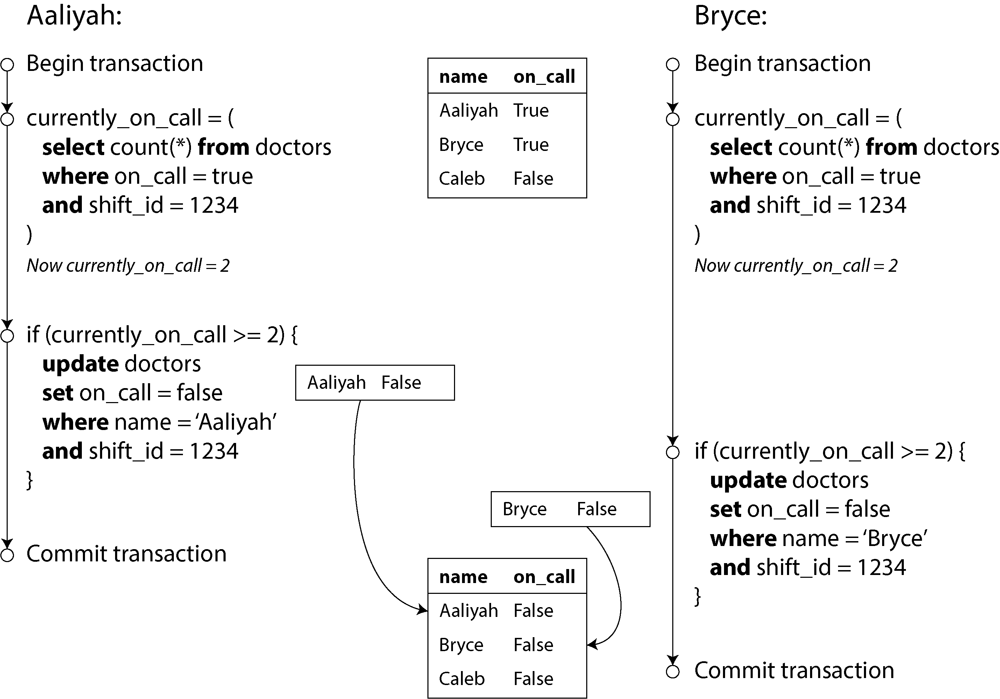
</div>

* **Step 1 (Dono Ka Count Query Chalana):** Aaliyah aur Bryce dono parallel mein apni apni transactions shuru karte hain.
* Aaliyah ka software query chalata hai ke abhi is shift par kitne doctors on-call hain? Database count nikal kar bhejta hai: **2**.
* Theek usi mili-second mein Bryce ka software bhi wahi query chalata hai. Chunke database **Snapshot Isolation** use kar raha hai, is liye Bryce ko bhi purana snapshot dikhta hai jahan abhi tak koi tabdeeli nahi hui thi. Database Bryce ko bhi count bhejta hai: **2**.


* **Step 2 (Application Decision - If Condition):**
* Aaliyah ka software check karta hai: `if (currently_on_call >= 2)`. Chunke count 2 hai, to condition true ho jati hai. Software samajhta hai ke "Aaliyah agar chali bhi jaye, to aik doctor pehle se majood hai, is liye leave allow hai."
* Bryce ka software bhi apne computer par wahi check lagata hai: `if (currently_on_call >= 2)`. Us ke paas bhi count 2 aya tha, to condition true ho jati hai. Wo bhi samajhta hai ke "Leave dena bilkul safe hai."


* **Step 3 (The Write & Overwrite/Commit):**
* Aaliyah ki transaction table mein update karti hai: `set on_call = false where name = 'Aaliyah'`. Aur transaction **Commit** ho jati hai.
* Bryce ki transaction bhi apni row ko update karti hai: `set on_call = false where name = 'Bryce'`. Aur wo bhi **Commit** ho jati hai.


* **The Final Disaster (Bug):** Ab final database state check karein! Aaliyah bhi `False` ho gayi, Bryce bhi `False` ho gaya, aur Caleb pehle se hi `False` tha. Shift mein **0** doctors on-call reh gaye! Hospital ka sab se sakht rule ("kam az kam aik doctor hona chahiye") poori tarah toot gaya.

> **Bacchon ki Tarah Asaan Samjhein:** Socho aik kamray ka ek hi darwaza hai jis par do security guards kharay hain. Rule yeh hai ke darwaza kabhi khali nahi chorna. Pehla guard sota hai: "Mein washroom chala jata hoon, doosra guard to khara hai." Theek usi waqt doosra guard bhi sota hai: "Mein khana khane chala jata hoon, pehla guard to khara hai." Chunke dono aik doosre se pooche bagair aik sath faisla karte hain, dono kamray se bahar nikal jate hain aur darwaza bilkul khali ho jata hai!

---

## Characterizing write skew

Is ajeeb o gareeb anomaly (ghalti) ko computer science mein **Write Skew** kehte hain.

* **Yeh Lost Update Kyun Nahi Hai?** Yeh na to dirty write hai aur na hi lost update. Lost update tab hota jab Aaliyah aur Bryce dono **aik hi row** ko badalne ki koshish karte. Yahan Aaliyah ne apni row badli hai aur Bryce ne apni row badli hai (two different objects). Dono ne aik doosre ka likha hua data upar se mitaaya (clobber) nahi hai.
* **Phir Yeh Concurrency Bug Kyun Hai?** Yeh bilkul aik race condition hai. Agar yeh dono transactions parallel chalne ke bajaye aik ke baad aik (serially) chaltin, to pehli doctor off-call chali jati, aur jab doosri doctor check karti to database count sirf **1** bhejta. If condition `1 >= 2` fail ho jati aur doosri doctor ko system janay se rok deta.

Writer batate hain ke Write Skew asal mein **lost-update problem ka aik bara roop (generalization)** hai. Agar do transactions parallel mein data parhein aur phir alag alag rows ko update karein, to write skew hota hai. Agar khush-kismati ya bad-kismati se dono aik hi row ko update kar dein, to wo lost update ban jata hai.

### Purane Fixes Yahan Kyun Nakaam Hote Hain? (Trade-offs)

Jo tareeqay hum ne lost update ko rokne ke liye parhe thay, wo write skew ke samnay bilkul be-bas ho jate hain:

1. **Atomic Single-Object Operations Nakaam:** `UPDATE doctors SET on_call = false...` jaisi simple atomic query yahan kaam nahi kar sakti, kyunke check karne ke liye humein bohot saari rows ka count chahiye, aur badalna humein kisi aur row ko hai. Aik se zyada rows involved hain.
2. **Automatic Lost Update Detection Nakaam:** Databases (jaise Postgres, Oracle, SQL Server) ka automatic engine lost update tabhi pakadta hai jab do log aik hi row par takraayein. Chunke yahan rows alag alag thin, is liye database ka automatic system is ghalti ko **detect nahi kar paata**. Is ko pakadne ke liye humein asli **Serializable Isolation** chahiye.
3. **Database Constraints Nakaam:** Databases mein uniqueness constraint (jaise ID unique ho) ya foreign key lagana asaan hai. Lekin aik aisa rule lagana jo poore table ke columns ka total check kare ("at least one true"), aam databases ke constraints ke bas ki baat nahi hai. Is ko karne ke liye advanced **triggers** ya **materialized views** likhne parte hain jo kafi bhaari (expensive) partay hain.

### Behtareen Hal: Explicit Locking (`FOR UPDATE`)

Agar aap ka database serializable level par nahi chal raha, to is write skew se bachne ka doosra behtareen aur safe hal yeh hai ke aap **Explicit Locking** use karein. Aap queries ko is tarah likhenge:

```sql
-- Transaction shuru karein
BEGIN TRANSACTION;

-- Count check karne wali rows ko pehle hi lock kar dein
SELECT * FROM doctors
 WHERE on_call = true
   AND shift_id = 1234 
FOR UPDATE;

-- Application ab check karegi ke agar rows ki ginti 2 ya us se zyada hai:
UPDATE doctors
   SET on_call = false
 WHERE name = 'Aaliyah'
   AND shift_id = 1234;

-- Saara kaam pakka save karein aur taalay kholein
COMMIT;

```

#### Code Ki Detail Explanation:

* `FOR UPDATE`: Yeh lafz database ko hukam deta hai ke shift number 1234 ke jitne bhi doctors abhi active (`on_call = true`) hain, un saari rows ko pakad kar **Write Lock** laga do.
* **Is Ka Faida:** Jab Aaliyah ki transaction yeh query chalayegi, to wo Aaliyah aur Bryce dono ki rows ko lock kar degi. Jab Bryce parallel mein apni transaction shuru kar ke check karne aayega, to database usay **rok dega (wait karwayega)** kyunke un rows par Aaliyah ne pehle se taala lagaya hua hai. Bryce tab tak check hi nahi kar sakega jab tak Aaliyah ka faisla commit nahi ho jata. Is tarah data bilkul safe rahega.

---

## More examples of write skew

Writer kehte hain ke write skew shuruat mein aik ajeeb aur mushkil kitabi masla lagta hai, lekin jab aap aik baar is ko samajh lete hain, to aap ko asli software architecture mein is ki hazaron misalein nazar aane lagti hain:

### 1. Meeting room booking system

Farz karein aap aik aisa software bana rahe hain jahan company ke log meeting rooms book karte hain. Rule yeh hai ke **aik hi room aik hi waqt mein do alag meetings ke liye book nahi ho sakta**.

Aap ka code aisa dikhta hai:

```sql
BEGIN TRANSACTION;

-- Check karein ke kya room 123 pehle se 12 se 1 baje ke darmiyan book to nahi hai?
SELECT COUNT(*) FROM bookings
 WHERE room_id = 123 
   AND end_time > '2025-01-01 12:00' 
   AND start_time < '2025-01-01 13:00';

-- Agar upar wali query ne 0 returned kiya (yaani room khali hai):
INSERT INTO bookings (room_id, start_time, end_time, user_id)
VALUES (123, '2025-01-01 12:00', '2025-01-01 13:00', 666);

COMMIT;

```

#### Masla (The Bug):

Under Snapshot Isolation, agar do users aik hi waqt mein Room 123 ko 12 se 1 baje ke liye book karne ka button dabayenge, to dono ki select query **0** return karegi. Dono ka software samjhega ke room khali hai aur dono table mein do alag rows `INSERT` kar denge. Room **Double-book** ho jayega! Is se bachne ke liye bhi serializable isolation lazmi hai.

### 2. Multiplayer game

Pichle section mein hum ne robot ko move karne ke liye row lock ki thi taake lost update na ho. Lekin lock do alag players ko do alag robots utha kar **board ke aik hi khane (same position)** par lane se nahi rok sakta. Agar game ka rule hai ke aik khane mein aik hi robot hoga, to do alag robots ko parallel move karne se write skew aa jayega aur dono aik hi jagah aakar baith jayenge.

### 3. Claiming a username

Ek website par jab naya user account banata hai, to check kiya jata hai ke kya yeh **username** pehle se majood to nahi? Agar do log aik hi waqt mein "hashim12" naam rakhne ki koshish karein, to snapshot isolation mein dono ko username khali milega aur dono ka account ban jayega.

* *Khush-kismati ka hal:* Yahan humein kisi lambay software logic ki zaroorat nahi parti, kyunke database ka simple **Uniqueness Constraint** (`UNIQUE` key) hi kafi hai. Jab doosri transaction commit hone lagegi, database constraint tootney ki wajah se usay automatically abort kar dega.

### 4. Preventing double-spending

Paise ya loyalty points kharch karne wali apps mein yeh check karna parta hai ke user ke paas total balance positive (plus mein) hai ya nahi. Software pehle aik tentative spending row insert karta hai, phir saari rows ka sum nikalta hai. Agar do kharchay aik hi waqt mein parallel insert ho jayein, to dono ka sum check pass ho jayega lekin final balance **Negative (minus)** mein chala jayega, kyunke dono transactions ko aik doosre ke kharche ka pata hi nahi chala.

---

## Phantoms causing write skew

Agar aap upar di gayi tamaam misalon par ghor karein, to in ka aik hi **3-step pattern** nazar aayega:

1. **The Check (SELECT):** Ek select query chalti hai jo database mein dhoondti hai ke kya hamari requirement poori ho rahi hai ya nahi (jaise: kitne doctors hain? kya room khali hai? balance kitna hai?).
2. **The Decision:** Us query ke result ko dekh kar application ka code faisla karta hai ke aage barhna hai ya error dikhana hai.
3. **The Write (Action):** Agar code aage barhne ka faisla karta hai, to wo database mein `INSERT`, `UPDATE`, ya `DELETE` karta hai aur transaction commit kar deta hai.

Is write ka asar step 1 ke check ko poori tarah badal deta hai. Agar aap transaction commit karne ke baad step 1 wali query dubara chalayenge, to aap ko bilkul alag result milega (doctor kam ho chuka hoga, room book ho chuka hoga, ya balance kam ho chuka hoga).

#### Phantom Kya Hai? (The Core Theoretical Concept)

> **Definition:** Jab aik transaction ka kiya hua write (data save karna) kisi doosri transaction ki chalne wali search query (SELECT) ka result hi badal de (yaani naye records peda kar de ya mita de), to is asar ko database ki duniya mein **Phantom** (Aasaib/Saya) kehte hain.

#### `FOR UPDATE` Yahan Kyun Fail Ho Jata Hai? (The Great Catch!)

Doctor wali misal mein jo row hum badal rahe thay (Aaliyah ki row), wo pehle step ke SELECT query mein majood thi. Is liye hum ne `SELECT FOR UPDATE` chala kar us row par taala laga diya aur system safe ho gaya.

Lekin meeting room booking ya username wali misal mein masla bilkul ulta hai! Wahan hum check kar rahe hain **rows ki gair-majoodgi (absence of rows)**. Hum dhoond rahe hain ke "kya 12 se 1 baje ka booking record **nahi** hai?".

* Agar room khali hai, to SELECT query return karegi **0 rows**.
* Ab socho, agar query ne 0 rows nikal kar di hain, to `SELECT FOR UPDATE` **kis cheez par taala lagayega?** Kuch bhi nahi! Wo hawa par taala nahi laga sakta. Rows to abhi tak insert hi nahi huin!
* Is liye yahan phantoms ki wajah se snapshot isolation mein write skew ko rokna aam locks ke bas ka kaam nahi hota.

---

## Materializing conflicts

Agar phantoms ka sab se bara masla hi yeh hai ke database mein lock lagane ke liye koi row (object) majood hi nahi hoti, to kya hum **jaan boojh kar nakli rows (artificial lock objects)** database mein nahi bana sakte? Bilkul bana sakte hain!

Meeting room booking ki misal lein:

* Hum database mein aik naya table banate hain jis ka naam rakh dete hain `time_slots`.
* Is table mein hum pehle se hi aane wale 6 mahino ke saare rooms aur un ke 15, 15 minutes ke time slots ki rows khud se insert kar ke rakh dete hain (jaise: Room 123 - 12:00 to 12:15, Room 123 - 12:15 to 12:30 wagera).
* Ab jab bhi koi user Room 123 ko 12 se 1 baje ke liye book karne lagega, to hamari transaction pehle `bookings` table ko nahi dekhegi. Wo pehle is nakli `time_slots` table mein jayegi aur un 4 rows ko chalayegi: `SELECT ... WHERE room_id = 123 AND time BETWEEN 12:00 AND 13:00 FOR UPDATE;`.
* Chunke yeh rows table mein pehle se majood hain, database un par **pakka write lock** laga dega. Ab koi parallel user un slots ko hath nahi laga sakega. Jab lock mil jaye, to application purani tarah check kar ke asli `bookings` table mein entry insert kar degi.

Is ajeeb o gareeb taknik ko **Materializing Conflicts** kehte hain, kyunke yeh aik hawaai maslay (phantom) ko pakad kar database ki concrete (asli zinda) rows par aik lock conflict bana deti hai.

### Is Ka Bara Trade-off (Nuksan)

Bhale hi yeh tarika kaam karta hai, lekin asli software architecture mein isay aik **Last Resort (aakhri hal)** samjha jana chahiye jab koi aur rasta na bacha ho. Is ki do bari wajah hain:

1. **Error-Prone & Complex:** Yeh dhoondna aur manage karna bohot mushkil hai ke har scenario ke liye nakli tables kaise banayein aur unhein har saal kaise populate karein. Is mein ghalti ka chance bohot hota hai.
2. **Ugly Architecture:** Yeh bohot bura lagta hai ke database ka aik concurrency control ka masla hal karne ke liye aap ko apni application ka saaf suthra data model (tables layout) kharab karna paray aur faltu tables banane parein.

**Final Conclusion:** Is gande tarike se bachne ka sab se behtareen aur asaan tarika yeh hai ke aap hamesha **Serializable Isolation Level** ka istemal karein, jis ko hum aglay section mein poori detail aur asaan alfaz ke sath parhenge!

---


## Serializability

Hum ne ab tak is chapter mein aisi bohot saari transactions dekhin jin mein alag alag kism ke race conditions (concurrency bugs) aa jate hain. Kuch bugs ko Read Committed aur Snapshot Isolation rok lete hain, lekin **Write Skew** aur **Phantoms** jaise khufia maslon ke samnay yeh isolation levels bilkul har maan lete hain. Yeh aik intehai pareshan-kun haalat hai:

* **Naamon Ka Khel:** Isolation levels ko samajhna bohot mushkil hai, aur har database company inhein alag tarah implement karti hai (jaise hum ne dekha ke mukhtalif databases mein "Repeatable Read" ka matlab bilkul alag nikalta hai).
* **Code Par Nazar Rakhna Mushkil:** Sirf application ka code dekh kar yeh andaza lagana taqreeban na-mumkin hai ke kya isay kisi khas isolation level par chalana safe hoga ya nahi. Aik bade software mein jahan hazaron kaam aik sath ho rahe hon, wahan yeh complexity mazeed barh jati hai.
* **Testing Ki Nakaami:** Hamare paas aise koi behtareen tools nahi hain jo in race conditions ko pehle se pakad sakein. Testing is liye nakaam ho jati hai kyunke yeh bugs timing par depend karte hain. Jab aap ki kismat kharab ho aur micro-seconds ka jhatka lage, tabhi yeh samnay aate hain.

Yeh koi naya masla nahi hai, balke 1970s se jab se weak isolation levels ijaad hue hain, tab se chala aa raha hai. Lekin is poore daur mein computer science ke researchers ka hamesha se aik hi saaf jawab raha hai: **Serializable Isolation use karo!**

* **Sab Se Taqatwar Hathiyar:** Serializable isolation duniya ka sab se strong isolation level hai. Yeh database ki taraf se aik pakki guarantee hoti hai ke bhale hi hazaron transactions background mein aik sath (parallel) chal rahi hon, un ka final result bilkul aisa hi aayega jaise wo aik ke baad aik line mein (**serially**) chali thin.
* **Bugs Ka Mukammal Khatma:** Agar koi transaction akele chalte waqt sahi kaam karti hai, to serializable level par wo aik sath chalte waqt bhi bilkul perfect behave karegi. Yaani yeh level har kism ke race condition ko jad se khatam kar deta hai.

> **Bacchon ki Tarah Asaan Samjhein:** Socho aik jadoo ka classroom hai jahan 10 bache aik sath blackboard par likhna chahte hain. Agar sab aik sath bhaagenge, to aik doosre ke upar chalk chal jayegi aur likha hua kharab ho jayega (Weak Isolation). Lekin agar class ka monitor (Serializable Isolation) jadoo ki stick ghumaye aur sab bache parallel bhaagne ke bawajood blackboard par aise likhein jaise har bacha akela hi likh raha tha, to sab ka kam saaf suthra ho jayega!

Agar yeh itna hi behtareen hai, to har koi isay use kyun nahi karta? Is ka jawab janne ke liye humein is ko chalaane ke teen bade tareeqon aur un ke trade-offs (performance ke nuksanat) ko samajhna hoga:

1. **Actual Serial Execution:** Transactions ko asliyat mein aik hi thread par line mein chalana.
2. **Two-Phase Locking (2PL):** Pichle kahay saalon se use hone wala purana tarika (locks ke zariye).
3. **Serializable Snapshot Isolation (SSI):** Ek modern aur advanced taknik jo optimistic tareeqay se kaam karti hai.

---

## Actual Serial Execution

Concurrency ke saare maslon ko hal karne ka sab se asaan aur seedha tarika yeh hai ke **concurrency ko hi dunya se khatam kar diya jaye!** Yaani database ke andar aik waqt mein sirf aik hi transaction chalegi, aik akele thread par, bilkul line mein. Jab doosra kaam shuru hi tab hoga jab pehla khatam ho chuka ho, to aapas mein takraane (conflict) ka sawal hi peda nahi hota. Natija? System automatic tor par serializable ban jata hai.

Bhale hi yeh idea bohot simple lagta hai, lekin 2000s ke daur tak database designers ka khayal tha ke agar hum single-thread use karenge to system bohot slow ho jayega. Pichle 30 saalon se multi-threaded concurrency ko performance ke liye zaroori samjha jata hai. Lekin achanak 2000s mein do baray badlao (developments) aaye jinhon ne is single-threaded execution ko mumkin bana diya:

* **Sasti RAM (In-Memory Databases):** Computer ki RAM itni sasti ho gayi ke ab bohot bade scale ka data bhi disk (hard drive) ke bajaye poora ka poora RAM ke andar hi rakhna feasible ho gaya. Jab database ko kisi data ke liye slow disk ka intezar nahi karna parta, to RAM mein transaction micro-seconds mein bohot tez chal kar farigh ho jati hai.
* **OLTP vs Analytics Ka Farq:** Designers ko andaza hua ke aam rozmarra ke kaam (**OLTP Transactions**) bohot chote hote hain aur un mein sirf thoda sa data parhna ya likhna hota hai. Jo lambi queries hoti hain (Analytics/Reports), wo sirf data parhti hain (read-only), is liye unhein **Snapshot Isolation** ke zariye is main single-thread loop se baahir sukoon se chalaya ja sakta hai.

Yeh tarika **VoltDB/H-Store, Redis, aur Datomic** jaise modern databases mein use hota hai. Is ka faida yeh hai ke locking ka saara bojh (overhead) khatam ho jata hai aur system bohot tez chalta hai. Lekin is ki aik boundary (limit) hai: is ki maximum speed sirf **aik CPU core** jitni hi ho sakti hai. Is akele core ka poora faida uthane ke liye humein transactions ke dhang ko badalna parta hai.

---

## Encapsulating transactions in stored procedures

Database ke shuruati daur mein designers sochte thay ke user ka poora lamba kaam (flow) aik hi transaction ke andar hona chahiye.

* **Insaani Slow-motion:** Farz karein aap jahaz (airline) ki ticket book kar rahe hain. Pehle aap route dhoondte hain, phir seats dekhte hain, phir pasand karte hain, passenger ka naam likhte hain, aur aakhir mein payment karte hain. Is poore process mein insaan bohot slow hota hai aur sochne mein waqt leta hai.
* **System Jam:** Agar database transaction khol kar insaan ke aglay button dabane ka intezar karne lagay, to database mein hazaron aisi transactions phans kar baith jayengi jo bilkul idle (kuch na karti hui) hongi. Koi bhi database is bojh ko handle nahi kar sakta.

Is liye aaj kal web applications mein transactions ko intehai chota rakha jata hai. HTTP request ke aane par transaction shuru hoti hai aur request khatam hone se pehle hi commit ho jati hai. Aik transaction kabhi bhi do HTTP requests ke darmiyan zinda nahi rehti.

Lekin insaan ko raste se hatane ke baad bhi aik masla baki raha: **Interactive Style (Client/Server baatein)**. Application database se aik sawal poochti hai, jawab aata hai, phir us jawab ko dekh kar doosra sawal poochti hai. Is aage-peeche travel karne mein **Network Hop** (internet/network ka rasta) ka bohot waqt zaya hota hai. Agar database single-threaded ho aur har query ke baad network ka intezar karne lagay, to throughput bilkul tabah ho jayegi.

Is liye single-threaded databases interactive transactions allow nahi kartay. Un ka asool yeh hota hai ke aap apna poora ka poora transaction ka code (logic) pehle se hi database ke andar daal kar save kar dein, jisay **Stored Procedure** kehte hain.

---

### Figure 8-9. The difference between an interactive transaction and a stored procedure

Chalein ab aap ki bheji gayi image (Figure 8-9) ke dono patterns ko step-by-step timeline ke mutabaq break down karte hain ke stored procedure network ka waqt kaise bachata hai:

<div align="center">
  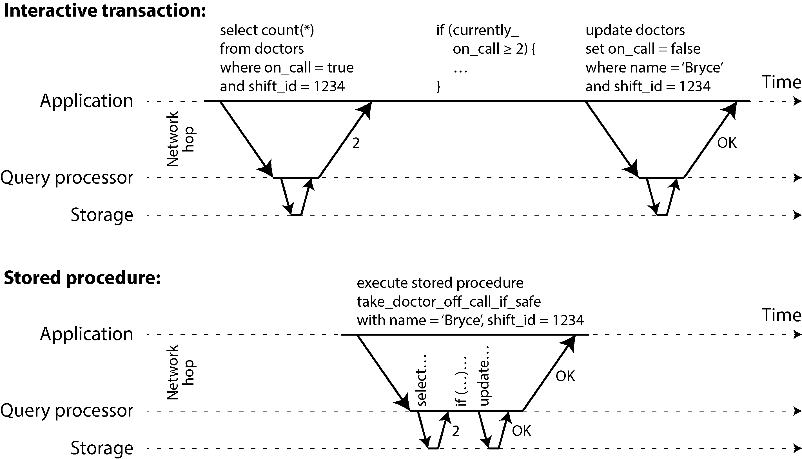
</div>

---

* **Interactive Transaction Flow:**
1. **Step 1:** Application machine se request nikalti hai: `select count(*) from doctors where on_call = true and shift_id = 1234`. Yeh network par travel kar ke database ke Query Processor tak pahunchegi.
2. **Step 2:** Query processor storage se data nikalega aur wapas network ke zariye count **2** application ko bhejega. (Yahan 2 network hops lag gaye).
3. **Step 3:** Ab application ka code apne computer par dimag chalayega: `if (currently_on_call >= 2)`. Is dauran database bilkul khali baitha network ka intezar kar raha hota hai.
4. **Step 4:** Code faisla karta hai aur naya write bhejta hai: `update doctors set on_call = false where name = 'Bryce'`. Yeh teesra network hop hai.
5. **Step 5:** Database update kar ke wapas **OK** ka signal bhejta hai (Chautha network hop).

* **Natija:** 4 alag network round-trips huin aur database beech mein idle raha. Agar single-thread ho to system block ho jayega.

```
Stored Procedure:
=================
Application                Query Processor            Storage
    |                             |                      |
    |--- (EXECUTE PROCEDURE) ---->|                      |  [Single Network Hop 🏃‍♂️]
    |                             |--- (Select Count) -->|
    |                             |<-- (Returns 2) ------|  (Inside DB Memory - Super Fast! ⚡)
    |                             |                      |
    |                             | [Local IF Check]     |  (Inside DB Memory - Super Fast! ⚡)
    |                             |                      |
    |                             |--- (Update Write) -->|  (Inside DB Memory - Super Fast! ⚡)
    |                             |<-- (OK) -------------|
    |<-- (Returns Final OK) ------|                      |  [Final Network Hop 🏃‍♂️]

```

---

* **Stored Procedure Flow:**
1. **Step 1:** Application sirf aik hi baar net par aik single command bhejt hai: `execute stored procedure take_doctor_off_call_if_safe with name='Bryce', shift_id=1234`.
2. **Step 2 (Database Ke Andar):** Chunke procedure ka poora code pehle se hi database ke query processor ke paas para tha, wo bina kisi network delay ke foran storage se select chalata hai (count milta hai 2), database ke memory ke andar hi instant `if` check condition chalti hai, aur foran update query chala kar kaam khatam kar deta hai.
3. **Step 3:** Poore process ka aakhri final result (**OK**) aik hi jhatke mein network par wapas application ko bhej diya jata hai.

* **Natija:** Koi fuzool network delay nahi hua. Data RAM mein hone ki wajah se stored procedure kuch hi micro-seconds mein execute ho kar thread ko agli transaction ke liye khali kar deta hai.


---

## Pros and cons of stored procedures

Stored procedures relational databases mein kafi purane waqt se hain (1999 ke SQL standard ka hissa hain). Lekin developers ki duniya mein in ki **reputation thodi kharab** rahi hai. Is ki 4 bari wajah (Cons) hain:

* **Archaic Languages (Purani Zubanein):** Har database vendor ki apni ajeeb kism ki mushkil zubaan hoti thi (Oracle ki PL/SQL, SQL Server ki T-SQL, Postgres ki PL/pgSQL). Yeh zubanein modern programming languages ki tarah behtareen nahi thin aur na hi un ke paas naye libraries ka koi ecosystem tha.
* **Management Aur Testing Mushkil:** Database ke andar chalne wale code ko debug karna bohot azab hota hai. Isay Git (Version Control) mein rakhna, test karna, deploy karna, aur monitoring systems (metrics) ke sath connect karna bohot mushkil mana jata hai.
* **Performance Sensitivity (Khatra):** Database server poori application ka dil hota hai, jise bohot saari application servers share kar rahi hoti hain. Agar kisi developer ne stored procedure ka code ghalat likh diya (jo zyada CPU ya RAM khane lage), to poora database crash ho jayega, jis se saari app servers aik sath baith jayengi.
* **Security Risk:** Agar aik hi database par mukhtalif tenants (customers) apna apna code chala rahe hon (Multitenant system), to un ka un-trusted code database ke kernel ke sath chalana aik bohot bara security risk hota hai.

#### Modern Badlao (Pros):

Lekin naye systems ne in saare maslon ko hal kar diya hai. Aaj kal ke modern databases purani PL/SQL ke bajaye **General-Purpose Programming Languages** use karte hain:

* **VoltDB:** Java ya Groovy use karta hai.
* **Datomic:** Java ya Clojure use karta hai.
* **Redis:** Lua language use karta hai.
* **MongoDB:** JavaScript use karta hai.

Stored procedures wahan bhi bohot kaam aate hain jahan complex validation logic ko seedha database mein hi embed karna ho (jaise GraphQL proxies ke peeche). Jab data memory (RAM) mein ho aur use I/O ka intezar na karna paray, to stored procedures single thread par bohot hi outstanding throughput achieve kar lete hain.

> **VoltDB and State Machine Replication:** VoltDB stored procedures ko replication ke liye bhi use karta hai. Wo data ke writes ko doosri machine par bhejne ke bajaye, wahi stored procedure doosri machine par bhi dobara chalata hai. Is ke liye zaroori hai ke procedure **Deterministic** ho (yaani har machine par chalne par bilkul same result de). Agar current time use karna ho, to un ke paas special deterministic APIs hote hain. Isay State Machine Replication kehte hain.

---

## Sharding

Single-thread par saari transactions line mein chalane se concurrency control to bohot simple ho jata hai, lekin is ki aik hadd hai: yeh aap ko sirf **aik machine ke aik CPU core** ki speed tak mehdood kar deta hai. Agar aap ke software par writes ka bohot zyada load (high throughput) aa jaye, to yeh akela thread aik bohot bara **Bottleneck (rukaavat)** ban jata hai.

Is scaling ke maslay ko hal karne ke liye hum **Sharding** (data ko mukhtalif hisson mein baantna) use karte hain (VoltDB isay support karta hai):

* **Single-Shard Transactions (Linear Scale):** Agar aap apne data ko is tarah partitions (shards) mein baantein ke har transaction ko apna kaam karne ke liye sirf aik hi shard ka data parhna ya likhna paray, to har shard ka apna aik **independent transaction thread** chal sakta hai. Aap har CPU core ko us ka apna shard de sakte hain. Is haalat mein aap ki performance CPU cores ke barhne ke sath-sath **Linearly Scale** (seedhi lout mein barhti) chali jayegi.
* **Cross-Shard Transactions (The Bottleneck):** Lekin agar koi aisi transaction aa jaye jise aik se zyada shards ka data chahiye, to database ko un saare shards ke darmiyan coordination karni parti hai. Serializable rakhne ke liye us stored procedure ko un saare shards ke upar **Lockstep (aik sath kadam mila kar)** chalana parta hai.

Chunke cross-shard transactions mein aapsi coordination ka bohot bojh hota hai, is liye yeh single-shard ke muqable mein **intehai slow** hoti hain. VoltDB ki report ke mutabaq, un ke system mein single-shard par lakhon writes ho sakte hain, lekin cross-shard writes ki limit sirf **1,000 writes per second** tak gir jati hai, aur aap mazeed nayi machines laga kar bhi is speed ko barha nahi sakte.

> **Stucture ka Khel:** Kya aap ki transactions single-shard ho sakti hain ya nahi? Yeh poora ka poora aap ke data structure par depend karta hai. Simple key-value data to aaram se shard ho jata hai, lekin agar aap ke table mein **Secondary Indexes** majood hain, to aap ko har naye write par bohot saari shards ke sath cross-shard coordination karni paregi jo system ko slow kar degi.

---

## Summary of serial execution

Transactions ko serially (line mein) chalana aaj ke daur mein Serializable Isolation achieve karne ka aik behtareen aur kamyab tarika ban chuka hai, lekin yeh sirf tabhi chal sakta hai agar aap is ki **4 sakht sharait (constraints)** par poore utrein:

1. **Short and Fast:** Har transaction ko intehai chota aur tez hona chahiye. Agar aik bhi transaction slow ho gayi ya phans gayi, to wo poore database ki line ko jam kar ke rakh degi (stall kar degi).
2. **In-Memory Fit:** Aap ka active data har haalat mein **RAM (Memory)** ke andar fit hona chahiye. Agar system ko transaction ke darmiyan disk se data uthane ke liye wait karna para, to poora single-threaded system rukh jayega.
3. **Low Write Throughput / Good Sharding:** Writes ka load itna hi hona chahiye jo aik CPU core sambhal sake, warna aap ka data aise shards mein banta hua ho jahan shards ko aalmi tor par aapsi baatein (cross-shard coordination) na karni parein.
4. **Cross-shard Limitations:** Cross-shard transactions ho sakti hain, lekin un ke scale ki aik sakht hadd hoti hai jise barhana mushkil hai.

---

## Two-Phase Locking

Taqreeban 30 saalon tak dunya ke baray databases mein **Serializability** (sab se top-level isolation) achieve karne ke liye sirf aik hi algorithm sab se zyada mashhoor aur aam tha: **Two-Phase Locking (2PL)**. Baaz dafa isay baqi variants se alag dikhane ke liye **Strong Strict Two-Phase Locking (SS2PL)** bhi kaha jata hai.

### 2PL is not 2PC

> **Aik Bohot Barri Ghalat-Fehmi (Important Box Note):** > **2PL** aur **2PC** bilkul do alag alag cheezein hain aur in ka aapas mein koi taluq nahi hai. In ke naamon ki milti-julti shakal ki wajah se confuse mat hoiye ga:
> * **2PL (Two-Phase Locking):** Yeh database ko **Serializable Isolation** (concurrency se bachane) ke liye use hota hai.
> * **2PC (Two-Phase Commit):** Yeh aik **Distributed Database** mein saari machines par aik sath data pakka save (**Atomic Commit**) karne ke liye use hota hai.
> 
> 
> Is liye in dono ko dimaag mein bilkul alag alag dabbay mein rakhein.

Hum ne pehle parha tha ke locks (taalay) aam tor par **Dirty Writes** ko rokne ke liye use hote hain (Read Committed level par). Agar do transactions aik hi row ko update karna chahein, to lock lagne ki wajah se doosra user pehle wale ke commit ya abort hone tak intezar karta hai.

**2PL** bhi kuch aisa hi karta hai, lekin is ke rules aur taalay lagane ki sharait bohot zyada sakht (**much stronger**) hoti hain. Is ka asool yeh hai ke jab tak dunya mein koi user data badal (write) nahi raha, tab tak bohot saari transactions aik sath data ko parh (**read**) sakti hain. Lekin jaise hey koi user data ko badalna (modify ya delete) chahega, usay poore ghar par akela kabza (**Exclusive Access**) chahiye hoga:

* **Rule 1 (Read vs Write):** Agar Transaction A ne kisi record ko sirf parha (read) hai, aur Transaction B wahan kuch likhna (write) chahti hai, to B ko tab tak rukna parega jab tak A apna kaam khatam kar ke commit ya abort na ho jaye. Is se yeh faida hota hai ke B chupke se A ke peeche data badal nahi sakta.
* **Rule 2 (Write vs Read):** Agar Transaction A ne kisi record par kuch likha (write) hai, aur Transaction B usay parhna (read) chahti hai, to B ko har haalat mein A ke commit ya abort hone ka intezar karna parega. (Purani haalat ka data dikhana, jaisa hum ne MVCC/Snapshot Isolation mein dekha tha, 2PL ke asoolon mein bilkul manzoor nahi hai).

**Mantra Ka Farq (The Key Difference):** Snapshot Isolation ka naara tha ke *"Readers kabhi Writers ko nahi roktay, aur Writers kabhi Readers ko nahi roktay"*. Lekin 2PL mein **Writers na sirf doosre writers ko roktay hain, balke wo readers ko bhi block kar dete hain, aur readers bhi writers ko block karte hain.** Chunke yeh har rasta block kar deta hai, is liye yeh pehle parhay gaye tamaam ghalat concurrency maslon (Lost Updates, Write Skew, Phantoms) ko poori tarah mita deta hai aur pakki serializability deta hai.

---

### Implementation of 2PL

Aaj ke daur mein **MySQL/InnoDB** aur **SQL Server** ke andar jo "Serializable" isolation level hota hai, aur **IBM Db2** ka jo "Repeatable-Read" level hai, wo background mein isi 2PL taknik ko use karte hain.

Databases is blocking ko chalaane ke liye har row/object par aik lock lagate hain. Yeh tala do modes mein chal sakta hai:

1. **Shared Mode (Read Lock):** Jab kisi transaction ko sirf data parhna ho.
2. **Exclusive Mode (Write Lock):** Jab kisi transaction ko data likhna ya badalna ho.

Isay computer ki zubaan mein **Multi-Reader Single-Writer Lock** bhi kehte hain. Is ka step-by-step working flow yeh hai:

* **Step 1 (Reading):** Agar transaction data parhna chahti hai, to wo database se us row par **Shared Lock** mangti hai. Ek hi row par aik sath hazaron log shared lock laga kar parh sakte hain. Lekin agar pehle se kisi ne wahan *Exclusive Lock* lagaya hua hai, to parhne walon ko line mein khara hona parega.
* **Step 2 (Writing):** Agar transaction data likhna chahti hai, to wo **Exclusive Lock** mangti hai. Is talay ka asool hai ke jab yeh lagega to wahan koi doosra tala (chahe shared ho ya exclusive) majood nahi hona chahiye. Agar koi purana lock para hai, to transaction ruk jayegi.
* **Step 3 (Lock Upgrading):** Agar aik transaction ne pehle data parha (shared lock liya) aur phir usay laga ke mujhe isay badalna bhi hai, to wo apne shared lock ko **Upgrade** kar ke exclusive lock bana sakti hai. Is ka process bhi direct exclusive lock lene jaisa hi hota hai.
* **Step 4 (The Two Phases):** Lock milne ke baad, transaction usay beech mein chor nahi sakti. Usay poore kaam ke aakhir tak (commit ya abort hone tak) saare taalay pakad kar rakhne parte hain. Isi wajah se is ka naam **Two-Phase** (Do-Daur) rakha gaya hai:
* **Phase 1: Growing Phase (Barhne ka daur):** Jab transaction chal rahi hoti hai aur naye naye taalay akatha (acquire) karti chali jati hai.
* **Phase 2: Shrinking Phase (Ghatne ka daur):** Transaction ke bilkul aakhir mein jab saare taalay aik sath khol (release) diye jate hain.


Yeh dono phases aapas mein mix nahi ho sakte. Aik baar agar aik bhi tala khul gaya, to transaction poori dunya mein koi naya tala nahi le sakti.

#### Deadlocks Ka Khatra

Chunke system mein har jagah taalay hi taalay chal rahe hote hain, is liye yeh masla bohot aam ho jata hai ke Transaction A ruk jati hai Transaction B ka tala kholne ke liye, aur Transaction B ruki hoti hai Transaction A ka tala kholne ke liye. Is phansaav ko **Deadlock** kehte hain. Database automatic tor par graph check kar ke deadlocks pakad leta hai aur kisi aik be-kasoor transaction ko **Abort (kill)** kar deta hai taake baqi system aage barh sake, aur application us killed transaction ko dobara retry karti hai.

> **Bacchon ki Tarah Asaan Samjhein:** Socho do bache hain, Pappu aur Babloo. Pappu ke paas rang-bharne wali pencil hai lekin drawing book nahi hai. Babloo ke paas drawing book hai lekin pencil nahi hai. Pappu kehta hai: "Jab tak tum mujhe book nahi doge, mein pencil nahi doonga." Babloo kehta hai: "Jab tak tum pencil nahi doge, mein book nahi doonga." Dono zidd par kharay hain aur kaam ruka hua hai (Deadlock). Phir ammi (Database Engine) aati hain, Babloo ko thappad maarti hain (Abort) aur us se book le kar Pappu ko de deti hain taake kaam aage barhay!

---

### Performance of 2PL

Two-Phase Locking ka sab se bara nuksan (downside)—aur yahi wajah hai ke 1970s ke baad se yeh databases ka default level nahi raha—wo hai is ki **Thak-haar performance**. 2PL lagane se database ki speed (throughput) aur queries ka response time weak isolation levels ke muqable mein **intehai bura (significantly worse)** ho jata hai. Is ki do bari wajah hain:

1. **Locks Ka Bojh (Overhead):** Har choti query par tala lagana, check karna, aur phir aakhir mein mitaana computer ki memory aur CPU ka kafi waqt khata hai.
2. **Concurrency Ka Khatma (Reduced Concurrency):** Is se bhi bari wajah yeh hai ke system mein parallel kaam hona band ho jate hain. Agar do transactions aisi hain jo aapas mein thoda sa bhi takra sakti hain, to design ke mutabaq aik ko poori tarah rukna parega jab tak doosri farigh nahi ho jati.

#### Real-World Disaster Scenario (The Big Read Table):

Farz karein aap ke paas aik bohot bara table hai aur aap dopahar ke waqt us ka **Backup** lena chahte hain ya koi lambi analytical report chala rahe hain (jaisa hum ne Snapshot Isolation mein parha tha).

* Is lambi query ko chalane ke liye 2PL kya karega? Wo poore ke poore table par aik **Shared Lock** le kar baith jayega.
* Pehle to is backup query ko tab tak rukna parega jab tak pehle se chalne wale saare naye writes khatam na ho jayein.
* Aur aik baar jab is ne poore table par shared lock laga diya, to jab tak wo ghanto lamba backup khatam nahi hota, **dunya ka koi bhi user us table mein naya data write (insert/update) nahi kar sakega!** Sab block ho kar line mein kharay ho jayenge. Asal mein aap ka database dunya ke liye aik qism ka band (unavailable) ho jayega.

Is wajah se 2PL par chalne wale databases ki speed bohot unstable hoti hai. Agar workload mein thoda sa bhi load barhay, to un ka latency graph achanak aasmaan ko chhune lagta hai (**high percentiles/tail latency spikes**). Sirf aik slow query ya aik bara data scan poore system ke pahiye ko jam kar ke rakh deta hai.

Chunke deadlocks is level par bohot zaroori aur baar baar aane wale hote hain, is liye application ko baar baar zero se kaam shuru (**retry**) karna parta hai, jis se computer ki bohot saari mehnat aur resources kachray mein zaya (**wasted effort**) ho jate hain.

---

### Predicate locks

Upar jo hum ne locks par baat ki, us mein aik choti si bareeki thi jise hum ne thoda asaan kiya tha. Pichle sabaq mein hum ne parha tha ke **Phantom Bug** kya hota hai—yaani jab aik transaction ka kiya hua write kisi doosri transaction ki search query (SELECT) ka result hi badal de (jaise meeting room booking mein double-booking ho jana). Ek serializable database ko har haalat mein phantoms ko rokna parega.

Meeting room booking ki misal mein agar aik user ne check kiya ke `Room 123` dopahar 12 se 1 baje tak khali hai, to doosra user theek usi waqt us room aur us time slot ke liye naya record `INSERT` na kar sakay.

Isay hum kaise rokenge? Is ka hal hai **Predicate Lock** (Shart wala taala). Yeh tala kisi aik row ya object par nahi lagta, balke **un tamaam objects par lag jata hai jo kisi search condition (where clause) par poore utreind**, jaise yeh query:

```sql
SELECT * FROM bookings
 WHERE room_id = 123 
   AND end_time > '2026-01-01 12:00' 
   AND start_time < '2026-01-01 13:00';

```

Predicate lock ke teen sakht asool hote hain:

* **Rule 1 (Reading with Shart):** Jab Transaction A upar wali query chala kar data parhegi, to database is poori shart (condition) par aik **Shared-mode Predicate Lock** laga dega. Agar koi doosri Transaction B us waqt un sharaait par poore utrne wale kisi bhi record par exclusive lock le kar baithi hai, to A ko rukna parega.
* **Rule 2 (Writing with Shart):** Jab Transaction A koi bhi naya record `INSERT`, `UPDATE`, ya `DELETE` karne lagegi, to database pehle check karega ke kya is naye data ki purani ya nayi value dunya mein chalne wale kisi bhi *Predicate Lock* ki shart se match to nahi karti? Agar matching lock Transaction B ke paas hai, to A ko tab tak rok diya jayega jab tak B farigh nahi ho jati.
* **The Magic Point:** Is ka sab se bada jadoo yeh hai ke yeh tala database mein **un records par bhi lag jata hai jo abhi tak dunya mein ijaad hi nahi hue (objects that do not yet exist)!** Yaani aane wale naye phantoms par bhi pehle se taala lag jata hai. Agar 2PL ke sath predicate locks mila diye jayein, to dunya ki har kism ki write skew aur phantom ghaltiyan khatam ho jati hain aur system 100% serializable ban jata hai.

---

### Index-range locks

Bhale hi Predicate Locks theoretical tor par bilkul perfect hain, lekin asli zindagi ke computer systems mein in ki **performance bohot gandi** hoti hai. Agar database mein hazaron transactions chal rahi hon, to har naye insert par un hazaron sharaait (where clauses) ko aapas mein match kar ke check karne mein computer ka dimaag phat jata hai aur bohot waqt zaya hota hai.

Is liye, taqreeban tamaam 2PL databases asli predicate locking use nahi karte, balke is ka aik asaan aur chota bhai use karte hain jisay **Index-range locking** (ya **Next-key locking**) kehte hain.

* **Asoon-e-Simplification:** Is ka asool yeh hai ke shart ko thoda bada (approximate) kar do taake check karna asaan ho jaye. Misal ke tor par, agar aap ka taala sirf *"Room 123 dopahar 12 se 1 baje"* par tha, to aap is ko thoda khula kar ke poore *"Room 123 ke har waqt"* par tala laga do, ya phir *"Dopahar 12 se 1 baje ke saare rooms"* par tala laga do. Yeh bilkul safe hai kyunke jo chor asli choti shart ko torey ga, wo is barri shart mein lazmi pakda jayega.

Farz karein hamare database mein `room_id` ke column par aik **Index** (search guide) bana hua hai:

* **Implementation Method A:** Jab aap `Room 123` ki booking dhoondte hain, to database us index ke andar majood `room_id = 123` ki entry par aik **Shared Lock** chipka deta hai. Yeh is baat ka nishan hota hai ke koi user Room 123 ke saare data par nazar rakh raha hai.
* **Implementation Method B:** Agar database time ke index par chal raha hai, to wo index ke aik khaas hissay (range) par shared lock laga dega, jaise *"Specifed date ko 12 se 1 baje ka poora block"*.

Dono shaklon mein, shart ka aik bada andaza (approximation) index ke kisi naye hissay par tala ban kar baith jata hai. Ab jab bhi koi doosra user parallel mein us room ya us time slot ke liye naya data `INSERT` ya `DELETE` karne aayega, to usay index ke isi hissay ko update karna parega. Jaise hi wo index ko touch karega, usay samnay pehle se laga **Shared Lock** nazar aa jayega, aur database usay foran line mein khara kar dega.

> **Natija (The Compromise):** Index-range locks asli predicate locks jitne barabar (precise) nahi hote—yeh zaroorat se thoda zyada data lock kar dete hain—lekin chunke in ko chalane ka kharcha (overhead) bohot kam hota hai, is liye yeh software architecture mein aik behtareen samjhota (**good compromise**) maane jaate hain.

#### Fallback (Aakhri Mahfooz Rasta)

Agar aap ke table mein koi aisa index majood hi nahi hai jahan range lock chipkaya ja sake, to database ke paas aakhri rasta yeh bachta hai ke wo **poore ke poore table par shared lock** laga de. Yeh performance ke liye to bohot bura hoga kyunke saare writers line mein phans jayenge, lekin data ki serializability ko bachane ke liye yeh aik bilkul safe aur pakka rasta hai.

---


## Serializable Snapshot Isolation

Pichle tamaam darwazon ko dekh kar humein aisa lag raha tha ke database mein transaction control aik na-mumkin masla ban chuka hai. Ek taraf hamare paas aise tareeqay hain jo bilkul safe hain lekin un ki speed intehai gandi hai ya wo scale nahi ho sakte (**2PL** aur **Serial Execution**). Doosri taraf hamare paas tez chalne wale levels hain lekin un mein data kharab hone ka pakka khatra rehta hai (**Lost Updates, Write Skew, Phantoms**).

Toh kya speed aur safety aapas mein dushman hain?

Nahi! Ek naya algorithm aya hai jisay **Serializable Snapshot Isolation (SSI)** kehte hain. Yeh aap ko 100% pakki serializability (safety) deta hai aur is ki speed par bhi koi bada farq nahi parta. Yeh algorithm bilkul naya hai, jise sab se pehle **2008** mein research papers mein dikhaya gaya tha.

Aaj ke daur mein SSI ko bohot saari databases use karti hain:

* **Single-node Databases:** PostgreSQL ka serializable level, SQL Server ka In-Memory OLTP.
* **Distributed Databases:** CockroachDB aur FoundationDB.
* **Embedded Storage Engines:** BadgerDB.

---

## Pessimistic versus optimistic concurrency control

**Two-Phase Locking (2PL)** aik **Pessimistic** (shakki/mayoos) tareeqay par kaam karta hai. Is ka asool yeh hai ke *"Agar kuch bhi ghalat hone ka thoda sa bhi chance hai (jaise kisi row par tala laga hua hai), to behtar hai ke apna kaam rok do aur tab tak intezar karo jab tak sab safe na ho jaye."* Yeh bilkul programming ke mutual exclusion (mutex locks) ki tarah hai.

**Serial Execution** to pessimism ki aakhri hadd hai! Yeh aisa hai jaise har transaction poore database ko akeli lock kar ke baith jaye. Bas is mein faida yeh hota hai ke hum transaction ko itna tez chalate hain ke tala bohot thodi der ke liye lagta hai.

Is ke bilkul ult, **Serializable Snapshot Isolation (SSI)** aik **Optimistic** (umeed-parast/khush-gumaan) taknik hai.

* **The Optimistic Principle:** Is ka asool yeh hai ke agar do transactions aapas mein takra bhi rahi hon, to database unhein rokhta nahi hai. Database kehta hai ke *"Tum dono apna kaam parallel mein chalaati raho, umeed hai sab theek ho jayega."* * **The Commit Check:** Lekin jab koi transaction apna kaam khatam kar ke **Commit** (final save) karne aati hai, to database ka darwaza khol kar check kiya jata hai ke kya background mein koi ghalti (isolation violation) to nahi hui? Agar sab sahi tha, to transaction commit ho jati hai. Agar koi garbar hui thi, to database us transaction ko **Abort (cancel)** kar deta hai aur application ko dobara retry karna parta hai.

> **Bacchon ki Tarah Asaan Samjhein:** Socho do tarah ki ammi hain. Ek hai *Pessimistic Ammi (2PL)*; wo bacha ghar se baahir nikalne lage to kehti hain "Ruk jao! Baahir barish ho sakti hai, pehle badal saaf hone do phir jana." Bacha ruka rehta hai aur slow ho jata hai. Doosri hai *Optimistic Ammi (SSI)*; wo kehti hain "Tum jao khelo! Agar barish shuru hui to mein phone kar ke wapas bula loongi, warna kheltay raho." Is se bacha aaram se apna kaam tez kar pata hai.

#### Is Ka Bara Trade-off (Nuksan)

Agar database par load bohot zyada ho aur bohot saari transactions aik hi row ko badalna chahein (**High Contention**), to optimistic tareeqay mein bohot saari transactions baar baar abort (fail) hona shuru ho jati hain. Is se system par faltu ka load barh jata hai aur performance kharab ho sakti hai.

Lekin agar system mein thodi khali jagah (spare capacity) ho aur takraav kam ho, to yeh taknik pessimistic se kahin zyada outstanding speed deti hai. (Takraav ko kam karne ke liye hum atomic updates bhi use kar sakte hain).

Chunke is ka naam **SSI** hai, yeh poori tarah **Snapshot Isolation** ke upar hi khari hai—yaani parhne wali saari queries frozen snapshot se data parhti hain, lekin is ke upar database aik naya jadoo ka algorithm chalata hai jo ghaltiyan pakadta hai.

---

## Decisions based on an outdated premise

Jab hum ne pichle sabaq mein doctor ki duty wala **Write Skew** (Figure 8-8) dekha tha, to wahan aik hi pattern baar baar aa raha tha:

1. Transaction ne database se data parha (SELECT chalaaya).
2. Us query ke jawab ko dekha (Premise/Asal haalat check ki, jaise: "System mein 2 doctors zinda hain").
3. Us haalat par bharosa kar ke naya write bhej diya (Duty chor di).

Lekin snapshot isolation mein masla yeh hota hai ke jab tak pehli transaction commit karne pahunchti hai, tab tak background mein doosri transaction ne data badal diya hota hai. Yaani jis baat par bharosa kar ke application ne faisla kiya tha, wo baat ab **Outdated Premise (purani jhooti kahani)** ban chuki hoti hai!

Database ko yeh nahi pata hota ke application us count ke jawab ka kya karegi. Is liye safe rehne ke liye database yeh maanta hai ke agar query ke result mein koi bhi tabdeeli aayi hai, to us transaction ka kiya hua write ghalat (invalid) ho sakta hai.

Serializable isolation dene ke liye database ko do cheezein pakadni parti hain:

1. Yeh dekhna ke kya kisi user ne **Stale (baasi/purana) MVCC data** to nahi parh liya?
2. Yeh dekhna ke kya kisi naye write ne purani chalne wali reads ko **mutasir (affect)** to nahi kiya?

Chalein ab in dono scenarios ko aap ki bheji gayi images ke sath step-by-step bohot detail mein samajhte hain.

---

## Detection of stale MVCC reads

Hum ne parha tha ke snapshot isolation ko chalane ke liye database aik row ke bohot saari versions (**MVCC**) yaad rakhta hai. Jab aik transaction frozen snapshot se data parhti hai, to wo un saare naye writes ko ignore (chupa) deti hai jo us ke shuru hone tak commit nahi hue thay.

---

### Figure 8-10. Detecting when a transaction reads outdated values from an MVCC snapshot

Chalein is image (Figure 8-10) ka aik aik step aur us ke niche majood table heap ka post-mortem karte hain:

<div align="center">
  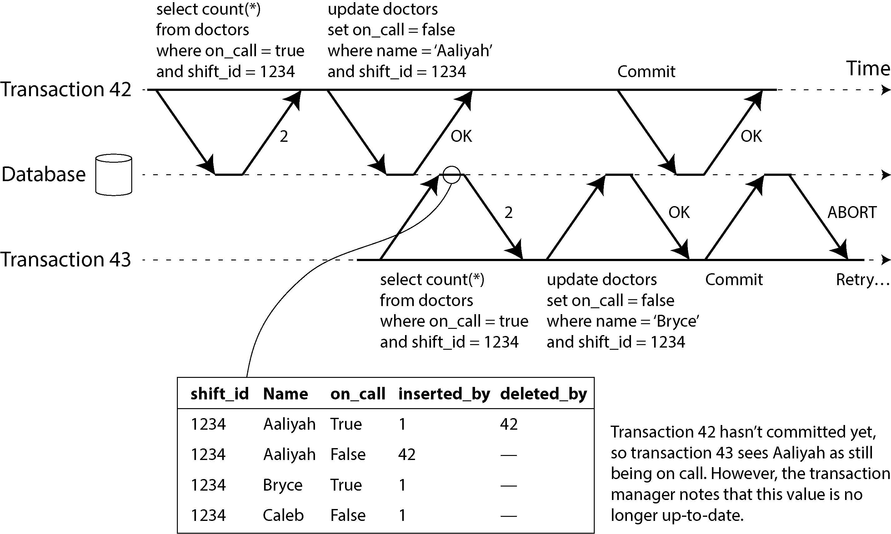
</div>

#### Table Heap State (Inside Memory):

| shift_id | Name | on_call | inserted_by | deleted_by |
| --- | --- | --- | --- | --- |
| 1234 | Aaliyah | True | 1 | **42** *(Purani row par Tx 42 ka delete tag)* |
| 1234 | Aaliyah | False | **42** | — *(Tx 42 ki nayi uncommitted row)* |
| 1234 | Bryce | True | 1 | — |
| 1234 | Caleb | False | 1 | — |

* **Step 1 (Tx 42 Writes):** Transaction 42 (Aaliyah) shuru hoti hai aur apni duty chorne ke liye update chalaati hai. Table heap mein Aaliyah ki purani row par `deleted_by = 42` ka tag lag jata hai aur aik nayi row `on_call = False` wali insert ho jati hai jis par `inserted_by = 42` likha hota hai. Abhi Tx 42 ne commit nahi kiya!
* **Step 2 (Tx 43 Reads Concurrently):** Isi dauran Transaction 43 (Bryce) aati hai aur doctors ka count leti hai. MVCC visibility ke asoolon ke mutabaq, chunke Tx 42 abhi tak uncommitted thi, is liye Tx 43 us ke naye writes ko **ignore** kar deti hai. Usay Aaliyah abhi bhi `on_call = True` nazar aati hai aur query ka jawab **2** milta hai.
* **Step 3 (The Trap Set):** Database ka transaction manager chupke se is baat ko note kar leta hai ke **"Transaction 43 ne data parhte waqt Transaction 42 ke writes ko ignore kiya hai."**
* **Step 4 (Tx 42 Commits):** Ab Transaction 42 apna kaam poora kar ke **Commit** kar deti hai. Aaliyah ka off-call jana ab pakka save ho chuka hai.
* **Step 5 (Tx 43 Tries to Commit):** Bryce (Tx 43) apna update chala kar jab commit ka button dabata hai, to database ka monitor active hota hai. Wo dekhta hai ke *"Oho! Tx 43 ne jo data parha tha, wo Transaction 42 ke commit hone ki wajah se ab baasi (stale) ho chuka hai. Bryce ka faisla ab aik jhooti haalat par khara hai!"*
* **The Action:** Database foran Transaction 43 ko commit karne se mana kar deta hai aur screen par **ABORT** throw karta hai. Data safe reh jata hai aur hospital mein kam az kam aik doctor active rehta hai.

> **Important Architectural Question:** Database ne Tx 43 ko shuru mein hi abort kyun nahi kiya jab us ne baasi read kiya tha?
> * **Jawab:** Kyunke ho sakta hai Tx 43 sirf aik **Read-only transaction** hoti (jo sirf report dekh rahi ho). Agar wo write na karti, to write skew ka koi khatra nahi tha aur usay abort karna zaya jata. Doosra yeh ke ho sakta hai Tx 42 aakhir mein abort ho jati, jis se Tx 43 ka data khud hi sahi rehta. Is liye SSI aakhir tak intezar karti hai taake be-fuzool aborts se bacha ja sake.
> 
> 

---

## Detection of writes that affect prior reads

Doosra case yeh hai ke jab aik user data parh kar chala jaye, aur us ke parhne ke **baad** koi doosra user aa kar us data ko badal de.

---

### Figure 8-11. In serializable snapshot isolation, detecting when one transaction modifies another transaction’s reads

Chalein ab is doosri image (Figure 8-11) ke flow aur us ke niche chalne wale Index-range tracking ko break down karte hain:

<div align="center">
  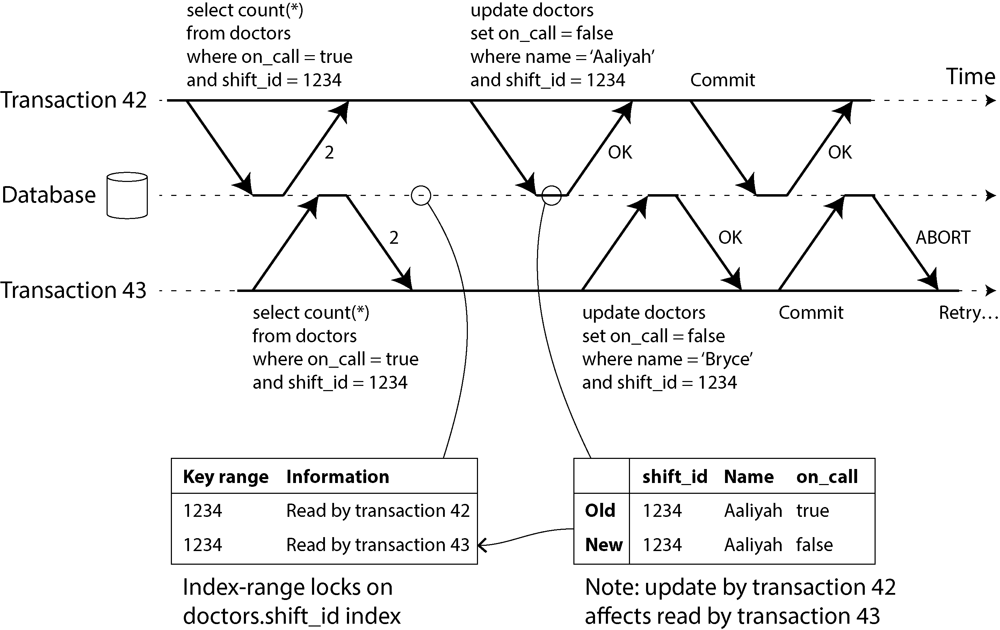
</div>

#### Index-range locks on doctors.shift_id index (Internal Lock Table):

| Key range | Information |
| --- | --- |
| 1234 | Read by transaction 42 |
| 1234 | Read by transaction 43 |

* **Step 1 (Dono Ka Read):** Transaction 42 aur Transaction 43 dono parallel mein aati hain aur shift 1234 ke doctors dhoondti hain. Chunke database mein `shift_id` par aik **Index** bana hua hai, database us index ke entry number 1234 par chupke se likh deta hai ke *"Bhaiyon, is data ko abhi abhi Tx 42 aur Tx 43 ne parha hai."* (Agar index na ho to yeh poore table level par track hota hai).
* **Step 2 (The Tripwire Technique):** 2PL ki tarah yeh entry doosre ko block nahi karti. Yeh sirf aik **Tripwire (alert karne wali khufia taar/alarm)** ka kaam karti hai.
* **Step 3 (Tx 42 & 43 Writes):** * Tx 42 naya write karti hai (Aaliyah ko off-call karti hai). Database index mein ja kar dekhta hai ke is range ko kis ne parha tha? Wahan likha milta hai **Tx 43**. Database Tx 43 ke dabba par nishan laga deta hai ke *"Tumhara parha hua data badal chuka hai!"*
* Phir Tx 43 naya write karti hai (Bryce ko off-call karti hai). Database index dekh kar Tx 42 par bhi nishan laga deta hai ke *"Tumhara parha data bhi badal chuka hai!"*


* **Step 4 (The Race to Commit):** Ab dono mein se jo pehle commit ka button dabayega, wo jeet jayega.
* Is diagram mein **Transaction 42 pehle commit karti hai**. Database check karta hai ke Tx 42 ko kis ne alert kiya tha? Tx 43 ne kiya tha. Lekin chunke Tx 43 abhi tak khud commit nahi hui (us ka kaam hawa mein hai), is liye Tx 42 ka commit **Success (kamyab)** ho jata hai.
* Ab jab **Transaction 43 commit karne aati hai**, to database dekhta hai ke Tx 42 ka kiya hua takraav wala write ab dunya mein pakka save (commit) ho chuka hai! Is liye Tx 43 ka premise jhoota ho gaya, aur database usay foran **ABORT** kar deta hai. Bryce ko majbooran dobara retry karna parega.


---

## Performance of serializable snapshot isolation

Asli database engineering mein is algorithm ki performance bohot saari choti bareekiyon par depend karti hai:

* **Granularity Trade-off (Tracking Ka Level):** Agar database aik aik row par barabri se nazar rakhega (Detailed tracking), to wo bilkul andazay se sahi abort karega, lekin is bookkeeping (hisaab-kitab) ka khufia bojh computer ke memory par barh jayega. Agar tracking moti moti hogi (Coarse tracking), to speed to tez hogi lekin system shak ki bina par baaz dafa un transactions ko bhi abort kar dega jin ki wajah se koi ghalti nahi ho rahi thi.
* **PostgreSQL Ka Kamal:** Postgres is theory ko bohot behtareen use karta hai aur algorithms ke zariye yeh prove kar leta hai ke agar kuch badlao ke bawajood final result serializable aa raha ho, to wo transaction ko abort nahi karta (unnecessary aborts ko kam karta hai).

### SSI Ke 4 Baray Faide (Pros) aur Limitations (Cons)

#### 1. No Blocking Under SSI (Locks Se Azaadi)

2PL ke muqable mein SSI ka sab se bara faida yeh hai ke **aik transaction ko doosri transaction ke talay kholne ka intezar (block) nahi karna parta.** Asil snapshot isolation ki tarah, writers kabhi readers ko nahi roktay aur readers kabhi writers ko nahi roktay. Is wajah se application ki speed (latency graph) bilkul stable aur predictable rehti hai. Read-heavy workloads ke liye yeh aik nemat hai.

#### 2. Scaling Out of a Single CPU Core

Serial Execution ke muqable mein, SSI aik single CPU core tak mehdood nahi hai. **FoundationDB** jaisay databases is conflict detection ke algorithm ko dunya ki **bohot saari machines (distributed systems)** par baant dete hain, jis se throughput lakhon writes tak linearly scale ho jati hai. Aap ka data bhale hi 10 alag shards par para ho, aap aaram se multi-shard transactions chala sakte hain.

#### 3. Tracking Overhead

Weak snapshot isolation ke muqable mein, SSI ko har transaction ki reads aur writes par nazar rakhni parti hai, jis se thoda sa software overhead zaroor aata hai. Databases researchers ke darmiyan is par behes hai: kuch ka khayal hai ke yeh overhead fazool hai, jabke naye experts ka manna hai ke ab SSI ki performance itni outstanding ho chuki hai ke dunya mein weak isolation levels use karne ki ab koi zaroorat hi nahi bachi!

#### 4. Short Transactions ki Sharait

System mein **Abort Rate** (transactions ke fail hone ki ginti) performance par bohot asar dalti hai. Agar aik transaction bohot lambay waqt tak chalti rahegi aur data badalti rahegi, to pakka raste mein koi na koi us se takraayega aur wo abort ho jayegi. Is liye SSI ki sab se bari limit yeh hai ke aap ki **Read/Write transactions ko kafi chota (short and fast) hona chahiye**. (Lambi read-only transactions par koi pabandi nahi hai, wo sukoon se chal sakti hain). Phir bhi, yeh slow transactions ke samnay 2PL ya Serial Execution jitna kamzoor nahi parta.

---

## Distributed Transactions

Aik single-node transaction mein sirf **aik hi machine (computer)** poori transaction ka logic aur concurrency control (jaise locks aur isolation levels) sambhalti hai. Agar aap ka database single-leader replication use kar raha hai, to saari transactions sirf main leader node par chalti hain, aur baqi followers machine sirf us ke write-ahead log (WAL) ko dekh kar apne paas data copy kar leti hain.

Lekin kya hoga agar aik transaction ke andar **aik se zyada nodes (multiple machines)** shamil hon? Misal ke tor par:

* Aap ka database sharded hai aur aap ki transaction ko alag alag shards (machines) ka data badalna hai.
* Aap aik global secondary index use kar rahe hain, jahan index ka record kisi aur node par para hai aur asli primary data kisi doosri node par para hai.

Is scenario ko hum **Distributed Transaction** kehte hain.

Distributed transactions mein concurrency control (locks wagera) ke asool to single-node jaise hi hote hain, lekin **Atomicity (All-or-Nothing)** achieve karna yahan aik bohot bara aur naya challenge ban jata hai.

#### Single-Node Par Atomicity Kaise Hoti Thi?

Single-node par atomicity poori tarah disk par data likhne ke **Order (tartib)** par depend karti hai. Pehle disk par asli data likha jata hai, aur aakhir mein aik **Commit Record** append kiya jata hai. Agar commit record disk par likha gaya, to transaction committed hai, warna rollback ho jati hai. Yaani aik akela hardware device (single disk controller) faisla karta hai.

#### Distributed System Mein Yeh Asaan Kyun Nahi Hai?

Distributed transaction mein aap sirf saari nodes ko aik sath commit ki request bhej kar azaad nahi chor sakte. Ho sakta hai ke commit kuch nodes par kamyab ho jaye aur kuch par fail ho jaye, jaisa ke **Figure 8-12** mein dikhaya gaya hai. Is ki 3 bari wajoohat hain:

1. Kuch nodes par koi rule toot raha ho (constraint violation) ya takraav ho, jis ki wajah se unhein **Abort** karna pare, jabke baqi nodes commit karne ke liye bilkul tayyar hon.
2. Network ke kharab hone ki wajah se kuch commit requests raste mein hi gayab ho jayein aur timeout ki wajah se abort ho jayein, jabke kuch requests sahi salamat pahunch jayein.
3. Kuch nodes commit record likhne se pehle hi achanak crash ho jayein aur recovery par rollback ho jayein, jabke baqi successfully commit kar chuki hon.

---

#### Figure 8-12. When a transaction involves multiple database nodes, it may commit on some and fail on others.

Chalein aap ki bheji gayi pehli image (Figure 8-12) ke step-by-step flow ko samajhte hain ke jab distributed system mein atomicity toot'ti hai, to kya tabahi hoti hai:

<div align="center">
  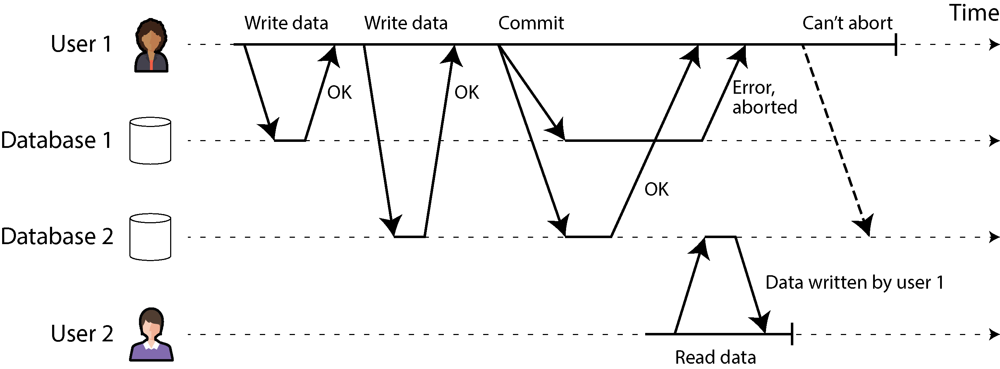
</div>

* **Step 1 (User 1 Writes to Both Nodes):** User 1 aik distributed transaction shuru karta hai jo do alag databases (Database 1 aur Database 2) par data write karti hai. Dono databases shuruati kaam par **"OK"** keh dete hain.
* **Step 2 (The Commit Command):** User 1 ab transaction khatam kar ke **Commit** ka button dabata hai.
* **Step 3 (The Split Outcome):** * Database 1 par koi achanak error ya hardware failure aata hai aur wo transaction ko **Abort** kar ke apna data saaf (erase) kar deta hai.
* Doosri taraf, Database 2 par sab theek chalta hai aur wo data ko pakka save yani **Commit OK** kar deta hai.


* **The Disaster (Inconsistency):** Ab system aapas mein out-of-sync ho chuka hai (Inconsistent state). Sab se buri baat yeh hai ke jab tak User 1 ko pata chalta ke mera commit Database 1 par fail ho gaya hai, isi dauran **User 2** ne aakar Database 2 se wo committed naya data parh bhi liya!
* **No Way Back:** Ab hum Database 2 wale data ko wapas rollback nahi kar sakte, kyunke agar hum ne use retroactively mitaaya, to User 2 ka faisla aur transaction bhi ghalat ho jayegi. Is ajeeb musibat se bachne ke liye humein aik aisa tareeqay chahiye jahan saari nodes ya to aik sath commit hon ya aik sath abort hon. Isay **Atomic Commitment Problem** kehte hain.

> **Bacchon ki Tarah Asaan Samjhein:** Socho do dost, Ali aur Bilal, mil kar aik project bana rahe hain aur dono ke paas aadha aadha project hai. Agar Ali apna hissa teacher ko submit kar de (Commit) aur Bilal apna hissa ghar bhool aaye aur fail ho jaye (Abort), to aadha project submit hone ka koi faida nahi hoga, poori team fail ho jayegi. Hum nahi chahte ke aadha kaam submit ho. Ya to dono submit karein, ya dono ka zero lage!

---

### Two-Phase Commit

**Two-Phase Commit (2PC)** aik aisa algorithm hai jo distributed databases mein is atomic commitment problem ko hal karta hai. Yeh bohot hi purana aur classic algorithm hai. Databases isay internally bhi use karte hain aur applications ke liye yeh **XA Transactions** (jaise Java Transaction API - JTA) ke roop mein bhi majood hota hai.

#### Naya Component: The Coordinator

2PC mein aik naya component shamil hota hai jo single-node transaction mein nahi hota: **Coordinator** (yaani Transaction Manager). Yeh aksar application ke code ke andar hi aik library hoti hai (jaise Java EE container mein embedded) ya aik alag alag chalne wali service hoti hai (jaise Narayana, BTM, ya MSDTC).

#### Is Ka Buniyadi Flow (The Two Phases):

Jaise is ka naam hai, is pure process ko **Do Phases** (Two Phases) mein baanta gaya hai. Jin database nodes par data para hota hai, unhein hum **Participants** kehte hain:

* **Phase 1 (Prepare Phase):** Jab application saara kaam kar ke commit karne lagti hai, to coordinator sab se pehle saare participants (nodes) ko aik **Prepare Request** bhejta hai aur un se poochta hai ke *"Kya tum commit karne ke liye bilkul tayyar ho?"*
* **Phase 2 (Commit/Abort Phase):** Coordinator saare participants ke votes (jawab) check karta hai:
* **Agar SAb ne YES kaha:** to coordinator Phase 2 mein sab ko **Commit Request** bhejta hai aur asli commit tab hota hai.
* **Agar KISI EK ne bhi NO kaha (ya timeout hua):** to coordinator Phase 2 mein sab ko **Abort Request** bhejta hai aur sab ka data rollback ho jata hai.


> **Real-World Analogy (Western Marriage):** Writer ne is ki aik haseen misal di hai ke yeh bilkul aik shadi ki rasam ki tarah hai. Officiant (Coordinator) dulha aur dulhan (Participants) se alag alag poochta hai ke *"Kya tumhein yeh shadi manzoor hai?"* (Phase 1 - Prepare). Jab dono kehte hain "I do" (Yes Vote), tabhi officiant unhein miyan-biwi pronounce karta hai (Phase 2 - Commit). Agar aik bhi mana kar de, to shadi waheen cancel (Abort) ho jati hai!

---

#### Figure 8-13. A successful execution of 2PC

Chalein ab aap ki bheji gayi doosri image (Figure 8-13) ke step-by-step successful flow ko timeline ke mutabaq bohot gehrai se samajhte hain:

<div align="center">
  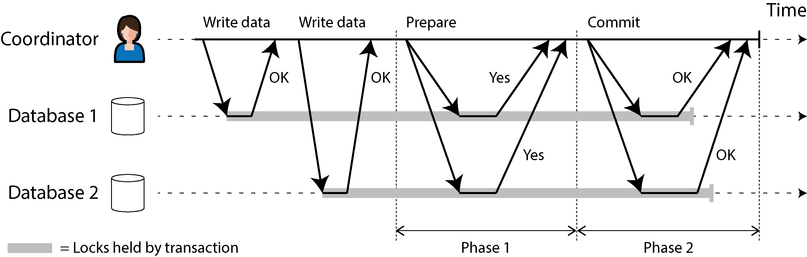
</div>

* **The Setup Phase:** Application shuru mein normal tarike se data read aur write karti hai. Coordinator Database 1 aur Database 2 dono par writes bhejta hai aur dono se **"OK"** le leta hai.
* **Phase 1 (Prepare):** Coordinator dono nodes ko `Prepare` request bhejta hai. Dono databases background mein checks karti hain, data ko disk par likhti hain aur locks pakad kar baith jati hain. Phir dono coordinator ko **"YES"** ka vote bhej deti hain.
* **The Commit Point:** Jab coordinator ke paas dono ke YES votes aa jate hain, to wo apna pakka faisla (Commit Decision) **apne computer ki disk par transaction log mein save karta hai**. Is lamhe ko **Commit Point** kehte hain. Is ke baad faisla badla nahi ja sakta.
* **Phase 2 (Commit):** Coordinator ab dono ko `Commit` bhejta hai. Databases data final save karti hain, locks kholti (free karti) hain aur coordinator ko **OK** bhej deti hain. Transaction successfully complete ho gayi!

---

### A system of promises

Ab sawal yeh peda hota hai ke distributed nodes par simple single commit bhej bhej kar jo masla hal nahi ho raha tha, wo 2PC mein kaise hal ho gaya? Prepare aur commit requests to yahan bhi network par ghum ho sakti hain!

2PC ke kamyab hone ka raaz yeh hai ke yeh **Wadon ke Aik System (System of Promises)** par chalta hai. Chalein is poore process ke 6 steps ko break down kar ke samajhte hain:

1. **Global Transaction ID:** Jab application distributed transaction shuru karna chahti hai, to wo coordinator se aik globally unique transaction ID (txid) mangti hai.
2. **Attaching the ID:** Application har participant (node) par jab single transaction chalati hai, to us ke sath yeh global `txid` attach kar deti hai. Saare reads aur writes isi `txid` ke andar hote hain. Agar is stage par koi node crash ho ya timeout ho, to koi bhi azaadana tor par abort kar sakta hai.
3. **The Prepare Order:** Jab application ready hoti hai, to coordinator sab ko global `txid` ke sath tagged `prepare` request bhejta hai. Agar aik bhi request fail ho ya timeout ho, to coordinator sab ko bina soche `abort` ka order bhej deta hai.
4. **The Participant's Promise:** Jab kisi participant node ko `prepare` request milti hai, to wo yeh confirm karti hai ke kya mein har haalat mein isay commit kar sakti hoon? Wo transaction ka saara data apni disk par write karti hai (taake baad mein space full hone ya power outage ka bahana na banana pare) aur constraints check karti hai. **Jab node coordinator ko "YES" ka jawab bhejti hai, to wo aik pakka wada (promise) karti hai ke ab agar mujhe commit ka order mila, to mein bina kisi error ke commit karungi.** Is step par participant apna abort karne ka haq (right to abort) hamesha ke liye coordinator ko surrender (saunp) kar deta hai.
5. **The Coordinator's Decision (Commit Point):** Jab coordinator ke paas saare votes aa jate hain, to wo aakhri definitive faisla karta hai. Agar sab ne yes kaha to commit, agar aik ne bhi no kaha to abort. **Coordinator apne is faisle ko disk par apne transaction log mein pakka write karta hai.** Agar ab coordinator crash bhi ho jaye, to uthne par usay disk se pata chal jayega ke faisla kya hua tha. Isay point of no return kehte hain.
6. **Enforcing the Decision:** Ek baar jab coordinator ka decision disk par likha gaya, to commit ya abort ka order participants ko bhej diya jata hai. Agar network ki wajah se yeh order fail ho ya timeout ho, to **coordinator tab tak baar baar retry karta rahega (retry forever) jab tak wo kamyab nahi ho jata.** Ab peechay hatne ka koi rasta nahi hai. Agar koi participant node is dauran crash bhi ho gayi thi, to dobara zinda hone par wo isay har haalat mein commit karegi, kyunke us ne pehle step mein "YES" keh kar wada kiya tha.

> **Point of No Return ka Farq:** Single-node transaction mein data disk par likhna aur commit record likhna aik hi jhatke mein hota tha. 2PC distributed system mein is ko do hisson mein tod deta hai: pehle participant ka wada (YES vote) aur phir coordinator ka final faisla (Commit Log write).

---

### Coordinator failure

Hum ne dekh liya ke agar network kharab ho ya koi participant node fail ho jaye, to 2PC usay handle kar leta hai (retry kar ke ya abort kar ke). Lekin sab se bada aur khatarnak sawal yeh hai ke **agar coordinator khud crash ho jaye to kya hoga?**

* **Phase 1 Se Pehle Crash:** Agar coordinator prepare request bhejne se pehle hi mar jaye, to saari participant nodes sukoon se azaadana tor par transaction ko abort kar sakti hain.
* **The "In-Doubt" / Uncertain State:** Masla tab aata hai jab participant node `prepare` ka jawab **"YES"** bhej chuki ho aur ab wo Phase 2 ke order ka intezar kar rahi ho. Ab wo khud se na to abort kar sakti hai aur na commit, kyunke us ne apna haq coordinator ko de diya tha. Agar is lamhe coordinator crash ho jaye ya network bilkul kat jaye, to participant node hawa mein phans jati hai. Is khofnak haalat ko computer science mein **In-Doubt** ya **Uncertain State** kehte hain.

---

#### Figure 8-14. The coordinator crashes after participants vote yes. Database 1 does not know whether to commit or abort.

Chalein ab aap ki teesri image (Figure 8-14) ko dekhte hain jahan system coordinator ke marne ki wajah se block ho jata hai:

<div align="center">
  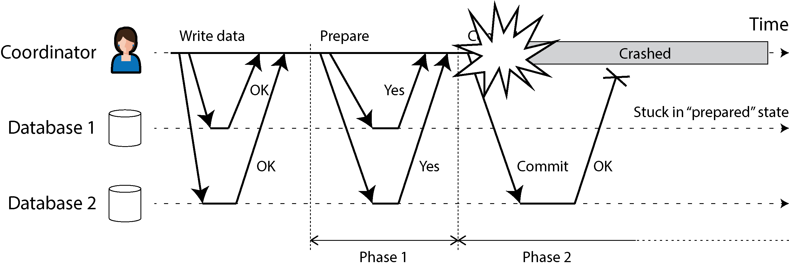
</div>

* **Step 1:** Coordinator ne dono databases se prepare ka YES vote le liya aur apne log mein Commit save kar diya.
* **Step 2:** Coordinator ne Database 2 ko `Commit` bhej diya. Database 2 ne data save kiya aur apne locks khol diye.
* **Step 3 (The Crash):** Database 1 ko commit bhejne se theek pehle **Coordinator crash ho gaya**.
* **The Dilemma:** Database 1 ab prepared state mein phans chuka hai. Wo sochta hai ke *"Mein kya karoon?"* * Agar wo timeout ki wajah se khud se **Abort** kar de, to data Database 2 se alay ho jayega (Inconsistency).
* Agar wo khud se **Commit** kar de, to ho sakta hai kisi teesri node ne NO vote diya ho aur system abort ho raha ho, tab bhi data kharab ho jayega.


* **The Consequence:** Database 1 ke paas intezar ke siwa koi rasta nahi hai. Wo un rows par **Locks pakad kar baith jata hai**. Jab tak locks lage rahenge, dunya ka koi doosra user un rows ko touch bhi nahi kar sakega. Poora system jam (block) ho jayega.

2PC is state se sirf tabhi nikal sakta hai jab **coordinator dobara zinda (recover) ho**. Jab coordinator recover hota hai, to wo disk par majood apne transaction log ko parhta hai. Jis txid ke aage "Commit" likha hota hai, un saari in-doubt nodes ko dobara commit ka order bhejta hai, aur jin ka record nahi hota unhein abort karta hai.

> **The Single Point of Failure:** Agar coordinator ka computer aisi aag mein jale ke us ki hard disk (transaction log) hi hamesha ke liye tabah ho jaye, to system automatic recovery nahi kar sakta. Phir aik **System Administrator** (insan) ko aakar manually database ke andar ja kar un in-doubt transactions ko zabardasti commit ya abort karna parta hai.

---

### Three-phase commit

Chunke 2PC coordinator ke marne par poore system ko block kar deta hai, is liye isay **Blocking Atomic Commit Protocol** kehte hain.

Is blocking ke maslay se jaan churane ke liye researchers ne aik naya algorithm ijaad kiya tha jisay **Three-Phase Commit (3PC)** kehte hain. Un ka daawa tha ke yeh aik **Non-blocking protocol** hai, yaani agar coordinator mar bhi jaye, to nodes aapas mein baatein kar ke faisla kar sakti hain aur system block nahi hoga.

#### 3PC Asli Duniya Mein Kyun Fail Ho Jata Hai? (The Trade-off)

Theoretical tor par 3PC behtareen lagta hai, lekin asli zindagi ke software architecture mein yeh **nakaam** ho jata hai kyunke yeh do bohot hi ajeeb sharaait par chalta hai:

1. Yeh maanta hai ke network mein kabhi bhi zaroorat se zyada delay nahi aayega (**Bounded Network Delay**).
2. Yeh maanta hai ke har machine hamesha aik tay shuda waqt ke andar jawab degi (**Bounded Response Time**).

Lekin jaisa ke hum aglay chapter (Chapter 9) mein parhenge, asli dunya ke networks mein requests ghanto delay ho sakti hain aur processes achanak pause (garbage collection pauses) ho jate hain. Is unbounded delay ki wajah se **3PC asli zindagi mein atomicity ki guarantee nahi de pata** aur data kharab kar deta hai.

#### Asli Zindagi Ka Behtareen Solution:

Practical networks mein is blocking se bachne ka sab se modern aur kamal ka tarika yeh hai ke hum aik single-node coordinator par bharosa hi na karein! Balke hum coordinator ki jagah aik **Fault-Tolerant Consensus Protocol** (jaise Paxos ya Raft) use karein, jo aik machine ke marne par doosri machine ko automatic coordinator bana deta hai aur system kabhi block nahi hota. Is advanced topic ko hum **Chapter 10** mein bacchon ki tarah asaan kar ke parhenge!

---

## Distributed Transactions Across Different Systems

Distributed transactions aur 2PC (Two-Phase Commit) ki systems architecture ki duniya mein aik mili-juli (mixed) reputation hai. Aik taraf log isay aik intehai zaroori safety guarantee maante hain jise kisi aur tarike se achieve karna mushkil hai; doosri taraf is par sakht criticism hota hai kyunke yeh baray operational masle kharay karti hai, performance ka janaza nikal deti hai (**killing performance**), aur jitna wada karti hai us se kam deliver karti hai. Isi wajah se bohot saari cloud-native services distributed transactions ko apne paas implement hi nahi kartin.

2PC ka heavy performance cost buniyadi tor par do wajah se aata hai:

1. **Additional fsync Operations:** Crash recovery ke liye har node ko baar baar disk par data pakka save karna parta hai.
2. **Network Round Trips:** Alag alag machines ke darmiyan messages ka aage-peeche travel karne mein kafi network latency zaya hoti hai.

Lekin is poore concept ko be-faida keh kar chorne ke bajaye humein is ki gehrai mein jana chahiye, kyunke software engineering ke lihaz se is mein bohot baray sabaq chupay hain. Sab se pehle humein do bilkul alag types ke darmiyan farq ko crystal clear samajhna hoga jinhein log aksar aapas mein mix kar dete hain:

* **Database-internal distributed transactions:** Kuch distributed databases (jo default tor par replication aur sharding use karte hain) apne andar ki hi nodes ke darmiyan internal transactions support karte hain. Misal ke tor par **YugabyteDB, TiDB, FoundationDB, Spanner, VoltDB,** aur **Cassandra** mein yeh internal support hoti hai. Is case mein transaction mein hissa lene wali saari nodes par **ek hi company ka same database software** chal raha hota hai. Chunke inhein baahir ke kisi system se taluq nahi rakhna hota, yeh apne mutabaq behtareen optimizations kar sakti hain aur kafi kamyab rehti hain.
* **Heterogeneous distributed transactions:** Is mein transaction ke andar hissa lene wale components do ya do se zyada bilkul alag technologies hote hain—jaise do alag vendors ke databases (aik taraf MySQL aur aik taraf Oracle), ya phir non-database systems (jaise databases ke sath **Message Brokers** ka jurna). In alag alag systems ke darmiyan under-the-hood bina kisi aapsi compatibility ke atomic commit karwana aik bohot bara challenge hota hai. Humara main focus isi par rahega.

---

### Exactly-once message processing

Heterogeneous distributed transactions alag alag data systems ko aapas mein integrate karne ka aik bohot hi powerful tarika deti hain.

* **The Integration Scenario:** Socho aap ke paas aik Message Queue (Broker) hai aur aik core Database hai. Aap chahte hain ke message queue se nikalne wale message ko processed yani **Acknowledged (ACK)** sirf aur sirf tabhi mana jaye, agar us message ko chalane ke baad database ke andar hone wale saare writes successfully **Commit** ho jayein.
* **The Implementation:** Is ko implement karne ke liye message broker ka ACK aur database ka write operation dono ko mila kar aik single distributed transaction ke andar daal diya jata hai. Distributed transaction ki wajah se yeh tab bhi mumkin hai agar message broker aur database do bilkul unrelated technologies hon jo alag alag servers par chal rahi hain.
* **Handling Failures:** Agar message deliver hone mein koi masla aaye, ya database mein save karte waqt transaction fail ho jaye, to dono systems aik sath **Abort (rollback)** ho jate hain. Is ka faida yeh hota hai ke message broker us message ko apne paas safe rakhta hai aur baad mein safely dobara bhej (**redeliver**) sakta hai.
* **Exactly-Once Semantics:** Is all-or-nothing tarike se hum yeh guarantee achieve kar lete hain ke message application mein **effectively exactly once** (sirf aur sirf aik hi baar) process hoga, bhale hi kamyab hone se pehle use 3 baar retry hi kyun na karna para ho. Abort hone par purane adhoore kaam ka koi bhi side effect database mein baaki nahi rehta.

#### Is Ki Aik Bohot Barri Limitation (The Email Server Example)

Yeh system sirf tabhi safe hai jab transaction ke mutasir hone wale saare components aik hi commit protocol (2PC) par chal rahe hon. Farz karein message queue ko process karte waqt application ka aik kaam user ko **Email bhejna** bhi tha, aur aap ka email server distributed transaction (2PC) support nahi karta.

Agar database write fail ho jaye aur transaction abort ho, to database to apna data rollback kar lega, lekin email server chali gayi email ko wapas nahi kheench sakega! Agli baar jab message processing retry hogi, to user ko aik aur duplicate email chali jayegi. Is liye exactly-once tabhi chalta hai jab saare side effects rollback ho sakte hon.

---

### XA transactions

**X/Open XA** (short for *eXtended Architecture*) heterogeneous technologies ke darmiyan Two-Phase Commit (2PC) ko chalaane ka aik aalmi standard hai. Yeh **1991** mein introduce kiya gaya tha aur aaj taqreeban saare purane relational databases (PostgreSQL, MySQL, Db2, SQL Server, Oracle) aur message brokers (ActiveMQ, HornetQ, IBM MQ) isay support karte hain.

* **XA Kya Hai Aur Kya Nahi Hai?** Yaad rahe ke XA koi network protocol nahi hai jo wires par chalta ho. Yeh sirf aik **C API** (code functions ka set) hai jo application aur transaction coordinator ke darmiyan interfaced baatein karwata hai. Java EE ki dunya mein is standard ko **JTA (Java Transaction API)** ke bindings ke zariye chalaya jata hai, jo JDBC (databases ke liye) aur JMS (message brokers ke liye) ke drivers ke sath connect hota hai.

```
+------------------------------------------------------+
|                 Application Code                     |
+------------------------------------------------------+
                           |
                           v
+------------------------------------------------------+
|       Transaction Coordinator Library (JTA)          |
+------------------------------------------------------+
         |                                    |
         v (XA API Callbacks)                 v (XA API Callbacks)
+------------------------+          +------------------------+
|  Database Driver (JDBC) |          |  Message Broker Driver  |
+------------------------+          +------------------------+
         |                                    |
         v (Network Protocol)                 v (Network Protocol)
+------------------------+          +------------------------+
|    Database Node       |          |  Message Broker Node   |
+------------------------+          +------------------------+

```

* **How XA Works Step-by-Step:**
1. XA yeh maanta hai ke aap ki application database ya messaging service se raabta karne ke liye un ke drivers (client libraries) use kar rahi hai.
2. Agar driver XA support karta hai, to application jab bhi koi kaam karegi, driver background mein XA API ko call kar ke pata lagayega ke kya yeh kaam kisi distributed transaction ka hissa hai? Agar hai, to wo global transaction ID ke sath zaroori data database server ko bhej dega.
3. Driver coordinator ko kuch callback functions deta hai. Inhi callbacks ke zariye coordinator background mein participant nodes ko **prepare, commit, ya abort** karne ka order bhejta hai.
4. **The Coordinator Reality:** Standard yeh nahi batata ke coordinator software kaisa hona chahiye, lekin asli zindagi mein coordinator koi alag se chalne wali network service nahi hoti. Yeh sirf aik **Library** hoti hai jo application ke process ke andar hi load hoti hai. Yeh library saare participants ke votes akatha karti hai aur apna final decision **app server ki local disk par aik transaction log** mein write karti hai.


#### The App Server Crash Scenario

Agar application ka process achanak crash ho jaye, ya jis machine par app chal rahi thi wo computer hi jal jaye, to coordinator library bhi us ke sath mar jati hai.

Ab jitne bhi database participants Phase 1 mein `prepared` ho kar YES vote de chuke thay, wo saare hawa mein phans jate hain (**stuck in doubt**). Chunke coordinator ka log application server ki local disk par para tha, is liye jab tak us application server ko dobara zinda (restart) nahi kiya jata, tab tak coordinator library recovery nahi kar sakti. Uthne ke baad library log parh kar purana faisla dhoondegi aur drivers ke callbacks ke zariye databases ko commit ya abort ka signal bhejegi. Database servers khud se coordinator ko contact nahi kar sakte, kyunke saari baatein hamesha client library ke zariye hi travel karti hain.

---

### Holding locks while in doubt

Aap soch sakte hain ke *"Chalo, agar aik transaction hawa mein in-doubt phans bhi gayi hai, to baqi system apna kaam jari rakhe aur is phansay hue data ko ignore kar de, yeh baad mein recovery par khud theek ho jayegi."* Lekin asli dunya mein aisa nahi hota, aur is ki sab se barri wajah hai **Locking (Taalay)**.

* **The Locking Nightmare:** Hum ne parha tha ke Read Committed level par databases dirty writes se bachne ke liye modified rows par **Exclusive Locks** lagate hain. Aur agar haseen Serializability chahiye, to 2PL databases parhi jaane wali rows par **Shared Locks** bhi lagate hain.
* **No Release Until Decision:** Database in taaloy ko tab tak kisi haalat mein nahi khol sakta jab tak transaction poori tarah commit ya abort na ho jaye. 2PC distributed system mein jab tak transaction in-doubt state mein khari hai, **wo saare database locks pakad kar baith jati hai**.
* **The Impact on Application Availability:** Farz karein application server crash hua aur use dobara boot hone mein **20 minutes** lag gaye; is ka matlab hai ke un rows par 20 minutes tak taala laga rahega. Aur agar kisi software bug ya hardware fault ki wajah se coordinator ka log disk se hamesha ke liye gum ho gaya, to wo locks **hamesha ke liye lagay rahenge** jab tak admin khud aakar hatata nahi!
* **System Gridlock:** Jab tak locks lagay hain, dunya ki koi doosri transaction un rows ko update nahi kar sakti, aur kuch isolation levels mein unhein parh (read) bhi nahi sakti. Jo bhi naye users us data ko access karne aayenge, wo block ho kar line mein phans jayenge. Is tarah aik single coordinator ka crash poore system ke aik bohot baray hissay ko dunya ke liye **Unavailable** (band) kar ke rakh deta hai.

---

### Recovering from coordinator failure

Khwabon ki dunya (Theory) mein jab coordinator restart hota hai, to wo local log parh kar saare masle hal kar deta hai. Lekin asli production environments (Practice) mein baaz dafa **Orphaned In-Doubt Transactions** (yateem transactions) peda ho jati hain. Yeh aisi transactions hoti hain jin ka faisla coordinator software bug ya log corrupt hone ki wajah se kabhi khud kar hi nahi paata. Yeh hamesha ke liye database mein baith kar locks pakad leti hain.

> **CRITICAL ARCHITECTURAL FACT:** Agar aap gusse mein aakar apne database servers ko reboot (restart) bhi kar dein, tab bhi yeh masla hal nahi hoga! Kyunke 2PC ke sakht atomic rules ke mutabaq, agar database restart par locks khol dega to atomicity toot jayegi (ho sakta hai baqi nodes par data commit ho chuka ho). Is liye in-doubt transactions ke locks database reboots ke baad bhi zinda rehte hain.

Is musibat se nikalne ka sirf aik hi rasta banta hai: **Manual Intervention** (Administrator ki mehnat).

* Aik system administrator ko khud hosh sambhalna parta hai aur manually har database node par ja kar check karna parta hai ke kya chal raha hai.
* Admin dhoondta hai ke kya kisi aik participant node ne pehle hi is txid ko commit ya abort to nahi kar diya? Phir wo baki saari nodes par ja kar zabardasti wahi same outcome apply karta hai.
* Yeh kaam intehai mushkil aur thakane wala hota hai, aur sab se buri baat yeh hai ke yeh aam tor par tab karna parta hai jahan production live outage chal rahi ho aur admin par bohot zyada stress aur time ka pressure ho.

#### Emergency Escape Hatch: Heuristic Decisions

Bohot saari XA implementations mein is tabaahi se temporarily nikalne ke liye aik backdoor diya jata hai jisay **Heuristic Decisions** kehte hain.

* **The Reality Behind the Term:** Heuristic decision ka matlab hai ke agar participant node dekhe ke coordinator bohot der se gayab hai aur system block ho raha hai, to node **unilaterally (khud se azaadana tor par)** faisla kar ke transaction ko abort ya commit kar deti hai.
* **The Danger:** Shafeefana lafzon se hat kar agar asliyat dekhi jaye, to "Heuristic Decision" ka asli matlab hai **"Distributed Atomicity Ko Jaan Boojh Kar Torna"**. Kyunke ho sakta hai aap ki node ne timeout ki wajah se abort kar diya ho aur doosri node ne coordinator se commit ka order le kar save kar liya ho! Data aapas mein out-of-sync ho jayega. Is liye isay sirf aakhri emergency ke waqt use kiya jata hai, regular use mein is ka koi kaam nahi hai.

---

### Problems with XA transactions

XA transactions distributed systems ko aapas mein jurne ka standard to zaoor deti hain, lekin in ke andar 4 baray fundamental architectural masle hain jin ki wajah se aaj kal ke modern software designs mein inhein pasand nahi kiya jata:

1. **Single Point of Failure (SPOF):** Aik akela application server jahan coordinator library chal rahi hai, pooray system ka SPOF ban jata hai. Us coordinator ka local disk log utna ہی critical aur durable state ban jata hai jitna databases khud hote hain, jo ke aik bohot bara risk hai.
2. **No Direct Communication:** Agar hum coordinator library ko high availability dene ke liye replicate kar bhi dein, tab bhi XA ka aik buniyadi flaw hal nahi hota: **Coordinator aur participants aapas mein directly network par baat nahi kar sakte.** Unhein hamesha application code aur database drivers ke beech mein se guzar kar hi travel karna parta hai. Agar application layer dead ho jaye, to communication block ho jati hai. Isay hal karne ke liye humein poore application engine ko durably state-machine patterns par design karna parega jo aam tor par databases tools nahi karte.
3. **Lowest Common Denominator (Sab Se Kamzoor Level):** Chunke XA ko dunya ki har kism ki alag technology ke sath compatible hona parta hai, is liye yeh sirf wahi features de pata hai jo sab mein common hon. Misal ke tor par, yeh do alag systems ke darmiyan **Cross-System Deadlocks detect nahi kar sakta**, kyunke alag alag vendor databases ke paas aapas mein locks ki information exchange karne ka koi standard protocol nahi hai.
4. **No Support for SSI:** Yeh modern **Serializable Snapshot Isolation (SSI)** ke sath kaam nahi kar sakta. SSI chalaane ke liye systems ke darmiyan conflicts dhoondne ka aik advanced protocol chahiye hota hai, jo heterogeneous systems ke darmiyan XA mein majood nahi hai.

Heterogeneous technologies ke darmiyan distributed transactions chalaane mein yeh saare operational masle inherent (lazmi) aate hain. Lekin alag alag data systems ko aapas mein hamesha consistent rakhna software architecture ka aik intehai asli aur zaroori masla hai. Agar 2PC aur XA itne complex aur performace-heavy hain, to is ka naya aur modern alternative solution kya hai? Is behtareen taknik ko hum aglay section aur **Chapter 12** mein poori detail ke sath bacchon ki tarah asaan kar ke parhenge!

---

## Database-Internal Distributed Transactions

Pichle section mein hum ne heterogeneous (alag alag vendors ke) distributed transactions aur un ke sath aane wali mushkilaat (XA transactions ke masle) ko dekha tha. Lekin writer yahan aik bohot bara aur zaroori farq samjhate hain: **Dunya mein do kism ki distributed transactions hoti hain.** Aik wo jo bilkul alag alag software technologies (jaise MySQL aur RabbitMQ) ke darmiyan chalti hain, aur doosri wo jo **Database-Internal** hoti hain.

* **Internal Distributed Transaction Kya Hai?** Is ka matlab hai ke transaction mein hissa lene wali saari nodes (machines) **aik hi database software** ka hissa hain aur un par bilkul same code chal raha hai.
* **NewSQL Ka Feature:** Yeh internal distributed transactions naye dhang ke **"NewSQL"** databases ka sab se main feature hain, jaise **CockroachDB, TiDB, Google Spanner, FoundationDB, aur YugabyteDB**. Yahan tak ke **Apache Kafka** jaise naye message brokers bhi is internal transaction ko support karte hain.

### Yeh Systems XA Ke Maslon Se Kaise Bachte Hain?

Bohot saari NewSQL databases aik se zyada shards (partitions) par data save karne aur atomicity barkarar rakhne ke liye **2PC (Two-Phase Commit)** ka hi use karti hain, lekin **un mein XA transactions jaisi tabahi aur blocking nahi hoti!** Is ki wajah yeh hai ke unhein baahir ki kisi ajeeb technology se baatein nahi karni partin. Wo kisi "Lowest Common Denominator" (kamzoor tareen standard) ke paband nahi hote. Un ke designers bilkul azaad hote hain ke wo aapas mein baatein karne ke liye behtareen, tez, aur safe custom protocols design karein.

XA ke jo bade bade masle hum ne pichle section mein dekhe thay, NewSQL databases unhein in 4 behtareen tareeqon se theek karti hain:

1. **Coordinator Ki Replication:** Agar main coordinator node crash ho jaye, to poora system jam nahi hota. Background mein automatic failover hota hai aur doosri replica node foran naya coordinator ban jati hai.
2. **Direct Communication:** Coordinator aur data shards ke darmiyan baatein direct hoti hain. Beech mein koi application ka code ya fuzool drivers ka network delay nahi hota.
3. **Shards Ki Replication:** Jis shard (machine) par asli data para hai, us ki bhi bohot saari zinda copies (replicas) dunya mein majood hoti hain. Agar aik shard kharab bhi ho jaye, to transaction ko abort nahi karna parta, balke doosri zinda shard se kaam chala liya jata hai.
4. **Concurreny Control Ka Jod (Coupling):** Atomic commitment protocol (2PC) aur distributed concurrency control aapas mein mil kar chalte hain. Is wajah se **Cross-Shard Deadlock Detection** (machines ke darmiyan aapsi phansaav pakadna) aur saare shards par aik sath haseen **Consistent Reads** dena mumkin ho jata hai.

#### Consensus Algorithms Ka Jadoo

In systems mein coordinator aur data shards ki copies banane ke liye **Consensus Algorithms** (jaise Paxos ya Raft) use hote hain (jo hum Chapter 10 mein gehri detail mein parhenge). Yeh algorithms bina kisi insaan (administrator) ke madad ke, automatic tor par kharab node ko raste se hata kar nayi node active kar dete hain aur data ko hamesha safe aur strong consistent rakhte hain.

Is ke alag alag shards par chalne ke bawajood, dunya ke top-level isolation levels jaise **Snapshot Isolation** aur **Serializable Snapshot Isolation (SSI)** ko poori tarah support kiya ja sakta hai.

---

## Exactly-Once Message Processing Revisited

Hum ne pichle section mein dekha tha ke distributed transaction ka aik bohot bada use-case yeh hota hai ke hum kisi operation ko dunya mein **Exactly Once** (sirf aur sirf aik baar) chalana chahte hain, bhale hi system crash ho jaye aur software ko kaam dobara retry karna paray. Hum ne parha tha ke message broker (queue) ka ACK aur database ka write operation dono ko aik 2PC transaction mein band kiya jata hai.

Lekin writer yahan aik intehai kamal ka design decision aur shortcut samjhate hain: **Exactly-once semantics achieve karne ke liye dunya mein cross-technology distributed transactions (2PC) ki koi sakht zaroorat nahi hai!** Aap yeh poora ka poora kaam bina kisi 2PC ke, sirf aur sirf **Database ke andar ki local transaction** use kar ke achieve kar sakte hain. Chalein is behtareen 4-step algorithm ko step-by-step bacchon ki tarah asaan kar ke samajhte hain:

1. **Step 1 (The Check):** Hum yeh maante hain ke har naye aane wale message ke sath aik unique ID (jaise `msg_12345`) lazmi aati hai. Hum database ke andar aik naya chota sa table bana dete hain jis ka naam rakh dete hain `processed_messages`. Jab bhi message queue se koi naya message processing ke liye aayega, hum database mein aik nayi transaction shuru karenge aur sab se pehle check karenge: *kya yeh ID pehle se table mein majood hai?* Agar ID pehle se majood hai, to software samajh jayega ke yeh kaam pehle ho chuka hai; wo message queue ko **ACK (Acknowledgement)** bhejega aur us duplicate message ko bina chalaye kachray mein phenk (**drop**) dega.
2. **Step 2 (The Save & Process):** Agar wo ID table mein majood nahi hai, to hum us ID ko `processed_messages` table mein insert kar denge. Us ke baad hum message ka asli kaam (logic) chalayenge, jis se database ke baqi tables mein naye writes honge. Yeh saara kaam **theek usi aik transaction ke andar** ho raha hoga. Jab kaam khatam ho jaye, hum database transaction ko **Commit** (final save) kar denge.
3. **Step 3 (The Queue ACK):** Jab database transaction successfully commit ho jaye (yaani ID aur asli kaam dono disk par pakkay save ho jayein), us ke baad application message queue (broker) ko sukoon se **ACK** bhejegi ke "Bhai, naya message processed ho gaya hai, ab isay apni queue se mita do."
4. **Step 4 (The Cleanup):** Jab message broker successfully ACK receive kar leta hai, to humein pata chal jata hai ke ab broker yeh message dobara kabhi nahi bhejega. Ab hum aik **alag se alag transaction** shuru kar ke database ke us chote table se us message ID ko delete (saaf) kar sakte hain taake space khali ho jaye.

#### Crash Analysis (Kya Kuch Kharab Ho Sakta Hai?)

Aayein check karte hain ke agar is process ke darmiyan computer achanak crash ho jaye, to kya hamara data safe rahega?

* **Scenario A (Crash Before Commit):** Agar application message processing ke darmiyan (Step 2 se pehle) crash ho jaye, to database transaction **Abort** ho jayegi. ID aur asli kaam dono mita diye jayenge. Message broker dobara message bhejega (retry karega), aur software bilkul naye siray se sukoon se kaam shuru karega.
* **Scenario B (Crash After Commit But Before ACK):** Agar database mein data committed ho gaya lekin broker ko ACK bhejne se pehle hi computer mar gaya. Dobara zinda hone par message broker dobara wahi message bhejega. Lekin is baar jab software Step 1 par check karne aayega, to usay database mein wo ID pehle se save milegi! Software us naye kaam ko chalaye bagair chupke se drop kar dega aur broker ko ACK bhej dega. **Data duplicate hone se bach gaya!**
* **Scenario C (Crash Before Delete ID):** Agar ACK chali gayi lekin database se ID delete karne se pehle computer crash ho gaya, to wo purani ID table mein thodi si jagah ghere rakhegi, lekin system mein data ka koi nuksan nahi hoga.
* **Scenario D (Concurrent Attack/Retry):** Agar network delay ki wajah se message processor aur database ka raabta slow ho gaya aur background mein do requests aik sath parallel aa gayin, to database table par laga **Uniqueness Constraint** (`UNIQUE` key on message ID) do concurrent transactions ko aik hi ID save karne se rok dega aur aik request automatically abort ho jayegi.

> **Idempotence (The Core Concept):** Is behtareen approach ko computer science mein **Idempotence** kehte hain. Idempotence ka matlab hai aik aisa operation jise aap bhale hi dunya mein 100 baar chalayein, final result hamesha bilkul wahi aik hi baar jaisa aayega. Kafka Streams jaise modern frameworks isi taknik ko use kar ke exactly-once semantics achieve karte hain.

NewSQL databases ki internal distributed transactions yahan is liye kaam aati hain taake system ko scale kiya ja sake; jaise aap message IDs ko database ke aik shard par rakh sakein aur asli business data ko doosre shards par, aur 2PC un shards ke darmiyan atomicity ko sambhal le.

---

## Summary

Transactions dunya mein aik aisa **Abstraction Layer** (parda/sahulat) hain jo application developers ko yeh azadi deta hai ke wo ajeeb concurrency maslon, network ke jhatkon, aur hardware/software ke failures ko mukammal tor par bhool jayein. Hazaron kism ke complex errors ko database aik simple **Transaction Abort** mein tabdil kar deta hai, aur application ko sirf itna karna hota hai ke kaam dobara shuru (**retry**) kar de.

Agar aap ki application ka access pattern intehai simple hai (jaise aik waqt mein sirf aik single row ko read ya write karna), to aap bina transactions ke bhi guzar-basar kar sakte hain. Lekin agar aap ka software complex hai, to transactions aap ke dimag ka bohot bara bojh hal kar deti hain.

Transactions ke bagair:

* Jab processes crash hote hain, network kat'ta hai, ya hard drive full hoti hai, to data aapas mein completely toot-phoot (inconsistent) ho jata hai.
* Denormalized data (copies wala data) main source data se out-of-sync ho jata hai.
* Bohot saari concurrent requests ke aapsi takraav ka software par kya asar hoga, is ka andaza lagana insani dimag ke liye na-mumkin ho jata hai.

Hum ne is chapter mein **Concurrency Control** (aik sath hone wale kaamon ko sambhalna) par bohot gehri detail mein baat ki aur dunya ke mashhoor isolation levels ko parha: **Read Committed, Snapshot Isolation (Repeatable Read), aur Serializable**. Hum ne un ke darmiyan farq ko samajhne ke liye mukhtalif race conditions (anomalies) ko dekha.

Writer ne in saare maslon ka aik aik line ka aasan nichor **Table 8-1** mein diya hai, jise samajhna revision ke liye intehai zaroori hai.

---

### Table 8-1. Summary of anomalies that can occur at various isolation levels

Chalein is table ko bilkul asaan kar ke dekhte hain ke kis level mein kaunsa bug aa sakta hai aur kaunsa block ho jata hai (Yahan **✓ Prevented** ka matlab hai ke us level mein yeh bug **nahi aa sakta / database isay rok leta hai**, aur **✗ Possible** ka matlab hai ke is level mein yeh bug **aa sakta hai / data kharab ho sakta hai**):

| Isolation Level | Dirty Reads | Read Skew | Phantom Reads | Lost Updates | Write Skew |
| --- | --- | --- | --- | --- | --- |
| **Read Uncommitted** | ✗ Possible | ✗ Possible | ✗ Possible | ✗ Possible | ✗ Possible |
| **Read Committed** | ✓ Prevented | ✗ Possible | ✗ Possible | ✗ Possible | ✗ Possible |
| **Snapshot Isolation** | ✓ Prevented | ✓ Prevented | ✓ Prevented | **? Depends** | ✗ Possible |
| **Serializable** | ✓ Prevented | ✓ Prevented | ✓ Prevented | ✓ Prevented | ✓ Prevented |

#### Anomalies Ka Ek Chota Sa Quick Recap:

* **Dirty Reads:** Ek client doosre client ka adhoora (uncommitted) data parh leta hai. Is ko **Read Committed** aur us se upar ke saare levels pakka rok lete hain.
* **Dirty Writes:** Ek client doosre client ke uncommitted data ke upar apna data overwrite kar deta hai. Chunke yeh dunya ka sab se ganda bug hai, **dunya ka taqreeban har isolation level (Read Uncommitted bhi) isay default tor par hi rok deta hai**, is liye isay table mein shamil hi nahi kiya gaya.
* **Read Skew (Nonrepeatable Read):** Ek user lambi query chalate waqt database ke alag alag hisson ko alag alag waqt par dekhta hai, jis se data out-of-sync nazar aata hai (jaise Aaliyah ke bank accounts se paise gayab dikhna). Isay **Snapshot Isolation** (jo ke MVCC ke zariye frozen snapshot banati hai) poori tarah rok leti hai.
* **Phantom Reads:** Ek transaction search query (SELECT WHERE) chalati hai, aur theek usi waqt doosra client naye rows `INSERT` ya `DELETE` kar ke us search ka asli result hi hawa mein badal deta hai. Snapshot Isolation simple phantoms ko parhne se to rok leti hai, lekin write skew wale phantoms se bachne ke liye range locks chahiye hote hain.
* **Lost Updates:** Do users aik hi waqt mein Read-Modify-Write ka chakar chalate hain (jaise counter barhana), aur baad wala write pehle wale ke kaam ko mita (clobber) deta hai. Snapshot isolation ki kuch implementations (jaise Postgres) isay automatically detect kar ke abort kar deti hain, jabke kuch databases (jaise MySQL) mein developers ko khud `SELECT FOR UPDATE` lagana parta hai.
* **Write Skew:** Do transactions data parhti hain, us haalat par bharosa kar ke faisla karti hain, lekin alag alag rows ko update karti hain (jaise do doctors ka aik sath shift chor dena). Committed hone par un ka faisla jhoota (outdated premise) ho jata hai. **Is dangerous bug ko dunya mein sirf aur sirf Serializable level hi rok sakta hai.**

Weak isolation levels aap ko kuch maslon se to bachate hain, lekin baqi maslon ko hal karne ki poori zimmedari aap (application developer) par chor dete hain (jaise explicit locks lagana). Sirf Serializable isolation dunya ke har maslay se azaadi deti hai.

Hum ne **Serializable Transactions** ko chalane ke **Teen (3) Architectural Approaches** par detail mein baat ki:

1. **Actual Serial Execution (Asli Single-Thread Loop):** Agar aap ki saari transactions bohot choti aur tez hain (RAM ke andar chalne wali **Stored Procedures**), aur aap ka load aik CPU core jitna hai ya data cleanly shard ho sakta hai, to concurrency ko mita kar aik single-thread par line mein kaam chalana aik intehai simple aur outstanding tarika hai (**Redis, VoltDB**).
2. **Two-Phase Locking (2PL - Pessimistic Approach):** Pichle 30 saalon se serializability ka standard tarika raha hai. Is ka asool hai ke "Writers readers ko rokenge aur readers writers ko rokenge." Range locks aur Predicate locks ke zariye yeh phantoms ko rokta hai, lekin locks ke bohot zyada bojh aur blocking ki wajah se is ki performance bohot gandi hoti hai.
3. **Serializable Snapshot Isolation (SSI - Optimistic Approach):** Ek bilkul naya aur advanced algorithm hai jo purane saare tareeqon ke nuqsanat se bachata hai. Yeh transactions ko parallel chalne deta hai (no blocking), aur bilkul aakhir mein commit ke waqt check karta hai ke agar koi serializability violation hui ho to transaction ko abort kar deta hai. Is ki speed bohot predictable aur behtareen hoti hai.

Aakhir mein hum ne dekha ke jab transaction aik se zyada machines par phail jaye (**Distributed Transaction**), to **2PC (Two-Phase Commit)** ke zariye atomicity kaise banti hai (Wadon ka system aur Commit Point). Agar saari machines par aik hi company ka database chal raha ho (**Database-Internal**), to distributed transactions bohot outstanding kaam karti hain. Lekin agar alag alag vendors ki technologies aaps mein jurein (**XA Transactions**), to 2PC bohot sensitive aur performace-heavy ban jata hai, coordinator ke marne par systems `in-doubt` state mein phans kar locks pakad lete hain, aur range/deadlock detection nakaam ho jati hai.

Khush-kismati se, hum database ke andar ki local transaction aur **Idempotence (Unique Message IDs)** ka use kar ke bina kisi complex cross-technology 2PC ke, aaram se **Exactly-Once Message Processing** achieve kar sakte hain!

---
