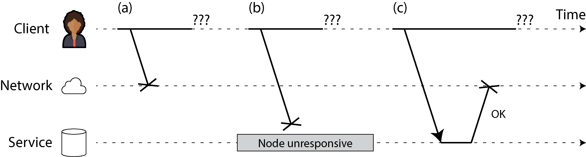
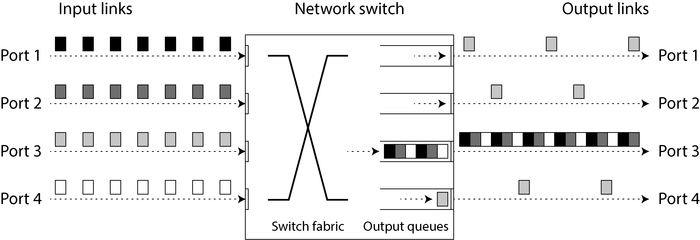
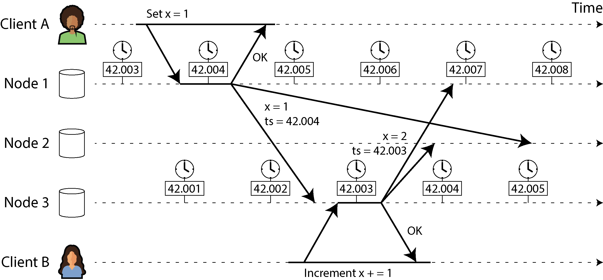
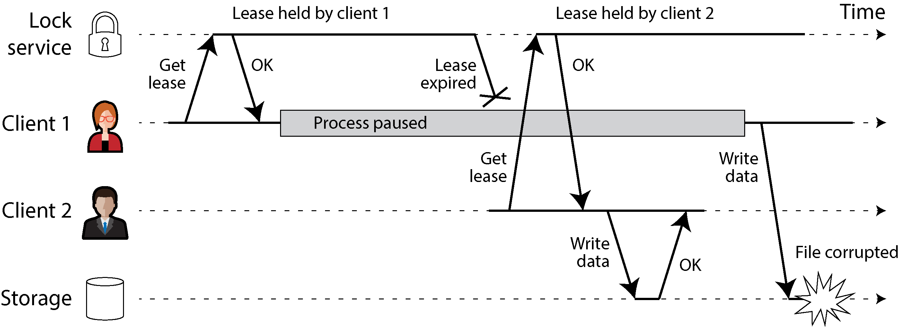
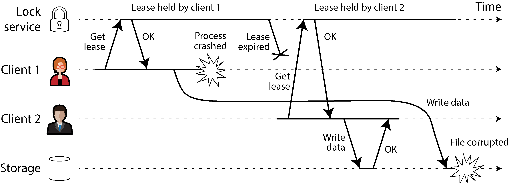
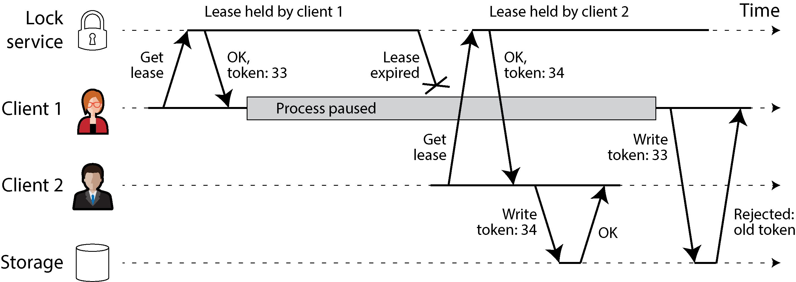
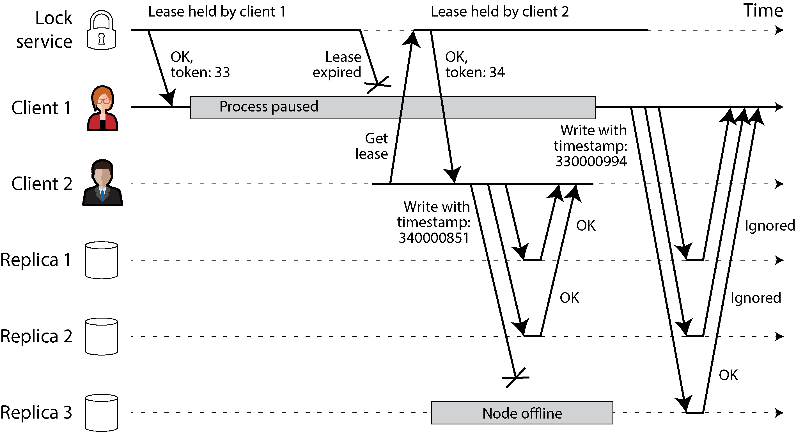

# The Trouble with Distributed Systems

A.A. Milne ki book *The House at Pooh Corner* ka ek bohot pyaara quote hai: **"Accidents bohot ajeeb cheezein hain. Jab tak aapke sath accident ho nahi jata, tab tak aapko lagta hai ke yeh nahi hoga."**

Isi tarah software engineering mein bhi jab tak system crash nahi hota, hum samajhte hain ke sab theek chal raha hai. Chalein ab is text ke har ek point aur concept ko bohot hi aasan aur dilchasp tarike se break down karte hain.

---

### Happy Path Trap aur Mindset ka Badalna

Jab hum software banate hain, to hamara pura dhyan **Happy Path** par hota hai. Happy path ka matlab hai ke "sab kuch achha achha chal raha hai"—user ne sahi data dala, internet bilkul perfect chal raha hai, aur database ne foran respond kiya. Kyunke 90% time cheezein theek chalti hain, isliye developers faults (galatiyon ya kharabiyon) ko ignore kar dete hain kyunke unko handle karna bohot boring aur mushkil lagta hai.

Lekin agar aap ek aisa system banana chahte hain jo kabhi na ruke (**Reliable System**), to aapko apni soch ko bilkul badalna hoga. Aapko har waqt bura sochna padega (**Pessimism**). Agar kisi kharabi ka chance laakhon mein ek (one-in-a-million) bhi hai, to ek bade system mein (jahan har roz karodon requests aati hain) woh laakhon mein ek wali kharabi **har roz** hogi! Jo log bade systems chalate hain, unka ek hi asool hota hai: **"Jo cheez kharab ho sakti hai, woh ek na ek din zaroor kharab hogi."**

Single computer par code likhna aur **Distributed System** (jahan bohot saare computers aapas mein network ke zariye jude hote hain) par code likhna bilkul alag baat hai. Distributed systems mein faults naye aur ajeeb tareeqon se aate hain, jaise network ka slow ho jana ya computer ki ghardiyon (clocks) ka aapas mein aage peeche ho jana.

---

## Faults and Partial Failures

### Single Computer Ka Behavior (Predictable aur Deterministic)

Jab aap ek akele computer par koi program chalate hain, to uska behavior bohot saaf aur seedha hota hai: **ya to program poora chalega, ya bilkul nahi chalega.** * **Deterministic:** Iska matlab hai ke agar computer ka hardware theek hai, to aap ek hi kaam baar baar karenge to har baar bilkul same result aayega.

* **Total Failure:** Agar hardware mein koi masla aa jaye (jaise RAM kharab ho jaye ya koi wire dheeli ho jaye), to poora computer hi baith jata hai. Aapke samne **Blue Screen of Death (BSOD)** aa jayegi ya kernel panic ho jayega. Computer ya to poora zinda hota hai ya poora mar jata hai—bich ki koi state nahi hoti.

Computer ko jaan booch kar aisa design kiya gaya hai. Agar koi andaruni kharabi aaye, to behtar hai ke computer poora crash ho jaye, bajaye iske ke woh aapko galat calculation karke de. Kyunke agar computer chupchaap galat data generate karta raha, to usay pakadna bohot mushkil ho jayega.

CPU aur Memory asal mein physical wires aur transistors se bane hain jahan halki-fulki kharabiyan (silent corruption) hoti rehti hain, lekin computer ka hardware unhein hum se is tarah chupata hai jaise sab kuch mathematically perfect chal raha ho. Hum is ideal duniya ke itne aadi ho chuke hain ke hum in faults ko bhool hi jaate hain.

### Distributed Systems Ka Behavior (The Messy Physical World)

Lekin jab aapka software ek computer ke bajaye bohot saare computers par chal raha ho jo network se jude hain, to kahani bilkul badal jati hai. Ab aap is perfect duniya mein nahi rehte, balki physical duniya ki haqeeqat se aapka saamna hota hai.

Writer ne yahan **Coda Hale** ka ek bohot hi mazahiya aur real-world experience share kiya hai ke unho ne data centers mein kya kya kharabiyan dekhi hain:

> "Main koi ops (operations) ka banda nahi hoon, phir bhi apne chote se career mein main ne ye sab aafatain dekhi hain: Data center ke andar lambe arsay tak network ka toot jana, power supply units (PDU) ka phat jana, network switches ka kharab hona, poore ke poore server racks ki banti gul ho jana, data center ka main internet network fail ho jana, poore data center ki light chale jana... aur to aur, ek baar ek sugar (hypoglycemic) ka mareez driver apni Ford pickup truck lekar data center ke AC (HVAC) system ke andar ghus gaya!"

### Partial Failure Kya Hai?

Distributed system mein sab se bada masla **Partial Failure** (aadhi-adhuri kharabi) ka hota hai.

* **Definition:** Iska matlab hai ke system ka ek hissa (kuch computers ya network) bilkul toot chuka hai ya kharab hai, jabki system ka baki hissa bilkul sahi kaam kar raha hai.
* **Nondeterministic:** Yeh kharabiyan aisi hoti hain jinke baare mein aap pehle se andaza nahi laga sakte. Agar aap network ke zariye 3 computers ko koi kaam bhejenge, to ho sakta hai ek baar kaam ho jaye, aur agli baar achanak fail ho jaye. Aapko kabhi kabhi yeh bhi pata nahi chalta ke jo request aap ne bheji thi, woh kamyab hui bhi hai ya nahi!

Yahi aadhi-adhuri kharabi (nondeterminism) distributed systems ko design karna sab se mushkil kaam banati hai.

### Unreliable Components Se Reliable System Banana

Lekin iska ek dusra rukh bohot powerful hai. Agar hum ek aisa system design kar lein jo in **Partial Failures** ko bardasht kar sake (**Fault Tolerant**), to hum saste aur aam computers (jo kabhi bhi kharab ho sakte hain) ko mila kar ek bohot hi pakka aur mazboot system bana sakte hain.

Iska sab se bada faida **Rolling Upgrade** hota hai. Agar aapne software ko update karna hai, to aapko poora system band karne ki zaroorat nahi hai. Aap ek waqt mein ek computer (node) ko band karenge, usay update karke reboot karenge, aur tab tak baki computers user ka load sambhal rahe honge. Is tarah user ko pata bhi nahi chalega aur aapka poora system bina ruke update ho jayega.

### Sabak (Conclusion)

Distributed system mein kamyab hone ke liye aapko har waqt **shak (suspicion), bura sochne ki aadat (pessimism), aur darr (paranoia)** ki zaroorat hoti hai. Aapko apne testing environment mein jaan booch kar tarah tarah ki kharabiyan (jaise network band karna, servers crash karna) khud paida karni chahiye taake aap dekh sakein ke aap ka system un halaat mein kaise behave karta hai.

---

### Revision Hints (Tezi se yaad karne ke liye)

* **Happy Path Trap:** Sirf sab theek chalne par focus karna aur edge cases ko chor dena.
* **One-in-a-million Rule:** Bade systems mein kam se kam chance wali kharabi bhi har roz hoti hai.
* **Single Computer:** Ya to poora chalta hai ya poora crash hota hai (Deterministic).
* **Distributed System:** Kuch hissa chalta hai, kuch kharab ho jata hai (Partial Failure / Nondeterministic).
* **Fault Tolerance Ka Jadu:** Kamzor aur unstable computers ko jor kar ek nihayat reliable aur hamesha chalne wala system banana.

---

## Unreliable Networks

Purane zamane ke jo bade computers hote the, jinhein **Mainframes** kaha jata tha, unhein reliable (mazboot) banane ka tareeqa alag tha. Un ke andar hi double double components laga diye jate the—jaise agar ek hard disk kharab ho jaye to doosri sambhal le (jisay hum **RAID** kehte hain).

Lekin is book mein hum jin distributed systems par baat kar rahe hain, woh **Shared-nothing systems** hain. Iska matlab hai ke yeh bohot saari alag-alag machines (computers) ka ek jhund hai jo sirf ek network ke zariye aapas mein jude hain. Har machine ka apna dimagh (Memory/RAM) aur apni alag jeb (Disk) hoti hai. Ek machine doosri machine ki RAM ya disk ko direct haath nahi laga sakti; agar koi kaam hai to network par request bhejni padegi. Hatta ke agar hum shared object storage bhi use karein, to us se baat karne ke liye bhi network ki sadak hi istemal karni padti hai.

Hamara internet aur data centers ke andar ka network (Ethernet) **Asynchronous packet networks** hote hain. "Asynchronous" ka matlab hai ke jab ek computer doosre ko data ka ek tukda (packet) bhejta hai, to network is baat ki koi guarantee nahi deta ke woh packet kab pahonchega, ya woh bilkul pahonchega bhi ya nahi!

Agar aap ne ek request bheji aur aap jawab ka intezar kar rahe hain, to yeh **6 buraayein** ho sakti hain:

* **Request lost:** Aap ki request raste mein hi ghum gayi (ho sakta hai kisi ka paon lagne se network cable nikal gayi ho).
* **Queue mein phansna:** Aap ki request line (queue) mein lag gayi hai aur der se pahonchegi (ho sakta hai network par bohot rush ho ya aage wala server overloaded ho).
* **Remote node failed:** Jis server ko request bheji thi, woh crash ho gaya ya uski power chali gayi.
* **Temporary Process Pause:** Server mara nahi hai, temporary ruk gaya hai (jaise Java/Go wagera mein jab bada **Garbage Collection (GC) pause** aata hai, to server thodi der ke liye sunn ho jata hai), lekin baad mein hosh mein aa jayega.
* **Response lost:** Server ne aap ka kaam kar diya, par wapas aate huay network switch ki galat configuration ki wajah se jawab raste mein mar gaya.
* **Response delayed:** Server ne kaam bhi kiya, jawab bhi bheja, par network par load ki wajah se ya aap ke apne computer par load ki wajah se jawab bohot der se pahonch raha hai.

Bhejne wale (sender) ko khud se kabhi pata nahi chalta ke packet deliver hua ya nahi. Wahid tareeqa yeh hai ke samne wala wapas jawab bheje, aur woh jawab bhi to raste mein ghum ya der se aa sakta hai! Is asynchronous network mein aap ko sirf ek baat peta hoti hai: **"Mujhe abhi tak jawab nahi mila."** Iske alawa aap bilkul andha-dhund hain.

Is masle ka aam hal **Timeout** hota hai: yani hum ek time rakh lete hain ke "agar thodi der tak jawab nahi aaya, to main intezar chor dunga aur samajh lunga ke kaam nahi hua." Lekin timeout hone par bhi aap ko sach nahi pata chalta! Ho sakta hai request abhi bhi kahin line mein khari ho aur aap ke umeed chorne ke baad server us par kaam kar de.

### Figure 9-1 Ka Mukammal Breakdown

<div align="center">
  
</div>

Is diagram mein teen horizontal lines hain jo **Client** (jo request bhej raha hai), **Network** (jis ke zariye data ja raha hai), aur **Service** (jo database ya server hai) ki timeline ko dikhati hain. Jab Client koi request bhejta hai aur usay wapas koi jawab nahi milta, to Client ke liye yeh teeno surtehaalan (a, b, aur c) bilkul ek jaisi hoti hain—yani sirf teen sawaaliya nishaan (**???**). Client ko pata hi nahi chalta ke buraai kahan hui:

* **(a) The request was lost:** Client ne request bheji, lekin network mein hi kahin ghum gayi (jaise kisi ne wire nikaal di). Service tak baat pahonchi hi nahi. Client baitha intezar kar raha hai (`???`).
* **(b) The remote node is down:** Client ne request bheji, network ne usay sahi-salamat server tak pahonchaya bhi, lekin aage se server hi mara pada hai (**Node unresponsive**). Server crash ho chuka hai ya band hai, isliye koi jawab nahi aaya (`???`).
* **(c) The response was lost:** Yeh sab se khatarnak scene hai! Client ne request bheji, network se hoti hui server tak gayi, server bilkul theek tha, usne request ko process kiya, database mein entry bhi kar di (**OK**), aur wapas jawab (response) bheja. Lekin wapas aate huay network ne us jawab ko gira diya (drop kar diya). Client ke paas phir bhi kuch nahi pahoncha (`???`).

**Sab se bada masla:** Client ke liye yeh teeno halaat bilkul ek jaisi hain. Remote node par kya hua, yeh jaan-na client ke liye namumkin hai.

---

## The Limitations of TCP

Network par jo packets jate hain, unka ek maximum size hota hai (kuch kilobytes). Lekin hamari applications ko baday baday data streams ya requests bhejni hoti hain. Isliye hum **TCP (Transmission Control Protocol)** (ya naye protocols jaise **QUIC**, **SCTP**, ya **uTP**) ka istemal karte hain jo baday data ko chhote packets mein todte hain aur doosri taraf unhein dobara jor kar seedha kar dene ka kaam karte hain.

TCP ko aam tor par "Reliable" protocol kaha jata hai, kyunke iske paas yeh khubiyan hain:

* **Retransmission:** Agar koi packet raste mein ghum jaye, to yeh usay dobara bhejta hai.
* **Reordering:** Agar packets aage peeche pahonchein, to unhein sahi tarteeb mein lata hai.
* **Checksum:** Checksum ke zariye check karta hai ke data raste mein kharab (corrupt) to nahi hua.
* **Congestion/Flow Control (Backpressure):** Yeh andaza lagata hai ke data kitni tezi se bhejna chahiye taake network ya samne wali machine par bohot zyada bojh na pad jaye.

**TCP Kaam Kaise Karta Hai?**
Jab aap code mein data ko socket par "send" karte hain, to woh foran internet par nahi jata. Woh aap ke Operating System (OS) ke ek **buffer** (temporary storage) mein baith jata hai. Jab congestion control algorithm dekhta hai ke network par jagah hai, to woh us buffer se data utha kar packet banata hai aur network interface ko deta hai. Packet mukhtalif routers aur switches se hota hua samne wale computer ke OS ke receive buffer mein jata hai. Wahan se samne wale ka OS ek **Acknowledgment (ACK)** packet wapas bhejta hai ke "haan, mujhe mil gaya." Jab ACK wapas aati hai, tabhi OS application ke level par data delivered ka notification deta hai.

**To phir hamien fikar karne ki kya zaroorat hai agar TCP reliable hai?**
Afsoos, TCP network ki na-kaabili-e-etemaad (unreliability) ko poori tarah khatam nahi kar sakta:

* Agar ACK wapas nahi aayi, to TCP samajhta hai packet ghum gaya aur dobara bhejta hai. Lekin TCP ko yeh nahi pata ke data bhejte huay ghuma tha ya ACK wapas aate huay ghumi thi.
* Agar network ki taar hi tooti hui hai, to TCP usay khud se jor nahi sakta. Ek had tak retry karne ke baad TCP hath khade kar deta hai aur application ko error de deta hai.
* TCP ka data ko double honay se bachana (**Deduplication**) sirf ek single connection ke andar kaam karta hai. Agar connection toot gaya aur aap ki application ne naya connection bana kar data dobara bheja, to data **duplicate** ho sakta hai (server par do baar entry ho sakti hai).
* Agar TCP connection error ke sath band ho jaye, to aap ko nahi pata chal sakta ke samne wale computer ne kitna data process kiya tha. Hatta ke agar ACK mil bhi jaye, to iska matlab sirf yeh hai ke samne wale ke OS kernel ko data mila hai; ho sakta hai data application tak pahonchne se pehle hi woh application crash ho gayi ho! Agar aap ko paka yakeen chahiye ke kaam hua hai, to aap ko **Application Level** se haan ka jawab chahiye.

Phir bhi, TCP bohot faidemand hai kyunke yeh baday messages ko handle karne ka aasan rasta deta hai. Ek baar connection ban jaye, to hum header mein message ki length bakaida likh kar ek hi connection par kai requests aur responses bhej sakte hain (jaise HTTP aur RPC kaam karte hain).

---

## Network Faults in Practice

Hum kai dahaiyon (decades) se computer networks bana rahe hain, lagta tha ke ab tak hum network ko perfect banana seekh gaye honge, par aisa nahi hua. Real-world studies se pata chalta hai ke network ke masle aam hain, hatta ke un data centers mein bhi jahan har cheez ek hi company control kar rahi hoti hai:

* **Data Center Study:** Ek darmiyani size ke data center ki study mein dekha gaya ke wahan har mahine taqreeban **12 network faults** aate hain. Un mein se aadhe faults ek akele computer ko network se kaat dete hain, aur baqi aadhe poore ke poore server rack (servers ka poora dhaanchan) ko hi alag kar dete hain.
* **Redundancy Ki Limitations:** Switches aur load balancers ko double double (redundant) karne se bhi faults utne kam nahi hote jitna hum sochte hain, kyunke redundancy **Human Error** (insani galatiyon, jaise switches ki galat configuration) ko nahi rok sakti, jo ke outages ki bohot badi wajah hai.
* **Janwar aur Insan:** Zameen par bichhi fiber links tootne ka ilzam kabhi **gaayon (cows)** par, kabhi **udbilaw (beavers)** par, aur samundar ke andar **sharks** par aata raha hai (halaanke submarine cables ki shielding ab behtar ho gayi hai). Insan bhi kam nahi hain, aksar galti se galat config kar dete hain, ya taarein chori (**scavenging**) kar lete hain ya jaan booch kar sabotage karte hain.
* **Arbitrary Delays:** Cloud regions ke darmiyan kabhi kabhi round-trip time kuch minutes tak chala jata hai! Ek hi data center ke andar, agar kisi switch ka software upgrade chal raha ho aur network apna rasta dobara badal raha ho (**network topology reconfiguration**), to packet 1 minute se zyada delay ho sakta hai. Isliye distributed system mein hum yeh maan kar chalte hain ke message kitna bhi delay ho sakta hai.
* **Asymmetric & Non-transitive Faults:** Kabhi kabhi aadhi-adhuri kharabi hoti hai. Jaise Machine A, Machine B se baat kar sakti hai, aur Machine B, Machine C se baat kar sakti hai, lekin Machine A aur Machine C aapas mein baat nahi kar saktay (**Non-transitive**). Ya phir aisa ajeeb masla ke network card bahar data bhej raha hai par andar aane wale saare packets drop kar raha hai (One-way link).
* **Long-lasting Repercussions:** Network ka jhatka bhale hi kuch seconds ka ho, par uske asraat system par ghanton tak reh sakte hain.

> ### Network partitions
> 
> 
> Jab network ke kisi fault ki wajah se cluster ka ek hissa baqi hissay se bilkul kat jaye, to isay **Network Partition** ya **Netsplit** kehte hain. Yeh koi alag bala nahi hai, balki aam network faults jaisa hi hota hai. (Yaad rahe, iska database ki sharding/partitioning se koi talluq nahi hai).

Agar aap ne apne software mein network faults ko handle karne ka tareeqa pehle se code nahi kiya aur usay test nahi kiya, to kuch bhi bura ho sakta hai: aap ka poora cluster **Deadlock** ho sakta hai (yani network theek hone ke baad bhi kaam karna band kar dega) ya phir aap ka saara data delete ho sakta hai!

**Hal kya hai?**
Faults ko handle karne ka matlab hamesha yeh nahi hota ke system ko har haal mein chalte rehna chahiye. Agar aap ka network aam tor par theek rehta hai, to masle ke waqt user ko sirf ek saaf saaf **Error Message** dikha dena bhi ek valid tareeqa hai. Lekin aap ko yeh zaroor pata hona chahiye ke aap ka software kharabi par kya harkat karega aur woh khud ko dobara theek kaise karega. Isliye testing ke dauran jaan booch kar network kharab karke check karna (**Fault Injection**) bohot zaroori hai.

---

### Revision Hints (Tezi se yaad karne ke liye)

* **Figure 9-1 (Sawaaliya Nishaan):** Client ko kabhi pata nahi chalta ke request khoyi, server down hai, ya response khoya—teeno scenes same lagte hain.
* **Shared-Nothing:** Computers jo sirf network ke zariye jude hain, koi direct memory/disk share nahi hoti.
* **Asynchronous Network:** Arrival time ya delivery ki koi pakki guarantee nahi hoti.
* **TCP Reliability Limits:** TCP packet retransmit karta hai par connection tootne par yeh nahi bata sakta ke application ne data process kiya ya nahi. Deduplication sirf ek connection tak chalti hai.
* **Real-world Faults:** Networks mein delays arbitrary ho sakte hain, links asymmetric (ek taraf chalne wale) ho sakte hain, aur insani ya janwaron ki wajah se taarein toot sakti hain.
* **Fault Injection:** Jaan booch kar network kharab karke system ki recovery test karna zaroori hai.

---


## Fault Detection

Distributed systems mein chalte hue computers (nodes) ka achanak kharab ho jana ek aam baat hai. Lekin system ko kaise pata chalega ke koi machine mar chuki hai? Iski zaroorat humein bohot jagah parti hai, jaise:

* **Load Balancer:** Agar ek server down ho jaye, to Load Balancer ko foran pata chalna chahiye taake woh naye users ki requests us mare hue server par na bheje (**take it out of rotation**).
* **Single-Leader Databases:** Agar database ka main leader fail ho jaye, to kisi ek follower ko tarakki de kar naya leader banana parta hai (**failover**). Agar purane leader ke marne ka pata nahi chalega, to naya leader kaise banega?

Lekin network par itna shak hota hai ke yeh pakka maloom karna namumkin ho jata hai ke samne wali machine zinda hai ya mar gayi. Kuch khas halaat mein hamara Operating System ya Network hamari thodi madad karte hain aur seedha jawab (**explicit feedback**) de dete hain:

* **TCP RST ya FIN Packet:** Agar machine chal rahi hai par uske andar chalne wala software (process) crash ho gaya hai, to jab aap us port par connect karne ki koshish karenge, to us machine ka Operating System aapko **RST (Reset)** ya **FIN (Finish)** packet bhej kar saaf mana kar dega ke "bhai, yahan koi sunne wala nahi hai."
* **Crash Notification Scripts:** Agar process khud crash ho jaye ya system administrator usay jaan booch kar band kare, to background mein ek script doosre nodes ko foran bta sakti hai ke "main ja raha hoon, tum sambhal lo." (Jaise **HBase** database mein hota hai). Is se timeout ka intezar nahi karna parta.
* **Switch Management Interfaces:** Agar aap apne hi data center mein hain, to aap network switches se pooch sakte hain ke kya falana machine ki wire mein hardware level par power aa rahi hai ya nahi. Lekin agar aap cloud (AWS/Azure) use kar rahe hain ya internet ke zariye connect hain, to aap switches ko direct touch nahi kar sakte.
* **ICMP Destination Unreachable:** Agar raste ka koi router pakka jaanta hai ke jis IP address par aap ja rahe hain woh rasta hi band hai, to woh aapko ek **ICMP** error message bhej deta hai. Lekin router ke paas bhi koi jaadu nahi hai, woh bhi network ke unhi maslo ka shikaar ho sakta hai.

Yeh saari feedback bohot achhi hain, par aap in par **100% bharosa nahi kar sakte**. Aksar auqaat aapko koi jawab hi nahi milta—sirf khamoshi milti hai.

Is khamoshi ka wahid hal hai ke aap kuch der intezar karein (**Timeout**), aur agar us dauran jawab na aaye to node ko "mra hua" (**dead**) declare kar dein. Lekin yahan ek bada trade-off hai: **False Positives vs False Negatives**. Agar timeout bohot chota rakha to zinda node ko galti se dead samajh liya jayega, aur agar bohot bada rakha to mare hue node ke intezar mein system slow ho jayega.

---

## Timeouts and Unbounded Delays

Agar timeout hi wahid rasta hai, to timeout kitna bada hona chahiye? Iska koi ek aasan jawab nahi hai.

* **Chota Timeout (Short Timeout):** Kharabi ka foran pata chal jata hai, par risk yeh hai ke agar koi node sirf thoda sa slow hua tha (load ki wajah se), to system usay galti se dead samajh lega.
* **Bada Timeout (Long Timeout):** System safe rehta hai par jab sach mein koi node marta hai, to users ko lambe arsay tak intezar karna parta hai ya errors dekhne parte hain.

**Zinda machine ko dead declare karne ka nuksaan:**
Farz karein ek node zinda tha aur user ke kehne par email bhej raha hai. Network slow hone ki wajah se aapne usay dead declare kar diya aur uska kaam doosre node ko de diya. Ab doosra node bhi wahi email bhej dega, yani user ko **do baar email** chali jayegi!

Is se bhi bada masla **Cascading Failure (Aafat ka ek silsila)** hai. Jab ek node ko dead declare kiya jata hai, to uska saara bojh (load) baqi nodes par daal diya jata hai. Agar woh node mara nahi tha balki pehle hi load ki wajah se slow tha, to uska load doosre nodes par jaane se woh doosre nodes bhi load se dabb kar slow ho jayenge. Phir unhein bhi dead declare kar diya jayega, aur ahista ahista poora system dominoes ki tarah baith jayega.

### Ek Farzi Perfect System Ka Timeout ($2d + r$)

Writer kehta hai ke farz karein hum ek khayali (fictitious) duniya mein hain jahan network guarantee deta hai ke ek packet zyada se zyada $d$ time mein deliver ho jayega (ya phir raste mein ghum jayega, par $d$ se zyada time kabhi nahi lega). Aur zinda server hamesha $r$ time ke andar request ko process kar leta hai.

Is ideal duniya mein, agar aap request bhejenge to:

1. Request ko server tak jaane mein maximum time lagega = $d$
2. Server ko process karne mein maximum time lagega = $r$
3. Jawab ko wapas aap tak aane mein maximum time lagega = $d$

To total maximum time ho gaya:


$$2d + r$$

Agar aapne timeout 

$$2d + r$$

 rakha aur is time ke andar jawab nahi aaya, to aap 100% yakeen se keh sakte hain ke ya to network toot gaya hai ya server mar gaya hai.

Lekin haqeeqat mein hamare networks **Asynchronous** hote hain jin mein **Unbounded Delays** hote hain—yani delay ki koi aakhri had (upper limit) nahi hoti. Data jitna chahein der se pahonch sakta hai, isliye hum yeh ideal formula real life mein use nahi kar sakte.

---

## Network congestion and queueing

Real life mein gaari chalate huay travel time kyun badhta hai? Traffic jam (congestion) ki wajah se. Computers mein bhi delay ki sab se badi wajah **Queues (Linen)** hoti hain:

### Figure 9-2 Ka Mukammal Breakdown

Aap ne jo diagram share ki hai, woh network switch ke andar ka traffic jam dikhati hai. Isko step-by-step samajhte hain:

----

<div align="center">
  
</div>

----

1. **Input Links (Port 1, 2, 3, 4):** Baayein (left) taraf se chaar alag-alag ports se data ke chhote blocks (packets) switch ke andar aa rahe hain. Har port ke packets ka rang alag hai (Port 1 ke kaale hain, Port 2 ke grey hain, Port 4 ke safaid hain).
2. **Switch Fabric:** Yeh switch ka andaruni rasta hai jo packets ko sahi disha mein bhejta hai.
3. **The Problem (Destination Port 3):** Is diagram mein Port 1, Port 2, aur Port 4 teeno ke teeno computer achanak apna data ek hi waqt mein **Port 3** ki taraf bhej rahe hain (**Output Links** par Port 3 ko dekhein).
4. **Output Queues (Traffic Jam):** Chunke Port 3 ki nikalne wali line (wire) ek waqt mein sirf ek hi packet bhej sakti hai, isliye switch ke andar Port 3 ke samne ek lambi line (**Output Queue**) lag gayi hai. Aap dekh sakte hain ke us queue mein kaale, grey aur safaid saare packets line mein khare apni baari ka intezar kar rahe hain.
5. **Packet Drop (Congestion):** Agar peeche se data aata raha aur yeh line (buffer) poori bhar gayi, to switch naye aane wale packets ko **drop (gira)** dega. Network bilkul theek chal raha hai, koi taar nahi tooti, lekin jagah na hone ki wajah se packet ghum gaya aur usay dobara (retransmit) bhejna padega, jis se bohot zyada delay aayega.

Switch ke alawa queues aur kahan kahan banti hain?

* **Destination Machine OS Queue:** Jab packet computer tak pahonch jata hai, agar CPU ke saare cores ya application ke threads pehle se busy hain, to Operating System us packet ko ek queue mein rakh deta hai jab tak application free na ho.
* **Virtualization Pauses (VM Monitor):** Cloud mein jab aapki Virtual Machine (VM) chal rahi hoti hai, to achanak hypervisor aapki VM ko kuch milliseconds ke liye rok (pause) deta hai taake doosri VM ko CPU mil sake. Us dauran aane wala data background mein queue hota rehta hai.
* **TCP Sender Buffer / Backpressure:** TCP khud network ko jam hone se bachane ke liye data ko pehle bhejne wale ke buffer mein rok leta hai (Backpressure), jis se network par jaane se pehle hi delay aa jata hai.

Jab TCP kisi packet ke ghumne par usay dobara bhejta hai, to aapki application ko yeh nahi pata chalta ke packet khoya tha, usay sirf itna lagta hai ke "yaar, aaj jawab bohot der se aaya."

---

## TCP Versus UDP

Kuch applications aisi hoti hain jinhein har haal mein speed chahiye hoti hai (jaise video calling, voice calling, ya online gaming). Woh TCP ke bajaye **UDP (User Datagram Protocol)** use karti hain. Yeh reliability aur delay ke darmiyan ek trade-off hai:

* **UDP** na to data ko retransmit (dobara) bhejta hai aur na hi speed control karta hai. Is wajah se TCP wale lambe delays se bach jata hai.
* **Kyun use hota hai?** Kyunke aisi jagah par purana data bilkul bekar hota hai. Agar aap phone par baat kar rahe hain aur aap ki aawaz ka ek tukda raste mein ghum gaya, to TCP usay dobara bhejega, par tab tak baat aage nikal chuki hogi! Behtar yeh hai ke us khali jagah par halki si khamoshi aa jaye aur stream aage chalti rahe. Agar baat samajh na aaye, to insan khud hi pooch leta hai: *"Kya kaha aapne? Aawaz kat gayi thi."* (Retry human layer par hota hai).

---

## Variability of network delays

Network mein delays tab sab se zyada ajeeb aur unpredictable hote hain jab system apni poori capacity ke qareeb chal raha ho. Agar system khali hai, to queues foran saaf ho jati hain, par agar load zyada hai, to queues bohot tezi se lambi ho jati hain.

**Noisy Neighbor (Cloud ka masla):**
Public clouds (jaise AWS) mein aap resources doosre customers ke sath share kar rahe hote hain. Ek hi physical switch ya network wire se aap ka data bhi ja raha hai aur kisi aur ka bhi. Agar aapke sath wala koi customer (Noisy Neighbor) achanak bohot bhari data transfer shuru kar de, to uski wajah se network switches jam ho jayenge aur **aapko delay ka samna karna padega**, halankeh aap ne kuch bhi galat nahi kiya.

**Iska Hal Kya Hai?**

1. **Experimental Timeouts:** Cloud mein aap ko mukhtalif machines par lambe arsay tak network ka round-trip time measure karna padta hai taake aap ko delays ki distribution samajh aaye, aur phir aap ek suitable timeout decide karte hain.
2. **Dynamic Timeouts:** Sab se behtar tareeqa yeh hai ke system khud hi har waqt network ki speed aur thartharahat (**jitter / variability**) ko naapta rahe aur halaat ke mutabaq timeout ko khud hi kam ya zyada karta rahe. Iska ek mashhoor tareeqa **Phi Accrual Failure Detector** hai, jo Cassandra aur Akka systems mein istemal hota hai. TCP bhi apne retransmission timeouts ko isi tarah dynamic tareeqay se adjust karta hai.

---

### Revision Hints (Tezi se yaad karne ke liye)

* **Explicit Feedback:** RST packets, crash scripts, aur ICMP madad karte hain, par in par 100% relying nahi ki ja sakti.
* **Timeout Formula:** Ideal duniya mein formula $2d + r$ hota hai, par real life asynchronous networks mein delays **unbounded** (bina had ke) hote hain.
* **Cascading Failure Trap:** Chote timeout se zinda nodes ko dead declare karne se baki nodes par load badhta hai aur poora cluster crash ho sakta hai.
* **Figure 9-2 (Switch Jam):** Jab mukhtalif ports ek hi port par data bhejein, to switch queue bhar jati hai aur packets drop ho jate hain.
* **TCP vs UDP Trade-off:** UDP retransmit nahi karta, isliye video/voice calls ke liye behtar hai kyunke wahan delayed data kachra hota hai.
* **Noisy Neighbor:** Cloud mein doosre logon ke heavy usage ki wajah se aapka network slow ho sakta hai, jiska hal **Phi Accrual** jaise dynamic failure detectors hain.

---

## Synchronous Versus Asynchronous Networks
Distributed systems bohot aasan ho jate agar hum aankhein band karke network par bharosa kar sakte ke packet bina kisi delay ke aur bina drop hue doosri taraf pahonch jayega. To phir hum is masle ko hardware level par hi solve kyun nahi kar dete taake software developers ko iski fikar hi na ho?

Is sawaal ka jawab samajhne ke liye, hum data center ke networks ka muqabla purane zamane ke **traditional landline telephone network** (non-cellular, non-VoIP) se karte hain, jo ke nihayat reliable hota hai; wahan na to aawaz rukti hai aur na hi call achanak katti hai. Phone call ko hamesha ek constant kam latency (delay) aur barabar bandwidth chahiye hoti hai. To kya hi achha ho agar computer networks mein bhi humein aisi hi reliability mil jaye?

Jab aap landline se call karte hain, to network ek **Circuit** (ek pakka aur makhsoos rasta) bana deta hai. Dono baat karne walon ke darmiyan poore raste mein ek fixed, guaranteed bandwidth allocate (reserve) ho jati hai jo sirf unhi ki hoti hai jab tak call khatam nahi hoti. Misal ke tor par, ek ISDN network har second mein 4,000 frames bhejta hai. Jab call milti hai, to har frame mein 16 bits ki jagah is call ke liye fix ho jati hai. Iska matlab hai ke call ke dauran har 250 microseconds mein aap pakki 16 bits audio data bhej sakte hain.

Yeh network **Synchronous** hota hai. Data bhale hi kai routers se guzre, usay kahin bhi line (queue) mein khara nahi hona parta kyunke aage wale raste mein uski 16 bits ki seat pehle se reserved hoti hai. Aur jab queueing nahi hogi, to delay bhi bilkul fixed hoga. Isay hum **Bounded Delay** (aik had mein rehne wala delay) kehte hain.

---

### Can we not simply make network delays predictable?

Yaad rakhein ke telephone network ka ek **Circuit** aur computer network ka ek **TCP Connection** do bilkul alag cheezein hain. Circuit mein bandwidth ka ek fixed hissa pakka book hota hai jisay koi doosra banda use nahi kar sakta jab tak call chal rahi hai, jabke TCP connection ke packets aapas mein dhakka-pel karke jo bhi bandwidth milti hai usay opportunistically (moka parast tarike se) istemal karte hain. Aap TCP ko kisi bhi size ka data de dein (jaise ek email ya web page), woh usay kam se kam waqt mein pohnchane ki koshish karega. Aur jab TCP khaali betha ho, to woh koi bandwidth zaya nahi karta (siwaye kabhi kabhar ek chote se keepalive packet ke).

Agar hamare data centers aur internet bhi telephone ki tarah circuit-switched networks hote, to jab circuit banta tabhi hum ek guaranteed maximum round-trip time (delay) set kar sakte thy Lekin aisa nahi hai. Ethernet aur IP protocols **Packet-switched** hote hain, jahan data queues mein phans jata hai aur isi wajah se network mein delay **Unbounded** (bina kisi aakhri had ke) ho jata hai. In protocols mein circuit ka koi concept hi nahi hota.

**Hum data centers aur internet mein packet switching kyun use karte hain?**
Iska jawab yeh hai ke computer networks ko **Bursty Traffic** ke liye optimize kiya gaya hai. Ek circuit us kaam ke liye behtar hai jahan har second barabar data (bits) bhejna ho, jaise audio ya video call. Lekin jab aap koi web page kholte hain, email bhejte hain, ya koi file download karte hain, to koi constant bandwidth ki shart nahi hoti—hum bas chahte hain ke jo bhi kaam ho, woh jaldi se jaldi khatam ho jaye.

Agar aap circuit-switched network par koi file bhejenge, to aap ko pehle se andaza lagana padega ke "mujhe itni bandwidth chahiye." Agar aapne kam bandwidth maangi, to file bohot slow transfer hogi aur network khali hone ke baajood zaya jayega. Agar aapne zyada bandwidth maangi aur network ke paas itni free bandwidth na hui, to aapka circuit ban hi nahi payega (request reject ho jayegi). Iske bar-aks, TCP halaat ke mutabaq khud ko dhal leta hai aur jitni jagah milti hai us hisab se tezi se data bhejta hai.

---

### Latency and Resource Utilization

Agar hum bade paimane par dekhein, to variable delays (badalte hue delays) asal mein **Dynamic Resource Partitioning** (resources ko moqa ke mutabaq baantna) ka nateeja hain.

Farz karein do telephone switches ke darmiyan ek fiber wire hai jo ek waqt mein 10,000 simultaneous calls chala sakti hai. Har circuit jo is wire se guzre gaa, woh un 10,000 slots mein se ek slot pakad lega. Yeh resource ka **Static Partitioning** (pakka batwara) hai. Agar wire par sirf aap akele call kar rahe hain aur baqi 9,999 slots bilkul khaali hain, tab bhi aap ko sirf aap ka apna ek hi slot milega, baqi saari wire khaali padi rahegi par aap usay use nahi kar sakte.

Iske ulat, internet par bandwidth ka batwara **Dynamically** hota hai. Saare senders ek doosre ke sath push aur jostle (dhakkam-dhakka) karte hain taake unka packet wire par pehle nikal jaye, aur network switches har lamhe yeh faisla karte hain ke ab kis packet ko pehle bhejna hai (yani bandwidth kisko deni hai). Is approach ka nuksaan yeh hai ke **Queues (linen)** lag jati hain, lekin faida yeh hai ke wire poori tarah istemal (**Maximize Utilization**) hoti hai. Wire lagane ka kharcha fixed hota hai, to jitna zyada data us se guzrega, har ek byte aap ko utna hi sasta padega.

**CPU ki misal:**
Bilkul yahi scene CPU ke sath bhi hota hai. Agar aap ek CPU core ko mukhtalif threads ke darmiyan dynamically share karte hain, to ek thread ko thodi der Operating System ki run queue mein intezar karna parta hai jab tak doosra thread chal raha ho. Is wajah se threads alag-alag time ke liye pause hote hain (variable delay). Lekin is se hardware ka utilization bohot behtar hota hai, bajaye iske ke hum har thread ke liye CPU cycles ka ek hissa pakka fix kar dein aur thread kuch na kar raha ho to woh cycles zaya jayein. Cloud platforms (jaise AWS/Azure) bhi isi wajah se ek hi physical machine par alag-alag customers ki kai Virtual Machines (VMs) chalate hain taake hardware zaya na ho.

**Mehnge vs Saste ka Trade-off:**
Agar aap resources ko pakka baant dein (**Static Partitioning** / dedicated hardware aur exclusive bandwidth), to aap ko delay ki guarantee mil sakti hai, par iska nuksaan yeh hai ke hardware sahi se utilize nahi hoga aur yeh tarika bohot **Mehenga (Expensive)** padega. Doosri taraf, jahan bohot saare log mil kar dynamic tareeqay se resource share karte hain (**Multitenancy**), to hardware poora istemal hota hai aur yeh bohot **Sasta (Cheaper)** padega, par nuksaan variable delay hai. Network mein delays koi kudrati qanoon nahi hain, balki yeh sirf ek **Cost/Benefit Trade-off** ka nateeja hain.

---

### Combining circuit switching and packet switching

Dono tareeqon (circuit aur packet switching) ko mila kar hybrid networks banane ki koshishain bhi ki gayi hain. 1980s mein **ATM (Asynchronous Transfer Mode)** aya jo Ethernet ka muqabla karna chahta tha, lekin yeh telephone company ke main switches ke bahar zyada kamyab nahi ho saka.

**InfiniBand** mein bhi is jaisi cheezein hain: yeh link layer par hi end-to-end flow control lagata hai jis se network ke andar queues ki zaroorat kam ho jati hai, halankeh raste mein rush (link congestion) ki wajah se is mein bhi delay aa sakta hai.

Agar hum **QoS (Quality of Service)** ke tareeqon ko dhyan se use karein—jaise packets ko priority dena (prioritization), scheduling karna, aur data bhejne walon ki speed control karna (**admission control**) — to hum packet network par bhi telephone ke circuit jaisa mahaul bana sakte hain ya kam az kam delay ko ek had tak control kar sakte hain.

* Naye algorithms jaise **L4S (Low Latency, Low Loss, Scalable Throughput)** client aur router dono level par queue aur congestion ke masle ko hal karne ki koshish karte hain.
* Linux ka **Traffic Controller (TC)** bhi applications ko ye ijazat deta hai ke woh QoS ke liye apne packets ki priority badal sakein.

**Lekin Cloud mein kya hota hai?**
Yeh saare QoS mechanisms filhal shared data centers aur public clouds mein ya aam internet par **enable nahi hote**. Jo technology aaj kal deploy hui hai, woh humein delay ya reliability ki koi pakki guarantee nahi deti; humein har haal mein yeh maan kar chalna padega ke network jam hoga, queues banengi, aur unbounded delays aayenge. Consequently, timeouts ki koi ek "correct" value nahi hoti, humein hamesha testing aur experiments karke hi andaza lagana padta hai.

Internet service providers (ISPs) ke darmiyan jo peering agreements hote hain aur **BGP (Border Gateway Protocol)** ke zariye jo raaste tay kiye jate hain, woh aam IP routing ke muqable mein telephone circuit se zyada milte julte hain. Is level par aap dedicated bandwidth khareed sakte hain. Lekin internet routing poore networks ke level par kaam karti hai, akele hosts ke darmiyan nahi, aur yeh bohot lambe timescale par operate karti hai.

---

### Revision Hints (Tezi se yaad karne ke liye)

* **Synchronous Network (Telephone):** Circuit-switched hota hai. Bandwidth pehle se reserve hoti hai, koi queues nahi banti, delays guaranteed aur fixed (**Bounded Delay**) hote hain.
* **Asynchronous Network (Internet/Ethernet):** Packet-switched hota hai. Data ko tukdon (packets) mein bhejta hai, queues banti hain, delays unpredictable (**Unbounded Delay**) hote hain.
* **Why Packet Switching?** Yeh **Bursty Traffic** (achanak heavy data aana jaise web pages/emails) ke liye perfect hai. Constant bits wale kaam (voice/video) ke liye circuit switching behtar hai.
* **Resource Partitioning Trade-off:** * *Static (Fixed):* Latency ki guarantee + expensive + low hardware utilization.
* *Dynamic (Shared):* Variable delays + cheaper + high hardware utilization (Multi-tenancy/Cloud).
* **QoS (Quality of Service):** L4S aur Linux `tc` jaise tools se circuit switching ko emulate (copy) karne ki koshish ki jati hai, par public cloud/internet par iski koi guarantee nahi hoti.

---

## Unreliable Clocks

Distributed systems mein waqt (time) aur ghardiyan (clocks) bohot zyada zaroori hoti hain. Hamari applications bohot saare aam sawaalon ka jawab dhundne ke liye ghardiyon par depend karti hain, jaise ke:

1. Kya is request ka timeout waqt khatam ho chuka hai?
2. Is service ka 99th percentile response time (yani sab se slow requests ka time) kya hai?
3. Is service ne pichle 5 minutes mein average kitni queries per second (QPS) handle keen?
4. User ne hamari website par kitna waqt guzara?
5. Yeh article kis tareekh aur kis waqt publish hua tha?
6. Kis tareekh aur kis waqt par user ko reminder email bhejni chahiye?
7. Yeh cache entry kab expire (khatam) hogi?
8. Log file mein is error message ka sahi timestamp (waqt) kya hai?

Agar aap ghor karein to sawaal **1 se 4** tak kisi **Dauraniye (Durations)** ko naapte hain (yani request bhejne aur jawab aane ke darmiyan kitna waqt guzara). Jabke sawaal **5 se 8** tak **Waqt ke ek khas makhsoos nukte (Points in Time)** ko bta rahe hain (yani ek khas tareekh ko ek khas waqt par kya waqt ho raha tha).

Distributed system mein waqt ka hisab rakhna bohot hi tedhi kheer hai, kyunke network par koi bhi baat instant (palkon ke jhapakte hi) nahi hoti. Ek computer se doosre computer tak message jaane mein waqt lagta hai. Jab message doosre server par pahonchega, to woh hamesha bhejne wale waqt se baad ka hi hoga, par network ke badalte hue delays ki wajah se humein yeh kabhi pakka nahi pata hota ke woh kitna baad pahoncha. Is wajah se yeh andaza lagana bohot mushkil ho jata hai ke agar do alag machines par kaam hua, to pehle kaunsa hua aur baad mein kaunsa?

Is se bhi bada masla yeh hai ke network par mojood har machine ki apni ek alag hardware ghardi hoti hai—jo aam tor par ek chota sa **quartz crystal oscillator** (ek chamakti hui kani) hoti hai. Yeh devices bilkul 100% accurate nahi hotikhud-ba-khud thodi aage peeche ho jati hain. Isliye har machine ka waqt ka andaza doosri machine se thoda alag ho sakta hai (koi tez chal rahi hoti hai to koi slow). Hum in ghardiyon ko ek sath jorhne ki koshish zaroor karte hain, aur iske liye sab se zyada **NTP (Network Time Protocol)** use hota hai. NTP ke zariye computer ki ghardi ko internet par mojood kuch main servers ke mutabaq adjust kiya jata hai, jo khud GPS receivers ya atomic clocks se bilkul sahi waqt late hain.

---

## Monotonic Versus Time-of-Day Clocks

Aaj kal ke computers mein kam se kam do tarah ki ghardiyan hoti hain: ek **Time-of-Day clock** aur doosri **Monotonic clock**. Dono waqt hi naapti hain, par dono ka maqsad bilkul alag hai aur in ka farq samajhna bohot zaroori hai.

### Time-of-Day clocks

Yeh bilkul wahi ghardi hai jo aap ki deewar par lagi hoti hai ya jo aap ko calendar ke mutabaq aaj ki tareekh aur waqt bati hai (isay **wall-clock time** bhi kehte hain). Misal ke tor par, Linux mein `clock_gettime(CLOCK_REALTIME)` aur Java mein `System.currentTimeMillis()` aap ko yeh btaate hain ke **1 January 1970** ki aadhi raat (UTC) se lekar ab tak kitne seconds ya milliseconds guzar chuke hain (isay Unix Epoch kehte hain, aur is mein leap seconds ko nahi gina jata).

In ghardiyon ko NTP ke sath sync (barabar) kiya jata hai, taake ideally Machine A aur Machine B ka timestamp bilkul ek hi waqt dikhaye. Lekin is ghardi mein ajeeb o gareeb masle aate hain:

* **Peeche Chhalaang Maarna (Jumping Backwards):** Agar aap ke computer ki local ghardi NTP server se bohot aage nikal jaye, to NTP server usay jhatke se sahi waqt par wapas le aata hai. Is se achanak lagta hai ke waqt **peeche ki taraf chala gaya hai**.
* **Leap Seconds aur DST:** Leap seconds ki wajah se ya Daylight Saving Time (jo kuch mumalik mein ghardiyan ek ghanta aage peeche ki jati hain) ki wajah se bhi is ghardi mein achanak jumps aate hain.

**Sabak:** Kyunke yeh ghardi achanak aage ya peeche chhalaang maar sakti hai, isliye isay do kaamon ke darmiyan ka **elapsed time (guzra hua waqt ya stopwatch wala kaam)** naapne ke liye bilkul istemal nahi karna chahiye.

### Monotonic clocks

Yeh ghardi kisi tareekh ya calendar se waqif nahi hoti, yeh sirf ek **Stopwatch** ki tarah kaam karti hai jo hamesha sirf aage ki taraf barhti hai (isi liye isay Monotonic kehte hain). Linux mein `clock_gettime(CLOCK_MONOTONIC)` aur Java mein `System.nanoTime()` iski misalain hain.

Iski kaam karne ki salahiyat bohot hi seedhi hai: aap ek kaam shuru karne se pehle iski value check karein, kaam khatam hone par dobara check karein, aur dono ka farq nikal lein. Woh farq aap ko bilkul sahi btaayega ke kitne nanoseconds ya microseconds guzre. Lekin is ghardi ki absolute value (yani akele ek number) ka koi matlab nahi hota; ho sakta hai yeh computer ke on (boot) hone se lekar ab tak ka waqt ginn rahi ho. Isliye **do alag computers ki monotonic clock ke numbers ko aapas mein compare karna bilkul be-maani hai**, kyunke dono ka shuruati point alag ho sakta hai.

Agar ek server mein ek se zyada CPUs (sockets) lage hon, to har CPU ka apna alag timer ho sakta hai jo aapas mein perfectly sync na ho. Operating System is masle ko khud handle karne ki koshish karta hai taake software threads ko hamesha ek hi seedha waqt miley, par phir bhi is guarantee par aankhein band karke bharosa nahi kiya ja sakta.

**NTP Ka Slew Karna (Slewing):**
NTP monotonic clock ke sath zabardasti nahi karta (yani isay jhatke se aage peeche nahi koodata). Agar NTP ko lage ke computer ka apna quartz crystal slow ya tez chal raha hai, to woh ghardi ki tick-tick karne ki raftaar ko thoda sa badha ya kam kar deta hai (jisay slewing kehte hain). Default tor par NTP raftaar ko **0.05%** tak tez ya dheema kar sakta hai, par jump kabhi nahi lagata. Isliye distributed systems mein timeouts aur durations naapne ke liye monotonic clock bilkul perfect aur mehfooz hai.

---

## Clock Synchronization and Accuracy

Monotonic clocks ko to kisi ke sath barabar hone ki zaroorat nahi hoti, lekin **Time-of-Day clocks** ko sahi tareekh batane ke liye NTP server ka mohtaj hona padta hai. Afsoos ki baat yeh hai ke hamare paas ghardiyon ko perfectly barabar rakhne ka koi 100% reliable tareeqa nahi hai. Hardware ghardiyan aur NTP aksar dhoka de jaate hain. Iski kuch real-world misalain yeh hain:

* **Clock Drift (Ghardi ka bhatakna):** Computer ke andar laga quartz crystal hararat (temperature) ke badalane se apni raftaar badal leta hai. Google apne servers ke liye **200 ppm (parts per million)** tak ka clock drift maan kar chalta hai. Iska matlab hai ke agar ek computer din mein sirf ek baar sync ho, to din ke aakhir tak uski ghardi sach se **17 seconds** aage ya peeche ho sakti hai! Agar har 30 seconds baad bhi sync karein, tab bhi **6 ms** ka farq aa sakta hai.
* **NTP Refusal:** Agar computer ki ghardi NTP server se bohot zyada alag ho jaye (bohot bada farq ho), to NTP sync karne se mana kar deta hai ya phir ghardi ko jhatke se reset karta hai, jis se applications ke liye waqt achanak aage ya peeche kood jata hai.
* **Firewall Blocks:** Agar galti se koi firewall NTP ke traffic ko rok de, to kisi ko pata bhi nahi chalega aur ahista ahista computer ka waqt baqi network se bohot door nikal jayega.
* **Network Congestion:** NTP ki accuracy is baat par depend karti hai ke network par packet kitni jaldi aa ja raha hai. Agar internet par congestion (traffic jam) ho, to minimum error bhi **35 ms** tak chala jata hai, aur achanak aane wale jhatkon se yeh farq **1 second** tak bhi pahonch sakta hai. Agar network bohot zyada kharab ho, to NTP client umeed chor kar baith jata hai.
* **Bad/Misconfigured Servers:** Kuch internet par mojood public NTP servers khud galat configure hote hain aur ghanton ka galat waqt bta dete hain. Halankeh clients do teen servers se confirm karke outlier ko chor dete hain, par internet par kisi anjan server par apne poore system ka daromadar rakhna thoda khofnak hai.
* **Leap Seconds Ki Tabaahi:** Jab kabhi minute ko 59 ya 61 seconds ka kiya jata hai (leap second adjustment), to jo systems iske liye design nahi hote woh crash kar jate hain. Iska hal **Leap Smearing** hota hai, jahan NTP server poore din mein ahista ahista us ek second ko chupa kar adjust karta hai, par har server aisa nahi karta. (Khush-qismati se, saal 2035 se leap seconds ka kissa hamesha ke liye khatam kiya ja raha hai).
* **Virtual Machines (VMs) Ka Masla:** Cloud mein jab ek CPU core par kai VMs chal rahi hoti hain, to jab aap ki VM ko thodi der ke liye pause (rok) kiya jata hai, to software ke liye waqt achanak agle lamhe **bohot aage chhalaang maar jata hai**. VM ke andar chalne wale NTP client ko is pause ka pata nahi chalta, isliye woh apni accuracy ka galat andaza lagata hai.
* **User Devices Par Zero Trust:** Agar aap ka software logon ke mobile phones ya tablets par chal raha hai, to aap un ki ghardi par bilkul bharosa nahi kar sakte. Log aksar games mein cheat karne ke liye (jaise candies ya lives dobara lene ke liye) jaan booch kar apne mobile ka waqt badal dete hain.

**High Accuracy Kaise Mumkin Hai?**
Agar aap ke paas bohot paisa aur resources hon, to bohot achhi accuracy hasil ki ja sakti hai. Jaise Europe ki **MiFID II** regulation ke mutabaq high-frequency trading (tezi se shares khareedne aur bechne wale) funds ke liye zaroori hai ke un ki ghardiyan UTC ke **100 microseconds ($100\,\mu\text{s}$)** ke andar perfectly sync hon, taake market ke krash ya hera-pheri ko pakada ja sake.

Yeh accuracy khusoosi hardware (jaise data center ke andar **GPS receivers** ya **Atomic Clocks**) aur **PTP (Precision Time Protocol)** ke zariye hasil ki jati hai. Lekin sirf GPS par rehte huay bhi khatra hota hai kyunke military areas ke qareeb GPS ke signals ko jam (block) kar diya jata hai. Kuch cloud providers ab VMs ke liye high-accuracy clocks de rahe hain, par is ke liye abhi bhi bohot zyada dekh-bhaal aur monitoring ki zaroorat hoti hai. Agar aap ka NTP daemon kharab ho jaye ya firewall block ho, to ghardi ka drift bohot jaldi aap ke system ka bera ghaark kar sakta hai.

---

### Revision Hints (Tezi se yaad karne ke liye)

* **Durations vs Points in time:** Sawaal 1-4 stop-watch wale hain (Dauraniya), sawaal 5-8 calendar wale hain (Makhsoos lamha).
* **Time-of-Day Clock (`CLOCK_REALTIME`):** Calendar waqt bati hai, Epoch (1970) se naapti hai, NTP sync par peeche jump maar sakti hai (Don't use for timeouts!).
* **Monotonic Clock (`CLOCK_MONOTONIC`):** Sirf aage barhti hai, absolute value be-maani hai, timeouts aur stopwatch ke liye perfect hai, NTP iski raftaar badalta hai (`slewing`) par jump nahi lagata.
* **Clock Drift:** Temperature badalne se quartz crystals bhatak jate hain (Google's 200 ppm rule = 17 seconds drift per day without sync).
* **Leap Smearing:** Leap second ke jhatke se bachne ke liye poore din mein thoda thoda karke second ko adjust karna.
* **MiFID II ($100\,\mu\text{s}$):** Financial trading mein bohot high accuracy chahiye hoti hai jiske liye PTP aur atomic clocks use hoti hain.

---

## Relying on Synchronized Clocks

Ghardiyan dekhne mein bohot aasan aur seedhi lagti hain, par in ke andar bohot saare khufia khadde (pitfalls) hote hain. Haqeeqat mein ek din mein hamesha fix 86,400 seconds nahi hote, time-of-day ghardiyan peeche ki taraf chhalaang maar sakti hain, aur cluster mein alag-alag computers ka waqt ek doosre se kaafi alag ho sakta hai.

Jaise hum ne pehle padha ke network kharab ho sakta hai aur software ko us ke liye tayyar rehna chahiye, bilkul waise hi software ko **galat ghardiyon** ke liye bhi tayyar rehna chahiye.

**Sab se bada khatra:** Agar computer ka CPU kharab ho ya network band ho, to computer chalna band ho jata hai aur humein foran pata chal jata hai. Lekin agar computer ki ghardi (quartz clock) kharab ho ya NTP kharab ho, to **sab kuch bilkul theek chalta hua nazar aayega**, jabke background mein ghardi asli waqt se door nikalti jayegi. Iska nateeja software ka crash hona nahi hota, balki **chupchaap data ka zaya (silent data loss)** ho jana hota hai, jo ke zyada khatarnak hai.

Isliye agar aap aisa software chalate hain jise synchronized clocks chahiye, to aap ko har waqt machines ke darmiyan waqt ke farq (**clock offsets**) ko monitor karna padega. Agar koi node zyada bhatak jaye, to usay dead declare karke cluster se nikaalna zaroori hai.

### Timestamps for ordering events

Jab do alag clients distributed database mein data likhte hain, to yeh pata lagana ke "pehle kaun aaya" bohot mushkil hota hai. Jaise hum ne Figure 9-3 mein dekha, systems aksar **Last Write Wins (LWW)** ki policy istemal karte hain—yani jis ka timestamp bada hoga, wahi jeetega, baqi sab delete. Cassandra aur ScyllaDB jaise databases extra round-trip se bachne ke liye client ki ghardi ka timestamp use karte hain, jis se yeh 3 bade masle paida hote hain:

* **Writes Gayab Ho Jana:** Agar ek computer ki ghardi slow chal rahi hai, to us node par likha gaya naya data un nodes ke samne kabhi nahi jeet payega jin ki ghardi tez chal rahi hai. Data bina kisi error message ke silently drop hota rahega.
* **Causality (Aage-Peeche Ka Rishta) Khatam Hona:** LWW yeh farq nahi kar sakta ke kaunsa kaam pehle wale kaam ko dekh kar kiya gaya (jaise Client B ka increment Client A ke write par depend karta tha) aur kaunse do kaam bilkul ek hi waqt par alag-alag aazad tareeqay se huay. Is ke liye **Version Vectors** jaise logical tareeqon ki zaroorat hoti hai.
* **Same Timestamps Ka Takraav:** Agar do nodes bilkul ek hi millisecond par data likhein, to dono ka timestamp same ho jayega. Phir faisla karne ke liye koi random number (tiebreaker) use karna parta hai, jo phir se insaf aur tareeqay ke khilaf ho sakta hai.

**NTP Ki Had:** Hatta ke agar aap ka NTP bilkul perfect chal raha ho, tab bhi network delay ki wajah se yeh ho sakta hai ke aap ne apni ghardi ke mutabaq packet 100 ms par bheja aur samne wale ko uski ghardi ke mutabaq woh 99 ms par mila! Aisa lagega jaise packet bhejne se pehle hi pahonch gaya, jo ke namumkin hai.

Isliye event ordering ke liye quartz crystal ke bajaye counters par mabni **Logical Clocks** (jo sirf events ki tarteeb ginti hain, seconds nahi) ek mehfooz rasta hain. Physical clocks sirf guzre huay waqt ko naapne ke liye achhi hain.

### Figure 9-3 Ka Mukammal Breakdown (Ghardiyon Ka Dhoka)

Aap ne jo diagram share ki hai, woh distributed systems mein time-of-day clocks par bharosa karne ka sab se bada khatra dikhati hai. Is kahani ko step-by-step samajhte hain:

<div align="center">
  
</div>

1. **Client A Ka Kaam:** Client A sab se pehle aata hai aur Node 1 par ek data set karta hai: `x = 1`. Node 1 apni ghardi ke mutabaq is kaam par ek parchi (timestamp) laga deta hai: **`42.004`**.
2. **Replication:** Node 1 yeh data doosre nodes ko bhejta hai. Yeh request Node 3 tak pahonch jati hai.
3. **Client B Ka Kaam:** Client B, Client A ke kaam ke **baad** aata hai. Woh Node 3 se kehta hai ke `x` ki value ko ek barha do (**Increment** `x += 1`), yani ab `x = 2` hona chahiye.
4. **Maseebat (Clock Skew):** Chunke Client B ka kaam Client A ke baad hua hai, isliye iska timestamp bada hona chahiye tha. Lekin Node 3 ki ghardi Node 1 se sirf 3 milliseconds peeche chal rahi hai! Isliye Node 3 apni ghardi ke mutabaq is naye kaam par timestamp laga deta hai: **`42.003`**.
5. **Tabaahi (Node 2 Par):** Ab Node 1 aur Node 3 dono apna apna data Node 2 ko bhejte hain. Node 2 ke paas do entries aati hain:
* `x = 1` (Timestamp = `42.004`)
* `x = 2` (Timestamp = `42.003`)
6. **Last Write Wins (LWW) Ka Faisla:** Node 2 dono ka timestamp dekhta hai. Chunke `42.004` bada number hai `42.003` se, Node 2 samajhta hai ke `x = 1` sab se naya kaam hai. Woh Client B ke naye data (`x = 2`) ko **hamesha ke liye delete (drop)** kar deta hai! Client B ka increment ghum gaya, aur database corrupt ho gaya.


---

## Clock readings with a confidence interval

Jab aap computer se waqt poochte hain, to bhale hi woh aap ko microseconds ya nanoseconds mein jawab de, iska matlab yeh nahi ke woh bilkul accurate hai. Internet ke NTP server se sync karne par bhi ghardi mein tens of milliseconds ka farq ho sakta hai, aur agar network jam ho to yeh farq 100 ms se upar ja sakta hai.

Isliye waqt ko ek single point samajhna galat hai. Waqt asal mein ek **Confidence Interval (Umeed ka daira / Range)** hota hai. Jaise system 95% confident hai ke is waqt time 10.3 seconds se 10.5 seconds ke darmiyan hai. Agar hamara error margin +/- 100 ms hai, to timestamp ke aakhir wale microseconds ke digits bilkul be-maani hain.

Yeh range (uncertainty bound) aap ke time source par depend karti hai. Agar computer ke sath apna GPS ya atomic clock laga ho to error range bohot choti hoti hai. Lekin aam operating systems (jaise Linux ka `clock_gettime`) aap ko yeh error margin nahi btaate, woh bas ek number de dete hain.

Google Spanner ka **TrueTime API** aur Amazon ka **ClockBound** is mamle mein alag hain. Jab aap un se waqt poochte hain, to woh ek number nahi dete, balki do values dete hain: **$[earliest, latest]$**. Ghardi khud bati hai ke asli waqt is range ke andar kahin mojood hai. Yeh range jitni choti hogi, ghardi utni hi accurate hogi.

---

## Synchronized Clocks for Global Snapshots

Databases mein **MVCC (Multi-Version Concurrency Control)** ka maqsad yeh hota hai ke jab koi bada analytics ka kaam ya backup chal raha ho, to usay database ki ek mukammal aur consistent tasweer (**Snapshot**) nazar aaye, bina transactions ko roke. Iske liye har transaction ko ek monotonically barhta hua ID chahiye hota hai. Akele computer par to ek counter ($1, 2, 3...$) kafi hai, par distributed system mein poore cluster ke liye aisa counter banana ek bohot bada bottleneck (rukawat) ban jata hai.

To kya hum time-of-day clock ke timestamps ko transaction IDs bana sakte hain? Google Spanner ne isay mumkin banaya hai, aur woh TrueTime API ke confidence interval ko use karta hai. Spanner ka asool bohot hi simple hai:

Agar aap ke paas do transactions hain, $A$ aur $B$, aur unki time ranges (confidence intervals) aapas mein bilkul nahi takraateen—yani:


$$A_{\text{earliest}} < A_{\text{latest}} < B_{\text{earliest}} < B_{\text{latest}}$$


To is mein koi shak nahi ke Transaction $B$ har haal mein Transaction $A$ ke **baad** hi hui hai. Masla sirf tab aata hai jab ranges aapas mein overlap (takra) rahi hon.

**Spanner Ka Jadu (TrueTime Wait):**
Causality ko barkarar rakhne ke liye, Google Spanner kisi bhi transaction ko commit (save) karne se pehle **thodi der ke liye jaan booch kar ruk jata hai (wait karta hai)**. Woh itna waqt wait karta hai jitna uski ghardi ka confidence interval (uncertainty) hota hai. Is tarah woh guarantee deta hai ke agli jo bhi transaction aayegi, uski time range purani transaction se aage nikal chuki hogi aur dono kabhi overlap nahi karengi! Is wait time ko kam se kam rakhne ke liye Google ne apne har data center mein **Atomic Clocks** aur **GPS receivers** lagaye hain taake error range sirf $7\,\text{ms}$ tak rahe.

---

## Process Pauses

Aayein ab distributed systems mein ghardiyon ke istemal ka ek aur khatarnak scene dekhte hain. Farz karein ek database ka leader hai aur sirf usay hi data likhne (writes accept karne) ki ijazat hai. Leader ko kaise pata chalega ke baki nodes ne usay abhi tak zinda mana hua hai?

Iske liye leader baqi nodes se ek **Lease** (aik makhsoos waqt ka lock) leta hai. Jab tak lease zinda hai, wahi leader hai. Apne aap ko leader rakhne ke liye usay har thodi der baad lease ko renew karna parta hai. Code kuch aisa dikhta hai:

```java
while (true) {
 request = getIncomingRequest();
 
 // Check karein ke kya lease ke khatam hone mein kam az kam 10 seconds baqi hain?
 if (lease.expiryTimeMillis - System.currentTimeMillis() < 10000) {
     lease = lease.renew(); // Agar time kam hai to lease renew karein
 }
 
 if (lease.isValid()) {
     process(request); // Agar lease valid hai to request process karein
 }
}

```

### Is Code Mein Do Bade Nuqs Hain:

1. **Synchronized Clocks Par Bharosa:** Lease khatam hone ka waqt (`expiryTimeMillis`) doosri machine ne set kiya tha, aur aap usay apni local ghardi (`System.currentTimeMillis()`) se compare kar rahe hain. Agar ghardiyan aage peeche huayin to bera ghaark!
2. **The Execution Pause Trap:** Farz karein ghardiyan bilkul sahi hain. Code ne line `if (lease.isValid())` par check kiya aur lease bilkul valid thi. Lekin agli hi line `process(request)` chalne se pehle, **aap ka program achanak 15 seconds ke liye so gaya (pause ho gaya)!** Jab program 15 seconds baad hosh mein aayega, to lease kab ki expire ho chuki hogi aur cluster ne kisi naye node ko leader bana diya hoga. Lekin is be-khabar purane leader ka thread wahin se shuru hoga aur request ko process kar dega (galat data database mein likh dega) kyunke usay pata hi nahi ke woh 15 seconds tak soya hua tha!

### Computers Mein Program Itna Lamba Kyun So Jata Hai? (7 Badi Wajahat)

* **Garbage Collection (GC) Pauses:** Java (JVM) jaise runtimes mein jab Garbage Collector chalta hai, to woh kabhi kabhi poore program ke saare threads ko rok deta hai (**Stop-the-world pause**). Purane zamane mein yeh pauses minutes tak chale jaate تھے!
* **Thread Contention:** Jab bohot saare threads ek hi lock ya queue par aapas mein larr rahe hon, to kuch threads ko lambe arsay tak baari ka intezar karna parta hai.
* **Virtual Machine (VM) Suspension:** Cloud mein hypervisor aap ki poori VM ko zameen par utaar kar disk par save kar sakta hai aur doosre host par shift kar sakta hai (**Live Migration**). Is dauran aap ka poora system kuch milliseconds se lekar seconds tak sunn ho jata hai.
* **CPU Steal Time:** Agar ek hi physical machine par chalne wali doosri VMs bohot heavy load daal dein, to aap ki VM ko CPU milna band ho jata hai jisay steal time kehte hain.
* **Synchronous Disk I/O:** Agar aap ka code disk se data read kar raha hai (ya Java classloader pehli baar koi class load kar raha hai), to thread disk ke jawab ka intezar karne lagta hai. Agar disk network par ho (jaise Amazon EBS), to network delay bhi is mein jud jata hai.
* **Paging/Thrashing (Memory Ka Khatam Hona):** Agar RAM bhar jaye, to Operating System data ko hard disk par bhejna shuru kar deta hai (**Swapping**). Agar memory pressure bohot zyada ho, to OS sirf data ko andar bahar karne mein lag jata hai aur asli kaam ruk jata hai (isay **Thrashing** kehte hain).
* **Unix SIGSTOP Signal:** Agar galti se kisi engineer ne terminal par **Ctrl+Z** daba diya, to OS process ko `SIGSTOP` signal bhej kar foran rok deta hai jab tak `SIGCONT` na bheja jaye.

Distributed system ke node ko hamesha yeh maan kar chalna chahiye ke uski execution kisi bhi function ke darmiyan kitni bhi der ke liye ruk sakti hai. Jab tak woh hosh mein aayega, baqi duniya aage nikal chuki hogi. Akele computer par to hum mutex ya semaphore se threads ko safe kar lete hain kyunke memory share hoti hai, par distributed system mein sirf network messages hote hain, isliye yahan timing par koi andaza nahi lagaya ja sakta.

---

## Provididng response time guarantees

Agar aap bohot zyada mehnat aur paisa kharch karein, to aap in pauses ko khatam kar sakte hain. Aise systems jinhein har haal mein ek makhsoos deadline ke andar respond karna hota hai, unhein **Hard Real-Time Systems** kehte hain (jaise hawai jahaz, rockets, robots, aur gaariyon ke control systems).

Farz karein gaari ka accident hua aur airbag khulna hai, to aap yeh bardasht nahi kar sakte ke airbag ka software achanak Java ke GC pause ki wajah se ruk jaye!

Real-time guarantees dene ke liye poore software stack ko badalna parta hai:

* Ek **RTOS (Real-Time Operating System)** chahiye jo har process ko CPU ka pakka time slot de.
* Har library function ka worst-case execution time (sab se bura time) pehle se pata aur documented hona chahiye.
* Dynamic memory allocation (RAM mangna) ya to ban hoti hai ya bohot restricted hoti hai.

Yeh kaam bohot **Mehenga (Expensive)** hota hai aur is mein aap aam programming languages aur tools use nahi kar sakte. Real-time ka matlab high-performance nahi hota, balki iska matlab sirf **timely response (waqt par jawab)** hota hai. Servers aur databases ke liye yeh tareeqa bilkul sasta ya munasib nahi hai, isliye server software ko non-real-time mahaul ke in pauses ke sath hi jeena padta hai.

---

## Limiting the impact of garbage collection

Purane zamane mein Garbage Collection sab se badi dushman thi, par ab naye algorithms (jaise Java ke **ZGC**, **Shenandoah**, **G1** aur Go ka concurrent collector) pauses ko sirf kuch milliseconds tak mehdood kar dete hain.

Agar GC pauses se bilkul jaan chhudani ho, to log ab aisi languages use karte hain jin mein garbage collector hota ہی nahi, jaise **Rust** (jo compiler level par object lifetimes track karti hai), **Swift** (Automatic Reference Counting), ya **Mojo**.

Garbage-collected languages mein rehte huay bhi in pauses ke asar ko kam karne ke **3 bade tareeqay** hain:

1. **Object Pools / Off-heap Allocation:** Objects ko baar baar delete karne ke bajaye unhein dobara use (reuse) karna ya data ko JVM ki normal memory se bahar (off-heap) rakhna.
2. **GC-Aware Traffic Routing:** Jab ek node par bada GC pause aane wala ho, to runtime application ko pehle hi warn kar deta hai. Application us node par naye requests bhejna band kar deti hai. Jab node purani requests process karke free ho jata hai, to woh sukoon se apna GC chala leta hai jabke baqi nodes traffic sambhal rahe hote hain. Users ko pause ka pata hi nahi chalta.
3. **Periodic Rolling Restarts:** Sirf un objects ke liye GC chalane dena jo bohot thodi der ke liye bante hain (jo jaldi saaf ho jate hain). Is se pehle ke computer par baday baday purane objects jama hon aur bada pause aaye, node ko traffic se hata kar turn-by-turn restart (**Rolling Upgrade** ki tarah) kar diya jata hai.

---

### Revision Hints (Tezi se yaad karne ke liye)

* **Figure 9-3 Trap:** Slow clock wala node naye data par purana timestamp laga deta hai, jis se LWW rule naye data ko chupchaap delete kar deta hai.
* **Logical vs Physical Clocks:** Physical clocks (quartz) waqt naapti hain par distributed ordering ke liye dangerous hain; Logical clocks (counters) ordering ke liye safe hain.
* **Confidence Interval:** Clock time aik nukta nahi balki range $[earliest, latest]$ hai (TrueTime/ClockBound).
* **Spanner's Secret:** Spanner confidence interval jitna wait karta hai taake do transactions ki ranges kabhi overlap na karein aur consistency barkarar rahe.
* **Lease Pause Bug:** `isValid()` check karne ke baad agar thread 15 seconds ke liye pause ho jaye (due to GC, VM migration, or Disk I/O), to hosh mein aane par expired lease ke sath galat write kar dega.
* **Hard Real-Time:** Airbags aur rockets ke liye hota hai jahan deadline miss hona maut hai (Requires RTOS), servers ke liye yeh bohot mehenga hai.
* **GC Hiding Trick:** Node par GC chalane se pehle traffic rokh do, taake clients ko milliseconds ka delay bhi nazar na aaye.

---

## Knowledge, Truth, and Lies

Ab tak hum ne dekha ke distributed systems aam computers se bilkul alag hote hain: in mein koi shared memory nahi hoti, sirf ek na-kaabili-e-etemaad (unreliable) network hota hai jahan packets der se pahonchte hain, computers achanak aadhi-adhuri kharabi (**partial failure**) ka shikaar ho sakte hain, ghardiyan dhoka de jati hain, aur chalte chalte programs so (**process pause**) jate hain.

In sab cheezon ki wajah se distributed system mein kaam karna dimaag ghumane jaisa hai. Network par mojood koi bhi computer doosre computers ke baare mein kuch bhi pakka nahi jaanta—woh sirf un messages ki buniyaad par andaze lagata hai jo usay milte hain. Agar samne wala computer jawab na de, to yeh jaan-na namumkin hai ke woh computer mar chuka hai ya raste ka network toot gaya hai.

Lekin hamien zindagi ka maqsad dhoondne jitni philosophy mein jaane ki zaroorat nahi hai. Hum software banate huay pehle se kuch asool aur assumptions tay kar lete hain (jisay **System Model** kehte hain), aur phir apne algorithms ko is tarah design karte hain ke woh un asoolon ke andar bilkul sahi kaam karein.

---

## The Majority Rules

Writer yahan haalat ko samjhane ke liye **3 ڈراؤنے خواب (Nightmares)** jaisi misalein deta hai:

* **Pehla Khwab (Asymmetric Fault):** Ek node perfectly kaam kar raha hai aur sab ke messages receive bhi kar raha hai. Lekin uske apne bahar jaane wale messages network drop kar raha hai. Node cheekh cheekh kar keh raha hai ke *"Main zinda hoon!"* par kisi ko uski aawaz nahi ja rahi. Baqi nodes usay mara hua samajh kar uska janaza nikaal dete hain aur woh kuch nahi kar sakta.
* **Doosra Khwab:** Ek node ko andaza ho jata hai ke doosre nodes uske messages ka ACK nahi bhej rahe, isliye network mein masla hai. Par phir bhi baqi nodes usay dead declare kar dete hain aur yeh bebas rehta hai.
* **Teesra Khwab (Process Pause):** Ek node achanak 1 minute ke liye so (pause) jata hai. Baqi nodes intezar karke thak jate hain aur usay dead declare karke uski zimmedariyan kisi aur ko de dete hain. Jab 1 minute baad uski aankh khulti hai, to woh maut ke kofin se sar bahar nikaal kar baqi nodes se achanak baatein shuru kar deta hai, jabke usay khud andaza hi nahi hota ke poora 1 minute guzar chuka hai!

**Moral of the Story (Sabak):** Distributed system mein koi bhi akela node apne faisle ya apni soch par 100% bharosa nahi kar sakta. Agar hum sirf ek hi node ki baat par poora system chalaenge, to system kahin bhi phans sakta hai.

### Quorum (Aksariyat Ka Faisla)

Iska hal yeh hai ke hum faisle ek computer par nahi chorthay, balki **Voting (Quorum)** karate hain. Agar nodes ki aksariyat (majority — yani aadhe se zyada nodes) mil kar kisi node ko dead declare kar dein, to usay mara hua hi mana jayega, bhale hi woh node andar se khud ko kitna hi zinda kyun na samajh raha ho. Us akele node ko aksariyat ka faisla maan kar peeche hatna padega.

* **Faida:** Agar minority (kam tadad) computers kharab ho jayein, to system chalta rehta hai. 3 nodes mein se 1 kharab ho to system chalta hai, 5 nodes mein se 2 kharab hon to bhi chalta hai.
* **Safety:** Poore system mein ek waqt par sirf **aik hi majority** ho sakti hai, do alag majorities kabhi aapas mein takra nahi saktiyn.

---

## Distributed Locks and Leases

Locks aur Leases distributed systems mein bugs ki bohot badi wajah bante hain agar unhein dhyan se use na kiya jaye. Lease ek aisi chabi (lock) hoti hai jis ka ek fixed expiry time hota hai (jaise 30 seconds). Hum lease wahan use karte hain jahan humein guarantee chahiye ke ek waqt mein sirf **aik hi banda** kaam kare, jaise:

* Database ka sirf ek hi Leader ho (taake Split-Brain na ho).
* Ek waqt mein sirf ek hi user kisi khas file ya object ko update kare taake data corrupt na ho.

Lekin agar process pause ki wajah se do alag-alag nodes achanak yeh samajhne lag gae ke lease un dono ke paas hai, to kya hoga? Chalein aap ki bheji gayi pehli do diagrams se is tabaahi ko dekhte hain.

---

### Figure 9-4 Ka Mukammal Breakdown (Process Pause Bug)

Yeh diagram dikhati hai ke agar hum distributed lock ko ghalat tarike se implement karein to data kaise corrupt hota hai (HBase database mein asal mein yeh bug aa chuka hai):

<div align="center">
  
</div>

1. **Client 1 Request:** Client 1 lock service se kehta hai ke mujhe file par likhne ke liye chabi do (**Get lease**).
2. **Lease Granted:** Lock service usay lease de deti hai (`OK`). Ab Client 1 ke paas ek makhsoos waqt ke liye exclusive haq hai.
3. **The Pause Trap:** Lekin kaam shuru karne se pehle hi Client 1 ka software achanak so jata hai (**Process paused**).
4. **Lease Expires:** Jab tak Client 1 soya hua hai, lock service ka timer khatam ho jata hai (**Lease expired**).
5. **Client 2 Takes Over:** Chunke Client 1 ka koi pata nahi, Lock service wohi chabi ab Client 2 ko de deti hai (`OK`). Client 2 bina ruke apna data storage mein likh deta hai (**Write data**).
6. **The Zombie Wakes Up:** Ab Client 1 hosh mein aata hai. Usay lagta hai ke *"Main to abhi lease lekar soya tha, chabi abhi bhi mere paas hai!"* Woh bina dobara check kiye apna data storage par bhej deta hai (**Write data**).
7. **Tabaahi:** Dono clients ka data aphas mein takra jata hai aur file hamesha ke liye kharab ho jati hai (**File corrupted**).

---

### Figure 9-5 Ka Mukammal Breakdown (Network Delay Bug)

Yeh diagram batati hai ke agar process pause na bhi ho, tab bhi sirf network packet ke der se pahonchne se bilkul same tabaahi mach sakti hai:

<div align="center">
  
</div>

1. **Client 1 Sends Write:** Client 1 ke paas valid lease thi. Usne apna data storage ko bhej diya (**Write data**).
2. **The Crash & Delay:** Request bhejne ke foran baad Client 1 crash ho gaya (**Process crashed**). Lekin jo packet usne network par bheja tha, woh network ke traffic jam mein phans gaya aur bohot der tak raste mein hi rha.
3. **Lease Expires:** Jab tak woh packet raste mein tha, Client 1 ka lease time khatam ho gaya.
4. **Client 2 Writes:** Lock service ne naya lease Client 2 ko de diya. Client 2 ne sukoon se apna data storage mein likha aur storage ne usay `OK` keh diya.
5. **The Ghost Packet Arrives:** Ab achanak Client 1 ka woh purana delayed packet jo raste mein phansa hua تھا, storage tak pahonch jata hai. Storage bina soche samajh us purane packet ka data upar likh deti hai, jis se Client 2 ka naya data badal jata hai aur file dobara corrupt ho jati hai (**File corrupted**).

---

## Fencing off zombies and delayed requests

Aise computer ko jo apni lease kho chuka hai par usay is baat ka pata nahi aur woh abhi bhi khud ko leader samajh raha hai, **Zombie** kehte hain.

* **STONITH (Shoot The Other Node In The Head):** Kuch systems zombie ko dafnane ke liye usay hardware level par shut down ya power off kar dete hain. Par yeh tarika nakaam hai kyunke yeh Figure 9-5 wale network delay ka kuch nahi bigarh sakta (packet to pehle hi nikal chuka hai), aur kabhi kabhi galti se saare nodes ek doosre ko hi goli maar dete hain.

### Asli Hero: Fencing Tokens (Figure 9-6)

Iska sab se solid hal **Fencing Token** hai. Asol yeh hai ke jab bhi lock service kisi ko lease degi, to woh sath mein ek number degi jo har baar **barhta (increment hota)** jayega. (Kafka mein isay Epoch Number aur Paxos/Raft mein Ballot/Term number kehte hain).

---

### Figure 9-6 Ka Mukammal Breakdown (Safe Fencing)

<div align="center">
  
</div>

1. **Token 33:** Client 1 ko lease milti hai sath mein token milta hai = **33**. Iske baad Client 1 so jata hai (**Process paused**).
2. **Token 34:** Lease expire hoti hai, aur Client 2 ko naya lease milta hai jiska token barh kar ho jata hai = **34**.
3. **Storage Checking:** Client 2 storage ko kehta hai ke *"Mera data likho aur mera token **34** hai."* Storage isay likh leti hai aur apne paas note kar leti hai ke **ab tak ka sab se bada token 34 aa chuka hai**.
4. **Zombie Blocked:** Client 1 jagta hai aur storage ko apna data bhejta hai ke *"Mera token **33** hai, data likho."*
5. **Rejection:** Storage check karti hai ke mere paas to pehle hi 34 token ka data aa chuka hai, to yeh 33 wala zaroor koi purana zombie hai! Storage is request ko laat maar kar bahar nikal deti hai (**Rejected: old token**). System tabaahi se bach gaya!

Aap ZooKeeper use kar rahe hon to `zxid` ya `cversion` token banta hai, aur cloud storage (jaise S3 ya Azure Blob) mein isay **Conditional Writes** ya Preconditions kehte hain jo purani entry par naya data likhne se mana kar dete hain.

---

## Fencing with multiple replicas

Agar hamara storage kisi ek server par nahi hai balki bohot saare alag computers (**Multiple Replicas**) par bikhra hua hai (jaise leaderless replication mein hota hai jahan LWW use hota hai), to hum is fencing token ko kaise chalayenge?

Iska hal yeh hai ke hum client ke bheje gaye timestamp ke **shuru wale hisse (Most Significant Bits)** mein is Fencing Token ko ghusa dete hain. Is se yeh guarantee ho jati hai ke naye leaseholder (Token 34) ka timestamp hamesha purane leaseholder (Token 33) ke timestamp se bada hi dikhega, bhale hi purane wale ka data aakhir mein kyun na pohnche.

---

### Figure 9-7 Ka Mukammal Breakdown (Multi-Replica Fencing)

<div align="center">
  
</div>

1. **Client 2 Writes:** Client 2 ke paas token 34 hai, isliye uske writes ka timestamp `340000851` banta hai. Woh Replica 1 aur Replica 2 par data likh deta hai (`OK`). Lekin uski pahonch Replica 3 tak nahi hoti kyunke woh down hai (**Node offline**).
2. **Quorum Complete:** Chunke 3 mein se 2 replicas par data likha ja chuka hai, Client 2 ka kaam pakka (Quorum complete) ho gaya.
3. **Zombie Client 1 Arrives:** Client 1 (Zombie) hosh mein aata hai. Uska token 33 tha, isliye uske write ka timestamp `330000994` banta hai.
4. **Replicas Action:** Client 1 apna data teeno replicas ko bhejta hai:
* **Replica 1 & Replica 2:** Dono dekhte hain ke hamare paas pehle hi `34...` wala bada timestamp mojood hai, isliye woh Client 1 ke `33...` wale data ko ignore kar dete hain (**Ignored**).
* **Replica 3:** Yeh node achanak online aata hai. Iske paas Client 2 ka data nahi pohncha tha, isliye yeh chupchaap Client 1 ka `33...` wala data save kar leta hai (`OK`).


5. **No Problem:** Yeh koi masla nahi hai! Jab bhi koi user agli baar data parhne ke liye **Quorum Read** karega (yani kam az kam 2 replicas se poochega), to usay Replica 1 aur Replica 3 se jawab milega. System dono ke timestamps compare karega: `34...` vs `33...`. Chunke Client 2 ka timestamp bada hai, system hamesha Client 2 ka data hi sahi manega, aur background mein **Read Repair** ke zariye Replica 3 ke ghalat data ko bhi theek kar dega.

---

### Revision Hints (Tezi se yaad karne ke liye)

* **The Core Truth:** Distributed network mein koi node khud ki soch par trust nahi kar sakta, hamesha **Quorum ( Aksariyat/Majority)** ka faisla chalta hai.
* **Figure 9-4 & 9-5 Trap:** Process pause ya network delay ki wajah se purana leaseholder (Zombie) naye leaseholder ke data ko overwrite karke file corrupt kar sakta hai.
* **Fencing Token (Figure 9-6):** Har baar lock milne par number barhta hai (33 -> 34). Storage hamesha chote token wale zombie ko reject kar deti hai.
* **Multi-Replica Fencing (Figure 9-7):** Token ko timestamp ke shuru mein daal dete hain taake leaderless replicas par LWW rule ke tehat hamesha naya token hi jeete, aur baqi nodes read-repair se theek ho jayein.

---

## Byzantine Faults

Abhi tak hum ne dekha ke **Fencing Tokens** un computers ko rok sakte hain jo galti se (yaani lease expire hone ki wajah se) purana data likh rahe hon. Lekin farz karein koi computer jaan booch kar poore system ko tabaah karna chahta hai, to woh galti se nahi balki jaan booch kar ek **jhoota (fake) fencing token** bana kar bhej dega!

Is book mein abhi tak hum ne yeh maana tha ke hamare nodes (computers) na-kaabili-e-etemaad (unreliable) hain par **Shareef/Honest** hain. Woh slow ho sakte hain, crash ho sakte hain, unka data purana ho sakta hai, par jab bhi woh jawab dete hain, woh **sach** bolte hain. Woh protocol ke asoolon ke mutabaq hi chalte hain.

Lekin distributed systems ka masla tab bohot zyaada mushkil ho jata hai jab nodes **jhoot bolna (Byzantine fault)** shuru kar dein—yaani jaan booch kar ghalat ya corrupt responses bhejein. Misal ke tor par, ek hi election mein ek node do alag-alag logon ko apna vote de de! Is badmaashi wale behavior ko **Byzantine fault** kehte hain, aur is ajeeb mahaul mein sab computers ka kisi ek baat par raazi hona **Byzantine Generals Problem** kahlata hai.

---

## The Byzantine Generals Problem

Yeh purani kahani do generals wale masle (Two Generals Problem) ki ek badi shakl hai. Tasavvur karein ke $n$ tadad mein fauji generals hain jo ek dushman kilay ko gher kar baithe hain. Woh alag-alag jagah par hain aur sirf ek qasid (messenger) ke zariye aapas mein baat kar sakte hain. Unho ne mil kar faisla karna hai ke hamla kab karna hai. Raste mein qasid der se pahonch sakta hai ya dushman use maar sakta hai (bilkul network packets ki tarah).

Is Byzantine kahani mein twist yeh hai ke **un generals ke darmiyan kuch ghaddar (traitors) mojood hain**. Wafadar generals hamesha sach bolte hain, par ghaddar generals doosron ko confuse karne ke liye jhoote messages bhejte hain (jaise ek ko kehte hain "haan, hamla karo" aur doosre ko kehte hain "nahi, peeche hato"). Kisi ko pehle se nahi pata ke ghaddar kaun hai.

> **Byzantium** ek qadeem yunani shehar tha jo baad mein Constantinople aur ab Turkey ka shehar Istanbul hai. Is baat ka koi tareekhi saboot nahi hai ke wahan ke generals aam logon se zyada dhokebaaz anya the. Asal mein "Byzantine" ka lafz siyasat mein bohot pehle se *bohot hi uljhi hui, makkar, aur pechida* cheez ke liye istemal hota tha. Leslie Lamport (algorithm banane wale) ek aisa naam chunna chahte the jis se koi mulk bura na mane. Kisi ne unhein mashwara diya tha ke isay "Albanian Generals Problem" mat kehna, isliye unho ne Byzantine naam chuna.

---

## Uses of Byzantine fault tolerance

Ek system ko **Byzantine Fault-Tolerant (BFT)** tab kaha jata hai jab uske andar kuch computers badmaashi kar rahe hon ya protocol tod rahe hon, ya koi hacker network ko control kar raha ho, tab bhi poora system bilkul sahi kaam karta rahe. Yeh khusoosi salahiyat kuch khas jagahon par zaroori hoti hai:

* **Aerospace (Hawai jahaz aur Rockets):** Faza mein radiation (shuaon) ki wajah se computer ki RAM ya CPU registers ke andar ka data achanak badal (corrupt ho) sakta hai, jis se computer ajeeb o gareeb ghalat jawab dene lagta hai. Chunke yahan galti ki saza maut hai (jahaz crash ho sakta hai ya rocket International Space Station se takra sakta hai), isliye flight control systems mein BFT algorithms use kiye jate hain.
* **Mutually Untrusting Parties (Cryptocurrency):** Jab bohot saari alag-alag partiyan aapas mein business karein aur koi ek doosre par bharosa na karta ho, to har koi ek doosre ko dhoka dene ki koshish kar sakta hai. **Bitcoin** aur **Blockchain** ka jo consensus mechanism hai, woh asal mein BFT hi hai, jo bina kisi darmiyani main bank (central authority) ke, sab anjan logon ko is baat par raazi karta hai ke kis ne kis ko kitne paise bheje.

### Aam Servers Mein Hum BFT Kyun Use Nahi Karte?

Lekin is book mein hum jin web applications aur databases ki baat kar rahe hain, wahan hum maan kar chalte hain ke Byzantine faults nahi aayenge. Data center ke saare computers aap ki apni company ke hain (to un par bharosa kiya ja sakta hai), aur zameen par radiation itni nahi hoti ke RAM corrupt ho.

Cloud mein jab alag-alag customers ek hi machine share karte hain, to unhein BFT ke zariye nahi balki Firewalls, Virtualization, aur Access Control ke zariye ek doosre se alag (isolate) rakha jata hai. BFT protocols **bohot mehenge (expensive)** hote hain aur in mein bohot zyada computational power aur network messages zaya hote hain, isliye aam servers par inhein lagana namumkin aur fizool hai.

Websites par users (browsers) zaroor ghalat ya malicious data bhejte hain (jaise SQL Injection ya XSS attacks). Lekin wahan hum BFT use karne ke bajaye input validation aur sanitization karte hain, aur server ko aakhri faisla karne ka mukammal ikhtiyar (**authority**) de dete hain. BFT sirf wahan chahiye jahan Peer-to-Peer network ho aur koi ek main boss na ho.

**Kya BFT software bugs aur hackers se bacha sakta hai?**
Agar aap ke software mein koi bug hai aur aap ne wahi same software saare nodes par deploy kiya hai, to BFT aap ko nahi bacha sakta, kyunke bug aane par saare computers ek jaisa hi jhoot bolenge! BFT algorithms ko chalne ke liye **two-thirds ($> 2/3$) se zyada** computers ka sahi chalna zaroori hai (agar total 4 nodes hain, to maximum 1 computer hi ghaddar ya kharab ho sakta hai). Agar bug se bachna hai, to aap ko ek hi software alag-alag teams se 4 dafa alag tareeqon se likhwana padega, jo ke bohot mehenga kaam hai. Hackers ke mamle mein bhi agar unho ne ek server tor liya, to software same hone ki wajah se woh baqi saare servers bhi tor lenge. Isliye hackers se bachne ka wahid hal traditional security (Authentication, Encryption, Firewalls) hi hai.

---

## Weak forms of lying

Bhale hi hum poora BFT system na lagayein, lekin software mein "halke jhoot" (jo hardware kharabi ya software bugs ki wajah se hote hain) ko pakadne ke liye **3 aasan aur saste tareeqay** lagaye ja sakte hain:

* **Application-Level Checksums:** Kabhi kabhi operating system ya drivers ke bugs ki wajah se network packet corrupt ho jata hai aur TCP ka apna checksum usay pakad nahi pata. Is se bachne ke liye hum apni application ke level par data ka checksum (jaise MD5/SHA) bana kar bhejte hain taake corruption pakdi ja sake. TLS (HTTPS) encryption bhi is se bachati hai.
* **Input Sanitization:** Bahar se aane wale har data ke dangerous characters ko saaf karna (escape karna) taake SQL injection na ho, aur data ke size ki limit rakhna taake koi bohot bada data bhej kar RAM full na kar de (Denial of Service).
* **NTP with Multiple Servers:** NTP client ko kisi ek server ke bajaye mukhtalif servers ke addresses diye jate hain. Woh sab se waqt poochta hai aur jo server bilkul hi alag waqt bta raha ho (outlier), usay jhoota samajh kar list se nikal deta hai.

---

## System Model and Reality

Distributed systems ke algorithms ko design karne ke liye hum hardware ki barikiyaon mein nahi jaate, balki halaat ka ek khulasa tay kar lete hain jisay **System Model** kehte hain.

Timing ke hisab se **3 bade system models** hain:

### Synchronous model

Yeh model yeh maan kar chalta hai ke network delay, process pauses, aur clock errors kabhi bhi ek makhsoos had (fixed upper bound) se baahar nahi jayenge. Yeh real life mein **sacha model nahi hai** kyunke hum ne padha hai ke network mein unbounded delays aate rehte hain.

### Partially synchronous model

Iska matlab hai ke system **zyada tar waqt bilkul tameez se (synchronous) chalta hai**, lekin kabhi kabhar achanak network delay ya process pause saari haddein paar kar jata hai. Yeh real life ke sab se qareeb aur **sab se realistic model** hai. Hum software banate huay isi model ko zehan mein rakhte hain.

### Asynchronous model

Is model mein algorithm ko waqt ke baare mein koi andaza lagane ki ijazat nahi hoti. Is mein **ghardi (clock) hoti hi nahi**, isliye aap timeouts use nahi kar sakte. Is model mein algorithms banana bohot hi sakht aur mushkil hota hai.

---

Nodes ke fail hone ke hisab se bhi mukhtalif models hain:

* **Crash-stop faults:** Node sirf ek hi tarah se kharab ho sakta hai: woh crash hota hai aur hamesha ke liye mar jata hai, kabhi wapas nahi aata.
* **Crash-recovery faults:** Node crash ho sakta hai, par woh kuch der baad dobara zinda (recover) ho sakta hai. Memory (RAM) ka data zaya ho jata hai par disk (**stable storage**) ka data bach jata hai. Real life mein yahi model sab se zyada useful hai.
* **Degraded performance (Limping Node / Gray Failure):** Node marta nahi hai par bohot zyada slow ho jata hai (jaise driver bug se internet speed 1 Gbps se 1 Kbps ho jaye, ya RAM full hone se sirf GC pauses aate rahein). Is adhmare node ko handle karna mukammal crash se zyada mushkil hota hai.
* **Byzantine (arbitrary) faults:** Node kuch bhi kar sakta hai (jhoot bolna, dhoka dena, ghalat data bhejna).

---

### Defining the correctness of an algorithm

Ek algorithm sahi kaam kar raha hai ya nahi, yeh check karne ke liye hum uski khubiyan (**Properties**) likhte hain. Jaise fencing token ke algorithm ke sahi hone ke liye yeh 3 shartain hain:

1. **Uniqueness:** Kisi bhi do requests par same token number nahi milna chahiye.
2. **Monotonic sequence:** Agar Request X pehle khatam hui aur Request Y baad mein shuru hui, to Y ka token har haal mein X se bada hona chahiye ($t_x < t_y$).
3. **Availability:** Agar koi node crash nahi hua aur usne token maanga hai, to usay jawab zaroor milna chahiye.

---

### Distinguishing between safety and liveness

In properties ko hum do hisson mein baantte hain: **Safety** aur **Liveness** (yaad rahe ke *eventual consistency* ek liveness property hai kyunke is mein "eventually" ka lafz aata hai).

| Khubi (Property) | Asan Lafzon Mein | Kharabi Ka Pata Kab Chalta Hai? | Misal |
| --- | --- | --- | --- |
| **Safety** | "Kuch bura nahi hona chahiye" | Ek makhsoos lamhe par foran pata chal jata hai ke glass toot gaya (jaise duplicate token generate ho gaya). Is nuksaan ko wapas theek nahi kiya ja sakta. | Uniqueness, Monotonic Sequence |
| **Liveness** | "Kuch achha eventually (aakhir kaar) zaroor hoga" | Kisi ek lamhe par aap ghalat sabit nahi kar sakte, kyunke hamesha yeh umeed rehti hai ke shaayad agle lamhe jawab aa jaye (jaise tohfe ka intezar). | Availability, Eventual Consistency |

Distributed algorithms mein asool yeh hota hai ke **Safety har haal mein barkarar rehni chahiye**, bhale hi saare nodes crash ho jayein ya network poora toot jaye, system ghalat jawab kabhi na de. Lekin **Liveness par hum thoda compromise kar sakte hain**, yaani hum keh sakte hain ke "jawab sirf tabhi milega agar majority nodes zinda hain aur network theek ho chuka hai."

---

### Mapping system models to the real world

System models asal mein real life ka ek aasan khulasa hote hain, par haqeeqat is se zyada gandi hoti hai. Crash-recovery model kehta hai ke disk ka data bacha rahega, par agar asliyat mein hard disk hi physically jal jaye ya software bug disk ko detect hi na kare to?

Agar quorum ka koi node amnesia (bhoolne ki bimari) ka shikaar ho jaye aur apna purana saved data bhool jaye, to quorum ka poora asool toot jata hai. Computer science theory mein hum keh sakte hain ke *"yeh masla nahi aayega"*, par software engineering mein real code likhte huay humein aisi jagah par ek `printf("Sucks to be you")` aur `exit(666)` lagana parta hai taake jab namumkin cheez bhi ho jaye, to insani operator aa kar kachra saaf kare.

---

## Formal Methods and Randomized Testing

Distributed systems mein itni concurrency aur network delays hote hain ke testing ke dauran saare edge cases pakadna namumkin lagta hai. Iske liye **3 bade advanced tareeqay** use hote hain:

### Model checking and specification languages

Hum asli code likhne se pehle algorithm ka ek math model ek khusoosi zabaan mein likhte hain (jaise **TLA+**, Gallina, ya FizzBee). Phir ek tool (**Model Checker**) is model ke saare possible raste aur states check karta hai ke kahin koi invariant (asool) toot to nahi raha. CockroachDB aur Kafka ne is ke zariye bohot saare khufia bugs pakde hain. Iska nuksaan yeh hai ke yeh asli code test nahi karta, sirf ek farzi model test karta hai.

### Fault injection

Is mein hum chalti hui live application ke environment mein jaan booch kar aafatain paida karte hain (jaise network wire kaat dena, disk unmount karna, process ko `SIGSTOP` de kar sula dena). Netflix ka **Chaos Monkey** iski mashhoor misal hai jisay *Chaos Engineering* kehte hain. Is kaam ke liye log **Jepsen** jaisa framework use karte hain jo databases ki aisi taisi karke un ke andar ke gehre bugs nikaal leta hai.

### Deterministic simulation testing (DST)

Yeh model checker aur fault injection dono ka baap hai! Yeh aap ke **asli code** ko test karta hai, par ek aisi band khayali duniya (simulation) mein jahan Network, Clocks, aur I/O sab kuch fake (mocked) hote hain. Simulator ke paas poora control hota hai ke kaunsa thread kab chalega aur kab network packet drop hoga.

* **Sab se bada faida:** Agar 1 laakh test runs ke baad koi ajeeb o gareeb bug aaya, to aap usay **dobara bilkul same to same chala kar (replay karke) dekh sakte hain**, kyunke har cheez deterministic (pehle se tay) hoti hai. FoundationDB aur TigerBeetle is technology ke pioneers hain. Antithesis tool to hypervisor level par poore operating system ko deterministic bana deta hai.

---

## The Power of Determinism

Distributed systems ke saare rona-dhona (concurrency, delays, clock jumps, crashes) isliye hain kyunke yeh saari cheezein **Nondeterministic** hain (yaani har baar alag tareeqay se hoti hain). Lekin agar hum system ko **Deterministic (Pakka / Fixed)** bana dein, to zindagi bohot aasan ho jati hai.

Hum ne pichle chapters mein determinism ke faide dekhe hain:

* **Event Sourcing:** Agar aap ke paas events ka ek deterministic log ho, to aap use dobara chala kar bilkul sahi database ki state wapas khari kar sakte hain.
* **Workflow Engines:** Durable execution ke liye in ka deterministic hona zaroori hai.
* **State Machine Replication:** Har replica par exact same sequence mein deterministic transactions chala kar data copy rakhna.

Lekin code ko poori tarah deterministic banana bohot dhyan maangta hai. Agar aap ne sab control kar bhi liya, tab bhi kuch programming languages mein **Hash Table ke andar loop chalane se data ka order har baar badal jata hai**, ya RAM ka khatam ho jana (OOM) nondeterministic hota hai. Isliye determinism hasil karna ek nihayat hi maharat ka kaam hai.

---

### Revision Hints (Tezi se yaad karne ke liye)

* **Byzantine Fault:** Jab node galti se nahi balki jaan booch kar jhoot bole ya dhoka de (Aerospace / Bitcoin). Standard data centers mein hum isay use nahi karte kyunke yeh bohot expensive hai.
* **System Models:** * *Partially Synchronous:* Realistic model (zyada tar theek, kabhi kabhar pagal delay).
* *Crash-Recovery:* Node crash hota hai aur disk ka data lekar wapas aata hai.
* **Safety vs Liveness:** Safety = "Kuch bura na ho" (damage permanent hai). Liveness = "Kuch achha eventually zaroor ho" (umeed baqi hai).
* **Deterministic Simulation Testing (DST):** Asli code ko ek fully controlled simulator mein chala kar har bug ko replay karne ki salahiyat hasil karna (TigerBeetle/FoundationDB).

---

## Summary

Is poore chapter mein hum ne un saari aafaton aur mushkilaat ka zikr kiya hai jo ek distributed system mein aa sakti hain. Agar hum in saare masloon ka ek nichorh nikaalein, to teen barhi buraayein samne aati hain:

* **Network Ki Bewafai:** Jab bhi aap network par data ka koi tukda (packet) bhejte hain, to woh ya to raste mein ghum ho sakta hai ya achanak bohot zyada der se pohnch sakta hai. Bilkul isi tarah samne se aane wala jawab (reply) bhi ghum ya der se aa sakta hai. Agar aap ko samne se koi jawab nahi mil raha, to aap bilkul andhe hain—aap ko nahi pata ke aap ka message wahan pohncha bhi hai ya nahi.
* **Ghardiyon Ka Dhoka:** Ek computer ki ghardi doosre computers se bohot aage peeche bhaag sakti hai (bhale hi aap ne NTP laga kar kitni hi mehnat kyun na ki ho). Yeh ghardiyan achanak waqt mein aage ya peeche chhalaang maar sakti hain. In par bharosa karna khatarnak hai kyunke aap ko apni ghardi ka sahi error margin (confidence interval) pata hi nahi hota.
* **Program Ka So Jana (Process Pauses):** Aap ka software code chalte chalte kisi bhi line par achanak gehri neend so sakta hai (chahe woh GC pause ki wajah se ho ya VM migration ki wajah se). Jab tak woh soya rehta hai, baqi cluster usay mra hua samajh leta hai. Aur jab woh hosh mein aata hai, to usay andaza hi nahi hota ke woh itni der soya raha hai aur dunya aage nikal chuki hai.

---

### Partial Failure: Distributed Systems Ki Asli Shanaas

Inhi aadhi-adhuri kharabiyon (**Partial Failures**) ka hona hi distributed systems ki sab se barhi nishani hai. Jab bhi software kisi doosre computer ke sath mil kar kaam karne ki koshish karega, to hamesha yeh khatra rahega ke kaam achanak fail ho jaye, ya achanak system slow ho jaye, ya samne se bilkul khamoshi mile.

Distributed systems engineering mein hamara maqsad hi yeh hota hai ke hum software ke andar in partial failures ko bardasht karne ki salahiyat (**Fault Tolerance**) paida karein, taake agar system ke kuch chote purze toot bhi jayein, to poora ka poora system ek bade khilonay ki tarah bina ruke chalta rahe.

---

### Fault Detection: Pehla Aur Mushkil Kadam

Kharabi ko theek karne se pehle usay pakadna parhta hai, par distributed system mein yeh pehla kadam hi sab se mushkil hai. Hamare paas koi aisi jadooi doorbeen nahi hai jo pakka bta sake ke samne wala computer mar chuka hai. Isliye aam tor par algorithms **Timeouts** (intezar ki ek had) par guzara karte hain.

Lekin timeout ki sab se barhi kamzori yeh hai ke **yeh farq nahi kar sakta ke network kharab hai ya node mar chuka hai**. Network mein thode se traffic jam (congestion) ki wajah se jab packet der se aata hai, to system galti se ek zinda aur bhale changay node ko bhi "mra hua" samajh leta hai.

Is se bhi zyada azaab **Limping Nodes (Gray Failures / Adhmare computers)** ko sambhalna hai—yeh woh nodes hote hain jo bilkul mare nahi hain, health check ka jawab to de dete hain, par itne slow hote hain ke un se koi asli kaam nahi liya ja sakta.

---

### Panchayat (Quorum) Ka Asool

Ek baar jab hum kharabi pakad lete hain, to usay tolerat karna aasan nahi hota. Distributed system mein alag-alag machines ke darmiyan koi ek global variable nahi hota, koi shared memory nahi hoti, aur na hi koi aisi jagah hoti hai jahan sab ek sath dekh sakein. Nodes aapas mein is baat par bhi raazi nahi ho sakte ke is waqt sahi time kya ho raha hai, baqi barhi baatein to door ki hain. Information ko ek se doosre tak pohnchane ka wahid rasta wahi dhokebaaz network hai.

Isliye koi bhi barha faisla (jaise naya leader chunna ya data save karna) koi akela node apni marzi se nahi kar sakta. Hum aise protocols use karte hain jo baqi nodes se madad maangte hain aur ek **Quorum (Aksariyat/Majority voting)** ko raazi karte hain. Jab tak panchayat ke aadhe se zyada log haan nahi kahenge, koi faisla pakka nahi mana jayega.

---

### Pandora's Box Ko Mat Kholein!

Agar aap abhi tak sirf ek akele computer par software likhne ke aadi hain—jahan ek ideal mathematical perfection hoti hai, hardware dunya ki haqeeqat ko chupa kar rakhta hai, aur ek hi operation har baar bilkul same result deta hai—to distributed systems ki is gandi aur bikhri hui physical haqeeqat mein aana aap ke liye ek bohot barha jhatka ho sakta hai.

Isi liye distributed systems ke engineers aam computers ke mushkil se mushkil masle ko bhi bohot halwa (trivial) samajhte hain, kyunke unhein pata hai ke akele computer par dunya bohot sukoon mein hai. Aaj kal ke akele computers hardware ke hisab se bohot powerful ho chuke hain.

**Behtareen Mashwara:** Agar aap distributed system ke is azaab (**Pandora's Box**) ko khole bina apna kaam ek akele computer par chala sakte hain (misal ke tor par ek embedded storage engine use karke), to aap ko har haal mein wahi karna chahiye. Fuzool mein dunya ko distributed banana aqalmandi nahi hai.

---

### Phir Hum Distributed Systems Kyun Use Karte Hain?

Sirf **Scalability** (yaani load barhne par zyada computers jorhna) hi distributed system ki wajah nahi hai. Do aur nihayat zaroori maqsad hain:

1. **Fault Tolerance (Hamesha chalte rehna):** Agar ek computer physically jal bhi jaye, to system chalta rahe.
2. **Low Latency (Speed):** Data ko dunya mein users ke physically qareeb rakhna taake unhein jaldi jawab mile.

Yeh dono cheezein ek akele computer se kabhi hasil nahi ki ja saktiyn. Distributed system ki asli taqat yeh hai ke theory mein yeh **hamesha ke liye bina ruke chal sakta hai**, kyunke agar koi hardware kharab ho ya uski maintenance karni ho, to hum poore system ko band nahi karte, balki ek ek node ko baari-baari theek karte hain. (Haqeeqat mein agar kisi engineer ne ek ghalat configuration change saare nodes par ek sath deploy kar di, to woh poore distributed system ko ek jhatke mein zameen par le aayegi).

---

### Saste vs Mehenge Ka Trade-off

Is chapter ke aakhir mein hum ne yeh bhi dekha ke kya network, ghardiyon, aur processes ka yeh ghalat aur dhokebaaz behavior koi kudrati qanoon hai jise badla nahi ja sakta? To pata chala ke aisa nahi hai. Hum chahein to hawai jahaz ya rockets jaisa perfectly pakka system (**Hard Real-Time Systems** aur bounded network delays) bana sakte hain.

Lekin aisa system banana **nihayat hi mehenga (very expensive)** hota hai aur is mein hardware resources bohot zaya hote hain (high cost, low utilization). Server dunya mein, jahan zindagi maut ka masla nahi hota, aksar companies mehenge aur reliable hardware ke bajaye **sasta aur unreliable hardware** chunti hain, aur phir software ke zariye un saare masloon ko akalmandi se manage karti hain.

Yeh poora chapter aafatain, kharabiyan, aur rona-dhona dikha kar humein bohot mayoos (bleak outlook) karta hai. Lekin faida yeh hai ke jab hum in saare masloon ko achhi tarah samajh lete hain, to hum dunya ke behtareen, tested, aur production-grade distributed systems ko use kar sakte hain jo in saare masloon ko hamare liye background mein khud sambhaltay hain. Agle chapter se hum inhi mushkilaat ke solutions aur algorithms par baat shuru karenge!

---