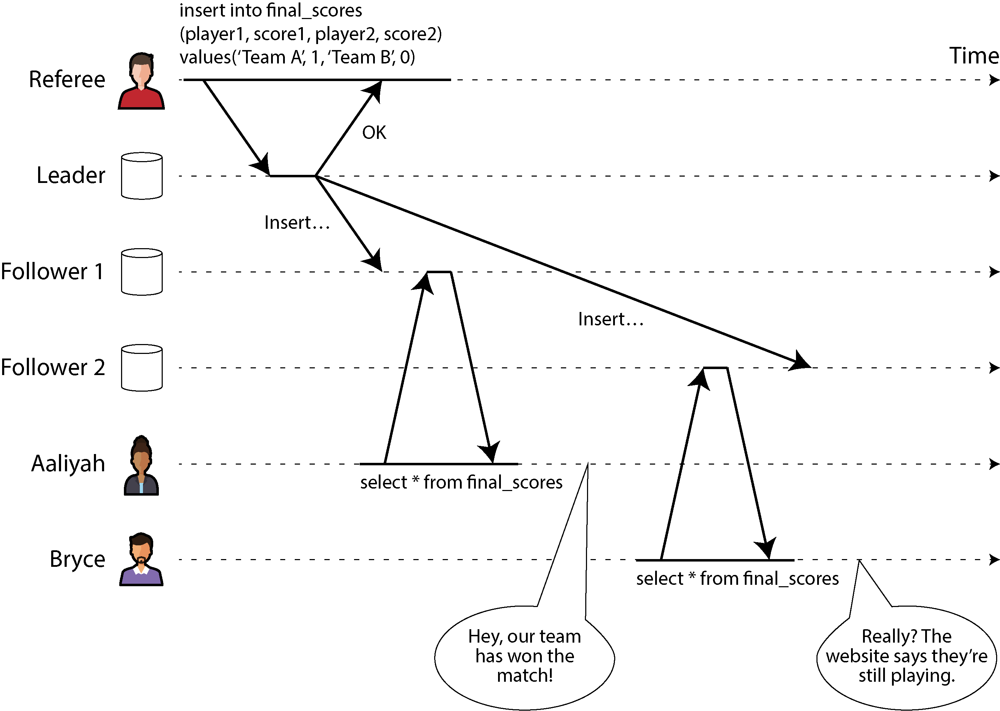
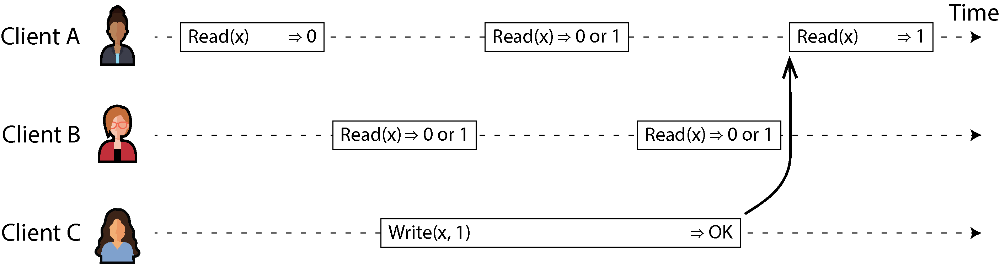
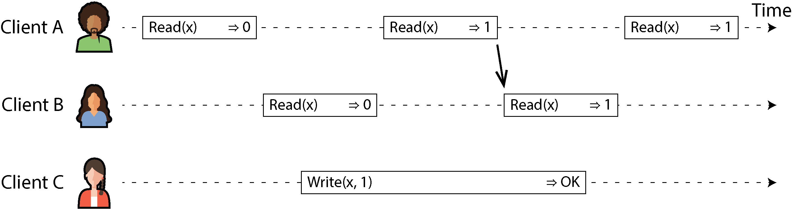
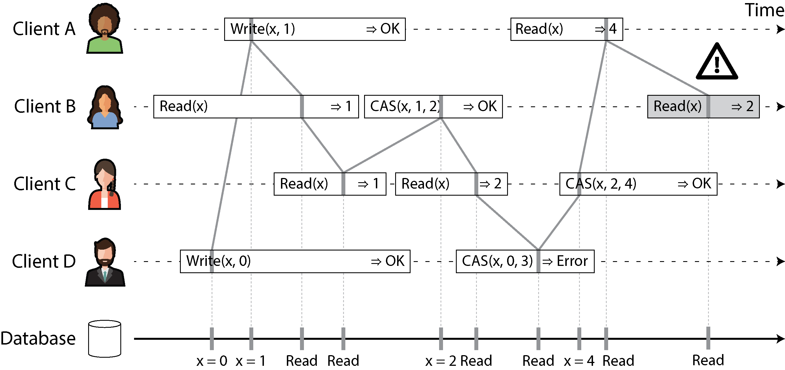
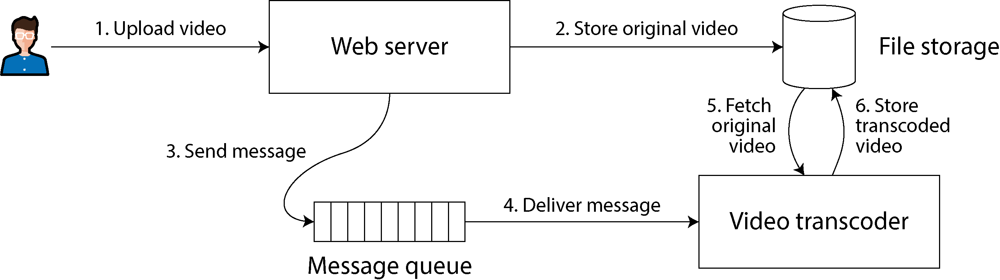
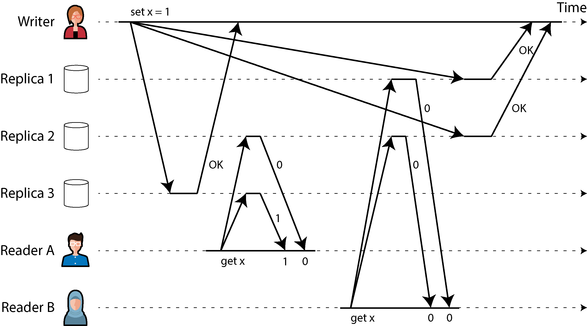
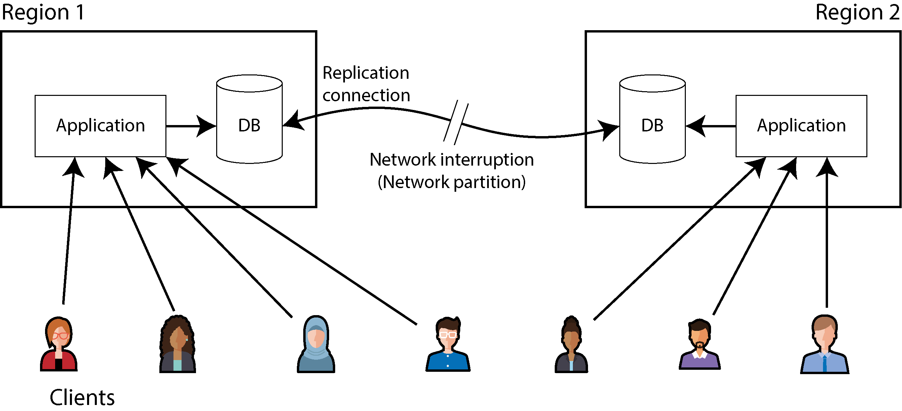
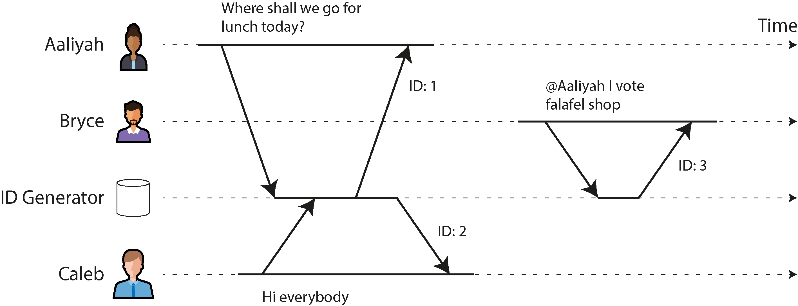
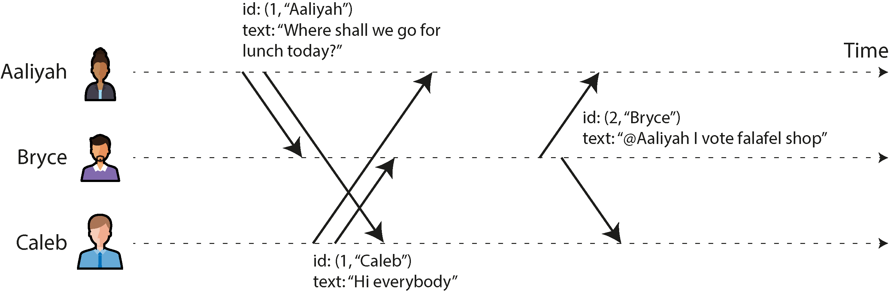
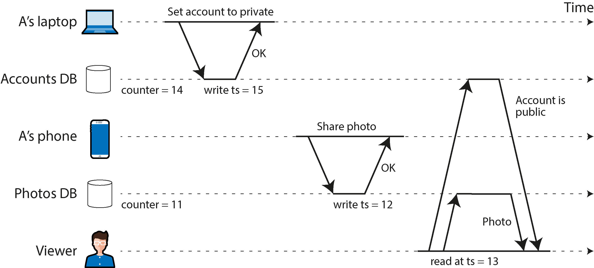

# Consistency and Consensus

An ancient adage warns, “Never go to sea with two chronometers; take one or three.”
—Frederick P. Brooks Jr., The Mythical Man-Month: Essays on Software Engineering (1995)

> **"Kabhi bhi samundar ke safar par do ghardiyon (chronometers) ke sath mat nikalna; ya toh sirf ek ghardi lena ya phir teen."**

Yeh baat sunne mein ajeeb lagti hai, lekin yehi hamare "Consensus Algorithms" (jaise Raft ya Paxos) ki bunyaad hai. Iska technical logic yeh hai:

1. **Do Ghardiyan (The Split Brain):** Agar tumhare paas do ghardiyan hain aur dono ka waqt alag hai, toh tumhein kabhi pata nahi chalega ke **kaunsi sahi hai.** Tum ek "Tie" (barabari) ki situation mein phans gaye ho.
2. **Ek Ghardi (Trust):** Agar tumhare paas sirf ek hai, toh tum majboor ho ke usi par bharosa karo. Yeh riski hai, lekin ambiguity nahi hai.
3. **Teen Ghardiyan (Majority/Quorum):** Agar tumhare paas teen hain, toh tum "Voting" kar sakte ho. Agar do ghardiyan ek waqt dikhati hain aur teesri alag, toh tum aasani se samajh sakte ho ke "Majority" sahi hai aur teesri wali kharab ho gayi hai.

---

### Introduction: Fault Tolerance Aur Replication Ka Masla

Distributed systems (jahan bohot saare computers mil kar kaam karte hain) mein bohot si cheezein kharab ho sakti hain. Agar hum chahte hain ke hamara system ya service kharabiyon ke bawajood bina ruke kaam karti rahe, toh hamein **fault tolerance** (buraqt kharabi ko jhelne ki salahiyat) ke tareeqe dhoondne honge.

Fault tolerance haasil karne ka sab se behtareen tareeqa **Replication** hai. Replication ka matlab hai ek hi data ki alag-alag copies (replicas) alag-alag computers par rakhna.

Lekin iska ek bohot bara nuksan (trade-off) hota hai: **Inconsistencies (Na-barabari)** ka khatra barh jata hai.

* **Stale Reads (Purana Data):** Sochein aap ke paas do copies hain. Ek copy update ho gayi lekin doosri abhi purani hai. Agar koi user us purani copy ko parhay ga, toh usay purana ya "baasi" data milega (jisay stale results kehte hain).
* **Write Conflicts (Takraat):** Agar do alag-alag computers par aik hi waqt mein alag-alag data likha (write kiya) jaye, toh un dono copies ke darmiyan larai ho jayegi ke kaun sa data sahi hai.

In masail se nipatne ke liye hamare paas do baray falsafay (philosophies) hain:

---

### Eventual consistency

Is falsafay (philosophy) mein, application developer (jo software bana raha hai) ko yeh pehle se pata hota hai ke data alag-alag computers par copy ho raha hai aur is mein deri ho sakti hai.

* **Bacho ki Tarah Samajhein:** Yeh bilkul aisa hai jaise aap ne do doston ko ek kahani sunayi. Ek dost ko kahani foran samajh aa gayi, doosre tak baat thodi der se pohanchi. Kuch dair ke liye dono ke paas alag-alag jankari hogi, lekin **eventually (aakhir kaar)** kuch waqt baad dono ke paas same kahani pohanch jaye gi.
* **Developer Ki Zimmedari:** Is approach mein system khud se sab kuch theek nahi karta. Developer ko khud code likhna parta hai ke agar data mein koi takraat (conflict) ya purana data samne aaye, toh usay kaise hal karna hai.
* **Kahan Use Hota Hai?** Yeh aam tor par un systems mein istemaal hota hai jahan **Multi-Leader Replication** (jahan aik se zyada computers writes accept karte hain) ya **Leaderless Replication** (jahan koi main leader nahi hota) istemaal ho rahi ho.

---

### Strong consistency

Is falsafay mein, application developer ko is baat ki bilkul fikar nahi karni parti ke background mein data kitne computers par copy ho raha hai ya replication kaise chal rahi hai.

* **Bacho ki Tarah Samajhein:** Yeh aisa hai jaise poori duniya mein sirf **aik hi khilona (single node)** ho. Agar koi bhi bacha us khilone se khelega ya usay badlega, toh har ek ko wahi badla hua khilona nazar aayega. Koi purani ya galat copy ka chakkar hi nahi hota. System aisa behave karta hai jaise poora data sirf ek hi computer par para ho.
* **Fayda (Advantage):** Yeh application banane wale ke liye bohot asaan hai kyunke usay kisi kisam ke data conflict ya purani report ki fikar nahi karni parti.
* **Nuksan (Disadvantage):** Strong consistency ki ek keemat (performance cost) hoti hai. System ko har computer ko aapas mein sync karne ke liye bohot waqt lagana parta hai, jis se speed kam ho sakti hai. Iske ilawa, agar network mein koi kharabi aa jaye (jo eventual consistency jhel sakti hai), toh strong consistency wala system kaam karna band (outage) kar sakta hai.

---

### Kaun Sa Tareeqa Behtar Hai? (The Decision Factor)

Dono mein se kaun sa tareeqa behtar hai, yeh bilkul aap ki application ki zaroorat par depend karta hai:

* **Offline Data:** Agar aap ki app aiysi hai jahan user internet ke bina (offline) bhi data mein badlao kar sakta hai (jaise local sync engines), toh wahan **Eventual Consistency** lazmi ho jati hai.
* **Tez Aur Reliable Network:** Agar aap ke saare computers baray datacenters mein pare hain jahan internet communication bohot tez aur bharosay mand hai, toh **Strong Consistency** zyada behtar hai kyunke wahan iska performance cost bardasht kiya ja sakta hai.

---

### Three Areas of Focus in This Chapter

Is chapter mein hum **Strong Consistency** ki gehrai mein jayenge aur khaas tor par teen cheezon par focus karenge:

* **Linearizability:** Kyunke "strong consistency" ek aam aur thoda sa mubham (vague) lafz hai, is liye hum is ki ek bilkul saaf aur solid tareef (precise definition) banayenge, jisay hum **Linearizability** kehte hain (yani sab ke liye data ka aik hi seedha timeline hona).
* **IDs Aur Timestamps Generate Karna:** Hum dekhenge ke distributed systems mein uniques IDs aur timestamps (waqt ka hisab) kaise banaye jate hain. Yeh sunne mein shayad consistency se alag lage, lekin yeh aapas mein bohot gehray juray hue hain.
* **Consensus Algorithms:** Hum yeh explore karenge ke distributed systems kharabiyon ke bawajood kaise Linearizability haasil kar sakte hain. Iska jawab **Consensus Algorithms** (sab computers ka aapas mein aik baat par raazi hona) hai.

Is safar mein hamein yeh bhi pata chalega ke distributed systems mein kuch aisi bunyadi hudood (fundamental limits) hain jinse aage jana mumkin nahi hai (jaise aap aik hi waqt mein har cheez perfect nahi kar sakte).

---

### Distributed Systems Kyun Mushkil Hain? (The Challenge)

Is chapter ke topics ko sahi tareeqe se implement karna bohot zyada mushkil samjha jata hai.

* **Happy Path Vs Edge Cases:** Aise systems banana bohot asaan hai jo normal halat (jab koi kharabi na ho) mein bilkul theek chalte hain. Lekin jab achanak koi aisi kharabi ya messages ka agay-piche hona (unlucky combination of faults) samne aata hai jiske baare mein designer ne socha bhi nahi tha, toh poora system tabah ho jata hai.
* **Theory Ki Zaroorat:** In mushkil mawaqe (edge cases) ko samajhne aur unse bachne ke liye bohot saari theoretical research ki gayi hai taake hum aise systems bana sakein jo har tarah ki kharabi ko mardana-war jhel sakein.

> **Note:** Yeh chapter sirf is gehri theory ki satah (surface) ko touch karega. Hum algorithm ki gehraiyon, mathematical models, aur proofs mein nahi jayenge balkay aam faham samajh (informal intuitions) par focus karenge. Agar aap ko future mein serious consensus systems par kaam karna hai, toh aap ko is theory ko mazeed gehrai se parhna hoga.

---

## Linearizability

Agar aap chahte hain ke aap ka replicated database (aik se zyada computers par chalne wala database) chalne aur istemaal karne mein bilkul asaan ho, toh aap ko isay aisa banana hoga jaise yeh sirf **aik single-node database** (yani poori duniya mein sirf aik hi computer) ho.

Iska sab se bara fayda yeh hoga ke software developers ko replication lag (data der se pohnchna), data conflicts (takraat), aur doosri kharabiyon ki fikar nahi karni paregi. Aap ko fault tolerance (kharabi se bachne) ka fayda bhi mil jayega aur system ko chalana bhi mushkil nahi lagega.

Isi soch ko hum **Linearizability** kehte hain. Iske aur bhi bohot saare naam hain jaise:

* **Atomic consistency**
* **Strong consistency**
* **Immediate consistency**
* **External consistency**

Linearizability ki asli definition thodi gehri hai, lekin iska bunyadi maqsad yeh hai: **System ko bahar se dekhne par aisa lagna chahiye ke data ki sirf aik hi copy maujood hai, aur jo bhi kaam (operations) us par ho rahe hain woh atomic (aik hi jhatkay mein mukammal) hain.** Is guarantee ki wajah se application ko background mein chalne wale saare computers ki koi chinta nahi hoti.

Linearizable system mein jaise hi koi client database mein koi nayi cheez likhta (write karta) hai aur usay "OK" ka jawab mil jata hai, toh uske baad jo bhi client data parhay ga, usay wahi bilkul naya aur up-to-date data nazar aana chahiye. Linearizability asal mein **Recency Guarantee** hai (yani yeh pakka karna ke data bilkul naya aur taza ho, na ke kisi purani cache ya lagging computer se aa raha ho).

Is baat ko mazeed achi tarah samajhne ke liye, hum aik aise system ki misaal dekhte hain jo linearizable **nahi** hai.

---

#### Figure 10-1 Ka Breakdown: Non-linearizable Sports Website

Writer ne **Figure 10-1** mein ek match ke live score ki misaal di hai. Sochein do dost hain, **Aaliyah** aur **Bryce**, jo aik hi kamray mein baithay apne phones par match ka score dekh rahe hain.

<div align="center">
  
</div>

---

**Step-by-Step Breakdown:**

1. **Referee Ka Action (Write Operation):** Referee match khatam hote hi database mein final score enter karta hai. Modern SQL format mein yeh query banti hai:
```sql
INSERT INTO final_scores (player1, score1, player2, score2) 
VALUES ('Team A', 1, 'Team B', 0);

```


2. **Leader Aur Followers Ka Role:** Yeh query sab se pehle **Leader** database ke paas jati hai. Leader usay save karke Referee ko **"OK"** ka ishara bhej deta hai. Ab Leader is data ko aage do database computers (**Follower 1** aur **Follower 2**) par copy karne ke liye bhejta hai.
3. **Aaliyah Ka Refresh (Fast Follower):** Aaliyah apne phone par page refresh karti hai. Uska phone query bhejta hai:
```sql
SELECT * FROM final_scores;

```


Aaliyah ki request **Follower 1** ke paas jati hai, jo pehle hi up-to-date ho chuka tha. Aaliyah ko naya score (Team A jeet gayi) nazar aata hai aur woh khushi se Bryce ko batati hai.
4. **Bryce Ka Refresh (Lagging Follower - The Problem):** Bryce jaise hi Aaliyah se sunta hai, woh foran (Aaliyah ke refresh karne ke baad) apna phone refresh karta hai. Uske phone se bhi wahi `SELECT *` query jati hai, lekin network ki susti ki wajah se uski request **Follower 2** ke paas chali jati hai. Follower 2 tak abhi tak Leader se naya data nahi pohancha tha (woh lag kar raha tha).
5. **Nateeja (Result):** Bryce ke phone par show hota hai ke match abhi tak chal raha hai ("Website says they're still playing"). Bryce heran ho jata hai ke Aaliyah keh rahi hai match khatam ho gaya aur mere phone par abhi bhi live chal raha hai.

**Linearizability Ki Violation:**
Agar Aaliyah aur Bryce bilkul ek hi microsecond par refresh karte, toh dono ko alag score dikhna shayed itna ajeeb na hota, kyunke hamein nahi pata ke server ne pehle kiski request process ki. Lekin yahan Bryce ne **Aaliyah ke dekhne ke baad** refresh kiya hai. Is liye Bryce ka haq banta hai ke usay data kam az kam itna naya mile jitna Aaliyah ko mila tha. Purana data milna hi **Linearizability ka tootna (violation)** kehlata hai.

---

### What Makes a System Linearizable?

Linearizability ko mazeed bariki se samajhne ke liye hum kuch aur technical designs dekhte hain. **Figure 10-2** mein teen alag clients (A, B, aur C) aik hi waqt mein database ke aik hi object $x$ ko parh aur likh rahe hain. Distributed systems ki theory mein is $x$ object ko **Register** kehte hain (asal zindagi mein yeh Redis ki koi key, SQL database ki koi row, ya MongoDB ka koi document ho sakta hai).

Is system mein do tarah ke kaam (operations) ho rahe hain:

* $\text{Read}(x) \implies v$ : Client ne $x$ ki value parhni chahi, aur database ne usay $v$ value wapis ki.
* $\text{Write}(x, v) \implies r$ : Client ne $x$ ki value ko badal kar $v$ karne ki request ki, aur database ne badlay mein $r$ (yani OK ya Error) bheja.

---

#### Figure 10-2 Ka Breakdown: Concurrent Reads Aur Writes

<div align="center">
  
</div>

---

**Figure 10-2** mein clients ke point of view se requests ko horizontal bars (lambay ڈبوں) ki shakal mein dikhaya gaya hai.

* **Bar Ka Start Aur End:** Jahan se bar shuru hoti hai, wahan client ne request bheji thi. Jahan bar khatam hoti hai, wahan client ko jawab (response) mila. Network slow ya tez hone ki wajah se client ko exact microsecond nahi pata hota ke database ne kab kaam kiya, bas itna pata hota hai ke kaam is bar ke shuru aur khatam hone ke darmiyan hi kahin hua hai.
* **Shuruati Value:** Shuru mein $x$ ki value $0$ thi. Client C database mein `Write(x, 1)` ki request bhejta hai taake value $1$ ho jaye. Is dauran Client A aur Client B baar baar data read kar rahe hain.

**Possible Responses Ka Breakdown:**

* **Client A Ka Pehla Read:** Yeh read operation Client C ke write shuru karne se **pehle hi khatam** ho gaya tha. Is liye isko har haal mein purani value **0** hi milegi.
* **Client A Ka Aakhri Read:** Yeh read operation Client C ke write mukammal hone ke **baad shuru** hua hai. Is liye agar system linearizable hai, toh isay har haal mein nayi value **1** hi milni chahiye.
* **Overlapping / Concurrent Reads:** Client A aur Client B ke jo reads Client C ke write ke **darmiyan (overlap)** ho rahe hain, unhein **0 ya 1** mein se kuch bhi mil sakta hai. Kyunke hamein nahi pata ke database ne write ka kaam pehle kiya ya read ka. In operations ko hum *concurrent* kehte hain.

Lekin sirf itna hona hi linearizability ke liye kaafi nahi hai. Agar concurrent reads mein kabhi 0 aur kabhi 1 milta rahe, toh bache ko aisa lagega ke data aage piche chal raha hai (yani pehle 1 dikha, phir achanak doosray read mein 0 dikha, phir 1 dikha). Yeh single copy ka ehsas nahi deta.

---

#### Figure 10-3 Ka Breakdown: The Atomicity Constraint

Is maslay ko hal karne ke liye hum aik aur rule lagate hain jo **Figure 10-3** mein dikhaya gaya hai.

<div align="center">
  
</div>

---

* **The Magic Point:** Linearizable system mein hum yeh maante hain ke poore write operation ke dauran aik aisa achanak lamha (point in time) aata hai jahan $x$ ki value jhatkay se $0$ se $1$ ho jati hai.
* **The Arrow Constraint:** Agar kisi aik client ke read ne nayi value **1** dekh li, toh uske baad shuru hone wale **saare ke saare reads** ko har haal mein **1** hi milna chahiye, chahe abhi main write operation poori tarah khatam na bhi hua ho!
* **Figure 10-3 Ke Steps:** Client A ka read operation chal raha hai aur usay value **1** mil jati hai. Client A ke naye data parhne ke foran baad Client B naya read shuru karta hai. Chunke B ka read strictly A ke baad shuru hua hai, is liye diagram mein bani **kaali arrow** ke mutabaq B ko bhi **1** hi milega, chahe Client C ka write abhi tak chal hi kyun na raha ho. (Yeh bilkul Aaliyah aur Bryce jaisa scene hai).

---

#### Figure 10-4 Ka Breakdown: Complex Visual Timeline

Ab hum mazeed complex operations dekhte hain jo **Figure 10-4** mein hain. Yahan aik naya operation use hua hai:

<div align="center">
  
</div>

---

$$\text{CAS}(x, v_{\text{old}}, v_{\text{new}}) \implies r$$


Isay **Compare-and-Set** kehte hain. Iska matlab hai: "Agar $x$ ki maujooda value $v_{\text{old}}$ ke barabar hai, toh usay badal kar $v_{\text{new}}$ kar do aur **OK** bhej do. Agar value badal chuki hai, toh kuch mat karo aur **Error** bhej do."

Figure 10-4 mein har operation ke bar ke andar ek **vertical line (khari lakeer)** lagi hai jo yeh batati hai ke database ne asal mein kis waqt us request ko execute kiya. Linearizability ka sab se bara asool yeh hai ke **yeh vertical lines hamesha waqt mein aage (left to right) jani chahiye, kabhi piche (right to left) nahi mudni chahiye.**

Chalein is mushkil diagram ke saare points ko asaan karke breakdown karte hain:

* **B Ka Pehla Read Aur Concurrency:** Client B ne pehle read bheja, phir Client D ne `Write(x, 0)` bheja, aur Client A ne `Write(x, 1)` bheja. Lekin Client B ke read ko **1** mil raha hai. Yeh bilkul sahi hai! Iska matlab hai network ke delay ki wajah se database ne pehle D ka write chalaya, phir A ka write chalaya, aur aakhir mein B ka read chalaya. Order aage piche ho sakta hai kyunke yeh teeno kaam aik hi waqt mein (concurrently) ho rahe the.
* **OK Se Pehle Data Milna:** Client B ko value **1** mil gayi, jabke Client A ko abhi tak database se "OK" ka response nahi mila tha. Yeh bhi bilkul normal hai, kyunke database ne data write kar diya tha, bas A tak kamyabi ka message network line mein thoda slow aa raha tha.
* **Client C Ke Do Reads:** Client C pehle read karta hai toh usay **1** milta hai. Phir Client B aik operation chalata hai: `CAS(x, 1, 2) => OK`. Chunke value 1 thi, toh B ne usay badal kar 2 kar diya. Is liye jab Client C doosri baar read karta hai, toh usay **2** milta hai.
* **Client D Ka Fail Operation:** Client D aik request bhejta hai: `CAS(x, 0, 3) => Error`. D ko error is liye mila kyunke jab database ne is request ko pakra, us waqt tak value 0 nahi rahi thi balkay badal kar 2 ho chuki thi.
* **The Non-Linearizable Error (Grey Bar):** Diagram ke aakhir mein Client B ka aakhri read (jo grey rang ke dabbe mein hai aur upar khatray ka nishan $\triangle$ bana hai) **linearizable nahi hai!** Kyun? Kyunke Client C ne ek operation chalaya tha `CAS(x, 2, 4)` jis se value 4 ho gayi thi. Client A ne us 4 value ko parh bhi liya tha. Ab jab Client A up-to-date value (4) parh chuka hai, toh uske BAAD shuru hone wale B ke read ko purani value **2** nahi mil sakti! Yeh time travelling jaisa gunah hai distributed systems mein, is liye yeh linearizability ki sarii sharton ko tor raha hai.

---

### Linearizability Versus Serializability

Log aksar in dono lafzon mein confuse ho jate hain kyunke dono ka matlab aisa lagta hai ke "cheezon ko aik seedhi line mein tarteeb dena". Lekin distributed systems mein yeh dono bilkul alag alag guarantees hain:

| Khasiyat (Feature) | Serializability | Linearizability |
| --- | --- | --- |
| **Kiske Liye Hai?** | **Transactions** ke liye (Jahan aik transaction mein bohot saari rows ya objects badle jate hain). | **Single Object / Register** ke liye (Aik waqt mein sirf aik key ya row par kaam). |
| **Asal Maqsad?** | Multi-object isolation level hai. Har transaction aise chale jaise poore database par sirf wahi akeli chal rahi ho (bina interference ke). | Recency guarantee hai. Jo bhi kaam ho, real-time mein foran sab ko bilkul naya dikhna chahiye. |
| **Stale Reads (Purana Data)** | **Allowed hai.** Agar transactions ka serial order purana data dikhata hai toh serializability ko aitraz nahi hota. | **Strictly Not Allowed.** Aik dafa naya data aa gaya toh purana data dikhana mana hai. |
| **Multi-object Problems (Write Skew)** | Yeh unhein **rokta hai**, kyunke yeh poori transaction ko secure karta hai. | Yeh unhein **nahi rok sakta**, kyunke yeh sirf ek single object par focus karta hai. |

#### Dono Ko Milana: Strict Serializability

Agar koi database in dono guarantees ko aik sath faraham kare (yani transactions bhi perfect hon aur data bhi bilkul naya ho), toh usay hum **Strict Serializability** ya **Strong One-Copy Serializability (strong-1SR)** kehte hain.

* **Single-Node Databases:** Jo database sirf aik hi computer par chalte hain, un mein aam tor par yeh dono khubiyan pehle se hoti hain.
* **Distributed Databases Ka Masla:** Jo databases bohot saare computers par phailay hote hain, unke liye yeh mushkil hota hai. Misaal ke tor par, **CockroachDB** serializability toh deta hai, lekin har transaction par bohot zyada coordination ke kharche (performance cost) se bachne ke liye strict serializability nahi deta.
* **Perfect Examples:** Dusri taraf, Google ka **Spanner** aur **FoundationDB** strict serializability faraham karte hain, chahe is ke liye unhein jitni bhi heavy coordination karni paray.

---

### Relying on Linearizability

Hum ne yeh toh dekh liya ke **Linearizability** kya hoti hai, lekin sawal yeh paida hota hai ke hamein is ki zaroorat kahan parti hai? Agar koi sports website score dikhane mein do-chaar seconds late bhi ho jaye, toh koi aatish-fashan nahi phat parega. Lekin kuch jagahain aisi hain jahan agar linearizability na ho, toh poora system tabah ho sakta hai. Chalein un mawaqe ko deeply samajhte hain:

---

#### Locking and leader election

Distributed systems mein (jahan bohot saare computers mil kar kaam karte hain) agar single-leader architecture use ho raha ho, toh hamein har haal mein yeh pakka karna parta hai ke poore system mein **sirf aur sirf aik hi leader** ho. Agar do computers khud ko leader samajhne lagein, toh is kharab bimari ko distributed systems mein **Split Brain** kehte hain (yani aik jism ke do dimaagh, jo system ko pagal kar dete hain).

* **Lease (Kiraye ka mada):** Leader chunne ka aik tareeqa yeh hota hai ke aik "Lease" (aik makhsoos waqt ke liye ijazat nama) banaya jata hai. Jo computer sab se pehle is lease ko pakar leta hai, woh leader ban jata hai.
* **Linearizability Ki Shart:** Is lease ko chalane wala system har haal mein linearizable hona chahiye. Aisa hargiz nahi hona chahiye ke do alag computers aik hi microsecond par request bhejein aur system dono ko keh de: "Haan, tum leader ho!"
* **Apache ZooKeeper aur etcd:** Log distributed leases aur leader election ke liye ZooKeeper ya etcd jaise coordination tools use karte hain. Yeh background mein consensus algorithms use kar ke linearizable kaam faraham karte hain.
* *Choti Bareeki:* ZooKeeper mein writes toh linearizable hoti hain, lekin purani versions mein reads stale (purani) ho sakti thi kyunke woh har dafa main leader se data nahi parhta tha. Lekin **etcd (version 3 se)** by default bilkul linearizable reads deta hai.


* **Oracle Real Application Clusters (RAC):** Kuch databases bohot barik level (disk page level) par locking karte hain jahan saare nodes aik hi storage share kar rahe hote hain. Chunke yeh linearizable locks database ki speed par asar daalte hain, is liye RAC ke liye aik alag se bohot tez internal network network interconnect banaya jata hai.

---

#### Constraints and uniqueness guarantees

Databases mein **Uniqueness Constraints** bohot aam hain—jaise do users ka username ya email address bilkul same nahi hona chahiye, ya aik hi folder mein aik hi naam ki do files nahi ho sakti.

* **Bacho ki Tarah Samajhein:** Sochein do bache aik hi waqt mein "Ali" naam ka account banana chahte hain. Agar system linearizable nahi hoga, toh dono ki requests alag-alag computers par jayengi, dono computers kahain ge "Ali naam khali hai" aur dono ka account ban jayegi! Yeh toh rules ke khilaf ho gaya.
* **CAS (Compare-and-Set) Ka Khel:** Unique constraint asal mein lock lagane ya atomic CAS operation chalane jaisa hi hai. Jab aik bacha username claim karega, toh system check karega ke agar yeh khali hai toh is par is bache ka nishan laga do. Is ke liye sab nodes ka aik page par hona zaroori hai.
* **Real-World Examples:**
* **Bank Balance:** Aap ke account mein paise zero se kam (negative) nahi hone chahiye. Agar do jagah se aik hi waqt mein paise nikale jayein, toh balance check karne ke liye bilkul up-to-date value chahiye.
* **Warehouse Stock:** Jitna maal godam mein para hai, us se zyada aap bech nahi sakte.
* **Theater/Flight Booking:** Aik seat par do log aik sath booking nahi kar sakte.


* **Dheeli Constraints (Loose Constraints):** Kuch real apps mein thodi bohot galti chalti hai. Jaise agar flight overbook ho jaye (aik seat do logon ko bik jaye), toh company unhein doosri flight de deti hai aur thoda harjana bhar deti hai. Aise mawaqe par linearizability ke bina kaam chalaya ja sakta hai, lekin jahan **Hard Uniqueness Constraint** chahiye (jaise relational database ke rules), wahan iske bina guzara nahi.

---

#### Cross-channel timing dependencies

Hum ne **Figure 10-1** mein dekha tha ke agar Aaliyah munh se score na bolti, toh Bryce ko kabhi pata hi na chalta ke uska data purana hai. Bryce ko masla is liye pata chala kyunke database ke ilawa communication ka aik aur rasta (Aaliyah ki awaaz) maujood tha. Isay kehte hain **Cross-Channel Timing Dependency** (yani do alag alag raston se jankari ka agay-piche hona).

Computer systems mein bhi yeh masla bohot aata hai. Writer ne **Figure 10-5** mein video website (jaise YouTube) ki aik bohot behtareen real-world example di hai.

---

##### Figure 10-5 Ka Breakdown: Video Transcoder Aur Race Condition

Sochein aik system hai jahan user video upload karta hai, aur background mein aik processor (Transcoder) us video ka size chota karta hai taake slow internet par bhi video chal sakay.

<div align="center">
  
</div>

---

**Step-by-Step Dataflow:**

1. **Step 1 (Upload video):** User website par aik bari video upload karta hai.
2. **Step 2 (Store original video):** Web Server us video ko direct Message Queue mein nahi dalta (kyunke queue chote messages ke liye hoti hai). Web server us video file ko **File Storage** (jaise AWS S3) mein save kar deta hai.
3. **Step 3 & 4 (Send & Deliver message):** Jab video file save ho jati hai, toh Web Server **Message Queue** mein aik choti si chit (instruction) bhejta hai ke: *"Bhai, video save ho gayi hai, ab isay transcode (convert) kar do"*. Yeh message queue se hota hua **Video Transcoder** computer tak pohanch jata hai.
4. **Step 5 & 6 (Fetch & Store transcoded video):** Video Transcoder us chit ko parhta hai aur File Storage se original video uthane (**Fetch**) jata hai taake usay convert karke wapis save kar sakay.

**The Dangerous Race Condition (Khatra):**
Agar aap ka File Storage **linearizable nahi hai**, toh yahan aik larai (race condition) shuru ho sakti hai. Ho sakta hai ke Message Queue wala rasta (Steps 3 aur 4) bohot fast ho, aur File Storage ka apna andruni data-copying system (internal replication) thoda slow chal raha ho.

Jab Video Transcoder Step 5 par video uthane pohanchega, toh usay storage par ya toh **khali jagah** milegi ya video ka **purana/aadha version** milega! Agar us ne purani file ko convert kar diya, toh original video aur converted video hamesha ke liye aapas mein kharab (permanently inconsistent) ho jayenge.

* **Wajah:** Yeh masla is liye hua kyunke Web Server aur Transcoder ke darmiyan do alag alag communication channels chal rahe the (File Storage aur Message Queue). Agar real guarantee (linearizability) na ho, toh dono channels ke darmiyan aisi race conditions banti rahengi.
* **Mobile Push Notifications Ki Example:** Bilkul aisa hi tab hota hai jab aap ke mobile par push notification aati hai ke *"Aap ko naya message mila hai"*, aap notification par click karte hain lekin app khulne par naya message gayab hota hai kyunke app jis database node se data parh rahi hai, wahan abhi tak naya message copy hi nahi hua!

---

### Implementing Linearizable Systems

Ab jab hum samajh gaye hain ke linearizability kitni zaroorii hai, toh sawal yeh hai ke isay banayein kaise?

Chunke linearizability ka simple matlab hai: *"Aise behave karo jaise data ki sirf aik copy hai aur sab kaam atomic hain"*, toh sab se asaan tareeqa toh yeh hai ke **sach mein data ki sirf aik hi copy (Single Node) rakhi jaye.** Lekin agar woh akela computer kharab ho gaya ya jal gaya, toh aap ka saara data gayo! Fault tolerance khatam.

Chalein Chapter 6 ke replication ke tareeqon ko dobara check karte hain ke kya unhein linearizable banaya ja sakta hai ya nahi:

* **Single-leader replication (Potentially linearizable):**
Agar aap saare ke saare parhne (reads) aur likhne (writes) ke kaam **sirf aur sirf main leader node** par hi karein, toh yeh system linearizable ho sakta hai. Lekin is mein aik bara pech (catch) hai: Leader ko pakka pata hona chahiye ke wahi asli leader hai. Kabhi kabhi network galti se kisi node ko lagta hai ke woh leader hai (Delusional Leader), jabke piche naya leader chuna ja chuka hota hai. Agar woh pagal leader requests accept karta raha, toh linearizability toot jayegi.
* *Note:* Agar database ko chunks mein baant diya jaye (**Sharding**), tab bhi linearizability par asar nahi parta kyunke yeh guarantee sirf single object (aik key/row) ke liye hoti hai. Cross-shard transactions alag kahani hain.


* **Consensus algorithms (Likely linearizable):**
Consensus algorithms (jaise Raft ya Zab jo etcd aur ZooKeeper mein hote hain) built-in leader election aur split-brain se bachne ki safety ke sath aate hain. Is liye yeh safely linearizable storage bana sakte hain. Lekin yaad rahe, agar koi system consensus use karta bhi hai, tab bhi agar woh bina check kiye kisi bhi node se reads allow kar de, toh data stale ho sakta hai.
* **Multi-leader replication (Not linearizable):**
Yeh systems **hargiz linearizable nahi hote**. Kyunke in mein aik hi waqt mein alag-alag computers par data write ho raha hota hai jo baad mein aapas mein jodaa jata hai. Is mein write conflicts aana pakka hai.
* **Leaderless replication (Probably not linearizable):**
Dynamo-style systems (jaise Cassandra) mein log kehte hain ke agar aap Quorum rule ($w + r > n$) use karein, toh "Strong Consistency" mil jati hai. Lekin distributed systems ki theory ke mutabaq yeh poori tarah sach nahi hai.
* Agar Cassandra ya ScyllaDB mein time-of-day clocks (LWW - Last Write Wins) ke zariye faisla ho raha ho, toh clocks ke agay-piche hone (clock skew) ki wajah se linearizability **pakka toot jati hai**. Even bina clocks ke bhi, network delay ki wajah se quorums mein linearizability toot sakti hai, jaisa niche dikhaya gaya hai.


---

#### Figure 10-6 Ka Breakdown: Quorum Ke Bawajood Consistency Ka Tootna

**Figure 10-6** mein dikhaya gaya hai ke kaise Quorum rule ($w + r > n$) lagane ke bawajood system galti kar baithta hai.

Sochein hamare paas total teen replicas hain ($n=3$). Aik Writer computer $x$ ki value ko $0$ se badal kar $1$ karna chahta hai aur woh teeno nodes par write bhejta hai ($w=3$).

<div align="center">
  
</div>

---

**Step-by-Step Execution:**

1. Writer ki request **Replica 3** par pehle pohanchti hai aur wahan value **1** ho jati hai aur Replica 3 wapis **"OK"** bhej deta hai. Lekin network delay ki wajah se **Replica 1** aur **Replica 2** tak abhi naya data nahi pohancha, wahan abhi bhi **0** para hai.
2. **Reader A Ka Operation (Concurrent Read):** Isi dauran Reader A data parhne aata hai. Uska quorum size $r=2$ hai. Woh **Replica 2** (jo 0 deta hai) aur **Replica 3** (jo 1 deta hai) se data parhta hai. Chunke Replica 3 ke paas naya version hai, Reader A ko nayi value **1** mil jati hai aur uska read operation mukammal (**complete**) ho jata hai.
3. **Reader B Ka Operation (The Violation):** Reader B ka operation Reader A ke mukammal hone ke **BAAD** shuru hota hai. Reader B bhi do nodes ($r=2$) se parhta hai: **Replica 1** aur **Replica 2**. Chunke in dono nodes tak abhi tak Writer ka naya message nahi pohancha tha, dono nodes Reader B ko purani value **0** wapis kar dete hain!

**Nateeja:** Reader B ko purana data (0) mila jabke us se pehle Reader A naya data (1) parh chuka tha! Yeh linearizability ka sab se bara qatal hai (Aaliyah aur Bryce wala scene dobara ho gaya).

* **Ilaaj (The Fix):** Agar Dynamo-style system ko linearizable banana hai, toh do keemtein chukani parengi:
1. **Synchronous Read Repair:** Jab Reader A ko pata chala ke Replica 2 ke paas purana data hai, toh application ko jawab bhejne se PEHLE Reader A ko har haal mein Replica 2 ko update karna parega.
2. **Read Before Write:** Writer ko likhne se pehle saare nodes ka timestamp parhna parega taake naya nishan lagaya ja sakay. Riak database speed bachane ke liye aisa nahi karta, jabke Cassandra parhte waqt wait toh karta hai par clocks kharab hone ki wajah se phir bhi linearizability loose kar deta hai.


Is liye, safety is mein hai ke yeh maan liya jaye ke **Leaderless system quorum lagane ke bawajood linearizable nahi hote.**

---

### The Cost of Linearizability

Ab jab hum ne dekh liya ke kuch tareeqe linearizability de sakte hain aur kuch nahi, toh is ke nafa-nuksan (pros and cons) par baat karte hain. Hum ne dekha tha ke **Multi-Region Replication** (alag alag mulkon mein data rakhna) ke liye multi-leader replication behtar hoti hai. **Figure 10-7** is ki aik behtareen visual misaal hai.

---

#### Figure 10-7 Ka Breakdown: Network Partition Aur Qurbani

<div align="center">
  
</div>

---

Sochein hamare paas do regions hain: **Region 1** aur **Region 2**. Dono ke darmiyan internet ki tar achanak kat jati hai ya communication block ho jati hai. Distributed systems mein is achanak aane wali aafat ko **Network Partition** kehte hain.

1. **Agar Multi-Leader System Ho (AP):** Agar network kat bhi jaye, toh Region 1 ke log Region 1 ke database se baat karte rahenge aur Region 2 wale apne local database se. System chalta rahega (Available rahega). Jab internet wapis aayega, toh dono regions aapas mein data sync kar lenge. Lekin is dauran linearizability nahi hogi.
2. **Agar Single-Leader System Ho (CP):** Sochein main leader Region 1 mein betha hai. Agar Region 2 ke clients koi data write karna chahein ya linearizable read karna chahein, toh unki request ko synchronously Region 1 ke leader ke paas jana parega. Lekin beech mein toh tar kati hui hai!
3. **Nateeja (Outage):** Region 2 ke clients leader se baat nahi kar sakenge. Agar woh local follower se parhein ge toh data stale (purana) milega. Agar aap ki app ko har haal mein linearizable data chahiye, toh system ko Region 2 mein **kaam rokna parega (Unavailability/Outage)**.

---

#### The CAP theorem

Yeh masla sirf single-leader ya multi-leader ka nahi hai. Poori duniya ka koi bhi database agar linearizable banna chahta hai, toh usay is maut ke kooay se guzarna hi parega. Is mushkil trade-off ko hum **CAP Theorem** kehte hain:

* **CP (Consistent under network partitions):** Agar aap ki application ke liye linearizability (C) zaroori hai, aur network mein kharabi (P) aa jaye, toh disconnected nodes ko apna kaam rokna parega ya error dena parega (yani woh **Unavailable** ho jayenge).
* **AP (Available under network partitions):** Agar aap ko linearizability ki chinta nahi hai, toh har node partition (P) ke dauran bhi azaadana kaam karta rahega (yani system **Available** rahega), lekin data naya hone ki koi guarantee nahi hogi.

> **CAP Theorem Ka Asal Sach:** Eric Brewer ne 2000 mein yeh lafz diya tha jis se NoSQL movement shuru hui. Lekin aam zindagi mein log isay galat samajhte hain. Formal definition ke mutabaq CAP bohot choti satah par baat karta hai: Yeh sirf **Consistency mein Linearizability** ko maanta hai, aur **Fault mein sirf Network Partition** ko (jo ke Google ke mutabaq database ke kul haadsaat ka **8% se bhi kam** wajah banti hain). Yeh network delay ya dead nodes ke baare mein kuch nahi batata. Is liye practical system design mein is ki ahmiyat ab sirf tareekhi (historical interest) reh gayi hai.
> Is ko behtar karne ke liye **PACELC principle** banaya gaya: Agar Partition (P) hai toh Choose karo Availability (A) aur Consistency (C) mein se; Else (E) yani agar network theek chal raha hai, toh choose karo Latency (L) aur Consistency (C) mein se.

---

#### The Unhelpful CAP Theorem

Log aksar CAP ko aam zuban mein kehte hain: *"Consistency, Availability, Partition Tolerance: in teeno mein se koi do chun lo!"* **Yeh bilkul galat aur gumrah-kun (misleading) tareeqa hai.**

* **Partition Aap Ki Choice Nahi Hai:** Partition Tolerance koi aisi cheez nahi hai jo aap dukan se khareed sakein. Yeh ek network ki kharabi (fault) hai jo aap ki marzi ke bina **har haal mein hogi**. Aap network ko khatam nahi kar sakte.
* **Asal Lafz:** CAP ko kehne ka sahi tareeqa yeh hai: **"Partition ke waqt Consistent ya Available mein se koi aik chun lo!"** Jab network theek chal raha ho, system consistent bhi hota hai aur available bhi. Galti sirf tab hoti hai jab tar katti hai.

---

#### Linearizability and network delays

Aap ko yeh sun kar hairat hogi ke itni achi guarantee hone ke bawajood, real-world mein bohot hi kam systems linearizable hote hain. Hatta ke aap ke computer ke andar jo **RAM (Memory)** lagi hai, woh bhi multi-core CPU par **linearizable nahi hoti!**

* **CPU Core Ka Cache Buffer:** Agar CPU Core 1 RAM ke kisi address par kuch likhta hai, toh Core 2 ko foran woh badlao nazar nahi aata jab ke tak koi memory barrier ya fence use na kiya jaye.
* **Kyun?** Kyunke har CPU core ke paas apna tez speed cache memory hoti hai. Data pehle cache mein likha jata hai aur aaram se main RAM mein copy hota hai. Agar hum har core ko linearizable banayein, toh computer ki speed bohot slow ho jayegi. Yahan qurbani fault tolerance ke liye nahi balkay **Performance (Speed)** ke liye di gayi hai.

Distributed databases bhi linearizability ko fault tolerance se zyada **Speed (Latency)** ke liye chorte hain.

```
Linearizable Storage Ki Response Time ∝ Network Delay Ki Unpredictability (Ghair-yakeeni surat-e-haal)
```

**Attiya aur Welch Ka Proof:**
In do scientists ne mathematically sabit kiya hai ke agar aap ko linearizability chahiye, toh aap ke read aur write requests ka response time har haal mein network ke sab se bade jhatkay (delays) ke barabar slow ho jayega. Chunke computer networks (jaise internet) mein delays ka koi hisab nahi hota, is liye linearizable systems ka response time hamesha high (slow) rahega.

Is se tez koi algorithm duniya mein banana mumkin hi nahi hai. Is liye agar aap ka system aisa hai jahan speed (low latency) bohot zaroori hai, toh aap ko weaker consistency models ki taraf jana parega. Chapter 13 mein hum dekhenge ke bina linearizability ke bhi kaise system ko sahi chalaya ja sakta hai.

---

## ID Generators and Logical Clocks

Bohot saari applications mein jab database mein koi naya record banta hai, toh hamein usay aik unique ID (shanaas) deni parti hai taake hum us record ko as a **Primary Key** use kar sakein.

Agar database sirf **aik single computer (single-node)** par chal raha ho, toh wahan aik **Autoincrementing Integer** (yani aik aisa number jo har naye record par 1, 2, 3 karke khud ba khud barhta jaye) istemaal karna bohot aam aur asaan hai. Iska faida yeh hai ke yeh memory mein bohot kam jagah leta hai—sirf 64 bits (ya agar aap ko pakka yakeen ho ke aap ke records 4 billion se zyada nahi honge, toh 32 bits, lekin aam tor par aisa sochna khatarnak hota hai).

Autoincrementing IDs ka aik aur sab se bara faida yeh hai ke **IDs ki tarteeb (order) se aap ko yeh pata chal jata hai ke kaun sa record pehle bana tha.**

---

#### Figure 10-8 Ka Breakdown: Chat Application Mein Autoincrementing IDs

Writer ne **Figure 10-8** mein aik chat app ki example di hai jahan ek single-node ID generator messages ko auto-incrementing numbers assign kar raha hai taake chat ki baatein tarteeb mein rahein.

<div align="center">
  
</div>

---

**Step-by-Step Breakdown:**

1. **Aaliyah Ka Message:** Aaliyah sab se pehle aik sawaal poochti hai: *"Where shall we go for lunch today?"*. Yeh request ID Generator node ke paas jati hai. Node counter ko barha kar **ID: 1** karta hai aur message ko save karke Aaliyah ko wapis bhej deta hai.
2. **Caleb Ka Message (Concurrent):** Bilkul isi dauran Caleb bhi aik message bhejta hai: *"Hi everybody"*. Chunke yeh Aaliyah ke message ke sath hi chal raha hai (concurrent hai), ID generator counter ko mazeed barha kar isay **ID: 2** de deta hai. Linearizability yahan yeh kehti hai ke jab tak dono messages unique hain, inki aapas ki tarteeb kuch bhi ho, farq nahi parta.
3. **Bryce Ka Jawab:** Bryce Aaliyah ka sawaal parhta hai aur uske BAAD jawab likhta hai: *"@Aaliyah I vote falafel shop"*. Chunke Bryce ka action Aaliyah ke message ke mukammal hone ke strictly baad hua hai, is liye database counter ko barha kar isay **ID: 3** deta hai.

Jab app in messages ko screen par dikhaye gi, toh woh IDs ki tarteeb (1, 2, 3) ke mutabaq dikhaye gi, jis se poori chat ki kahani bilkul sahi samajh aayegi.

**Single-Node Generator Kaise Kaam Karta Hai?**
Aik computer ke andar isay banana bohot asaan hai. Aap CPU ki **Atomic Increment Instruction** (jaise fetch-and-add) use karte hain, jis se agar aik se zyada threads bhi counter ko barhana chahein toh woh safely aik doosre ko kharab kiye bina counter barha deti hain. Agar computer crash ho jaye, toh counter zero na ho (duplicate IDs se bachne ke liye), is liye is counter ko disk par save (persist) karna parta hai.

Lekin asli distributed systems mein is single-node design ke teen baray maslay hain:

* **Single Point of Failure (SPOF):** Agar yeh akela computer kharab ya down ho gaya, toh poora system ruk jayega kyunke kisi ko ID nahi milegi (Fault-tolerant nahi hai).
* **Sust Speed (Network Latency):** Agar aap duniya ke doosre kone (region) mein baithe hain aur aap ko aik record banane ke liye har dafa duniya ke is kone wale single node se ID mangni paray, toh poori duniya ka chakkar (round-trip) lagane mein bohot waqt zaya hoga.
* **Bottleneck (Rukawat):** Agar aap ki website par aik hi second mein lakhoon log writes kar rahe hain, toh yeh akela node saari requests ka bojh nahi sambhal sakay ga.

In masail se nipatne ke liye log alternative tareeqe use karte hain, jin ke design decisions aur trade-offs niche table mein samjhaye gaye hain:

| ID Generator Approach | Yeh Kaise Kaam Karta Hai? | Iska Bara Nuksan (Trade-off) |
| --- | --- | --- |
| **Sharded ID assignment** | Database ko chunks (shards) mein baant diya jata hai. Misaal ke tor par Node 1 sirf Even numbers (2, 4, 6) dega aur Node 2 sirf Odd numbers (1, 3, 5) dega. Ya ID ke kuch bits shard number ke liye rakh diye jate hain. | **Ordering khatam ho jati hai.** Agar do messages ki IDs 16 aur 17 hain, toh aap daaway se nahi keh sakte ke 16 pehle aaya tha, kyunke dono alag nodes ne diye hain aur ho sakta hai aik node ka time aage ho. |
| **Preallocated blocks of IDs** | Main node se har computer blocks utha leta hai. Jaise Node A ne 1 se 1000 tak numbers rakh liye, aur Node B ne 1001 se 2000 tak. Jab numbers khatam hone lagein, toh naya block mang liya jata hai. | **Is mein bhi tarteeb kharab hoti hai.** Ho sakta hai aik naya message Node B se ID 1005 utha le aur uske baad aane wala message Node A se ID 5 utha le, jo ke dekhne mein purani lagegi. |
| **Random UUIDs (v4)** | Universally Unique Identifiers (128-bit lamba random number) jo har computer local level par bina kisi se pooche khud generate kar leta hai. | **Order bilkul random hota hai.** Do UUIDs ko compare karke aap kabhi nahi jaan sakte ke kaun si naye waqt mein bani hai. Space bhi zyada (128 bits) leti hai. |
| **Wall-Clock Timestamps (Unique banaya hua)** | Computer ki aam gari (Physical Clock) ka time sab se upar (most significant bits) rakha jata hai, aur baki bache bits mein shard ID ya random number dal diya jata hai taake ID unique rahe. (Jaise UUID v7, Twitter Snowflake, ULID, MongoDB ObjectID). | **Linearizable nahi hote.** Agar aik computer ki clock thodi fast chal rahi ho aur doosre ki slow (Clock Skew), toh baad mein aane wale event ko purana timestamp mil sakta hai. Non-monotonic jumps ki wajah se aik hi node par bhi order ulta ho sakta hai. |

---

### Logical Clocks

Upar hum ne dekha ke physical clocks (jo aam zindagi ke ghantay, seconds, ya microseconds naapti hain) distributed systems mein order ke liye dhoka de sakti hain. Is liye distributed systems mein aik aur tarah ki clock use hoti hai jisay **Logical Clock** kehte hain.

Physical clock ke baraks, logical clock koi samandar ya suraj ka waqt nahi batati, balkay yeh **sirf events (kaam hone ke numbers) ko ginti hai.** Is ka timestamp aap ko yeh nahi batayega ke abhi dopehr ke 3 bajay hain ya shaam ke 5, lekin agar aap do logical timestamps ko aapas mein compare karenge, toh aap $100\%$ sahi bata sakenge ke kaun sa kaam pehle hua aur kaun sa baad mein.

Logical Clock ki teen bunyadi shartain hoti hain:

1. Timestamps size mein chote (compact) aur bilkul unique hon.
2. Aap kisi bhi do timestamps ko compare karke unki aik pakki tarteeb (**Total Ordering**) nikal sakein.
3. Unka order **Causality (Wajah aur Asar)** ke mutabaq ho. Yani agar Operation A pehle hua tha aur uski wajah se Operation B hua ($\text{A} \to \text{B}$), toh A ka timestamp har haal mein B se chota hona chahiye.

Distributed ID generators (jaise Snowflake) uniqueness toh dete hain lekin causal ordering ki teesri shart poori nahi karte.

---

#### Lamport timestamps

Leslie Lamport ne 1978 mein aik bohot hi sasta aur simple tareeqa diya jo causal ordering ki shart ko poora karta hai aur isay distributed ID generator ke tor par use kiya jata hai. Isay **Lamport Clock** kehte hain.

> **Zaroori Bareeki (Caveat):** Lamport clocks total ordering toh deti hain lekin yeh **Linearizability faraham nahi karti n**. Yani yeh aap ko yeh guarantee nahi de sakti ke data bilkul fresh ya up-to-date hai ya nahi. Yeh sirf aur sirf events ko aisi IDs deti hain ke agar Event A pehle hua tha Event B se, toh A ki ID hamesha B se choti hogi.

---

#### Figure 10-9 Ka Breakdown: Lamport Clocks In Action

**Figure 10-9** mein dikhaya gaya hai ke Lamport clock isi chat wali example mein kaise chalegi.

<div align="center">
  
</div>

---

* **Timestamp Ki Shakal:** Lamport timestamp do cheezon ka jora (pair) hota hai: `(counter, node ID)`. Misaal ke tor par `(1, "Aaliyah")`. Agar do alag computers ka counter same ho bhi jaye, toh unke naam (node ID) alag hone ki wajah se poora timestamp unique ho jata hai.
* **Algorithm Ke Do Rules (Bacho ki tarah samajhein):**
1. Jab bhi koi node apna koi kaam karega ya message bhejega, woh apne local counter mein $+1$ karega aur naya number attach karega.
2. Jab bhi koi node kisi doosre node ka message receive karega, woh us message ke andar ka counter dekhega. **Agar samne wale ka counter mere local counter se bara hai, toh main apna counter jump karwa kar uske barabar kar loonga** aur phir apna counter $+1$ kar loonga.


**Diagram Ke Steps Ka Breakdown:**

1. Shuru mein Aaliyah aur Caleb dono ka counter $0$ hai. Dono aik doosre se be-khabar (concurrently) messages bhejte hain.
* Aaliyah apna counter 1 karti hai. Message banta hai: `id: (1, "Aaliyah")`
* Caleb apna counter 1 karta hai. Message banta hai: `id: (1, "Caleb")`


2. Bryce ke paas jab yeh dono messages pohanchte hain, toh Bryce dekhta hai ke dono ka counter 1 hai, jo ke uske apne local counter (0) se bara hai. Bryce apna counter badha kar 1 kar leta hai.
3. Ab Bryce Aaliyah ke sawaal ka jawab bhejta hai. Rule 1 ke mutabaq, Bryce apne counter ko $+1$ karke 2 karta hai. Jawab ka message banta hai: `id: (2, "Bryce")`.

**Timestamps Ko Compare Karne Ka Rule:**
Jab do Lamport timestamps ko compare karna ho, toh pehle unke **Counter** ko dekha jata hai. Jis ka counter bara, woh naya. Agar counter barabar ho jayein (jaise Aaliyah aur Caleb ka counter 1 hai), toh unke **Node ID** (strings) ko ABC ke mutabaq (lexicographically) compare kiya jata hai. Chunke "Aaliyah" alphabet mein "Caleb" se pehle aati hai, is liye:


$$\text{(1, "Aaliyah")} < \text{(1, "Caleb")} < \text{(2, "Bryce")}$$


Is tarah system ko aik mukammal aur saaf tarteeb (Total Ordering) mil jati hai.

---

#### Hybrid logical clocks (HLC)

Lamport timestamps bohot acche hain, lekin un mein do baray maslay hain:

* Inka asli physical time (ghari ke waqt) se koi lena dena nahi hota. Aap database mein yeh query nahi chala sakte ke *"Mujhe 20 June ko aane wale saare messages dikhao"*. Uske liye physical time alag se save karna parta hai.
* Agar do nodes aapas mein kabhi baat hi na karein, toh aik ka counter bohot aage nikal sakta hai aur doosre ka piche reh sakta hai, halanqe dono aik hi waqt par kaam kar rahe hon.

Is maslay ka hal **Hybrid Logical Clock (HLC)** hai. Yeh physical clock (seconds/microseconds) aur Lamport clock ke counters ko aapas mein jor deti hai.

* Yeh physical clock ki tarah seconds ginti hai, lekin jab aik node kisi doosre node se aisa timestamp dekhta hai jo uske apne time se aage hai, toh yeh apni clock ko **aage khainch (jump) leti hai**.
* Agar physical clock galti se piche chali jaye (NTP adjustment ki wajah se), tab bhi HLC ka counter hamesha aage hi barhta hai (monotonically forward), jis se time kabhi piche nahi murta.
* Is wajah se HLC ke timestamp ko aap aam ghari ka waqt bhi maan sakte hain aur is mein causality ($\text{happens-before}$) ki guarantee bhi mil jati hai. Is ke liye kisi expensive hardware (jaise GPS) ki zaroorat nahi hoti. **CockroachDB** is ki zinda misaal hai.

---

#### Lamport/hybrid logical clocks versus vector clocks

Snapshot Isolation (Chapter 2) implement karne ke liye transactions ko unique IDs deni parti hain taake har transaction sirf apne se choti ID wale writes dekh sakay. Lamport aur Hybrid clocks yeh IDs banane ke liye bohot behtareen hain kyunke yeh causality barkarar rakhti hain.

Lekin in dono mein aik cheez yaad rakhna zaroori hai: **Jab do concurrent events hote hain, toh yeh algorithms unki tarteeb ka faisla tuke (arbitrary order, jaise string comparison) se karte hain.** Aap do timestamps ko dekh kar yeh nahi bata sakte ke yeh dono sach mein aik hi waqt chal rahe the ya aik pehle hua tha. (Figure 10-9 mein Aaliyah aur Caleb ka counter same tha toh pata chal gaya, par agar counter alag ho toh guessing mumkin nahi).

* **Vector Clocks:** Agar aap ko har haal mein yeh pata karna ho ke **kaun se records concurrent hain**, toh aap ko **Vector Clock** use karni paregi. Vector clock mein har node ka alag counter hota hai aur har write ke sath saare nodes ke counters ki poori list (vector) save karni parti hai.
* **Trade-off:** Vector clock ka sab se bara nuksan yeh hai ke yeh memory mein bohot zyada jagah leti hai—jitne system mein nodes honge, utne integers har ID ke sath save karne parenge ($O(N)$ space complexity).

---

### Linearizable ID Generators

Hamein lagta hai ke Lamport ya Hybrid clocks kaafi hain, lekin inki ordering **Linearizability se kamzor hoti hai.** Linearizability ki shart yeh hai ke agar Request A duniya ke kisi bhi kone mein Request B ke shuru hone se pehle khatam ho chuki thi, toh B ki ID har haal mein A se bari honi chahiye, chahe un dono ne aapas mein kabhi communication na bhi ki ho. Lamport clock sirf un nodes ka order sahi karti hai jo aapas mein data share kar chuke hon.

Agar generator linearizable na ho, toh kitna bara hadsa ho sakta hai, yeh **Figure 10-10** mein dikhaya gaya hai.

---

#### Figure 10-10 Ka Breakdown: Privacy Ka Qatal (Non-linearizable ID Generator)

Sochein aik social media website (jaise Facebook ya Instagram) hai jahan ek User A apni aik embarrassment (sharminda karne wali) photo sirf apne doston ke sath share karna chahta hai.

<div align="center">
  
</div>

**Step-by-Step Scenario:**

1. **Step 1 (Account setting change):** User A ka account pehle public tha. Woh apne laptop se setting badal kar **"Private"** karta hai. Yeh request **Accounts DB** par jati hai, jahan counter 14 hota hai aur is write ko timestamp milta hai: **write ts = 15**.
2. **Step 2 (Photo upload):** Account private karne ke FORAN BAAD, User A apne mobile phone se woh photo upload kar deta hai. Yeh request **Photos DB** ke paas jati hai.
3. **The Flaw (Masla):** Chunke dono databases alag hain aur un mein Lamport/Hybrid clock chal rahi hai, aur Photos DB ka counter thoda piche chal raha tha (counter = 11), toh photo upload ko naya timestamp mila: **write ts = 12**.
4. **Step 3 (The Unauthorized Viewer):** Ab aik bacha (Viewer) jo User A ka dost nahi hai, thodi der baad profile kholta hai. Uska parhna (Read) MVCC snapshot isolation use kar raha hai aur usay timestamp milta hai: **read at ts = 13**.
5. **Nateeja:** System jab check karega ke kya viewer ko photo dikhani hai, toh woh Accounts DB mein dekhega ke *ts = 13* par account ka kya status tha. Chunke account private *ts = 15* par hua tha, toh database kahega ke *ts = 13* par account **"Public"** tha! Aur doosri taraf photo *ts = 12* par upload ho chuki thi (13 > 12), is liye system viewer ko woh khufia photo dikha dega! User ki privacy leak ho gayi!

**Ilaaj:** Is maslay ka sab se asaan hal yeh hai ke aik **Linearizable ID Generator** use kiya jaye, jo har haal mein photo upload ko account setting se bari ID (ts) assign karega, chahe dono databases alag hi kyun na hon.

---

#### Implementing a linearizable ID generator

Isay implement karne ka sab se seedha tareeqa yeh hai ke sach mein **aik single node** ko pooray cluster ke liye ID generator bana diya jaye. Us node ke paas sirf teen zimmedariyan hoti hain:

1. Counter ko atomically barhana aur return karna.
2. Crash se bachne ke liye counter ko disk par save (persist) karna.
3. Fault tolerance ke liye data ko **Single-Leader Replication** ke zariye doosre nodes par copy karna.

Distributed systems mein is design ko **Timestamp Oracle** kehte hain (jaise TiDB/TiKV mein use hota hai, jo Google ke Percolator se inspired hai).

**Optimization (Speed barhane ka tareeqa):**
Har aik ID request par disk par likhna aur replicate karna system ko bohot slow kar dega. Is liye naye design mein ID generator aik sath **IDs ka pura batch (jaise 1 se 1000 tak)** disk par aur replicas par save kar leta hai. Phir local memory se clients ko jaldi jaldi IDs deta rehta hai. Agar computer crash ho jaye, toh agla computer bacha hua batch chor kar naye batch (1001) se shuru karega. Kuch IDs zaya zaroor hongi, lekin kabhi duplicate ya out-of-order IDs nahi nikalengi.

> **Limitations (Hudood):** Aap is ID generator ko sharding (tukron mein) nahi baant sakte kyunke alag-alag shards linearizable order barkarar nahi rakh sakte. Aap isay alag regions mein bhi nahi phailaye sakte, is liye geographic distributed databases mein bhi saari duniya se requests ko aik hi main region ke node par ana parta hai.

---

#### Spanner Ka Alag Tareeqa: TrueTime

Agar aap single node par depend nahi karna chahte, toh Google Spanner wala tareeqa apna sakte hain. Spanner kisi single node se ID nahi mangta, balkay hardware support (**Atomic Clocks** aur **GPS receivers**) par bharosa karta hai.

* Spanner ki clock sirf aik naya time nahi batati, balkay aik **Uncertainty Interval (shak ka waqt)** batati hai: $[t_{\text{earliest}}, t_{\text{latest}}]$. System ko pata hota hai ke asal time is range ke andar hi kahin hai.
* Spanner ka rule yeh hai ke jab bhi koi naya write hota hai, database tab tak rukta hai (**Wait** karta hai) jab tak us uncertainty ka poora waqt guzar na jaye.
* Is wait karne ka faida yeh hota hai ke agar Request B, Request A ke mukammal hone ke baad shuru hui hai, toh B ka timestamp har haal mein A se bara hi hoga. Is tarah bina kisi cross-region communication ke pooray globe mein linearizable IDs mil jati hain. Lekin iske liye bohot mehangay hardware aur software ki zaroorat hoti hai.

---

### Enforcing constraints using logical clocks

Hum ne pehle parha tha ke linearizable CAS (Compare-and-Set) operation ke zariye hum locks aur uniqueness constraints (jaise unique username) safely implement kar sakte hain. Toh kya hum yahi kaam kisi logical clock ya linearizable ID generator se nahi kar sakte?

**Jawab hai: Poori tarah nahi!**

Sochein do log aik hi username "Ali" register karna chahte hain. Hum dono requests ko logical clock ke zariye timestamps de dete hain. Phir hum kehte hain ke jis ka timestamp chota hoga, wahi winner hoga. Chunke clock linearizable hai, hamein pata hai ke future mein aane wali requests ka timestamp hamesha bada hoga, toh winner badal nahi sakta.

Lekin asli masla abhi bhi bacha hua hai: **Kisi aik node ko yeh kaise pata chalega ke uska timestamp hi poori duniya mein sab se chota (lowest) hai?**

* Yeh pakka karne ke liye us node ko poore cluster ke **har aik node se baat karni paregi** taake woh confirm kar sakay ke kisi aur ke paas is se chota timestamp toh nahi para.
* Agar un nodes mein se aik computer bhi mar gaya (fail ho gaya) ya network partition ki wajah se us se rabta toot gaya, toh poora system wahin ruk (freeze) jayega, kyunke hum baki nodes ke timestamps ke bina faisla nahi kar sakte.

Aisa system fault-tolerant nahi kehla sakta. Is liye distributed systems mein locks, leases, aur unique constraints ko kharabiyon ke bawajood safely chalane ke liye sirf logical clocks ya IDs kaafi nahi hain. Hamein is se zyada takatwar cheez chahiye, aur us ka naam hai: **Consensus (Ikhtilaf-e-rai ko khatam karna)**, jisay hum agay mazeed gehrai se parhenge.

---

## Consensus

Hum ne is chapter mein aisi bohot si cheezon ki misalein dekhi hain jo tab toh bohot asaan hoti hain jab aap ke paas sirf **aik single node** (aik akela computer) ho, lekin jaise hi aap **fault tolerance** (kharabi se bachne ki salahiyat) chahte hain, toh wahi cheezein bohot zyada mushkil ho jati hain:

* **Leader Election Ka Masla:** Agar database mein sirf aik hi leader ho aur saare parhne aur likhne ke kaam ussi par hon, toh system linearizable ho sakta hai. Lekin agar woh main leader crash ho jaye, toh naya leader kaise chunna hai (**failover**) taake system mein **Split Brain** (do leaders ka aapas mein takraat) na ho? Aap yeh kaise pakka karenge ke jo node khud ko leader samajh raha hai, usay baqi nodes ne achanak kisi lambay pause (jaise stop-the-world GC pause) ki wajah se nikaal toh nahi diya?
* **ID Generator Ka Crash:** Ek single node par linearizable ID generator banana sirf aik counter hota hai jahan CPU ki atomic `fetch-and-add` instruction chal rahi hoti hai. Lekin agar woh akela computer hi crash ho jaye toh kya hoga?
* **Atomic CAS Ka Masla:** Ek atomic CAS (Compare-and-Set) operation tab kaam aata hai jab bohot saare processes aik hi waqt mein kisi lock ya lease ko pakarne ki race laga rahe hon, ya jab kisi file ya username ka unique hona pakka karna ho. Aik single node par yeh kaam CPU ki aik choti si instruction se ho jata hai, lekin isay pooray distributed system mein fault-tolerant kaise banayein?

Yeh saare maslay asal mein distributed systems ke aik hi sab se bunyadi aur markazi maslay ki alag alag shaklein hain, jisay hum **Consensus** (sab computers ka aapas mein aik baat par raazi hona) kehte hain.

Consensus ki aam tareef yeh hai ke **bohot saare nodes ko mil kar kisi aik single value par raazi karna**. Yeh distributed computing ka sab se aham aur mashhoor masla hai, aur isay theek tarah se implement karna had se zyada mushkil samjha jata hai. Purane waqtong mein bohot se baray baray systems ne is mein galtiyan ki hain.

Ab jab hum Replication (Chapter 6), Transactions (Chapter 8), System Models (Chapter 9), aur Linearizability parh chuke hain, toh hum is consensus ke bhoot se nipatne ke liye bilkul tayyar hain.

Duniya ke sab se mashhoor aur kamyab consensus algorithms yeh hain:

* **Viewstamped Replication (VR)**
* **Paxos**
* **Raft**
* **Zab** (Jo Apache ZooKeeper mein use hota hai)

In algorithms mein bohot si cheezein aapas mein milti julti hain, lekin yeh bilkul same nahi hain. Yeh saare algorithms aik **Non-Byzantine system model** mein kaam karte hain—yani network mein messages late ho sakte hain ya drop ho sakte hain, computers crash ho kar dobara restart ho sakte hain ya network se kat sakte hain, lekin koi bhi computer **jhoot nahi bolega ya badmashi (malicious behavior) nahi karega**. Sab computers rules ko theek tarah se follow karenge.

Kuch aise consensus algorithms bhi hote hain jo **Byzantine faults** (yani aise nodes jo jan booch kar galat ya aapas mein ulat messages bhej kar dhoka dete hain) ko jhel sakte hain. In mein aam tor par yeh maana jata hai ke system ke **one-third ($< 1/3$) se kam nodes** badmash hain. Aise algorithms aam tor par **Blockchains** mein use hote hain. Lekin Byzantine fault-tolerant algorithms is book ke scope se bahar hain.

---

### The Impossibility of Consensus

Aap ne distributed systems ki duniya mein **FLP result** ka naam zaroor suna hoga (yeh naam iske authors: Fischer, Lynch, aur Paterson ke naamo par rakha gaya hai). Yeh theorem mathematically yeh sabit karta hai ke **duniya ka koi bhi algorithm hamesha consensus par nahi pohanch sakta agar system mein kisi aik node ke bhi crash hone ka khatra maujood ho.** Ab yahan ek bohot bara jhatka lagta hai: distributed system mein computers ka crash hona toh aam baat hai, toh iska matlab hai ke sahi consensus haasil karna na-mumkin (impossible) hai! Lekin phir bhi hum yahan algorithms ki baatein kar rahe hain, aisa kyun? Is ke piche ek barik technical raaz hai:

1. **Hamesha Khatam Hone Ki Guarantee Nahi (Termination):** FLP result yeh nahi kehta ke consensus kabhi ho hi nahi sakta. Woh sirf yeh kehta hai ke aap mathematically yeh guarantee nahi de sakte ke algorithm hamesha **terminate** hoga (yani kisi na kisi faislay par lazmi khatam hoga). Ho sakta hai koi aisi buri surat-e-haal aa jaye jahan algorithm hamesha ke liye gol gol ghoomta rahe.
2. **Asynchronous Model Ki Shart:** FLP result ne yeh na-mumkin hone ki baat aik **Asynchronous system model** ko zehan mein rakh kar sabit ki thi, jahan algorithm kisi bhi kism ki gari (clock) ya **Timeouts** ka istemaal nahi kar sakta. Asal zindagi mein agar hum sirf timeouts ka use karlein (yeh shak karne ke liye ke koi node crash ho gaya hai, chahe hamara shak galti se hi kyun na ho), toh consensus ka masla hal kiya ja sakta hai. Hatta ke algorithm mein random numbers (pasa phenkne) ki ijazat dena bhi is maslay ko hal karne ke liye kaafi hai.

Is liye, halanqe FLP result theory ki duniya mein bohot baray jhatkay jaisa hai, lekin practical distributed systems mein hum aaram se aur kamyabi se consensus haasil kar lete hain.

---

### The Many Faces of Consensus

Consensus ki bohot si alag alag shaklein (shabahat) ho sakti hain, jo dekhne mein bilkul alag lagti hain lekin andar se aik hi hain:

* **Single-value consensus:** Yeh bilkul aik atomic CAS operation jaisa hota hai, jo locks, leases, aur uniqueness constraints lagane ke kaam aata hai.
* **Shared Logs / Append-only log:** Aik aisa log banana jis mein sirf naya data agay jora ja sakay. Isay theory mein **Total Order Broadcast** kehte hain. Is ki madad se State Machine Replication, leader-based replication, aur event sourcing jpatterns banaye jate hain.
* **Atomic fetch-and-add:** Counter ko atomically barhane ka kaam bhi consensus ke barabar hai.
* **Atomic Commitment:** Kisi multi-database ya multishard transaction mein saare participants ka is baat par raazi hona ke transaction ko **Commit** (pka save) karna hai ya **Abort** (khatam) karna hai.

Yeh distributed systems ki ek bohot hi gehri aur hairan kun jankari (insight) hai ke **yeh saare maslay aapas mein mathematically ek doosre ke barabar (equivalent) hain.** Agar aap ke paas in mein se kisi aik bhi maslay ka hal maujood hai, toh aap usay convert kar ke baki saare maslay hal kar sakte hain. Chalein aik aik karke in sab ka deeply breakdown karte hain.

---

#### Single-value consensus

Bohot saare computers ko kisi aik single value par raazi karna bohot useful hota hai, jaise:

* Jab single-leader database shuru hota hai ya purana leader mar jata hai, toh bohot saare nodes aik hi waqt mein leader banne ki koshish karte hain. Consensus tay karta hai ke winner kaun hai.
* Agar do log aik hi waqt mein jahaz ki aakhri seat ya theater ki aik hi seat book karne ki koshish karein, ya aik hi username se account banana chahein, toh consensus algorithm faisla karta hai ke kis ko kamyabi milni chahiye.

Formal tareeqe se dekha jaye toh aik consensus algorithm ko har haal mein in **chaar (4) sharton (properties)** ko poora karna parta hai:

1. **Uniform agreement (Sab ka aik faisla):** Koi se do nodes alag alag faisla nahi kar sakte. Agar aik node ne keh diya ke winner Node A hai, toh baqi sab ko bhi Node A ko hi winner maanna hoga.
2. **Integrity (Faisla badalna mana hai):** Agar kisi node ne aik dafa aik value ka faisla kar liya, toh woh baad mein apna dimaagh badal kar mukar nahi sakta ya naya faisla nahi badal sakta.
3. **Validity (Faisla hawa se nahi aayega):** Agar system kisi value $v$ ka faisla karta hai, toh woh value lazmi kisi na kisi node ne pehle **propose** (pesh) ki ho. Aisa nahi ho sakta ke sab ne alag baatein kahin aur system ne khud se koi teesri hi cheez decide kar li (jaise hamesha `null` decide kar lena).
4. **Termination (Kaam agay barhna chahiye):** Har woh node jo crash nahi hua, usay aakhir-kar kisi na kisi faislay par lazmi pohanchana hoga. System hamesha ke liye latak nahi sakta.

Agar aap ko fault tolerance ki chinta na ho, toh pehli teen shartain poora karna bacho ka khel hai. Aap kisi aik node ko "Dictator" (amriat wala boss) bana dein aur saare faislay us par chor dein. Lekin agar woh dictator mar gaya, toh poora system jam jayega. Asli mushkil tab shuru hoti hai jab hamein **Fault Tolerance** chahiye hoti hai.

Chauthi shart—**Termination**—asal mein fault tolerance ka hi doosra naam hai. Yeh aik **Liveness Property** hai (yani kaam rukna nahi chahiye, agay barhna chahiye), jabke pehli teen shartain **Safety Properties** hain (yani kuch galat nahi hona chahiye).

Consensus algorithm ko aisa hona chahiye ke agar koi node achanak kisi zalzale ki wajah se mitti ke niche 30 feet dab jaye aur kabhi wapis na aaye, tab bhi baqi zinda nodes rukne ke bajaye aapas mein mil kar faisla mukammal karein.

> **The Majority Limit:** Koi bhi algorithm tab tak termination ki guarantee nahi de sakta jab tak system ke **kam az kam aadhi se zyada nodes (Majority Quorum)** theek tarah se kaam na kar rahe hon. Agar adhi se zyada nodes mar jayein, toh termination ruk jayegi. Lekin achi baat yeh hai ke aksar consensus algorithms safety properties (Agreement, Integrity, Validity) ko tab bhi bacha kar rakhte hain jab majority fail ho jaye. Yani system chalna band zaroor ho jayega, lekin kabhi galat ya ulat-pulat faisla nahi karega.

---

#### Compare-and-set as consensus

Hum ne pehle parha ke CAS operation pehle maujooda value check karta hai, agar woh expected value ke barabar ho toh nayi value write kar deta hai, warna error de deta hai.

* **CAS $\implies$ Consensus:** Agar aap ke paas ek fault-tolerant aur linearizable CAS operation maujood hai, toh consensus ka masla hal karna bohot hi simple hai. Aap shuru mein register ki value ko `null` rakh dein. Jo bhi node apni value decide karwana chahta hai, woh aik CAS operation chalaye jahan expected value `null` ho aur new value uski apni proposed value ho. Jis node ka CAS pehle kamyab ho gaya, database mein wahi value fix ho jayegi aur wahi pooray system ka consensus decision maana jayega.
* **Consensus $\implies$ CAS:** Is ke ulat, agar aap ke paas consensus ka algorithm pehle se hai, toh aap CAS operation bana sakte hain. Jab bhi nodes aik hi expected value par CAS chalana chahein, aap consensus protocol ke zariye un naye values ko propose karte hain. Jo value consensus se pass ho jaye, woh register mein save ho jati hai aur baki sab ko error mil jata hai.

Is se sabit hota hai ke CAS aur Consensus functional level par bilkul ek doosre ke barabar hain.

---

#### Shared logs as consensus

Ek shared log (ya replication log) mein entries ka aik seedha silsila (sequence) hota hai aur jo bhi usay parhta hai, usay bilkul wahi entries aik hi tarteeb mein nazar aati hain. Is ko implement karne ke tareeqe ko hum **Total Order Broadcast** ya **Atomic Broadcast** kehte hain.

Ek Shared Log ke paas yeh paanch (5) shartain hoti hain:

1. **Eventual append:** Agar koi zinda node log mein koi value add karne ki request bhejta hai, toh aakhir-kar woh value log ke andar jor di jayegi aur node usay parh sakay ga.
2. **Reliable delivery:** Koi entry zaya nahi hogi. Agar kisi aik node ne log ki koi entry parh li, toh baqi saare zinda nodes bhi us entry ko aakhir-kar lazmi parhenge.
3. **Append-only:** Aik dafa jo entry parhi gayi, woh hamesha ke liye paki (immutable) ho jati hai. Nayi entries hamesha uske aage hi jorhi ja sakti hain, piche nahi. Agar computer crash ho kar restart bhi ho jaye, tab bhi order nahi badlega.
4. **Agreement:** Agar do nodes aik hi log entry $e$ tak pohanchte hain, toh us entry $e$ se pehle dono ne bilkul ek jaisa data aur ek hi tarteeb mein parha hoga.
5. **Validity:** Log mein aane wali har value lazmi pehle kisi na kisi node ne request ki hogi.

* **Shared Log $\implies$ Consensus:** Agar aap ke paas shared log chal raha hai, toh consensus haasil karna bacho ka khel hai. Jo bhi nodes apni value decide karwana chahti hain, woh log mein entry add karne ki request bhejti hain. Log ke **sab se pehle slot (Entry 1)** mein jis ki bhi request pehle deliver ho gayi, wahi pooray system ka aakhri faisla (decision) ban jata hai. Chunke sab nodes entries ko aik hi tarteeb mein parhti hain, sab ka agreement pakka ho jata hai.
* **Consensus $\implies$ Shared Log:** Agar is ke ulat chalna ho, toh hum log ke har naye slot (Slot 1, Slot 2, Slot 3...) ke liye **Consensus ka aik alag aur azaad instance (run)** chalate hain.
1. Node naye slot ke liye apni value propose karta hai.
2. Consensus faisla karta hai ke is slot mein kya aayega.
3. Agar node ki value is slot mein select nahi hui, toh woh aglay slot (Slot 4) ke liye dobara koshish (retry) karta hai.


Is tarah Consensus aur Total Order Broadcast bhi aapas mein bilkul ek doosre ke barabar sabit hote hain. Single-leader replication bina automatic failover ke is liveness (termination) ki shart par poora nahi utarti kyunke leader marne par kaam ruk jata hai.

---

#### Fetch-and-add as consensus

Hum ne pehle jo linearizable ID generator dekha tha, jo counter ko atomically $+1$ karta hai aur purani value return karta hai (`fetch-and-add`), kya woh consensus ke barabar hai? **Yeh thoda sa piche reh jata hai.**

* **CAS $\implies$ Fetch-and-add:** Agar aap ke paas CAS hai, toh `fetch-and-add` banana bohot asaan hai. Aap counter ko read karein, phir CAS chalayein jahan expected value wahi ho jo aap ne read ki thi, aur new value mein $+1$ kar dein. Agar CAS fail ho jaye (kisi aur ne pehle barha diya), toh loop chala kar dobara retry karein jab tak kamyabi na milay.
* **Fetch-and-add $\implies$ Consensus Ka Masla:** Agar counter shuru mein $0$ hai aur saare nodes consensus ke liye is counter par `fetch-and-add` chalate hain, toh jis node ko sab se pehle **0** milega, woh khud ko winner maan sakta hai. Winner ka faisla toh ho gaya, lekin baqi nodes (jinhein 1, 2, 3 mila hai) unhein sirf yeh pata chala ke woh khud **nahi jeete**, lekin unhein yeh nahi pata ke **asli winner kaun hai!** * Agar winner computer baqi sab ko batane se pehle hi crash ho jaye, toh baqi saare nodes hamesha ke liye latak jayenge aur termination toot jayegi.
* Is liye distributed systems ki theory mein kehte hain ke `fetch-and-add` ka **Consensus Number sirf 2 hota hai** (yani yeh sirf do nodes ke darmiyan consensus hal kar sakta hai). Is ke baraks, CAS aur Shared Logs ka **Consensus Number $\infty$ (infinity)** hota hai, kyunke yeh jitne marzi nodes hon, sab ka consensus safely hal kar sakte hain.


---

#### Atomic commitment as consensus

Distributed transactions (Chapter 7) mein hum ne **Atomic Commitment** ka masla parha tha, jahan saare database shards ka is baat par raazi hona zaroori hota hai ke transaction ko save (commit) karna hai ya khatam (abort) karna hai (jaise Two-Phase Commit - 2PC algorithm).

Consensus aur Atomic Commitment dekhne mein bilkul same lagte hain, lekin in mein aik bohot hi barik aur gehra farq hai:

> **The Golden Difference:** Consensus algorithm mein agar bohot saare nodes alag alag values propose karein, toh system un mein se **kisi bhi aik value** ko chun kar faisla kar sakta hai (sab sahi hain). Lekin Atomic Commitment mein agar aik bhi node ne keh diya ke **"Main abort (cancel) karna chahta hoon"**, toh pooray system ko har haal mein faisla **Abort** hi karna parta hai. Wahan kisi aik ki bhi 'no' sab par bhaari hoti hai.

Atomic Commitment ki paanch (5) formal shartain hoti hain:

1. **Uniform agreement:** Aisa nahi ho sakta ke aik node transaction commit kar de aur doosra abort kar de.
2. **Integrity:** Ek dafa faisla ho gaya toh koi node apna dimaagh badal nahi sakta.
3. **Validity:** Agar koi node commit karta hai, toh iska matlab hai ke pehle **saare nodes ne commit ke liye haan (vote) bola tha**. Agar kisi aik ne bhi abort bola, toh sab ko abort hi karna hoga.
4. **Nontriviality:** Agar sab ne commit ke liye haan bola aur network mein koi timeout nahi hua, toh sab ko laazmi commit hi karna hoga (yani system khamkhah abort nahi kar sakta).
5. **Termination:** Har woh node jo crash nahi hua, woh aakhir-kar kisi na kisi final nateeje (commit ya abort) par pohanch jaye ga.

**Consensus Se Atomic Commitment Kaise Banayein?**
Agar aap ke paas consensus algorithm pehle se hai, toh aap atomic commitment asani se implement kar sakte hain:

1. Har node apna vote (commit ya abort) baqi saare nodes ko bhejta hai.
2. Agar kisi node ko apna aur baqi sab ka vote "commit" mil jata hai, toh woh consensus algorithm mein **"Commit"** propose karta hai.
3. Agar kisi ko aik bhi "abort" vote milta hai ya timeout hota hai, toh woh consensus mein **"Abort"** propose karta hai.
4. Consensus algorithm jo bhi final decision nikalega (chahe commit ya abort), sab nodes uske mutabaq transaction ko save ya cancel kar dain ge. Chunke consensus sab ko aik hi page par rakhta hai, safety hamesha mehfooz rahegi.

Is ke ulat, agar aap ke paas fault-tolerant atomic commitment protocol ho, toh aap us se consensus bhi hal kar sakte hain (har node registers par single-node CAS chala kar vote karta hai aur transaction chalata hai). Is tarah yeh dono bhi aapas mein barabar (equivalent) hain.

### Consensus in Practice

Hum ne yeh jaan liya hai ke single-value consensus, CAS, shared logs, aur atomic commitment andar se bilkul ek hi cheez hain—aap aik ka hal nikal kar baqi sab ko hal kar sakte hain. Yeh theory ki duniya mein toh bohot khoobsurat baat hai, lekin asal zindagi (practice) mein sawal yeh aata hai ke **in sab mein se kaun sa tareeqa sab se zyada kaam aata hai?**

Iska jawab yeh hai ke practical life mein aksar consensus systems **Shared Logs** (jo ke Total Order Broadcast ke barabar hai) faraham karte hain. Raft, Viewstamped Replication, aur Zab algorithms aap ko pehle din se hi shared log bana kar dete hain. Paxos shuru mein sirf single-value consensus deta hai, lekin jab log asani ke liye isay barhate hain (**Multi-Paxos** banate hain), toh woh bhi aakhir-kar ek shared log hi ban jata hai.

---

### Using shared logs

Ek shared log database replication ke liye sab se behtareen fit hai. Agar log ki har entry database mein hone wale aik badlao (write) ko dikhaye, aur saare computers (replicas) aik hi tarteeb (order) mein un writes ko apne paas chalayein, toh saare computers ka nateeja bilkul same aayega.

* **State Machine Replication (SMR):** Is asool ko hum state machine replication kehte hain. Yeh bilkul **Event Sourcing** ke piche chhupa hua jadu hai jo hum ne pehle parha tha. Shared logs stream processing mein bhi bohot kaam aate hain.
* **Serializable Transactions:** Agar log ki har entry aik transaction ko dikhaye jo ek fixed tarteeb mein chalni hai, aur har node usay isi order mein chalaye, toh transactions safely serializable ho jati hain.

> **Sharded Databases Ka Masla:** Jo databases scaling ke liye data ko tukron mein baantti hain (**Sharding** karti hain), woh har shard ka alag log rakhti hain. Is se speed toh barh jati hai, lekin alag alag shards ke darmiyan paki consistency (jaise pooray database ka ek sath snapshot lena ya foreign-key check karna) mushkil ho jata hai. Is ke liye alag se coordination karni parti hai.

Shared log ki sab se bari takat yeh hai ke isay doosri tarah ke consensus masail hal karne ke liye asani se use kiya ja sakta hai:

* **Single-value / CAS:** Agar aap ko sirf aik value chunni hai, toh log mein jo entry **sab se pehle** likhi nazar aaye, usay winner maan lein.
* **Theater Seats Booking (Multiple Instances):** Agar aik cinema mein bohot si seats hain aur log unhein book kar rahe hain, toh log entry mein seat number bhi likh dein. Jo seat number log mein sab se pehle deliver hoga, seat uski ho gayi!
* **Atomic Fetch-and-Add:** Agar aap ko counter barhana hai, toh har dafa log mein woh number dalte jayein jo add karna hai. Counter ki maujooda value maaloom karne ke liye ab tak ke saare log entries ka jor (sum) nikal lein.
* **Fencing Tokens:** Log entries par chalne wala counter aap ko fencing tokens (zombie requests se bachne ke liye nishan) bana kar de sakta hai. ZooKeeper mein is sequence number ko **zxid** kehte hain.

---

### From single-leader replication to consensus

Hum ne pehle parha ke agar system mein sirf aik "Dictator" computer ho toh faisla karna asaan hai, aur agar aik hi leader ho toh shared log banana bhi bacho ka khel hai. Lekin asli sawal yeh hai ke **agar woh dictator ya leader computer mar (crash ho) jaye, toh fault tolerance kaise aayegi?**

Purane zamane ke databases is mushkil maslay ko hal nahi karte the. Jab leader fail hota tha, toh ek insani administrator ko manually ja kar naya leader chunna parta تھا. Is mein bohot zyada downtime aata tha kyunke insaan itni jaldi faisla nahi kar sakte, aur yeh consensus ki termination property (kaam lazmi khatam hona) ke khilaf hai. Consensus ke liye zaroori hai ke **system khud-ba-khud (automatically) naya leader chun sakay.**

Yeh kaam itna seedha nahi hai. Hum ne **Split Brain** ka khatra parha hai ke do nodes khud ko leader samajh kar ulat faislay kar sakte hain. Ab yahan ek ajeeb pech (conundrum/uljhan) paida ho jati hai:

> *"Naya leader chunne ke liye hamein sab computers ka consensus (itfaq) chahiye, aur consensus haasil karne ke liye hamein ek leader chahiye! Yeh toh murgi pehle aayi ya anda jaisa chakkar ho gaya."*

Consensus algorithms is uljhan se nikalne ke liye aik kamzor guarantee ka sahara lete hain: **Epoch Numbers**. Raft mein isay *Term*, Paxos mein *Ballot*, aur VR mein *View* number kehte hain. Yeh asal mein **hukumat ka daur** hota hai. Algorithm yeh guarantee deta hai ke **aik daur (epoch) ke andar sirf aik hi leader ho sakta hai.**

**Naya Leader Chunne Ka Step-by-Step Tariqa:**

1. **Timeout (Shak):** Jab kisi computer ko kafi dair tak leader se koi message nahi milta, toh woh samajhta hai ke leader mar chuka hai. Woh naya election shuru kar deta hai.
2. **Epoch Barhana:** Yeh naya election purane epoch se bara number le kar shuru hota hai (jaise Epoch 1 khatam, ab Epoch 2 shuru).
3. **Leader Ki Larai:** Agar do leaders aapas mein takra jayein (ho sakta hai purana leader mara na ho balkay thoda slow ho gaya ho), toh **jis leader ka Epoch number bara hoga, jeet uski hogi.**
4. **Proposal Check:** Naya leader log mein koi bhi naye entry jorne se pehle yeh pakka karta hai ke kahin koi is se baray epoch wala leader toh nahi aa gaya. Is ke liye woh nodes ki majority (**Quorum**) se votes ikhtay karta hai. Node sirf tab "Haan" bolta hai agar usay kisi baray epoch wale leader ka pata na ho.

**Voting Ke Do Rounds:**

* **Round 1:** Leader chunne ke liye vote dalna.
* **Round 2:** Leader ke naye log entry ke proposal par vote dalna.

In dono votes ke quorums ka aapas mein takrana (**Overlap** hona) zaroori hai. Agar naye entry ka vote bina kisi baray epoch ke warning ke pass ho jaye, toh maujooda leader samajh jata hai ke abhi tak koi naya leader nahi chuna gaya, aur woh safely data log mein append kar deta hai.

> **2PC Aur Consensus Mein Farq:** Yeh do rounds dekhne mein Two-Phase Commit (2PC) jaise lagte hain, lekin yeh bilkul alag hain. Consensus mein **koi bhi node** election shuru kar sakta hai aur faislay ke liye sirf **majority nodes (quorum)** ki haan chahiye. Jabke 2PC mein sirf **coordinator** hi request bhej sakta hai aur transaction bachane ke liye **har aik node ($100\%$)** ka 'yes' kehna lazmi hota hai.

---

### Subtleties of consensus

Raft, Multi-Paxos, VR, aur Zab saare isi buniyadi dhabay par chalte hain: quorum vote se leader chuno, aur phir har naye entry ke liye dobara quorum vote lo. Har naye entry ko client ko "OK" kehne se pehle synchronous tareeqe se quorum nodes par copy kiya jata hai taake agar kal ko leader mar bhi jaye, toh data zaya na ho.

Lekin asli shaitan is ki barikiyon (details) mein chhupa hota hai, jahan yeh algorithms alag alag tareeqe apnaate hain:

* **Purane Data Ka Tahafuz:** Jab purana leader marta hai aur naya aata hai, toh naye leader ko purane leader ke confirm kiye hue data ka ehtram karna parta hai.
* **Raft Ka Tareeqa:** Raft mein koi node leader ban hi nahi sakta jab tak uska apna log uski majority followers ke log se zyada naya ya up-to-date na ho.
* **Paxos Ka Tareeqa:** Paxos mein koi bhi node leader ban jata hai, lekin naye entries likhne se PEHLE usay baqi nodes se data mangwa kar apne log ko up-to-date karna parta hai.


---

### Consistency Versus Availability in Leader Election

Agar aap chahte hain ke consensus algorithm shared log ke rules ko strictly follow kare, toh naye leader ka bilkul up-to-date hona farz hai. Agar koi purane ya baasi (stale) data wala node leader ban gaya, toh woh purane leader ke confirmed data ke upar naya data likh dega, jis se log ka *append-only* rule toot jayega.

Kuch mawaqe par log speed barhane ya jaldi recover karne ke liye in rules ko dheela kar dete hain:

* **Kafka Ka Unclean Leader Election:** Kafka aap ko yeh option deta hai ke agar main leader mar jaye, toh jo bhi follower zinda hai usay leader bana do, chahe uska data lag (purana) hi kyun na ho.
* **Asynchronous Replication:** Aise databases mein jab leader marta hai, toh is baat ki koi guarantee nahi hoti ke follower ke paas poora data tha.

> **Khatray Ki Ghanti:** Agar aap leader ka up-to-date hona chhor dete hain, toh aap ki availability aur speed toh achi ho jayegi, lekin aap **bohot patli baraf (thin ice) par chal rahe hain**. Phir consensus ki theory ke rules apply nahi hote aur achanak aane wali kharabiyan aap ka data zaya ya corrupt (kharab) kar sakti hain.

* **Linearizable Reads Ka Quorum Vote:** Agar database consensus use kar raha hai aur aap ko bilkul naya data parhna (**Linearizable Read**) hai, toh us read request ko bhi aik quorum vote se guzarna parta hai. Yeh check karne ke liye ke jo node khud ko leader samajh raha hai, kya asli mein abhi tak wahi leader hai ya badal chuka hai? **etcd** mein linearizable reads by default aise hi kaam karti hain.
* **Reconfiguration (Nodes Badalna):** Shuruati consensus algorithms mein computers ki sankhya (nodes) fixed hoti thi. Lekin practical life mein hamein naye computers add karne parte hain ya purane nikalne parte hain (jaise naye region mein shift hona). Is ke liye modern algorithms mein reconfiguration features joray gaye hain.

---

### Pros and cons of consensus

Consensus algorithms distributed systems ki duniya mein ek bohot bara karishmā (breakthrough) hain. Yeh asal mein **"Single-leader replication ka bilkul sahi aur perfect tareeqa"** hain, jahan failover automatically hota hai, data zaya nahi hota, aur split-brain ka sawal hi paida nahi hota.

Jo system bina kisi proven consensus algorithm ke automatic failover ka daawa karta hai, woh pakka **unsafe (khatarnak)** hai.

Lekin is jadu ki ek barri keemat (cost) chukani parti hai, jis ki wajah se yeh har jagah use nahi hota:

* **Strict Majority Ki Shart:** Isay chalne ke liye hamesha aadhi se zyada nodes chahiye. 1 computer ki kharabi jhelne ke liye total 3 nodes, aur 2 kharabiyan jhelne ke liye total 5 nodes lagani parengi.
* **Nodes Barhane Se Speed Kam:** Har kaam ke liye quorum se baat karni parti hai. Is liye aap naye nodes add kar ke system ki speed (throughput) nahi barha sakte, balkay jitne nodes zyada honge, voting mein utna zyada waqt lagega aur system slow ho jayega. Network partition ke waqt minority wala hissa block ho jata hai.
* **Timeouts Ka Siyapa:** Nodes ke marne ka pata lagane ke liye timeouts use hote hain. Agar alag alag mulkon (regions) mein network delay badalta rahe, toh in timeouts ko tune karna azab ban jata hai. Timeout bara rakhein toh recovery slow hoti hai; chota rakhein toh khamkhah naye elections shuru ho jate hain, aur system kaam karne ke bajaye bas leader chunne mein hi busy rehta hai.
* **Network Ki Sanjidgi (Vulnerabilities):** Raft mein aik aisi galti ho sakti hai ke agar poora network theek ho lekin sirf aik link kharab ho, toh leadership baar baar do nodes ke darmiyan ghoomti rehti hai aur system ka kaam ruk jata hai (Isay hal karne ke liye Raft mein **pre-vote phase** laya gaya). Paxos mein bhi aisi performance problems aati hain. Is ke ilawa **Egalitarian Paxos (EPaxos)** aik leaderless protocol hai jo kamzor network links ko behtar tarah jhelta hai.

---

### Coordination Services

Consensus algorithms un saare distributed databases mein kaam aate hain jo linearizable operations dena chahte hain. Lekin systems ki aik makhsoos family is ka sab se zyada istemaal karti hai, jinhein hum **Coordination Services** kehte hain—jaise **ZooKeeper, etcd, aur Consul**.

Yeh dekhne mein aam Key-Value stores (jaise Redis) lagte hain, lekin yeh heavy data storage ya bohot zyada writes ke liye **nahi bane hote**. Inka asal maqsad doosre distributed systems ke computers ke darmiyan **coordination (raabta aur discipline)** paida karna hota hai.

* **Kubernetes etcd** par chalta hai.
* **Spark aur Flink** background mein **ZooKeeper** par chalte hain.

Yeh services chota sa data rakhti hain jo poora ka poora **Memory (RAM)** mein fit ho jata hai (halanqe safety ke liye disk par bhi likha jata hai) aur consensus ke zariye replicate hota hai. Yeh Google ke *Chubby* lock service ke tarz par bani hain aur in mein chaar (4) behtareen features hote hain:

1. **Locks and leases:** Fault-tolerant CAS ki madad se distributed locks banaye jate hain. Agar bohot saare nodes aik sath lease pakarna chahein, toh consensus sirf aik ko kamyab karta hai.
2. **Support for fencing:** Process ke achanak rukne (pause) se bachne ke liye yeh har log entry ko aik hamesha barhne wali ID dete hain (ZooKeeper mein `zxid`, etcd mein `revision`). Yeh IDs **Fencing Tokens** ka kaam karti hain.
3. **Failure detection (Ephemeral Nodes):** Clients in services ke sath ek lambi session banate hain aur baar baar dil ki dharkan (**Heartbeats**) bhejte hain. Agar koi node marnay ke baad timeout tak heartbeat na bheje, toh coordination service usay murda samajh kar uske pakray hue locks/leases azaad kar deti hai. ZooKeeper mein aise nodes ko *Ephemeral Nodes* kehte hain.
4. **Change notifications (Watches):** Client service ko keh sakta hai ke *"Jab bhi is key ka data badle, mujhe khud notification bhej dena"*. Is se client ko baar baar database se poochna (polling nahi karni) nahi parta. Jab koi naya computer cluster join karta hai ya fail hota hai, baqi sab ko notification se foran pata chal jata hai.

---

### Managing Configuration with Coordination Services

Applications ke bohot se parameters hote hain jaise timeouts ka size ya thread pool ki ginti. Coordination services ko aksar is configuration data ko save karne ke liye use kiya jata hai.

Jab bhi koi setting badalti hai, processes ko notification mil jati hai aur woh bina restart kiye foran nayi settings par kaam shuru kar dete hain. Is kaam ke liye consensus ka hona zaroori nahi hai, lekin chunke system mein pehle se coordination service chal rahi hoti hai, toh log is ke notification feature ka faida utha lete hain.

---

### Allocating work to nodes

Agar aap ke paas ek hi service ke bohot saare computers chal rahe hain aur aap ne un mein se kisi aik ko **Main Leader / Primary** chunna hai, toh coordination service wahan bohot kaam aati hai. Agar main leader fail ho jaye, toh doosra node automatic uski jagah le leta hai.

* **Shard Assignment:** Agar aap ke paas hazaron shards hain (database, streams, ya files) aur aap ne tay karna hai ke kaun sa shard kis computer ko dena hai, toh yeh kaam asani se atomic operations aur notifications ke zariye ho jata hai.
* **Load Rebalancing:** Jab naye nodes aate hain, toh kuch shards unhein transfer kar diye jate hain. Jab koi node fail hota hai, toh uska kaam doosray nodes mein baant diya jata hai.

Halanqe Apache Curator jaisi libraries ZooKeeper ke upar bani hui hain jo yeh kaam asan karti hain, lekin distributed locking khud se code karna abhi bhi mushkil hai. Phir bhi, yeh is se lakh darja behtar hai ke aap consensus algorithm khud zero se (from scratch) likhne baithay, kyunke us mein bugs aana pakka hai.

> **Outsourcing Consensus:** Ek barri storage system mein hazaron nodes ho sakte hain. Agar aap hazaron nodes ke darmiyan consensus algorithm chalayenge, toh voting mein hi poora system baith jayega (terribly inefficient). Is ka hal yeh hai ke consensus ka kaam **Outsource** kar diya jaye—yani consensus ka zimma sirf 3 ya 5 nodes par chalne wali Coordination Service ko de diya jaye, aur baqi hazaron nodes bas un se faisla pooch kar kaam karein.

Yad rahe ke coordination service ka data bohot aazadi aur aaram se badalta hai (jaise "IP 10.1.1.23 ab Shard 7 ka leader hai", yeh faisla ghantong tak nahi badlega). Yeh service aise data ke liye **hargiz nahi hai** jo aik hi second mein hazaron dafa badal raha ho. Tez badalney wale data ke liye Apache BookKeeper jaise tools use kiye jate hain.

---

### Service discovery

ZooKeeper, etcd, aur Consul ko log **Service Discovery** (yani yeh maaloom karna ke kisi makhsoos service se baat karne ke liye kis IP address par connect karna hai) ke liye bhi use karte hain.

Cloud environments mein virtual machines aati jati rehti hain, is liye IPs pehle se pata nahi hote. Jab koi service start hoti hai, toh woh apna IP Registry mein save kar deti hai taake doosri services usay dhoond sakein.

* **Overkill (Zaroorat se zyada):** Service discovery ke liye consensus ka use karna aksar zaroorat se zyada (overkill) hota hai. Is kaam ke liye linearizability zaroori nahi hoti, balkay system ka **Highly Available aur Tez** hona zaroori hai. Agar service discovery hi slow ho gayi, toh poora system jam jayega.
* **Cache Aur TTL Ka Istemaal:** Is liye behtar tareeqa yeh hota hai ke service discovery ki jankari ko cache (save) kar liya jaye. Agar connection fail ho, tab hi naya data manga jaye. DNS is ki behtareen misaal hai jo caching ke zariye chalta hai.
* **ZooKeeper Observers:** Is zaroorat ko poora karne ke liye ZooKeeper mein **Observers** hote hain. Yeh aise replicas hote hain jo data ki copy toh apne paas rakhte hain lekin consensus ki voting mein hissa nahi lete. Un se parha hua data stale (purana) ho sakta hai, lekin network partition ke dauran bhi yeh available rehte hain aur reads ki speed bohot barha dete hain.


---

## Summary

Is chapter mein hum ne fault-tolerant systems (kharabiyon se bachne wale systems) mein **Strong Consistency** (paki aur majboot barabari) ke topic ka poora nichor (summary) dekha hai: ke yeh asal mein kya hoti hai aur isay kaise haasil kiya jata hai.

Hum ne **Linearizability** ko bohot gehrai se samjha, jo ke strong consistency ko bayan karne ka sab se mashhoor tareeqa hai. Iska kaam yeh pakka karna hai ke pooray distributed system mein computers jitne marzi hon, bahar se dekhne wale ko aisa lage jaise data ki **sirf aik akeli copy (single copy)** maujood hai aur us par hone wale saare kaam atomic (aik hi jhatkay mein) ho rahe hain.

* **Yeh Kahan Kaam Aati Hai?** Linearizability tab bohot zaroori ho jati hai jab aap ko parhte waqt (read karte waqt) bilkul taza aur naya data chahiye ho, ya jab aap ko kisi race condition ko hal karna ho (jaise agar do computers aik hi waqt mein aik hi naam ki file banane ki koshish karein, toh linearizability faisla karti hai ke kis ki file pehle banegi).

Halanqe linearizability dekhne aur samajhne mein bohot pyari aur asaan lagti hai—kyunke yeh database ko bilkul waisa bana deti hai jaise kisi single-threaded program mein aik akela variable hota hai—lekin iska aik bohot bara nuksan yeh hai ke yeh **bohot slow (sust)** hoti hai, khass tor par wahan jahan network mein delays (deri) zyada hon. Bohot saari replication algorithms dekhne mein aisa jhoot-moot ka lallu banati hain ke woh strong consistency de rahi hain, lekin asliyat mein woh linearizable nahi hotin.

---

### ID Generators Aur Clocks Par Iska Asar

Agay barhte hue, hum ne linearizability ke is asool ko ID generators par apply karke dekha:

* **Single-Node Counter:** Agar aik hi computer par auto-incrementing counter laga diya jaye, toh woh linearizable toh hota hai (kyunke order perfect hota hai), lekin agar woh computer mar jaye toh poora system baith jata hai (fault-tolerant nahi hota).
* **Distributed ID Schemes:** Distributed systems mein IDs banane wale aksar tareeqe is baat ki guarantee nahi de sakte ke IDs ki tarteeb bilkul waisi hi hogi jaise asli zindagi mein events (waqiyat) huay the.
* **Logical Clocks:** Lamport clocks aur hybrid logical clocks (HLC) jaisi logical gariyan hamein **Causality** (wajah aur asar ke mutabaq tarteeb) toh de deti hain, lekin yeh bhi linearizability (bilkul naya data hone) ki guarantee nahi de saktin.

---

### Consensus Algorithms Ka Jadu

Isi wajah se hum **Consensus Algorithms** ki taraf aaye, jo distributed systems mein fault-tolerant aur linearizable replication ko mumkin banate hain.

Linearizability ka matlab hai ke system ko har haal mein aisa behave karna chahiye jaise data ki sirf aik copy hai aur saare kaam aik waqt mein aik hi karke aik saaf tarteeb mein ho rahe hain. Consensus yeh jadu aise karta hai ke woh bohot saare computers (nodes) ko is baat par raazi kar leta hai ke **operations (kaam) ki aik hi seedhi sequence (tarteeb) par chalna hai**, chahe network mein messages jitne marzi late ho rahe hon ya kuch computers crash hi kyun na ho jayein.

Yeh operations ki sequence pooray distributed system ko aisa bana deti hai jaise koi aik akela super-computer saare kaam line se kar raha ho, halanqe piche computers ka aik poora tola (group) mil kar kaam kar raha hota hai.

---

### Consensus Ke Alag Alag Chehray (Equivalent Problems)

Consensus ki purani aur classic tareef yeh hai ke sab nodes ko kisi aik single value par is tarah raazi karna ke sab ka faisla aik ho aur koi baad mein mukar na sakay. Lekin distributed systems ki duniya ka sab se gehra raaz yeh hai ke **bohot saare alag alag maslay asal mein ghoom phir kar consensus hi ban jate hain** (yani agar aap ke paas kisi aik ka hal hai, toh aap us se baki saare maslay hal kar sakte hain).

In aapas mein barabar (equivalent) masail mein yeh shamil hain:

* **Linearizable CAS operations:** Register ko atomically yeh faisla karna hota hai ke kya usay apni value badalni chahiye ya nahi, is shart par ke uski maujooda value user ki di gayi expected value ke barabar hai ya nahi.
* **Locks and leases:** Jab bohot saare clients aik hi waqt mein kisi lock ya lease ko pakarne ke liye aapas mein larr rahe hon, toh lock yeh faisla karta ke kamyabi ka taaj kis ke sar sajega.
* **Uniqueness constraints:** Jab aik hi waqt mein bohot saari transactions aik hi naam ka user ya record banane ki koshish karein, toh yeh constraint tai karti hai ke kis ko ijazat deni hai aur kis ko 'Constraint Violation' ka error de kar fail karna hai.
* **Shared logs:** Jab bohot saare nodes aik hi waqt mein kisi log ke aage naya data jorna (append karna) chahein, toh log faisla karta hai ke kaun kis ke baad aayega. Is shared log ko chalane ke liye background mein *Total Order Broadcast* protocol use hota hai.
* **Atomic transaction commit:** Ek distributed transaction mein shamil saare database nodes ko har haal mein aik hi faislay par raazi hona parta hai ke transaction ko paka save (**Commit**) karna hai ya bilkul khatam (**Abort**) karna hai.
* **Linearizable fetch-and-add operations:** Is operation ko use karke hum ID generator bana sakte hain. Bohot saare nodes aik hi waqt mein isay chala sakte hain aur yeh tai karta hai ke counter kis tarteeb mein barhega. (Choti bariki: Yeh operation asal mein sirf **do (2) nodes** ke darmiyan consensus hal karta hai, jabke baqi upar wale saare maslay jitne marzi ($\infty$) nodes hon, sab ke liye kaam karte hain).

---

### Single Leader Se Lekin Consensus Tak

Agar aap ke paas sirf aik akela node ho, ya aap poore cluster ka faisla karne ki takat kisi aik "Dictator" computer ko de dein, toh yeh upar wale saare kaam bacho ka khel ban jate hain. Single-leader databases mein bilkul yahi hota hai: saari takat leader ke paas hoti hai, isi liye woh asani se linearizable operations, uniqueness constraints, aur replication log chala leta hai.

Lekin agar woh akela leader mar jaye, ya network ki tar katne se us tak pohanchana band ho jaye, toh aisa system aage barhna bilkul band kar deta hai jab tak koi insaan manually aa kar naya leader na chunay (**manual failover**).

**Raft** aur **Paxos** jaise mashhoor consensus algorithms asal mein single-leader replication ka hi up-to-date version hain, jin ke andar **automatic leader election aur automatic failover** built-in hota hai.

Yeh algorithms bohot bariki se design kiye jate hain taake yeh do baten pakki kar sakein:

1. Failover ke dauran koi bhi confirm kiya hua data zaya na ho.
2. System kabhi bhi **Split-Brain** (yani aik sath do leaders ka ban jana) ki bimari mein mubtala na ho.

Is safety ko barkarar rakhne ke liye har ek write operation aur har ek linearizable read operation ko nodes ki majority (**Quorum**) se confirm karwana parta hai. Yeh voting ka chakkar mehanga zaroor parta hai (khass tor par jab computers alag alag mulkon mein hon), lekin agar aap ko strong consistency aur fault tolerance dono aik sath chahiye, toh is keemat se bachne ka koi rasta nahi hai.

---

### Coordination Services Ka Istemal

**ZooKeeper** aur **etcd** jaise coordination services bhi inhi consensus algorithms ke upar bani hui hain. Yeh hamein distributed applications ka system chalane ke liye distributed locks, leases, failure detection (ephemeral nodes), aur change notifications (watches) jaise behtareen features bana kar deti hain.

> **Ustadana Mashwara:** Agar aap apni application mein koi bhi aisa kaam karna chahte hain jo ghoom phir kar consensus banta ho (jaise locking ya leader election) aur aap chahte hain ke woh kharabiyon ke bawajood safely chalta rahe, toh khud se zero se code likhne ke bajaye kisi bani-banayi **Coordination Service** ka istemaal karein. Yeh is baat ka dawa toh nahi karega ke aap ka code $100\%$ bug-free hoga, lekin aap ki bohot barri bachat ho jayegi.

Consensus algorithms bohot mushkil aur barik hote hain, lekin inke piche 1980s se chali aa rahi ek bohot majboot scientific theory maujood hai. Is theory ki wajah se hi aaj hum aise scalable systems bana paate hain jo har tarah ke network jhatkay aur node crashes jhelne ke bawajood data ko kabhi corrupt (kharab) nahi hone dete.

---

### Kab Consensus Sahi Tool Nahi Hai?

Itni tareefon ke bawajood, consensus har jagah fit nahi bahta. Kuch systems mein itni sakht strong consistency ki zaroorat hi nahi hoti. Wahan behtar yeh hota hai ke consistency ko thoda dheela chor diya jaye taake system ki speed (performance) aur availability (bina ruke chalna) bohot lajawab ho sakay.

Aise mawaqe par hum Chapter 6 wale **Leaderless** ya **Multi-Leader** replication tareeqe use karte hain, aur un halat mein is chapter mein parhi gayi **Logical Clocks** hamare bohot kaam aati hain.

---