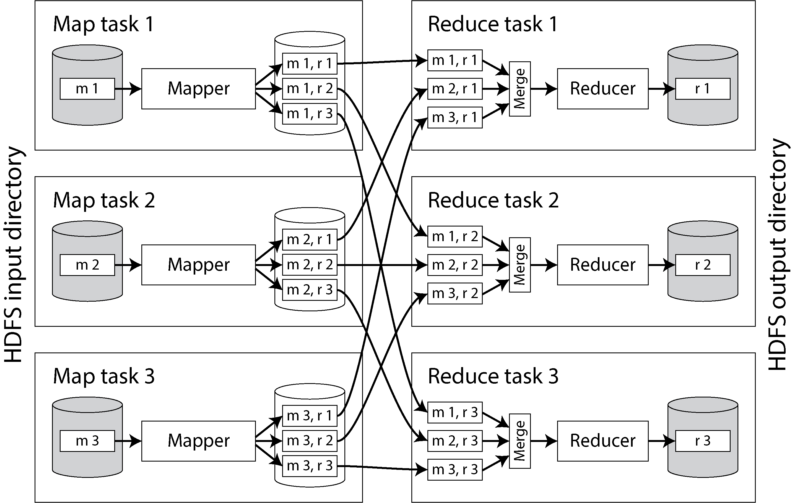
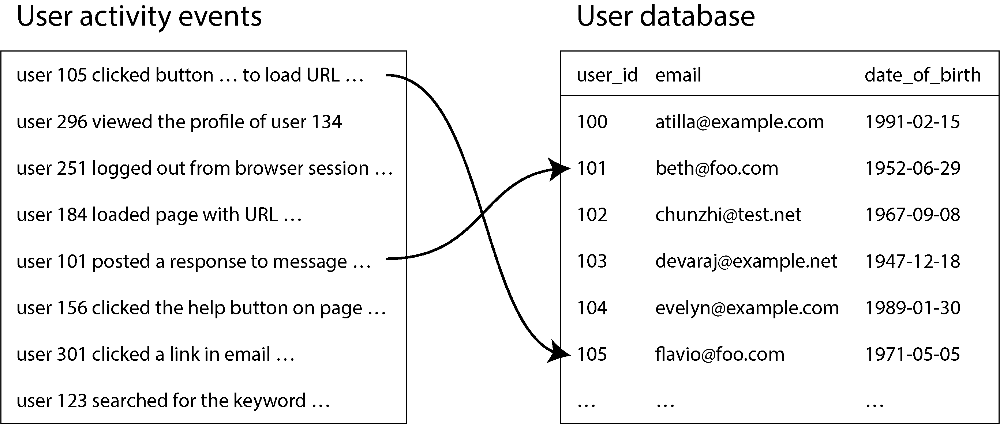
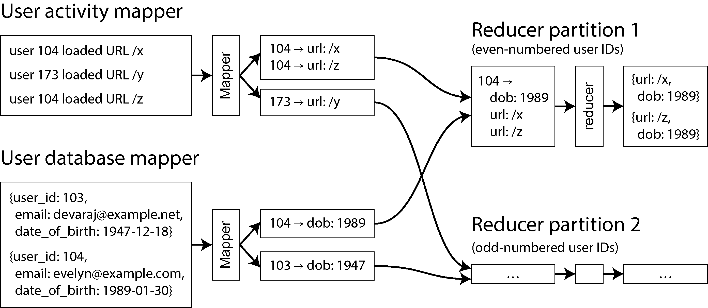

# Batch Processing

A system cannot be successful if it is too strongly influenced by a single person. Once the initial design is complete and fairly robust, the real test begins as people with many different viewpoints undertake their own experiments.
—Donald Knuth, “The Errors of TeX” (1989)

---

### Introduction: Online Aur Offline Systems Ka Farq

Ab tak is kitaab mein hum ne jitne bhi designs parhay hain, un mein zyada tar **Requests aur Queries** aur unke badlay mein milne wale **Responses (jawab)** ki baat ki gayi hai. Aaj kal ke zyadatar modern data systems isi tarah kaam karte hain: aap system se kuch maangte hain ya usay koi kaam karne ka hukum dete hain, aur system koshish karta hai ke aap ko jitna jaldi ho sakay jawab day day.

Misaal ke tor par:

* Jab aap browser mein koi website kholte hain (Web request).
* Jab aik service doosri service ko internet ke zariye call karti hai (Remote API call).
* Databases, caches, aur search indexes par chalne wali queries.

In sab systems ko hum **Online Systems** kehte hain.

* **Bacho ki Tarah Samajhein:** Yeh bilkul aisa hai jaise aap kisi dukan par gaye, dukandar se aik chocolate mangi, aur us ne foran aap ko chocolate thama di. Yahan sab se zaroori cheez **Response Time** (kitni jaldi jawab mila) hoti hai. Aur agar dukan ka computer kharab ho jaye toh dukan band ho jayegi, is liye in systems mein **High Availability** (har waqt chalte rehna) bohot zaroori hoti hai.

Lekin har kaam itna jaldi aur aam query se nahi ho sakta. Sochein agar aap ko:

* Aik bohot bara AI (Artificial Intelligence) model train karna ho.
* Hazaron gigabytes data ka roop badal kar usay kisi doosri shakal mein save karna ho.
* Bohot baray dataset par business analytics nikalni ho.

Aise baray kaamo ko hum interactively (aik hi request mein) nahi kar sakte. In baray kaamo ko **Batch Processing Jobs** kaha jata hai, aur jo systems inhein chalate hain, unhein hum **Offline Systems** kehte hain.

---

### Batch Processing Ki Khususiyaat Aur Faide

Ek **Batch Processing Job** ka asool bohot seedha hota hai: yeh pehle se maujood **Input Data** ko uthata hai (jo ke **Read-Only** hota hai, yani us mein koi radd-o-badal nahi kiya jata) aur us par poora process chala kar ek naya **Output Data** bilkul zero se (from scratch) naya generate karta hai.

Yeh aam read/write transactions ki tarah purane data ke andar ghuss kar changing (mutate) nahi karta. Is ka matlab hai ke aap ka output poori tarah input se nikalta (derive hota) hai. Agar aap ko naya output pasand nahi aaya, toh aap usay delete karein, apne code ka logic theek karein, aur job ko dobara chala dein!

Input data ko **Immutable** (na-badalne wala) rakhne aur side effects (jaise external databases mein sath sath changes karna) se bachne ke wajah se batch jobs ke bohot saare shaandar faide hote hain:

* **Human Fault Tolerance (Insaani Galtiyon Se Bachao):** Sochein agar aap ne code mein koi bug (galti) chor di aur naya output kharab ya corrupt generate ho gaya. Aap ko ghabrane ki bilkul zaroorat nahi! Aap bas code ka purana sahi version wapis layein (roll back karein) aur job ko dobara chala dein—aap ka output phir se bilkul sahi ho jayega.
* *Bacho ki Tarah Samajhein:* Yeh aisa hai jaise aap ne whiteboard par marker se drawing banayi. Agar galat bani, toh aap ne usay mittaya aur dobara shuru se sahi drawing bana li. Lekin aam databases mein aisa nahi hota; agar transaction database mein galat data write kar de, toh code roll back karne se database ka kharab hua data khud theek nahi hota.


* **Time Travel (Waqt Mein Piche Jana):** Boxt se object stores aur open table formats is feature ko support karte hain jahan aap purane output ko aik alag directory mein mehfooz rakh sakte hain aur agar naya output kharab ho toh foran purane par switch kar sakte hain.
* **Agile Software Development:** Chunke is mein galti hone par nuksan ko hamesha ke liye reversible (wapis theek) kiya ja sakta hai, is liye developers bina daray jaldi jaldi naye features bana sakte hain kyunke unhein pata hai ke unki kisi galti se live data hamesha ke liye tabah nahi hoga.
* **Input Files Ka Reusability:** Aap aik hi input file ko bohot saari alag alag jobs ke liye use kar sakte hain. Hatta ke aap aisi monitoring jobs bhi chala sakte hain jo naye output ko purane output se compare karke check karein ke kahin naye data mein koi aisi kharabi toh nahi jo pehle nahi thi.
* **Resources Ka Behtareen Istemaal:** Batch processing frameworks computers ki takat (CPU aur Memory) ko bohot tameez aur efficiency se use karte hain. Agar aap yahi bara data aam OLTP databases ya application servers par process karne baithenge, toh computer ke bohot zyada resources zaya honge aur kharcha bohot barh jayega.

---

### Batch Processing Ke Challenges Aur Kam bahiyaan

Itne saare faidong ke sath sath, batch processing mein kuch mushkilat (challenges) bhi hain:

1. **Aakhri Lamhay Tak Intezar:** Zyadatar frameworks mein naya output tab tak kisi doosri job ke istemaal ke qabil nahi hota jab tak **poori ki poori job khatam na ho jaye**. Aap ko aakhri byte ke process hone tak wait karna parta hai.
2. **Inefficiency (Susti):** Agar aap ke input data mein sirf aik chota sa naya badlao (even single byte change) bhi aaye, toh poori batch job ko shuru se saara ka saara input dataset dobara reprocess karna parta hai.
3. **Waqt Ki Keemat:** Ek batch job chalne mein minutes, ghantay, ya kayi din bhi le sakti hai. Log aam tor par inhein periodic schedule (jaise har raat 12 bajay) par chalne ke liye set kar dete hain.

* **Performance Ka Scale:** Is mein performance naapne ka scale response time nahi hota, balkay **Throughput** hota hai—yani system ne ek makhsoos waqt mein kitna zyada data process kiya.
* **Fault Handling:** Kharabi se nipatne ke liye kuch batch systems poori job ko abort (khatam) karke shuru se dubara restart karte hain, jabke kuch modern systems itne fault-tolerant hote hain ke agar kuch computers (nodes) crash bhi ho jayein, tab bhi job bina ruke safely mukammal ho jati hai.

> **Stream Processing (Aik Alternative):** Batch processing ka ek behtareen alternative **Stream Processing** hai. Is mein job kabhi chal kar khatam nahi hoti, balkay woh har waqt input data par nazar rakhti hai aur jaise ہی koi naya badlao aata hai, usay foran (kuch hi seconds mein) process kar leti hai. Is ko hum aglay Chapter 12 mein deeply parhenge.

---

### Batch Processing Ki Tareekh Aur Evolution (MapReduce Se Spark Tak)

Modern batch processing par sab se gahra asar **MapReduce** ka hai, jo Google ne 2004 mein ek algorithm ke tor par publish kiya tha. Baad mein isay open-source databases aur systems jaise **Hadoop, CouchDB, aur MongoDB** mein implement kiya gaya.

MapReduce ek kafi low-level programming model tha (yani is mein code likhna thoda mushkil aur basic hota tha) aur yeh distributed data warehouses ke parallel query execution engines jitna advance nahi tha. Lekin us zamane mein saste computers (**Commodity Hardware**) ko aapas mein jor kar bohot baray paimane (scale) par data process karne ke liye yeh ek bohot bara qadam tha. Aaj ke daur mein MapReduce purana ho chuka hai aur ab Google ke andar bhi is ka istemaal band ho gaya hai.

Aaj ke daur mein modern batch processing ke liye naye aur advance frameworks use kiye jate hain, jin ki tabdeeli ko hum is table ke zariye breakdown karte hain:

| Khasiyat (Feature) | Purana Daur (Hadoop/MapReduce Era) | Modern Daur (Modern Batch Frameworks) |
| --- | --- | --- |
| **Main Tools / Frameworks** | Apache Hadoop, MapReduce Core. | **Apache Spark, Apache Flink**, Cloud Data Warehouses. |
| **Execution Strategy** | Low-level coding, data ko baar baar disk par likhna parta tha. | Sophisticated **Caching** (Memory ka behtareen use) aur advance parallel execution. |
| **Usability / APIs** | Mushkil aur lamba custom Java code likhna parta tha. | **Dataflow APIs, Query Languages, aur DataFrame APIs** (Code likhna bohot asaan ho gaya hai). |
| **Workflow Schedulers** | Hadoop-centric tools jaise **Oozie** aur **Azkaban**. | Generalized modern solutions jaise **Airflow, Dagster, aur Prefect** (Jo cloud aur data warehouses ko asani se sambhaltay hain). |
| **Storage Layer** | Distributed Filesystems jaise **HDFS** (Hadoop Distributed File System), GlusterFS, CephFS. | Cloud **Object Storage** jaise **Amazon S3** ya Google Cloud Storage. |

Aaj kal **BigQuery** aur **Snowflake** jaise scalable cloud data warehouses ne data warehousing aur batch processing ke darmiyan ka farq bilkul khatam kar diya hai.

---

### Is Chapter Ka Roadmap

Batch processing ke is pure jahan ko achi tarah samajhne ke liye hum is chapter mein in steps ke mutabaq aage barhenge:

1. Hum sab se pehle ek single computer par standard **Unix Tools** (jaise grep, awk, sort) ka istemaal karke batch processing ki buniyadi samajh (intuition) banayenge.
2. Phir hum dekhenge ke isi data processing ko distributed system mein **aik se zyada machines** par kaise phailaya jata hai.
3. Hamein pata chalega ke ek normal operating system ki tarah distributed batch processing frameworks ke paas bhi apna ek **Scheduler** aur apna ek **Filesystem** hota hai.
4. Uske baad hum un alag alag **Processing Models** ko explore karenge jin ke zariye batch jobs ka code likha jata hai.
5. Aur aakhir mein, hum batch processing ke aam aur mashhoor **Real-World Use Cases** par gehrai se baat karenge.

---


## Batch Processing with Unix Tools

Sochein aap ke paas ek web server hai jo har dafa kisi user ki request handle karte waqt log file ke aakhir mein ek nayi line jor (append) deta hai. Agar hum NGINX server ka default log format use karein, toh log file ki aik akeli line dekhne mein aisi lagegi:

```text
216.58.210.78 - - [27/Jun/2025:17:55:11 +0000] "GET /css/typography.css HTTP/1.1" 200 3377 "https://martin.kleppmann.com/" "Mozilla/5.0 (Macintosh; Intel Mac OS X 10_15_7) AppleWebKit/537.36 (KHTML, like Gecko) Chrome/137.0.0.0 Safari/537.36"

```

Is aik akeli line mein jankari (data) ka ek samandar chhupa hua hai. Isay samajhne ke liye hamein NGINX ke log format ki definition ko dekhna hoga, jo ke yeh hai:

```text
$remote_addr - $remote_user [$time_local] "$request" $status $body_bytes_sent "$http_referer" "$http_user_agent"

```

Chalein is mushkil line ko bacho ki tarah asaan karke breakdown karte hain ke is mein kya likha hai:

* **`216.58.210.78` (`$remote_addr`):** Yeh us user (client) ka IP address hai jo website par aaya.
* **`-` (`$remote_user`):** Yeh user authenticated nahi tha (yani us ne login nahi kiya hua hai), is liye yahan nishan (-) laga hai.
* **`[27/Jun/2025:17:55:11 +0000]` (`$time_local`):** Yeh woh exact tareeq aur waqt hai jab request server tak pohanchi.
* **`"GET /css/typography.css HTTP/1.1"` (`$request`):** User ne server se kaha ke *"Mujhe `/css/typography.css` naam ki file laa kar do (GET request)"*.
* **`200` (`$status`):** Iska matlab hai kaam kamyab (HTTP 200 OK) raha.
* **`3377` (`$body_bytes_sent`):** Jo file bhejii gayi, uska size 3,377 bytes tha.
* **`"https://martin.kleppmann.com/"` (`$http_referer`):** User is se pehle is website par betha tha, jahan se click karke ya link ke zariye woh is file tak pohancha.
* **`"Mozilla/5.0..."` (`$http_user_agent`):** User Chrome browser version 137 use kar raha tha ek Mac computer par.

Hamein lag sakta hai ke logs ko parhna aur parse karna ek aam sa boring kaam hai, lekin sach yeh hai ke aaj kal ki barri barri tech companies (jaise ad networks ya payment processors) ke poore dhanday (pipelines) isi par chalte hain. Hatta ke MapReduce aur Big Data ki poori tehreek (movement) shuru hi isi wajah se hui thi ke logon ne in logs ko process karna tha.

---

### Simple Log Analysis

Bohot se naye aur mehangay tools aate hain jo in log files ko utha kar pyari pyari reports aur graphs bana dete hain. Lekin apni samajh ko pakka karne ke liye hum yeh report bilkul zero se khud banayenge, woh bhi Unix (Linux) ke bilkul bunyadi commands ka istemaal karke.

Sochein aap ka boss aap se kehta hai ke *"Mujhe apni website ke **top 5 sab se zyada chalne wale pages (URLs)** nikal kar do"*. Aap Linux terminal par aik single line ka command pipeline likhenge:

```bash
cat /var/log/nginx/access.log | awk '{print $7}' | sort | uniq -c | sort -r -n | head -n 5

```

Yeh command kaise kaam karta hai, iska step-by-step breakdown bina kisi mushkil ke samajhte hain:

1. **`cat /var/log/nginx/access.log`**
Yeh command aap ki poori log file ko parh kar uska sara text aage bhej deta hai. (Sahi baat toh yeh hai ke yahan `cat` lagana zaroori nahi tha, hum seedha file ka naam `awk` ko bhi de sakte the, lekin is tarah aik seedhi line ya factory ki assembly line asani se samajh aati hai).
2. **`awk '{print $7}'`**
`awk` ek bohot hi pyara worker hai. Yeh har line ko uthata hai aur jahan jahan khali jagah (whitespace) hoti hai, wahan se data ke tukray kar deta hai. Hum ne usay kaha `{print $7}`, yani har line ka **saatwan (7th) tukra** bahar nikalo. Hamari log line mein saatwan tukra wahi URL (`/css/typography.css`) hai jo user ne maanga tha. Ab is step ke baad baqi saari jankari (IP, Browser, Time) phenk di gayi hai, sirf URLs ki ek lambi list agay ja rahi hai.
3. **`sort`**
Yeh command saare URLs ko ABC ke mutabaq (alphabetically) tarteeb de deta hai. Iska faida yeh hota hai ke agar ek hi URL website par 100 dafa maanga gaya tha, toh woh saare 100 ke 100 nishan aik doosre ke upar-niche (aik sath) tarteeb mein aa jayenge.
4. **`uniq -c`**
`uniq` ka kaam hai duplicate cheezon ko khatam karna. Lekin `uniq` thoda bholu hai; yeh sirf tabhi duplicate pehchanta hai agar do bilkul ek jaisi lines **aik doosre ke bilkul barabar (adjacent)** pari hon (isi liye hum ne pehle step mein `sort` chalaya tha taake ek jaise URLs sath aa sakein). Is ke sath laga **`-c` (counter)** option database ko kehta hai ke duplicate line ko delete karte waqt sath mein ginti (count) bhi likh do ke yeh URL kitni dafa aaya tha.
5. **`sort -r -n`**
Ab hamare paas list aisi ban chuki hai jahan shuru mein ek number (ginti) likhi hai aur agay URL likha hai. Hum dobara `sort` chalate hain. Is dauran **`-n`** ka matlab hai ke alphabet ke bajaye **Number (ginti)** ke mutabaq tarteeb do, aur **`-r`** ka matlab hai **Reverse (ulta)** tarteeb do—yani sab se bara number sab se upar aaye aur chote numbers niche chale jayein.
6. **`head -n 5`**
Aakhir mein `head` command aata hai jo upar se sirf pehli **5 lines (`-n 5`)** ko pakarhta hai aur baqi ka kachra ya choti list ko phenk deta hai.

Is poore process ka final nateeja terminal par aisa dikhata hai:

```text
4189 /favicon.ico
3631 /2016/02/08/how-to-do-distributed-locking.html
2124 /2020/11/18/distributed-systems-and-elliptic-curves.html
1369 /
 915 /css/typography.css

```

Aap dekh sakte hain ke sab se upar `/favicon.ico` hai jo 4,189 dafa load hua. Agar aap Unix tools se waqif nahi hain, toh yeh line dekhne mein thodi jadu jaisi lagay gi, lekin yeh had se zyada takatwar hai. Yeh kuch hi seconds mein **kayi Gigabytes (GBs)** ki log files ko ragar (process kar) sakti hai.

Agar aap ka mood badal jaye aur aap report badalna chahein, toh badlao bohot asaan hai:

* Agar aap CSS files ko report se nikalna chahte hain, toh awk ka argument badal kar `$7 !~ /\.css$/ {print $7}` kar dein.
* Agar aap dekhna chahte hain ke kaun se Users (IP addresses) sab se zyada aaye hain, toh url ke bajaye pehla field `{print $1}` kar dein.

`awk`, `sed`, `grep`, `sort`, `uniq`, aur `xargs` ka milap kuch hi minto mein aap ke baray se baray analysis ko chutkiyon mein hal kar deta hai aur inki speed bohot kamaal hoti hai.

---

### Chain of Commands Versus Custom Program

Ab kuch software developers keh sakte hain ke *"Yaar, yeh Linux terminal ki ajeeb si chain likhne ke bajaye hum khud ka ek saaf suthra code kyun na likh lein?"*. Bilkul likh sakte hain! Agar hum yahi poora kaam modern **Python** mein karna chahein, toh code kuch aisa dikhega:

```python
from collections import defaultdict

# 1. Counter ki dictionary banayein jahan shuruati ginti 0 hogi
counts = defaultdict(int)

# 2. Log file ko aaram se read karne ke liye open karein
with open('/var/log/nginx/access.log', 'r') as file:
    for line in file:
        # Har line ke tukray karein aur saatwan element (index 6) uthayein
        fields = line.split()
        if len(fields) > 6:
            url = fields[6]
            # 3. Us URL ke counter mein +1 ka izafa karein
            counts[url] += 1

# 4. Dictionary ko counter value ke mutabaq ulta (descending) sort karein aur top 5 lein
top5 = sorted(counts.items(), key=lambda item: item[1], reverse=True)[:5]

# 5. Top 5 results ko screen par print karwa dein
for url, count in top5:
    print(f"{count} {url}")

```

Yeh Python program Unix pipeline jitna chota toh nahi hai, lekin parhne mein bohot saaf hai. Kaun sa tareeqa behtar hai, yeh thoda sa aap ke zaati shauq (taste) par depend karta hai. Lekin upar-upar se dikhne wale is farq ke ilawa, jab isay aik **bohot barri file** par chalaya jaye, toh dono ke kaam karne ke tareeqe (execution flow) mein ek zameen-asman ka farq samne aata hai.

---

### Sorting Versus In-Memory Aggregation

Python script aur Unix pipeline ke darmiyan asal architectural farq yeh hai:

* **Python Ka Tareeqa (In-Memory Aggregation):** Python script computer ki memory (RAM) ke andar aik hash table (dictionary) banati hai, jahan har URL ke samne uski ginti save hoti rehti hai.
* **Unix Pipeline Ka Tareeqa (Sorting):** Unix pipeline mein koi hash table nahi banti! Woh saare ke saare URLs ko uthata hai aur unki aik lambi list ko direct sort (tarteeb) karna shuru kar deta hai taake ek jaise URLs aapas mein jor jayein.

Chalein bacho ki tarah iska nafa-nuksan samajhte hain ke kaun sa approach kab king hai:

**Case 1: Jab data chota ya darmiyana ho (In-Memory Jet)**
Agar aap ki website aam size ki hai, toh ho sakta hai ke poori website par total distinct (alag alag) URLs sirf kuch hazar hon. Un saare URLs aur unke counters ko RAM mein rakhne ke liye mushkil se **1 GB RAM** chahiye hogi.

Is surah-e-haal mein Python ka tareeqa bohot fit hai, kyunke us ka **Working Set** (woh memory jis par computer ko baar baar jaldi se hath marna parta hai) bohot chota hai. Agar ek hi URL 10 lakh dafa bhi aaye, hash table mein jagah sirf aik hi URL ki rehti hai, bas counter ka number barhta jata hai. Yeh kaam aap ke laptop par bhi chutkiyon mein ho jayega.

**Case 2: Jab data memory se bara ho jaye (Disk Spilling Power)**
Lekin sochein agar aap ke paas alag alag URLs itne zyada hain ke un ka counter RAM mein fit hi nahi ho raha (Working set RAM se bara ho gaya hai). Ab agar Python script chalayenge toh computer **Out of Memory (OOM Error)** de kar crash ho jayega.

Yahan par Unix ka **Sorting approach** baazi le jata hai, kyunke yeh disk (hard drive/SSD) ka behtareen use karna jaanta hai. Yeh bilkul wahi asool use karta hai jo hum ne Chapter 3 mein **Log-Structured Storage (LSM-Tree)** mein parha tha:

* **External Merge Sort:** Linux ka `sort` command data ke chote chote tukron ko pehle RAM mein sort karta hai, phir un chote tukron ko disk par temporary files (**Segment files**) bana kar save kar deta hai.
* Aakhir mein, woh in saare sorted segments ko aapas mein jor kar (**Merge** karke) ek barri sorted file bana deta hai.
* Is tareeqe ka faida yeh hai ke data ko hamesha sequential access (aik line se) parha aur likha jata hai, jo ke hard drives aur SSDs par bohot zyada tez chalta hai.

Linux ke GNU Coreutils mein jo `sort` utility aati hai, usay pehle se hi itna aqalmand banaya gaya hai ke agar data RAM se bara ho jaye, toh woh khud-ba-khud disk ka istemaal shuru kar deti hai (**spill to disk**) aur sath hi sath processor ke saare cores (**multiple CPU cores**) par voting aur sorting ko parallel kar deti hai. Iska matlab hai ke Unix commands bina crash hue bohot baray datasets ko hazam kar sakte hain. Wahan par bottleneck RAM nahi hoti, balkay sirf yeh hota hai ke aap ka disk kitni tezi se file ko read kar raha hai.

> **Sab Se Badi Limitation:** Unix tools ka sab se bara nuksan yeh hai ke yeh sirf **aik akeli machine (single machine)** par chalte hain. Agar data itna barh jaye ke woh aik computer ki memory aur disk dono se bahar nikal jaye, toh yahan par single machine Unix tools haar jaate hain—aur yahin se shuruat hoti hai **Distributed Batch Processing Frameworks** ki (jo data ko hazaron computers par baant kar process karte hain).

---

## Batch Processing in Distributed Systems

Hum ne jo single-machine par Unix tools (cat, awk, sort wagera) ki misaal dekhi, us mein log data ko process karne ke liye computer ke yeh components aapas mein mil kar kaam kar rahe تھے:

* **Storage Devices (Hard Drive/SSD):** Jinhein operating system ke filesystem interface ke zariye access kiya jata hai.
* **A Scheduler:** Jo yeh tay karta hai ke kaun sa process kab chalega aur CPU ki takat kisko kitni milegi.
* **Unix Programs:** Jo pipes (`|`) ke zariye aik doosre se jude hote hain (aik ka output doosre ka input banta hai).

Bilkul yahi saare components **Distributed Data Processing Frameworks** (hazaron computers par chalne wale systems) mein bhi maujood hote hain. Asal mein, aap in frameworks ko **Distributed Operating Systems** maan sakte hain; inke paas bhi apna filesystem, apna job scheduler, aur aise programs hote hain jo filesystems ya doosre raabta raston ke zariye aik doosre ko data bhejte hain.

---

### Distributed Filesystems

Aap ke computer ka operating system jo filesystem (jaise ext4 ya XFS) deta hai, woh andar se kayi parton (layers) se mil kar banta hai:

* **Block Device Drivers:** Yeh sab se niflay level par direct disk se baat karte hain aur raw data blocks ko read/write karte hain.
* **Page Cache:** Yeh block layer ke upar banti hai aur hal hi mein use huye data blocks ka hissa memory (RAM) mein rakhti hai taake speed tez rahay.
* **Filesystem Layer:** Yeh block API ko lapet (wrap) kar ke barri files ko chote blocks mein torti hai aur files ka metadata (jaise inodes, directories, aur file names) ka hisab rakhti hai. Linux mein ext4 aur XFS iski aam misalein hain.
* **Virtual Filesystem (VFS):** Yeh sab se upar hota hai jo applications ko aik jaisa common API deta hai. VFS ki wajah se application ko is baat ki fikar nahi hoti ke piche ext4 chal raha hai ya XFS, uske liye file parhna aur likhna aik jaisa hota hai.

**Distributed Filesystems (DFS)** bhi bilkul isi tarah kaam karte hain. Files ko chote chunks ya **Blocks** mein tor diya jata hai aur unhein hazaron alag-alag machines par baant (distribute) diya jata ہے۔

* **Blocks Ka Size:** Distributed filesystem ke blocks aam local filesystem se **bohot baray** होते hain. Jahan Linux ka ext4 filesystem sirf 4,096 bytes (4 KB) ka block use karta hai, wahan Hadoop ka HDFS by default **128 MB** ka block use karta hai, aur JuiceFS ya baqi object stores **4 MB** ke blocks use karte hain.
* **Baray Blocks Ka Faida:** Jab data Petabytes (lakhoon GBs) ki tadad mein ho, toh agar blocks chote honge toh unka hisab kitab (metadata) rakhna azab ban jayega. Baray blocks hone se metadata bohot chota ho jata hai aur disk par data dhoondne ka kharcha (**seek overhead**) bhi parhne ke muqable mein bohot kam ho jata hai.
* **Aadha Block Likhna (Partial Blocks):** Computer ki physical hard drives kabhi bhi aadha block nahi likh saktin, is liye operating system ko poora block use karna parta hai chahe data thoda hi kyun na ho. Lekin distributed filesystems operating system ke filesystems ke upar bante hain, is liye un par yeh pabandi nahi hoti. Misaal ke tor par, agar ek 900 MB ki file hai aur aap 128 MB ka block size use kar rahe hain, toh system 128 MB ke 7 pure blocks banayega aur aakhri block bilkul exact **4 MB** ka banayega (khamkhah space zaya nahi karega).

#### Data Nodes Aur Unka Kaam

DFS ke blocks ko parhne ke liye network ke zariye us makhsoos machine ko request bheji jati hai jahan woh block save hota hai. Cluster ka har computer background mein aik worker program chala raha hota hai (ek daemon process) jo remote requests ko qubool karta hai aur blocks ko apne local disk se utha kar de deta hai.

* HDFS mein in worker programs ko **DataNodes** kaha jata hai.
* GlusterFS mein inhein **glusterfsd** processes kehte hain.
* Hum is book mein inhein aam zuban mein **Data Nodes** kahain ge.

#### Distributed Page Cache

Distributed filesystems mein bhi page cache ka distributed roop hota hai. Chunke DFS ke blocks data nodes par aam files ki shakal mein save hote hain, is liye jab bhi koi data parha ya likha jata hai, woh data node ke operating system ki **In-Memory Page Cache** se guzarata hai. Is se baar baar parha jane wala data data node ki RAM mein hi rehta hai aur speed fast milti hai. Kuch advance filesystems (jaise JuiceFS) mazeed caching tiers bhi dete hain, jaise client-side par ya local disk par cache banana.

#### Metadata Management

Jaise ext4 file ki locations aur directory structure ka hisab rakhta hai, waise hi distributed filesystems ko bhi yeh yaad rakhna parta hai ke kaun sa block kis machine par para hai.

* Hadoop (HDFS) mein is kaam ke liye aik makhsoos service hoti hai jisay **NameNode** kehte hain.
* DeepSeek ka **3FS** filesystem ek metadata service use karta hai jo apna saara data **FoundationDB** jaise key-value store mein paka save (persist) karti hai.

#### Protocols Aur VFS Ka Jora

Operating system mein jo kaam VFS karta hai, distributed processing mein wahi kaam DFS ka **Protocol ya Interface** karta hai. Yeh aik pluggable interface hota hai; jab tak koi distributed filesystem is protocol ke rules ko follow karega, batch processing systems usay asani se use kar sakenge.

* Misaal ke tor par, **Amazon S3 ka API** aaj kal ek industry standard ban chuka hai. MinIO, Cloudflare R2, Tigris, aur Backblaze B2 saare isi S3 API ko implement karte hain. Iska faida yeh hai ke jo batch processing system S3 ko support karta hai, woh in mein se kisi bhi storage system par bina code badle chal sakta hai.

NFS (Network File System) ya FUSE (Filesystem in Userspace) ke zariye in distributed filesystems ko operating system ke VFS ke sath aise jor diya jata hai ke user ko lagta hai ke woh apne hi computer ki koi local drive khol kar betha hai. Amazon ka **EFS (Elastic File System)** aur **Archil** isi NFS protocol ka use karte hain jo scale mein bohot baray distributed systems hote hain. Bahar se client sirf aik single endpoint par connect hota hai, lekin background mein yeh systems hazaron data nodes se data read/write kar rahe hote hain.

---

#### Distributed Filesystems and Network Storage

Distributed filesystems poori tarah se **Shared-Nothing Principle** (yani har computer azad hai, koi memory ya disk aam tor par aapas mein share nahi hoti) par chalte hain. Yeh network storage ke purane tareeqon jaise **NAS** (Network Attached Storage) aur **SAN** (Storage Area Network) ke **Shared-Disk** approach se bilkul alag hain.

* **Shared-Disk (NAS/SAN):** Is mein ek bohot barri central storage appliance (machinery) hoti hai, jis ke liye custom mehanga hardware aur special network infrastructure (jaise Fibre Channel) lagana parta hai.
* **Shared-Nothing (DFS):** Is mein kisi khas ya mehangay hardware ki zaroorat nahi hoti. Bas aam computers (**Commodity Hardware**) ko aam datacenter network ke zariye aapas mein jor diya jata hai.

Chunke distributed filesystems saste aur aam computers par bante hain, is liye in mein hardware kharab hone ka khatra (failure rate) enterprise hardware se zyada hota hai. Is musibat se bachne ke liye aur fault tolerance haasil karne ke liye blocks ko aik se zyada machines par copy (**Replicate**) kiya jata hai. Iska aik aur faida yeh hota ke scheduler ke paas choice hoti hai ke woh kaam ko us machine par chalaye jahan pehle se data ki copy pari ho, jis se workload barabar badhta hai.

Replication do tarah se ho sakti hai:

1. **Full Replication:** Ek hi data ki 3 ya 4 bilkul saaf copies alag machines par rakhna (Chapter 6).
2. **Erasure Coding:** Jaise **Reed–Solomon codes**. Is mein data ko mathematical formulas ke zariye aise toda jata hai ke agar koi machine mar bhi jaye, toh bache hue data se gumshuda data wapis nikal aata hai. Is mein full replication ke muqable mein storage ka kharcha bohot kam hota hai. Yeh bilkul computer ke andar lagne wale **RAID** jaisa hai, bas farq yeh hai ke distributed filesystem mein yeh redundancy poore network par phaili hoti hai.

---

### Object Stores

**Object Storage** services—jaise Amazon S3, Google Cloud Storage (GCS), Azure Blob Storage, aur OpenStack Swift—aaj kal batch processing ke liye distributed filesystems ka ek bohot hi popular maseeha ban chuki hain. Hatta ke distributed filesystem aur object store ke darmiyan ka farq ab bohot kam ho gaya hai. FUSE drivers ke zariye log S3 ko bhi local filesystem ki tarah mount kar lete hain, aur Ceph ya JuiceFS jaise systems filesystem aur object storage dono ke APIs aik sath dete hain. Lekin inke APIs, performance, aur consistency guarantees mein zameen-asman ka farq hota hai.

Object store ke andar har file (object) ka ek unique URL hota hai, jaise:
`s3://my-photo-bucket/2025/04/01/birthday.png`

* **Bucket:** Host ka hissa (`my-photo-bucket`) bucket ka naam hota hai jo poori duniya mein unique hona chahiye.
* **Object Key:** Uske baad ka saara hissa (`/2025/04/01/birthday.png`) us object ki unique key kehlata hai.

#### Object Stores Ke Rules (Bacho ki tarah samajhein)

* **Immutable (Na-badalne wale):** Object stores mein data ko **GET** call se parha jata hai aur **PUT** call se likha jata hai. Ek dafa jo object likh diya, aap uske andar ghuss kar badlao (update) nahi kar sakte. Agar aap ko file badalni hai, toh aap ko poori ki poori file dobara PUT call se naye siray se re-write karni paregi (halanqe Azure Blob aur S3 Express One Zone ab data aage jorna support karte hain, baki stores mein yeh facility nahi hai). Yahan traditional coding ke functions jaise `fopen` ya `fseek` (file ke beech mein jump karna) bilkul nahi hote.
* **Directories Ka Dhoka:** Jab aap S3 kholte hain toh aap ko folders aur directories nazar aati hain, lekin **object stores mein directories ka koi concept hota hi nahi hai!** Yeh slashes (`/`) sirf ek string (text) ka hissa hote hain. Jab aap directory listing mangte hain, toh system asal mein makhsoos **Prefix** (shuruati lafz) match karke objects ki list dikha deta hai.

Prefix listing aam filesystem se do tarah se alag hoti hai:

1. **Recursive By Default:** Agar aap `s3://my-photo-bucket/2025/04` ki list mangenge, toh yeh Unix ke `ls -R` ki tarah uske andar ke sub-folders ke saare objects bhi nikal kar le aayega.
2. **Khali Folder Mumkin Nahi:** Agar aap `s3://my-photo-bucket/2025/04/01` ke andar ke saare objects delete kar dein, toh `01` naam ka folder hi duniya se gayab ho jayega! Kyunke piche koi key bachi hi nahi jiske andar yeh text ho. Is se bachne ke liye log galti se wahan ek 0-byte ka khali object bana dete hain taake folder ka nishan bacha rahay.

Distributed filesystems mein hard links, symbolic links, file locking, aur atomic renames (aik jhatkay mein folder ka naam badalna) jaise features hote hain, jabke **object stores mein yeh sab missing hota hai**. S3 mein folder rename karne ka matlab hai ke uske andar maujood hazaron files ko aik aik karke naye naam par copy karo aur phir purani files ko delete karo!

#### Key-Value Stores Vs Object Stores

Chapter 4 wale key-value stores chote data (Kilobytes) aur har waqt tez low-latency reads/writes ke liye design hote hain. Jabke Object stores baray data (Megabytes se Gigabytes) aur aaram se barri reads ke liye optimize hote hain. (Halanqe ab **S3 Express One Zone** ne single-digit millisecond latency dena shuru kar di hai jo key-value store ke kareeb tar hai).

* **Data Locality Ka Farq:** HDFS ka sab se bara faida yeh tha ke woh computing task (code) ko us machine par chalata tha jahan file ka block pehle se para ho (**Data Locality**). Is se network ka bandwidth bachta hai kyunke code ka size file se chota hota hai.
* Doosri taraf, Object stores storage aur computation (servers) ko bilkul alag alag (**decouple**) rakhte hain. Is mein data network par travel karta hai, lekin chunke modern datacenter networks had se zyada fast hain, is liye yeh nuksan ab bardasht kar liya jata hai. Iska faida yeh hai ke aap storage aur CPU/RAM ko aik doosre se azaad scale kar sakte hain.

---

### Distributed Job Orchestration

Operating system ka jo asool hum ne parha, woh **Job Orchestration** (kaam ko tarteeb dena) par bhi apply hota hai. Jab aap single machine par Unix pipeline chalate hain, toh computer ka kernel piche `awk`, `sort`, `uniq` wagera ko chalane, memory baantne, aur CPU par schedule karne ka zimma uthata hai. Distributed system mein yahi kaam **Job Orchestrator** karta hai.

Jab koi batch processing framework kisi orchestrator ke paas job chalane ki request bents hai, toh us request mein yeh metadata shamil hota hai:

* Total kitne tasks chalane hain.
* Har task ko kitni Memory, CPU, aur Disk chahiye.
* Job ki unique ID aur credentials (ijazat nama).
* Input aur output data kahan para hai.
* Hardware ki requirements (jaise makhsoos GPUs ya SSDs).
* Job ka executable code (executable binary ya Docker image) kahan para hai.

**Kubernetes** aur **Hadoop YARN** (Yet Another Resource Negotiator) jaise orchestrators is jankari ko cluster ke metadata ke sath jor kar kaam chalate hain. Inke andar teen bunyadi components hote hain:

1. **Task Executors (Worker Daemons):**
Cluster ke har computer par ek worker program chal raha hota hai (jaise YARN ka **NodeManager** ya Kubernetes ka **kubelet**). Inki zimmedari hoti hai tasks ko chalana, central manager ko apni zinda hone ki dharkan (**Heartbeats**) bhejte rehna, aur resource utilization ka hisab rakhna. Jab inhein request milti hai, yeh code download karte hain aur task shuru kar dete hain. Yeh operating system ke sath mil kar **Linux cgroups** use karte hain taake aik task kisi doosre task ki memory mein ghuss na sakay aur na hi uske resources chura sakay (**Performance Isolation**).
2. **Resource Manager:**
Yeh pooray cluster ka main dimaagh hota hai jiske paas har node ki hardware capacity, khali jagah, chalte hue tasks, aur network locations ka poora global view hota hai. Chunke saari jankari is ke paas hoti hai, is liye yeh cluster ka bottleneck ya SPOF bhi ban sakta hai. YARN is state ko save karne ke liye **ZooKeeper** aur Kubernetes **etcd** ka istemaal karta hai.
3. **Scheduler:**
Yeh resource manager ke andar ka aik subsystem hota hai jo jobs ko start, stop ya check karne ki requests qubool karta hai. Sochein usay request mili ke *"10 tasks chalao jinhein makhsoos GPU chahiye"*. Scheduler global view check karega aur faisla karega ke yeh 10 tasks kis kis computer par chalenge, aur phir un computers ke Task Executors ko hukum bhej dega.

> **Subschedulers:** Sometime kuch kaamo ke liye application-specific scheduling chahiye hoti hai (jaise jab queries barhein toh read replicas ko auto-scale karna). Central scheduler aur yeh subschedulers mil kar kaam karte hain. YARN mein in subschedulers ko **ApplicationMasters** kehte hain aur Kubernetes mein inhein **Operators** kaha jata hai.

---

#### Resource allocation

Orchestration mein scheduler ka kaam sab se zyada challenging aur dimaagh ghumane wala hota hai. Usay cluster ke limited resources ko un saari jobs mein baantna parta hai jo aapas mein pehle chalne ki larai kar rahi hoti hain. Yahan do cheezon ka balance farz hai: **Fairness (Insaf)** aur **Efficiency (Karkardagi)**.

Bacho ki tarah aik simple misaal se samajhein: Sochein hamare paas ek chota cluster hai jiske 5 nodes hain aur total **160 CPU cores** khali hain. Achanak do alag alag jobs ki requests aati hain, aur **dono ko apna kaam khatam karne ke liye 100 Cores chahiye**. Ab scheduler kya karega?

* **Strategy 1 (Barabari):** Scheduler dono jobs ko 80-80 cores de deta hai. Aur bache hue 20-20 tasks tab shuru honge jab pehle wale tasks khatam honge.
* **Strategy 2 (Gang Scheduling):** Scheduler pehle aik job ko pure 100 cores de deta hai aur poori task ek sath chalata hai. Doosri job ko tab tak wait karwaya jata hai jab tak pehle wali ke cores azaad na ho jayein.
* **Strategy 3 (Incomplete Info):** Agar doosri job pehli job ke chalne ke kafi dair baad aaye, toh scheduler ko pehle se nahi pata tha. Woh pehli job ko saare cores de chuka hoga. Ab usay faisla karna hoga ke kya woh pehli job ke chalte hue tasks ko jaan se maar de (**Preemption**) taake naye ke liye jagah banay, ya naye wale ko bhookha (**Starvation**) rakhay.

Is choti si misaal mein hi kitne baray trade-offs hain! Agar gang scheduling mein scheduler cores reserve karke baith jaye jab tak pure 100 khali na hon, toh servers khali bethe rahenge aur cluster ki utilization gir jayegi, ya systems aapas mein **Deadlock** ho jayenge. Agar woh wait karwaye, toh starvation ho sakti hai. Agar tasks ko kill kare (preempt kare), toh pehle ki hui mehnat zaya ho jayegi aur efficiency kharab hogi.

Asal zindagi mein jab scheduler ke paas hazaron ya lakhon requests aa rahi hon, toh perfect math nikalna na-mumkin ho jata hai (Yeh ek **NP-hard problem** hai). Is liye practical schedulers perfect solution ke bajaye **Heuristics** (tajurbaati asoolon) ka sahara lete hain. Is ke liye mukhtalif algorithms use hote hain:

* **FIFO** (First-In First-Out)
* **DRF** (Dominant Resource Fairness)
* **Priority Queues**
* **Capacity / Quota-based scheduling**
* **Bin-packing algorithms**

---

#### Scheduling workflows

Unix tools ke example mein hum ne dekha ke kaise commands pipes ke zariye aik doosre se connect the. Distributed batch processing mein bhi bilkul yahi hota hai: aik job ka output doosri job ka input banta hai, aur aik job ke piche kayi inputs ho sakte hain jo alag alag jobs ne banaye hon. Is lambay silsilay ko hum **Workflow** ya **DAG (Directed Acyclic Graph)** kehte hain.

> **Durable Execution Vs Batch Workflows:** Chapter 8 mein jo workflow engines hum ne parhay the, woh step-by-step RPC calls (web requests) ke zariye kaam karte hain aur chota data process karte hain. Jabke Batch Processing mein workflow ka matlab hota hai baray baray data processes ki ek sequence, jo files parhti hain aur nayi files banati hain, external APIs par RPC calls nahi kartin.

Ek pipeline mein bohot saari jobs ka workflow banana kyun zaroori hota hai?

1. **Multi-Team Sharing:** Agar aik job ka output 5 alag alag teams ki jobs ke liye input hai, toh behtar yeh hai ke pehli job apna output storage mein save kar de. Baqi teams ki jobs jab bhi data update ho, wahan se parh sakti hain.
2. **Tools Ka Milan:** Aap alag alag tools ko jor sakte hain. Misaal ke tor par, aik **Spark** job ne data process karke HDFS par phenka, wahan se aik **Python** script ne trigger dabaya aur **Trino SQL** query chala kar us data ko mazeed makhsoos karke S3 par save kar diya.
3. **Multi-Stage Resharding:** Agar aik stage mein data ko *User_ID* ke mutabaq shard karna hai, aur aglay stage mein *Region_ID* ke mutabaq, toh pehli stage data ko naye roop mein shard karke save karegi taake doosri stage apna kaam asani se shuru kar sakay.

Unix pipeline mein do commands ke beech ka pipe memory ka aik chota sa buffer use karta hai aur disk par file nahi banata. Agar buffer bhar jaye, toh pehla process ruk jata hai jab tak doosra data parh na le (**Backpressure**). Spark aur Flink bhi aisa network-based streaming model support karte hain jahan data direct aik task se doosre task ko network par pass ho jata hai.

Lekin aam distributed workflows mein zyadatar tareeqa yeh hota hai ke har job apna final output **Distributed Filesystem ya Object Store** par likhti hai. Is se jobs aapas mein azad (**decouple**) ho jati hain. Agar aik job chal rahi hai, toh agli job ke liye workflow scheduler tab tak wait karega jab tak pehli job safely $100\%$ khatam na ho jaye aur data disk par paka save na ho jaye.

YARN ya Spark ka apna scheduler sirf aik individual job ke andar ke tasks ko sambhalta hai, pooray workflow ke dependency ko nahi jaanta. Is liye pooray workflows ko schedule aur manage karne ke liye alag se **Workflow Schedulers** use kiye jate hain, jaise **Airflow, Dagster, aur Prefect**. Barri companies mein 50 se 100 jobs ke workflows aam baat hain, is liye in tools ke bina data pipelines ka hisab rakhna namumkin hai.

---

#### Handling faults

Batch jobs bohot lambay waqt tak chalti hain. Jab aik job hazaron computers par ghantong chali ho, toh beech mein kisi aik task ka fail ho jana bilkul aam baat hai (chahe hardware kharab ho ya network ka jhatka lage).

Sometime scheduler khud bhi jaan-booch kar aap ke task ko kill (**preempt**) kar deta hai. Yeh tab hota hai jab aap saste virtual machines use kar rahe hon jinhein Amazon EC2 par **Spot Instances**, Azure par **Spot VMs**, aur Google Cloud par **Preemptible Instances** kehte hain.

* Yeh machines cloud providers ke paas bachi hui faltu computing power hoti hain jo woh bohot sasti (70-80% discount par) de dete hain.
* Batch processing jobs time-sensitive nahi hotin (yani agar thoda dair se bhi khatam hon toh chalta hai), is liye log kharcha bachane ke liye spot instances par batch jobs chalate hain. Lekin iska nateeja yeh hota hai ke jaise hi cloud provider ke paas koi mehanga regular customer aayega, scheduler aap ke chalte hue saste task ko foran kill kar dega. Hardware faults se zyada spot instances par preemption ki wajah se tasks fail hote hain.

Batch jobs mein kharabiyon se nipatna online systems se lakh darja asaan hai. Chunke batch jobs input ko cherti nahi hain aur output shuru se naya banati hain, is liye agar koi task fail ho jaye, toh system us aadhay-adhuray kharab output ko delete karta hai aur us task ko kisi doosre computer par **dobara restart (retry)** kar deta hai.

Aik task ke marne par poori 10 ghantay ki job ko shuru se chalana bohot barri bewakoofi hogi. Is liye MapReduce aur uske baqi naye bhai saare parallel tasks ko aik doosre se bilkul azad (independent) rakhte hain taake galti hone par sirf us aik chote task ko hi dobara chalaya jaye.

Workflow ke andar jab aik task ka data doosre ke liye input ho, toh fault tolerance thodi barik ho jati hai:

* **MapReduce Ka Tareeqa:** Yeh har stage ka beech ka data (**Intermediate Data**) har haal mein distributed filesystem (disk) par paka likhta hai aur aglay task ko tab tak touch nahi karne deta jab tak pehla paka complete na ho jaye. Yeh bohot safe hai lekin baar baar disk par likhne se slow ho jata hai.
* **Spark Ka Tareeqa:** Spark is beech wale data ko disk par likhne ke bajaye **RAM (Memory)** mein hi rakhta hai (agar memory bhar jaye tab hi local disk par spill karta hai). Yeh poora rasta yaad rakhta hai (**Lineage Tracking**) ke data kis formula se bana tha. Agar koi beech ka data zaya ho jaye, toh Spark poori job chalane ke bajaye sirf us khoye hue hissay ko formula dekh kar dobara compute kar leta hai.
* **Flink Ka Tareeqa:** Flink aik alag tareeqa apnaata hai jahan woh chalte hue tasks ka thodi thodi dair baad chupke se snapshot (**Checkpointing**) leta rehta hai taake galti hone par pichlay checkpoint se kaam shuru kiya ja sakay.

---

## Batch Processing Models

Distributed environment mein batch jobs ko schedule karne ke tareeqay dekhne ke baad, ab hum yeh samjhenge ke batch processing frameworks asal mein data ko andarooni tor par kaise hazam (process) karte hain. Is kaam ke liye do sab se mashhoor aur bunyadi models istemaal hote hain: **MapReduce** aur **Dataflow Engines**.

Halanqe aaj kal practical karkardagi mein dataflow engines ne MapReduce ki jagah le li hai, lekin MapReduce ko deeply samajhna bohot zaroori hai kyunke modern frameworks ke bohot se concepts isi ki buniyaad par kharay hain.

Yeh dono frameworks agay chal kar software engineers, business analysts, aur technical teams ki aasan-fahm ke liye teen tarah ke programming models support karte hain:

* Low-level programmatic APIs (Sakhth coding waala tareeqa)
* Relational query languages (Jaise SQL queries)
* DataFrame APIs (Jaise Spark/Pandas DataFrames)

---

### MapReduce

MapReduce ka data process karne ka poora dhabba (pattern) bilkul hamare pichlay Unix log analysis (`cat | awk | sort | uniq`) wale pipeline jaisa hai. Is ke poore execution flow mein chaar (4) baray steps hote hain:

1. **Input Files Ko Parhna Aur Records Mein Torna:** Sab se pehle HDFS ya Amazon S3 jaisay stores se read-only input files uthayi jati hain aur unhein records mein tora jata hai. Log analysis mein har line aik record thi kyunke beech mein `\n` (newline separator) tha. Yeh data kisi bhi modern file format jaise **Apache Parquet** (columnar format) ya **Apache Avro** (row-based format) mein ho sakta hai.
2. **Mapper Function Ko Call Karna:** Har record par Mapper function chala kar ek **Key aur Value** nikaali jati hai. Unix tools mein yeh kaam `awk '{print $7}'` kar raha tha jo saatwan field (URL) nikal kar key bana raha bha aur value khali chorr raha tha.
3. **Key-Value Pairs Ko Sort Karna:** Saare keys ko database background mein automatically sort (tarteeb) kar deta hai taake aik jaisi keys aik doosre ke upar-niche tarteeb mein aa jayein. Yeh Unix ke pehlay `sort` jaisa kaam hai.
4. **Reducer Function Ko Call Karna:** Reducer function sorted keys par ghoomta (iterate karta) hai. Chunke sorting ki wajah se aik jaisi keys aapas mein jorr chuki hain, is liye un saari values ko aapas mein jama ya aggregate karna memory par bohot sasta parta hai. Unix pipeline mein yeh kaam `uniq -c` kar raha tha.

Ek single MapReduce job inhi chaar steps ko chalaati hai. Step 2 (Map) aur Step 4 (Reduce) woh jagah hain jahan aap apna **custom data processing code** likhte hain. Step 1 parser khud sambhalta hai aur Step 3 (Sorting) MapReduce ke andar built-in chupti hui taqat hai, usay aap ko khud code nahi karna parta.

Chalein in dono callback functions ke kirdar ko bariki se samajhte hain:

* **Mapper:** Yeh har input record ke liye aik dafa call hota hai. Iska kam sirf key-value extract karna hai. Yeh aik record se bohot saari keys bhi nikaal sakta hai aur ho sakta hai aik bhi na nikale. Yeh aik record se doosre record ke beech koi purani yaad (**State**) baqi nahi rakhta (Stateless hota hai), is liye hazaron mappers parallel computers par chalaye ja sakte hain.
* **Reducer:** MapReduce framework mappers ke banaye hue kachray (pairs) ko ikhta karta hai, aik jaisi keys ki values ki aik tolian (collections) banata hai, aur un values par ghoomne ke liye reducer ko ek iterator de deta hai. Alag alag keys ke reducers alag computers par parallel chal sakte hain.

> **Barik Architectural Nukta:** Unix tools wale example mein hamare paas aik doosra `sort -r -n` bhi tha jo top pages ki ranking nikal raha tha. MapReduce mein agar aap ko aisa doosra sorting stage chahiye ho, toh aap ko **aik doosri alag MapReduce job** likhni paregi, jahan pehli job ka output doosri job ka input ban kar chalega. Is liye mapper ka asli kaam data ko sort hone ke kabil banana hai, aur reducer ka kaam us sorted data ko final shape dena hai.

---

#### MapReduce and Network Storage (Functional Programming Connection)

Halanqe MapReduce batch processing ke liye use hota hai, lekin iska programming model **Functional Programming** se liya gaya hai. Lisp language ne pehli dafa `map` aur `reduce` (ya fold) ko introduce kiya tha.

Functional programming ka sab se bara asool hai **Mutable State se bachna** (yani data ko chalte hue badalna nahi). Chunke har mapper aur reducer call sirf aur sirf us data par depend karti hai jo framework usay pass karta hai, is liye bina kisi darr ke independent calls ko alag alag computers par parallel chalaya ja sakta hai. Agar koi computer beech mein mar (fail ho) jaye, toh framework safely us input record ko kisi doosre computer par dobara chala deta hai.

**MapReduce Ke Do Baray Maslay (Limitations):**

* **Laborious APIs (Thakane wala kam):** Raw MapReduce APIs mein complex algorithms (jaise do datasets ka **Join** lagana) bilkul zero se khud code karna parta hai, framework bana-banaya join operator nahi deta.
* **Slow File-Based I/O:** Yeh bohot slow hota hai kyunke har stage ka data pehle disk/filesystem par write hota hai, jis se **Job Pipelining** (yani aage chalne wali job ka kaam pehle shuru ho jana bina pichli job ke $100\%$ khatam hone ka wait kiye) bilkul na-mumkin ho jata hai.

---

### Dataflow Engines

MapReduce ke inhi rona-dhona aur file-based susti ko hal karne ke liye **Spark** aur **Flink** jaise distributed engines paida hue, jinhein hum **Dataflow Engines** kehte hain. In dono mein aik cheez common hai: **Yeh pooray workflow (DAG) ko alag alag sub-jobs mein torhne ke bajaye aik hi single job ke tor par chalate hain.**

Chunke yeh systems data ke bahao (flow) ko pehle se hi achi tarah model kar lete hain, is liye in mein sirf map aur reduce ke strict chakkar mein nahi ghoomna parta, balkay aap operators ko apni marzi se lachkay daar (flexible) tareeqay se jorr sakte hain. Yeh `join`, `group by`, `filter`, aur aggregates ke high-level operators pehle se bana kar dete hain.

This architecture offers several massive advantages over MapReduce:

* **Sorting Sirf Zaroorat Ki Jagah:** MapReduce ki tarah har stage ke beech zabardasti sorting nahi hoti, balkay sorting sirf aur sirf wahan chalayi jati hai jahan aap ne khud code mein manga ho.
* **Operator Fusing (Tukron ko jorrna):** Agar aap ne aik ke baad aik aise operators lagaye hain jo data ki sharding/partitioning ko change nahi karte (jaise map ke baad foran filter lagana), toh dataflow engine un saare operators ko milakar **aik hi task** bana deta hai, jis se data ko baar baar copy karne ka kharcha bach jata hai.
* **Global Layout Optimization:** Scheduler ke paas pooray data pipeline ka ek overview hota hai, is liye woh **Data Locality** ka behtareen use karta hai. Woh data parhne wale task ko usi computer par chalane ki koshish karta hai jahan data banane wala task chal raha tha, taake data network ke bajaye **Shared Memory Buffer** ke zariye pass ho jaye. Network ka bandwidth poori tarah bach jata hai.
* **In-Memory Intermediate State:** Har operator ke beech ka jo temporary data hota hai, usay distributed filesystem (HDFS/S3) par likhne aur replicate karne ke bajaye **RAM (Memory)** mein ya local disk par rakha jata hai, jo ke bohot zyada tez hai.
* **Pipelined Execution:** Agli stage ka operator pichli stage ke poori tarah khatam hone ka wait nahi karta; jaise ہی pichli stage se thoda sa data nikalta hai, agli stage us par kaam shuru kar deti hai.
* **Process Reusability:** MapReduce ki tarah har task ke liye naya JVM (Java Virtual Machine) process shuru karne ka tamasha nahi hota, balkay purane chalte hue processes ko hi naye operators chalane ke liye reuse kiya jata hai.

Isi wajah se dataflow engines MapReduce ke muqable mein **kai guna zyada tez** chalte hain.

---

### Shuffling Data

Hum ne dekha ke Unix tools aur MapReduce dono distributed sorting par depend karte hain. Jab data Petabytes (lakhoon GBs) ki tadad mein ho jo aik machine par fit na ho sakay, toh hamein aik distributed sorting algorithm chahiye hota hai jahan input aur output dono sharded hon. Is poore data ko tarteeb se bantaane wale algorithm ko distributed systems mein **Shuffle** kehte hain.

> **Shuffle Ka Matlab Random Nahi Hai:** Taash ke patton (cards) ko shuffle karne ka matlab unhein random (aage-piche) karna hota hai, lekin distributed computing mein shuffle ka matlab data ko bina kisi randomness ke ek **Perfect Sorted Order** mein lekar aana hai.

MapReduce, Spark, Flink, aur BigQuery saare scalability ke liye behtareen shuffle algorithms implement karte hain. Chalein hum Hadoop MapReduce ke architecture ka hawala dete hue **Figure 11-1** ke poore dataflow ko step-by-step breakdown karke bacho ki tarah asaan karte hain:

<div align="center">
  
</div>

##### Figure 11-1 Ka Step-by-Step Breakdown

* **Step 1: Input Sharding ($m_1, m_2, m_3$):**
Hamara input data pehle se hi sharded (tukron mein) banta hua hai. Figure 11-1 mein yeh shards $m_1, m_2$, aur $m_3$ hain. Yeh HDFS ki alag files ya S3 bucket ki alag objects ho sakti hain jo aik hi directory ya prefix ke andar pari hain.
* **Step 2: Map Tasks Ka Shuru Hona:**
Framework har input shard ke liye aik alag **Map Task** parallel shuru karta hai. Task file se aik aik record uthata hai aur Mapper callback code ko deta jata hai.
* **Step 3: Local Disk Par Partitioning Aur Sorting:**
Mapper ka output key-value pairs par mushtamil hota hai. Framework ne ab yeh pakka karna hai ke **agar do alag mappers ne same key generate ki hai, toh woh har haal mein aik hi Reducer ke paas jaye**. Is ke liye har mapper apne local disk par **har ek reducer ke liye aik alag file** banata hai.
* Misaal ke tor par, Figure 11-1 mein `m1, r2` ka matlab hai: *Mapper 1 ke local disk par pari woh file jo Reducer 2 ke liye banyi gayi hai*. Key ka **Hash** nikal kar (`hash(key) % total_reducers`) yeh tai kiya jata hai ke data kis reducer file mein jayega.
* File mein data likhte waqt mapper un pairs ko memory ke andar hi sort karta jata hai (LSM-Tree segment style) aur un sorted chote chunks ko local disk par bara karke save karta jata hai.


* **Step 4: Reducers Ka Network Par Data Khainchna (The Fetch Phase):**
Jab saare mappers apna kaam khatam kar lete hain, toh **Reduce Tasks** (jin ki ginti job ka author khud tai karta hai) active hoti hain. Har reducer saare mappers ke paas network ke zariye connect hota hai aur apne naam ki file (jaise Reducer 2 saare mappers se `, r2` wali files) khainch kar apne local disk par le aata hai.
* **Step 5: Mergesort At Reducer Side:**
Jab Reducer ke paas saare mappers se uske hissay ka sorted data aa jata hai, toh woh un saari files ko aapas mein jorrne ke liye **Merge Sort** chalaata hai. Is se fayda yeh hota hai ke saari same keys (chahe woh alag mappers se hi kyun na aayi hon) aik doosre ke bilkul aage-piche (consecutive) tarteeb mein aa jati hain.
* **Step 6: Final Output Shards ($r_1, r_2, r_3$):**
Ab Reducer function ko har unique key ke liye aik dafa call kiya jata hai aur output records ko line se aik file mein write kar diya jata hai. Har reduce task ki aik alag file banti hai (Figure 11-1 mein $r_1, r_2, r_3$), jo ke job ka final output shards ban kar wapis HDFS ya cloud object store mein paki save ho jati hain.

Modern dataflow engines aur cloud warehouses (jaise Google BigQuery) ne is shuffle algorithm ko mazeed advance kar diya hai. Yeh data ko baar baar local disk par patakhne ke bajaye poora **RAM (Memory)** mein rakhte hain aur external specialized sorting services ka use karte hain jo speed ko rocket bana deti hain.


### Joins and Grouping

Hum ne yeh toh dekh liya ke distributed system mein data ko sort (tarteeb) kaise kiya jata hai. Ab hum parhenge ke sorted data ki wajah se distributed databases mein **Joins** (do alag alag tables ko aapas mein jorhna) aur **Aggregations** (data ko jama karke calculations karna) kitna asaan ho jata hai. Is baat ko samajhne ke liye hum MapReduce ka hi sahara lenge, halanqe yeh asool baki saare modern batch systems par bhi apply hota hai.

Writer ne ek bohot hi solid real-world example di hai jo aam tor par data warehousing ke **Star Schema** (Fact aur Dimension model) mein use hoti hai. Sochein hamare paas do alag alag datasets hain, jaisa ke **Figure 11-2** mein dikhaya gaya hai:

* **User activity events (Left Side):** Isay hum clickstream data bhi kehte hain. Jab bhi koi logged-in user website par koi button click karta hai ya koi page kholta hai, toh server ek log record bana deta hai (jaise User 105 ne link click kiya). Yeh hamari **Fact Table** hai, jo har lamha barhti rehti hai.
* **User database (Right Side):** Yeh hamare registered users ki profile database hai, jahan unki basic jankari jaise `user_id`, `email`, aur `date_of_birth` (paidaish ki tareeq) save hoti hai. Yeh hamari **Dimension Table** hai.

---

#### Figure 11-2 Ka Breakdown: Activity Logs Aur User Profiles Ka Jorr

<div align="center">
  
</div>

Sochein aap ke company ka analytics manager aap se kehta hai ke *"Mujhe yeh pata laga kar do ke hamari website ke makhsoos pages kis umar ke logon (younger vs older users) mein zyada popular hain?"* Is sawaal ka jawab nikalne ke liye aap ko user activity log ke data ko user database ke sath **Join** karna parega, taake log ke sath user ki tareeq-e-paidaish (`date_of_birth`) bhi jorr di jaye. Lekin masla yeh hai ke yeh dono tables itne baray hain ke inhein hazaron computers (shards) par baant kar rakha gaya hai. Ab distributed system mein inhein aapas mein kaise jorrेंगे?

Yahain par MapReduce ka shuffle algorithm kaam aata hai. Shuffle ka asool kya hai? **Saari duniya se aik jaisi keys utha kar aik hi makhsoos Reducer ke paas pohanchana.**

---

#### Figure 11-3 Ka Breakdown: Sort-Merge Join In Action

**Figure 11-3** mein is poore distributed join ke system ko visually step-by-step breakdown kiya gaya hai. Is algorithm ko distributed theory mein **Sort-Merge Join** kehte hain:

<div align="center">
  
</div>

1. **The Mappers Phase (Do Alag Mappers):**
* **User Activity Mapper:** Yeh mappers clickstream data (activity logs) ko line se parhte hain. Har line mein se woh `user_id` ko nikal kar **Key** banate hain aur URL ko **Value** banate hain. (Misaal ke tor par Figure 11-3 mein User 104 ne `/x` aur `/z` khola, toh mapper ne do pairs nikale: `104 -> url: /x` aur `104 -> url: /z`).
* **User Database Mapper:** Yeh mappers user profile database ko row-by-row parhte hain. Yeh bhi `user_id` ko **Key** banate hain lekin profile se date of birth (dob) utha kar usay **Value** bana dete hain. (Misaal ke tor par User 104 ki row se nikla: `104 -> dob: 1989`).


2. **The Shuffle & Secondary Sort Phase (Beech Ka Jadu):**
* Framework in dono mappers ka saara data uthata hai aur `user_id` ke mutabaq shuffle (sort) kar deta hai. Ab chahe log file kisi alag computer par ho aur profile database kisi alag machine par, **User 104 ka saara ka saara data aik hi computer (Reducer Partition 1) ke paas pohanchega.**
* **Secondary Sort (Ek Aur Bariki):** MapReduce is data ko mazeed is tarah tarteeb deta hai ke Reducer ke paas **sab se pehle user database wali row (profile data) pohanche**, aur uske baad line se us user ke saare activity logs aayein.


3. **The Reducer Phase (The Actual Join):**
* Reducer Partition 1 (jo even-numbered IDs handle kar raha hai) ke paas jab User 104 ka data aata hai, toh rule ke mutabaq usay sab se pehle profile data (`104 -> dob: 1989`) milta hai. Reducer is umar ko memory ke aik local variable mein save kar leta hai.
* Uske baad Reducer line se User 104 ke activity logs par ghoomta (iterate karta) hai. Woh har URL ke sath us local variable se umar jorrta jata hai aur output nikalta jata hai.
* **Memory Ki Bachat (Efficiency):** Reducer ko aik waqt mein memory mein sirf **aik user ka profile record** rakhna parta hai. Jaise hi User 104 ka kaam khatam hua, memory khali! Usay network par baar baar kisi se data mangwane ki zaroorat nahi parti. Final output kuch aisa nikalta hai: `{url: /x, dob: 1989}` aur `{url: /z, dob: 1989}`.


##### Agla Qadam: Group By Aur Aggregation

Ab joins toh ho gaye, lekin abhi umar ke mutabaq ginti (count) baki hai. Is ke liye workflow scheduler aik **Doosri MapReduce Job** chalayega:

* Is naye job ka mapper pichli job ka output uthayega aur is dauran **URL ko Key** banayega aur umar (dob) ko **Value** banayega.
* Shuffle algorithm saare same URLs ko aik reducer ke paas le aayega.
* Reducer har URL ke liye aik chota sa counter table memory mein rakhega aur har age group (umar ke hisab se) ke counter mein $+1$ karta jayega. Is tarah database ka `GROUP BY` aur aggregation operation safely mukammal ho jata hai.

---

### Query Languages

Waqt ke sath distributed batch processing engines bohot zyada mature (samajhdar) ho chuke hain. Aaj kal ka infrastructure itna robust hai ke log **10,000 se zyada computers** ke clusters par Petabytes data bina kisi crash ke process kar lete hain. Jab scale ka masla hal ho gaya, toh computer scientists ne apna dhyan is baat par lagaya ke *"In systems par code likhna asaan kaise kiya jaye?"*

MapReduce aur baki saare dataflow engines ne **SQL (Structured Query Language)** ko batch processing ki aam zuban (lingua franca) ke tor par apna liya hai. Yeh aik bohot hi natural fit tha kyunke:

* Purane data warehouses pehle se SQL par chal rahe the.
* Data analytics aur ETL (Extract, Transform, Load) ke saare tools SQL ko pehle se samajhte hain.
* Duniya ke zyadatar developers aur analysts ko SQL pehle se hi aati hai, unhein naye lambay codes seekhne nahi parte.

#### SQL Ke Do Baray Faide (Bacho ki tarah samajhein)

1. **Humans Ke Liye (Usability):** Hand-written MapReduce ke lambay lambay Java codes likhne ke bajaye, aap terminal ya GUI par aik choti si interactive SQL query likhte hain aur run ka button daba dete hain. Business analysts, product managers, aur finance teams ke liye data dhoondna (exploratory queries chalana) bohot asaan ho jata hai.
2. **Machines Ke Liye (Efficiency - Query Optimization):** Jab aap system ko SQL query dete hain, toh aap system ko sirf yeh batate hain ke *"Mujhe kya chahiye"* (Declarative), aap yeh nahi batate ke *"Kaam kaise karna hai"*. Query engines (jaise Apache Hive, Trino, Spark, aur Flink) ke paas built-in **Cost-Based Query Optimizers** hote hain.

> **Optimizer Ka Jadu:** Yeh optimizers dono tables ke size ko check karte hain aur khud faisla karte hain ke is waqt `Sort-Merge Join` lagana behtar hai ya koi aur algorithm. Yeh queries ke join karne ki tarteeb (order) ko bhi aage piche badal sakte hain taake beech ka temporary data (intermediate state) kam se kam generate ho aur computers par bohot kam bojh paray.

Halanqe SQL sab se popular hai, lekin kuch makhsoos kaamo ke liye doosri query languages bhi use hoti hain:

* **Apache Pig / Morel:** Yeh aisi languages hain jo data pipeline ko step-by-step relational operators ke zariye likhne ki ijazat deti hain, bajaye aik barri complex SQL query ke.
* **JSON Query Languages:** Jaise `jq`, `JMESPath`, ya `JSONPath`, jo khass tor par unstructured JSON data ko filter karne ke kaam aati hain.
* **Graph Query Languages:** Apache TinkerPop ki `Gremlin` language, jo nodes aur edges wale graph networks (jaise social media connections) par batch computation chalane ke kaam aati hai.

---

### Batch Processing and Cloud Data Warehouses Converge

Agar hum tareekh (history) utha kar dekhein, toh Data Warehouses aur Batch Processing do bilkul alag alag dunyaein thin:

* **Data Warehouses:** Yeh mehangay aur makhsoos hardware systems (appliances) par chalte the aur relational data par sirf SQL queries chalane ke liye optimize hote the.
* **Batch Processing (MapReduce Era):** Yeh saste computers (commodity hardware) par scalability aur flexibility dene aaye the, jahan developers kisi bhi aam programming language (Java/Python) mein custom logic likh kar har tarah ka ulta-pulta data format parh sakte the.

Lekin aaj ke daur mein **yeh dono dunyaein aaps mein mil chuki hain (converge ho gayi hain)**. Dono ke beech ka farq lagbhag khatam ho chuka hai:

* Modern batch frameworks ne SQL ko apna liya hai, aur fast performance ke liye columnar formats (jaise **Apache Parquet**) aur specialized query compilation/vectorization techniques use kar rahe hain.
* Doosri taraf, data warehouses cloud par shift ho kar (**Cloud Data Warehouses** jaise BigQuery aur Snowflake) bilkul distributed batch frameworks ki tarah automatic scheduling, fault tolerance, distributed filesystems, aur advanced shuffling algorithms use kar rahe hain.

Dono systems ne aik doosre ke features chura liye hain:

* Batch systems ne SQL utha liya, toh Cloud Data Warehouses ne code chalane ke liye alternative libraries utha lein (jaise BigQuery mein **DataFrames library** aa gayi aur Snowflake mein **Snowpark** aa gaya jo Python Pandas ke sath integrate hota hai). Airflow jaise workflow engines ab dono ke sath mil kar kaam karte hain.

#### Kab Kaun Sa Tool Chunna Hai? (The Trade-offs)

Is convergence ke bawajood, kuch workload aise hain jahan cloud warehouses haar jaate hain:

* **Complex ML & Non-Relational Data:** Agar aap ka data multimodal hai (jaise Images, Video, ya Audio files) ya aap ne complex Machine Learning workflows aur iterative graph algorithms (jaise Google ka PageRank) chalane hain, toh inhein SQL mein likhna had se zyada mushkil ya na-mumkin hota hai.
* **Row-by-Row Processing Susti:** Columnar data formats par agar aap row-by-row calculations chalayenge, toh warehouses bohot slow ho jayenge.
* **Keemat Ka Farq (Cost):** Cloud data warehouses aam tor par bohot mehangay hote hain. Agar aap ka data bohot hi zyada bada hai aur heavy lift processing chahiye, toh **Apache Spark** ya **Apache Flink** par batch job chalana warehouses ke muqable mein bohot sasta aur cost-efficient parta hai.

Aakhir-kar, faisla company ke budget, convenience (asani), aur data engineering team ki skills par hota hai. Barri companies dono systems aik sath chalaati hain, jabke choti companies kisi aik se kaam chala leti hain.

---

### DataFrames

Data scientists, analysts, aur statisticians aam tor par complex analysis ke liye SQL ke bajaye R language ya Python ke **Pandas** library ka **DataFrame data model** use karne ke aadi hote hain.

* **DataFrame Kya Hai?** Yeh relational database ke aik table jaisa hi hota hai. Is mein rows (katarein) hoti hain aur har column (khanay) ka aik fixed data type hota hai.
* **Farq Kya Hai?** SQL mein aap ek hi barri lambi query likhte hain, jabke DataFrame mein aap code ke andar programming functions ko aik chain ki shakal mein call karte hain (filter lagaya, phir dot join lagaya, phir dot sort lagaya), jis se step-by-step transformation asani se samajh aati hai.

```python
# In-memory evaluation style (Pandas execution example)
df_filtered = df.filter(df.age > 25).join(df_profiles, on="user_id")

```

Shuru shuru mein DataFrames sirf local computer ki memory (RAM) ke andar chalte the. Iska matlab hai ke agar data laptop ki RAM se bara ho jata, toh code crash ho jata tha. Data scientists chahte the ke woh batch processing ke itne baray data ko bhi unhi DataFrame APIs ke zariye parhein jin ki unhein aadat hai, kyunke unke liye raw SQL ya MapReduce likhna mushkil tha.

Is zaroorat ko poora karne ke liye distributed data processing frameworks (**Spark, Flink, aur Daft**) ne distributed DataFrame APIs banana shuru kar diye. Lekin inki andruni implementation mein aik bohot bara farq hota hai jo developers ko hairan kar deta hai:

* **Local DataFrames (Pandas):** Yeh hamesha ordered (tarteeb mein) hote hain aur un mein ek fixed Index hota hai.
* **Distributed DataFrames (Spark/Daft):** Yeh computers par phailay hone ki wajah se by default **unordered (bina tarteeb ke)** hote hain aur un mein koi automatic index nahi hota. Agar aap Pandas ka code direct Spark par shift karenge, toh performance jhatkay de sakti hai.

#### Execution Strategies Ka Farq (Immediate Vs Lazy)

* **Pandas (Immediate Execution):** Jaise hi aap code ki line run karte hain, Pandas memory mein foran usay execute kar ke nateeja nikal deta hai.
* **Spark DataFrame (Lazy Query Planning):** Spark foran kaam shuru nahi karta! Jab aap functions ko call karte hain, Spark pehle un saari calls ko aik **Query Plan** (syntax tree) mein convert karta hai, us par SQL engine wale cost-based optimizers chalata hai, aur pooray workflow ko optimize karne ke baad distributed dataflow engine par lazy tareeqay se execute karta hai.

Daft jaise modern frameworks ab client-side (laptop) aur server-side (cluster) dono par computation support karte hain. Chota data laptop par process hota hai aur bara data server par bhej diya jata hai. Is saare distributed aur local transfer ko asaan aur tez banane ke liye **Apache Arrow** jaisay columnar storage memory formats use kiye jate hain, jo bina data copy kiye client aur server dono execution engines ke darmiyan data share kar sakte hain.

---


### Batch Use Cases

Ab tak hum ne parha ke batch processing distributed systems mein kaam kaise karti hai. Ab hum dekhenge ke asli zindagi (real-world applications) mein iska istemaal kahan kahan hota hai.

Batch jobs baray baray datasets ko bulk (aik sath bohot baray dher) mein process karne ke liye toh kamaal hain, lekin yeh low-latency (yani har kaam microsecond mein foran ho jaye) wale kaamo ke liye **hargiz achi nahi hain**. Is liye, batch jobs aap ko har us jagah milengi jahan **data bohot zyada ho aur data ka bilkul taza (fresh) hona zaroori na ho**.

Sunne mein lagta hai ke is tarah toh iska istemaal bohot mehdood (limit) ho jayega, lekin aap ko hairat hogi ke software ki duniya ke bohot baray baray kaam isi model par chalte hain. Misaal ke tor par:

* **Accounting Aur Inventory Reconciliation:** Companies jab har mahine ya hafte ke aakhir mein check karti hain ke bank accounts ka hisab aur godam (inventory) mein para maal aprop mein match ho raha hai ya nahi, toh us ke liye batch jobs chaliyi jati hain.
* **Manufacturing (Karkhane):** Aglay mahine ya saal mein maal ki kitni maang (demand forecasting) hogi, iska andaza lagane ke liye periodic batch jobs chalti hain.
* **E-commerce Aur Social Media:** Amazon, Netflix, ya Instagram jo aap ko naye products ya reels ki sifarish (**Recommendation Models**) dikhate hain, un AI models ko train karne ke liye background mein heavy batch jobs chal rahi hoti hain.
* **Financial Systems:** America ka banking network (jaise ACH payments) aaj bhi lagbhag poora ka poora batch jobs par hi chalta hai, jahan din bhar ki saari transactions ko raat ko aik sath process kiya jata hai.

Chalein ab un makhsoos use cases ka deeply breakdown karte hain jo lagbhag har industry mein paaye jaate hain.

---

### Extract–Transform–Load

Chapter 1 mein hum ne **ETL** aur **ELT** ka zikr kiya tha. Iska kaam yeh hota hai ke yeh live chalne wale database (production database) se data ko nikalta hai (**Extract**), us par badlao ya safayi karta hai (**Transform**), aur final nateeja agay kisi baray warehouse mein save kar deta hai (**Load**). Jab downstream system koi data warehouse ho, toh wahan ETL chalane ke liye batch jobs sab se behtareen hathiyar hain.

* **Embarrassingly Parallel (Had Se Zyada Asaan Parallelism):** Data transformation ka zyadatar kaam aisa hota hai jahan data ko filter karna ho ya makhsoos khanay (fields) alag karne hon. Is kaam ko software engineering mein *embarrassingly parallel* kehte hain.
* *Bacho ki Tarah Samajhein:* Yeh bilkul aisa hai jaise aap ne 100 bachon ko 100 apple diye aur kaha ke inhein dho kar saaf kar do. Har bacha apna apple azaadana saaf karega, kisi ko doosre bache se poochne ya rukne ki zaroorat nahi hai. Is liye hazaron computers par yeh kaam aik sath parallel chalana bohot asaan hota hai.


* **Schedulers Ka Kirdar (Airflow):** Batch environments ke paas bohot majboot workflow schedulers (jaise **Apache Airflow**) hote hain. Agar network ka koi jhatka lage ya koi computer temporary ruk jaye, toh scheduler khud hi us task ko **Retry** (dobara koshish) karwa deta hai. Agar koi kaam baar baar fail ho raha ho, toh scheduler us par khatray ka nishan laga deta hai taake developers ko saaf dikh jaye ke pipeline kahan ruki hai. Airflow ke andar pehle se hi MySQL, PostgreSQL, Snowflake, Spark, aur Flink ke sath jorhne ke liye operators built-in hote hain.
* **Troubleshooting (Galti Dhoondna) Mein Asani:** Sochein agar aap ki pipeline mein koi galti aa gayi. Batch job mein input badalta nahi hai, is liye aap araam se kharab file ko khol kar check kar sakte hain ke kya masla hai. Agar koi field missing hai, toh data engineer code ka logic theek karega aur job ko dobara chala dega (rerun kar dega).
* **Modern Practices (Data Mesh, Contract, Fabric):** Purane zamane mein poori company ki data pipelines sambhalne ka azab sirf aik akeli 'Data Engineering Team' par hota kyu ke product developers ke liye yeh seekhna mushkil tha. Lekin ab model itne asaan ho gaye hain ke company ki har team apni data pipeline khud manage karti hai. Is discipline ko safe rakhne ke liye **Data Mesh**, **Data Contract** (pehle se tay shuda rules), aur **Data Fabric** jaise naye tareeqay use kiye jaate hain taake har koi apna data safely publish kar sakay.
* **Engines Ka Milan:** Aaj kal data pipeline chalane wale engines aur reports parhne wale engines aik ho chuke hain. Ab log transformations ke liye bhi wahi **SparkSQL**, **Trino**, ya **DuckDB** queries likhte hain jo business analysts use karte hain. Is se application engineering aur data science ke darmiyan ka farq bohot kam ho gaya hai.

---

### Analytics

Analytical queries (**OLAP - Online Analytical Processing**) ka kaam hota hai aik sath lakhon-karoron records ko scan karna, unhein aprop mein jorrna (grouping) aur calculations (aggregations) karna. Hum yeh poora workload aik distributed batch processing system par baqi kaamo ke sath asani se chala sakte hain.

Analysts terminal ya GUI par SQL query likhte hain, aur query engine background mein distributed filesystem (HDFS) ya cloud object store (S3) se data parh kar nateeja nikal deta hai.

* **Data Lakehouse Architecture:** Is naye design mein data S3 ya HDFS par para hota hai, table ka metadata (jaise files ki locations, types, aur names) ka hisab **Apache Iceberg** jaise table formats aur **Unity Catalog** jaise tools rakhte hain. Is poore milap ko hum *Data Lakehouse* kehte hain.

Spark jaise frameworks par chalne wali analytics do tarah ke styles mein hoti hai:

1. **Pre-aggregation queries (Pehle se tayaar data):** Data ko hafte ya din ke scheduled interval par pehle se hi calculate karke baray baray **OLAP Cubes** ya data marts mein roll-up (jama) kar diya jata hai. Phir is pre-aggregated data ko specialized real-time systems jaise **Apache Druid** ya **Apache Pinot** mein push kar diya jata hai taake jab user click kare toh microsecond mein report samne aa jaye.
2. **Ad hoc queries (Achanak poochay jane wale sawaal):** Yeh queries tab chalayi jati hain jab business ke andar achanak koi naya sawaal paida ho jaye (jaise: *"Chalein check karte hain ke pichlay do ghante mein Lahore se kitne logon ne click kiya?"*). Is mein response time bohot aham hota hai kyunke analyst baar baar query badal kar data ko explore kar raha hota hai. Fast batch execution engines analysts ka wait karne ka waqt bohot kam kar dete hain.

SQL support hone ki wajah se yeh batch frameworks asani se duniya ke baray data visualization tools jaise **Tableau, Power BI, Looker, aur Apache Superset** ke sath jorr diye jaate hain, kyunke in tools ke paas SparkSQL aur Presto ke liye built-in connectors hote hain.

---

### Machine Learning

Machine Learning (ML) aur AI ki poori dunya batch processing par hi khari hai. Data scientists aur AI engineers data ko kholne, saaf karne, aur models ko train karne ke liye batch frameworks use karte hain. Is ke chaar (4) baray use cases hain:

* **Feature Engineering:** Raw data (kachay data) ko saaf karke us shakal mein lekar aana jisay AI model samajh sakay. Jaise agar text data ya categories hain, toh unhein numbers (numeric format) mein convert karna.
* **Model Training:** Is batch process mein training data as an *Input* jata hai, computer hazaron chakkar (epochs) kaat kar seekhta hai, aur final trained model ke **Weights** (dimaagh ki settings) as an *Output* nikalte hain.
* **Batch Inference (Bulk Predictions):** Agar aap ke paas karoron customers ka data hai aur aap ne sab ke liye predictions nikalni hain (aur real-time foran result zaroori nahi hai), toh aap trained model ko poore dataset par aik sath as a batch job chala dete hain. Is mein test dataset par model ki accuracy check karna bhi shamil hai.

Spark ka **MLlib** aur Flink ka **FlinkML** pehle se hi feature engineering aur statistical classifiers ke tools bana kar dete hain.

* **Graph Processing Aur BSP Model:** Recommendation engines aur ranking systems mein data aprop mein netowrk ki tarah jura hota hai (Graph model). Graph ke algorithms ko chalane ke liye aik aik edge ko parhna aur nodes tak jankari pohnchana parti hai jab tak answer nikal na aaye. Is ke liye **Bulk Synchronous Parallel (BSP)** computational model use hota hai (jisay Google ne **Pregel** paper ke zariye mashhoor kiya tha). Yeh Apache Giraph, Spark ke GraphX, aur Flink ke Gelly API mein implement kiya gaya hai.
* **LLMs (Large Language Models) Aur AI Training:** ChatGPT jaise baray language models ki training ka pehla qadam hi batch processing hota hai. Internet ke websites ka raw text storage (S3) mein para hota hai. Batch frameworks (jaise **Kubeflow, Flyte, aur Ray**) is data par yeh teen transformations chalate hain:
1. HTML tags ko saaf karke khalis plain text nikalna.
2. Ghatiya quality ka kachra data aur duplicate documents ko dhoond kar delete karna.
3. Text ko tukron mein torna (**Tokenization**) aur unhein numeric vectors (**Embeddings**) mein convert karna.


OpenAI company apne **ChatGPT** ki training ke liye **Ray** framework ka bohot heavy use karti hai. In frameworks ke andar PyTorch aur TensorFlow ke liye built-in support hoti hai. Data scientists in saare experiments ko chalane ke liye interactive **Jupyter Notebooks** ya Hex use karte hain jo cells (python/SQL chunks) ke zariye line se chalte hain aur distributed DataFrame APIs se connect hote hain.

---

### Serving Derived Data

Batch jobs ka sab se bara faida yeh hai ke yeh pre-computed ya **Derived Data** (jaise har user ke liye tayyar ki gayi 10 products ki sifarish/recommendations, ya barri reports) pehle se bana kar rakh deti hain. Ab is derived data ko live website par users ko dikhane ke liye kisi production database, key-value store, ya search engine tak pohnchana parta hai jo live traffic handle kar raha ho.

Ab yahan naye developers ek bohot barri galti karte hain: Woh batch job ke andar hi database ki client library kholte hain aur **aik aik record karke direct production database par write (INSERT/UPDATE) karna shuru kar dete hain.** Halanqe yeh kaam chal jayega, lekin distributed architecture ke mutabaq yeh ek **bohot hi ghatiya aur khatarnak idea (bad idea) hai**. Kyun? Chalein iske teen baray nuksanat samajhte hain:

1. **Sust Raftar (Network Bottleneck):** Batch task ka throughput (speed) bohot high hota hai, jabke network par ja kar database mein aik aik row insert karna orders of magnitude slow hota hai. System jam jayega.
2. **Live Traffic Ka Qatal (Overwhelming production DB):** Batch frameworks hazaron tasks parallel chalate hain. Agar hazaron computers aik sath live production database par toot parenge, toh database ka CPU $100\%$ par chala jayega. Live website par jo aam users baithe hain, unki queries slow ho jayengi ya website down ho jayegi.
3. **All-or-Nothing Guarantee Ka Tootna:** Batch jobs ka sab se pyara asool yeh hota hai ke ya toh poori job chalegi aur perfect output aayega, ya agar fail hui toh kuch bhi safe nahi hoga (No partial side effects). Lekin agar aap task ke darmiyan live DB mein write kar rahe hain, aur 50% kaam hone ke baad task fail ho kar dobara restart hua, toh database mein duplicate data chala jayega aur baqi systems ko aadh-adhura kharab data nazar aana shuru ho jayega.

---

#### Behtar Hal 1: Message Queue (Kafka Topic Buffer)

Iska sab se behtareen aur industry-standard hal yeh hai ke batch job apna final data direct live database mein phekne ke bajaye **Apache Kafka** jaisay streaming system ke topics mein push kar de. Phir wahan se Elasticsearch, Apache Pinot, Apache Druid, Venice, ya ClickHouse khud ba khud data ingest (khainch) letay hain.

Kafka ke zariye data bhejne se yeh maslay aise hal hote hain:

* Streaming systems **Sequential Writes** ke liye optimize hote hain, is liye woh batch job ki heavy speed ko asani se jhel letay hain.
* Kafka beech mein ek **Buffer (baandh)** ka kaam karta hai. Agar live database par bojh barh jaye, toh database data parhne ki raftar ko slow (**Throttle**) kar sakta hai taake live users par asar na paray.
* Aik batch job ka banaya hua data aik sath teen alag systems (jaise search ke liye Elasticsearch aur analytics ke liye Pinot) parh sakte hain.
* Yeh network ki suraksha (**Security Boundary**) ke tor par kaam aata hai. Aap Kafka ko aik darmiyanay network (**DMZ - Demilitarized Zone**) mein rakh sakte hain taake batch processing cluster ko direct production network mein ghusna na paray.

> **Note:** Streaming bhi default tor par all-or-nothing hal nahi karti. Isay theek karne ke liye batch job jab poori khatam ho jaye, toh naye data ko tab tak live queries se chupa kar rakha jata hai (jaise SQL ka Read-Committed Isolation transaction hota hai) jab tak pooray cluster se *"Job Complete"* ka final notification message deliver na ho jaye.

---

#### Behtar Hal 2: Bulk Import (SST Files Direct Loading)

Database ko naye siray se tayaar (bootstrap) karne ke liye ek aur bohot tez tareeqa use hota hai: **Poora database hi batch job ke andar file ki shakal mein bana liya jaye.**

Batch job distributed filesystem ke andar hi database ki asli files (jaise RocksDB ki **SST - Sorted String Table files**) direct generate karti hai, aur phir un tayyar files ko direct database ke folders mein load (**Bulk Import**) kar diya jata hai.

* TiDB database ka **TiDB Lightning** tool aur Apache Pinot ke Hadoop import jobs isi tarah kaam karte hain.
* RocksDB ka apna aik API hota hai jo batch jobs se banyi gayi SST files ko direct import kar leta hai.

**Iska Faida:** Yeh tareeqa had se zyada tez hota hai kyu ke is mein koi network query ya parsing nahi hoti, aur database aik jhatkay mein purani files hata kar nayi files par switch (**Atomic Switch**) ho jata hai.

Lekin iska nuksan yeh hai ke agar aap ne data ko thoda thoda karke roz badalna (**Incremental Update**) ho, toh naye databases baar baar banana mushkil hota hai. Aise mawaqe par log hybrid tareeqay apnaate hain (jaise **Venice database** jo batch row updates aur full dataset swaps dono ko aik sath support karta hai).


---