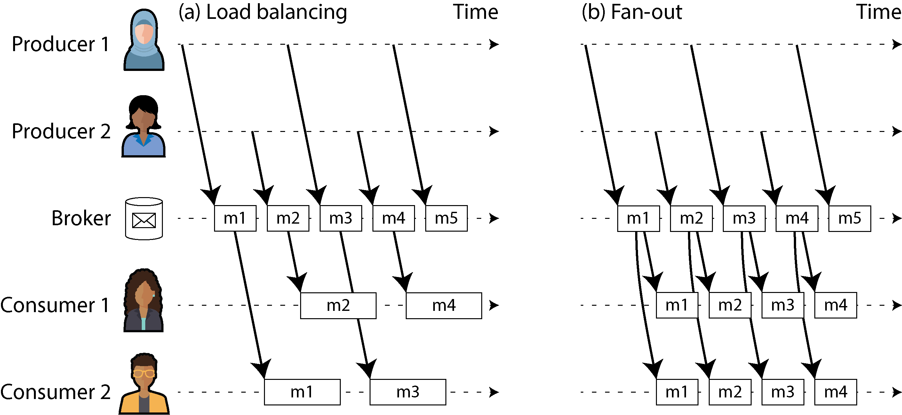
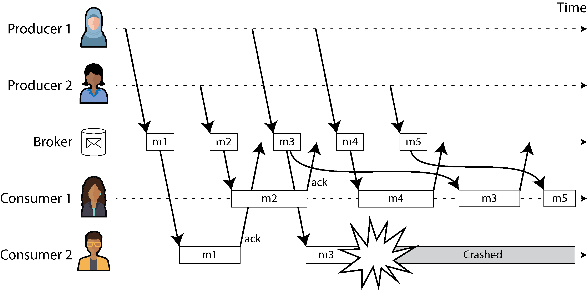

# Stream Processing

A complex system that works is invariably found to have evolved from a simple system that works. The inverse proposition also appears to be true: A complex system designed from scratch never works and cannot be made to work.
—John Gall, Systemantics (1975)

---

### Introduction: Bounded Aur Unbounded Data Ka Asli Farq

Chapter 11 mein hum ne **Batch Processing** par bohot tafseel se baat ki thi. Batch processing kya karti hai? Yeh pehle se maujood files ke ek poore set ko uthati hai (input), us par calculations chalati hai, aur files ka ek naya set tayaar karti hai (output). Yeh output ek tarah ka **Derived Data** (nikala hua data) hota hai, jise agar zaroorat paray toh batch process ko dobara chala kar naye siray se re-create kiya ja sakta hai. Hum ne dekha ke is asaan lekin takatwar soch se hum search indexes, recommendation systems, aur analytics jaisi barri barri cheezein bana sakte hain.

Lekin pooray Chapter 11 mein hum aik bohot barri shart (assumption) par chal rahe the: **Input hamesha Bounded (mehdood) hota hai.** Bounded ka matlab hai ke data ka size pehle se pata hota hai aur woh ek jagah ruka hua hota hai, is liye batch process ko saaf pata hota hai ke kab input khatam ho gaya hai aur kab kaam rokna hai.

* **Bacho ki Tarah Samajhein (MapReduce Aur Sorting Ka Masla):** Sochein aap ke paas bacho ke khilono ka ek dabba hai aur aap ne unhein unke size ke mutabaq chote se bade ki tarteeb (sort) mein rakhna hai. MapReduce mein jo sorting hoti hai, uski shart yeh hai ke usay **pehle poora dabba khali karke saare khilonay dekhne parenge**, uske baad hi woh pehla sab se chota khilone bahar nikal sakta hai. Kyun? Kyunke ho sakta hai jo khilona dabbe mein sab se aakhir mein para ho, wahi poore dabbe mein sab se chota ho! Agar aap ne poora input parhne se pehle hi output nikalna shuru kar diya, toh tarteeb galat ho jayegi. Is liye batch processing mein kaam beech mein shuru karne ka option nahi hota.

Lekin asli zindagi (reality) mein data aisy ruka hua nahi hota. Asli data **Unbounded (na-khatam hone wala)** hota hai, kyunke yeh waqt ke sath dheere dheere, thoda thoda karke aata hai. Aap ke users ne kal bhi data generate kiya, aaj bhi kar rahe hain, aur kal bhi karte rahenge. Jab tak aap ki company band nahi ho jati, yeh silsila kabhi khatam nahi hoga! Data ka dataset kabhi bhi poori tarah "complete" nahi hota.

Is liye, batch processors ko majbooran is na-khatam hone wale data ko artificially (zabardasti) chote chote jhatkay wale tukron mein baantna parta hai. Jaise:

* Pore din ka data ikhta karo aur har raat 12 bajay batch job chalao (Daily Batch).
* Ya har ghante ke aakhir mein batch job chalao (Hourly Batch).

---

### Batch Se Stream Processing Ki Taraf Safar

Rozana chalne wale batch processes ke sath sab se bara masla yeh hota hai ke agar input data mein abhi koi badlao (change) aaya hai, toh uska nateeja output report mein **ek din baad** nazar aayega. Aaj kal ke tez daur mein impatient (be-sabar) users ke liye itna lamba intezar karna bohot slow hai.

Is delay (deri) ko kam karne ke liye hum kya kar sakte hain?

1. Hum processing ki frequency barha sakte hain—jaise har ek second ke aakhir mein aik second ka data process karein.
2. Ya phir, hum waqt ke in artificial tukron (time slices) ko poori tarah chhor dein aur **jaise hi koi event (kaam) ho, usay foran ussi waqt process kar lein!**

Isi soch ko hum **Stream Processing** kehte hain.

Aam zuban mein **Stream** ka matlab hota hai aisa data jo waqt ke sath dheere dheere aur lagatar (incrementally) milta rehta hai. Yeh concept computer ki duniya mein bohot purana hai aur kayi jagah dikhta hai:

* Unix operating system mein `stdin` (standard input) aur `stdout` (standard output) mein pipes ke zariye data ka behna.
* Programming languages mein `lazy lists` (jo tabhi naya element banati hain jab manga jaye).
* Filesystem ke APIs (jaise Java ka `FileInputStream`).
* Internet par chalne wale `TCP connections`.
* Online dekhi jaane wali audio aur video (jaise YouTube ya Netflix par video stream hona, jahan poori video ek sath download nahi hoti balkay sath sath chalti rehti hai).

---

### Is Chapter Ka Roadmap

Is chapter mein hum **Event Streams** ko data management ke ek naye nizam (mechanism) ke tor par dekhenge. Yeh batch data ka hi ek aisa roop hai jo na-khatam hone wala (unbounded) hai aur lagatar process hota hai. Hamara safar in teen marhalon se guzray ga:

* Hum sab se pehle yeh parhenge ke streams ko computer mein kaise dikhaya (represent), save (store), aur network par ek jagah se doosri jagah bheja (transmit) jata hai.
* Phir hum explore karenge ke streams aur aam databases ka aapas mein kya gehra rishta hai.
* Aur aakhir mein, **"Processing Streams"** ke section mein hum un tareeqon aur tools ko deeply check karenge jin ke zariye in streams ko har waqt (continually) process kiya jata hai aur application ki building blocks tayaar ki jati hain.

---

## Transmitting Event Streams

Batch processing ki duniya mein hum ne dekha ke kisi bhi kaam (job) ka input aur output hamesha files hoti hain (jaise HDFS ya S3 par pari hui files). Toh phir streaming (lagatar chalne wale data) ki duniya mein iska badal (equivalent) kya hota hai?

Jab aap ka input ek file hoti hai (jo ke bytes ka ek lamba silsila hai), toh pehla kaam usay tod kar records mein parse karna hota hai. Stream processing ke nizam mein is record ko hum aam tor par **Event** kehte hain.

* **Bacho ki Tarah Samajhein:** Event ka matlab hai *"kuch hua"*. Yeh memory mein ek chota sa, self-contained, aur **Immutable** (na-badalne wala) object hota hai, jis mein is baat ki poori jankari hoti hai ke waqt ke makhsoos lamhay par kya waqia pesh aaya tha. Har event ke sath ek **Timestamp** (asli ghari ka waqt) lazmi jura hota hai jo batata hai ke yeh kab paida hua tha.

Misaal ke tor par, yeh event kisi user ka koi action ho sakta hai—jaise website par koi page dekhna (`page_view`) ya koi cheez khareedna (`purchase`). Yeh kisi machine se bhi aa sakta hai—jaise temperature sensor ka har second baad badalta hua data ya CPU utilization ka metric. Hum ne pichlay section mein NGINX log file ki jo aik line dekhi thi, streaming ki zuban mein us aik line ko hum ek **Event** kahain ge.

Aap is event ko text string, JSON, ya kisi binary format (Avro/Parquet) mein encode kar sakte hain. Is encoding ka faida yeh hota hai ke aap isay disk par save bhi kar sakte hain (jaise file ke aakhir mein jorrna ya database mein insert karna) aur internet network ke zariye kisi doosre computer par process hone ke liye bhej bhi sakte hain.

Batch processing mein ek file aik dafa likhi jati hai aur usay kayi alag alag jobs parh sakti hain. Streaming mein iske badal lafz use hote hain:

* **Producer:** Event generate (banae) wala computer (jisay Publisher ya Sender bhi kehte hain). An event is generated once.
* **Consumer:** Us event ko parhne aur process karne wala computer (jisay Subscriber ya Recipient kehte hain). An event can be processed by multiple consumers.
* **Topic / Stream:** Jaise filesystem mein ek folder ke andar milti julti files hoti hain, waise hi streaming system mein ek jaise events ko aprop mein mila kar ek **Topic** ya **Stream** ka naam de diya jata hai.

```text
[Producer / Publisher] ---(Generates Event)---> [Topic / Stream] ---(Pushes Event)---> [Consumers / Subscribers]

```

Aap soch rahe honge ke producer aur consumer ko aprop mein jorrne ke liye ek aam database ya file hi kaafi hai. Producer har event database mein write karta jaye, aur consumer thodi thodi dair baad (periodically) database se poochta jaye (**Polling** karta jaye) ke *"Bhai, mere pichlay chakkar ke baad koi naya data aaya?"*. Batch processing mein rozana raat ko yahi kaam hota hai.

Lekin jab hum low-latency (bina rukay foran kaam karne) ki taraf aate hain, toh baar baar polling karna database par bohot mehanga kharcha (**expensive overhead**) ban jata hai. Aap jitni jaldi jaldi database ka darwaza khatkhatayenge (poll karenge), utni hi zyada dafa aap ko khali haath (no new events) wapis aana parega, jis se server ka bojh barhega. Is se lakh darja behtar tareeqa yeh hai ke consumer chup karke baith jaye aur **jaise hi naya event aaye, system khud consumer ko notification bhej de (Push model).**

Purane relational databases is kism ke notification nizam ko achi tarah support nahi karte. Un mein `Triggers` toh hote hain jo row insert hone par reaction de sakein, lekin unki taqat bohot mehdood hoti hai aur unhein database design mein hamesha ek aakhri majboori ke tor par dekha gaya hai. Isi wajah se event notifications ko safely deliver karne ke liye makhsoos tools banaye gaye hain jinhein hum **Messaging Systems** kehte hain.

---

### Messaging Systems

Consumer ko naye events ke baare mein foran notification bhejna ka sab se aam tareeqa **Messaging System** ka istemaal hai. Is mein producer event ka ek message bana kar bhejta hai, aur system usay agay consumers ki taraf dharak se push (bhej) deta hai.

Agar hum bilkul simple sochein, toh aik Unix pipe ya do computers ke beech direct **TCP connection** bhi ek messaging system ban sakta hai. Lekin bade distributed messaging systems is basic model se bohot aage nikal chuke hain. Unix pipes aur TCP sirf **aik sender ko aik recipient** se jorrtay hain, jabke ek professional messaging system mein **bohot saare producers** aik hi topic par messages bhej sakte hain aur **bohot saare consumers** us aik topic se messages receive kar sakte hain.

Is **Publish/Subscribe (Pub/Sub)** model ke andar alag alag systems alag alag tareeqay apnaate hain. Un systems ke darmiyan farq aur unke architectural trade-offs ko samajhne ke liye do bunyadi sawaal poochna bohot zaroori hain:

#### Sawaal 1: Agar Producers ki raftar Consumers se zyada tez ho jaye toh kya hoga?

Agar data banane wale bohot tez hain aur agay parhne wala computer slow hai, toh queue barhne lagay gi. Is surah-e-haal mein messaging system ke paas teen (3) options hote hain:

1. **Drop Messages:** Naye aane wale messages ko kachray mein phenk do (ignore kar do).
2. **Buffer in a Queue:** Messages ko aik katari line (queue) mein save karte jao. (Yahan yeh dekhna hoga ke agar queue RAM se barh jaye toh kya system crash ho jayega ya data disk par likhega? Agar disk par likhega toh speed kitni slow hogi?)
3. **Apply Backpressure:** Data banane wale (producer) ka gala pakar lo aur usay mazeed messages bhejne se rok do (**Flow Control**). Unix pipes aur TCP isi backpressure ka use karte hain; jab unka chota buffer bhar jata hai, toh sender tab tak naya data nahi bhej sakta jab tak receiver buffer khali na kare.

#### Sawaal 2: Agar Computers (Nodes) crash ho jayein ya offline chale jayein, toh kya data zaya hoga?

Databases ki tarah, messages ko hamesha ke liye mehfooz rakhne (**Durability**) ke liye data ko disk par likhna ya doosre replicas par copy karna parta hai, jis ka apna ek performance cost (speed mein kami) hota hai. Agar aap ki application aisi hai jahan thoda bohot data zaya hona chalta hai, toh aap mehanga disk write chorr kar usay local RAM mein chala sakte hain, jis se throughput bohot high aur latency bohot low milegi.

* **Kab data loss chalta hai?** Sochein agar koi sensor har ek second baad temperature ka metric bhej raha hai. Agar beech mein network jhatkay se do-chaar readings drop bhi ho jayein, toh koi masla nahi kyunke aglay hi second naya nateeja aa jayega. Lekin agar aap dropped readings barri tadad mein hon toh metrics galat ho sakte hain.
* **Kab data loss bilkul nahi chalta?** Agar aap events ko ginn rahe hain (counters chala rahe hain, jaise transactions ya clicks), toh aik bhi message ka drop hona aap ke poore counter ke nateejay ko galat kar dega. Wahan $100\%$ delivery zaroori hai.

Chapter 11 wale batch processing systems ki sab se khoobsurat baat yeh thi ke un mein galti hone par task dobara chalta tha aur partial output delete ho jata tha, jise coding asaan ho jati thi. Streaming mein aisi paki reliability dena thoda complex hota hai, jisay hum agay breakdown karenge.

---

#### Direct messaging from producers to consumers

Bohot saare messaging systems beech mein kisi teesre central server (broker) ke bina, direct network ke zariye producers aur consumers ko aprop mein baat karwate hain:

* **UDP Multicast:** Yeh financial trading aur stock market ke live feeds mein bohot use hota hai, jahan aik aik microsecond ki ahmiyat hoti ہے aur low latency sab se zaroori hoti hai. Halanqe UDP protocol khud unreliable hai (data loss jhelta hai), lekin software layer par aise protocols banaye jaate hain jo lost packets ko producer se dobara mangwa lete hain.
* **Brokerless Messaging Libraries:** Jaise **ZeroMQ** aur **nanomsg**. Yeh libraries bina kisi alag central software ke direct TCP ya IP multicast ke upar pub/sub model implement kar deti hain.
* **Metrics Agents (StatsD):** `StatsD` network ke saare computers se metrics ikhta karne ke liye direct unreliable UDP messaging use karta hai. Iska matlab hai ke iske counters bilkul exact nahi hote balkay sirf ek andaza (**approximate metrics**) hote hain, kyunke network par packets drop ho sakte hain.
* **Webhooks:** Agar consumer network par ek open API expose kar raha ho, toh producer direct HTTP ya RPC request maar kar data consumer tak push kar deta hai. Isay webooks kehte hain, jahan aik event hone par doosri service ke callback URL par direct request chali jati hai.

**Inka Sab Se Bara Nuksan (Trade-off):**
In direct messaging systems mein application ke code ko khud pata hona chahiye ke data loss ho sakta hai. Yeh sirf bohot hi mehdood kism ke faults ko bardasht kar sakte hain. Inki sab se barri shart yeh hai ke **producer aur consumer dono ko har waqt online hona chahiye**. Agar consumer temporary offline chala gaya, toh us dauran aane wale saare messages hawa mein gayab ho jayenge! Agar producer retry karne ke liye data memory mein bacha kar rakhay aur isi dauran producer khud crash ho jaye, toh naye purane saare messages khatam!

---

#### Message brokers

Direct messaging ke is rona-dhona se bachne ka sab se popular tareeqa **Message Broker** (jisay Message Queue bhi kehte hain) ka istemaal hai. Yeh asal mein ek makhsoos kism ka database hi hota hai jo khass tor par message streams ko handle karne ke liye optimize kiya jata ہے۔

Yeh ek central server ke tor par chalta hai. Producers aur consumers iske sath as a client connect hote hain. Producers apna data broker ke paas likhte hain, aur broker zimmedari leta hai us data ko consumers tak safely pohnchane ki.

* **Faide:** Data central hone ki wajah se agar clients bar bar aayein, jayein, ya crash hon, system ko farq nahi parta. Durability ka saara bojh ab message broker par hota hai. Kuch brokers data sirf RAM mein rakhte hain, jabke baqi settings ke mutabaq data disk par likhte hain taake server crash hone par bhi data mehfooz rahay.
* **Asynchronous Nature:** Agar consumer slow chal raha ho, toh brokers unbounded queueing (lambi line lagane) ki ijazat dete hain. Jab producer message bhejta hai, woh consumer ke kaam khatam karne ka wait nahi karta; woh bas broker se "OK" (buffered message confirmation) leta hai aur agay nikal jata hai. Consumer tak data fractions of a second mein pohnchta hai, aur agar piche queue ka backlog ho toh thoda dair se bhi pohnch sakta hai.

---

#### Message brokers compared to databases

Bohot saare message brokers distributed transactions ke XA ya JTA protocols mein bhi hissa le sakte hain, jo unhein databases ke kafi kareeb le aata hai. Lekin iske bawajood, message brokers aur databases mein bohot baray practical farq hain, jinhein is table ke zariye asani se samjha ja sakta hai:

| Khasiyat (Feature) | Aam Database (Databases) | Message Broker (Message Brokers) |
| --- | --- | --- |
| **Data Kab Tak Rehta Hai?** | Data hamesha ke liye paka save rehta hai, jab tak aap khud ja kar query se delete na karein. Long-term storage ke liye king hai. | Jaise hi message consumer tak safely deliver hota hai, broker usay **foran delete** kar deta hai. Yeh lambay waqt ke liye data storage ke liye nahi bana. |
| **Queue Size / Large Data** | Yeh Terabytes aur Petabytes data asani se hazam kar sakta hai, data barhne se crash nahi hota. | Yeh maanta hai ke queue hamesha choti (small working set) rahegi. Agar consumers slow hon aur line bohot lambi ho jaye (data disk par spill hone lage), toh system slow ho jata hai. |
| **Query Aur Searching** | Advanced query languages aur **Secondary Indexes** support karta hai, jahan aap poore data mein se kuch bhi search kar sakte hain. | Kisi complex query ko support nahi karta. Is mein bas clients makhsoos patterns match karke kisi **Topic** ko subscribe kar lete hain. |
| **Data Badalna Aur Notifications** | Jab aap query chalate hain, toh us microsecond ka **Snapshot** milta hai. Agar baad mein data badal jaye, toh aap ko khud dobara query chalani parti hai (No auto notification). | Data bhejney ke baad us mein radd-o-badal (update) mana hai. Lekin iska sab se bara faida yeh hai ke jaise hi naya data aata hai, yeh **clients ko khud notify (push) karta hai**. |

Traditional message brokers ke is design ke asool **JMS** (Java Message Service) aur **AMQP** (Advanced Message Queuing Protocol) ke standards mein likhe gaye hain. Inki zinda aur mashhoor misalein **RabbitMQ, ActiveMQ, HornetQ, IBM MQ, Azure Service Bus, aur Google Cloud Pub/Sub** hain. (Halanqe aam databases ko bhi as a queue use kiya ja sakta hai, lekin un se fast performance nikalna bohot mushkil kaam hai).

---

#### Multiple consumers

Log jab aik hi topic se data parhne ke liye aik se zyada consumers lagate hain, toh messaging ki duniya mein do (2) baray patterns use hote hain, jaisa ke **Figure 12-1** mein dikhaya gaya hai:

##### Figure 12-1 Ka Step-by-Step Breakdown

<div align="center">
  
</div>

* **(a) Load balancing:**
Is pattern ka maqsad kaam ko aprop mein baantna (share karna) hai. Sochein topic ke andar aane wale messages ko process karna bohot heavy aur mehanga kaam hai (jaise video convert karna). Aap aik akela consumer lagayenge toh woh thak jayega. Is liye aap do consumers lagate hain. Figure 12-1 (a) ke mutabaq, Producer 1 aur 2 messages ($m_1$ se $m_5$) Broker ko bhejte hain. Broker har message ko **kisi aik** consumer ke paas bhejta hai:
* Consumer 1 ko milay: $m_2$ aur $m_4$.
* Consumer 2 ko milay: $m_1$ aur $m_3$.
* *Nateeja:* Dono ne mil kar kaam aadha aadha baant liya aur koi bhi message do dafa process nahi hua. (AMQP mein isay multiple clients on same queue kehte hain, JMS mein isay *Shared Subscription* kehte hain).


* **(b) Fan-out:**
Is pattern ka maqsad aik hi data ko alag alag kaamo ke liye use karna hai. Figure 12-1 (b) mein jab broker ke paas messages ($m_1$ se $m_5$) aate hain, toh woh unki copies bana kar **saare active consumers** ko deliver karta hai:
* Consumer 1 ko bhi saare milay: $m_1, m_2, m_3, m_4$.
* Consumer 2 ko bhi saare milay: $m_1, m_2, m_3, m_4$.
* *Nateeja:* Yeh bilkul batch processing jaisa hai jahan do alag teams aik hi input file ko parh kar apna alag alag analysis kar rahi hon (JMS mein isay *Topic Subscription* aur AMQP mein isay *Exchange Bindings* kehte hain).


> **Dono Ko Milana (The Hybrid Solution):** Aap in dono tareeqon ko aprop mein jorr bhi sakte hain, jaise Apache Kafka ke **Consumer Groups** ka feature karta hai. Agar do alag consumer groups aik topic subscribe karein, toh data dono groups tak jayega (Fan-out), lekin har group ke andar maujood computers aprop mein us data ka bojh baant lenge (Load balancing).

---

#### Acknowledgments and redelivery

Consumers ka kya hai, woh chalte chalte kisi bhi waqt crash ho sakte hain. Sochein broker ne Consumer 2 ko ek message deliver kiya, lekin Consumer 2 us par poora kaam karne se pehle hi achanak crash ho gaya. Agar broker queue se message pehle hi delete kar chuka hoga, toh data hamesha ke liye zaya ho jayega!

Is maut se bachne ke liye message brokers **Acknowledgments (ACKs)** ka use karte hain:

* Jab consumer apna kaam poora kar leta hai, toh woh broker ko aik khush-khabri bhejta hai (**ACK** bhejta hai) ke *"Bhai, kaam ho gaya, ab line se data hta do"*.
* If the connection closes or times out without an ACK, the broker assumes the consumer died. Woh us message ko uthata hai aur **dobara kisi doosre zinda consumer ko deliver (Redelivery) kar deta hai**.
*(Choti bariki: Agar kaam ho gaya tha par network jhatkay se ACK raste mein kho gaya, toh redelivery se duplicate data chala jata hai. Is se bachne ke liye operation ka Idempotent hona zaroori hai, warna atomic commit protocol chahiye).*

Lekin jab hum **Load Balancing** aur **Redelivery** ko aprop mein milate hain, toh iska message ke order (tarteeb) par ek bohot hi ajeeb aur khatarnak asar parta hai, jise **Figure 12-2** mein detail se samjhaya gaya hai.

---

##### Figure 12-2 Ka Breakdown: Order Ka Qatal (The Redelivery Ordering Issue)

**Step-by-Step Flow Analysis:**

<div align="center">
  
</div>

1. **Mappers / Producers:** Producer line se messages bhej raha hai. Broker ke paas queue mein messages $m_1, m_2, m_3, m_4, m_5$ tarteeb se lage hain.
2. **Load Balancing Delivery:** Broker load balancing lagate hue Consumer 2 ko message **$m_3$** bhejta hai, aur bilkul ussi waqt Consumer 1 ko message **$m_4$** bhej deta hai.
3. **The Crash Incident (Hadsa):** Consumer 1 apna kaam fast khatam karke $m_4$ ka **ACK** kamyabi se broker ko bhej deta hai. Lekin afsos, message **$m_3$** par process karte waqt **Consumer 2 achanak crashed (tabah)** ho jata hai! Broker tak $m_3$ ka ACK nahi pohanch pata.
4. **The Redelivery (Dobara bhejna):** Broker dekhta hai ke Consumer 2 mar chuka hai aur $m_3$ latak raha hai. Broker us unacknowledged message $m_3$ ko uthata hai aur ab zinda bache hue **Consumer 1** ki taraf bhej deta hai.
5. **Final Execution Flow (The Problem):** Consumer 1 ne sab se pehle kis ko chalaya? **$m_4$** ko. Uske baad uske paas naye siray se kaun aaya? **$m_3$**. Aur uske baad kaun aayega? **$m_5$**.

**Nateeja:**
Consumer 1 ke chalne ka order ban gaya: **`m4 -> m3 -> m5`**. Halanqe producer ne kis order mein bheja tha? `m3 -> m4 -> m5`. Sorting ka poora nizam yahan tabah ho gaya!

Agar messages aik doosre se bilkul azaad hain (no connection), toh order badalne se koi farq nahi parta. Lekin distributed systems mein agar messages ke beech causality (wajah aur asar, jaise account mein pehle paise dalna phir nikalna) ho, toh order ka ulta hona poore system ko pagal kar deta hai. Is se bachne ke liye log load balancing chorr kar har consumer ke liye alag se azaad queue banate hain taake order mehfooz rahay.

---

#### Poison Messages Aur Dead Letter Queues (DLQ)

Redelivery ki wajah se kabhi kabhi system mein aik aisi maut ka kuan (**infinite loop**) ban jata hai jo poore stream ko jam kar deta hai. Sochein producer ne galti se aik aisa kharab message bhej diya jis ke JSON object mein koi zaroori key likhna woh bhool gaya tha (Poison Pill / Zehriala message).

1. Broker ne yeh message Consumer 1 ko bheja.
2. Consumer 1 ne code chalaya, key missing hone ki wajah se code mein exception aayi aur **Consumer 1 crash ho kar restart ho gaya**.
3. Chunke crash hua, toh broker tak **ACK nahi pohancha**.
4. Broker ne socha bacha mar gaya hai, us ne wahi zehriala message utha kar **Consumer 2** ko bhej diya.
5. Consumer 2 bhi usay parh kar crash ho gaya!

Yeh chakkar hamesha chalta rahega. Agar broker strict ordering ki guarantee deta hai, toh poori pipeline yahin block ho jayegi aur agay koi naya message process nahi ho sakay ga.

Is maut ke kue se nikalne ke liye distributed designs mein **Dead Letter Queue (DLQ)** ka concept use kiya jata hai:

* Jab broker dekhta hai ke ek message baar baar fail ho raha hai aur uske retry ki hadd (threshold) khatam ho gayi hai, toh broker us kharab message ko main queue se nikal kar aik alag khufia kachra-dan queue mein dal deta hai, jisay **Dead Letter Queue** kehte hain.
* Is se main queue ka rasta saaf (**unblock**) ho jata hai aur baqi ke sahi messages aage barhna shuru ho jaate hain.

Data engineers DLQ ke upar alerts aur monitoring laga kar rakhte hain (kyunke DLQ mein aik bhi message aane ka matlab hai ke code ya data mein koi galti hai). Jab alert bajta hai, toh operator manually aa kar check karta hai ke is message mein kya kharabi thi. Woh ya toh usay hamesha ke liye delete kar deta hai, ya code ka bug fix karke usay main stream mein dobara inject (reproduce) kar deta hai. RabbitMQ ke sath sath ab log-based frameworks jaise **Apache Pulsar** aur stream processing tools jaise **Kafka Streams** bhi built-in DLQ support karte hain.

---
