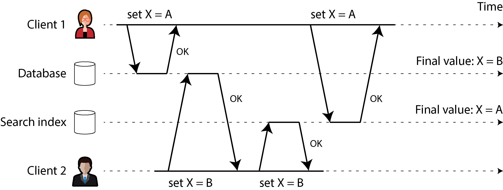
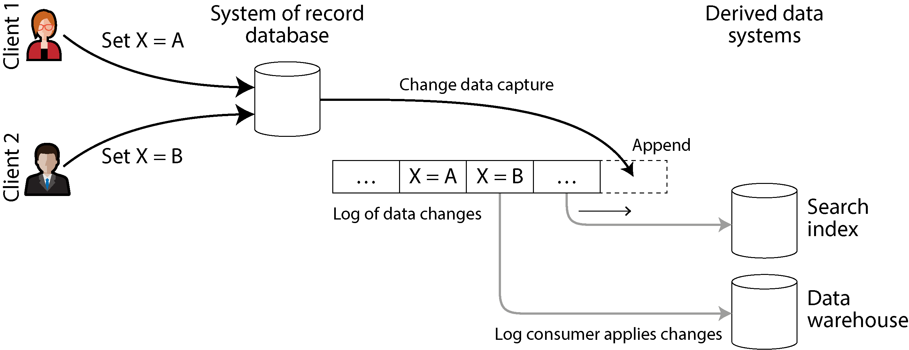
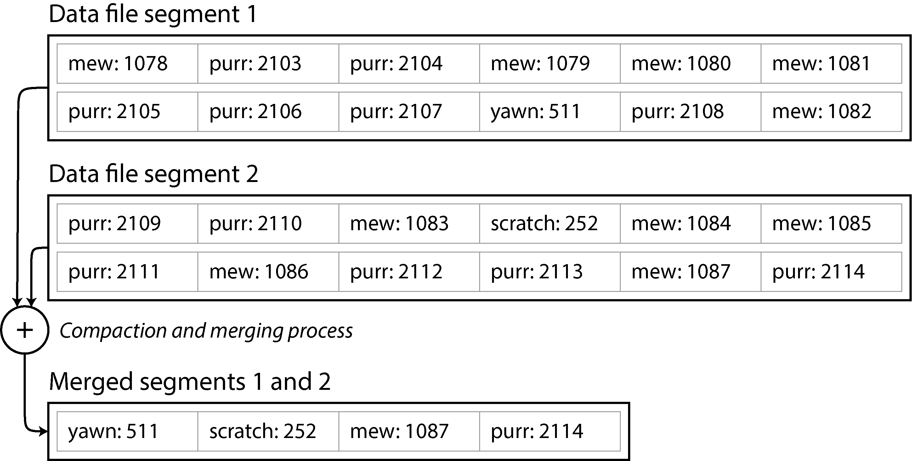
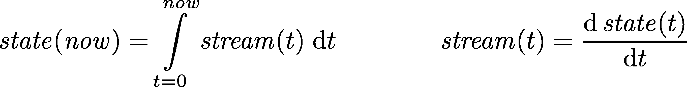

# Stream Processing

A complex system that works is invariably found to have evolved from a simple system that works. The inverse proposition also appears to be true: A complex system designed from scratch never works and cannot be made to work.
—John Gall, Systemantics (1975)

---

### Introduction: Bounded Aur Unbounded Data Ka Asli Farq

Chapter 11 mein hum ne **Batch Processing** par bohot tafseel se baat ki thi. Batch processing kya karti hai? Yeh pehle se maujood files ke ek poore set ko uthati hai (input), us par calculations chalati hai, aur files ka ek naya set tayaar karti hai (output). Yeh output ek tarah ka **Derived Data** (nikala hua data) hota hai, jise agar zaroorat paray toh batch process ko dobara chala kar naye siray se re-create kiya ja sakta hai. Hum ne dekha ke is asaan lekin takatwar soch se hum search indexes, recommendation systems, aur analytics jaisi barri barri cheezein bana sakte hain.

Lekin pooray Chapter 11 mein hum aik bohot barri shart (assumption) par chal rahe the: **Input hamesha Bounded (mehdood) hota hai.** Bounded ka matlab hai ke data ka size pehle se pata hota hai aur woh ek jagah ruka hua hota hai, is liye batch process ko saaf pata hota hai ke kab input khatam ho gaya hai aur kab kaam rokna hai.

* **Bacho ki Tarah Samajhein (MapReduce Aur Sorting Ka Masla):** Sochein aap ke paas bacho ke khilono ka ek dabba hai aur aap ne unhein unke size ke mutabaq chote se bade ki tarteeb (sort) mein rakhna hai. MapReduce mein jo sorting hoti hai, uski shart yeh hai ke usay **pehle poora dabba khali karke saare khilonay dekhne parenge**, uske baad hi woh pehla sab se chota khilone bahar nikal sakta hai. Kyun? Kyunke ho sakta hai jo khilona dabbe mein sab se aakhir mein para ho, wahi poore dabbe mein sab se chota ho! Agar aap ne poora input parhne se pehle hi output nikalna shuru kar diya, toh tarteeb galat ho jayegi. Is liye batch processing mein kaam beech mein shuru karne ka option nahi hota.

Lekin asli zindagi (reality) mein data aisy ruka hua nahi hota. Asli data **Unbounded (na-khatam hone wala)** hota hai, kyunke yeh waqt ke sath dheere dheere, thoda thoda karke aata hai. Aap ke users ne kal bhi data generate kiya, aaj bhi kar rahe hain, aur kal bhi karte rahenge. Jab tak aap ki company band nahi ho jati, yeh silsila kabhi khatam nahi hoga! Data ka dataset kabhi bhi poori tarah "complete" nahi hota.

Is liye, batch processors ko majbooran is na-khatam hone wale data ko artificially (zabardasti) chote chote jhatkay wale tukron mein baantna parta hai. Jaise:

* Pore din ka data ikhta karo aur har raat 12 bajay batch job chalao (Daily Batch).
* Ya har ghante ke aakhir mein batch job chalao (Hourly Batch).

---

### Batch Se Stream Processing Ki Taraf Safar

Rozana chalne wale batch processes ke sath sab se bara masla yeh hota hai ke agar input data mein abhi koi badlao (change) aaya hai, toh uska nateeja output report mein **ek din baad** nazar aayega. Aaj kal ke tez daur mein impatient (be-sabar) users ke liye itna lamba intezar karna bohot slow hai.

Is delay (deri) ko kam karne ke liye hum kya kar sakte hain?

1. Hum processing ki frequency barha sakte hain—jaise har ek second ke aakhir mein aik second ka data process karein.
2. Ya phir, hum waqt ke in artificial tukron (time slices) ko poori tarah chhor dein aur **jaise hi koi event (kaam) ho, usay foran ussi waqt process kar lein!**

Isi soch ko hum **Stream Processing** kehte hain.

Aam zuban mein **Stream** ka matlab hota hai aisa data jo waqt ke sath dheere dheere aur lagatar (incrementally) milta rehta hai. Yeh concept computer ki duniya mein bohot purana hai aur kayi jagah dikhta hai:

* Unix operating system mein `stdin` (standard input) aur `stdout` (standard output) mein pipes ke zariye data ka behna.
* Programming languages mein `lazy lists` (jo tabhi naya element banati hain jab manga jaye).
* Filesystem ke APIs (jaise Java ka `FileInputStream`).
* Internet par chalne wale `TCP connections`.
* Online dekhi jaane wali audio aur video (jaise YouTube ya Netflix par video stream hona, jahan poori video ek sath download nahi hoti balkay sath sath chalti rehti hai).

---

### Is Chapter Ka Roadmap

Is chapter mein hum **Event Streams** ko data management ke ek naye nizam (mechanism) ke tor par dekhenge. Yeh batch data ka hi ek aisa roop hai jo na-khatam hone wala (unbounded) hai aur lagatar process hota hai. Hamara safar in teen marhalon se guzray ga:

* Hum sab se pehle yeh parhenge ke streams ko computer mein kaise dikhaya (represent), save (store), aur network par ek jagah se doosri jagah bheja (transmit) jata hai.
* Phir hum explore karenge ke streams aur aam databases ka aapas mein kya gehra rishta hai.
* Aur aakhir mein, **"Processing Streams"** ke section mein hum un tareeqon aur tools ko deeply check karenge jin ke zariye in streams ko har waqt (continually) process kiya jata hai aur application ki building blocks tayaar ki jati hain.

---

## Transmitting Event Streams

Batch processing ki duniya mein hum ne dekha ke kisi bhi kaam (job) ka input aur output hamesha files hoti hain (jaise HDFS ya S3 par pari hui files). Toh phir streaming (lagatar chalne wale data) ki duniya mein iska badal (equivalent) kya hota hai?

Jab aap ka input ek file hoti hai (jo ke bytes ka ek lamba silsila hai), toh pehla kaam usay tod kar records mein parse karna hota hai. Stream processing ke nizam mein is record ko hum aam tor par **Event** kehte hain.

* **Bacho ki Tarah Samajhein:** Event ka matlab hai *"kuch hua"*. Yeh memory mein ek chota sa, self-contained, aur **Immutable** (na-badalne wala) object hota hai, jis mein is baat ki poori jankari hoti hai ke waqt ke makhsoos lamhay par kya waqia pesh aaya tha. Har event ke sath ek **Timestamp** (asli ghari ka waqt) lazmi jura hota hai jo batata hai ke yeh kab paida hua tha.

Misaal ke tor par, yeh event kisi user ka koi action ho sakta hai—jaise website par koi page dekhna (`page_view`) ya koi cheez khareedna (`purchase`). Yeh kisi machine se bhi aa sakta hai—jaise temperature sensor ka har second baad badalta hua data ya CPU utilization ka metric. Hum ne pichlay section mein NGINX log file ki jo aik line dekhi thi, streaming ki zuban mein us aik line ko hum ek **Event** kahain ge.

Aap is event ko text string, JSON, ya kisi binary format (Avro/Parquet) mein encode kar sakte hain. Is encoding ka faida yeh hota hai ke aap isay disk par save bhi kar sakte hain (jaise file ke aakhir mein jorrna ya database mein insert karna) aur internet network ke zariye kisi doosre computer par process hone ke liye bhej bhi sakte hain.

Batch processing mein ek file aik dafa likhi jati hai aur usay kayi alag alag jobs parh sakti hain. Streaming mein iske badal lafz use hote hain:

* **Producer:** Event generate (banae) wala computer (jisay Publisher ya Sender bhi kehte hain). An event is generated once.
* **Consumer:** Us event ko parhne aur process karne wala computer (jisay Subscriber ya Recipient kehte hain). An event can be processed by multiple consumers.
* **Topic / Stream:** Jaise filesystem mein ek folder ke andar milti julti files hoti hain, waise hi streaming system mein ek jaise events ko aprop mein mila kar ek **Topic** ya **Stream** ka naam de diya jata hai.

```text
[Producer / Publisher] ---(Generates Event)---> [Topic / Stream] ---(Pushes Event)---> [Consumers / Subscribers]

```

Aap soch rahe honge ke producer aur consumer ko aprop mein jorrne ke liye ek aam database ya file hi kaafi hai. Producer har event database mein write karta jaye, aur consumer thodi thodi dair baad (periodically) database se poochta jaye (**Polling** karta jaye) ke *"Bhai, mere pichlay chakkar ke baad koi naya data aaya?"*. Batch processing mein rozana raat ko yahi kaam hota hai.

Lekin jab hum low-latency (bina rukay foran kaam karne) ki taraf aate hain, toh baar baar polling karna database par bohot mehanga kharcha (**expensive overhead**) ban jata hai. Aap jitni jaldi jaldi database ka darwaza khatkhatayenge (poll karenge), utni hi zyada dafa aap ko khali haath (no new events) wapis aana parega, jis se server ka bojh barhega. Is se lakh darja behtar tareeqa yeh hai ke consumer chup karke baith jaye aur **jaise hi naya event aaye, system khud consumer ko notification bhej de (Push model).**

Purane relational databases is kism ke notification nizam ko achi tarah support nahi karte. Un mein `Triggers` toh hote hain jo row insert hone par reaction de sakein, lekin unki taqat bohot mehdood hoti hai aur unhein database design mein hamesha ek aakhri majboori ke tor par dekha gaya hai. Isi wajah se event notifications ko safely deliver karne ke liye makhsoos tools banaye gaye hain jinhein hum **Messaging Systems** kehte hain.

---

### Messaging Systems

Consumer ko naye events ke baare mein foran notification bhejna ka sab se aam tareeqa **Messaging System** ka istemaal hai. Is mein producer event ka ek message bana kar bhejta hai, aur system usay agay consumers ki taraf dharak se push (bhej) deta hai.

Agar hum bilkul simple sochein, toh aik Unix pipe ya do computers ke beech direct **TCP connection** bhi ek messaging system ban sakta hai. Lekin bade distributed messaging systems is basic model se bohot aage nikal chuke hain. Unix pipes aur TCP sirf **aik sender ko aik recipient** se jorrtay hain, jabke ek professional messaging system mein **bohot saare producers** aik hi topic par messages bhej sakte hain aur **bohot saare consumers** us aik topic se messages receive kar sakte hain.

Is **Publish/Subscribe (Pub/Sub)** model ke andar alag alag systems alag alag tareeqay apnaate hain. Un systems ke darmiyan farq aur unke architectural trade-offs ko samajhne ke liye do bunyadi sawaal poochna bohot zaroori hain:

#### Sawaal 1: Agar Producers ki raftar Consumers se zyada tez ho jaye toh kya hoga?

Agar data banane wale bohot tez hain aur agay parhne wala computer slow hai, toh queue barhne lagay gi. Is surah-e-haal mein messaging system ke paas teen (3) options hote hain:

1. **Drop Messages:** Naye aane wale messages ko kachray mein phenk do (ignore kar do).
2. **Buffer in a Queue:** Messages ko aik katari line (queue) mein save karte jao. (Yahan yeh dekhna hoga ke agar queue RAM se barh jaye toh kya system crash ho jayega ya data disk par likhega? Agar disk par likhega toh speed kitni slow hogi?)
3. **Apply Backpressure:** Data banane wale (producer) ka gala pakar lo aur usay mazeed messages bhejne se rok do (**Flow Control**). Unix pipes aur TCP isi backpressure ka use karte hain; jab unka chota buffer bhar jata hai, toh sender tab tak naya data nahi bhej sakta jab tak receiver buffer khali na kare.

#### Sawaal 2: Agar Computers (Nodes) crash ho jayein ya offline chale jayein, toh kya data zaya hoga?

Databases ki tarah, messages ko hamesha ke liye mehfooz rakhne (**Durability**) ke liye data ko disk par likhna ya doosre replicas par copy karna parta hai, jis ka apna ek performance cost (speed mein kami) hota hai. Agar aap ki application aisi hai jahan thoda bohot data zaya hona chalta hai, toh aap mehanga disk write chorr kar usay local RAM mein chala sakte hain, jis se throughput bohot high aur latency bohot low milegi.

* **Kab data loss chalta hai?** Sochein agar koi sensor har ek second baad temperature ka metric bhej raha hai. Agar beech mein network jhatkay se do-chaar readings drop bhi ho jayein, toh koi masla nahi kyunke aglay hi second naya nateeja aa jayega. Lekin agar aap dropped readings barri tadad mein hon toh metrics galat ho sakte hain.
* **Kab data loss bilkul nahi chalta?** Agar aap events ko ginn rahe hain (counters chala rahe hain, jaise transactions ya clicks), toh aik bhi message ka drop hona aap ke poore counter ke nateejay ko galat kar dega. Wahan $100\%$ delivery zaroori hai.

Chapter 11 wale batch processing systems ki sab se khoobsurat baat yeh thi ke un mein galti hone par task dobara chalta tha aur partial output delete ho jata tha, jise coding asaan ho jati thi. Streaming mein aisi paki reliability dena thoda complex hota hai, jisay hum agay breakdown karenge.

---

#### Direct messaging from producers to consumers

Bohot saare messaging systems beech mein kisi teesre central server (broker) ke bina, direct network ke zariye producers aur consumers ko aprop mein baat karwate hain:

* **UDP Multicast:** Yeh financial trading aur stock market ke live feeds mein bohot use hota hai, jahan aik aik microsecond ki ahmiyat hoti ہے aur low latency sab se zaroori hoti hai. Halanqe UDP protocol khud unreliable hai (data loss jhelta hai), lekin software layer par aise protocols banaye jaate hain jo lost packets ko producer se dobara mangwa lete hain.
* **Brokerless Messaging Libraries:** Jaise **ZeroMQ** aur **nanomsg**. Yeh libraries bina kisi alag central software ke direct TCP ya IP multicast ke upar pub/sub model implement kar deti hain.
* **Metrics Agents (StatsD):** `StatsD` network ke saare computers se metrics ikhta karne ke liye direct unreliable UDP messaging use karta hai. Iska matlab hai ke iske counters bilkul exact nahi hote balkay sirf ek andaza (**approximate metrics**) hote hain, kyunke network par packets drop ho sakte hain.
* **Webhooks:** Agar consumer network par ek open API expose kar raha ho, toh producer direct HTTP ya RPC request maar kar data consumer tak push kar deta hai. Isay webooks kehte hain, jahan aik event hone par doosri service ke callback URL par direct request chali jati hai.

**Inka Sab Se Bara Nuksan (Trade-off):**
In direct messaging systems mein application ke code ko khud pata hona chahiye ke data loss ho sakta hai. Yeh sirf bohot hi mehdood kism ke faults ko bardasht kar sakte hain. Inki sab se barri shart yeh hai ke **producer aur consumer dono ko har waqt online hona chahiye**. Agar consumer temporary offline chala gaya, toh us dauran aane wale saare messages hawa mein gayab ho jayenge! Agar producer retry karne ke liye data memory mein bacha kar rakhay aur isi dauran producer khud crash ho jaye, toh naye purane saare messages khatam!

---

#### Message brokers

Direct messaging ke is rona-dhona se bachne ka sab se popular tareeqa **Message Broker** (jisay Message Queue bhi kehte hain) ka istemaal hai. Yeh asal mein ek makhsoos kism ka database hi hota hai jo khass tor par message streams ko handle karne ke liye optimize kiya jata ہے۔

Yeh ek central server ke tor par chalta hai. Producers aur consumers iske sath as a client connect hote hain. Producers apna data broker ke paas likhte hain, aur broker zimmedari leta hai us data ko consumers tak safely pohnchane ki.

* **Faide:** Data central hone ki wajah se agar clients bar bar aayein, jayein, ya crash hon, system ko farq nahi parta. Durability ka saara bojh ab message broker par hota hai. Kuch brokers data sirf RAM mein rakhte hain, jabke baqi settings ke mutabaq data disk par likhte hain taake server crash hone par bhi data mehfooz rahay.
* **Asynchronous Nature:** Agar consumer slow chal raha ho, toh brokers unbounded queueing (lambi line lagane) ki ijazat dete hain. Jab producer message bhejta hai, woh consumer ke kaam khatam karne ka wait nahi karta; woh bas broker se "OK" (buffered message confirmation) leta hai aur agay nikal jata hai. Consumer tak data fractions of a second mein pohnchta hai, aur agar piche queue ka backlog ho toh thoda dair se bhi pohnch sakta hai.

---

#### Message brokers compared to databases

Bohot saare message brokers distributed transactions ke XA ya JTA protocols mein bhi hissa le sakte hain, jo unhein databases ke kafi kareeb le aata hai. Lekin iske bawajood, message brokers aur databases mein bohot baray practical farq hain, jinhein is table ke zariye asani se samjha ja sakta hai:

| Khasiyat (Feature) | Aam Database (Databases) | Message Broker (Message Brokers) |
| --- | --- | --- |
| **Data Kab Tak Rehta Hai?** | Data hamesha ke liye paka save rehta hai, jab tak aap khud ja kar query se delete na karein. Long-term storage ke liye king hai. | Jaise hi message consumer tak safely deliver hota hai, broker usay **foran delete** kar deta hai. Yeh lambay waqt ke liye data storage ke liye nahi bana. |
| **Queue Size / Large Data** | Yeh Terabytes aur Petabytes data asani se hazam kar sakta hai, data barhne se crash nahi hota. | Yeh maanta hai ke queue hamesha choti (small working set) rahegi. Agar consumers slow hon aur line bohot lambi ho jaye (data disk par spill hone lage), toh system slow ho jata hai. |
| **Query Aur Searching** | Advanced query languages aur **Secondary Indexes** support karta hai, jahan aap poore data mein se kuch bhi search kar sakte hain. | Kisi complex query ko support nahi karta. Is mein bas clients makhsoos patterns match karke kisi **Topic** ko subscribe kar lete hain. |
| **Data Badalna Aur Notifications** | Jab aap query chalate hain, toh us microsecond ka **Snapshot** milta hai. Agar baad mein data badal jaye, toh aap ko khud dobara query chalani parti hai (No auto notification). | Data bhejney ke baad us mein radd-o-badal (update) mana hai. Lekin iska sab se bara faida yeh hai ke jaise hi naya data aata hai, yeh **clients ko khud notify (push) karta hai**. |

Traditional message brokers ke is design ke asool **JMS** (Java Message Service) aur **AMQP** (Advanced Message Queuing Protocol) ke standards mein likhe gaye hain. Inki zinda aur mashhoor misalein **RabbitMQ, ActiveMQ, HornetQ, IBM MQ, Azure Service Bus, aur Google Cloud Pub/Sub** hain. (Halanqe aam databases ko bhi as a queue use kiya ja sakta hai, lekin un se fast performance nikalna bohot mushkil kaam hai).

---

#### Multiple consumers

Log jab aik hi topic se data parhne ke liye aik se zyada consumers lagate hain, toh messaging ki duniya mein do (2) baray patterns use hote hain, jaisa ke **Figure 12-1** mein dikhaya gaya hai:

##### Figure 12-1 Ka Step-by-Step Breakdown

<div align="center">
  
</div>

* **(a) Load balancing:**
Is pattern ka maqsad kaam ko aprop mein baantna (share karna) hai. Sochein topic ke andar aane wale messages ko process karna bohot heavy aur mehanga kaam hai (jaise video convert karna). Aap aik akela consumer lagayenge toh woh thak jayega. Is liye aap do consumers lagate hain. Figure 12-1 (a) ke mutabaq, Producer 1 aur 2 messages ($m_1$ se $m_5$) Broker ko bhejte hain. Broker har message ko **kisi aik** consumer ke paas bhejta hai:
* Consumer 1 ko milay: $m_2$ aur $m_4$.
* Consumer 2 ko milay: $m_1$ aur $m_3$.
* *Nateeja:* Dono ne mil kar kaam aadha aadha baant liya aur koi bhi message do dafa process nahi hua. (AMQP mein isay multiple clients on same queue kehte hain, JMS mein isay *Shared Subscription* kehte hain).


* **(b) Fan-out:**
Is pattern ka maqsad aik hi data ko alag alag kaamo ke liye use karna hai. Figure 12-1 (b) mein jab broker ke paas messages ($m_1$ se $m_5$) aate hain, toh woh unki copies bana kar **saare active consumers** ko deliver karta hai:
* Consumer 1 ko bhi saare milay: $m_1, m_2, m_3, m_4$.
* Consumer 2 ko bhi saare milay: $m_1, m_2, m_3, m_4$.
* *Nateeja:* Yeh bilkul batch processing jaisa hai jahan do alag teams aik hi input file ko parh kar apna alag alag analysis kar rahi hon (JMS mein isay *Topic Subscription* aur AMQP mein isay *Exchange Bindings* kehte hain).


> **Dono Ko Milana (The Hybrid Solution):** Aap in dono tareeqon ko aprop mein jorr bhi sakte hain, jaise Apache Kafka ke **Consumer Groups** ka feature karta hai. Agar do alag consumer groups aik topic subscribe karein, toh data dono groups tak jayega (Fan-out), lekin har group ke andar maujood computers aprop mein us data ka bojh baant lenge (Load balancing).

---

#### Acknowledgments and redelivery

Consumers ka kya hai, woh chalte chalte kisi bhi waqt crash ho sakte hain. Sochein broker ne Consumer 2 ko ek message deliver kiya, lekin Consumer 2 us par poora kaam karne se pehle hi achanak crash ho gaya. Agar broker queue se message pehle hi delete kar chuka hoga, toh data hamesha ke liye zaya ho jayega!

Is maut se bachne ke liye message brokers **Acknowledgments (ACKs)** ka use karte hain:

* Jab consumer apna kaam poora kar leta hai, toh woh broker ko aik khush-khabri bhejta hai (**ACK** bhejta hai) ke *"Bhai, kaam ho gaya, ab line se data hta do"*.
* If the connection closes or times out without an ACK, the broker assumes the consumer died. Woh us message ko uthata hai aur **dobara kisi doosre zinda consumer ko deliver (Redelivery) kar deta hai**.
*(Choti bariki: Agar kaam ho gaya tha par network jhatkay se ACK raste mein kho gaya, toh redelivery se duplicate data chala jata hai. Is se bachne ke liye operation ka Idempotent hona zaroori hai, warna atomic commit protocol chahiye).*

Lekin jab hum **Load Balancing** aur **Redelivery** ko aprop mein milate hain, toh iska message ke order (tarteeb) par ek bohot hi ajeeb aur khatarnak asar parta hai, jise **Figure 12-2** mein detail se samjhaya gaya hai.

---

##### Figure 12-2 Ka Breakdown: Order Ka Qatal (The Redelivery Ordering Issue)

**Step-by-Step Flow Analysis:**

<div align="center">
  
</div>

1. **Mappers / Producers:** Producer line se messages bhej raha hai. Broker ke paas queue mein messages $m_1, m_2, m_3, m_4, m_5$ tarteeb se lage hain.
2. **Load Balancing Delivery:** Broker load balancing lagate hue Consumer 2 ko message **$m_3$** bhejta hai, aur bilkul ussi waqt Consumer 1 ko message **$m_4$** bhej deta hai.
3. **The Crash Incident (Hadsa):** Consumer 1 apna kaam fast khatam karke $m_4$ ka **ACK** kamyabi se broker ko bhej deta hai. Lekin afsos, message **$m_3$** par process karte waqt **Consumer 2 achanak crashed (tabah)** ho jata hai! Broker tak $m_3$ ka ACK nahi pohanch pata.
4. **The Redelivery (Dobara bhejna):** Broker dekhta hai ke Consumer 2 mar chuka hai aur $m_3$ latak raha hai. Broker us unacknowledged message $m_3$ ko uthata hai aur ab zinda bache hue **Consumer 1** ki taraf bhej deta hai.
5. **Final Execution Flow (The Problem):** Consumer 1 ne sab se pehle kis ko chalaya? **$m_4$** ko. Uske baad uske paas naye siray se kaun aaya? **$m_3$**. Aur uske baad kaun aayega? **$m_5$**.

**Nateeja:**
Consumer 1 ke chalne ka order ban gaya: **`m4 -> m3 -> m5`**. Halanqe producer ne kis order mein bheja tha? `m3 -> m4 -> m5`. Sorting ka poora nizam yahan tabah ho gaya!

Agar messages aik doosre se bilkul azaad hain (no connection), toh order badalne se koi farq nahi parta. Lekin distributed systems mein agar messages ke beech causality (wajah aur asar, jaise account mein pehle paise dalna phir nikalna) ho, toh order ka ulta hona poore system ko pagal kar deta hai. Is se bachne ke liye log load balancing chorr kar har consumer ke liye alag se azaad queue banate hain taake order mehfooz rahay.

---

#### Poison Messages Aur Dead Letter Queues (DLQ)

Redelivery ki wajah se kabhi kabhi system mein aik aisi maut ka kuan (**infinite loop**) ban jata hai jo poore stream ko jam kar deta hai. Sochein producer ne galti se aik aisa kharab message bhej diya jis ke JSON object mein koi zaroori key likhna woh bhool gaya tha (Poison Pill / Zehriala message).

1. Broker ne yeh message Consumer 1 ko bheja.
2. Consumer 1 ne code chalaya, key missing hone ki wajah se code mein exception aayi aur **Consumer 1 crash ho kar restart ho gaya**.
3. Chunke crash hua, toh broker tak **ACK nahi pohancha**.
4. Broker ne socha bacha mar gaya hai, us ne wahi zehriala message utha kar **Consumer 2** ko bhej diya.
5. Consumer 2 bhi usay parh kar crash ho gaya!

Yeh chakkar hamesha chalta rahega. Agar broker strict ordering ki guarantee deta hai, toh poori pipeline yahin block ho jayegi aur agay koi naya message process nahi ho sakay ga.

Is maut ke kue se nikalne ke liye distributed designs mein **Dead Letter Queue (DLQ)** ka concept use kiya jata hai:

* Jab broker dekhta hai ke ek message baar baar fail ho raha hai aur uske retry ki hadd (threshold) khatam ho gayi hai, toh broker us kharab message ko main queue se nikal kar aik alag khufia kachra-dan queue mein dal deta hai, jisay **Dead Letter Queue** kehte hain.
* Is se main queue ka rasta saaf (**unblock**) ho jata hai aur baqi ke sahi messages aage barhna shuru ho jaate hain.

Data engineers DLQ ke upar alerts aur monitoring laga kar rakhte hain (kyunke DLQ mein aik bhi message aane ka matlab hai ke code ya data mein koi galti hai). Jab alert bajta hai, toh operator manually aa kar check karta hai ke is message mein kya kharabi thi. Woh ya toh usay hamesha ke liye delete kar deta hai, ya code ka bug fix karke usay main stream mein dobara inject (reproduce) kar deta hai. RabbitMQ ke sath sath ab log-based frameworks jaise **Apache Pulsar** aur stream processing tools jaise **Kafka Streams** bhi built-in DLQ support karte hain.

---


## Log-Based Message Brokers

Network par koi packet bhejna ya kisi service ko API request karna aam tor par aik عارضی (transient) kaam hota hai, jiska piche koi pakka nishan nahi bachta. Halanqe hum packets ko capture ya log kar sakte hain, lekin aam tor par communication ko temporary hi samjha jata hai.

AMQP/JMS-style ke traditional message brokers (jaise RabbitMQ) isi transient soch par bane hain. Halanqe woh safety ke liye messages ko disk par likhte hain, lekin jaise hi naya bacha (consumer) us message ko parh leta hai aur ACK bhejta hai, **broker us message ko disk se foran delete kar deta hai**.

Duskri taraf, databases aur filesystems ka dhabba bilkul ulat hota hai: wahan jo data aik dafa likh diya gaya, woh tab tak paka save (permanently recorded) rehta hai jab tak koi khud ja kar delete na kare.

Mindset ka yeh farq data processing par bohot bara asar daalta hai:

* **Batch Processing Ki Takat:** Chapter 11 mein hum ne parha ke batch jobs ko aap jitni dafa chahein naye naye experiments ke sath chala sakte hain, kyunke input files read-only hoti hain aur unhein koi nuksan nahi pohanchta.
* **Traditional Messaging Ka Nuksan:** AMQP/JMS messaging mein aisa nahi hota. Wahan message ko parhna ek destructive (mita dene wala) kaam hai, kyunke ACK milte hi data gayab ho jata hai. Aap us consumer ko dobara chala kar same purana nateeja haasil nahi kar sakte.
* **Naye Consumer Ka Masla:** Traditional queue mein agar aap koi naya consumer lagayenge, toh usay sirf wahi naye messages milenge jo uske register hone ke baad aaye hain. Purane saare messages hamesha ke liye zaya ho chuke hote hain.

> **Asli Soch (The Hybrid Idea):** Kyun na hum databases ka durable storage (paka data rakhna) aur messaging systems ka low-latency notification (foran push bhejni) aprop mein jorr kar ek hybrid system banayein? Isi shaandar soch se **Log-Based Message Brokers** paida hue hain, jo aaj kal industry mein dhoom macha rahe hain.

---

### Using logs for message storage

Ek **Log** asal mein disk par para hua aik seedha, hamesha agay barhne wala (**Append-Only**) records ka silsila hota hai. Hum ne is log ka zikr Chapter 4 mein storage engines ke write-ahead log (WAL) mein, Chapter 6 mein replication logs mein, aur Chapter 10 mein consensus ke shared logs mein dekha tha.

Hum isi log structure ko aik message broker chalane ke liye use kar sakte hain:

* **Producer Ka Kaam:** Jab bhi koi producer naya message bhejta hai, woh usay log ke aakhir (end of the log) mein jorr (append) deta hai.
* **Consumer Ka Kaam:** Consumer log ko shuru se line-by-line sequential parhta jata hai. Agar consumer parhte parhte log ke aakhir tak pohanch jaye, toh woh ruk jata hai aur wait karta hai ke kab koi naya message append ho aur usay notification milay.
* *Unix Ki Analogy:* Yeh bilkul Linux terminal par chalne wale `tail -f` command jaisa kaam hai, jo kisi file ke aakhir mein aane wale naye data par har waqt nazar rakhta hai.

Hazaron-lakhon messages ka heavy load (high throughput) sambhalne ke liye hum is log ko tukron mein baant dete hain, jisay **Sharding** ya **Partitioning** kehte hain. Alag alag shards ko alag alag computers (machines) par host kiya jata hai, jis se har shard aik azaad log ban jata hai jise parallel parha aur likha ja sakta hai. Streaming ki duniya mein aik hi tarah ke messages uthane wale in partitions ke group ko hum **Topic** kehte hain.

##### Figure 12-3 Ka Step-by-Step Breakdown

Writer ne **Figure 12-3** mein dikhaya hai ke kaise producers partitions mein data append karte hain aur consumers unhein tarteeb se parhte hain.

<div align="center">
  
</div>

1. **Topic Aur Partitions:** Figure 12-3 mein do topics dikhaye gaye hain. Topic A ke paas do partitions hain (Partition 0 aur 1) aur Topic B ke paas teen partitions hain (Partition 0, 1, aur 2).
2. **The Append Mechanism:** Producers jab bhi naya message bhejte hain, woh hash key ke mutabaq kisi aik partition ki tail (aakhir) par data append karte hain. Jaise Topic A ke Partition 0 mein message 10 ke baad naya slot khali hai jahan data jora ja raha hai.
3. **The Offset Number:** Har partition ke andar, broker har message ko ek hamesha barhne wala sequence number deta hai, jisay **Offset** kehte hain (diagram mein dabbo ke andar likhe numbers offsets hain). Chunke partition append-only hai, is liye **aik partition ke andar saare messages ka order $100\%$ perfect aur totally ordered hota hai**. Lekin yaad rahe, alag alag partitions ke darmiyan aprop mein ordering ki koi guarantee nahi hoti.
4. **Consumer Group Reading:** Right side par ek Consumer Group dikhaya gaya hai jahan teen consumer clients hain. Broker har client ko poora ka poora partition sonp (assign) deta hai. Client us partition ke messages ko line se parhta hai.
5. **Offset Bookkeeping:** Har consumer client ka apna ek pointer hota hai jo batata hai ke us ne kahan tak parh liya hai. Jaise Client 1 ne Partition 0 mein offset 4 tak parha hai (`offset for B.0 = 4`), Client 2 ne Partition 1 mein offset 5 tak parha hai, aur Client 3 ne Partition 2 mein offset 9 tak parh liya hai.

**Apache Kafka** aur **Amazon Kinesis Streams** isi log-based architecture par chalte hain. Google Cloud Pub/Sub bhi andar se aisa hi hai, lekin bahar developers ko dikhane ke liye woh JMS-style API deta hai. Yeh systems saara data disk par likhne ke bawajood hazaron machines par sharding aur replication (copies banana) ke jadu se **aik single second mein lakhon-karoron messages** ka throughput asani se jhel letay hain.

---

### Logs compared to traditional messaging

Log-based architecture mein **Fan-out messaging** (aik hi data kayi consumers ko bhejna) built-in muft mil jata hai. Kyunke parhne se data log se delete toh hota nahi, is liye jitne marzi alag alag consumers aakar apni raftaar se log read karte rahein, koi aik doosre ko disturb nahi karta.

Lekin jab baat aati hai **Load Balancing** ki (kaam ko aprop mein baantna), toh log-based brokers poore ke poore shards (partitions) utha kar consumer group ke nodes ko assign kar dete hain, bajaye aik aik individual message aage piche bantaane ke.

Is coarse-grained (motay paimane wale) load balancing approach ke do baray nuksanat (trade-offs) hain:

* **Parallelism Ki Deewar (Limit):** Ek topic se data parhne ke liye aap max utne hi computer nodes laga sakte hain jitne us topic ke **Total Partitions** hain. Agar partitions 4 hain, aur aap 6 computers lagayenge, toh 2 computers khali baithe rahenge kyunke aik partition ka data aik waqt mein sirf aik hi single-threaded node ko deliver hota hai.
* *Ilaaj:* Parallelism barhane ke liye partitions ki sankhya barhani parti hai, ya consumer ke andar custom thread pool banana parta hai jo offset management ko complex karta hai.


* **Head-of-Line Blocking (Rukawat):** Agar partition ke andar koi aik single message aisa aa jaye jise process karne mein consumer ko bohot waqt lag raha ho, toh uske piche kharay baqi saare naye messages line mein phans (block ho) jayenge.

> **Ustadana Faisla:** Agar aap ka data aisa hai jahan har message par bohot heavy calculations honi hain, aap har message ko azaadana parallel chalana chahte hain, aur messages ke aage-piche hone (ordering) se aap ko koi farq nahi parta, toh aap ke liye **JMS/AMQP style brokers (RabbitMQ)** sab se best hain. Lekin agar aap ka throughput bohot high hai, har message chutki mein process ho jata hai, aur **Order ka barkarar rehna farz hai**, toh **Log-Based architecture** sab se king hai. Halanqe ab Kafka ne bhi traditional style consumer groups ka support dena shuru kar diya hai jis se dono ke darmiyan ka farq kam ho raha hai.

**Ordering Ka Partition Key Rule:**
Chunke log-based systems mein order sirf aik single shard/partition ke andar mehfooz rehta hai, is liye application ke jo events aap chahte hain ke hamesha aik seedhi line mein tarteeb se process hon, unhein har haal mein **aik hi partition par route** karna hoga. Is ka tareeqa yeh hai ke aap event ka **Partition Key** user ki `user_id` ko bana dein. Is se us makhsoos user ke saare events hamesha aik hi partition mein line se lagayenge.

---

### Consumer offsets

Log ko line se sequentially parhne ka sab se bara faida yeh hai ke **broker ko har aik single message ka ACK track karne ka azab nahi jhelna parta!**

Broker ko bas itna yaad rakhna parta hai ke is makhsoos consumer ka maujooda **Offset Number** kya hai. Agar consumer ka offset 500 hai, iska saaf matlab hai ke 500 se chote saare messages process ho chuke hain, aur 500 se bade messages abhi baqi hain.

* **Throughput Mein Izāfa:** Is tareeqay se broker ka apna hisab kitab (bookkeeping overhead) bohot kam ho jata hai, aur data ko batches mein jaldi jaldi pipeline karna asaan ho jata hai, jis se system ki overall capacity bohot barh jati hai.
* **Follower Jaisa Behavior:** Yeh offset bilkul single-leader database replication ke **Log Sequence Number** jaisa kaam karta hai. Jaise database replication mein follower disconnect hone ke baad sequence number dekh kar leader se sahi jagah se data sync shuru karta hai, bilkul waise ہی messaging mein consumer ek follower ki tarah kaam karta hai aur broker leader database ki tarah behave karta hai.

**Crash Hone Par Dubara Processing Ka Khatra:**
Agar koi consumer computer chalte chalte mar (crash ho) jaye, toh consumer group baqi bache computers mein se kisi aik computer ko us kharab computer ke partitions sonp (rebalance kar) deta hai. Naya computer data parhna kahan se shuru karega? **Last recorded offset se**.

Agar purane consumer ne offset 100 ke baad aglay 5 messages parh liye the lekin abhi tak unka naya offset (105) broker ke paas save (commit) nahi karwaya tha, toh naya computer restart hone par un 5 messages ko **dobara parhay ga (duplicate processing)**. Is maslay se nipatne ke tareeqe hum agay dekhenge.

---

### Disk space usage

Agar aap log ke aakhir mein hamesha data append karte chale jayein, toh aik din computer ki hard drive $100\%$ full ho jayegi. Disk space ko khali karne aur recycle karne ke liye log ko chote chote **Segments** (tukron) mein toda jata hai. Thodi thodi dair baad purane segments ko ya toh hamesha ke liye delete kar diya jata hai, ya sasti archive cold storage mein shift kar diya jata hai.

* **Bounded Buffer / Ring Buffer:** Iska matlab hai ke log asal mein ek limited size ka buffer hota hai (jaise aik gol racing track ya circular buffer), jahan jab track full ho jaye toh sab se purane footprints mita diye jaate hain.
* **Slow Consumer Ka Nuksan:** Agar koi consumer bohot hi zyada sust (slow) ho jaye aur data banane wale bohot fast hon, toh ho sakta hai consumer itna piche reh jaye ke uska offset jis segment par point kar raha ho, broker us segment ko purana samajh kar delete kar chuka ho! Aise mawaqe par consumer ka data miss ho jayega (**Message Loss**).

Chalein disk bharne ka aik andaza lagane ke liye ek simple math (**Back-of-the-envelope calculation**) karte hain:


$$\text{Disk Capacity} = 20\text{ TB}$$

$$\text{Sequential Write Throughput} = 250\text{ MB/s}$$

Agar aap drive par poori speed se lagatar data write karein, toh disk ko full hone mein kitna waqt lagega?


$$\text{Time to fill} = \frac{20 \times 10^{12}\text{ bytes}}{250 \times 10^6\text{ bytes/s}} \approx 80,000\text{ seconds} \approx 22\text{ hours}$$

Iska matlab hai ke ek akeli aam hard drive bhi full hone se pehle kam az kam **22 ghante** ka data bacha kar rakh sakti hai. Asal zindagi mein clusters mein hazaron disks hoti hain aur log kabhi bhi disk ki poori maximum bandwidth har waqt use nahi karte, is liye log-based brokers aaram se **kayi dino ya hafton** ka data buffer mein sanbhal kar rakh sakte hain.

#### Tiered Storage Aur Object Store Ka Milan

Kharcha bachane aur storage ko mazeed un-limited karne ke liye naye brokers (jaise Kafka aur Redpanda) **Tiered Storage** use karte hain. Yeh naye messages tez local disk par rakhte hain aur purane messages background mein sasti cloud storage (**Amazon S3**) par shift kar dete hain. WarpStream aur Bufstream toh apna saara data hi direct S3 par likhte hain.

Is design ka sab se bara faida yeh hota hai ke S3 par para hua streaming data **Apache Iceberg tables** ki shakal mein save ho jata hai. Is se data warehouse ki jobs bina data copy kiye direct streaming storage ke upar hi apna batch analysis chala sakti hain (Data Integration bohot asaan ho jati hai).

---

### When consumers cannot keep up

Jab data parhne wala computer data banane wale se slow ho jaye, toh log-based system aik bohot baray fixed disk-size **Buffer** ka kirdar ada karta hai.

* **Old Data Dropping:** Agar consumer had se zyada piche chala jaye, toh broker sirf un messages ko chorrta (drop karta) hai jo disk ke buffer size se bahar nikal chuke hon.
* **Alerting:** Data engineers dashboards par check karte rehte hain ke consumer log ke main head se kitna piche chal raha hai (**Consumer Lag**). Chunke disk ka buffer bohot bada hota hai, is liye data miss hone se pehle engineers ke paas kayi ghante ya din hote hain ke woh slow consumer ka bug fixed karke usay dobara line par le aayein.
* **Iska Operational Faida:** Agar koi aik consumer slow ya fail ho bhi jaye, toh **baqi ke doosre consumers par is ka $1.2\%$ bhi asar nahi parta!** Unka kaam bilkul smooth chalta rehta hai. Aap production ke live log ko utha kar testing ya debugging ke liye ek naya experimental consumer laga kar check kar sakte hain, bina live system ko slow karne ke darr ke. Jab aap testing consumer ko band karenge, toh memory par koi bojh nahi bachega, bas uska offset piche reh jayega.

Traditional brokers (RabbitMQ) mein aisa nahi hota; wahan agar consumer band ho jaye toh queue memory mein messages jama karna shuru kar deti hai, jis se baqi chalte hue live consumers ke liye RAM khali nahi bachti aur poora server crash hone ka darr hota hai.

---

### Replaying old messages

Hum ne pehle parha ke traditional AMQP/JMS brokers mein message parhna aur ACK bhejna aik mita dene wala (destructive) kaam hota hai. Log-based message broker mein aisa bilkul nahi hai; yahan message parhna bilkul **aik read-only file ko parhne jaisa hai**, log ke andar ka data kabhi badalta nahi hai.

* **Offset Consumer Ke Hath Mein:** Message parhne se sirf ek hi badlao aata hai: consumer ka apna offset kaala arrow aage barh jata hai. Lekin chunke yeh offset poori tarah consumer ke apne control mein hota hai, is liye developer jab chahe is offset ke sath khel sakta hai.
* **Waqt Mein Piche Jana (Replay):** Sochein aap ke code mein koi bug tha jis se pichlay 24 ghante ka analysis galat calculate hua. Aap ko ghabrane ki koi zaroorat nahi hai. Aap bas code ka bug fix karenge, consumer ka offset pakar kar **kal wale number par piche (rewind) kar denge**, aur output ko aik naye folder mein save karne ke liye run kar denge!

Yeh khubiyat streaming ko bilkul pichlay chapter wale **Batch Processing jaisa safe aur repeatable** bana deti hai, jahan asal input data hamesha mehfooz rehta hai aur naya output bilkul fresh banta hai. Is se systems mein naye naye experiments karna aur galtiyon se recover karna bacho ka khel ban jata hai.

---

## Databases and Streams

Hum ne abhi tak message brokers aur databases ke darmiyan kaafi farq aur muqabla dekha hai. Halanqe inhein hamesha do alag alag categories ke tools samjha jata hai, lekin hum ne dekha ke log-based message brokers ne databases ke achay ideas (jaise append-only logs) ko utha kar messaging par apply kiya aur bohot kamyabi haasil ki. Hum iska bilkul ulat bhi kar sakte hain—yani messaging aur streams ke shandaar ideas ko utha kar databases par apply kar sakte hain.

Iska aik tareeqa yeh hai ke hum event stream ko apna **System of Record** (asli paka data store) bana dein.

* **Bacho ki Tarah Samajhein (Event Sourcing):** Aam tor par jab aap database mein koi data badalte hain, toh aap purani row ko mita kar naya data write kar dete hain (Mutation). Event Sourcing mein hum aisa hargiz nahi karte. Sochein aap ke paas ek diary hai. Agar aap ka balance 100 se 150 hua, toh aap 100 ko mita kar 150 nahi likhenge, balkay diary mein aglay paimane par likhenge: *"+50 rupees aaye"*. Har badlao ek **Immutable Event** (na-badalne wala waqia) ban kar append-only log mein likha jata hai. Baad mein parhne ke liye jo bhi databases ya views banaye jaate hain, woh inhi events ko line se parh kar tayaar kiye jaate hain.

Lekin aap ko apni application mein poori tarah event sourcing lagane ki zaroorat nahi hai; aam badalney wale (mutable) databases mein bhi event streams bohot kaam aati hain. Sach toh yeh hai ke database mein hone wala har single write operation asal mein ek event hi hai jise capture, store, aur process kiya ja sakta hai. Databases aur streams ka rishta disk par files save karne se kahin zyada gehra hai.

Misaal ke tor par:

* **Replication Log:** Database ka leader jab transactions process karta hai, toh woh badlao ki aik lambi list (**Stream of write events**) banata hai. Followers is stream ko uthate hain aur bilkul isi order mein chalate hain, jis se unke paas leader jaisa naya data aa jata hai.
* **State Machine Replication Principle:** Agar log ka har event database ka ek write operation hai, aur saare computers un events ko ek hi tarteeb (order) mein chalayenge, toh sab ka final nateeja (state) bilkul same hoga. Yeh bhi toh event streams ki hi aik shakal hai!

---

### Keeping Systems in Sync

Duniya ka koi bhi ek akela system aap ki saari zarooriyat ko poora nahi kar sakta. Ek barri professional application ko satisfy karne ke liye hamein alag alag technologies ko aprop mein jorrna parta hai:

* User requests handle karne ke liye ek tez **OLTP Database**.
* Speed barhane ke liye aik **Cache** (jaise Redis).
* Search queries ke liye aik **Full-Text Search Index** (jaise Elasticsearch).
* Data analysis ke liye aik **Data Warehouse** (jaise BigQuery ya Snowflake).

Chunke aik hi data in saari alag alag jagahong par para hota hai, is liye in saare systems ko aprop mein **Sync (aik sath up-to-date)** rakhna sab se bara azab ban jata hai.

Agar user database mein apna naam badle, toh woh badlao cache, search index, aur data warehouse mein bhi foran jana chahiye. Data warehouses ke liye log aam tor par raat ko batch process chala kar poore database ka dump uthate hain aur warehouse mein load kar dete hain (ETL process).

Lekin agar yeh periodic full dumps bohot slow hon, toh log aik doosra tareeqa apnaate hain jisay **Dual Writes** kehte hain. Dual writes mein application ka code khud hi aik sath dono systems mein data write karta hai—pehle database mein save kiya, phir search index mein update bhejii, aur phir cache khali ki.

Dual writes ke andar bohot hi bhayanak maslay aate hain. Un mein se sab se bara masla **Race Condition** hai, jise **Figure 12-4** mein visually breakdown kiya gaya hai.

---

#### Figure 12-4 Ka Breakdown: Dual Writes Ki Tabahi (Race Condition)

Sochein do alag alag clients (Client 1 aur Client 2) aik hi waqt mein database ke aik hi item $X$ ko badalna chahte hain. Client 1 value ko **A** karna chahta hai, aur Client 2 value ko **B** karna chahta hai. Dono clients dual write ka asool follow karte hue pehle database mein likhte hain aur phir search index mein.

<div align="center">
  
</div>

**Step-by-Step Interleaving Flow:**

1. **Step 1:** Client 1 ki request database tak pehle pohanchi aur database ne $X$ ki value ko badal kar **A** kar diya.
2. **Step 2:** Uske foran baad Client 2 ki request database tak pohanchi aur database ne value ko badal kar **B** kar diya. Database mein aakhri kaam Client 2 ka hua, is liye database mein final nateeja save hua: **B**.
3. **Step 3:** Ab network delay ki wajah se khel badal gaya. Search Index wale computer par Client 2 ki request pehle pohanch gayi aur index ne value ko **B** set kar diya.
4. **Step 4:** Sab se aakhir mein Client 1 ki request search index tak pohanchi aur us ne value ko overwrite karke **A** kar diya. Search index mein final nateeja save hua: **A**.

**Nateeja:**
Bina kisi error ke, dono systems chalte hue aprop mein permanently out-of-sync (de-sync) ho gaye! Database keh raha hai value B hai, aur search index keh raha hai value A hai. Jab tak aap ke paas version vectors jaisa koi concurrency detection nizam na ho, aap ko pata bhi nahi chalega ke yeh gunah ho chuka hai.

* **Doosra Masla (Fault Tolerance):** Dual write mein agar aik system mein write kamyabi se save ho jaye aur doosray system ka computer network jhatkay se fail ho jaye, tab bhi dono systems de-sync ho jayenge. In dono ko aik sath kamyab ya aik sath fail karne ke liye mehanga **Two-Phase Commit (2PC)** algorithm chalana parega, jo database ko slow kar deta hai.

Agar hamare paas aik akela database leader ho, toh wahan order leader tai karta hai is liye masla nahi hota. Lekin Figure 12-4 mein koi aik single leader nahi tha; database ka apna leader tha aur index ka apna, dono azaad the isi liye takraat (conflict) ho gayi. Kya aisa mumkin hai ke hum search index ko database ka follower bana dein? Bilkul mumkin hai!

---

### Change Data Capture

Isi maslay ka hal **Change Data Capture (CDC)** hai. Purane zamane mein databases ke replication logs ko unka andruni khufia mamla (internal detail) samjha jata hai, koi public API nahi diya jata tha. Clients se kaha jata tha ke tum bas SQL queries chalao, logs ko parhne ki koshish mat karo. databases ka change log nikalne ka koi documented tareeqa na hone ki wajah se data doosray systems (search index, cache) tak pohnchana azab tha.

Lekin ab aisa nahi hai. CDC ek aisa process hai jo database mein hone wale har single badlao (insert, update, delete) par har waqt nazr rakhta hai aur un badlao ko aik **Real-Time Data Stream** ki shakal mein bahar nikal leta hai taake doosray systems us stream ko parh sakein. Search index aur baki saare derived systems ab database ke sath larrte nahi hain, balkay woh is change stream ke simple **Consumers (Followers)** ban jaate hain.

---

#### Figure 12-5 Ka Breakdown: CDC Se Race Condition Ka Khatma

**Figure 12-5** mein samjhaya gaya hai ke kaise CDC upar wale dual write ke de-sync maslay ko jar se khatam kar deta hai.

<div align="center">
  
</div>

**Step-by-Step Flow:**

1. Client 1 (X=A) aur Client 2 (X=B) dono concurrent requests database leader ko bhejte hain.
2. Database leader un dono mein se kisi aik request ko pehle execute karta hai (Misaal ke tor par pehle A ko chalaata hai, phir B ko). Database mein final value **B** ho jati hai.
3. Ab database isi exact order (`First: Write A -> Second: Write B`) ko apne **Replication Log** mein save kar deta hai.
4. Search Index computer dual write ke bajaye chup karke is CDC stream ko subscribe karke betha hota hai. Woh log se pehle uthata hai "Write A" (value A ho gayi), aur uske baad uthata hai "Write B" (value B ho gayi).

**Nateeja:** Search index mein bhi final value **B** ho jati hai aur database mein bhi B thi. Dono systems perfect sync mein aa gaye! Agar company ko analytics ke liye data warehouse mein bhi data bhejna hai, toh usay bhi is stream ka aik naya consumer bana kar line mein khara kar diya jayega.

---

### Implementing CDC

Architectural tareeqe se dekha jaye toh CDC main database ko **Leader** bana deta hai aur baki saare derived data systems ko uska **Follower** bana deta hai. Is change stream ko database se derived systems tak safely pohnchane ke liye ek **Log-Based Message Broker (Kafka)** sab se behtareen transport line hai kyu ke yeh messages ka order kabhi badalne nahi deta (pichlay section wala ordering issue nahi aata).

CDC ko chalanay ke liye databases ke row-based logical logs use kiye jaate hain. Is kaam ke liye open-source duniya ka sab se mashhoor aur heros jaisa project **Debezium** hai.

Debezium ke paas har baray database ke liye source connectors hote hain:

* MySQL
* PostgreSQL
* Oracle
* SQL Server
* Db2
* Cassandra

Yeh connectors chupke se database ke replication logs ke sath attach ho jaate hain aur har badlao ko ek standard event JSON/Avro schema mein convert karke Kafka mein phenkte rehte hain. Is ke ilawa Kafka Connect framework, MySQL ke binlog ko parse karne wala **Maxwell** tool, Oracle ka **GoldenGate**, aur Postgres ka **pgcapture** bhi yahi kaam karte hain.

> **Zaroori Trade-off (Asynchronous Susti):** Message brokers ki tarah CDC bhi poori tarah **Asynchronous** hota hai. Main database user ka write save (commit) karte waqt is baat ka wait nahi karta ke kab yeh data consumer tak pohnchega. Iska faida yeh hai ke agar koi consumer computer slow chal raha ho toh main database par bojh nahi parta, lekin nuksan yeh hai ke yahan par **Replication Lag** ke saare maslay (stale reads) paaye jaate hain.

---

#### Initial snapshot

Sochein aap ne company mein ek naya search index lagaya aur aap chahte hain ke database ka saara data is search index mein chala jaye. Agar aap sirf aaj se shuru hone wale CDC change log ko parhenge, toh aap ko sirf wahi data milega jo aaj update hua hai, purana saara data (jo mahino pehle save hua tha aur dobara touch nahi hua) missing ho jayega!

Is maslay se bachne ke liye aap ko poore database ka ek shuruati nishān (**Consistent Snapshot**) lena parta hai.

* Snapshot lete waqt aap ko us exact lamhay ka **Log Offset Number** (position) yaad rakhna parta hai.
* Pehle naya system us poore snapshot data ko hazam karta hai, aur uske baad us offset number se aage ke naye CDC change logs parhna shuru kar deta hai.

Debezium is kaam ko asaan karne ke liye Netflix ka banaya hua **DBLog watermarking algorithm** use karta hai jo live database ko bina rokay (incrementally) chalte chalte snapshots tayaar kar leta hai.

---

#### Log compaction

Agar aap database ke shuruati din se lekar aaj tak ke saare badlao ka log save karne baithenge, toh disk space full ho jayegi aur naye computer ke liye shuru se saara log replay karne mein mahino lag jayenge. Iska hal **Log Compaction** hai, jise hum ne Chapter 4 mein LSM-Tree ke context mein parha tha.

---

##### Figure 12-6 Ka Breakdown: Log Compaction Ka Jadu

**Figure 12-6** mein dikhaya gaya hai ke background mein chalne wala compaction process kachra saaf kaise karta hai:

<div align="center">
  
</div>

* **Asool:** Compaction process segment files ko check karta hai. Agar ek hi Primary Key par baar baar updates aayi hain, toh woh purani saari values ko kachre mein phenk deta hai aur **sirf sab se aakhri up-to-date value** ko bacha kar rakhta hai.
* **Deletes (Tombstone):** if a key is deleted, a record with a special `null` value is appended (called a **Tombstone**). Compaction process jab is nishan ko dekhta hai, toh woh purane records aur is tombstone dono ko permanently mita deta hai.

**Iska Sab Se Bara Fayda:** Compaction ke baad log file ka size is baat par depend nahi karta ke database mein zindagi bhar kitne lakh writes huay, balkay sirf is baat par depend karta hai ke **is waqt database ke andar total kitna data maujood hai**.

Ab agar aap ko naya search index lagana hai, toh aap ko source database ka alag se manual snapshot lene ki zaroorat nahi hai! Aap bas naye consumer ko is Log-Compacted topic ke **Offset 0** se shuru karwa dein. Log sequentially scan hoga aur guarantees ke sath aap ko har key ki bilkul aakhri up-to-date value mil jayegi. **Apache Kafka** is feature ko poori tarah support karta hai.

---

#### API support for change streams

Aaj kal ke modern databases change streams ko gair-kanooni ya reverse-engineer ke bajaye ek official **First-Class Interface (Public API)** ke tor par dete hain:

* MySQL ka *binlog* aur PostgreSQL ka *logical replication* is ki nishaniyan hain.
* Google Cloud ka **Datastream** solution cloud databases ke liye streaming access deta hai.

Hatta ke distributed aur eventually consistent databases (jaise Apache Cassandra) bhi ab CDC support karte hain. Cassandra mein clients data ko majority nodes (quorum write) par likhte hain, wahan koi aik single machine leader nahi hoti jis se data khaincha ja sakay.

Cassandra ne is maslay ko hal karne ke liye aik alag tareeqa nikala: **Yeh har node ke raw log segments ko direct expose kar deta hai**. Jo bhi system Cassandra ka CDC parhna chahta hai, woh saare nodes ke un raw segments ko khud parhta hai aur aik quorum reader ki tarah khud dimaagh laga kar unhein ek single stream mein jorrta (merge karta) hai.

---

#### CDC versus event sourcing

Halanqe CDC aur Event Sourcing dono hi badlao ko as a stream bachaati hain, lekin in ke darmiyan abstraction level ka ek bohot bara farq hota hai:

| Khasiyat (Feature) | Change Data Capture (CDC) | Event Sourcing |
| --- | --- | --- |
| **Database Ka Style** | Application database ko aam tarah purane mutable style mein use karti hai (updates/deletes khulay aam hote hain). | Application database poori tarah **Append-Only** hota hai. Data badalna ya row delete karna sakht mana hai. |
| **Log Kahan Se Nikalta Hai?** | Database ke bohot low-level se (Replication log parse karke) nikaala jata hai. | Application ka code khud shuru se aik **Event Log** ki shakal mein data likhta hai. |
| **Event Ka Matlab** | Low-level state change (jaise: *"Row 5 ke column status ki value Active ho gayi"*). | High-level Application action ka maqsad (jaise: *"User ne shopping cart mein falafel add kiya"*). |
| **Evolve Karna** | Purani chalte hue databases mein bina kisi code changing ke asani se lagaya ja sakta hai. | Application ke poore dimaagh aur code architecture ko badalna parta hai. |

---

### Change Data Capture and Database Schemas

Halanqe CDC lagana asaan lagta hai, lekin Microservices architecture mein yeh ek naya azab khara kar deta hai. Microservice ka asool hai ke uska database uska zaati mamla (internal detail) hai, koi doosri service usay direct touch nahi kar sakti. Service ka developer jab chahe database ka column delete kare ya badle, bahar kisi ko farq nahi parta jab tak public API same hai.

Lekin jab aap CDC stream khol dete hain, toh **database ka andruni schema ab company ka Public API ban jata hai!**

* Agar data engineering team ne database se koi column delete kiya, toh aage chalne wale saare consumers (search index, data warehouse pipelines) ka code foran crash ho jayega.
* Chunke yeh streams production networks mein chal rahi hoti hain, is liye customer-facing outage (live website ka down hona) ho sakta hai. Is se bachne ke liye log **Data Contracts** sign karte hain.

#### Decoupling Ka Solution: Outbox Pattern

Internal aur external schemas ko aprop mein larrne se bachane ke liye distributed systems mein **Outbox Pattern** use kiya jata hai.

```
[ Application Code ] ───( Single SQL Transaction )───► [ DATABASE ]
                                                            │
                                             ┌──────────────┴──────────────┐
                                             ▼                             ▼
                                    [ Internal Tables ]           [ Outbox Table ]
                                    (Domain Schema)               (Public API Schema)
                                                                           │
                                                                           v
                                                                      ( Debezium )
                                                                           │
                                                                           v
                                                                      [  KAFKA  ]

```

* **Yeh Kaise Kaam Karta Hai?** Application code jab apna asli kaam karta hai, toh woh database ke internal tables mein write karne ke sath sath, database ke andar hi aik alag table jisay **Outbox Table** kehte hain, us mein bhi aik row insert kar deta hai. Yeh outbox table khass tor par bahar ki duniya ke liye design ki jati hai.
* **Fayda:** Chunke dono writes aik hi database ke andar ho rahe hain, is liye yeh **aik hi atomic SQL transaction** ke andar mehfooz ho jaate hain (Dual write wala de-sync ka khatra khatam). Debezium database ke main logs parh kar sirf is Outbox table ke badlao ko Kafka mein phenkta hai. Developers jab chahe apna internal table badlein, jab tak outbox table same hai, bahar kisi ka code crash nahi hoga.
* **Trade-off:** Developer ko internal se outbox schema mein data convert karne ka extra code likhna parta hai aur database par double write hone ki wajah se disk ka bojh barh jata hai.

#### Log Compaction Ka Farq

* **CDC Events:** Is mein record ki poori nayi shakal (state) maujood hoti hai, is liye naye event ke aane par purane saare events ko log compaction se safely uraya ja sakta hai.
* **Event Sourcing:** Is mein event sirf user ka maqsad (intent) batata hai (jaise $+50$ rupees balance). Is mein aap pichlay events ko delete nahi kar sakte, kyunke final balance nikalne ke liye shuru se lekar ab tak ki poori tareeq (history) ka hona farz hai. Is liye event sourcing mein normal log compaction mumkin nahi hoti, wahan speed barhane ke liye alag se snapshots ka sahara liya jata hai.

---

### Advantages of immutable events

Database mein data ko kabhi na mitaana (**Immutability**) koi naya naya kal ka larka idea nahi hai, balkay accountant sadiyon se isi tarz par apni khata-bahi (bookkeeping ledger) chala rahe hain. Jab koi deal hoti hai, ledger mein entry append ho jati hai. Profit and loss ki report unhi entries ko jama karke nikali jati hai.

* **Accountant Ka Asool:** Agar accountant se galti se koi galat entry ho jaye, toh woh thiner lagakar ya mita kar usay saaf nahi karta! Woh rules ke mutabaq us galti ko theek karne ke liye aik alag se **Compensation Transaction** (ulati entry, jaise paise refund karna) likhta hai. Purani galti ledger mein hamesha ke liye rehti hai taake audit (checking) ke waqt sach samne aa sakay.

Distributed software mein iske teen (3) baray faide hain:

1. **Insaani Galtiyon Se Shifa (Human Fault Tolerance):** Sochein aap ne live production par ek aisa buggy code deploy kar diya jo data ko kharab kar raha hai. Agar aap ka database mutable hai aur code ne rows overwrite kar dein, toh data hamesha ke liye zaya ho gaya. Lekin agar aap ke paas append-only immutable events ka log para hai, aap aaram se check kar sakte hain ke kis microsecond par galti hui, code ko theek karenge, aur logs dobara chala kar sahi nateeja nikal lenge. Customer service wale audit log dekh kar shikayaton ka hal nikal sakte hain.
2. **Jankari Ka Tahafuz (Rich Analytics):** E-commerce website par jab ek bacha cart mein koi khilone add karta hai aur phir remove kar deta hai, aam database us row ko delete kar dega. Lekin event log mein dono baaten save rahengi: *Add bhi hua aur Remove bhi hua*. Analytics team is data se andaza laga sakti hai ke bacha khilone khareedna chahta toh tha par shayad keemat dekh kar us ne iraada badal liya. Yeh baqeemti jankari mutable database mein maut ke ghaat utar jati hai.

---

### Deriving several views from the same event log

Jab aap data badalney ke gande tareeqay (mutable state) ko immutable event log se alag kar dete hain, toh aap aik hi single event log se **bohot saari alag alag read-optimized representations (materialized views)** tayaar kar sakte hain (**CQRS Architecture**).

* **Aasan Application Evolution:** Sochein aap ki company mein marketing team aik naya feature lana chahti hai jiske liye data aik bilkul alag roop mein chahiye. Aap ko purane chalte hue databases ko cherne ya unka schema badalne (schema migration) ki koi zaroorat nahi hai!
* Aap bas Kafka stream se ek naya consumer connect karenge, jo shuru se log parh kar marketing team ke liye aik alag database view bana dega. Jab naya system sahi chalne lage, toh purane system ke computer ko safely shut down karke uske resources free karwa lein.
* **Denormalization Ki Ijazat:** Purani behas ke data ko normalize rakhna hai ya denormalize (Chapter 2), yahan khatam ho jati hai. Likhne wala log write-optimized hoga aur parhne wale views poori tarah denormalize aur read-optimized honge, kyunke stream unhein hamesha sync mein rakhegi. Social network ki home timeline iski behtareen misaal hai.

---

### Concurrency control

CQRS design ka sab se bara nuksan (downside) yeh hai ke iske consumers **Asynchronous** hote hain. User jab log mein koi naye entry jorrta hai aur website refresh karta hai, toh replication lag ki wajah se ho sakta hai usay apna hi likha naya badlao abhi nazar na aaye (`stale read`).

Lekin is ke badlay concurrency control mein ek bohot barri asani mil jati hai:

* Aam databases mein jab ek action se teen alag rows badalni hon, toh hamein complex multi-object transactions chalani parti hain taake race conditions na hon.
* Event sourcing mein user ka action aik single complete event ban kar log mein save hota hai. Log mein entry jorrna atomically bohot asaan hai.
* **Single-Threaded Magic:** Agar aap ka event log aur database aprop mein ek hi key (jaise `user_id`) ke mutabaq sharded (partitioned) hain, toh partition ka data parhne wala consumer **Single-Threaded** chal sakta hai. Woh aik waqt mein sirf aik event process karega (Actual Serial Execution). Log saari concurrency ka khatma kar ke har cheez ko aik seedhi tarteeb (serial order) mein khara kar deta hai.

---

### Limitations of immutability

Ab sawal yeh paida hota hai ke kya sach mein poori duniya ka saara data hamesha ke liye immutable save kiya ja sakta hai? **Is ki bhi kuch hudood (limits) hain:**

* **Data Churn Ka Masla:** Agar aap ka dataset aisa hai jahan data sirf naya jora jata hai (jaise clicks ya logs), toh immutability king hai. Lekin agar aap ka dataset chota hai aur us mein updates aur deletes ki raftar had se zyada tez hai (high rate of churn), toh immutable history itni barri ho jayegi ke disk space kam par jayegi aur fragmentation se system baith jayega. Wahan garbage collection aur compaction bohot critical ho jati hai.
* **Kanooni Musibat (The Legal Aspect - GDPR):** European laws ke mutabaq (GDPR - Right to be Forgotten), agar koi user aap se kahe ke *"Mera saara personal data apne system se delete karo"*, toh aap kanoon ke mutabaq usay mana nahi kar sakte. Aap wahan yeh bahana nahi bana sakte ke *"Sir, hamara system toh immutable hai, data mitya nahi ja sakta"*. Aap ko har haal mein **tareeq (history) ko badalna parega** aur aisa dikhana parega jaise woh user kabhi aaya hi nahi tha.
* Datomic database mein is feature ko **Excision** kehte hain aur Fossil version control mein isay **Shunning** kaha jata hai (yani database ke andar ghuss kar purani streams ko rewrite karna).


#### Asli Deletion Kyun Mushkil Hai?

Asal zindagi mein data ko poori tarah mitaana had se zyada mushkil kaam hai. SSD hard drives pehle se hi data ko purani jagah par overwrite karne ke bajaye naye blocks par likhti hain, operating systems files ke nishan chorr dete hain, aur computer ke jo disaster recovery backups hote hain unhein jan-booch kar immutable banaya jata hai taake koi ransomware unhein delete na kar sakay.

#### Aik Chalaki: Crypto-Shredding

Is qanooni azab se bachne ke liye distributed systems mein ek bohot hi pyari chalaki use kiye jati hai jisay **Crypto-Shredding** kehte hain:

```
[ User Data ] ───( Encrypted with Key X )───► [ Immutable Log Storage ]
                                                        │
                                          ( To Delete: Just Burn Key X! )

```

* **Tariqa:** Jo bhi personal data aap ko lagta hai ke future mein delete karna parh sakta hai, aap usay database mein direct save karne ke bajaye ek **Encryption Key** se lock (encrypt) karke save karte hain.
* Jab user kahe ke mera data delete karo, aap log ko touch nahi karte (woh waise hi encrypted para rehta hai), aap bas us user ki **Encryption Key ko memory se permanently mita (destroy kar) dete hain!**
* Key khatam hone ke baad ab poore jahan mein koi bhi us encrypted data ko parh nahi sakta. Data ka hona na-hone ke barabar ho jata hai.

**Iska Trade-off:** Yeh tareeqa maslay ko hal nahi karta balkay sirf maslay ki jagah badal deta hai. Data abhi bhi immutable para hai, bas keys ki storage ab mutable ban gayi hai. Aur aap ko shuru mein hi bohot soch samajh kar faisla karna parta hai ke kis kis data ko kis key se lock karna hai, kyunke baad mein aap poori key udayenge, aadha data decrypt nahi ho sakay ga. Ek ek row ke liye alag key rakhna key storage ko primary data jitna lamba aur mehanga kar deta hai.

---

### Application State As An Integration of Event Stream

Agar hum mathematically sochein, toh database ki maujooda halat (Current Application State) aur event stream ka aprop mein ek calculus jaisa rishta hai, jaisa ke **Figure 12-7** mein dikhaya gaya hai:

$$\text{state}(\text{now}) = \int_{t=0}^{\text{now}} \text{stream}(t) \, dt$$

$$\text{stream}(t) = \frac{d \, \text{state}(t)}{dt}$$

---

#### Figure 12-7 Ka Breakdown: State Aur Stream Ka Calculus

Chalein is math ko bilkul bacho ki tarah simple karte hain:

<div align="center">
  
</div>

* **Integration ($\int$):** Agar aap aik khali database se shuru karein aur shuruati din se lekar aaj tak ke saare change events ko aprop mein jama karte jayein (**Integrate** karte jayein), toh aakhir mein aap ko jo nateeja milega, usay hum **Current Database State** kehte hain.
* **Differentiation ($\frac{d}{dt}$):** Iske ulat, agar aap database ki halat ko waqt ke mutabaq check karein aur har second hone wale badlao ka farq nikalte jayein (**Differentiate** karte jayein), toh badlay mein aap ko jo cheez milega, usay hum **Change Event Stream** kehte hain.

Jim Gray aur Andreas Reuter ne 1992 mein ek bohot barri baat kahi thi:

> *"Duniya mein database rakhne ki koi bunyadi zaroorat nahi hai; log ke andar hi poore jahan ka saara data maujood hota hai. Database save karne ki akeli wajah sirf yeh hai ke jab user data maangay, toh hum poora log replay karne mein waqt zaya na karein aur jaldi se parh kar de sakein (Performance of retrieval)."*

---


## Processing Streams

Hum ne ab tak is chapter mein yeh dekh liya hai ke streams (lagatar behne wala data) kahan se aati hain (users ke clicks, sensors ka data, aur databases ke writes) aur inhein network par kaise transmit ya transport kiya jata hai (direct messaging, message brokers, aur event logs ke zariye).

Ab aakhri aur sab se aham baat yeh seekhni hai ke **jab hamare paas stream aa jaye, toh hum uske sath kya kya kar sakte hain?** Asal mein hum usay process karte hain, aur hamare paas broad level par teen (3) baray options hote hain:

1. **Storage Mein Likhna:** Aap events ke andar ka data utha kar kisi database, cache, ya search index mein paka save (write) kar sakte hain, taake kal ko doosray clients wahan se queries chala kar data parh sakein. Jaisa hum ne Figure 12-5 mein dekha tha, yeh doosray systems ko sync rakhne ka bohot behtareen tareeqa hai. Yeh batch processing ke use cases ka streaming badal (equivalent) hai.
2. **Users Ko Push Notification Bhejna:** Aap events ko direct insaano tak pohncha sakte hain—jaise kisi bache ko email alert bhejna, push notification bhejna, ya kisi real-time live dashboard par graphs ki shakal mein live score dikhana. Yahan aakhri consumer ek **Insaan** hota hai.
3. **Stream Se Nayi Stream Banana (Pipeline):** Aap ek ya aik se zyada input streams ko parh kar process karte hain aur badlay mein aik ya aik se zyada **Output Streams** generate karte hain. Data is tarah ke kayi processing stages se guzar kar ek lambi pipeline banata hai aur aakhir mein ja kar Option 1 ya Option 2 par khatam hota hai.

Is section mein hum isi **Option 3** (stream se nayi stream banana) par deeply baat karenge. Code ka woh tukra jo is tarah streams ko process karta hai, usay hum **Operator** ya **Job** kehte hain.

* **Unix Se Connection:** Yeh bilkul pichlay chapter ke Unix processes aur MapReduce jobs jaisa hi kaam hai. Data ka bahao (dataflow pattern) bhi bilkul same hai: stream processor input streams ko sirf parhta hai (**Read-Only**) aur apne output ko ek alag jagah par hamesha agay jorrta jata hai (**Append-Only**).
* **Parallelism:** Data ko partitioning (tukron) mein baantna aur parallel chalane ke asool bhi bilkul MapReduce jaise hain, is liye unhein dobara dohrane ki zaroorat nahi hai. Filters aur basic transformations bhi bilkul same kaam karti hain.

> **Sab Se Bada Jhatka (The Crucial Difference):** Batch jobs aur stream jobs mein ek sab se bara aur zameen-asman ka farq yeh hai ke **Stream kabhi khatam nahi hoti (Never Ends!)**. Is aik farq ki wajah se distributed architecture ke bohot se asool badal jaate hain. Jaisa hum ne shuru mein parha tha, na-khatam hone wale data par aap **Sorting (tarteeb) nahi chala sakte**, is liye hum yahan `Sort-Merge Join` algorithm hamesha ke liye chorr dete hain.
> Is ke ilawa kharabiyon se nipatne ka tareeqa (**Fault-Tolerance**) bhi badal jata hai. Ek batch job jo 5 minute se chal rahi ho, agar fail ho jaye toh hum usay shuru se dobara chala sakte hain; lekin ek stream job jo **pichlay 5 saal se lagatar chal rahi ho**, usay crash hone par offset 0 (shuruat) se chalanay ka option hamare paas bilkul nahi hota!

---

### Uses of Stream Processing

Stream processing ka istemaal bohot purane zamane se **Monitoring (nazar rakhne aur alerts bajane)** ke liye hota aa raha hai, jahan company chahti hai ke agar system mein kuch bhi ajeeb ho, toh foran alarm baj jaye. Is ki behtareen real-world examples yeh hain:

* **Credit Card Fraud Detection:** System har waqt aap ke card ke istemaal ke patterns par nazar rakhta hai. Agar achanak aap ke card se kisi doosre mulk mein ajeeb transactions shuru ho jayein, toh system shaq hone par card ko foran block kar deta hai.
* **Financial Trading Systems:** Stock market mein badalti hui keemton ke events ko dekha jata hai aur pehle se tay shuda trading rules ke mutabaq automatically shares khareede aur beche jaate hain.
* **Manufacturing (Karkhane):** Factory ke andar chalne wali machino ke sensors par nazar rakhi jati hai taake agar koi purza kharab ho, toh buraqt pata chal sakay.
* **Military & Intelligence:** Kisi dushman ki harkat-o-saknat ko track kiya jata hai taake hamlay ki surat mein foran alarm bajaya ja sakay.

In kaamo ke liye bohot hi sophisticated pattern matching aur data ko aprop mein jorrna (correlation) parta hai. Waqt ke sath stream processing ke kuch naye use cases bhi samne aaye hain, chalein unhein aik aik karke breakdowns ke sath samajhte hain:

---

#### Complex event processing

**Complex Event Processing (CEP)** ek aisa tareeqa (approach) hai jo 1990s mein event streams ka analysis karne ke liye banaya gaya hai. Iska asli maqsad data ke andar **Events Ke Makhsoos Patterns** ko dhoondna hota hai.

* **Bacho ki Tarah Samajhein (Regex For Events):** Jaise aap programming mein *Regular Expressions* (Regex) use karte hain kisi lambay text ke andar makhsoos alphabets ka pattern (jaise email format) dhoondne ke liye, bilkul waise hi CEP aap ko ijazat deta hai ke aap pure stream ke andar events ka makhsoos pattern dhoond sakein (Misaal ke tor par: *"Agar Pehla Event: Password Galat Laga, aur uske baad 5 second ke andar doosra event aaya: dobara password galat laga, toh naya Complex Event nikalo: Security Threat!"*).

CEP systems mein code likhne ke liye high-level declarative query languages (jaise SQL) ya GUI dashboards use kiye jaate hain. Yeh queries jab processing engine ko di jati hain, toh engine andarooni tor par aik **State Machine** bana leta hai jo aane wale har event ko check karti hai. Jaise hi matching complete hoti hai, engine aik naya complex event emit (babar nikal) deta hai.

> **Ulati Duniya (The Reversed Relationship):** CEP engines mein aam database ke muqable mein duniya bilkul ulati ho jati hai. Ek aam database mein data paka save rehta hai aur query aati hai, data dhoondti hai, aur query khatam ho jati (transient query). CEP engines mein **Queries hamesha ke liye paki save ho jati hain (Standing Queries)**, aur data (events) raste se guzarta jata hai. Engine har aane wale event ko pakar kar check karta hai ke kya yeh meri kisi purani query se match ho raha hai ya nahi.

Esper, Apama, aur TIBCO StreamBase iski purani implementations hain. Aaj kal distributed frameworks jaise **Apache Flink aur Spark Streaming** mein bhi streams par declarative queries chalane ke liye SQL ka behtareen support maujood hai.

---

#### Stream analytics

Stream processing ka doosra bara use case **Stream Analytics** hai. CEP aur Stream Analytics ke darmiyan ka farq thoda mubham (blurry) hai, lekin aam asool yeh hai ke stream analytics makhsoos events ke sequences dhoondne par focus nahi karti, balkay bohot baray volume ke data par **Aggregations aur Statistical Metrics (ginti aur calculations)** nikalne ke liye use hoti hai.

Misaal ke tor par:

* Kishi makhsoos event ki raftar (rate) naapna ke woh ek minute mein kitni dafa ho raha hai.
* Waqt ke sath badalti hui value ka rolling average (chalta hua average) nikalna.
* Abhi ke stats ko pichlay hafte ke isi din ke stats se compare karna taake trends ka pata chal sakay ya alert bajaya ja sakay ke traffic achanak bohot kam ya zyada ho gayi hai.

Aise statistics hamesha makhsoos waqt ke dairon ke andar calculate kiye jaate hain jinhein distributed theory mein **Window** (khidki) kehte hain (Misaal ke tor par: *"Pichlay 5 minute ke andar hamari service par per-second kitni queries aa rahi hain aur unka 99th percentile response time kya hai?"*). Windowing ke is pure mechanism ko hum agay deeply explore karenge.

##### Probabilistic Algorithms Ka Sasta Jadu

Stream processors memory (RAM) ka kharcha bachane ke liye aksar **Approximate (andaza lagane wale) / Probabilistic Algorithms** use karte hain:

* **Bloom Filters:** Yeh check karne ke liye ke kya koi element pehle se list mein maujood hai ya nahi.
* **HyperLogLog (HLL):** Karoron records mein se exact unique values ki ginti (**Cardinality Estimation**) bohot kam RAM mein nikalne ke liye.
* **Percentile Estimators:** 99th percentile response time andazan nikalne ke liye.

Yeh algorithms bilkul exact result nahi dete balkay $99\%$ tak ka sahi andaza de dete hain, lekin inka sab se bara faida yeh hai ke yeh RAM bohot kam consume karte hain. *Yahan log ek galti karte hain:* Log samajhte hain ke stream processing hamesha lossy ya andaza lagane wali hi hoti hai. **Yeh bilkul galat soch hai.** Stream processing bilkul exact calculations bhi kar sakti hai; approximate algorithms use karna sirf aik optimization (RAM aur paisa bachane ka tareeqa) hai.

Apache Storm, Spark Streaming, Flink, Samza, Apache Beam, aur **Kafka Streams** khass tor par isi analytics ko zehan mein rakh kar banaye gaye hain. Cloud par Google Cloud Dataflow aur Azure Stream Analytics is ki cloud-hosted examples hain.

---

#### Maintaining materialized views

Hum ne pehle parha ke database ke change logs (CDC streams) ka use karke hum cache, search index, aur data warehouses ko live sync (up-to-date) rakh sakte hain. Distributed computing mein is kaam ko **Materialized View ko Maintain karna** kehte hain—yani data ka ek aisa roop (view) pehle se tayaar rakhna jahan se parhna bohot fast ho, aur jab asli data badle toh is view ko bhi sath sath badal diya jaye.

Event Sourcing mein bhi jab hum logs ko parh kar application ki maujooda halat (state) banate hain, toh woh state bhi asal mein ek materialized view hi hoti hai.

* **The Infinite Window Shart:** Stream analytics mein hum sirf 5 minute ya 1 ghante ki choti window par focus karte hain, lekin materialized view banane ke liye aap ko **shuruati din se lekar aaj tak ke saare events** ka pata hona chahiye (bina kisi time limit ke). Aap ko aik aisi window chahiye jo waqt ke shuruat tak piche jati ho (**window that stretches all the way back to the beginning of time**). Purane data ko delete hone se bachane ke liye hum Kafka ka *Log Compaction* use karte hain.
* **Tools:** Kafka Streams aur Confluent ka **ksqlDB** is kaam ko safely support karte hain.

---

#### Incremental View Maintenance (IVM)

Databases dekhne mein materialized views ko maintain karne ke liye sab se best lagte hain kyunke data save karna unka zaati kaam hai. Bohot saari relational databases materialized views support bhi karti hain (jaise data warehouses mein OLAP cubes banana).

Lekin aam databases ke andar ek bohot bara nuksan hota hai: Woh views ko har waqt live update nahi kartin, balkay unhein periodic batch jobs ke zariye ya user ke kehnay par (jaise PostgreSQL mein `REFRESH MATERIALIZED VIEW` command chala kar) naye siray se refresh karti hain. Stream processing ke liye yeh purana tareeqa do baray maslo (drawbacks) ki wajah se nakaam ho jata hai:

1. **Poor Efficiency (Susti aur kharcha):** Jab bhi aap view refresh karenge, database **poore ke poore data ko shuru se dobara reprocess karega**, chahe $99\%$ data pichlay chakkar jaisa same hi kyun na ho! Is se resources bohot zaya hote hain.
2. **Stale Data (Purana data):** Jab tak agli scheduled batch job nahi chalegi, user ko view mein purana data hi dikhta rahega, data fresh nahi hoga.

Halanqe database triggers ke zariye thoda bohot incremental kaam (jaise rozana ki sale mein $+1$ karna) kiya ja sakta hai, lekin har complex SQL query ko trigger mein convert karna namumkin hai.

Iska pakka aur modern hal **Incremental View Maintenance (IVM)** hai. IVM techniques SQL queries ko aise andruni operators mein convert kar deti hain jo poora dataset reprocess karne ke bajaye **sirf aur sirf badalney wale data (changes) ko calculate kartay hain!**

Is se view ki calculation had se zyada sasti aur efficient ho jati hai, updates har millisecond mein live chal sakti hain, aur data ka freshness her lamha $100\%$ rehta hai.

**Materialize**, **RisingWave**, ClickHouse, aur **Feldera** saare isi IVM technology par chalne wale modern databases hain. Yeh live event streams ko ingest karte hain aur un par real-time mein materialized views bana kar expose karte hain. Naye events pehle RAM mein buffer hote hain, phir disk wale views ko update karte hain. Parhte waqt RAM aur disk dono ka data mil kar user ko bilkul real-time perfect view dikhata hai. Chunke in mein queries SQL mein likhi jati hain aur data OLAP style formats mein save hota hai, is liye aap in par data warehouse jaisi barri queries bhi safely chala sakte hain.

---

#### Search on streams

CEP ke andar hum bohot saare events ka milap (pattern) dhoondte hain, lekin kabhi kabhi hamein sirf aik single event ke andar complex criteria ya **Full-Text Search queries** match karni parti hain.

* **Real-World Example (Media Monitoring):** Sochein aik media agency hai jo duniya bhar ke live akhbarat aur news channels ke feeds ko subscribe karke bethi hai. Unho ne pehle se queries save ki hui hain ke *"Jab bhi kisi news mein 'Apple' ya 'Google' ka naam aaye, hamein alert bhej do"*. Jaise hi koi naya article stream mein aata hai, usay foran un standing queries ke sath match kiya jata hai.
* **Real Estate Websites:** User website par setting laga deta hai ke *"Jab bhi Kohat mein 5 marla ka koi naya ghar bikne aaye, mujhe mobile par notification bhej do"*. Website ka backend live stream par search query chala raha hota hai.

Aam search engines (jaise normal Google search) mein pehle documents ka index banta hai, phir user query bhejta hai aur documents dhoondte hain. Stream search mein kaam bilkul ulta ho jata hai: **Queries pehle se store hoti hain, aur naya aane wala document (event) un queries ke upar se guzarta hai.** Elasticsearch ka **Percolator feature** isi stream search ko implement karne ke liye use hota hai. Agar queries lakhon mein hon, toh speed barhane ke liye documents ke sath sath queries ka bhi index bana liya jata hai.

---

#### Event-driven architectures and RPC

Chapter 7 mein hum ne parha tha ke microservices ke aprop mein baat karne ke liye message-passing (jaise Actor Model) ek behtareen alternative hai remote web requests (RPC/REST) ka.

Halanqe actor frameworks bhi messages aur events par chalte hain, lekin distributed computing ki theory mein hum inhein **Stream Processors hargiz nahi maante!** Kyun? Inki teen (3) barri wajah hain:

* Actor frameworks ka asli maqsad computer ke cores mein concurrency (larai se bachna) aur modules ka raabta sambhalna hota hai, jabke Stream Processing poori tarah **Data Management Technique** (data ko tarteeb dena aur save karna) hai.
* Actors ke darmiyan hone wali baatein temporary (**Ephemeral**) aur aik se aik computer ke beech ($1$-to-$1$) hoti hain, jabke streaming ke event logs durable (pake) hote hain aur unhein aik sath bohot saare subscribers (**Multi-subscriber**) parh sakte hain.
* Actors aprop mein gol-gol jhatkay wale tareeqon (cyclic request/response patterns) se bhi baat kar sakte hain, jabke stream processors hamesha aik seedhi aur azaad pipeline (**Acyclic Pipelines**) mein chalte hain, jahan har stream kisi pichli makhsoos job ka output hoti hai.

Lekin in dono dunyaon mein thoda bohot cross-over bhi paaya jata hai. Apache Storm ke paas ek feature hai jisay **Distributed RPC (DRPC)** kehte hain, jo user ki query ko un nodes par bhej deta hai jo live streams process kar rahe hote hain, data aprop mein jorha jata hai aur nateeja user ko wapis mil jata hai. Aap actor frameworks ke zariye bhi streams process kar sakte hain, lekin yaad rahe ke zyadatar actor frameworks crash hone par message delivery ki koi paki guarantee nahi dete, is liye jab tak aap khud retry ka lamba code nahi likhenge, aap ka system fault-tolerant nahi banayega.

---


