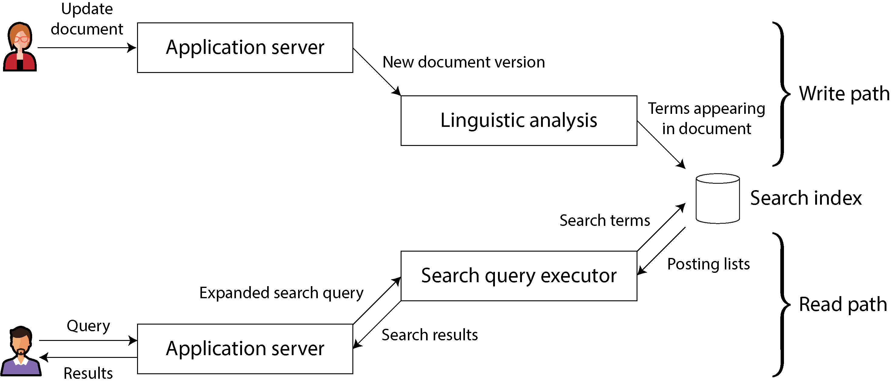
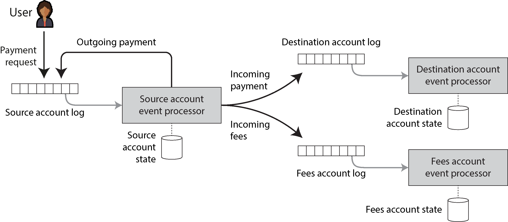

# A Philosophy of Streaming Systems

If a thing be ordained to another as to its end, its last end cannot consist in the preservation of its being. Hence a captain does not intend as a last end, the preservation of the ship entrusted to him, since a ship is ordained to something else as its end, viz. to navigation. (Often quoted as: If the highest aim of a captain was the preserve his ship, he would keep it in port forever.)
—St. Thomas Aquinas, Summa Theologica (1265–1274)

---

Is sadiyon purani misaal ka aasan matlab yeh hai ke agar kisi jahaaz ke kaptaan ka maqsad sirf apne jahaaz ko bacha kar surakshet rakhna hota, toh woh usay kabhi samandar mein lekar hi na jata, balkay hamesha dukan (port) par khara rakhta. Lekin jahaaz ka asli maqsad bandargah par kharay rehna nahi, balkay samandar ke thapedon ko jhelte hue safar (**Navigation**) mukammal karna hai.

Bilkul isi tarah, software systems ka maqsad sirf khamkhah chalte rehna nahi, balkay mushkilat ke bawajood business ke kaamo ko sahi tareeqay se chalana hai.

Chapter 2 mein hum ne baat ki thi ke hamara asli maqsad aise data systems banana hai jo **Reliable** (bharosay mand), **Scalable** (bojh sambhalne wale), aur **Maintainable** (paidaish se aakhir tak chalane mein asaan) hon. Poori kitaab mein hum ne inhi baaton par focus kiya hai: kharabiyon se bachne ke algorithms (fault-tolerance), data ko tukron mein baantna (sharding), aur system ko naye roop mein dhalna (evolution).

Is naye chapter mein hum in saare bikhray hue ideas ko aik sath jorrein ge. Khaas tor par Chapter 12 ke **Streaming aur Event-Driven Architecture** ka sahara lekar hum software development ka ek naya falsafa (philosophy) tayaar karenge jo in saare maqsadon ko poora karega. Yeh chapter baqi chapters se thoda alag aur *opinionated* (aik makhsoos soch par paka zor dene wala) hai, jahan hum mukhtalif tareeqon ka muqabla karne ke bajaye aik behtareen tareeqay ki gehrai mein utrein ge.

---

## Data Integration

Poori kitaab mein hum ne baar baar ek hi baat seekhi hai ke computer ki duniya mein kisi bhi aik maslay ko hal karne ke kayi tareeqay hote hain, aur har tareeqay ka apna ek faida aur nuksan (trade-off) hota hai:

* Chapter 4 mein storage engines parhte waqt hum ne dekha ke LSM-Trees alag kaam ke liye hain, B-Trees alag kaam ke liye, aur Column-Oriented storage bilkul alag kaam ke liye.
* Chapter 6 mein replication ke andar Single-Leader, Multi-Leader, aur Leaderless architectures ke apne apne fayde hain.

Agar aap ka aik simple masla hai ke *"Mujhe data save karna hai aur baad mein parhna hai"*, toh poore jahan mein iska koi aik 'perfect' solution nahi hai. Halat ke mutabaq faisla badal jata hai. Kisi aik software ke andar saare jahan ke features thonse nahi ja sakte. Agar koi company aik hi software mein sab kuch daalna chahegi, toh uske saare features ghatiya karkardagi (poor implementation) ka shikaar ho jayenge compared to specialized tools.

Is liye har tool—chahe naya "general-purpose" database hi kyun na ho—ek makhsoos kaam ke dhabbe (**Usage Pattern**) ke liye design kiya jata hai.

Hum software engineers ke samne pehla challenge yeh aata hai ke hum pehchanein ke kaun sa tool kis halat mein fit bahta hai. Software bechne wali companies (vendors) kabhi aap ko yeh nahi batayengi ke unka software kahan nakaam ho jata hai, lekin pichlay chapters ko parhne ke baad aap ke paas itni technical samajh aa chuki hai ke aap un ke daaway ke piche chhupe nuksanat (trade-offs) ko asani se parh sakein.

Lekin agar aap tools ki selection samajh bhi jayein, tab bhi aik doosra bara challenge baqi rehta hai. Ek barri aur complex application mein data kayi alag alag kaamo ke liye aik sath use hota hai, aur poore jahan ka koi aik akela software un saare kaamo ko akele perfect handle nahi kar sakta. Is liye, aap ko majbooran **kayi alag alag softwares ko aprop mein jorr kar** apni application faraham karni parti hai.

---

### Combining Specialized Tools by Deriving Data

Is ki ek bohot hi aam aur simple misaal dekhte hain. Aap ko apni website par ek aam transactional database (**OLTP DB**) chahiye jahan user ka data paka save ho, lekin sath hi aap ko ek **Full-Text Search Index** (jaise Elasticsearch) bhi chahiye taake users website par koi bhi lafz likh kar cheezein search kar sakein.

Halanqe PostgreSQL jaise modern databases mein search ka feature built-in hota hai jo choti apps ke liye kaafi hai, lekin agar aap ko Amazon ya Netflix jaisi advance search facilities chahiye, toh aap ko makhsoos search tools use karne parenge. Is ke ulat, search indexes data ko hamesha ke liye durable save rakhne ke liye acche nahi hote. Is liye aap ko do alag tools ko aprop mein milana hi parta hai.

Jaise jaise data ke roop (representations) barhte jaate hain, data integration ka yeh masla mushkil hota jata hai. Database aur search index ke ilawa, ho sakta hai aap ko data analytical systems (Data Warehouses/Spark) mein bhejni ho, speed barhane ke liye caches maintain karni hon, ya machine learning recommendation engines ko feed dena ho, ya data badalne par live notifications bhejni hon.

---

#### Reasoning about dataflows

Jab aik hi data ko alag alag dhabbo (access patterns) ke liye kayi storage systems mein rakhna paray, toh aap ke dimaagh mein **Inputs aur Outputs** ka poora naksha bilkul crystal clear hona chahiye:

* Data sab se pehle kis database mein write ho raha hai?
* Kaun sa naya view kis source se nikala (**derive**) ja raha hai?
* Hum data ko sahi format mein sahi jagah par kaise pohnchayein?

Misaal ke tor par, behtareen tareeqa yeh hota hai ke data sab se pehle main **System-of-Record** database (asli paka store) mein write ho. Uske baad wahan se badlao ko pakra jaye (**Change Data Capture - CDC**) aur bilkul usi exact order mein search index par apply kar diya jaye. Agar index ko update karne ka akela rasta sirf yeh CDC stream ho, toh aap ka search index hamesha main database ke sath perfect sync (consistent) rahega. New input dene ka akela rasta sirf main database hoga.

Agar aap application ke code ko ijazat de dein ke woh database mein bhi khud likhe aur search index mein bhi direct write kare, toh pichlay chapter wala hadsa (**Figure 12-4 wala dual write masla**) dobara ho jayega, jahan do concurrent clients aapas mein lar parenge aur dono storage systems requests ko alag alag order mein process karke permanently out-of-sync ho jayenge.

> **Bacho ka Asool:** Agar aap saare user inputs ko aik single channel (leader) se guzarlein jo unhein ek pakki tarteeb (**Total Ordering**) de day, toh baqi saare systems mein data jorrna bacho ka khel ban jata hai (State Machine Replication approach). Chahe aap CDC use karein ya Event Sourcing, sab se ahem asool pooray system ka ek single timeline (total order) tay karna hai.

Naye derived systems ko event log ke zariye update karna hamesha **Deterministic aur Idempotent** (aik jaisa asar dene wala) banaya ja sakta hai, jis se faults se recover karna bohot simple ho jata hai.

---

#### Derived data versus distributed transactions

Do alag systems ko sync rakhne ka purana aur classic tareeqa distributed transactions (Two-Phase Commit - 2PC) chalana tha. Toh naye zamane ka yeh **Derived Data Systems** wala tareeqa distributed transactions ke muqable mein kaisa hai?

Theoretical level par dono aik hi maqsad hal karte hain lekin unka rasta alag hai:

* Distributed Transactions aik atomic commit protocol use karti hain jo sab ko aik jhatkay mein save karta hai (Immediate read-your-own-writes guarantee).
* Log-Based Derived Data systems kamyabi haasil karne ke liye **Deterministic Retry aur Idempotence** ka sahara lete hain (Asynchronous nature, eventual consistency).

**Sub se Bara Farq:** Transaction wale systems guaranteed naya data foran dikha dete hain, jabke derived data systems background mein aaram se (asynchronously) update hote hain, is liye un mein reads thodi dair se up-to-date hoti hain.

Distributed transactions (XA protocol) ka fault tolerance bohot ghatiya hota hai aur yeh speed ko slow kar deti hain, jis se inka scale bohot limited ho jata hai. Jab tak poori duniya mein koi naya behtareen transaction protocol mashhoor nahi ho jata, tab tak **Log-Based Derived Data** hi alag alag systems ko jorrne ka sab se kamyab aur umeed-warr tareeqa hai.

Engineering mein yeh keh dena kafi nahi hai ke *"Bhai, eventual consistency toh honi hi hai, bas bardasht karo"*. Hamein developers ko sahi rasta dikhana hoga. Hum is chapter mein agay chal kar dekhenge ke kaise asynchronous logs ke upar bhi strong guarantees haasil ki ja sakti hain.

---

#### The limits of total ordering

Chote systems ke liye poore cluster ke kaamo ko aik seedhi tarteeb (**Totally Ordered Log**) dena bilkul feasible hai (jaise single-leader databases aaram se karte hain). Lekin jaise hi aap workload ko bohot baray paimane (scale) par le jaate hain, is total order ki deewar (limitations) samne aane lagti hain:

* **Throughput Ki Hadd:** Total order banane ke liye saare events ko aik hi single leader node se guzarna parta hai jo faisla karta hai. Agar data ki raftar aik computer ki capacity se barh jaye, aap ko log ko tukron mein baantna (**Shard**) parega. Jaise hi do alag shards banay, unke aapas ke messages ka order aage-piche (ambiguous) ho jata hai.
* **Geographic Distributed Datacenters:** Agar aap ke servers alag alag mulkon (regions) mein hain taake aik datacenter tabah hone par bhi app chalti rahay, toh har datacenter ka apna alag leader hota hai. Network latency ki wajah se alag mulkon se aane wale events ka aprop mein koi fixed order nahi reh pata.
* **Microservices Architecture:** Is design mein har microservice ka apna azaad database hota hai jo state share nahi karta. Jab do alag services se do alag events nikalte hain, toh unka aprop mein koi timeline tay nahi hota.
* **Offline Client-Side State:** Agar koi mobile app user ka click foran local screen par bina server ke ijazat ke save kar leti hai aur offline kaam karti hai, toh clients aur servers ko events hamesha alag alag order mein dikhenge.

Formal theory mein total order tay karne ko **Total Order Broadcast** kehte hain, jo ke **Consensus (Chapter 10)** ke barabar hai. Zyadatar consensus algorithms sirf tab tak kaam karte hain jab tak aik node poore load ko sambhal sakay, un mein hazaron nodes par voting baantne ka koi sasta nizam maujood nahi hai.

---

##### Ordering events to capture causality

Agar do events ke beech aprop mein koi rishta ya connection nahi hai, toh order aage-piche hone se koi farq nahi parta, unhein tuke se kisi bhi tarteeb mein rakha ja sakta hai. Ek hi row ke updates ko hum same partition key de kar aik shard mein lock kar dete hain. Lekin kabhi kabhi **Causality (Wajah aur Asar ka rishta)** bohot barik tareeqay se samhne aata hai, jise samajhna bohot zaroori hai.

**Bacho ki Tarah Ek Real-World Example Samajhein:**
Sochein ek social network (jaise Facebook) par do users hain jo pehle aprop mein relationship mein the lekin ab unka break-up (talooq khatam) ho gaya hai.

1. **Event 1 (Unfriend):** Pehla user gusse mein ex-partner ko unfriend (block) kar deta hai.
2. **Event 2 (Send Message):** Unfriend karne ke FORAN BAAD, woh user apne baki bache doston ko ek rude (bura) message bhejta hai jis mein ex-partner ki burayi likhi hoti hai.

User ka maqsad bilkul saaf tha: Chunke us ne ex-partner ko pehle block kar diya tha, is liye usay yeh bura message har haal mein **nazar nahi aana chahiye**.

Lekin sochein agar system friendship status ko aik alag database shard mein save karta hai aur messages ko doosre database shard mein. Agar un dono shards ke beech **Total Order kho jaye**, aur aage notifications bhejne wali service ke paas **Message-Send Event pehle pohanch jaye aur Unfriend Event 2 second baad pohanche**—toh system galti se ex-partner ke mobile par push notification bhej dega ke *"Aap ke ex ne ek naya message bhejha hai!"* Privacy ka qatal ho gaya!

Yahan notification asal mein messages aur friend list ka beech ka ek distributed join tha. Is time dependency ke maslay ka koi aik simple hal software engineering mein abhi tak nahi mila, lekin teen (3) shuruati raaste maujood hain:

* **Logical Timestamps:** Yeh bina kisi central coordination ke total ordering de sakte hain (Lamport clocks), lekin is mein consumer code ko out-of-order events handle karne ke liye extra dimaagh aur metadata lagana parta hai.
* **Causal Reference ID:** Jab user koi naya action kare, toh app purane dekhe hue system state ki unique ID naye event ke andar reference ke tor par paki likh kar bhej day taake causality ka nishan jura rahay.
* **Conflict Resolution Algorithms:** Yeh unexpected order mein aane wale data ke state ko sambhal toh letay hain, lekin agar action ka koi external side effect ho chuka ho (jaise user ke mobile par notification chali jana), toh yeh usay wapis hawa mein urrah nahi sakte.

Future mein shayad distributed computing mein aise naye patterns aayenge jo bina kisi central bottleneck (total order broadcast) ke causality ko safely aur efficiently capture kar sakenge.

---

## Batch and Stream Processing

Data integration ka asli maqsad yeh hai ke data apny sahi roop mein company ki saari sahi jagahong par safely pohanch jaye. Is ke liye data ko ingest karna, badalna (transform), do tables ko jorrna (join), filter karna, aggregates nikalna, aur AI models train karna parta hai. **Batch aur Stream Processors** hi is maqsad ko hal karne ke hathiyar hain. Unke final outputs search indexes, materialized views, aur recommendation reports bante hain.

Jaise hum ne pichlay do chapters mein parha, batch aur stream processing ke andar ke zyadatar asool bilkul same hote hain. Sab se bunyadi farq sirf itna hai ke **Stream processors Unbounded (na-khatam hone wale) data par har waqt chalte hain, jabke batch processing ka input finite (makhsoos size) ka hota hai.**

---

### Maintaining materialized views

Batch processing ka poora dhabba **Functional Programming** jaisa hota hai. Yeh pure aur deterministic functions ko promote karta hai, jahan output sirf aur sirf input par depend karta hai. Input read-only hota hai aur output append-only, jis se system mein koi side effects nahi aate. Stream processing bhi bilkul aisi hi hai, bas yeh operators ko ek managed aur fault-tolerant **State** (yaad-dasht) rakhne ki extra ijazat deti hai.

Deterministic functions ka faida sirf fault tolerance mein nahi hota, balkay is se company ke andar data ke bahao (**Dataflows**) ko samajhna bohot simple ho jata hai. Chahe aap ka derived data koi search index ho, statistical model ho, ya koi cache ho—hamesha yeh sochna fayda-mand hota hai ke yeh aik **Data Pipeline** hai jahan aik cheez se doosri cheez nikaali ja rahi hai. Main system ke state changes functional code se guzar kar derived systems par apply ho rahe hain.

Sochein agar hum secondary indexes ki tarah derived systems ko bhi main database transaction ke andar hi **Synchronously** update karna shuru kar dein? Kar toh sakte hain, lekin **Asynchrony (background mein aaram se kaam karna) hi log-based systems ko robust aur majboot banati hai.** * **Failure Containment (Kharabi ko rokna):** Asynchronous log ka faida yeh hai ke agar system ka aik hissa (jaise search index server) mar bhi jaye, toh kharabi wahi local level par ruk jati hai, main database chalta rehta hai. Iske baraks, distributed transactions mein agar aik bhi participant fail ho jaye, toh poori transaction abort ho jati hai, jis se kharabi pooray system mein aag ki tarah phail jati hai.

* **Cross-Shard Scale:** Sharded systems mein secondary indexes hamesha shard ki boundaries ko cross karte hain. Aise cross-shard raabton ko agar scalable aur reliable banana hai, toh index ko asynchronously maintain karna hi sab se behtareen solution hai.

---

### Reprocessing data for application evolution

Derived data ko zinda rakhne ke liye batch aur stream processing dono ka milap kamaal hai:

* **Stream Processing** input ke badlao ko low delay (kuch hi milliseconds) mein derived views tak pohnchati hai.
* **Batch Processing** pichlay kai saaloon ke jama hue historical data ko naye siray se reprocess karke ek bilkul naya view tayaar karne ke kaam aati hai.

Data ko naye siray se **Reprocess** karna system ko zinda rakhne aur naye features/requirements ke mutabaq badalney ka sab se shaandar mechanism hai. Agar aap data reprocess nahi kar sakte, toh aap database ke schema mein sirf choti moti changings hi kar sakenge (jaise naya optional column jorrna). Lekin reprocessing ke zariye aap poore ke poore dataset ka huliya badal kar usay aik bilkul naye data model mein dhal sakte hain taake naye requirements poori ho sakein.

---

#### Schema Migrations on Railways

Barri barri "Schema Migrations" sirf computers mein nahi hoti, balkay asli zindagi ke non-computer systems mein bhi sadiyon se ho rahi hain. Is ki ek bohot behtareen tareekhi misaal 19th-century ke England mein **Railways (train ki patriyon)** ki building mein milti hai.

Shuru shuru mein rail ki do patriyon ke beech ka fasla (**Gauge size**) tay karne ke liye mukhtalif companies ke alag alag standards the. Ek company ki train doosri company ki patri par nahi chal sakti thi, jis se poora train network aprop mein jorrna namumkin ho gaya tha.

Aakhir-kar, saal 1846 mein hukumat ne faisla kiya ke poore mulk mein aik hi **Standard Gauge** chalega. Ab purane chalte hue tracks ko naye size mein badalna tha—lekin aap live train lines ko mahino ya saaloon ke liye band toh nahi kar sakte the! Iska hal unho ne yeh nikala ke tracks ko **Dual Gauge / Mixed Gauge** mein badal diya:

* **The Third Rail Solution:** Unho ne purani do patriyon ke sath aik **Teesri Patri (Third Rail)** jorr di. Yeh kaam chote chote tukron mein aaram se chalta raha. Jab teesri patri lag gayi, toh standard train aur non-standard train dono aik hi track par safely chal sakti thin.
* Jab waqt ke sath saari purani trains standard size mein convert ho gayein, toh unho ne woh temporary teesri patri nikal kar phenk di!

**Asli Khushnuma Soch (The Software Connection):**
Database ke derived views hamein bilkul isi tarz par bina downtime ke **Gradual Schema Migration** (aaram se data badalna) ki ijazat dete hain. Agar aap ne poore dataset ka roop badalna hai, toh aap ko live database ko achanak band karke switch karne ka khatra mol lene ki bilkul zaroorat nahi hai!

Aap purane schema (View A) aur naye schema (View B) dono ko aik sath **Side-by-Side** chalayein, jo aik hi event log se azaadana data parh rahe hon.

1. Shuru mein aap $1\%$ users ko naye view (View B) par shift karein taake bugs aur karkardagi check ho sakay. Baqi $99\%$ log purane view par hi chalte rahenge.
2. Jaise jaise aap ka confidence barhay, aap naye view par users ki percentage barhate jayein ($10\%, 50\%, 100\%$).
3. Jab saare users naye view par safely shift ho jayein, toh purane view ke database ko shut down karke uske resources free karwa lein.

Is gradual migration ki khoobsurat baat yeh hai ke **har step poori tarah se Reversible (wapis palatne ke kabil) hota hai**. Agar naye code mein koi kharabi aayi, aap aik second mein router se traffic wapis purane view par shift kar dein, aap ke paas hamesha aik chalta hua sahi system backup mein khara hota hai. Is se nuqsan ka darr khatam ho jata hai aur engineering team tezi se naye features deploy kar sakti hai.

---

### Unifying batch and stream processing

Batch aur stream processing ko aik hi chat ke niche jorrne ke liye shuru mein **Lambda Architecture** ka proposal laya naya tha, lekin us mein code ko do alag engines par double likhna parta tha jis se bohot maslay aaye aur ab us ka istemaal band ho gaya hai.

Naye modern designs mein historical data ko replay karna (batch) aur live aane wale events ko handle karna (stream) aik hi single system ke andar jorr diya gaya hai, jisay hum **Kappa Architecture** kehte hain.

Batch aur Stream processing ko aik hi system mein mukammal tarah jorrne (unify karne) ke liye teen (3) technical khususiyaat ka hona farz hai:

* **Log Replay Power:** Processing engine ke paas yeh taqat honi chahiye ke woh naye live events parhne ke sath sath purane historical events ko bhi usi raftar se dobara replay kar sakay (jaise log-based message brokers ya cloud object stores se data read karna).
* **Exactly-Once Semantics:** Engine ke paas paki fault tolerance honi chahiye ke agar task ke darmiyan koi computer crash bhi ho jaye, toh nateeja aisa niklay jaise koi galti hui hi na thi (partial outputs ko automatic discard karna).
* **Event-Time Windowing Tools:** System ke andar windows hamesha **Event Time** (file ke andar ke asli waqt) par chalni chahiye, Processing Time par nahi. Kyunke jab aap 3 saal purana data reprocess kar rahe honge, toh machine ki maujooda ghari bilkul be-maani (meaningless) ho chuki hogi. **Apache Beam API** is ki behtareen misaal hai jo is mathematical calculation ko model karti hai aur background mein isay **Apache Flink** ya Google Cloud Dataflow par run kiya jata hai.

---


## Unbundling Databases

Agar hum bilkul abstract level (baala-baala satah) par dekhein, toh databases, batch/stream processors, aur operating systems saare aik hi tarah ke kaam karte hain: **Yeh aap ka data save karte hain, aur aap us data par calculations (processing) aur queries chala sakte hain.** Ek database data ko records (tables ki rows, JSON documents, ya graph ke vertices) ki shakal mein save karta hai, jabke operating system ka filesystem usi data ko files ke roop mein save karta hai—lekin andar se dono hi "Information Management Systems" (maloomat ko sambhalne wale nizam) hain. Hum ne parha hai ke distributed batch processors asal mein Unix operating system ka hi ek distributed roop hain.

Halanqe in mein bohot se practical farq bhi hain. Misaal ke tor par, agar aap operating system ke aik folder mein 10 million (1 crore) choti choti files daal dein, toh zyadatar filesystems ro parenge (slow ho jayenge). Lekin ek database ke andar 10 million rows daalna bilkul ek normal aur aam baat hai. Iske bawajood Unix aur databases ke aapas ke falsafay (philosophies) ko explore karna bohot dilchasp hai.

Unix aur relational databases ne data management ke maslay ko do bilkul alag soch ke sath hal kiya hai:

* **Unix Philosophy:** Unix ka maqsad developer ko hardware ki takat aik bohot hi logical lekin low-level abstraction (raw bytes aur pipes) ke zariye dena tha.
* **Database Philosophy:** Relational database application developer ko ek high-level abstraction (SQL aur Transactions) dena chahte the, taake disk par data structures kaise ban rahe hain, concurrency kaise chal rahi hai, ya crash se recovery kaise ho rahi hai, developer ko is mushkil ki chinta hi na karni paray.

**Kaun sa tareeqa behtar hai?** Yeh poori tarah aap ki zaroorat par depend karta hai. Unix is liye asaan hai kyunke yeh hardware ke upar aik bohot hi patli deewar (thin wrapper) hai. Relational database is liye asaan hai kyunke aap ki aik choti si declarative SQL query ke piche database ka poora takatwar nizam (query optimizer, indexes, joins, concurrency control) khud dimaagh lagata hai, aur aap ko andruni implementation seekhni nahi parti.

Yeh larrnay wala faisla sadiyon se chala aa raha hai (kyunke Unix aur Relational model dono 1970s ke shuruat mein paida huay the) aur abhi tak hal nahi hua. Hatta ke modern **NoSQL movement** ko bhi aap isi tarah dekh sakte hain ke log distributed OLTP storage mein Unix jaisa low-level abstraction ka asool dubara lana chahte the.

Is section mein hum in dono alag tareeqon dunyaon ko aprop mein jorrein ge taake dono ke behtareen faidong ka milap haasil kiya ja sakay.

---

### Composing Data Storage Technologies

Kitaab ke is safar mein hum ne databases ke bohot saare built-in features par baat ki hai, jaise:

* **Secondary Indexes:** Kisi makhsoos field ki value par tezi se search chalane ke liye.
* **Materialized Views:** Queries ke nateejay ka pehle se tayaar shuda cache.
* **Replication Logs:** Doosre computers (followers) tak data ki copies pohnchana.
* **Full-Text Search Indexes:** Text ke andar lafzon ko dhoondna.

Chapter 11 aur 12 mein bhi bilkul yahi kahani samhne aayi thi jab hum batch aur stream processors ke zariye search indexes bana rahe the, materialized views maintain kar rahe the, aur CDC ke zariye data replicate kar rahe the.

Is se pata chalta hai ke jo features database ke andar built-in hote hain, aur jo derived data systems log bahar **Batch aur Stream Processors** ke zariye khud bana rahe hain, un dono mein ek bohot hi gehri shabahat (parallel) hai.

---

#### Creating an index

Sochein jab aap database mein naya index banane ke liye `CREATE INDEX` ki command chalate hain, toh database ke andarooni roop mein kya hota hai?

1. **Snapshot Scan:** Database pehle poore table ka ek saaf consistent snapshot parhta hai.
2. **Sorting:** Un saari field values ko nikalta hai jin par index banana hai, aur unhein perfect sort (tarteeb) karta hai.
3. **Write Index:** Us sorted data ko disk par as an index file write kar deta hai.
4. **Catch Up Backlog:** Jab tak snapshot parha aur sort ho raha تھا, is dauran live users ne table par mazeed naye writes kiye honge (assuming table lock nahi tha). Database ab un naye writes ka backlog log parh kar index par apply karta hai.
5. **Continuous Sync:** Ek dafa naya index jab live data ke barabar pohanch jata hai, toh aage aane wali har transaction jab main table par likhti hai, index sath sath automatic update hota rehta hai.

Yeh poora process setting up a new follower replica (Chapter 6) aur streaming system mein bootstrapping CDC (Chapter 12) ke bilkul **$100\%$ same aur hum-shakal** hai!

Jab bhi aap `CREATE INDEX` chalate hain, database asal mein aap ke maujooda data ko dobara reprocess karke us se ek naya view (index) derive kar raha hota hai.

---

#### The meta-database of everything

Agar hum is satah se dekhein, toh poori company ya organization ke andar behnay wala dataflow asal mein **aik bohot bara single database (Meta-Database)** lagne lagta hai.

Whenever a batch, stream, or ETL process transports data from one place and form to another place and form, it is acting like the database subsystem that keeps indexes or materialized views up-to-date.

Is naye nazariye se, batch aur stream processors koi alag cheez nahi hain, balkay database ke andar chalne wale triggers, stored procedures, aur materialized view maintenance algorithms ka hi ek bohot bara distributed roop hain. Aur un se jo derived data systems (caches, search indexes) bante hain, woh is baray meta-database ke alag alag **Index Types** hain.

Jaise ek akela database apne andar B-trees, Hash indexes, ya Spatial indexes support karta hai; modern distributed architecture mein hum in saare facilities ko kisi aik single software company ka product banane ke bajaye, alag alag machines par alag alag teams ke zariye chalate hain.

Future mein yeh tarqi hamein kahan le kar jayegi? Agar hum is asool ko maanein ke duniya ka koi bhi aik single data model saare access patterns ke liye behtar nahi ho sakta, toh hamare paas alag alag tools ko aik sath jorr kar ek majboot system banane ke **do (2) baray raaste** hain:

| Approach | Read / Write Handling | Yeh Kaise Kaam Karta Hai? | Philosophy / Tradition |
| --- | --- | --- | --- |
| **Federated Databases** | **Unifying Reads** (Parhne wale raaste ko aik karna) | Alag alag engines aur storage systems ke upar aik **Single Unified Query Interface** (jaise Postgres Foreign Data Wrapper, Trino, Xorq) laga diya jata hai. User aik hi jagah SQL query likhta hai aur data har jagah se khud ba khud khinch kar aa jata hai. | **Database Tradition:** Aik bara integrated system, high-level query language, aur pyari semantics, halanqe implementation complex hoti hai. |
| **Unbundled Databases** | **Unifying Writes** (Likhne wale raaste ko aik karna) | Federation sirf data parhne ka masla hal karti hai, writes ko sync nahi karti. Unbundled approach mein hum databases ke andruni index maintenance features ko bahar nikal kar azaad kar dete hain. **CDC aur Event Logs** ke zariye naye writes safely saare alag alag systems tak pohnchaye jaate hain. | **Unix Tradition:** Chote chote tools jo aik kaam perfect karte hain, low-level uniform API (pipes/logs) se baat karte hain, aur unhein shell ke zariye jorra jata hai. |

---

#### Making unbundling work

Federation aur Unbundling aik hi sikkay ke do rukh hain: yaani mukhtalif components se aik scalable aur reliable system khara karna. Federated reads ke liye sirf aik data model ko doosre mein map karna parta hai jo kafi hadd ka kabo mein aane wala masla hai. Lekin **hazaron storage systems ke writes ko aprop mein sync rakhna** data engineering ka sab se mushkil aur asli challenge hai, is liye hamari poori tawajah isi par rahegi.

Writes ko sync rakhna ka purana tareeqa distributed transactions (2PC) tha, jo ke ghatiya fault tolerance aur slow karkardagi ki wajah se na-kaam ho gaya. Ek single system ke andar transactions theek hain, lekin jab data alag alag technologies ki sarhaden cross kare, toh **Idempotent writes ke sath aik Asynchronous Event Log (Kafka)** hi sab se majboot aur kamyab rasta hai.

Stream processors ke andar transaction se *exactly-once* haasil ho jata hai kyu ke woh code aik hi group ne likha hota hai. Lekin jab transaction mein do bilkul alag dunyaon ke softwares ko jorrna paray (jaise stream processor se data nikal kar Elasticsearch search index mein insert karna), toh kisi standard transaction protocol na hone ki wajah se kaam ruk jata hai. Ek ordered event log aur uske aage baithay idempotent consumers is mushkil abstraction ko bohot simple aur practicable bana dete hain.

Log-based integration ka sab se bara faida systems ke darmiyan **Loose Coupling** (azaadana talooq) paida karna hai, jo do tarah se samhne aata hai:

* **System Level Par Robustness:** Asynchronous event streams ki wajah se agar cluster ka koi aik computer ya consumer slow chal raha ho ya down ho jaye, toh poora system jam nahi hota. Event log messages ko apne paas buffer (save) kar leta hai, jis se producer aur baqi saare consumers bina kisi rukawat ke chalte rehte hain. Jab kharab consumer theek hoga, woh apna lag offset parh kar data catch up kar lega. Iske baraks, distributed transactions mein agar aik chota sa component bhi down ho, toh poori dunya ka kaam ruk jata hai.
* **Human Level Par Azaadi:** Data systems ko unbundle (azaad) karne se company ki alag alag software teams aik doosre se azad ho kar apne microservices ko improve aur maintain kar sakti hain. Har team ka focus sirf aik kaam perfectly karne par hota hai aur teams ke darmiyan raabta bilkul saaf interfaces se hota hai. Event logs aik aisa interface dete hain jo consistency (durability aur order) ke lihaz se bohot takatwar hai aur har tarah ke data format par easily apply ho sakta hai.

---

#### Unbundled versus integrated systems

Agar future mein unbundling ka tareeqa poori duniya mein chha bhi jaye, tab bhi yeh databases ke maujooda roop ko hamesha ke liye khatam nahi karega. Databases ki zaroorat hamein hamesha rahegi—stream processors ke andruni state ko sambhalne ke liye bhi, aur batch/stream processes ke final output par queries chalanay ke liye bhi. Makhsoos workloads ke liye specialized query engines (jaise data warehouses) hamesha king rahein ge kyunke unhein exploratory analytical queries ke liye optimize kiya jata hai.

Lekin yaad rahe, bohot saari alag alag infrastructures ko aik sath chalane se **Operational Complexity (system ko chalane ka azab)** barh jata hai. Har naye software ka apna aik learning curve hota hai, uski apni configuration ki settings hoti hain, aur apne naye naye operational nakhre (quirks) hote hain. Is liye asool yeh hai ke **system mein jitne kam moving parts hon, utna behtar hai.**

> **Premature Optimization Ka Khatra:** Ek single integrated software product (jaise aik akela relational database) un workloads par bohot behtareen aur predictable performance de sakta hai jiske liye usay design kiya gaya ho, compared to check composite architecture jahan aap ne khud code likh kar 5 tools ko jorra ho. Agar aap ko itne bade scale ki zaroorat hi nahi hai aur aap khamkhah unbundled architecture banane baith gaye, toh yeh aap ki mehnat aur paise ka zaya hai, jis se aap aik inflexible (sakht) design mein phans jayenge.

Unbundling ka maqsad individual databases ke sath un makhsoos workloads par speed ki larai larna nahi hai; iska asli maqsad aap ko **is kabil banana hai ke aap kai databases ko aprop mein safely jorr sakein** taake aap ki application aik sath bohot saari alag alag access patterns aur workloads par behtareen karkardagi de sakay jo kisi aik akele software ke bas ki baat nahi thi. **Yeh gehrai (depth) ke baare mein nahi hai, balkay chourayi (breadth) ke baare mein hai.**

Agar aap ka saara kaam kisi aik akele database se safely ho raha hai, toh chup karke us aik product ko use karein, khud se lower-level components jorrne ki koshish mat karein. Unbundling aur composition ka faida sirf tab shuru hota hai jab duniya ka koi aik akela software aap ki saari requirements poori na kar pa raha ho.

Aaj ke daur mein data systems ko compose karne ke tools bohot behtar ho chuke hain: Debezium har database se safely change streams nikal leta hai, Kafka ka protocol industry standard ban chuka hai, aur Incremental View Maintenance (IVM) engines complex queries ke caches ko har millisecond mein live update karne ki taqat dete hain.

---

## Designing Applications Around Dataflow

Derived data (nikale hue data) ko automatically update karne ka khyal koi naya naya kal ka larka idea nahi hai. Misaal ke tor par, hamare paas jo **Spreadsheets (Excel/Google Sheets)** hoti hain, un ke paas kamaal ki dataflow programming takat pehle se hoti hai.

* **Bacho ki Tarah Samajhein:** Excel mein agar aap ne aik khane (cell) mein formula lagaya ke `=SUM(A1:A10)`, toh jaise hi aap column A ke kisi bhi khane ka number badlenge, formula wale khane ka nateeja dharak se khud-ba-khud badal (recalculate ho) jayega.

Hamein bilkul yahi cheez poore software data system ke level par chahiye. Jab database ke andar koi ek single record badle, toh us record ka index automatic update hona chahiye, aur us par depend karne wale saare cached views ya calculations khud hi refresh ho jani chahiye. Developer ko is baat ki chinta bilkul nahi karni chahiye ke yeh refresh piche kaise ho raha hai; usay bas system par bharosa hona chahiye ke kaam theek chalega.

Is liye, aaj ke modern data systems ko abhi bhi bohot kuch seekhna baqi hai us feature se jo **VisiCalc** (duniya ka pehla spreadsheet software) ke paas **1979** mein pehle se maujood tha! Farq sirf itna hai ke aaj ke systems ko scale mein bohot bara hona parta hai, fault-tolerant hona parta hai, aur data ko hamesha ke liye durable save rakhna parta hai. Unhein alag alag teams ke likhe hue softwares aur external cloud services ko bhi aprop mein safely jorrna parta hai. Yeh sochna bewakoofi hai ke poori company ka saara code sirf aik hi language ya framework mein likha jayega.

---

### Application code as a derivation function

Aap jab bhi aik dataset se doosra naya dataset nikalte hain, toh data ek badlao ke formula (**Transformation / Derivation Function**) se guzarata hai. Chalein iski char (4) barri examples dekhte hain:

* **Secondary Index:** Iska formula bohot seedha hota hai. Yeh table ki har row uthata hai, indexed fields ki values nikalta hai, aur unhein B-tree ya SSTable ke mutabaq key ke order mein sort (tarteeb) kar deta hai.
* **Full-Text Search Index:** Iska formula thoda complex hota hai. Yeh text par *Natural Language Processing* (NLP) chalata hai—jaise yeh pehchanna ke language kaun si hai, lafzon ko torti hai (word segmentation), unke aakhir se 'ing' ya 'ed' hata kar asli lafz nikalna (stemming/lemmatization), spelling theek karna, aur makhsoos lafzon ke hum-maani lafz (synonyms) dhoondna. Phir ja kar aik fast search index (inverted index) banta hai.
* **Machine Learning (ML Systems):** Ek AI/ML model ko aap maan sakte hain ke yeh training data se nikali hui ek nishān (derived state) hai, jahan statistical analysis ke formulas laga kar model ke **Weights** nikalay jaate hain. Jab is model ko naya input diya jata hai, toh nateeja unhi learned parameters (aur indirectly purane training data) se derive hota hai.
* **UI Cache Layer:** App ke cache memory mein aksar data usi shakal mein pehle se jama (aggregate) karke rakha jata hai jis shakal mein usay mobile ya browser ki screen (UI) par dikhana ho. Agar UI ka design badal jaye, toh cache banane ka formula bhi badalna parta hai aur cache naye siray se rebuild karni parti hai.

Secondary index ka formula itna aam hai ke databases usay core feature ke tor par built-in dete hain aur aap bas `CREATE INDEX` chala dete hain. Full-text search ke liye bhi thodi bohot facilities databases mein hoti hain, lekin heavy kaam ke liye specialized tools chahiye hote hain. Machine Learning mein feature engineering poori tarah se custom hoti hai aur us mein user ke clicks ka detailed knowledge dalna parta hai.

Jab aap ka formula `CREATE INDEX` jaisa aam cookie-cutter (bana-banaya) nahi hota, toh aap ko **Custom Application Code** likhna parta hai. Aur yahin par saare traditional databases haar jaate hain. Halanqe relational databases ke andar triggers, stored procedures, aur user-defined functions (UDFs) hote hain jahan aap code database ke andar chala sakte hain, lekin unhein database design mein hamesha ek aakhri majboori (afterthought) ke tor par dekha gaya hai.

---

### Separation of application code and state

Theory ki duniya mein databases chahein toh operating system ki tarah har tarah ka custom application code apne andar chala sakte hain. Lekin practical real life mein databases is kaam ke liye bohot ghatiya environment sabit huay hain. Woh modern software development ke requirements ko safely jhel nahi sakte—jaise packages aur libraries ka hisab rakhna (dependency management), code ka version control (Git), bina downtime ke naya code deploy karna (rolling upgrades), monitoring metrics nikalna, external network lines par API calls marna, aur baqi systems ke sath integration karna.

Doosri taraf, cluster management ke modern tools—jaise **Kubernetes, Docker, Mesos, aur YARN**—khass tor par bane hi isi kaam ke liye hain ke woh application code ko safely aur kamyabi se chalayein. Aik kaam par focus karne ki wajah se yeh databases se lakh darja behtar code execution sambhaltay hain.

Isi wajah se aaj kal ki zyadatar web applications ko **Stateless Services** ke tor par deploy kiya jata hai:

* **Stateless Ka Fayda:** User ki request kisi bhi azaad application server par ja sakti hai. Server response bhejne ke baad us request ko poori tarah bhool jata hai. Is se faida yeh hota hai ke aap jab chahe naye servers add karein ya purane delete karein, code crash nahi hota.
* **The Rule:** Lekin data (state) ko kahin toh paka save rakhna hai, is liye state ko hamesha alag se databases mein phenk diya jata hai. Aaj kal ka paka trend yeh hai ke **Stateless Application Logic ko State Management (Databases) se poori tarah judaa (separate) rakha jaye**—yani application ke andar koi paka data na bache, aur database ke andar application ka code na chale.

> **Functional Programming Ka Ek Joke (Separation of Church and State):** Functional programming ke log aksar mazaq mein kehte hain ke *"Hum Church aur State ki separation par yakeen rakhte hain"*.
> * **Joke Ka Breakdown:** Siasat mein iska matlab hukumat aur mazhab ko alag rakhna hota hai. Lekin coding mein "Church" ka matlab mashhoor mathematician **Alonzo Church** hain, jinho ne *Lambda Calculus* banaya tha (jo functional programming languages ki buniyaad hai). Lambda calculus ke andar koi badalney wali memory (**No Mutable State / No Variables**) nahi hoti. Is liye programming mein mutable state ko Alonzo Church ke kaam se bilkul alag (separate) rakha jata hai.
> 
> 

Is typical web application model mein, database computer ki memory mein pare aik aise share kiye hue variable (**Mutable Shared Variable**) ki tarah kaam karta hai jise network par synchronously access kiya jata hai. Application usay read aur update karti hai, aur database usay durable rakhne, concurrency control, aur fault tolerance dene ka bojh uthaata hai.

Lekin aam programming languages mein aap kisi mutable variable ke badlao ko automatic subscribe (listen) nahi kar sakte; aap ko thodi thodi dair baad khud ja kar variable ko parhna (**Polling**) parta hai. Excel spreadsheet ki tarah parhne wale ko khud notification nahi milti ke data badal chuka hai (halanqe *Observer Pattern* se code mein yeh kiya ja sakta hai, par languages mein yeh built-in nahi hota). Databases ne bhi data ka yahi thanda aur passive tareeqa apnaaya hua hai, jahan agar naya data check karna ho toh baar baar query repeat (poll) karni parti hai. Badlao ko subscribe karne ka feature abhi naye naye siray se ana shuru hua hai.

---

### Dataflow: Interplay between state changes and application code

Applications ko **Dataflow** ki nazar se dekhne ka matlab hai ke application code aur state management ke purane talooq ko naye siray se tay kiya jaye. Database ko aik thanda ruka hua variable samajhne ke bajaye, hum data ki halat (state), us mein aane wale badlao (state changes), aur usay process karne wale application code ke darmiyan aik har waqt chalne wali live dosti (**Interplay & Collaboration**) ke baare mein sochte hain. Application code aik jagah hone wale badlao ko sunta hai aur uske reaction mein doosri jagah naya badlao trigger kar deta hai.

Hum ne is soch ko CDC (Change Data Capture) mein, Actor model mein, database triggers mein, aur Incremental View Maintenance (IVM) mein dekha hai. Database ko unbundle (azaad) karne ka asli maqsad hi yeh hai ke hum main database se bahar nikal kar azaadana tareeqe se caches, full-text search indexes, aur Machine Learning pipelines tayaar karein. Is kaam ke liye hum stream processing aur messaging systems (Kafka) ka behtareen istemaal karte hain.

Derived data ko live aur mehfooz rakhne ke liye log-based message brokers hamein do sab se zaroori khubiyan (properties) muft dete hain:

1. **Total Order of Changes:** Badlao ki exact tarteeb bohot aham hai. Agar aik hi event log se 5 alag alag views (caches/indexes) nikal rahe hain, toh un saare consumers ko events aik hi exact order mein process karne parenge taake saari company ke data reports aprop mein hamesha match rahein.
2. **Solid Fault Tolerance:** Aik bhi message ka raste mein kho jana derived dataset ko main source database se hamesha ke liye out-of-sync (de-sync) kar dega. Is liye message ki delivery aur state ka update hona $100\%$ reliable hona chahiye.

Halanqe stable ordering aur fault-tolerant processing sunne mein kafi sakht demands lagti hain, lekin distributed transactions (2PC) ke muqable mein yeh **bohot sasti aur system par bohot kam bojh (operationally robust) daalti hain**. Modern stream processors bohot baray scale par yeh guarantees de dete hain aur application code ko as a stream operator chalane ki ijazat dete hain.

Yeh application code har tarah ki complex processing khud kar sakta hai jo databases ke built-in functions nahi de paate. Bilkul pipes se jure hue Unix tools ki tarah, aap stream operators ko aik doosre ke aage-piche jorr kar dataflow ke gird ek bohot bara scalable system khara kar sakte hain, jahan har operator input mein badlao ki stream leta hai aur output mein badlao ki nayi stream nikaal deta hai.

---

### Stream processors and services

Aaj kal software ki duniya mein application banane ka sab se mashhoor style **Microservices Architecture** (Service-Oriented Architecture) hai, jahan pooray software ke kaamo ko chote chote tukron (services) mein tor diya jata hai jo aprop mein internet par synchronous network requests (**REST APIs ya RPC**) ke zariye baat karti hain. Is monolithic se microservices par aane ka sab se bara faida company ke level par organizational scalability haasil karna hai, kyu ke alag alag teams aik doosre se azad ho kar apne microservice par bina interference ke kaam kar sakti hain.

Stream operators ko dataflow pipelines mein jorrna bhi microservices jaisa hi azaad ehsas deta hai. Lekin dono ke aprop mein baat karne ka andruni nizam (communication mechanism) ek doosre se bilkul ulat hai: **Microservices synchronous request/response par chalti hain, jabke Dataflow systems aik hi raste par behne wali asynchronous message streams par chalte hain.**

Better fault tolerance ke ilawa, dataflow systems traditional REST APIs ya RPC se **bohot behtar aur fast speed (performance)** haasil kar sakte hain. Chalein is baat ko currency conversion (paise badalney) ki ek bohot hi shaandar real-world example se bacho ki tarah asani se samajhte hain:

Sochein ek customer aap ki website se koi cheez khareed raha hai jis ki keemat Dollars ($) mein hai lekin bacha payment Rupee (Rs) mein kar raha hai. Is transaction ko poora karne ke liye aap ko market ka maujooda Exchange Rate pata hona chahiye. Isay implement karne ke do tareeqay hain:

* **Tariqa A: Microservices Approach (Synchronous REST/RPC):**
Jo code purchase process kar raha hoga, woh raste mein rukega, network par aik RPC call maaregā 'Exchange Rate Service' ya kisi central database ko, wahan se exchange rate ka rate parh kar wapis aayega, aur phir calculation aage barhayega.
* *Nuksan:* Agar exchange rate ki service temporary down ho gayi, toh user ki purchase fail ho jayegi! Network call hone ki wajah se process slow bhi hoga. Halanqe local cache laga kar network call se bacha ja sakta hai, par cache ko fresh rakhne ke liye phir se polling karni paregi.


* **Tariqa B: Dataflow Approach (Asynchronous Stream Join):**
Purchase process karne wala code pehle se hi market ke Exchange Rate ki update stream ko subscribe karke baith jata hai. Jab bhi market mein rate badalta hai, stream processor us naye rate ko **apne local database (RAM hash table) mein save kar leta hai**. Ab jab user website par purchase ka button dabayega, toh code ko network par kisi doosri service ke paas bhagney ki koi zaroorat nahi hai! Woh dharak se apne hi **Local process ki memory se rate parhay ga** aur calculation millisecond mein complete kar dega!

**Nateeja:**
Doosra tareeqa na sirf hadd se zyada fast hai, balkay agar market ki exchange rate service temporary crash bhi ho jaye, tab bhi aap ka purchase system bina ruke chalta rahega! Duniya ka sab se fast aur reliable network request wahi hota hai **jo kabhi network par bheja hi na jaye (No network request at all!)**. RPC ka khatma ho gaya aur iski jagah purchase events aur exchange rate events ka aprop mein ek **Stream Join** lag gaya.

Yahan join waqt par depend karta hai (**Time-Dependent Join**): agar aap 2 saal purane data ko aaj dobara reprocess kar rahe honge, toh aap ko local memory mein aaj ka exchange rate nahi balkay us din ka purana exchange rate chahiye hoga jab sale asli zindagi mein hui thi. Is time dependence ko handle karna distributed engineering ka ek dilchasp khel hai.

Kisi cheez ka data badalne par central database se baar baar poochna (query/polling) chorr kar, agar hum badlao ki stream ko pehle se subscribe karlein, toh hum Excel spreadsheet wale computational model ke bohot kareeb pohanch jaate hain. Jaise hi data badla, derived data khud hi safayi se update ho gaya! Distributed jahan mein building applications around dataflow ki yeh soch systems ko super-fast aur scalable banane ka aik bohot hi roshan aur promising rasta hai.

---

## Observing Derived State

Abstract level par agar hum dekhein, toh ab tak hum ne dataflow systems mein jo parha hai, woh asal mein aik naya nizam hai jahan derived datasets (jaise search indexes, materialized views, aur predictive models) ko generate kiya jata hai aur unhein har lamha up-to-date rakha jata hai. Is poore nizam aur raste ko hum **Write Path** kehte hain.

Jab bhi system mein koi bhi data likha (write kiya) jata hai, toh woh batch aur stream processing ke mukhtalif marhalon se guzarta hai, aur aakhir-kar har ek derived dataset ko naye data ke mutabaq update kar diya jata hai.

Lekin hum yeh derived datasets banate hi kyun hain? Zahir hai, taake hum baad mein kisi bhi waqt un se data dobara parh (**Query**) sakein. Is raste ko hum **Read Path** kehte hain: jab koi user request aati hai, toh aap derived dataset se data parhte hain, us par thoda bohot mazeed process chalate hain, aur user ko final jawab (response) de dete hain.

Agar hum in dono rasto ko aprop mein mila kar dekhein, toh **Write Path** aur **Read Path** mil kar data ka ek poora safar (journey) bante hain—data ke paas aane se lekar uske aakhri user tak pohnchane tak.

* **Write Path (Eager Evaluation):** Yeh safar ka woh hissa hai jo pehle se tayaar (**Precomputed**) hota hai. Jaise ہی data aata hai, system bina kisi ke poochay foran dharak se kaam shuru kar deta hai. Functional programming mein isay *Eager Evaluation* (foran hisab nikalna) kehte hain.
* **Read Path (Lazy Evaluation):** Yeh safar ka woh hissa hai jo sirf tabhi chalta hai jab koi user khud aakar maangay (**On-Demand**). Isay functional programming mein *Lazy Evaluation* (intezar karke aakhir mein hisab nikalna) kehte hain.

---

### Figure 13-1 Ka Breakdown: Jahan Read Aur Write Aprop Mein Miltay Hain

Writer ne **Figure 13-1** mein aik search index ki example de kar samjhaya hai ke kaise derived dataset asal mein read path aur write path ka aik darmiyana milap hota hai.

<div align="center">
  
</div>

**Step-by-Step System Flow Analysis:**

1. **The Write Path (Top Side):** * User jab koi naya document database mein badalta hai (`Update document`), toh request **Application Server** par jati hai.
* Server us naye document ka version aage **Linguistic Analysis** operator ko bhej deta hai.
* Linguistic analysis ka code us text ke lafzon ko torta hai aur un saare terms ko nikal kar direct **Search Index** ke derived dataset mein write (append) kar deta hai. Yeh saara kaam eager tareeqay se background mein khud ba khud ho raha hai.


2. **The Read Path (Bottom Side):**
* Jab koi doosra user website par aakar kuch search karta hai (`Query`), toh request niche wale **Application Server** par jati hai.
* Server us query ko **Search Query Executor** engine ke paas bhejta hai.
* Query executor search index se makhsoos terms aur matching lists (`Posting lists`) parhta hai, un par calculation chalaata hai, aur final results application server ke zariye user tak pohncha deta hai.


**The Balancing Trade-off (Mizan ka faisla):**
Derived dataset (Search Index) asal mein write time aur read time ke darmiyan aik samjhauta (trade-off) hota hai ke aap ne kitna kaam pehle se karke rakhna hai aur kitna kaam baad ke liye chorna hai.

---

### Materialized views and caching

Full-text search index iski aik behtareen misaal hai. Chalein bacho ki tarah samajhte hain ke agar hum is boundary (had) ko aage piche badlein toh kya farq parega:

* **Extreme Case 1: No Index (Kaam sirf Read Path par):** Sochein agar hamare paas search index ho hi na. Jab bhi user koi lafz search karega, system ko Linux ke `grep` command ki tarah pooray database ki saari files shuru se aakhir tak scan karni parengi. Is design mein **Write Path par bilkul zero kaam** hai (koi index update nahi karna), lekin **Read Path had se zyada mehanga (slow)** ho jayega kyu ke har query par pora storage scan hoga.
* **Extreme Case 2: Full Precomputation (Kaam sirf Write Path par):** Iske ulat sochein ke duniya mein jitni bhi queries puchi ja sakti hain, system un sab ka search result pehle se hi calculate karke rakh le. Is design mein **Read Path par bilkul zero kaam** hoga (bas pehle se tayaar nateeja utha kar dena hai), lekin **Write Path namumkin hadd tak mehanga** ho jayega kyu ke possible queries ka combination infinite (unlimited) hota hai. Hum saare nateejay pehle se nahi bana sakte.
* **The Middle Ground: Caching Common Queries:** Iska darmiyana hal yeh hai ke hum sirf un queries ka result pehle se precompute (materialize) karke rakh lein jo log har waqt sab se zyada poochte hain (**Cache of common queries**). Jab bhi koi naya document aayega jo in common queries se match hota ho, hum cache ko refresh kar denge. Baki jo ajeeb-o-ghareeb queries aayengi, unhein normal search index se parh kar hal kiya jayega.

Is se sabit hota hai ke caches, indexes, aur materialized views ka asli kirdar sirf aik hi hai: **Yeh read path aur write path ki sarhad (boundary) ko aage piche sarka (shift kar) dete hain.** Yeh hamein ijazat dete hain ke hum write path par thoda zyada kaam (precomputation) pehle se kar lein taake read path par user ka waqt aur computer ka bandwidth poori tarah bach sakay.

*(Yad karein Chapter 1 ke shuru mein hum ne Twitter ki Home Timeline ke case study mein bilkul yahi seekha tha ke aam users ka data write time par copy hota tha aur baray celebrities ka data read time par join hota tha. Poore 500 pages parhne ke baad aaj hum ghoom kar wapis ussi markazi asool par aa gaye hain!)*

---

### Stateful, offline-capable clients

Read aur write path ki is sarhad (boundary) ko badalne ka khyal is liye dilchasp hai kyu ke hum isay cloud architecture se nikal kar direct end-user ke devices (mobiles/laptops) par le ja sakte hain.

* **Purana Daur (Stateless Web):** Purane zamane mein browsers bilkul thande (stateless) hote تھے. Internet katne ke baad aap page par sirf upar-niche scroll kar sakte the, baqi app chalna band ho jati thi.
* **Naya Daur (Stateful Local-First):** Lekin ab single-page JavaScript apps (React/Vue) aur mobile apps ke paas browser ke andar hi apna ek paka local storage aur state hota hai. App ko har chote click par server tak bhagne ki zaroorat nahi parti.

Jaisa hum ne Chapter 6 mein *Local-First Software* ke context mein parha tha, local state hone ki wajah se users internet ke bina bhi **Offline mode** mein apna poora kaam kar sakte hain, aur jab network wapis aata hai, toh app background mein server ke sath sync ho jati hai. Mobile networks cellular connections par slow hote hain, is liye UI ka network call ke liye wait na karna ek bohot bara operational faida hai.

Is design ko agar hum dataflow ki nazar se dekhein, toh ek bohot hi pyari math samhne aati hai:

* User ke mobile ki screen par dikhne wale **Pixels** asal mein client app ke andar chalne wale model objects ka ek **Materialized View** hain.
* Aur mobile app ke andar chalne wale woh model objects asal mein door cloud datacenter mein pare main server state ki aik **Local Replica (Cache)** hain!

---

### Pushing state changes to clients

Ek aam website par jab backend server par koi data badalta hai, toh browser ko tab tak pata nahi chalta jab tak user khud ja kar page refresh (reload) na kare. Browser data ko ruka hua (static) maanta hai, woh server ke naye badlao ko automatic subscribe nahi karta. Browser ka data ek baasi (stale) cache ban jata hai jab tak aap dobara polling na karein.

Lekin ab naye protocols HTTP ke is thandey request/response pattern se aage nikal chuke hain:

* **Server-Sent Events (SSE / EventSource API)**
* **WebSockets**

In channels ke zariye browser server ke sath aik lambi aur har waqt khuli hui TCP line (**Open TCP Connection**) bana kar rakhta hai. Ab jaise hi server par koi data badalta hai, server khud actively us badlao ka message browser ki taraf dharak se **Push** kar deta hai. Client-side ka data har lamha taza rehta hai.

Architectural zuban mein iska matlab yeh hai ke **hum ne Write Path ko server se khainch kar direct end-user ke mobile device tak lamba (extend) kar diya hai!** Shuru mein jab app khulegi, toh woh initial data parhne ke liye `Read Path` use karega, lekin uske baad poori zindagi application server se aane wale state changes ke live stream par chalegi. Streaming aur messaging ka yeh jadu sirf bade datacenters tak mehood nahi hai, isay hum pooray end-to-end user network par phaila sakte hain.

#### Offline Hone Ka Masla Kaise Hal Hota Vhai?

Agar user tunnel se guzar raha hai aur network kat gaya, toh us dauran server se aane wali push notifications miss ho jayengi. Lekin iska ilaaj toh hum ne Chapter 12 mein log-based message brokers ke **Consumer Offsets** mein pehle se seekha hua hai!

Naya computer jab disconnect hone ke baad dobara connect hota hai, toh woh apna offset number batata hai aur broker usay raste mein chhoot jaane wale saare messages dobara safely deliver kar deta hai. Bilkul yahi asool har single user ke mobile par apply hota hai, jahan har mobile device ek chote se event stream ka aik chota sa subscriber hota hai.

---

### End-to-end event streams

Frontend development ke modern tools—jaise **React** ya Elm—pehle se hi is dhabbe par chalte hain ke jaise hi local state ka data badalta hai, screen ka UI khud-ba-khud automatic re-render (update) ho jata hai.

Toh yeh bohot hi natural baat hai ke hum server se aane wali push stream ko direct frontend ke isi event pipeline ke sath jorr dein.

```
[User 1 Action] ──► [Event Log] ──► [Stream Processor] ──► [Server Push] ──► [User 2 React UI Auto-Update]

```

Is se aap ka badlao ek **End-to-End Write Path** par flow karega: Aik bache ne mobile 1 par click kiya $\to$ event log mein entry append hui $\to$ stream processors ne calculate kiya $\to$ WebSockets se push notification gayi $\to$ aur doosre bache ke mobile 2 ki screen par React UI bina refresh kiye **under 1 second** mein live update ho gaya! Instant messaging apps (WhatsApp) aur online multiplayer games isi real-time architecture par chalti hain.

**Hum saari applications is behtareen tareeqay se kyun nahi banate?**
Sab se bari rukawat yeh hai ke hamare zyadatar databases, libraries, frameworks, aur protocols pichlay 40 saaloon se sirf request/response aur stateless clients ke tarz par design kiye gaye hain. Ek aam datastore sirf parhne aur likhne ki single response queries ko support karta hai, aik aisi long-running query ko support karne wale databases bohot kam hain jo waqt ke sath responses ki lagatar stream (**Subscription to changes**) nikaalti rahein. Is raste par aage barhne ke liye hamein request/response chorr ka pub/sub dataflow ke mutabaq naye siray se sochna hoga.

---

### Reads are events too

Hum ne parha ke stream processor jab derived data ko kisi database ya cache mein likhta hai, toh woh store read aur write path ke darmiyan ek deewar (boundary) ban jata hai, taake clients ko poora log scan na karna paray aur unhein random access read mil sakay.

Aam tor par datastore streaming system se bilkul alag hota hai. Lekin yaad karein, stream processors ko aggregations aur joins karne ke liye apne andar state (memory) maintain karni parti hai. Halanqe yeh state andar chhupi hoti hai, lekin modern frameworks ab bahar ke clients ko ijazat dete hain ke woh direct stream processor ki is memory par queries chala sakein (**Interactive Queries**). Is se stream processor khud aik chota sa database ban jata hai.

Chalein is soch ko ek bohot hi barik aur advanced level par le jaate hain:

* Ab tak hamare design mein writes event log (stream) se ja rahe the aur reads direct network request se database par ja rahe the.
* Lekin kya aisa mumkin hai ke hum **Read Requests ko bhi aik Event Stream maan lein?**

Bilkul mumkin hai! Hum parhne wale kaamo (read events) aur likhne wale kaamo (write events) dono ko aik sath ek hi stream processor ke andar se guzarte hain. Stream processor jaise hi parhne ka event dekhta hai, us query ka nateeja nikal kar aik **Output Stream** mein phenk deta hai.

```
[ Read Events Stream  ] ──┐
                          ├─► [ Stream-Table Join Operator ] ──► [ Output Stream (Read Results) ]
[ Write Events Stream ] ──┘

```

जब parhne aur likhne dono ko events bana kar aik hi stream operator ke paas bheja jata hai, toh technical level par yeh database aur read queries ke darmiyan aik **Stream-Table Join** ban jata hai! Har read query ko ussi makhsoos database shard par route kiya jata hai jahan us key ka data para hota hai.

Serving requests aur joins karne ke darmiyan ka yeh talooq distributed computing ke sab se bunyadi asoolon mein se aik hai:

* **One-off Read Request:** Ek aam single read request join operator se guzarti hai, operator nateeja deta hai aur request ko hamesha ke liye bhool jata hai.
* **Subscribe Request:** Ek continuous subscription request asal mein past (purane) aur future (aane wale) saare events ke sath aik **Persistent (hamesha chalne wala) Join** hoti hai.

#### Read Requests Ka Log Save Karne Ka Bara Faida

Agar aap parhne wali requests ka bhi ek paka durable log save kar lein, toh aap distributed system mein causality (wajah aur asar ka rishta) aur data ka poora pichla silsila (**Data Provenance**) $100\%$ sahi track kar sakte hain. Is se aap ko yeh sabit karne mein madad milti hai ke *user ne koi faisla karne se pehle apni screen par asli mein kya dekha tha*.

* **Online Shop Ki Example:** E-commerce website par bacha jab koi khilone khareedta hai, toh uske khareedne ka faisla is baat par depend karta hai ke website ne usay delivery ki tareeq (shipping date) aur stock ka status kya dikhaya tha. Agar aap read requests ka log bacha kar rakhenge, toh analytics team sahi andaza laga sakegi ke kis jhoot ya sach ki wajah se user ne cheez khareedi.

Lekin reads ka paka log disk par bacha kar rakhne se storage aur I/O ka kharcha (cost) barh jata hai. Is overhead ko kam karne ki research abhi chal rahi hai, lekin agar aap pehle se hi security aur audit logs ke liye reads bacha rahe hain, toh usay system ka source bana dena koi lamba badlao nahi hai.

---

### Multishard data processing

Agar aap ki query bohot simple hai jo sirf aik single shard (computer) se data parh rahi hai, toh usay stream ke zariye bhej kar output stream ka wait karna zaroorat se zyada barra tamasha (**Overkill**) lag sakta hai.

Lekin yeh stream-based query ka tareeqa tab aik maseeha ban kar samne aata hai jab aap ko **Distributed Complex Queries** chalani hon, jinhein aik sath bohot saare alag alag shards se data ikhta karke jorrna (join karna) parta hai. Is tarah aap stream processors ke pehle se bane banaye message routing, sharding, aur joining ke infrastructure ka poora faida utha lete hain.

Apache Storm ka *Distributed RPC* feature isi tarz par kaam karta hai. Chalein iski do (2) barri real-world use cases dekhte hain:

1. **Social Network Total Impressions Union:**
Sochein aap ne pata lagana hai ke social network par kisi makhsoos URL link ko total kitne unique logon ne dekha hai? Iska formula hai: *jis jis user ne us link ko post kiya tha, un saare users ke followers ki lists ka ek bada distributed Union (jama) nikalna*. Chunke users ka data alag alag machines par sharded hota hai, is liye yeh query stream processor ke zariye bohot saare shards se parallel data khainch kar aprop mein jorrti hai.
2. **Fraud Prevention Multi-Reputation Lookup:**
Jab credit card se koi nayi purchase hoti hai, toh fraud detection system ko check karna parta hai ke user ka IP address, uska email address, billing address, aur shipping address kahin pehle se black-listed toh nahi hain? Ab masla yeh hai ke IP address ka database kisi alag shard par banta hua hai, email ka database alag shard par hai, aur addresses alag shards par hain. Is aik purchase event ka risk score nikalne ke liye stream processor parallel tareeqay se alag alag sharded datasets ke sath **Sequence of Joins** (ek ke baad aik joins) chalata hai aur millisecond mein fraud pakar leta hai.

Data warehouses ke andruni query execution graphs ke andar bhi bilkul yahi khususiyaat hoti hain. Agar aap ki application aisi hai jahan standard database pehle se distributed joins ka feature built-in de raha hai, toh khud se stream processor par isay code karne ke bajaye database use karna zyada asaan hai. Lekin agar aap ka software scale ki us aakhri hadd par pohanch chuka hai jahan market ke aam solutions jawab de jaate hain, toh queries ko as a stream process karna hi aap ka aakhri aur sab se takatwar option banta hai.

---

## Aiming for Correctness

Stateless services (aisi applications jo memory mein data save nahi kartin, bas requests read karti hain) ke sath agar koi galti ya bug aa bhi jaye, toh masla bohot chota hota hai. Aap code ka bug fix karte hain, service ko restart karte hain, aur sab kuch normal ho jata hai.

Lekin databases jaise **Stateful Systems** ke sath aisa bilkul nahi hai. Inhein banaya hi is liye jata hai ke yeh cheezon ko hamesha ke liye yaad (store) rakhein. Agar in mein koi galti ya bug aa jaye, toh uske bure asraat bhi hamesha ke liye database mein daagh ban kar reh jaate hain—jis ka matlab hai ke inhein chalane ke liye bohot hi barik soch zaroori hai.

* **Bacho ki Tarah Samajhein:** Stateless system ek pencil aur whiteboard jaisa hai, galti hui toh mita kar naya likh diya. Stateful system ek permanent deewar par khurach kar naxsha banane jaisa hai, agar galti se galat lakeer khich gayi, toh deewar par hamesha ke liye nishān reh jayega.

Hum aisi applications banana chahte hain jo reliable aur bilkul correct hon (yani unke rules saaf hon, chahe system mein jitni marzi kharabiyan aayein). Pichlay 40 saaloon se software engineering mein databases ki transactions ki khubiyan—**Atomicity, Isolation, aur Durability (ACID)**—hi correctness haasil karne ka sab se paka hathiyar maani jati hain. Lekin yeh buniyaad jitni mazboot dikhti hai, asliyat mein itni hai nahi; is ki zinda misaal weak isolation levels ka lamba siyapa hai.

Kuch modern systems mein toh transactions ko poori tarah chorr diya gaya hai taake speed aur scalability (performance) achi ho sakay, lekin is se unka andruni logic bohot ganda aur complex ho jata hai. Log "Consistency" ki baten toh bohot karte hain lekin unhein khud nahi pata hota ke iski saaf tareef kya hai. Kuch log kehte hain ke behtar availability ke liye halkan consistency ("embrace weak consistency") apna lo, lekin practical life mein iska kya nateeja niklega, iska unhein andaza nahi hota.

Itne aham topic hone ke bawajood hamare engineering tareeqay kafi kamzor hain. Misaal ke tor par, yeh tay karna hadd se zyada mushkil hai ke kya aap ki application kisi makhsoos isolation level ya replication setting par safely chal sakegi ya nahi. Aksar simple solutions tab toh bilkul perfect chalte hain jab website par rush kam ho aur koi computer kharab na ho, lekin jaise hi heavy load aur network partitions aate hain, un ke andar chhupay hue barik bugs samhne aa jaate hain.

Kyle Kingsbury ke mashhoor **Jepsen Experiments** ne is sachai ko poori duniya ke samne nanga kiya hai. Unho ne sabit kiya ke databases bechne wali companies jo baray baray daaway karti hain ke hamara data kabhi zaya nahi hoga, jab un databases par network partitions aur sudden crashes ka torture test kiya jata hai, toh unka aam behavior unke daaway se bilkul ulat nikalta hai aur data corrupt ho jata hai.

Agar aap ki application aisi hai jahan thoda bohot data zaya hona ya corrupt hona chalta hai, toh zindagi bohot asaan hai; aap bas ankhein band karke achay ki umeed rakh sakte hain. Lekin agar aap ko $100\%$ paki correctness chahiye, toh serializability aur atomic commit hi raste hain, lekin unki apni aik barri keemat hai. Sanjidah baat yeh hai ke yeh tareeqay aam tor par sirf aik single datacenter mein chalte hain (duniya bhar mein phailay distributed systems mein fail ho jaate hain), aur aap ke scaling aur fault tolerance ko limits mein band kar dete hain.

Traditional transactions ka rasta khatam nahi ho raha, lekin applications ko fault-tolerant aur resilient banane ke liye yeh aakhri rasta nahi hai. Is section mein hum dataflow architectures ke context mein correctness haasil karne ke naye naye tareeqon par baat karenge.

---

### The End-to-End Argument for Databases

Sirf is wajah se ke aap ki application ek aisa database use kar rahi hai jo bohot strong safety guarantees (jaise serializable transactions) deta hai, iska yeh matlab hargiz nahi hai ke aap ka data hamesha data loss ya corruption se bacha rahega.

Misaal ke tor par, agar aap ke application code ke andar hi koi aisa bug (galti) hai jo database mein galti se galat data write kar deta hai ya chalte hue sahi data ko delete kar deta hai, toh database ki serializable transactions aap ko is maut se nahi bacha saktin.

Yeh sab se bara point hai **Immutable aur Append-Only data** ke haq mein. Kyunke agar aap code se data mitaane ya overwrite karne ki takat hi chheen lein, toh buggy code sahi data ko kabhi jaan se maar nahi sakega, aur aap purane logs replay karke apni galti se asani se recover kar lenge.

Halanqe immutability bohot useful hai, lekin yeh poore jahan ke har dard ki akeli dawa nahi hai. Chalein ek bohot hi barik aur dilchasp misaal dekhte hain ke data corrupt kaise hota hai.

---

### Exactly-once execution of an operation

Hum ne pehle parha tha ke message processing mein *exactly-once* (ya effectively-once) semantics ka maqsad kya hota hai. Asool yeh hai: agar kisi message ko process karte waqt beech mein koi computer fail ho jaye, aap ke paas do hi raaste hain:

1. Aap haar maan lein (message drop kar dein, jis se **Data Loss** ho jayega).
2. Ya aap dobara koshish karein (**Retry** karein).

Agar aap retry karte hain, toh yahan ek bohot bara khatra paida ho jata hai. Ho sakta hai pichli dafa jab aap ne message bheja tha, toh server ne us par kaam kamyabi se poora kar diya tha, lekin network ka jhatka lagne ki wajah se aap tak uski kamyabi ka confirmation message (ACK) nahi pohanch saka. Ab retry karne se naya computer us message ko **doosri dafa process (Process Twice)** kar dega!

* **Data Corruption Ki Misaal:** Ek hi message ka do dafa chalna data ka sab se bara qatal (corruption) hai. Kisi bache ke account se aik hi service ke liye do dafa paise kat jana (double billing) ya database ke counter ka galti se do dafa barh jana metrics ko poori tarah jhoot bana deta hai.
* **Asli Maqsad:** Yahan exactly-once ka matlab yeh hai ke hum poore calculation ke system ko aisa design karein ke kharabiyon aur retries ke bawajood, final nateeja har haal mein wahi niklay jo sirf aik dafa perfectly chalne se nikalta hai.

Iska sab se behtareen tareeqa operation ko **Idempotent** banana hai (yani aisi query jise 1 dafa chalayein ya 10 dafa, system par asar same paray). Lekin jo kaam kudrati tor par idempotent nahi hote (jaise counter barhana ya paise transfer karna), unhein idempotent banane ke liye metadata (jaise purane operation IDs ki list) rakhni parti hai aur failover ke waqt *fencing tokens* lagane parte hain.

---

### Duplicate suppression

Duplicate requests ko rokna (**Duplicate Suppression**) sirf stream processing mein hi nahi, balkay computer networks mein har jagah use hota hai.

* **TCP Ki Example:** Hamara internet jis TCP protocol par chalta hai, woh packets ke upar unique *Sequence Numbers* lagata hai. Is se receiver ko pata chal jata hai ke packets kis tarteeb mein jorrnay hain aur agar network par koi packet duplicate ho kar doosri dafa aaye, toh TCP stack us duplicate packet ko raste mein hi mita (suppress kar) deta hai aur application code tak sirf aik hi clean copy pohnchati hai.

Lekin sab se zaroori baat yaad rakhein: **TCP ka naya duplicate suppression sirf aik single TCP connection ke andar hi kaam karta hai.**

Sochein aik client computer database ke sath aik TCP connection bana kar **Example 13-1** wala lamba transaction chala raha hai. Zyadatar databases mein transaction client ke isi TCP connection ke sath bandhi hoti hai.

---

#### Example 13-1 Ka Breakdown: Non-Idempotent Money Transfer

```sql
BEGIN TRANSACTION;
  UPDATE accounts SET balance = balance + 11.00 WHERE account_id = 1234;
  UPDATE accounts SET balance = balance - 11.00 WHERE account_id = 4321;
COMMIT;

```

**The Breakdown Scenario:**
Client ne upar wala code database server ko bhej diya. Database ne account 4321 se **11$** nikale aur account 1234 mein **11$** daal diye, aur `COMMIT` ka button daba kar data paka save kar diya.

Ab server client ko khush-khabri bhejney hi wala tha ke *"Bhai, paise transfer ho gaye hain"*, ke achanak beech mein internet ki tar kat gayi (**Network Interruption / Connection Timeout**).

Client ka TCP connection toot gaya. Ab client bacha pareshan betha hai ke **mujhe confirmation nahi mili, toh kya paise sach mein transfer huay ya transaction abort ho gayi?** (Yeh bilkul **Figure 9-1** wala hadsa hai).

**The Trap (Khatra):**
Client ab naye TCP connection se database ke sath rabta karega aur isi transaction ko dobara **Retry** karega. Lekin ab hum TCP duplicate suppression ki sarhad se bahar nikal chuke hain kyu ke connection naya hai!

Chunke Example 13-1 wala code **idempotent nahi hai** (woh har dafa chalne par balance mein mazeed $11$ plus minus karta hai), database dobara chalne par mazeed **11$** nikal dega. Kul mila kar bache ke account se **22$** kat jayenge, jabke bacha sirf **11$** bhejna chahta tha! Halanqe software engineering ki kitabon mein is code ko transaction atomicity ki sab se paki misaal bataya jata hai, lekin asli distributed systems mein yeh code **bilkul galat** hai, aur real-world ke banks kabhi bhi is tarah kaam nahi karte.

#### Kya Two-Phase Commit (2PC) Isay Hal Karega?

2PC protocols TCP connection aur transaction ka $1$-to-$1$ talooq zaroor tortay hain (taake coordinator coordinator crash ke baad naye connection se aakar in-doubt transaction ka faisla pooch sakay). Lekin kya yeh kafi hai? **Hargiz nahi!**

Hamein sirf database aur server ke beech ke network ki chinta nahi hai, balkay **asli user ke mobile device aur application web server ke beech ka network** us se lakh guna zyada ganda aur unreliable hota hai.

* **Web Browser Ka Hadsa:** User ne browser par form fill kiya aur "Pay 11$" ka button dabaya. Mobile se server tak **HTTP POST** request chali gayi. Web server ne database mein transaction paki commit bhi kar di. Lekin confirmation wapis aate waqt mobile ke signals gayab ho gaye!
* Browser screen par error dikhaye ga. User pareshan ho kar dubara button dabayega. Browser warning dega: *"Are you sure you want to submit this form again?"*, user kahega "Haan bhai, paise bhejne hain!". Web server ke liye yeh aik bilkul **Nayi Request** hai, aur database ke liye yeh aik bilkul **Nayi Transaction** hai. Database ka apna koi bhi deduplication nizam is chori ko nahi pakar sakta.

---

### Uniquely identifying requests

Is request ko poore network ke raste mein idempotent banane ke liye database ke transaction rules par bharosa karna kafi nahi hai. Aap ko request ka **End-to-End Flow** (shuruat se aakhir tak ka rasta) khud design karna parega.

Iska sasta aur perfect hal yeh hai ke **Request paida hote hi frontend (client app) par usay ek unique ID (jaise random UUID) de di jaye.**

* Aap browser ke form mein ek hidden field rakh sakte hain jiske andar yeh ID ho, ya user ke fields ka *Hash* nikal kar request ID bana sakte hain.
* Agar browser network jhatkay se POST request do dafa bhi bheje, **dono requests ke paas bilkul same request ID hogi.**
* Ab aap is ID ko web server se guzar kar direct database tak pohnchayein, aur database mein check lagayein jaisa **Example 13-2** mein dikhaya naya hai.

---

#### Example 13-2 Ka Breakdown: Suppressing Duplicates via Unique ID

```sql
-- 1. Requests ke table mein request_id column ko UNIQUE lock kar dein
ALTER TABLE requests ADD UNIQUE (request_id);

-- 2. Transaction ke andar pehle is request ID ko insert karein
BEGIN TRANSACTION;
  INSERT INTO requests (request_id, from_account, to_account, amount)
  VALUES ('0286FDB8-D7E1-423F-B40B-792B3608036C', 4321, 1234, 11.00);

  -- 3. Agar insert kamyab ho toh hi balance badlein
  UPDATE accounts SET balance = balance + 11.00 WHERE account_id = 1234;
  UPDATE accounts SET balance = balance - 11.00 WHERE account_id = 4321;
COMMIT;

```

**Yeh Code Kaise Kaam Karta Hai? (Bacho ki tarah samajhein):**
Yeh code database ke `UNIQUE Constraint` (anokha hone ki shart) par bharosa karta hai.

* Jab pehli request aayegi, database check karega ke `0286FDB8...` naam ki request ID pehle se table mein nahi hai, toh woh usay line se save kar lega aur balance badal dega.
* Jab user ka mobile signal katne par dubara **wahi same request dobara bhejega**, toh database transaction ke pehlay hi step (`INSERT INTO requests`) par cheekh parega ke *"Bhai! Yeh ID mere paas pehle se save hai!"*. Unique constraint tootne ki wajah se database **transaction ko foran abort (cancel) kar dega**. Duplicate processing ka khatra hamesha ke liye khatam! Relational databases low isolation levels par bhi unique constraint ka faisla bilkul perfect karte hain.
* **Event Log Ka Faida:** Is table mein save hone wali rows aap ke liye aik automatic **Event Log** ban jati hain, jise aap Event Sourcing ya CDC pipelines ke liye use kar sakte hain. Balance update karne ka kaam aap transaction se nikal kar aage downstream consumers par bhi chor sakte hain kyu ke request ID se *exactly-once* ka pehra lag chuka hai.

---

### The end-to-end argument

Duplicate transactions ko rokne ka yeh jo tareeqa hum ne parha, yeh computer science ke aik bohot hi baray aur mashhoor asool ki misaal hai, jisay **The End-to-End Argument** kehte hain. Saltzer, Reed, aur Clark ne 1984 mein isay in lafzon mein bayan kiya tha:

> *"Koi bhi zaroori function (jaise duplicate suppression) tabhi poori tarah aur sahi tarah se implement kiya ja sakta hai jab communication system ke dono aakhri endpoints (Endpoints yani frontend client aur backend data store) khud us mein hissa lein aur apna dimaagh lagayein. Us function ko raste ke network ya darmiyanay system ka feature bana kar haasil karna namumkin hai."*

Chalein is baray asool ko teen (3) alag alag scenarios se bacho ki tarah asaan karke breakdown karte hain:

1. **Deduplication:** TCP connection packet level par duplicates mitaata hai, stream processor message level par mitaata hai, lekin un mein se koi bhi user ke browser se aane wali duplicate HTTP request ko nahi rok sakta kyu ke connection badal chuka hota hai. Sahi hal sirf **End-to-End Solution** hai—yani unique ID browser se shuru ho aur database ke table par ja kar khatam ho.
2. **Data Integrity (Checksums):** Ethernet ki taron, TCP, aur TLS ke andar built-in checksums (data naapne ke nishan) hote hain jo raste ke network par data kharab hone ko pakar letay hain. Lekin agar sending computer ke software ke bug ki wajah se data raste mein nikalne se pehle hi kharab ho chuka ho, ya database ke disk bit-rot ki wajah se disk par kharab ho jaye, toh network ke checksums usay nahi pakar sakte. Poori safety ke liye aap ko **End-to-End Checksums** chahiye jo direct application level par check hon.
3. **Security (Encryption):** Aap ke ghar ke Wi-Fi ka password local hawa mein traffic chori hone se bachata hai par internet par nahi. Server aur browser ke beech ka TLS/SSL network ke attackers se bachata hai par agar server khud hack ho jaye toh data secure nahi rehta. Poori suraksha sirf **End-to-End Encryption** (jaise WhatsApp messages, jahan sirf bents wale aur parhne wale ke paas key hoti hai) se milti hai.

Halanqe niche wale low-level features (TCP suppression, Ethernet checksums) akele poora masla hal nahi karte, lekin yeh upper level ke kaamo ka bojh bohot kam kar dete hain. Agar TCP packets ko line se tarteeb na deta, toh HTTP chalana azab ban jata. Bas yaad rakhna zaroori hai ke niche wale mechanisms akele kafi nahi hain.

---

### Applying end-to-end thinking in data systems

Hum wapis apne asli mawaqe par aate hain: sirf strong databases (serializable transactions) lagane se aap ka software bugs aur data corruption se azaad nahi ho jata. Application ko khud **End-to-End Measures** (jaise frontend request tracking) lagane parenge.

Yeh thodi dukh ki baat hai, kyunke fault-tolerance ke mechanisms khud se likhna bohot hi mushkil kaam hai. TCP jaise low-level nizam itne perfectly kaam karte hain ke upper level par galtiyan bohot kam aati hain. Kitna acha hota agar hum high-level distributed fault-tolerance ko bhi aik asaan abstraction ke andar band kar dete taake application developers ko iski chinta na karni parti—lekin afsos ke hum ne abhi tak software engineering mein aisi koi single perfect abstraction dhoond nahi payi.

Transactions ko sadiyon se aik behtareen abstraction samjha gaya hai. Yeh concurrent writes, crashes, network partitions, aur disk failures ke saare jhanjhat ko collapsed karke sirf do nateejon mein baant deti hain: **Commit ya Abort**. Is se programming model bohot simple ho jata hai, lekin yeh kafi nahi hai.

Transactions bohot mehangay kharche par chalti hain, khass tor par jab cross-technology systems (2PC) shamil hon. Aur jab hum mehangay hone ki wajah se distributed transactions use karne se mana kar dete hain, toh hamein fault-tolerance ka poora complex logic **application code ke andar khud re-implement (likhna) parta hai**.

Jaisa is kitaab ke har chapter ne sabit kiya hai, distributed systems mein concurrency aur partial failures ke baare mein dimaagh lagana hadd se zyada mushkil aur counter-intuitive hai. Nateeja yeh nikalta hai ke developers jo custom fault-tolerance ka code likhte hain, us mein barik bugs reh jaate hain, aur aakhir-kar company ka data zaya ya corrupt ho jata hai.

Isi wajah se, distributed systems ke future mein hum aisi naye fault-tolerance abstractions ko explore kar rahe hain jo applications ko custom end-to-end correctness bhi safely faraham karein, aur sath hi sath distributed environment mein unki speed, low-latency, aur scalability bhi kamaal rahay.

---


## Enforcing Constraints

Hum ne pehle dekha ke system mein duplicate requests (ek jaisay kaamo) ko dabane ke liye frontend se lekar database tak ek unique `request_id` paki jorr di jati hai, jis se poora end-to-end flow safe ho jata hai. Lekin sawal yeh paida hota hai ke database ke doosray rules aur pabandiyan (**Constraints**) hum is unbundled dataflow architecture mein kaise chalayenge?

Khaas tor par, hum baat karenge **Uniqueness Constraints** (anokha hone ki shart) par, jaise hum ne Example 13-2 mein `request_id` ko unique rakhne ke liye use ki thi. Asli zindagi mein iski bohot si examples hain:

* Ek unique username ya email address jo sirf aik hi user ka ho sake.
* File storage service (jaise Google Drive) jahan aik hi folder mein aik naam ki do files na ho sakein.
* Ek hi jahaz ya theater ki seat ko do alag log aik sath book na kar sakein.

Duskray kism ke rules bhi bilkul isi tarah kaam karte hain—jaise yeh pakka karna ke bank account ka balance kabhi minus (negative) mein na jaye, ya godam (warehouse) mein para hua stock jitna hai us se zyada maal na bikay, ya aik hi meeting room mein do alag meetings ka waqt aprop mein na takraye (overlapping bookings). Jo tareeqay uniqueness constraint ko lagane ke liye use hote hain, wahi in saare baqi rules par bhi apply kiye jaate hain.

---

### Uniqueness constraints require consensus

Chapter 10 mein hum ne bohot gehrai se parha tha ke distributed system (hazaron computers) mein agar aap ko uniqueness constraint chalani hai, toh is ke liye **Consensus (Itfaq-e-rai)** farz hai. Agar do alag users aik hi waqt mein bilkul same username claim karne ki request bhej dein, toh system ko har haal mein aprop mein faisla karna hoga ke kis ki request qubool (accept) karni hai aur kis ko rule tortne ki wajah se reject karna hai.

* **Single Leader Ka Tareeqa:** Is consensus ko haasil karne ka sab se aam rasta yeh hai ke aik single computer ko leader (dictator) bana diya jaye aur saari chinta us par chorr di jaye. Yeh tab tak perfect chalta hai jab tak aap ko poori duniya ka load aik node se guzarne par koi aitraz na ho, aur jab tak woh leader node khud zinda rahay. Raft jaisay consensus algorithms tab kaam aate hain jab main leader mar jaye aur safely bina split-brain ke naya leader chunna ho.
* **Scaling Out via Sharding:** Uniqueness checking ke bohot baray load ko sambhalne ke liye hum data ko keys ke mutabaq **Sharding (tukron)** mein baant sakte hain. Agar `request_id` unique rakhni hai, toh aik ID ke saare updates aik hi shard par bhejein. Agar username unique rakhna hai, toh username ka *Hash* nikal kar usay makhsoos shard par lock kar dein.

> **The Hard Trade-off (Sakht pabandi):** Asynchronous multi-leader replication yahan poori tarah **fail** ho jati hai. Kyunke do alag mulkon mein baithe leaders aik hi waqt mein do alag logon ko same username de sakte hain, aur baad mein data sync karte waqt uniqueness toot chuki hogi. Is liye agar aap chahte hain ke galat write operation database mein dakhil hote hi foran reject ho jaye, toh **Synchronous Coordination** (computers ka aik sath raste mein ruk kar baat karna) na-guzeer (unavoidable) ho jata hai.

---

### Uniqueness in log-based messaging

Ek shared log (jaise Kafka partition) ki sab se barri takat yeh hoti hai ke us ke andar saare consumers ko messages hamesha aik hi exact tarteeb (**Total Order Broadcast**) mein milte hain, jo ke consensus ke barabar hai. Unbundled database architecture mein hum isi log-based messaging ka use karke uniqueness constraints safely chala sakte hain.

Ek stream processor computer aik partition (shard) ke saare messages ko sequentially **aik single thread** par line se parhta hai. Is liye agar hum log ko us makhsoos value ke mutabaq shard (partition) kar dein jise unique rakhna hai, toh stream processor bina kisi confusion ke bilkul pakka (deterministically) faisla kar sakta hai ke log ke andar kaun sa message pehle aaya tha aur winner kaun hai!

Chalein username register karne ki misaal ko step-by-step bacho ki tarah asaan karke samajhte hain:

1. **Step 1 (The Request Log):** Jab bhi koi bacha naya account banane ke liye username ki request bhejega, system us request ka aik message banayega. Username ka hash nikal kar usay makhsoos shard ke log ke aakhir mein append kar diya jaye ga.
2. **Step 2 (The Processor Logic):** Stream processor us shard ke messages ko line se parhta hai. Uske paas aik chota sa local database (hash table) hota hai jahan taken (pehle se book hue) usernames ki list hoti hai.
* *Case A (Khali hai):* Agar naya username list mein khali mila, processor usay local DB mein 'taken' mark karega aur output stream mein `Success` ka message phenk dega.
* *Case B (Pehle se book hai):* Agar naya username pehle se list mein maujood hai, processor us request ko reject karega aur output stream mein `Rejection` ka message phenk dega.

3. **Step 3 (Client Response):** Request bhejne wala client mobile app output stream par nazar (**Watch**) rakh kar betha hota hai. Jaise hi uski request ID ka success ya failure message aata hai, screen par response dikha diya jata hai.

Yeh algorithm bilkul wahi shared-log consensus hai jo hum ne pehle parha tha. Partitions ki ginti barha kar aap is system ki speed (throughput) jitni chahein barha sakte hain, kyu ke har shard aik doosre se azaad chalta hai. Iska bunyadi asool yeh hai: **Har woh kaam jo aprop mein takraye (conflict kare), usay aik hi partition par route karke sequentially chalao.** Inside the processor, aap jo chahein custom validation logic (rules) likh sakte hain.

---

### Multishard request processing

Rules ko safely chalana tab mazeed dilchasp aur complex ho jata hai jab aik hi kaam mein **aik se zyada alag alag shards (multishard)** shamil hon. Example 13-2 wale bank transfer ko hi dekh lein, wahan total teen alag shards shamil ho sakte hain:

1. Aik shard jahan unique `request_id` ka table para hai.
2. Aik shard jahan paise lene wale (`payee`) ka account para hai.
3. Aik shard jahan paise bhejne wale (`payer`) ka account para hai.

In teeno cheezon ka aik hi single computer shard par hona zaroori nahi hai kyu ke yeh teeno azaad entities hain.

* **Traditional DB Ka Tareeqa:** Purane databases mein is transaction ko chalane ke liye teeno shards ke darmiyan cross-shard atomic commit (2PC) chalana parta hai, jo saare shards ko aik sath lock kar ke slow kar deta hai, jis se cluster ki overall speed (throughput) baith jati hai.
* **Unbundled Dataflow Ka Tareeqa:** Lekin agar hum sharded logs aur stream processors ka use karein, toh hum bina kisi multi-shard transaction ya locks ke bilkul perfect atomicity haasil kar sakte hain.

Hum background mein chalne wale is poore payment system ke dataflow ko, jo **Figure 13-2** mein dikhaya gaya hai, step-by-step bacho ki tarah breakdown karte hain ke kaise paise katte hain, fees jama hoti hai, aur checks lagte hain:

#### Figure 13-2 Ka Step-by-Step Flow Breakdown

<div align="center">
  
</div>

##### 1. Request Append (Payer Side Start)

User ka client computer paise transfer karne ki request banata hai. Us request ke sath aik unique `request_id` jorrtay hain aur usay **Source Account (Payer) ke log shard** ke aakhir mein append kar dete hain. (Kyunke main check balance ka lagna hai, is liye request payer ke log mein gayi).

##### 2. Balance Checking & Reservation (The Source Processor)

**Source Account Event Processor** apny log se is request ko parhta hai. Yeh processor apne paas ek local database rakhta hai jahan source account ka balance aur purani processed request IDs save hoti hain.

* Processor check karta hai ke kya yeh request ID pehle toh nahi aayi? (Deduplication). Phir check karta hai ke kya account mein **kafi paise (sufficient funds) maujood hain?**
* **If Yes (Paise hain):** Processor apne local DB mein se utni raqam temporary lock (**Reserve**) kar leta hai. Phir woh aik sath teen alag alag output logs mein naye events emit (append) kar deta hai:
1. Aik `Outgoing Payment Event` khud apne hi input log shard par bhejta hai.
2. Aik `Incoming Payment Event` paise lene wale (Destination Account) ke log shard par bhejta hai.
3. Aik `Incoming Fees Event` bank ki fees wale account ke log shard par bhejta hai.


* *Note:* In teeno naye events ke andar asli `request_id` paki jorhi hoti hai.


##### 3. Outgoing Execution (Confirming Payer State)

Kuch dair baad, woh `Outgoing Payment Event` ghoom phir kar wapis isi Source Account Processor ke paas deliver hota hai. Processor request ID dekh kar samajh jata hai ke *"Haan, yeh wahi payment hai jiske paise main ne step 2 mein reserve kiye the"*. Woh transaction ko final execute karta hai aur balance permanent minus kar deta hai. Agar network crash ki wajah se duplicate message aaye, request ID dekh kar usay ignore kar diya jata hai.

##### 4. Destination & Fees Credit (The Consumers)

Doosri taraf, **Destination Account Event Processor** aur **Fees Account Event Processor** azaadana apne apne log shards ko parh rahe hote hain. Jaise hi unhein `Incoming Payment` ka event milta hai, woh request ID se duplicate check karte hain aur apny local state balance mein paise plus (credit) kar dete hain.

---

#### Crash Handling Aur Atomicity Ka Asal Sach (The Magic)

Sochein agar Step 2 par kaam karte waqt Source Account Processor ne teen output messages hawa mein phenke hi the ke **achanak computer crash (tabah) ho gaya!** Ab distributed transaction ke bina system sahi kaise rahega?

* **At-Least-Once Semantics Se Recovery:** Jab computer restart ho kar wapis zinda hoga, toh chunk checkpoint piche tha, woh us payment request message ko **dobara parhay ga**.
* **Determinism Ka Faida:** Chunke processor ka dimaagh deterministic hai (yani same input par hamesha same faisla karta hai), woh dobara check karega aur dubara kahega ke *"Haan, paise hain"*. Woh **wahi teeno output messages bilkul same request ID ke sath dobara emit kar dega**.
* **Deduplication Se Bachao:** Jab downstream processors (Destination/Fees) ke paas woh duplicate messages pohanchengi, toh unke tables kahein ge ke *"Bhai! Is request ID ka paisa hum pehle hi jama kar chuke hain"*, aur woh us naye duplicate message ko safely **ignore (drop)** kar dain ge.

Is poore system mein atomicity kisi mehangay transaction protocol se nahi aayi, balkay is unique asool se aayi hai ke **shuruati request ko source log mein append karna aik atomic action tha.** Ek dafa request agar main log mein likhi gayi, toh aage chalne wale saare distributed steps aakhir-kar (eventually) har haal mein mukammal ho kar hi rahein ge—chahe beech mein computers crash hon ya messages duplicate hon. Nateeja hamesha perfect rahe گا۔

Agar user check karna chahe ke meri payment pass hui ya fail, toh woh source log shard ko subscribe karke baith jaye. Agar balance kam hoga, toh processor stream mein `Declined Payment` ka event phenk dega jo user ko screen par dikh jaye ga. Is tarah multishard transaction ko chote stages mein tor kar bina locks ke $100\%$ correctness haasil ki ja sakti hai.

---

### Revision Hints (Fast Recall Rules)

* **Constraints $\implies$ Consensus:** Distributed environment mein uniqueness constraint chalane ke liye hamesha consensus (itfaq) chahiye, jise sharding aur single-threaded log processors se asani se scale kiya ja sakta hai.
* **The Shared-Log Power:** Agar partition unique key ke mutabaq sharded ho, toh single-threaded consumer deterministically pehle aane wale write ko winner aur baad wale ko reject kar deta hai.
* **Multishard Without Locks:** Multi-shard transactions ko distributed systems mein independent streaming stages mein tor kar, end-to-end `request_id` ke zariye bina kisi distributed lock (2PC) ke safely chalaaya jata hai.
* **Atomicity via Append:** Atomicity log ke pehle slot mein write insert karne se aati hai. Ek dafa event log mein chala gaya, downstream systems use eventually safely process kar hi letay hain.

---

## Timeliness and Integrity

Traditional transactional databases ki sab se khoobsurat aur aasan khubiyat yeh hoti hai ke jaise ہی ek transaction commit hoti hai, uske badlao (writes) baqi saari transactions ko usi microsecond mein bilkul saaf aur up-to-date nazar aane lagte hain. Is property ko distributed theory mein **Strict Serializability** kaha jata hai.

Lekin jab hum database ko unbundle karke stream processors ke mukhtalif stages mein tor dete hain, toh aisa bilkul nahi hota. Log ke consumers andruni roop se **Asynchronous** (bina ruke chalne wale) design kiye jaate hain. Producer message bhej kar is baat ka wait nahi karta ke consumer ne usay process kiya ya nahi.

Halanqe, agar client chahe toh nateeja dekhne ke liye output stream par thoda sa wait zaroor kar sakta hai—jaise Figure 13-2 wale payment system mein user request bhej kar `Outgoing Payment` ya `Payment Declined` ke event ka wait kar raha tha ke account mein kafi paise hain ya nahi.

Is bank transfer wale example mein, payer ka balance check karne ki correctness (sachai) is baat par depend nahi karti ke user mobile screen par nateejay ka wait kar raha hai ya nahi. User ka raste mein rukna (waiting) sirf usay synchronously inform karne ke liye hai; is notification ka asli data processing ke andruni effects se koi lena dena nahi hota (dono poori tarah decoupled hain).

Asal zindagi mein jab log **Consistency** (aik jaisa data) ka lafz use karte hain, toh woh do alag alag requirements ko aik hi dabba mein mix kar dete hain, jinhein alag karke samajhna farz hai:

| Khasiyat (Requirement) | Iska Asli Matlab Kya Hai? | Galti Hone Par Kya Hoga? | CAP Theorem / ACID Connection |
| --- | --- | --- | --- |
| **Timeliness (Waqt par taza data)** | Yeh pakka karna ke users ko har waqt system ki bilkul taza aur up-to-date halat (state) nazar aaye. | Agar timeliness kharab ho jaye, toh user ko thoda purana ya baasi data (**Stale Data**) dikhega. Lekin yeh kharabi temporary (aarzi) hoti hai, bacha thoda sa intezar karke page refresh karega toh data theek ho jayega. | CAP theorem mein jis consistency ki baat hoti hai, woh asli mein **Linearizability** (sab se paki timeliness) hai. Weaker timeliness jaise *read-after-write consistency* bhi is mein aati hai. |
| **Integrity (Data ka pakiza/saaf hona)** | Data mein koi corruption, data loss, ya aprop mein takraye hue jhootay (contradictory) records na hon. Derived views aur indexes base table ka bilkul sahi naxsha dikhein. | **Yeh tabahi hai.** If integrity is violated, the inconsistency is permanent (hamesha ke liye). Baar baar page refresh karne ya intezar karne se database ki corruption khud theek nahi hoti. Is ke liye manual repair tools chalane parte hain. | ACID transactions mein "C" (Consistency) ka asli matlab application-specific **Integrity** hi hota hai. Atomicity aur Durability is integrity ke pehray-dar hain. |

> **Markazi Slogan (The Core Principle):** > *Violations of timeliness are allowed under eventual consistency, whereas violations of integrity result in perpetual inconsistency.*
> (Yani waqt par taza data na dikhna eventual consistency mein chalta hai, lekin data ka corrupt ho jana hamesha ke liye system ka qatal hai).

Zyadatar applications mein **Integrity ki ahmiyat Timeliness se lakh guna zyada hoti hai**. Waqt par data ka let (lag) hona users ko thoda gussa ya confuse zaroor kar sakta hai, lekin integrity ka tootna company ke liye tabah-kun (catastrophic) sabit hota hai.

* **Credit Card Ki Real-World Example:** Jab aap apne mobile app par credit card ki statement kholte hain, agar pichlay 24 ghante mein khareedi gayi cheez wahan abhi nazar na aaye (timeliness lag), toh aap pareshan nahi hote kyu ke aap ko pata hai bank piche transactions ko aaram se settlement kar raha hai. Lekin sochein agar statement ka final balance ki math hi galat ho jaye (sum match na kare), ya aap ke account se paise kat jayein aur dukan-dar tak na pohanchen—yeh **Integrity ki violation** hai jise bank kabhi afford nahi kar sakta.

---

### Correctness of dataflow systems

ACID transactions applications ko Timeliness (Linearizability) aur Integrity (Atomic Commit) dono aik sath lapet kar deti hain. Is liye jo log shuru se ACID transactions ki satah se sochte hain, unke liye timeliness aur integrity ka farq koi maani nahi rakhta.

Lekin is chapter ke event-based dataflow systems ki sab se khoobsurat khubiyat yeh hai ke **yeh timeliness aur integrity ko poori tarah aik doosre se judaa (decouple) kar dete hain.** Asynchronous event streams ko process karte waqt timeliness ki koi guarantee nahi hoti, jab tak aap khud consumer ko raste mein rokhein na. Misaal ke tor par, bacha mobile se payment request bheje aur stream processor ke execute karne se pehle hi balance check kar le, toh usay apna bheja naya badlao nazar nahi aayega.

Lekin **Integrity streaming systems ka dil aur jaan hai.** Spark ya Flink ke andar chalne wali *exactly-once* ya *effectively-once* semantics asal mein integrity ko hi zinda rakhne ka nizam hain. Agar aik bhi event network par raste mein kho jaye ya galti se do dafa execute ho jaye, toh system ki integrity tabah ho jayegi. Is liye fault-tolerant delivery aur idempotent duplicate suppression integrity ke ahem hathiyar hain.

Hamein ab kisi mehangay cross-shard distributed transaction (2PC) ki koi zaroorat nahi hai, hamara reliable stream processing system bina locks ke behtareen speed aur kamal robustness ke sath system ki integrity ko $100\%$ paka bacha sakta hai. Hum ne is integrity ko char (4) baray mechanisms ke milap se haasil kiya hai:

* Likhne wale kaam (write operation) ko aik single message ki shakal mein bhejiyen jo atomically log mein append ho jaye (Event Sourcing).
* Baqi saare updates ko us single message se pure deterministic derivation functions (jaise stored procedures) ke zariye derive karein.
* Frontend client se paida hone wali unique `request_id` ko pipeline ke aakhir tak pass karein taake end-to-end deduplication aur idempotence pehra lagaye rakhein.
* Messages ko immutable (na-badalne wala) rakhay rakhin taake bugs aane par purana data dobara reprocess karke recovery asani se ho sakay.

---

### Loosely interpreted constraints

Hum ne parha ke agar traditional strict uniqueness constraint chalani hai, toh saare events ko aik shard ke single leader node se guzar kar consensus haasil karna hi parega, is deewar se stream processing bhi direct bahar nahi nikal sakti.

Lekin agar hum business ke point of view se sochein, toh asli zindagi ki barri barri applications mein in sakht deewaron (**Hard Constraints**) ko todne ki poori ijazat hoti hai aur unho ne andruni roop se loose constraints apnaaye hote hain:

* **E-Commerce Warehouse Stock:** Agar website par flash sale ke dauran customers stock se zyada products order kar dein, toh database ko lock karne ki koi zaroorat nahi hai. Business ka rule bohot simple hai: customer se galti ki maafi mango, unhein thoda discount coupon bhej do, aur piche se naya stock mangwa lo. Kal ko agar godam mein forklift truck chalte chalte products ke dher ke upar charr jaye aur maal tabah ho jaye, tab bhi toh stock ghalti se kam ho hi jayega na! Maafi mangne ka yeh rasta (**Apology Workflow**) business mein pehle se hi tayaar para hota hai, is liye database par stock count ka strict hard constraint lagana zarooriy nahi hota.
* **Airlines Aur Hotels Overbooking:** Airlines jan-booch kar jahaz ki seats se zyada tickets bechti hain kyu ke unhein pata hai kuch log flight miss karenge. Hotels rooms overbook karte hain ke log cancel karenge. Yahan *"aik seat par aik bacha"* ka hard constraint business ke faide ke liye khud toda jata hai. Agar achanak supply se zyada log aa jayein, toh unhein compensation di jati hai (free upgrade bhej do ya barabar wale hotel mein room de do). Flight agar kharab mausam ya staff ki harrtal ki wajah se cancel ho jaye tab bhi toh yahi business process chalta hai na! Recovering from such issues is just a normal part of business.
* **Bank Overdraft:** Agar koi bacha account mein para balance se zyada paise ATM se nikal le, toh bank transaction rokta nahi hai, balkay bache par *Overdraft Fee* (jurmana) laga deta hai aur kehta hai baad mein wapis kar dena. Din bhar ki total withdrawal limit set karke bank apna risk pehle se bound (mehood) rakhta hai.
* **Cross-Organization Systems:** Do alag alag baray idaron (jaise do alag banks) ke darmiyan jab data share hota hai, toh de-sync hona pakka hai. Un ke beech raat ko accounts settle karte waqt correction mechanisms chalaaye jaate hain.

Is liye zyadatar business contexts mein constraint ka temporary tootna bilkul qubool hai, basharteke aap ke paas baad mein galti theek karne ke liye aik **Compensating Transaction** (maafi-nama transaction / ulati entry) ka nizam tayaar para ho.

Maafi mangne ka kharcha (paise ya reputation ke lihaz se) aksar bohot hi kam hota hai. Aap bheja hua email wapis hawa se pakar nahi sakte, par ek correction email zaroor bhej sakte hain. Credit card par double charge hua toh aik charge safely refund ho jata hai. ATM se nikla cash wapis khinch nahi sakte par baad mein debt collectors bhej kar recover kiya ja sakta hai.

Yeh aik poora business decision hai. Agar maafi ka kharcha kam hai, toh data write karne se pehle hi raste mein saare constraints ko check karke system ko slow karna aik faltu ki pabandi hai. Aap optimistic tareeqay se data direct write karein aur constraint ko baad mein aaram se check (**Check constraint after the fact**) kar lein. Haan, koi aisa bara kaam karne se pehle validation zaroor kar lein jahan se wapis palatna bohot mehangā ho, lekin is ke liye writes ko shuruat mein hi rokna zaroori nahi hai.

In saare kaamo ko **Integrity** har haal mein chahiye (koi reservation gum nahi honi chahiye, na hi credits/debits ka hisab kharab hona chahiye). Lekin unhein constraint check karne ke liye **Timeliness** ki koi sakhth zaroorat nahi hoti. Agar extra stock bik gaya hai, aap baad mein patch-up (conflict resolution) kar sakte hain.

---

### Coordination-avoiding data systems

Ab hamare paas distributed systems ke do bohot hi dilchasp aur ahem nateejay samhne aaye hain:

1. Dataflow systems derived data par bina kisi atomic commit, linearizability, ya synchronous cross-shard coordination ke perfect integrity guarantees de sakte hain.
2. Halanqe strict uniqueness constraints ko coordination chahiye, lekin zyadatar applications loose constraints aur background apology workflows ke sath bilkul khushi khushi chal sakti hain, basharteke data ki integrity mehfooz rahay.

In dono baaton ko agar aprop mein jorha jaye, toh distributed systems ka sab se bada maseeha samhne aata hai: **Coordination-Avoiding Data Systems** (Aise data systems jo raste mein bina rukay bina cross-network baat kiye chalte hain). In ka appeal hadd se zyada hai; yeh un systems se lakh guna behtar speed (performance) aur kamaal fault tolerance haasil kar letay hain jinhein chalne ke liye har waqt synchronous coordination karni parti hai.

Misaal ke tor par, aisa system poori duniya ke alag alag datacenters mein **Multi-Leader Configuration** par azaadana chal sakta hai, jo regions ke darmiyan asynchronously data replicate karta rahega.

* **Fayda:** Agar ek datacenter poori tarah tabah ya offline ho jaye, baqi mulkon ke datacenters par $1.2\%$ farq nahi parega, woh azaadana chalte رہیں ge kyu ke unhein aprop mein synchronous coordination nahi karni thi. Is system mein timeliness thodi kamzor hogi (Linearizable nahi hoga), lekin data ki **Integrity har haal mein $100\%$ paki mazboot rahegi**.

Is pure nizam mein serializable transactions abhi bhi useful hain, lekin unka scope bohot chota (**Small Scope**) kar diya jata hai jahan aik machine ke andar andar transactions safely aur fast chal sakein. XA transactions jaisay mehangay distributed jhanjhaton ko poori tarah nikal phenka jata hai.

Synchronous coordination hum sirf un ginti ke makhsoos kaamo par lagayenge jahan galti hone par wapis palatna poori tarah na-mumkin ho, lekin is chote se hissay ki wajah se poori application ko coordination ka mehanga kharcha dene ki koi zaroorat nahi hai.

> **Aakhri Philosophical Baat:** > Coordination aur strict constraints lagane se aap ke system mein de-sync hone par maafi mangne ki ginti zaroor kam ho jati hai, lekin sath hi aap ke system ki speed aur availability gir jati hai—jis se naye crashes aur outages (website down hone) par user se maafi mangne ki ginti barh jati hai!
> Aap apni zindagi mein maafi mangne ki tadad ko kabhi zero nahi kar sakte. Aap ka asli kaam software engineer ke tor par yeh hai ke aap apni application ke requirements ke mutabaq aik behtareen **Sweet Spot (balance)** dhoondlein—jahan na toh data mein zyadatar de-sync ka kachra ho, aur na hi website par har waqt downtime aur availability ke maslay hon.

---

### Revision Hints (Fast Recall Rules)

* **Timeliness Vs Integrity:** Timeliness matlab data ka taza hona (lag temporary hota hai). Integrity matlab data ka paak hona bina corruption ke (galti permanent hoti hai). Eventually consistent systems timeliness violate karte hain par integrity ka pehra paka rakhte hain.
* **Decoupled in Dataflow:** Event-based systems timeliness aur integrity ko alag kar dete hain, jis se bina 2PC ke behtareen scalable karkardagi milti hai.
* **The Apology Workflow:** Flash sale stock ya flight overbooking ki tarah hard constraints ko todna business mein allowed hota hai, basharteke piche *Compating Transaction* (apology workflow) tayaar ho.
* **Coordination-Avoiding Core:** Synchronous cross-region coordination chhorr dene se multi-region multi-leader setups super-fast aur highly available ho jaate hain bina data corrupt kiye.

---

## Trust, but Verify

Distributed systems mein jab bhi hum correctness, integrity, aur fault tolerance ki baat karte hain, toh hamari poori buniyaad aik makhsoos shart par khari hoti hai: *"Hum maante hain ke system mein kuch cheezein kharab ho sakti hain, lekin baqi sab theek chalega."* Inhi sharton ko hum distributed theory mein **System Model** kehte hain.

Misaal ke tor par, hum yeh maan kar chalte hain ke processes crash ho sakte hain, servers ki bijli (power) achanak ja sakti hai, aur network messages ko ghalti se parhney mein late ya drop kar sakta hai. Lekin sath hi hum yeh saste asool bhi maan lete hain ke:

* `fsync` chalane ke baad disk par likha data kabhi zaya nahi hoga.
* Computer ki RAM (memory) ke andar para data kabhi khud-ba-khud kharab nahi hoga.
* CPU ki multiplication ($2 \times 2$) wali instruction hamesha bilkul sahi nateeja nikalay gi.

Yeh shartain aam zindagi mein bilkul theek lagti hain kyunke $99.9\%$ waqt computer aisi ghaltiyan nahi karte. Agar hum har waqt CPU ke mathematical calculations par shaq karne baith gaye, toh hum koi bhi software code safely chala hi nahi sakenge. Traditional system models binary approach apnaate hain—yani ya toh ghalti ho sakti hai ya bilkul nahi ho sakti.

Lekin asliyat mein, yeh **Probabilities (imkanat)** ka khel hai. Jab aap bohot baray paimane (**Large Scale Clusters**) par kaam kar rahe hote hain, jahan Terabytes nahi balkay Petabytes data har second hazaron machines se guzar raha ho, toh **woh hadsa jo saal mein aik dafa hona chahiye, aap ke cluster mein har ghante ho raha hota hai!** Data chupke se RAM mein bhi badal jata hai, disk par bhi bit-rot se kharab hota hai, aur network cards ki kharabi se raste mein bhi badal jata hai. Hamein is par bohot zyada tawajah dene ki zaroorat hai.

---

### Maintaining integrity in the face of software bugs

Hardware ke in jhatkon ke ilawa, ek aur sab se bara khatra **Software Bugs** ka hota hai. Yeh aise bugs hote hain jinhein network ke checksums ya memory ke hardware checks kabhi pakar hi nahi sakte.

Aap ko jaan kar hairat hogi ke duniya ke sab se robust aur battle-tested open-source databases mein bhi bugs paaye gaye hain:

* **MySQL** ke pichlay versions mein aise bugs samhne aaye the jahan system `UNIQUE Constraint` (anokha hone ki shart) ko maintain karne mein nakaam ho gaya tha.
* **PostgreSQL** ke serializable isolation level ke andar bhi pichlay zamane mein `Write Skew` ki anomalies pakri gayi thin.

Halanqe MySQL aur Postgres ko hazaron behtareen developers ne sadiyon se review aur test kiya hai, tab bhi un mein bugs ghuss jaate hain. Jo softwares abhi naye hain (less mature softwares), un ka haal toh is se bhi bura hoga. Jab tak koi bug pakra aur fix nahi jata, us dauran woh database ke andarooni data ko poori tarah corrupt (kharab) kar chuka hota hai.

Aur jab baat aati hai aap ke khud ke **Application Code** ki, toh wahan bugs ka khatra databases se 100 guna zyada hota hai. Zyadatar applications databases ke built-in features (jaise foreign keys ya uniqueness constraints) ko safely aur sahi tareeqay se use hi nahi kartin.

ACID transactions ka poora dhabba is asool par khara tha ke database shuru mein aik sahi halat (consistent state) mein hoga, aur transaction usay badal kar doosri sahi halat mein le jayegi. **Lekin yeh asool sirf tabhi sach hai agar aap ka transaction code poori tarah se Bug-Free ho!** if the application uses a weak isolation level unsafely, database ki integrity ka qatal hona pakka hai.

---

### Don’t just blindly trust what they promise

Jab hardware aur software dono hi hamare idealy asoolon par poore nahi utarte, toh data corruption ka aana aik na aik din na-guzeer (inevitable) ho jata hai. Is liye hamare paas kam az kam aik aisa rasta hona chahiye jis se hamein pata chal sakay ke data kharab ho chuka hai, taake hum usay theek kar sakein aur galti ki jarr tak pohanch sakein. Data ki is safayi aur checking ke nizam ko distributed engineering mein **Auditing (jaiza lena)** kehte hain.

Auditing sirf banks ya financial applications ke liye zaroori nahi hai. Banks mein iska use is liye hota hai kyunke unhein pata hai ke insaano aur machines se galti hona aam baat hai, is liye har lamha checking ka system hona chahiye.

Duniya ke bade aur mature cloud systems hamesha is "Trust, but Verify" (bharosa karo par checking lazmi rakho) ke asool par chalte hain. Misaal ke tor par, **HDFS (Hadoop Filesystem)** aur **Amazon S3** storage kabhi bhi computer ki hard disk par blindly trust nahi karte.

* **Data Scrubbing (Safayi Ka Background Process):** Yeh systems background mein har waqt azaadana processes chala rahe hote hain jo chupke se disk par pari files ko read karte hain, unke checksums nikalte hain, aur doosray computers par pari unki replica copies ke sath match karke check karte hain ke kahin data chupke se kharab (**Silent Data Corruption**) toh nahi ho gaya! Agar koi file kharab milti hai, toh system automatic doosri sahi copy se usay overwrite (repair) kar deta hai.

> **Zaroori System Tool Rule:** Agar aap sach mein dekhna chahte hain ke aap ka data mehfooz hai, toh aap ko khud usay parh kar verify karna parega. Bilkul isi tarz par, data engineering mein **Backups ko hafte-do-hafte baad Restore karke test karna farz hai**. Warna jab asli emergency aayegi aur aap backup kholenge, pata chalega ke backup file toh pichlay 6 mahine se corrupt thi, aur aap ka sara production data hamesha ke liye dafan ho chuka hoga. blind trust hamesha tabahi lata hai.

---

### Designing for auditability

Agar aap ka application code database ke andar aik sath 5 alag alag tables ke records ko badal (**Mutate**) raha hai, toh 6 mahine baad transaction logs dekh kar dimaagh ghum jayega ke *"Yaar, is code ne yeh row delete kyun ki thi?"*. Tables ke nishan (inserts/updates/deletes) parhne se asli wajah (**The Why**) kabhi saaf samajh nahi aati, kyu ke application logic ka chalna temporary (transient) tha aur us waqt computer ki memory mein kya chal raha tha, woh dobara re-create nahi kiya ja sakta.

Is ke baraks, **Event-Based Systems (Event Sourcing)** aap ko kamaal ki auditability (checking ki power) dete hain:

* **The Reason:** User ka har input database mein direct updates karne ke bajaye aik single **Immutable Event** ban kar log mein save hota hai.
* **Deterministic Derivation:** Us event se baqi saare database views deterministic functions ke zariye derive hote hain. Iska matlab hai ke agar aap pichlay 5 saal ka event log utha kar dobara naye code engine se guzarain ge, aap ko guarantees ke sath **wahi exact up-to-date state** dobara mil jayegi.

Jab dataflow bilkul saaf aur declared hota hai, toh data ka poora pichla silsila (**Data Provenance**) bilkul crystal clear pani ki tarah nazar aata hai.

* Event log ki safety ke liye hum **Hashes** ka chain use karte hain taake koi log ko tamper (badal) na sakay.
* Derived state check karne ke liye hum background mein aik parallel stream processor chala kar nateejay match kar sakte hain.

Is deterministic nizam ka sab se bada faida **Time-Travel Debugging** hai. Eğer production par koi ajeeb hadsa ya unexpected state paida ho jaye, toh data engineer pichlay saare events ko exact ussi environment mein dobara chala kar live dekh sakta hai ke kis microsecond par kis event ki wajah se system pagal hua tha. Galti pakarna bacho ka khel ban jata hai.

---

### The end-to-end argument again

Jab hum network, hardware, aur software ke kisi aik component par $100\%$ trust nahi kar sakte, toh poore system ka **End-to-End Integrity Check** karna hi hamari aakhri umeed banta hai. Agar hum regular checking nahi karenge, toh corruption chupke se phailti jayegi aur jab tak downstream users tak nuksan pohanchega, tab tak masla itna complex ho chuka hoga ke bug dhoondna hadd se zyada mehanga parta hai.

End-to-end check ka faida yeh hota hai ke is pipeline ke beech mein aane wali saari disks, networks, services, aur algorithms **automatically is check ke andar shamil ho jaate hain**.

Jaise continuous automated testing se developer bina darr ke naya code deploy karta hai, bilkul waise hi **Continuous End-to-End Auditing** se data engineering team bina kisi darr ke poore system ka architecture aur schemas badal sakti hai kyu ke unhein pata hai agar data mein $1.2\%$ bhi farq aaya, audit system foran alert baja dega. Software tezi se evolve karta hai.

---

### Tools for auditable data systems

Afsos ke aaj ke daur ke zyadatar aam databases auditability ko ek top-level concern (pehli tarjeeh) ke tor par support nahi karte. Log khud se aik alag `audit_tables` bana kar kaam chalane ki koshish karte hain, lekin main table aur audit table dono ki integrity aik sath safely bachana mushkil hota hai.

* **Blockchains (Bitcoin/Ethereum):** Yeh asal mein distributed shakal ke append-only logs hi hain jin ke andar cryptographic consistency checks built-in hote hain. Inke andar chalne wale smart contracts asal mein stream processors hain. Yeh systems **Byzantine Fault-Tolerant** hote hain—yani agar cluster ke kuch computers ghalti se ya jaan-booch kar jhoot bolen ya data corrupt kar dein, tab bhi baqi replicas aprop mein checking karke sach ka faisla nikal lete hain.
* **Merkle Trees (Lightweight Cryptographic Auditing):** Aam business applications ke liye blockchains ka kharcha aur overhead bohot zyada hai. Lekin unke cryptographic tools ko hum saste tareeqay se use kar sakte hain. **Merkle Tree** hashes ka ek aisa tree hota hai jise pure Petabytes data ke andar se kisi aik single record ka nishan (**Cryptographic Proof**) bina poora database parhne ke microsecond mein nikala ja sakta hai.

Duniya mein TLS/SSL certificates ki validity check karne ke liye **Certificate Transparency** ka nizam use hota hai jo isi Merkle Tree aur cryptographic append-only logs par chalta hai. Yeh bina kisi consensus protocol ke, ek single leader per log rakh kar bohot fast scale par chalte hain. Future mein aise self-validating aur self-auditing algorithms aam data systems ka ek lazmi built-in feature ban jayenge, jahan blind trust ki jagah har waqt cryptographic verification chal rahi hogi.

---

### Revision Hints (Fast Recall Rules)

* **System Models Aren't Absolute:** Binary asoolon (fault hoga ya nahi hoga) ke bajaye scale par hamesha probabilities ka khel hota hai. Petabytes scale par silent data corruption (bit-rot) hona pakka hai.
* **ACID vs Application Bugs:** ACID tabhi consistent state deta hai agar transaction ka code bug-free ho. Application bugs se database ko transactional isolation levels nahi bacha saktin.
* **The "Trust, but Verify" Core:** Blind trust chorr kar HDFS/S3 ki tarah background data scrubbing chalana aur backups ko periodically restore karke check karna integrity ke liye farz hai.
* **Auditability via Event Sourcing:** Mutable updates ka "Why" temporary hota hai. Event sourcing mein immutable inputs bacha kar rakhne se deterministic replication aur *Time-Travel Debugging* muft mil jati hai.
* **Merkle Trees for Light Auditing:** Blockchain mehanga hai par uske *Merkle Trees* aur *Certificate Transparency* jaisay algorithms lightweight cryptographic checks ke liye distributed systems ka future hain.

---
